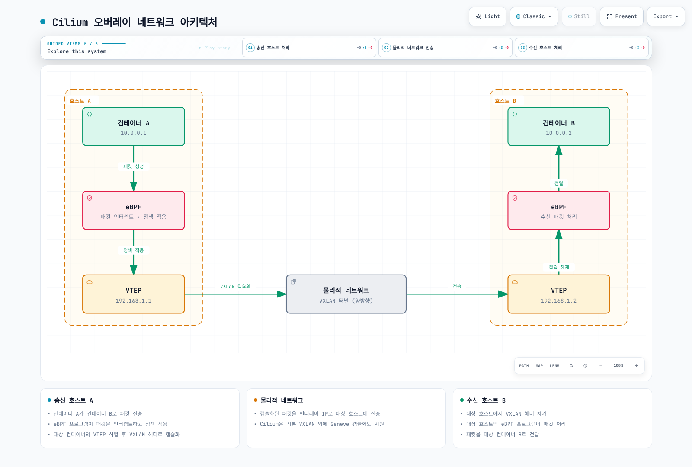

# 네트워킹 모델 및 VXLAN

> **검토 기준**: Cilium 1.20.1, 테스트된 Kubernetes 1.33–1.36, Linux 5.10+ 또는 RHEL 8.10의 4.18 같은 문서화된 동등 백포트.
> **최종 검토**: 2026년 9월 12일

> 📎 Ethernet, ARP 등 링크 계층 기초는 [네트워크 기초 Part 1](../../basics/06-network-fundamentals-part1.md)을 참고하세요.

## 실습 환경 설정

[설치 가이드](README.md)에 따라 일회용 클러스터와 아키텍처에 맞는 Cilium CLI를 준비합니다. kubectl은 API 서버와 한 minor 버전 이내로 맞춥니다. “v1.31 이상”만으로 호환성을 판단할 수 없습니다.

아래 일반 모드 예제에는 스케줄링 가능한 Linux 노드 두 개 이상, 경쟁하는 Pod CNI가 없는 환경, 작동하는 kube-proxy, 겹치지 않는 Pod CIDR이 필요합니다. Native 예제는 노드가 같은 L2 구간에 있어야 합니다. EKS ENI, GKE Dataplane V2, AKS 관리형 Cilium이나 기존 CNI 전환 절차가 아닙니다.

### 네트워크 분석 도구

분석 호스트의 지원 패키지 소스로 tcpdump/Wireshark를 설치합니다. 노드 패킷 캡처는 kubectl 노트북이 아니라 해당 노드·네트워크 네임스페이스에서 실행해야 합니다. 에이전트 monitor는 발행된 BPF 이벤트를 보여주며 전체 패킷 캡처가 아닙니다.

```bash
kubectl config current-context
kubectl -n kube-system get pods -l k8s-app=cilium -o wide
export CILIUM_POD=cilium-REPLACE-WITH-AGENT-ON-TARGET-NODE
kubectl -n kube-system exec "$CILIUM_POD" -c cilium-agent -- \
  cilium-dbg monitor --type trace -v
```

아래 명시적 VXLAN 프로필에서는 해당 워커에서 제한된 표본을 캡처합니다.

```bash
sudo tcpdump -nn -i any -c 50 'udp port 8472'
```

터널 포트를 변경했다면 실제 값을 사용합니다. 서로 다른 노드의 Pod 사이에 트래픽을 만듭니다. 같은 노드의 통신은 overlay를 지나지 않을 수 있습니다. 빈 캡처는 네트워크 장애가 아니라 노드·인터페이스·포트·경로 선택 문제일 수도 있습니다.

## 컨테이너 네트워킹 모델 비교

호스트 네임스페이스, 브리지, 노드 간 전송은 다른 측면을 설명하며 함께 존재할 수 있습니다. 보편적인 성능·보안 순위가 아닙니다.

| 모델 | 메커니즘 | 주요 고려사항 |
|---|---|---|
| Host network | Pod가 노드 네트워크 네임스페이스 공유 | 포트 충돌과 네트워크 네임스페이스 격리 감소; 애플리케이션 최고 성능을 자동 보장하지 않음 |
| Bridge | 가상 L2 브리지로 인터페이스 연결 | 노드 간에는 라우팅·전송이 추가로 필요; Cilium의 모든 endpoint에 Linux bridge가 필요한 것은 아님 |
| Overlay | IP underlay 위로 캡슐화 전송 | 헤더·처리 비용이 있지만 underlay에 모든 Pod prefix 경로가 필요하지 않음 |
| Native/underlay routing | 네트워크가 workload 주소를 라우팅 | 전달·반환 경로와 주소 계획 필요; 자체적으로 정책·암호화를 제공하거나 제거하지 않음 |

### Cilium 네트워킹 모드

Cilium의 `routingMode`는 `tunnel` 또는 `native`입니다. VXLAN/Geneve는 터널 프로토콜 선택입니다. 클라우드 IPAM 통합은 별도 설정 축으로 보통 native 데이터플레인과 조합하며 세 번째 `routingMode` 값이 아닙니다. BGP는 경로 광고 메커니즘이지 별도의 패킷 전달 모드가 아닙니다.

<span id="vxlan-기술-심층-분석"></span>

## VXLAN 기술 심층 분석

VXLAN은 내부 Ethernet 프레임을 IP 네트워크의 UDP에 담습니다. VTEP이 캡슐화·해제를 담당하고 24비트 VNI는 이론적으로 2^24개 식별자 공간을 제공합니다. Kubernetes에서 1,600만 tenant를 지원한다는 약속은 아닙니다.

표준 VXLAN 목적지 포트는 UDP 4789입니다. **Cilium VXLAN 기본값은 UDP 8472**, Geneve 기본값은 UDP 6081이며 변경할 수 있습니다. Cilium은 캡슐화 메타데이터로 보안 identity를 전달할 수 있으므로 일반 VXLAN segment 수를 Cilium tenant·정책 경계와 동일시하지 않습니다.

### VXLAN 패킷 구조

```text
외부 Ethernet
  외부 IP (IPv4 또는 IPv6)
    외부 UDP (Cilium VXLAN 기본 목적지 8472; 표준 4789)
      VXLAN 헤더 (VNI 포함 8바이트)
        내부 Ethernet
          내부 IP 패킷과 전송 계층·애플리케이션 데이터
```

IP가 UDP를 운반하며 외부 IP 헤더 자체가 외부 UDP 헤더 안에 담기는 것은 아닙니다. VXLAN 분할이 암호화·무결성·자동 NetworkPolicy 격리를 제공하지 않습니다. Underlay 경로를 적절히 제한하고 정책·암호화는 별도로 구성합니다.

### MTU 계산

추가 캡슐화·옵션이 없는 일반 VXLAN에서 내부 IP에 사용할 수 있는 크기의 감소량은 다음과 같습니다.

| Underlay IP 계열 | 외부 IP + UDP + VXLAN + 내부 Ethernet | Underlay IP MTU 1,500바이트의 내부 IP 한도 |
|---|---|---|
| IPv4 | 20 + 8 + 8 + 14 = 50바이트 | 1,450바이트 |
| IPv6 | 40 + 8 + 8 + 14 = 70바이트 | 1,430바이트 |

외부 Ethernet 헤더는 이 underlay IP MTU 밖에 있습니다. 암호화, Geneve 옵션, 다른 경로는 계산을 바꿀 수 있습니다. 유효 route MTU와 Pod veth의 device MTU가 반드시 같지는 않습니다.

Cilium 1.20.1의 Helm **`MTU`는 기반 네트워크 MTU를 덮어쓰며**, 그 뒤 Cilium이 경로 오버헤드를 계산합니다. `MTU: 0`은 자동 탐지입니다. `MTU: 1450`을 “최종 Pod payload MTU”로 생각하고 넣으면 터널 오버헤드를 다시 뺄 수 있습니다. 로컬 인터페이스 탐지로 전체 경로의 최소 MTU까지 증명하지는 못합니다.

### VXLAN과 다른 캡슐화 비교

| 기술 | 운반 방식·식별자 | 프로토콜·포트 | 경계 |
|---|---|---|---|
| VXLAN | Ethernet in UDP; 24비트 VNI | 표준 UDP 4789; Cilium 기본 8472 | 고정 기본 헤더; 암호화 아님 |
| Geneve | 확장 옵션을 가진 네트워크 가상화; 24비트 VNI | UDP 6081 | 옵션 길이에 따라 오버헤드 변화 |
| GRE | 일반 캡슐화; 기본 GRE에 VXLAN식 VNI 없음 | IP 프로토콜 47, TCP/UDP 포트 47이 아님 | 선택 확장 고려 필요; “무제한 네트워크”는 정의된 용량이 아님 |
| NVGRE | Ethernet over GRE; GRE key 내부 24비트 VSID | IP 프로토콜 47 | 식별자·flow 의미가 다르며 구현별 지원 확인 필요 |

## Cilium의 오버레이 네트워킹

플랫폼·프로필이 기본값을 바꾸지 않으면 Cilium은 VXLAN tunnel routing을 사용합니다. 노드 간 Pod 전송에는 도달 가능한 노드 주소, 허용된 터널 UDP 트래픽과 적절한 MTU가 필요합니다. Overlay가 겹치는 Pod 주소를 해결하거나 연결되지 않은 노드를 연결해 주지 않습니다.



[🔍 인터랙티브 다이어그램 보기](https://www.atomai.click/kubernetes-docs/archmaps/ko-networking-cilium-03-networking-2.html)

그림은 개념적 흐름입니다. 표시된 주소는 노드별 IPAM 계획이 아니며 실제 Pod 블록은 일관되고 겹치지 않게 할당해야 합니다. 정책은 설정된 지점에서 적용되며 출발·도착 훅은 다를 수 있습니다.

1. 제어플레인·데이터플레인 상태에서 원격 endpoint·노드를 식별합니다.
2. 소스가 해당 Pod 패킷을 캡슐화하고 underlay 노드 주소로 전송합니다.
3. 대상이 캡슐화를 해제하고 내부 패킷을 처리·전달합니다.
4. 데이터플레인 이벤트, 경로 상태, 캡처를 함께 확인합니다. 이벤트 하나가 없다는 사실만으로 원인을 단정하지 않습니다.

## 라우팅 메커니즘

### 캡슐화

Underlay에는 모든 Pod prefix 대신 노드·터널 경로가 필요합니다. 헤더와 처리 비용이 추가되며 더 큰 프레임으로 상대적인 오버헤드를 줄이려면 전체 경로가 해당 MTU를 지원해야 합니다.

### 네이티브 라우팅

노드와 underlay가 반환 트래픽까지 포함해 Pod 주소를 라우팅해야 합니다. 경로는 클라우드 네트워크, 라우터, 정적 설정 또는 별도 라우팅 구성 요소에서 얻을 수 있습니다. Native 모드 활성화가 BGP 시작이나 모든 Pod CIDR 광고를 자동 수행하지 않습니다.

`autoDirectNodeRoutes: true`는 같은 L2 네트워크를 공유하는 노드의 직접 PodCIDR 경로를 설치합니다. 여러 L2 구간에서는 `directRoutingSkipUnreachable`로 직접 도달하지 못하는 경로를 건너뛰고 별도로 작동하는 라우팅 경로를 사용할 수 있습니다. Overlay 터널로 fallback하는 기능이 아닙니다.

**Tunnel routing과 `autoDirectNodeRoutes: true`를 조합하면 안 됩니다. Cilium 1.20.1은 시작 시 이 조합을 명시적으로 거부합니다.** 기존 “하이브리드 모드” 예제는 잘못되었습니다. Native routing에서도 설정한 Geneve DSR 같은 기능별 캡슐화는 가능하지만 별도 서비스 기능입니다.

Cilium BGP Control Plane은 설정된 Pod·Service prefix를 peer에 광고합니다. **로컬 데이터플레인을 프로그래밍하지 않으므로** 누락된 클러스터 내부 경로를 자동 설치하는 구성 요소로 생각하면 안 됩니다.

## 성능 최적화 기법

모드를 비교할 때 프로토콜, payload 크기, 동시성, 노드 배치, 정책, 암호화와 프록시를 동일하게 맞추고 측정합니다. 캡슐화 헤더 하나를 없앤다고 애플리케이션 지연 감소가 보장되지 않습니다.

- **데이터 경로:** socket load balancing, 지원되는 XDP 가속과 DSR은 특정 경로의 기능입니다. VXLAN/native 모드만으로 자동 활성화되지 않습니다.
- **연결 추적:** Cilium BPF conntrack과 Linux netfilter conntrack은 다른 상태 메커니즘입니다. Netfilter 경로 우회가 기존 연결에서 Cilium 상태도 모두 사용하지 않는다는 뜻은 아닙니다.
- **맵:** 실제 용량·메모리 압력에 맞춰 크기를 정합니다. LRU 축출은 캐시에 유용하지만 모든 맵의 보편적 최적화는 아닙니다.
- **호스트 조정:** CPU/NUMA 배치, IRQ 분배·병합, queue 설정은 워크로드에 따라 도움이 되거나 악화시킬 수 있습니다. Huge page는 일반적인 Cilium 가속 스위치가 아니며 실제 사용 주체·환경의 근거가 필요합니다.

## 클라우드 제공업체별 네트워킹

| 환경 | 구분할 점 |
|---|---|
| AWS ENI IPAM | Cilium이 VPC에서 라우팅 가능한 ENI 주소를 할당하며 operator IAM·API·subnet·인스턴스 용량 조건 필요. ENI 보안 그룹과 Cilium 정책은 보완 관계이며 AWS VPC CNI의 Pod별 branch-ENI 기능과 자동으로 같아지지 않음 |
| EKS 플랫폼 | 일반 EC2 노드의 대체 CNI에는 별도 지원 책임이 있음. Fargate와 EKS Auto Mode에서는 이 일반 실습 프로필로 CNI를 교체할 수 없음. Hybrid Nodes는 별도 지원 설치 경로 사용 |
| Google Cloud | 자체 관리 upstream Cilium은 Kubernetes host-scope IPAM과 라우팅 가능한 alias range 사용 가능. 관리형 GKE Dataplane V2는 Google 관리 Cilium/`anetd`를 사용하므로 upstream 데이터플레인을 덧씌우거나 기능 노출이 같다고 가정하지 않음 |
| Azure | Azure CNI Powered by Cilium은 AKS 관리형이며 delegated IPAM 사용. Upstream Azure IPAM은 자체 관리 Azure VM/VMSS 클러스터 대상. AKS BYOCNI는 별도로 선택하는 배포 모델 |

모든 Cilium 정책이 클라우드 방화벽·보안 그룹 설정을 자동 생성하지 않습니다. 플랫폼 가이드와 지원 모델을 먼저 선택합니다.

## 실습: Cilium 네트워킹 모드 구성 및 성능 테스트

### 준비된 새 클러스터에서 한 모드 선택

공통 파일을 저장하되 Pod CIDR이 노드·Service·VPC·연결 네트워크와 겹치면 먼저 변경합니다. 선택 범위를 클러스터·kube-proxy 설정 및 native 프로필의 `ipv4NativeRoutingCIDR`과 일치시켜야 하며 파일 하나만 변경해서는 안 됩니다. `kubeProxyReplacement: false`는 작동하는 kube-proxy를 전제로 합니다. kubectl로 적용할 ConfigMap이 아니라 Helm values입니다.

**`lab-common.yaml`**

```yaml
kubeProxyReplacement: false
ipv4:
  enabled: true
ipv6:
  enabled: false
ipam:
  mode: cluster-pool
  operator:
    clusterPoolIPv4PodCIDRList:
    - 10.244.0.0/16
    clusterPoolIPv4MaskSize: 24
MTU: 0
hubble:
  enabled: true
  relay:
    enabled: true
  ui:
    enabled: true
```


아래 모드 파일 중 하나만 선택합니다. 기존 클러스터에서 CNI를 반복 재설치하지 말고 모드 비교에는 별도 일회용 클러스터를 사용합니다.

**`mode-vxlan.yaml`**

```yaml
routingMode: tunnel
tunnelProtocol: vxlan
tunnelPort: 8472
autoDirectNodeRoutes: false
```

**`mode-geneve.yaml`**

```yaml
routingMode: tunnel
tunnelProtocol: geneve
tunnelPort: 6081
autoDirectNodeRoutes: false
```

**`mode-native.yaml`**

```yaml
routingMode: native
ipv4NativeRoutingCIDR: 10.244.0.0/16
autoDirectNodeRoutes: true
```


VXLAN 선택 예제입니다.

```bash
kubectl config current-context
cilium install --version 1.20.1 --values lab-common.yaml --values mode-vxlan.yaml
cilium status --wait
```

네트워크 조건이 맞을 때만 대신 `mode-geneve.yaml` 또는 `mode-native.yaml`을 선택합니다. 예전 `tunnel: vxlan`, `ipv4-range`, `ipv4-service-range` ConfigMap 예제를 적용하지 말고 지원 Helm 필드로 IPAM을 구성합니다.

### 네트워크 성능 테스트

무관한 manifest가 `netperf-client`, `netperf-server`를 만든다고 가정하지 말고 CLI가 유지보수하는 성능 workload를 사용합니다. 준비된 일회용 클러스터에서 실행합니다.

```bash
cilium connectivity perf --test-namespace cilium-net-perf \
  --namespace-labels docs-audit-lab=cilium-networking-03 \
  --duration 10s --samples 2 --crr --udp \
  --host-net=false --pod-net=true --same-node=true --other-node=true \
  --report-dir ./cilium-net-perf-results
```

Duration은 전체 실행 10초가 아니라 각 test case·sample의 시간입니다. 테스트 workload와 네트워크 부하를 만듭니다. CLI 0.20.0은 namespace에 순번을 붙입니다(기본 단일 suite는 `cilium-net-perf-1`). 결과와 버전·배치·설정을 함께 저장하며 처리량·지연 수치를 보장하지 않습니다.

TCP request/response, 연결 생성률, stream은 다른 질문에 답합니다. 별도로 준비한 iperf3를 사용한다면 UDP 테스트에도 TCP 제어 연결과 UDP 데이터 경로가 필요합니다. TCP 5201만 노출한 Service로는 부족합니다. 제공한 UDP 전송률은 실제 달성 처리량이 아닙니다.

현재 공식 values, API schema, CLI 소스와 대조한 예제입니다. 호스트 재시작 이후 이번 감사에서 Helm template 렌더링, 클러스터 배포, 네트워크 벤치마크는 실행하지 않았습니다. 결과에 의존하기 전에 전체 플랫폼·실습 환경을 검증해야 합니다.

## 참고 자료

- [Cilium 1.20.1 routing](https://github.com/cilium/cilium/blob/v1.20.1/Documentation/network/concepts/routing.rst), [Helm values](https://github.com/cilium/cilium/blob/v1.20.1/install/kubernetes/cilium/values.yaml), [startup validation](https://github.com/cilium/cilium/blob/v1.20.1/daemon/cmd/daemon_main.go), [MTU calculation](https://github.com/cilium/cilium/blob/v1.20.1/pkg/mtu/mtu.go), [MTU option](https://github.com/cilium/cilium/blob/v1.20.1/pkg/mtu/cell.go)
- [VXLAN RFC 7348](https://www.rfc-editor.org/rfc/rfc7348.txt), [Geneve RFC 8926](https://www.rfc-editor.org/rfc/rfc8926.txt), [GRE RFC 2784](https://www.rfc-editor.org/rfc/rfc2784.txt), [NVGRE RFC 7637](https://www.rfc-editor.org/rfc/rfc7637.txt)
- [BGP Control Plane](https://github.com/cilium/cilium/blob/v1.20.1/Documentation/network/bgp-control-plane/bgp-control-plane.rst), [AWS ENI](https://github.com/cilium/cilium/blob/v1.20.1/Documentation/network/concepts/ipam/eni.rst), [EKS alternate CNI](https://docs.aws.amazon.com/eks/latest/userguide/alternate-cni-plugins.html), [GKE Dataplane V2](https://docs.cloud.google.com/kubernetes-engine/docs/concepts/dataplane-v2), [Azure IPAM](https://github.com/cilium/cilium/blob/v1.20.1/Documentation/network/concepts/ipam/azure.rst)
- [CLI 0.20.0 connectivity/perf options](https://github.com/cilium/cilium-cli/blob/v0.20.0/vendor/github.com/cilium/cilium/cilium-cli/cli/connectivity.go), [iperf3 invocation](https://software.es.net/iperf/invoking.html), [kubectl version skew](https://kubernetes.io/releases/version-skew-policy/)


[메인 페이지로 돌아가기](README.md)

## 퀴즈

[네트워킹 검증 실습과 기대 결과](../../quizzes/networking/cilium/03-networking-quiz.md)를 확인하세요.
