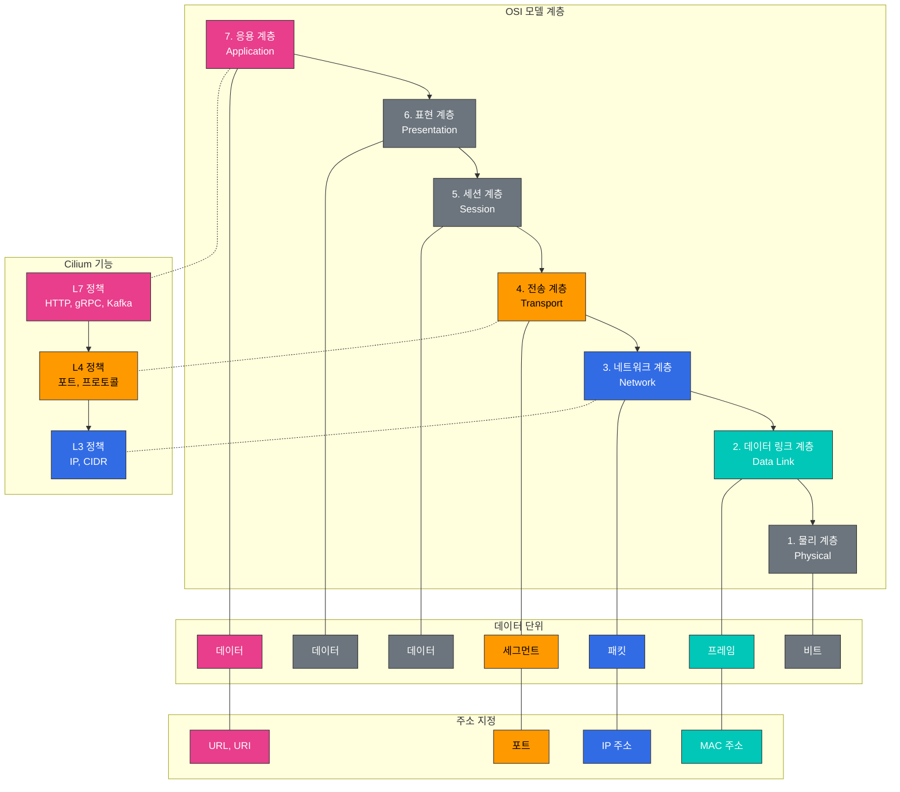

# L2-L7 네트워킹 및 로드 밸런싱

> **지원 버전**: Cilium 1.18  
> **마지막 업데이트**: 2025년 11월 24일

## 실습 환경 설정

이 문서의 예제를 따라하기 위해서는 다음과 같은 도구와 환경이 필요합니다:

### 필수 도구
- kubectl v1.31 이상
- 작동하는 Kubernetes 클러스터 (EKS, minikube, kind 등)
- Cilium CLI
- curl, jq (API 테스트용)

### L7 정책 테스트 환경 설정

```bash
# 테스트 네임스페이스 생성
kubectl create namespace l7-test

# 샘플 애플리케이션 배포
kubectl -n l7-test apply -f https://raw.githubusercontent.com/cilium/cilium/v1.14/examples/kubernetes/l7-policy/l7-application.yaml

# 배포 확인
kubectl -n l7-test get pods,svc

# 테스트 클라이언트 배포
kubectl -n l7-test run client --image=curlimages/curl --restart=Never -- sleep 3600

# 기본 연결 테스트
kubectl -n l7-test exec client -- curl -s app1-service/public
```

## OSI 모델 계층 이해 (L2, L3, L4, L7)

> **핵심 개념**: OSI(Open Systems Interconnection) 모델은 네트워크 통신을 7개의 추상화 계층으로 분류한 개념적 모델입니다.

OSI 모델은 네트워크 통신을 7개의 추상화 계층으로 분류한 개념적 모델입니다. Cilium은 이러한 다양한 계층에서 네트워킹 및 보안 기능을 제공합니다.

### OSI 모델 계층 다이어그램



### OSI 모델 계층:

1. **물리 계층 (L1)**:
   - 비트 전송을 위한 물리적 매체
   - 전기적, 기계적, 기능적 특성 정의
   - 예: 케이블, 스위치, 리피터

2. **데이터 링크 계층 (L2)**:
   - 물리적 주소 지정 (MAC 주소)
   - 프레임 형식 및 흐름 제어
   - 예: 이더넷, 스위치, 브리지

3. **네트워크 계층 (L3)**:
   - 논리적 주소 지정 (IP 주소)
   - 패킷 라우팅 및 전달
   - 예: IP, 라우터, ICMP

4. **전송 계층 (L4)**:
   - 엔드-투-엔드 연결 및 신뢰성
   - 포트 기반 주소 지정
   - 예: TCP, UDP, 포트

5. **세션 계층 (L5)**:
   - 세션 설정, 관리 및 종료
   - 대화 제어 및 동기화
   - 예: NetBIOS, RPC

6. **표현 계층 (L6)**:
   - 데이터 형식 변환 및 암호화
   - 데이터 압축 및 인코딩
   - 예: SSL/TLS, JPEG, ASCII

7. **응용 계층 (L7)**:
   - 사용자 인터페이스 및 애플리케이션 서비스
   - 프로토콜 및 API
   - 예: HTTP, DNS, FTP, gRPC

### 각 계층의 주요 특징:

| 계층 | 주소 지정 | 단위 | 장치/프로토콜 | Cilium 기능 |
|------|----------|------|--------------|------------|
| L2 | MAC 주소 | 프레임 | 스위치, 브리지 | ARP 처리, MAC 필터링 |
| L3 | IP 주소 | 패킷 | 라우터, IP | IP 라우팅, CIDR 기반 정책 |
| L4 | 포트 | 세그먼트 | TCP, UDP | 포트 기반 필터링, 연결 추적 |
| L7 | URL, 메서드 | 메시지 | HTTP, gRPC, Kafka | API 인식 필터링, 헤더 기반 라우팅 |

### L7 정책 예제

다음은 HTTP 메서드와 경로를 기반으로 트래픽을 필터링하는 Cilium L7 정책의 예입니다:

```yaml
apiVersion: cilium.io/v2
kind: CiliumNetworkPolicy
metadata:
  name: l7-policy
  namespace: l7-test
spec:
  endpointSelector:
    matchLabels:
      app: app1
  ingress:
  - fromEndpoints:
    - matchLabels:
        app: client
    toPorts:
    - ports:
      - port: "80"
        protocol: TCP
      rules:
        http:
        - method: "GET"
          path: "/public"
        - method: "POST"
          path: "/api/v1"
          headers:
          - "X-Auth-Token: ^[a-zA-Z0-9]{32}$"
```

이 정책은 다음을 허용합니다:
1. `/public` 경로에 대한 GET 요청
2. `/api/v1` 경로에 대한 POST 요청 (유효한 X-Auth-Token 헤더가 있는 경우)

다른 모든 요청은 차단됩니다.
| L7 | URI, 메서드 | 메시지 | HTTP, gRPC, Kafka | API 인식 필터링, 헤더 검사 |

## Cilium의 계층별 기능

Cilium은 L2부터 L7까지 다양한 네트워크 계층에서 기능을 제공하여 포괄적인 네트워킹 및 보안 솔루션을 제공합니다.

### L2 (데이터 링크 계층) 기능:

- **ARP 처리**: 주소 확인 프로토콜 처리
- **MAC 주소 필터링**: MAC 주소 기반 필터링
- **VLAN 태깅**: 가상 LAN 태그 처리
- **브리지 모드**: L2 브리지 모드 지원
- **프로미스큐어스 모드**: 모든 트래픽 캡처

### L3 (네트워크 계층) 기능:

- **IP 라우팅**: IP 패킷 라우팅
- **CIDR 기반 정책**: IP 주소 범위 기반 필터링
- **IP 프래그먼테이션**: IP 패킷 프래그먼트 처리
- **ICMP 처리**: ICMP 메시지 처리
- **멀티캐스트**: IP 멀티캐스트 지원

### L4 (전송 계층) 기능:

- **포트 기반 필터링**: TCP/UDP 포트 기반 필터링
- **연결 추적**: 연결 상태 추적
- **TCP 옵션 처리**: TCP 옵션 및 플래그 처리
- **소켓 기반 로드 밸런싱**: 소켓 수준 로드 밸런싱
- **세션 어피니티**: 지속적인 세션 유지

### L7 (응용 계층) 기능:

- **HTTP 필터링**: HTTP 메서드, 경로, 헤더 기반 필터링
- **gRPC 필터링**: gRPC 메서드 및 메타데이터 기반 필터링
- **Kafka 필터링**: Kafka 주제 및 작업 기반 필터링
- **DNS 필터링**: DNS 쿼리 및 응답 기반 필터링
- **TLS 검사**: TLS 인증서 및 SNI 기반 필터링

### 계층 간 통합:

Cilium은 다양한 계층의 기능을 통합하여 포괄적인 네트워킹 및 보안 솔루션을 제공합니다:

- **L3/L4 + L7 정책**: IP/포트 기반 필터링과 애플리케이션 계층 필터링 결합
- **멀티 프로토콜 지원**: HTTP, gRPC, Kafka 등 다양한 프로토콜 지원
- **계층적 정책 적용**: 다양한 계층에서 정책 적용
- **통합 관찰 가능성**: 모든 계층에서 트래픽 모니터링 및 가시성

## 서비스 메시 통합

Cilium은 Istio와 같은 서비스 메시와 통합하여 마이크로서비스 아키텍처를 위한 강력한 네트워킹, 보안 및 관찰 가능성 솔루션을 제공합니다.

### Cilium-Istio 통합 아키텍처:

```
+-------------------+
| 서비스 메시 제어 평면 |
| (Istio Pilot)     |
+--------+----------+
         |
         v
+-------------------+
| Envoy 프록시       |
| (사이드카)         |
+--------+----------+
         |
         v
+-------------------+
| Cilium eBPF       |
| (데이터 평면)       |
+-------------------+
```

### Cilium-Istio 통합 이점:

1. **성능 향상**:
   - Envoy 사이드카 바이패스로 지연 시간 감소
   - eBPF 기반 최적화된 데이터 경로

2. **보안 강화**:
   - 커널 수준 정책 적용
   - L3-L7 보안 정책 통합

3. **관찰 가능성 향상**:
   - 통합 모니터링 및 추적
   - 네트워크 흐름 가시성

4. **운영 단순화**:
   - 일관된 네트워킹 및 보안 모델
   - 중복 기능 제거

### Cilium-Istio 설정:

```bash
# Cilium 설치 (Istio 통합 활성화)
cilium install --config enable-envoy-config=true --config enable-l7-proxy=true

# Istio 설치
istioctl install --set profile=default

# Istio 사이드카 자동 주입 활성화
kubectl label namespace default istio-injection=enabled

# Cilium-Istio 통합 확인
cilium status --verbose
```

### Istio 가상 서비스와 Cilium 정책 결합:

```yaml
# istio-virtual-service.yaml
apiVersion: networking.istio.io/v1alpha3
kind: VirtualService
metadata:
  name: reviews-route
spec:
  hosts:
  - reviews
  http:
  - match:
    - headers:
        end-user:
          exact: jason
    route:
    - destination:
        host: reviews
        subset: v2
  - route:
    - destination:
        host: reviews
        subset: v1
---
# cilium-l7-policy.yaml
apiVersion: "cilium.io/v2"
kind: CiliumNetworkPolicy
metadata:
  name: "reviews-policy"
spec:
  endpointSelector:
    matchLabels:
      app: reviews
  ingress:
  - fromEndpoints:
    - matchLabels:
        app: productpage
    toPorts:
    - ports:
      - port: "9080"
        protocol: TCP
      rules:
        http:
        - method: "GET"
          path: "/reviews/.*"
```

## 로드 밸런싱 아키텍처

Cilium은 eBPF를 활용하여 효율적이고 확장 가능한 로드 밸런싱 솔루션을 제공합니다. 이는 Kubernetes 서비스를 위한 kube-proxy 대체제로 작동할 수 있습니다.

### Cilium 로드 밸런싱 모드:

1. **DSR(Direct Server Return) 모드**:
   - 응답 트래픽이 로드 밸런서를 우회하여 직접 클라이언트로 전송
   - 로드 밸런서의 병목 현상 제거
   - 대규모 응답 처리에 최적화

2. **SNAT(Source Network Address Translation) 모드**:
   - 소스 IP 주소를 로드 밸런서의 IP로 변환
   - 클라이언트 IP 보존이 필요하지 않은 경우 유용
   - 기존 kube-proxy와 유사한 동작

3. **하이브리드 모드**:
   - 상황에 따라 DSR 또는 SNAT 모드 사용
   - 유연성과 성능의 균형

### Cilium 로드 밸런싱 구성 요소:

- **서비스 맵**: 서비스 IP:포트와 백엔드 포드 매핑
- **백엔드 맵**: 백엔드 포드 정보 저장
- **리버스 NAT 맵**: 연결 추적 및 응답 처리
- **소켓 LB**: 소켓 수준에서 로드 밸런싱 수행
- **XDP 가속**: 초기 패킷 처리 가속화

### Cilium vs kube-proxy:

| 기능 | Cilium | kube-proxy |
|------|--------|------------|
| 구현 | eBPF | iptables/IPVS |
| 성능 | 높음 | 중간/낮음 |
| 확장성 | 높음 | 중간 |
| 연결 추적 | 선택적 | 항상 활성화 |
| DSR 지원 | 기본 지원 | 제한적 (IPVS 모드만) |
| 소켓 수준 LB | 지원 | 미지원 |
| L7 인식 | 지원 | 미지원 |
| 관찰 가능성 | 높음 | 제한적 |

### Cilium 로드 밸런싱 구성:

```yaml
# cilium-config.yaml
apiVersion: v1
kind: ConfigMap
metadata:
  name: cilium-config
  namespace: kube-system
data:
  # kube-proxy 대체 활성화
  kube-proxy-replacement: "strict"
  
  # DSR 모드 활성화
  enable-dsr: "true"
  
  # 외부 서비스 로드 밸런싱
  enable-external-ips: "true"
  
  # 노드 포트 가속화
  enable-node-port: "true"
  
  # XDP 가속화
  enable-xdp-acceleration: "true"
```

## 마스커레이딩(Masquerading)

마스커레이딩은 내부 네트워크의 IP 주소를 외부 네트워크와 통신할 때 다른 IP 주소로 변환하는 프로세스입니다. Cilium은 다양한 마스커레이딩 구성 및 구현 모드를 지원합니다.

### 1. 마스커레이딩 구성

Cilium에서 마스커레이딩은 다음과 같은 목적으로 사용됩니다:
- 클러스터 내부 IP 주소를 외부 네트워크에 숨기기
- 클러스터 외부 서비스에 대한 액세스 제공
- 네트워크 주소 변환(NAT) 구현

**구성 옵션**:
- `enable-ipv4-masquerade`: IPv4 마스커레이딩 활성화/비활성화
- `enable-ipv6-masquerade`: IPv6 마스커레이딩 활성화/비활성화
- `masquerade-all`: 모든 트래픽에 대한 마스커레이딩 활성화
- `masquerade-interfaces`: 마스커레이딩을 적용할 인터페이스 지정

**구성 예제**:
```yaml
# cilium-masquerade-config.yaml
apiVersion: v1
kind: ConfigMap
metadata:
  name: cilium-config
  namespace: kube-system
data:
  enable-ipv4-masquerade: "true"
  enable-ipv6-masquerade: "false"
  masquerade-all: "false"
  ipv4-native-routing-cidr: "10.0.0.0/8"
```

### 2. 구현 모드

Cilium은 두 가지 마스커레이딩 구현 모드를 지원합니다: iptables 기반 및 eBPF 기반.

**iptables 기반 마스커레이딩**:
- 전통적인 iptables 규칙을 사용하여 마스커레이딩 구현
- 모든 Linux 배포판과 호환
- 대규모 환경에서 성능 제한

**eBPF 기반 마스커레이딩**:
- eBPF 프로그램을 사용하여 마스커레이딩 구현
- 향상된 성능 및 확장성
- 최신 Linux 커널 필요

**구성 예제**:
```yaml
# cilium-ebpf-masquerade-config.yaml
apiVersion: v1
kind: ConfigMap
metadata:
  name: cilium-config
  namespace: kube-system
data:
  enable-ipv4-masquerade: "true"
  enable-bpf-masquerade: "true"  # eBPF 기반 마스커레이딩 활성화
```

## IPv4 프래그먼트 처리

IPv4 프래그먼트는 MTU(Maximum Transmission Unit)보다 큰 IP 패킷을 여러 작은 패킷으로 분할한 것입니다. Cilium은 IPv4 프래그먼트를 처리하기 위한 다양한 메커니즘을 제공합니다.

### 1. 프래그먼트 처리 메커니즘

Cilium은 다음과 같은 IPv4 프래그먼트 처리 메커니즘을 지원합니다:
- **프래그먼트 추적**: 프래그먼트를 추적하고 재조립
- **프래그먼트 매칭**: 첫 번째 프래그먼트를 기반으로 정책 결정
- **LPM(Longest Prefix Match) 기반 라우팅**: 프래그먼트에 대한 효율적인 라우팅

### 2. 프래그먼트 관련 구성

Cilium은 IPv4 프래그먼트 처리를 위한 다양한 구성 옵션을 제공합니다:
- `enable-ipv4-fragment-tracking`: IPv4 프래그먼트 추적 활성화/비활성화
- `fragment-tracking-timeout`: 프래그먼트 추적 타임아웃 설정
- `max-fragments-per-flow`: 흐름당 최대 프래그먼트 수 설정

**구성 예제**:
```yaml
# cilium-fragment-config.yaml
apiVersion: v1
kind: ConfigMap
metadata:
  name: cilium-config
  namespace: kube-system
data:
  enable-ipv4-fragment-tracking: "true"
  fragment-tracking-timeout: "60"  # 초 단위
  max-fragments-per-flow: "10"
```

### 3. 프래그먼트 처리 고려 사항

IPv4 프래그먼트 처리 시 고려해야 할 사항:
- **성능 영향**: 프래그먼트 추적 및 재조립은 추가 리소스를 소비합니다.
- **보안 영향**: 프래그먼트는 보안 정책을 우회하는 데 사용될 수 있습니다.
- **MTU 최적화**: 프래그먼테이션을 방지하기 위해 MTU를 최적화하는 것이 좋습니다.
- **Path MTU Discovery**: PMTUD를 활성화하여 프래그먼테이션을 방지할 수 있습니다.

**모범 사례**:
- 가능한 경우 프래그먼테이션을 방지하기 위해 MTU를 일관되게 구성합니다.
- 오버레이 네트워크를 사용하는 경우 캡슐화 오버헤드를 고려하여 MTU를 조정합니다.
- 프래그먼트 추적을 활성화하여 프래그먼트 기반 공격을 방지합니다.
- 네트워크 정책에서 프래그먼트 처리를 고려합니다.

## 실습: 로드 밸런싱 및 마스커레이딩 구성

### 1. kube-proxy 대체 모드 구성:

```bash
# kube-proxy 대체 모드 활성화
cilium install --config kube-proxy-replacement=strict

# 상태 확인
cilium status --verbose
```

### 2. DSR 모드 구성:

```bash
# DSR 모드 활성화
cilium install --config enable-dsr=true

# 서비스 생성
kubectl create deployment echo --image=cilium/json-mock
kubectl expose deployment echo --port=8080 --target-port=80

# 서비스 테스트
kubectl run client --rm -it --image=busybox -- wget -O- echo:8080
```

### 3. 마스커레이딩 구성:

```bash
# eBPF 기반 마스커레이딩 활성화
cilium install --config enable-ipv4-masquerade=true --config enable-bpf-masquerade=true

# 외부 서비스 접근 테스트
kubectl run client --rm -it --image=busybox -- wget -O- google.com
```

### 4. IPv4 프래그먼트 처리 구성:

```bash
# 프래그먼트 추적 활성화
cilium install --config enable-ipv4-fragment-tracking=true

# MTU 설정
cilium install --config mtu=1450
```

[메인 페이지로 돌아가기](README.md)

## 퀴즈

이 장에서 배운 내용을 테스트하려면 [주제 퀴즈](../../quizzes/networking/cilium/05-l2-l7-networking-quiz.md)를 풀어보세요.
