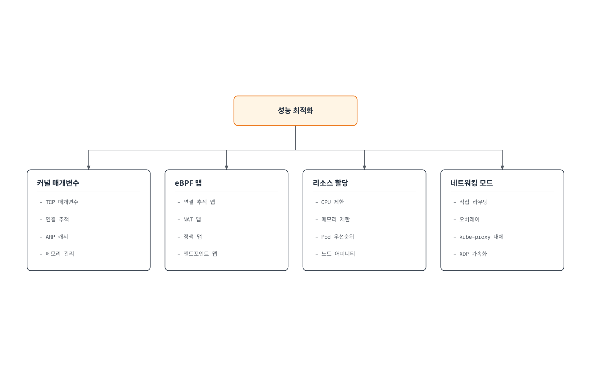

# 고급 주제 및 실제 사례

> **검토 기준**: Cilium 1.20.1, Cilium CLI 0.20.0, Hubble CLI 1.19.4.
> **최종 검토**: 2026년 9월 12일. Cilium 1.20의 Kubernetes 호환 범위는 1.33–1.36이며 아래 과거 측정은 원래 환경을 유지합니다.

## 실습 환경 설정

[설치 전제 조건](README.md)을 따르고 스케줄링 가능한 Linux 노드가 최소 2개인 폐기 가능한 테스트 클러스터를 사용합니다. 결과에는 OS, 커널, Cilium 설정, 토폴로지, MTU, 정책, 암호화와 테스트 워크로드를 기록합니다. kubectl은 API 서버의 지원 버전 차이 범위에 맞춥니다. 아래 명령에는 Helm, jq, Cilium/Hubble CLI가 필요하며 `kubectl top`에는 메트릭 API도 필요합니다.

### 성능 테스트 환경 설정

변경 전에 기존 배포를 기록합니다.

```bash
cilium version
cilium status --verbose
kubectl version
kubectl get nodes -o wide
kubectl -n kube-system get pods -l k8s-app=cilium -o wide
helm get values cilium --namespace kube-system -o yaml > cilium-current-values.yaml
```

현재 CLI가 서로 맞는 테스트 워크로드를 생성할 수 있습니다. 네트워크 부하 발생과 테스트 리소스 생성이 허용되는 환경에서만 실행합니다.

```bash
cilium connectivity perf --test-namespace cilium-advanced-perf \
  --namespace-labels docs-audit-lab=cilium-advanced-07 \
  --duration 10s --samples 2 --crr --udp \
  --host-net=false --pod-net=true --same-node=true --other-node=true \
  --report-dir ./cilium-advanced-perf-results
```

기본 동시성 1에서는 인자에 접미사가 없어도 **`cilium-advanced-perf-1`** 네임스페이스를 사용합니다. 테스트 전에 해당 이름이 사용 중이지 않은지 확인합니다. `--duration`은 전체 실행이 아니라 시나리오·표본마다 적용되며, 스케줄링과 준비 및 여러 경우의 조합에 시간이 추가됩니다. 읽기 전용 진단이 아니라 실제 부하 테스트입니다.

동일 노드와 다른 노드, TCP 요청·응답과 UDP를 구분하고 실제 CPU·메모리·패킷 손실을 비교합니다. 계획한 변경 하나씩 반복합니다. 성공한 실행이 애플리케이션 SLO, 프로덕션 용량 한계나 모든 정책 경로를 증명하지는 않습니다. 문서 감사에서는 클러스터 생성이나 부하 실행 없이 명령 계약을 검증했습니다.

## 성능 튜닝 및 문제 해결

### 성능 튜닝 아키텍처



[인터랙티브 다이어그램 보기](https://www.atomai.click/kubernetes-docs/archmaps/ko-networking-cilium-07-advanced-topics-0.html)

그림은 조사 영역을 분류하며 모든 설정을 늘리거나 보안 제어를 끄라고 권장하지 않습니다.

### 성능 튜닝 영역

| 영역 | 측정 대상과 설정의 의미 |
| --- | --- |
| 소켓 대기열 | `net.core.somaxconn`은 소켓 listen backlog 한계이며 `net.ipv4.tcp_max_syn_backlog`는 리스너별 SYN_RECV 대기 요청과 관련됩니다. 서버의 accept 동작과 해당 네트워크 네임스페이스를 확인합니다. |
| 이웃 항목 | `net.ipv4.neigh.default.gc_thresh1`, `gc_thresh2`, `gc_thresh3`는 서로 다른 가비지 컬렉션 임계값입니다. 단일 `gc_thresh` 설정은 없습니다. |
| 연결 추적 | Netfilter의 `nf_conntrack_max`와 Cilium BPF CT 맵은 별개입니다. 전자를 늘려도 후자의 크기가 바뀌지 않습니다. |
| BPF 맵 | 맵 압력, 삽입 실패, 항목 변동과 메모리를 관측합니다. CT, NAT, LB, 엔드포인트별 정책 맵은 범위와 크기 계산 방식이 다릅니다. |
| CPU와 메모리 | 에이전트, operator, Envoy, Hubble을 따로 측정합니다. requests는 스케줄링에 영향을 주고 CPU limits는 제한, memory limits는 OOM 종료를 일으킬 수 있습니다. 모든 한계를 올리는 것은 진단이 아닙니다. |
| 네트워크 경로 | native/tunnel 라우팅, MTU, masquerading, 암호화와 서비스 전달을 식별합니다. XDP 가속은 지원 경로·드라이버에 적용되며 kube-proxy 대체의 필수 조건이 아닙니다. |

성능 비교에서 보안·라우팅 요구 사항을 유지합니다. 필수 암호화나 정책을 제거해 빨라진 결과는 동등한 구성의 비교가 아닙니다.

### 맵 크기 조정

다음은 압력을 측정한 뒤 검토할 **변경 후보**입니다. 완전한 버전별 릴리스 값에 병합하며, 작은 조각으로 전체 Cilium ConfigMap을 교체하지 않습니다.

```yaml
# map-sizing-values.yaml
bpf:
  mapDynamicSizeRatio: 0.005
```

`0.005`는 노드 메모리의 명목상 **0.5%**를 동적 크기 계산에 사용한다는 뜻입니다. 5%도 아니고 모든 Cilium 메모리의 하드 한계도 아닙니다. 예를 들어 32 GiB × 0.005는 맵 한계, 반올림과 다른 할당을 반영하기 전 163.84 MiB입니다. CT, NAT, 이웃과 소켓 역방향 NAT 등 큰 맵에 적용되며 다른 맵과 사용자 공간 메모리는 별도입니다.

명시적 `bpf.ctTcpMax`, `bpf.ctAnyMax`, `bpf.natMax` 값은 해당 맵의 동적 크기 계산을 대체합니다. NAT와 CT 용량의 관계를 유지하고 시작 시 결정된 실제 크기를 확인합니다. 맵 증가에는 메모리가 더 필요하며 맵 교체는 기존 연결을 방해할 수 있습니다.

분산 LRU(`bpf.distributedLRU.enabled`)는 CPU별 풀로 경합을 줄이는 대신 메모리·퇴출 동작이 달라집니다. 동적 크기 계산이 필요하며 활성화 시 맵을 다시 생성합니다. 공식 고성능 프로필은 모든 환경에 실시간으로 켜는 스위치가 아닙니다. 준비한 새 노드나 문서화된 마이그레이션 절차로 데이터 경로 변경을 도입합니다.

이전의 `proxy-max-memory-percentage`, `proxy-max-threads`, `enable-xdp`, `tunnel: disabled`, `kube-proxy-replacement: strict`는 현재 구성 예제로 사용할 수 없습니다. `envoy.resources`, `routingMode`, 불리언 `kubeProxyReplacement`, `loadBalancer.acceleration` 등 지원되는 차트 설정을 전제 조건과 함께 사용합니다.

### Hubble 비용과 이벤트 손실

큰 이벤트 큐는 순간적인 유입을 흡수할 수 있지만 메모리를 사용하며 지속적인 처리 능력 부족을 해결하거나 CPU 사용량을 줄이지는 않습니다.

```yaml
# hubble-queue-values.yaml
hubble:
  eventQueueSize: 32768
```

반복 추적 이벤트가 처리량의 대부분이라면 더 긴 집계 간격을 별도 변경으로 평가합니다.

```yaml
# hubble-aggregation-values.yaml
bpf:
  monitorAggregation: medium
  monitorInterval: 10s
```

실제 차트 필드는 `bpf.events.monitorInterval`이 아니라 **`bpf.monitorInterval`**입니다. 배포 전에 렌더링된 `monitor-aggregation-interval`을 확인합니다. 집계 증가, 이벤트 속도 제한과 이벤트 유형 비활성화는 monitor, Hubble 메트릭과 내보내기의 관측 데이터를 줄입니다. Hubble 이벤트 손실 자체가 애플리케이션 패킷 드롭을 의미하지는 않으므로 관측 손실과 데이터 경로 드롭을 모두 확인합니다.

### 고급 데이터 경로 전제 조건

| 기능 | 확인할 전제 조건과 제약 |
| --- | --- |
| netkit | 이 검토 버전에서 Beta이며 Linux 6.8 이상과 BPF 호스트 라우팅이 필요합니다. 에이전트 재시작만으로 기존 veth Pod의 장치를 바꿀 수 없습니다. |
| BIG TCP | 주소군별 커널·NIC 요구 사항이 있습니다. 통합 튜닝 프로필에는 Linux 6.8 이상과 지원 NIC가 필요하며 단순한 MTU 증가가 아닙니다. |
| BPF 호스트 라우팅 | 호환되는 kube-proxy 대체와 BPF masquerading이 필요합니다. 호스트 netfilter 훅을 우회하므로 Istio 등 해당 훅에 의존하는 연동을 확인합니다. |
| XDP 서비스 가속 | native XDP 지원 장치와 지원되는 외부 서비스 전달 경로가 필요합니다. 드라이버·플랫폼 지침을 따르고 실행 상태를 확인합니다. |
| Bandwidth Manager | Pod별 egress는 EDT, ingress는 eBPF 토큰 버킷을 사용합니다. 대역폭 annotation의 `10M`은 10 MB/s가 아니라 10 Mbit/s입니다. |
| Pod용 BBR | Bandwidth Manager, Linux 5.18 이상과 BPF 호스트 라우팅이 필요하며 새 Pod부터 적용됩니다. 호스트 전용 BBR은 별도 옵션입니다. |

대역폭 집행에는 egress L7 Cilium 정책과 kind 같은 중첩 네트워크 네임스페이스 관련 제약이 있습니다. 일반 Cilium 설치 요구 사항과 구분합니다. 하나의 튜닝 프로필이 모든 메시·클라우드·커널 조합의 동작을 증명하지는 않습니다.

### 대상 노드를 지정한 문제 해결 명령

클러스터 작업에는 독립 `cilium` CLI를, 로컬 엔드포인트·정책·맵에는 **관련 에이전트 내부의 `cilium-dbg`**를 사용합니다. 임의의 첫 에이전트 대신 조사할 노드를 선택합니다.

```bash
set -euo pipefail
: "${NODE_NAME:?Set NODE_NAME to the node being investigated}"
CILIUM_POD=$(kubectl -n kube-system get pods -l k8s-app=cilium \
  --field-selector "spec.nodeName=$NODE_NAME,status.phase=Running" -o json |
  jq -er 'if (.items | length) == 1
then .items[0].metadata.name
else error("expected exactly one running Cilium Pod on the selected node")
end')
kubectl -n kube-system exec "$CILIUM_POD" -c cilium-agent -- cilium-dbg status --verbose
kubectl -n kube-system exec "$CILIUM_POD" -c cilium-agent -- cilium-dbg endpoint list
kubectl -n kube-system exec "$CILIUM_POD" -c cilium-agent -- cilium-dbg policy get
kubectl -n kube-system exec "$CILIUM_POD" -c cilium-agent -- cilium-dbg policy selectors
kubectl -n kube-system exec "$CILIUM_POD" -c cilium-agent -- cilium-dbg map list
kubectl -n kube-system exec "$CILIUM_POD" -c cilium-agent -- cilium-dbg bpf metrics list
kubectl -n kube-system logs "$CILIUM_POD" -c cilium-agent --since=10m --tail=200
```

엔드포인트 ID는 해당 에이전트에 로컬입니다. 그 에이전트의 목록에서 ID를 선택합니다.

```bash
: "${CILIUM_POD:?Select the owning Cilium Pod first}"
: "${ENDPOINT_ID:?Read the endpoint ID from the selected agent endpoint list}"
kubectl -n kube-system exec "$CILIUM_POD" -c cilium-agent -- \
  cilium-dbg endpoint get "$ENDPOINT_ID"
# Stream local BPF drop events; stop with Ctrl-C.
kubectl -n kube-system exec "$CILIUM_POD" -c cilium-agent -- \
  cilium-dbg monitor --type drop
```

`cilium-dbg map list`는 에이전트 맵 관리자가 아는 열린 맵을 나열하며 모든 커널 BPF 맵의 목록이 아닙니다. `cilium-dbg monitor`는 발생한 BPF 이벤트와 선택적 캡처 추적을 표시하며 모든 패킷의 무손실 tcpdump가 아닙니다. 큰 CT 맵 전체 출력은 비용이 들 수 있으므로 `cilium-dbg bpf ct list global` 전에 메트릭과 영향받은 노드를 확인합니다.

Hubble에는 [보안 및 가시성](06-security-visibility.md)의 로컬 Relay 연결부터 준비합니다.

```bash
hubble status
hubble observe --protocol tcp --verdict DROPPED --since 1h
hubble observe --protocol dns --from-label k8s:app=frontend --last 100
hubble observe --http-status '5+' --from-namespace production --last 100
```

`--type`은 DNS 레코드 A가 아니라 이벤트 유형을 선택합니다. 질의 유형을 구분하려면 DNS 흐름 필드를 확인합니다. HTTP 상태 필터는 `5xx`가 아니라 `5+`입니다. `--since 1h`도 보존 이력과 이벤트 가용성에 제한되며 이미 덮어쓴 한 시간의 이벤트를 복구하지 못합니다.

### 일반적인 문제 해결 시나리오

| 증상 | 수집할 근거 | 다음 판단 |
| --- | --- | --- |
| CT/NAT 압력 | 맵 압력, 삽입·드롭 사유, 연결 변동, 실제 구성 크기 | 크기 변경 전에 연결 변동·시간 제한과 메모리 여유를 조사합니다. |
| OOM 또는 CPU 포화 | 종료 사유, CPU·메모리 이력, throttling, 프록시·Hubble 부하 | 해당 구성 요소를 식별하고 자원이나 워크로드를 조정합니다. |
| 예상 밖 정책 결과 | 네임스페이스·레이블, 엔드포인트 정책 revision, 프록시 오류, Hubble 판정 | 방향, 허용 합산과 거부 우선 적용을 확인합니다. 일반 허용은 우선순위 순서의 방화벽 목록이 아닙니다. |
| 노드 간 실패 | DNS, 노드·Pod 라우팅, MTU, 터널·암호화 포트, 플랫폼 방화벽 | 양방향 경로를 검증합니다. BGP 세션만으로 실제 데이터 경로가 검증되지는 않습니다. |
| 업그레이드 회귀 | 이전·현재 값, 버전 노트, 전체 구성 요소 버전, 프록시 재연결 | 준비한 지원 롤백 경로를 사용하고 기능 호환성을 조사합니다. |

## 대규모 배포 전략

용량 계획에는 노드·Pod 밀도, Service와 백엔드, ID, 정책 확장, API watch 트래픽, IPAM 할당과 흐름량을 포함합니다. 정책 객체 수만으로 엔드포인트별 맵 비용을 알 수는 없습니다.

### 대규모 배포 아키텍처

```text
관리 / GitOps / 공유 모니터링
         | 설정과 수집된 텔레메트리
         +-------------------------+
         v                         v
  워크로드 클러스터 A         워크로드 클러스터 B
  - Cilium Operator          - Cilium Operator
  - 노드별 에이전트            - 노드별 에이전트
  - 로컬 Hubble 서버          - 로컬 Hubble 서버
  - Relay/내보내기 구성        - Relay/내보내기 구성
         |                         |
         +--- 선택적 ClusterMesh 메타데이터/데이터 경로
```

중앙 관리 클러스터가 각 관리 대상 클러스터의 operator를 대체하지 않습니다. 클러스터마다 operator와 에이전트를 산정하며 차트의 operator 복제본과 안티어피니티를 만족할 노드가 필요합니다. 구성된 수집기로 메트릭·로그를 모읍니다. ClusterMesh에는 주소, ID, 신뢰와 연결성 설계가 필요하며 모든 정책 리소스를 자동 복제하지는 않습니다.

`ciliumEndpointSlice.enabled`는 Kubernetes EndpointSlice와 다른 선택적 Cilium 기능입니다. 이전 ConfigMap의 `enable-endpoint-slice` 플래그가 아닙니다. 활성화 전에 버전·기능 호환성을 평가합니다. 현재 Egress Gateway는 CiliumEndpointSlice나 ClusterMesh와 함께 사용할 수 없습니다.

Egress Gateway는 선택된 트래픽을 예측 가능한 게이트웨이 주소로 **SNAT**하며 원래 Pod 출발지 주소를 보존하지 않습니다. AWS 같은 플랫폼별 조건을 포함해 게이트웨이 인터페이스·IP와 라우팅이 준비되어 있어야 합니다. BPF masquerading, kube-proxy 대체와 CRD ID 할당이 필요합니다. 새 Pod는 egress 정책 적용 전 잠시 트래픽을 보낼 수 있으므로 즉시 적용되는 fail-closed 출발지 IP 보장으로 취급하지 않습니다.

### 롤아웃과 복구

원하는 설정, 정책, 주소 풀 정의와 필요한 신뢰·키 자료에 적절한 버전 관리와 백업 제어를 적용합니다. 복구를 연습하며 ConfigMap 백업만으로 IPAM이나 암호화 복구 계획이 완성되지는 않습니다.

마이너 업그레이드는 현재 마이너의 최신 패치, 필수 preflight를 거쳐 **한 마이너씩** 수행합니다. 업그레이드 지침에 따라 최초 `upgradeCompatibility`를 유지하고 이름 변경·제거된 값을 옮깁니다. 마이너 버전 간에 `--reuse-values`를 사용하지 않습니다. 에이전트, operator와 다른 Cilium 구성 요소는 같은 버전으로 수렴해야 합니다.

사용자 공간 프록시를 통과하는 트래픽은 업그레이드 중 재연결될 수 있고 버퍼의 관측 이벤트도 손실될 수 있습니다. 새 기능·리소스는 롤백 전에 제거나 이전이 필요할 수 있습니다. 일반 애플리케이션의 블루/그린 배포나 Helm rollback은 가역적 무중단 CNI 마이그레이션을 보장하지 않습니다.

## 실제 사용 사례 연구

### 문서화된 과거 확장성 실험

공식 확장성 보고서는 Google Cloud의 **워커 1,000개**, 컨트롤러 3개와 커널 **5.4.0-1009-gcp**를 설명합니다. 설정 부분에 Cilium 버전이 명시되지 않았으므로 이를 Cilium 1.20.1 벤치마크로 다시 표시하면 안 됩니다. 해당 워크로드의 자원 소비와 수렴을 다루는 보고서이며 현재 지원 행렬이나 용량 보장이 아닙니다.

상태 점검 변경과 높은 롤아웃 동시성은 그 실험의 선택입니다. 인용할 때 실제 테스트 조건을 유지하고 운영 구성은 따로 검증합니다.

### 설계 시나리오 1: 대규모 전자 상거래

많은 서비스와 요청량에 대해 eBPF 서비스 전달, ID/L7 정책, Hubble과 선택적 ClusterMesh를 평가합니다. 같은 토폴로지와 보호 조건에서 p95/p99 지연, 처리량, 오류, 요청당 CPU와 정책 수렴을 측정합니다. 여기에는 보편적 개선율을 뒷받침하는 실명 구현 사례나 재현 가능한 측정이 없습니다.

### 설계 시나리오 2: 금융 서비스

최소 권한 정책, 범위에 맞는 전송·애플리케이션 암호화, 통제된 흐름 내보내기를 애플리케이션/API 감사 기록과 결합합니다. 키 교체, 이벤트 손실, 보존과 클러스터 간 신뢰를 시험합니다. Hubble 흐름만으로 완전한 규제 감사 근거가 되거나 감사 기간 단축이 보장되지는 않습니다.

### 설계 시나리오 3: 통신과 엣지

현실적인 트래픽에서 NIC·드라이버, CPU 스케줄링, 서비스 전달 경로, 패킷 크기, 손실과 지연을 평가합니다. XDP는 조건에 맞는 전달 경로에 도움이 될 수 있습니다. 그 자체가 5G 사용자 평면 기능을 구현하거나 임의 하드웨어의 고정 초당 패킷 수를 증명하지는 않습니다. 원격 사이트에는 underlay와 명시적 장애·복구 시험이 필요합니다.

## 미래 로드맵 및 발전 방향

커뮤니티 로드맵은 **일정을 약속하지 않는다**고 명시합니다. 희망하는 연동 목록을 출시 약속으로 취급하지 말고 특정 기능의 릴리스 노트, 승인된 설계와 이슈를 추적합니다.

| 영역 | 조사할 질문 |
| --- | --- |
| eBPF와 커널 | 제안한 경로에는 어떤 커널 기능, 백포트, NIC와 아키텍처가 필요한가요? CO-RE가 없는 커널 기능을 제공하지는 않습니다. |
| 네트워킹과 IPv6 | 선택한 릴리스에서 어떤 IPAM·라우팅·정책·외부 연동 조합을 지원하나요? |
| 보안과 관측성 | Cilium 네트워크 정책, Beta 워크로드 인증·암호화, Tetragon 런타임 집행, 외부 탐지·저장 시스템 중 어디에 해당하나요? |
| 클라우드·메시·서버리스 | 관리형 플랫폼이 해당 CNI·호스트 훅을 허용하나요? 메시의 트래픽 가로채기와 인증이 유지되나요? |
| 엣지·IoT·5G·AI/ML | 추가 장치·전송·런타임·가속기 연동이 무엇인가요? Kubernetes CNI만으로 모든 애플리케이션별 기능이 성립하지는 않습니다. |

프로젝트 이슈, 설계 제안, 문서와 커뮤니티 논의로 참여합니다. 상용 지원과 관리형 배포판은 별도의 기능·지원 계약을 가집니다.

## 현재 BGP 구성

이전의 `CiliumBGPPeeringPolicy` 예제는 이 검토 버전에서 사용할 수 없습니다. 현재 구성은 클러스터·노드 선택, 피어 설정과 광고할 접두사를 **`cilium.io/v2`** 리소스 3개로 구분합니다.

이는 격리된 라우팅 실습용 구성 모델이며 완전한 클라우드 라우터 설정이 아닙니다. `PodCIDR` 광고를 위한 cluster-pool 또는 Kubernetes host-scope IPAM, 접근 가능한 피어 라우터와 그 설정, 의도적으로 `cilium-bgp=lab` 레이블을 지정한 노드를 가정합니다. `192.0.2.1`은 문서용 주소이므로 `/32` 없는 실제 피어 IP로 바꿉니다. Multi-pool IPAM은 다른 광고 유형과 풀 선택을 사용합니다.

```yaml
# bgp-values.yaml
bgpControlPlane:
  enabled: true
```
```yaml
# bgp-lab.yaml
apiVersion: cilium.io/v2
kind: CiliumBGPClusterConfig
metadata:
  name: lab-bgp
spec:
  nodeSelector:
    matchLabels:
      cilium-bgp: lab
  bgpInstances:
  - name: asn-64512
    localASN: 64512
    peers:
    - name: router-64513
      peerASN: 64513
      peerAddress: 192.0.2.1
      peerConfigRef:
        name: lab-peer
---
apiVersion: cilium.io/v2
kind: CiliumBGPPeerConfig
metadata:
  name: lab-peer
spec:
  timers:
    connectRetryTimeSeconds: 120
    holdTimeSeconds: 90
    keepAliveTimeSeconds: 30
  gracefulRestart:
    enabled: true
    restartTimeSeconds: 120
  families:
  - afi: ipv4
    safi: unicast
    advertisements:
      matchLabels:
        advertise: lab
---
apiVersion: cilium.io/v2
kind: CiliumBGPAdvertisement
metadata:
  name: lab-pod-cidrs
  labels:
    advertise: lab
spec:
  advertisements:
  - advertisementType: PodCIDR
```

피어의 광고 선택자는 `advertise: lab`과 일치하며 `peerConfigRef`는 `lab-peer`로 연결됩니다. Graceful Restart에는 호환되는 피어 동작과 적절한 타이머가 필요하며 실패한 데이터 경로나 애플리케이션 가용성을 보장하지 못합니다. BGP는 연결성을 광고하지만 **로컬 데이터 경로 라우트를 설치하지 않으며** DNS 레코드도 생성하지 않습니다.

라우팅 실습에서 적절한 구성을 준비·적용한 뒤 Cilium 상태와 외부 라우터가 받은 경로를 모두 확인합니다.

```bash
kubectl get ciliumbgpclusterconfigs,ciliumbgppeerconfigs,ciliumbgpadvertisements
cilium bgp peers
cilium bgp routes advertised ipv4 unicast
```

실제 왕복 트래픽은 별도로 시험합니다. 오래전부터 존재한 HTTP 정책이나 임의 개선율을 과거 릴리스의 새 기능으로 설명하지 않습니다. Cilium 1.18 등 이전 마이너에서 옮길 때는 정확한 릴리스 노트를 확인합니다.

## 다음 단계

[IPAM과 정책](04-ipam-policy.md), [L2–L7 네트워킹](05-l2-l7-networking.md), [보안·가시성](06-security-visibility.md)에서 개별 경로를 검증합니다. 결과마다 벤치마크 조건과 한계를 기록하고 단계적 롤아웃과 복구를 연습합니다.

성능 테스트가 만든 정확한 네임스페이스를 확인한 뒤 리소스를 제거합니다.

```bash
set -eu
PERF_NS=cilium-advanced-perf-1
LAB_OWNER=$(kubectl get namespace "$PERF_NS" -o jsonpath='{.metadata.labels.docs-audit-lab}')
test "$LAB_OWNER" = cilium-advanced-07
kubectl delete namespace "$PERF_NS"
```

## 공식 근거

- [Tuning guide](https://raw.githubusercontent.com/cilium/cilium/v1.20.1/Documentation/operations/performance/tuning.rst)
- [Chart values](https://raw.githubusercontent.com/cilium/cilium/v1.20.1/install/kubernetes/cilium/values.yaml)
- [Chart ConfigMap template](https://raw.githubusercontent.com/cilium/cilium/v1.20.1/install/kubernetes/cilium/templates/cilium-configmap.yaml)
- [Map sizing](https://raw.githubusercontent.com/cilium/cilium/v1.20.1/Documentation/network/ebpf/maps.rst)
- [Map sizing implementation](https://raw.githubusercontent.com/cilium/cilium/v1.20.1/pkg/option/config.go)
- [Upgrade guide](https://raw.githubusercontent.com/cilium/cilium/v1.20.1/Documentation/operations/upgrade.rst)
- [Upgrade limitations](https://raw.githubusercontent.com/cilium/cilium/v1.20.1/Documentation/operations/upgrade-warning.rst)
- [BGP configuration](https://raw.githubusercontent.com/cilium/cilium/v1.20.1/Documentation/network/bgp-control-plane/bgp-control-plane-configuration.rst)
- [BGP operation](https://raw.githubusercontent.com/cilium/cilium/v1.20.1/Documentation/network/bgp-control-plane/bgp-control-plane-operation.rst)
- [Bandwidth Manager](https://raw.githubusercontent.com/cilium/cilium/v1.20.1/Documentation/network/kubernetes/bandwidth-manager.rst)
- [Egress Gateway](https://raw.githubusercontent.com/cilium/cilium/v1.20.1/Documentation/network/egress-gateway/egress-gateway.rst)
- [Historical scalability report](https://raw.githubusercontent.com/cilium/cilium/v1.20.1/Documentation/operations/performance/scalability/report.rst)
- [Community roadmap](https://raw.githubusercontent.com/cilium/cilium/v1.20.1/Documentation/community/roadmap.rst)
- [Linux IP sysctls](https://www.kernel.org/doc/html/latest/networking/ip-sysctl.html)

[메인 페이지로 돌아가기](README.md)

## 퀴즈

[주제 퀴즈](../../quizzes/networking/cilium/07-advanced-topics-quiz.md)에서 운영 범위와 진단 명령을 확인합니다.
