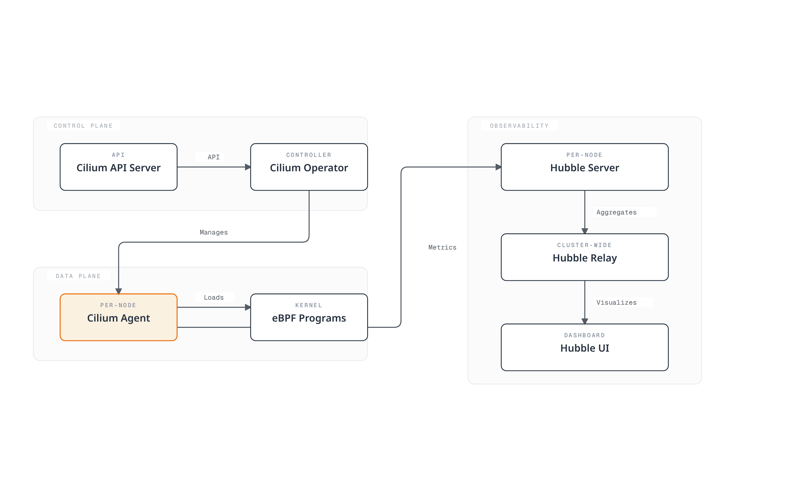

# Cilium 딥다이브: 클라우드 네이티브 네트워킹의 미래

## 개요

이 섹션은 Cilium의 핵심 개념과 기술에 대한 포괄적인 이해를 제공합니다. Cilium의 아키텍처, eBPF 기술, 네트워킹 모델, 보안 기능 등을 심층적으로 탐구합니다.

> **지원 버전**: Cilium 1.17, 1.18
> **Kubernetes 호환성**: 1.32 이상
> **마지막 업데이트**: 2026년 8월 24일

### 2026년 7월 업데이트: 패치 릴리스 및 NetworkPolicy 보안 이슈

2026년 7월 16일 Cilium 1.19.6, 1.18.12, 1.17.18 패치 릴리스가 공개되었습니다. Gateway API 액세스 로그 설정(`CiliumGatewayClassConfig`의 `spec.telemetry.accessLogs`) 지원 추가와 함께, 에이전트 재시작/업그레이드 중 기존 연결이 잠시 끊길 수 있는 회귀(regression), ClusterMesh `service.cilium.io/affinity: "none"` 어노테이션의 트래픽 블랙홀 버그 등이 수정되었습니다.

또한 **CVE-2026-56743** 보안 이슈에 주의하세요: Cilium 1.19.0-1.19.4에서 `clusterName`을 기본값이 아닌 값으로 설정한 경우, pod/namespace 셀렉터 없이 `ipBlock`만 사용하는 Kubernetes NetworkPolicy가 같은 네임스페이스의 다른 워크로드 트래픽을 의도치 않게 허용할 수 있습니다. 1.19.5 이상으로 업그레이드하세요. 자세한 내용은 [보안 권고문](https://github.com/cilium/cilium/security/advisories/GHSA-fm8w-2m5w-9j7r)을 참고하세요.

2026년 7월 21일에는 차기 마이너 릴리스 1.20의 두 번째 릴리스 후보인 [Cilium 1.20.0-rc.1](https://github.com/cilium/cilium/releases/tag/v1.20.0-rc.1)이 공개되었습니다(rc.0은 7월 14일).

### 2026년 8월 업데이트: Cilium 1.20.0 GA

2026년 7월 29일 [Cilium 1.20.0](https://github.com/cilium/cilium/releases/tag/v1.20.0)이 정식 릴리스되었습니다. 1,100명 이상의 기여자가 2,660개 이상의 커밋을 반영한 릴리스로, 주요 내용은 다음과 같습니다.

- **Gateway API v1.6.1**: 새로 GA된 TCPRoute/UDPRoute 지원, 백엔드 구간 TLS를 위한 `BackendTLSPolicy`, 리스너 위임 관리를 위한 ListenerSets, `ExternalAuth` 필터(GEP-1494), 네이티브 CORS 지원
- **네트워킹**: Cilium 포크 없이 eBPF 데이터패스를 확장하는 데이터패스 플러그인, netkit 자동 선택(`bpf.datapathMode=auto`), 듀얼스택 클러스터용 IPv6 이그레스 게이트웨이 IP
- **IPAM**: AWS ENI IPAM의 IPv6 지원(Beta), cluster-pool에서 multi-pool IPAM으로의 무중단 마이그레이션
- **서비스/ClusterMesh**: `PreferSameZone`/`PreferSameNode` 트래픽 분배 힌트, `service.cilium.io/weight` 어노테이션 기반 가중치 Maglev 백엔드, Multi-Cluster Services(MCS) API 안정(stable) 지원
- **보안**: Kubernetes ClusterNetworkPolicy(KCNP)의 Admin/Baseline 티어 지원, 내부 CA 또는 SPIRE 기반 ztunnel 워크로드 아이덴티티, 신규 `cluster-mesh` 정책 엔티티
- **성능**: `cilium-cni` 바이너리가 약 77MB에서 16MB로 축소, 통합 로드밸런서 상태 관리와 대규모 클러스터용 BPF 정책 맵 인코딩 최적화

레거시 Mutual Authentication, Envoy Go 확장, Kafka 인지 정책, `cilium.io/v2alpha1` `CiliumNodeConfig` API, libnetwork 통합, 커스텀 CNI 설정을 사용 중이라면 업그레이드 시 조치가 필요합니다 — [업그레이드 가이드](https://docs.cilium.io/en/v1.20/operations/upgrade/#upgrade-notes)를 참고하세요. 다음 사이클의 첫 프리릴리스인 1.21.0-pre.0은 8월 3일에 공개되었습니다.

### 2026년 8월 업데이트: 1.20.1 / 1.19.7 / 1.18.13 패치 릴리스

2026년 8월 18일 유지 관리 중인 세 라인의 패치 릴리스가 함께 공개되었습니다. 1.20 라인의 첫 패치인 [1.20.1](https://github.com/cilium/cilium/releases/tag/v1.20.1)은 Cluster Mesh 문서 전면 개편과 1.20.0 이후의 버그 수정 백포트를 담았고, [1.19.7](https://github.com/cilium/cilium/releases/tag/v1.19.7)은 호스트 방화벽의 VRRP·IGMP 프로토콜 지원 백포트, [1.18.13](https://github.com/cilium/cilium/releases/tag/v1.18.13)은 Envoy 리소스(리스너, 네트워크 정책 등)의 증분(incremental) 동기화로 CPU 부하와 정책 업데이트 지연을 줄이는 변경을 포함합니다. 사용 중인 라인의 최신 패치로 업데이트하는 것을 권장합니다.

## Cilium 1.18의 주요 개선사항

Cilium 1.18은 다음과 같은 주요 기능 개선과 새로운 기능을 제공합니다:

### 네트워킹 개선
- **향상된 BGP 컨트롤 플레인**: 더욱 유연하고 확장 가능한 BGP 구성
- **개선된 멀티클러스터 라우팅**: 클러스터 간 통신 성능 최적화
- **향상된 서비스 메시 통합**: Envoy 프록시와의 더 나은 통합

### 보안 강화
- **향상된 네트워크 정책**: 더 세밀한 정책 제어 및 성능 개선
- **개선된 암호화 옵션**: WireGuard 및 IPsec 암호화 성능 최적화

### 관찰성 개선
- **Hubble 개선**: 더 풍부한 메트릭 및 추적 정보
- **향상된 Prometheus 통합**: 새로운 메트릭 및 대시보드
- **개선된 플로우 로깅**: 더 상세한 네트워크 플로우 정보

### 성능 최적화
- **eBPF 프로그램 최적화**: 더 빠른 패킷 처리
- **메모리 사용량 개선**: 대규모 클러스터에서의 리소스 효율성 향상
- **CPU 사용량 최적화**: 더 낮은 오버헤드

## 소개

Cilium은 Kubernetes, Docker, Mesos와 같은 Linux 컨테이너 관리 플랫폼을 위한 오픈 소스 네트워킹, 보안 및 관찰성 솔루션입니다. Cilium은 eBPF(extended Berkeley Packet Filter) 기술을 기반으로 하여 전통적인 Linux 네트워킹 접근 방식보다 더 강력하고 효율적인 네트워킹 및 보안 기능을 제공합니다.

### eBPF란?

eBPF는 Linux 커널 내에서 샌드박스 가상 머신처럼 작동하는 기술로, 커널 코드를 수정하지 않고도 커널 내에서 프로그램을 안전하게 실행할 수 있게 해줍니다. 이를 통해 네트워크 패킷 처리, 시스템 호출 모니터링, 성능 분석 등 다양한 작업을 효율적으로 수행할 수 있습니다.

eBPF의 주요 특징:
- 커널 공간에서 실행되어 높은 성능 제공
- JIT(Just-In-Time) 컴파일을 통한 네이티브 성능
- 안전한 실행 환경 (검증기를 통한 프로그램 검증)
- 동적 로딩 및 언로딩 가능

### Cilium의 주요 이점

1. **고성능 네트워킹**: eBPF를 활용한 효율적인 패킷 처리
2. **세분화된 네트워크 정책**: L3-L7 수준의 네트워크 정책 지원
3. **투명한 암호화**: 노드 간 투명한 IPsec 또는 WireGuard 암호화
4. **부하 분산**: XDP(eXpress Data Path) 기반 고성능 부하 분산
5. **관찰성**: Hubble을 통한 네트워크 흐름 가시성
6. **서비스 메시**: 기존 사이드카 없이 L7 트래픽 관리
7. **멀티 클러스터 네트워킹**: 클러스터 간 투명한 연결
8. **BGP 지원**: 외부 네트워크와의 통합

### 기존 CNI와의 비교

| 기능 | Cilium | Calico | Flannel | AWS VPC CNI |
|------|--------|--------|---------|-------------|
| 네트워크 모델 | eBPF | iptables/IPVS | VXLAN/host-gw | AWS ENI |
| 네트워크 정책 | L3-L7 | L3-L4 | 제한적 | AWS 보안 그룹 |
| 암호화 | IPsec/WireGuard | IPsec | 없음 | 없음 |
| 관찰성 | Hubble | Flow Logs | 제한적 | VPC Flow Logs |
| 서비스 메시 | 내장 | Istio 필요 | Istio 필요 | Istio/AppMesh 필요 |
| 성능 | 매우 높음 | 높음 | 중간 | 높음 |
| 멀티 클러스터 | 내장 | 제한적 | 없음 | Transit Gateway 필요 |

## 아키텍처

Cilium은 eBPF를 기반으로 한 데이터 플레인과 Kubernetes와 통합되는 컨트롤 플레인으로 구성됩니다.



### 주요 구성 요소

1. **Cilium Agent**: 각 노드에서 실행되며 eBPF 프로그램을 로드하고 관리
2. **Cilium Operator**: 클러스터 수준의 리소스 및 작업 관리
3. **eBPF 프로그램**: 커널에 로드되어 패킷 처리 및 정책 시행
4. **Hubble**: 네트워크 흐름 모니터링 및 관찰성 제공
5. **Cilium CLI**: Cilium 및 Hubble 관리를 위한 명령줄 도구

### 네트워킹 모델

Cilium은 여러 네트워킹 모드를 지원합니다:

1. **직접 라우팅**: 노드 간 직접 라우팅 (BGP 또는 정적 라우팅)
2. **터널링**: VXLAN 또는 Geneve 터널을 통한 오버레이 네트워킹
3. **AWS ENI**: Amazon EKS에서 ENI(Elastic Network Interface) 활용
4. **Azure IPAM**: Azure AKS에서 Azure IPAM 활용

### 패킷 흐름

Cilium에서 패킷이 처리되는 방식:

1. 패킷이 네트워크 인터페이스에 도착
2. eBPF XDP 프로그램이 패킷을 초기 처리 (DDoS 방어, 부하 분산)
3. eBPF TC(Traffic Control) 프로그램이 네트워크 정책 적용
4. 패킷이 컨테이너 네트워크 네임스페이스로 전달
5. 응답 패킷도 유사한 경로로 처리

## Amazon EKS와의 통합

Amazon EKS에서 Cilium을 사용하는 방법은 크게 두 가지가 있습니다:

1. **Amazon EKS 추가 기능으로 설치**: Amazon EKS는 Cilium을 관리형 추가 기능으로 제공합니다.
2. **수동 설치**: Helm 차트를 사용하여 직접 설치합니다.

### Amazon EKS 추가 기능으로 설치

```bash
# Cilium 추가 기능 설치
aws eks create-addon \
  --cluster-name my-cluster \
  --addon-name cilium \
  --addon-version v1.17.0-eksbuild.1 \
  --service-account-role-arn arn:aws:iam::123456789012:role/AmazonEKSCiliumAddonRole

# 추가 기능 상태 확인
aws eks describe-addon \
  --cluster-name my-cluster \
  --addon-name cilium
```

### Helm을 사용한 수동 설치

```bash
# Cilium Helm 리포지토리 추가
helm repo add cilium https://helm.cilium.io/

# Helm 리포지토리 업데이트
helm repo update

# Cilium 설치
helm install cilium cilium/cilium \
  --version 1.17.0 \
  --namespace kube-system \
  --set eni.enabled=true \
  --set ipam.mode=eni \
  --set egressMasqueradeInterfaces=eth0 \
  --set tunnel=disabled
```

### EKS 특화 구성 옵션

EKS에서 Cilium을 사용할 때 고려해야 할 주요 구성 옵션:

1. **ENI 모드**: AWS Elastic Network Interface를 활용하여 네이티브 AWS 네트워킹 성능 활용
2. **IPAM 모드**: AWS VPC IP 주소 관리와 통합
3. **암호화**: 노드 간 트래픽 암호화 (WireGuard 또는 IPsec)
4. **NodeLocal DNSCache**: DNS 성능 향상
5. **Hubble**: 네트워크 관찰성 활성화

### ENI 모드 구성

```yaml
apiVersion: v1
kind: ConfigMap
metadata:
  name: cilium-config
  namespace: kube-system
data:
  enable-endpoint-routes: "true"
  auto-create-cilium-node-resource: "true"
  ipam: "eni"
  eni-tags: "{\"Owner\": \"Cilium\"}"
  tunnel: "disabled"
  enable-ipv4: "true"
  enable-ipv6: "false"
  egress-masquerade-interfaces: "eth0"
```

### EKS 클러스터에 Cilium 설치

#### 기존 EKS 클러스터에 Cilium 설치

```bash
# AWS CNI 제거
kubectl delete daemonset -n kube-system aws-node

# Cilium 설치
cilium install --set eni.enabled=true \
  --set ipam.mode=eni \
  --set egressMasqueradeInterfaces=eth0 \
  --set tunnel=disabled
```

#### Cilium CNI로 새 EKS 클러스터 생성

```bash
eksctl create cluster --name cilium-cluster \
  --without-nodegroup

eksctl create nodegroup --cluster cilium-cluster \
  --node-ami-family AmazonLinux2 \
  --node-type m5.large \
  --nodes 3 \
  --max-pods-per-node 110

# Cilium 설치
cilium install --set eni.enabled=true \
  --set ipam.mode=eni \
  --set egressMasqueradeInterfaces=eth0 \
  --set tunnel=disabled
```

### EKS 클러스터 간 연결

Cilium Cluster Mesh를 사용한 EKS 클러스터 간 연결:

```bash
# 클러스터 1에서
cilium clustermesh enable --service-type LoadBalancer

# 클러스터 2에서
cilium clustermesh enable --service-type LoadBalancer

# 클러스터 연결
cilium clustermesh connect --context cluster1 --destination-context cluster2
```

## 설치 및 구성

### 사전 요구 사항

- Kubernetes 클러스터 (v1.16 이상)
- Linux 커널 4.9 이상 (권장: 5.4 이상)
- kubectl 설정
- Helm (선택 사항)

### Cilium CLI 설치

```bash
curl -L --remote-name-all https://github.com/cilium/cilium-cli/releases/latest/download/cilium-linux-amd64.tar.gz
sudo tar xzvfC cilium-linux-amd64.tar.gz /usr/local/bin
rm cilium-linux-amd64.tar.gz
```

### 구성 옵션

#### 네트워킹 모드 구성

직접 라우팅 모드:
```bash
cilium install --set tunnel=disabled --set autoDirectNodeRoutes=true
```

VXLAN 모드:
```bash
cilium install --set tunnel=vxlan
```

#### kube-proxy 대체 구성

완전 대체 모드:
```bash
cilium install --set kubeProxyReplacement=strict
```

#### 암호화 구성

WireGuard 암호화:
```bash
cilium install --set encryption.enabled=true --set encryption.type=wireguard
```

IPsec 암호화:
```bash
cilium install --set encryption.enabled=true --set encryption.type=ipsec
```

## 네트워크 정책

Cilium은 Kubernetes NetworkPolicy API를 확장하여 L3-L7 수준의 세분화된 네트워크 정책을 제공합니다.

### 기본 네트워크 정책

```yaml
apiVersion: networking.k8s.io/v1
kind: NetworkPolicy
metadata:
  name: allow-frontend-to-backend
  namespace: app
spec:
  podSelector:
    matchLabels:
      app: backend
  ingress:
  - from:
    - podSelector:
        matchLabels:
          app: frontend
    ports:
    - port: 8080
      protocol: TCP
```

### Cilium 네트워크 정책

```yaml
apiVersion: cilium.io/v2
kind: CiliumNetworkPolicy
metadata:
  name: allow-specific-http-methods
  namespace: app
spec:
  endpointSelector:
    matchLabels:
      app: backend
  ingress:
  - fromEndpoints:
    - matchLabels:
        app: frontend
    toPorts:
    - ports:
      - port: "8080"
        protocol: TCP
      rules:
        http:
        - method: "GET"
          path: "/api/v1/products"
```

### FQDN 기반 정책

```yaml
apiVersion: cilium.io/v2
kind: CiliumNetworkPolicy
metadata:
  name: allow-specific-domains
  namespace: app
spec:
  endpointSelector:
    matchLabels:
      app: web
  egress:
  - toFQDNs:
    - matchName: "api.example.com"
    - matchPattern: "*.amazonaws.com"
    toPorts:
    - ports:
      - port: "443"
        protocol: TCP
```

## Hubble을 통한 관찰성

Hubble은 Cilium의 관찰성 계층으로, eBPF를 통해 수집된 네트워크 흐름 데이터를 시각화하고 분석할 수 있게 해줍니다.

### Hubble 설치

```bash
cilium hubble enable --ui
```

### 네트워크 흐름 관찰

```bash
# 모든 흐름 관찰
hubble observe

# 특정 네임스페이스의 흐름 관찰
hubble observe --namespace app

# HTTP 요청 관찰
hubble observe --protocol http

# 특정 라벨을 가진 파드 간의 흐름 관찰
hubble observe --from-label app=frontend --to-label app=backend

# 실패한 연결 관찰
hubble observe --verdict DROPPED
```

### Prometheus 통합

```bash
cilium hubble enable --metrics="{dns:query;ignoreAAAA,drop:sourceContext=pod;destinationContext=pod,tcp,flow,icmp,http}"
```

## Cilium 테스트

```bash
# 기본 연결성 테스트
cilium connectivity test

# 특정 테스트 실행
cilium connectivity test --test=client-to-echo-service

# 네트워크 성능 테스트
cilium connectivity test --test=performance
```

## 모범 사례

### 성능 최적화

1. **커널 버전 최적화**: Linux 커널 5.4 이상 사용
2. **BBR 혼잡 제어 활성화**: 네트워크 처리량 향상
3. **XDP 가속 활성화**: 패킷 처리 성능 향상
4. **MTU 최적화**: 네트워크 환경에 맞는 MTU 설정

```bash
cilium install --set bpf.preallocateMaps=true \
  --set bpf.masquerade=true \
  --set devices=eth0 \
  --set loadBalancer.acceleration=native \
  --set loadBalancer.mode=dsr
```

### 보안 강화

1. **기본 거부 정책 적용**: 명시적으로 허용된 트래픽만 허용
2. **암호화 활성화**: 노드 간 트래픽 암호화
3. **최소 권한 원칙 적용**: 필요한 통신만 허용하는 정책 설계

### 관찰성 향상

```bash
cilium hubble enable --metrics="{dns,drop,tcp,flow,http}"
```

## 문제 해결

### 연결성 문제

```bash
# Cilium 상태 확인
cilium status

# 엔드포인트 상태 확인
cilium endpoint list

# 네트워크 정책 검토
kubectl get cnp,ccnp -A

# 흐름 분석
hubble observe --verdict DROPPED
```

### 성능 문제

```bash
# eBPF 맵 상태 확인
cilium bpf maps list

# 시스템 리소스 모니터링
cilium metrics list
```

### 디버깅 도구

```bash
# 상태 확인
cilium status --verbose

# 환경 정보 수집
cilium sysdump

# Cilium 에이전트 로그
kubectl logs -n kube-system -l k8s-app=cilium
```

## 딥다이브 목차

**[Cilium 소개 및 기본 개념](01-introduction.md)**
- Cilium 개요 및 역사
- 컨테이너 네트워킹 기초
- CNI(Container Network Interface) 이해하기
- Cilium의 차별화 포인트

**[eBPF 기술 심층 분석](02-ebpf.md)**
- eBPF 기술 소개 및 역사
- 커널 내 eBPF 작동 방식
- eBPF 프로그램 유형 및 맵
- Cilium에서의 eBPF 활용

**[네트워킹 모델 및 VXLAN](03-networking.md)**
- 컨테이너 네트워킹 모델 비교
- VXLAN 기술 심층 분석
- Cilium의 오버레이 네트워킹
- 성능 최적화 기법
- 라우팅 메커니즘 (Encapsulation vs Native-Routing)
- 클라우드 제공업체별 네트워킹 (AWS ENI, Google Cloud)

**[IPAM 및 네트워크 정책](04-ipam-policy.md)**
- IP 주소 관리(IPAM) 전략
- Kubernetes와 Cilium IPAM 통합
- 네트워크 정책 설계 및 구현
- 멀티 클러스터 시나리오
- IPAM 모드 심층 분석 (Cluster Scope, Kubernetes Host Scope, Multi-Pool)
- 클라우드 제공업체별 IPAM (Azure IPAM, AWS ENI, GKE)
- CRD 기반 IPAM

**[L2-L7 네트워킹 및 로드 밸런싱](05-l2-l7-networking.md)**
- OSI 모델 계층 이해 (L2, L3, L4, L7)
- Cilium의 계층별 기능
- 서비스 메시 통합
- 로드 밸런싱 아키텍처
- 마스커레이딩 구성 및 구현 모드
- IPv4 프래그먼트 처리

**[보안 및 가시성](06-security-visibility.md)**
- Cilium의 보안 기능
- 네트워크 가시성 및 모니터링
- Hubble 아키텍처 및 활용
- 실시간 위협 탐지

**[고급 주제 및 실제 사례](07-advanced-topics.md)**
- 성능 튜닝 및 문제 해결
- 대규모 배포 전략
- 실제 사용 사례 연구
- 미래 로드맵 및 발전 방향

## 추가 자료

- [네트워킹 개념 심층 분석](networking-concepts.md)
- [용어 및 약어](glossary.md)

## 참고 자료

- [Cilium 공식 문서](https://docs.cilium.io/)
- [Cilium GitHub 저장소](https://github.com/cilium/cilium)
- [eBPF 문서](https://ebpf.io/)
- [Hubble 문서](https://github.com/cilium/hubble)
- [Cilium Network Policy Editor](https://editor.cilium.io/)
- [AWS EKS Workshop - Cilium](https://www.eksworkshop.com/beginner/115_cilium/)

## 퀴즈

이 섹션에서 배운 내용을 테스트하려면 [Cilium 딥다이브 퀴즈](../../quizzes/networking/cilium/01-introduction-quiz.md)를 풀어보세요.
