# 네트워킹 개념 심층 분석

> **검토 기준**: Cilium 1.20.1.
> **최종 검토**: 2026년 9월 12일.

이 문서는 Cilium을 이해하는 데 필요한 핵심 네트워킹 개념에 대한 심층적인 설명을 제공합니다. 컨테이너 네트워킹, 오버레이, NAT, 라우팅, DNS, 로드 밸런싱과 정책을 다룹니다. 예제는 준비된 테스트 환경의 개념·부분 Helm/API 구성이며 완전한 설치나 마이그레이션 절차가 아닙니다. 관리형 플랫폼마다 허용하는 CNI 기능이 다르므로 [Cilium 개요](README.md)의 플랫폼·버전 전제 조건을 확인합니다.

## 학습 목표

이 문서를 통해 다음을 이해할 수 있습니다:
- OSI 모델과 TCP/IP 스택의 기본 구조와 각 계층의 역할
- 컨테이너 네트워킹의 기본 원리와 구현 방식
- 오버레이 네트워크와 언더레이 네트워크의 차이점
- NAT, 라우팅, DNS 등 핵심 네트워킹 개념이 Cilium에서 어떻게 활용되는지

## 목차

1. [OSI 모델 및 TCP/IP 스택](#osi-모델-및-tcp-ip-스택)
2. [컨테이너 네트워킹 기초](#컨테이너-네트워킹-기초)
3. [오버레이 네트워크](#오버레이-네트워크)
4. [네트워크 주소 변환(NAT)](#네트워크-주소-변환-nat)
5. [라우팅 프로토콜](#라우팅-프로토콜)
6. [DNS 및 서비스 디스커버리](#dns-및-서비스-디스커버리)
7. [로드 밸런싱 개념](#로드-밸런싱-개념)
8. [네트워크 보안 기초](#네트워크-보안-기초)

## OSI 모델 및 TCP/IP 스택

> **핵심 개념**: OSI 모델은 네트워크 통신을 7개의 추상 계층으로 분류하여 복잡한 네트워킹 프로세스를 이해하기 쉽게 분해합니다.

OSI(Open Systems Interconnection) 모델은 네트워크 통신을 7개의 추상 계층으로 분류한 개념적 프레임워크입니다. 각 계층은 특정 네트워킹 기능을 담당하며, 이를 통해 복잡한 네트워킹 프로세스를 이해하기 쉽게 분해할 수 있습니다.

### OSI 모델과 TCP/IP 모델 비교

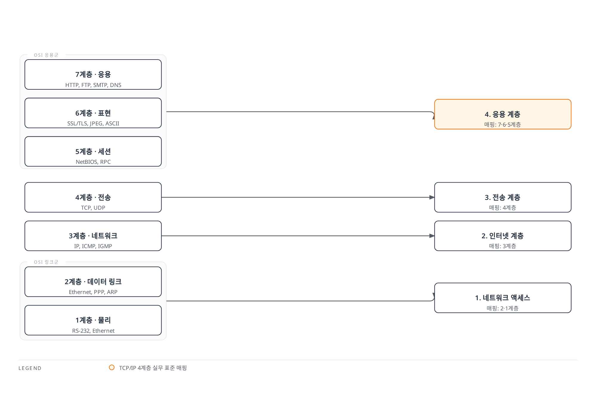

[🔍 인터랙티브 다이어그램 보기](https://www.atomai.click/kubernetes-docs/archmaps/ko-networking-cilium-networking-concepts-0.html)

계층 매핑은 학습용 근사이며 프로토콜 구현 명세가 아닙니다. 그림의 SSL은 과거 명칭이며 현재 시스템에는 지원되는 TLS 버전을 사용합니다.

### OSI 7계층 모델

1. **물리 계층(Physical Layer)**
   - 비트 스트림을 전기 신호, 광 신호 또는 무선 신호로 변환
   - 케이블, 트랜시버와 물리 신호 등을 포함하며 스위치는 상위 계층 기능도 구현
   - 데이터 단위: 비트(Bit)

2. **데이터 링크 계층(Data Link Layer)**
   - 물리적 네트워크 상의 노드 간 데이터 전송 담당
   - MAC(Media Access Control) 주소를 사용한 장치 식별
   - 오류 감지와 링크 프로토콜이 제공하는 복구 기능; Ethernet의 오류 감지 자체가 손상된 프레임을 수정하지는 않음
   - 데이터 단위: 프레임(Frame)
   - 이더넷, Wi-Fi 프로토콜이 이 계층에서 작동

3. **네트워크 계층(Network Layer)**
   - 서로 다른 네트워크 간의 패킷 라우팅 담당
   - 논리적 주소 지정(IP 주소)
   - 경로 결정 및 패킷 전달
   - 데이터 단위: 패킷(Packet)
   - IP(Internet Protocol)가 이 계층의 핵심 프로토콜

4. **전송 계층(Transport Layer)**
   - 종단 간(end-to-end) 통신 제어
   - 데이터 분할 및 재조립
   - TCP는 흐름 제어와 재전송을 제공하지만 UDP 자체는 이를 보장하지 않음
   - 데이터 단위: TCP 세그먼트 또는 UDP 데이터그램
   - TCP(Transmission Control Protocol)와 UDP(User Datagram Protocol)가 이 계층의 주요 프로토콜

5. **세션 계층(Session Layer)**
   - 통신 세션 설정, 유지 및 종료
   - 동기화 및 대화 제어
   - 체크포인트 설정 및 복구
   - 세션 관리를 이 계층에서 설명할 수 있지만 실제 RPC 구현이 하나의 OSI 계층에만 대응하는 것은 아님

6. **표현 계층(Presentation Layer)**
   - 데이터 형식 변환 및 암호화
   - 문자 인코딩, 데이터 압축, 암호화/복호화
   - 인코딩·압축이 이 책임을 설명하며 TLS는 Internet 프로토콜이지 문자 그대로 OSI 표현 계층을 구현한 것은 아님

7. **응용 계층(Application Layer)**
   - 애플리케이션이 사용하는 네트워크 서비스를 제공하며 그래픽 사용자 인터페이스를 뜻하지는 않음
   - 이메일, 파일 전송, 웹 브라우징 등의 서비스
   - HTTP, FTP, SMTP, DNS가 이 계층의 예

### Cilium과 OSI 모델의 관계

Cilium은 여러 OSI 계층에서 작동합니다:

| OSI 계층 | Cilium 기능 | 예시 |
|---------|------------|------|
| L2 (데이터 링크) | 링크 연결성과 선택적 L2 Announcements | 구성한 Service VIP에 대한 ARP/NDP 응답 |
| L3 (네트워크) | IP 라우팅, CIDR 기반 정책 | 포드 간 IP 라우팅 |
| L4 (전송) | 포트 기반 필터링, 연결 추적 | 서비스 포트 접근 제어 |
| L7 (응용) | 지원 HTTP/gRPC 및 DNS 프록시 규칙 | HTTP 경로 정책 또는 DNS 질의 정책 |

이 검토 버전의 L2 Announcements는 Beta이며 컨트롤러·장치 구성이 필요합니다. 일반적인 MAC 주소 보안 정책 인터페이스와 구분합니다.

### TCP/IP 스택

TCP/IP 스택은 인터넷의 기반이 되는 프로토콜 집합으로, 흔히 4계층으로 설명해 OSI와 비교하는 별도의 아키텍처이며 OSI 7계층을 직접 구현한 것은 아닙니다.

1. **네트워크 인터페이스 계층(Network Interface Layer)**
   - OSI 모델의 물리 계층과 데이터 링크 계층에 해당
   - 물리적 네트워크 매체와의 인터페이스 담당
   - 이더넷, Wi-Fi 등의 프로토콜 포함

2. **인터넷 계층(Internet Layer)**
   - OSI 모델의 네트워크 계층에 해당
   - IP(Internet Protocol)를 사용한 패킷 라우팅
   - ICMP(Internet Control Message Protocol)를 포함; ARP는 링크 경계에서 IPv4 다음 홉 주소를 해석하며 IPv6는 Neighbor Discovery를 사용

3. **전송 계층(Transport Layer)**
   - OSI 모델의 전송 계층과 동일
   - TCP와 UDP 프로토콜 포함
   - 연결 지향(TCP) 및 비연결 지향(UDP) 통신 제공

4. **응용 계층(Application Layer)**
   - OSI 모델의 세션, 표현, 응용 계층을 통합
   - HTTP, SMTP, FTP, DNS 등의 프로토콜 포함
   - 사용자 애플리케이션과 네트워크 간의 인터페이스 제공

### Cilium과 계층별 기능

Cilium은 다양한 네트워크 계층에서 기능을 제공합니다:

- **L2(데이터 링크 계층)**: 링크 연결성과 선택적 L2 서비스 광고; 일반적인 MAC 주소 NetworkPolicy API나 보편적 ARP 스푸핑 방지를 의미하지 않음
- **L3(네트워크 계층)**: IP 주소 기반 라우팅 및 필터링, IPAM
- **L4(전송 계층)**: 포트 기반 필터링, 로드 밸런싱, 연결 추적
- **L7(응용 계층)**: 구성된 HTTP/gRPC 프록시 기능과 DNS 정책; 이전 Kafka L7 정책 API는 제거됨

## 컨테이너 네트워킹 기초

컨테이너 네트워킹은 컨테이너화된 애플리케이션이 서로 통신하고 외부 세계와 통신할 수 있게 해주는 메커니즘입니다. Kubernetes와 같은 컨테이너 오케스트레이션 플랫폼에서는 다양한 네트워킹 모델과 솔루션이 사용됩니다.

### 컨테이너 네트워크 인터페이스(CNI)

CNI(Container Network Interface)는 컨테이너 런타임과 네트워크 플러그인 간의 표준 인터페이스를 정의합니다. 현재 Kubernetes에서는 CRI 컨테이너 런타임이 CNI 플러그인을 호출합니다. 다양한 네트워크 구현을 연결하는 인터페이스이며 모든 플러그인이 Kubernetes NetworkPolicy를 구현해야 한다는 명세는 아닙니다.

#### CNI의 주요 구성 요소:

1. **플러그인**: 네트워크 인터페이스 생성 및 구성을 담당하는 실행 파일
2. **구성 파일**: 플러그인의 동작을 정의하는 JSON 형식의 파일
3. **IPAM(IP Address Management)**: IP 주소 할당 및 관리를 담당하는 모듈

#### CNI 플러그인의 주요 책임:

- 컨테이너 네트워크 네임스페이스에 인터페이스 추가/제거
- IP 주소 할당 및 해제
- 라우팅 테이블 구성
- 네트워크 구현이 별도 정책 컨트롤러·데이터 경로 집행을 제공할 수 있으나 정책은 필수 CNI 실행 연산이 아님

### 컨테이너 네트워킹 모델

컨테이너 네트워킹에는 여러 모델이 있으며, 각각 다른 사용 사례와 요구 사항에 적합합니다.

#### 1. 브리지 네트워킹

- 호스트에 가상 브리지를 생성하여 컨테이너를 연결
- 각 컨테이너는 가상 이더넷(veth) 쌍을 통해 브리지에 연결
- 동일한 호스트의 컨테이너 간 통신이 효율적
- 독립 Linux Docker의 기본 브리지 예이며 Kubernetes나 Cilium의 네트워크 모델 자체는 아님

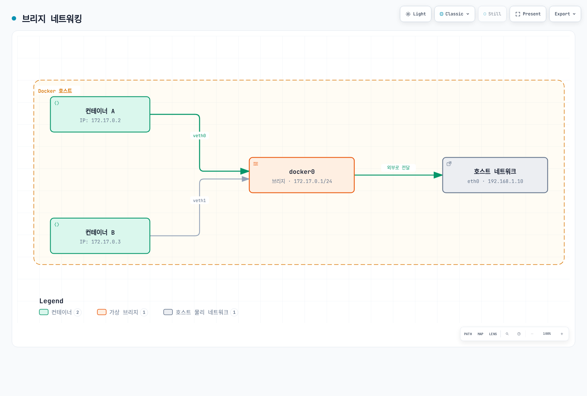

[🔍 인터랙티브 다이어그램 보기](https://www.atomai.click/kubernetes-docs/archmaps/ko-networking-cilium-networking-concepts-1.html)

예시 주소를 사용한 Linux Docker 브리지 그림입니다. 호스트 라우팅·NAT 경로를 단순화했으며 Cilium의 기본 브리지 토폴로지를 뜻하지 않습니다.

#### 2. 호스트 네트워킹

- 컨테이너가 호스트의 네트워크 네임스페이스를 직접 사용
- 별도의 네트워크 격리 없음
- 별도의 컨테이너 네트워크 네임스페이스를 사용하지 않으며 실제 성능은 워크로드와 경로에 따라 달라짐
- 포트 충돌 가능성 있음

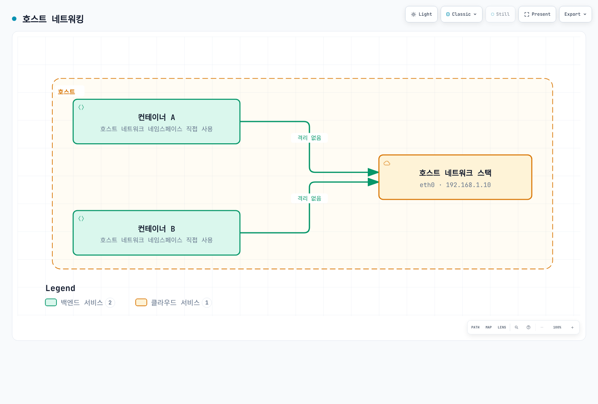

[🔍 인터랙티브 다이어그램 보기](https://www.atomai.click/kubernetes-docs/archmaps/ko-networking-cilium-networking-concepts-2.html)

그림의 ‘격리 없음’은 네트워크 네임스페이스 공유를 뜻하며 모든 프로세스·파일 시스템 등 다른 컨테이너 격리가 제거된다는 뜻은 아닙니다.

#### 3. 오버레이 네트워킹

- 여러 호스트에 걸쳐 있는 컨테이너 간의 통신 지원
- VXLAN, GENEVE 등의 캡슐화 프로토콜 사용
- 대규모 클러스터에 적합
- Cilium, Calico, Flannel 등이 이 모델 지원

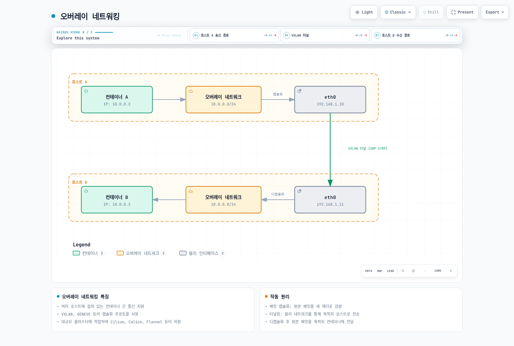

[🔍 인터랙티브 다이어그램 보기](https://www.atomai.click/kubernetes-docs/archmaps/ko-networking-cilium-networking-concepts-3.html)

일반 VXLAN 그림은 표준 UDP 4789와 공유 L2 서브넷을 사용합니다. Cilium 기본 VXLAN 포트는 8472이며 Pod CIDR 할당은 그림 복사가 아니라 선택한 IPAM 모드를 따라야 합니다.

#### 4. 언더레이 네트워킹(직접 라우팅)

- 물리적 네트워크 인프라를 직접 활용
- 캡슐화 오버헤드 없음
- 네트워크 인프라에 대한 제어가 필요
- BGP와 같은 라우팅 프로토콜과 통합 가능

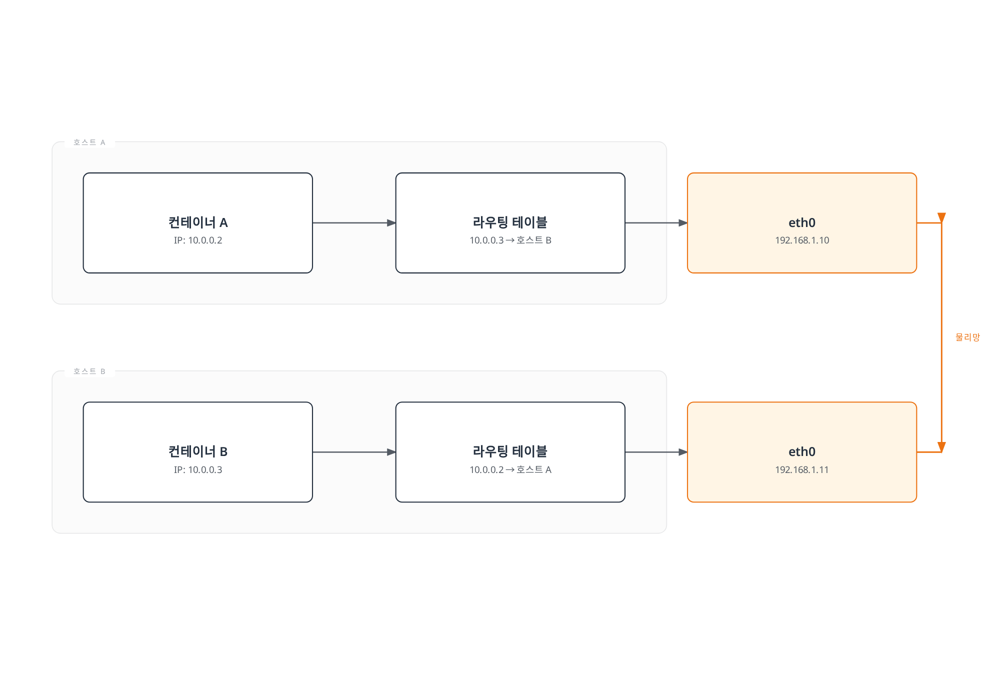

[🔍 인터랙티브 다이어그램 보기](https://www.atomai.click/kubernetes-docs/archmaps/ko-networking-cilium-networking-concepts-4.html)

호스트 라우트를 설명하는 그림입니다. 실제 배포에는 접근 가능한 다음 홉과 Pod 주소의 올바른 왕복 라우트가 필요합니다.

### Kubernetes 네트워킹 모델

Kubernetes 모델은 **의도적 네트워크 분할을 제외하고** 직접 Pod 연결을 제공합니다.

1. Pod 네트워크에서 Pod끼리는 필수 프록시나 NAT 없이 통신할 수 있습니다.
2. 노드 에이전트는 **해당 노드의 Pod**에 접근할 수 있어야 합니다. 모든 호스트가 모든 Pod에 접근해야 한다는 보편적 요구가 아닙니다.
3. 외부 연결은 클러스터 라우팅·보안 정책을 따르며 무제한 인터넷 접근은 요구되지 않습니다.

NetworkPolicy 집행에는 지원 네트워크 구현이 필요합니다. 설치한 플러그인이 집행하지 않아도 API는 존재할 수 있습니다.

#### Kubernetes 네트워크 구성 요소:

1. **포드 네트워크**: 클러스터 내 모든 포드를 연결하는 네트워크
2. **서비스 네트워크**: 포드 집합에 대한 안정적인 엔드포인트 제공
3. **클러스터 DNS**: 서비스 디스커버리를 위한 DNS 서비스
4. **인그레스/이그레스**: 클러스터 외부와의 통신 관리

### Cilium의 컨테이너 네트워킹 접근 방식

Cilium은 eBPF를 활용하여 고성능, 확장 가능한 컨테이너 네트워킹 솔루션을 제공합니다:

1. **eBPF 기반 데이터 경로**: 커널 내에서 직접 패킷 처리
2. **다양한 네트워킹 모드 지원**: 오버레이(VXLAN, Geneve)와 native 라우팅; 일반 Helm 기본값은 VXLAN 터널 모드이며 플랫폼에서 재정의할 수 있음
3. **고급 로드 밸런싱**: kube-proxy 대체 기능
4. **네트워크 정책**: L3-L7 수준의 세분화된 정책
5. **통합 IPAM**: 다양한 IP 주소 할당 전략 지원

플랫폼 재정의가 없는 일반 Helm 설치의 기본 IPAM은 cluster-pool입니다. Operator가 노드 CIDR을, 에이전트가 노드 풀의 Pod IP를 할당합니다. `ipam.mode: kubernetes`는 Node의 `spec.podCIDR`/`spec.podCIDRs`를 사용합니다. ENI 모드는 EC2 인터페이스와 VPC 주소를 사용하며 모든 EKS 컴퓨팅 모드의 보편적인 권장은 아닙니다. [IPAM과 정책](04-ipam-policy.md)을 참고합니다.

## 오버레이 네트워크

오버레이 네트워크는 기존 네트워크 인프라 위에 가상 네트워크 계층을 구축하는 기술입니다. 이 기술은 물리적 네트워크 토폴로지와 독립적으로 가상 네트워크 토폴로지를 생성할 수 있게 해줍니다. 컨테이너 환경에서는 여러 호스트에 걸쳐 있는 컨테이너 간의 통신을 가능하게 하는 데 널리 사용됩니다.

### 오버레이 네트워크의 작동 원리

오버레이 네트워크는 캡슐화(Encapsulation) 기술을 사용하여 작동합니다. 원본 패킷은 다른 패킷 내에 캡슐화되어 물리적 네트워크를 통해 전송됩니다.

1. **패킷 캡슐화**: 원본 패킷(내부 패킷)이 새로운 헤더와 때로는 새로운 트레일러로 감싸집니다.
2. **터널링**: 캡슐화된 패킷은 물리적 네트워크를 통해 목적지 호스트로 전송됩니다.
3. **패킷 디캡슐화**: 목적지 호스트에서 외부 헤더가 제거되고 원본 패킷이 추출됩니다.
4. **패킷 전달**: 원본 패킷은 목적지 컨테이너로 전달됩니다.

### 주요 오버레이 네트워크 프로토콜

#### VXLAN(Virtual Extensible LAN)

VXLAN은 컨테이너 네트워킹에서 가장 널리 사용되는 오버레이 프로토콜 중 하나입니다.

- **VXLAN 터널 엔드포인트(VTEP)**: 패킷의 캡슐화 및 디캡슐화를 담당
- **VXLAN 네트워크 식별자(VNI)**: 16,777,216개 값이 가능한 24비트 필드이며 Cilium의 지원 테넌트·엔드포인트 용량이 아님
- **UDP 캡슐화**: 표준 VXLAN은 UDP 4789를 사용하며 Cilium 기본 VXLAN 터널 포트는 UDP 8472
- **MAC-in-UDP 캡슐화**: 원본 L2 프레임을 UDP 패킷으로 캡슐화

VXLAN 패킷 구조:

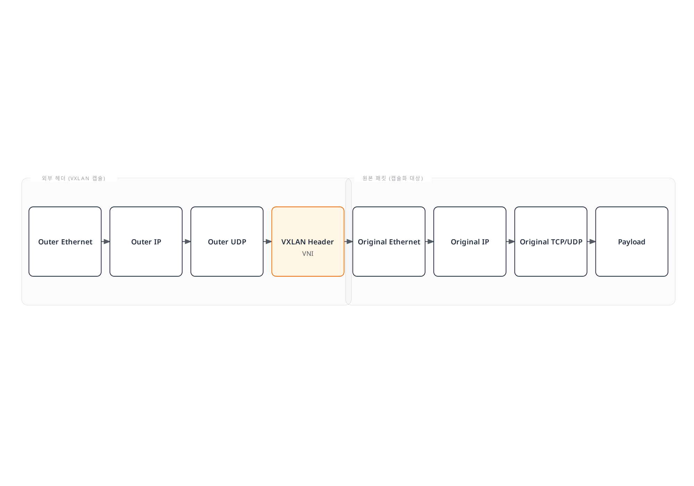

[🔍 인터랙티브 다이어그램 보기](https://www.atomai.click/kubernetes-docs/archmaps/ko-networking-cilium-networking-concepts-5.html)

일반 VXLAN 전송 형식입니다. UDP 4789와 24비트 VNI는 표준 설명이며 Cilium은 기본 UDP 8472와 ID용 오버레이 메타데이터를 사용합니다. 필드 폭이 클러스터 용량 보장은 아닙니다.

#### GENEVE(Generic Network Virtualization Encapsulation)

GENEVE는 VXLAN의 제한을 극복하기 위해 설계된 보다 유연한 오버레이 프로토콜입니다.

- **확장 가능한 옵션 헤더**: 다양한 메타데이터 지원
- **프로토콜 독립적**: 다양한 가상화 기술과 함께 사용 가능
- **UDP 캡슐화**: UDP 포트 6081을 통해 전송
- **유연한 터널링**: 다양한 네트워크 가상화 요구 사항 지원

#### IPsec

IPsec은 IP 패킷 수준에서 보안 서비스를 제공하는 프로토콜 스위트입니다.

- **인증 및 암호화**: IPsec은 무결성·인증과 적절한 모드의 기밀성을 위한 수단을 제공
- **전송 모드 및 터널 모드**: 다양한 배포 시나리오 지원
- **보안 연결(SA)**: 통신 당사자 간의 보안 매개변수 정의
- **인터넷 키 교환(IKE)**: 일반적인 IPsec 협상 방식이며 Cilium IPsec 설정은 관리자가 제공하는 키 Secret과 문서화된 교체 절차를 사용

### 오버레이 네트워크의 장단점

#### 장점:

- **유연성**: 물리적 네트워크 토폴로지와 독립적으로 가상 네트워크 구성 가능
- **확장성**: 대규모 네트워크 세그먼트 및 다수의 엔드포인트 지원
- **격리**: 올바르게 구성한 논리 세그먼트가 트래픽을 구분할 수 있지만 캡슐화 자체가 인증·암호화·완전한 정책 경계는 아님
- **호환성**: 기존 네트워크 인프라와 함께 작동 가능

#### 단점:

- **오버헤드**: 캡슐화로 인한 패킷 크기 증가 및 처리 오버헤드
- **MTU 고려 사항**: 캡슐화로 인한 최대 전송 단위(MTU) 감소
- **복잡성**: 문제 해결 및 디버깅이 더 복잡해질 수 있음
- **지연 시간**: 캡슐화는 처리 작업을 추가하며 선택한 구현·오프로딩의 실제 영향을 측정해야 함

### Cilium에서의 오버레이 네트워크

Cilium은 VXLAN 및 Geneve와 같은 오버레이 프로토콜을 지원하며, eBPF를 활용하여 효율적인 패킷 처리를 제공합니다.

- **eBPF 기반 VXLAN 처리**: 커널 내에서 직접 패킷 캡슐화 및 디캡슐화
- **효율적인 라우팅**: 최적화된 경로를 통한 패킷 전달
- **암호화 옵션**: IPsec 또는 WireGuard를 통한 암호화된 오버레이
- **모드 선택**: 지원되는 라우팅 모드를 선택; 터널 모드와 자동 직접 노드 라우트를 함께 켜면 거부되며 fallback 수단이 아님

#### Cilium VXLAN 구성 예제:

**새로 준비한 IPv4 테스트 설치**의 Helm 값입니다. 겹치지 않는 Pod CIDR을 선택하며 기존 IPAM의 실시간 이전이나 ConfigMap 교체 예제가 아닙니다.

```yaml
# vxlan-values.yaml
routingMode: tunnel
tunnelProtocol: vxlan
tunnelPort: 8472
autoDirectNodeRoutes: false
ipv4:
  enabled: true
ipv6:
  enabled: false
ipam:
  mode: cluster-pool
  operator:
    clusterPoolIPv4PodCIDRList:
    - 10.244.0.0/16
    clusterPoolIPv4MaskSize: 24
```
## 네트워크 주소 변환(NAT)

네트워크 주소 변환(Network Address Translation, NAT)은 IP 패킷의 소스 또는 목적지 주소를 수정하는 프로세스입니다. NAT는 주로 사설 네트워크의 장치가 공용 인터넷과 통신할 수 있도록 하거나, 네트워크 주소 공간이 겹치는 두 네트워크 간의 통신을 가능하게 하는 데 사용됩니다.

### NAT의 주요 유형

#### 1. 소스 NAT(SNAT)

소스 NAT는 패킷의 소스 IP 주소를 수정합니다. 일반적으로 사설 네트워크의 장치가 인터넷에 액세스할 때 사용됩니다.

- **작동 방식**: 출발지 주소와 경우에 따라 포트를 변경; 사설→공인 변환은 흔한 사례 중 하나
- **사용 사례**: 인터넷 액세스, 아웃바운드 연결
- **추적**: NAT 테이블에 연결 상태 저장

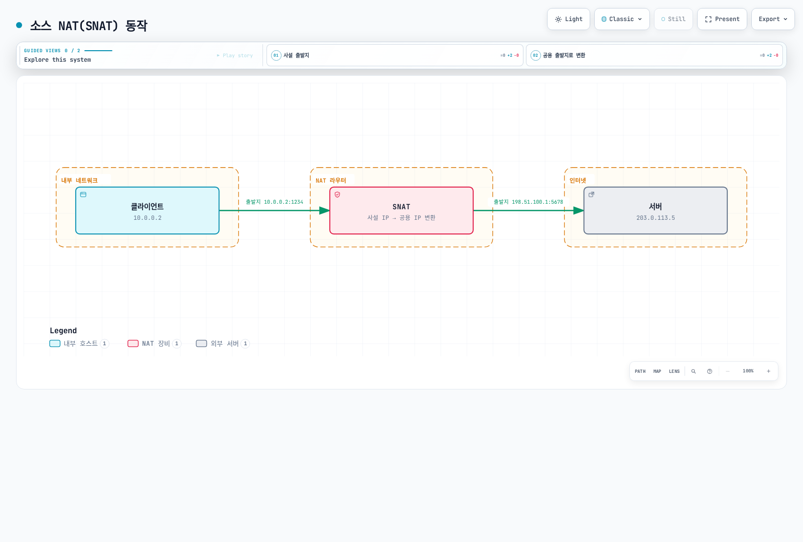

[🔍 인터랙티브 다이어그램 보기](https://www.atomai.click/kubernetes-docs/archmaps/ko-networking-cilium-networking-concepts-6.html)

문서용 주소로 사설→공인 SNAT 사례 하나를 설명합니다. SNAT는 출발지 변환이며 변환된 주소가 항상 공인 주소일 필요는 없습니다.

#### 2. 목적지 NAT(DNAT)

목적지 NAT는 패킷의 목적지 IP 주소를 수정합니다. 일반적으로 공용 인터넷에서 사설 네트워크의 서비스에 액세스할 때 사용됩니다.

- **작동 방식**: 목적지 주소·포트를 변경; 공인→사설 전달은 사례 중 하나
- **사용 사례**: 포트 포워딩, 로드 밸런싱, 인바운드 연결
- **구성**: 특정 포트 또는 포트 범위에 대한 매핑 정의

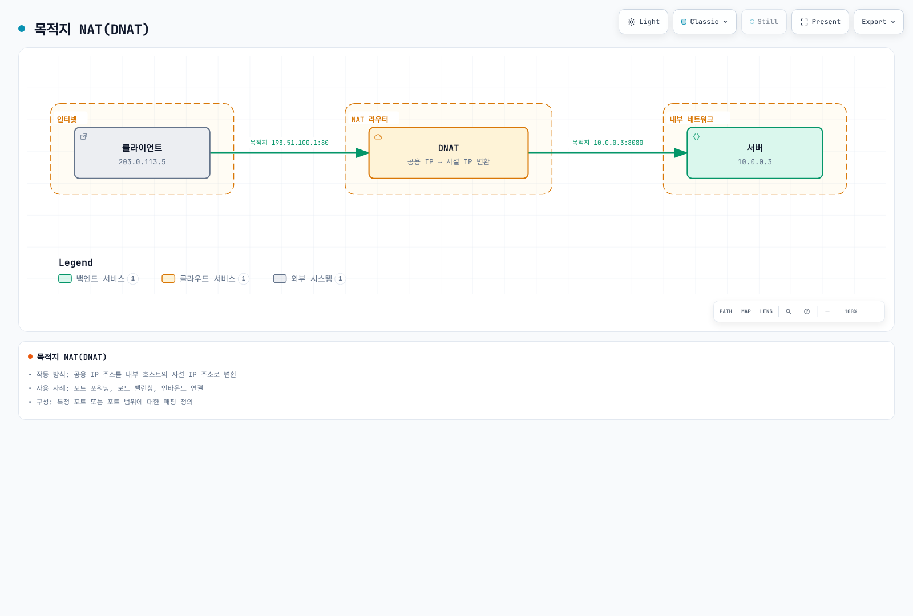

[🔍 인터랙티브 다이어그램 보기](https://www.atomai.click/kubernetes-docs/archmaps/ko-networking-cilium-networking-concepts-7.html)

문서용 주소의 공인→사설 DNAT 사례입니다. DNAT는 목적지 변환이며 다른 주소 영역 사이에서도 사용됩니다.

#### 3. 포트 주소 변환(PAT)

PAT는 IP 주소와 포트 번호를 모두 수정합니다. 이를 통해 여러 내부 호스트가 단일 공용 IP 주소를 공유할 수 있습니다.

- **작동 방식**: 내부 호스트의 IP:포트 조합을 단일 공용 IP의 다른 포트로 변환
- **사용 사례**: IP 주소 보존, 다수의 내부 호스트 지원
- **제한 사항**: 포트와 상태 자원은 유한하며 동시 흐름 수는 프로토콜·목적지 튜플·매핑 재사용에 따라 달라져 보편적인 65,000 연결 한계가 아님

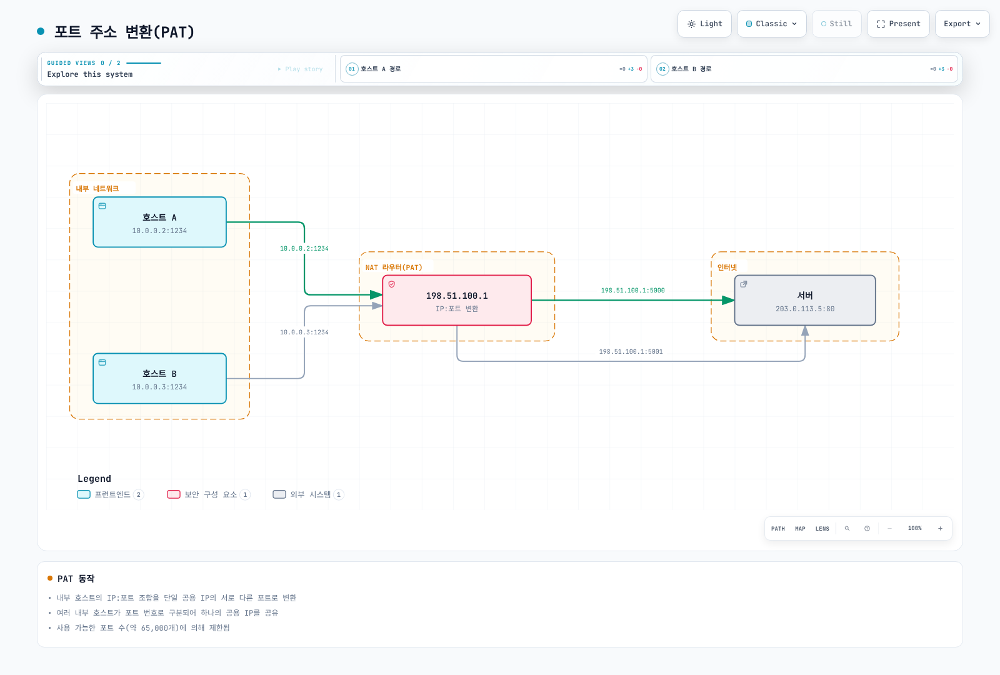

[🔍 인터랙티브 다이어그램 보기](https://www.atomai.click/kubernetes-docs/archmaps/ko-networking-cilium-networking-concepts-8.html)

같은 원격 서버에 서로 다른 변환 포트를 사용하는 예입니다. 약 65,000개 포트 공간이 모든 NAT 연결의 보편적 한계는 아니며 프로토콜, 목적지 튜플, 매핑 방식과 상태 용량을 함께 봐야 합니다.

#### 4. Twice NAT와 양방향 NAT

**Twice NAT**는 트래픽이 주소 영역을 지날 때 출발지와 목적지 주소를 모두 바꾸며 중복 주소 영역을 조정하는 데 사용할 수 있습니다. 주소 매핑, DNS·애플리케이션 가정과 반환 경로를 함께 설계해야 합니다.

RFC 2663의 **양방향 NAT(Bi-directional NAT)**는 양쪽 영역에서 세션을 시작할 수 있다는 뜻입니다. 각 패킷의 두 주소를 모두 바꾼다는 정의가 아닙니다.

### NAT의 장단점

#### 장점:

- **IP 주소 보존**: 제한된 수의 공용 IP 주소로 다수의 내부 호스트 지원
- **주소 은닉**: 내부 주소를 숨길 수 있지만 NAT는 방화벽 정책이나 인증의 대체 수단이 아님
- **주소 영역 조정**: 적절한 변환으로 중복 주소 영역을 연결할 수 있으나 그 자체가 격리를 제공하지는 않음
- **유연한 네트워크 설계**: 내부 네트워크 재구성 없이 ISP 변경 가능

#### 단점:

- **연결 추적 오버헤드**: 상태 테이블 유지 관리에 리소스 필요
- **특정 프로토콜 문제**: 일부 프로토콜은 NAT와 호환되지 않을 수 있음
- **엔드-투-엔드 연결성 손실**: 직접 피어-투-피어 통신 어려움
- **복잡한 문제 해결**: NAT 관련 문제 디버깅이 복잡할 수 있음

### Kubernetes 및 Cilium에서의 NAT

#### Kubernetes에서의 NAT

Kubernetes는 다양한 시나리오에서 NAT를 사용합니다:

1. **클러스터 외부 통신**: 주소 연결성, masquerading 예외와 선택한 데이터 경로에 따라 SNAT를 사용할 수 있음
2. **서비스 구현**: 패킷 구현은 Service 목적지를 변환할 수 있으며 소켓 수준 로드 밸런싱은 해당 패킷 생성 전에 백엔드를 선택할 수 있음
3. **NodePort 서비스**: 노드 IP:포트에서 선택한 백엔드로 전달; 반환 동작은 SNAT/DSR과 트래픽 정책에 따라 다름
4. **LoadBalancer 서비스**: 제공자·컨트롤러 구현이 다르며 공인 주소에서 Pod로의 단일 DNAT 단계인 것은 아님

#### Cilium에서의 NAT

Cilium은 eBPF를 활용하여 효율적인 NAT 구현을 제공합니다:

1. **eBPF 기반 NAT**: 커널 내에서 직접 NAT 수행
2. **고성능 연결 추적**: 최적화된 BPF 맵을 사용한 연결 상태 추적
3. **NAT 제어**: 지원 masquerading 예외, 서비스 전달과 Egress Gateway는 구성과 전제 조건이 서로 다름
4. **마스커레이딩**: 구성된 경로·장치의 조건부 출발지 변환이며 제외 CIDR과 지원 모드에 따라 결과가 달라짐

Egress Gateway는 일치하는 송신 트래픽을 선택 노드로 보내 구성된 게이트웨이 주소로 SNAT하는 별도 기능입니다. 원래 출발지 IP를 바꾸며 인터페이스·주소·반환 경로를 준비해야 합니다. 새 Pod가 정책 수렴 전에 트래픽을 보낼 수 있으므로 즉시 적용되는 fail-closed 출발지 IP 보장은 아닙니다.

#### Cilium NAT 구성 예제:

접근 가능한 API 엔드포인트와 kube-proxy 대체·BPF masquerading을 준비한 환경의 Helm 조각입니다. 먼저 실제 부착 장치와 라우트를 확인합니다. CIDR의 SNAT 제외가 반환 라우트를 만들지는 않으며 NAT 크기는 예시일 뿐 보편적 권장 용량이 아닙니다.

```yaml
# masquerade-values.yaml
enableIPv4Masquerade: true
kubeProxyReplacement: true
bpf:
  masquerade: true
  natMax: 262144
ipMasqAgent:
  enabled: true
  config:
    nonMasqueradeCIDRs:
    - 10.0.0.0/8
    - 172.16.0.0/12
    - 192.168.0.0/16
    masqLinkLocal: false
```
## 라우팅 프로토콜

라우팅 프로토콜은 네트워크에서 패킷이 소스에서 목적지로 이동하는 최적의 경로를 결정하는 규칙과 절차를 정의합니다. 이러한 프로토콜은 네트워크 토폴로지 변화에 적응하고, 트래픽을 효율적으로 전달하며, 네트워크 장애를 우회하는 데 중요한 역할을 합니다.

### 라우팅 프로토콜의 분류

#### 1. 내부 게이트웨이 프로토콜(IGP)

내부 게이트웨이 프로토콜은 단일 자율 시스템(AS) 내에서 라우팅 정보를 교환하는 데 사용됩니다.

##### 거리 벡터 프로토콜

- **RIP(Routing Information Protocol)**
  - 홉 카운트를 메트릭으로 사용
  - 유효 메트릭은 15홉까지이며 16은 연결 불가를 의미
  - 간단한 구현, 작은 네트워크에 적합
  - 약 30초의 주기적 갱신에 타이머 무작위화와 변경 시 triggered update를 사용

- **EIGRP(Enhanced Interior Gateway Routing Protocol)**
  - 구성 가능한 복합 메트릭; 기본 계수는 처리량·대역폭과 지연을 사용하며 부하·신뢰성은 기본 계산에 포함되지 않음
  - 부분 업데이트만 전송
  - 빠른 수렴
  - Cisco에서 시작되어 Informational RFC 7868에 문서화되었으며 이 공개가 IETF Standards Track 지정을 뜻하지는 않음

##### 링크 상태 프로토콜

- **OSPF(Open Shortest Path First)**
  - 다익스트라 알고리즘을 사용한 최단 경로 계산
  - 영역 기반 계층 구조
  - 빠른 수렴
  - 대규모 네트워크 지원
  - 링크 상태 광고(LSA)를 통한 토폴로지 정보 교환

- **IS-IS(Intermediate System to Intermediate System)**
  - OSPF와 유사한 링크 상태 프로토콜
  - 대규모 서비스 제공업체 네트워크에서 널리 사용
  - 다중 네트워크 계층 지원
  - 효율적인 라우팅 업데이트

#### 2. 외부 게이트웨이 프로토콜(EGP)

외부 게이트웨이 프로토콜은 서로 다른 자율 시스템 간에 라우팅 정보를 교환하는 데 사용됩니다.

- **BGP(Border Gateway Protocol)**
  - 인터넷의 핵심 라우팅 프로토콜
  - 경로 벡터 프로토콜
  - 정책 기반 라우팅 결정
  - TCP를 통한 안정적인 세션
  - 경로 속성(AS 경로, 로컬 선호도 등)을 통한 경로 선택
  - iBGP(내부 BGP) 및 eBGP(외부 BGP) 변형

### 컨테이너 네트워킹에서의 라우팅 프로토콜

컨테이너 환경에서는 전통적인 라우팅 프로토콜과 함께 컨테이너 특화 라우팅 메커니즘이 사용됩니다.

#### 1. BGP를 활용한 컨테이너 네트워킹

BGP는 컨테이너 네트워킹에서 다음과 같은 이유로 인기를 얻고 있습니다:

- **연결성 광고**: Pod·Service 접두사를 라우터에 광고하며 실제 트래픽 경로는 로컬 전달 구현이 결정
- **확장성**: 대규모 클러스터 및 멀티 클러스터 환경 지원
- **기존 네트워크 통합**: 데이터 센터 네트워크 인프라와의 통합
- **가용성**: 다중 경로·수렴은 라우터 정책, 타이머와 작동하는 데이터 경로에 의존하며 세션만으로 빠른 장애 조치가 보장되지 않음

#### 2. 컨테이너 네트워크 라우팅 메커니즘

- **호스트 기반 라우팅**: 호스트가 Pod 라우트를 유지하며 별도로 구성한 라우트 광고 수단에 참여할 수 있음
- **중앙 집중식 라우팅**: 컨트롤러가 라우팅 결정을 중앙에서 관리
- **분산 라우팅**: 노드 간 직접 라우팅 정보 교환
- **정책 기반 라우팅**: 트래픽 특성에 따른 라우팅 결정

### Cilium에서의 라우팅

Cilium은 eBPF로 라우팅을 구현하고 여러 데이터 경로 모드를 지원합니다. **호스트 라우팅은 별도의 축**입니다. BPF 호스트 라우팅은 노드 내부 전달을 최적화하며 호스트 스택·netfilter 일부를 우회할 수 있습니다. 호환되는 kube-proxy 대체·BPF masquerading이 필요하고 연동 제약도 있습니다. 노드 간 tunnel 대신 native 라우팅을 선택한다는 뜻은 아닙니다.

#### 1. 직접 라우팅(Native Routing)

직접 라우팅 모드에서 Cilium은 오버레이 캡슐화 없이 포드 IP를 직접 라우팅합니다.

- **작동 방식**: Pod 트래픽이 오버레이 캡슐화 없이 underlay 라우트를 사용하며 native 모드만으로 BGP가 활성화되지는 않음
- **장점**: 오버레이 캡슐화 비용을 피하며 실제 성능은 측정이 필요
- **요구 사항**: 노드 IP 연결성뿐 아니라 해당 Pod 주소와 반환 트래픽의 유효한 라우트
- **사용 사례**: 성능이 중요한 워크로드, 단일 서브넷 클러스터

`routingMode: native` 선택만으로 Pod 라우트가 BGP로 자동 광고되지는 않습니다. Underlay·반환 라우트를 준비하거나 적절한 라우트 배포 수단을 구성합니다. 앞의 호스트 라우트 그림이 전달 원리를 설명합니다.

#### 2. BGP 라우팅

Cilium은 BGP 라우팅을 지원하여 포드 IP를 물리적 네트워크 인프라와 통합할 수 있습니다.

- **작동 방식**: Cilium은 BGP 피어링을 통해 포드 CIDR을 광고
- **장점**: 기존 네트워크 인프라와의 통합, 고가용성
- **구성 요소**: BGP 피어링, 경로 필터링, 커뮤니티 속성
- **사용 사례**: 데이터 센터 네트워크와의 통합, 멀티 클러스터 환경

#### 3. 오버레이 라우팅

Cilium은 VXLAN 또는 Geneve와 같은 오버레이 프로토콜을 사용하여 노드 간 포드 트래픽을 라우팅할 수 있습니다.

- **작동 방식**: 포드 패킷을 캡슐화하여 노드 간 전송
- **장점**: 네트워크 인프라 요구 사항 최소화, 유연한 배포
- **사용 사례**: 클라우드 환경, 복잡한 네트워크 토폴로지

#### 4. 하이브리드 라우팅

Cilium이 접근 가능하면 native 라우트를 사용하고 그렇지 않으면 자동으로 오버레이로 전환한다고 가정하지 않습니다. 현재 터널 모드와 `autoDirectNodeRoutes: true`를 함께 사용하면 에이전트가 구성을 거부합니다. 지원되는 데이터 경로와 underlay를 준비합니다.

유효한 로드 밸런서 모드 `hybrid`는 다른 기능입니다. TCP에는 DSR, UDP에는 SNAT를 사용하며 오버레이/native 라우팅 fallback이 아닙니다.

### Cilium 라우팅 구성 예제

#### 직접 라우팅 구성:

의도한 Pod CIDR과 자동 직접 라우트용 공유 L2 네트워크의 노드를 가정한 native 라우팅 조각입니다. 다른 토폴로지에는 별도 라우팅 수단이 필요하며 터널 모드와 자동 fallback 용도로 함께 사용하지 않습니다.

```yaml
# native-values.yaml
routingMode: native
autoDirectNodeRoutes: true
ipv4NativeRoutingCIDR: 10.244.0.0/16
```

#### BGP 라우팅 구성:

아래 기능 플래그는 전제 조건 중 하나일 뿐입니다. [고급 주제](07-advanced-topics.md)의 현재 `CiliumBGPClusterConfig`, `CiliumBGPPeerConfig`, `CiliumBGPAdvertisement`와 외부 라우터를 구성합니다. BGP 광고와 데이터 경로 라우팅 모드는 별도 선택입니다.

```yaml
# bgp-values.yaml
bgpControlPlane:
  enabled: true
```

#### 오버레이 라우팅 구성:

앞의 완전한 VXLAN Helm 값 예제를 사용합니다. 실제 모드와 포트는 에이전트 상태에서 확인하며 작은 ConfigMap으로 전체 설치 설정을 덮어쓰지 않습니다.
## DNS 및 서비스 디스커버리

DNS(Domain Name System)와 서비스 디스커버리는 현대적인 네트워크 애플리케이션, 특히 동적 컨테이너 환경에서 핵심적인 역할을 합니다. 이러한 메커니즘은 서비스 위치를 추상화하고, 애플리케이션이 네트워크 토폴로지 변화에 적응할 수 있게 해줍니다.

### DNS(Domain Name System)

DNS는 사람이 읽을 수 있는 도메인 이름을 IP 주소로 변환하는 분산 시스템입니다.

#### DNS 작동 원리

1. **계층적 네임스페이스**: 도메인 이름은 점으로 구분된 계층 구조로 구성됨(예: www.example.com)
2. **분산 데이터베이스**: 전 세계에 분산된 DNS 서버 네트워크
3. **반복적 및 재귀적 쿼리**: 클라이언트 요청을 처리하는 두 가지 주요 방법
4. **캐싱**: 성능 향상을 위한 임시 결과 저장

#### DNS 레코드 유형

- **A 레코드**: 도메인 이름을 IPv4 주소에 매핑
- **AAAA 레코드**: 도메인 이름을 IPv6 주소에 매핑
- **CNAME 레코드**: 도메인 이름의 별칭(canonical name)
- **MX 레코드**: 메일 서버 지정
- **SRV 레코드**: 특정 서비스를 제공하는 서버 지정
- **TXT 레코드**: 텍스트 정보 저장(주로 검증 및 정책에 사용)
- **PTR 레코드**: IP 주소를 도메인 이름으로 역방향 매핑(역방향 DNS)

#### DNS 해석 과정

일반적인 캐시 미적중 질의는 애플리케이션의 stub resolver와 재귀 resolver를 구분합니다.

| 단계 | 질의·응답 |
| --- | --- |
| 1 | Stub이 구성된 재귀 resolver에 `www.example.com`을 질의합니다. |
| 2 | Resolver가 루트 서버에 질의하고 `.com` 서버 참조를 받습니다. |
| 3 | Resolver가 `.com` 서버에 질의하고 `example.com` 권한 서버 참조를 받습니다. |
| 4 | Resolver가 권한 서버에 질의해 해당 응답을 얻습니다. |
| 5 | Resolver가 TTL에 따라 캐시하고 stub에 응답합니다. |

일반적으로 권한 서버들이 이 질의를 서로 전달하는 과정이 아닙니다. 캐시, 별칭과 구성된 forwarder에 따라 실제 교환은 달라질 수 있습니다.

### 컨테이너 환경에서의 서비스 디스커버리

서비스 디스커버리는 네트워크에서 사용 가능한 서비스를 자동으로 감지하고 위치를 파악하는 프로세스입니다. 컨테이너 환경에서는 동적으로 생성되고 제거되는 서비스를 효과적으로 관리하기 위해 특히 중요합니다.

#### 서비스 디스커버리 접근 방식

1. **DNS 기반 서비스 디스커버리**
   - 서비스 등록 시 DNS 레코드 생성
   - 클라이언트는 표준 DNS 조회를 통해 서비스 발견
   - 간단하고 널리 지원됨
   - 예: Kubernetes DNS, CoreDNS

2. **키-값 저장소 기반 서비스 디스커버리**
   - 중앙 집중식 키-값 저장소에 서비스 정보 저장
   - 클라이언트는 저장소를 쿼리하여 서비스 발견
   - 풍부한 메타데이터 지원
   - 예: etcd, Consul, ZooKeeper

3. **API 기반 서비스 디스커버리**
   - 전용 API를 통해 서비스 정보 제공
   - 클라이언트는 API를 호출하여 서비스 발견
   - 복잡한 쿼리 및 필터링 지원
   - 예: Kubernetes API 서버

4. **메시 기반 서비스 디스커버리**
   - 서비스 메시 인프라가 서비스 디스커버리 처리
   - 클라이언트 측 로드 밸런싱 및 라우팅 지원
   - 고급 트래픽 관리 기능
   - 예: Istio, Linkerd

### Kubernetes에서의 DNS 및 서비스 디스커버리

Kubernetes는 클러스터 내 서비스 디스커버리를 위한 내장 메커니즘을 제공합니다.

#### Kubernetes 서비스

Kubernetes 서비스는 포드 집합에 대한 안정적인 엔드포인트를 제공합니다:

- **ClusterIP**: 보통 클러스터 안에서 사용하는 Service 가상 IP이며 외부 라우팅 가능 여부는 명시적 네트워크 설계에 따름; 본질적인 보안 경계는 아님
- **NodePort**: 적격 노드 주소의 노드 포트이며 트래픽 정책·라우팅·방화벽 조건을 따름
- **LoadBalancer**: 제공자·컨트롤러 구현을 요청하며 공인 또는 내부용일 수 있음
- **ExternalName**: 외부 서비스에 대한 DNS 별칭

#### Kubernetes DNS

Kubernetes는 클러스터 내 DNS 서비스(일반적으로 CoreDNS)를 실행하여 서비스 디스커버리를 지원합니다:

- **서비스 DNS**: `<service-name>.<namespace>.svc.<cluster-domain>`; `cluster.local`은 흔한 구성값이지 보편적인 상수가 아님
- **포드 DNS**: 이전 주소 기반 `pod.<cluster-domain>` 형식은 구현 의존적·레거시 방식; 안정적인 Pod 이름에는 보통 hostname/subdomain과 대응하는 headless Service를 사용
- **헤드리스 서비스**: VIP 대신 엔드포인트 주소를 반환할 수 있으며 readiness와 `publishNotReadyAddresses`가 레코드 게시에 영향을 줌

DNS 조회와 Service 전달은 별개입니다.

| 단계 | 담당 동작 |
| --- | --- |
| DNS 조회 | CoreDNS는 Kubernetes 객체 상태를 바탕으로 일반 Service 이름을 ClusterIP로 해석합니다. 해당 연결의 애플리케이션 백엔드를 선택하지 않습니다. |
| 연결 | 클라이언트가 응답받은 Service 주소로 트래픽을 보냅니다. |
| 전달 | Cilium 데이터 경로 같은 Service 구현이 Service/EndpointSlice에서 얻은 상태로 적격 백엔드를 선택합니다. |
| Headless Service | DNS가 Service VIP 대신 엔드포인트 주소를 반환하며 클라이언트가 사용할 주소를 선택합니다. |

객체 watch와 데이터 경로 갱신은 비동기이며 DNS 응답은 백엔드 상태 점검이 아닙니다.

#### Kubernetes 서비스 디스커버리 메커니즘

1. **환경 변수**: Pod 생성 시 존재한 Service를 반영할 수 있으며 실시간 검색 피드가 아니고 비활성화할 수 있음
2. **DNS**: 클러스터 DNS를 통한 서비스 이름 확인
3. **API 서버**: Kubernetes API를 직접 쿼리하여 서비스 정보 검색
4. **EndpointSlice 객체**: Service 구현에 백엔드 주소·포트·준비 상태 정보를 제공

### Cilium에서의 DNS 및 서비스 디스커버리

Cilium은 Kubernetes의 서비스 디스커버리 메커니즘과 통합되며, 추가적인 기능을 제공합니다.

#### Cilium의 DNS 기반 정책

Cilium은 DNS 이름을 기반으로 네트워크 정책을 정의할 수 있습니다:

- **DNS 이름 기반 필터링**: 특정 도메인 이름에 대한 액세스 제어
- **와일드카드 지원**: `*.example.com`은 한 단계 하위 이름, 이 버전의 `**.example.com`은 여러 단계에 일치하며 apex에는 별도 명시적 일치가 필요
- **FQDN 정책**: 완전한 도메인 이름(FQDN)의 DNS 응답에서 학습한 IP를 사용하는 정책

네임스페이스, 레이블이 맞는 워크로드와 검증한 DNS 경로가 필요한 정책 전용 예입니다. DNS 관측과 TCP 443 목적지 허용은 별개입니다. DNS `*`는 모든 질의 이름을 허용하며 toFQDNs는 호스트 이름 인증이 아닙니다.

```yaml
# dns-policy.yaml
apiVersion: cilium.io/v2
kind: CiliumNetworkPolicy
metadata:
  name: dns-policy
  namespace: cilium-fqdn-demo
spec:
  endpointSelector:
    matchLabels:
      app: myapp
  egress:
  - toEndpoints:
    - matchLabels:
        k8s:io.kubernetes.pod.namespace: kube-system
        k8s:k8s-app: kube-dns
    toPorts:
    - ports:
      - port: '53'
        protocol: UDP
      - port: '53'
        protocol: TCP
      rules:
        dns:
        - matchPattern: '*'
  - toFQDNs:
    - matchName: api.example.com
    - matchPattern: '*.api.example.com'
    toPorts:
    - ports:
      - port: '443'
        protocol: TCP
```

#### Cilium의 서비스 디스커버리 향상

Cilium은 Kubernetes 서비스 디스커버리를 향상시키는 여러 기능을 제공합니다:

1. **eBPF 기반 서비스 구현**:
   - kube-proxy 대체
   - 커널 내 직접 서비스 로드 밸런싱
   - 향상된 성능 및 기능

2. **글로벌 서비스**:
   - 여러 클러스터에 걸친 서비스 디스커버리
   - 클러스터 간 로드 밸런싱
   - 일치하는 Service 이름·네임스페이스와 명시적 공유·ClusterMesh 구성

3. **서비스 어피니티**:
   - 세션 어피니티 지원
   - ClientIP 어피니티는 로드 밸런싱 알고리즘과 별개이며 소켓 경로는 네트워크 네임스페이스 쿠키를 사용할 수 있음
   - 상태 유지 연결 지원

4. **헬스 체크 통합**:
   - 백엔드 상태는 Kubernetes readiness/EndpointSlice와 구성된 프록시 점검을 반영
   - 변경은 비동기로 전파됨
   - 모든 Cilium Service가 애플리케이션 능동 점검이나 즉시 장애 조치를 수행한다고 가정하지 않음

#### Cilium 서비스 구성 예제:

세션 어피니티는 Service에 설정하고 글로벌 Service에는 annotation과 작동하는 ClusterMesh가 필요합니다. 피어 Service는 이름과 네임스페이스가 같아야 합니다. 이 예는 애플리케이션, ClusterMesh나 외부 로드 밸런서를 생성하지 않습니다.

```yaml
# global-service.yaml
apiVersion: v1
kind: Service
metadata:
  name: api
  namespace: cilium-service-demo
  annotations:
    service.cilium.io/global: 'true'
spec:
  type: ClusterIP
  selector:
    app: api
  ports:
  - name: http
    port: 80
    targetPort: 8080
  sessionAffinity: ClientIP
  sessionAffinityConfig:
    clientIP:
      timeoutSeconds: 10800
```
## 로드 밸런싱 개념

로드 밸런싱은 네트워크 트래픽을 여러 서버나 백엔드 서비스에 분산하여 리소스 활용을 최적화하고, 적절한 용량과 백엔드 상태 처리를 함께 사용해 처리량·지연·가용성 목표를 지원하는 기술입니다. 컨테이너 환경에서는 동적으로 변화하는 백엔드 인스턴스 간에 트래픽을 효과적으로 분산하는 것이 특히 중요합니다.

### 로드 밸런싱 유형

#### 1. L4(전송 계층) 로드 밸런싱

L4 로드 밸런싱은 IP 주소와 포트 번호와 같은 전송 계층 정보를 기반으로 트래픽을 분산합니다.

- **작동 방식**: TCP/UDP 헤더 정보를 기반으로 라우팅 결정
- **장점**: 빠른 처리, 낮은 오버헤드, 암호화된 트래픽 처리 가능
- **단점**: 애플리케이션 계층 정보에 기반한 고급 라우팅 불가
- **사용 사례**: TCP/UDP 기반 서비스, 고성능 요구 사항

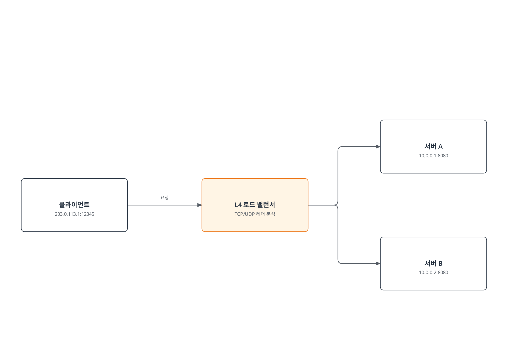

[🔍 인터랙티브 다이어그램 보기](https://www.atomai.click/kubernetes-docs/archmaps/ko-networking-cilium-networking-concepts-12.html)

분기는 가능한 백엔드 선택이며 하나의 연결을 두 서버에 방송한다는 뜻이 아닙니다. L4 전달은 암호화된 HTTP 내용을 검사하지 않고 TLS를 운반할 수 있습니다.

#### 2. L7(애플리케이션 계층) 로드 밸런싱

L7 로드 밸런싱은 HTTP 헤더, URL, 쿠키 등과 같은 애플리케이션 계층 정보를 기반으로 트래픽을 분산합니다.

- **작동 방식**: HTTP/HTTPS 요청 내용을 검사하여 라우팅 결정
- **장점**: 콘텐츠 기반 라우팅, 고급 트래픽 관리, 보안 기능
- **단점**: 프록시 처리 비용; HTTPS의 HTTP 내용 검사에는 적절한 TLS 종료가 필요
- **사용 사례**: 웹 애플리케이션, 마이크로서비스, API 게이트웨이

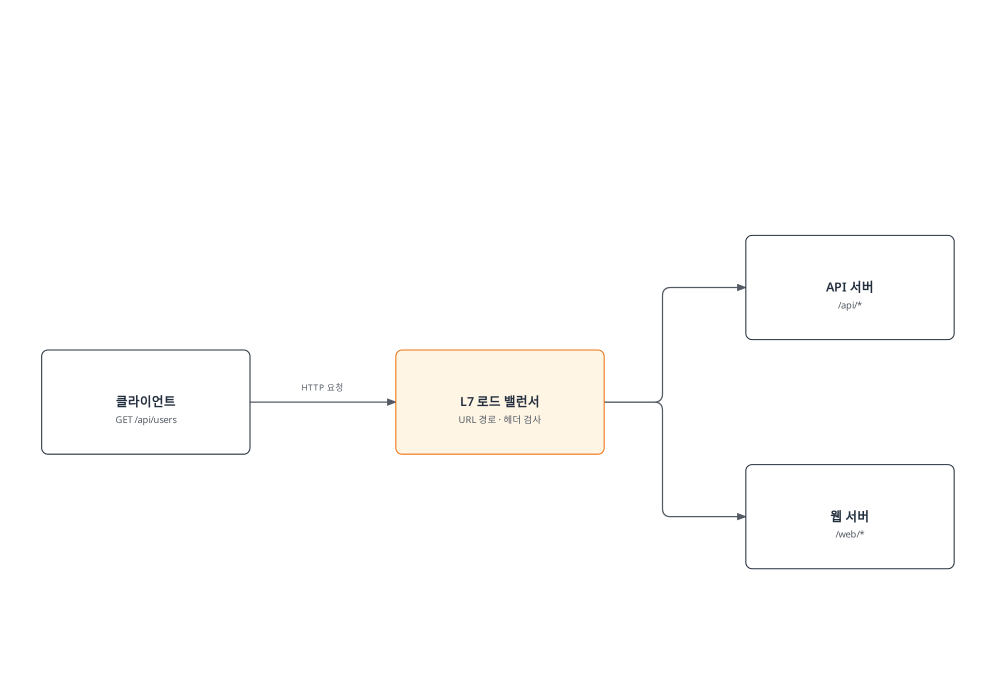

[🔍 인터랙티브 다이어그램 보기](https://www.atomai.click/kubernetes-docs/archmaps/ko-networking-cilium-networking-concepts-13.html)

선택한 경로는 요청 속성에 따라 달라집니다. HTTPS의 HTTP 내용 기반 라우팅에는 적절한 TLS 종료·검사 경로가 필요합니다.

### 로드 밸런싱 알고리즘

로드 밸런싱 알고리즘은 트래픽을 백엔드 서버에 분산하는 방법을 결정합니다.

#### 1. 라운드 로빈(Round Robin)

- **작동 방식**: 순차적으로 각 백엔드 서버에 요청 분배
- **장점**: 간단한 순차 선택; 같은 요청 수가 같은 백엔드 작업량을 뜻하지는 않음
- **단점**: 서버 용량 차이나 현재 부하를 고려하지 않음
- **변형**: 가중치 라운드 로빈(서버 용량에 따른 가중치 적용)

#### 2. 최소 연결(Least Connections)

- **작동 방식**: 활성 연결이 가장 적은 서버로 새 요청 전달
- **장점**: 서버 부하 고려, 긴 연결 처리에 효과적
- **단점**: 연결 수가 항상 부하를 정확히 반영하지는 않음
- **변형**: 가중치 최소 연결(서버 용량에 따른 가중치 적용)

#### 3. IP 해시(IP Hash)

- **작동 방식**: 클라이언트 IP 주소를 해싱하여 일관된 백엔드 서버 선택
- **장점**: 입력·백엔드 구성이 유지되는 동안 선택을 안정화할 수 있으나 영구 세션 저장소는 아님
- **단점**: 불균등한 분배 가능성, 특정 서버에 과부하 발생 가능
- **변형**: 소스-목적지 IP 해시(소스 및 목적지 IP 모두 고려)

#### 4. 최소 응답 시간(Least Response Time)

- **작동 방식**: 응답 시간이 가장 짧은 서버로 요청 전달
- **장점**: 성능 및 가용성 고려, 지연 시간에 민감한 애플리케이션에 적합
- **단점**: 응답 시간 측정 오버헤드, 네트워크 변동성에 영향 받음
- **변형**: 가중치 응답 시간(서버 용량과 응답 시간 모두 고려)

#### 5. 임의 선택(Random)

- **작동 방식**: 무작위로 백엔드 서버 선택
- **장점**: 간단한 구현, 특별한 상태 추적 불필요
- **단점**: 불균등한 분배 가능성
- **변형**: 가중치 임의 선택(서버 용량에 따른 확률 조정)

### 로드 밸런서 배포 모델

#### 1. 하드웨어 로드 밸런서

- **특징**: 전용 물리적 장비
- **장점**: 고성능, 안정성, 전용 하드웨어 가속
- **단점**: 비용, 확장성 제한, 유연성 부족
- **예**: 애플리케이션 전달 컨트롤러 어플라이언스; 일부 제품군은 가상·소프트웨어 형태도 제공

#### 2. 소프트웨어 로드 밸런서

- **특징**: 범용 서버에서 실행되는 소프트웨어
- **장점**: 유연성, 비용 효율성, 프로그래밍 가능
- **단점**: 용량은 구현·하드웨어·워크로드에 따라 달라지며 소프트웨어가 모든 어플라이언스보다 본질적으로 느린 것은 아님
- **예**: NGINX, HAProxy, Envoy

#### 3. 클라우드 로드 밸런서

- **특징**: 클라우드 제공업체가 관리하는 서비스
- **장점**: 관리 오버헤드 감소, 자동 확장, 고가용성
- **단점**: 제공업체 종속성, 제한된 커스터마이징
- **예**: AWS ELB/ALB/NLB, Google Cloud Load Balancing, Azure Load Balancer

#### 4. 컨테이너 네이티브 로드 밸런서

- **특징**: 컨테이너 환경에 최적화된 로드 밸런싱
- **장점**: 컨테이너 오케스트레이션과의 통합, 동적 서비스 디스커버리
- **단점**: 컨테이너 환경에 특화됨
- **예**: Kubernetes 서비스, Istio, Cilium

### Kubernetes에서의 로드 밸런싱

Kubernetes는 여러 수준의 로드 밸런싱을 제공합니다:

#### 1. 서비스 로드 밸런싱

- **ClusterIP**: 클러스터 내부 로드 밸런싱
- **NodePort**: 노드 포트를 통한 외부 액세스
- **LoadBalancer**: 외부 로드 밸런서 프로비저닝
- **ExternalName**: 외부 서비스에 대한 DNS 별칭

#### 2. Ingress 컨트롤러

- L7 로드 밸런싱 및 라우팅 제공
- URL 기반 라우팅과 TLS 종료; 인증 기능은 컨트롤러와 구성에 따라 다름
- Traefik, HAProxy, Istio 기반 등의 구현이 있음. 커뮤니티 `ingress-nginx`는 2026년 3월에 유지 관리를 종료했으며 남아 있는 배포 파일이 현재 유지 관리되는 설치 권장은 아님

#### 3. 서비스 메시

- 마이크로서비스 간 고급 트래픽 관리
- 세분화된 라우팅, 트래픽 분할, 장애 주입
- 예: Istio, Linkerd, Consul 서비스 메시; 트래픽 관리·보안 기능 범위는 구현마다 다름

### Cilium에서의 로드 밸런싱

Cilium은 eBPF를 활용하여 효율적인 로드 밸런싱을 구현합니다:

#### 1. eBPF 기반 로드 밸런싱

- **kube-proxy 대체**: 커널 내에서 직접 서비스 로드 밸런싱
- **성능**: 지원 BPF 경로가 일반 스택 일부를 피할 수 있으며 실제 워크로드에서 효과를 측정
- **확장성**: 대규모 서비스 및 엔드포인트 지원
- **연결 추적 최적화**: 효율적인 상태 관리

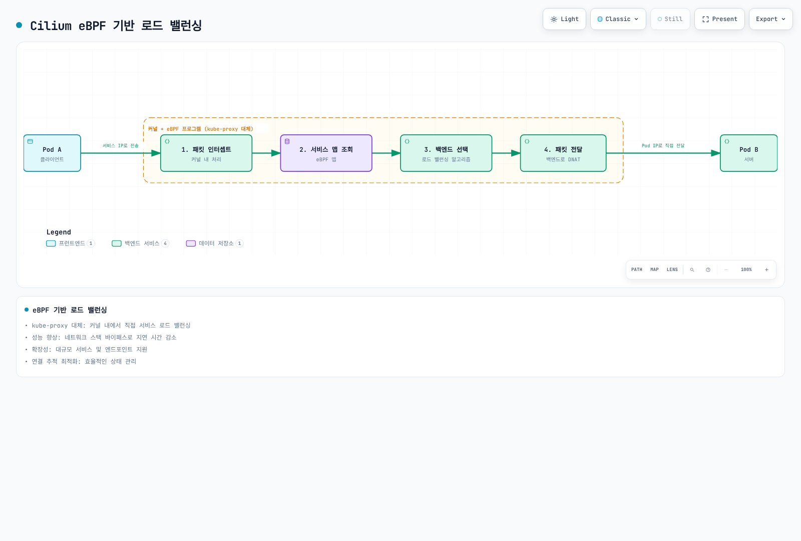

[🔍 인터랙티브 다이어그램 보기](https://www.atomai.click/kubernetes-docs/archmaps/ko-networking-cilium-networking-concepts-14.html)

패킷 경로의 Service 변환 예입니다. 소켓 수준 로드 밸런싱은 Service IP 패킷이 만들어지기 전에 백엔드를 선택할 수도 있습니다. 지연 개선은 실제 경로에서 측정해야 합니다.

#### 2. 로드 밸런싱 알고리즘

BPF Service 알고리즘은 기본값 **random**과 **Maglev**입니다. Maglev는 흐름 정보를 해싱하며 단순한 출발지 IP 어피니티가 아닙니다. 일반 소켓 수준 east-west 선택 경로와 Maglev가 적용되는 외부 패킷 경로도 구분합니다.

`ClientIP` 세션 어피니티는 Service에 별도로 설정합니다. 어피니티 시간 제한은 ‘Maglev 타임아웃’이 아니며 Maglev가 주기적으로 세션을 재분배하는 타이머는 없습니다. 구성원·시드·테이블 변경으로 선택이 바뀔 수 있고 일관된 해싱이라고 제거된 백엔드가 연결을 계속 처리할 수는 없습니다.

#### 3. L7 로드 밸런싱

Cilium은 L7(애플리케이션 계층) 로드 밸런싱도 지원합니다:

- **HTTP 헤더 기반 라우팅**: 특정 헤더 값에 따른 라우팅
- **URL 경로 기반 라우팅**: URL 패턴에 따른 트래픽 분배
- **gRPC 라우팅**: gRPC 메서드 및 메타데이터 기반 라우팅
- **Kafka**: 현재 Cilium에는 이전 Kafka 토픽 L7 정책·라우팅 기능이 없으므로 브로커에 맞는 제어를 사용

#### 4. 글로벌 서비스 로드 밸런싱

Cilium은 여러 클러스터에 걸친 로드 밸런싱을 지원합니다:

- **클러스터 간 로드 밸런싱**: 여러 클러스터의 백엔드 간 트래픽 분산
- **지역 선호**: 구성된 local/remote 어피니티이며 네트워크 지연을 자동 측정하는 기능은 아님
- **장애 처리**: 엔드포인트 상태와 원격 캐시 동작에 의존; 기본 cache TTL 0은 오래된 원격 상태를 유지할 수 있으므로 애플리케이션 장애 조치를 시험해야 함

#### Cilium 로드 밸런싱 구성 예제:

준비된 설치용 Helm 값입니다. 해시 시드는 유효한 **12바이트 base64 학습용 값**입니다. 배포에는 참여 노드가 공유할 임의 시드를 생성·보존하고 시드·테이블 변경의 연결 영향을 검토합니다. [준비된 로드 밸런싱 프로필](05-l2-l7-networking.md)을 참고합니다.

```yaml
# load-balancing-values.yaml
kubeProxyReplacement: true
loadBalancer:
  algorithm: maglev
maglev:
  tableSize: 16381
  hashSeed: AAECAwQFBgcICQoL
```
## 네트워크 보안 기초

네트워크 보안은 네트워크 인프라, 애플리케이션 및 데이터를 무단 액세스, 오용, 장애 또는 수정으로부터 보호하는 관행입니다. 컨테이너 환경에서는 동적이고 분산된 특성으로 인해 네트워크 보안이 더욱 중요합니다.

### 네트워크 보안의 핵심 개념

#### 1. 심층 방어(Defense in Depth)

심층 방어는 개별 실패의 영향을 줄이기 위해 제어를 조합하는 접근입니다. 공유 의존성이나 공통 구성 오류는 여러 계층에 동시에 영향을 줄 수 있습니다.

- **다중 보안 계층**: 네트워크, 호스트, 애플리케이션, 데이터 수준의 보호
- **중복 제어**: 다양한 보안 메커니즘의 조합
- **실패 격리**: 경계를 설계·시험해야 하며 실패의 독립성이 자동으로 보장되지는 않음
- **위협 탐지 및 대응**: 각 계층에서의 모니터링 및 대응

#### 2. 최소 권한 원칙

최소 권한 원칙은 사용자, 프로세스 또는 애플리케이션에 작업 수행에 필요한 최소한의 권한만 부여하는 보안 관행입니다.

- **세분화된 액세스 제어**: 필요한 리소스에만 액세스 제한
- **권한 분리**: 다양한 기능에 대한 권한 분리
- **기본 거부**: 명시적으로 허용되지 않은 모든 액세스 거부
- **정기적인 검토**: 권한의 정기적인 감사 및 조정

#### 3. 네트워크 세분화

네트워크 세분화는 네트워크를 더 작은 세그먼트 또는 영역으로 분할하여 보안을 강화하고 위협의 측면 이동을 제한하는 기술입니다.

- **보안 영역**: 유사한 보안 요구 사항을 가진 시스템 그룹화
- **마이크로세분화**: 워크로드 수준의 세분화된 제어
- **경계 보호**: 영역 간 트래픽 제어 및 모니터링
- **위협 격리**: 침해의 영향 범위 제한

#### 4. 암호화

암호화는 권한이 없는 당사자가 읽을 수 없도록 데이터를 변환하는 프로세스입니다.

- **전송 중 암호화**: 네트워크를 통해 이동하는 데이터 보호(예: 지원되는 TLS)
- **저장 중 암호화**: 디스크 또는 데이터베이스에 저장된 데이터 보호
- **엔드-투-엔드 암호화**: 전체 통신 경로에 걸쳐 데이터 보호
- **키 관리**: 암호화 키의 안전한 생성, 저장 및 교체

### 컨테이너 네트워킹 보안 위협

컨테이너 환경은 고유한 보안 과제를 제시합니다:

#### 1. 네트워크 기반 공격

- **DDoS(분산 서비스 거부) 공격**: 서비스 가용성을 방해하기 위한 대량의 트래픽
- **포트 스캐닝**: 열린 포트 및 취약점 탐색
- **ARP 스푸핑**: 네트워크 트래픽을 가로채기 위한 주소 확인 프로토콜 조작
- **DNS 포이즈닝**: DNS 조회를 악의적인 대상으로 리디렉션

#### 2. 애플리케이션 계층 공격

- **SQL 인젝션**: 악의적인 SQL 코드 삽입
- **XSS(크로스 사이트 스크립팅)**: 클라이언트 측 스크립트 삽입
- **CSRF(크로스 사이트 요청 위조)**: 인증된 사용자를 통한 악의적인 작업 수행
- **명령 인젝션**: 시스템 명령 실행을 위한 악의적인 입력

#### 3. 컨테이너 특화 위협

- **이미지 취약점**: 취약한 구성 요소가 포함된 컨테이너 이미지
- **권한 에스컬레이션**: 경계 내부 또는 외부로의 권한 상승이며 항상 컨테이너 탈출과 같은 사건은 아님
- **측면 이동**: 한 컨테이너에서 다른 컨테이너로의 무단 액세스
- **볼륨 마운트 악용**: 민감한 호스트 경로에 대한 액세스

### 네트워크 보안 제어

#### 1. 방화벽

방화벽은 정의된 보안 규칙에 따라 네트워크 트래픽을 필터링하는 네트워크 보안 시스템입니다.

- **패킷 필터링**: IP 주소, 포트, 프로토콜 기반 필터링
- **상태 검사**: 연결 상태를 추적하여 컨텍스트 기반 결정
- **애플리케이션 계층 필터링**: 애플리케이션 프로토콜 이해 및 검사
- **차세대 방화벽(NGFW)**: 고급 위협 탐지 및 방지 기능

#### 2. 침입 탐지 및 방지 시스템(IDS/IPS)

IDS/IPS는 네트워크 트래픽을 모니터링하고 악의적인 활동을 탐지하거나 차단하는 시스템입니다.

- **시그니처 기반 탐지**: 알려진 공격 패턴 매칭
- **이상 탐지**: 정상 동작에서 벗어난 활동 식별
- **행동 모니터링**: 의심스러운 활동 패턴 분석
- **자동 대응**: 탐지된 위협에 대한 실시간 대응

#### 3. 네트워크 정책

네트워크 정책은 네트워크 내에서 허용되는 통신을 정의하는 규칙 집합입니다.

- **인그레스 제어**: 들어오는 트래픽 제한
- **이그레스 제어**: 나가는 트래픽 제한
- **세분화된 정책**: 워크로드 수준의 통신 제어
- **레이블 기반 정책**: 동적 환경에서의 유연한 정책 적용

#### 4. 암호화 프로토콜

암호화 프로토콜은 네트워크를 통한 안전한 통신을 제공합니다.

- **TLS**: 웹 트래픽과 API 통신 보호; SSL 프로토콜은 폐기됨
- **IPsec**: 네트워크 계층 암호화
- **WireGuard**: 현대적이고 효율적인 VPN 프로토콜
- **mTLS(상호 TLS)**: 클라이언트와 서버 모두의 인증

### Kubernetes에서의 네트워크 보안

Kubernetes는 컨테이너화된 애플리케이션의 네트워크 보안을 위한 여러 메커니즘을 제공합니다:

#### 1. 네트워크 정책

Kubernetes NetworkPolicy는 선택한 Pod의 L3/L4 허용을 지정합니다. 집행할 네트워크 구현이 필요하며 적용되는 정책의 허용은 합산됩니다. 기존 연결·hostNetwork 경로의 의미도 따로 확인합니다.

- **포드 선택기**: 레이블을 기반으로 정책이 적용되는 포드 선택
- **인그레스 규칙**: 들어오는 트래픽 제어
- **이그레스 규칙**: 나가는 트래픽 제어
- **CIDR 기반 규칙**: IP 범위 기반 필터링

별도 네임스페이스의 L4 예제로, 레이블이 맞는 frontend/API/database와 해당 CoreDNS 레이블을 가정합니다. DNS egress를 포함합니다. 넓은 L4 허용은 겹치는 L7 제한을 우회할 수 있으므로 뒤의 L7 예제와 분리합니다.

```yaml
# api-l4-policy.yaml
apiVersion: networking.k8s.io/v1
kind: NetworkPolicy
metadata:
  name: api-allow
  namespace: cilium-policy-l4-demo
spec:
  podSelector:
    matchLabels:
      app: api
  policyTypes:
  - Ingress
  - Egress
  ingress:
  - from:
    - podSelector:
        matchLabels:
          app: frontend
    ports:
    - protocol: TCP
      port: 8080
  egress:
  - to:
    - podSelector:
        matchLabels:
          app: database
    ports:
    - protocol: TCP
      port: 5432
  - to:
    - namespaceSelector:
        matchLabels:
          kubernetes.io/metadata.name: kube-system
      podSelector:
        matchLabels:
          k8s-app: kube-dns
    ports:
    - protocol: UDP
      port: 53
    - protocol: TCP
      port: 53
```

#### 2. 서비스 메시 보안

서비스 메시는 마이크로서비스 간의 통신을 관리하고 보호하는 인프라 계층입니다.

- **mTLS**: 서비스 간 암호화된 통신
- **인증 및 권한 부여**: 서비스 ID 확인 및 액세스 제어
- **트래픽 정책**: 세분화된 라우팅 및 액세스 제어
- **관찰 가능성**: 서비스 간 통신에 대한 가시성

#### 3. 보안 컨텍스트

보안 컨텍스트는 포드 및 컨테이너의 권한 및 액세스 제어 설정을 정의합니다.

- **권한 제한**: 루트가 아닌 사용자로 실행
- **기능 제한**: 필요한 Linux 기능만 허용
- **읽기 전용 루트 파일 시스템**: 컨테이너 루트 파일 시스템 쓰기를 제한하지만 마운트 볼륨은 쓰기 가능할 수 있음
- **seccomp 및 AppArmor**: 시스템 호출 및 애플리케이션 동작 제한

### Cilium의 네트워크 보안 기능

Cilium은 eBPF를 활용하여 강력한 네트워크 보안 기능을 제공합니다:

#### 1. 신원 기반 보안

Cilium은 보안 관련 레이블에서 얻은 워크로드 ID 정책과 구성된 범위의 명시적 CIDR/IP 제어를 지원합니다.

- **레이블 기반 정책**: 동적 환경에서의 일관된 보안
- **서비스 계정 기반 정책**: Kubernetes 서비스 계정을 기반으로 한 액세스 제어
- **DNS 기반 정책**: FQDN을 기반으로 한 이그레스 제어
- **API 인식 보안**: HTTP 메서드 및 경로 기반 필터링

`toCIDR`는 목적지 범위를 선택하지만 기본적으로 클러스터 내부 관리 Pod·노드는 CIDR 선택자에 일치하지 않습니다. 이 버전에는 해당 경우를 위한 명시적 Beta 선택 기능이 있습니다. `world` 엔티티는 알려진 모든 클러스터·ClusterMesh ID가 아니라 외부 엔드포인트를 대상으로 합니다. `world`를 모든 클러스터 허용의 동의어로 쓰지 말고 적절한 ID·엔티티 범위를 선택합니다.

#### 2. 투명한 암호화

Cilium은 애플리케이션 변경 없이 지원 경로를 암호화할 수 있습니다. 노드 터널이 동일 노드 트래픽이나 모든 외부 목적지를 보호하지는 않습니다. 별도 SPIRE 상호 인증 핸드셰이크 자체는 애플리케이션 트래픽을 암호화하지 않으며 Beta ztunnel 워크로드 mTLS에는 별도의 전제 조건이 있습니다.

- **IPsec**: 노드 간 트래픽에 대한 네트워크 계층 암호화
- **WireGuard**: 현대적이고 효율적인 암호화 프로토콜
- **투명한 통합**: 애플리케이션 변경 없이 암호화 적용
- **키 교체**: 선택 모드의 키 수명을 따르며 Cilium IPsec에는 제공한 키 자료와 문서화된 Secret 교체 절차가 필요

#### 3. 위협 탐지 및 가시성

Cilium/Hubble은 조사에 사용할 네트워크 관측 데이터를 제공합니다. 완전한 IDS/WAF, 런타임 집행이나 알림·대응에는 적절한 별도 구성 또는 연동이 필요합니다.

- **Hubble**: 네트워크 흐름 모니터링 및 분석
- **흐름 로그**: 포드 간 통신에 대한 상세한 로그
- **이상 탐지**: 외부 탐지 규칙으로 관측 패턴을 분석할 수 있으며 Hubble이 모든 공격을 자동 분류하지는 않음
- **보안 이벤트 알림**: 알림·SIEM 연동을 구성하고 이벤트 손실, 잡음과 불완전한 관측을 고려

#### 4. L3-L7 정책 시행

Cilium은 네트워크 계층부터 애플리케이션 계층까지 포괄적인 정책 시행을 제공합니다.

- **L3/L4 정책**: IP 및 포트 기반 필터링
- **L7 HTTP 필터링**: URL, 메서드, 헤더 기반 제어
- **L7 gRPC 필터링**: gRPC 메서드 및 메타데이터 기반 제어
- **DNS 정책**: 질의 필터링과 FQDN 규칙용 DNS 관측; 현재 Kafka 토픽 L7 정책은 없음

#### Cilium 네트워크 보안 구성 예제:

L4 예제와 다른 네임스페이스를 사용하는 L7 대안 정책입니다. 관측 가능한 평문 HTTP 또는 적절한 TLS 검사 경로, 실제 레이블 의존성과 DNS 연결이 필요합니다. `.example` 외부 이름은 자리표시자이며 작동하는 외부 서비스를 제공하지 않습니다.

```yaml
# api-l7-policy.yaml
apiVersion: cilium.io/v2
kind: CiliumNetworkPolicy
metadata:
  name: secure-api
  namespace: cilium-policy-l7-demo
spec:
  endpointSelector:
    matchLabels:
      app: api
  ingress:
  - fromEndpoints:
    - matchLabels:
        k8s:io.kubernetes.pod.namespace: cilium-policy-l7-demo
        k8s:app: frontend
    toPorts:
    - ports:
      - port: '8080'
        protocol: TCP
      rules:
        http:
        - method: GET
          path: /api/v1/products
  egress:
  - toEndpoints:
    - matchLabels:
        k8s:io.kubernetes.pod.namespace: kube-system
        k8s:k8s-app: kube-dns
    toPorts:
    - ports:
      - port: '53'
        protocol: UDP
      - port: '53'
        protocol: TCP
      rules:
        dns:
        - matchPattern: '*'
  - toEndpoints:
    - matchLabels:
        k8s:io.kubernetes.pod.namespace: cilium-policy-l7-demo
        k8s:app: database
    toPorts:
    - ports:
      - port: '5432'
        protocol: TCP
  - toFQDNs:
    - matchName: api.external-service.example
    toPorts:
    - ports:
      - port: '443'
        protocol: TCP
```

### 네트워크 보안 모범 사례

#### 1. 기본 거부 정책

- 명시적으로 허용된 트래픽만 허용하는 기본 거부 정책 구현
- 필요한 통신 경로만 열어두기
- 정기적인 정책 검토 및 불필요한 규칙 제거
- 정책 변경에 대한 감사 추적 유지

#### 2. 심층 방어 접근 방식

- 여러 보안 계층 구현
- 네트워크, 호스트, 애플리케이션 수준의 보호 조합
- 다양한 보안 메커니즘의 중복 제어
- 단일 실패 지점 제거

#### 3. 최소 권한 네트워킹

- 필요한 최소한의 네트워크 액세스만 허용
- 서비스별 세분화된 정책 정의
- 불필요한 포트 및 프로토콜 차단
- 정기적인 액세스 검토 및 조정

#### 4. 지속적인 모니터링 및 감사

- 네트워크 트래픽 및 정책 위반 모니터링
- 이상 징후 및 잠재적 위협 탐지
- 보안 이벤트에 대한 알림 및 대응
- 정기적인 보안 감사 및 취약점 평가

## 공식 근거

- [Cilium routing](https://raw.githubusercontent.com/cilium/cilium/v1.20.1/Documentation/network/concepts/routing.rst)
- [Cilium chart values](https://raw.githubusercontent.com/cilium/cilium/v1.20.1/install/kubernetes/cilium/values.yaml)
- [Kube-proxy replacement](https://raw.githubusercontent.com/cilium/cilium/v1.20.1/Documentation/network/kubernetes/kubeproxy-free.rst)
- [Masquerading](https://raw.githubusercontent.com/cilium/cilium/v1.20.1/Documentation/network/concepts/masquerading.rst)
- [BGP Control Plane](https://raw.githubusercontent.com/cilium/cilium/v1.20.1/Documentation/network/bgp-control-plane/bgp-control-plane.rst)
- [Global Services](https://raw.githubusercontent.com/cilium/cilium/v1.20.1/Documentation/network/clustermesh/global-services.rst)
- [Policy language](https://raw.githubusercontent.com/cilium/cilium/v1.20.1/Documentation/security/policy/layer3.rst)
- [DNS policy](https://raw.githubusercontent.com/cilium/cilium/v1.20.1/Documentation/security/dns.rst)
- [IPsec](https://raw.githubusercontent.com/cilium/cilium/v1.20.1/Documentation/security/network/encryption-ipsec.rst)
- [WireGuard](https://raw.githubusercontent.com/cilium/cilium/v1.20.1/Documentation/security/network/encryption-wireguard.rst)
- [Kubernetes network model](https://kubernetes.io/docs/concepts/services-networking/)
- [Services](https://kubernetes.io/docs/concepts/services-networking/service/)
- [DNS for Services and Pods](https://kubernetes.io/docs/concepts/services-networking/dns-pod-service/)
- [NetworkPolicy](https://kubernetes.io/docs/concepts/services-networking/network-policies/)
- [CNI specification](https://raw.githubusercontent.com/containernetworking/cni/main/SPEC.md)
- [Docker bridge networking](https://docs.docker.com/engine/network/drivers/bridge/)
- [Docker host networking](https://docs.docker.com/engine/network/drivers/host/)
- [Ingress NGINX retirement](https://kubernetes.io/blog/2025/11/11/ingress-nginx-retirement/)
- [Internet architecture / RFC 1122](https://www.rfc-editor.org/rfc/rfc1122.txt)
- [DNS / RFC 1034](https://www.rfc-editor.org/rfc/rfc1034.txt)
- [NAT terminology / RFC 2663](https://www.rfc-editor.org/rfc/rfc2663.txt)
- [NAT mapping behavior / RFC 4787](https://www.rfc-editor.org/rfc/rfc4787.txt)
- [RIP v2 / RFC 2453](https://www.rfc-editor.org/rfc/rfc2453.txt)
- [EIGRP / RFC 7868](https://www.rfc-editor.org/rfc/rfc7868.txt)

## 퀴즈

이 장에서 배운 내용을 테스트하려면 [주제 퀴즈](../../quizzes/networking/cilium/networking-concepts-quiz.md)를 풀어보세요.
