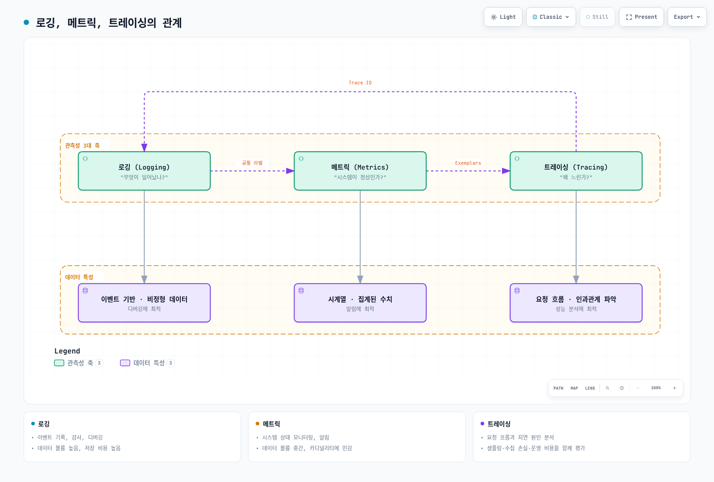
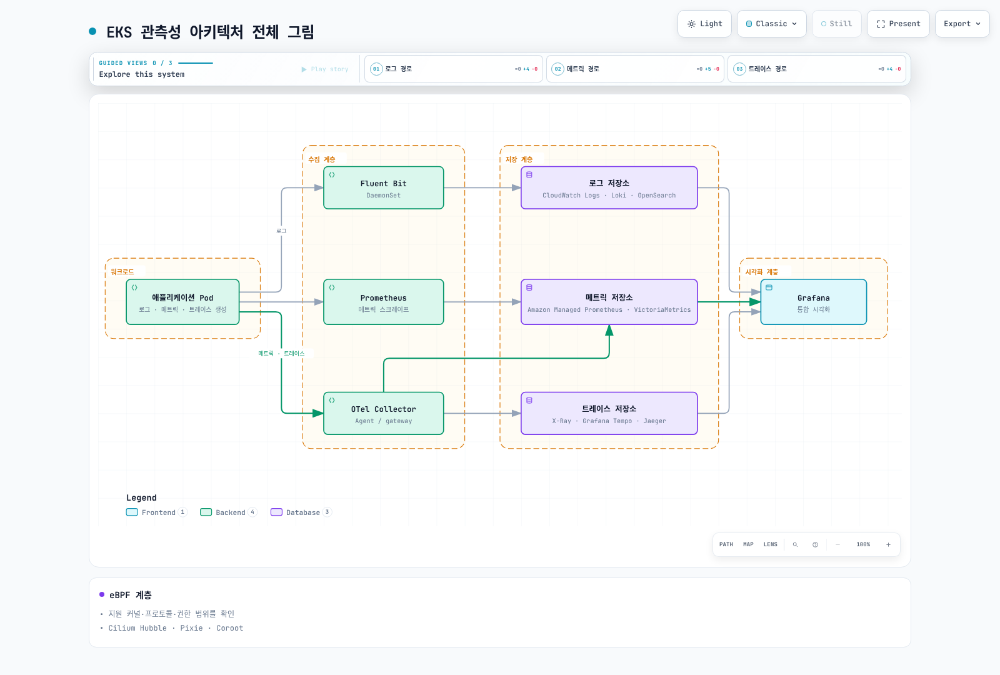
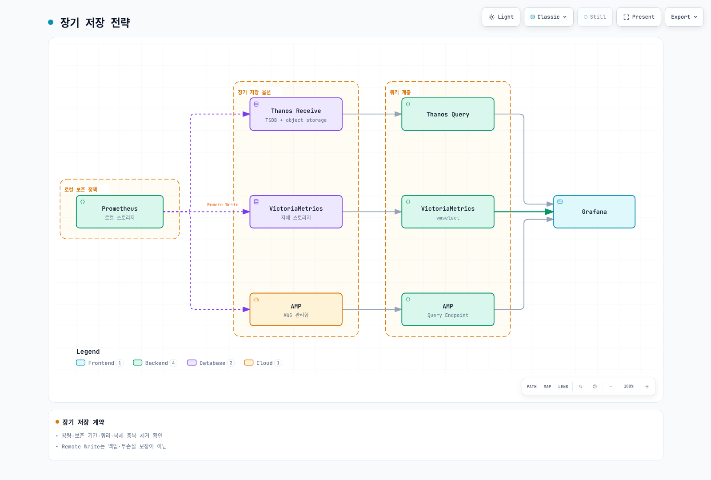
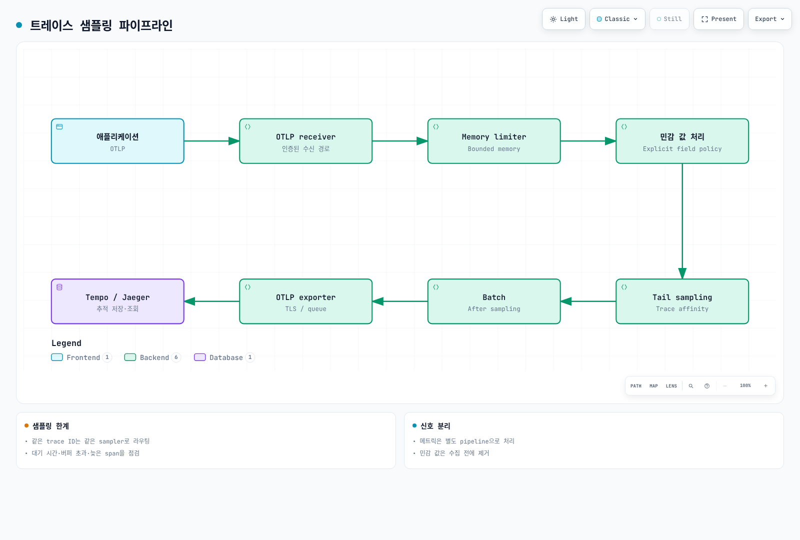
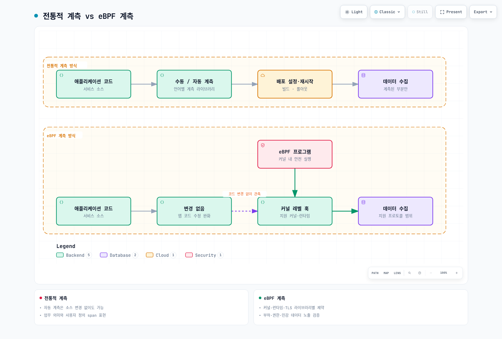
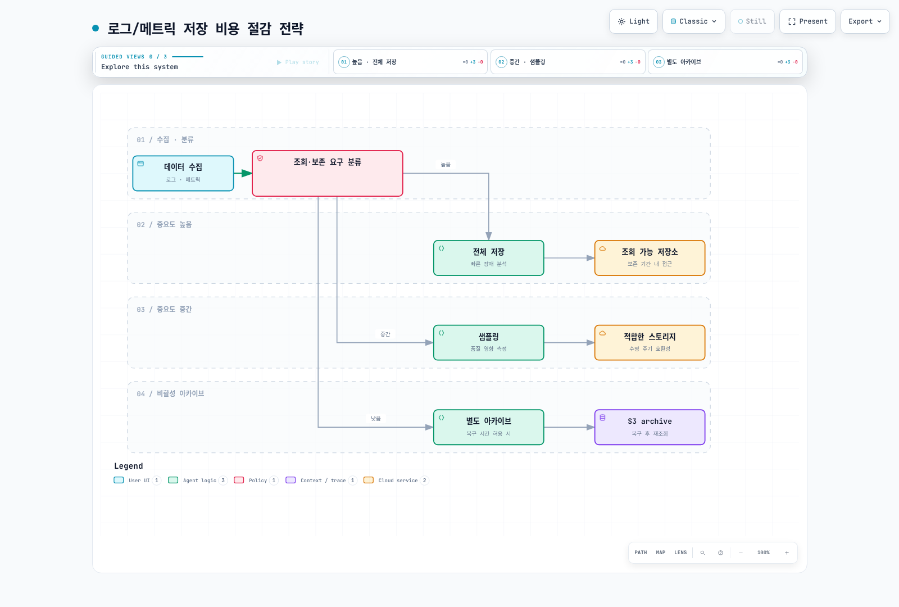
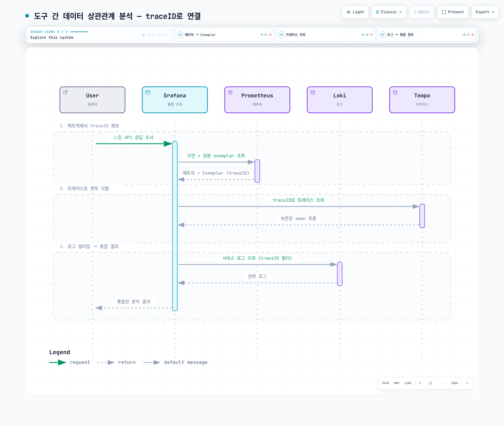
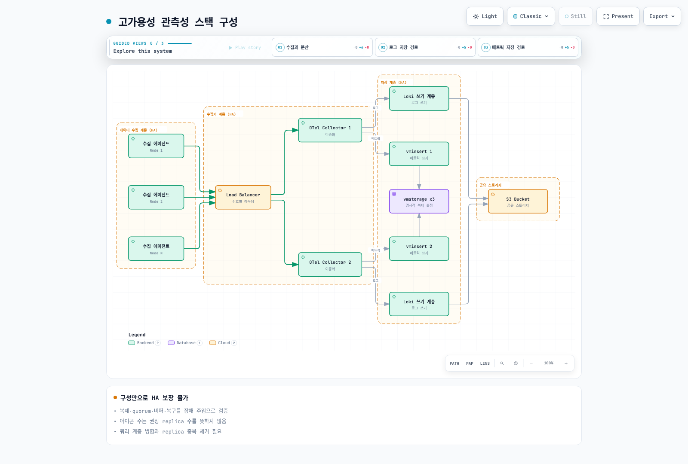
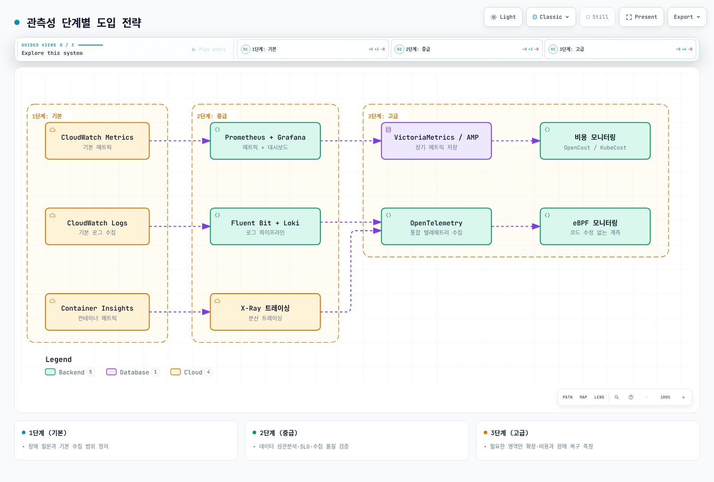

# EKS 관측성 최적화 가이드

> **검증 예제 버전**: Prometheus 3.14.0 · OTel Collector Contrib 0.160.0 · Alertmanager 0.34.0 · OpenCost 1.121.2/chart 2.5.31

> **마지막 업데이트**: 2026년 9월 13일

관측성 최적화는 장애 조사에 필요한 질문, 수집 품질, 실제 비용에서 시작합니다. 노드 수만으로 수집량·조회 부하·보존 비용·운영 인력을 예측할 수 없습니다. 이 장은 [완전한 설정 예제](https://github.com/Atom-oh/kubernetes-docs/tree/main/examples/observability/optimization)를 제공하고 클러스터 설치는 각 배포 가이드로 연결합니다. native 검증에는 합성 데이터를 사용했으며 운영 성능 벤치마크가 아닙니다.

<span id="_1-1-로깅-메트릭-트레이싱의-관계"></span>

<span id="_1-2-각-축의-역할과-선택-기준"></span>

<span id="_1-3-eks-관측성-아키텍처-전체-그림"></span>

<span id="1-관측성-3대-축-개요"></span>

## 1. 관측성 3대 축 개요

로그는 사건을, 메트릭은 시간에 따른 집계 상태를, 트레이스는 계측된 요청 경로를 설명합니다. 추적 데이터가 없거나 대시보드가 조용하다는 사실만으로 서비스가 정상이라고 판단하면 안 됩니다. Collector의 drop·queue·export 실패와 scrape 상태도 함께 관찰합니다.



[🔍 인터랙티브 다이어그램 보기](https://www.atomai.click/kubernetes-docs/archmaps/ko-observability-09-observability-optimization-0.html)

메트릭에는 제한된 service/route/status 라벨을 사용합니다. 요청 ID처럼 카디널리티가 높은 값은 접근이 통제되는 로그·추적에 넣습니다. 계측·전파·샘플링·보존 상태에 따라 trace의 일부 span이 없을 수 있습니다.



[🔍 인터랙티브 다이어그램 보기](https://www.atomai.click/kubernetes-docs/archmaps/ko-observability-09-observability-optimization-1.html)

노드 에이전트는 로컬 로그를 읽고 gateway는 중앙 정책을 적용하는 등 역할이 다릅니다. Tail sampling에는 trace affinity가 필요합니다. 여러 DaemonSet 앞에 임의 분산하는 Load Balancer를 두는 것만으로 올바른 tail sampling이 구현되지 않습니다.

<span id="_2-1-로그-저장소-비교"></span>

<span id="_2-2-로그-에이전트-비교"></span>

<span id="_2-3-eks에서-fluent-bit-loki-구성-예제"></span>

<span id="2-로깅-솔루션-비교"></span>

## 2. 로깅 솔루션 비교

| 저장소 | 유용한 특징 | 비용·운영 제약 |
|---|---|---|
| CloudWatch Logs | 관리형 수집·보존·Logs Insights | Region, log class, 수집·저장·scan·quota |
| OpenSearch | 인덱스 기반 검색과 분석 | provisioned/serverless 용량, 인덱싱, replica, 저장·조회 부하 |
| Loki | 라벨 인덱스·LogQL·오브젝트 스토리지 | compute·cache·object request·보존·query fanout·운영 |
| ClickHouse | SQL 분석·스키마·압축 선택 | compute·저장·복제·수집 스키마·query tuning |

어떤 도구가 항상 가장 빠르거나 저렴한 것은 아닙니다. 같은 입력량·압축·보존·가용성·조회 지연·지원 범위를 비교합니다. S3 저장 단가만으로 Loki/Tempo 전체 비용을 계산하지 않습니다. 관리형 서비스에도 quota가 있습니다.

### 에이전트와 컨테이너 로그 형식

Fluent Bit·Fluentd·Vector는 plugin·언어·buffering·배포 방식이 다릅니다. “15 MB”, “초당 200K 메시지”처럼 고정된 성능 수치는 재현 가능한 workload·버전·하드웨어 근거가 있어야 합니다. 실제 record 크기·parser 비용·재시도·backpressure를 측정합니다.

현재 EKS의 containerd 로그는 CRI framing을 사용합니다. Docker JSON parser를 무조건 적용하거나 `/var/lib/docker/containers`가 있다고 가정하지 않습니다. 지원되는 container/CRI parser와 multiline 처리를 사용하고 host 로그는 읽기 전용, offset/buffer 상태는 별도 쓰기 가능한 위치에 둡니다. Kubernetes metadata enrichment에는 맞는 ServiceAccount/RBAC가 필요합니다. ConfigMap만으로 수집기가 배포되지는 않습니다.

Loki 라벨은 cluster·namespace·service 같은 안정적인 차원으로 제한합니다. Pod 라벨을 모두 자동 복사하면 stream 수가 폭증할 수 있습니다. [수집기 가이드](./logging/05-collectors.md)와 [Loki 가이드](./logging/01-loki.md)의 완전한 현재 프로필을 참고하고 Service·schema·storage·IAM·network 설정을 확인합니다.

### 필터와 확률 샘플링 구분

JSON을 `level` 필드로 파싱한 뒤 다음 Fluent Bit 필터 조각으로 정확한 DEBUG/TRACE 레벨을 제외할 수 있습니다.

```ini
[FILTER]
    Name     grep
    Match    application.*
    Exclude  level ^(DEBUG|TRACE)$
```

이 조각에는 해당 tag를 만드는 input/parser/output pipeline이 필요합니다. 임의 메시지 본문에 DEBUG라는 단어가 있다는 이유만으로 삭제하지 않습니다. Fluent Bit throttle의 `Rate`·`Window`는 이동 구간의 처리율 제한이며 10% 확률 샘플러가 아닙니다. drop 수를 측정하고 장애 분석·감사 요구를 검토한 뒤 필터를 적용합니다.

CloudWatch에는 문서화된 `cloudwatch_logs` 옵션을 사용합니다. 과거 예제의 `log_format json`, `max_batch_size`, `max_batch_put_limit`을 일반 JSON 출력·배치 옵션처럼 사용하지 않습니다. plugin이 batching을 처리하며 고정 버전의 지원 옵션을 확인해야 합니다. 새 group 생성 시 적용되는 `log_retention_days`만으로 모든 기존 group의 보존 기간이 설정되는 것은 아닙니다.

<span id="_3-1-메트릭-저장소-비교"></span>

<span id="_3-2-cardinality-관리-전략"></span>

<span id="_3-3-recording-rules로-쿼리-성능-개선"></span>

<span id="_3-4-장기-저장-전략"></span>

<span id="3-메트릭-수집-및-저장"></span>

## 3. 메트릭 수집 및 저장

Prometheus는 로컬 TSDB를 사용하고 sharding·remote write·query/aggregation 계층으로 배포 모델을 확장할 수 있습니다. VictoriaMetrics 단일 노드와 cluster 제품의 가용성·복제 특성은 다릅니다. AMP도 workspace quota와 설정 가능한 보존 기간을 갖습니다. 어느 경우에도 무제한 보존, “storage Pod 세 개면 자동 복제”, 모든 확장 쿼리의 동일한 동작을 가정하지 않습니다.

### 다른 지표를 지우지 않는 카디널리티 관리

`prometheus.yaml`은 알려진 histogram 하나의 일부 bucket만 drop합니다. histogram 외 지표와 `_sum`, `_count`, SLO bucket `le="0.5"`, `+Inf`는 유지합니다.

```yaml
- source_labels:
  - __name__
  - le
  regex: lab_http_request_duration_seconds_bucket;(0\.005|0\.01|0\.025|0\.05|0\.25)
  action: drop
```

`action: keep`으로 `.*_bucket;...`만 선택하면 일치하지 않는 다른 모든 지표와 `+Inf`까지 삭제할 수 있습니다. Bucket 변경은 quantile 정확도에 영향을 줍니다. 가능하면 계측 schema에서 조정하고 SLO에 필요한 경계를 유지합니다. Prometheus 3은 classic histogram의 `le` 값을 정규화하므로 `1`이 `1.0`으로 보이는 것처럼 실제 저장된 라벨에 맞춥니다.

`relabel_configs`는 scrape 전 발견된 target을, `metric_relabel_configs`는 수집된 sample을 변경합니다. 라벨 삭제는 집계가 아니며 시계열 충돌을 만들 수 있습니다. Discovery의 `__meta_*` 라벨도 자동으로 영구 sample 라벨이 되지 않습니다. 원천에서 라벨을 줄이고 남은 조합의 고유성을 검증합니다.

### Recording rule과 보존

반복 계산은 recording rule로 저장하고 service·cluster·namespace 차원을 일관되게 유지합니다. Node-exporter target에는 일반적으로 `instance`가 있으므로 만들지 않은 `node` 라벨로 집계하지 않습니다. Collector 자체 장애를 진단할 지표까지 모든 `go_.*`·`promhttp_.*` family와 함께 제거하지 않습니다.



[🔍 인터랙티브 다이어그램 보기](https://www.atomai.click/kubernetes-docs/archmaps/ko-observability-09-observability-optimization-2.html)

Remote-write queue는 백업이나 무손실 전달 보장이 아닙니다. WAL/queue 용량·재시도·인증·네트워크 단절·receiver 제한을 함께 설계합니다. Thanos sidecar의 block upload 방식은 그림의 Thanos Receive 경로와 다릅니다.

Prometheus Operator에서 `replicas: 2`, `shards: 3`이면 총 여섯 Pod입니다. 모든 Pod의 PVC·메모리 예산과 selector를 구성하고, shard 병합과 HA replica 중복 제거를 지원하는 query 계층을 둡니다. 중복 제거되지 않는 remote-write receiver에 두 replica를 보내면 지표가 중복 계산될 수 있습니다. 고정한 Operator CRD의 전용 query 설정을 확인하고 충돌하는 generic argument를 추가하지 않습니다.

<span id="_4-1-opentelemetry-개요-및-아키텍처"></span>

<span id="_4-2-트레이싱-백엔드-비교"></span>

<span id="_4-3-샘플링-전략"></span>

<span id="_4-4-eks에서-otel-collector-daemonset-구성"></span>

<span id="4-분산-트레이싱"></span>

## 4. 분산 트레이싱

Tempo는 trace ID 조회뿐 아니라 TraceQL을 지원합니다. Jaeger 2는 OTel 기반 구조와 명시적으로 선택한 storage를 사용합니다. X-Ray는 AWS 백엔드이며 현재 OTel/ADOT 연동 가이드를 따릅니다. 오래된 SDK 버전을 모든 배포의 기준으로 삼지 않습니다. Trace당 가격과 S3 가격만 비교하지 말고 수집·조회·저장·운영 비용을 포함합니다.



[🔍 인터랙티브 다이어그램 보기](https://www.atomai.click/kubernetes-docs/archmaps/ko-observability-09-observability-optimization-3.html)

### 샘플링과 affinity

Head sampling은 전체 요청 결과를 알기 전에 결정합니다. Collector probabilistic sampling은 데이터가 Collector에 도달한 이후 실행되므로 SDK의 head 결정과 같은 위치가 아닙니다. Tail sampling은 앞에서 삭제한 span을 복구할 수 없습니다.

기본 `trace-complete` 방식의 `decision_wait`는 수신한 span에 대한 timer 결정을 제어합니다. 모든 span의 도착이나 trace 완료를 보증하지 않습니다. 같은 trace ID는 같은 sampler로 라우팅합니다. 유입률 × 대기 시간에 burst와 span 크기 여유를 더해 buffer를 산정합니다. Buffer 초과·너무 큰 trace·재시작·늦은 span 때문에 모든 오류 trace를 보존한다는 약속이 깨질 수 있습니다.

`collector-tail-local.yaml`은 루프백에서 합성 데이터를 확인하는 예제이며 EKS manifest가 아닙니다. 1,000개 trace buffer, 2초 대기, 192 MiB memory limiter를 사용합니다. 운영 값은 실제 trace 길이와 컨테이너 메모리 여유에 맞춰 조정합니다.

```yaml
decision_wait: 2s
num_traces: 1000
maximum_trace_size_bytes: 1048576
policies:
- name: errors
  type: status_code
  status_code:
    status_codes:
    - ERROR
- name: slow
  type: latency
  latency:
    threshold_ms: 1000
- name: baseline
  type: probabilistic
  probabilistic:
    sampling_percentage: 10
```

이 positive policy 조합은 일치하는 오류·느린 trace를 유지하고 나머지에 확률 정책을 적용합니다. 전체 볼륨 90% 감소를 뜻하지 않습니다. Drop/composite/inverted policy의 결정 방식은 다르므로 “첫 번째 일치 규칙이 항상 우선”이라고 일반화하지 않습니다. 예제는 `sensitive_data`라는 특정 span attribute만 지웁니다. Span 이름·event·resource attribute·애플리케이션 로그도 명시적 데이터 정책에 따라 전송 전에 처리해야 합니다.

클러스터에는 [OpenTelemetry 가이드](./tracing/03-opentelemetry.md)와 [관측성 스택 실습](../labs/observability/02-observability-stack-lab.md)을 사용합니다. Operator injection annotation에는 Operator, 일치하는 `Instrumentation`, 지원 runtime image, workload 재시작이 필요합니다. OTLP HTTP/4318과 gRPC/4317, TLS/인증을 맞춥니다. Annotation만 추가해도 계측이 설치되는 것은 아닙니다.

<span id="_5-1-왜-ebpf-모니터링인가"></span>

<span id="_5-2-coroot-자동-서비스-맵-및-지연-시간-분석"></span>

<span id="_5-3-pixie-현재-new-relic-kubernetes-특화-관측성"></span>

<span id="_5-4-cilium-hubble-네트워크-흐름-관찰"></span>

<span id="_5-5-kepler-에너지-소비-모니터링"></span>

<span id="5-ebpf-기반-no-code-모니터링"></span>

## 5. eBPF 기반 No-Code 모니터링



[🔍 인터랙티브 다이어그램 보기](https://www.atomai.click/kubernetes-docs/archmaps/ko-observability-09-observability-optimization-4.html)

eBPF는 지원 protocol·kernel·runtime에서 소스 수정을 줄일 수 있습니다. 업무 의미, 모든 언어·라이브러리, 모든 TLS 트래픽을 자동 수집하는 것은 아닙니다. Uprobe가 지원 라이브러리 경계의 평문을 관찰하는 것과 일반적인 TLS 복호화는 다릅니다. 권한·민감 payload·kernel 호환성·실측 overhead를 확인합니다. SDK auto-instrumentation도 소스 변경을 피할 수 있지만 설정·재시작이 필요할 수 있습니다.

| 도구 | 현재 배포 시 확인할 내용 |
|---|---|
| Coroot | 기존 `coroot/coroot` chart는 deprecated입니다. 문서화된 Operator/Coroot CR 흐름을 사용합니다. Operator chart 0.9.10과 CE chart 0.3.3은 별개 구성요소이며 agent 권한·storage·인증을 검토합니다. |
| Pixie | Kernel/protocol 조건과 control-plane 선택이 있는 오픈소스입니다. 클러스터 내부 저장이 query 결과나 export가 절대 외부로 나가지 않는다는 뜻은 아닙니다. 실제 접근·데이터 경로를 확인합니다. |
| Cilium Hubble | 호환되는 Cilium 설치가 필요합니다. Flow·L7 policy/proxy·metric 범위가 다르며 모든 앱의 분산 추적을 대체하지 않습니다. |
| Kepler | 0.10+에서 과거 0.7 구조를 재작성했습니다. Metric과 배포 조건이 달라졌으므로 오래된 privileged/BPF DaemonSet을 복사하지 않습니다. |

Kepler 0.11.4 문서는 `kepler_pod_cpu_watts`, `kepler_pod_cpu_joules_total`과 `pod_namespace`/`pod_name` 라벨을 설명합니다. 실제 host에서 하드웨어 에너지 접근과 attribution이 동작해야 합니다. 일반 가상 EKS 노드에서 host RAPL 데이터가 노출된다고 보장하지 않습니다. 해당 release의 배포·하드웨어 지원 문서를 확인한 뒤 측정 정확도를 주장합니다.

```promql
# watts gauge는 이미 전력이다.
sum by (pod_namespace) (kepler_pod_cpu_watts)

# J/s = W이며 1000을 곱하면 mW이다.
rate(kepler_pod_cpu_joules_total[5m])
```

Exporter가 실행 중이거나 ready라는 사실만으로 하드웨어 측정이 정확한 것은 아닙니다. EKS Auto Mode·Fargate는 host 접근 조건이 다르므로 모든 곳에 privileged agent를 적용하지 않습니다. Hubble·Coroot·OpenCost UI는 인증과 네트워크 접근을 구성하기 전까지 비공개로 유지합니다.

<span id="_6-1-kubecost-opencost-설치-및-구성"></span>

<span id="_6-2-네임스페이스-팀별-비용-할당"></span>

<span id="_6-3-cloudwatch-비용-최적화"></span>

<span id="_6-4-로그-메트릭-저장-비용-절감-전략"></span>

<span id="6-비용-모니터링"></span>

## 6. 비용 모니터링

### OpenCost와 비용 할당

`opencost-values.yaml`은 chart 2.5.31/app 1.121.2를 사용하고 기존 Prometheus를 선택하며 Cloud Cost 수집을 비활성화합니다. OpenCost에 필요한 workload/resource/cost metric이 있는 실제 endpoint로 변경합니다. 접속 성공만으로 충분하지 않습니다. 보호된 Prometheus에는 승인된 인증·CA 구성을 적용합니다.

```bash
helm repo add opencost https://opencost.github.io/opencost-helm-chart
helm repo update opencost
helm upgrade --install opencost opencost/opencost --version 2.5.31   -n opencost --create-namespace -f opencost-values.yaml
kubectl -n opencost port-forward service/opencost 9003:9003 --address 127.0.0.1
# 다른 터미널에서 실행:
curl --fail --get http://127.0.0.1:9003/allocation/compute   --data-urlencode 'window=7d' --data-urlencode 'aggregate=namespace'
```

7일 결과를 요청하려면 충분한 입력 history가 필요합니다. Allocation 추정치는 AWS 청구서와 다릅니다. team·cost-center·cluster·namespace 라벨을 표준화하고 idle/shared 비용 배분을 정의한 뒤 CUR/Data Exports·credit·할인·상각과 대조합니다. AWS Cloud Cost에는 지원되는 `cloudIntegrationSecret` 형식, CUR/Athena/S3 및 범위가 제한된 identity 권한이 필요합니다. 과거 `exporter.aws.athenaProjectID` 같은 지원되지 않는 values 조각으로 연동되지 않습니다. AWS access key를 values에 넣지 않습니다.

### 보존 기간과 아카이브

보존 기간 변경 전에 대상 log group을 조회합니다.

```bash
aws logs describe-log-groups --log-group-name-prefix /eks/production/   --query 'logGroups[].{name:logGroupName,retention:retentionInDays,storedBytes:storedBytes}'   --output json
```

승인된 기간을 명시적으로 선택한 group에 인프라 설정으로 적용합니다. `storedBytes == 0`은 미사용을 뜻하지 않습니다. Subscription·producer·감사 요구·앞으로의 write가 남아 있을 수 있습니다. “빈 group”을 일괄 삭제하거나 tab으로 구분된 CLI text를 한 줄에 group 하나라고 간주하지 않습니다.



[🔍 인터랙티브 다이어그램 보기](https://www.atomai.click/kubernetes-docs/archmaps/ko-observability-09-observability-optimization-5.html)

활성 Loki/Tempo block을 무작정 Glacier로 전환하지 않습니다. 백엔드는 즉시 읽기를 요구하며 아카이브 객체를 자동 복구한다고 보장하지 않습니다. Backend retention/compaction과 object lifecycle을 함께 설계하고 복구·재조회를 시험합니다. 압축·필터·보존 절감률은 서로 중첩되므로 독립적인 수치처럼 합산하지 않습니다.

<span id="_7-1-grafana-기반-통합-대시보드-구성"></span>

<span id="_7-2-로그-메트릭-트레이스-연계-exemplars"></span>

<span id="_7-3-알림-전략-경고-피로-방지"></span>

<span id="_7-4-slo-sli-기반-모니터링"></span>

<span id="7-통합-관측성-대시보드"></span>

## 7. 통합 관측성 대시보드

[Grafana 가이드](./grafana/README.md)의 고정 provisioning을 사용해 `prometheus`·`loki`·`tempo` UID, 현재 `tracesToLogsV2`, 실제 HTTP/TLS endpoint를 맞춥니다. 환경 변수만으로 데이터 소스가 생성되지는 않습니다. Exemplar 라벨 이름과 JSON trace field는 앱 계측과 일치해야 합니다.

Prometheus feature switch는 CLI 또는 Operator의 지원 `enableFeatures` 필드에 설정하며 `prometheus.yml`의 `global.enable_features`가 아닙니다. 예제는 `storage.exemplars.max_exemplars`를 사용하고 저장 기능을 켤 때는 해당 버전의 feature flag도 적용합니다. 앱에는 collector 등록과 OpenMetrics exposition이 필요합니다. Raw request path나 unsampled/invalid trace ID를 exemplar 계측에 넣지 않습니다.

### 요청 SLO·burn rate·남은 에러 버짓

요청 기반 99.9% 가용성 SLO의 허용 bad request는 정해진 기간의 `전체 요청 × 0.001`입니다. 자동으로 “43분 downtime”이 되는 것은 아닙니다. 시간 기반 SLI와 요청 기반 SLI의 분모는 다릅니다.

`slo-rules.yaml`은 짧은 구간의 오류율과 요청 수로 가중한 30일 오류율을 구분합니다.

```promql
# 최근 burn rate:
service:http_5xx:ratio_5m / 0.001

# 30일 요청 에러 버짓의 잔여 비율:
1 - service:http_5xx:ratio_30d / 0.001
```

30일 비율은 분자와 분모에 `increase(counter[30d])`를 사용하며 최근 5분 비율로 대체하지 않습니다. 충분한 history와 수집 공백 검사가 필요합니다. 소진한 버짓은 음수일 수 있습니다. 데이터 부재·0요청을 완벽한 가용성으로 바꾸지 않습니다. `le="0.5"` bucket/count는 500ms 이내 요청의 비율이며 “p99 값 중 500ms 미만인 비율”이 아닙니다.

예제는 1h/5m 구간에서 14.4, 6h/30m 구간에서 6의 burn threshold를 함께 사용합니다. 30일 목표의 빠른/지속 소진을 위한 예시 정책이며 모든 서비스에 같은 severity가 맞는 것은 아닙니다. Service owner와 평가 구간·최소 traffic 신뢰도·대응 정책을 조정합니다. 한 번의 짧은 구간 추정치만으로 배포를 자동 중단하지 않습니다.

### 알림 라우팅

`alertmanager.yaml`은 현재 matcher, Asia/Seoul 업무 외 시간, 비어 있지 않은 cluster/node 라벨을 조건으로 하는 inhibition을 제공합니다. 누락 라벨끼리는 같다고 비교되어 무관한 알림까지 억제할 수 있습니다. `review-only` receiver에는 외부 integration이 없으며 전송 없이 라우팅 설정을 검증합니다. 운영에 쓰기 전에 승인된 연락처, Secret 기반 webhook/routing key와 receiver policy를 연결하고 delivery·inhibition을 시험합니다. Evaluation·grouping·repeat interval·pending·mute 시간의 역할은 서로 다릅니다.

<span id="_8-1-로그-메트릭-저장-비용-폭증-대응"></span>

<span id="_8-2-eks-auto-mode-노드-모니터링"></span>

<span id="_8-3-도구-간-데이터-상관관계-분석"></span>

<span id="_8-4-대규모-클러스터에서-모니터링-시스템-성능-유지"></span>

<span id="_8-5-고가용성-관측성-스택-구성"></span>

<span id="8-운영-과제와-해결-방법"></span>

## 8. 운영 과제와 해결 방법



[🔍 인터랙티브 다이어그램 보기](https://www.atomai.click/kubernetes-docs/archmaps/ko-observability-09-observability-optimization-6.html)

계산된 p99 시계열 자체에 exemplar metadata가 유지되는 것은 아닙니다. 원래 계측된 series에서 exemplar를 조회하고 trace retention과 log field를 확인합니다. 링크가 열려도 데이터가 없다면 UI 오류가 아니라 sampling/retention 불일치일 수 있습니다.

EKS Auto Mode에는 Kubernetes Event·Node Condition을 게시하는 node monitoring agent가 포함됩니다. 이 신호와 workload metric을 함께 봅니다. PodMonitor는 Pod와 이름이 있는 container port를 선택하므로 node label을 지정한다고 node metric endpoint가 생기지 않습니다. CloudWatch Observability add-on/operator가 agent를 설치하며 IAM·설정이 필요합니다. ConfigMap 하나로 Container Insights가 활성화되지 않습니다.



[🔍 인터랙티브 다이어그램 보기](https://www.atomai.click/kubernetes-docs/archmaps/ko-observability-09-observability-optimization-7.html)

수집·queue·receiver·storage·query 계층별 실패를 시험합니다. PDB는 이를 존중하는 자발적 중단을 제한하지만 node 장애에도 가용성을 보장하는 기능은 아닙니다. Replication factor·quorum·AZ 배치·stateful storage·read 병합은 별도 요구입니다. 현재 Loki/Tempo 모드를 따르고 폐기된 Simple Scalable 또는 Tempo 2 ingester 예제를 최신 스택에 섞지 않습니다.

<span id="_9-1-단계별-도입-전략"></span>

<span id="_9-2-비용-대비-효과-분석"></span>

<span id="_9-3-체크리스트"></span>

<span id="_9-4-관련-문서-및-퀴즈"></span>

<span id="9-모범-사례와-다음-단계"></span>

## 9. 모범 사례와 다음 단계



[🔍 인터랙티브 다이어그램 보기](https://www.atomai.click/kubernetes-docs/archmaps/ko-observability-09-observability-optimization-8.html)

신호별 bytes/day, active series, 새 series 증가, samples/second, spans/second, sample 보존율, query scan, retention, buffer loss, 복구 시간과 운영 시간을 먼저 측정합니다. 현재 Region별 가격과 계약 단가를 사용합니다. 월 $5,000에서 $2,500을 목표로 하는 가상 사례도 실제 비용 항목을 나눈 다음 절감을 추정해야 합니다. 도구 변경만으로 50% 절감이 보장되지 않습니다.

한 번에 측정 가능한 변경 하나를 적용하고 전후의 장애 조사 성공률·SLO coverage·손실 데이터·청구액을 비교합니다. 잘못된 필터를 되돌리고 진단을 복원할 만큼의 데이터를 유지합니다. 도입 기간은 권한·팀 경험·검증·이전에 따라 달라지므로 “1~2일”을 보편적인 약속으로 제시하지 않습니다.

### 검증 범위

Prometheus config/9개 rule, 실제 합성 scrape에서 선택적 bucket relabeling, 30일 요청 버짓을 포함한 SLO 7개 assertion, 실제 Collector tail sampling, Alertmanager config, 고정 OpenCost Helm render를 검증했습니다. 운영 workload·청구서 대조·Kubernetes/eBPF 설치·외부 알림 전송은 실행하지 않았습니다. 다이어그램과 브라우저 검사는 리뷰 보고서에 별도로 기록합니다.

### 관련 문서와 퀴즈

- [Prometheus 운영 가이드](./metrics/01-prometheus.md)
- [Grafana 대시보드](./grafana/README.md)
- [관측성 최적화 퀴즈](../quizzes/observability/09-observability-optimization-quiz.md)

<span id="목차"></span>

## 참고 자료

- [Collector tail sampling v0.160.0](https://github.com/open-telemetry/opentelemetry-collector-contrib/tree/v0.160.0/processor/tailsamplingprocessor)
- [Prometheus configuration](https://prometheus.io/docs/prometheus/latest/configuration/configuration/)
- [Prometheus alerting configuration](https://prometheus.io/docs/alerting/latest/configuration/)
- [AMP workspace retention configuration](https://docs.aws.amazon.com/prometheus/latest/APIReference/API_UpdateWorkspaceConfiguration.html)
- [EKS Auto Mode troubleshooting](https://docs.aws.amazon.com/eks/latest/userguide/auto-troubleshoot.html)
- [CloudWatch Observability add-on](https://docs.aws.amazon.com/eks/latest/userguide/cloudwatch.html)
- [Kepler v0.11.4](https://github.com/sustainable-computing-io/kepler/tree/v0.11.4)
- [Coroot Helm charts](https://github.com/coroot/helm-charts/tree/main/charts)
- [OpenCost Helm chart](https://github.com/opencost/opencost-helm-chart/tree/main/charts/opencost)
- [Pixie](https://github.com/pixie-io/pixie)
