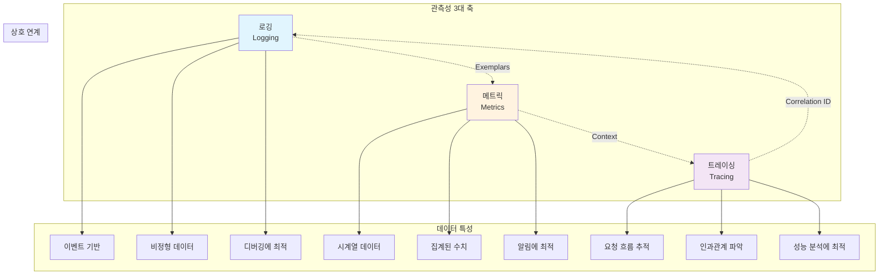
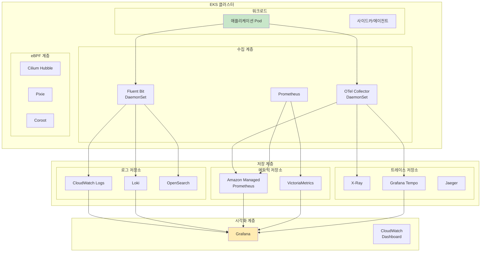
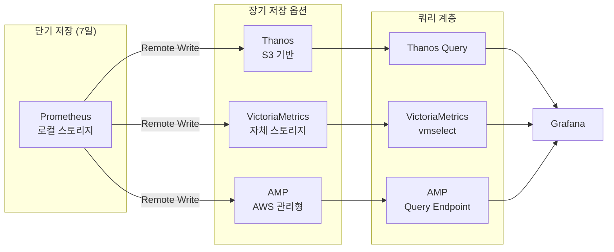
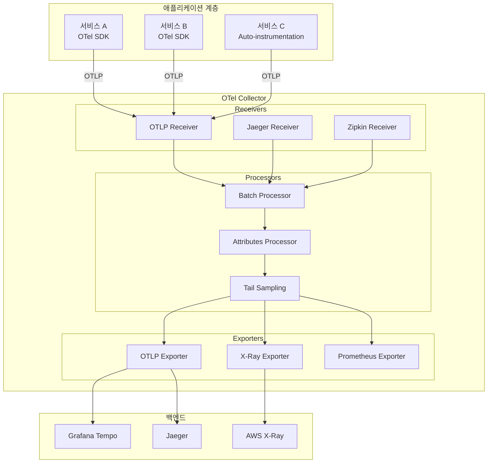
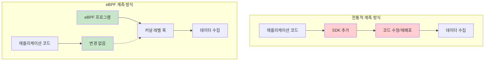
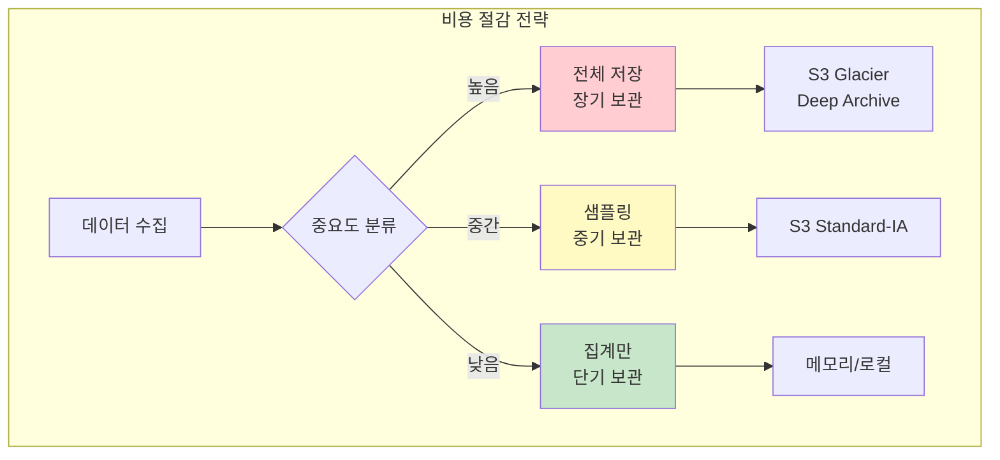
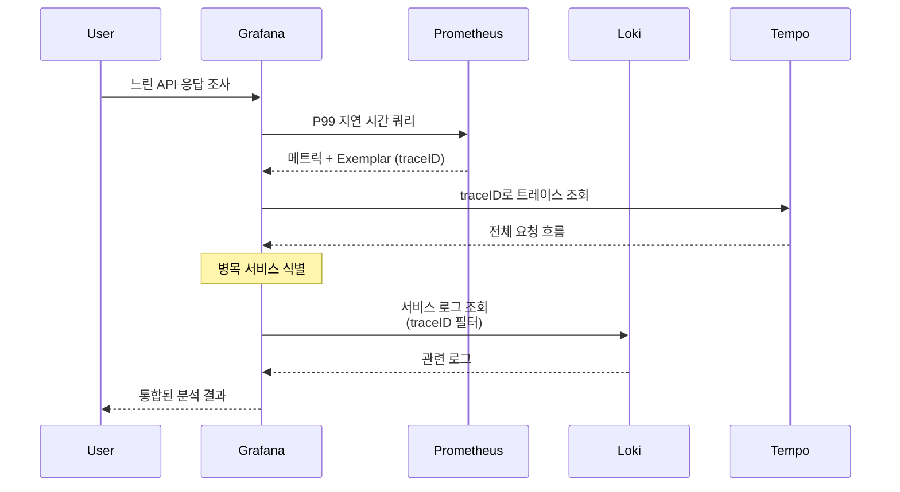
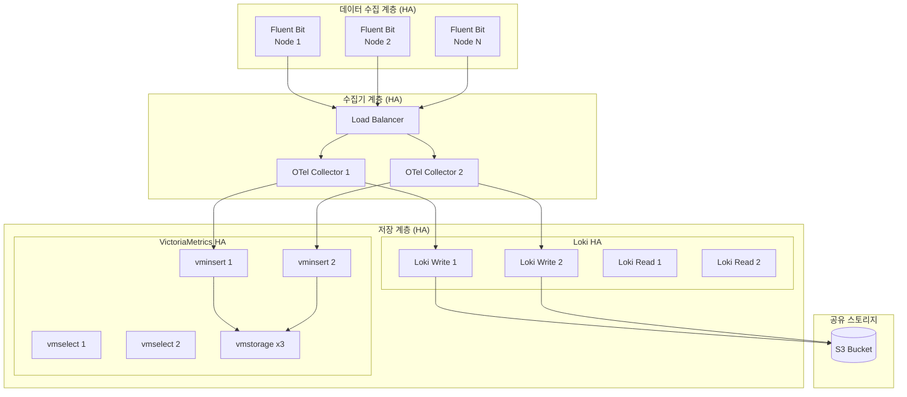
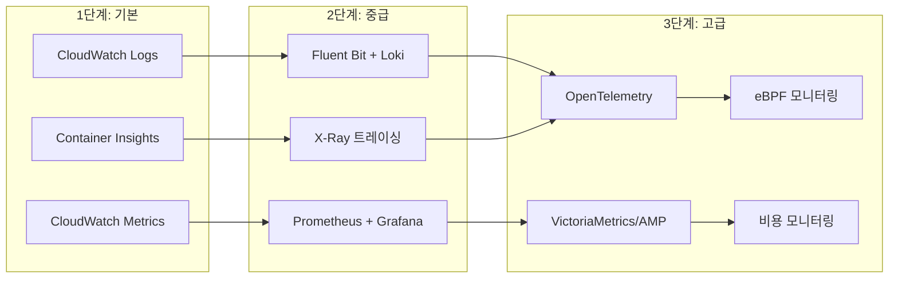

# EKS 관측성 최적화 가이드

> **지원 버전**: Amazon EKS 1.29+, OpenTelemetry 0.90+
> **마지막 업데이트**: 2025년 2월

---

## 목차

1. [관측성 3대 축 개요](#1-관측성-3대-축-개요)
2. [로깅 솔루션 비교](#2-로깅-솔루션-비교)
3. [메트릭 수집 및 저장](#3-메트릭-수집-및-저장)
4. [분산 트레이싱](#4-분산-트레이싱)
5. [eBPF 기반 No-Code 모니터링](#5-ebpf-기반-no-code-모니터링)
6. [비용 모니터링](#6-비용-모니터링)
7. [통합 관측성 대시보드](#7-통합-관측성-대시보드)
8. [운영 과제와 해결 방법](#8-운영-과제와-해결-방법)
9. [모범 사례와 다음 단계](#9-모범-사례와-다음-단계)

---

## 1. 관측성 3대 축 개요

현대 클라우드 네이티브 환경에서 **관측성(Observability)**은 시스템의 내부 상태를 외부 출력을 통해 이해하는 능력입니다. EKS 환경에서 효과적인 관측성을 구현하려면 세 가지 핵심 축을 이해해야 합니다.

### 1.1 로깅, 메트릭, 트레이싱의 관계



### 1.2 각 축의 역할과 선택 기준

| 축 | 주요 역할 | 질문 유형 | 데이터 볼륨 | 비용 특성 |
|---|---|---|---|---|
| **로깅** | 이벤트 기록, 감사, 디버깅 | "무엇이 일어났나?" | 높음 | 저장 비용 높음 |
| **메트릭** | 시스템 상태 모니터링, 알림 | "시스템이 정상인가?" | 중간 | 카디널리티에 민감 |
| **트레이싱** | 요청 흐름 추적, 병목 분석 | "왜 느린가?" | 높음 (샘플링 필요) | 샘플링률에 비례 |

### 1.3 EKS 관측성 아키텍처 전체 그림



---

## 2. 로깅 솔루션 비교

### 2.1 로그 저장소 비교

| 기준 | CloudWatch Logs | OpenSearch | Loki | ClickHouse |
|---|---|---|---|---|
| **비용** | 수집: $0.50/GB<br/>저장: $0.03/GB/월 | 인스턴스 비용 + EBS<br/>r6g.large: ~$150/월 | 오브젝트 스토리지 비용<br/>S3: $0.023/GB/월 | 인스턴스 + 스토리지<br/>높은 압축률로 절감 |
| **성능** | 소규모 우수<br/>대규모 지연 | 전문 검색 최적화<br/>복잡한 쿼리 강점 | 레이블 기반 빠른 필터링<br/>전문 검색 제한적 | 분석 쿼리 최적화<br/>실시간 집계 우수 |
| **운영 복잡성** | 완전 관리형<br/>운영 부담 최소 | 클러스터 관리 필요<br/>튜닝 복잡 | 단순한 아키텍처<br/>운영 용이 | 스키마 관리 필요<br/>중간 복잡도 |
| **쿼리 기능** | Logs Insights<br/>기본적인 분석 | Lucene 쿼리<br/>강력한 전문 검색 | LogQL<br/>레이블 기반 필터링 | SQL 기반<br/>복잡한 분석 쿼리 |
| **확장성** | 자동 확장<br/>제한 없음 | 수동 샤딩<br/>노드 추가 필요 | 수평 확장 용이<br/>오브젝트 스토리지 활용 | 샤딩 지원<br/>페타바이트 규모 |
| **적합 사용 사례** | AWS 네이티브 환경<br/>간단한 로깅 | 복잡한 검색 요구<br/>보안/컴플라이언스 | 비용 효율 중시<br/>Grafana 통합 | 로그 분석/집계<br/>장기 보관 |

### 2.2 로그 에이전트 비교

| 기준 | Fluent Bit | Fluentd | Vector |
|---|---|---|---|
| **메모리 사용량** | ~15MB | ~60MB | ~30MB |
| **CPU 사용량** | 낮음 | 중간 | 낮음 |
| **처리량** | 최대 ~200K msg/s | 최대 ~50K msg/s | 최대 ~300K msg/s |
| **언어** | C | Ruby/C | Rust |
| **플러그인 생태계** | 제한적이나 핵심 지원 | 매우 풍부 | 성장 중 |
| **설정 복잡도** | 낮음 | 중간 | 중간 |
| **EKS 통합** | 네이티브 지원 | 지원 | 지원 |

### 2.3 EKS에서 Fluent Bit + Loki 구성 예제

```yaml
# fluent-bit-configmap.yaml
apiVersion: v1
kind: ConfigMap
metadata:
  name: fluent-bit-config
  namespace: logging
data:
  fluent-bit.conf: |
    [SERVICE]
        Flush         5
        Log_Level     info
        Daemon        off
        Parsers_File  parsers.conf
        HTTP_Server   On
        HTTP_Listen   0.0.0.0
        HTTP_Port     2020

    [INPUT]
        Name              tail
        Tag               kube.*
        Path              /var/log/containers/*.log
        Parser            docker
        DB                /var/log/flb_kube.db
        Mem_Buf_Limit     50MB
        Skip_Long_Lines   On
        Refresh_Interval  10

    [FILTER]
        Name                kubernetes
        Match               kube.*
        Kube_URL            https://kubernetes.default.svc:443
        Kube_CA_File        /var/run/secrets/kubernetes.io/serviceaccount/ca.crt
        Kube_Token_File     /var/run/secrets/kubernetes.io/serviceaccount/token
        Kube_Tag_Prefix     kube.var.log.containers.
        Merge_Log           On
        Keep_Log            Off
        K8S-Logging.Parser  On
        K8S-Logging.Exclude On

    [OUTPUT]
        Name                   loki
        Match                  *
        Host                   loki-gateway.logging.svc.cluster.local
        Port                   80
        Labels                 job=fluent-bit
        Label_Keys             $kubernetes['namespace_name'],$kubernetes['pod_name'],$kubernetes['container_name']
        Remove_Keys            kubernetes,stream
        Auto_Kubernetes_Labels on
        Line_Format            json

  parsers.conf: |
    [PARSER]
        Name        docker
        Format      json
        Time_Key    time
        Time_Format %Y-%m-%dT%H:%M:%S.%L
        Time_Keep   On

    [PARSER]
        Name        json
        Format      json
        Time_Key    timestamp
        Time_Format %Y-%m-%dT%H:%M:%S.%L
---
# fluent-bit-daemonset.yaml
apiVersion: apps/v1
kind: DaemonSet
metadata:
  name: fluent-bit
  namespace: logging
  labels:
    app: fluent-bit
spec:
  selector:
    matchLabels:
      app: fluent-bit
  template:
    metadata:
      labels:
        app: fluent-bit
    spec:
      serviceAccountName: fluent-bit
      tolerations:
        - key: node-role.kubernetes.io/control-plane
          effect: NoSchedule
        - key: node-role.kubernetes.io/master
          effect: NoSchedule
      containers:
        - name: fluent-bit
          image: fluent/fluent-bit:2.2
          resources:
            limits:
              memory: 200Mi
              cpu: 200m
            requests:
              memory: 100Mi
              cpu: 100m
          volumeMounts:
            - name: varlog
              mountPath: /var/log
            - name: varlibdockercontainers
              mountPath: /var/lib/docker/containers
              readOnly: true
            - name: config
              mountPath: /fluent-bit/etc/
      volumes:
        - name: varlog
          hostPath:
            path: /var/log
        - name: varlibdockercontainers
          hostPath:
            path: /var/lib/docker/containers
        - name: config
          configMap:
            name: fluent-bit-config
```

```bash
# Loki 설치 (Helm)
helm repo add grafana https://grafana.github.io/helm-charts
helm repo update

# Simple Scalable 모드로 Loki 설치
helm install loki grafana/loki \
  --namespace logging \
  --create-namespace \
  --set loki.auth_enabled=false \
  --set loki.storage.type=s3 \
  --set loki.storage.s3.endpoint=s3.ap-northeast-2.amazonaws.com \
  --set loki.storage.s3.region=ap-northeast-2 \
  --set loki.storage.s3.bucketnames=my-loki-bucket \
  --set loki.storage.s3.insecure=false \
  --set serviceAccount.annotations."eks\.amazonaws\.com/role-arn"=arn:aws:iam::ACCOUNT:role/LokiS3Role
```

---

## 3. 메트릭 수집 및 저장

### 3.1 메트릭 저장소 비교

| 기준 | Prometheus | VictoriaMetrics | AMP (Amazon Managed Prometheus) |
|---|---|---|---|
| **확장성** | 단일 노드<br/>수직 확장만 | 클러스터 모드<br/>수평 확장 | 자동 확장<br/>제한 없음 |
| **비용** | 인프라 비용만<br/>EC2/EBS | 인프라 비용<br/>Prometheus 대비 절감 | 수집: $0.90/10M 샘플<br/>저장: $0.03/GB/월 |
| **HA** | 별도 구성 필요<br/>Thanos/Cortex | 내장 복제<br/>자동 장애 조치 | 완전 관리형 HA<br/>다중 AZ |
| **운영 오버헤드** | 높음<br/>스토리지/확장 관리 | 중간<br/>단순한 운영 | 낮음<br/>AWS 관리 |
| **장기 저장** | 별도 솔루션 필요 | 내장 지원 | 무제한 보관 |
| **쿼리 성능** | 우수 | 매우 우수<br/>(최적화된 엔진) | 우수 |
| **PromQL 호환** | 네이티브 | 완전 호환 + 확장 | 완전 호환 |

### 3.2 Cardinality 관리 전략

**카디널리티(Cardinality)**는 고유한 시계열 수를 의미합니다. 높은 카디널리티는 메모리 사용량과 쿼리 성능에 직접적인 영향을 미칩니다.

```yaml
# prometheus-config.yaml - 메트릭 드롭 및 레이블 최적화
apiVersion: v1
kind: ConfigMap
metadata:
  name: prometheus-config
  namespace: monitoring
data:
  prometheus.yml: |
    global:
      scrape_interval: 30s
      evaluation_interval: 30s

    scrape_configs:
      - job_name: 'kubernetes-pods'
        kubernetes_sd_configs:
          - role: pod
        relabel_configs:
          # 특정 네임스페이스만 수집
          - source_labels: [__meta_kubernetes_namespace]
            regex: 'kube-system|monitoring|production'
            action: keep

          # 불필요한 레이블 제거
          - regex: '__meta_kubernetes_pod_label_(.+)'
            action: labeldrop

          # Pod UID 제거 (높은 카디널리티 원인)
          - regex: 'pod_template_hash|controller_revision_hash'
            action: labeldrop

        metric_relabel_configs:
          # 불필요한 메트릭 드롭
          - source_labels: [__name__]
            regex: 'go_.*|promhttp_.*'
            action: drop

          # 히스토그램 버킷 제한 (높은 카디널리티 주범)
          - source_labels: [__name__, le]
            regex: '.*_bucket;(0\.001|0\.005|0\.01|0\.05|0\.1|0\.5|1|5|10|30|60|120|300)'
            action: keep
```

### 3.3 Recording Rules로 쿼리 성능 개선

Recording Rules는 복잡한 쿼리를 미리 계산하여 저장합니다.

```yaml
# prometheus-recording-rules.yaml
apiVersion: monitoring.coreos.com/v1
kind: PrometheusRule
metadata:
  name: recording-rules
  namespace: monitoring
spec:
  groups:
    - name: k8s.rules
      interval: 30s
      rules:
        # 노드별 CPU 사용률 미리 계산
        - record: node:cpu_utilization:ratio
          expr: |
            1 - avg by (node) (
              rate(node_cpu_seconds_total{mode="idle"}[5m])
            )

        # 노드별 메모리 사용률
        - record: node:memory_utilization:ratio
          expr: |
            1 - (
              node_memory_MemAvailable_bytes
              / node_memory_MemTotal_bytes
            )

        # 네임스페이스별 CPU 사용량
        - record: namespace:container_cpu_usage_seconds_total:sum_rate
          expr: |
            sum by (namespace) (
              rate(container_cpu_usage_seconds_total{container!=""}[5m])
            )

        # Pod 재시작 횟수 (1시간 단위)
        - record: namespace:pod_restarts:sum_increase1h
          expr: |
            sum by (namespace) (
              increase(kube_pod_container_status_restarts_total[1h])
            )

    - name: slo.rules
      interval: 30s
      rules:
        # 서비스별 에러율
        - record: service:http_requests:error_rate5m
          expr: |
            sum by (service) (
              rate(http_requests_total{status=~"5.."}[5m])
            )
            /
            sum by (service) (
              rate(http_requests_total[5m])
            )

        # 서비스별 P99 지연 시간
        - record: service:http_request_duration_seconds:p99
          expr: |
            histogram_quantile(0.99,
              sum by (service, le) (
                rate(http_request_duration_seconds_bucket[5m])
              )
            )
```

### 3.4 장기 저장 전략



---

## 4. 분산 트레이싱

### 4.1 OpenTelemetry 개요 및 아키텍처

OpenTelemetry(OTel)는 관측성 데이터(트레이스, 메트릭, 로그)를 수집하고 내보내기 위한 벤더 중립적 표준입니다.



### 4.2 트레이싱 백엔드 비교

| 기준 | Grafana Tempo | Jaeger | AWS X-Ray |
|---|---|---|---|
| **아키텍처** | 오브젝트 스토리지 기반<br/>인덱스 없음 | Elasticsearch/Cassandra<br/>인덱스 기반 | AWS 관리형<br/>서버리스 |
| **비용** | S3 저장 비용만<br/>매우 저렴 | 인프라 비용<br/>인덱스 스토리지 | 트레이스당 과금<br/>$5/백만 트레이스 |
| **확장성** | 무제한<br/>수평 확장 | 노드 추가 필요<br/>인덱스 관리 | 자동 확장<br/>제한 없음 |
| **쿼리 방식** | TraceID 직접 조회<br/>Exemplars 연계 | 태그 기반 검색<br/>시간 범위 검색 | 서비스 맵<br/>필터 검색 |
| **Grafana 통합** | 네이티브 | 지원 | 제한적 |
| **AWS 통합** | 별도 구성 | 별도 구성 | 네이티브<br/>Lambda, ECS 등 |
| **적합 사용 사례** | 비용 효율 중시<br/>Grafana 스택 | 복잡한 검색 요구<br/>자체 인프라 | AWS 네이티브<br/>서버리스 환경 |

### 4.3 샘플링 전략

```yaml
# otel-collector-config.yaml - 샘플링 전략 구성
apiVersion: v1
kind: ConfigMap
metadata:
  name: otel-collector-config
  namespace: observability
data:
  config.yaml: |
    receivers:
      otlp:
        protocols:
          grpc:
            endpoint: 0.0.0.0:4317
          http:
            endpoint: 0.0.0.0:4318

    processors:
      # 배치 처리 - 성능 최적화
      batch:
        timeout: 5s
        send_batch_size: 1000
        send_batch_max_size: 1500

      # 메모리 제한 - OOM 방지
      memory_limiter:
        check_interval: 1s
        limit_mib: 1000
        spike_limit_mib: 200

      # 확률적 샘플링 - Head Sampling
      probabilistic_sampler:
        hash_seed: 22
        sampling_percentage: 10  # 10% 샘플링

      # Tail Sampling - 조건 기반 샘플링
      tail_sampling:
        decision_wait: 10s
        num_traces: 100000
        policies:
          # 에러가 있는 트레이스는 100% 유지
          - name: errors
            type: status_code
            status_code:
              status_codes: [ERROR]

          # 지연 시간이 긴 트레이스는 100% 유지
          - name: slow-traces
            type: latency
            latency:
              threshold_ms: 1000

          # 특정 서비스의 트레이스는 100% 유지
          - name: critical-services
            type: string_attribute
            string_attribute:
              key: service.name
              values: [payment-service, order-service]

          # 나머지는 5%만 샘플링
          - name: default
            type: probabilistic
            probabilistic:
              sampling_percentage: 5

      # 속성 추가/제거
      attributes:
        actions:
          - key: environment
            value: production
            action: upsert
          - key: sensitive_data
            action: delete

    exporters:
      otlp:
        endpoint: tempo-distributor.observability:4317
        tls:
          insecure: true

      awsxray:
        region: ap-northeast-2

      debug:
        verbosity: detailed

    service:
      pipelines:
        traces:
          receivers: [otlp]
          processors: [memory_limiter, batch, tail_sampling, attributes]
          exporters: [otlp, awsxray]
```

### 4.4 EKS에서 OTel Collector DaemonSet 구성

```yaml
# otel-collector-daemonset.yaml
apiVersion: apps/v1
kind: DaemonSet
metadata:
  name: otel-collector
  namespace: observability
  labels:
    app: otel-collector
spec:
  selector:
    matchLabels:
      app: otel-collector
  template:
    metadata:
      labels:
        app: otel-collector
    spec:
      serviceAccountName: otel-collector
      containers:
        - name: collector
          image: otel/opentelemetry-collector-contrib:0.92.0
          args:
            - --config=/conf/config.yaml
          ports:
            - containerPort: 4317  # OTLP gRPC
              hostPort: 4317
            - containerPort: 4318  # OTLP HTTP
              hostPort: 4318
            - containerPort: 8888  # Metrics
          resources:
            limits:
              memory: 1Gi
              cpu: 500m
            requests:
              memory: 200Mi
              cpu: 100m
          volumeMounts:
            - name: config
              mountPath: /conf
          env:
            - name: K8S_NODE_NAME
              valueFrom:
                fieldRef:
                  fieldPath: spec.nodeName
            - name: K8S_POD_NAME
              valueFrom:
                fieldRef:
                  fieldPath: metadata.name
            - name: K8S_NAMESPACE
              valueFrom:
                fieldRef:
                  fieldPath: metadata.namespace
      volumes:
        - name: config
          configMap:
            name: otel-collector-config
      tolerations:
        - key: node-role.kubernetes.io/control-plane
          effect: NoSchedule
---
apiVersion: v1
kind: Service
metadata:
  name: otel-collector
  namespace: observability
spec:
  selector:
    app: otel-collector
  ports:
    - name: otlp-grpc
      port: 4317
      targetPort: 4317
    - name: otlp-http
      port: 4318
      targetPort: 4318
    - name: metrics
      port: 8888
      targetPort: 8888
```

애플리케이션에서 OTel SDK 자동 계측 구성:

```yaml
# 애플리케이션 Deployment에 자동 계측 추가
apiVersion: apps/v1
kind: Deployment
metadata:
  name: my-app
  namespace: production
spec:
  template:
    metadata:
      annotations:
        # OTel Operator 자동 계측 활성화
        instrumentation.opentelemetry.io/inject-java: "true"
        # 또는 Python, Node.js 등
        # instrumentation.opentelemetry.io/inject-python: "true"
        # instrumentation.opentelemetry.io/inject-nodejs: "true"
    spec:
      containers:
        - name: app
          image: my-app:latest
          env:
            - name: OTEL_EXPORTER_OTLP_ENDPOINT
              value: "http://otel-collector.observability:4317"
            - name: OTEL_SERVICE_NAME
              value: "my-app"
            - name: OTEL_RESOURCE_ATTRIBUTES
              value: "service.namespace=production,deployment.environment=prod"
```

---

## 5. eBPF 기반 No-Code 모니터링

### 5.1 왜 eBPF 모니터링인가

**eBPF(extended Berkeley Packet Filter)**는 리눅스 커널에서 안전하게 프로그램을 실행할 수 있는 기술입니다. eBPF 기반 모니터링의 가장 큰 장점은 **코드 수정 없이** 관측성을 확보할 수 있다는 점입니다.



| 특성 | 전통적 계측 | eBPF 계측 |
|---|---|---|
| **코드 수정** | 필요 | 불필요 |
| **배포 영향** | 재배포 필요 | 별도 배포 |
| **오버헤드** | 애플리케이션 레벨 | 커널 레벨 (매우 낮음) |
| **언어 종속성** | SDK별 지원 필요 | 언어 무관 |
| **커버리지** | 계측된 부분만 | 시스템 전체 |
| **유지보수** | 코드와 함께 관리 | 독립적 |

### 5.2 Coroot: 자동 서비스 맵 및 지연 시간 분석

Coroot는 eBPF를 활용하여 자동으로 서비스 맵을 생성하고 지연 시간을 분석합니다.

```yaml
# coroot-helm-values.yaml
apiVersion: v1
kind: Namespace
metadata:
  name: coroot
---
# Helm을 통한 Coroot 설치
# helm repo add coroot https://coroot.github.io/helm-charts
# helm install coroot coroot/coroot -n coroot -f coroot-helm-values.yaml

coroot:
  replicas: 1
  resources:
    requests:
      cpu: 200m
      memory: 1Gi
    limits:
      cpu: 1
      memory: 2Gi

  # Prometheus 연동
  prometheus:
    url: "http://prometheus-server.monitoring:9090"

  # ClickHouse 저장소 (로그/트레이스)
  clickhouse:
    enabled: true
    persistence:
      size: 100Gi
      storageClass: gp3

node-agent:
  # eBPF 기반 에이전트
  ebpf:
    enabled: true

  resources:
    requests:
      cpu: 100m
      memory: 100Mi
    limits:
      cpu: 500m
      memory: 500Mi

  tolerations:
    - operator: Exists
```

**Coroot 주요 기능:**

- **자동 서비스 발견**: eBPF로 네트워크 연결을 감지하여 서비스 맵 자동 생성
- **지연 시간 분석**: 각 서비스 간 지연 시간을 자동으로 측정
- **리소스 사용량 추적**: CPU, 메모리, 디스크 I/O를 서비스별로 분석
- **로그 수집**: 코드 수정 없이 애플리케이션 로그 수집

### 5.3 Pixie (현재 New Relic): Kubernetes 특화 관측성

Pixie는 Kubernetes 환경에 특화된 eBPF 기반 관측성 플랫폼입니다.

```bash
# Pixie CLI 설치
bash -c "$(curl -fsSL https://withpixie.ai/install.sh)"

# Pixie 배포
px deploy

# 클러스터 상태 확인
px get viziers

# 실시간 HTTP 트래픽 모니터링
px live http_data

# 서비스별 지연 시간 분석
px live service_stats
```

**Pixie 주요 기능:**

- **즉시 사용 가능한 대시보드**: 배포 즉시 HTTP, DNS, MySQL, PostgreSQL 등 자동 모니터링
- **PxL 스크립트**: Python 유사 쿼리 언어로 커스텀 분석
- **로컬 데이터 저장**: 민감한 데이터가 클러스터를 떠나지 않음
- **자동 암호화 분석**: TLS 트래픽도 eBPF로 복호화하여 분석

### 5.4 Cilium Hubble: 네트워크 흐름 관찰

Cilium CNI를 사용하는 EKS 클러스터에서 Hubble은 네트워크 가시성을 제공합니다.

```yaml
# cilium-hubble-values.yaml
hubble:
  enabled: true

  relay:
    enabled: true
    resources:
      requests:
        cpu: 100m
        memory: 128Mi

  ui:
    enabled: true
    replicas: 1
    ingress:
      enabled: true
      annotations:
        kubernetes.io/ingress.class: nginx
      hosts:
        - hubble.example.com

  metrics:
    enabled:
      - dns
      - drop
      - tcp
      - flow
      - icmp
      - http
    serviceMonitor:
      enabled: true
```

```bash
# Hubble CLI로 실시간 흐름 관찰
hubble observe --namespace production

# 특정 서비스로의 트래픽 필터링
hubble observe --to-service production/api-server

# DNS 요청 모니터링
hubble observe --protocol dns

# 드롭된 패킷 분석
hubble observe --verdict DROPPED
```

### 5.5 Kepler: 에너지 소비 모니터링

Kepler(Kubernetes Efficient Power Level Exporter)는 eBPF를 사용하여 워크로드의 에너지 소비를 측정합니다.

```yaml
# kepler-daemonset.yaml
apiVersion: apps/v1
kind: DaemonSet
metadata:
  name: kepler
  namespace: kepler
spec:
  selector:
    matchLabels:
      app: kepler
  template:
    metadata:
      labels:
        app: kepler
    spec:
      serviceAccountName: kepler
      containers:
        - name: kepler
          image: quay.io/sustainable_computing_io/kepler:release-0.7
          securityContext:
            privileged: true
          ports:
            - containerPort: 9102
              name: metrics
          volumeMounts:
            - name: lib-modules
              mountPath: /lib/modules
            - name: tracing
              mountPath: /sys/kernel/tracing
            - name: kernel-src
              mountPath: /usr/src/kernels
          env:
            - name: NODE_NAME
              valueFrom:
                fieldRef:
                  fieldPath: spec.nodeName
      volumes:
        - name: lib-modules
          hostPath:
            path: /lib/modules
        - name: tracing
          hostPath:
            path: /sys/kernel/tracing
        - name: kernel-src
          hostPath:
            path: /usr/src/kernels
```

**Kepler 메트릭 예시:**

```promql
# 네임스페이스별 에너지 소비 (줄)
sum by (namespace) (kepler_container_joules_total)

# Pod별 전력 소비 (와트)
rate(kepler_container_joules_total[5m]) * 1000

# 가장 많은 에너지를 소비하는 상위 10개 Pod
topk(10, sum by (pod_name) (rate(kepler_container_joules_total[5m])))
```

---

## 6. 비용 모니터링

### 6.1 KubeCost / OpenCost 설치 및 구성

OpenCost는 CNCF 프로젝트로, Kubernetes 비용 모니터링의 오픈소스 표준입니다.

```bash
# OpenCost 설치
helm repo add opencost https://opencost.github.io/opencost-helm-chart
helm repo update

helm install opencost opencost/opencost \
  --namespace opencost \
  --create-namespace \
  --set opencost.prometheus.internal.enabled=false \
  --set opencost.prometheus.external.enabled=true \
  --set opencost.prometheus.external.url="http://prometheus-server.monitoring:9090" \
  --set opencost.ui.enabled=true
```

```yaml
# opencost-values.yaml - 상세 설정
opencost:
  exporter:
    defaultClusterId: "eks-production"

    # AWS 비용 연동
    aws:
      spotDataRegion: ap-northeast-2
      spotDataBucket: "my-spot-data-bucket"
      athenaProjectID: "my-aws-project"
      athenaRegion: ap-northeast-2
      athenaDatabase: "athenacurcfn_my_cur"
      athenaTable: "my_cur"
      masterPayerARN: "arn:aws:iam::ACCOUNT:role/OpenCostRole"

  prometheus:
    external:
      enabled: true
      url: "http://prometheus-server.monitoring:9090"

  ui:
    enabled: true
    ingress:
      enabled: true
      annotations:
        kubernetes.io/ingress.class: nginx
      hosts:
        - host: opencost.example.com
          paths:
            - path: /
              pathType: Prefix
```

### 6.2 네임스페이스/팀별 비용 할당

```yaml
# cost-allocation-labels.yaml
# 팀별 비용 추적을 위한 레이블 표준화
apiVersion: v1
kind: Namespace
metadata:
  name: team-alpha
  labels:
    cost-center: "engineering"
    team: "alpha"
    environment: "production"
---
# Pod에 비용 레이블 적용
apiVersion: apps/v1
kind: Deployment
metadata:
  name: api-server
  namespace: team-alpha
spec:
  template:
    metadata:
      labels:
        cost-center: "engineering"
        team: "alpha"
        component: "api"
    spec:
      containers:
        - name: api
          resources:
            requests:
              cpu: 500m
              memory: 512Mi
            limits:
              cpu: 1000m
              memory: 1Gi
```

**OpenCost API를 통한 비용 조회:**

```bash
# 네임스페이스별 비용 (지난 7일)
curl -s "http://opencost.opencost:9003/allocation/compute?window=7d&aggregate=namespace" | jq '.'

# 팀 레이블별 비용
curl -s "http://opencost.opencost:9003/allocation/compute?window=7d&aggregate=label:team" | jq '.'

# 일별 비용 추이
curl -s "http://opencost.opencost:9003/allocation/compute?window=30d&step=1d&aggregate=namespace" | jq '.'
```

### 6.3 CloudWatch 비용 최적화

```yaml
# cloudwatch-log-retention.yaml
# 로그 보존 기간 최적화로 비용 절감
apiVersion: v1
kind: ConfigMap
metadata:
  name: fluent-bit-cloudwatch-config
  namespace: logging
data:
  fluent-bit.conf: |
    [OUTPUT]
        Name                cloudwatch_logs
        Match               *
        region              ap-northeast-2
        log_group_name      /eks/production/application
        log_stream_prefix   ${HOSTNAME}-
        auto_create_group   true
        # 로그 보존 기간 설정 (비용 최적화)
        log_retention_days  14

        # 배치 설정으로 API 호출 최적화
        log_format          json
        max_batch_size      1048576
        max_batch_put_limit 100
```

```bash
# CloudWatch Logs 보존 기간 일괄 설정
aws logs describe-log-groups --query 'logGroups[*].logGroupName' --output text | \
while read log_group; do
  aws logs put-retention-policy \
    --log-group-name "$log_group" \
    --retention-in-days 14
done

# 미사용 로그 그룹 정리
aws logs describe-log-groups --query 'logGroups[?storedBytes==`0`].logGroupName' --output text | \
while read log_group; do
  echo "Deleting empty log group: $log_group"
  aws logs delete-log-group --log-group-name "$log_group"
done
```

### 6.4 로그/메트릭 저장 비용 절감 전략



| 전략 | 적용 대상 | 예상 절감 |
|---|---|---|
| **로그 레벨 필터링** | DEBUG/TRACE 로그 드롭 | 40-60% |
| **샘플링** | 고빈도 이벤트 | 30-50% |
| **압축** | 모든 로그/메트릭 | 60-80% |
| **계층화 저장** | 오래된 데이터 | 70-90% |
| **보존 기간 최적화** | 중요도 낮은 데이터 | 50-70% |

---

## 7. 통합 관측성 대시보드

### 7.1 Grafana 기반 통합 대시보드 구성

```yaml
# grafana-datasources.yaml
apiVersion: v1
kind: ConfigMap
metadata:
  name: grafana-datasources
  namespace: monitoring
data:
  datasources.yaml: |
    apiVersion: 1
    datasources:
      # Prometheus - 메트릭
      - name: Prometheus
        type: prometheus
        access: proxy
        url: http://prometheus-server:9090
        isDefault: true
        jsonData:
          httpMethod: POST
          exemplarTraceIdDestinations:
            - name: traceID
              datasourceUid: tempo

      # Loki - 로그
      - name: Loki
        type: loki
        access: proxy
        url: http://loki-gateway:80
        jsonData:
          derivedFields:
            - name: TraceID
              matcherRegex: '"traceId":"([a-f0-9]+)"'
              url: '$${__value.raw}'
              datasourceUid: tempo

      # Tempo - 트레이스
      - name: Tempo
        type: tempo
        access: proxy
        url: http://tempo-query-frontend:3100
        uid: tempo
        jsonData:
          httpMethod: GET
          tracesToLogs:
            datasourceUid: loki
            tags: ['service.name', 'pod']
          serviceMap:
            datasourceUid: prometheus
          nodeGraph:
            enabled: true
          lokiSearch:
            datasourceUid: loki
```

### 7.2 로그 -> 메트릭 -> 트레이스 연계 (Exemplars)

Exemplars는 메트릭 데이터 포인트에 트레이스 ID를 연결하는 기능입니다.

```yaml
# prometheus-exemplars-config.yaml
apiVersion: v1
kind: ConfigMap
metadata:
  name: prometheus-config
  namespace: monitoring
data:
  prometheus.yml: |
    global:
      scrape_interval: 15s
      # Exemplars 활성화
      enable_features:
        - exemplar-storage

    scrape_configs:
      - job_name: 'application'
        kubernetes_sd_configs:
          - role: pod
        relabel_configs:
          - source_labels: [__meta_kubernetes_pod_annotation_prometheus_io_scrape]
            regex: 'true'
            action: keep
```

애플리케이션에서 Exemplars 내보내기 (Go 예시):

```go
// Prometheus 히스토그램에 Exemplars 추가
import (
    "github.com/prometheus/client_golang/prometheus"
    "go.opentelemetry.io/otel/trace"
)

var httpDuration = prometheus.NewHistogramVec(
    prometheus.HistogramOpts{
        Name:    "http_request_duration_seconds",
        Help:    "HTTP request duration",
        Buckets: prometheus.DefBuckets,
    },
    []string{"method", "path", "status"},
)

func recordMetric(ctx context.Context, method, path, status string, duration float64) {
    span := trace.SpanFromContext(ctx)
    traceID := span.SpanContext().TraceID().String()

    httpDuration.WithLabelValues(method, path, status).(prometheus.ExemplarObserver).
        ObserveWithExemplar(duration, prometheus.Labels{"traceID": traceID})
}
```

### 7.3 알림 전략: 경고 피로 방지

```yaml
# alertmanager-config.yaml
apiVersion: v1
kind: ConfigMap
metadata:
  name: alertmanager-config
  namespace: monitoring
data:
  alertmanager.yml: |
    global:
      resolve_timeout: 5m

    # 라우팅 규칙
    route:
      receiver: 'default'
      group_by: ['alertname', 'namespace', 'service']
      group_wait: 30s
      group_interval: 5m
      repeat_interval: 4h

      routes:
        # 심각도별 라우팅
        - match:
            severity: critical
          receiver: 'critical-alerts'
          group_wait: 10s
          repeat_interval: 1h

        - match:
            severity: warning
          receiver: 'warning-alerts'
          group_wait: 1m
          repeat_interval: 4h

        # 업무 시간 외 알림 억제
        - match:
            severity: info
          receiver: 'info-alerts'
          mute_time_intervals:
            - off-hours

    # 알림 억제 규칙
    inhibit_rules:
      # 클러스터 다운 시 개별 서비스 알림 억제
      - source_match:
          alertname: ClusterDown
        target_match_re:
          alertname: '.+'
        equal: ['cluster']

      # 노드 다운 시 해당 노드의 Pod 알림 억제
      - source_match:
          alertname: NodeDown
        target_match_re:
          alertname: 'Pod.*'
        equal: ['node']

    # 업무 외 시간 정의
    time_intervals:
      - name: off-hours
        time_intervals:
          - weekdays: ['saturday', 'sunday']
          - times:
              - start_time: '00:00'
                end_time: '09:00'
              - start_time: '18:00'
                end_time: '24:00'

    receivers:
      - name: 'default'
        slack_configs:
          - channel: '#alerts-default'

      - name: 'critical-alerts'
        slack_configs:
          - channel: '#alerts-critical'
        pagerduty_configs:
          - service_key: '<pagerduty-key>'

      - name: 'warning-alerts'
        slack_configs:
          - channel: '#alerts-warning'

      - name: 'info-alerts'
        slack_configs:
          - channel: '#alerts-info'
```

### 7.4 SLO/SLI 기반 모니터링

```yaml
# slo-recording-rules.yaml
apiVersion: monitoring.coreos.com/v1
kind: PrometheusRule
metadata:
  name: slo-rules
  namespace: monitoring
spec:
  groups:
    - name: slo.rules
      rules:
        # 가용성 SLI: 성공한 요청 비율
        - record: sli:availability:ratio
          expr: |
            sum(rate(http_requests_total{status!~"5.."}[5m]))
            /
            sum(rate(http_requests_total[5m]))

        # 지연 시간 SLI: P99 < 500ms 비율
        - record: sli:latency:ratio
          expr: |
            sum(rate(http_request_duration_seconds_bucket{le="0.5"}[5m]))
            /
            sum(rate(http_request_duration_seconds_count[5m]))

        # 에러 버짓 소비율 (30일 기준)
        - record: slo:error_budget:remaining
          expr: |
            1 - (
              (1 - sli:availability:ratio)
              /
              (1 - 0.999)  # 99.9% SLO 목표
            )

    - name: slo.alerts
      rules:
        # 에러 버짓 50% 소진 경고
        - alert: ErrorBudgetBurnRateHigh
          expr: slo:error_budget:remaining < 0.5
          for: 5m
          labels:
            severity: warning
          annotations:
            summary: "에러 버짓 50% 이상 소진"
            description: "남은 에러 버짓: {{ $value | humanizePercentage }}"

        # 에러 버짓 80% 소진 심각
        - alert: ErrorBudgetBurnRateCritical
          expr: slo:error_budget:remaining < 0.2
          for: 5m
          labels:
            severity: critical
          annotations:
            summary: "에러 버짓 80% 이상 소진"
            description: "남은 에러 버짓: {{ $value | humanizePercentage }}"
```

---

## 8. 운영 과제와 해결 방법

### 8.1 로그/메트릭 저장 비용 폭증 대응

| 문제 상황 | 원인 | 해결 방법 |
|---|---|---|
| 로그 비용 급증 | DEBUG 로그 과다 | 로그 레벨 필터링, 샘플링 |
| 메트릭 카디널리티 폭발 | Pod UID, 타임스탬프 레이블 | 레이블 정리, 메트릭 드롭 |
| 트레이스 저장 비용 | 100% 샘플링 | Tail Sampling 적용 |
| 장기 보관 비용 | 모든 데이터 동일 보관 | 계층화 저장 (Tiered Storage) |

```yaml
# cost-optimization-config.yaml
# Fluent Bit 로그 필터링
[FILTER]
    Name     grep
    Match    *
    Exclude  log ^.*DEBUG.*$
    Exclude  log ^.*TRACE.*$

# 고빈도 로그 샘플링 (10%)
[FILTER]
    Name          throttle
    Match         kube.var.log.containers.nginx*
    Rate          10
    Window        60
    Print_Status  true
```

### 8.2 EKS Auto Mode 노드 모니터링

EKS Auto Mode에서는 노드가 자동으로 관리되므로 특별한 모니터링 전략이 필요합니다.

```yaml
# auto-mode-monitoring.yaml
# Managed Node Pool 모니터링
apiVersion: monitoring.coreos.com/v1
kind: PodMonitor
metadata:
  name: auto-mode-nodes
  namespace: monitoring
spec:
  selector:
    matchLabels:
      eks.amazonaws.com/managed: "true"
  namespaceSelector:
    any: true
  podMetricsEndpoints:
    - port: metrics
      interval: 30s
---
# CloudWatch Container Insights 활성화
# EKS Auto Mode와 함께 사용 권장
apiVersion: v1
kind: ConfigMap
metadata:
  name: cwagent-config
  namespace: amazon-cloudwatch
data:
  cwagentconfig.json: |
    {
      "logs": {
        "metrics_collected": {
          "kubernetes": {
            "cluster_name": "eks-auto-cluster",
            "metrics_collection_interval": 60
          }
        }
      }
    }
```

### 8.3 도구 간 데이터 상관관계 분석



### 8.4 대규모 클러스터에서 모니터링 시스템 성능 유지

```yaml
# high-scale-prometheus.yaml
apiVersion: monitoring.coreos.com/v1
kind: Prometheus
metadata:
  name: prometheus
  namespace: monitoring
spec:
  replicas: 2
  retention: 7d
  retentionSize: 100GB

  # 샤딩으로 부하 분산
  shards: 3

  resources:
    requests:
      cpu: 2
      memory: 8Gi
    limits:
      cpu: 4
      memory: 16Gi

  # 외부 저장소로 오프로드
  remoteWrite:
    - url: "http://victoriametrics:8428/api/v1/write"
      queueConfig:
        capacity: 10000
        maxShards: 30
        maxSamplesPerSend: 5000

  # 쿼리 성능 최적화
  queryLogFile: /prometheus/query.log

  additionalArgs:
    # 쿼리 동시성 제한
    - name: query.max-concurrency
      value: "20"
    # 쿼리 타임아웃
    - name: query.timeout
      value: "2m"
```

### 8.5 고가용성 관측성 스택 구성



---

## 9. 모범 사례와 다음 단계

### 9.1 단계별 도입 전략



| 단계 | 구성 요소 | 소요 기간 | 비용 | 운영 복잡도 |
|---|---|---|---|---|
| **1단계 (기본)** | CloudWatch 기반 | 1-2일 | 낮음 | 낮음 |
| **2단계 (중급)** | Grafana 스택 | 1-2주 | 중간 | 중간 |
| **3단계 (고급)** | OpenTelemetry + eBPF | 2-4주 | 높음 | 높음 |

### 9.2 비용 대비 효과 분석

| 도구 조합 | 월 예상 비용 (100노드) | 기능 커버리지 | ROI |
|---|---|---|---|
| CloudWatch 전체 | $500-1,000 | 기본 | 낮음 |
| Prometheus + Loki + Grafana | $200-400 (인프라) | 중급 | 중간 |
| AMP + Tempo + eBPF | $300-600 | 고급 | 높음 |
| 상용 솔루션 (Datadog 등) | $2,000-5,000 | 전체 | 상황에 따라 |

### 9.3 체크리스트

**관측성 구현 체크리스트:**

- [ ] 로깅, 메트릭, 트레이싱 3대 축 모두 구현
- [ ] 데이터 간 상관관계 (Correlation) 설정
- [ ] 카디널리티 관리 정책 수립
- [ ] 샘플링 전략 정의 및 적용
- [ ] 비용 모니터링 도구 배포
- [ ] 알림 규칙 최적화 (경고 피로 방지)
- [ ] SLO/SLI 정의 및 대시보드 구성
- [ ] 장기 저장 전략 수립
- [ ] 고가용성 구성 완료
- [ ] 문서화 및 팀 교육

### 9.4 관련 문서 및 퀴즈

**관련 문서:**

- [Prometheus 운영 가이드](./metrics/01-prometheus.md)
- [Grafana 대시보드 구성](./grafana/README.md)

**관련 퀴즈:**

- [관측성 최적화 퀴즈](../quizzes/observability/09-observability-optimization-quiz.md)

---

## 참고 자료

- [OpenTelemetry 공식 문서](https://opentelemetry.io/docs/)
- [Grafana Loki 문서](https://grafana.com/docs/loki/latest/)
- [Prometheus Operator](https://prometheus-operator.dev/)
- [AWS Observability Best Practices](https://aws-observability.github.io/observability-best-practices/)
- [OpenCost 프로젝트](https://www.opencost.io/)
- [eBPF.io](https://ebpf.io/)
