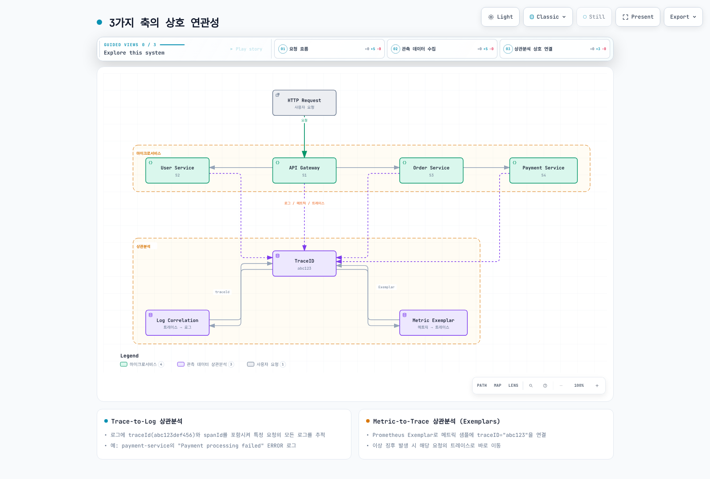
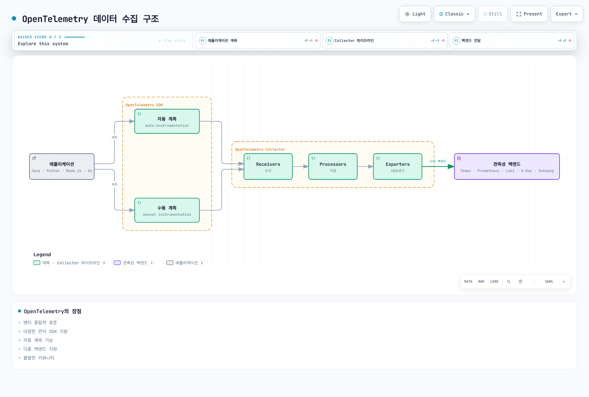
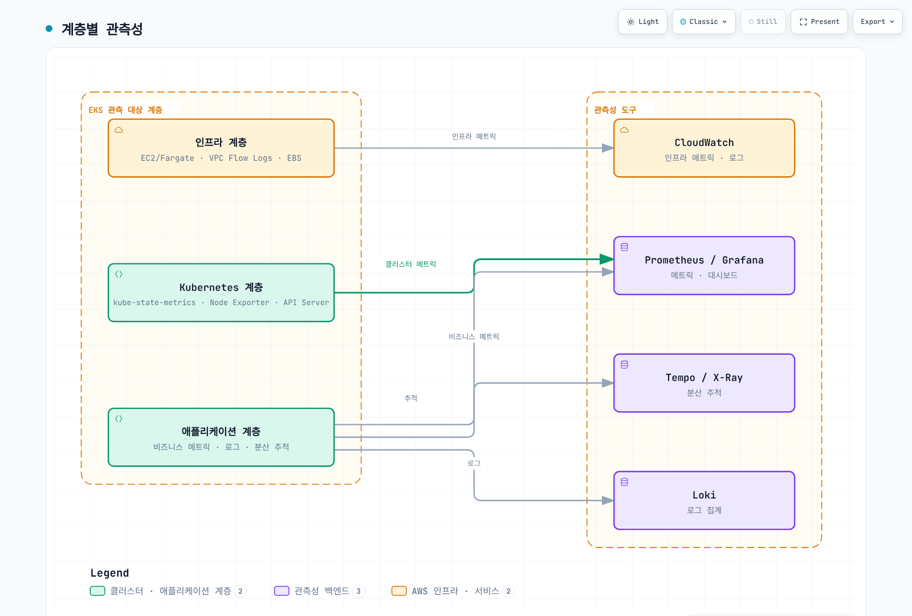

# Observability 개요

> **최종 검토**: 2026년 9월 12일.

## 소개

현대의 분산 시스템, 특히 Kubernetes 기반 마이크로서비스 아키텍처에서는 시스템의 내부 상태를 외부에서 관찰하고 이해하는 능력이 필수적입니다. 이를 **관측성(Observability)**이라고 합니다.

## Observability vs Monitoring

모니터링은 시스템 동작을 수집·분석하고 상태 변화에 대응하는 활동이며, 관측성은 출력으로 내부 상태를 이해할 수 있는 정도입니다. 서로 밀접하게 연결되며 모니터링도 로그·추적과 진단 질의를 사용할 수 있습니다.

| 구분 | Monitoring | Observability |
| --- | --- | --- |
| **초점** | 상태·사용자 영향의 지속적 평가 | 원인과 동작을 설명할 수 있는 시스템의 가시성 |
| **활용** | SLO, 대시보드, 알림과 조사 | 계측, 컨텍스트, 연관 분석과 탐색 |
| **질문** | 무엇이 바뀌었고 왜 문제가 생겼는가 | 그 질문에 답할 충분한 근거가 있는가 |
| **데이터** | 필요에 따라 메트릭·로그·추적 등 사용 | 같은 신호의 품질·범위·연결성에 의존 |
| **복잡도** | 단순·분산 시스템 모두에 필요 | 시스템과 운영 목표에 맞춰 설계 |

## 관측성의 3가지 축 (Three Pillars)

로그·메트릭·추적은 널리 쓰이는 세 가지 신호입니다. 관측성을 이 세 종류로만 정의할 수는 없습니다. 프로파일도 코드 수준 자원 사용을 설명하며, OpenTelemetry에서는 신호별 성숙도가 다르고 프로파일 지원은 아직 개발 중입니다.

### 1. Logs (로그)

로그는 시스템에서 발생하는 개별 이벤트의 기록입니다.

**특징:**
- 개별 이벤트 기록; 저장소의 변경 방지·보존 보장은 별도 구성에 따름
- 타임스탬프와 컨텍스트 정보 포함
- 구조화(JSON) 또는 비구조화 형식
- 디버깅과 감사에 유용하며 필요한 이벤트·접근 제어·보존 범위를 설계해야 함

**사용 사례:**
- 오류 및 예외 추적
- 보안 감사
- 규정 준수
- 상세한 디버깅

**역할별 도구:** Loki, Elasticsearch/OpenSearch, CloudWatch Logs는 저장·질의 백엔드이며 Fluent Bit는 수집·전달 도구입니다.

### 2. Metrics (메트릭)

메트릭은 시간에 따른 수치 측정값입니다.

**특징:**
- 시계열 데이터로 저장
- 집계 및 수학적 연산 가능
- 레이블 카디널리티와 수집량을 제어하면 효율적으로 저장 가능
- 트렌드 분석에 적합

**Prometheus 계열의 주요 메트릭 유형:**
- **Counter**: 누적 증가값이며 재시작 등으로 0으로 재설정될 수 있음 (예: 요청 수)
- **Gauge**: 증가·감소하는 현재 측정값 (예: 메모리 사용량)
- **Histogram**: 관측값의 분포 (예: 응답 시간); classic과 native histogram은 표현·질의 방식에 차이가 있음
- **Summary**: 관측 수·합계와 구현에 따라 사전 계산한 분위수; 인스턴스별 분위수를 단순 평균해 전체 분위수로 만들 수 없음

**도구:** Prometheus, VictoriaMetrics, CloudWatch Metrics, Datadog

### 3. Traces (추적)

트레이스는 관련 span으로 관측한 작업 경로를 표현합니다. 계측 누락, 샘플링, 전파 실패나 데이터 손실이 있으면 일부만 보일 수 있습니다.

**특징:**
- 서비스 간 요청 흐름 시각화
- 각 단계의 지연 시간 측정
- 병목 지점 식별
- 의존성 분석

**구성 요소:**
- **Trace**: 공통 TraceID로 연결된 관련 span 집합
- **Span**: 하나의 작업 단위
- **SpanContext**: TraceID, SpanID, 추적 플래그와 tracestate 등 전파할 추적 컨텍스트

**도구:** Tempo, Jaeger, X-Ray, Zipkin, Datadog APM

## 3가지 축의 상호 연관성

계측과 수집·백엔드 연결을 구성하면 여러 신호를 연관 분석할 수 있습니다. 자동으로 모든 신호가 연결되는 것은 아닙니다.



[🔍 인터랙티브 다이어그램 보기](https://www.atomai.click/kubernetes-docs/archmaps/ko-observability-readme-2.html)

그림의 ID는 설명용 축약입니다. 실제 데이터에는 아래의 유효한 전체 길이 ID를 사용합니다. 메트릭 연결에는 exemplar 메타데이터를 사용하고 일반 시계열 레이블 범위는 제한합니다.

### Trace-to-Log 상관분석

활성 추적 컨텍스트가 있을 때 TraceID·SpanID를 로그에 기록하면 해당 이벤트와 span을 연결할 수 있습니다. 배경 작업이나 계측되지 않은 로그에는 ID가 없을 수 있습니다. 아래는 애플리케이션 JSON 예시이며 완전한 OTLP 요청 형식이 아닙니다.

```json
{
  "timestamp": "2025-02-15T10:30:00Z",
  "level": "ERROR",
  "message": "Payment processing failed",
  "traceId": "4bf92f3577b34da6a3ce929d0e0e4736",
  "spanId": "00f067aa0ba902b7",
  "service": "payment-service"
}
```

W3C 형식의 TraceID는 32자리, SpanID는 16자리 16진수이며 모두 0인 값은 유효하지 않습니다. JSON의 날짜는 설명용 과거 이벤트를 유지한 것입니다.

### Metric-to-Trace 상관분석 (Exemplars)

Exemplar는 특정 관측값과 추적을 연결하는 별도 메타데이터입니다. 요청마다 다른 TraceID를 일반 시계열 레이블에 넣으면 카디널리티가 급증하므로 exemplar나 로그 필드를 사용합니다. 아래는 완전한 classic histogram OpenMetrics 텍스트 예시이며 측정값은 설명용입니다.

```text
# HELP http_request_duration_seconds Observed HTTP request duration.
# TYPE http_request_duration_seconds histogram
# UNIT http_request_duration_seconds seconds
http_request_duration_seconds_bucket{le="0.5"} 1000 # {trace_id="4bf92f3577b34da6a3ce929d0e0e4736"} 0.42
http_request_duration_seconds_bucket{le="+Inf"} 1000
http_request_duration_seconds_sum 123.4
http_request_duration_seconds_count 1000
# EOF
```

Exemplar에는 레이블 집합뿐 아니라 관측값(`0.42`)이 필요하며 타임스탬프는 선택 사항입니다. 수집·저장 경로가 exemplar를 지원하고 보존해야 하며, Grafana 등의 데이터 소스에서 `trace_id` 레이블을 추적 백엔드에 연결하도록 설정해야 합니다. 연결할 trace가 샘플링·보존되어 있어야 합니다.

## OpenTelemetry와 표준화

OpenTelemetry(OTel)는 벤더 중립적인 API·SDK·계측·수집기 도구를 제공하는 관측 프레임워크입니다. 지원 신호와 자동 계측 범위는 언어·프레임워크·구성 요소 버전에 따라 다릅니다.



[🔍 인터랙티브 다이어그램 보기](https://www.atomai.click/kubernetes-docs/archmaps/ko-observability-readme-3.html)

가능한 배포 형태 중 하나입니다. 애플리케이션이 지원 백엔드로 직접 내보낼 수도 있습니다. 수집기의 receiver·processor·exporter를 신호에 맞게 구성해야 하며 구성 요소 성숙도는 다릅니다.

**OpenTelemetry의 장점:**
- 벤더 중립적 표준
- 다양한 언어 SDK 지원
- 자동 계측 기능
- 다중 백엔드 지원
- 활발한 커뮤니티

## EKS 환경에서의 관측성 전략

Amazon EKS에서 효과적인 관측성을 구현하기 위한 전략:

### 1. 계층별 관측성



[🔍 인터랙티브 다이어그램 보기](https://www.atomai.click/kubernetes-docs/archmaps/ko-observability-readme-4.html)

계층별 도구를 고정한 표준이 아니라 신호 경로의 예시입니다. CloudWatch 등은 여러 계층을 다룰 수 있습니다. 노드 수집기에는 선택한 EKS 컴퓨팅 모드가 지원하는 접근·배포 방식이 필요합니다.

### 2. 도구 선택 예시

| 기능 | 자체 운영 예시 | AWS 관리형 예시 | 상용 플랫폼 예시 |
|------|---------|-------------|------|
| 메트릭 | Prometheus, VictoriaMetrics | CloudWatch, AMP | Datadog, New Relic |
| 로그 | Loki, Elasticsearch/OpenSearch | CloudWatch Logs | Splunk, Datadog |
| 추적 | Tempo, Jaeger | X-Ray | Datadog APM, Dynatrace |
| 시각화 | Grafana | CloudWatch Dashboards | Datadog, Dynatrace |

### 3. 비용 최적화 전략

- **샘플링**: 보존할 추적량과 조사 범위를 함께 설계; tail sampling은 결정 전 데이터를 수집·버퍼링하므로 앞단 비용까지 모두 없애지는 않음
- **보존 정책**: 데이터 보존 기간 최적화
- **계층화된 스토리지**: 백엔드가 지원하는 저장 계층·조회 경로와 요구 보존 기간을 확인
- **집계와 카디널리티**: 필요한 상세 정보를 보존하면서 수집량·레이블 수를 제어; 집계로 잃는 진단 정보를 평가

## 관측성 성숙도 모델

다음은 운영 목표를 검토하는 실용적 계획 모델입니다. 제품 구매 순서나 보편적인 인증 등급이 아닙니다. 필요한 신호 범위, 조사 속도, 알림의 실행 가능성과 비용을 평가하며 자동 분석은 필요할 때 검증해서 도입합니다.

| 검토 영역 | 확인할 능력 | 도구 예시 |
| --- | --- | --- |
| 기본 수집 | 필요한 서비스·플랫폼 신호를 신뢰성 있게 확보 | kubectl logs, CloudWatch |
| 중앙 집중화 | 적절한 보존·접근 제어와 조회 | Loki, Prometheus, Grafana |
| 상관분석 | 요청·서비스·배포 컨텍스트로 신호 연결 | Tempo, exemplars, TraceID |
| 선택적 자동화 | 오탐·누락·응답 동작을 검증한 분석 지원 | Datadog Watchdog, Dynatrace Intelligence |

## 섹션 가이드

이 관측성 섹션은 다음과 같이 구성되어 있습니다:

### [Logging (로깅)](./logging/README.md)
로그 수집, 저장, 분석을 위한 도구와 전략:
- Loki: 로그 집계·질의 백엔드
- Fluent Bit: 고성능 로그 수집기
- CloudWatch Logs: AWS 네이티브 로깅

### [Metrics (메트릭)](./metrics/README.md)
시계열 메트릭 수집과 분석:
- Prometheus: 업계 표준 메트릭 시스템
- VictoriaMetrics: 메트릭 저장·질의 백엔드
- CloudWatch Metrics: AWS 네이티브 메트릭

### [Tracing (추적)](./tracing/README.md)
분산 추적과 요청 흐름 분석:
- Tempo: Grafana의 분산 추적 백엔드
- X-Ray: AWS 네이티브 분산 추적
- OpenTelemetry: 표준화된 계측
- Dynatrace: AI 기반 APM

### [Grafana (대시보드)](./grafana/README.md)
통합 시각화와 대시보드:
- 데이터 소스 연동
- 대시보드 설계 패턴
- 알림 구성

### [Alerting (알림)](./alerting/README.md)
실행 가능한 경보, 라우팅과 대응 연동을 다룹니다.

### [관측성 최적화](./09-observability-optimization.md)
수집량·카디널리티·보존과 운영 비용을 평가합니다.

### [통합 실습](../labs/observability/README.md)
인프라·스택·애플리케이션·부하·추적을 단계적으로 검증합니다.

## 시작하기

서비스 목표와 조사할 질문을 먼저 정의하고 기존 플랫폼·수집기를 확인합니다. 다음은 필요에 따라 조정할 수 있는 예시 순서입니다:

1. **메트릭 수집 설정**: Prometheus, VictoriaMetrics 또는 요구 사항에 맞는 관리형 백엔드 선택
2. **로그 수집 설정**: Loki와 Fluent Bit 배포
3. **추적 설정**: Tempo 또는 X-Ray 배포
4. **시각화**: 선택한 플랫폼에서 필요한 데이터 소스와 대시보드 연결
5. **상관분석**: TraceID 기반 연결 구성

## 참고 자료

- [OpenTelemetry signals](https://opentelemetry.io/docs/concepts/signals/)
- [OpenTelemetry Collector](https://opentelemetry.io/docs/collector/)
- [OpenTelemetry log data model](https://opentelemetry.io/docs/specs/otel/logs/data-model/)
- [W3C Trace Context](https://www.w3.org/TR/trace-context/)
- [Prometheus metric types](https://raw.githubusercontent.com/prometheus/docs/main/docs/concepts/metric_types.md)
- [OpenMetrics specification](https://raw.githubusercontent.com/prometheus/OpenMetrics/main/specification/OpenMetrics.md)
- [OpenTelemetry sampling](https://opentelemetry.io/docs/concepts/sampling/)
- [Grafana OpenTelemetry documentation](https://grafana.com/docs/opentelemetry/)
- [Amazon EKS monitoring and logging](https://docs.aws.amazon.com/eks/latest/userguide/eks-observe.html)
- [AWS Observability Best Practices](https://aws-observability.github.io/observability-best-practices/)
- [SRE Workbook — Monitoring](https://sre.google/workbook/monitoring/)
- [Datadog Watchdog](https://docs.datadoghq.com/watchdog/)
- [Dynatrace Intelligence](https://docs.dynatrace.com/docs/dynatrace-intelligence)
