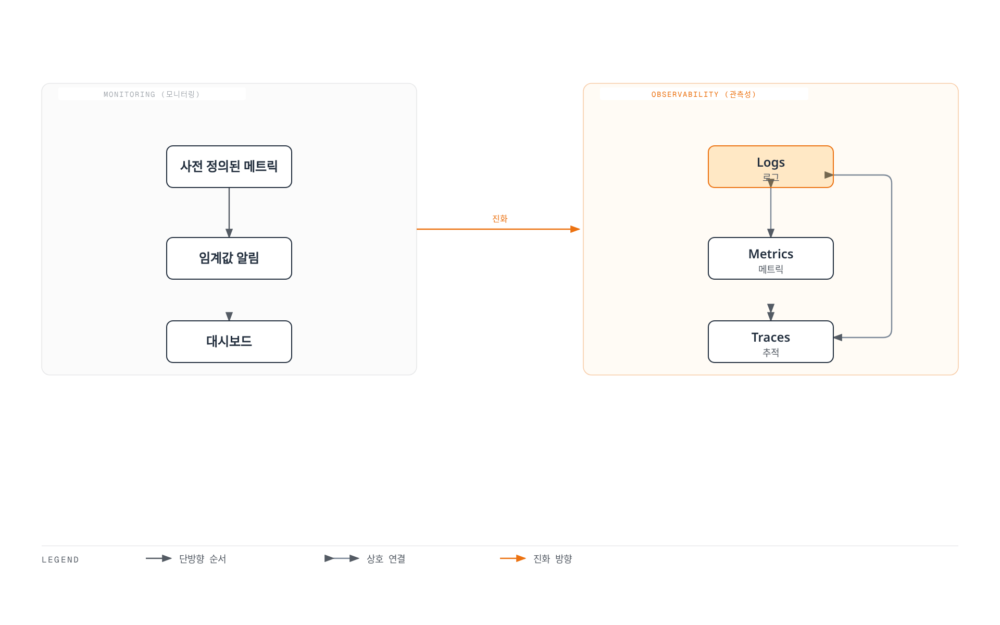
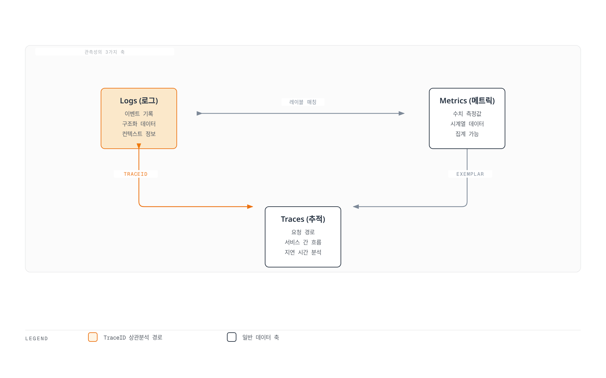
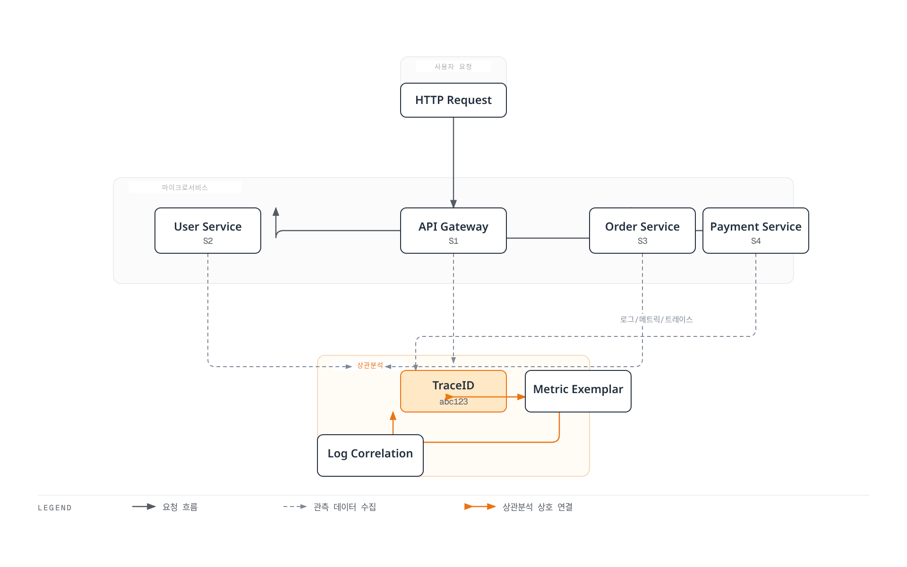
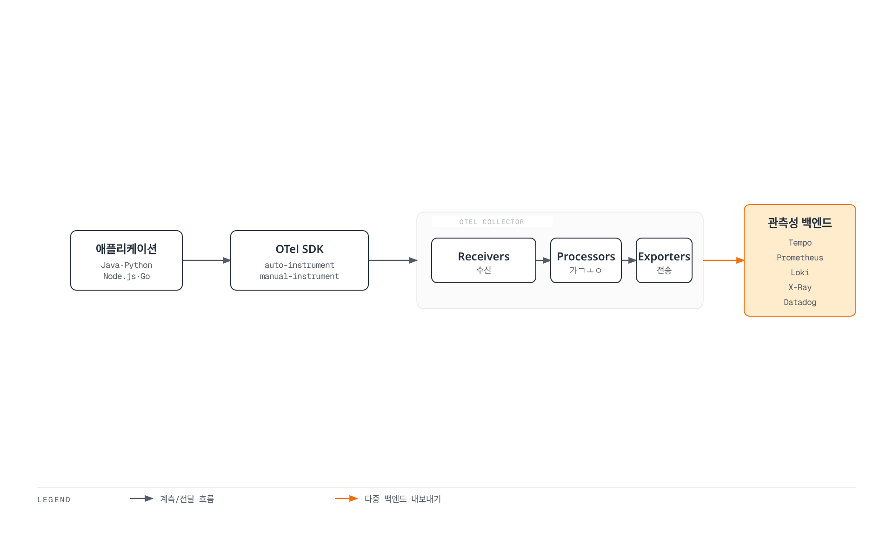
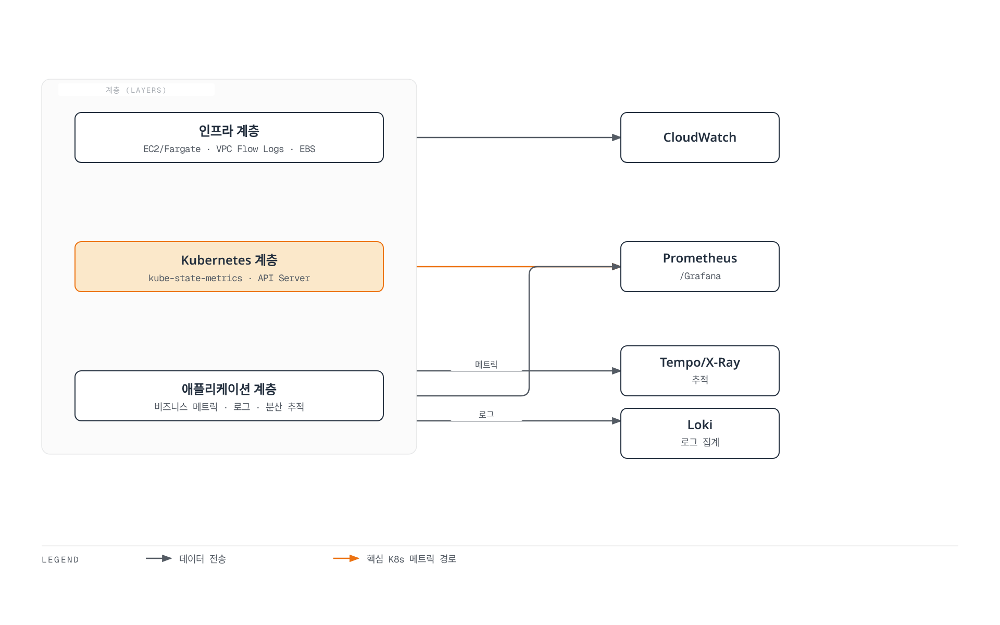
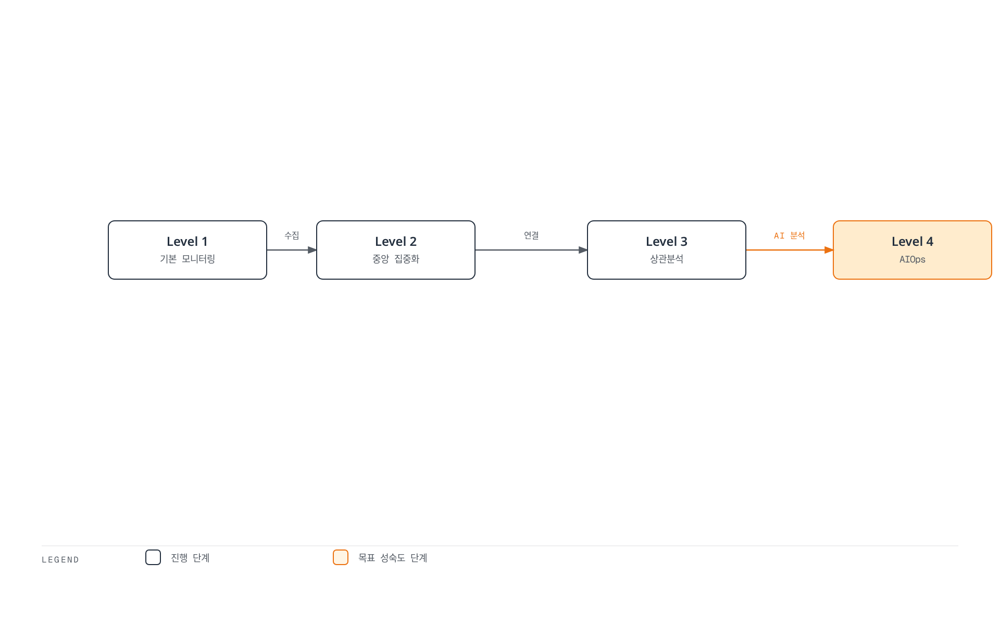

# Observability 개요

> **마지막 업데이트**: 2026년 2월 20일

## 소개

현대의 분산 시스템, 특히 Kubernetes 기반 마이크로서비스 아키텍처에서는 시스템의 내부 상태를 외부에서 관찰하고 이해하는 능력이 필수적입니다. 이를 **관측성(Observability)**이라고 합니다.

## Observability vs Monitoring

관측성과 모니터링은 종종 혼용되지만, 근본적인 차이가 있습니다:

| 구분 | Monitoring | Observability |
|------|-----------|---------------|
| **접근 방식** | 사전 정의된 메트릭과 임계값 기반 | 시스템 출력을 통한 내부 상태 추론 |
| **질문 유형** | "무엇이 잘못되었나?" (What) | "왜 잘못되었나?" (Why) |
| **데이터 범위** | 알려진 문제 탐지 | 알려지지 않은 문제 탐색 |
| **유연성** | 사전 정의된 대시보드 | 동적 쿼리와 탐색 |
| **복잡도** | 단순한 시스템에 적합 | 복잡한 분산 시스템에 필수 |



## 관측성의 3가지 축 (Three Pillars)

관측성은 세 가지 핵심 데이터 유형으로 구성됩니다:



### 1. Logs (로그)

로그는 시스템에서 발생하는 개별 이벤트의 기록입니다.

**특징:**
- 이산적이고 불변하는 이벤트 기록
- 타임스탬프와 컨텍스트 정보 포함
- 구조화(JSON) 또는 비구조화 형식
- 디버깅과 감사에 필수적

**사용 사례:**
- 오류 및 예외 추적
- 보안 감사
- 규정 준수
- 상세한 디버깅

**도구:** Loki, Elasticsearch, CloudWatch Logs, Fluent Bit

### 2. Metrics (메트릭)

메트릭은 시간에 따른 수치 측정값입니다.

**특징:**
- 시계열 데이터로 저장
- 집계 및 수학적 연산 가능
- 저장 효율성이 높음
- 트렌드 분석에 적합

**주요 메트릭 유형:**
- **Counter**: 누적 증가값 (예: 요청 수)
- **Gauge**: 현재 상태값 (예: CPU 사용률)
- **Histogram**: 분포 측정 (예: 응답 시간)
- **Summary**: 분위수 계산

**도구:** Prometheus, VictoriaMetrics, CloudWatch Metrics, Datadog

### 3. Traces (추적)

트레이스는 분산 시스템에서 요청의 전체 경로를 추적합니다.

**특징:**
- 서비스 간 요청 흐름 시각화
- 각 단계의 지연 시간 측정
- 병목 지점 식별
- 의존성 분석

**구성 요소:**
- **Trace**: 단일 요청의 전체 여정
- **Span**: 하나의 작업 단위
- **SpanContext**: 서비스 간 전파되는 컨텍스트

**도구:** Tempo, Jaeger, X-Ray, Zipkin, Datadog APM

## 3가지 축의 상호 연관성

세 가지 축은 독립적이지 않고 서로 연결되어 강력한 분석 능력을 제공합니다:



### Trace-to-Log 상관분석

TraceID를 로그에 포함시켜 특정 요청과 관련된 모든 로그를 추적:

```json
{
  "timestamp": "2025-02-15T10:30:00Z",
  "level": "ERROR",
  "message": "Payment processing failed",
  "traceId": "abc123def456",
  "spanId": "789xyz",
  "service": "payment-service"
}
```

### Metric-to-Trace 상관분석 (Exemplars)

메트릭에 TraceID를 연결하여 이상 징후 발생 시 해당 요청 추적:

```yaml
# Prometheus Exemplar
http_request_duration_seconds_bucket{le="0.5"} 1000 # {traceID="abc123"}
```

## OpenTelemetry와 표준화

OpenTelemetry(OTel)는 관측성 데이터 수집을 위한 업계 표준입니다:



**OpenTelemetry의 장점:**
- 벤더 중립적 표준
- 다양한 언어 SDK 지원
- 자동 계측 기능
- 다중 백엔드 지원
- 활발한 커뮤니티

## EKS 환경에서의 관측성 전략

Amazon EKS에서 효과적인 관측성을 구현하기 위한 전략:

### 1. 계층별 관측성



### 2. 권장 도구 스택

| 기능 | 오픈소스 | AWS 네이티브 | 상용 |
|------|---------|-------------|------|
| 메트릭 | Prometheus, VictoriaMetrics | CloudWatch, AMP | Datadog, New Relic |
| 로그 | Loki, Elasticsearch | CloudWatch Logs | Splunk, Datadog |
| 추적 | Tempo, Jaeger | X-Ray | Datadog APM, Dynatrace |
| 시각화 | Grafana | CloudWatch Dashboards | Datadog, Dynatrace |

### 3. 비용 최적화 전략

- **샘플링**: 추적 데이터 샘플링으로 비용 절감
- **보존 정책**: 데이터 보존 기간 최적화
- **계층화된 스토리지**: 오래된 데이터는 저렴한 스토리지로 이동
- **집계**: 상세 데이터 대신 집계 데이터 저장

## 관측성 성숙도 모델



| 레벨 | 특징 | 도구 예시 |
|-----|------|---------|
| Level 1 | 기본 로그/메트릭 수집 | kubectl logs, CloudWatch |
| Level 2 | 중앙 집중화된 관측성 | Loki, Prometheus, Grafana |
| Level 3 | 3축 상관분석 | Tempo, Exemplars, TraceID |
| Level 4 | AIOps, 자동 이상 탐지 | Datadog Watchdog, Dynatrace Davis |

## 섹션 가이드

이 관측성 섹션은 다음과 같이 구성되어 있습니다:

### [Logging (로깅)](./logging/README.md)
로그 수집, 저장, 분석을 위한 도구와 전략:
- Loki: 경량화된 로그 집계 시스템
- Fluent Bit: 고성능 로그 수집기
- CloudWatch Logs: AWS 네이티브 로깅

### [Metrics (메트릭)](./metrics/README.md)
시계열 메트릭 수집과 분석:
- Prometheus: 업계 표준 메트릭 시스템
- VictoriaMetrics: 고성능 Prometheus 대안
- CloudWatch Metrics: AWS 네이티브 메트릭

### [Tracing (추적)](./tracing/README.md)
분산 추적과 요청 흐름 분석:
- Tempo: Grafana의 분산 추적 백엔드
- X-Ray: AWS 네이티브 분산 추적
- OpenTelemetry: 표준화된 계측
- Dynatrace: AI 기반 APM

### [Grafana (대시보드)](./grafana/README.md)
통합 시각화와 대시보드:
- 데이터 소스 연동
- 대시보드 설계 패턴
- 알림 구성

## 시작하기

관측성 구현을 시작하려면 다음 순서를 권장합니다:

1. **메트릭 수집 설정**: Prometheus 또는 VictoriaMetrics 배포
2. **로그 수집 설정**: Loki와 Fluent Bit 배포
3. **추적 설정**: Tempo 또는 X-Ray 배포
4. **시각화**: Grafana에서 모든 데이터 소스 연동
5. **상관분석**: TraceID 기반 연결 구성

## 참고 자료

- [OpenTelemetry 공식 문서](https://opentelemetry.io/docs/)
- [Grafana LGTM Stack](https://grafana.com/oss/lgtm-stack/)
- [AWS Observability Best Practices](https://aws-observability.github.io/observability-best-practices/)
- [SRE Workbook - Monitoring](https://sre.google/workbook/monitoring/)
