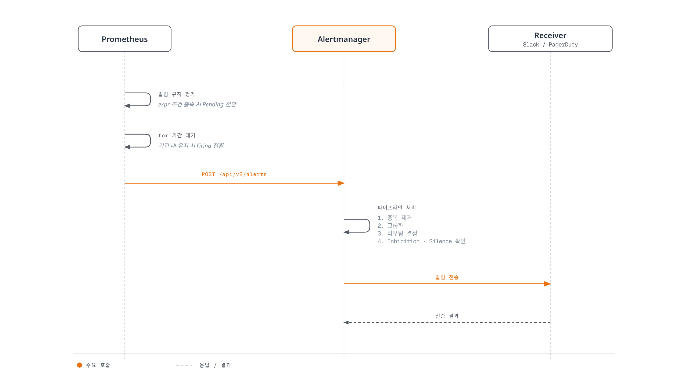
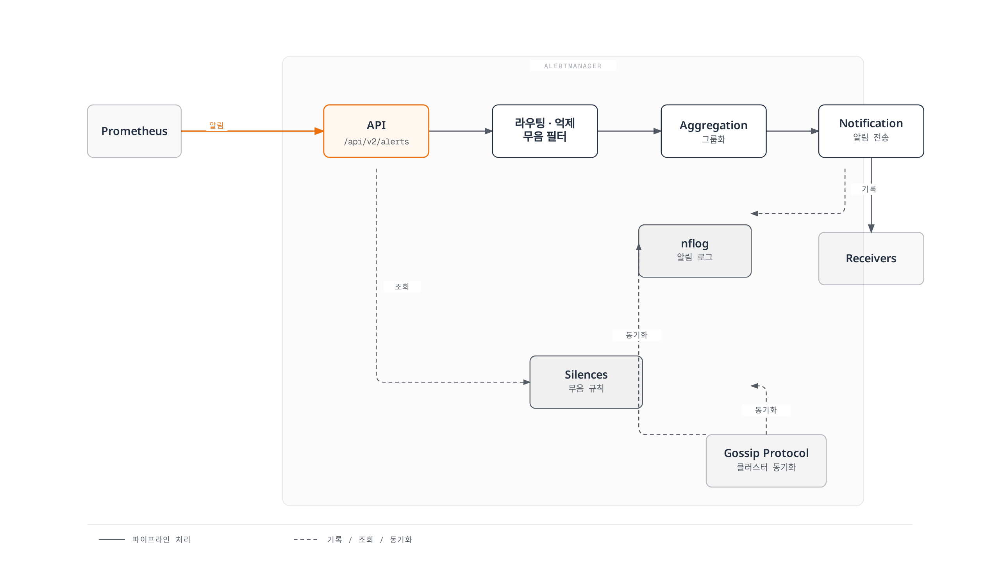
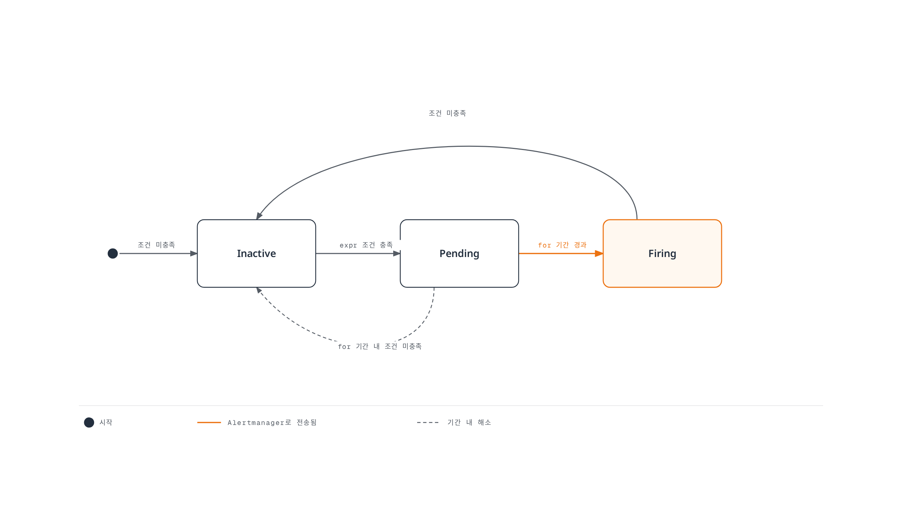
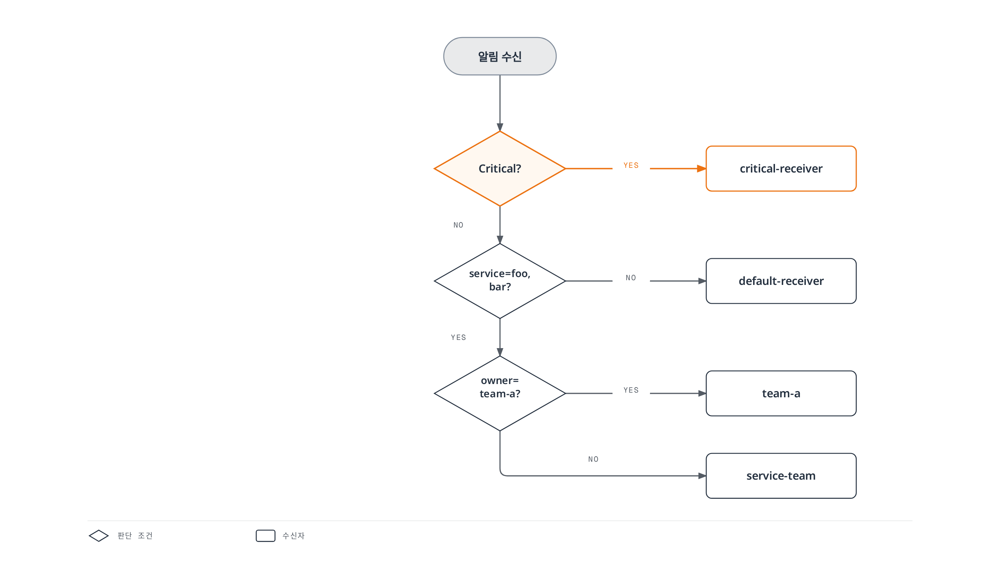
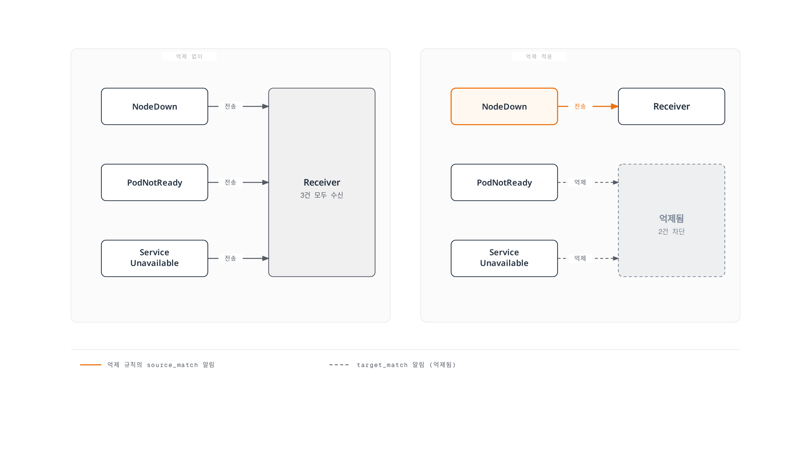
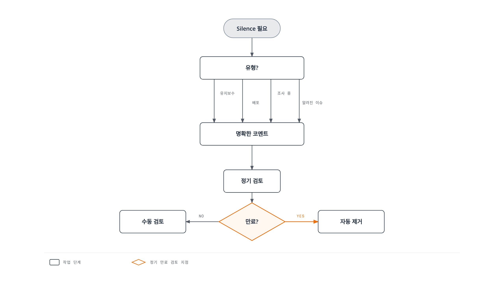
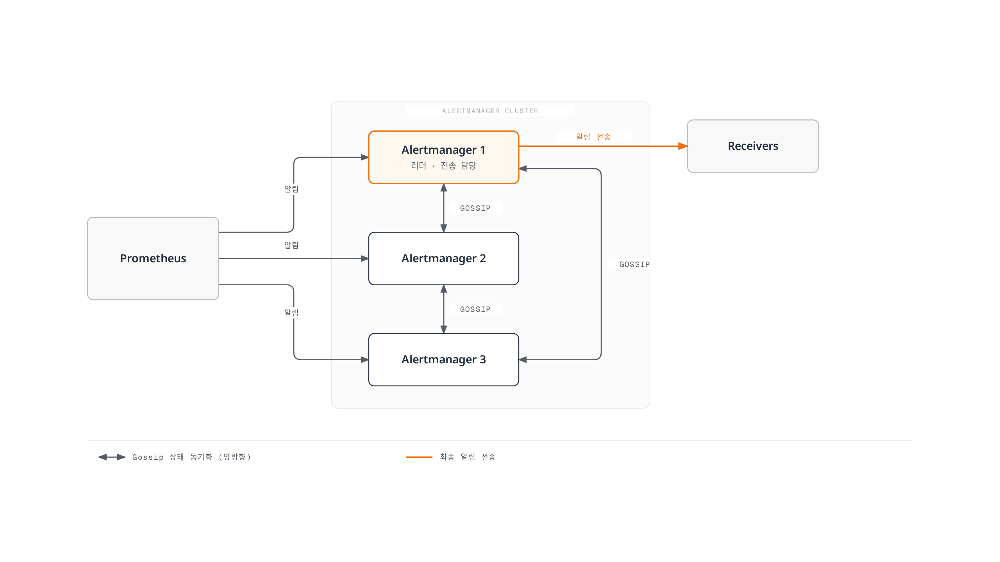

# Prometheus Alertmanager

> **지원 버전**: Alertmanager 0.27.x
> **마지막 업데이트**: 2026년 2월 20일

## 목차

- [Alertmanager 개요](#alertmanager-개요)
- [아키텍처](#아키텍처)
- [설치 및 구성](#설치-및-구성)
- [알림 규칙 정의](#알림-규칙-정의)
- [라우팅 구성](#라우팅-구성)
- [수신자 구성](#수신자-구성)
- [Inhibition 규칙](#inhibition-규칙)
- [Silencing](#silencing)
- [템플릿 커스터마이징](#템플릿-커스터마이징)
- [고가용성 구성](#고가용성-구성)
- [AlertmanagerConfig CRD](#alertmanagerconfig-crd)
- [실전 알림 규칙 예시](#실전-알림-규칙-예시)
- [트러블슈팅](#트러블슈팅)

---

## Alertmanager 개요

Prometheus Alertmanager는 Prometheus 서버에서 전송된 알림을 처리하는 컴포넌트입니다. 알림의 중복 제거, 그룹화, 라우팅, 억제(inhibition), 무음(silencing) 등의 기능을 제공합니다.

### 주요 기능

1. **그룹화 (Grouping)**: 유사한 알림을 하나로 묶어 전송
2. **억제 (Inhibition)**: 특정 알림이 발생하면 관련 알림 억제
3. **무음 (Silencing)**: 특정 기간 동안 알림 무시
4. **라우팅 (Routing)**: 알림을 적절한 수신자에게 전달
5. **고가용성**: 클러스터링을 통한 이중화

### Prometheus 알림 흐름



---

## 아키텍처

### Alertmanager 내부 구조



### 컴포넌트 설명

| 컴포넌트 | 역할 |
|----------|------|
| **Dispatcher** | 라우팅 트리를 기반으로 알림을 적절한 수신자로 라우팅 |
| **Inhibitor** | 억제 규칙에 따라 관련 알림 억제 |
| **Silencer** | 무음 규칙에 해당하는 알림 필터링 |
| **Aggregation Group** | 동일 그룹의 알림을 묶어서 처리 |
| **Notification Pipeline** | 실제 알림 전송 처리 |
| **nflog** | 전송된 알림 기록 (중복 방지용) |

---

## 설치 및 구성

### Helm을 통한 설치 (kube-prometheus-stack)

```bash
# Helm 저장소 추가
helm repo add prometheus-community https://prometheus-community.github.io/helm-charts
helm repo update

# kube-prometheus-stack 설치 (Alertmanager 포함)
helm install prometheus prometheus-community/kube-prometheus-stack \
  --namespace monitoring \
  --create-namespace \
  --set alertmanager.enabled=true
```

### Alertmanager 전용 Helm Chart

```bash
# Alertmanager만 별도 설치
helm install alertmanager prometheus-community/alertmanager \
  --namespace monitoring \
  --create-namespace \
  -f alertmanager-values.yaml
```

### values.yaml 예시

```yaml
# alertmanager-values.yaml
alertmanager:
  enabled: true

  config:
    global:
      resolve_timeout: 5m
      slack_api_url: 'https://hooks.slack.com/services/xxx/yyy/zzz'

    route:
      receiver: 'default-receiver'
      group_by: ['alertname', 'namespace']
      group_wait: 30s
      group_interval: 5m
      repeat_interval: 4h

      routes:
        - match:
            severity: critical
          receiver: 'critical-receiver'

    receivers:
      - name: 'default-receiver'
        slack_configs:
          - channel: '#alerts'
            send_resolved: true

      - name: 'critical-receiver'
        slack_configs:
          - channel: '#critical-alerts'
            send_resolved: true
        pagerduty_configs:
          - service_key: '<pagerduty-service-key>'

    inhibit_rules:
      - source_match:
          severity: 'critical'
        target_match:
          severity: 'warning'
        equal: ['alertname', 'namespace']

  persistence:
    enabled: true
    size: 10Gi

  resources:
    requests:
      memory: 256Mi
      cpu: 100m
    limits:
      memory: 512Mi
      cpu: 200m

  replicas: 3  # 고가용성
```

### ConfigMap으로 직접 구성

```yaml
apiVersion: v1
kind: ConfigMap
metadata:
  name: alertmanager-config
  namespace: monitoring
data:
  alertmanager.yml: |
    global:
      resolve_timeout: 5m

    route:
      receiver: 'default'
      group_by: ['alertname']

    receivers:
      - name: 'default'
        webhook_configs:
          - url: 'http://webhook-receiver:8080/alerts'
```

---

## 알림 규칙 정의

### PrometheusRule CRD

Prometheus Operator를 사용하면 `PrometheusRule` CRD를 통해 알림 규칙을 정의할 수 있습니다.

```yaml
apiVersion: monitoring.coreos.com/v1
kind: PrometheusRule
metadata:
  name: kubernetes-alerts
  namespace: monitoring
  labels:
    release: prometheus  # Prometheus가 이 라벨로 규칙을 선택
spec:
  groups:
    - name: kubernetes.rules
      interval: 30s  # 규칙 평가 주기
      rules:
        # 노드 알림
        - alert: NodeNotReady
          expr: kube_node_status_condition{condition="Ready",status="true"} == 0
          for: 5m
          labels:
            severity: critical
            team: sre
          annotations:
            summary: "Node {{ $labels.node }} is not ready"
            description: "Node {{ $labels.node }} has been not ready for more than 5 minutes."
            runbook_url: "https://wiki.company.com/runbooks/node-not-ready"

        # 파드 알림
        - alert: PodCrashLooping
          expr: |
            rate(kube_pod_container_status_restarts_total[15m]) * 60 * 15 > 3
          for: 5m
          labels:
            severity: warning
            team: dev
          annotations:
            summary: "Pod {{ $labels.namespace }}/{{ $labels.pod }} is crash looping"
            description: "Pod has restarted {{ $value | printf \"%.0f\" }} times in the last 15 minutes."
```

### 알림 규칙 구성 요소

```yaml
rules:
  - alert: AlertName           # 알림 이름 (필수)
    expr: <PromQL expression>  # 알림 조건 (필수)
    for: 5m                    # 조건 지속 시간 (선택, 기본값 0)
    labels:                    # 추가 라벨 (선택)
      severity: warning
      team: sre
    annotations:               # 메타데이터 (선택)
      summary: "요약"
      description: "상세 설명"
      runbook_url: "런북 URL"
```

### 알림 상태



---

## 라우팅 구성

### 라우팅 트리 구조

Alertmanager의 라우팅은 트리 구조로 구성됩니다.

```yaml
route:
  # 기본 수신자 (필수)
  receiver: 'default-receiver'

  # 그룹화 기준
  group_by: ['alertname', 'cluster', 'namespace']

  # 첫 알림 대기 시간
  group_wait: 30s

  # 같은 그룹의 추가 알림 대기 시간
  group_interval: 5m

  # 동일 알림 재전송 간격
  repeat_interval: 4h

  # 하위 라우트
  routes:
    - match:
        severity: critical
      receiver: 'critical-receiver'
      group_wait: 10s

    - match_re:
        service: ^(foo|bar)$
      receiver: 'service-team'
      routes:
        - match:
            owner: team-a
          receiver: 'team-a'
```

### 라우팅 흐름



### 매처 (Matchers)

```yaml
routes:
  # 정확히 일치
  - match:
      severity: critical
      namespace: production
    receiver: 'prod-critical'

  # 정규식 일치
  - match_re:
      service: ^(api|web|worker).*$
      environment: ^prod.*$
    receiver: 'prod-team'

  # 여러 조건 (AND)
  - matchers:
      - severity = critical
      - namespace =~ "prod.*"
    receiver: 'prod-critical'
```

### 고급 라우팅 예시

```yaml
route:
  receiver: 'default'
  group_by: ['alertname', 'namespace']
  routes:
    # 업무 시간 외 Critical만 전송
    - match:
        severity: critical
      receiver: 'oncall'
      active_time_intervals:
        - offhours

    # 업무 시간에는 모든 알림
    - receiver: 'team-slack'
      active_time_intervals:
        - business-hours
      routes:
        - match:
            team: infra
          receiver: 'infra-team'
        - match:
            team: dev
          receiver: 'dev-team'

# 시간 간격 정의
time_intervals:
  - name: business-hours
    time_intervals:
      - weekdays: ['monday:friday']
        times:
          - start_time: '09:00'
            end_time: '18:00'
        location: 'Asia/Seoul'

  - name: offhours
    time_intervals:
      - weekdays: ['monday:friday']
        times:
          - start_time: '18:00'
            end_time: '09:00'
      - weekdays: ['saturday', 'sunday']
```

---

## 수신자 구성

### Slack 수신자

```yaml
receivers:
  - name: 'slack-notifications'
    slack_configs:
      - api_url: 'https://hooks.slack.com/services/T00/B00/XXX'
        channel: '#alerts'
        username: 'Alertmanager'
        icon_emoji: ':warning:'
        send_resolved: true

        # 메시지 제목
        title: '{{ template "slack.default.title" . }}'

        # 메시지 본문
        text: |
          {{ range .Alerts }}
          *Alert:* {{ .Labels.alertname }}
          *Severity:* {{ .Labels.severity }}
          *Description:* {{ .Annotations.description }}
          *Details:*
          {{ range .Labels.SortedPairs }}• *{{ .Name }}:* `{{ .Value }}`
          {{ end }}
          {{ end }}

        # 색상 (resolved: good, firing: danger)
        color: '{{ if eq .Status "firing" }}danger{{ else }}good{{ end }}'

        # 필드 추가
        fields:
          - title: Severity
            value: '{{ .CommonLabels.severity }}'
            short: true
          - title: Namespace
            value: '{{ .CommonLabels.namespace }}'
            short: true
```

### PagerDuty 수신자

```yaml
receivers:
  - name: 'pagerduty-critical'
    pagerduty_configs:
      - service_key: '<integration-key>'
        severity: '{{ .CommonLabels.severity }}'
        description: '{{ .CommonAnnotations.summary }}'
        client: 'Alertmanager'
        client_url: 'https://alertmanager.example.com'

        details:
          alertname: '{{ .CommonLabels.alertname }}'
          namespace: '{{ .CommonLabels.namespace }}'
          description: '{{ .CommonAnnotations.description }}'

        # 링크 추가
        links:
          - href: '{{ .CommonAnnotations.runbook_url }}'
            text: 'Runbook'
          - href: 'https://grafana.example.com/d/xxx?var-namespace={{ .CommonLabels.namespace }}'
            text: 'Dashboard'
```

### Email 수신자

```yaml
receivers:
  - name: 'email-alerts'
    email_configs:
      - to: 'team@example.com'
        from: 'alertmanager@example.com'
        smarthost: 'smtp.example.com:587'
        auth_username: 'alertmanager@example.com'
        auth_password: '<password>'
        send_resolved: true

        # HTML 템플릿
        html: '{{ template "email.default.html" . }}'

        # 제목
        headers:
          Subject: '[{{ .Status | toUpper }}] {{ .CommonLabels.alertname }}'
```

### OpsGenie 수신자

```yaml
receivers:
  - name: 'opsgenie-alerts'
    opsgenie_configs:
      - api_key: '<api-key>'
        api_url: 'https://api.opsgenie.com/'
        message: '{{ .CommonLabels.alertname }}'
        description: '{{ .CommonAnnotations.description }}'
        priority: '{{ if eq .CommonLabels.severity "critical" }}P1{{ else if eq .CommonLabels.severity "warning" }}P3{{ else }}P5{{ end }}'

        # 태그
        tags: 'kubernetes,{{ .CommonLabels.namespace }}'

        # 팀 지정
        teams:
          - name: 'sre-team'

        # 상세 정보
        details:
          alertname: '{{ .CommonLabels.alertname }}'
          namespace: '{{ .CommonLabels.namespace }}'
          severity: '{{ .CommonLabels.severity }}'
```

### Webhook 수신자

```yaml
receivers:
  - name: 'webhook-receiver'
    webhook_configs:
      - url: 'http://webhook-handler.monitoring:8080/alerts'
        send_resolved: true
        max_alerts: 10

        # HTTP 설정
        http_config:
          basic_auth:
            username: 'alertmanager'
            password: '<password>'
          tls_config:
            insecure_skip_verify: false
```

### 다중 수신자 구성

```yaml
receivers:
  - name: 'team-all'
    slack_configs:
      - channel: '#alerts'
        api_url: '<slack-webhook-url>'
    email_configs:
      - to: 'team@example.com'
    pagerduty_configs:
      - service_key: '<integration-key>'
```

---

## Inhibition 규칙

### Inhibition 개념

Inhibition은 특정 알림이 발생했을 때 관련된 다른 알림을 억제하는 기능입니다.



### Inhibition 규칙 구성

```yaml
inhibit_rules:
  # 노드 다운 시 해당 노드의 파드 알림 억제
  - source_match:
      alertname: NodeDown
    target_match_re:
      alertname: ^(PodNotReady|PodCrashLooping|ContainerOOMKilled)$
    equal: ['node']

  # Critical 알림이 있으면 Warning 억제
  - source_match:
      severity: critical
    target_match:
      severity: warning
    equal: ['alertname', 'namespace']

  # 클러스터 다운 시 모든 노드 알림 억제
  - source_match:
      alertname: ClusterDown
    target_match_re:
      alertname: ^Node.*$
    equal: ['cluster']

  # 데이터베이스 다운 시 연결 오류 알림 억제
  - source_matchers:
      - alertname = DatabaseDown
    target_matchers:
      - alertname =~ "DatabaseConnection.*|DatabaseTimeout.*"
    equal: ['instance']
```

### Inhibition 우선순위

```yaml
inhibit_rules:
  # 1순위: 인프라 장애
  - source_match:
      alertname: InfrastructureFailure
    target_match_re:
      alertname: .*
    equal: ['datacenter']

  # 2순위: 노드 장애
  - source_match:
      alertname: NodeDown
    target_match_re:
      alertname: ^(Pod|Container).*$
    equal: ['node']

  # 3순위: 서비스 장애
  - source_match:
      alertname: ServiceDown
    target_match_re:
      alertname: ^Endpoint.*$
    equal: ['service', 'namespace']
```

---

## Silencing

### Silence 생성

Alertmanager UI 또는 API를 통해 Silence를 생성할 수 있습니다.

#### amtool CLI 사용

```bash
# Silence 생성 (2시간)
amtool silence add alertname=PodCrashLooping namespace=development \
  --duration=2h \
  --comment="개발 환경 배포 중" \
  --author="ops@example.com"

# 특정 시간까지 Silence
amtool silence add alertname=NodeDown node="worker-1" \
  --end="2025-02-21T18:00:00+09:00" \
  --comment="노드 유지보수" \
  --author="ops@example.com"

# Silence 목록 조회
amtool silence query

# Silence 만료
amtool silence expire <silence-id>
```

#### API를 통한 Silence 생성

```bash
curl -X POST http://alertmanager:9093/api/v2/silences \
  -H "Content-Type: application/json" \
  -d '{
    "matchers": [
      {"name": "alertname", "value": "HighCPU", "isRegex": false},
      {"name": "namespace", "value": "dev.*", "isRegex": true}
    ],
    "startsAt": "2025-02-20T10:00:00Z",
    "endsAt": "2025-02-20T14:00:00Z",
    "createdBy": "ops@example.com",
    "comment": "개발 환경 부하 테스트"
  }'
```

### Silence 관리 모범 사례



**권장 사항:**

1. **항상 코멘트 작성**: 왜 Silence를 만들었는지 기록
2. **최소 기간 설정**: 필요한 만큼만 Silence
3. **정기적 검토**: 장기 Silence는 정기적으로 검토
4. **알림 설정**: Silence 만료 전 알림

---

## 템플릿 커스터마이징

### Go 템플릿 기본

Alertmanager는 Go 템플릿을 사용합니다.

```yaml
# 템플릿 파일 정의
templates:
  - '/etc/alertmanager/templates/*.tmpl'
```

### Slack 템플릿 예시

```go
{{ define "slack.custom.title" }}
[{{ .Status | toUpper }}{{ if eq .Status "firing" }}:{{ .Alerts.Firing | len }}{{ end }}] {{ .CommonLabels.alertname }}
{{ end }}

{{ define "slack.custom.text" }}
{{ range .Alerts }}
*Alert:* {{ .Labels.alertname }}
*Severity:* `{{ .Labels.severity }}`
*Namespace:* `{{ .Labels.namespace }}`
*Description:* {{ .Annotations.description }}
*Started:* {{ .StartsAt.Format "2006-01-02 15:04:05 MST" }}
{{ if .Annotations.runbook_url }}*Runbook:* <{{ .Annotations.runbook_url }}|링크>{{ end }}
---
{{ end }}
{{ end }}

{{ define "slack.custom.color" }}
{{ if eq .Status "firing" }}
{{ if eq .CommonLabels.severity "critical" }}#ff0000{{ else if eq .CommonLabels.severity "warning" }}#ff9900{{ else }}#439fe0{{ end }}
{{ else }}#36a64f{{ end }}
{{ end }}
```

### 템플릿 함수

```go
{{ define "custom.message" }}
{{ /* 문자열 조작 */ }}
{{ .Labels.alertname | title }}
{{ .Labels.namespace | toUpper }}

{{ /* 조건문 */ }}
{{ if eq .Labels.severity "critical" }}긴급{{ else }}일반{{ end }}

{{ /* 반복문 */ }}
{{ range .Alerts }}
- {{ .Labels.alertname }}
{{ end }}

{{ /* 날짜 포맷 */ }}
{{ .StartsAt.Format "2006-01-02 15:04" }}

{{ /* 숫자 포맷 */ }}
{{ $value := 95.5 }}
{{ printf "%.2f%%" $value }}

{{ /* 라벨 정렬 */ }}
{{ range .Labels.SortedPairs }}
{{ .Name }}: {{ .Value }}
{{ end }}
{{ end }}
```

### ConfigMap으로 템플릿 관리

```yaml
apiVersion: v1
kind: ConfigMap
metadata:
  name: alertmanager-templates
  namespace: monitoring
data:
  slack.tmpl: |
    {{ define "slack.custom.title" }}
    [{{ .Status | toUpper }}] {{ .CommonLabels.alertname }}
    {{ end }}

    {{ define "slack.custom.text" }}
    {{ range .Alerts }}
    *Severity:* {{ .Labels.severity }}
    *Description:* {{ .Annotations.description }}
    {{ end }}
    {{ end }}
```

---

## 고가용성 구성

### 클러스터링 아키텍처



### StatefulSet 구성

```yaml
apiVersion: apps/v1
kind: StatefulSet
metadata:
  name: alertmanager
  namespace: monitoring
spec:
  serviceName: alertmanager
  replicas: 3
  selector:
    matchLabels:
      app: alertmanager
  template:
    metadata:
      labels:
        app: alertmanager
    spec:
      containers:
        - name: alertmanager
          image: quay.io/prometheus/alertmanager:v0.27.0
          args:
            - '--config.file=/etc/alertmanager/alertmanager.yml'
            - '--storage.path=/alertmanager'
            - '--cluster.listen-address=0.0.0.0:9094'
            - '--cluster.peer=alertmanager-0.alertmanager:9094'
            - '--cluster.peer=alertmanager-1.alertmanager:9094'
            - '--cluster.peer=alertmanager-2.alertmanager:9094'
          ports:
            - containerPort: 9093
              name: http
            - containerPort: 9094
              name: cluster
          volumeMounts:
            - name: config
              mountPath: /etc/alertmanager
            - name: storage
              mountPath: /alertmanager
          resources:
            requests:
              memory: 256Mi
              cpu: 100m
            limits:
              memory: 512Mi
              cpu: 200m
      volumes:
        - name: config
          configMap:
            name: alertmanager-config
  volumeClaimTemplates:
    - metadata:
        name: storage
      spec:
        accessModes: ["ReadWriteOnce"]
        resources:
          requests:
            storage: 10Gi
---
apiVersion: v1
kind: Service
metadata:
  name: alertmanager
  namespace: monitoring
spec:
  type: ClusterIP
  clusterIP: None  # Headless service
  ports:
    - port: 9093
      name: http
    - port: 9094
      name: cluster
  selector:
    app: alertmanager
```

### Prometheus 연동 설정

```yaml
# Prometheus 설정
alerting:
  alertmanagers:
    - static_configs:
        - targets:
            - alertmanager-0.alertmanager:9093
            - alertmanager-1.alertmanager:9093
            - alertmanager-2.alertmanager:9093
      # 또는 DNS 기반
    - dns_sd_configs:
        - names:
            - alertmanager.monitoring.svc
          type: A
          port: 9093
```

---

## AlertmanagerConfig CRD

### 네임스페이스별 설정

Prometheus Operator의 `AlertmanagerConfig` CRD를 사용하면 네임스페이스별로 알림 설정을 분리할 수 있습니다.

```yaml
apiVersion: monitoring.coreos.com/v1alpha1
kind: AlertmanagerConfig
metadata:
  name: team-a-config
  namespace: team-a
  labels:
    alertmanagerConfig: team-a
spec:
  route:
    receiver: 'team-a-slack'
    groupBy: ['alertname']
    matchers:
      - name: namespace
        value: team-a
    routes:
      - receiver: 'team-a-critical'
        matchers:
          - name: severity
            value: critical

  receivers:
    - name: 'team-a-slack'
      slackConfigs:
        - apiURL:
            name: slack-webhook-secret
            key: webhook-url
          channel: '#team-a-alerts'
          sendResolved: true

    - name: 'team-a-critical'
      slackConfigs:
        - apiURL:
            name: slack-webhook-secret
            key: webhook-url
          channel: '#team-a-critical'
      pagerdutyConfigs:
        - routingKey:
            name: pagerduty-secret
            key: routing-key

  inhibitRules:
    - sourceMatch:
        - name: severity
          value: critical
      targetMatch:
        - name: severity
          value: warning
      equal: ['alertname']
```

### Secret 참조

```yaml
apiVersion: v1
kind: Secret
metadata:
  name: slack-webhook-secret
  namespace: team-a
type: Opaque
stringData:
  webhook-url: "https://hooks.slack.com/services/xxx/yyy/zzz"
---
apiVersion: v1
kind: Secret
metadata:
  name: pagerduty-secret
  namespace: team-a
type: Opaque
stringData:
  routing-key: "<pagerduty-routing-key>"
```

### Alertmanager에서 AlertmanagerConfig 선택

```yaml
apiVersion: monitoring.coreos.com/v1
kind: Alertmanager
metadata:
  name: main
  namespace: monitoring
spec:
  replicas: 3
  alertmanagerConfigSelector:
    matchLabels:
      alertmanagerConfig: enabled
  alertmanagerConfigNamespaceSelector: {}  # 모든 네임스페이스
```

---

## 실전 알림 규칙 예시

### Node 알림

```yaml
apiVersion: monitoring.coreos.com/v1
kind: PrometheusRule
metadata:
  name: node-alerts
  namespace: monitoring
spec:
  groups:
    - name: node.rules
      rules:
        - alert: NodeDown
          expr: up{job="node-exporter"} == 0
          for: 5m
          labels:
            severity: critical
          annotations:
            summary: "Node {{ $labels.instance }} is down"
            description: "Node exporter is not responding for more than 5 minutes."

        - alert: NodeHighCPU
          expr: |
            100 - (avg by(instance) (rate(node_cpu_seconds_total{mode="idle"}[5m])) * 100) > 80
          for: 10m
          labels:
            severity: warning
          annotations:
            summary: "High CPU usage on {{ $labels.instance }}"
            description: "CPU usage is {{ $value | printf \"%.2f\" }}%"

        - alert: NodeHighMemory
          expr: |
            (1 - (node_memory_MemAvailable_bytes / node_memory_MemTotal_bytes)) * 100 > 90
          for: 10m
          labels:
            severity: warning
          annotations:
            summary: "High memory usage on {{ $labels.instance }}"
            description: "Memory usage is {{ $value | printf \"%.2f\" }}%"

        - alert: NodeDiskPressure
          expr: |
            (node_filesystem_avail_bytes{fstype!~"tmpfs|overlay"} / node_filesystem_size_bytes) * 100 < 15
          for: 5m
          labels:
            severity: warning
          annotations:
            summary: "Low disk space on {{ $labels.instance }}"
            description: "Disk {{ $labels.mountpoint }} has only {{ $value | printf \"%.2f\" }}% free"

        - alert: NodeNetworkErrors
          expr: |
            rate(node_network_receive_errs_total[5m]) > 10
            or
            rate(node_network_transmit_errs_total[5m]) > 10
          for: 5m
          labels:
            severity: warning
          annotations:
            summary: "Network errors on {{ $labels.instance }}"
```

### Pod 및 Container 알림

```yaml
apiVersion: monitoring.coreos.com/v1
kind: PrometheusRule
metadata:
  name: pod-alerts
  namespace: monitoring
spec:
  groups:
    - name: pod.rules
      rules:
        - alert: PodNotReady
          expr: |
            kube_pod_status_phase{phase=~"Pending|Unknown"} > 0
          for: 15m
          labels:
            severity: warning
          annotations:
            summary: "Pod {{ $labels.namespace }}/{{ $labels.pod }} is not ready"

        - alert: PodCrashLooping
          expr: |
            rate(kube_pod_container_status_restarts_total[15m]) * 60 * 15 > 3
          for: 5m
          labels:
            severity: warning
          annotations:
            summary: "Pod {{ $labels.namespace }}/{{ $labels.pod }} is crash looping"
            description: "Pod has restarted {{ $value | printf \"%.0f\" }} times in 15 minutes"

        - alert: ContainerOOMKilled
          expr: |
            kube_pod_container_status_last_terminated_reason{reason="OOMKilled"} > 0
          for: 0m
          labels:
            severity: warning
          annotations:
            summary: "Container {{ $labels.container }} in {{ $labels.namespace }}/{{ $labels.pod }} was OOM killed"

        - alert: ContainerCPUThrottled
          expr: |
            rate(container_cpu_cfs_throttled_seconds_total[5m]) > 0.5
          for: 10m
          labels:
            severity: warning
          annotations:
            summary: "Container {{ $labels.container }} is being CPU throttled"

        - alert: ContainerMemoryNearLimit
          expr: |
            (container_memory_working_set_bytes / container_spec_memory_limit_bytes) > 0.9
          for: 5m
          labels:
            severity: warning
          annotations:
            summary: "Container {{ $labels.container }} memory usage is near limit"
            description: "Memory usage is {{ $value | printf \"%.2f\" }}% of limit"
```

### API Server 알림

```yaml
apiVersion: monitoring.coreos.com/v1
kind: PrometheusRule
metadata:
  name: apiserver-alerts
  namespace: monitoring
spec:
  groups:
    - name: apiserver.rules
      rules:
        - alert: KubeAPIServerDown
          expr: |
            absent(up{job="kubernetes-apiservers"} == 1)
          for: 5m
          labels:
            severity: critical
          annotations:
            summary: "Kubernetes API server is down"

        - alert: KubeAPIServerLatencyHigh
          expr: |
            histogram_quantile(0.99,
              sum(rate(apiserver_request_duration_seconds_bucket{verb!~"WATCH|CONNECT"}[5m]))
              by (verb, resource, le)
            ) > 1
          for: 10m
          labels:
            severity: warning
          annotations:
            summary: "API server latency is high"
            description: "99th percentile latency for {{ $labels.verb }} {{ $labels.resource }} is {{ $value | printf \"%.2f\" }}s"

        - alert: KubeAPIServerErrors
          expr: |
            sum(rate(apiserver_request_total{code=~"5.."}[5m])) /
            sum(rate(apiserver_request_total[5m])) > 0.01
          for: 10m
          labels:
            severity: warning
          annotations:
            summary: "API server error rate is high"
            description: "Error rate is {{ $value | printf \"%.2f\" }}%"

        - alert: KubeClientCertificateExpiration
          expr: |
            apiserver_client_certificate_expiration_seconds_count > 0
            and
            apiserver_client_certificate_expiration_seconds_bucket{le="604800"} > 0
          for: 0m
          labels:
            severity: warning
          annotations:
            summary: "Client certificate will expire within 7 days"
```

### etcd 알림

```yaml
apiVersion: monitoring.coreos.com/v1
kind: PrometheusRule
metadata:
  name: etcd-alerts
  namespace: monitoring
spec:
  groups:
    - name: etcd.rules
      rules:
        - alert: EtcdMembersDown
          expr: |
            count(etcd_server_id) < 3
          for: 5m
          labels:
            severity: critical
          annotations:
            summary: "etcd cluster has less than 3 members"

        - alert: EtcdNoLeader
          expr: |
            etcd_server_has_leader == 0
          for: 1m
          labels:
            severity: critical
          annotations:
            summary: "etcd cluster has no leader"

        - alert: EtcdHighCommitDuration
          expr: |
            histogram_quantile(0.99, rate(etcd_disk_backend_commit_duration_seconds_bucket[5m])) > 0.25
          for: 10m
          labels:
            severity: warning
          annotations:
            summary: "etcd commit duration is high"
            description: "99th percentile commit duration is {{ $value | printf \"%.3f\" }}s"

        - alert: EtcdHighFsyncDuration
          expr: |
            histogram_quantile(0.99, rate(etcd_disk_wal_fsync_duration_seconds_bucket[5m])) > 0.5
          for: 10m
          labels:
            severity: warning
          annotations:
            summary: "etcd fsync duration is high"

        - alert: EtcdDatabaseSizeLarge
          expr: |
            etcd_mvcc_db_total_size_in_bytes > 6e+9
          for: 5m
          labels:
            severity: warning
          annotations:
            summary: "etcd database size is large"
            description: "Database size is {{ $value | humanize1024 }}B"
```

---

## 트러블슈팅

### 일반적인 문제와 해결책

#### 알림이 전송되지 않는 경우

```bash
# 1. Alertmanager 로그 확인
kubectl logs -n monitoring alertmanager-main-0

# 2. 설정 확인
kubectl exec -n monitoring alertmanager-main-0 -- cat /etc/alertmanager/config/alertmanager.yaml

# 3. 알림 상태 확인 (API)
curl http://alertmanager:9093/api/v2/alerts

# 4. Silence 확인
curl http://alertmanager:9093/api/v2/silences

# 5. Prometheus에서 알림 발생 확인
curl http://prometheus:9090/api/v1/alerts
```

#### 중복 알림이 발생하는 경우

```yaml
# group_by 설정 확인
route:
  group_by: ['alertname', 'namespace', 'pod']  # 적절한 그룹화 키 설정
  group_wait: 30s
  group_interval: 5m
  repeat_interval: 4h  # 충분한 간격 설정
```

#### 알림이 잘못된 수신자에게 전송되는 경우

```bash
# 라우팅 테스트
amtool config routes test \
  --config.file=/etc/alertmanager/alertmanager.yml \
  alertname=HighCPU severity=warning namespace=production

# 출력: 해당 알림이 어느 수신자로 라우팅되는지 표시
```

### amtool 명령어 모음

```bash
# 설정 검증
amtool check-config /etc/alertmanager/alertmanager.yml

# 알림 목록 조회
amtool alert query

# 특정 알림 조회
amtool alert query alertname=HighCPU

# Silence 생성
amtool silence add alertname=HighCPU --duration=2h --comment="테스트"

# Silence 목록
amtool silence query

# Silence 만료
amtool silence expire <silence-id>

# 라우팅 테스트
amtool config routes test --config.file=config.yml alertname=Test severity=warning
```

### 메트릭 확인

```promql
# Alertmanager 메트릭

# 수신된 알림 수
alertmanager_alerts_received_total

# 유효하지 않은 알림 수
alertmanager_alerts_invalid_total

# 전송 실패 수
alertmanager_notifications_failed_total

# 전송 성공 수
alertmanager_notifications_total

# 현재 활성 알림 수
alertmanager_alerts

# 현재 Silence 수
alertmanager_silences

# 클러스터 상태
alertmanager_cluster_members
```

### 디버깅 팁

```yaml
# 1. 디버그 수신자 추가
receivers:
  - name: 'debug'
    webhook_configs:
      - url: 'http://localhost:5001/'  # webhook.site 등 활용
        send_resolved: true

# 2. 로그 레벨 상향
containers:
  - name: alertmanager
    args:
      - '--log.level=debug'

# 3. 테스트 알림 전송
curl -X POST http://alertmanager:9093/api/v2/alerts \
  -H "Content-Type: application/json" \
  -d '[{
    "labels": {
      "alertname": "TestAlert",
      "severity": "warning"
    },
    "annotations": {
      "summary": "This is a test alert"
    }
  }]'
```

---

## 퀴즈

이 장에서 배운 내용을 테스트하려면 [Alertmanager 퀴즈](../../quizzes/observability/alerting/01-alertmanager-quiz.md)를 풀어보세요.
