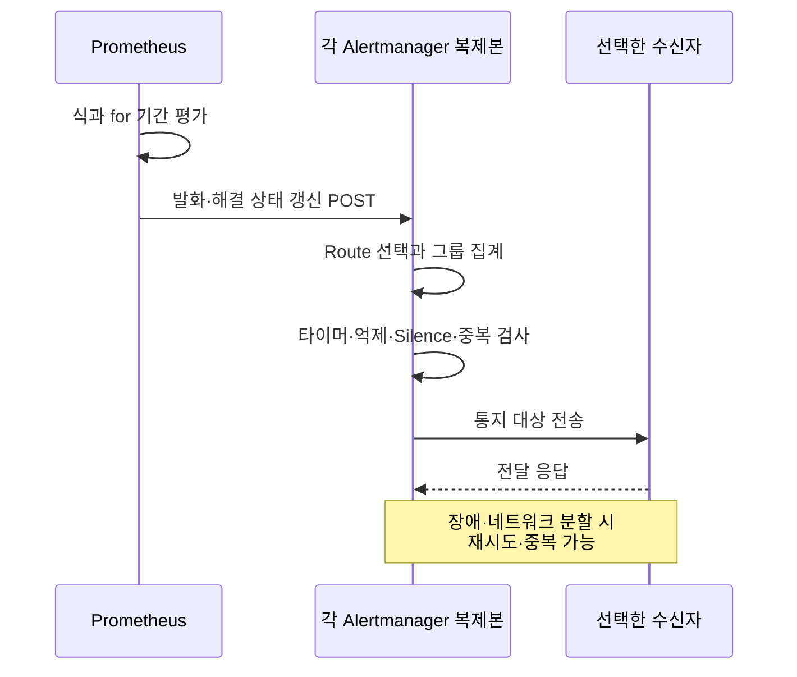
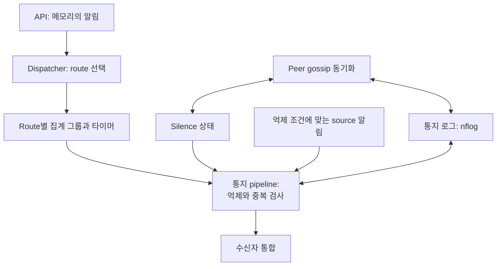
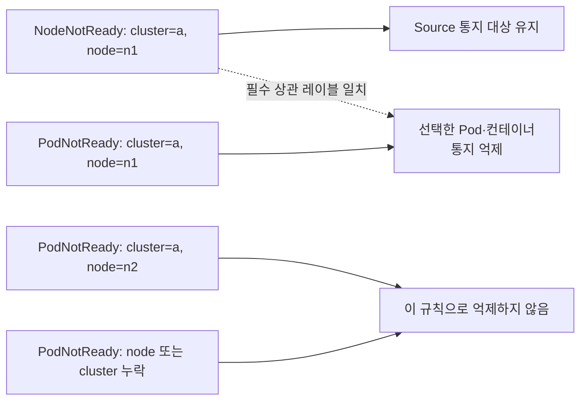
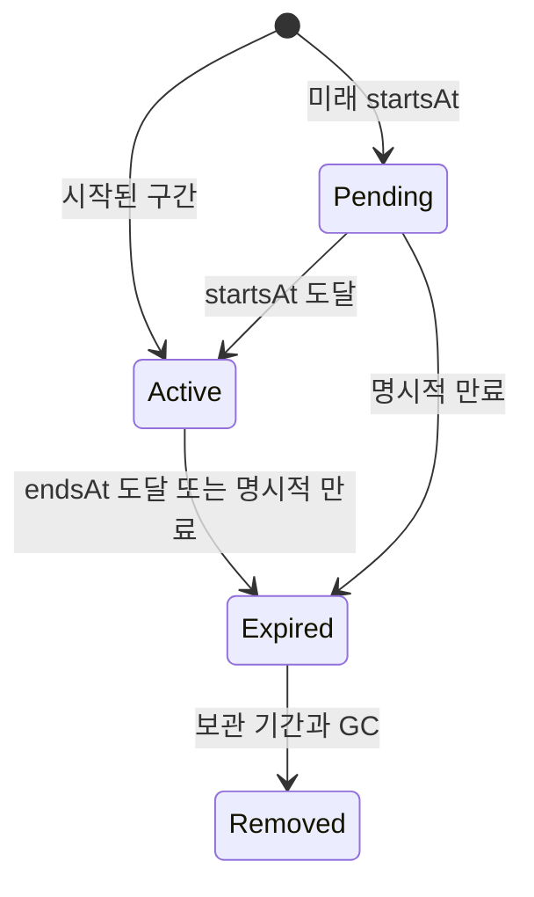

# Prometheus Alertmanager

> **검토 기준**: Alertmanager 0.34.0; kube-prometheus-stack 90.0.0 / Operator 0.93.1; standalone chart 1.43.1
> **마지막 업데이트**: 2026년 9월 13일

## 목차

- [Alertmanager 개요](#alertmanager-개요)
- [아키텍처](#아키텍처)
- [설치 및 구성](#설치-및-구성)
- [알림 규칙 정의](#알림-규칙-정의)
- [라우팅 구성](#라우팅-구성)
- [수신자 구성](#수신자-구성)
- [Inhibition 규칙](#inhibition-규칙)
- [Silencing](#silencing)
- [템플릿 커스터마이징](#템플릿-커스터마이징)
- [고가용성 구성](#고가용성-구성)
- [AlertmanagerConfig CRD](#alertmanagerconfig-crd)
- [실전 알림 규칙 예시](#실전-알림-규칙-예시)
- [트러블슈팅](#트러블슈팅)

---

## Alertmanager 개요

Prometheus Alertmanager는 Prometheus 서버에서 전송된 알림을 처리하는 컴포넌트입니다. 알림의 중복 제거, 그룹화, 라우팅, 억제(inhibition), 무음(silencing) 등의 기능을 제공합니다.

### 주요 기능

1. **Grouping**은 route·그룹별 알림을 묶어 통지합니다.
2. **Inhibition·Silence**는 Prometheus 규칙 조건을 바꾸지 않고 통지를 억제합니다.
3. **Routing**은 receiver를 선택하며 한 receiver에 여러 통합을 넣을 수 있습니다.
4. **HA**는 Silence·통지 로그를 최종적 일관성으로 공유합니다. 네트워크 분할에서는 통지 누락보다 중복 전송을 허용하는 방향이며 exactly-once가 아닙니다.

### Prometheus 알림 흐름

Prometheus는 규칙을 평가하고 Alertmanager는 통지를 처리합니다. 아래는 역할 요약이며 전달 지연의 보장이 아닙니다.



## 아키텍처

### Alertmanager 내부 구조

Dispatcher는 **route를 선택한 후** 그룹을 만듭니다. Inhibition, Silence·시간 검사와 통지 로그 중복 검사는 notification pipeline에서 수행하며 그룹화 이전의 고정된 직렬 단계가 아닙니다. Gossip은 Prometheus의 모든 복제본 전송을 대신하지 않습니다. 알림 자체는 Silence/nflog처럼 영구 보관되지 않습니다.



### 컴포넌트 설명

| 컴포넌트 | 역할 |
|----------|------|
| **Dispatcher** | 라우팅 트리를 기반으로 알림을 적절한 수신자로 라우팅 |
| **Inhibitor** | 억제 규칙에 따라 관련 알림 억제 |
| **Silencer** | 무음 규칙에 해당하는 알림 필터링 |
| **Aggregation Group** | 동일 그룹의 알림을 묶어서 처리 |
| **Notification Pipeline** | 실제 알림 전송 처리 |
| **nflog** | 전송된 알림 기록 (중복 방지용) |

---

## 설치 및 구성

Kubernetes 1.35 Linux 워커 기준의 대안적 예제입니다. 두 Helm chart와 수동 StatefulSet은 **서로 다른 설치 소유 방식**이므로 하나를 선택합니다. Chart 렌더, 설정·템플릿 및 합성 시계열 규칙을 로컬에서 검증했지만 Kubernetes 설치, CNI 집행, SaaS 전달, 운영 용량 시험은 수행하지 않았습니다. 기존 설치에는 이 예제를 덮어쓰지 말고 소유자가 검토한 values 병합·업그레이드 계획을 적용합니다.

`monitoring` 네임스페이스, hard anti-affinity에 필요한 스케줄 가능한 노드 3개, 적합한 기본 RWO StorageClass, 알림 자격 증명과 승인된 네트워크 경로를 준비합니다. EKS Fargate/Auto Mode 및 관리형 컨트롤 플레인은 수집·스토리지 조건이 다릅니다. 특히 EKS 관리형 etcd는 고객이 직접 scrape하는 endpoint가 아닙니다. 예제는 범위를 좁히기 위해 Grafana와 etcd ServiceMonitor를 비활성화하며 기존 스택 컴포넌트의 비활성화 지시가 아닙니다.

### Helm을 통한 설치 (kube-prometheus-stack)

아래 고정 stack profile은 **새 릴리스**용입니다. 90.0.0은 Operator 0.93.1·Alertmanager 0.34.0을 포함합니다. 검증 기준이며 더 최신 chart가 없다는 뜻은 아닙니다. 설치 전에 클러스터 RBAC·CRD·PVC·네임스페이스와 소유 설정을 검토합니다.

```bash
helm repo add prometheus-community https://prometheus-community.github.io/helm-charts
helm repo update
helm template prometheus prometheus-community/kube-prometheus-stack   --version 90.0.0 --namespace monitoring --kube-version 1.35.0   -f kube-prometheus-stack-values.yaml > stack-rendered.yaml
# After reviewing the prerequisites and rendered resources:
helm install prometheus prometheus-community/kube-prometheus-stack   --version 90.0.0 --namespace monitoring --create-namespace   -f kube-prometheus-stack-values.yaml --wait --timeout 10m
```

### Alertmanager 전용 Helm Chart

이는 stack에 추가하는 단계가 아닌 **standalone 대안**입니다. 최상위 `replicaCount`, `resources`, `persistence`, `config`를 사용하며 stack의 복제본·자원·스토리지는 `alertmanager.alertmanagerSpec` 아래에 둡니다. 과거 혼합 values는 설명한 대로 동작하지 않았습니다.

```bash
helm template alertmanager prometheus-community/alertmanager   --version 1.43.1 --namespace monitoring --kube-version 1.35.0   -f alertmanager-values.yaml > alertmanager-rendered.yaml
helm install alertmanager prometheus-community/alertmanager   --version 1.43.1 --namespace monitoring --create-namespace   -f alertmanager-values.yaml --wait --timeout 10m
```

### values.yaml 예시

아래 기본 설정은 `alertmanager.yaml`이며 수신자 자격 증명은 실제 토큰 대신 파일 경로를 참조합니다. 선택한 워크로드가 시작되기 전에 `notification-credentials`와 `alertmanager-templates`를 준비합니다. Helm 렌더 성공이 누락 파일·잘못된 채널·유효하지 않은 provider 자격 증명을 해결하지는 않습니다.

**서로 다른 Slack incoming-webhook URL 2개**를 만들고 Slack에서 각 URL의 대상 채널을 미리 지정합니다. `slack-normal-webhook-url`은 `#alerts`, `slack-critical-webhook-url`은 `#critical-alerts`용입니다. Incoming webhook의 설정된 채널을 `channel` 필드로 덮어쓸 수 없습니다. 두 파일은 `notification-credentials`의 키이며 stack·standalone·수동 profile에서 마운트합니다. URL과 채널 연결은 provider 선행 조건이고 로컬 파싱으로 Slack 전달을 검증하지 않습니다.

**Stack profile — `kube-prometheus-stack-values.yaml`:**

```yaml
grafana:
  enabled: false
alertmanager:
  enabled: true
  config:
    global:
      resolve_timeout: 5m
    route:
      receiver: default-receiver
      group_by:
      - cluster
      - alertname
      - namespace
      group_wait: 30s
      group_interval: 5m
      repeat_interval: 4h
      routes:
      - matchers:
        - severity="critical"
        receiver: critical-receiver
    receivers:
    - name: default-receiver
      slack_configs:
      - api_url_file: /etc/alertmanager/secrets/notification-credentials/slack-normal-webhook-url
        send_resolved: true
        title: '{{ template "slack.custom.title" . }}'
        text: '{{ template "slack.custom.text" . }}'
        color: '{{ template "slack.custom.color" . }}'
    - name: critical-receiver
      slack_configs:
      - api_url_file: /etc/alertmanager/secrets/notification-credentials/slack-critical-webhook-url
        send_resolved: true
        title: '{{ template "slack.custom.title" . }}'
        text: '{{ template "slack.custom.text" . }}'
        color: '{{ template "slack.custom.color" . }}'
      pagerduty_configs:
      - routing_key_file: /etc/alertmanager/secrets/notification-credentials/pagerduty-routing-key
        send_resolved: true
        severity: '{{ if eq .CommonLabels.severity "critical" }}critical{{ else if
          eq .CommonLabels.severity "warning" }}warning{{ else }}info{{ end }}'
        description: '{{ .CommonLabels.alertname }}'
        client: Alertmanager
        client_url: https://alertmanager.example.com
        details:
          cluster: '{{ .CommonLabels.cluster }}'
          namespace: '{{ .CommonLabels.namespace }}'
    inhibit_rules:
    - source_matchers:
      - severity="critical"
      - cluster=~".+"
      - namespace=~".+"
      - alertname=~".+"
      target_matchers:
      - severity="warning"
      - cluster=~".+"
      - namespace=~".+"
      - alertname=~".+"
      equal:
      - cluster
      - namespace
      - alertname
    templates:
    - /etc/alertmanager/configmaps/alertmanager-templates/*.tmpl
  podDisruptionBudget:
    enabled: true
    minAvailable: 2
  alertmanagerSpec:
    replicas: 3
    retention: 120h
    resources:
      requests:
        cpu: 100m
        memory: 256Mi
      limits:
        cpu: 500m
        memory: 512Mi
    podAntiAffinity: hard
    secrets:
    - notification-credentials
    configMaps:
    - alertmanager-templates
    storage:
      volumeClaimTemplate:
        spec:
          accessModes:
          - ReadWriteOnce
          resources:
            requests:
              storage: 10Gi
    automountServiceAccountToken: false
  serviceAccount:
    automountServiceAccountToken: false
prometheus:
  prometheusSpec:
    externalLabels:
      cluster: example-cluster
    ruleSelectorNilUsesHelmValues: false
    ruleSelector:
      matchLabels:
        release: prometheus
    ruleNamespaceSelector:
      matchLabels:
        kubernetes.io/metadata.name: monitoring
kubeEtcd:
  enabled: false
```

**Standalone profile — `alertmanager-values.yaml`:**

```yaml
replicaCount: 3
automountServiceAccountToken: false
resources:
  requests:
    cpu: 100m
    memory: 256Mi
  limits:
    cpu: 500m
    memory: 512Mi
podAntiAffinity: hard
podDisruptionBudget:
  minAvailable: 2
persistence:
  enabled: true
  size: 10Gi
config:
  global:
    resolve_timeout: 5m
  route:
    receiver: default-receiver
    group_by:
    - cluster
    - alertname
    - namespace
    group_wait: 30s
    group_interval: 5m
    repeat_interval: 4h
    routes:
    - matchers:
      - severity="critical"
      receiver: critical-receiver
  receivers:
  - name: default-receiver
    slack_configs:
    - api_url_file: /etc/alertmanager/secrets/notification-credentials/slack-normal-webhook-url
      send_resolved: true
      title: '{{ template "slack.custom.title" . }}'
      text: '{{ template "slack.custom.text" . }}'
      color: '{{ template "slack.custom.color" . }}'
  - name: critical-receiver
    slack_configs:
    - api_url_file: /etc/alertmanager/secrets/notification-credentials/slack-critical-webhook-url
      send_resolved: true
      title: '{{ template "slack.custom.title" . }}'
      text: '{{ template "slack.custom.text" . }}'
      color: '{{ template "slack.custom.color" . }}'
    pagerduty_configs:
    - routing_key_file: /etc/alertmanager/secrets/notification-credentials/pagerduty-routing-key
      send_resolved: true
      severity: '{{ if eq .CommonLabels.severity "critical" }}critical{{ else if eq
        .CommonLabels.severity "warning" }}warning{{ else }}info{{ end }}'
      description: '{{ .CommonLabels.alertname }}'
      client: Alertmanager
      client_url: https://alertmanager.example.com
      details:
        cluster: '{{ .CommonLabels.cluster }}'
        namespace: '{{ .CommonLabels.namespace }}'
  inhibit_rules:
  - source_matchers:
    - severity="critical"
    - cluster=~".+"
    - namespace=~".+"
    - alertname=~".+"
    target_matchers:
    - severity="warning"
    - cluster=~".+"
    - namespace=~".+"
    - alertname=~".+"
    equal:
    - cluster
    - namespace
    - alertname
  templates:
  - /etc/alertmanager/configmaps/alertmanager-templates/*.tmpl
  enabled: true
extraSecretMounts:
- name: notification-credentials
  secretName: notification-credentials
  mountPath: /etc/alertmanager/secrets/notification-credentials
  readOnly: true
extraVolumes:
- name: alertmanager-templates
  configMap:
    name: alertmanager-templates
extraVolumeMounts:
- name: alertmanager-templates
  mountPath: /etc/alertmanager/configmaps/alertmanager-templates
  readOnly: true
hostUsers: true
```

`hostUsers: true`는 standalone 기준을 기존 user namespace로 유지합니다. Pod user namespace를 활성화하려면 runtime·플랫폼을 별도로 검토합니다. 자원 설정과 10Gi PVC는 용량 예시이며 처리량 검증 결과가 아닙니다. Hard anti-affinity에는 노드 3개가 필요하며 PDB는 자발적 중단만 제어합니다.

### ConfigMap으로 직접 구성

아래 완전한 기본 설정은 chart profile에도 포함됩니다. 수동 배포에서는 `alertmanager.yaml`로 저장한 뒤 ConfigMap의 `alertmanager.yml` 키에 넣습니다. ConfigMap에는 경로·라우팅 메타데이터만 두고 **자격 증명은 넣지 않습니다**. Operator가 생성하는 Secret과 수동 소유 방식을 혼용하지 않습니다.

```yaml
global:
  resolve_timeout: 5m
route:
  receiver: default-receiver
  group_by:
  - cluster
  - alertname
  - namespace
  group_wait: 30s
  group_interval: 5m
  repeat_interval: 4h
  routes:
  - matchers:
    - severity="critical"
    receiver: critical-receiver
receivers:
- name: default-receiver
  slack_configs:
  - api_url_file: /etc/alertmanager/secrets/notification-credentials/slack-normal-webhook-url
    send_resolved: true
    title: '{{ template "slack.custom.title" . }}'
    text: '{{ template "slack.custom.text" . }}'
    color: '{{ template "slack.custom.color" . }}'
- name: critical-receiver
  slack_configs:
  - api_url_file: /etc/alertmanager/secrets/notification-credentials/slack-critical-webhook-url
    send_resolved: true
    title: '{{ template "slack.custom.title" . }}'
    text: '{{ template "slack.custom.text" . }}'
    color: '{{ template "slack.custom.color" . }}'
  pagerduty_configs:
  - routing_key_file: /etc/alertmanager/secrets/notification-credentials/pagerduty-routing-key
    send_resolved: true
    severity: '{{ if eq .CommonLabels.severity "critical" }}critical{{ else if eq
      .CommonLabels.severity "warning" }}warning{{ else }}info{{ end }}'
    description: '{{ .CommonLabels.alertname }}'
    client: Alertmanager
    client_url: https://alertmanager.example.com
    details:
      cluster: '{{ .CommonLabels.cluster }}'
      namespace: '{{ .CommonLabels.namespace }}'
inhibit_rules:
- source_matchers:
  - severity="critical"
  - cluster=~".+"
  - namespace=~".+"
  - alertname=~".+"
  target_matchers:
  - severity="warning"
  - cluster=~".+"
  - namespace=~".+"
  - alertname=~".+"
  equal:
  - cluster
  - namespace
  - alertname
templates:
- /etc/alertmanager/configmaps/alertmanager-templates/*.tmpl
```

```bash
# The directory/files must already contain approved credentials; do not commit them.
credential_dir="$PWD/private-notification-credentials"
chmod 700 "$credential_dir"
chmod 600 "$credential_dir"/*
kubectl -n monitoring create secret generic notification-credentials \
  --from-file=slack-normal-webhook-url="$credential_dir/slack-normal-webhook-url" \
  --from-file=slack-critical-webhook-url="$credential_dir/slack-critical-webhook-url" \
  --from-file=pagerduty-routing-key="$credential_dir/pagerduty-routing-key"
# Optional integrations need their own additional files; rotate existing Secrets separately.
```

```bash
kubectl -n monitoring create configmap alertmanager-config   --from-file=alertmanager.yml=alertmanager.yaml
```

Secret 읽기·exec 권한과 통지 내용도 보호합니다. 활성화한 통합에 필요한 파일만 추가합니다. ConfigMap 투영이 Alertmanager의 자동 reload를 뜻하지는 않으므로 소유자의 검토된 reload·rollout 절차를 사용합니다. 잘못된 reload는 기존 정상 설정을 유지하는지 확인합니다.

## 알림 규칙 정의

### PrometheusRule CRD

PrometheusRule은 Prometheus 인스턴스의 **규칙 레이블·네임스페이스 selector**에 일치해야 합니다. 예제는 명시한 stack values에 맞춰 `monitoring`에서 `release: prometheus`를 사용합니다. CR 생성만으로 선택·로드 성공이 입증되지는 않습니다. 배포 후 활성 규칙·scrape 레이블을 확인하고 stack 기본 규칙과 중복 통지를 피합니다.

```yaml
apiVersion: monitoring.coreos.com/v1
kind: PrometheusRule
metadata:
  name: kubernetes-alerts
  namespace: monitoring
  labels:
    release: prometheus
spec:
  groups:
  - name: kubernetes.rules
    interval: 30s
    rules:
    - alert: NodeNotReady
      expr: max by (node) (kube_node_status_condition{condition="Ready",status="true"})
        == 0
      for: 5m
      labels:
        severity: critical
        team: sre
      annotations:
        summary: Node {{ $labels.node }} is not ready
        description: Node {{ $labels.node }} has been not ready for more than 5 minutes.
        runbook_url: https://runbooks.example.com/node-not-ready
```

### 알림 규칙 구성 요소

`alert`·`expr`는 규칙 이름과 식입니다. 비어 있지 않은 결과 벡터가 알림 인스턴스를 나타내며 샘플 값이 0이어도 활성 조건일 수 있습니다. `for`는 규칙 평가를 거쳐 확인하는 기간이지 scrape 간격이나 전달 마감 시각이 아닙니다. `labels`는 알림 식별·라우팅에 영향을 주므로 변화하는 값은 레이블 대신 `annotations`에 넣습니다. 선택적 `keep_firing_for`는 조건 해제 후에도 발화를 유지하며 배포 버전의 지원을 확인해야 합니다.

### 알림 상태

양수 for와 keep_firing_for 미설정의 Prometheus 상태 예시입니다. for가 0이면 일치한 평가에서 즉시 발화할 수 있습니다.


[인터랙티브 다이어그램](https://www.atomai.click/kubernetes-docs/archmaps/ko-observability-alerting-01-alertmanager-2.html)

## 라우팅 구성

### 라우팅 트리 구조

아래는 모든 receiver 이름을 선언하되 통합은 비워 둔 **라우팅 테스트 설정**입니다. 승인된 통합을 연결하기 전에는 통지하지 않습니다. 첫 일치 형제는 보통 이후 형제 탐색을 중단하며 하위 route는 더 구체적인 receiver를 선택할 수 있습니다.

```yaml
route:
  receiver: default-receiver
  group_by:
  - cluster
  - alertname
  - namespace
  group_wait: 30s
  group_interval: 5m
  repeat_interval: 4h
  routes:
  - matchers:
    - severity="critical"
    receiver: critical-receiver
    group_wait: 10s
  - matchers:
    - service=~"foo|bar"
    receiver: service-team
    routes:
    - matchers:
      - owner="team-a"
      receiver: team-a
receivers:
- name: default-receiver
- name: critical-receiver
- name: service-team
- name: team-a
```

### 라우팅 흐름

continue=false의 레이블 라우팅입니다. 그림은 기존 match/match_re 표기를 사용하며 검증한 동등 설정은 matchers를 사용합니다. 시간대 통지 여부는 별도입니다.


[인터랙티브 다이어그램](https://www.atomai.click/kubernetes-docs/archmaps/ko-observability-alerting-01-alertmanager-3.html)

### 매처 (Matchers)

`=`, `!=`, `=~`, `!~`를 사용하는 matcher 문자열을 인용합니다. 한 route의 matcher는 AND이며 정규식은 전체 문자열에 일치합니다. 빈 값·누락 레이블에 주의합니다. 기존 `match`/`match_re`는 검토 버전에서 받지만 deprecated입니다. 그룹 타이머와 달리 active/mute time interval은 부모에게서 상속되지 않습니다.

```yaml
# Alternative child-route fragments; attach to a complete configuration.
routes:
  - matchers: ['severity="critical"', 'namespace="production"']
    receiver: prod-critical
  - matchers: ['service=~"(api|web|worker).*"', 'environment=~"prod.*"']
    receiver: prod-team
```

### 고급 라우팅 예시

야간 구간은 자정에서 나누고 **각** 항목에 timezone을 지정합니다. 기존 `18:00→09:00`은 native 검증에서 실패합니다. 아래는 실제 수신 route에 시간 조건을 둔 평면 구성입니다. 업무시간 외 critical route에 `continue: true`를 지정했습니다. 비활성 route도 레이블 매칭을 하고 기본적으로 후속 형제 탐색을 중단하므로 업무시간 route를 가로막지 않도록 합니다. 비어 있는 receiver 통합은 테스트용입니다.

```yaml
route:
  receiver: 'null'
  group_by:
  - cluster
  - alertname
  - namespace
  group_wait: 30s
  group_interval: 5m
  repeat_interval: 4h
  routes:
  - matchers:
    - severity="critical"
    receiver: oncall
    active_time_intervals:
    - offhours
    continue: true
  - matchers:
    - team="infra"
    receiver: infra-team
    active_time_intervals:
    - business-hours
  - matchers:
    - team="dev"
    receiver: dev-team
    active_time_intervals:
    - business-hours
  - receiver: team-slack
    active_time_intervals:
    - business-hours
receivers:
- name: 'null'
- name: oncall
- name: infra-team
- name: dev-team
- name: team-slack
time_intervals:
- name: business-hours
  time_intervals:
  - weekdays:
    - monday:friday
    times:
    - start_time: 09:00
      end_time: '18:00'
    location: Asia/Seoul
- name: offhours
  time_intervals:
  - weekdays:
    - monday:friday
    times:
    - start_time: 00:00
      end_time: 09:00
    - start_time: '18:00'
      end_time: '24:00'
    location: Asia/Seoul
  - weekdays:
    - saturday
    - sunday
    location: Asia/Seoul
```

Native 레이블 라우팅 테스트는 달력을 평가하지 않습니다. 시작·종료 경계, 주말, UTC/KST 시차는 릴리스의 time-interval 구현으로 별도 확인했습니다. Mute·비활성 통지가 부모 fallback으로 자동 재라우팅되는 것은 아닙니다.

## 수신자 구성

### Slack 수신자

대상 Slack 채널에 미리 연결된 보호된 incoming-webhook URL 파일에 `api_url_file`을 사용합니다. 아래 일반 예제는 `slack-normal-webhook-url`, critical route는 별도의 critical 파일을 사용합니다. [Slack은 incoming webhook의 채널 덮어쓰기를 지원하지 않는다고 명시합니다](https://docs.slack.dev/messaging/sending-messages-using-incoming-webhooks/). 검증한 custom template은 승인한 일부 필드만 출력합니다. 레이블·annotation 전체를 덤프하지 않습니다. 사용자 정보·비밀이 들어갈 수 있으며 길이 제한은 마스킹이 아닙니다. 완전한 설정에 넣는 receiver 조각입니다.

```yaml
receivers:
- name: slack-notifications
  slack_configs:
  - api_url_file: /etc/alertmanager/secrets/notification-credentials/slack-normal-webhook-url
    send_resolved: true
    title: '{{ template "slack.custom.title" . }}'
    text: '{{ template "slack.custom.text" . }}'
    color: '{{ template "slack.custom.color" . }}'
```

### PagerDuty 수신자

Events API v2의 `routing_key_file`을 사용합니다. 기존 Prometheus 통합의 service-key 방식은 다른 모드·자격 증명이며 둘을 함께 설정하지 않습니다. Alertmanager의 임의 severity 문자열을 그대로 보내지 말고 PagerDuty 지원 값으로 매핑합니다. 완전한 설정에 넣는 receiver 조각입니다.

```yaml
receivers:
- name: pagerduty-critical
  pagerduty_configs:
  - routing_key_file: /etc/alertmanager/secrets/notification-credentials/pagerduty-routing-key
    send_resolved: true
    severity: '{{ if eq .CommonLabels.severity "critical" }}critical{{ else if eq
      .CommonLabels.severity "warning" }}warning{{ else }}info{{ end }}'
    description: '{{ .CommonLabels.alertname }}'
    client: Alertmanager
    client_url: https://alertmanager.example.com
    details:
      cluster: '{{ .CommonLabels.cluster }}'
      namespace: '{{ .CommonLabels.namespace }}'
```

### Email 수신자

`auth_password_file`과 TLS를 사용하고 SMTP 신뢰 설정을 확인합니다. 주소는 placeholder이며 relay 정책·발신자 신원·전달 실패 모니터링을 검토합니다. 완전한 설정에 넣는 receiver 조각입니다.

```yaml
receivers:
- name: email-alerts
  email_configs:
  - to: team@example.com
    from: alertmanager@example.com
    smarthost: smtp.example.com:587
    auth_username: alertmanager@example.com
    auth_password_file: /etc/alertmanager/secrets/notification-credentials/smtp-password
    require_tls: true
    send_resolved: true
    headers:
      Subject: '[{{ .Status | toUpper }}] {{ .CommonLabels.alertname }}'
    html: '{{ template "email.default.html" . }}'
```

### OpsGenie 수신자

**기존 고객의 이전 참고 예제**입니다. [Atlassian](https://www.atlassian.com/licensing/opsgenie)에 따르면 Opsgenie는 2025년 6월 4일 판매가 종료됐고 2027년 4월 5일 지원·접근이 종료됩니다. 신규 장기 의존성으로 설계하지 않습니다. 현재 `responders` 형식과 보호된 key 파일을 사용합니다. 완전한 설정에 넣는 receiver 조각입니다.

```yaml
receivers:
- name: opsgenie-existing
  opsgenie_configs:
  - api_key_file: /etc/alertmanager/secrets/notification-credentials/opsgenie-api-key
    api_url: https://api.opsgenie.com/
    send_resolved: true
    message: '{{ .CommonLabels.alertname }}'
    priority: '{{ if eq .CommonLabels.severity "critical" }}P1{{ else if eq .CommonLabels.severity
      "warning" }}P3{{ else }}P5{{ end }}'
    responders:
    - name: sre-team
      type: team
```

### Webhook 수신자

Basic authentication에는 HTTPS가 필요합니다. `insecure_skip_verify: false`가 `http://`를 암호화하지는 않습니다. 소유한 수신기·일치하는 인증서·신뢰 설정과 자격 증명 파일을 준비합니다. `max_alerts: 10`이면 일부 알림이 생략되고 `truncatedAlerts`로 표시되므로 수신기가 처리해야 합니다. 단순 health 응답이 아닌 Alertmanager webhook 계약을 구현해야 합니다. 완전한 설정에 넣는 receiver 조각입니다.

```yaml
receivers:
- name: webhook-receiver
  webhook_configs:
  - url: https://alert-webhook.monitoring.svc:8443/alerts
    send_resolved: true
    max_alerts: 10
    http_config:
      basic_auth:
        username: alertmanager
        password_file: /etc/alertmanager/secrets/notification-credentials/webhook-password
      tls_config:
        ca_file: /etc/alertmanager/secrets/notification-credentials/webhook-ca.crt
        insecure_skip_verify: false
```

### 다중 수신자 구성

한 receiver에서 `continue` 없이 여러 통합에 통지할 수 있습니다. Provider별 실패·재시도는 독립적이며 하나의 성공이 전체 성공을 뜻하지 않습니다. 아래는 나열한 모든 provider 파일과 SMTP/TLS 설정이 필요합니다. 완전한 설정에 넣는 receiver 조각입니다.

```yaml
receivers:
- name: team-all
  slack_configs:
  - api_url_file: /etc/alertmanager/secrets/notification-credentials/slack-normal-webhook-url
    send_resolved: true
    title: '{{ template "slack.custom.title" . }}'
    text: '{{ template "slack.custom.text" . }}'
    color: '{{ template "slack.custom.color" . }}'
  email_configs:
  - to: team@example.com
    from: alertmanager@example.com
    smarthost: smtp.example.com:587
    auth_username: alertmanager@example.com
    auth_password_file: /etc/alertmanager/secrets/notification-credentials/smtp-password
    require_tls: true
    send_resolved: true
    headers:
      Subject: '[{{ .Status | toUpper }}] {{ .CommonLabels.alertname }}'
    html: '{{ template "email.default.html" . }}'
  pagerduty_configs:
  - routing_key_file: /etc/alertmanager/secrets/notification-credentials/pagerduty-routing-key
    send_resolved: true
    severity: '{{ if eq .CommonLabels.severity "critical" }}critical{{ else if eq
      .CommonLabels.severity "warning" }}warning{{ else }}info{{ end }}'
    description: '{{ .CommonLabels.alertname }}'
    client: Alertmanager
    client_url: https://alertmanager.example.com
    details:
      cluster: '{{ .CommonLabels.cluster }}'
      namespace: '{{ .CommonLabels.namespace }}'
```

## Inhibition 규칙

### Inhibition 개념

Inhibition은 규칙 평가나 저장된 알림이 아니라 일치하는 **통지**를 억제합니다. 비어 있지 않은 레이블로 관계를 제한합니다. 노드 조건 하나로 클러스터 전체 서비스 알림을 억제하면 안 됩니다.



### Inhibition 규칙 구성

첫 규칙은 kube-state-metrics의 `node` 레이블이 있는 `NodeNotReady`를 사용합니다. 아래 Pod 규칙은 `kube_pod_info`로 node를 보강하되 정보가 없으면 원래 알림을 유지합니다. 누락 레이블은 빈 값처럼 비교되므로 equal 비교 전에 비어 있지 않은 `cluster`·`node`를 요구합니다. 로컬 시험으로 기존의 무관한 알림 억제를 재현하고 guard를 검증했습니다.

`ClusterDown`은 대상 클러스터가 전송할 수 없을 때도 독립적으로 전달되는 source가 필요합니다. DB 규칙에는 서로 다른 scrape `instance` 대신 공유하는 안정된 `database_id`가 필요합니다. 입력을 정의한 뒤 해당 규칙을 활성화합니다.

```yaml
route:
  receiver: 'null'
receivers:
- name: 'null'
inhibit_rules:
- source_matchers:
  - alertname="NodeNotReady"
  - cluster=~".+"
  - node=~".+"
  target_matchers:
  - alertname=~"PodNotReady|PodCrashLooping|ContainerOOMKilled"
  - cluster=~".+"
  - node=~".+"
  equal:
  - cluster
  - node
- source_matchers:
  - severity="critical"
  - cluster=~".+"
  - namespace=~".+"
  - alertname=~".+"
  target_matchers:
  - severity="warning"
  - cluster=~".+"
  - namespace=~".+"
  - alertname=~".+"
  equal:
  - cluster
  - namespace
  - alertname
- source_matchers:
  - alertname="ClusterDown"
  - cluster=~".+"
  target_matchers:
  - alertname=~"Node.*"
  - cluster=~".+"
  equal:
  - cluster
- source_matchers:
  - alertname="DatabaseDown"
  - cluster=~".+"
  - database_id=~".+"
  target_matchers:
  - alertname=~"DatabaseConnection.*|DatabaseTimeout.*"
  - cluster=~".+"
  - database_id=~".+"
  equal:
  - cluster
  - database_id
```

### Inhibition 우선순위

배열 순서는 **우선순위 체계가 아닙니다**. 적용되는 억제 규칙이 하나라도 있으면 target 통지가 억제될 수 있습니다. 인프라→노드→서비스 의존성을 구분된 source/target matcher와 비어 있지 않은 상관 레이블로 모델링하고 다른 노드·클러스터·누락 레이블도 시험합니다. 광범위한 `alertname=~".*"`와 누락 `datacenter` 조합은 무관한 사고까지 가릴 수 있습니다. Severity만으로 인과관계를 추론하지 않습니다.

## Silencing

### Silence 생성

Silence 생성·만료는 통지 동작을 변경합니다. Endpoint, 정확한 matcher, 작성자·이유·유한한 기간을 검토합니다. `--end`에는 의도한 미래 RFC3339 시각이 필요하며 과거의 고정된 2025년 구간으로 현재 알림을 억제할 수 없습니다. 지원 TLS·인증 구성으로 HTTP 접근을 보호하고, amtool은 `--http.config.file`로 보호된 client 설정 파일을 받습니다.

#### amtool CLI 사용

```bash
# Use an approved authenticated endpoint, or an authorized local port-forward.
: "${ALERTMANAGER_URL:?Set the reviewed Alertmanager URL}"
amtool --alertmanager.url="$ALERTMANAGER_URL" silence add   'alertname="PodCrashLooping"' 'namespace="development"'   --duration=2h --comment="Approved deployment window" --author="operator"
amtool --alertmanager.url="$ALERTMANAGER_URL" silence query
# Copy the specific UUID from the approved operation, never a blanket selection.
: "${SILENCE_ID:?Set the exact silence UUID}"
amtool --alertmanager.url="$ALERTMANAGER_URL" silence expire "$SILENCE_ID"
```

#### API를 통한 Silence 생성

아래 helper 출력을 `silence.json`으로 저장·검토한 뒤 설정한 인증으로 승인된 `/api/v2/silences`에 POST합니다. 자격 증명을 명령 인자에 넣거나 운영 정보가 담긴 API payload를 그대로 공유하지 않습니다.

```python
# Generates a payload only; it makes no API call.
import datetime
import json
now = datetime.datetime.now(datetime.timezone.utc)
print(json.dumps({
    "matchers": [
        {"name": "alertname", "value": "HighCPU", "isRegex": False, "isEqual": True},
        {"name": "namespace", "value": "development", "isRegex": False, "isEqual": True}
    ],
    "startsAt": now.isoformat(),
    "endsAt": (now + datetime.timedelta(hours=2)).isoformat(),
    "createdBy": "operator",
    "comment": "Approved maintenance window"
}, indent=2))
```

### Silence 관리 모범 사례

승인한 유지보수·배포 시간과 제한된 조사 기간을 사용합니다. “수정 완료까지”도 유한한 종료 시각과 소유자 검토가 필요합니다. 4시간은 조직 정책 예시이지 Alertmanager 제한이 아닙니다. 만료되면 억제는 끝나지만 이력은 retention/GC까지 남습니다. 로컬 API로 이 차이를 확인했습니다. 만료 예고에는 별도 워크플로가 필요합니다.



## 템플릿 커스터마이징

### Go 템플릿 기본

통지 템플릿의 최상위는 `Data`이므로 `.CommonLabels`, `.CommonAnnotations`, `.GroupLabels`, `.Alerts`를 사용합니다. `range .Alerts` 안의 dot은 개별 Alert이며 `.Labels`, `.Annotations`, `.StartsAt`을 가집니다. Prometheus 규칙 annotation의 `$labels`·`$value`와 다릅니다. 신뢰하지 않는 데이터에 `safeHtml`·`safeUrl`로 escaping을 우회하지 않습니다. 템플릿은 마운트하고 설정에 등록해야 합니다.

### Slack 템플릿 예시

`slack.tmpl`로 저장합니다. 공백 trimming으로 color 결과를 유효한 단일 색상 문자열로 유지합니다. 승인한 필드만 출력하며 임의의 민감 annotation 값을 정화하는 기능은 아닙니다.

```text
{{ define "slack.custom.title" -}}
[{{ .Status | toUpper }}{{ if eq .Status "firing" }}:{{ len .Alerts.Firing }}{{ end }}] {{ .CommonLabels.alertname }}
{{- end }}
{{ define "slack.custom.text" -}}
{{ range .Alerts -}}
*Alert:* {{ .Labels.alertname }}
*Severity:* {{ .Labels.severity }}
*Cluster:* {{ .Labels.cluster }}
*Namespace:* {{ .Labels.namespace }}
*Summary:* {{ printf "%.100s" .Annotations.summary }}
*Started:* {{ .StartsAt.Format "2006-01-02 15:04:05 MST" }}
{{ end -}}
{{- end }}
{{ define "slack.custom.color" -}}
{{ if eq .Status "firing" }}{{ if eq .CommonLabels.severity "critical" }}#ff0000{{ else }}#ff9900{{ end }}{{ else }}#36a64f{{ end }}
{{- end }}
{{ define "custom.message" -}}
{{ .CommonLabels.alertname | title }}
{{ range .Alerts -}}
{{ .Labels.namespace | toUpper }}: {{ printf "%.100s" .Annotations.description }}
{{ .StartsAt.Format "2006-01-02 15:04" }}
{{ end -}}
{{ printf "%.2f%%" 95.5 }}
{{- end }}
```

### 템플릿 함수

`if`, `range`, pipe와 `toUpper`, `title`, `printf`, `date` 같은 함수를 사용합니다. JavaScript식 삼항식은 없습니다. `printf "%.100s"`는 rune 기준 문자열 제한이며 바이트 `slice`는 UTF-8 한글을 자를 수 있습니다. 위 템플릿은 최상위·개별 Alert 문맥과 숫자 포맷을 구분합니다.

운영 payload 대신 합성 notification Data로 시험합니다.

아래 합성 템플릿 입력을 `synthetic-notification.json`으로 저장합니다. 이 시각 값으로 알림을 생성·전송하지 않습니다.

```json
{
  "receiver": "local-test",
  "status": "firing",
  "groupLabels": {
    "alertname": "HighCPU"
  },
  "commonLabels": {
    "alertname": "HighCPU",
    "severity": "critical"
  },
  "commonAnnotations": {},
  "externalURL": "https://alertmanager.example.com",
  "alerts": [
    {
      "status": "firing",
      "labels": {
        "alertname": "HighCPU",
        "namespace": "demo",
        "cluster": "example-cluster",
        "severity": "critical"
      },
      "annotations": {
        "summary": "Synthetic example",
        "description": "Synthetic example"
      },
      "startsAt": "2026-09-13T00:00:00Z",
      "endsAt": "2026-09-13T01:00:00Z",
      "generatorURL": "",
      "fingerprint": "synthetic"
    }
  ]
}
```

```bash
amtool template render --template.glob=slack.tmpl   --template.data=synthetic-notification.json   --template.text='{{ template "slack.custom.title" . }}'
```

### ConfigMap으로 템플릿 관리

Stack은 `alertmanagerSpec.configMaps`, standalone은 명시적 volume으로 이 ConfigMap을 마운트합니다. 두 설정 모두 `/etc/alertmanager/configmaps/alertmanager-templates/*.tmpl`을 사용합니다. ConfigMap 생성만으로 마운트·경로가 연결되지는 않습니다. 선택한 설치 소유 방식으로 reload합니다.

```yaml
apiVersion: v1
kind: ConfigMap
metadata:
  name: alertmanager-templates
  namespace: monitoring
data:
  slack.tmpl: '{{ define "slack.custom.title" -}}

    [{{ .Status | toUpper }}{{ if eq .Status "firing" }}:{{ len .Alerts.Firing }}{{
    end }}] {{ .CommonLabels.alertname }}

    {{- end }}

    {{ define "slack.custom.text" -}}

    {{ range .Alerts -}}

    *Alert:* {{ .Labels.alertname }}

    *Severity:* {{ .Labels.severity }}

    *Cluster:* {{ .Labels.cluster }}

    *Namespace:* {{ .Labels.namespace }}

    *Summary:* {{ printf "%.100s" .Annotations.summary }}

    *Started:* {{ .StartsAt.Format "2006-01-02 15:04:05 MST" }}

    {{ end -}}

    {{- end }}

    {{ define "slack.custom.color" -}}

    {{ if eq .Status "firing" }}{{ if eq .CommonLabels.severity "critical" }}#ff0000{{
    else }}#ff9900{{ end }}{{ else }}#36a64f{{ end }}

    {{- end }}

    {{ define "custom.message" -}}

    {{ .CommonLabels.alertname | title }}

    {{ range .Alerts -}}

    {{ .Labels.namespace | toUpper }}: {{ printf "%.100s" .Annotations.description
    }}

    {{ .StartsAt.Format "2006-01-02 15:04" }}

    {{ end -}}

    {{ printf "%.2f%%" 95.5 }}

    {{- end }}

    '
```

## 고가용성 구성

### 클러스터링 아키텍처

모든 복제본이 알림을 받는 정상 수렴 상태의 HA 예시입니다. 그림의 단일 전달은 보편적 보장이 아니며 네트워크 분할·재시도 시 중복이 생길 수 있습니다.


[인터랙티브 다이어그램](https://www.atomai.click/kubernetes-docs/archmaps/ko-observability-alerting-01-alertmanager-6.html)

### StatefulSet 구성

앞의 ConfigMap·템플릿·자격 증명 Secret을 사용하는 **수동 대안**입니다. API/UI·gossip은 내부 Service이지만 ClusterIP라는 이유로 인증되지는 않습니다. 운영 전 네트워크 접근과 [지원 TLS·인증 설정](https://github.com/prometheus/alertmanager/blob/v0.34.0/docs/https.md)을 검토합니다. Gossip은 기본적으로 암호화되지 않으며 실험적 mTLS transport는 TCP-only 동작이 다릅니다. 아래는 일반 TCP/UDP gossip 예시이며 안전한 운영 토폴로지를 검증한 결과가 아닙니다.

병렬 Pod 시작, 아직 Ready가 아닌 peer의 headless DNS, 두 gossip 프로토콜과 영구 상태 저장을 명시했습니다. `publishNotReadyAddresses`는 발견을 돕지만 건강 상태를 바꾸지는 않습니다. 알림 자체는 영구 저장되지 않아 Prometheus가 재전송해야 합니다. StorageClass/AZ 결합·중단·자원 크기를 검토합니다.

```yaml
apiVersion: apps/v1
kind: StatefulSet
metadata:
  name: alertmanager-demo
  namespace: monitoring
spec:
  serviceName: alertmanager-demo
  podManagementPolicy: Parallel
  replicas: 3
  selector:
    matchLabels:
      app: alertmanager-demo
  template:
    metadata:
      labels:
        app: alertmanager-demo
    spec:
      automountServiceAccountToken: false
      securityContext:
        runAsNonRoot: true
        runAsUser: 65534
        runAsGroup: 65534
        fsGroup: 65534
        seccompProfile:
          type: RuntimeDefault
      affinity:
        podAntiAffinity:
          requiredDuringSchedulingIgnoredDuringExecution:
          - labelSelector:
              matchLabels:
                app: alertmanager-demo
            topologyKey: kubernetes.io/hostname
      containers:
      - name: alertmanager
        image: quay.io/prometheus/alertmanager:v0.34.0
        args:
        - --config.file=/etc/alertmanager/config-main/alertmanager.yml
        - --storage.path=/alertmanager
        - --data.retention=120h
        - --cluster.listen-address=0.0.0.0:9094
        - --cluster.peer=alertmanager-demo-0.alertmanager-demo.monitoring.svc:9094
        - --cluster.peer=alertmanager-demo-1.alertmanager-demo.monitoring.svc:9094
        - --cluster.peer=alertmanager-demo-2.alertmanager-demo.monitoring.svc:9094
        ports:
        - name: http
          containerPort: 9093
        - name: gossip-tcp
          containerPort: 9094
          protocol: TCP
        - name: gossip-udp
          containerPort: 9094
          protocol: UDP
        securityContext:
          allowPrivilegeEscalation: false
          readOnlyRootFilesystem: true
          capabilities:
            drop:
            - ALL
        readinessProbe:
          httpGet:
            path: /-/ready
            port: http
          periodSeconds: 5
        livenessProbe:
          httpGet:
            path: /-/healthy
            port: http
          initialDelaySeconds: 10
          periodSeconds: 10
        volumeMounts:
        - name: config
          mountPath: /etc/alertmanager/config-main
          readOnly: true
        - name: templates
          mountPath: /etc/alertmanager/configmaps/alertmanager-templates
          readOnly: true
        - name: credentials
          mountPath: /etc/alertmanager/secrets/notification-credentials
          readOnly: true
        - name: storage
          mountPath: /alertmanager
        resources:
          requests:
            cpu: 100m
            memory: 256Mi
          limits:
            cpu: 500m
            memory: 512Mi
      volumes:
      - name: config
        configMap:
          name: alertmanager-config
      - name: templates
        configMap:
          name: alertmanager-templates
      - name: credentials
        secret:
          secretName: notification-credentials
  volumeClaimTemplates:
  - metadata:
      name: storage
    spec:
      accessModes:
      - ReadWriteOnce
      resources:
        requests:
          storage: 10Gi
---
apiVersion: v1
kind: Service
metadata:
  name: alertmanager-demo
  namespace: monitoring
spec:
  clusterIP: None
  publishNotReadyAddresses: true
  selector:
    app: alertmanager-demo
  ports:
  - name: http
    port: 9093
    targetPort: http
  - name: gossip-tcp
    port: 9094
    targetPort: gossip-tcp
    protocol: TCP
  - name: gossip-udp
    port: 9094
    targetPort: gossip-udp
    protocol: UDP
---
apiVersion: policy/v1
kind: PodDisruptionBudget
metadata:
  name: alertmanager-demo
  namespace: monitoring
spec:
  minAvailable: 2
  selector:
    matchLabels:
      app: alertmanager-demo
```

### Prometheus 연동 설정

이 조각은 **수동 Prometheus 소유자**의 전체 설정에 병합합니다. DNS 발견 또는 모든 복제본의 명시적 목록 중 하나를 선택하고 중복 목록을 함께 넣지 않습니다. 복제본 사이에 통지를 로드밸런싱하지 않습니다. Operator stack은 자체 alerting 발견을 관리합니다.

`prometheus_replica`가 실제로 동등한 HA Prometheus를 구분하는 레이블일 때만 제거합니다. Cluster·tenant 레이블까지 지우면 무관한 알림이 합쳐질 수 있습니다. 예제는 IPv4 A 레코드이며 IPv6는 배포한 주소 체계에 맞춥니다.

```yaml
global:
  external_labels:
    cluster: example-cluster
alerting:
  alert_relabel_configs:
  - action: labeldrop
    regex: prometheus_replica
  alertmanagers:
  - dns_sd_configs:
    - names:
      - alertmanager-demo.monitoring.svc.cluster.local
      type: A
      port: 9093
```

## AlertmanagerConfig CRD

### 네임스페이스별 설정

Operator 0.93.1 패키지 CRD는 여전히 **v1alpha1**을 제공·저장합니다. 객체 레이블을 아래 overlay selector와 일치시키고 승인한 네임스페이스를 명시적으로 선택합니다. OnNamespace 매칭은 가져온 route·inhibition을 객체 네임스페이스로 제한하지만 클라이언트가 보낸 알림 레이블의 인증은 아닙니다. CRD·Secret 쓰기와 신뢰하는 알림 입력 경로를 보호합니다. 전역 `alertmanagerConfiguration`은 여기서 사용하지 않는 별도 모드입니다.

```yaml
apiVersion: v1
kind: Namespace
metadata:
  name: team-a
  labels:
    monitoring.example.com/alert-configs: 'true'
---
apiVersion: monitoring.coreos.com/v1alpha1
kind: AlertmanagerConfig
metadata:
  name: team-a-config
  namespace: team-a
  labels:
    alertmanagerConfig: enabled
spec:
  route:
    receiver: team-a-slack
    groupBy:
    - alertname
    - namespace
    matchers:
    - name: namespace
      value: team-a
      matchType: '='
    routes:
    - receiver: team-a-critical
      matchers:
      - name: severity
        value: critical
        matchType: '='
  receivers:
  - name: team-a-slack
    slackConfigs:
    - apiURL:
        name: slack-webhook-secret
        key: normal-webhook-url
      sendResolved: true
  - name: team-a-critical
    slackConfigs:
    - apiURL:
        name: slack-webhook-secret
        key: critical-webhook-url
      sendResolved: true
    pagerdutyConfigs:
    - routingKey:
        name: pagerduty-secret
        key: routing-key
      sendResolved: true
  inhibitRules:
  - sourceMatch:
    - name: severity
      value: critical
      matchType: '='
    - name: cluster
      value: .+
      matchType: =~
    - name: alertname
      value: .+
      matchType: =~
    targetMatch:
    - name: severity
      value: warning
      matchType: '='
    - name: cluster
      value: .+
      matchType: =~
    - name: alertname
      value: .+
      matchType: =~
    equal:
    - cluster
    - namespace
    - alertname
```

### Secret 참조

team-a 예제에는 `#team-a-alerts`와 `#team-a-critical`에 각각 연결된 별도 URL을 만듭니다. `slack-webhook-secret`의 `normal-webhook-url`, `critical-webhook-url` 키에 각각 저장합니다. AlertmanagerConfig는 서로 다른 키를 선택하며 한 webhook의 channel 값을 바꿔 수신처를 전환하지 않습니다.

Secret보다 먼저 네임스페이스를 준비하고 설정을 reconcile하기 전에 Secret을 생성합니다. 이름·키는 AlertmanagerConfig와 일치해야 하며 해당 네임스페이스에 있어야 합니다. 로컬 파일을 보호하고 기존 Secret 회전은 별도로 수행합니다.

```bash
# team-a namespace is declared in team-a-alertmanagerconfig.yaml.
# Supply protected files, without exposing values in argv or committed YAML.
kubectl -n team-a create secret generic slack-webhook-secret \
  --from-file=normal-webhook-url=private-team-a/slack-normal-webhook-url \
  --from-file=critical-webhook-url=private-team-a/slack-critical-webhook-url
kubectl -n team-a create secret generic pagerduty-secret   --from-file=routing-key=private-team-a/pagerduty-routing-key
```

### Alertmanager에서 AlertmanagerConfig 선택

이는 Alertmanager API 객체가 아니라 **kube-prometheus-stack values overlay**입니다. 선택한 stack profile에 병합합니다. 과거 `team-a`·`enabled` 레이블 불일치는 설정을 선택하지 못했습니다. 명시적 네임스페이스 레이블로 의도 없이 전체 네임스페이스를 선택하지 않도록 합니다.

```yaml
alertmanager:
  alertmanagerSpec:
    alertmanagerConfigSelector:
      matchLabels:
        alertmanagerConfig: enabled
    alertmanagerConfigNamespaceSelector:
      matchLabels:
        monitoring.example.com/alert-configs: 'true'
    alertmanagerConfigMatcherStrategy:
      type: OnNamespace
```

## 실전 알림 규칙 예시

### Node 알림

Node exporter scrape 실패가 노드의 실제 다운을 입증하지는 않아 `NodeExporterUnavailable`로 구분합니다. 파일시스템 여유 공간은 Kubernetes DiskPressure 조건과 달라 `NodeFilesystemSpaceLow`로 이름을 구분합니다. 실제 job·instance·device 레이블과 read-only 파일시스템을 확인합니다. 임계값은 정책 예시이며 보편적인 운영 기준이 아닙니다.

```yaml
apiVersion: monitoring.coreos.com/v1
kind: PrometheusRule
metadata:
  name: node-alerts
  namespace: monitoring
  labels:
    release: prometheus
spec:
  groups:
  - name: node.rules
    rules:
    - alert: NodeExporterUnavailable
      expr: up{job="node-exporter"} == 0
      for: 5m
      labels:
        severity: critical
        team: sre
      annotations:
        summary: Node-exporter scrape unavailable for {{ $labels.instance }}
        description: The node-exporter target has not been scraped successfully for
          at least 5 minutes; inspect the exporter, access and network path. Physical
          node failure is not established.
    - alert: NodeHighCPU
      expr: 100 - (avg by(instance) (rate(node_cpu_seconds_total{mode="idle"}[5m]))
        * 100) > 80
      for: 10m
      labels:
        severity: warning
        team: sre
      annotations:
        summary: High CPU usage on {{ $labels.instance }}
        description: CPU usage is {{ $value | printf "%.2f" }}%
    - alert: NodeHighMemory
      expr: (1 - (node_memory_MemAvailable_bytes / node_memory_MemTotal_bytes)) *
        100 > 90
      for: 10m
      labels:
        severity: warning
        team: sre
      annotations:
        summary: High memory usage on {{ $labels.instance }}
        description: Memory usage is {{ $value | printf "%.2f" }}%
    - alert: NodeFilesystemSpaceLow
      expr: "(100 * node_filesystem_avail_bytes{fstype!~\"tmpfs|overlay\"}\n / node_filesystem_size_bytes{fstype!~\"\
        tmpfs|overlay\"} < 15)\nand (node_filesystem_size_bytes{fstype!~\"tmpfs|overlay\"\
        } > 0)\nand (node_filesystem_readonly{fstype!~\"tmpfs|overlay\"} == 0)"
      for: 5m
      labels:
        severity: warning
        team: sre
      annotations:
        summary: Low disk space on {{ $labels.instance }}
        description: Disk {{ $labels.mountpoint }} has only {{ $value | printf "%.2f"
          }}% free
    - alert: NodeNetworkErrors
      expr: 'rate(node_network_receive_errs_total[5m]) > 10

        or

        rate(node_network_transmit_errs_total[5m]) > 10'
      for: 5m
      labels:
        severity: warning
        team: sre
      annotations:
        summary: Network errors on {{ $labels.instance }}
    interval: 30s
```

### Pod 및 Container 알림

`PodCrashLooping`은 각 metric series에 `max_over_time(waiting_reason[5m])`을 **UID·node 보강 전에** 적용하고, 그 관측 조건을 `10m` 동안 요구합니다. 재시도 사이에는 순간 waiting reason이 사라질 수 있으며, 제한된 window가 5분보다 짧은 빈 구간을 연결합니다. 일회성 waiting 샘플은 10분 유지 조건을 만족하기 전에 window에서 만료됩니다. 이는 10분 내내 waiting이었다는 뜻이 아닌 반복 관측의 탐지입니다. 해제는 마지막 관측 후 최대 5분에 scrape·평가 지연을 더한 만큼 늦어질 수 있습니다.

Readiness는 Pod phase만으로 판단할 수 없습니다. 완료·삭제 중인 Pod를 제외하고 CrashLoopBackOff와 일반 재시작을 구분하며 최근 재시작과 마지막 OOM reason을 결합합니다. kube-state-metrics 2.20.0의 마지막 종료·삭제 timestamp 메트릭은 experimental이므로 가용성을 확인합니다. Pod UID로 node를 보강하고 정보가 없으면 알림을 유지합니다. 메모리 limit은 양수여야 하며 CFS 주기 throttling 비율은 CPU 시간 비율이 아닙니다.

```yaml
apiVersion: monitoring.coreos.com/v1
kind: PrometheusRule
metadata:
  name: pod-alerts
  namespace: monitoring
  labels:
    release: prometheus
spec:
  groups:
  - name: pod.rules
    rules:
    - alert: PodNotReady
      expr: "(((max by (namespace, pod, uid) (kube_pod_status_ready{condition=\"true\"\
        } == 0)\n and on (namespace, pod, uid)\n max by (namespace, pod, uid) (kube_pod_status_phase{phase=~\"\
        Pending|Running|Unknown\"} == 1))\n unless on (namespace, pod, uid) (kube_pod_deletion_timestamp\
        \ > 0)) * on (namespace, pod, uid) group_left (node) max by (namespace, pod,\
        \ uid, node) (kube_pod_info))\nor on (namespace, pod, uid) ((max by (namespace,\
        \ pod, uid) (kube_pod_status_ready{condition=\"true\"} == 0)\n and on (namespace,\
        \ pod, uid)\n max by (namespace, pod, uid) (kube_pod_status_phase{phase=~\"\
        Pending|Running|Unknown\"} == 1))\n unless on (namespace, pod, uid) (kube_pod_deletion_timestamp\
        \ > 0))"
      for: 15m
      labels:
        severity: warning
        team: sre
      annotations:
        summary: Pod {{ $labels.namespace }}/{{ $labels.pod }} is not ready
        description: A non-terminal, non-deleting Pod remained not ready for 15 minutes.
    - alert: PodCrashLooping
      expr: '((max by (namespace, pod, container, uid) (max_over_time(kube_pod_container_status_waiting_reason{reason="CrashLoopBackOff"}[5m]))
        == 1) * on (namespace, pod, uid) group_left (node) max by (namespace, pod,
        uid, node) (kube_pod_info))

        or on (namespace, pod, container, uid) (max by (namespace, pod, container,
        uid) (max_over_time(kube_pod_container_status_waiting_reason{reason="CrashLoopBackOff"}[5m]))
        == 1)'
      for: 10m
      labels:
        severity: warning
        team: sre
      annotations:
        summary: Recurring CrashLoopBackOff observations for {{ $labels.namespace
          }}/{{ $labels.pod }}
        description: CrashLoopBackOff was observed within each rolling 5-minute window
          for at least 10 minutes. Retry gaps are bridged; recovery can take up to
          5 minutes plus scrape/evaluation delay to clear.
    - alert: ContainerOOMKilled
      expr: "(((max by (namespace, pod, container, uid) (increase(kube_pod_container_status_restarts_total[5m]))\
        \ > 0)\n and on (namespace, pod, container, uid)\n (max by (namespace, pod,\
        \ container, uid) (kube_pod_container_status_last_terminated_reason{reason=\"\
        OOMKilled\"}) == 1)) * on (namespace, pod, uid) group_left (node) max by (namespace,\
        \ pod, uid, node) (kube_pod_info))\nor on (namespace, pod, container, uid)\
        \ ((max by (namespace, pod, container, uid) (increase(kube_pod_container_status_restarts_total[5m]))\
        \ > 0)\n and on (namespace, pod, container, uid)\n (max by (namespace, pod,\
        \ container, uid) (kube_pod_container_status_last_terminated_reason{reason=\"\
        OOMKilled\"}) == 1))"
      for: 0m
      labels:
        severity: warning
        team: sre
      annotations:
        summary: 'Recent restart with last termination reason OOMKilled: {{ $labels.namespace
          }}/{{ $labels.pod }}/{{ $labels.container }}'
        description: A five-minute restart increase plus the last reason is evidence
          of a recent OOM-related restart, not an exact OOM event counter.
    - alert: ContainerCPUThrottled
      expr: '(100 * sum by (namespace, pod, container) (rate(container_cpu_cfs_throttled_periods_total{container!="",container!="POD"}[5m]))
        / sum by (namespace, pod, container) (rate(container_cpu_cfs_periods_total{container!="",container!="POD"}[5m]))
        > 25)

        and on (namespace, pod, container) (sum by (namespace, pod, container) (rate(container_cpu_cfs_periods_total{container!="",container!="POD"}[5m]))
        > 0)'
      for: 10m
      labels:
        severity: warning
        team: sre
      annotations:
        summary: Container CPU throttling periods are high
        description: '{{ $value | printf "%.2f" }}% of measured CFS periods were throttled;
          this is not percentage of CPU time.'
    - alert: ContainerMemoryNearLimit
      expr: '(100 * max by (namespace, pod, container) (container_memory_working_set_bytes{container!="",container!="POD"})
        / max by (namespace, pod, container) (kube_pod_container_resource_limits{resource="memory",unit="byte"})
        > 90)

        and on (namespace, pod, container) (max by (namespace, pod, container) (kube_pod_container_resource_limits{resource="memory",unit="byte"})
        > 0)'
      for: 5m
      labels:
        severity: warning
        team: sre
      annotations:
        summary: Container {{ $labels.container }} memory usage is near limit
        description: Working set is {{ $value | printf "%.2f" }}% of the positive
          configured memory limit.
    interval: 30s
```

### API Server 알림

검증한 stack ServiceMonitor의 job은 `apiserver`이며 실제 target 레이블을 확인합니다. 성공 scrape가 없다는 것은 발견·RBAC·TLS·네트워크 문제일 수 있어 API 서버 장애로 단정하지 않습니다. 오류 비율은 전체 요청이 있을 때만 누락된 5xx 분자를 0으로 보강하고 트래픽0을 제외하며 퍼센트는100을 곱합니다. Kubernetes1.35의 client-certificate histogram은 ALPHA이며 요청 인증서를 관측합니다. 최근 quantile은 전체 인증서 목록이나 AWS IAM 자격 증명 만료 모니터가 아닙니다.

```yaml
apiVersion: monitoring.coreos.com/v1
kind: PrometheusRule
metadata:
  name: apiserver-alerts
  namespace: monitoring
  labels:
    release: prometheus
spec:
  groups:
  - name: apiserver.rules
    rules:
    - alert: KubeAPIServerScrapeUnavailable
      expr: absent(up{job="apiserver"} == 1)
      for: 5m
      labels:
        severity: critical
        team: sre
      annotations:
        summary: No successful API server scrape is observed
        description: Missing targets, credentials, networking or endpoint failure
          require investigation; this alone does not prove the control plane is down.
    - alert: KubeAPIServerLatencyHigh
      expr: "histogram_quantile(0.99,\n  sum(rate(apiserver_request_duration_seconds_bucket{job=\"\
        apiserver\",verb!~\"WATCH|CONNECT\"}[5m]))\n  by (verb, resource, le)\n) >\
        \ 1"
      for: 10m
      labels:
        severity: warning
        team: sre
      annotations:
        summary: API server latency is high
        description: 99th percentile latency for {{ $labels.verb }} {{ $labels.resource
          }} is {{ $value | printf "%.2f" }}s
    - alert: KubeAPIServerErrors
      expr: '(100 * (sum by (job) (rate(apiserver_request_total{job="apiserver",code=~"5.."}[5m]))
        or on (job) (0 * sum by (job) (rate(apiserver_request_total{job="apiserver"}[5m]))))
        / sum by (job) (rate(apiserver_request_total{job="apiserver"}[5m])) > 1)

        and on (job) (sum by (job) (rate(apiserver_request_total{job="apiserver"}[5m]))
        > 0)'
      for: 10m
      labels:
        severity: warning
        team: sre
      annotations:
        summary: API server error rate is high
        description: Error rate is {{ $value | printf "%.2f" }}%
    - alert: KubeClientCertificateExpiration
      expr: "(histogram_quantile(0.01,\n  sum by (job, instance, le) (rate(apiserver_client_certificate_expiration_seconds_bucket{job=\"\
        apiserver\"}[5m]))\n) < 604800)\nand on (job, instance)\n(sum by (job, instance)\
        \ (rate(apiserver_client_certificate_expiration_seconds_count{job=\"apiserver\"\
        }[5m])) > 0)"
      for: 0m
      labels:
        severity: warning
        team: sre
      annotations:
        summary: Recently observed client certificate remaining lifetime is low
        description: The estimated 1st percentile of recent request certificate observations
          is below 7 days; this is not a complete certificate inventory or AWS IAM
          credential expiry check.
    interval: 30s
```

### etcd 알림

아래 선택적 규칙은 예상 멤버3개와 `job="etcd"`를 명시적으로 수집하는 **자체 관리 etcd**용입니다. EKS 관리형 etcd 검사로 배포하지 않습니다. 검토한3.6.5 source에 `etcd_server_id`는 실제 존재합니다. 고유 관측 ID와 데이터 없음 상태를 다루되 scrape 수로 Raft quorum을 입증하지 않습니다. DB 압력은 고정6GB가 아니라 양수인 실제 quota를 사용하며 물리 할당량과 논리 사용량은 다릅니다.

```yaml
apiVersion: monitoring.coreos.com/v1
kind: PrometheusRule
metadata:
  name: etcd-alerts
  namespace: monitoring
  labels:
    release: prometheus
spec:
  groups:
  - name: etcd.rules
    rules:
    - alert: EtcdObservedMembersMissing
      expr: 'count(count by (server_id) (etcd_server_id{job="etcd"})) < 3

        or on () absent(etcd_server_id{job="etcd"})'
      for: 5m
      labels:
        severity: critical
        team: sre
      annotations:
        summary: Fewer than the expected three etcd server IDs are observed
        description: This example assumes three configured members and job=etcd. Scrape
          loss or missing metrics is not proof of Raft membership or quorum failure.
    - alert: EtcdNoLeader
      expr: etcd_server_has_leader{job="etcd"} == 0
      for: 1m
      labels:
        severity: critical
        team: sre
      annotations:
        summary: etcd cluster has no leader
    - alert: EtcdHighCommitDuration
      expr: histogram_quantile(0.99, rate(etcd_disk_backend_commit_duration_seconds_bucket{job="etcd"}[5m]))
        > 0.25
      for: 10m
      labels:
        severity: warning
        team: sre
      annotations:
        summary: etcd commit duration is high
        description: 99th percentile commit duration is {{ $value | printf "%.3f"
          }}s
    - alert: EtcdHighFsyncDuration
      expr: histogram_quantile(0.99, rate(etcd_disk_wal_fsync_duration_seconds_bucket{job="etcd"}[5m]))
        > 0.5
      for: 10m
      labels:
        severity: warning
        team: sre
      annotations:
        summary: etcd fsync duration is high
    - alert: EtcdDatabaseSizeLarge
      expr: '(100 * etcd_mvcc_db_total_size_in_bytes{job="etcd"} / etcd_server_quota_backend_bytes{job="etcd"}
        > 80)

        and (etcd_server_quota_backend_bytes{job="etcd"} > 0)'
      for: 5m
      labels:
        severity: warning
        team: sre
      annotations:
        summary: etcd backend database allocation is near its configured quota
        description: Physical allocation is {{ $value | printf "%.2f" }}% of the positive
          backend quota. Check fragmentation and current etcd maintenance guidance.
    interval: 30s
```

## 트러블슈팅

### 일반적인 문제와 해결책

#### 알림이 전송되지 않는 경우

규칙 선택·로드, 발화 상태, Alertmanager 발견, receiver·파일 설정, 억제 및 전달 실패를 확인합니다. 생성 설정이나 Secret을 로그에 덤프하면 provider 자격 증명이 노출될 수 있습니다. 제한된 컴포넌트 로그도 공유 전에 검토·마스킹합니다. 상태 조회에는 구성한 인증 API를 사용합니다.

```bash
# Read-only checks against explicitly selected existing workloads.
: "${CONTEXT:?Set the approved kubectl context}"
kubectl --context="$CONTEXT" -n monitoring get pods,svc
: "${ALERTMANAGER_POD:?Select the actual Pod name}"
kubectl --context="$CONTEXT" -n monitoring logs "$ALERTMANAGER_POD"   -c alertmanager --tail=100 --since=10m
# Local validation of a reviewed configuration file, without printing credentials:
amtool check-config alertmanager.yaml
amtool config routes test --config.file=routing-tree.yaml   --verify.receivers=critical-receiver severity=critical service=foo owner=team-a
```

#### 중복 알림이 발생하는 경우

동등한 Prometheus 복제본의 차이가 의도한 replica 레이블인지 확인하고 통지 경로에서만 해당 레이블을 제거합니다. 멤버십·nflog, 분할·재시도, 그룹 변경, 반복·보존 타이밍을 확인합니다. `group_by`에 `pod`를 넣으면 그룹이 늘어나며 보편적 중복 해결책은 아닙니다.

#### 알림이 잘못된 수신자에게 전송되는 경우

정확한 레이블과 기대 receiver를 로컬에서 검사하고 시간 구간·실제 전달은 별도로 시험합니다. First-match·continue, 그룹 파라미터 상속과 active/mute interval의 비상속을 확인합니다.

### amtool 명령어 모음

로컬 config·route·template 검사, 인증 API 읽기, Silence 변경은 구분합니다. 광범위한 조회 결과를 ID 검토 없이 만료 명령으로 넘기지 않습니다.

```bash
amtool check-config alertmanager.yaml
amtool config routes test --config.file=routing-tree.yaml   --verify.receivers=team-a severity=warning service=foo owner=team-a
: "${ALERTMANAGER_URL:?Set the approved endpoint}"
amtool --alertmanager.url="$ALERTMANAGER_URL" alert query alertname=HighCPU
amtool --alertmanager.url="$ALERTMANAGER_URL" silence query
```

### 메트릭 확인

첫6개 설명은 합성 로컬 트래픽으로 실제0.34.0 `/metrics` HELP와 대조했습니다. Counter는 누적값이므로 사고 분석에는 적절한 rate/increase 구간과 reset 처리가 필요합니다. 통지 시도 수를 성공 전달 수로 표시하지 않습니다.

| 메트릭 | 의미 |
|---|---|
| `alertmanager_alerts_received_total` | 수신한 알림 수 |
| `alertmanager_alerts_invalid_total` | 유효하지 않은 수신 알림 수 |
| `alertmanager_notifications_total` | **시도한** 통지 수. 성공 counter가 아님 |
| `alertmanager_notifications_failed_total` | 실패 통지 수. 통합 레이블·재시도 동작 확인 |
| `alertmanager_alerts` | 상태별 알림 수 |
| `alertmanager_silences` | 해당 만료 이력을 포함한 상태별 Silence 수 |
| `alertmanager_cluster_members` | Gossip 활성 시 멤버 수. 단일 인스턴스 gossip 비활성 fixture에서는 없음 |

### 디버깅 팁

Provider route를 켜기 전에 합성 알림과 소유한 로컬·테스트 receiver를 사용합니다. 운영 payload를 공개 request-bin 서비스로 전송하지 않습니다. `localhost`는 노트북이 아니라 Alertmanager 프로세스의 네트워크 네임스페이스입니다. Debug 로그는 운영 정보를 노출할 수 있어 범위·기간을 제한하고 소유 설정으로 원복합니다.

Shell API 요청을 YAML fence에 섞지 않습니다. 테스트 알림 POST나 reload는 의도적인 변경이므로 승인된 테스트 endpoint에만 실행합니다. Webhook 응답은 해당 fixture 전달을 입증할 뿐 운영 사고 처리 전체를 입증하지 않습니다.

## 참고 자료

- [Alertmanager0.34 configuration](https://github.com/prometheus/alertmanager/blob/v0.34.0/docs/configuration.md)
- [High availability](https://github.com/prometheus/alertmanager/blob/v0.34.0/docs/high_availability.md)
- [Notification template data](https://github.com/prometheus/alertmanager/blob/v0.34.0/docs/notifications.md)
- [Prometheus Operator alerting](https://prometheus-operator.dev/docs/developer/alerting/)
- [kube-prometheus-stack90 values](https://github.com/prometheus-community/helm-charts/blob/kube-prometheus-stack-90.0.0/charts/kube-prometheus-stack/values.yaml)
- [Standalone Alertmanager1.43.1 values](https://github.com/prometheus-community/helm-charts/blob/alertmanager-1.43.1/charts/alertmanager/values.yaml)
- [kube-state-metrics2.20 Pod metrics](https://github.com/kubernetes/kube-state-metrics/blob/v2.20.0/docs/metrics/workload/pod-metrics.md)

## 퀴즈

이 장에서 배운 내용을 테스트하려면 [Alertmanager 퀴즈](../../quizzes/observability/alerting/01-alertmanager-quiz.md)를 풀어보세요.
