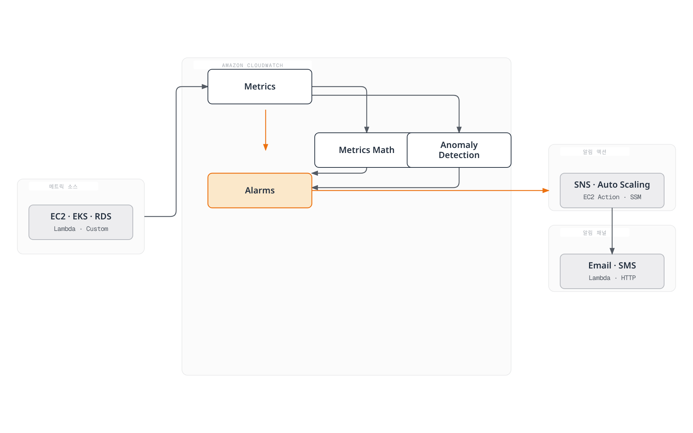
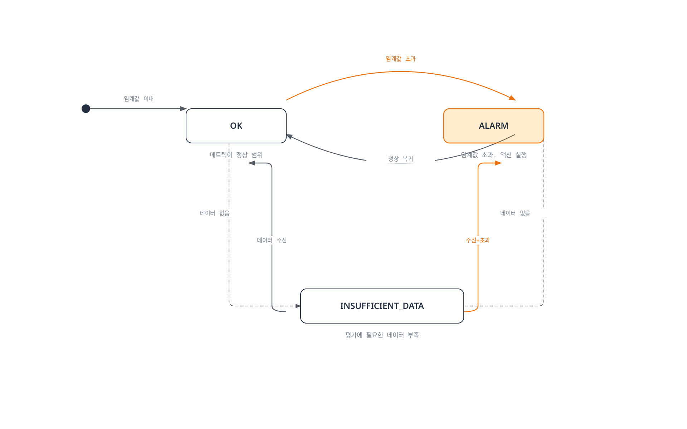
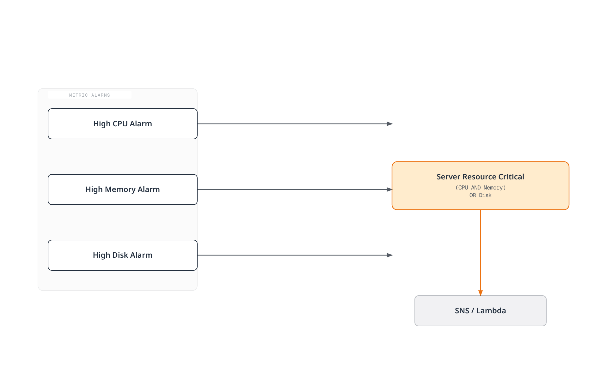
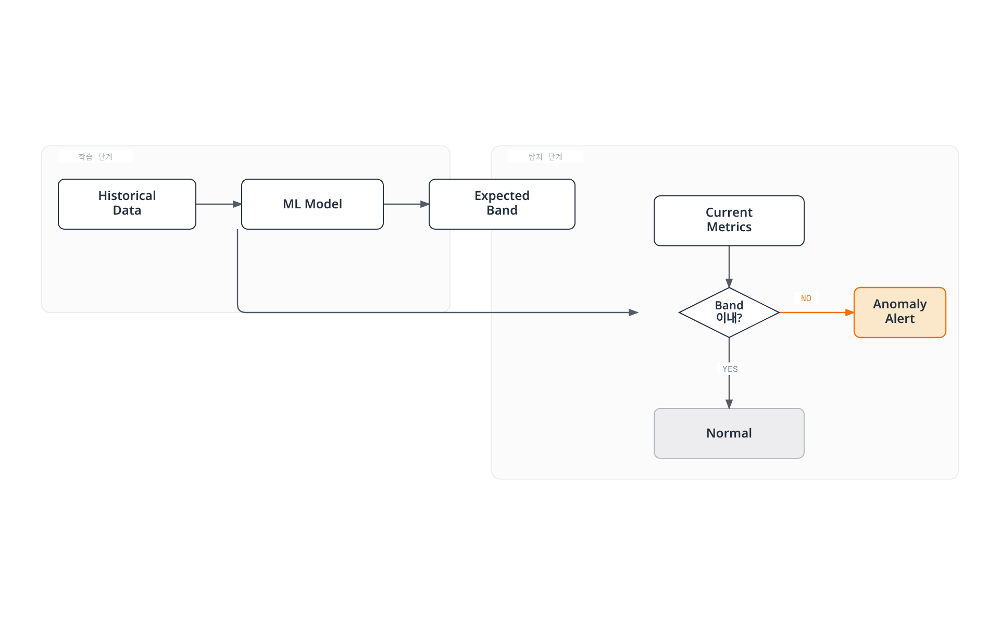
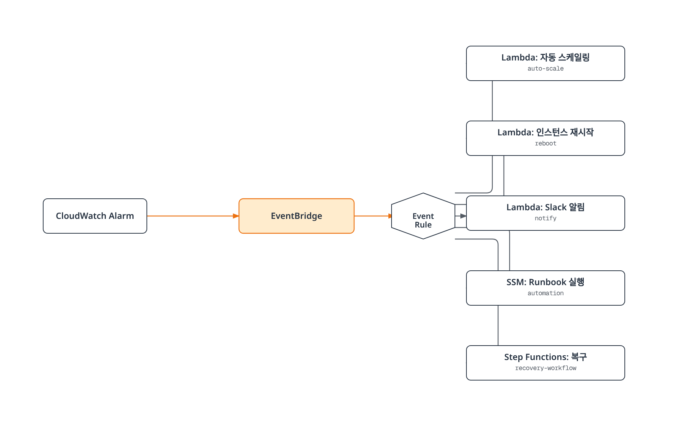
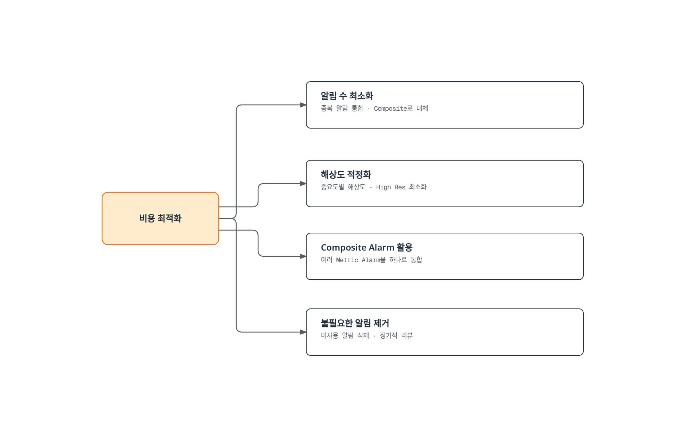

# CloudWatch Alarms

> **마지막 업데이트**: 2026년 2월 20일

## 목차

- [CloudWatch Alarms 개요](#cloudwatch-alarms-개요)
- [아키텍처](#아키텍처)
- [Metric Alarms](#metric-alarms)
- [Composite Alarms](#composite-alarms)
- [Anomaly Detection](#anomaly-detection)
- [SNS 통합](#sns-통합)
- [EventBridge 통합](#eventbridge-통합)
- [Container Insights 알림](#container-insights-알림)
- [CloudWatch Alarm Actions](#cloudwatch-alarm-actions)
- [비용 최적화](#비용-최적화)
- [Prometheus 메트릭 연동](#prometheus-메트릭-연동)
- [Terraform 예시](#terraform-예시)

---

## CloudWatch Alarms 개요

Amazon CloudWatch Alarms는 AWS 네이티브 모니터링 서비스의 알림 기능입니다. CloudWatch 메트릭을 기반으로 알림을 생성하고, SNS, Lambda, EC2 Auto Scaling 등과 통합하여 자동화된 대응이 가능합니다.

### 주요 기능

1. **Metric Alarms**: 단일 메트릭 기반 알림
2. **Composite Alarms**: 여러 알림 조건 조합
3. **Anomaly Detection**: 기계 학습 기반 이상 탐지
4. **Alarm Actions**: 알림 발생 시 자동 액션 실행
5. **AWS 서비스 통합**: EC2, ECS, EKS, Lambda 등과 네이티브 연동

### CloudWatch Alarms vs Prometheus Alertmanager

| 특성 | CloudWatch Alarms | Prometheus Alertmanager |
|------|-------------------|-------------------------|
| **유형** | AWS 관리형 서비스 | 오픈소스 |
| **데이터 소스** | CloudWatch Metrics | Prometheus Metrics |
| **쿼리 언어** | CloudWatch Metrics Math | PromQL |
| **비용** | 알림 수 기반 과금 | 무료 (인프라 비용만) |
| **복잡한 라우팅** | 제한적 | 고급 라우팅 지원 |
| **AWS 통합** | 네이티브 | 추가 설정 필요 |

---

## 아키텍처

### CloudWatch Alarms 동작 흐름



### 알림 상태

CloudWatch Alarm은 세 가지 상태를 가집니다:



---

## Metric Alarms

### 기본 알림 생성 (Console/CLI)

#### AWS CLI

```bash
# CPU 사용률 알림 생성
aws cloudwatch put-metric-alarm \
  --alarm-name "HighCPUUtilization" \
  --alarm-description "CPU usage exceeds 80%" \
  --metric-name CPUUtilization \
  --namespace AWS/EC2 \
  --statistic Average \
  --period 300 \
  --threshold 80 \
  --comparison-operator GreaterThanThreshold \
  --evaluation-periods 2 \
  --dimensions Name=InstanceId,Value=i-1234567890abcdef0 \
  --alarm-actions arn:aws:sns:ap-northeast-2:123456789012:alerts \
  --ok-actions arn:aws:sns:ap-northeast-2:123456789012:alerts \
  --treat-missing-data notBreaching
```

### 알림 구성 요소

| 파라미터 | 설명 | 예시 |
|----------|------|------|
| `metric-name` | 모니터링할 메트릭 이름 | `CPUUtilization` |
| `namespace` | 메트릭 네임스페이스 | `AWS/EC2`, `AWS/EKS` |
| `statistic` | 통계 함수 | `Average`, `Sum`, `Maximum`, `Minimum`, `p99` |
| `period` | 평가 주기 (초) | `60`, `300`, `3600` |
| `threshold` | 임계값 | `80` |
| `comparison-operator` | 비교 연산자 | `GreaterThanThreshold` |
| `evaluation-periods` | 연속 평가 횟수 | `2` (2번 연속 초과 시 알림) |
| `datapoints-to-alarm` | 알림 발생 데이터포인트 수 | `2` of `3` |
| `treat-missing-data` | 데이터 없을 때 처리 | `notBreaching`, `breaching`, `ignore`, `missing` |

### 비교 연산자

```yaml
# 사용 가능한 비교 연산자
comparison-operators:
  - GreaterThanThreshold           # 초과
  - GreaterThanOrEqualToThreshold  # 이상
  - LessThanThreshold              # 미만
  - LessThanOrEqualToThreshold     # 이하
  - LessThanLowerOrGreaterThanUpperThreshold  # 범위 벗어남
  - LessThanLowerThreshold         # 하한 미만
  - GreaterThanUpperThreshold      # 상한 초과
```

### Metrics Math를 사용한 알림

```bash
# 오류율 계산 알림 (오류 수 / 전체 요청 수)
aws cloudwatch put-metric-alarm \
  --alarm-name "HighErrorRate" \
  --alarm-description "Error rate exceeds 5%" \
  --metrics '[
    {
      "Id": "errors",
      "MetricStat": {
        "Metric": {
          "Namespace": "AWS/ApplicationELB",
          "MetricName": "HTTPCode_Target_5XX_Count",
          "Dimensions": [
            {"Name": "LoadBalancer", "Value": "app/my-alb/1234567890"}
          ]
        },
        "Period": 300,
        "Stat": "Sum"
      },
      "ReturnData": false
    },
    {
      "Id": "requests",
      "MetricStat": {
        "Metric": {
          "Namespace": "AWS/ApplicationELB",
          "MetricName": "RequestCount",
          "Dimensions": [
            {"Name": "LoadBalancer", "Value": "app/my-alb/1234567890"}
          ]
        },
        "Period": 300,
        "Stat": "Sum"
      },
      "ReturnData": false
    },
    {
      "Id": "error_rate",
      "Expression": "(errors / requests) * 100",
      "ReturnData": true
    }
  ]' \
  --threshold 5 \
  --comparison-operator GreaterThanThreshold \
  --evaluation-periods 2 \
  --alarm-actions arn:aws:sns:ap-northeast-2:123456789012:alerts
```

### Metrics Math 함수

```yaml
# 자주 사용하는 함수
math-functions:
  # 산술 연산
  - "m1 + m2"           # 합계
  - "m1 - m2"           # 차이
  - "m1 * m2"           # 곱
  - "m1 / m2"           # 나눗셈
  - "(m1 / m2) * 100"   # 백분율

  # 통계 함수
  - "AVG(METRICS())"    # 평균
  - "SUM(METRICS())"    # 합계
  - "MIN(METRICS())"    # 최솟값
  - "MAX(METRICS())"    # 최댓값

  # 조건 함수
  - "IF(m1 > 100, m1, 0)"  # 조건부

  # 시간 관련
  - "RATE(m1)"          # 변화율
  - "DIFF(m1)"          # 차이
  - "PERIOD(m1)"        # 기간

  # 검색
  - "SEARCH('{AWS/EC2,InstanceId} MetricName=\"CPUUtilization\"', 'Average', 300)"
```

---

## Composite Alarms

### Composite Alarm 개념

Composite Alarm은 여러 개의 Metric Alarm을 조합하여 복잡한 조건을 정의할 수 있습니다.



### Composite Alarm 생성

```bash
# 개별 알림 생성
aws cloudwatch put-metric-alarm \
  --alarm-name "HighCPU" \
  --metric-name CPUUtilization \
  --namespace AWS/EC2 \
  --statistic Average \
  --period 300 \
  --threshold 80 \
  --comparison-operator GreaterThanThreshold \
  --evaluation-periods 2 \
  --dimensions Name=InstanceId,Value=i-1234567890abcdef0

aws cloudwatch put-metric-alarm \
  --alarm-name "HighMemory" \
  --metric-name mem_used_percent \
  --namespace CWAgent \
  --statistic Average \
  --period 300 \
  --threshold 85 \
  --comparison-operator GreaterThanThreshold \
  --evaluation-periods 2 \
  --dimensions Name=InstanceId,Value=i-1234567890abcdef0

aws cloudwatch put-metric-alarm \
  --alarm-name "HighDisk" \
  --metric-name disk_used_percent \
  --namespace CWAgent \
  --statistic Average \
  --period 300 \
  --threshold 90 \
  --comparison-operator GreaterThanThreshold \
  --evaluation-periods 2 \
  --dimensions Name=InstanceId,Value=i-1234567890abcdef0

# Composite Alarm 생성
aws cloudwatch put-composite-alarm \
  --alarm-name "ServerResourceCritical" \
  --alarm-description "Server resources are critical" \
  --alarm-rule "ALARM(HighCPU) AND ALARM(HighMemory) OR ALARM(HighDisk)" \
  --alarm-actions arn:aws:sns:ap-northeast-2:123456789012:critical-alerts \
  --ok-actions arn:aws:sns:ap-northeast-2:123456789012:alerts
```

### 알림 규칙 문법

```yaml
# Composite Alarm 규칙 문법
rule-syntax:
  # 기본 연산자
  - "ALARM(alarm-name)"      # 알림 상태 확인
  - "OK(alarm-name)"         # OK 상태 확인
  - "INSUFFICIENT_DATA(alarm-name)"  # 데이터 부족 상태

  # 논리 연산자
  - "AND"                    # 모든 조건 충족
  - "OR"                     # 하나 이상 충족
  - "NOT"                    # 부정
  - "()"                     # 그룹화

examples:
  # 모든 조건 충족
  - "ALARM(A1) AND ALARM(A2) AND ALARM(A3)"

  # 하나 이상 충족
  - "ALARM(A1) OR ALARM(A2)"

  # 복합 조건
  - "(ALARM(A1) AND ALARM(A2)) OR ALARM(A3)"

  # 부정
  - "ALARM(A1) AND NOT ALARM(A2)"

  # M of N 패턴 (3개 중 2개 이상)
  - "(ALARM(A1) AND ALARM(A2)) OR (ALARM(A1) AND ALARM(A3)) OR (ALARM(A2) AND ALARM(A3))"
```

### 알림 억제 패턴

```bash
# 유지보수 중 알림 억제
aws cloudwatch put-composite-alarm \
  --alarm-name "ProductionAlerts" \
  --alarm-rule "ALARM(HighCPU) AND NOT ALARM(MaintenanceMode)" \
  --alarm-actions arn:aws:sns:ap-northeast-2:123456789012:alerts

# MaintenanceMode 알림을 수동으로 ALARM 상태로 전환하여 억제
aws cloudwatch set-alarm-state \
  --alarm-name "MaintenanceMode" \
  --state-value ALARM \
  --state-reason "Scheduled maintenance"
```

---

## Anomaly Detection

### Anomaly Detection 개요

CloudWatch Anomaly Detection은 기계 학습을 사용하여 메트릭의 정상 패턴을 학습하고, 이상치를 탐지합니다.



### Anomaly Detection 알림 생성

```bash
# Anomaly Detection 모델 생성 (자동)
# 첫 알림 생성 시 모델이 자동으로 생성됨

aws cloudwatch put-metric-alarm \
  --alarm-name "CPUAnomalyDetection" \
  --alarm-description "CPU usage is anomalous" \
  --metrics '[
    {
      "Id": "m1",
      "MetricStat": {
        "Metric": {
          "Namespace": "AWS/EC2",
          "MetricName": "CPUUtilization",
          "Dimensions": [
            {"Name": "InstanceId", "Value": "i-1234567890abcdef0"}
          ]
        },
        "Period": 300,
        "Stat": "Average"
      },
      "ReturnData": true
    },
    {
      "Id": "ad1",
      "Expression": "ANOMALY_DETECTION_BAND(m1, 2)",
      "ReturnData": true
    }
  ]' \
  --threshold-metric-id ad1 \
  --comparison-operator LessThanLowerOrGreaterThanUpperThreshold \
  --evaluation-periods 2 \
  --alarm-actions arn:aws:sns:ap-northeast-2:123456789012:alerts
```

### Anomaly Detection 설정

```yaml
# ANOMALY_DETECTION_BAND 함수
# ANOMALY_DETECTION_BAND(metric, stddev)
# - metric: 분석할 메트릭
# - stddev: 표준편차 배수 (기본값 2)

examples:
  # 2 표준편차 (약 95% 신뢰구간)
  - "ANOMALY_DETECTION_BAND(m1, 2)"

  # 3 표준편차 (약 99.7% 신뢰구간)
  - "ANOMALY_DETECTION_BAND(m1, 3)"

  # 더 민감한 탐지 (1 표준편차)
  - "ANOMALY_DETECTION_BAND(m1, 1)"
```

### 모델 학습 기간 조정

```bash
# 기존 모델에 제외 기간 추가 (유지보수, 장애 기간 등)
aws cloudwatch put-anomaly-detector \
  --namespace AWS/EC2 \
  --metric-name CPUUtilization \
  --stat Average \
  --dimensions Name=InstanceId,Value=i-1234567890abcdef0 \
  --configuration '{
    "ExcludedTimeRanges": [
      {
        "StartTime": "2025-02-15T00:00:00Z",
        "EndTime": "2025-02-15T06:00:00Z"
      }
    ]
  }'
```

---

## SNS 통합

### SNS Topic 생성

```bash
# SNS Topic 생성
aws sns create-topic --name eks-alerts

# Email 구독 추가
aws sns subscribe \
  --topic-arn arn:aws:sns:ap-northeast-2:123456789012:eks-alerts \
  --protocol email \
  --notification-endpoint team@example.com

# SMS 구독 추가
aws sns subscribe \
  --topic-arn arn:aws:sns:ap-northeast-2:123456789012:eks-alerts \
  --protocol sms \
  --notification-endpoint +821012345678

# Lambda 구독 추가
aws sns subscribe \
  --topic-arn arn:aws:sns:ap-northeast-2:123456789012:eks-alerts \
  --protocol lambda \
  --notification-endpoint arn:aws:lambda:ap-northeast-2:123456789012:function:alert-handler
```

### SNS 메시지 필터링

```json
// 구독 필터 정책
{
  "severity": ["critical", "high"],
  "environment": ["production"]
}
```

```bash
# 필터 정책 적용
aws sns set-subscription-attributes \
  --subscription-arn arn:aws:sns:ap-northeast-2:123456789012:eks-alerts:xxx \
  --attribute-name FilterPolicy \
  --attribute-value '{"severity": ["critical", "high"]}'
```

### SNS to Slack 통합 (Lambda)

```python
# lambda_function.py
import json
import urllib3
import os

http = urllib3.PoolManager()

def lambda_handler(event, context):
    slack_webhook_url = os.environ['SLACK_WEBHOOK_URL']

    for record in event['Records']:
        sns_message = json.loads(record['Sns']['Message'])

        # CloudWatch Alarm 메시지 파싱
        alarm_name = sns_message.get('AlarmName', 'Unknown')
        alarm_description = sns_message.get('AlarmDescription', '')
        new_state = sns_message.get('NewStateValue', 'Unknown')
        reason = sns_message.get('NewStateReason', '')
        timestamp = sns_message.get('StateChangeTime', '')

        # Slack 메시지 색상
        if new_state == 'ALARM':
            color = '#ff0000'
            emoji = ':rotating_light:'
        elif new_state == 'OK':
            color = '#36a64f'
            emoji = ':white_check_mark:'
        else:
            color = '#808080'
            emoji = ':question:'

        # Slack 메시지 구성
        slack_message = {
            "attachments": [
                {
                    "color": color,
                    "title": f"{emoji} {alarm_name}",
                    "text": alarm_description,
                    "fields": [
                        {
                            "title": "State",
                            "value": new_state,
                            "short": True
                        },
                        {
                            "title": "Time",
                            "value": timestamp,
                            "short": True
                        },
                        {
                            "title": "Reason",
                            "value": reason,
                            "short": False
                        }
                    ]
                }
            ]
        }

        # Slack으로 전송
        response = http.request(
            'POST',
            slack_webhook_url,
            body=json.dumps(slack_message),
            headers={'Content-Type': 'application/json'}
        )

    return {'statusCode': 200}
```

---

## EventBridge 통합

### EventBridge 규칙 생성

```bash
# CloudWatch Alarm 상태 변경을 EventBridge로 라우팅
aws events put-rule \
  --name "CloudWatchAlarmStateChange" \
  --event-pattern '{
    "source": ["aws.cloudwatch"],
    "detail-type": ["CloudWatch Alarm State Change"],
    "detail": {
      "state": {
        "value": ["ALARM"]
      }
    }
  }'

# Lambda 타겟 추가
aws events put-targets \
  --rule "CloudWatchAlarmStateChange" \
  --targets '[
    {
      "Id": "AlertHandler",
      "Arn": "arn:aws:lambda:ap-northeast-2:123456789012:function:alert-handler"
    }
  ]'
```

### 자동 대응 구성



### EventBridge 이벤트 패턴

```json
{
  "source": ["aws.cloudwatch"],
  "detail-type": ["CloudWatch Alarm State Change"],
  "detail": {
    "alarmName": [{
      "prefix": "EKS-"
    }],
    "state": {
      "value": ["ALARM"]
    },
    "previousState": {
      "value": ["OK"]
    },
    "configuration": {
      "metrics": [{
        "metricStat": {
          "metric": {
            "namespace": ["AWS/EKS", "ContainerInsights"]
          }
        }
      }]
    }
  }
}
```

### 자동 복구 Lambda 예시

```python
# auto_recovery.py
import boto3
import json

ec2 = boto3.client('ec2')
ecs = boto3.client('ecs')

def lambda_handler(event, context):
    alarm_name = event['detail']['alarmName']
    alarm_state = event['detail']['state']['value']

    print(f"Alarm: {alarm_name}, State: {alarm_state}")

    # 알림 이름에 따른 자동 대응
    if 'EC2-HighCPU' in alarm_name:
        # EC2 인스턴스 식별
        dimensions = event['detail']['configuration']['metrics'][0]['metricStat']['metric']['dimensions']
        instance_id = next(d['value'] for d in dimensions if d['name'] == 'InstanceId')

        # 인스턴스 재시작
        ec2.reboot_instances(InstanceIds=[instance_id])
        return {'action': 'reboot', 'instance': instance_id}

    elif 'ECS-ServiceUnhealthy' in alarm_name:
        # ECS 서비스 재시작
        dimensions = event['detail']['configuration']['metrics'][0]['metricStat']['metric']['dimensions']
        cluster = next(d['value'] for d in dimensions if d['name'] == 'ClusterName')
        service = next(d['value'] for d in dimensions if d['name'] == 'ServiceName')

        ecs.update_service(
            cluster=cluster,
            service=service,
            forceNewDeployment=True
        )
        return {'action': 'redeploy', 'service': service}

    return {'action': 'none'}
```

---

## Container Insights 알림

### EKS Container Insights 메트릭

Container Insights를 활성화하면 EKS 클러스터의 메트릭을 CloudWatch에서 확인할 수 있습니다.

```bash
# Container Insights 활성화
aws eks update-addon \
  --cluster-name my-cluster \
  --addon-name amazon-cloudwatch-observability \
  --addon-version v1.2.0-eksbuild.1

# 또는 CloudWatch Agent 설치
kubectl apply -f https://raw.githubusercontent.com/aws-samples/amazon-cloudwatch-container-insights/latest/k8s-deployment-manifest-templates/deployment-mode/daemonset/container-insights-monitoring/quickstart/cwagent-fluentd-quickstart.yaml
```

### Container Insights 알림 예시

```bash
# 노드 CPU 사용률 알림
aws cloudwatch put-metric-alarm \
  --alarm-name "EKS-Node-HighCPU" \
  --metric-name node_cpu_utilization \
  --namespace ContainerInsights \
  --dimensions Name=ClusterName,Value=my-cluster \
  --statistic Average \
  --period 300 \
  --threshold 80 \
  --comparison-operator GreaterThanThreshold \
  --evaluation-periods 2 \
  --alarm-actions arn:aws:sns:ap-northeast-2:123456789012:eks-alerts

# 파드 메모리 사용률 알림
aws cloudwatch put-metric-alarm \
  --alarm-name "EKS-Pod-HighMemory" \
  --metric-name pod_memory_utilization \
  --namespace ContainerInsights \
  --dimensions Name=ClusterName,Value=my-cluster Name=Namespace,Value=production \
  --statistic Average \
  --period 300 \
  --threshold 85 \
  --comparison-operator GreaterThanThreshold \
  --evaluation-periods 2 \
  --alarm-actions arn:aws:sns:ap-northeast-2:123456789012:eks-alerts

# 파드 재시작 알림
aws cloudwatch put-metric-alarm \
  --alarm-name "EKS-Pod-Restarts" \
  --metric-name pod_number_of_container_restarts \
  --namespace ContainerInsights \
  --dimensions Name=ClusterName,Value=my-cluster Name=Namespace,Value=production \
  --statistic Sum \
  --period 300 \
  --threshold 3 \
  --comparison-operator GreaterThanThreshold \
  --evaluation-periods 1 \
  --alarm-actions arn:aws:sns:ap-northeast-2:123456789012:eks-alerts
```

### Container Insights 주요 메트릭

| 메트릭 | 설명 | 차원 |
|--------|------|------|
| `cluster_node_count` | 클러스터 노드 수 | ClusterName |
| `cluster_failed_node_count` | 실패한 노드 수 | ClusterName |
| `node_cpu_utilization` | 노드 CPU 사용률 | ClusterName, NodeName |
| `node_memory_utilization` | 노드 메모리 사용률 | ClusterName, NodeName |
| `node_filesystem_utilization` | 노드 디스크 사용률 | ClusterName, NodeName |
| `pod_cpu_utilization` | 파드 CPU 사용률 | ClusterName, Namespace, PodName |
| `pod_memory_utilization` | 파드 메모리 사용률 | ClusterName, Namespace, PodName |
| `pod_number_of_container_restarts` | 컨테이너 재시작 횟수 | ClusterName, Namespace, PodName |
| `service_number_of_running_pods` | 서비스별 실행 중인 파드 수 | ClusterName, Namespace, Service |

---

## CloudWatch Alarm Actions

### EC2 Actions

```bash
# EC2 인스턴스 복구 (시스템 상태 검사 실패 시)
aws cloudwatch put-metric-alarm \
  --alarm-name "EC2-SystemCheckFailed" \
  --metric-name StatusCheckFailed_System \
  --namespace AWS/EC2 \
  --dimensions Name=InstanceId,Value=i-1234567890abcdef0 \
  --statistic Maximum \
  --period 60 \
  --threshold 1 \
  --comparison-operator GreaterThanOrEqualToThreshold \
  --evaluation-periods 2 \
  --alarm-actions arn:aws:automate:ap-northeast-2:ec2:recover

# EC2 인스턴스 중지
aws cloudwatch put-metric-alarm \
  --alarm-name "EC2-LowUtilization-Stop" \
  --metric-name CPUUtilization \
  --namespace AWS/EC2 \
  --dimensions Name=InstanceId,Value=i-1234567890abcdef0 \
  --statistic Average \
  --period 3600 \
  --threshold 5 \
  --comparison-operator LessThanThreshold \
  --evaluation-periods 24 \
  --alarm-actions arn:aws:automate:ap-northeast-2:ec2:stop
```

### Auto Scaling Actions

```bash
# Auto Scaling 정책 연결
aws cloudwatch put-metric-alarm \
  --alarm-name "ASG-ScaleOut" \
  --metric-name CPUUtilization \
  --namespace AWS/EC2 \
  --dimensions Name=AutoScalingGroupName,Value=my-asg \
  --statistic Average \
  --period 300 \
  --threshold 70 \
  --comparison-operator GreaterThanThreshold \
  --evaluation-periods 2 \
  --alarm-actions arn:aws:autoscaling:ap-northeast-2:123456789012:scalingPolicy:xxx:autoScalingGroupName/my-asg:policyName/scale-out

aws cloudwatch put-metric-alarm \
  --alarm-name "ASG-ScaleIn" \
  --metric-name CPUUtilization \
  --namespace AWS/EC2 \
  --dimensions Name=AutoScalingGroupName,Value=my-asg \
  --statistic Average \
  --period 300 \
  --threshold 30 \
  --comparison-operator LessThanThreshold \
  --evaluation-periods 3 \
  --alarm-actions arn:aws:autoscaling:ap-northeast-2:123456789012:scalingPolicy:xxx:autoScalingGroupName/my-asg:policyName/scale-in
```

### Systems Manager Actions

```bash
# SSM Automation 실행
aws cloudwatch put-metric-alarm \
  --alarm-name "DiskFull-Cleanup" \
  --metric-name disk_used_percent \
  --namespace CWAgent \
  --dimensions Name=InstanceId,Value=i-1234567890abcdef0 Name=path,Value=/ \
  --statistic Average \
  --period 300 \
  --threshold 90 \
  --comparison-operator GreaterThanThreshold \
  --evaluation-periods 1 \
  --alarm-actions arn:aws:ssm:ap-northeast-2:123456789012:automation-definition/CleanupDisk:$DEFAULT
```

---

## 비용 최적화

### 비용 요소

| 항목 | 비용 |
|------|------|
| Standard Resolution 알림 (60초) | 월 $0.10/알림 |
| High Resolution 알림 (10초) | 월 $0.30/알림 |
| Anomaly Detection | 월 $0.30/메트릭 |
| Composite Alarm | 월 $0.50/알림 |

### 비용 최적화 전략



### 권장 설정

```yaml
# 비용 효율적인 알림 설정

# Critical: High Resolution (빠른 감지 필요)
critical-alerts:
  period: 60  # 1분
  evaluation-periods: 2

# Warning: Standard Resolution
warning-alerts:
  period: 300  # 5분
  evaluation-periods: 2

# Info: Standard Resolution (느슨한 감지)
info-alerts:
  period: 900  # 15분
  evaluation-periods: 3
```

### 알림 정리 스크립트

```bash
#!/bin/bash
# 오래된 알림 식별 및 정리

# 90일 이상 INSUFFICIENT_DATA 상태인 알림 목록
aws cloudwatch describe-alarms \
  --state-value INSUFFICIENT_DATA \
  --query 'MetricAlarms[?StateUpdatedTimestamp<=`2024-11-01`].AlarmName' \
  --output text

# 알림 삭제
aws cloudwatch delete-alarms \
  --alarm-names "old-alarm-1" "old-alarm-2"
```

---

## Prometheus 메트릭 연동

### Amazon Managed Prometheus (AMP) 연동

AMP의 메트릭을 CloudWatch에서 알림으로 사용할 수 있습니다.

```bash
# AMP 워크스페이스 메트릭을 CloudWatch로 전송
# (Lambda를 통한 주기적 쿼리)

# Lambda 함수 예시
```

```python
# amp_to_cloudwatch.py
import boto3
import requests
from aws_requests_auth.aws_auth import AWSRequestsAuth

def lambda_handler(event, context):
    # AMP 워크스페이스 설정
    amp_endpoint = "https://aps-workspaces.ap-northeast-2.amazonaws.com/workspaces/ws-xxx/api/v1/query"
    region = "ap-northeast-2"

    # AWS 인증
    auth = AWSRequestsAuth(
        aws_access_key=boto3.Session().get_credentials().access_key,
        aws_secret_access_key=boto3.Session().get_credentials().secret_key,
        aws_token=boto3.Session().get_credentials().token,
        aws_host=f"aps-workspaces.{region}.amazonaws.com",
        aws_region=region,
        aws_service="aps"
    )

    # Prometheus 쿼리 실행
    queries = [
        ("eks_node_cpu_usage", 'avg(rate(node_cpu_seconds_total{mode!="idle"}[5m])) * 100'),
        ("eks_pod_memory_usage", 'avg(container_memory_working_set_bytes) / avg(container_spec_memory_limit_bytes) * 100'),
    ]

    cloudwatch = boto3.client('cloudwatch')

    for metric_name, query in queries:
        response = requests.get(
            amp_endpoint,
            params={"query": query},
            auth=auth
        )

        result = response.json()
        if result['data']['result']:
            value = float(result['data']['result'][0]['value'][1])

            # CloudWatch에 메트릭 전송
            cloudwatch.put_metric_data(
                Namespace='AMP/EKS',
                MetricData=[{
                    'MetricName': metric_name,
                    'Value': value,
                    'Unit': 'Percent'
                }]
            )

    return {'status': 'success'}
```

---

## Terraform 예시

### 기본 알림

```hcl
# SNS Topic
resource "aws_sns_topic" "alerts" {
  name = "eks-alerts"
}

resource "aws_sns_topic_subscription" "email" {
  topic_arn = aws_sns_topic.alerts.arn
  protocol  = "email"
  endpoint  = "team@example.com"
}

# EC2 CPU 알림
resource "aws_cloudwatch_metric_alarm" "ec2_cpu" {
  alarm_name          = "ec2-high-cpu"
  comparison_operator = "GreaterThanThreshold"
  evaluation_periods  = 2
  metric_name         = "CPUUtilization"
  namespace           = "AWS/EC2"
  period              = 300
  statistic           = "Average"
  threshold           = 80
  alarm_description   = "EC2 CPU usage exceeds 80%"

  dimensions = {
    InstanceId = "i-1234567890abcdef0"
  }

  alarm_actions = [aws_sns_topic.alerts.arn]
  ok_actions    = [aws_sns_topic.alerts.arn]

  treat_missing_data = "notBreaching"
}
```

### Metrics Math 알림

```hcl
resource "aws_cloudwatch_metric_alarm" "alb_error_rate" {
  alarm_name          = "alb-high-error-rate"
  comparison_operator = "GreaterThanThreshold"
  evaluation_periods  = 2
  threshold           = 5
  alarm_description   = "ALB error rate exceeds 5%"

  metric_query {
    id          = "errors"
    return_data = false

    metric {
      metric_name = "HTTPCode_Target_5XX_Count"
      namespace   = "AWS/ApplicationELB"
      period      = 300
      stat        = "Sum"

      dimensions = {
        LoadBalancer = "app/my-alb/1234567890"
      }
    }
  }

  metric_query {
    id          = "requests"
    return_data = false

    metric {
      metric_name = "RequestCount"
      namespace   = "AWS/ApplicationELB"
      period      = 300
      stat        = "Sum"

      dimensions = {
        LoadBalancer = "app/my-alb/1234567890"
      }
    }
  }

  metric_query {
    id          = "error_rate"
    expression  = "(errors / requests) * 100"
    label       = "Error Rate"
    return_data = true
  }

  alarm_actions = [aws_sns_topic.alerts.arn]
}
```

### Composite Alarm

```hcl
# 개별 알림
resource "aws_cloudwatch_metric_alarm" "cpu_alarm" {
  alarm_name          = "high-cpu"
  comparison_operator = "GreaterThanThreshold"
  evaluation_periods  = 2
  metric_name         = "CPUUtilization"
  namespace           = "AWS/EC2"
  period              = 300
  statistic           = "Average"
  threshold           = 80

  dimensions = {
    InstanceId = "i-1234567890abcdef0"
  }
}

resource "aws_cloudwatch_metric_alarm" "memory_alarm" {
  alarm_name          = "high-memory"
  comparison_operator = "GreaterThanThreshold"
  evaluation_periods  = 2
  metric_name         = "mem_used_percent"
  namespace           = "CWAgent"
  period              = 300
  statistic           = "Average"
  threshold           = 85

  dimensions = {
    InstanceId = "i-1234567890abcdef0"
  }
}

# Composite Alarm
resource "aws_cloudwatch_composite_alarm" "server_critical" {
  alarm_name        = "server-critical"
  alarm_description = "Server CPU and Memory are both high"

  alarm_rule = "ALARM(${aws_cloudwatch_metric_alarm.cpu_alarm.alarm_name}) AND ALARM(${aws_cloudwatch_metric_alarm.memory_alarm.alarm_name})"

  alarm_actions = [aws_sns_topic.alerts.arn]
  ok_actions    = [aws_sns_topic.alerts.arn]
}
```

### EKS Container Insights 알림

```hcl
resource "aws_cloudwatch_metric_alarm" "eks_node_cpu" {
  alarm_name          = "eks-node-high-cpu"
  comparison_operator = "GreaterThanThreshold"
  evaluation_periods  = 2
  metric_name         = "node_cpu_utilization"
  namespace           = "ContainerInsights"
  period              = 300
  statistic           = "Average"
  threshold           = 80
  alarm_description   = "EKS Node CPU usage exceeds 80%"

  dimensions = {
    ClusterName = "my-eks-cluster"
  }

  alarm_actions = [aws_sns_topic.alerts.arn]
}

resource "aws_cloudwatch_metric_alarm" "eks_pod_restarts" {
  alarm_name          = "eks-pod-restarts"
  comparison_operator = "GreaterThanThreshold"
  evaluation_periods  = 1
  metric_name         = "pod_number_of_container_restarts"
  namespace           = "ContainerInsights"
  period              = 300
  statistic           = "Sum"
  threshold           = 3
  alarm_description   = "EKS Pod has restarted more than 3 times"

  dimensions = {
    ClusterName = "my-eks-cluster"
    Namespace   = "production"
  }

  alarm_actions = [aws_sns_topic.alerts.arn]
}
```

### Anomaly Detection 알림

```hcl
resource "aws_cloudwatch_metric_alarm" "cpu_anomaly" {
  alarm_name          = "cpu-anomaly-detection"
  comparison_operator = "LessThanLowerOrGreaterThanUpperThreshold"
  evaluation_periods  = 2
  threshold_metric_id = "ad1"
  alarm_description   = "CPU usage is anomalous"

  metric_query {
    id          = "m1"
    return_data = true

    metric {
      metric_name = "CPUUtilization"
      namespace   = "AWS/EC2"
      period      = 300
      stat        = "Average"

      dimensions = {
        InstanceId = "i-1234567890abcdef0"
      }
    }
  }

  metric_query {
    id          = "ad1"
    expression  = "ANOMALY_DETECTION_BAND(m1, 2)"
    label       = "CPUUtilization (Expected)"
    return_data = true
  }

  alarm_actions = [aws_sns_topic.alerts.arn]
}
```

---

## 퀴즈

이 장에서 배운 내용을 테스트하려면 [CloudWatch Alarms 퀴즈](../../quizzes/observability/alerting/02-cloudwatch-alarms-quiz.md)를 풀어보세요.
