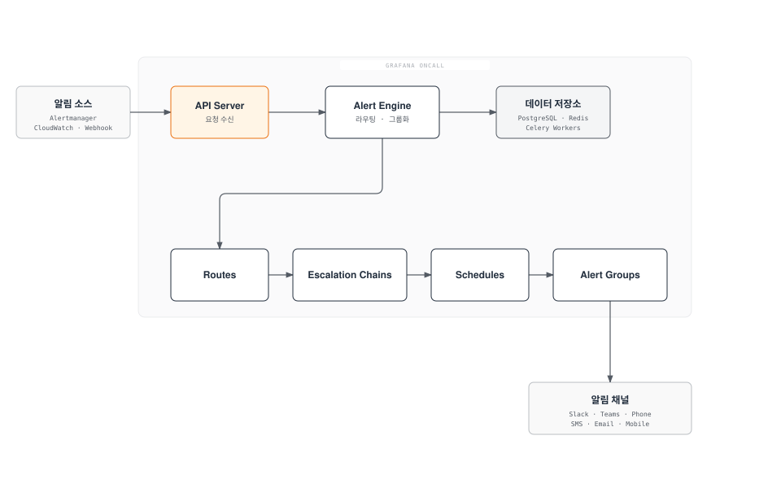
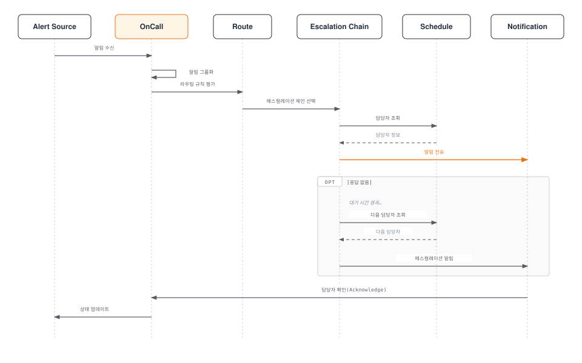
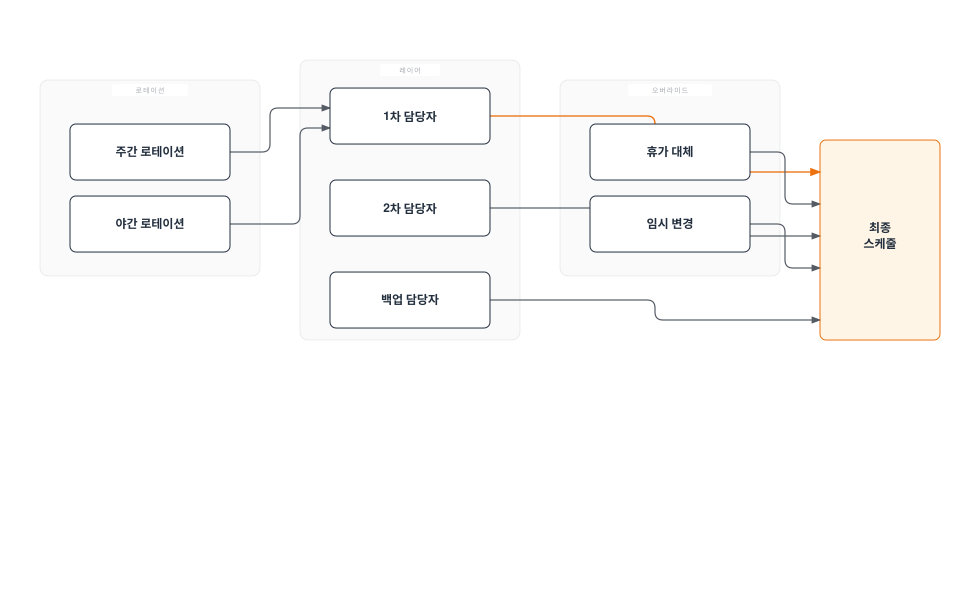
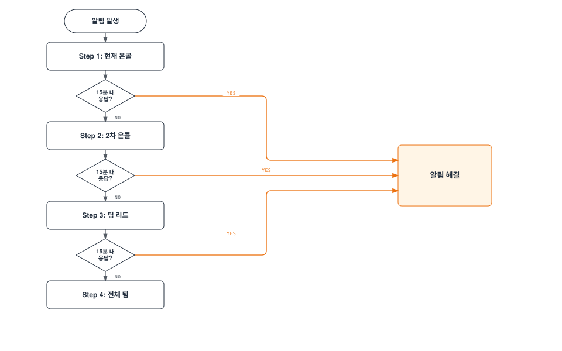
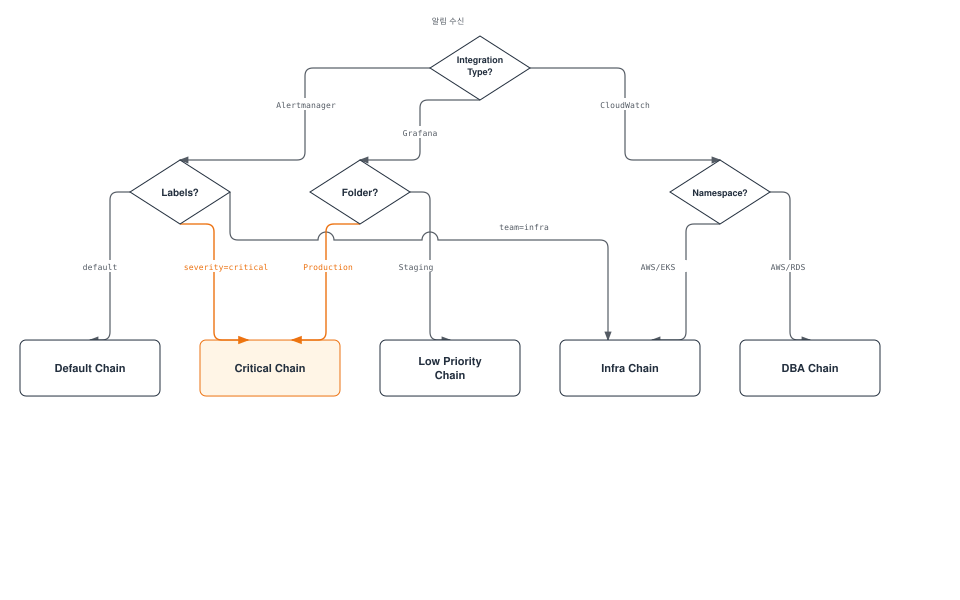
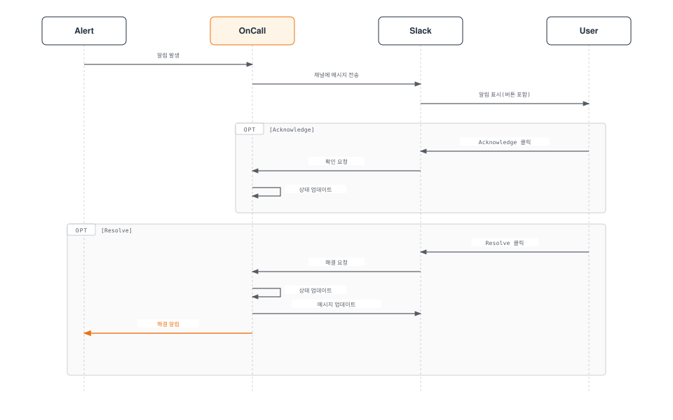
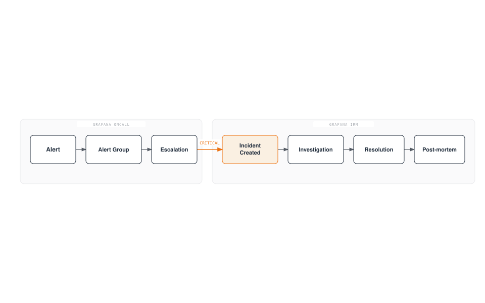
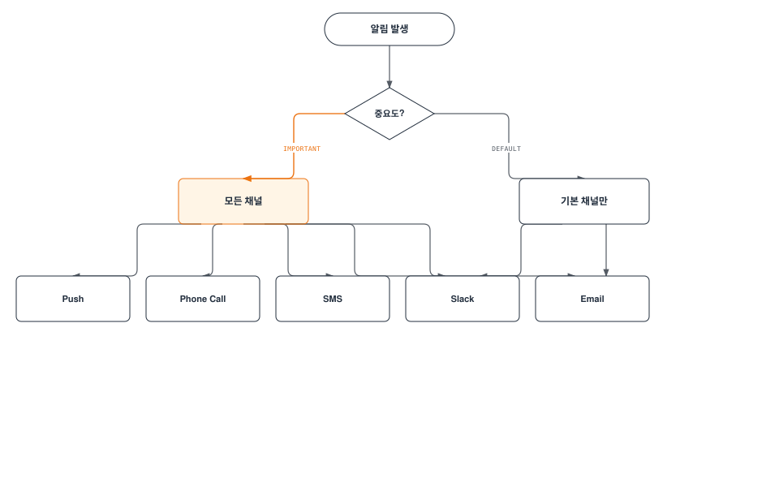
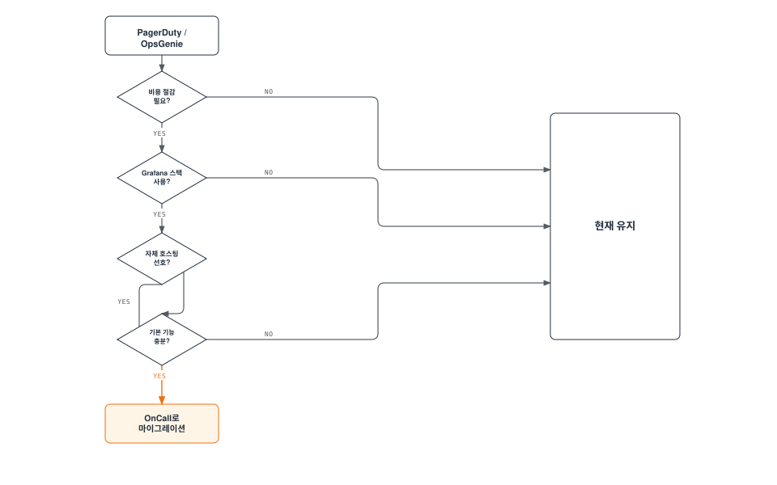

# Grafana OnCall

> **마지막 업데이트**: 2026년 2월 20일

## 목차

- [Grafana OnCall 개요](#grafana-oncall-개요)
- [아키텍처](#아키텍처)
- [설치](#설치)
- [통합 설정](#통합-설정)
- [온콜 스케줄 구성](#온콜-스케줄-구성)
- [에스컬레이션 체인](#에스컬레이션-체인)
- [알림 그룹화 및 라우팅](#알림-그룹화-및-라우팅)
- [ChatOps 통합](#chatops-통합)
- [Grafana IRM 연동](#grafana-irm-연동)
- [모바일 앱](#모바일-앱)
- [PagerDuty/OpsGenie 비교](#pagerdutyopsgenie-비교)
- [모범 사례](#모범-사례)

---

## Grafana OnCall 개요

Grafana OnCall은 오픈소스 온콜 관리 도구로, 알림 라우팅, 온콜 스케줄 관리, 에스컬레이션 정책을 제공합니다. Grafana Cloud에서 SaaS로 제공되거나, 자체 호스팅으로 운영할 수 있습니다.

### 주요 기능

1. **온콜 스케줄 관리**: 로테이션, 오버라이드, 휴일 관리
2. **에스컬레이션 체인**: 시간 기반 자동 에스컬레이션
3. **알림 그룹화**: 관련 알림 통합
4. **다양한 통합**: Alertmanager, Grafana, CloudWatch, Webhook
5. **ChatOps**: Slack, MS Teams, Telegram 연동
6. **모바일 앱**: iOS/Android 푸시 알림

### Grafana OnCall vs PagerDuty vs OpsGenie

| 기능 | Grafana OnCall | PagerDuty | OpsGenie |
|------|----------------|-----------|----------|
| **유형** | 오픈소스/SaaS | SaaS | SaaS |
| **비용** | 무료(OSS)/유료(Cloud) | 유료 | 유료 |
| **자체 호스팅** | 가능 | 불가 | 불가 |
| **Grafana 통합** | 네이티브 | 플러그인 | 플러그인 |
| **온콜 스케줄** | 있음 | 고급 | 고급 |
| **에스컬레이션** | 있음 | 고급 | 고급 |
| **분석/보고** | 기본 | 고급 | 고급 |
| **엔터프라이즈 지원** | 유료 | 포함 | 포함 |

---

## 아키텍처

### Grafana OnCall 구성 요소



### 알림 처리 흐름



---

## 설치

### Helm을 통한 설치 (EKS)

```bash
# Helm 저장소 추가
helm repo add grafana https://grafana.github.io/helm-charts
helm repo update

# 네임스페이스 생성
kubectl create namespace oncall

# values.yaml 생성 후 설치
helm install oncall grafana/oncall \
  --namespace oncall \
  -f oncall-values.yaml
```

### values.yaml 기본 설정

```yaml
# oncall-values.yaml
base_url: oncall.example.com

# 데이터베이스 설정
database:
  type: postgresql

postgresql:
  enabled: true
  auth:
    database: oncall
    username: oncall
    password: "secure-password"
  primary:
    persistence:
      enabled: true
      size: 10Gi

# Redis 설정
redis:
  enabled: true
  architecture: standalone
  auth:
    enabled: true
    password: "redis-password"

# Celery 워커
celery:
  replicaCount: 2
  resources:
    requests:
      memory: 256Mi
      cpu: 100m
    limits:
      memory: 512Mi
      cpu: 500m

# API 서버
oncall:
  replicaCount: 2
  resources:
    requests:
      memory: 512Mi
      cpu: 200m
    limits:
      memory: 1Gi
      cpu: 1000m

# Ingress 설정
ingress:
  enabled: true
  className: alb
  annotations:
    alb.ingress.kubernetes.io/scheme: internet-facing
    alb.ingress.kubernetes.io/target-type: ip
    alb.ingress.kubernetes.io/certificate-arn: arn:aws:acm:ap-northeast-2:xxx:certificate/xxx
    alb.ingress.kubernetes.io/listen-ports: '[{"HTTPS":443}]'
  hosts:
    - host: oncall.example.com
      paths:
        - path: /
          pathType: Prefix

# Grafana 통합
grafana:
  enabled: false  # 기존 Grafana 사용 시

# 환경 변수
env:
  - name: SECRET_KEY
    valueFrom:
      secretKeyRef:
        name: oncall-secrets
        key: secret-key
  - name: DJANGO_SETTINGS_MODULE
    value: settings.hobby
```

### 프로덕션 values.yaml

```yaml
# oncall-production-values.yaml
base_url: oncall.example.com

# 외부 PostgreSQL (RDS)
database:
  type: postgresql

externalPostgresql:
  host: oncall-db.xxx.ap-northeast-2.rds.amazonaws.com
  port: 5432
  db: oncall
  user: oncall
  password:
    secretName: oncall-db-secret
    secretKey: password

postgresql:
  enabled: false

# 외부 Redis (ElastiCache)
externalRedis:
  host: oncall-redis.xxx.cache.amazonaws.com
  port: 6379
  password:
    secretName: oncall-redis-secret
    secretKey: password

redis:
  enabled: false

# Celery 워커 (HA)
celery:
  replicaCount: 3
  resources:
    requests:
      memory: 512Mi
      cpu: 250m
    limits:
      memory: 1Gi
      cpu: 1000m
  affinity:
    podAntiAffinity:
      preferredDuringSchedulingIgnoredDuringExecution:
        - weight: 100
          podAffinityTerm:
            labelSelector:
              matchLabels:
                app.kubernetes.io/component: celery
            topologyKey: kubernetes.io/hostname

# API 서버 (HA)
oncall:
  replicaCount: 3
  resources:
    requests:
      memory: 1Gi
      cpu: 500m
    limits:
      memory: 2Gi
      cpu: 2000m
  affinity:
    podAntiAffinity:
      preferredDuringSchedulingIgnoredDuringExecution:
        - weight: 100
          podAffinityTerm:
            labelSelector:
              matchLabels:
                app.kubernetes.io/component: oncall
            topologyKey: kubernetes.io/hostname

# Telegram/Twilio 설정 (전화/SMS용)
telegramPolling:
  enabled: true

twilio:
  enabled: true
  accountSid:
    secretName: twilio-secret
    secretKey: account-sid
  authToken:
    secretName: twilio-secret
    secretKey: auth-token
  phoneNumber:
    secretName: twilio-secret
    secretKey: phone-number
```

### Secret 생성

```bash
# OnCall 시크릿
kubectl create secret generic oncall-secrets \
  --namespace oncall \
  --from-literal=secret-key=$(openssl rand -base64 32)

# 데이터베이스 시크릿
kubectl create secret generic oncall-db-secret \
  --namespace oncall \
  --from-literal=password='db-password'

# Redis 시크릿
kubectl create secret generic oncall-redis-secret \
  --namespace oncall \
  --from-literal=password='redis-password'

# Twilio 시크릿 (전화/SMS용)
kubectl create secret generic twilio-secret \
  --namespace oncall \
  --from-literal=account-sid='ACxxx' \
  --from-literal=auth-token='xxx' \
  --from-literal=phone-number='+1234567890'
```

---

## 통합 설정

### Alertmanager 통합

```yaml
# Alertmanager 설정
receivers:
  - name: 'grafana-oncall'
    webhook_configs:
      - url: 'https://oncall.example.com/api/v1/webhook/<integration-id>/'
        send_resolved: true
        http_config:
          bearer_token: '<integration-token>'

route:
  receiver: 'default'
  routes:
    - match:
        severity: critical
      receiver: 'grafana-oncall'
    - match:
        severity: warning
      receiver: 'grafana-oncall'
```

### Grafana Alerting 통합

```yaml
# Grafana alerting 설정 (grafana.ini)
[unified_alerting]
enabled = true

[alerting]
enabled = false

# Contact Point 설정 (Grafana UI에서)
# 1. Alerting > Contact points
# 2. New contact point
# 3. Integration: Grafana OnCall
# 4. URL: https://oncall.example.com
# 5. Integration 선택
```

### CloudWatch 통합

```bash
# SNS Topic 생성
aws sns create-topic --name cloudwatch-to-oncall

# SNS 구독 (OnCall Webhook)
aws sns subscribe \
  --topic-arn arn:aws:sns:ap-northeast-2:123456789012:cloudwatch-to-oncall \
  --protocol https \
  --notification-endpoint https://oncall.example.com/api/v1/webhook/<integration-id>/

# CloudWatch Alarm에 SNS 연결
aws cloudwatch put-metric-alarm \
  --alarm-name "HighCPU" \
  --alarm-actions arn:aws:sns:ap-northeast-2:123456789012:cloudwatch-to-oncall \
  ...
```

### Webhook 통합

```python
# 커스텀 알림 전송 예시
import requests

webhook_url = "https://oncall.example.com/api/v1/webhook/<integration-id>/"
token = "<integration-token>"

alert = {
    "alert_uid": "unique-alert-id",
    "title": "High CPU Usage",
    "message": "CPU usage is above 90% on production server",
    "state": "alerting",  # alerting, ok
    "severity": "critical",  # critical, warning, info
    "link": "https://grafana.example.com/d/xxx",
    "labels": {
        "environment": "production",
        "service": "api-server"
    }
}

response = requests.post(
    webhook_url,
    json=alert,
    headers={"Authorization": f"Bearer {token}"}
)
```

---

## 온콜 스케줄 구성

### 스케줄 개념



### 스케줄 생성 (API)

```bash
# 스케줄 생성
curl -X POST https://oncall.example.com/api/v1/schedules/ \
  -H "Authorization: Bearer <api-token>" \
  -H "Content-Type: application/json" \
  -d '{
    "name": "SRE Team On-Call",
    "team_id": "<team-id>",
    "time_zone": "Asia/Seoul",
    "type": "web",
    "shifts": [
      {
        "type": "rolling_users",
        "start": "2025-02-17T09:00:00",
        "duration": 604800,
        "frequency": "weekly",
        "interval": 1,
        "rolling_users": [
          ["<user-id-1>"],
          ["<user-id-2>"],
          ["<user-id-3>"]
        ]
      }
    ]
  }'
```

### 로테이션 유형

```yaml
# 주간 로테이션
weekly-rotation:
  type: rolling_users
  start: "2025-02-17T09:00:00"
  duration: 604800  # 7일 (초)
  frequency: weekly
  interval: 1
  rolling_users:
    - [user-1]
    - [user-2]
    - [user-3]

# 일간 로테이션
daily-rotation:
  type: rolling_users
  start: "2025-02-17T09:00:00"
  duration: 86400  # 1일 (초)
  frequency: daily
  interval: 1
  rolling_users:
    - [user-1]
    - [user-2]

# 교대 근무 (8시간 x 3)
shift-rotation:
  shifts:
    - type: rolling_users
      start: "2025-02-17T00:00:00"
      duration: 28800  # 8시간
      frequency: daily
      rolling_users:
        - [night-shift-1]
        - [night-shift-2]
    - type: rolling_users
      start: "2025-02-17T08:00:00"
      duration: 28800
      frequency: daily
      rolling_users:
        - [day-shift-1]
        - [day-shift-2]
    - type: rolling_users
      start: "2025-02-17T16:00:00"
      duration: 28800
      frequency: daily
      rolling_users:
        - [evening-shift-1]
        - [evening-shift-2]
```

### 오버라이드 설정

```bash
# 특정 기간 담당자 변경
curl -X POST https://oncall.example.com/api/v1/schedules/<schedule-id>/overrides/ \
  -H "Authorization: Bearer <api-token>" \
  -H "Content-Type: application/json" \
  -d '{
    "start": "2025-02-25T09:00:00+09:00",
    "end": "2025-02-28T09:00:00+09:00",
    "user_id": "<replacement-user-id>"
  }'
```

---

## 에스컬레이션 체인

### 에스컬레이션 체인 구조



### 에스컬레이션 체인 생성

```bash
# 에스컬레이션 체인 생성
curl -X POST https://oncall.example.com/api/v1/escalation_chains/ \
  -H "Authorization: Bearer <api-token>" \
  -H "Content-Type: application/json" \
  -d '{
    "name": "Production Critical",
    "team_id": "<team-id>"
  }'

# 에스컬레이션 정책 추가
curl -X POST https://oncall.example.com/api/v1/escalation_policies/ \
  -H "Authorization: Bearer <api-token>" \
  -H "Content-Type: application/json" \
  -d '{
    "escalation_chain_id": "<chain-id>",
    "position": 0,
    "type": "notify_on_call_from_schedule",
    "notify_on_call_from_schedule": "<schedule-id>",
    "important": true
  }'

# 대기 단계 추가
curl -X POST https://oncall.example.com/api/v1/escalation_policies/ \
  -H "Authorization: Bearer <api-token>" \
  -H "Content-Type: application/json" \
  -d '{
    "escalation_chain_id": "<chain-id>",
    "position": 1,
    "type": "wait",
    "duration": 900
  }'

# 2차 에스컬레이션 추가
curl -X POST https://oncall.example.com/api/v1/escalation_policies/ \
  -H "Authorization: Bearer <api-token>" \
  -H "Content-Type: application/json" \
  -d '{
    "escalation_chain_id": "<chain-id>",
    "position": 2,
    "type": "notify_persons",
    "persons_to_notify": ["<user-id-1>", "<user-id-2>"],
    "important": true
  }'
```

### 에스컬레이션 정책 유형

```yaml
escalation-policy-types:
  # 스케줄의 현재 온콜 담당자에게 알림
  - type: notify_on_call_from_schedule
    notify_on_call_from_schedule: "<schedule-id>"
    important: true  # 중요 알림 (모든 채널로 전송)

  # 특정 사용자에게 알림
  - type: notify_persons
    persons_to_notify:
      - "<user-id-1>"
      - "<user-id-2>"

  # 사용자 그룹에게 알림
  - type: notify_user_group
    group_to_notify: "<group-id>"

  # 대기 시간
  - type: wait
    duration: 900  # 15분 (초)

  # 다음 온콜 담당자에게 알림
  - type: notify_on_call_from_schedule
    notify_on_call_from_schedule: "<schedule-id>"
    notify_if_time_from_start_matches: true

  # 이전 단계 반복
  - type: repeat_escalation
    repeat_after: 3600  # 1시간 후 반복

  # Webhook 호출
  - type: trigger_webhook
    webhook_id: "<webhook-id>"
```

### 심각도별 에스컬레이션 체인

```yaml
# Critical 알림용
critical-chain:
  policies:
    - position: 0
      type: notify_on_call_from_schedule
      schedule: primary-oncall
      important: true
    - position: 1
      type: wait
      duration: 300  # 5분
    - position: 2
      type: notify_persons
      persons: [secondary-oncall, team-lead]
      important: true
    - position: 3
      type: wait
      duration: 300
    - position: 4
      type: notify_user_group
      group: entire-team
    - position: 5
      type: repeat_escalation
      repeat_after: 1800  # 30분

# Warning 알림용
warning-chain:
  policies:
    - position: 0
      type: notify_on_call_from_schedule
      schedule: primary-oncall
      important: false  # 비중요 (Slack만)
    - position: 1
      type: wait
      duration: 900  # 15분
    - position: 2
      type: notify_on_call_from_schedule
      schedule: primary-oncall
      important: true
    - position: 3
      type: wait
      duration: 900
    - position: 4
      type: notify_persons
      persons: [team-lead]
```

---

## 알림 그룹화 및 라우팅

### 라우트 설정



### 라우트 생성

```bash
# 라우트 생성
curl -X POST https://oncall.example.com/api/v1/routes/ \
  -H "Authorization: Bearer <api-token>" \
  -H "Content-Type: application/json" \
  -d '{
    "integration_id": "<integration-id>",
    "routing_regex": "\"severity\":\\s*\"critical\"",
    "position": 0,
    "escalation_chain_id": "<critical-chain-id>",
    "slack_channel_id": "<critical-channel-id>"
  }'

# 팀별 라우트
curl -X POST https://oncall.example.com/api/v1/routes/ \
  -H "Authorization: Bearer <api-token>" \
  -H "Content-Type: application/json" \
  -d '{
    "integration_id": "<integration-id>",
    "routing_regex": "\"team\":\\s*\"infra\"",
    "position": 1,
    "escalation_chain_id": "<infra-chain-id>",
    "slack_channel_id": "<infra-channel-id>"
  }'
```

### 알림 그룹화 설정

```yaml
# Integration 설정에서 그룹화 규칙 정의
grouping:
  # 그룹화 기준 키
  grouping_key: "{{ payload.labels.alertname }}-{{ payload.labels.namespace }}"

  # 그룹화 시간 창
  group_wait: 30s     # 첫 알림 대기
  group_interval: 5m   # 추가 알림 대기
  resolve_timeout: 5m  # 해결 대기

# 템플릿 예시
templates:
  grouping_key: |
    
      {{ payload.labels.alertname }}-{{ payload.labels.namespace }}
    
      {{ payload.alert_uid }}
    

  title: |
    [{{ payload.status | upper }}] {{ payload.labels.alertname }}

  message: |
    **Severity:** {{ payload.labels.severity }}
    **Namespace:** {{ payload.labels.namespace }}
    **Description:** {{ payload.annotations.description }}
```

---

## ChatOps 통합

### Slack 통합

```bash
# Slack App 설정 (OnCall UI에서)
# 1. Settings > ChatOps > Slack
# 2. Install Slack App
# 3. 권한 부여

# Slack 채널 연결 (API)
curl -X POST https://oncall.example.com/api/v1/slack_channels/ \
  -H "Authorization: Bearer <api-token>" \
  -H "Content-Type: application/json" \
  -d '{
    "slack_id": "C1234567890",
    "integration_id": "<integration-id>"
  }'
```

### Slack 명령어

```bash
# Slack에서 사용 가능한 명령어
/oncall                    # 현재 온콜 담당자 확인
/oncall schedule           # 스케줄 보기
/oncall escalate           # 알림 에스컬레이션
/oncall ack                # 알림 확인(Acknowledge)
/oncall resolve            # 알림 해결
/oncall silence 2h         # 2시간 무음
/oncall unsilence          # 무음 해제
```

### Slack 워크플로우



### MS Teams 통합

```yaml
# MS Teams Connector 설정
ms-teams:
  # 1. MS Teams 채널에서 Incoming Webhook 커넥터 추가
  # 2. Webhook URL 복사
  # 3. OnCall에서 Outgoing Webhook 설정

  outgoing-webhook:
    url: "https://outlook.office.com/webhook/xxx"
    headers:
      Content-Type: "application/json"
    template: |
      {
        "@type": "MessageCard",
        "@context": "http://schema.org/extensions",
        "themeColor": "{{ 'FF0000' if alert.severity == 'critical' else 'FFA500' }}",
        "summary": "{{ alert.title }}",
        "sections": [{
          "activityTitle": "{{ alert.title }}",
          "facts": [
            {"name": "Severity", "value": "{{ alert.severity }}"},
            {"name": "Status", "value": "{{ alert.status }}"}
          ],
          "markdown": true
        }]
      }
```

### Telegram 통합

```bash
# Telegram Bot 설정
# 1. @BotFather에서 봇 생성
# 2. Bot Token 획득
# 3. OnCall 설정에서 Token 입력

# values.yaml에서 Telegram 활성화
telegram:
  enabled: true
  token:
    secretName: telegram-secret
    secretKey: bot-token

# 사용자 연결
# 1. 사용자가 봇에게 /start 메시지 전송
# 2. OnCall UI에서 Telegram 연결 확인
```

---

## Grafana IRM 연동

### Incident Response Management

Grafana IRM(구 Grafana Incident)은 인시던트 관리 도구로, OnCall과 통합하여 알림에서 인시던트까지 전체 워크플로우를 관리합니다.



### 자동 인시던트 생성

```yaml
# 에스컬레이션 정책에서 IRM 연동
escalation-policy:
  - position: 0
    type: notify_on_call_from_schedule
    schedule: primary-oncall
  - position: 1
    type: wait
    duration: 300
  - position: 2
    type: declare_incident  # 인시던트 자동 생성
    severity: major
    title_template: "{{ alert_group.title }}"
```

---

## 모바일 앱

### 모바일 앱 기능

1. **푸시 알림**: 즉시 알림 수신
2. **알림 관리**: Acknowledge, Resolve, Silence
3. **스케줄 확인**: 온콜 스케줄 조회
4. **팀 상태**: 팀원 온콜 상태 확인

### 모바일 앱 설정

```yaml
# 모바일 푸시 알림을 위한 설정
mobile:
  # Grafana Cloud 사용 시 자동 설정
  # Self-hosted의 경우 Firebase 설정 필요

  firebase:
    enabled: true
    credentials:
      secretName: firebase-credentials
      secretKey: service-account.json

# 사용자별 알림 선호도
user-preferences:
  notification-rules:
    - type: default
      important: true  # 중요 알림
      methods:
        - push
        - slack
    - type: default
      important: false  # 일반 알림
      methods:
        - slack
```

### 알림 채널 우선순위



---

## PagerDuty/OpsGenie 비교

### 기능 비교

| 기능 | Grafana OnCall | PagerDuty | OpsGenie |
|------|----------------|-----------|----------|
| **가격** | OSS 무료 / Cloud 유료 | $21-41/user/month | $9-29/user/month |
| **자체 호스팅** | 가능 | 불가 | 불가 |
| **온콜 스케줄** | 있음 | 고급 | 고급 |
| **에스컬레이션** | 있음 | 고급 | 고급 |
| **통합 수** | 30+ | 700+ | 200+ |
| **분석/보고** | 기본 | 고급 | 고급 |
| **Grafana 통합** | 네이티브 | 플러그인 | 플러그인 |
| **AIOps** | 기본 | 고급 | 중급 |
| **Status Page** | 없음 | 있음 | 있음 |
| **모바일 앱** | 있음 | 있음 | 있음 |
| **SSO/SAML** | 있음 | 있음 | 있음 |

### 마이그레이션 고려사항



### 마이그레이션 체크리스트

```yaml
migration-checklist:
  before:
    - [ ] 현재 스케줄 문서화
    - [ ] 에스컬레이션 정책 문서화
    - [ ] 통합 목록 확인
    - [ ] 알림 템플릿 백업

  during:
    - [ ] OnCall 설치 및 구성
    - [ ] 팀/사용자 생성
    - [ ] 스케줄 재생성
    - [ ] 에스컬레이션 체인 설정
    - [ ] 통합 연결
    - [ ] 테스트 알림 전송

  after:
    - [ ] 병렬 운영 (1-2주)
    - [ ] 알림 수신 확인
    - [ ] 에스컬레이션 동작 확인
    - [ ] 기존 시스템 비활성화
    - [ ] 팀 교육
```

---

## 모범 사례

### 온콜 스케줄 설계

```yaml
best-practices-schedule:
  # 1. 적절한 로테이션 주기
  rotation:
    - 주간 로테이션 권장 (번아웃 방지)
    - 최소 3-4명으로 로테이션
    - 신규 입사자는 섀도잉 기간 제공

  # 2. 백업 담당자
  backup:
    - 항상 2차 담당자 지정
    - 휴가 시 자동 오버라이드

  # 3. 교대 시간
  handoff:
    - 업무 시간 중 교대 (09:00 권장)
    - 핸드오프 미팅 진행
    - 진행 중인 이슈 인계
```

### 에스컬레이션 설계

```yaml
best-practices-escalation:
  # 1. 적절한 대기 시간
  wait-times:
    critical: 5-10분
    warning: 15-30분
    info: 1시간

  # 2. 명확한 에스컬레이션 경로
  escalation-path:
    - 1차: 현재 온콜
    - 2차: 백업 온콜
    - 3차: 팀 리드
    - 4차: 전체 팀

  # 3. 알림 피로 방지
  fatigue-prevention:
    - 중요하지 않은 알림은 Slack만
    - 영업시간 외에는 Critical만 전화
    - 반복 알림 간격 조정
```

### 알림 품질 관리

```yaml
best-practices-alerts:
  # 1. 실행 가능한 알림만
  actionable:
    - 모든 알림에 대응 방법 포함
    - 런북 링크 필수
    - 불필요한 알림 정기 제거

  # 2. 적절한 심각도
  severity:
    - Critical: 즉각 대응 필요
    - Warning: 업무 시간 내 대응
    - Info: 참고용

  # 3. 정기적인 리뷰
  review:
    - 주간 알림 리뷰 미팅
    - 월간 온콜 회고
    - 분기별 정책 개선
```

### 온콜 복지

```yaml
oncall-wellness:
  # 1. 적절한 보상
  compensation:
    - 온콜 수당 지급
    - 야간/주말 추가 보상
    - 대체 휴무 제공

  # 2. 업무량 관리
  workload:
    - 온콜 중 다른 업무 최소화
    - 온콜 후 회복 시간 보장
    - 알림 수 모니터링

  # 3. 지속적 개선
  improvement:
    - 반복되는 알림 근본 원인 해결
    - 자동화 도입
    - 런북 개선
```

---

## 퀴즈

이 장에서 배운 내용을 테스트하려면 [Grafana OnCall 퀴즈](../../quizzes/observability/alerting/03-grafana-oncall-quiz.md)를 풀어보세요.
