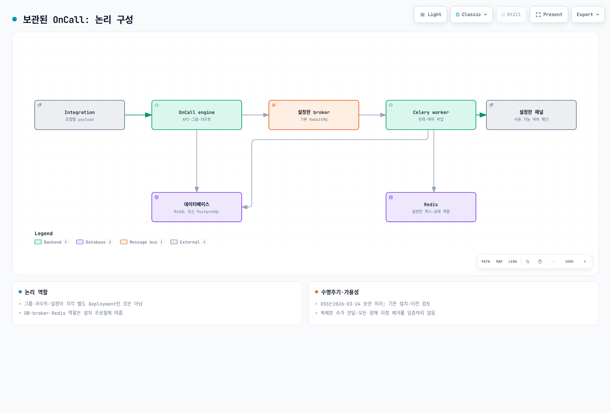
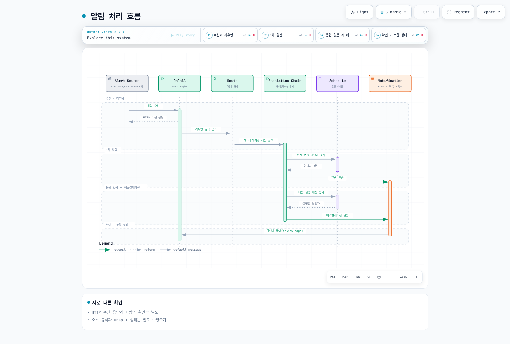
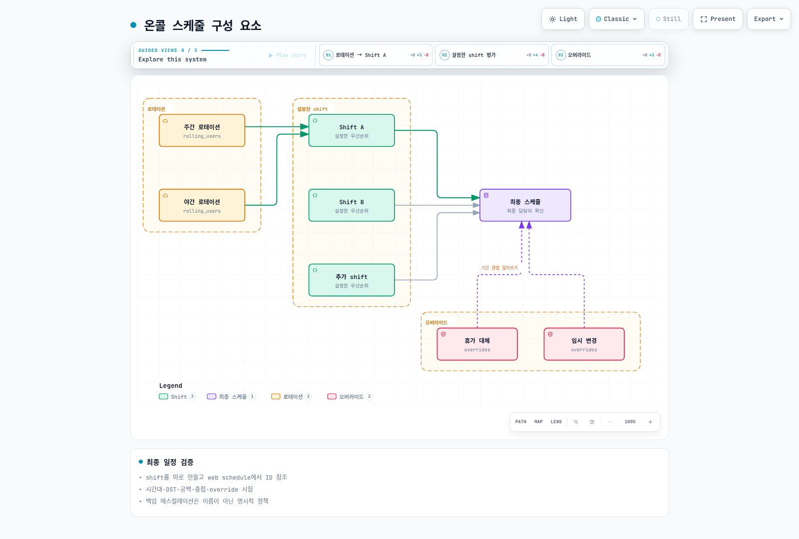
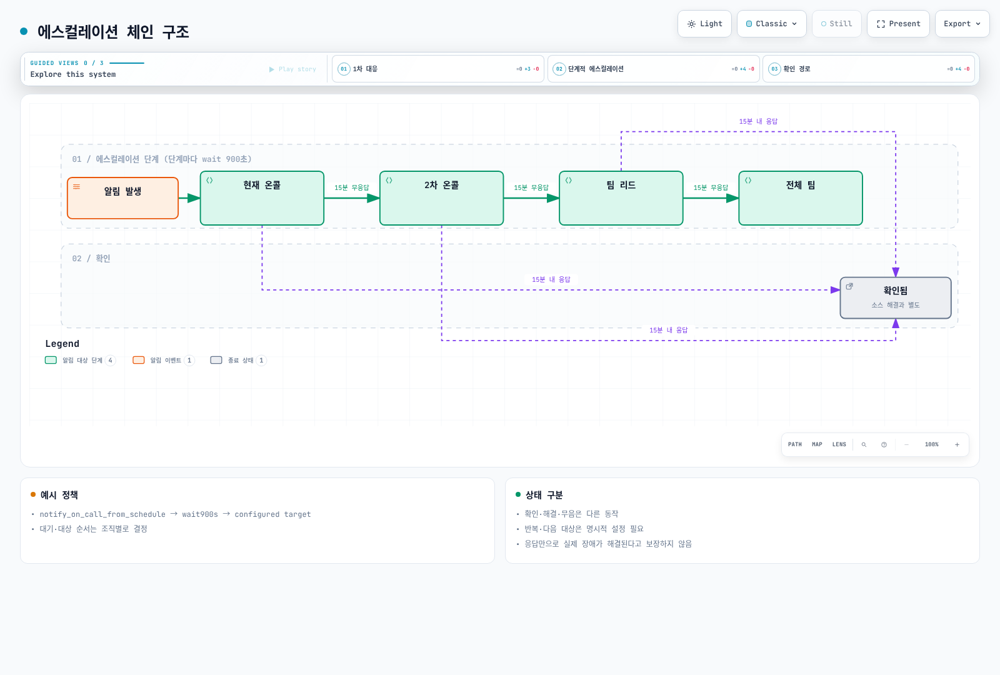
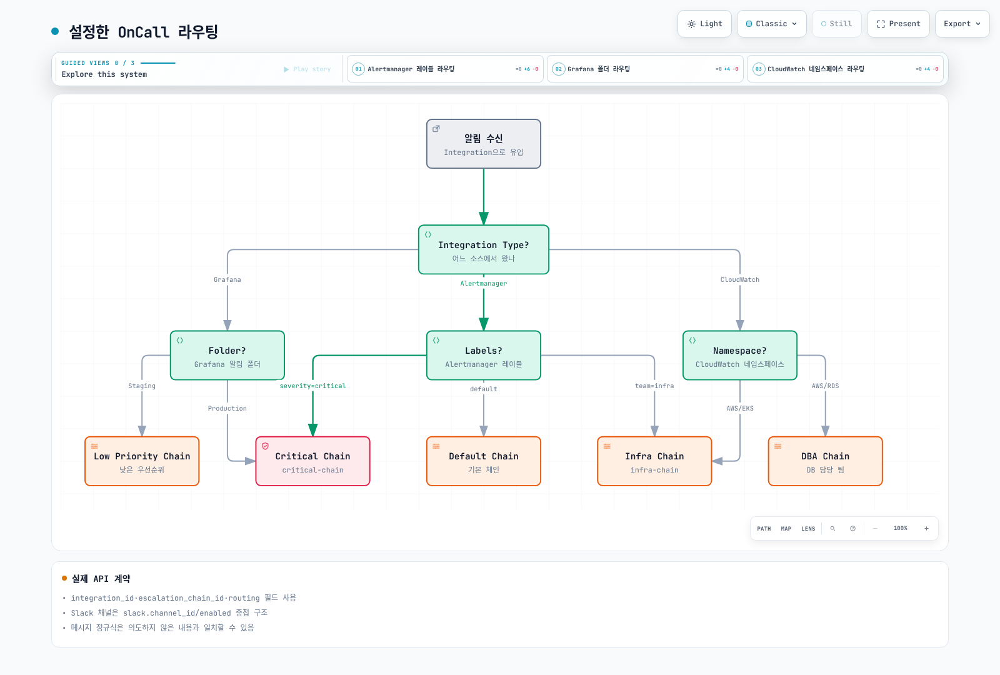
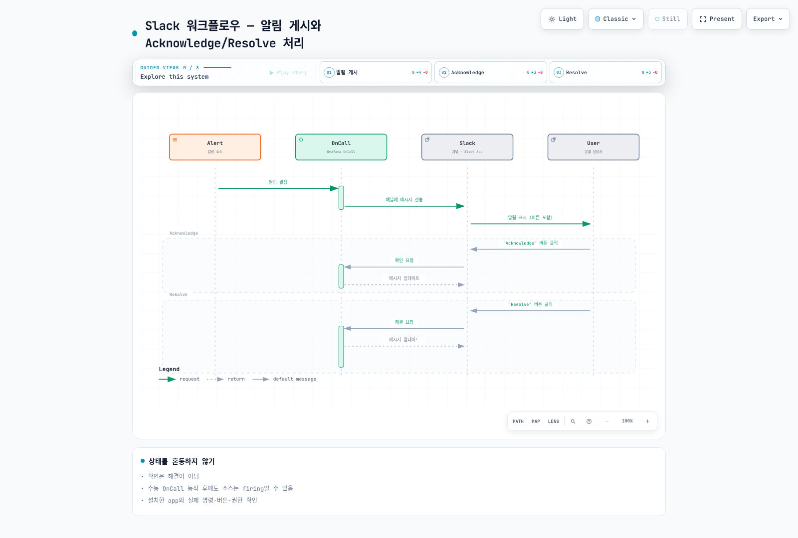
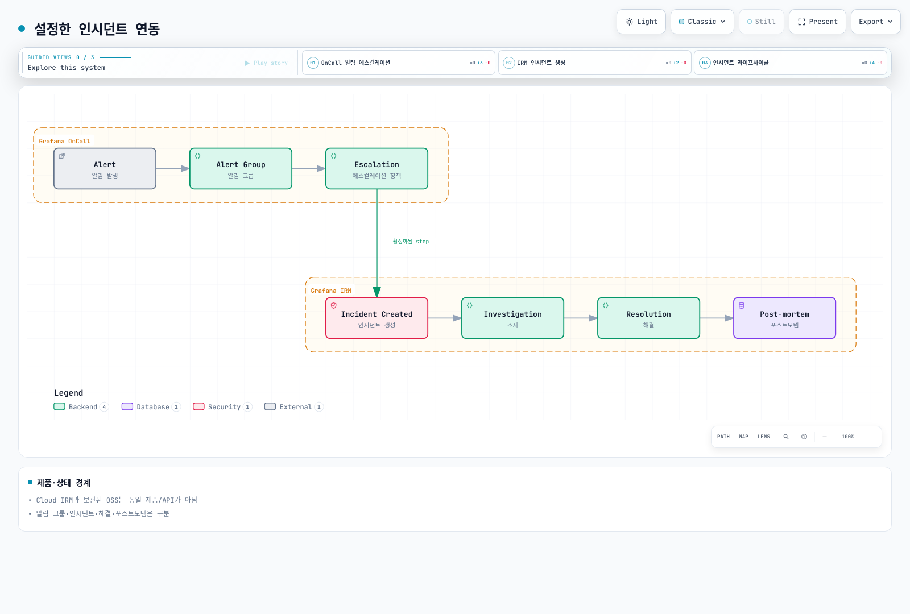
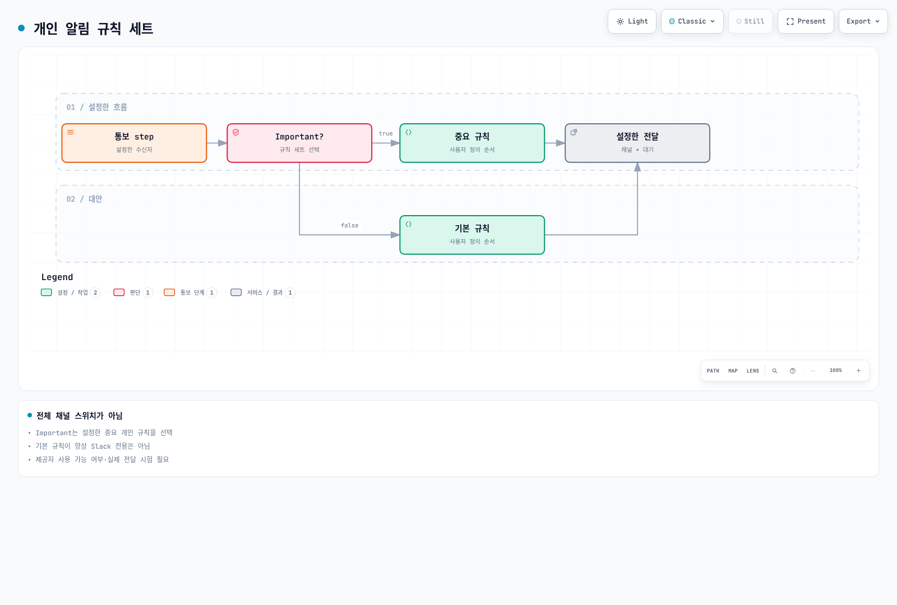
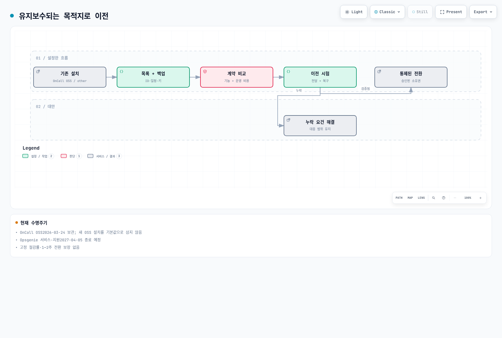

# Grafana OnCall

> **마지막 업데이트**: 2026년 9월 13일

## 목차

- [Grafana OnCall 개요](#grafana-oncall-개요)
- [아키텍처](#아키텍처)
- [설치](#설치)
- [통합 설정](#통합-설정)
- [온콜 스케줄 구성](#온콜-스케줄-구성)
- [에스컬레이션 체인](#에스컬레이션-체인)
- [알림 그룹화 및 라우팅](#알림-그룹화-및-라우팅)
- [ChatOps 통합](#chatops-통합)
- [Grafana IRM 연동](#grafana-irm-연동)
- [모바일 앱](#모바일-앱)
- [PagerDuty/OpsGenie 비교](#pagerdutyopsgenie-비교)
- [모범 사례](#모범-사례)

---

## Grafana OnCall 개요

**Grafana OnCall OSS는 2026-03-24에 보관 처리되었습니다.** 저장소는 `grafana-cold-storage/oncall`로 이동했으며 읽기 전용입니다. 이 장은 기존 설치의 구조·API·이전 검토용이고 새로운 프로덕션 OSS 도입을 권장하는 설치 가이드가 아닙니다. 유지보수되는 Grafana Cloud IRM의 기능·API·요금제는 별도로 확인합니다.

검토한 archived source는 `af0fbd40558c9a63bcf438589894c440fc434a54`입니다. 최신 release 표기는 v1.16.11이지만 해당 source의 Helm chart/appVersion은 1.15.6으로 같지 않습니다. API 예시는 이 소스와 공식 OnCall API 설명을 대조했으며 실제 OnCall 계정 생성·API 쓰기·알림 전송은 하지 않았습니다.

### 주요 기능

1. **온콜 스케줄 관리**: 로테이션, 오버라이드, 휴일 관리
2. **에스컬레이션 체인**: 시간 기반 자동 에스컬레이션
3. **알림 그룹화**: 관련 알림 통합
4. **다양한 통합**: Alertmanager, Grafana, CloudWatch, Webhook
5. **ChatOps**: Slack, MS Teams, Telegram 연동
6. **알림 채널**: 배포·통합·사용자 규칙에 따라 실제 사용 가능 여부 확인

### Grafana OnCall vs PagerDuty vs OpsGenie

| 대상 | 현재 검토 기준 |
|---|---|
| OnCall OSS | 보관된 기존 설치, 종속성·복구·이전 책임 |
| Grafana Cloud IRM / PagerDuty | 유지보수 상태, 필요한 채널·스케줄·API·지역·계약 조건 확인 |
| Opsgenie | 2025-06-04 신규 판매 종료, 2027-04-05 서비스·지원 종료 예정. 기존 사용자는 이전 계획 필요 |

고정 통합 수·과거 가격·주관적 “기본/고급” 순위로 제품을 선택하지 않습니다.

---

## 아키텍처

### Grafana OnCall 구성 요소

도식은 논리 역할이며 각각 별도 Deployment가 있다는 뜻은 아닙니다. 실제 database.type, broker.type, Redis, engine/Celery 배치와 plugin 연결을 설치 profile에서 확인합니다.




[🔍 인터랙티브 다이어그램 보기](https://www.atomai.click/kubernetes-docs/archmaps/ko-observability-alerting-03-grafana-oncall-0.html)

### 알림 처리 흐름



[🔍 인터랙티브 다이어그램 보기](https://www.atomai.click/kubernetes-docs/archmaps/ko-observability-alerting-03-grafana-oncall-1.html)

---

## 설치

### Helm을 통한 설치 (EKS)

새 OSS 설치 대신 기존 release/chart/image digest·DB·broker·Grafana plugin·인증·채널 의존성을 먼저 목록화합니다. `helm list`, 배포 리소스의 이미지, 보호된 `helm get values/manifest` 결과를 대조합니다. Values/manifest에는 실제 자격 증명이 포함될 수 있으므로 private 파일로 보관하고 채팅·Git·빌드 로그에 출력하지 않습니다.

보관된 차트는 오래된 cert-manager·ingress-nginx·DB 등의 종속성을 포함합니다. 일반 Grafana 저장소의 최신 차트와 archived source 버전을 섞거나 단순 helm install 명령을 현재 보안 지원의 근거로 삼지 않습니다.

### values.yaml 기본 설정

다음은 읽은 archived chart의 실제 key입니다. 기존 예제의 값이 Helm에 의해 무시되거나 잘못 해석될 수 있었던 부분을 구분합니다.

| 역할 | archived chart key |
|---|---|
| API/engine 복제본 | `engine.replicaCount` (`oncall.replicaCount` 아님) |
| URL | `base_url` + `base_url_protocol` |
| 추가 환경 변수 | `env` map; Kubernetes env 목록을 그대로 넣는 형식 아님 |
| 외부 PostgreSQL | `externalPostgresql.db_name`, `existingSecret`, `passwordKey`, TLS options |
| 외부 Redis | `externalRedis.existingSecret`, `passwordKey`, `ssl_options` |
| 애플리케이션 암호화 키 | `oncall.secrets.existingSecret`, `secretKey`, `mirageSecretKey` |
| Telegram/Twilio | `oncall.telegram`, `oncall.twilio` 아래의 설정 |

기본값은 MariaDB·RabbitMQ·Redis·Grafana·ingress-nginx·cert-manager 등을 활성화합니다. database.type을 PostgreSQL로 바꾼다고 MariaDB 등 다른 종속성이 자동으로 꺼지지 않습니다. `settings.hobby`나 generic Firebase YAML은 검증한 운영 프로필이 아닙니다.

### 프로덕션 values.yaml

Replica 수를 늘리는 것만으로 단일 장애 지점이 사라지지 않습니다. engine·Celery·scheduler/beat·DB·broker/cache·plugin·알림 제공자·DNS/인증서를 포함해 장애, queue 지속성, 중복 작업, 재시도와 복구를 시험해야 합니다. RabbitMQ broker와 Redis의 역할을 혼동하지 말고 실제 broker.type을 확인합니다.

DB/Redis TLS 검증, 역할별 secret 전달, 네트워크 접근, 백업·복원과 데이터 이전을 기존 배포 소유자가 검토합니다. internet-facing ALB나 외부 데이터베이스 주소를 적은 것만으로 production-ready가 되지 않습니다. 이 감사는 EKS 설치·HA·실제 알림 제공자를 실행하지 않았습니다.

### Secret 생성

실제 값을 --from-literal 인자로 전달하거나 Helm values에 평문으로 넣지 않습니다. 승인된 secret 저장소·보호 파일을 사용하고 기존 암호화 키와 DB 백업을 함께 관리합니다. 기존 설치의 Mirage 관련 키/IV를 무심코 변경하면 저장 데이터를 복호화하지 못할 수 있습니다. 공개 API 토큰, integration webhook URL, Slack/Twilio/Telegram 자격 증명을 서로 다른 권한·교체 대상으로 관리합니다.

---

## 통합 설정

### Alertmanager 통합

Integration 화면/API에서 생성된 **해당 유형의 전체 URL**을 사용합니다. URL 자체가 비밀값일 수 있으므로 보호 파일에 저장합니다. 임의 `/api/v1/webhook/<id>/` 경로와 public API 토큰을 조합하지 않습니다. 다음은 current matchers와 두 receiver가 정의된 Alertmanager 설정이며 실제 전송은 하지 않았습니다.

```yaml
# Materialize the generated integration URL in this protected file.
# This example is not enabled or contacted during the documentation audit.
route:
  receiver: no-page
  group_by: [alertname, cluster, namespace, service]
  group_wait: 30s
  group_interval: 5m
  repeat_interval: 4h
  routes:
    - matchers: ['severity=~"critical|warning"']
      receiver: oncall
receivers:
  - name: no-page
  - name: oncall
    webhook_configs:
      - url_file: /etc/oncall/integration-url
        send_resolved: true
```

amtool0.34로 구문과 critical/warning/info/fallback 네 라우팅 사례를 검증했습니다. send_resolved는 소스의 해결 메시지 전달 설정이며 OnCall의 수동 해결이 소스 규칙을 자동 변경한다는 뜻이 아닙니다.

### Grafana Alerting 통합

설치한 Grafana/OnCall plugin 버전의 지원 contact point와 생성된 integration을 확인합니다. Grafana 설정은 INI·provisioning YAML·UI API가 서로 다르므로 기존 예제처럼 INI를 YAML로 표시하지 않습니다. Grafana Alerting 규칙·알림 상태와 OnCall alert-group 상태도 분리합니다.

### CloudWatch 통합

CloudWatch 전용 integration의 SNS 확인·서명·payload 처리 요건을 따릅니다. 아무 generic webhook URL에 SNS를 구독한다고 동작하는 것은 아닙니다. ALARM/OK/INSUFFICIENT_DATA 전이, confirmation, 중복·재시도, topic/endpoint 권한과 실제 전달을 검증합니다. 이 감사는 SNS 구독이나 alarm action을 생성하지 않았습니다.

### Webhook 통합

일반 webhook은 명시적으로 구성한 parsing/grouping/resolve template에 맞는 페이로드를 사용합니다. `alert_uid`, `state`, `labels`를 보낸다고 모든 integration이 같은 의미로 해석하지 않습니다. 값은 JSON serializer로 만들고 HTTPS 검증·timeout·실패 처리·재시도/중복 키를 설계합니다. URL·token·개인정보를 로그에 출력하지 않습니다.

Public API는 문서화된 **raw Authorization token**을 사용하며 Bearer를 임의로 붙이지 않습니다. Grafana service-account token 방식에는 X-Grafana-URL도 필요합니다. API origin과 integration webhook은 별개의 인증 경로입니다.

[읽기 전용 inventory 도구](https://github.com/Atom-oh/kubernetes-docs/tree/main/examples/observability/oncall)는 GET만 사용하고 pagination의 origin·collection·count, TLS, redirect, 파일 권한을 검사합니다. 출력에는 integration URL과 개인정보가 포함될 수 있으며 전체 DB/암호화 키/이력 백업이나 원자적 이전 snapshot은 아닙니다. 실제 계정은 조회하지 않았고 로컬 TLS fixture로 12개 검사를 통과했습니다.

---

## 온콜 스케줄 구성

### 스케줄 개념

일정·시간대·shift 우선순위·override를 함께 확인합니다. Primary/secondary라는 이름만으로 자동 백업 에스컬레이션이 생기지 않습니다. 최종 담당자를 API/UI에서 확인하고 공백·중첩·DST·교대 경계를 시험합니다.



[🔍 인터랙티브 다이어그램 보기](https://www.atomai.click/kubernetes-docs/archmaps/ko-observability-alerting-03-grafana-oncall-2.html)

### 스케줄 생성 (API)

web schedule의 `shifts`는 중첩 shift 오브젝트가 아니라 **이미 만든 shift ID 목록**입니다. `/api/v1/on_call_shifts/` 계약으로 shift를 만든 뒤 반환 ID를 `/api/v1/schedules/`의 web schedule에 연결합니다. 다음 JSON은 실제 ID·날짜를 바꾸어 검토할 요청 예시이며 쓰기를 실행하지 않았습니다.

```json
{
  "name": "Illustrative weekly rotation",
  "type": "rolling_users",
  "time_zone": "Asia/Seoul",
  "start": "2026-09-14T09:00:00",
  "duration": 604800,
  "frequency": "weekly",
  "interval": 1,
  "week_start": "MO",
  "start_rotation_from_user_index": 0,
  "rolling_users": [
    ["REPLACE_WITH_USER_ID_A"],
    ["REPLACE_WITH_USER_ID_B"]
  ]
}
```

```json
{
  "name": "Illustrative SRE schedule",
  "type": "web",
  "time_zone": "Asia/Seoul",
  "shifts": ["REPLACE_WITH_EXISTING_SHIFT_ID"]
}
```


### 로테이션 유형

주간 반복에는 `week_start`, 양수 `interval`, rolling_users의 시작 사용자 인덱스가 필요합니다. 일간·주간·시간 반복은 duration만 바꾸는 것과 같지 않습니다. Source validator는 start를 `YYYY-MM-DDTHH:MM:SS`와 별도 time_zone으로 받으므로 기존 offset 포함 문자열을 그대로 보내지 않습니다. JSON 날짜는 설명용 샘플이며 운영 일정이 아닙니다.

19개 검사는 실제 upstream 순수 validator와 serializer field에 근거합니다. DB의 사용자·shift 존재나 최종 캘린더 배정까지 검증하지는 않았습니다.

### 오버라이드 설정

이 source의 override는 `/api/v1/on_call_shifts/`의 별도 type이며 기존 `/schedules/<id>/overrides/` 형식을 가정하지 않습니다. 생성 후 schedule에 연결하면서 기존 shift ID 목록을 보존합니다. 설치한 API의 연결·우선순위를 확인하고 제한된 시험 기간으로 최종 담당자를 검증합니다.

```json
{
  "name": "Illustrative temporary replacement",
  "type": "override",
  "time_zone": "Asia/Seoul",
  "start": "2026-09-15T09:00:00",
  "duration": 28800,
  "users": ["REPLACE_WITH_EXISTING_USER_ID"]
}
```


---

## 에스컬레이션 체인

### 에스컬레이션 체인 구조

확인(Acknowledge), 해결(Resolve), 무음(Silence)은 다른 상태입니다. Acknowledge가 문제를 해결하거나 소스 규칙을 비활성화하지 않습니다. 대기·중단·재호출 조건은 실제 정책과 integration 상태에 따라 검증합니다. 그림의 15분은 예시 정책이며 제품 보장값이 아닙니다.



[🔍 인터랙티브 다이어그램 보기](https://www.atomai.click/kubernetes-docs/archmaps/ko-observability-alerting-03-grafana-oncall-3.html)

### 에스컬레이션 체인 생성

기존 chain·schedule·user ID와 권한을 확인하고 생성/수정 요청을 별도로 검토합니다. 다음은 `/api/v1/escalation_policies/`의 **대기 단계 하나**이며 전체 chain 생성 요청이 아닙니다. 해당 source의 wait duration 허용 범위는 1분~24시간이며 수치 단위는 초입니다.

```json
{
  "escalation_chain_id": "REPLACE_WITH_EXISTING_CHAIN_ID",
  "position": 1,
  "type": "wait",
  "duration": 900
}
```


### 에스컬레이션 정책 유형

Source serializer에는 schedule/user/team/group 통보, wait, 시간/알림 수 조건, custom webhook, 기능이 활성화된 경우의 incident 선언 등이 있습니다. custom webhook 참조 필드는 `action_to_trigger`이며 기존 `webhook_id`나 모든 step에 대한 `repeat_after`를 가정하지 않습니다. `declare_incident`는 존재하지만 조직의 기능 활성화 검증을 통과해야 합니다.

`important: true`는 사용자에게 설정한 **중요 알림 규칙**을 선택하는 것이며 모든 채널을 무조건 동시에 호출하는 스위치가 아닙니다. 기본/중요 규칙의 순서·wait·채널·실제 사용 가능 여부를 사용자별로 확인합니다.


### 심각도별 에스컬레이션 체인

Critical/Warning별 목적·응답 시간·백업·근무 시간·재호출 조건을 팀에서 정합니다. schedule을 다시 알리는 것이 항상 “다음 담당자” 호출과 같지는 않습니다. 반복/조건 step의 실제 API 필드를 확인하고 같은 사건이 여러 채널에서 중복 호출되지 않게 합니다. 실제 전화·SMS·외부 webhook은 승인된 시험 경로에서 검증하며 이 감사에서 호출하지 않았습니다.


---

## 알림 그룹화 및 라우팅

### 라우트 설정

Integration별 실제 payload, route 순서, 일치하지 않을 때의 default route를 확인합니다. Alertmanager·Grafana·CloudWatch의 payload 구조가 같지 않으며 메시지 내 임의 문자열이 일치하는 정규식은 잘못 라우팅할 수 있습니다. 정상·누락·오류·서로 충돌하는 조건을 fixture로 시험합니다.



[🔍 인터랙티브 다이어그램 보기](https://www.atomai.click/kubernetes-docs/archmaps/ko-observability-alerting-03-grafana-oncall-4.html)

### 라우트 생성

다음은 source가 지원하는 route 필드 예시입니다. Slack은 `slack.channel_id`/`enabled` 중첩 구조이고 기존 flat `slack_channel_id`가 아닙니다. 실제 integration/chain/channel ID와 사용 권한이 필요합니다. 정규식은 설명용 payload에 한정한 예시이며 모든 provider의 표준 템플릿이 아닙니다.

```json
{
  "integration_id": "REPLACE_WITH_EXISTING_INTEGRATION_ID",
  "routing_type": "regex",
  "routing_regex": "\"severity\"\\s*:\\s*\"critical\"",
  "position": 0,
  "escalation_chain_id": "REPLACE_WITH_EXISTING_CHAIN_ID",
  "slack": {
    "channel_id": "REPLACE_WITH_EXISTING_SLACK_CHANNEL_ID",
    "enabled": true
  }
}
```


### 알림 그룹화 설정

그룹 키에는 필요 시 cluster/environment/namespace/service 등 충돌을 피할 범위를 포함합니다. 너무 적은 필드는 다른 사건을 합치고 무제한 ID는 분리를 늘릴 수 있습니다. 기존 `group_wait`, `group_interval`, `resolve_timeout` 혼합 YAML은 OnCall integration의 보편적 설정 스키마가 아니었습니다. Alertmanager 타이머와 OnCall grouping/resolve template를 구분합니다.

템플릿 변수는 integration별 실제 payload에 맞춰 선택합니다. `payload.labels`가 항상 있거나 모든 Alertmanager 요청의 최상위에 있다고 가정하지 않습니다. JSON 메시지는 적절히 이스케이프하고 사용자 입력을 신뢰된 코드로 처리하지 않습니다.


---

## ChatOps 통합

### Slack 통합

설치한 Slack app의 OAuth·signing secret·권한·workspace 연결을 확인합니다. API의 slack_channels 리소스에서 발견한 채널을 실제 route의 중첩 Slack 설정으로 참조합니다. 기존 `POST /slack_channels` 예시가 채널 생성/연결을 수행한다고 가정하지 않습니다. App 설치와 사용자 동작은 별도 승인된 운영 절차이며 이 감사에서는 실행하지 않았습니다.


### Slack 명령어

기존 `/oncall ack`, `/oncall resolve`, `/oncall silence` 명령 목록은 source로 확인되지 않았습니다. 읽은 source는 설정 가능한 root command와 `/grafana` 예시를 사용합니다. 설치한 app의 현재 help/문서와 버튼 동작을 확인하고, 일반 Bash 코드처럼 slash command를 실행하지 않습니다.


### Slack 워크플로우

버튼의 Acknowledge/Resolve/Silence는 권한 있는 사용자의 OnCall 상태 변경입니다. 응답 전달·Slack 메시지 갱신·소스 모니터 상태는 별도이며 자동 역방향 상태 변경을 가정하지 않습니다.



[🔍 인터랙티브 다이어그램 보기](https://www.atomai.click/kubernetes-docs/archmaps/ko-observability-alerting-03-grafana-oncall-5.html)

### MS Teams 통합

Microsoft의 현재 지원 webhook/workflow와 카드 형식을 확인합니다. 기존 Office connector URL과 MessageCard JSON을 새 통합의 보편적 구성으로 복사하지 않습니다. OnCall outgoing webhook 설정은 YAML을 작성하는 것만으로 설치되지 않으며 실제 template context·인증·형식·수신·실패 처리가 필요합니다. 이 감사에서는 Teams 메시지를 보내지 않았습니다.


### Telegram 통합

archived chart는 `oncall.telegram` 아래의 token/existingSecret/tokenKey와 별도 telegramPolling을 사용합니다. 최상위 generic `telegram.enabled` 블록을 Bash로 표시한 기존 예시는 올바른 Helm 설정이 아닙니다. Bot token, webhook/polling 소유자, 사용자 연결과 실제 사용 가능 여부를 확인합니다. Bot 생성·사용자 메시지는 실행하지 않았습니다.


---

## Grafana IRM 연동

### Incident Response Management

Grafana Cloud IRM의 유지보수되는 알림·온콜·인시던트 기능과 보관된 OnCall OSS를 구분합니다. IRM을 단순히 “Grafana Incident의 이름 변경”으로 설명하거나 archived OSS와 동일한 API/권한/기능 범위라고 가정하지 않습니다. 이전 대상의 현재 기능·계약·데이터 보존·export/import 지원을 확인합니다.



[🔍 인터랙티브 다이어그램 보기](https://www.atomai.click/kubernetes-docs/archmaps/ko-observability-alerting-03-grafana-oncall-6.html)

### 자동 인시던트 생성

읽은 source에는 `declare_incident` step이 실제로 존재하지만 조직의 기능 활성화 검사를 통과해야 합니다. 임의 severity/title_template YAML을 붙인다고 incident 연동이 구성되지 않습니다. Alert group, incident, 확인, 해결, 포스트모템의 상태와 담당자를 구분하고 승인된 시험에서 검증합니다.

---

## 모바일 앱

### 모바일 앱 기능

지원되는 앱/배포에서는 alert feed·상태 변경·일정 조회·알림을 사용할 수 있지만 현재 backend 연결과 OS 권한, 네트워크, 사용자 규칙을 확인해야 합니다. “즉시 수신”이나 모든 자체 호스팅 설치의 push 동작을 보장하지 않습니다.


### 모바일 앱 설정

기존 `mobile.firebase`는 읽은 archived chart의 설정 key가 아닙니다. 임의 Firebase 서비스 계정 파일만으로 push를 활성화할 수 있다고 가정하지 않습니다. 실제 모바일/Cloud Connection 경로의 현재 사용 가능 여부와 이전 대상의 지원 방식을 확인합니다. 이 감사에서는 Firebase 프로젝트·계정·push 알림을 만들지 않았습니다.


### 알림 채널 우선순위

Important/default는 사용자의 별도 알림 규칙 세트를 선택합니다. 순서·wait·채널·사용 가능 여부가 각각 적용되며 important가 모든 채널 동시 전송을 뜻하지 않습니다. 실제 전달과 확인/에스컬레이션을 시험합니다.



[🔍 인터랙티브 다이어그램 보기](https://www.atomai.click/kubernetes-docs/archmaps/ko-observability-alerting-03-grafana-oncall-7.html)

---

<span id="pagerdutyopsgenie-비교"></span>

## PagerDuty/OpsGenie 비교

### 기능 비교

동일한 요구사항과 실제 요금제·사용량·계약으로 비교합니다. 과거 사용자당 가격 범위, 통합 수, “기본/고급” 등급은 현재 도입 근거가 아닙니다. 스케줄·override·조건부 에스컬레이션·SSO·retention·API 권한·채널/국가 제한·지원·이전 비용을 확인합니다. OnCall OSS는 보관 상태이며 Opsgenie도 종료 일정에 맞춘 이전 검토가 필요합니다.


### 마이그레이션 고려사항

이제 검토 방향은 PagerDuty/Opsgenie에서 새로운 OnCall OSS 설치로 이동하는 기본 권장이 아닙니다. 기존 OnCall/종료 예정 도구의 데이터·의존성을 파악하고 유지보수되는 목적지와 기능 차이·복구를 검증합니다. 무료 코드가 호스팅·운영·지원·통신 비용이 없다는 뜻은 아닙니다.



[🔍 인터랙티브 다이어그램 보기](https://www.atomai.click/kubernetes-docs/archmaps/ko-observability-alerting-03-grafana-oncall-8.html)

### 마이그레이션 체크리스트

- [ ] 사용자/팀, 스케줄/시간대/override, chain/route, template와 integration을 목록화
- [ ] DB·암호화 키·설정·이력의 별도 백업과 복구 시험 준비
- [ ] 목적지의 지원 기능, ID 매핑, 권한·개인정보·보존 정책 확인
- [ ] 합성 alerting/resolved/누락/재시도/중복/무응답/교대 사례로 검증
- [ ] 병렬 운영 중 이중 호출 방지와 명확한 소유자·전환·복구 기준 정의
- [ ] 검증 후 승인된 순서로 소스 URL/토큰을 전환하고 불필요한 접근 폐기
- [ ] 실제 대응 팀 교육과 운영 인수인계 완료

병렬 운영 1~2주 같은 고정 기간을 보장하거나 API inventory만으로 전체 백업이 완성됐다고 가정하지 않습니다.


---

## 모범 사례

### 온콜 스케줄 설계

근무 시간대, 휴가·교대·백업과 팀의 실제 인원을 기준으로 일정을 합의합니다. 매주 교대·오전 9시·최소 3~4명은 보편적 정답이 아닙니다. 기존 사건과 만료 예정 silence, responder 공백을 인계합니다.


### 에스컬레이션 설계

심각도별 조치와 응답 목표, 백업·관리자 경로, 재호출과 중단 조건을 문서화합니다. 사람을 깨우는 페이지는 실행 가능한 조치가 필요하고 비긴급 정보는 별도 경로로 보낼 수 있습니다. 중요 플래그를 전화/SMS 전달 보장으로 보지 않습니다.


### 알림 품질 관리

반복·오탐·누락·전달 실패와 실제 대응 결과를 검토합니다. 필터/템플릿/그룹 키/소스 URL 변경 후 데이터와 상태 전이를 확인하고 이전 값을 안전하게 복구할 준비를 합니다.


### 온콜 복지

팀과 대응 부담·보상·회복 시간·업무 분담을 합의합니다. 반복되는 사건의 원인을 줄이고 문서·자동화·인수인계를 개선합니다. 구체적인 교대/휴식 수치는 팀 상황을 반영한 운영 정책입니다.


---

## 퀴즈

이 장에서 배운 내용을 테스트하려면 [Grafana OnCall 퀴즈](../../quizzes/observability/alerting/03-grafana-oncall-quiz.md)를 풀어보세요.

## 참고 자료

- [OnCall OSS lifecycle](https://grafana.com/docs/oncall/latest/)
- [OnCall API reference](https://grafana.com/docs/oncall/latest/oncall-api-reference/)
- [Archived source contract](https://github.com/grafana-cold-storage/oncall/tree/af0fbd40558c9a63bcf438589894c440fc434a54)
- [Opsgenie lifecycle](https://www.atlassian.com/software/opsgenie)
