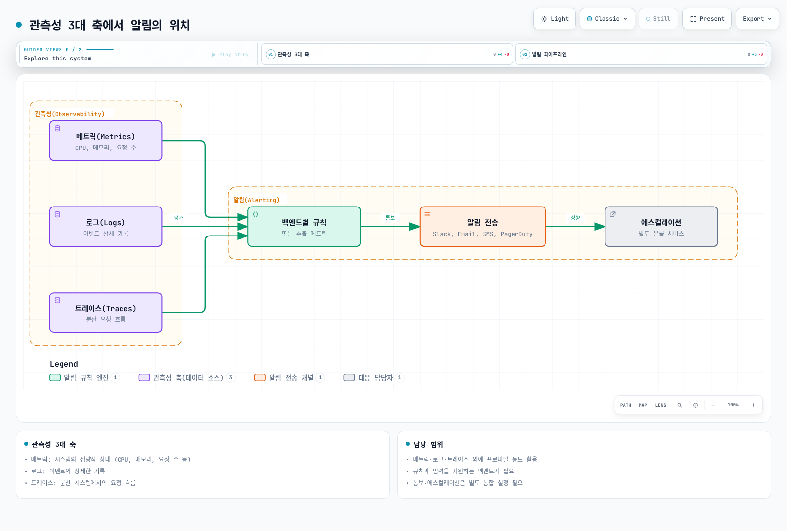
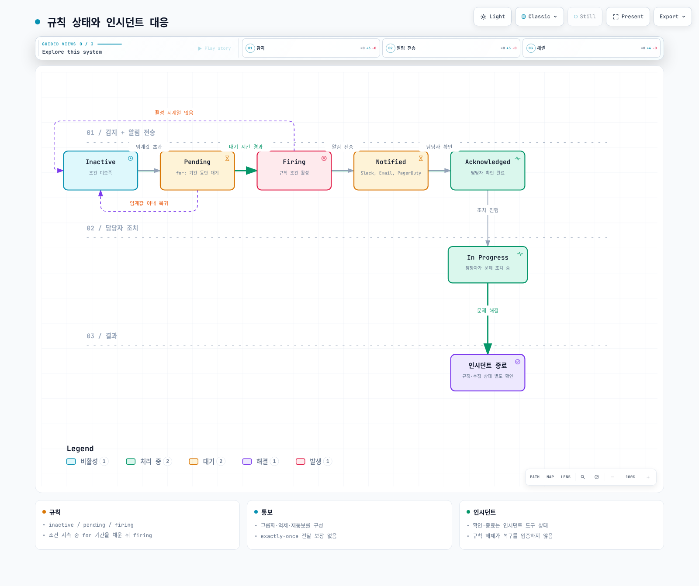
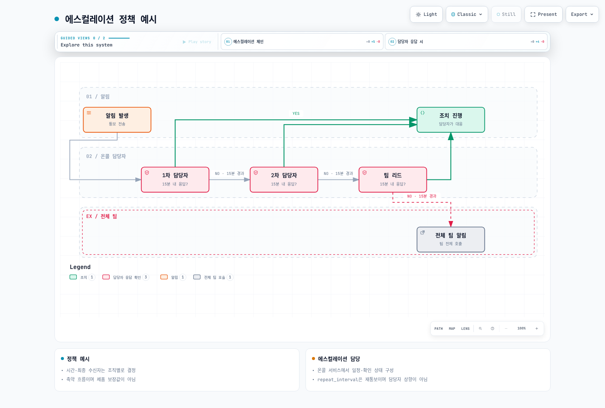
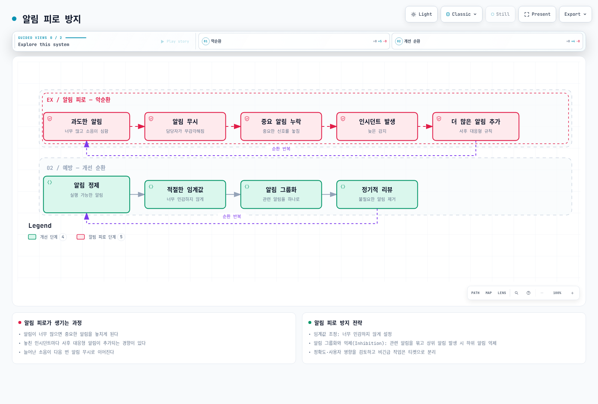
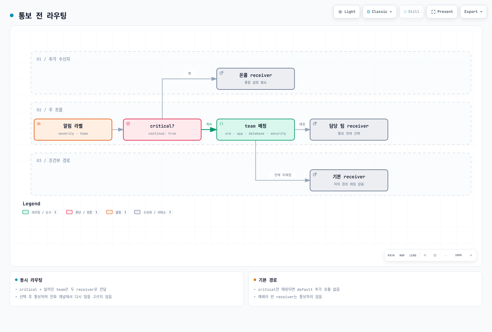
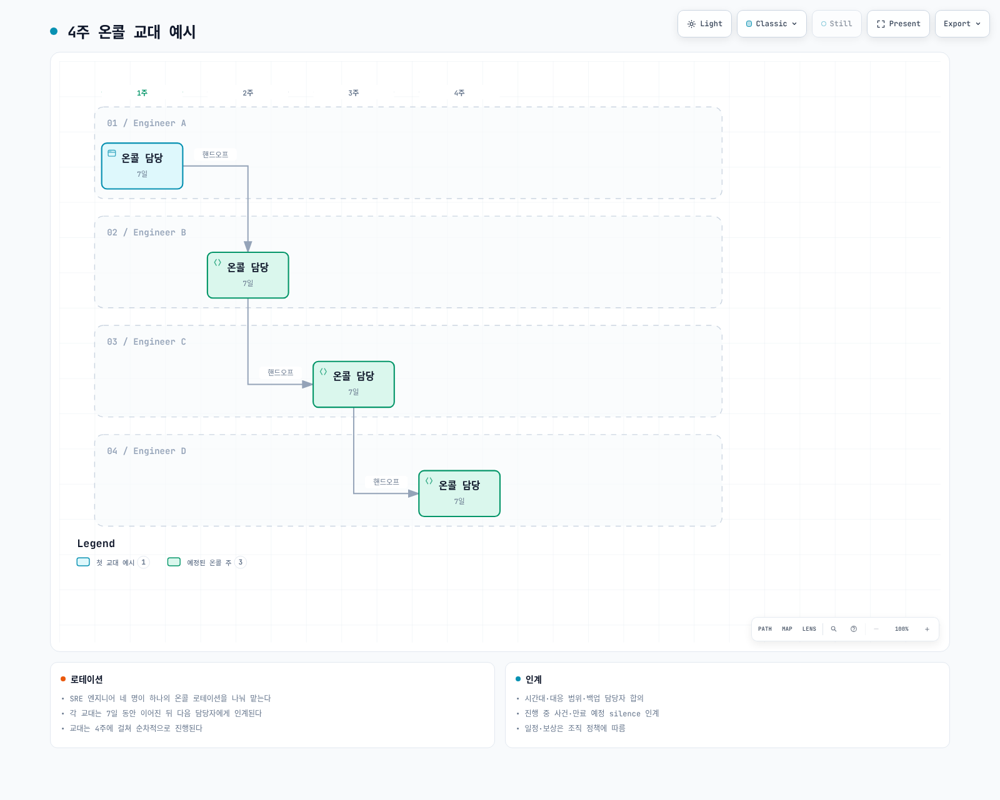
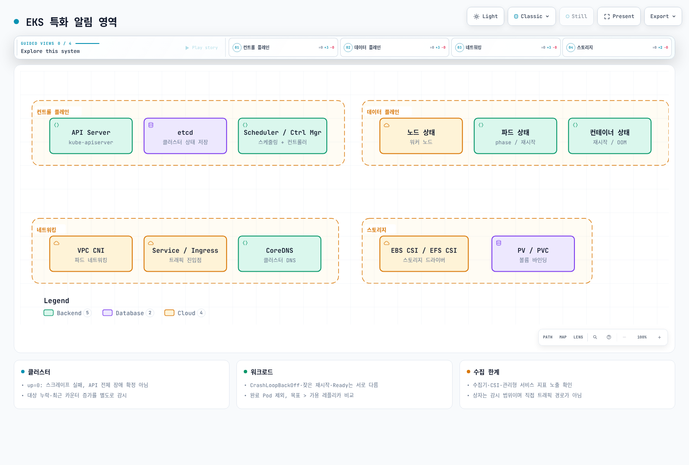
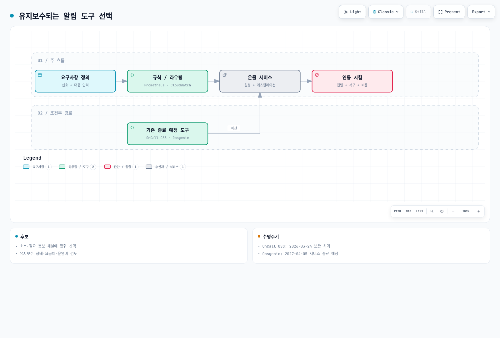
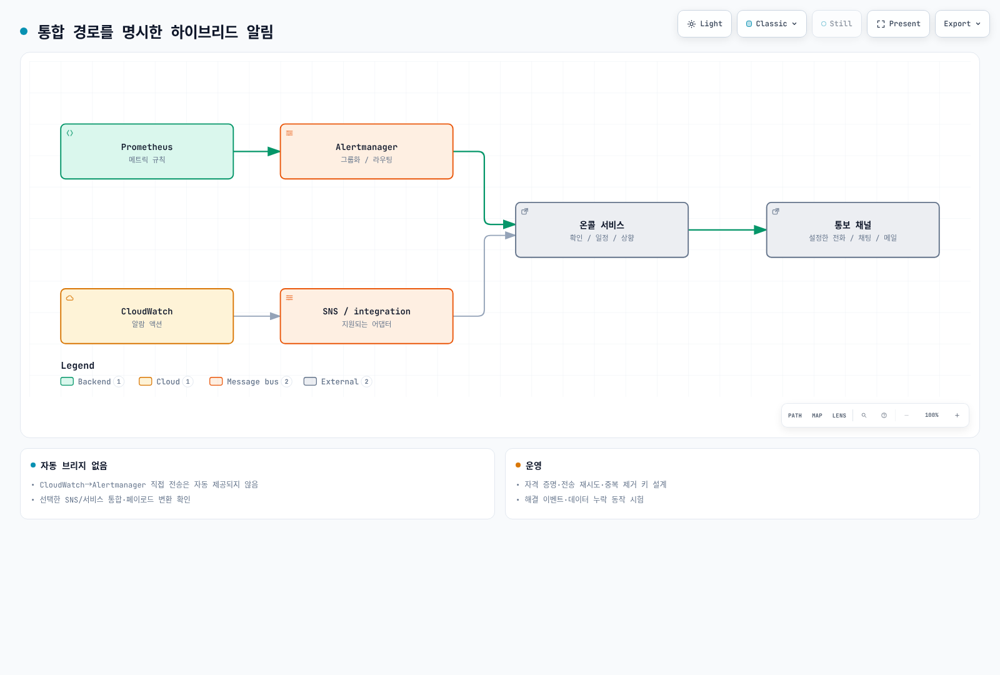

# 알림 개요

> **마지막 업데이트**: 2026년 9월 13일


> 검토 기준: Prometheus 3.14.0, Alertmanager 0.34.0. 예제는 단일 클러스터 수집과 중복 제거된 시계열을 가정합니다. 실제 job/라벨·수집기·지표 노출을 확인하고 임계값을 조정하세요. 로컬 규칙·라우팅 검증만 수행했으며 클러스터나 알림 채널은 실행하지 않았습니다.


## 목차

- [알림의 역할과 중요성](#알림의-역할과-중요성)
- [알림 생명주기](#알림-생명주기)
- [알림 설계 원칙](#알림-설계-원칙)
- [알림 라우팅과 에스컬레이션](#알림-라우팅과-에스컬레이션)
- [온콜 로테이션](#온콜-로테이션)
- [EKS 환경에서의 알림 전략](#eks-환경에서의-알림-전략)
- [솔루션 비교](#솔루션-비교)

---

## 알림의 역할과 중요성

### 관측성 3대 축에서 알림의 위치

메트릭·로그·트레이스는 관측성에서 자주 사용하는 신호입니다. 프로파일 등 다른 신호도 있으며, 모든 규칙 엔진이 세 신호를 직접 평가하는 것은 아닙니다:



[🔍 인터랙티브 다이어그램 보기](https://www.atomai.click/kubernetes-docs/archmaps/ko-observability-alerting-readme-0.html)

- **메트릭(Metrics)**: 시스템의 정량적 상태 (CPU, 메모리, 요청 수 등)
- **로그(Logs)**: 이벤트의 상세한 기록
- **트레이스(Traces)**: 분산 시스템에서의 요청 흐름

Prometheus 규칙은 메트릭을 평가합니다. 로그·트레이스는 해당 백엔드의 규칙이나 추출한 메트릭을 통해 알림에 연결합니다. 감지, 통보, 담당자 확인은 서로 다른 단계이며 전달 성공은 별도로 감시해야 합니다.

### 알림이 필요한 이유

1. **선제적 문제 대응**: 사용자가 불편을 느끼기 전에 문제를 인지
2. **다운타임 최소화**: 빠른 감지와 대응으로 서비스 가용성 향상
3. **비용 절감**: 자동화된 모니터링으로 인력 비용 감소
4. **SLA/SLO 준수**: 서비스 수준 목표 달성을 위한 필수 요소
5. **인시던트 기록**: 문제 발생 이력 추적 및 분석

### 좋은 알림 vs 나쁜 알림

| 구분 | 좋은 알림 | 나쁜 알림 |
|------|-----------|-----------|
| **실행 가능성** | 즉각적인 조치가 필요함 | 정보 제공만, 조치 불필요 |
| **명확성** | 무엇이 문제인지 명확함 | 모호하고 불명확함 |
| **긴급도** | 심각도에 맞는 긴급도 | 모든 것이 긴급 |
| **빈도** | 적절한 빈도 | 너무 자주 또는 너무 드물게 |
| **중복** | 관련 알림 그룹화 | 동일 문제에 수십 개 알림 |

---

## 알림 생명주기

그림은 규칙 상태와 인시던트 대응을 함께 보여주는 개념도입니다. Prometheus 상태는 inactive/pending/firing이며, acknowledged/in-progress는 온콜 도구의 상태입니다. 담당자가 인시던트를 닫아도 규칙은 계속 firing일 수 있습니다. 시계열 소실도 규칙을 비활성화할 수 있으므로 이를 복구 증거로 취급하지 않습니다:



[🔍 인터랙티브 다이어그램 보기](https://www.atomai.click/kubernetes-docs/archmaps/ko-observability-alerting-readme-1.html)

### 1. Detection (감지)

- **임계값 기반**: 특정 값이 설정된 임계값을 초과할 때
- **변화율 기반**: 값의 변화 속도가 비정상적일 때
- **이상 탐지**: 기계 학습 기반 비정상 패턴 감지
- **로그 패턴**: 특정 로그 패턴 발생 시

```yaml
groups:
  - name: node-alerts
    rules:
      - alert: HighCPUUsage
        expr: 100 * (1 - avg by (cluster, instance) (rate(node_cpu_seconds_total{mode="idle"}[5m]))) > 80
        for: 5m
        labels:
          severity: warning
          team: sre
        annotations:
          summary: "High CPU usage detected"
          description: "CPU usage is above 80% for 5 minutes on {{ $labels.instance }}"
```

### 2. Notification (알림)

- **채널 선택**: Slack, Email, SMS, PagerDuty 등
- **라우팅**: 알림 유형에 따라 적절한 수신자에게 전달
- **그룹화**: 관련 알림을 묶어서 전송
- **중복 제거**: 중복 통보를 줄이지만 repeat_interval 재통보·장애 복구 재전송은 가능하며 exactly-once 전달은 보장하지 않음

### 3. Escalation (에스컬레이션)

- **시간 기반**: 일정 시간 내 응답 없으면 다음 담당자에게 전달
- **심각도 기반**: 심각도에 따라 다른 에스컬레이션 경로
- **자동 에스컬레이션**: 온콜 서비스에 별도로 구성. Alertmanager의 repeat_interval은 미응답 확인이나 담당자 교대 기능이 아님



[🔍 인터랙티브 다이어그램 보기](https://www.atomai.click/kubernetes-docs/archmaps/ko-observability-alerting-readme-2.html)

### 4. Resolution (해결)

- **수동 해결**: 담당자가 인시던트 도구에서 사건을 종료하며 규칙 상태는 별도로 확인
- **자동 해결**: 규칙 조건 해제·수집 상태를 확인한 후 연동 정책에 따라 사건 상태 갱신
- **해결 알림**: 문제 해결 시 해결 알림 전송

---

## 알림 설계 원칙

### 1. Actionable Alerts (실행 가능한 알림)

사람을 깨우는 페이지는 즉시 실행 가능한 조치가 있어야 합니다. 정보성 이벤트와 장기 개선 과제는 티켓·대시보드로 분리할 수 있습니다.

**잘못된 예:**
```
Alert: Database connection count increased
```

**올바른 예:**
```
Alert: Database connection pool exhausted
Action Required: Confirm user impact; inspect pool saturation and connection leaks using the runbook
Runbook: https://example.com/runbooks/replace-db-runbook
```

### 2. Alert Fatigue 방지 (알림 피로 방지)

너무 많은 알림은 오히려 중요한 알림을 놓치게 만듭니다.



[🔍 인터랙티브 다이어그램 보기](https://www.atomai.click/kubernetes-docs/archmaps/ko-observability-alerting-readme-3.html)

**알림 피로 방지 전략:**

1. **임계값 조정**: 너무 민감하지 않게 설정
2. **알림 그룹화**: 관련 알림을 하나로 묶음
3. **억제(Inhibition)**: 상위 알림 발생 시 하위 알림 억제
4. **정기적 리뷰**: 불필요한 알림 제거
5. **점진적 도입**: 새 알림은 먼저 낮은 심각도로 시작

### 3. Severity Levels (심각도 수준)

아래 대응 시간은 조직별 정책을 설명하는 예시이며 제품 SLA나 보편적 권장값이 아닙니다:

| 심각도 | 설명 | 대응 시간 | 예시 |
|--------|------|-----------|------|
| **Critical** | 서비스 완전 장애 | 즉시 (5분 이내) | 전체 서비스 다운, 데이터 손실 위험 |
| **High** | 주요 기능 장애 | 15분 이내 | 결제 시스템 오류, 로그인 불가 |
| **Warning** | 잠재적 문제 | 1시간 이내 | 디스크 80% 사용, 응답 지연 증가 |
| **Info** | 정보성 알림 | 업무 시간 내 | 배포 완료, 백업 성공 |

```yaml
groups:
  - name: disk-alerts
    rules:
      - alert: DiskSpaceCritical
        expr: |
          (100 * node_filesystem_avail_bytes{fstype!~"tmpfs|overlay|squashfs"}
            / node_filesystem_size_bytes{fstype!~"tmpfs|overlay|squashfs"} < 5)
          and node_filesystem_readonly == 0
          and node_filesystem_size_bytes > 0
        for: 5m
        labels:
          severity: critical
          team: sre
        annotations:
          summary: "Disk space critical"
      - alert: DiskSpaceWarning
        expr: |
          (100 * node_filesystem_avail_bytes{fstype!~"tmpfs|overlay|squashfs"}
            / node_filesystem_size_bytes{fstype!~"tmpfs|overlay|squashfs"} < 20)
          and node_filesystem_readonly == 0
          and node_filesystem_size_bytes > 0
        for: 10m
        labels:
          severity: warning
          team: sre
        annotations:
          summary: "Disk space low"
```

### 4. 알림 문서화

모든 알림에는 다음 정보가 포함되어야 합니다:

- **설명**: 알림이 무엇을 의미하는지
- **영향**: 이 문제가 서비스에 미치는 영향
- **조치 방법**: 문제 해결을 위한 단계별 가이드
- **런북 링크**: 상세한 대응 절차 문서

```yaml
annotations:
  summary: "Investigate {{ $labels.alertname }}"
  description: "Check the rule expression, its units, labels, and collection health."
  impact: "Document the affected user operation before paging."
  action: "Use the owning team's reviewed runbook; do not scale resources blindly."
  runbook_url: "https://example.com/runbooks/replace-with-reviewed-runbook"
```

---

## 알림 라우팅과 에스컬레이션

### 라우팅 전략

알림은 다양한 기준에 따라 적절한 수신자에게 전달되어야 합니다:



[🔍 인터랙티브 다이어그램 보기](https://www.atomai.click/kubernetes-docs/archmaps/ko-observability-alerting-readme-4.html)

### 라우팅 트리 설계

아래는 **통보를 전송하지 않는** 완전한 라우팅 검증용 설정입니다. 빈 receivers는 의도적이며 운영 적용 전에 선택한 통합과 Secret 파일을 설정해야 합니다. critical은 온콜 receiver와 담당 팀에 함께 전달됩니다. team이 없으면 default로 가지만 critical만 매칭되면 default를 추가 호출하지 않습니다. group_wait 등 대기 시간이 있어 즉시 전화가 보장되지 않습니다. 디스크 critical은 같은 instance/device/mountpoint의 warning만 억제합니다.

```yaml
route:
  receiver: default-receiver
  group_by: [alertname, cluster, namespace, service]
  group_wait: 30s
  group_interval: 5m
  repeat_interval: 4h
  routes:
    - matchers: ['severity="critical"']
      receiver: critical-oncall
      continue: true
    - matchers: ['team="sre"']
      receiver: sre-team
    - matchers: ['team="app"']
      receiver: dev-team
    - matchers: ['team="database"']
      receiver: dba-team
    - matchers: ['team="security"']
      receiver: security-team
receivers:
  - name: default-receiver
  - name: critical-oncall
  - name: sre-team
  - name: dev-team
  - name: dba-team
  - name: security-team
inhibit_rules:
  - source_matchers: ['alertname="DiskSpaceCritical"', 'instance!=""', 'device!=""', 'mountpoint!=""']
    target_matchers: ['alertname="DiskSpaceWarning"', 'instance!=""', 'device!=""', 'mountpoint!=""']
    equal: [cluster, instance, device, mountpoint]
```

### 에스컬레이션 정책

다음 표는 예시입니다. 온콜 서비스에서 근무 시간대·확인 시간·백업 담당자·재호출 조건을 구성하고 모의 훈련으로 검증합니다:

| 단계 | 시간 | 대상 | 채널 |
|------|------|------|------|
| 1 | 0분 | 1차 온콜 담당자 | Slack, PagerDuty |
| 2 | 15분 | 2차 온콜 담당자 | Slack, PagerDuty, SMS |
| 3 | 30분 | 팀 리드 | Slack, PagerDuty, 전화 |
| 4 | 45분 | 엔지니어링 매니저 | 전화 |
| 5 | 60분 | CTO/VP Engineering | 전화 |

---

## 온콜 로테이션

### 온콜의 개념

온콜(On-Call)은 지정된 기간 동안 시스템 문제에 대응할 책임을 가진 담당자를 의미합니다.



[🔍 인터랙티브 다이어그램 보기](https://www.atomai.click/kubernetes-docs/archmaps/ko-observability-alerting-readme-5.html)

### 온콜 모범 사례

1. **명확한 교대 일정**: 주간 또는 격주 로테이션
2. **핸드오프 프로세스**: 교대 시 진행 중인 이슈 인계
3. **백업 담당자**: 1차 담당자가 응답 불가 시 대비
4. **적절한 보상**: 온콜 수당 또는 대체 휴무
5. **번아웃 방지**: 적절한 로테이션 주기

### 온콜 도구 요구사항

- **스케줄 관리**: 달력 통합, 교대 관리
- **오버라이드**: 임시 담당자 변경
- **에스컬레이션**: 자동 상위 보고
- **모바일 지원**: 언제 어디서나 알림 수신
- **보고서**: 온콜 활동 분석

---

## EKS 환경에서의 알림 전략

### EKS 특화 알림 영역



[🔍 인터랙티브 다이어그램 보기](https://www.atomai.click/kubernetes-docs/archmaps/ko-observability-alerting-readme-6.html)

### 계층별 알림 전략

#### 1. 클러스터 수준 알림

예제의 job 이름은 환경에 맞게 바꿉니다. up=0은 스크레이프 실패이며 API 전체 장애를 확정하지 않습니다. absent 규칙은 단일 수집 범위용이고, 여러 클러스터에서는 기대 대상 목록과 cluster 라벨을 연결해야 합니다. Cluster Autoscaler 카운터는 누적값 대신 increase를 사용합니다. 과거 10분의 증가가 5분간 보였다는 뜻이지 오류가 5분 내내 발생했다는 뜻은 아닙니다. Karpenter/EKS Auto Mode에는 이 규칙을 그대로 적용하지 않습니다.

```yaml
groups:
  - name: eks-cluster
    rules:
      - alert: EKSAPIServerScrapeFailed
        expr: up{job="kubernetes-apiservers"} == 0
        for: 1m
        labels:
          severity: critical
          team: sre
        annotations:
          summary: "Prometheus cannot scrape the configured API server target"
      - alert: EKSAPIServerTargetMissing
        expr: absent(up{job="kubernetes-apiservers"})
        for: 5m
        labels:
          severity: warning
          team: sre
        annotations:
          summary: "No API server target series in this Prometheus"
      - alert: EKSNodeNotReady
        expr: kube_node_status_condition{condition="Ready",status="true"} == 0
        for: 5m
        labels:
          severity: critical
          team: sre
        annotations:
          summary: "Node {{ $labels.node }} is not ready"
      - alert: EKSClusterAutoscalerRecentErrors
        expr: increase(cluster_autoscaler_errors_total[10m]) > 0
        for: 5m
        labels:
          severity: warning
          team: sre
        annotations:
          summary: "Cluster Autoscaler recorded failed loops in the last 10 minutes"
```

#### 2. 워크로드 수준 알림

```yaml
groups:
  - name: eks-workloads
    rules:
      - alert: PodCrashLooping
        expr: kube_pod_container_status_waiting_reason{reason="CrashLoopBackOff"} == 1
        for: 5m
        labels:
          severity: warning
          team: app
        annotations:
          summary: "Pod {{ $labels.namespace }}/{{ $labels.pod }} is waiting in CrashLoopBackOff"
      - alert: PodFrequentRestarts
        expr: increase(kube_pod_container_status_restarts_total[15m]) > 3
        for: 5m
        labels:
          severity: warning
          team: app
        annotations:
          summary: "Pod {{ $labels.namespace }}/{{ $labels.pod }} has frequent restarts"
      - alert: PodNotReady
        expr: |
          (kube_pod_status_ready{condition="true"} == 0)
          and on (namespace, pod, uid)
          (kube_pod_status_phase{phase=~"Pending|Running|Unknown"} == 1)
        for: 15m
        labels:
          severity: warning
          team: app
        annotations:
          summary: "Active pod {{ $labels.namespace }}/{{ $labels.pod }} is not ready"
      - alert: DeploymentReplicasMismatch
        expr: |
          kube_deployment_spec_replicas
            > on (namespace, deployment) kube_deployment_status_replicas_available
        for: 10m
        labels:
          severity: warning
          team: app
        annotations:
          summary: "Deployment {{ $labels.namespace }}/{{ $labels.deployment }} has fewer available replicas than desired"
```

#### 3. 리소스 수준 알림

CFS 예제는 시간 비율이 아니라 **스로틀된 기간 수/전체 기간 수**입니다. cAdvisor 지표가 실제 노출되는지 확인하세요. 무제한 메모리는 0 또는 매우 큰 값으로 보고될 수 있으므로 명시적 limit이 있는 컨테이너만 대상으로 제한해야 합니다. PVC 통계는 CSI 드라이버·볼륨 유형에 따라 없을 수 있습니다. 0 분모는 제외하지만 지표 누락 자체를 정상으로 판단하지 않습니다.

```yaml
groups:
  - name: eks-resources
    rules:
      - alert: ContainerCPUThrottling
        expr: |
          (
            sum by (namespace, pod, container) (
              rate(container_cpu_cfs_throttled_periods_total{container!="",container!="POD"}[5m]))
            / sum by (namespace, pod, container) (
              rate(container_cpu_cfs_periods_total{container!="",container!="POD"}[5m]))
          ) > 0.25
          and sum by (namespace, pod, container) (
            rate(container_cpu_cfs_periods_total{container!="",container!="POD"}[5m])) > 0
        for: 5m
        labels:
          severity: warning
          team: app
        annotations:
          summary: "More than 25% of CFS periods throttled for {{ $labels.pod }}/{{ $labels.container }}"
      - alert: ContainerMemoryNearLimit
        expr: |
          (
            container_memory_working_set_bytes{container!="",container!="POD"}
            / container_spec_memory_limit_bytes{container!="",container!="POD"}
          ) > 0.9
          and container_spec_memory_limit_bytes{container!="",container!="POD"} > 0
        for: 5m
        labels:
          severity: warning
          team: app
        annotations:
          summary: "Container {{ $labels.pod }}/{{ $labels.container }} memory is near its reported limit"
      - alert: PVCAlmostFull
        expr: |
          (kubelet_volume_stats_used_bytes / kubelet_volume_stats_capacity_bytes > 0.85)
          and kubelet_volume_stats_capacity_bytes > 0
        for: 5m
        labels:
          severity: warning
          team: sre
        annotations:
          summary: "PVC {{ $labels.namespace }}/{{ $labels.persistentvolumeclaim }} is almost full"
```

### AWS 서비스 통합 알림

EKS 1.28 이상은 일부 컨트롤 플레인 지표를 AWS/EKS에 제공합니다. 모든 내부 구성 요소를 직접 스크레이프할 수 있다는 뜻은 아닙니다. 인증 오류를 조사하는 컨트롤 플레인 로그는 별도 활성화해야 하며, 가용성은 수집 상태·API 요청 실패·외부 프로브를 함께 판단합니다:

| AWS 서비스 | 모니터링 항목 | 알림 도구 |
|------------|---------------|-----------|
| EKS Control Plane | API Server 가용성, 인증 오류 | CloudWatch |
| EC2 (노드) | 인스턴스 상태, 시스템 검사 | CloudWatch |
| EBS | 볼륨 상태, IOPS 사용량 | CloudWatch |
| EFS | 처리량, 연결 수 | CloudWatch |
| ALB / NLB | ALB HTTP 요청·오류·응답 시간; NLB 흐름·TCP 재설정·대상 상태 | CloudWatch: 제품별 지표 확인 |
| VPC / NAT Gateway | NAT 지표, 별도 활성화한 Flow Logs의 허용·거부 기록 | CloudWatch 지표/Logs; Flow Logs 자체는 알람 엔진이 아님 |

---

## 솔루션 비교

### 주요 알림 솔루션 비교표

| 제품 | 역할과 운영 조건 |
|------|--------------------|
| Alertmanager | 오픈소스 그룹화·라우팅·억제·재통보. 호스팅 비용과 운영 필요. 온콜 스케줄·미응답 기반 에스컬레이션 없음 |
| CloudWatch Alarms | AWS 지표/지원되는 쿼리 평가·상태 변경·구성된 액션. 온콜 스케줄은 별도 |
| Grafana OnCall OSS | 2026-03-24 보관 처리. 신규 운영 기본 선택으로 권장하지 않음 |
| Grafana Cloud IRM / PagerDuty | 온콜·에스컬레이션 후보. 현재 요금제·채널·지역·계약 조건 확인 |
| Opsgenie | 2025-06-04 신규 판매 종료; 2027-04-05 지원 종료·서비스 종료 예정. 기존 사용자는 이전 계획 수립 |

### 솔루션 선택 가이드



[🔍 인터랙티브 다이어그램 보기](https://www.atomai.click/kubernetes-docs/archmaps/ko-observability-alerting-readme-7.html)

#### 상황별 권장 솔루션

1. Prometheus 중심: Alertmanager로 그룹화·라우팅하고 필요한 통보 채널을 연결합니다.
2. AWS 지표 중심: CloudWatch Alarms와 SNS/지원되는 인시던트 통합을 검토합니다.
3. 24시간 대응: 인원·백업·시간대·확인·에스컬레이션·비용을 기준으로 유지보수되는 온콜 서비스를 선택합니다.
4. Grafana OnCall OSS·Opsgenie 기존 사용자: 기능·이력·스케줄·연동 이전을 검증합니다.

### 하이브리드 접근법

여러 솔루션을 조합할 수 있습니다. CloudWatch→Alertmanager 직접 전송이 자동 제공되는 것은 아닙니다. 아래 구성은 SNS/지원되는 통합으로 온콜 서비스에 연결하며, Alertmanager를 경유하려면 별도 변환·인증·중복/해결 상태 설계가 필요합니다:



[🔍 인터랙티브 다이어그램 보기](https://www.atomai.click/kubernetes-docs/archmaps/ko-observability-alerting-readme-8.html)

**구성 예시:**

1. **Prometheus + Alertmanager**: 메트릭 수집 및 1차 알림 처리
2. **CloudWatch**: AWS 서비스 메트릭 수집
3. **유지보수되는 온콜 서비스**: 온콜 관리 및 에스컬레이션
4. **Slack**: 실시간 알림 및 협업

---

## 다음 단계

이 섹션에서는 알림의 기본 개념과 전략에 대해 알아보았습니다. 각 솔루션에 대한 상세한 구성 방법은 다음 문서를 참고하세요:

- [Prometheus Alertmanager](./01-alertmanager.md): 오픈소스 알림 관리
- [CloudWatch Alarms](./02-cloudwatch-alarms.md): AWS 네이티브 알림
- [Grafana OnCall](./03-grafana-oncall.md): 기존 설치 검토와 이전 시 고려사항

---

## 참고 자료

- [Prometheus Alerting Best Practices](https://prometheus.io/docs/practices/alerting/)
- [Google SRE Book - Practical Alerting](https://sre.google/sre-book/practical-alerting/)
- [AWS CloudWatch Alarms Documentation](https://docs.aws.amazon.com/AmazonCloudWatch/latest/monitoring/AlarmThatSendsEmail.html)
- [Grafana OnCall Documentation](https://grafana.com/docs/oncall/latest/)
- [PagerDuty Operations Guide](https://www.pagerduty.com/resources/operations/)

- [Alertmanager configuration](https://prometheus.io/docs/alerting/latest/configuration/)
- [EKS control-plane metrics](https://docs.aws.amazon.com/eks/latest/userguide/cloudwatch.html)
- [Opsgenie lifecycle and migration](https://www.atlassian.com/software/opsgenie)
