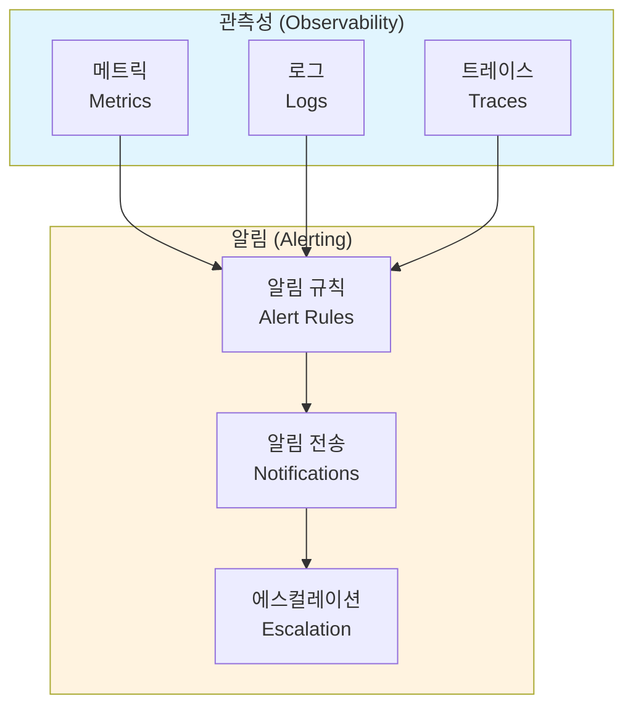
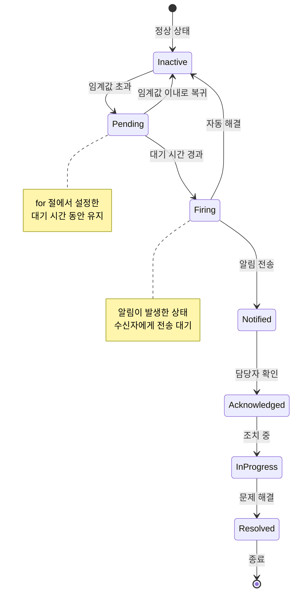
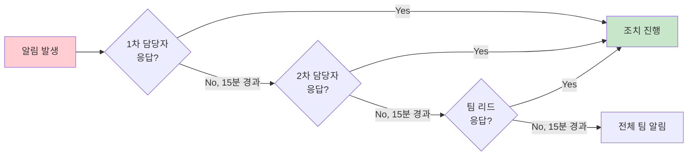
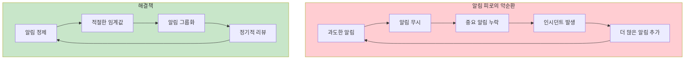
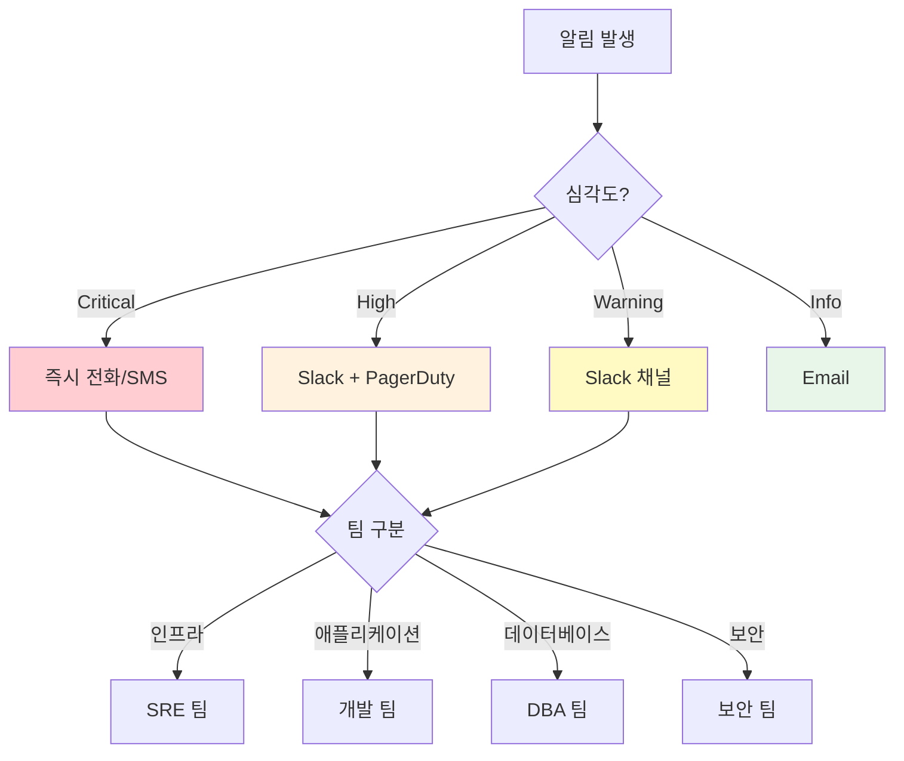
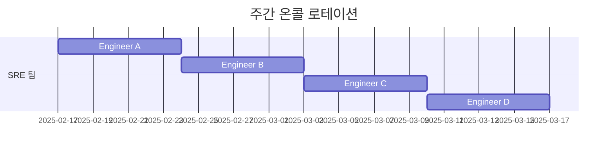
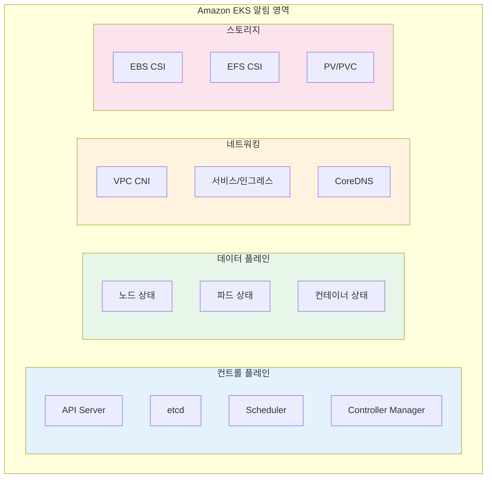
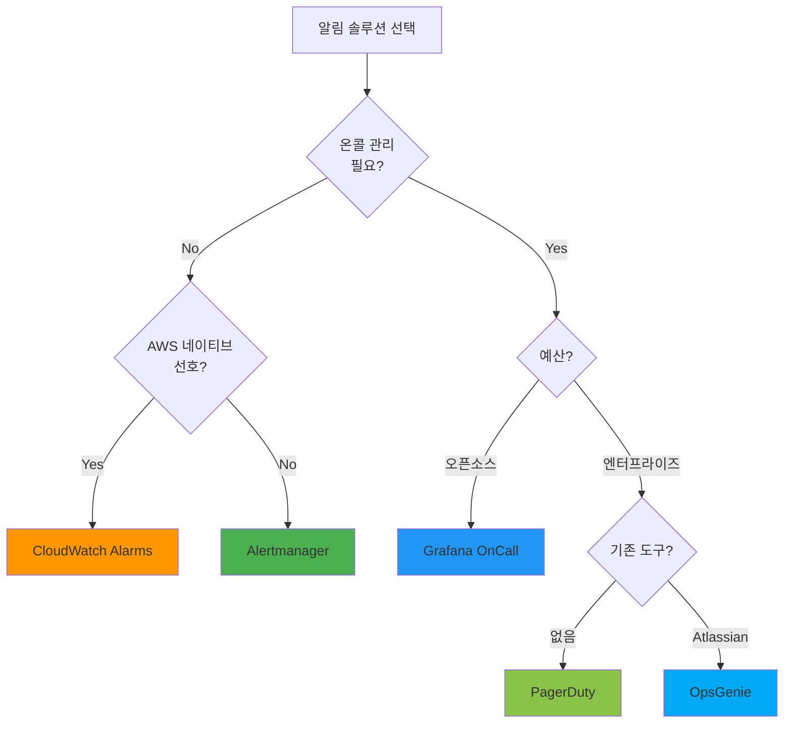
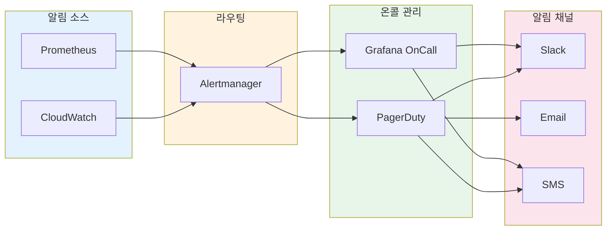

# 알림 개요

> **마지막 업데이트**: 2025년 2월

## 목차

- [알림의 역할과 중요성](#알림의-역할과-중요성)
- [알림 생명주기](#알림-생명주기)
- [알림 설계 원칙](#알림-설계-원칙)
- [알림 라우팅과 에스컬레이션](#알림-라우팅과-에스컬레이션)
- [온콜 로테이션](#온콜-로테이션)
- [EKS 환경에서의 알림 전략](#eks-환경에서의-알림-전략)
- [솔루션 비교](#솔루션-비교)

---

## 알림의 역할과 중요성

### 관측성 3대 축에서 알림의 위치

현대적인 관측성(Observability)은 세 가지 핵심 축으로 구성됩니다:



- **메트릭(Metrics)**: 시스템의 정량적 상태 (CPU, 메모리, 요청 수 등)
- **로그(Logs)**: 이벤트의 상세한 기록
- **트레이스(Traces)**: 분산 시스템에서의 요청 흐름

**알림(Alerting)**은 이 세 가지 데이터 소스를 기반으로 이상 상태를 감지하고, 적시에 담당자에게 통보하여 신속한 대응을 가능하게 합니다.

### 알림이 필요한 이유

1. **선제적 문제 대응**: 사용자가 불편을 느끼기 전에 문제를 인지
2. **다운타임 최소화**: 빠른 감지와 대응으로 서비스 가용성 향상
3. **비용 절감**: 자동화된 모니터링으로 인력 비용 감소
4. **SLA/SLO 준수**: 서비스 수준 목표 달성을 위한 필수 요소
5. **인시던트 기록**: 문제 발생 이력 추적 및 분석

### 좋은 알림 vs 나쁜 알림

| 구분 | 좋은 알림 | 나쁜 알림 |
|------|-----------|-----------|
| **실행 가능성** | 즉각적인 조치가 필요함 | 정보 제공만, 조치 불필요 |
| **명확성** | 무엇이 문제인지 명확함 | 모호하고 불명확함 |
| **긴급도** | 심각도에 맞는 긴급도 | 모든 것이 긴급 |
| **빈도** | 적절한 빈도 | 너무 자주 또는 너무 드물게 |
| **중복** | 관련 알림 그룹화 | 동일 문제에 수십 개 알림 |

---

## 알림 생명주기

알림은 다음과 같은 생명주기를 거칩니다:



### 1. Detection (감지)

- **임계값 기반**: 특정 값이 설정된 임계값을 초과할 때
- **변화율 기반**: 값의 변화 속도가 비정상적일 때
- **이상 탐지**: 기계 학습 기반 비정상 패턴 감지
- **로그 패턴**: 특정 로그 패턴 발생 시

```yaml
# Prometheus 알림 규칙 예시
groups:
  - name: node-alerts
    rules:
      - alert: HighCPUUsage
        expr: 100 - (avg by(instance) (irate(node_cpu_seconds_total{mode="idle"}[5m])) * 100) > 80
        for: 5m  # 5분 동안 지속 시 알림 발생
        labels:
          severity: warning
        annotations:
          summary: "High CPU usage detected"
          description: "CPU usage is above 80% for 5 minutes on {{ $labels.instance }}"
```

### 2. Notification (알림)

- **채널 선택**: Slack, Email, SMS, PagerDuty 등
- **라우팅**: 알림 유형에 따라 적절한 수신자에게 전달
- **그룹화**: 관련 알림을 묶어서 전송
- **중복 제거**: 동일 알림 반복 전송 방지

### 3. Escalation (에스컬레이션)

- **시간 기반**: 일정 시간 내 응답 없으면 다음 담당자에게 전달
- **심각도 기반**: 심각도에 따라 다른 에스컬레이션 경로
- **자동 에스컬레이션**: 정해진 규칙에 따라 자동 상위 보고



### 4. Resolution (해결)

- **수동 해결**: 담당자가 문제 해결 후 알림 종료
- **자동 해결**: 메트릭이 정상 범위로 돌아오면 자동 종료
- **해결 알림**: 문제 해결 시 해결 알림 전송

---

## 알림 설계 원칙

### 1. Actionable Alerts (실행 가능한 알림)

모든 알림은 수신자가 즉각적인 조치를 취할 수 있어야 합니다.

**잘못된 예:**
```
Alert: Database connection count increased
```

**올바른 예:**
```
Alert: Database connection pool exhausted
Action Required: Scale up database or investigate connection leaks
Runbook: https://wiki.company.com/db-connection-exhausted
```

### 2. Alert Fatigue 방지 (알림 피로 방지)

너무 많은 알림은 오히려 중요한 알림을 놓치게 만듭니다.



**알림 피로 방지 전략:**

1. **임계값 조정**: 너무 민감하지 않게 설정
2. **알림 그룹화**: 관련 알림을 하나로 묶음
3. **억제(Inhibition)**: 상위 알림 발생 시 하위 알림 억제
4. **정기적 리뷰**: 불필요한 알림 제거
5. **점진적 도입**: 새 알림은 먼저 낮은 심각도로 시작

### 3. Severity Levels (심각도 수준)

일관된 심각도 체계를 정의하고 준수합니다:

| 심각도 | 설명 | 대응 시간 | 예시 |
|--------|------|-----------|------|
| **Critical** | 서비스 완전 장애 | 즉시 (5분 이내) | 전체 서비스 다운, 데이터 손실 위험 |
| **High** | 주요 기능 장애 | 15분 이내 | 결제 시스템 오류, 로그인 불가 |
| **Warning** | 잠재적 문제 | 1시간 이내 | 디스크 80% 사용, 응답 지연 증가 |
| **Info** | 정보성 알림 | 업무 시간 내 | 배포 완료, 백업 성공 |

```yaml
# 심각도별 알림 규칙 예시
groups:
  - name: disk-alerts
    rules:
      - alert: DiskSpaceCritical
        expr: (node_filesystem_avail_bytes / node_filesystem_size_bytes) * 100 < 5
        for: 5m
        labels:
          severity: critical
        annotations:
          summary: "Disk space critical"

      - alert: DiskSpaceWarning
        expr: (node_filesystem_avail_bytes / node_filesystem_size_bytes) * 100 < 20
        for: 10m
        labels:
          severity: warning
        annotations:
          summary: "Disk space low"
```

### 4. 알림 문서화

모든 알림에는 다음 정보가 포함되어야 합니다:

- **설명**: 알림이 무엇을 의미하는지
- **영향**: 이 문제가 서비스에 미치는 영향
- **조치 방법**: 문제 해결을 위한 단계별 가이드
- **런북 링크**: 상세한 대응 절차 문서

```yaml
annotations:
  summary: "High memory usage on {{ $labels.instance }}"
  description: |
    Memory usage is above 90% on {{ $labels.instance }}.
    Current value: {{ $value | printf "%.2f" }}%
  impact: "Application may experience OOM kills and service degradation"
  action: |
    1. Check for memory leaks: kubectl top pods -n {{ $labels.namespace }}
    2. Review recent deployments
    3. Consider scaling horizontally
  runbook_url: "https://wiki.company.com/runbooks/high-memory"
```

---

## 알림 라우팅과 에스컬레이션

### 라우팅 전략

알림은 다양한 기준에 따라 적절한 수신자에게 전달되어야 합니다:



### 라우팅 트리 설계

```yaml
# Alertmanager 라우팅 설정 예시
route:
  receiver: 'default-receiver'
  group_by: ['alertname', 'cluster', 'service']
  group_wait: 30s
  group_interval: 5m
  repeat_interval: 4h

  routes:
    # Critical 알림 - 즉시 전화
    - match:
        severity: critical
      receiver: 'pagerduty-critical'
      continue: true

    # 인프라 팀 알림
    - match_re:
        alertname: ^(Node|Disk|CPU|Memory).*
      receiver: 'sre-team'
      routes:
        - match:
            severity: critical
          receiver: 'sre-oncall'

    # 애플리케이션 팀 알림
    - match_re:
        namespace: ^(app|api|web).*
      receiver: 'dev-team'

    # 데이터베이스 알림
    - match_re:
        alertname: ^(MySQL|PostgreSQL|Redis|MongoDB).*
      receiver: 'dba-team'
```

### 에스컬레이션 정책

시간 기반 에스컬레이션 정책을 설정하여 알림이 무시되지 않도록 합니다:

| 단계 | 시간 | 대상 | 채널 |
|------|------|------|------|
| 1 | 0분 | 1차 온콜 담당자 | Slack, PagerDuty |
| 2 | 15분 | 2차 온콜 담당자 | Slack, PagerDuty, SMS |
| 3 | 30분 | 팀 리드 | Slack, PagerDuty, 전화 |
| 4 | 45분 | 엔지니어링 매니저 | 전화 |
| 5 | 60분 | CTO/VP Engineering | 전화 |

---

## 온콜 로테이션

### 온콜의 개념

온콜(On-Call)은 지정된 기간 동안 시스템 문제에 대응할 책임을 가진 담당자를 의미합니다.



### 온콜 모범 사례

1. **명확한 교대 일정**: 주간 또는 격주 로테이션
2. **핸드오프 프로세스**: 교대 시 진행 중인 이슈 인계
3. **백업 담당자**: 1차 담당자가 응답 불가 시 대비
4. **적절한 보상**: 온콜 수당 또는 대체 휴무
5. **번아웃 방지**: 적절한 로테이션 주기

### 온콜 도구 요구사항

- **스케줄 관리**: 달력 통합, 교대 관리
- **오버라이드**: 임시 담당자 변경
- **에스컬레이션**: 자동 상위 보고
- **모바일 지원**: 언제 어디서나 알림 수신
- **보고서**: 온콜 활동 분석

---

## EKS 환경에서의 알림 전략

### EKS 특화 알림 영역



### 계층별 알림 전략

#### 1. 클러스터 수준 알림

```yaml
# 클러스터 수준 알림 예시
groups:
  - name: eks-cluster
    rules:
      - alert: EKSAPIServerDown
        expr: up{job="kubernetes-apiservers"} == 0
        for: 1m
        labels:
          severity: critical
        annotations:
          summary: "EKS API Server is down"

      - alert: EKSNodeNotReady
        expr: kube_node_status_condition{condition="Ready",status="true"} == 0
        for: 5m
        labels:
          severity: critical
        annotations:
          summary: "Node {{ $labels.node }} is not ready"

      - alert: EKSClusterAutoscalerError
        expr: cluster_autoscaler_errors_total > 0
        for: 5m
        labels:
          severity: warning
        annotations:
          summary: "Cluster Autoscaler is experiencing errors"
```

#### 2. 워크로드 수준 알림

```yaml
# 워크로드 수준 알림 예시
groups:
  - name: eks-workloads
    rules:
      - alert: PodCrashLooping
        expr: rate(kube_pod_container_status_restarts_total[15m]) * 60 * 15 > 3
        for: 5m
        labels:
          severity: warning
        annotations:
          summary: "Pod {{ $labels.pod }} is crash looping"

      - alert: PodNotReady
        expr: |
          sum by (namespace, pod) (
            kube_pod_status_phase{phase=~"Pending|Unknown"}
          ) > 0
        for: 15m
        labels:
          severity: warning
        annotations:
          summary: "Pod {{ $labels.pod }} has been pending for 15 minutes"

      - alert: DeploymentReplicasMismatch
        expr: |
          kube_deployment_spec_replicas != kube_deployment_status_replicas_available
        for: 10m
        labels:
          severity: warning
        annotations:
          summary: "Deployment {{ $labels.deployment }} has replica mismatch"
```

#### 3. 리소스 수준 알림

```yaml
# 리소스 수준 알림 예시
groups:
  - name: eks-resources
    rules:
      - alert: ContainerCPUThrottling
        expr: |
          rate(container_cpu_cfs_throttled_seconds_total[5m]) > 0.25
        for: 5m
        labels:
          severity: warning
        annotations:
          summary: "Container {{ $labels.container }} is being CPU throttled"

      - alert: ContainerMemoryNearLimit
        expr: |
          (container_memory_working_set_bytes / container_spec_memory_limit_bytes) > 0.9
        for: 5m
        labels:
          severity: warning
        annotations:
          summary: "Container {{ $labels.container }} memory usage is near limit"

      - alert: PVCAlmostFull
        expr: |
          (kubelet_volume_stats_used_bytes / kubelet_volume_stats_capacity_bytes) > 0.85
        for: 5m
        labels:
          severity: warning
        annotations:
          summary: "PVC {{ $labels.persistentvolumeclaim }} is almost full"
```

### AWS 서비스 통합 알림

EKS는 다양한 AWS 서비스와 통합되므로, 이에 대한 알림도 필요합니다:

| AWS 서비스 | 모니터링 항목 | 알림 도구 |
|------------|---------------|-----------|
| EKS Control Plane | API Server 가용성, 인증 오류 | CloudWatch |
| EC2 (노드) | 인스턴스 상태, 시스템 검사 | CloudWatch |
| EBS | 볼륨 상태, IOPS 사용량 | CloudWatch |
| EFS | 처리량, 연결 수 | CloudWatch |
| ALB/NLB | 요청 수, 오류율, 지연시간 | CloudWatch |
| VPC | 네트워크 트래픽, NAT 게이트웨이 | CloudWatch/VPC Flow Logs |

---

## 솔루션 비교

### 주요 알림 솔루션 비교표

| 기능 | Alertmanager | CloudWatch Alarms | Grafana OnCall | PagerDuty | OpsGenie |
|------|--------------|-------------------|----------------|-----------|----------|
| **유형** | 오픈소스 | AWS 네이티브 | 오픈소스/SaaS | SaaS | SaaS |
| **비용** | 무료 | 알림 수 기반 과금 | 무료/유료 | 유료 | 유료 |
| **EKS 통합** | Prometheus 연동 | 네이티브 | Alertmanager 연동 | 다양한 연동 | 다양한 연동 |
| **온콜 관리** | 없음 | 없음 | 있음 | 있음 | 있음 |
| **에스컬레이션** | 기본 | 없음 | 있음 | 고급 | 고급 |
| **모바일 앱** | 없음 | 없음 | 있음 | 있음 | 있음 |
| **ChatOps** | Webhook | SNS | Slack, Teams | 다양함 | 다양함 |
| **복잡도** | 중간 | 낮음 | 중간 | 낮음 | 낮음 |

### 솔루션 선택 가이드



#### 상황별 권장 솔루션

1. **소규모 팀, 비용 중시**: Alertmanager + Slack
2. **AWS 올인 환경**: CloudWatch Alarms + SNS + Lambda
3. **중간 규모, 온콜 필요**: Grafana OnCall
4. **대규모 조직, 복잡한 에스컬레이션**: PagerDuty
5. **Atlassian 생태계 사용**: OpsGenie

### 하이브리드 접근법

대부분의 프로덕션 환경에서는 여러 솔루션을 조합하여 사용합니다:



**권장 아키텍처:**

1. **Prometheus + Alertmanager**: 메트릭 수집 및 1차 알림 처리
2. **CloudWatch**: AWS 서비스 메트릭 수집
3. **Grafana OnCall 또는 PagerDuty**: 온콜 관리 및 에스컬레이션
4. **Slack**: 실시간 알림 및 협업

---

## 다음 단계

이 섹션에서는 알림의 기본 개념과 전략에 대해 알아보았습니다. 각 솔루션에 대한 상세한 구성 방법은 다음 문서를 참고하세요:

- [Prometheus Alertmanager](./01-alertmanager.md): 오픈소스 알림 관리
- [CloudWatch Alarms](./02-cloudwatch-alarms.md): AWS 네이티브 알림
- [Grafana OnCall](./03-grafana-oncall.md): 온콜 및 인시던트 관리

---

## 참고 자료

- [Prometheus Alerting Best Practices](https://prometheus.io/docs/practices/alerting/)
- [Google SRE Book - Practical Alerting](https://sre.google/sre-book/practical-alerting/)
- [AWS CloudWatch Alarms Documentation](https://docs.aws.amazon.com/AmazonCloudWatch/latest/monitoring/AlarmThatSendsEmail.html)
- [Grafana OnCall Documentation](https://grafana.com/docs/oncall/latest/)
- [PagerDuty Operations Guide](https://www.pagerduty.com/resources/operations/)
