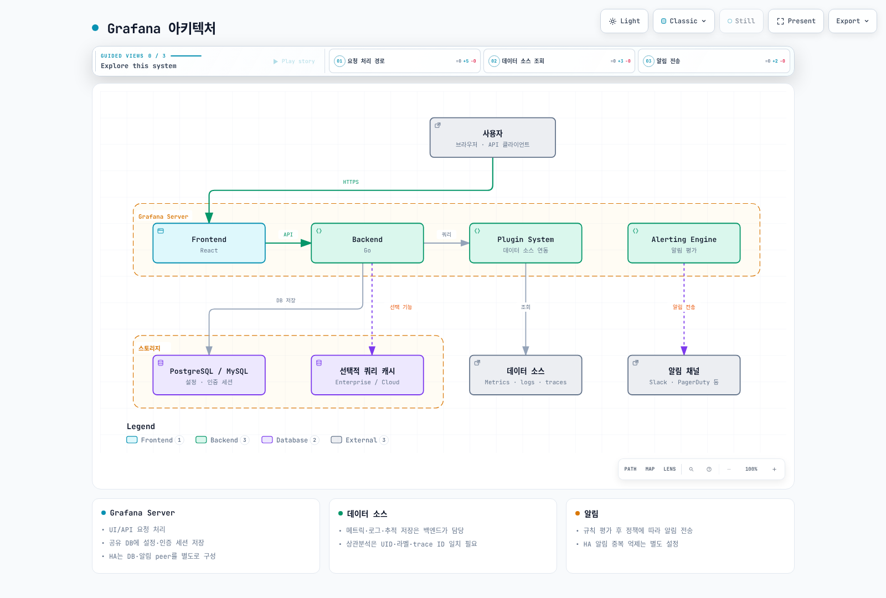

# Grafana 대시보드


> **지원 버전**: Grafana 13.2.1 · Community Helm chart 13.2.2

> **마지막 업데이트**: 2026년 9월 13일

## 소개

Grafana는 Prometheus·Loki·Tempo·CloudWatch 같은 데이터 소스를 조회하고 대시보드와 알림을 제공합니다. Grafana의 메타데이터 DB와 메트릭·로그·추적 저장소는 역할이 다릅니다. 이 장의 [실행 예제](https://github.com/Atom-oh/kubernetes-docs/tree/main/examples/observability/grafana)는 기존 데이터 소스에 연결하는 단일 클러스터 구성입니다. 백엔드 설치는 [관측성 실습](../../labs/observability/02-observability-stack-lab.md)을 참고합니다.

<span id="주요-특징"></span>

## 아키텍처



[🔍 인터랙티브 다이어그램 보기](https://www.atomai.click/kubernetes-docs/archmaps/ko-observability-grafana-readme-0.html)

| 경로 | 저장하거나 처리하는 내용 |
|---|---|
| Grafana DB | 사용자, 대시보드, 설정, 인증 세션; HA에서는 공유 PostgreSQL/MySQL |
| 데이터 소스 | 메트릭·로그·추적의 실제 조회 및 보존 |
| Grafana Alerting | 규칙 평가와 알림 라우팅; 서버 HA와 별도로 알림 중복 억제 구성 |
| 선택적 쿼리 캐시 | Enterprise/Cloud의 지원 기능; Redis를 필수 세션 저장소로 사용하지 않음 |

## Helm 배포

<span id="설치-실행"></span>

### 기본 설치

예제는 **복제본 1개 + SQLite + RWO PVC + Recreate**입니다. `gp3` StorageClass와 CSI 드라이버가 필요하며, 업그레이드 중 중단이 있을 수 있습니다. 고가용성 구성은 뒤에서 분리합니다. chart는 community 저장소를 사용하고 이미지 버전과 digest를 고정합니다.

먼저 저장소를 checkout하고 `endpoints.yaml`의 세 URL을 **실제 Service와 포트**에 맞춥니다. Tempo 3.x 예제의 HTTP API는 3200이며 OTLP 수신 포트와 다릅니다. 기본 URL은 설명용 서비스 이름으로, 백엔드를 생성하지 않습니다. 실습 백엔드가 mTLS를 요구하면 동일한 CA·클라이언트 인증서 설정을 데이터 소스에 적용해야 합니다. HTTP만으로 우회할 수 없습니다.

다음은 새 설치용입니다. 기존 Secret을 덮어쓰거나 재생성하지 말고 조직의 자격 증명 갱신 절차를 사용합니다. 생성된 개인 디렉터리의 암호 파일을 로컬에서 읽어 로그인하고, 값을 터미널 로그·Git·Helm values에 넣지 않습니다.

```bash
helm repo add grafana-community https://grafana-community.github.io/helm-charts
helm repo update grafana-community
kubectl create namespace monitoring --dry-run=client -o yaml | kubectl apply -f -
cd examples/observability/grafana

umask 077
GRAFANA_STATE=$(mktemp -d "$PWD/.grafana-private.XXXXXX")
printf '%s' admin > "$GRAFANA_STATE/admin-user"
python3 -c 'import secrets; print(secrets.token_hex(24), end="")' > "$GRAFANA_STATE/admin-password"
python3 -c 'import secrets; print(secrets.token_hex(32), end="")' > "$GRAFANA_STATE/secret-key"
python3 -c 'import secrets; print(secrets.token_hex(24), end="")' > "$GRAFANA_STATE/metrics-password"
kubectl -n monitoring create secret generic grafana-admin-credentials \
  --from-file=admin-user="$GRAFANA_STATE/admin-user" \
  --from-file=admin-password="$GRAFANA_STATE/admin-password"
kubectl -n monitoring create secret generic grafana-runtime \
  --from-file=secret-key="$GRAFANA_STATE/secret-key" \
  --from-file=metrics-password="$GRAFANA_STATE/metrics-password"

kubectl apply -f endpoints.yaml
kubectl -n monitoring create configmap grafana-datasources --from-file=datasources.yaml
kubectl -n monitoring create configmap grafana-alerts --from-file=alerts.yaml
kubectl -n monitoring create configmap grafana-docs-dashboards --from-file=dashboard.json
helm upgrade --install grafana grafana-community/grafana --version 13.2.2 \
  --namespace monitoring --values values.yaml --wait
kubectl -n monitoring port-forward service/grafana 3000:80 --address 127.0.0.1
```

`http://localhost:3000`으로 접속합니다. 기본 Service는 ClusterIP이며 이 명령은 로컬 루프백에만 포워딩합니다. 대외 공개가 필요하면 인증, TLS, 승인된 네트워크 경로와 접근 정책을 먼저 구성합니다.

### values.yaml 구성

```yaml
replicas: 1
deploymentStrategy:
  type: Recreate
persistence:
  enabled: true
  type: pvc
  storageClassName: gp3
  size: 10Gi
  accessModes:
  - ReadWriteOnce
admin:
  existingSecret: grafana-admin-credentials
  userKey: admin-user
  passwordKey: admin-password
serviceAccount:
  create: true
  name: grafana
  automountServiceAccountToken: false
```

전체 파일은 Secret 마운트, 고정 데이터 소스 UID, 대시보드 파일, 비활성 상태의 알림을 함께 연결합니다. 파일 마운트 방식에서는 ConfigMap 변경 후 Pod를 순차 재시작하여 프로비저닝을 다시 읽게 합니다. `--reuse-values`로 과거 설정을 숨겨서 유지하지 말고 적용할 values 파일을 명시합니다.

### 고가용성 구성

`values-ha.yaml`은 복제본 2개, PVC 비활성화, 외부 PostgreSQL, `verify-full` 인증서 검증, headless Service와 Alerting gossip 설정을 추가합니다. DB 자체의 HA·백업·복구는 별도로 준비합니다. SQLite 파일 하나를 여러 Pod가 공유하는 구성은 사용하지 않습니다.

공유 DB 이름/사용자는 예제에서 `grafana`입니다. `grafana-database` Secret에 `host`(인증서와 일치하는 DNS:5432), `password`, `ca.crt`를 준비하고 두 Pod에 같은 `grafana-runtime/secret-key`를 마운트합니다. 실제 HTTPS 외부 주소로 `root_url`을 바꾸고 TLS 종단을 구성합니다. 기존 SQLite에서 전환할 때는 별도 데이터 이전·복구 검증이 필요합니다. DB 유형을 바꾸는 것만으로 데이터가 이전되지 않습니다.

```bash
helm upgrade --install grafana grafana-community/grafana --version 13.2.2 \
  -n monitoring -f values.yaml -f values-ha.yaml --wait
```

`grafana` 릴리스와 `monitoring` namespace를 기준으로 peer DNS가 고정되어 있습니다. 이름을 변경하면 함께 수정합니다. Pod 사이 TCP/UDP 9094, DNS, DB, 필요한 백엔드만 허용하는 네트워크 정책을 구성합니다. Grafana DB가 인증 세션을 공유하므로 로그인 유지에 Redis 세션 저장소나 sticky session이 필수는 아닙니다.

Alerting HA는 별도 peer 연결과 중복 억제가 필요합니다. 기본값에서는 각 노드의 규칙 평가 부하도 고려합니다. 13.2.1에는 `ha_single_node_evaluation` 옵션이 있지만 이 예제는 기본값을 유지합니다. 네트워크 분리 상황까지 정확히 한 번 알림을 보장하지 않습니다. 로컬 검증은 단일 Grafana 프로세스에서 수행했으며 이 HA 프로필의 DB 장애 전환을 실행한 것은 아닙니다.

## 데이터 소스 연동

<span id="configmap을-통한-데이터-소스-프로비저닝"></span>

### 파일 프로비저닝과 UID

`datasources.yaml`은 Prometheus=`prometheus`, Loki=`loki`, Tempo=`tempo` UID를 고정합니다. 대시보드·알림·상관분석 링크도 같은 UID를 참조해야 합니다. URL에는 환경 변수 치환을 사용하지만, 환경 변수만 설정한다고 데이터 소스 객체가 생성되지는 않습니다.

```yaml
apiVersion: 1
datasources:
- name: Prometheus
  type: prometheus
  uid: prometheus
  url: $PROMETHEUS_URL
  access: proxy
  isDefault: true
  editable: false
  jsonData:
    httpMethod: POST
    exemplarTraceIdDestinations:
    - name: trace_id
      datasourceUid: tempo
- name: Loki
  type: loki
  uid: loki
  url: $LOKI_URL
  access: proxy
  editable: false
  jsonData:
    derivedFields:
    - name: TraceID
      matcherRegex: '"trace_id"\s*:\s*"([a-f0-9]{32})"'
      url: $${__value.raw}
      datasourceUid: tempo
- name: Tempo
  type: tempo
  uid: tempo
  url: $TEMPO_URL
  access: proxy
  editable: false
  jsonData:
    tracesToLogsV2:
      datasourceUid: loki
      tags:
      - key: service.name
        value: service_name
      spanStartTimeShift: -5m
      spanEndTimeShift: 5m
      customQuery: true
      query: '{$${__tags}} | json | trace_id="$${__span.traceId}"'
    tracesToMetrics:
      datasourceUid: prometheus
      tags:
      - key: service.name
        value: service
      queries:
      - name: Request rate
        query: sum(rate(lab_http_requests_total{$${__tags}}[5m]))
    serviceMap:
      datasourceUid: prometheus
    nodeGraph:
      enabled: true
```

이 연결은 실습 애플리케이션의 `service.name`, Loki의 `service_name`, 메트릭의 `service`, JSON 로그의 `trace_id` 계약을 사용합니다. 다른 수집 파이프라인은 실제 라벨에 맞춰 수정합니다. `$${...}`는 파일 프로비저닝 단계의 치환을 피하여 Grafana 링크 매크로 `${...}`를 보존합니다. `${__tags}` 자체가 `service="..."` 형태의 matcher를 만들므로 다시 `service="${__tags}"`로 감싸면 안 됩니다.

Exemplar는 모든 요청의 추적을 담는 기능이 아니라 메트릭 표본에서 추적으로 이동하는 연결입니다. exporter·Prometheus의 exemplar 수집 및 trace 보존 기간이 맞아야 합니다. `serviceMap`은 Tempo metrics-generator의 service graph 지표를 Prometheus에 저장했을 때 의미 있는 데이터를 표시합니다. UID만 지정해도 service graph가 자동 생성되지는 않습니다.

### CloudWatch IRSA 설정

CloudWatch를 추가할 때는 Grafana ServiceAccount에 승인된 IRSA role을 연결하고 OIDC trust의 namespace/ServiceAccount와 `aud`를 제한합니다. IRSA token projection과 Pod에서의 SDK credential 획득을 확인합니다. 데이터 소스의 `authType: default`는 이 자격 증명 체인을 사용합니다. 같은 role ARN을 `assumeRoleArn`에 다시 넣는 설정은 필요하지 않습니다. 다른 role로 전환할 때만 양쪽 trust와 `sts:AssumeRole` 권한을 준비합니다.

Metrics 조회에 필요한 `cloudwatch:ListMetrics`, `cloudwatch:GetMetricData`부터 시작하고, Logs·EC2·tag·X-Ray 기능을 쓸 때 해당 권한을 별도로 추가합니다. ARN 제한을 지원하지 않는 조회 action의 `Resource: "*"`에는 가능한 Region 조건을 적용하고, Logs 조회 범위는 실제 log group으로 제한합니다. 모든 AWS 조회 권한을 하나의 무조건 wildcard statement에 넣지 않습니다. 이 장의 기본 예제는 CloudWatch 자격 증명이나 AWS 리소스를 생성하지 않습니다.

<span id="use-method-utilization-saturation-errors"></span>

<span id="red-method-rate-errors-duration"></span>

<span id="_4-golden-signals"></span>

## 대시보드 설계 패턴

`dashboard.json`은 완전한 JSON이며 8개 패널을 제공합니다. 애플리케이션 메트릭은 [MSA 실습](../../labs/observability/03-msa-deployment-lab.md)의 `lab_http_*`를 사용합니다. 노드 패널은 node-exporter, CrashLoop 패널은 kube-state-metrics가 필요합니다.

| 방법 | 관찰 대상 | 해석 시 주의점 |
|---|---|---|
| RED: Rate, Errors, Duration | 요청률, 5xx 비율, histogram p99 | 요청이 0이거나 수집이 없을 때 성공률 100%로 만들지 않음 |
| USE: Utilization, Saturation, Errors | CPU·메모리 사용률, 디스크 대기 압력, 네트워크 오류 | weighted I/O time은 디스크 오류 횟수가 아님 |
| Four Golden Signals | Latency, Traffic, Errors, Saturation | Availability는 중요한 별도 SLI이며 이 네 항목의 이름은 아님 |

오류 시계열이 아직 생성되지 않았지만 요청은 있는 경우에만 0을 보충합니다.

```promql
((sum by (service) (rate(lab_http_requests_total{status=~"5.."}[5m])) or 0 * sum by (service) (rate(lab_http_requests_total[5m]))) / (sum by (service) (rate(lab_http_requests_total[5m])) > 0)) * 100
```

요청 분모가 0인 경우 결과를 숨기며, 수집 부재와 무트래픽은 별도 패널/알림으로 구분합니다. `rate(node_disk_io_time_weighted_seconds_total[5m])`는 평균적인 I/O 대기 압력 지표이고 `increase(...)`를 디스크 오류 수로 해석하면 안 됩니다. `node_load1`은 runnable 작업과 I/O 대기 등의 영향을 받아 CPU 포화도만을 뜻하지 않습니다.

<span id="_2-변수-활용"></span>

현재 대시보드는 한 클러스터를 가정합니다. 중앙 저장소에서 여러 클러스터를 합치면 `cluster` 외부 라벨을 일관되게 넣고 selector·grouping·join에 함께 사용합니다. Pod metric join은 적어도 namespace와 pod를 함께 맞춥니다. `cluster`/`namespace` 변수는 실제 라벨이 있을 때 추가하고, multi/all 선택에는 regex matcher와 `${variable:regex}` escaping을 사용합니다. 변수와 폴더는 데이터 소스 접근을 제한하는 보안 경계가 아닙니다.

## 대시보드 프로비저닝

### Sidecar

기본 예제는 파일 마운트라 Kubernetes API token/RBAC가 필요 없습니다. 동적 ConfigMap 감시가 필요할 때 `values-sidecar.yaml`을 함께 적용합니다. 이 선택 프로필은 `monitoring` namespace의 ConfigMap만 읽는 Role을 만들고 `grafana_dashboard: "true"`를 선택합니다. label/labelValue는 운영자가 정하는 계약으로, Grafana에 항상 고정된 값은 아닙니다. 같은 namespace에서 그 라벨의 ConfigMap을 작성할 수 있는 사람은 Grafana 콘텐츠도 변경할 수 있습니다.

차트의 기본 namespaced Role도 Secret 조회를 포함하므로, `sidecar-role.yaml`의 ConfigMap 전용 Role을 먼저 만들고 `useExistingRole`로 연결합니다.

```bash
kubectl apply -f sidecar-role.yaml
helm upgrade grafana grafana-community/grafana --version 13.2.2 \
  -n monitoring -f values.yaml -f values-sidecar.yaml
```

이 프로필은 기존 파일 provider와 다른 `Sidecar` 폴더를 사용합니다. datasource/alert sidecar는 꺼져 있습니다. `searchNamespace: ALL`과 광범위한 Secret 조회를 기본값처럼 복사하지 않습니다. 읽기 전용 provider의 UI 수정은 원본 파일을 갱신해야 유지됩니다.

### Grafana Operator 사용

Operator를 선택하면 먼저 해당 버전의 controller와 CRD를 설치하고, `Grafana` 인스턴스 및 `GrafanaDashboard`/`GrafanaDatasource` selector를 연결합니다. 별도 Helm 인스턴스와 Operator가 같은 리소스를 동시에 소유하지 않게 합니다. 이 장은 Helm 파일 프로비저닝을 검증했으며 Operator 배포 예제라고 주장하지 않습니다. JSON의 `panels: [...]` 같은 생략 표기는 적용 가능한 manifest가 아닙니다. 필요한 대시보드 내용은 이 장의 완전한 `dashboard.json`을 사용합니다.

<span id="알림-규칙-구성"></span>

## 알림 규칙 (Grafana Alerting)

13.2.1에서는 `[unified_alerting]`을 사용합니다. 제거된 legacy `[alerting]` 설정을 함께 켜지 않습니다. 예제는 A=CPU range query → B=last reduce → C=>80 threshold로 라벨을 유지합니다. `classic_conditions`는 다차원 알림의 라벨 유지 목적에 맞지 않습니다.

```yaml
apiVersion: 1
groups:
- orgId: 1
  name: grafana-docs
  folder: Observability
  interval: 1m
  rules:
  - uid: docs-high-cpu
    title: Sustained CPU usage
    condition: C
    data:
    - refId: A
      relativeTimeRange:
        from: 300
        to: 0
      datasourceUid: prometheus
      model:
        refId: A
        expr: 100 * (1 - avg by (instance) (rate(node_cpu_seconds_total{mode="idle"}[5m])))
        instant: false
        range: true
        intervalMs: 15000
        maxDataPoints: 43200
    - refId: B
      relativeTimeRange:
        from: 0
        to: 0
      datasourceUid: __expr__
      model:
        refId: B
        type: reduce
        expression: A
        reducer: last
    - refId: C
      relativeTimeRange:
        from: 0
        to: 0
      datasourceUid: __expr__
      model:
        refId: C
        type: threshold
        expression: B
        conditions:
        - type: query
          evaluator:
            type: gt
            params:
            - 80
          operator:
            type: and
          query:
            params:
            - C
          reducer:
            type: last
            params: []
    noDataState: NoData
    execErrState: Error
    for: 5m
    isPaused: true
    annotations:
      summary: High CPU on {{ $labels.instance }}
    labels:
      severity: warning
```

이 규칙은 **paused 상태로 설치**됩니다. 실제 데이터, 평가 결과, notification policy와 연락처를 확인한 뒤 pause를 해제합니다. `for: 5m`은 조건 유지 시간이고 `interval: 1m`은 평가 주기입니다. NoData와 Error를 정상으로 숨기지 않습니다. 반복 재시작 수가 많다는 것과 현재 `CrashLoopBackOff` 상태는 다르므로, 후자는 waiting reason metric으로 판정합니다.

<span id="알림-연락처-구성"></span>

Slack/PagerDuty 연락처는 공식 provisioning schema에 따라 Secret에서 읽은 값을 사용합니다. 존재하지 않는 `slack.title` 같은 template을 참조하지 말고 기본 template 또는 명시적으로 정의한 template을 연결합니다. 연락처 생성만으로 라우팅이 완성되지 않으며 notification policy에 receiver를 연결해야 합니다. 실제 테스트 알림은 승인된 수신처에서 실행합니다. 이 감사에서는 외부 알림을 전송하지 않았습니다.

### Grafana 자체 메트릭

`/metrics`에는 별도 basic auth가 설정되어 있습니다. Prometheus Operator를 설치하고 실제 ServiceMonitor selector에 `release` 라벨을 맞춘 뒤 다음 프로필을 사용합니다. password는 Grafana에 마운트한 것과 동일합니다.

```bash
printf '%s' metrics > "$GRAFANA_STATE/metrics-user"
kubectl -n monitoring create secret generic grafana-metrics-auth \
  --from-file=username="$GRAFANA_STATE/metrics-user" \
  --from-file=password="$GRAFANA_STATE/metrics-password"
helm upgrade grafana grafana-community/grafana --version 13.2.2 \
  -n monitoring -f values.yaml -f values-metrics.yaml
```

## 인증과 접근 제어

HTTPS 외부 주소, IdP redirect URI(`/login/generic_oauth`), 실제 endpoint/JWKS, group claim을 확인한 뒤 다음 INI 조각을 chart의 `grafana.ini.auth.generic_oauth`에 대응시킵니다. OAuth Secret 파일 마운트도 별도로 추가해야 합니다. 그대로 적용 가능한 IdP 설정은 아닙니다.

```ini
[auth.generic_oauth]
enabled = true
name = Organization SSO
client_id = $__file{/run/grafana-oauth/client-id}
client_secret = $__file{/run/grafana-oauth/client-secret}
scopes = openid profile email groups
auth_url = https://sso.example.com/authorize
token_url = https://sso.example.com/token
api_url = https://sso.example.com/userinfo
use_pkce = true
validate_id_token = true
jwk_set_url = https://sso.example.com/actual-jwks-endpoint
role_attribute_strict = true
allow_assign_grafana_admin = false
role_attribute_path = contains(groups[*], 'grafana-admins') && 'Admin' || contains(groups[*], 'grafana-viewers') && 'Viewer'
allow_sign_up = true
```

`Admin`은 조직 관리자이고 `GrafanaAdmin` 서버 관리자와 다릅니다. 매핑되지 않은 그룹은 strict role 검사로 거절하고 PKCE 및 ID token signature 검증을 사용합니다. 실제 SSO 로그인과 그룹 변경/회수 시나리오는 운영 환경에서 검증합니다. Viewer도 같은 조직의 데이터 소스에 임의 쿼리를 보낼 수 있으므로 대시보드 폴더 권한만으로 원천 데이터 접근이 제한된다고 가정하면 안 됩니다.

## Grafana Cloud vs Self-hosted 비교

| 항목 | Self-hosted OSS | Grafana Cloud |
|---|---|---|
| 운영 | DB·업그레이드·백업·용량을 직접 관리 | 관리형 서비스; 계약과 사용 한도 확인 |
| 가용성 | 직접 설계·검증 | SLA는 실제 요금제·서비스 계약 확인 |
| 데이터 소스별 권한·쿼리 캐시 | OSS 기본 기능으로 가정하지 않음 | 지원 기능 및 요금제 확인 |
| 데이터 위치 | 직접 선택한 저장소/환경 | 실제 stack Region·보존·처리 조건 확인 |
| 플러그인 | 호환성·서명·배포 방식 확인 | 지원 catalog/stack 정책 확인 |

<span id="grafana-cloud-연결-hybrid"></span>

Cloud의 Prometheus/Loki URL과 username은 해당 stack의 Connections에서 가져옵니다. 두 서비스가 같은 ID라는 가정이나 임의의 Region URL을 복사하지 않습니다. 토큰은 필요한 `metrics:read`/`logs:read` 범위의 Cloud Access Policy로 발급하고 `secureJsonData.basicAuthPassword`에 Secret을 통해 공급합니다. Grafana 서비스 계정 토큰과 Cloud 데이터 접근 토큰을 혼동하지 않습니다.

<span id="_1-대시보드-구조화"></span>

## Best Practices

Overview → Infrastructure → Kubernetes → Applications → Alerts처럼 목적별로 정리하고, 패널에 단위와 데이터 없음을 표시합니다. 쿼리 범위·빈도·카디널리티를 먼저 줄이고 반복 계산은 recording rule로 옮깁니다. 과거 Angular 기반 piechart/worldmap 플러그인 대신 내장 Pie chart/Geomap 패널을 사용합니다. 추가 플러그인은 호환되는 버전을 고정하고 모든 HA 노드에 동일하게 공급합니다.

<span id="_3-성능-최적화"></span>

`[dashboards] min_refresh_interval = 10s`는 브라우저의 최소 새로고침 간격이지 알림 평가 주기가 아닙니다. 연결 풀은 DB 허용 연결 수와 Grafana 복제본 수를 함께 고려합니다. Enterprise/Cloud의 쿼리 캐시를 OSS용 `[caching] enabled/ttl` 조각으로 보장하지 않습니다.

## 검증 범위와 참고 문서

현재 chart의 단일/HA/메트릭/sidecar 네 프로필을 렌더링하고, 실제 Grafana 13.2.1에서 데이터 소스·대시보드·paused 알림·표현식 모델·메트릭 인증을 확인했습니다. 표현식은 합성 Prometheus 응답을 사용했습니다. EKS 설치, 실제 데이터 소스 TLS, HA DB 장애 전환, SSO/IRSA, 외부 알림 전달을 실행한 것은 아닙니다.

- [Grafana HA](https://grafana.com/docs/grafana/latest/setup-grafana/set-up-for-high-availability/)
- [Grafana 13.2.1 configuration defaults](https://github.com/grafana/grafana/blob/v13.2.1/conf/defaults.ini)
- [Community Helm chart](https://github.com/grafana-community/helm-charts/tree/main/charts/grafana)
- [Alerting file provisioning](https://grafana.com/docs/grafana/latest/alerting/set-up/provision-alerting-resources/file-provisioning/)
- [Generic OAuth](https://grafana.com/docs/grafana/latest/setup-grafana/configure-access/configure-authentication/generic-oauth/)
- [Data source permissions and caching](https://grafana.com/docs/grafana/latest/administration/data-source-management/)
- [Tempo provisioning](https://grafana.com/docs/grafana/latest/datasources/tempo/configure-tempo-data-source/provision/)
- [Loki configuration](https://grafana.com/docs/grafana/latest/datasources/loki/configure/)

## 퀴즈

[Grafana 퀴즈](../../quizzes/observability/grafana/grafana-quiz.md)에서 구성과 운영상의 차이를 확인하세요.
