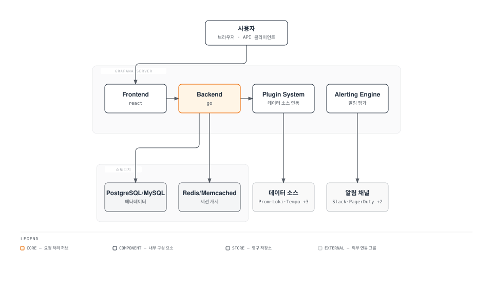

# Grafana 대시보드

> **지원 버전**: Grafana 11.x
> **마지막 업데이트**: 2026년 2월 20일

## 소개

Grafana는 메트릭, 로그, 추적 데이터를 시각화하고 분석하기 위한 오픈소스 플랫폼입니다. 다양한 데이터 소스를 통합하여 단일 대시보드에서 전체 시스템의 상태를 모니터링할 수 있습니다.

## 주요 특징

| 특징 | 설명 |
|-----|------|
| **다양한 데이터 소스** | Prometheus, Loki, Tempo, CloudWatch 등 지원 |
| **풍부한 시각화** | 그래프, 히트맵, 테이블, Stat 패널 등 |
| **알림 기능** | 조건 기반 알림 및 다양한 알림 채널 |
| **대시보드 템플릿** | 재사용 가능한 대시보드와 패널 |
| **플러그인 생태계** | 확장 가능한 플러그인 아키텍처 |
| **팀 협업** | 폴더, 권한, 팀 기능 |

## 아키텍처



## Helm 배포

### 기본 설치

```bash
# Helm 저장소 추가
helm repo add grafana https://grafana.github.io/helm-charts
helm repo update

# 네임스페이스 생성
kubectl create namespace monitoring
```

### values.yaml 구성

```yaml
# grafana-values.yaml
replicas: 2

image:
  repository: grafana/grafana
  tag: 11.0.0

# 관리자 자격 증명
adminUser: admin
adminPassword: ""  # 자동 생성, Secret에서 관리

# 기존 Secret 사용
admin:
  existingSecret: grafana-admin-credentials
  userKey: admin-user
  passwordKey: admin-password

# 서비스 설정
service:
  type: ClusterIP
  port: 80

# Ingress 설정
ingress:
  enabled: true
  ingressClassName: alb
  annotations:
    alb.ingress.kubernetes.io/scheme: internet-facing
    alb.ingress.kubernetes.io/target-type: ip
    alb.ingress.kubernetes.io/certificate-arn: arn:aws:acm:ap-northeast-2:123456789012:certificate/xxx
    alb.ingress.kubernetes.io/listen-ports: '[{"HTTPS":443}]'
    alb.ingress.kubernetes.io/ssl-redirect: '443'
  hosts:
    - grafana.example.com
  tls:
    - hosts:
        - grafana.example.com

# 영구 스토리지
persistence:
  enabled: true
  type: pvc
  storageClassName: gp3
  size: 10Gi
  accessModes:
    - ReadWriteOnce

# 리소스 설정
resources:
  requests:
    cpu: 200m
    memory: 256Mi
  limits:
    cpu: 1000m
    memory: 1Gi

# 환경 변수
envFromSecrets:
  - name: grafana-env-secrets
    optional: true

# Grafana 설정
grafana.ini:
  server:
    domain: grafana.example.com
    root_url: https://grafana.example.com

  database:
    type: postgres
    host: postgres.monitoring.svc.cluster.local:5432
    name: grafana
    user: grafana
    ssl_mode: require

  session:
    provider: redis
    provider_config: addr=redis.monitoring.svc.cluster.local:6379,pool_size=100,db=0

  security:
    admin_user: admin
    secret_key: $__env{GF_SECURITY_SECRET_KEY}
    cookie_secure: true
    strict_transport_security: true

  users:
    allow_sign_up: false
    auto_assign_org: true
    auto_assign_org_role: Viewer

  auth:
    disable_login_form: false

  auth.generic_oauth:
    enabled: true
    name: SSO
    allow_sign_up: true
    client_id: $__env{OAUTH_CLIENT_ID}
    client_secret: $__env{OAUTH_CLIENT_SECRET}
    scopes: openid profile email
    auth_url: https://sso.example.com/oauth/authorize
    token_url: https://sso.example.com/oauth/token
    api_url: https://sso.example.com/oauth/userinfo
    role_attribute_path: contains(groups[*], 'admin') && 'Admin' || contains(groups[*], 'editor') && 'Editor' || 'Viewer'

  alerting:
    enabled: true
    execute_alerts: true
    evaluation_timeout: 60s
    notification_timeout: 30s
    max_attempts: 3

  unified_alerting:
    enabled: true
    min_interval: 10s

  analytics:
    reporting_enabled: false
    check_for_updates: false

  log:
    mode: console
    level: info

  metrics:
    enabled: true
    basic_auth_username: metrics
    basic_auth_password: $__env{GF_METRICS_PASSWORD}

# 사이드카 설정 (대시보드/데이터소스 프로비저닝)
sidecar:
  dashboards:
    enabled: true
    label: grafana_dashboard
    labelValue: "true"
    searchNamespace: ALL
    folderAnnotation: grafana_folder
    provider:
      foldersFromFilesStructure: true
  datasources:
    enabled: true
    label: grafana_datasource
    labelValue: "true"
    searchNamespace: ALL
  alerts:
    enabled: true
    label: grafana_alert
    searchNamespace: ALL

# 플러그인 설치
plugins:
  - grafana-piechart-panel
  - grafana-worldmap-panel
  - grafana-clock-panel
  - grafana-polystat-panel
  - yesoreyeram-infinity-datasource

# ServiceMonitor (Prometheus Operator)
serviceMonitor:
  enabled: true
  interval: 30s
  labels:
    release: prometheus

# PodDisruptionBudget
podDisruptionBudget:
  minAvailable: 1

# 안티-어피니티
affinity:
  podAntiAffinity:
    preferredDuringSchedulingIgnoredDuringExecution:
      - weight: 100
        podAffinityTerm:
          labelSelector:
            matchLabels:
              app.kubernetes.io/name: grafana
          topologyKey: kubernetes.io/hostname

# 토폴로지 분산
topologySpreadConstraints:
  - maxSkew: 1
    topologyKey: topology.kubernetes.io/zone
    whenUnsatisfiable: ScheduleAnyway
    labelSelector:
      matchLabels:
        app.kubernetes.io/name: grafana
```

### 설치 실행

```bash
# 설치
helm upgrade --install grafana grafana/grafana \
  --namespace monitoring \
  --values grafana-values.yaml \
  --wait

# 확인
kubectl get pods -n monitoring -l app.kubernetes.io/name=grafana
kubectl get svc -n monitoring -l app.kubernetes.io/name=grafana
```

## 데이터 소스 연동

### ConfigMap을 통한 데이터 소스 프로비저닝

```yaml
# grafana-datasources.yaml
apiVersion: v1
kind: ConfigMap
metadata:
  name: grafana-datasources
  namespace: monitoring
  labels:
    grafana_datasource: "true"
data:
  datasources.yaml: |-
    apiVersion: 1
    deleteDatasources:
      - name: Old-Prometheus
        orgId: 1

    datasources:
      # Prometheus
      - name: Prometheus
        type: prometheus
        uid: prometheus
        url: http://prometheus-operated.monitoring.svc.cluster.local:9090
        access: proxy
        isDefault: true
        jsonData:
          httpMethod: POST
          manageAlerts: true
          prometheusType: Prometheus
          prometheusVersion: 2.47.0
          exemplarTraceIdDestinations:
            - name: traceID
              datasourceUid: tempo
              urlDisplayLabel: "View Trace"
        editable: false

      # VictoriaMetrics
      - name: VictoriaMetrics
        type: prometheus
        uid: victoriametrics
        url: http://vmsingle.monitoring.svc.cluster.local:8428
        access: proxy
        jsonData:
          httpMethod: POST

      # Loki
      - name: Loki
        type: loki
        uid: loki
        url: http://loki-gateway.loki.svc.cluster.local
        access: proxy
        jsonData:
          maxLines: 1000
          derivedFields:
            - name: TraceID
              matcherRegex: '"traceId":"([a-f0-9]+)"'
              url: '$${__value.raw}'
              datasourceUid: tempo
              urlDisplayLabel: "View Trace"
            - name: trace_id
              matcherRegex: 'trace_id=([a-f0-9]+)'
              url: '$${__value.raw}'
              datasourceUid: tempo
              urlDisplayLabel: "View Trace"

      # Tempo
      - name: Tempo
        type: tempo
        uid: tempo
        url: http://tempo-query-frontend.tempo.svc.cluster.local:3100
        access: proxy
        jsonData:
          httpMethod: GET
          tracesToLogs:
            datasourceUid: loki
            tags: ['job', 'namespace', 'pod']
            mappedTags:
              - key: service.name
                value: app
            mapTagNamesEnabled: true
            spanStartTimeShift: '-1h'
            spanEndTimeShift: '1h'
            filterByTraceID: true
            filterBySpanID: true
          tracesToMetrics:
            datasourceUid: prometheus
            tags:
              - key: service.name
                value: service
            queries:
              - name: 'Request Rate'
                query: 'sum(rate(http_requests_total{service="$${__tags}"}[5m]))'
              - name: 'Error Rate'
                query: 'sum(rate(http_requests_total{service="$${__tags}",status=~"5.."}[5m]))'
          serviceMap:
            datasourceUid: prometheus
          nodeGraph:
            enabled: true
          search:
            hide: false
          lokiSearch:
            datasourceUid: loki

      # CloudWatch
      - name: CloudWatch
        type: cloudwatch
        uid: cloudwatch
        jsonData:
          authType: default
          defaultRegion: ap-northeast-2
          assumeRoleArn: arn:aws:iam::123456789012:role/grafana-cloudwatch-role
```

### CloudWatch IRSA 설정

```yaml
# grafana-serviceaccount.yaml
apiVersion: v1
kind: ServiceAccount
metadata:
  name: grafana
  namespace: monitoring
  annotations:
    eks.amazonaws.com/role-arn: arn:aws:iam::123456789012:role/grafana-cloudwatch-role
---
# IAM Policy
# {
#   "Version": "2012-10-17",
#   "Statement": [
#     {
#       "Effect": "Allow",
#       "Action": [
#         "cloudwatch:DescribeAlarmsForMetric",
#         "cloudwatch:DescribeAlarmHistory",
#         "cloudwatch:DescribeAlarms",
#         "cloudwatch:ListMetrics",
#         "cloudwatch:GetMetricData",
#         "cloudwatch:GetInsightRuleReport",
#         "logs:DescribeLogGroups",
#         "logs:GetLogGroupFields",
#         "logs:StartQuery",
#         "logs:StopQuery",
#         "logs:GetQueryResults",
#         "logs:GetLogEvents",
#         "ec2:DescribeTags",
#         "ec2:DescribeInstances",
#         "ec2:DescribeRegions",
#         "tag:GetResources",
#         "xray:GetTraceSummaries",
#         "xray:BatchGetTraces",
#         "xray:GetServiceGraph",
#         "xray:GetTimeSeriesServiceStatistics"
#       ],
#       "Resource": "*"
#     }
#   ]
# }
```

## 대시보드 설계 패턴

### USE Method (Utilization, Saturation, Errors)

시스템 리소스 분석을 위한 방법론:

```yaml
# use-method-dashboard.yaml
apiVersion: v1
kind: ConfigMap
metadata:
  name: use-method-dashboard
  namespace: monitoring
  labels:
    grafana_dashboard: "true"
  annotations:
    grafana_folder: "System"
data:
  use-method.json: |-
    {
      "title": "USE Method - System Resources",
      "uid": "use-method",
      "panels": [
        {
          "title": "CPU Utilization",
          "type": "timeseries",
          "gridPos": {"h": 8, "w": 8, "x": 0, "y": 0},
          "targets": [
            {
              "expr": "100 - (avg by(instance) (rate(node_cpu_seconds_total{mode=\"idle\"}[5m])) * 100)",
              "legendFormat": "{{instance}}"
            }
          ]
        },
        {
          "title": "CPU Saturation (Load Average)",
          "type": "timeseries",
          "gridPos": {"h": 8, "w": 8, "x": 8, "y": 0},
          "targets": [
            {
              "expr": "node_load1 / count without(cpu, mode) (node_cpu_seconds_total{mode=\"idle\"})",
              "legendFormat": "{{instance}}"
            }
          ]
        },
        {
          "title": "Memory Utilization",
          "type": "timeseries",
          "gridPos": {"h": 8, "w": 8, "x": 0, "y": 8},
          "targets": [
            {
              "expr": "(1 - (node_memory_MemAvailable_bytes / node_memory_MemTotal_bytes)) * 100",
              "legendFormat": "{{instance}}"
            }
          ]
        },
        {
          "title": "Memory Saturation (Swap)",
          "type": "timeseries",
          "gridPos": {"h": 8, "w": 8, "x": 8, "y": 8},
          "targets": [
            {
              "expr": "rate(node_vmstat_pswpin[5m]) + rate(node_vmstat_pswpout[5m])",
              "legendFormat": "{{instance}}"
            }
          ]
        },
        {
          "title": "Disk Utilization",
          "type": "timeseries",
          "gridPos": {"h": 8, "w": 8, "x": 0, "y": 16},
          "targets": [
            {
              "expr": "rate(node_disk_io_time_seconds_total[5m]) * 100",
              "legendFormat": "{{instance}} - {{device}}"
            }
          ]
        },
        {
          "title": "Disk Errors",
          "type": "stat",
          "gridPos": {"h": 8, "w": 8, "x": 16, "y": 0},
          "targets": [
            {
              "expr": "increase(node_disk_io_time_weighted_seconds_total[1h])",
              "legendFormat": "{{instance}}"
            }
          ]
        }
      ]
    }
```

### RED Method (Rate, Errors, Duration)

서비스 요청 분석을 위한 방법론:

```yaml
# red-method-dashboard.yaml
apiVersion: v1
kind: ConfigMap
metadata:
  name: red-method-dashboard
  namespace: monitoring
  labels:
    grafana_dashboard: "true"
  annotations:
    grafana_folder: "Services"
data:
  red-method.json: |-
    {
      "title": "RED Method - Service Metrics",
      "uid": "red-method",
      "templating": {
        "list": [
          {
            "name": "service",
            "type": "query",
            "query": "label_values(http_requests_total, service)",
            "refresh": 2
          }
        ]
      },
      "panels": [
        {
          "title": "Request Rate",
          "type": "timeseries",
          "gridPos": {"h": 8, "w": 8, "x": 0, "y": 0},
          "targets": [
            {
              "expr": "sum(rate(http_requests_total{service=\"$service\"}[5m])) by (method, path)",
              "legendFormat": "{{method}} {{path}}"
            }
          ]
        },
        {
          "title": "Error Rate",
          "type": "timeseries",
          "gridPos": {"h": 8, "w": 8, "x": 8, "y": 0},
          "targets": [
            {
              "expr": "sum(rate(http_requests_total{service=\"$service\", status=~\"5..\"}[5m])) / sum(rate(http_requests_total{service=\"$service\"}[5m])) * 100",
              "legendFormat": "Error %"
            }
          ],
          "fieldConfig": {
            "defaults": {
              "unit": "percent",
              "thresholds": {
                "mode": "absolute",
                "steps": [
                  {"color": "green", "value": null},
                  {"color": "yellow", "value": 1},
                  {"color": "red", "value": 5}
                ]
              }
            }
          }
        },
        {
          "title": "Request Duration (p50, p90, p99)",
          "type": "timeseries",
          "gridPos": {"h": 8, "w": 8, "x": 16, "y": 0},
          "targets": [
            {
              "expr": "histogram_quantile(0.50, sum(rate(http_request_duration_seconds_bucket{service=\"$service\"}[5m])) by (le))",
              "legendFormat": "p50"
            },
            {
              "expr": "histogram_quantile(0.90, sum(rate(http_request_duration_seconds_bucket{service=\"$service\"}[5m])) by (le))",
              "legendFormat": "p90"
            },
            {
              "expr": "histogram_quantile(0.99, sum(rate(http_request_duration_seconds_bucket{service=\"$service\"}[5m])) by (le))",
              "legendFormat": "p99"
            }
          ],
          "fieldConfig": {
            "defaults": {
              "unit": "s"
            }
          }
        }
      ]
    }
```

### 4 Golden Signals

Google SRE 핸드북의 핵심 메트릭:

```yaml
# golden-signals-dashboard.yaml
apiVersion: v1
kind: ConfigMap
metadata:
  name: golden-signals-dashboard
  namespace: monitoring
  labels:
    grafana_dashboard: "true"
  annotations:
    grafana_folder: "SRE"
data:
  golden-signals.json: |-
    {
      "title": "4 Golden Signals",
      "uid": "golden-signals",
      "panels": [
        {
          "title": "1. Latency - Request Duration",
          "type": "timeseries",
          "gridPos": {"h": 8, "w": 12, "x": 0, "y": 0},
          "targets": [
            {
              "expr": "histogram_quantile(0.99, sum(rate(http_request_duration_seconds_bucket[5m])) by (le, service))",
              "legendFormat": "{{service}} p99"
            }
          ],
          "fieldConfig": {
            "defaults": {"unit": "s"}
          }
        },
        {
          "title": "2. Traffic - Request Rate",
          "type": "timeseries",
          "gridPos": {"h": 8, "w": 12, "x": 12, "y": 0},
          "targets": [
            {
              "expr": "sum(rate(http_requests_total[5m])) by (service)",
              "legendFormat": "{{service}}"
            }
          ],
          "fieldConfig": {
            "defaults": {"unit": "reqps"}
          }
        },
        {
          "title": "3. Errors - Error Rate",
          "type": "timeseries",
          "gridPos": {"h": 8, "w": 12, "x": 0, "y": 8},
          "targets": [
            {
              "expr": "sum(rate(http_requests_total{status=~\"5..\"}[5m])) by (service) / sum(rate(http_requests_total[5m])) by (service) * 100",
              "legendFormat": "{{service}}"
            }
          ],
          "fieldConfig": {
            "defaults": {
              "unit": "percent",
              "thresholds": {
                "steps": [
                  {"color": "green", "value": null},
                  {"color": "yellow", "value": 0.1},
                  {"color": "red", "value": 1}
                ]
              }
            }
          }
        },
        {
          "title": "4. Saturation - Resource Usage",
          "type": "timeseries",
          "gridPos": {"h": 8, "w": 12, "x": 12, "y": 8},
          "targets": [
            {
              "expr": "sum(container_memory_working_set_bytes{container!=\"\"}) by (pod) / sum(kube_pod_container_resource_limits{resource=\"memory\"}) by (pod) * 100",
              "legendFormat": "{{pod}} Memory"
            },
            {
              "expr": "sum(rate(container_cpu_usage_seconds_total{container!=\"\"}[5m])) by (pod) / sum(kube_pod_container_resource_limits{resource=\"cpu\"}) by (pod) * 100",
              "legendFormat": "{{pod}} CPU"
            }
          ],
          "fieldConfig": {
            "defaults": {"unit": "percent"}
          }
        }
      ]
    }
```

## 대시보드 프로비저닝

### Grafana Operator 사용

```yaml
# grafana-operator-dashboard.yaml
apiVersion: grafana.integreatly.org/v1beta1
kind: GrafanaDashboard
metadata:
  name: kubernetes-cluster
  namespace: monitoring
spec:
  instanceSelector:
    matchLabels:
      dashboards: "grafana"
  folder: "Kubernetes"
  json: |
    {
      "title": "Kubernetes Cluster Overview",
      "uid": "k8s-cluster",
      "panels": [...]
    }
---
apiVersion: grafana.integreatly.org/v1beta1
kind: GrafanaDatasource
metadata:
  name: prometheus
  namespace: monitoring
spec:
  instanceSelector:
    matchLabels:
      dashboards: "grafana"
  datasource:
    name: Prometheus
    type: prometheus
    url: http://prometheus:9090
    access: proxy
    isDefault: true
```

## 알림 규칙 (Grafana Alerting)

### 알림 규칙 구성

```yaml
# grafana-alerts.yaml
apiVersion: v1
kind: ConfigMap
metadata:
  name: grafana-alerts
  namespace: monitoring
  labels:
    grafana_alert: "true"
data:
  alerts.yaml: |-
    apiVersion: 1
    groups:
      - orgId: 1
        name: kubernetes-alerts
        folder: Alerts
        interval: 1m
        rules:
          - uid: high-cpu-usage
            title: High CPU Usage
            condition: C
            data:
              - refId: A
                relativeTimeRange:
                  from: 600
                  to: 0
                datasourceUid: prometheus
                model:
                  expr: |
                    100 - (avg by(instance) (rate(node_cpu_seconds_total{mode="idle"}[5m])) * 100)
                  instant: false
                  range: true
              - refId: B
                datasourceUid: __expr__
                model:
                  conditions:
                    - evaluator:
                        params: [80]
                        type: gt
                      operator:
                        type: and
                      query:
                        params: [A]
                      reducer:
                        type: avg
                  refId: B
                  type: classic_conditions
              - refId: C
                datasourceUid: __expr__
                model:
                  expression: B
                  type: threshold
            noDataState: NoData
            execErrState: Error
            for: 5m
            annotations:
              summary: "High CPU usage detected on {{ $labels.instance }}"
              description: "CPU usage is above 80% for more than 5 minutes."
            labels:
              severity: warning

          - uid: pod-crash-looping
            title: Pod CrashLooping
            condition: C
            data:
              - refId: A
                datasourceUid: prometheus
                model:
                  expr: |
                    increase(kube_pod_container_status_restarts_total[1h]) > 5
              - refId: C
                datasourceUid: __expr__
                model:
                  expression: A
                  type: threshold
            for: 0s
            annotations:
              summary: "Pod {{ $labels.pod }} is crash looping"
            labels:
              severity: critical
```

### 알림 연락처 구성

```yaml
# grafana-contact-points.yaml
apiVersion: v1
kind: ConfigMap
metadata:
  name: grafana-contact-points
  namespace: monitoring
  labels:
    grafana_alert: "true"
data:
  contact-points.yaml: |-
    apiVersion: 1
    contactPoints:
      - orgId: 1
        name: slack-alerts
        receivers:
          - uid: slack-receiver
            type: slack
            settings:
              url: ${SLACK_WEBHOOK_URL}
              recipient: "#alerts"
              username: Grafana
              icon_emoji: ":grafana:"
              title: |
                {{ template "slack.title" . }}
              text: |
                {{ template "slack.text" . }}

      - orgId: 1
        name: pagerduty-critical
        receivers:
          - uid: pagerduty-receiver
            type: pagerduty
            settings:
              integrationKey: ${PAGERDUTY_INTEGRATION_KEY}
              severity: critical
              class: monitoring
              component: kubernetes
```

## Grafana Cloud vs Self-hosted 비교

| 기능 | Self-hosted | Grafana Cloud |
|-----|-------------|---------------|
| **관리 오버헤드** | 높음 | 낮음 |
| **비용** | 인프라 비용 | 사용량 기반 |
| **확장성** | 수동 관리 | 자동 |
| **고가용성** | 직접 구성 | 기본 제공 |
| **플러그인** | 모든 플러그인 | 승인된 플러그인만 |
| **데이터 위치** | 내부 | 클라우드 |
| **커스터마이징** | 완전한 제어 | 제한적 |
| **SLA** | 없음 | 99.9% |

### Grafana Cloud 연결 (Hybrid)

```yaml
# Self-hosted Grafana에서 Grafana Cloud를 데이터 소스로 추가
datasources:
  - name: Grafana Cloud Prometheus
    type: prometheus
    url: https://prometheus-prod-01-prod-ap-northeast-0.grafana.net/api/prom
    access: proxy
    basicAuth: true
    basicAuthUser: <GRAFANA_CLOUD_INSTANCE_ID>
    secureJsonData:
      basicAuthPassword: <GRAFANA_CLOUD_API_KEY>

  - name: Grafana Cloud Logs
    type: loki
    url: https://logs-prod-ap-northeast-0.grafana.net
    access: proxy
    basicAuth: true
    basicAuthUser: <GRAFANA_CLOUD_INSTANCE_ID>
    secureJsonData:
      basicAuthPassword: <GRAFANA_CLOUD_API_KEY>
```

## Best Practices

### 1. 대시보드 구조화

```
Folders/
├── Overview/           # 전체 시스템 개요
│   ├── Executive Summary
│   └── SLO Dashboard
├── Infrastructure/     # 인프라 메트릭
│   ├── Nodes
│   ├── Storage
│   └── Network
├── Kubernetes/         # K8s 리소스
│   ├── Cluster
│   ├── Workloads
│   └── Networking
├── Applications/       # 애플리케이션별
│   ├── Service A
│   └── Service B
└── Alerts/            # 알림 관련
    ├── Active Alerts
    └── Alert History
```

### 2. 변수 활용

```json
{
  "templating": {
    "list": [
      {
        "name": "datasource",
        "type": "datasource",
        "query": "prometheus"
      },
      {
        "name": "cluster",
        "type": "query",
        "query": "label_values(kube_node_info, cluster)",
        "refresh": 2,
        "multi": true,
        "includeAll": true
      },
      {
        "name": "namespace",
        "type": "query",
        "query": "label_values(kube_namespace_labels{cluster=~\"$cluster\"}, namespace)",
        "refresh": 2
      }
    ]
  }
}
```

### 3. 성능 최적화

```yaml
# grafana.ini 성능 설정
[database]
max_idle_conn = 25
max_open_conn = 100
conn_max_lifetime = 14400

[dataproxy]
timeout = 30
keep_alive_seconds = 30

[dashboards]
min_refresh_interval = 10s

[caching]
enabled = true
ttl = 60s
```

## 퀴즈

이 장에서 배운 내용을 테스트하려면 [Grafana 퀴즈](../../quizzes/observability/grafana/grafana-quiz.md)를 풀어보세요.
