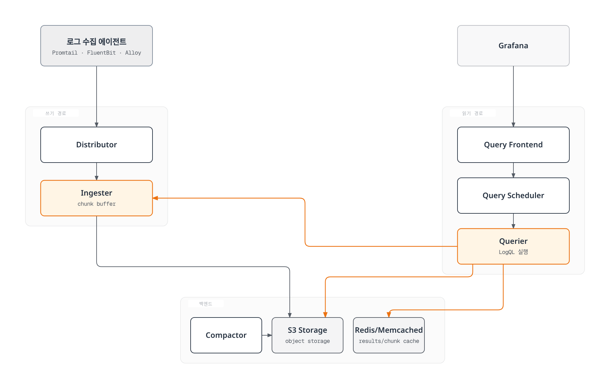
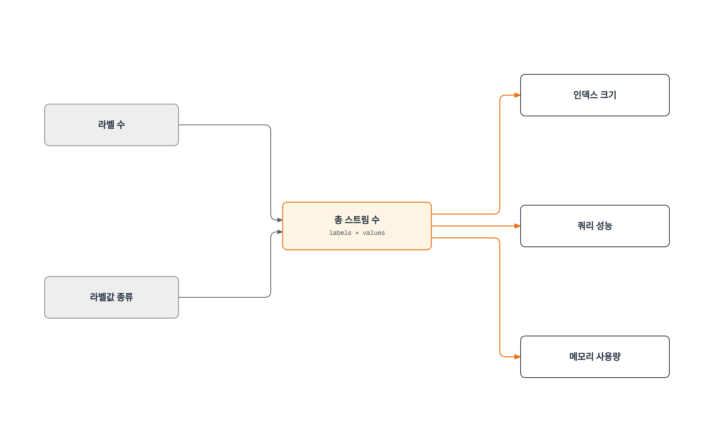

# Grafana Loki

> **지원 버전**: Loki 3.x
> **마지막 업데이트**: 2026년 2월 20일

Grafana Loki는 Prometheus에서 영감을 받은 수평적으로 확장 가능한 로그 집계 시스템입니다. 로그 콘텐츠를 인덱싱하지 않고 레이블만 인덱싱하여 비용 효율적인 로그 저장 및 쿼리를 제공합니다.

## 목차

1. [개요](#개요)
2. [아키텍처](#아키텍처)
3. [배포 모드](#배포-모드)
4. [Helm 설치](#helm-설치)
5. [S3 백엔드 구성](#s3-백엔드-구성)
6. [LogQL 쿼리](#logql-쿼리)
7. [라벨 설계](#라벨-설계)
8. [성능 튜닝](#성능-튜닝)
9. [보존 정책](#보존-정책)
10. [트러블슈팅](#트러블슈팅)

---

## 개요

### Loki의 핵심 철학

Loki는 "Prometheus처럼 로그를 다룬다"는 철학으로 설계되었습니다:

- **레이블 기반 인덱싱**: 로그 콘텐츠가 아닌 메타데이터(레이블)만 인덱싱
- **비용 효율성**: Elasticsearch 대비 10배 이상 저렴한 운영 비용
- **단순성**: 전문 검색 엔진의 복잡성 제거
- **Grafana 통합**: 로그, 메트릭, 추적 데이터의 통합 분석

### 주요 특징

| 특징 | 설명 |
|------|------|
| **수평 확장** | 각 컴포넌트를 독립적으로 확장 가능 |
| **멀티테넌시** | 테넌트별 데이터 격리 지원 |
| **객체 스토리지** | S3, GCS, Azure Blob 등 저렴한 스토리지 활용 |
| **LogQL** | PromQL 스타일의 직관적인 쿼리 언어 |
| **높은 가용성** | 복제 및 장애 복구 내장 |

### Loki vs Elasticsearch

| 항목 | Loki | Elasticsearch |
|------|------|---------------|
| 인덱싱 방식 | 레이블만 인덱싱 | 전체 텍스트 인덱싱 |
| 스토리지 비용 | 낮음 (객체 스토리지) | 높음 (SSD 권장) |
| 쿼리 복잡성 | 단순 (LogQL) | 복잡 (Lucene) |
| 전문 검색 | 제한적 | 우수 |
| 운영 복잡성 | 낮음 | 높음 |
| 메모리 요구량 | 낮음 | 높음 |
| Grafana 통합 | 네이티브 | 플러그인 |

---

## 아키텍처

### 컴포넌트 개요



### 컴포넌트 상세

#### 1. Distributor

클라이언트로부터 로그 스트림을 수신하는 첫 번째 컴포넌트입니다.

**역할:**
- 로그 스트림 유효성 검사
- 레이블 정규화
- 속도 제한 적용
- 일관된 해싱을 통한 Ingester 라우팅

```yaml
# Distributor 설정 예시
distributor:
  ring:
    kvstore:
      store: memberlist
  rate_limit_strategy: local
  rate_limit:
    enabled: true
    # 테넌트당 초당 최대 스트림 수
    ingestion_rate_limit_mb: 4
    ingestion_burst_size_mb: 6
```

#### 2. Ingester

로그 데이터를 메모리에 버퍼링하고 장기 스토리지에 기록합니다.

**역할:**
- 로그 데이터 청크 생성
- WAL (Write-Ahead Log) 관리
- 스토리지로 청크 플러시
- 실시간 쿼리 서빙

```yaml
# Ingester 설정 예시
ingester:
  lifecycler:
    ring:
      replication_factor: 3
      kvstore:
        store: memberlist
    heartbeat_period: 5s
  chunk_idle_period: 30m
  chunk_block_size: 262144
  chunk_retain_period: 1m
  max_transfer_retries: 0
  wal:
    enabled: true
    dir: /var/loki/wal
```

#### 3. Querier

LogQL 쿼리를 실행하고 결과를 반환합니다.

**역할:**
- Ingester에서 실시간 데이터 조회
- 장기 스토리지에서 과거 데이터 조회
- 결과 병합 및 중복 제거

```yaml
# Querier 설정 예시
querier:
  max_concurrent: 10
  query_timeout: 5m
  engine:
    timeout: 5m
    max_look_back_period: 30d
```

#### 4. Query Frontend

쿼리 최적화 및 캐싱을 담당합니다.

**역할:**
- 대용량 쿼리 분할
- 결과 캐싱
- 쿼리 대기열 관리
- 재시도 처리

```yaml
# Query Frontend 설정 예시
query_frontend:
  max_outstanding_per_tenant: 2048
  compress_responses: true
  log_queries_longer_than: 5s
  query_stats_enabled: true
```

#### 5. Compactor

저장된 데이터를 최적화합니다.

**역할:**
- 작은 청크들을 큰 청크로 병합
- 인덱스 최적화
- 보존 정책 적용 (데이터 삭제)

```yaml
# Compactor 설정 예시
compactor:
  working_directory: /var/loki/compactor
  shared_store: s3
  compaction_interval: 10m
  retention_enabled: true
  retention_delete_delay: 2h
  retention_delete_worker_count: 150
```

---

## 배포 모드

Loki는 세 가지 배포 모드를 제공합니다:

### 1. Monolithic 모드

모든 컴포넌트가 단일 프로세스에서 실행됩니다.

```yaml
# values-monolithic.yaml
deploymentMode: SingleBinary

singleBinary:
  replicas: 1
  resources:
    limits:
      cpu: 2
      memory: 4Gi
    requests:
      cpu: 1
      memory: 2Gi

loki:
  auth_enabled: false
  commonConfig:
    replication_factor: 1
```

**적합한 경우:**
- 개발/테스트 환경
- 일일 로그량 < 100GB
- 빠른 프로토타이핑

### 2. Simple Scalable 모드 (권장)

읽기/쓰기 경로를 분리하여 확장성을 제공합니다.

```yaml
# values-simple-scalable.yaml
deploymentMode: SimpleScalable

read:
  replicas: 3
  resources:
    limits:
      cpu: 2
      memory: 4Gi
    requests:
      cpu: 1
      memory: 2Gi

write:
  replicas: 3
  resources:
    limits:
      cpu: 2
      memory: 4Gi
    requests:
      cpu: 1
      memory: 2Gi

backend:
  replicas: 2
  resources:
    limits:
      cpu: 1
      memory: 2Gi
    requests:
      cpu: 500m
      memory: 1Gi
```

**적합한 경우:**
- 프로덕션 환경
- 일일 로그량 100GB ~ 10TB
- 대부분의 EKS 클러스터

### 3. Microservices 모드

각 컴포넌트를 독립적으로 배포합니다.

```yaml
# values-microservices.yaml
deploymentMode: Distributed

distributor:
  replicas: 3
  autoscaling:
    enabled: true
    minReplicas: 3
    maxReplicas: 10

ingester:
  replicas: 3
  autoscaling:
    enabled: true
    minReplicas: 3
    maxReplicas: 20
  persistence:
    enabled: true
    size: 50Gi

querier:
  replicas: 3
  autoscaling:
    enabled: true
    minReplicas: 3
    maxReplicas: 15

queryFrontend:
  replicas: 2
  autoscaling:
    enabled: true
    minReplicas: 2
    maxReplicas: 5

compactor:
  replicas: 1
```

**적합한 경우:**
- 대규모 프로덕션 환경
- 일일 로그량 > 10TB
- 컴포넌트별 세밀한 리소스 관리 필요

---

## Helm 설치

### 사전 준비

```bash
# Helm 레포지토리 추가
helm repo add grafana https://grafana.github.io/helm-charts
helm repo update

# 네임스페이스 생성
kubectl create namespace loki
```

### Simple Scalable 모드 설치 (EKS 권장)

```yaml
# values-eks-production.yaml
deploymentMode: SimpleScalable

loki:
  auth_enabled: false

  schemaConfig:
    configs:
      - from: "2024-01-01"
        store: tsdb
        object_store: s3
        schema: v13
        index:
          prefix: loki_index_
          period: 24h

  storage:
    type: s3
    bucketNames:
      chunks: my-loki-chunks
      ruler: my-loki-ruler
      admin: my-loki-admin
    s3:
      region: ap-northeast-2
      # IRSA 사용 시 endpoint는 자동 설정

  commonConfig:
    replication_factor: 3

  limits_config:
    retention_period: 744h  # 31일
    max_query_length: 721h
    max_query_parallelism: 32
    ingestion_rate_mb: 10
    ingestion_burst_size_mb: 20
    per_stream_rate_limit: 5MB
    per_stream_rate_limit_burst: 15MB

  rulerConfig:
    storage:
      type: s3
      s3:
        bucketnames: my-loki-ruler

# 읽기 경로
read:
  replicas: 3
  resources:
    limits:
      cpu: 2
      memory: 4Gi
    requests:
      cpu: 1
      memory: 2Gi
  affinity:
    podAntiAffinity:
      preferredDuringSchedulingIgnoredDuringExecution:
        - weight: 100
          podAffinityTerm:
            labelSelector:
              matchLabels:
                app.kubernetes.io/component: read
            topologyKey: topology.kubernetes.io/zone

# 쓰기 경로
write:
  replicas: 3
  resources:
    limits:
      cpu: 2
      memory: 4Gi
    requests:
      cpu: 1
      memory: 2Gi
  persistence:
    enabled: true
    size: 50Gi
    storageClass: gp3
  affinity:
    podAntiAffinity:
      preferredDuringSchedulingIgnoredDuringExecution:
        - weight: 100
          podAffinityTerm:
            labelSelector:
              matchLabels:
                app.kubernetes.io/component: write
            topologyKey: topology.kubernetes.io/zone

# 백엔드
backend:
  replicas: 2
  resources:
    limits:
      cpu: 1
      memory: 2Gi
    requests:
      cpu: 500m
      memory: 1Gi
  persistence:
    enabled: true
    size: 20Gi
    storageClass: gp3

# 게이트웨이
gateway:
  enabled: true
  replicas: 2
  resources:
    limits:
      cpu: 500m
      memory: 512Mi
    requests:
      cpu: 100m
      memory: 128Mi
  ingress:
    enabled: true
    ingressClassName: alb
    annotations:
      alb.ingress.kubernetes.io/scheme: internal
      alb.ingress.kubernetes.io/target-type: ip
    hosts:
      - host: loki.internal.example.com
        paths:
          - path: /
            pathType: Prefix

# 결과 캐싱
resultsCache:
  enabled: true
  defaultValidity: 12h
  # 외부 Redis 사용 권장 (프로덕션)
  # host: redis.example.com:6379

# 청크 캐싱
chunksCache:
  enabled: true
  defaultValidity: 12h

# 모니터링
monitoring:
  serviceMonitor:
    enabled: true
    labels:
      release: prometheus
  selfMonitoring:
    enabled: true
    grafanaAgent:
      installOperator: false

# 테스트 비활성화
test:
  enabled: false
```

### 설치 실행

```bash
# 설치
helm install loki grafana/loki \
  --namespace loki \
  --values values-eks-production.yaml \
  --version 6.x.x

# 업그레이드
helm upgrade loki grafana/loki \
  --namespace loki \
  --values values-eks-production.yaml

# 상태 확인
kubectl get pods -n loki
kubectl get svc -n loki
```

---

## S3 백엔드 구성

### IRSA (IAM Roles for Service Accounts) 설정

```bash
# 1. IAM 정책 생성
cat > loki-s3-policy.json << 'EOF'
{
  "Version": "2012-10-17",
  "Statement": [
    {
      "Effect": "Allow",
      "Action": [
        "s3:ListBucket",
        "s3:GetBucketLocation"
      ],
      "Resource": [
        "arn:aws:s3:::my-loki-chunks",
        "arn:aws:s3:::my-loki-ruler",
        "arn:aws:s3:::my-loki-admin"
      ]
    },
    {
      "Effect": "Allow",
      "Action": [
        "s3:PutObject",
        "s3:GetObject",
        "s3:DeleteObject"
      ],
      "Resource": [
        "arn:aws:s3:::my-loki-chunks/*",
        "arn:aws:s3:::my-loki-ruler/*",
        "arn:aws:s3:::my-loki-admin/*"
      ]
    }
  ]
}
EOF

aws iam create-policy \
  --policy-name LokiS3Policy \
  --policy-document file://loki-s3-policy.json

# 2. IRSA 설정
eksctl create iamserviceaccount \
  --cluster=my-cluster \
  --namespace=loki \
  --name=loki \
  --attach-policy-arn=arn:aws:iam::123456789012:policy/LokiS3Policy \
  --approve
```

### S3 버킷 생성 (Terraform)

```hcl
# s3.tf
resource "aws_s3_bucket" "loki_chunks" {
  bucket = "my-loki-chunks"

  tags = {
    Name        = "Loki Chunks"
    Environment = "production"
  }
}

resource "aws_s3_bucket" "loki_ruler" {
  bucket = "my-loki-ruler"

  tags = {
    Name        = "Loki Ruler"
    Environment = "production"
  }
}

resource "aws_s3_bucket_versioning" "loki_chunks" {
  bucket = aws_s3_bucket.loki_chunks.id
  versioning_configuration {
    status = "Disabled"
  }
}

resource "aws_s3_bucket_lifecycle_configuration" "loki_chunks" {
  bucket = aws_s3_bucket.loki_chunks.id

  rule {
    id     = "transition-to-ia"
    status = "Enabled"

    transition {
      days          = 30
      storage_class = "STANDARD_IA"
    }

    transition {
      days          = 90
      storage_class = "GLACIER"
    }

    expiration {
      days = 365
    }
  }
}

resource "aws_s3_bucket_server_side_encryption_configuration" "loki_chunks" {
  bucket = aws_s3_bucket.loki_chunks.id

  rule {
    apply_server_side_encryption_by_default {
      sse_algorithm = "AES256"
    }
  }
}

resource "aws_s3_bucket_public_access_block" "loki_chunks" {
  bucket = aws_s3_bucket.loki_chunks.id

  block_public_acls       = true
  block_public_policy     = true
  ignore_public_acls      = true
  restrict_public_buckets = true
}
```

### Loki 스토리지 설정

```yaml
# loki-config.yaml
storage_config:
  tsdb_shipper:
    active_index_directory: /var/loki/tsdb-index
    cache_location: /var/loki/tsdb-cache
    shared_store: s3

  aws:
    s3: s3://ap-northeast-2/my-loki-chunks
    bucketnames: my-loki-chunks
    region: ap-northeast-2
    # IRSA 사용 시 access_key_id, secret_access_key 불필요
    s3forcepathstyle: false
    insecure: false
    sse_encryption: true

  boltdb_shipper:
    active_index_directory: /var/loki/boltdb-index
    cache_location: /var/loki/boltdb-cache
    shared_store: s3
```

---

## LogQL 쿼리

### 기본 문법

LogQL은 두 가지 유형의 쿼리를 지원합니다:

1. **로그 쿼리**: 로그 라인을 반환
2. **메트릭 쿼리**: 로그에서 계산된 값을 반환

### 스트림 선택자

```logql
# 기본 스트림 선택
{namespace="production"}

# 여러 레이블 조합
{namespace="production", app="nginx"}

# 레이블 매칭 연산자
{namespace="production", app=~"nginx|apache"}  # 정규식 매칭
{namespace!="kube-system"}                      # 부정
{app!~"test.*"}                                 # 정규식 부정
```

### 라인 필터

```logql
# 포함
{app="nginx"} |= "error"

# 미포함
{app="nginx"} != "healthcheck"

# 정규식 매칭
{app="nginx"} |~ "status=[45][0-9]{2}"

# 정규식 미매칭
{app="nginx"} !~ "GET /health"

# 체이닝
{app="nginx"} |= "error" != "timeout" |~ "user_id=\\d+"
```

### 파서

```logql
# JSON 파서
{app="api"} | json

# 특정 필드만 추출
{app="api"} | json level, message, user_id

# Logfmt 파서
{app="api"} | logfmt

# 정규식 파서
{app="nginx"} | regexp `(?P<ip>[\d.]+) - - \[(?P<timestamp>[^\]]+)\]`

# Pattern 파서 (더 빠름)
{app="nginx"} | pattern `<ip> - - [<_>] "<method> <path> <_>" <status> <size>`

# Unpack (Promtail pack stage 결과)
{app="api"} | unpack
```

### 레이블 필터

```logql
# JSON 파싱 후 필터링
{app="api"} | json | level="error"

# 숫자 비교
{app="api"} | json | response_time > 1000

# 다중 조건
{app="api"} | json | level="error" and user_id!=""

# IP 필터링
{app="nginx"} | pattern `<ip> - -` | ip != "10.0.0.1"
```

### 라인 포맷

```logql
# 로그 라인 재구성
{app="api"} | json | line_format "{{.level}}: {{.message}}"

# 조건부 포맷
{app="api"} | json | line_format `{{ if eq .level "error" }}ERROR: {{ end }}{{.message}}`

# 템플릿 함수
{app="api"} | json | line_format `{{ .timestamp | toDate "2006-01-02T15:04:05Z07:00" | date "15:04:05" }}`
```

### 메트릭 쿼리

```logql
# 초당 로그 라인 수
rate({app="nginx"}[5m])

# 에러 비율
sum(rate({app="nginx"} |= "error" [5m])) / sum(rate({app="nginx"}[5m]))

# 응답 시간 백분위수
quantile_over_time(0.99,
  {app="api"} | json | unwrap response_time [5m]
) by (endpoint)

# 상위 10개 에러
topk(10, sum by (error_type) (
  count_over_time({app="api"} | json | level="error" [1h])
))

# 평균 응답 크기
avg_over_time(
  {app="nginx"} | pattern `<_> <_> <size>` | unwrap size [5m]
) by (path)

# 에러 수 집계
sum(count_over_time({namespace="production"} |= "error" [1h])) by (app)

# 없는 로그 감지 (absent)
absent_over_time({app="critical-service"}[5m])
```

### 실용적인 쿼리 예시

```logql
# Kubernetes 파드 재시작 원인 분석
{namespace="production"} |= "OOMKilled" or |= "CrashLoopBackOff"

# 느린 API 요청 찾기
{app="api"} | json | response_time > 5000 | line_format `{{.method}} {{.path}}: {{.response_time}}ms`

# 특정 사용자 활동 추적
{app="api"} | json | user_id="user-12345" | line_format `{{.timestamp}} {{.action}}`

# HTTP 5xx 에러 분석
{app="nginx"} | pattern `<_> "<method> <path> <_>" <status>` | status >= 500

# 시간대별 에러 패턴
sum by (hour) (
  count_over_time({app="api"} |= "error" [1h])
  | label_format hour="{{ __timestamp__ | date \"15\" }}"
)

# 배포 후 에러 급증 감지
sum(increase(
  count_over_time({app="api"} |= "error" [5m])
)) > 100
```

---

## 라벨 설계

### 라벨 설계 원칙

좋은 라벨 설계는 Loki 성능의 핵심입니다.

#### 권장 라벨

```yaml
# 좋은 라벨 (낮은 카디널리티)
labels:
  - namespace     # ~10-50개 값
  - app           # ~50-200개 값
  - environment   # dev, staging, production
  - component     # api, worker, scheduler
  - log_level     # debug, info, warn, error
```

#### 피해야 할 라벨

```yaml
# 나쁜 라벨 (높은 카디널리티)
labels:
  - pod_name      # 수천 개의 고유 값
  - request_id    # 모든 요청마다 고유
  - user_id       # 수백만 사용자
  - timestamp     # 절대 라벨로 사용 금지
  - ip_address    # 매우 높은 카디널리티
```

### 카디널리티 관리



**스트림 수 계산:**
```
총 스트림 수 = namespace 값 수 × app 값 수 × component 값 수 × ...
```

**권장 사항:**
- 클러스터당 총 스트림 수: < 100,000
- 테넌트당 활성 스트림 수: < 10,000
- 라벨당 고유 값 수: < 1,000

### Promtail 라벨 설정

```yaml
# promtail-config.yaml
scrape_configs:
  - job_name: kubernetes-pods
    kubernetes_sd_configs:
      - role: pod
    relabel_configs:
      # 네임스페이스 라벨
      - source_labels: [__meta_kubernetes_namespace]
        target_label: namespace

      # 앱 라벨 (Kubernetes 레이블에서)
      - source_labels: [__meta_kubernetes_pod_label_app]
        target_label: app

      # 컴포넌트 라벨
      - source_labels: [__meta_kubernetes_pod_label_component]
        target_label: component

      # 컨테이너 이름
      - source_labels: [__meta_kubernetes_pod_container_name]
        target_label: container

      # 파드 이름은 라벨로 추가하지 않음 (높은 카디널리티)
      # 대신 로그 라인에 포함

    pipeline_stages:
      - json:
          expressions:
            level: level
      - labels:
          level:
```

### 동적 라벨링

```yaml
# 로그 콘텐츠에서 라벨 추출
pipeline_stages:
  - json:
      expressions:
        level: level
        service: service

  - labels:
      level:
      service:

  # 높은 카디널리티 값은 구조화된 메타데이터로
  - structured_metadata:
      user_id:
      request_id:
```

---

## 성능 튜닝

### Ingester 튜닝

```yaml
ingester:
  # 청크 설정
  chunk_idle_period: 30m      # 유휴 스트림 플러시 대기 시간
  chunk_block_size: 262144    # 청크 블록 크기 (256KB)
  chunk_target_size: 1572864  # 목표 청크 크기 (1.5MB)
  chunk_retain_period: 1m     # 플러시 후 메모리 보존 시간

  # 동시성
  max_chunk_age: 2h           # 최대 청크 나이
  concurrent_flushes: 32      # 동시 플러시 수

  # WAL
  wal:
    enabled: true
    dir: /var/loki/wal
    flush_on_shutdown: true
    replay_memory_ceiling: 4GB
```

### Querier 튜닝

```yaml
querier:
  max_concurrent: 16          # 동시 쿼리 수
  query_timeout: 5m           # 쿼리 타임아웃

  engine:
    timeout: 5m
    max_look_back_period: 30d

query_range:
  align_queries_with_step: true
  cache_results: true
  max_retries: 5
  parallelise_shardable_queries: true

  results_cache:
    cache:
      embedded_cache:
        enabled: true
        max_size_mb: 500
```

### 프론트엔드 튜닝

```yaml
query_frontend:
  max_outstanding_per_tenant: 4096
  compress_responses: true
  log_queries_longer_than: 10s

  # 쿼리 분할
  split_queries_by_interval: 30m

query_scheduler:
  max_outstanding_requests_per_tenant: 2048
  grpc_client_config:
    max_recv_msg_size: 104857600  # 100MB
```

### 리소스 가이드라인

```yaml
# Small (일일 < 100GB)
write:
  replicas: 2
  resources:
    requests:
      cpu: 500m
      memory: 1Gi
    limits:
      cpu: 1
      memory: 2Gi

read:
  replicas: 2
  resources:
    requests:
      cpu: 500m
      memory: 1Gi
    limits:
      cpu: 1
      memory: 2Gi

---
# Medium (일일 100GB - 1TB)
write:
  replicas: 3
  resources:
    requests:
      cpu: 1
      memory: 2Gi
    limits:
      cpu: 2
      memory: 4Gi

read:
  replicas: 3
  resources:
    requests:
      cpu: 1
      memory: 2Gi
    limits:
      cpu: 2
      memory: 4Gi

---
# Large (일일 > 1TB)
write:
  replicas: 5
  autoscaling:
    enabled: true
    minReplicas: 5
    maxReplicas: 20
  resources:
    requests:
      cpu: 2
      memory: 4Gi
    limits:
      cpu: 4
      memory: 8Gi

read:
  replicas: 5
  autoscaling:
    enabled: true
    minReplicas: 5
    maxReplicas: 15
  resources:
    requests:
      cpu: 2
      memory: 4Gi
    limits:
      cpu: 4
      memory: 8Gi
```

---

## 보존 정책

### 글로벌 보존 정책

```yaml
# loki-config.yaml
limits_config:
  retention_period: 744h  # 31일 (기본값)

compactor:
  working_directory: /var/loki/compactor
  shared_store: s3
  retention_enabled: true
  retention_delete_delay: 2h
  retention_delete_worker_count: 150
  delete_request_store: s3
```

### 테넌트별 보존 정책

```yaml
# runtime-config.yaml
overrides:
  tenant-production:
    retention_period: 2160h   # 90일

  tenant-development:
    retention_period: 168h    # 7일

  tenant-compliance:
    retention_period: 8760h   # 365일
```

### 스트림별 보존 정책

```yaml
limits_config:
  retention_stream:
    - selector: '{namespace="production", level="error"}'
      priority: 1
      period: 2160h  # 90일 - 프로덕션 에러

    - selector: '{namespace="development"}'
      priority: 2
      period: 72h    # 3일 - 개발 환경

    - selector: '{app="audit-log"}'
      priority: 1
      period: 8760h  # 365일 - 감사 로그
```

---

## 트러블슈팅

### 일반적인 문제와 해결책

#### 1. "too many outstanding requests"

```yaml
# 증상: 쿼리 실패, 503 에러
# 원인: 프론트엔드/스케줄러 과부하

# 해결책
query_frontend:
  max_outstanding_per_tenant: 4096  # 기본값 2048에서 증가

query_scheduler:
  max_outstanding_requests_per_tenant: 2048

# 또는 querier 레플리카 증가
querier:
  replicas: 5  # 3에서 5로
```

#### 2. "rate limit exceeded"

```yaml
# 증상: 로그 수집 실패, 429 에러
# 원인: 수집 속도 제한 초과

# 해결책
limits_config:
  ingestion_rate_mb: 20           # 기본값 4에서 증가
  ingestion_burst_size_mb: 30     # 기본값 6에서 증가
  per_stream_rate_limit: 10MB     # 스트림당 제한
  per_stream_rate_limit_burst: 30MB
```

#### 3. "max streams limit exceeded"

```yaml
# 증상: 새 스트림 생성 실패
# 원인: 높은 카디널리티 라벨

# 해결책 1: 제한 증가 (임시)
limits_config:
  max_streams_per_user: 20000     # 기본값 10000

# 해결책 2: 라벨 카디널리티 감소 (권장)
# promtail 설정에서 높은 카디널리티 라벨 제거
```

#### 4. 쿼리 성능 저하

```bash
# 진단
# 1. 쿼리 통계 확인
curl -s "http://loki:3100/loki/api/v1/query_range" \
  -G --data-urlencode 'query={app="nginx"}' \
  --data-urlencode 'start=1h' | jq '.data.stats'

# 2. 스트림 수 확인
curl -s "http://loki:3100/loki/api/v1/series" \
  -G --data-urlencode 'match[]={namespace="production"}' | jq '.data | length'
```

```yaml
# 해결책
query_range:
  parallelise_shardable_queries: true
  split_queries_by_interval: 15m  # 30m에서 15m으로

limits_config:
  max_query_parallelism: 64       # 32에서 64로
```

#### 5. Ingester OOM

```yaml
# 증상: Ingester 파드 재시작, OOM Killed
# 원인: 메모리 설정 부족 또는 청크 설정 문제

# 해결책 1: 메모리 증가
ingester:
  resources:
    limits:
      memory: 8Gi   # 4Gi에서 증가
    requests:
      memory: 4Gi

# 해결책 2: 청크 설정 조정
ingester:
  chunk_idle_period: 15m     # 30m에서 감소
  chunk_target_size: 1048576 # 더 작은 청크
  max_chunk_age: 1h          # 2h에서 감소
```

### 유용한 진단 명령

```bash
# Loki 상태 확인
kubectl exec -it loki-read-0 -n loki -- wget -qO- http://localhost:3100/ready

# 링 멤버십 확인
kubectl exec -it loki-write-0 -n loki -- wget -qO- http://localhost:3100/ring

# 플러시 상태 확인
kubectl exec -it loki-write-0 -n loki -- wget -qO- http://localhost:3100/flush

# 메트릭 확인
kubectl exec -it loki-write-0 -n loki -- wget -qO- http://localhost:3100/metrics | grep loki_ingester

# 설정 확인
kubectl exec -it loki-read-0 -n loki -- wget -qO- http://localhost:3100/config
```

### Grafana 대시보드 설정

```json
{
  "annotations": {
    "list": []
  },
  "panels": [
    {
      "title": "Ingestion Rate",
      "targets": [
        {
          "expr": "sum(rate(loki_distributor_bytes_received_total[5m]))",
          "legendFormat": "bytes/s"
        }
      ]
    },
    {
      "title": "Active Streams",
      "targets": [
        {
          "expr": "sum(loki_ingester_memory_streams)",
          "legendFormat": "streams"
        }
      ]
    },
    {
      "title": "Query Latency",
      "targets": [
        {
          "expr": "histogram_quantile(0.99, sum(rate(loki_request_duration_seconds_bucket{route=~\"loki_api_v1_query.*\"}[5m])) by (le))",
          "legendFormat": "p99"
        }
      ]
    }
  ]
}
```

---

## 모범 사례 요약

### Do's

1. **레이블은 최소한으로**: namespace, app, component, level 정도만 사용
2. **JSON 로깅 채택**: 구조화된 로그로 파싱 오버헤드 감소
3. **S3 라이프사이클 설정**: 비용 최적화를 위한 티어링 구성
4. **IRSA 사용**: Access Key 대신 IAM Role 사용
5. **캐싱 활성화**: 쿼리 결과 및 청크 캐싱으로 성능 향상
6. **모니터링 설정**: Loki 자체 메트릭 수집 및 알림 구성

### Don'ts

1. **높은 카디널리티 라벨 피하기**: pod_name, request_id 등
2. **무제한 쿼리 범위 피하기**: 시간 범위 제한 필수
3. **단일 노드 배포 피하기**: 프로덕션에서는 최소 3 레플리카
4. **WAL 비활성화 피하기**: 데이터 손실 방지를 위해 필수
5. **리소스 제한 없이 배포 피하기**: OOM 방지

---

## 퀴즈

이 장에서 배운 내용을 테스트하려면 [Loki 퀴즈](../../quizzes/observability/logging/01-loki-quiz.md)를 풀어보세요.
