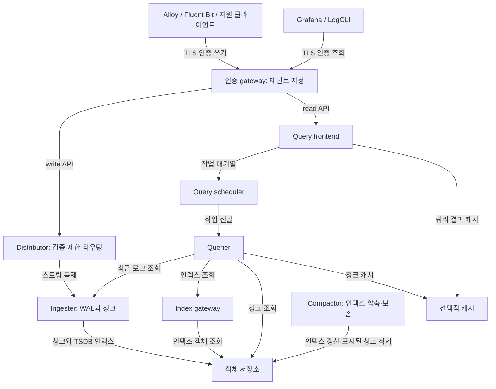

# Grafana Loki

> **마지막 업데이트**: 2026년 9월 13일
> **예제 기준**: Loki 3.7.7 / community Helm chart 18.12.1. 로컬 설정·렌더링·LogQL 검사이며 EKS 배포, S3 접근, 부하·HA·장애조치 시험을 수행하지 않았습니다.

Loki는 로그를 압축 청크로 저장하고 스트림 레이블을 인덱싱합니다. 인덱스 부담을 줄일 수 있지만 Elasticsearch/OpenSearch보다 항상 저렴하거나 빠르다는 뜻은 아닙니다. 대표 워크로드로 수집량, 보존 기간, 쿼리 선택도, 객체 요청, 컴퓨팅·캐시 및 운영 요건을 비교합니다.

## 개요

| 기능 | 의미와 범위 |
|---|---|
| 레이블 인덱스 | 스트림을 먼저 선택한 뒤 로그 내용을 조회합니다. JSON 파싱과 청크 스캔 비용은 여전히 존재합니다. |
| 객체 스토리지 | 운영 저장소에 S3 등 지원 백엔드를 사용할 수 있습니다. 로컬 파일시스템은 작은 실험에 유용하지만 공유 분산 객체 저장소는 아닙니다. |
| LogQL | 로그 파이프라인과 로그 기반 메트릭을 지원합니다. PromQL·SQL과 문법을 혼용하지 않습니다. |
| 멀티테넌시 | 테넌트별 데이터·제한을 구분합니다. 인증 프록시가 호출자에게 허용된 테넌트를 결정해야 합니다. |
| 확장·복제 | 배포 모드, 링, quorum, 저장소와 장애 도메인에 좌우됩니다. 복제 수와 WAL만으로 무손실 전달을 보장하지 않습니다. |

Elasticsearch/OpenSearch는 다른 인덱싱·검색 모델을 사용합니다. Loki도 로그 본문을 검색하지만 일반적으로 레이블·시간 범위를 좁힌 뒤 해당 청크를 스캔합니다. 재현 가능한 비교 없이 “10배 저렴”, “항상 빠름”, 고정 메모리 우열을 제시하지 않습니다.

## 아키텍처

아래는 일반적인 TSDB·청크 배포의 흐름이며 모든 선택·실험 기능을 포함하지 않습니다. 조회 화살표는 요청받는 컴포넌트를 향하고, 응답은 같은 경로로 돌아옵니다.



| 컴포넌트 | 역할 |
|---|---|
| Distributor | 스트림 검증, 테넌트·스트림별 수집 제한, 링을 통한 쓰기 라우팅을 담당합니다. 바이트 속도 제한은 초당 스트림 수 제한이 아닙니다. |
| Ingester | 스트림 버퍼링, 활성화된 WAL 기록, 청크 생성·플러시와 최근 로그 조회를 담당합니다. 영속 WAL은 장애 위험을 줄이지만 복제·백업·클라이언트 재시도 계획을 대신하지 않습니다. |
| Querier | Ingester의 최근 데이터와 인덱스·객체 저장소의 과거 데이터를 조회하고 LogQL을 평가·병합합니다. |
| Query frontend / scheduler | 쿼리 분할·대기열, 선택적 결과 캐시와 제한된 재시도를 담당합니다. 런타임 키는 `frontend`, Helm 워크로드 키는 `queryFrontend`입니다. |
| Index gateway | 분산 배포에서 인덱스 조회를 제공합니다. 청크 저장소와 별도 역할입니다. |
| Compactor | **인덱스 파일**을 압축·병합하며, 보존 기능을 켜면 만료된 인덱스 참조를 제거하고 표시된 청크를 비동기로 삭제합니다. 작은 로그 청크를 일반적으로 큰 청크로 합치는 컴포넌트가 아닙니다. |

## 배포 모드

| 모드 | 선택 기준 |
|---|---|
| Monolithic, `-target=all` | 작은 설치·실험에 편리합니다. Chart 18.12.1의 모드 이름은 `Monolithic`이고 워크로드 값은 여전히 `singleBinary` 아래에 있습니다. Chart 기본값이 운영 적합성을 증명하지는 않습니다. |
| Simple Scalable (SSD) | 기존 read/write/backend 그룹 방식입니다. 폐기 예정이며 Loki 4.0에서 제거될 예정입니다. 새 운영 EKS의 기본값으로 선정하기보다 명시적인 마이그레이션을 계획합니다. |
| Microservices, chart `Distributed` | Distributor, Ingester, Querier, frontend, scheduler, index gateway, compactor를 분리합니다. 현재 Helm 문서는 운영 확장·HA에 이 방식을 권장하지만 운영 복잡성이 더 높습니다. |

기존 `<100GB`, `100GB–10TB`, `>10TB` 구분은 측정된 처리 용량이 아닙니다. 최대 바이트/초, 활성 스트림, 쿼리 동시성, 보존 기간, 청크 활용도와 장애 복구를 기준으로 산정합니다. 대략적인 가이드를 처리량 보장으로 해석하지 않습니다.

## Helm 설치

### 사전 조건과 소유권

다음은 **새 설치를 위한 설정 출발점**이며 완전한 운영 플랫폼이 아닙니다.

- Chart 18.12.1의 Kubernetes 조건은 `>=1.25.0-0`이며 매니페스트 검사는 1.36.2 기준입니다. 모든 Kubernetes/EKS 버전·플랫폼을 시험했다는 의미는 아닙니다.
- 비공개 버킷, 범위를 제한한 IAM 역할, IRSA용 EKS OIDC provider와 기존 `gp3` StorageClass가 필요합니다. 이 클래스 이름은 예제 가정이며 EKS 기본 제공을 보장하지 않습니다. EBS CSI/Auto Mode provisioner, 노드 OS, AZ 용량, PVC 바인딩과 할당량을 실제 클러스터에 맞춥니다.
- `.htpasswd` 키가 있는 `loki-gateway-auth`, `tls.crt`/`tls.key`가 있는 `loki-gateway-tls`를 준비합니다. 실제 gateway DNS 이름에 유효한 신뢰된 인증서를 사용합니다. 비밀 관리 절차로 제공하고 values 파일에 암호·개인키를 커밋하지 않습니다.
- Gateway는 인증된 사용자명을 `X-Scope-OrgID`로 설정해 호출자가 보낸 테넌트 헤더를 덮어씁니다. NetworkPolicy·네트워크 보안 경계와 namespace RBAC로 Loki 컴포넌트 직접 접근을 제한해야 합니다. 테넌트 헤더 자체는 인증이 아니며 gateway 우회는 그 인가도 우회합니다.
- Gateway는 HTTPS·ClusterIP를 사용하고 ingress는 비활성화합니다. Loki 컴포넌트 사이의 내부 통신에는 환경에 맞는 전송·네트워크 통제가 별도로 필요합니다. 이 예제는 ALB, 공개 엔드포인트나 완전한 NetworkPolicy를 생성하지 않습니다.

### 버전을 고정한 분산 설정

`values-eks.yaml`로 저장하고 예제 계정·역할·버킷 이름을 일관되게 교체합니다. 스키마 시작일은 **새 저장소**용이며 업그레이드에서는 기존 스키마 항목을 보존합니다.

```yaml
deploymentMode: Distributed
loki:
  image:
    tag: 3.7.7
  auth_enabled: true
  analytics:
    reporting_enabled: false
  commonConfig:
    replication_factor: 3
  schemaConfig:
    configs:
    - from: '2026-09-01'
      store: tsdb
      object_store: s3
      schema: v13
      index:
        prefix: loki_index_
        period: 24h
  storage:
    type: s3
    bucketNames:
      chunks: example-loki-chunks-123456789012
      ruler: example-loki-ruler-123456789012
    s3:
      region: ap-northeast-2
  ingester:
    chunk_encoding: snappy
    wal:
      enabled: true
      dir: /var/loki/wal
  compactor:
    working_directory: /var/loki/compactor
    retention_enabled: true
    delete_request_store: s3
    retention_delete_delay: 2h
  limits_config:
    retention_period: 744h
    allow_structured_metadata: true
    ingestion_rate_strategy: global
    ingestion_rate_mb: 10
    ingestion_burst_size_mb: 20
    per_stream_rate_limit: 5MB
    per_stream_rate_limit_burst: 15MB
  runtimeConfig:
    overrides:
      development:
        retention_period: 168h
serviceAccount:
  create: true
  name: loki
  annotations:
    eks.amazonaws.com/role-arn: arn:aws:iam::123456789012:role/loki-s3
singleBinary:
  replicas: 0
read:
  replicas: 0
write:
  replicas: 0
backend:
  replicas: 0
ingester:
  replicas: 3
  zoneAwareReplication:
    enabled: false
  persistence:
    enabled: true
    claims:
    - name: data
      accessModes:
      - ReadWriteOnce
      size: 50Gi
      storageClass: gp3
distributor:
  replicas: 2
querier:
  replicas: 2
queryFrontend:
  replicas: 2
queryScheduler:
  replicas: 2
indexGateway:
  replicas: 2
compactor:
  replicas: 1
  persistence:
    enabled: true
    claims:
    - name: data
      accessModes:
      - ReadWriteOnce
      size: 20Gi
      storageClass: gp3
ruler:
  enabled: false
gateway:
  enabled: true
  replicas: 2
  service:
    type: ClusterIP
    port: 443
  ingress:
    enabled: false
  basicAuth:
    enabled: true
    existingSecret: loki-gateway-auth
  nginxConfig:
    locationSnippet: proxy_set_header X-Scope-OrgID $remote_user;
    ssl: true
    serverSnippet: 'ssl_certificate /etc/nginx/tls/tls.crt;

      ssl_certificate_key /etc/nginx/tls/tls.key;

      ssl_protocols TLSv1.2 TLSv1.3;'
  containerPort: 8443
  metrics:
    enabled: false
  extraVolumes:
  - name: gateway-tls
    secret:
      secretName: loki-gateway-tls
  extraVolumeMounts:
  - name: gateway-tls
    mountPath: /etc/nginx/tls
    readOnly: true
  readinessProbe:
    httpGet:
      path: /
      port: http
      scheme: HTTPS
    initialDelaySeconds: 15
    timeoutSeconds: 1
chunksCache:
  enabled: false
resultsCache:
  enabled: false
sidecar:
  rules:
    enabled: false
lokiCanary:
  enabled: false
test:
  enabled: false
```

`loki.*`는 애플리케이션 설정이고, 최상위 `ingester`, `querier`, `compactor` 등은 Kubernetes 워크로드 설정입니다. 예제는 Compactor 1개와 Ingester 3개를 사용합니다. Zone-aware replication을 끄므로 **AZ 장애 내성을 주장하지 않습니다**. 운영 전에 적절한 requests/limits, anti-affinity·topology spread, PDB와 검증된 용량을 마련합니다. 기존 고정 CPU·메모리 규모표를 그대로 적용하지 않습니다.

Ruler는 비활성화되어 있습니다. Ruler 버킷은 추후 규칙 설정을 위한 선택 항목이며 open-source Loki의 필수 관리 버킷이 아닙니다. Enterprise용 `admin` 버킷은 이 예제에 필요하지 않습니다. 캐시와 합성 canary/test 워크로드도 비활성화했으며 적절한 용량·인증과 함께 별도로 계획합니다.

```bash
helm repo add grafana-community https://grafana-community.github.io/helm-charts
helm repo update grafana-community

# Review the rendered resources before installing.
helm template loki grafana-community/loki \
  --version 18.12.1 --namespace loki \
  --values values-eks.yaml > loki-rendered.yaml

# Creates/updates resources; run only against the intended cluster.
helm upgrade --install loki grafana-community/loki \
  --version 18.12.1 --namespace loki --create-namespace \
  --values values-eks.yaml

kubectl get pods,services,pvc -n loki
```

기존 release는 중간 chart·Loki 업그레이드 노트, values 변경, 스키마 호환성과 롤백 제한을 먼저 확인합니다. 기존 values를 이 파일로 교체하는 것은 인플레이스 마이그레이션 절차가 아닙니다.

## S3 백엔드와 워크로드 자격 증명

### IAM과 ServiceAccount

예제는 IRSA를 사용합니다. 노드 플랫폼·agent·애플리케이션 AWS SDK 자격 증명 체인이 지원하면 EKS Pod Identity도 선택할 수 있습니다. IRSA만이 유일하게 안전한 방식은 아닙니다. Loki YAML에 S3 access key를 넣거나 광범위한 노드 역할 권한을 상속하지 않습니다.

명시된 동일 계정 버킷에 대한 정책 예시입니다.

```json
{
  "Version": "2012-10-17",
  "Statement": [
    {
      "Effect": "Allow",
      "Action": [
        "s3:ListBucket",
        "s3:GetBucketLocation"
      ],
      "Resource": [
        "arn:aws:s3:::example-loki-chunks-123456789012",
        "arn:aws:s3:::example-loki-ruler-123456789012"
      ],
      "Condition": {
        "StringEquals": {
          "aws:ResourceAccount": "123456789012"
        }
      }
    },
    {
      "Effect": "Allow",
      "Action": [
        "s3:GetObject",
        "s3:PutObject",
        "s3:DeleteObject"
      ],
      "Resource": [
        "arn:aws:s3:::example-loki-chunks-123456789012/*",
        "arn:aws:s3:::example-loki-ruler-123456789012/*"
      ],
      "Condition": {
        "StringEquals": {
          "aws:ResourceAccount": "123456789012"
        }
      }
    }
  ]
}
```

Compactor에는 보존 처리를 위한 객체 삭제 권한이 필요합니다. 컴포넌트별 역할로 더 좁힐 수 있습니다. SSE-KMS 사용 시 선택한 암호화 구성에 필요한 특정 KMS 권한·키 정책을 추가합니다. `s3:*`나 광범위한 역할 신뢰가 이를 대신하지 않습니다.

IRSA 역할은 정확한 클러스터 OIDC provider를 신뢰하고 `aud=sts.amazonaws.com`, `sub=system:serviceaccount:loki:loki` 조건을 가져야 합니다. 정책을 생성·검토하고 OIDC provider를 연결한 뒤 관리자가 **역할만** 만들 수 있습니다.

```bash
eksctl create iamserviceaccount \
  --cluster="$CLUSTER_NAME" --region="$AWS_REGION" \
  --namespace=loki --name=loki \
  --role-only --role-name=loki-s3 \
  --attach-policy-arn="$LOKI_S3_POLICY_ARN" \
  --approve
```

변수는 의도한 계정·클러스터에 맞게 명시적으로 설정합니다. `serviceAccount.create: true`로 Helm이 ServiceAccount를 소유하므로 eksctl로 같은 ServiceAccount를 중복 생성하지 않습니다. 외부 시스템이 소유하면 `create: false`로 두고 이름·annotation·역할 신뢰를 일치시킵니다.

### 비공개 버킷 예제

다음 Terraform은 리소스 예시이며 실제 apply를 검증한 완전한 root module이 아닙니다. 검토된 AWS provider 설정과 전역적으로 고유한 버킷 이름을 사용합니다. 두 버킷 모두 암호화와 Block Public Access를 적용합니다.

```hcl
variable "loki_buckets" {
  type = map(string)
  default = {
    chunks = "example-loki-chunks-123456789012"
    ruler  = "example-loki-ruler-123456789012"
  }
}

resource "aws_s3_bucket" "loki" {
  for_each      = var.loki_buckets
  bucket        = each.value
  force_destroy = false
}

resource "aws_s3_bucket_public_access_block" "loki" {
  for_each                = aws_s3_bucket.loki
  bucket                  = each.value.id
  block_public_acls       = true
  block_public_policy     = true
  ignore_public_acls      = true
  restrict_public_buckets = true
}

resource "aws_s3_bucket_server_side_encryption_configuration" "loki" {
  for_each = aws_s3_bucket.loki
  bucket   = each.value.id
  rule {
    apply_server_side_encryption_by_default {
      sse_algorithm = "AES256"
    }
  }
}

resource "aws_s3_bucket_versioning" "loki" {
  for_each = aws_s3_bucket.loki
  bucket   = each.value.id
  versioning_configuration {
    status = "Disabled"
  }
}
```

새 버킷은 별도 설정이 없으면 버전 관리가 꺼진 상태입니다. AWS Terraform provider는 이 예제처럼 버전 관리가 없는 버킷을 생성·import할 때 `status = "Disabled"`를 지원합니다. 이미 `Enabled`·`Suspended`인 버킷을 `Disabled`로 되돌릴 수는 없으므로 기존 상태를 보존하고 지원되는 전환을 사용합니다. 버전 관리를 켜면 객체를 삭제해도 과거 버전이 남을 수 있으므로 noncurrent version 정리·법적 보존을 Loki 조회 보존 정책과 별도로 계획합니다.

활성 Loki 청크를 복원 작업이 필요한 Glacier 클래스로 전환하지 않습니다. 쿼리는 즉시 객체를 읽어야 하며 보관 객체 복원은 일반 Loki 읽기 경로에 포함되지 않습니다. 범위 없는 객체 나이 규칙으로 버킷 전체를 만료시키지 않습니다. 인덱스·클러스터 상태·삭제 요청·Ruler 데이터의 수명은 다릅니다. 수명 주기를 안전장치로 사용한다면 확인된 청크 prefix에만 적용하고 만료 시점을 보존 기간 **및 삭제 지연 이후**로 설정합니다. 주 삭제 메커니즘은 일반적으로 Compactor 보존 처리입니다.

Chart가 S3/TSDB 런타임 설정을 생성합니다. 과거의 `tsdb_shipper.shared_store`, `boltdb_shipper.shared_store`, `compactor.shared_store`, `storage_config.aws.sse_encryption`을 덧붙이지 않습니다. Loki 3.7.7이 거부하는 필드입니다. 고정 버전의 저장소·암호화 설정을 확인합니다.

## LogQL

### 선택자·필터·파서

선택자마다 빈 값과 일치하지 않는 matcher가 하나 이상 필요합니다. 부정 matcher만 사용하면 없는 레이블도 선택할 수 있으므로 양의 nonempty matcher를 포함합니다. 아래는 독립된 쿼리이며 하나의 다중 문장 프로그램이 아닙니다.

```logql
{namespace="production"}

{namespace="production", app=~"nginx|apache"}

{namespace=~".+", namespace!="kube-system"}

{app=~".+", app!~"test.*"}
```

라인 필터는 대소문자를 구분하고 정규식 라인 필터는 부분 문자열과 일치할 수 있습니다. 의미를 보존하는 범위에서 선택도 높은 필터를 앞에 둡니다. 조회에서 health check 텍스트를 제외하는 것과 수집 시 로그를 삭제하는 것은 다릅니다.

```logql
{app="nginx"} |= "error"

{app="nginx"} != "healthcheck"

{app="nginx"} |~ "status=[45][0-9]{2}"

{app="nginx"} !~ "GET /health"

{app="nginx"} |= "error" != "timeout"

{namespace="production"} |= "OOMKilled" or "CrashLoopBackOff"
```

마지막 쿼리는 수집된 텍스트를 검색합니다. Kubernetes reason·이벤트가 애플리케이션 로그에 자동으로 들어오지는 않으므로 해당 이벤트·런타임 소스를 먼저 수집해야 합니다.

```logql
{app="api"} | json

{app="api"} | json level, message, request_id

{app="api"} | logfmt

{app="nginx"} | regexp `(?P<ip>[\d.]+) - - \[(?P<timestamp>[^\]]+)\]`

{app="nginx"} | pattern `<ip> - - [<_>] "<method> <path> <_>" <status> <size>`

{app="packed"} | unpack
```

`json`은 필드 추출을 지원하며 `json level, message` 축약형도 3.7.7에서 유효합니다. `unpack`은 호환 pack stage가 만든 라인용이며 일반 JSON용이 아닙니다. Pattern·regexp는 실제 로그 형식과 맞아야 하고 항상 더 빠르다는 보장은 없습니다.

```logql
{app="api"} | json | level="error" | __error__=""

{app="api"} | json | response_time > 1000 | __error__=""

{app="api"} | json | level="error" and request_id!="" | __error__=""

{app="nginx"} | pattern `<ip> - - <_>` | ip != ip("10.0.0.1")

{app="api"} | json | line_format "{{.level}}: {{.message}}"

{app="api"} | json | line_format `{{ if eq .level "error" }}ERROR: {{ end }}{{.message}}`

{app="api"} | json | line_format `{{ .timestamp | toDate "2006-01-02T15:04:05Z07:00" | date "15:04:05" }}`
```

숫자 `response_time` 예제는 밀리초 단위입니다. 초 단위나 다른 필드에 같은 임계값을 적용하지 않습니다. 파싱·형 변환 실패로 `__error__`가 붙을 수 있습니다. 오류 필터는 해당 기록을 계산에서 제외하므로 거부·비정상 기록도 별도로 모니터링합니다.

### 로그 기반 메트릭

```logql
rate({app="nginx"}[5m])

(sum(rate({app="api"} | json | __error__="" | level="error" [5m])) or vector(0))
/
sum(rate({app="api"} | json | __error__="" [5m]))

quantile_over_time(0.99,
  {app="api"} | json | unwrap response_time | __error__="" [5m]
) by (endpoint)

topk(10, sum by (error_type) (
  count_over_time({app="api"} | json | __error__="" | level="error" [1h])
))

avg_over_time(
  {app="nginx"} | pattern `<_> - - [<_>] "<_> <path> <_>" <_> <size>`
  | unwrap size | __error__="" [5m]
) by (path)

sum by (app) (count_over_time({namespace="production"} |= "error" [1h]))

absent_over_time({app="critical-service"}[5m])
```

에러 비율은 **파싱에 성공한 로그 라인** 중 `level="error"`의 비중이며 자동으로 HTTP 요청 에러율이 되지는 않습니다. 분자의 0 fallback은 유효한 로그가 있지만 에러 라인이 없을 때를 처리합니다. 무트래픽·수집 누락은 별도의 no-data 또는 비유한 값이며 정상의 증거가 아닙니다. HTTP SLI에는 요청당 access event 수, 유효 상태 코드, 샘플링·수집 범위를 정의합니다.

숫자 변환 오류를 제외하려면 `__error__=""`를 `unwrap` **뒤에** 둡니다. `absent_over_time`은 선택 데이터의 부재를 감지할 뿐 조용한 앱과 수집기 장애를 구분하지 못합니다. LogQL은 `count(...)` 같은 벡터 집계도 지원합니다. 로그 스트림을 메트릭 벡터처럼 직접 넣는 것과 구분합니다.

```logql
{app="api"} | json | response_time > 5000 | __error__="" | line_format `{{.method}} {{.path}}: {{.response_time}}ms`

{app="api"} | json | request_id="example-request" | __error__=""

{app="nginx"} | pattern `<_> - - [<_>] "<method> <path> <_>" <status> <_>`
| status >= 500 and status < 600 | __error__=""

sum by (hour) (
  count_over_time({app="api"} |= "error" | label_format hour=`{{ __timestamp__ | date "15" }}` [24h])
)

sum(count_over_time({app="api"} |= "error" [5m])) > 100
```

시각(hour-of-day) 집계는 로그 타임스탬프를 사용하고 여러 날짜를 합칠 수 있습니다. 시간 범위·시간대를 명시하고 시간순 차트에는 Grafana range-query step을 사용합니다. 마지막 식은 임의의 건수 임계값 예시입니다. 배포를 감지하거나 통계적으로 유의한 급증을 입증하지 않습니다. `increase(count_over_time(...))`는 유효한 LogQL 대안이 아닙니다.

## 레이블 설계와 수집기

Cluster, namespace, service/app, environment처럼 필요하고 범위가 제한된 인덱스 레이블을 선택합니다. 익숙한 레이블 이름도 실제 조합·변경 빈도가 높을 수 있습니다. Request/user ID, timestamp, Pod UID·이름, client IP는 대개 인덱스 레이블에 적합하지 않습니다. 필요한 값만 접근·개인정보 정책에 따라 로그 본문 또는 structured metadata에 둡니다.

| 예시 | 스트림 수에 미치는 영향 |
|---|---|
| Namespace 2개, app 3개지만 각 app이 한 namespace에만 존재 | 관측 조합은 3개이며 자동으로 6개가 되지 않음 |
| 모든 app이 두 namespace에 모두 존재 | 다른 레이블을 고려하기 전 최대 6개 조합 |
| 요청마다 고유한 request ID를 레이블에 추가 | 요청마다 새 스트림이 생길 수 있음 |

레이블별 cardinality의 곱은 모든 조합이 생길 때의 **상한**이며 정확한 스트림 수가 아닙니다. 스트림 수뿐 아니라 수집 속도, 청크 크기, 조회 선택도, 캐시와 저장소 지연도 자원 사용에 영향을 줍니다. 기존 `<100,000 streams/cluster`, `<10,000/tenant`, `<1,000 values/label`은 보편적인 제한이 아닙니다.

Promtail은 **2026년 3월 2일** 지원이 종료되었습니다. Alloy 같은 유지보수되는 클라이언트와 마이그레이션 가이드를 사용합니다. `lambda-promtail`의 수명 주기는 별도입니다. 이전한 scrape 설정에도 discovery, RBAC, 경로·CRI framing, positions, 재시도와 출력 인증이 필요합니다. Relabel 규칙만으로 수집기가 완성되지는 않습니다.

다음은 기존 Alloy 파이프라인에 넣는 **처리 조각**입니다. 필드를 추출한 뒤 레이블·structured metadata로 사용합니다. 이미 `loki.write.default`가 있고 상위 컴포넌트가 application JSON을 `loki.process.app.receiver`로 전달한다고 가정합니다. 완전한 설정이나 CRI 파서는 아닙니다.

```alloy
loki.process "app" {
  forward_to = [loki.write.default.receiver]

  stage.json {
    expressions = {
      level      = "level",
      request_id = "request_id",
    }
  }

  stage.labels {
    values = { level = "level" }
  }

  stage.structured_metadata {
    values = { request_id = "request_id" }
  }
}
```

인덱싱하는 `level` 값은 제한된 집합이어야 합니다. 앱이 제공한 데이터로 신뢰된 테넌트·클러스터 신원을 결정하지 않습니다. Structured metadata에는 호환 스키마(이 예제의 v13)와 `allow_structured_metadata`가 필요하며 개인정보 삭제 기능이 아닙니다. 수집기 secret 참조·파일 권한은 별도로 설정합니다.

## 성능 튜닝

아래는 **Loki 런타임 조각**이며 Helm 워크로드 replicas/resources가 아닙니다. 이 chart에서는 `loki.structuredConfig` 아래에 넣거나 문서화된 대응 `loki.ingester`, `loki.frontend`, `loki.querier`, `loki.limits_config` 값을 사용합니다. 최종 병합 설정을 렌더링·검증합니다.

```yaml
ingester:
  chunk_idle_period: 30m
  chunk_block_size: 262144
  chunk_target_size: 1572864
  chunk_retain_period: 1m
  max_chunk_age: 2h
  concurrent_flushes: 32
  wal:
    enabled: true
    dir: /var/loki/wal
    flush_on_shutdown: true
    replay_memory_ceiling: 512MB
querier:
  max_concurrent: 4
frontend:
  max_outstanding_per_tenant: 2048
  compress_responses: true
  log_queries_longer_than: 5s
query_scheduler:
  max_outstanding_requests_per_tenant: 2048
limits_config:
  query_timeout: 5m
  max_query_length: 744h
  max_query_lookback: 744h
  max_query_parallelism: 32
  tsdb_max_query_parallelism: 32
  split_queries_by_interval: 15m
  max_global_streams_per_user: 5000
```

- 수집 제한은 `limits_config`에 둡니다. Global 테넌트 rate는 정상 Distributor 사이에 나뉘며 burst·스트림별 제한은 별도입니다. 429의 원인과 discarded samples/bytes를 확인한 뒤 조정합니다.
- `chunk_idle_period`는 스트림에 새 데이터가 없을 때 플러시하는 시점을 제어합니다. 작은 청크는 객체 요청·인덱스 작업·저장 부담을 늘릴 수 있습니다. 메모리 limit은 OOM 종료를 일으킬 수 있으며 과도한 메모리 수요를 예방하는 장치가 아닙니다.
- WAL replay에는 적절한 영속 저장소·메모리가 필요합니다. `replay_memory_ceiling`은 전체 프로세스 RSS 상한이 아닙니다. Ingester 축소에는 정상 종료·draining과 데이터 가용성 검증이 필요하며 CPU 기반 HPA만으로 충분하지 않습니다.
- Timeout, 분할, TSDB 병렬도·동시성은 fan-out·저장소 부하와 함께 봅니다. 대기열이나 replica를 늘려 과부하를 악화시킬 수도 있습니다.
- 이 chart의 기본 결과·청크 캐시는 Memcached입니다. Redis host를 주석에 쓰는 것만으로 외부 Redis 캐시가 설정되지는 않습니다. 별도로 용량·효과를 시험하고 캐시 포트를 비공개로 유지합니다.

## 보존 정책

기간만 지정한다고 보존 삭제가 활성화되지는 않습니다. 예제는 TSDB v13·24h 인덱스 주기, Compactor retention과 `delete_request_store`를 함께 설정합니다. Compactor marker 상태는 재시작 후에도 남아야 하며 예제는 PVC를 사용합니다. 실제 삭제는 인덱스 갱신과 delete delay 이후 비동기로 진행됩니다.

`744h`는 31일 정책의 예시이며 **Loki 기본값이 아닙니다**. 보존 기능을 끄거나 기간이 0이면 로그가 자동으로 31일만 보존되는 것이 아닙니다. 백업·버전 관리·법적 보존 요건은 별도입니다.

정책을 선택한 뒤 다음 선택적 Helm overlay를 병합합니다.

```yaml
loki:
  limits_config:
    retention_period: 744h
    retention_stream:
    - selector: '{namespace="development"}'
      priority: 1
      period: 72h
  runtimeConfig:
    overrides:
      production:
        retention_period: 2160h
        retention_stream:
        - selector: '{namespace="production",level="error"}'
          priority: 2
          period: 2160h
        - selector: '{app="audit-log"}'
          priority: 1
          period: 8760h
      development:
        retention_period: 168h
```

`loki.runtimeConfig`는 runtime override 파일과 mount를 렌더링합니다. 별도 `runtime-config.yaml` 파일이 존재하기만 해서는 로드되지 않습니다. Gateway가 사용자명을 테넌트로 매핑하므로 `development` 사용자는 해당 override를 선택합니다.

테넌트 stream 규칙이 global stream 규칙보다 우선합니다. 해당 목록에서 여러 규칙이 일치하면 높은 priority를, priority가 같으면 더 짧은 기간을 선택하고 이후 테넌트·global 기간 fallback을 적용합니다. 선택자는 파싱한 JSON·structured metadata가 아니라 **인덱싱된 스트림 레이블**을 사용합니다. 예를 들어 위 `level="error"` 보존 규칙에는 수집 시 `level`을 인덱싱해야 합니다. 정책을 바꿔도 이미 삭제한 로그를 되살릴 수 없으므로 고정 버전의 동작과 삭제 시간을 시험합니다.

## 트러블슈팅과 모니터링

| 증상 | 제한을 바꾸기 전 확인 사항 |
|---|---|
| Outstanding-query 제한 | Fan-out, scheduler 대기열, querier 동시성, 느린 객체 저장소·넓은 조회 범위. 대기열 증가는 실패를 늦출 뿐일 수 있음 |
| 수집 429 | 테넌트 byte rate/burst, 스트림별 속도, 활성 스트림 제한 구분. 제한된 재시도·backoff와 손실 정책 필요 |
| 스트림 제한 거부 | 실제 레이블 조합·변경 빈도와 배포에 맞는 local/global 제한 확인. 10,000을 보편적 기본값으로 취급하지 않음 |
| Ingester OOM | 활성 스트림, 청크, WAL replay, 캐시·버퍼와 컨테이너·노드 한도. 중복 `ingester:` 키나 Helm 자원 값 혼용 금지 |
| S3 오류 | 실제 신원, 버킷·Region, 계정·리소스 제한, KMS 정책, DNS·endpoint, 객체 가용성. 공개 버킷·고정 access key로 우회하지 않음 |
| 쓰기 시 “Ingester is shutting down” | 실제 종료 상태와 **WAL 디스크 압력**을 함께 확인합니다.3.7.7은 WAL disk-full threshold(기본0.9)로 쓰기가 제한될 때도 같은 오류를 반환합니다. 용량을 복구하고 보호 기능을 무작정 끄지 않습니다. |
| No org ID / 잘못된 테넌트 | Gateway 인증, 헤더 덮어쓰기, 직접 백엔드 우회. `auth_enabled: true`는 테넌트 ID를 요구하며 암호 검증이 아님 |

안전하게 설정한 LogCLI 연결이나 인증 HTTPS gateway를 사용합니다. 예를 들어 암호를 명령에 넣거나 인증서 검증을 끄는 대신 보호된 netrc 파일과 신뢰된 CA를 사용합니다.

```bash
curl --fail --silent --show-error \
  --netrc-file "$LOKI_NETRC_FILE" --cacert "$LOKI_CA_FILE" \
  --get "$LOKI_GATEWAY_URL/loki/api/v1/query_range" \
  --data-urlencode 'query={app="nginx"}' \
  --data-urlencode 'since=1h' \
  --data-urlencode 'limit=100' | jq '.data.stats'

curl --fail --silent --show-error \
  --netrc-file "$LOKI_NETRC_FILE" --cacert "$LOKI_CA_FILE" \
  --get "$LOKI_GATEWAY_URL/loki/api/v1/series" \
  --data-urlencode 'match[]={namespace="production"}' \
  --data-urlencode 'since=1h' | jq '.data | length'
```

URL은 의도한 HTTPS gateway로 지정하고 자격 증명 파일 권한·조회 범위를 제한합니다. `start`에는 지원되는 절대 타임스탬프가 필요하고 상대 범위에는 `since=1h`를 사용합니다. Series API 건수는 조회 구간에서 일치하는 series이며 현재 메모리에 있는 활성 스트림 수와 같지 않을 수 있습니다.

관리 진단은 실제 Pod를 선택해 로컬 port-forward를 사용합니다.

```bash
kubectl get pods -n loki -l app.kubernetes.io/instance=loki
kubectl port-forward -n loki pod/REPLACE_WITH_ACTUAL_POD 13100:3100

# In a second terminal; local administrative connection.
curl --fail http://127.0.0.1:13100/ready
curl --fail http://127.0.0.1:13100/metrics
```

Readiness는 전체 저장·조회 경로 정상의 증거가 아닙니다. 링 endpoint는 선택한 컴포넌트에 따라 다릅니다. `/config`는 민감한 운영 정보로 취급합니다. **`POST /flush`는 플러시를 실행하는 동작이며 상태 조회가 아니므로** 진단 명령에서 제외했습니다.

다음은 **스크레이프한 Loki 메트릭**에 대한 Prometheus 식이며 LogQL이나 완전한 Grafana import dashboard가 아닙니다.

```promql
sum(rate(loki_distributor_bytes_received_total[5m]))

sum(loki_ingester_memory_streams)

histogram_quantile(0.99,
  sum by (le) (rate(loki_request_duration_seconds_bucket{route=~"loki_api_v1_query.*"}[5m]))
)
```

Distributor bytes는 도착 데이터를 나타낼 뿐 영속 수집 성공을 단독으로 입증하지 않습니다. Ingester stream 합계에는 replica도 포함됩니다. 지연 selector는 실제 route 레이블을 확인한 뒤 사용하고 표본 부재와 지연 0을 구분합니다.

## 검증과 참고 자료

감사는 공식 release SHA digest로 검증한 Loki 3.7.7 바이너리·chart 18.12.1로 로컬 설정·Helm·LogQL을 검사했습니다. EKS 권한, TLS Secret 유효성, 전달 보장, S3 보존 실행, 운영 용량·AZ 장애조치를 입증하는 검사는 아닙니다. Alloy 조각과 Terraform 리소스는 완전한 구성 안에서 통합 검증해야 합니다.

- [고정 버전 community chart values](https://raw.githubusercontent.com/grafana-community/helm-charts/loki-18.12.1/charts/loki/values.yaml)
- [Helm 설치·배포 권장 사항](https://grafana.com/docs/loki/latest/setup/install/helm/)
- [배포 모드](https://grafana.com/docs/loki/latest/get-started/deployment-modes/)와 [업그레이드](https://grafana.com/docs/loki/latest/setup/upgrade/)
- [컴포넌트](https://grafana.com/docs/loki/latest/get-started/components/)와 [설정 레퍼런스](https://grafana.com/docs/loki/latest/configure/)
- [인증](https://grafana.com/docs/loki/latest/operations/authentication/)과 [테넌트 격리](https://grafana.com/docs/loki/latest/operations/multi-tenancy/)
- [로그 쿼리](https://grafana.com/docs/loki/latest/query/log_queries/), [메트릭 쿼리](https://grafana.com/docs/loki/latest/query/metric_queries/), [HTTP API](https://grafana.com/docs/loki/latest/reference/loki-http-api/)
- [Cardinality](https://grafana.com/docs/loki/latest/get-started/labels/cardinality/)와 [structured metadata](https://grafana.com/docs/loki/latest/get-started/labels/structured-metadata/)
- [보존·객체 저장소 수명 주기](https://grafana.com/docs/loki/latest/operations/storage/retention/)
- [Promtail 수명 주기](https://grafana.com/docs/loki/latest/send-data/promtail/)와 [Alloy 이전](https://grafana.com/docs/alloy/latest/set-up/migrate/from-promtail/)
- [IRSA](https://docs.aws.amazon.com/eks/latest/userguide/iam-roles-for-service-accounts.html)와 [EKS Pod Identity](https://docs.aws.amazon.com/eks/latest/userguide/pod-identities.html)

## 퀴즈

[Loki 퀴즈](../../quizzes/observability/logging/01-loki-quiz.md)에서 위 차이를 확인합니다.
