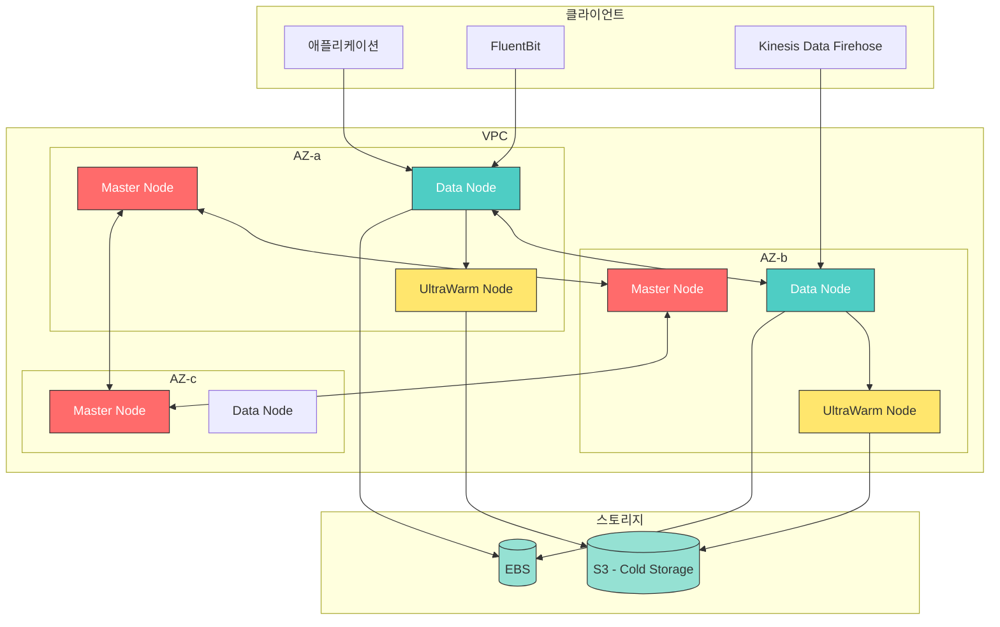
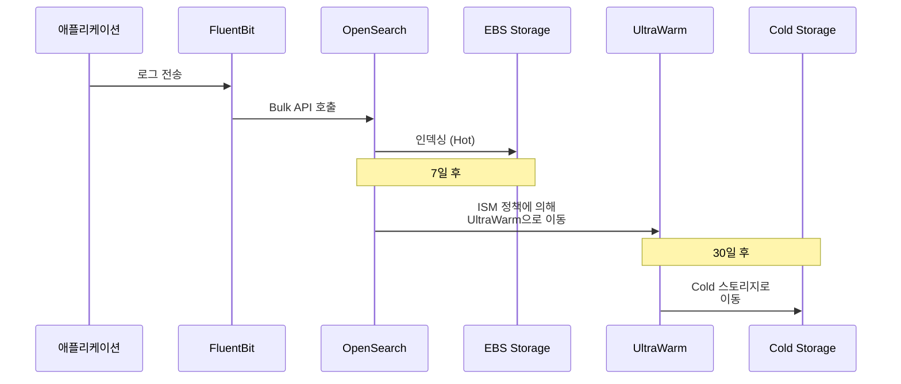

# Amazon OpenSearch Service

> **마지막 업데이트**: 2026년 2월 20일

Amazon OpenSearch Service는 완전관리형 검색 및 분석 서비스로, 실시간 애플리케이션 모니터링, 로그 분석, 웹사이트 검색 등에 활용됩니다. Elasticsearch의 포크인 OpenSearch를 기반으로 하며, 강력한 전문 검색(Full-text Search) 기능을 제공합니다.

## 목차

1. [개요](#개요)
2. [아키텍처](#아키텍처)
3. [도메인 생성](#도메인-생성)
4. [인덱스 관리](#인덱스-관리)
5. [데이터 수집](#데이터-수집)
6. [OpenSearch Dashboards](#opensearch-dashboards)
7. [보안 설정](#보안-설정)
8. [비용 최적화](#비용-최적화)
9. [Loki와의 비교](#loki와의-비교)

---

## 개요

### OpenSearch vs Elasticsearch

OpenSearch는 2021년 AWS가 Elasticsearch 7.10을 포크하여 만든 오픈소스 프로젝트입니다.

| 특성 | OpenSearch | Elasticsearch |
|------|-----------|---------------|
| 라이선스 | Apache 2.0 | SSPL/Elastic License |
| 관리형 서비스 | Amazon OpenSearch Service | Elastic Cloud |
| 호환성 | ES 7.10 API 호환 | 최신 버전 |
| 플러그인 | OpenSearch 플러그인 | Elastic 플러그인 |
| 대시보드 | OpenSearch Dashboards | Kibana |

### Amazon OpenSearch Service 특징

| 카테고리 | 기능 |
|----------|------|
| 관리 | 완전 관리형, 자동 패칭, 자동 스냅샷 |
| 가용성 | 다중 AZ 배포, Cross-cluster |
| 보안 | 암호화 (저장/전송), VPC 통합, Fine-grained Access, SAML 인증 |
| 스토리지 | UltraWarm/Cold 스토리지, Serverless 옵션 |
| 모니터링 | CloudWatch 통합 |

### 주요 사용 사례

1. **로그 분석**: 애플리케이션, 인프라, 보안 로그 분석
2. **전문 검색**: 웹사이트, 문서, 제품 검색
3. **보안 분석**: SIEM, 위협 탐지, 규정 준수
4. **실시간 모니터링**: 애플리케이션 성능 모니터링
5. **비즈니스 분석**: 클릭스트림, 사용자 행동 분석

---

## 아키텍처

### OpenSearch 클러스터 아키텍처



### 노드 유형

| 노드 유형 | 역할 | 권장 인스턴스 |
|----------|------|--------------|
| **Master** | 클러스터 관리, 인덱스 메타데이터 | m6g.large.search (3개) |
| **Data** | 데이터 저장, 검색/인덱싱 | r6g.xlarge.search |
| **UltraWarm** | 읽기 전용, 비용 효율적 저장 | ultrawarm1.medium |
| **Cold** | S3 기반 아카이브 | - |

### 데이터 흐름



---

## 도메인 생성

### AWS Console을 통한 생성

```
1. OpenSearch Service 콘솔 접속
2. "도메인 생성" 클릭
3. 설정:
   - 배포 유형: 프로덕션
   - 버전: OpenSearch 2.x
   - 데이터 노드: r6g.xlarge.search x 3
   - 마스터 노드: m6g.large.search x 3
   - EBS: gp3, 500GB per node
   - 네트워크: VPC 액세스
   - 암호화: 저장 및 전송 중 암호화 활성화
   - Fine-grained access control 활성화
```

### Terraform을 통한 생성

```hcl
# opensearch.tf

# VPC 및 서브넷 데이터
data "aws_vpc" "main" {
  tags = {
    Name = "main-vpc"
  }
}

data "aws_subnets" "private" {
  filter {
    name   = "vpc-id"
    values = [data.aws_vpc.main.id]
  }
  filter {
    name   = "tag:Type"
    values = ["private"]
  }
}

# 보안 그룹
resource "aws_security_group" "opensearch" {
  name        = "opensearch-sg"
  description = "Security group for OpenSearch domain"
  vpc_id      = data.aws_vpc.main.id

  ingress {
    description = "HTTPS from VPC"
    from_port   = 443
    to_port     = 443
    protocol    = "tcp"
    cidr_blocks = [data.aws_vpc.main.cidr_block]
  }

  egress {
    from_port   = 0
    to_port     = 0
    protocol    = "-1"
    cidr_blocks = ["0.0.0.0/0"]
  }

  tags = {
    Name = "opensearch-sg"
  }
}

# OpenSearch 도메인
resource "aws_opensearch_domain" "main" {
  domain_name    = "logs-production"
  engine_version = "OpenSearch_2.11"

  cluster_config {
    instance_type            = "r6g.xlarge.search"
    instance_count           = 3
    zone_awareness_enabled   = true
    dedicated_master_enabled = true
    dedicated_master_type    = "m6g.large.search"
    dedicated_master_count   = 3

    zone_awareness_config {
      availability_zone_count = 3
    }

    # UltraWarm 설정
    warm_enabled = true
    warm_type    = "ultrawarm1.medium.search"
    warm_count   = 2

    # Cold Storage 설정
    cold_storage_options {
      enabled = true
    }
  }

  # EBS 설정
  ebs_options {
    ebs_enabled = true
    volume_type = "gp3"
    volume_size = 500
    iops        = 3000
    throughput  = 250
  }

  # VPC 설정
  vpc_options {
    subnet_ids         = slice(data.aws_subnets.private.ids, 0, 3)
    security_group_ids = [aws_security_group.opensearch.id]
  }

  # 암호화 설정
  encrypt_at_rest {
    enabled = true
  }

  node_to_node_encryption {
    enabled = true
  }

  domain_endpoint_options {
    enforce_https       = true
    tls_security_policy = "Policy-Min-TLS-1-2-2019-07"
  }

  # Fine-grained Access Control
  advanced_security_options {
    enabled                        = true
    internal_user_database_enabled = true
    master_user_options {
      master_user_name     = "admin"
      master_user_password = var.opensearch_master_password
    }
  }

  # 고급 설정
  advanced_options = {
    "rest.action.multi.allow_explicit_index" = "true"
    "indices.fielddata.cache.size"           = "20"
    "indices.query.bool.max_clause_count"    = "1024"
  }

  # 자동 스냅샷
  snapshot_options {
    automated_snapshot_start_hour = 23
  }

  # 로깅
  log_publishing_options {
    cloudwatch_log_group_arn = aws_cloudwatch_log_group.opensearch_index_slow.arn
    log_type                 = "INDEX_SLOW_LOGS"
    enabled                  = true
  }

  log_publishing_options {
    cloudwatch_log_group_arn = aws_cloudwatch_log_group.opensearch_search_slow.arn
    log_type                 = "SEARCH_SLOW_LOGS"
    enabled                  = true
  }

  log_publishing_options {
    cloudwatch_log_group_arn = aws_cloudwatch_log_group.opensearch_error.arn
    log_type                 = "ES_APPLICATION_LOGS"
    enabled                  = true
  }

  tags = {
    Environment = "production"
    Application = "logging"
  }

  depends_on = [aws_iam_service_linked_role.opensearch]
}

# CloudWatch 로그 그룹
resource "aws_cloudwatch_log_group" "opensearch_index_slow" {
  name              = "/aws/opensearch/logs-production/index-slow-logs"
  retention_in_days = 30
}

resource "aws_cloudwatch_log_group" "opensearch_search_slow" {
  name              = "/aws/opensearch/logs-production/search-slow-logs"
  retention_in_days = 30
}

resource "aws_cloudwatch_log_group" "opensearch_error" {
  name              = "/aws/opensearch/logs-production/error-logs"
  retention_in_days = 30
}

# 서비스 연결 역할
resource "aws_iam_service_linked_role" "opensearch" {
  aws_service_name = "opensearchservice.amazonaws.com"
}

# CloudWatch 로그 리소스 정책
resource "aws_cloudwatch_log_resource_policy" "opensearch" {
  policy_name = "opensearch-log-policy"

  policy_document = jsonencode({
    Version = "2012-10-17"
    Statement = [
      {
        Effect = "Allow"
        Principal = {
          Service = "es.amazonaws.com"
        }
        Action = [
          "logs:PutLogEvents",
          "logs:CreateLogStream"
        ]
        Resource = [
          "${aws_cloudwatch_log_group.opensearch_index_slow.arn}:*",
          "${aws_cloudwatch_log_group.opensearch_search_slow.arn}:*",
          "${aws_cloudwatch_log_group.opensearch_error.arn}:*"
        ]
      }
    ]
  })
}

# 출력
output "opensearch_endpoint" {
  value = aws_opensearch_domain.main.endpoint
}

output "opensearch_dashboard_endpoint" {
  value = aws_opensearch_domain.main.dashboard_endpoint
}
```

---

## 인덱스 관리

### 인덱스 템플릿

```json
PUT _index_template/logs-template
{
  "index_patterns": ["logs-*"],
  "priority": 100,
  "template": {
    "settings": {
      "number_of_shards": 3,
      "number_of_replicas": 1,
      "refresh_interval": "5s",
      "index.codec": "best_compression",
      "index.mapping.total_fields.limit": 2000,
      "index.translog.durability": "async",
      "index.translog.sync_interval": "30s"
    },
    "mappings": {
      "properties": {
        "@timestamp": {
          "type": "date"
        },
        "level": {
          "type": "keyword"
        },
        "message": {
          "type": "text",
          "analyzer": "standard"
        },
        "kubernetes": {
          "properties": {
            "namespace": { "type": "keyword" },
            "pod_name": { "type": "keyword" },
            "container_name": { "type": "keyword" },
            "labels": { "type": "object" }
          }
        },
        "trace_id": {
          "type": "keyword"
        },
        "span_id": {
          "type": "keyword"
        },
        "http": {
          "properties": {
            "method": { "type": "keyword" },
            "status_code": { "type": "integer" },
            "path": { "type": "keyword" },
            "response_time_ms": { "type": "float" }
          }
        }
      },
      "dynamic_templates": [
        {
          "strings_as_keywords": {
            "match_mapping_type": "string",
            "mapping": {
              "type": "keyword",
              "ignore_above": 1024
            }
          }
        }
      ]
    }
  }
}
```

### ISM (Index State Management) 정책

ISM 정책을 통해 인덱스 라이프사이클을 자동으로 관리합니다.

```json
PUT _plugins/_ism/policies/logs-lifecycle
{
  "policy": {
    "description": "로그 인덱스 라이프사이클 관리",
    "default_state": "hot",
    "states": [
      {
        "name": "hot",
        "actions": [
          {
            "rollover": {
              "min_index_age": "1d",
              "min_primary_shard_size": "30gb"
            }
          }
        ],
        "transitions": [
          {
            "state_name": "warm",
            "conditions": {
              "min_index_age": "7d"
            }
          }
        ]
      },
      {
        "name": "warm",
        "actions": [
          {
            "warm_migration": {},
            "replica_count": {
              "number_of_replicas": 0
            },
            "force_merge": {
              "max_num_segments": 1
            }
          }
        ],
        "transitions": [
          {
            "state_name": "cold",
            "conditions": {
              "min_index_age": "30d"
            }
          }
        ]
      },
      {
        "name": "cold",
        "actions": [
          {
            "cold_migration": {
              "timestamp_field": "@timestamp"
            }
          }
        ],
        "transitions": [
          {
            "state_name": "delete",
            "conditions": {
              "min_index_age": "90d"
            }
          }
        ]
      },
      {
        "name": "delete",
        "actions": [
          {
            "delete": {}
          }
        ]
      }
    ],
    "ism_template": [
      {
        "index_patterns": ["logs-*"],
        "priority": 100
      }
    ]
  }
}
```

### 인덱스 앨리어스

```json
# 롤오버용 앨리어스 생성
PUT logs-production-000001
{
  "aliases": {
    "logs-production": {
      "is_write_index": true
    },
    "logs-production-read": {}
  }
}

# 앨리어스 조회
GET _alias/logs-production

# 수동 롤오버 (테스트용)
POST logs-production/_rollover
{
  "conditions": {
    "max_age": "1d",
    "max_primary_shard_size": "30gb"
  }
}
```

---

## 데이터 수집

### FluentBit에서 OpenSearch로 직접 전송

```yaml
# fluent-bit-configmap.yaml
apiVersion: v1
kind: ConfigMap
metadata:
  name: fluent-bit-config
  namespace: logging
data:
  fluent-bit.conf: |
    [SERVICE]
        Flush         5
        Log_Level     info
        Daemon        off
        Parsers_File  parsers.conf
        HTTP_Server   On
        HTTP_Listen   0.0.0.0
        HTTP_Port     2020

    [INPUT]
        Name              tail
        Tag               kube.*
        Path              /var/log/containers/*.log
        Parser            docker
        DB                /var/log/flb_kube.db
        Mem_Buf_Limit     50MB
        Skip_Long_Lines   On
        Refresh_Interval  10

    [FILTER]
        Name                kubernetes
        Match               kube.*
        Kube_URL            https://kubernetes.default.svc:443
        Kube_CA_File        /var/run/secrets/kubernetes.io/serviceaccount/ca.crt
        Kube_Token_File     /var/run/secrets/kubernetes.io/serviceaccount/token
        Merge_Log           On
        K8S-Logging.Parser  On
        K8S-Logging.Exclude On

    [FILTER]
        Name    modify
        Match   *
        Add     cluster_name eks-production
        Add     environment production

    [OUTPUT]
        Name            opensearch
        Match           *
        Host            vpc-logs-production-xxxxx.ap-northeast-2.es.amazonaws.com
        Port            443
        TLS             On
        AWS_Auth        On
        AWS_Region      ap-northeast-2
        Index           logs-production
        Type            _doc
        Logstash_Format On
        Logstash_Prefix logs-production
        Retry_Limit     5
        Buffer_Size     5MB
        Generate_ID     On
        # 압축으로 네트워크 비용 절감
        Compress        gzip

  parsers.conf: |
    [PARSER]
        Name        docker
        Format      json
        Time_Key    time
        Time_Format %Y-%m-%dT%H:%M:%S.%L
        Time_Keep   On

    [PARSER]
        Name        json
        Format      json
        Time_Key    timestamp
        Time_Format %Y-%m-%dT%H:%M:%S.%LZ
```

### FluentBit DaemonSet (IRSA 사용)

```yaml
# fluent-bit-daemonset.yaml
apiVersion: apps/v1
kind: DaemonSet
metadata:
  name: fluent-bit
  namespace: logging
  labels:
    app: fluent-bit
spec:
  selector:
    matchLabels:
      app: fluent-bit
  template:
    metadata:
      labels:
        app: fluent-bit
    spec:
      serviceAccountName: fluent-bit
      tolerations:
        - key: node-role.kubernetes.io/master
          operator: Exists
          effect: NoSchedule
        - operator: Exists
          effect: NoExecute
        - operator: Exists
          effect: NoSchedule
      containers:
        - name: fluent-bit
          image: public.ecr.aws/aws-observability/aws-for-fluent-bit:2.31.12
          resources:
            limits:
              cpu: 500m
              memory: 500Mi
            requests:
              cpu: 100m
              memory: 100Mi
          volumeMounts:
            - name: varlog
              mountPath: /var/log
              readOnly: true
            - name: varlibdockercontainers
              mountPath: /var/lib/docker/containers
              readOnly: true
            - name: fluent-bit-config
              mountPath: /fluent-bit/etc/
          env:
            - name: AWS_REGION
              value: ap-northeast-2
      volumes:
        - name: varlog
          hostPath:
            path: /var/log
        - name: varlibdockercontainers
          hostPath:
            path: /var/lib/docker/containers
        - name: fluent-bit-config
          configMap:
            name: fluent-bit-config
---
apiVersion: v1
kind: ServiceAccount
metadata:
  name: fluent-bit
  namespace: logging
  annotations:
    eks.amazonaws.com/role-arn: arn:aws:iam::123456789012:role/FluentBitOpenSearchRole
```

### Kinesis Data Firehose를 통한 수집

```hcl
# firehose.tf
resource "aws_kinesis_firehose_delivery_stream" "opensearch" {
  name        = "logs-to-opensearch"
  destination = "opensearch"

  opensearch_configuration {
    domain_arn            = aws_opensearch_domain.main.arn
    role_arn              = aws_iam_role.firehose.arn
    index_name            = "logs"
    index_rotation_period = "OneDay"
    buffering_interval    = 60
    buffering_size        = 5
    retry_duration        = 300

    vpc_config {
      subnet_ids         = data.aws_subnets.private.ids
      security_group_ids = [aws_security_group.firehose.id]
      role_arn           = aws_iam_role.firehose_vpc.arn
    }

    cloudwatch_logging_options {
      enabled         = true
      log_group_name  = aws_cloudwatch_log_group.firehose.name
      log_stream_name = "opensearch-delivery"
    }

    s3_configuration {
      role_arn           = aws_iam_role.firehose.arn
      bucket_arn         = aws_s3_bucket.backup.arn
      prefix             = "failed/"
      buffering_size     = 10
      buffering_interval = 400
      compression_format = "GZIP"
    }
  }
}
```

---

## OpenSearch Dashboards

### 대시보드 접근 설정

```bash
# SSH 터널 (개발/테스트용)
ssh -i key.pem -L 9200:vpc-logs-production-xxx.ap-northeast-2.es.amazonaws.com:443 ec2-user@bastion

# 또는 ALB를 통한 접근 (프로덕션 권장)
```

### 인덱스 패턴 생성

```
1. OpenSearch Dashboards 접속
2. Management > Stack Management > Index Patterns
3. "Create index pattern" 클릭
4. Index pattern: logs-*
5. Time field: @timestamp
6. "Create index pattern" 클릭
```

### 검색 쿼리 예시

```json
# 에러 로그 검색
GET logs-*/_search
{
  "query": {
    "bool": {
      "must": [
        { "match": { "level": "error" } },
        { "range": { "@timestamp": { "gte": "now-1h" } } }
      ],
      "filter": [
        { "term": { "kubernetes.namespace": "production" } }
      ]
    }
  },
  "sort": [
    { "@timestamp": { "order": "desc" } }
  ],
  "size": 100
}

# 집계 쿼리 - 네임스페이스별 에러 수
GET logs-*/_search
{
  "size": 0,
  "query": {
    "range": {
      "@timestamp": { "gte": "now-24h" }
    }
  },
  "aggs": {
    "by_namespace": {
      "terms": {
        "field": "kubernetes.namespace",
        "size": 20
      },
      "aggs": {
        "by_level": {
          "terms": {
            "field": "level",
            "size": 5
          }
        }
      }
    }
  }
}

# 응답 시간 백분위수
GET logs-*/_search
{
  "size": 0,
  "query": {
    "bool": {
      "must": [
        { "exists": { "field": "http.response_time_ms" } },
        { "range": { "@timestamp": { "gte": "now-1h" } } }
      ]
    }
  },
  "aggs": {
    "response_time_percentiles": {
      "percentiles": {
        "field": "http.response_time_ms",
        "percents": [50, 75, 90, 95, 99]
      }
    }
  }
}
```

### 시각화 생성

```
# Pie Chart: 로그 레벨 분포
1. Visualize > Create visualization > Pie
2. Index pattern: logs-*
3. Buckets > Split slices > Terms > level
4. Save

# Line Chart: 시간별 에러 추이
1. Visualize > Create visualization > Line
2. Index pattern: logs-*
3. Y-axis: Count
4. X-axis: Date Histogram > @timestamp
5. Add filter: level: error
6. Save

# Data Table: 상위 에러 메시지
1. Visualize > Create visualization > Data table
2. Index pattern: logs-*
3. Bucket: Terms > message.keyword (Top 10)
4. Add filter: level: error
5. Save
```

---

## 보안 설정

### Fine-Grained Access Control (FGAC)

```json
# 역할 생성
PUT _plugins/_security/api/roles/logs-reader
{
  "cluster_permissions": [
    "cluster_composite_ops_ro"
  ],
  "index_permissions": [
    {
      "index_patterns": ["logs-*"],
      "allowed_actions": [
        "read",
        "search"
      ]
    }
  ]
}

# 역할 매핑 (IAM 역할)
PUT _plugins/_security/api/rolesmapping/logs-reader
{
  "backend_roles": [
    "arn:aws:iam::123456789012:role/DeveloperRole"
  ],
  "users": [
    "developer@example.com"
  ]
}

# 관리자 역할
PUT _plugins/_security/api/roles/logs-admin
{
  "cluster_permissions": [
    "cluster_all"
  ],
  "index_permissions": [
    {
      "index_patterns": ["logs-*"],
      "allowed_actions": ["indices_all"]
    }
  ]
}
```

### 문서 수준 보안 (DLS)

```json
# 특정 네임스페이스만 접근 가능한 역할
PUT _plugins/_security/api/roles/team-a-logs
{
  "cluster_permissions": [
    "cluster_composite_ops_ro"
  ],
  "index_permissions": [
    {
      "index_patterns": ["logs-*"],
      "dls": "{\"bool\": {\"must\": [{\"term\": {\"kubernetes.namespace\": \"team-a\"}}]}}",
      "allowed_actions": ["read", "search"]
    }
  ]
}
```

### 필드 수준 보안 (FLS)

```json
# 민감한 필드 숨기기
PUT _plugins/_security/api/roles/logs-restricted
{
  "cluster_permissions": [
    "cluster_composite_ops_ro"
  ],
  "index_permissions": [
    {
      "index_patterns": ["logs-*"],
      "fls": ["~user_id", "~ip_address", "~session_token"],
      "allowed_actions": ["read", "search"]
    }
  ]
}
```

### SAML 인증 설정

```yaml
# opensearch-security-config.yaml
config:
  dynamic:
    authc:
      saml_auth_domain:
        enabled: true
        order: 1
        http_authenticator:
          type: saml
          challenge: true
          config:
            idp:
              metadata_url: https://example.okta.com/app/xxx/sso/saml/metadata
              entity_id: http://www.okta.com/xxx
            sp:
              entity_id: https://vpc-logs-production-xxx.ap-northeast-2.es.amazonaws.com
            kibana_url: https://vpc-logs-production-xxx.ap-northeast-2.es.amazonaws.com/_dashboards
            roles_key: Role
            exchange_key: your-exchange-key
        authentication_backend:
          type: noop
```

---

## 비용 최적화

### 스토리지 티어링

```
Hot (EBS gp3)    →    UltraWarm    →    Cold Storage (S3)
     │                    │                    │
  Day 0-7            Day 7-30            Day 30-90
     │                    │                    │
 빠른 쿼리           읽기 전용           아카이브
 높은 비용           중간 비용           낮은 비용
```

### 비용 비교 (100GB/일 기준)

| 스토리지 티어 | 저장 기간 | 월간 비용 | GB당 비용 |
|---------------|-----------|-----------|-----------|
| Hot (EBS gp3) | 7일 | ~$500 | $0.10/GB |
| UltraWarm | 23일 | ~$350 | $0.024/GB |
| Cold Storage | 60일 | ~$120 | $0.01/GB |
| **총 (90일 보존)** | - | **~$970/월** | - |
| Hot만 사용 시 | 90일 | ~$2,700/월 | - |
| **절감액** | - | **~$1,730/월** | **64% 절감** |

### 인덱스 최적화

```json
# 압축 설정
PUT logs-*/_settings
{
  "index": {
    "codec": "best_compression"
  }
}

# 리프레시 간격 조정 (수집 시)
PUT logs-*/_settings
{
  "index": {
    "refresh_interval": "30s"
  }
}

# 불필요한 필드 비활성화
PUT _index_template/logs-optimized
{
  "index_patterns": ["logs-*"],
  "template": {
    "mappings": {
      "_source": {
        "enabled": true
      },
      "properties": {
        "message": {
          "type": "text",
          "norms": false,
          "index_options": "docs"
        }
      }
    }
  }
}
```

### Reserved Instance

```bash
# RI 구매 권장 사항
# - 1년 이상 사용 예정인 경우 RI 구매
# - All Upfront 옵션이 가장 저렴 (최대 36% 절감)
# - Partial Upfront: 24% 절감
# - No Upfront: 21% 절감
```

---

## Loki와의 비교

### 기능 비교

| 기능 | OpenSearch | Loki |
|------|-----------|------|
| **전문 검색** | 우수 (Lucene 기반) | 제한적 (레이블+grep) |
| **쿼리 언어** | Query DSL, SQL | LogQL |
| **인덱싱** | 전체 텍스트 | 레이블만 |
| **스토리지 비용** | 높음 | 낮음 (객체 스토리지) |
| **복잡한 집계** | 우수 | 기본적 |
| **대시보드** | OpenSearch Dashboards | Grafana |
| **운영 복잡성** | 높음 | 낮음 |
| **확장성** | 수평 확장 | 수평 확장 |
| **멀티테넌시** | FGAC | 네이티브 |

### 사용 사례별 권장

```
OpenSearch 권장:
├── 전문 검색이 필수인 경우
├── 복잡한 분석/집계 쿼리가 많은 경우
├── 규정 준수 요구사항 (감사 로그)
├── 보안 분석 (SIEM)
└── 기존 ELK 스택 마이그레이션

Loki 권장:
├── 비용이 최우선인 경우
├── 이미 Grafana를 사용 중인 경우
├── 단순한 로그 검색/필터링
├── Prometheus와 통합 필요
└── 운영 부담을 줄이고 싶은 경우
```

### 마이그레이션 고려사항

```yaml
# Loki에서 OpenSearch로 마이그레이션 시
considerations:
  - 쿼리 재작성 필요 (LogQL → Query DSL)
  - 대시보드 재구성 (Grafana → OpenSearch Dashboards)
  - 인덱스 템플릿/매핑 설계
  - 비용 증가 예상 (3-5배)
  - 운영 복잡성 증가

# OpenSearch에서 Loki로 마이그레이션 시
considerations:
  - 전문 검색 기능 손실
  - 복잡한 집계 쿼리 제한
  - 기존 대시보드/알림 재구성
  - 비용 절감 (60-80%)
  - 운영 단순화
```

---

## 퀴즈

이 장에서 배운 내용을 테스트하려면 [OpenSearch 퀴즈](../../quizzes/observability/logging/02-opensearch-quiz.md)를 풀어보세요.
