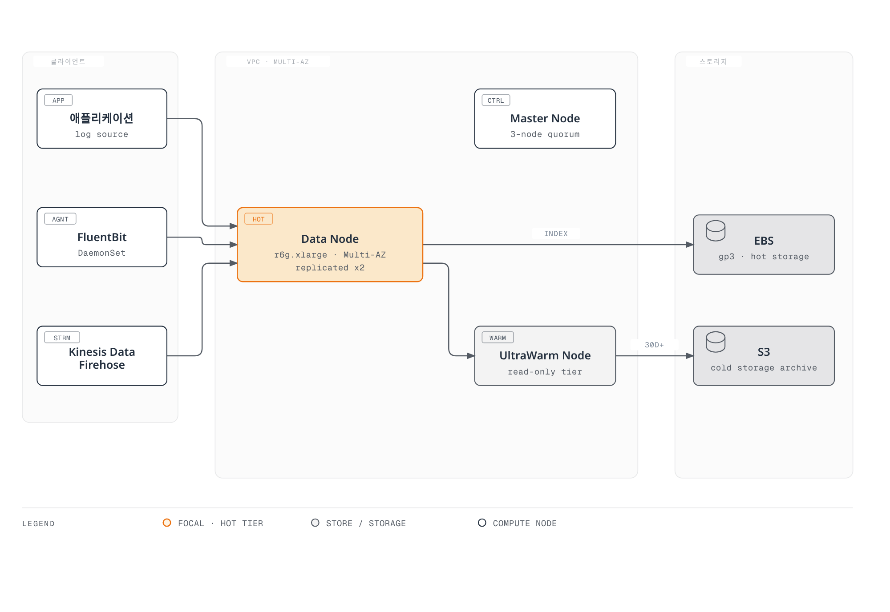
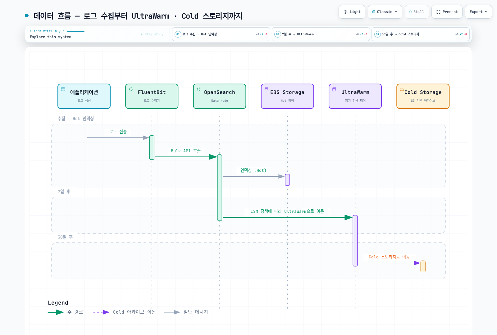

# Amazon OpenSearch Service

> **마지막 업데이트**: 2026년 9월 13일
> **예제 기준**: 프로비저닝형 OpenSearch Service 3.5, Terraform 1.15.7/AWS provider 6.64.0, AWS for Fluent Bit 3.4.15(Fluent Bit 5.0.9). 로컬 설정 검사이며 도메인·수집기·SAML 세션·실제 데이터 전달을 배포 시험하지 않았습니다.

Amazon OpenSearch Service는 검색 클러스터를 관리하며 선택된 OpenSearch 및 legacy Elasticsearch OSS 버전을 지원합니다. 이 장은 VPC 도메인과 기존 hot/UltraWarm/cold 계층을 다룹니다. Serverless collection과 새 optimized-instance 저장소 방식은 별도 설정·API·가용성 조건이 있습니다.

<span id="목차"></span>
<span id="opensearch-vs-elasticsearch"></span>
<span id="amazon-opensearch-service-특징"></span>
<span id="주요-사용-사례"></span>

## 개요

OpenSearch는 Apache 2.0 라이선스의 검색 프로젝트입니다. Elasticsearch 7.10 계열에서 시작했어도 현재의 모든 Elasticsearch client·plugin·API와 호환되는 것은 아닙니다. Elastic은 해당 소스 부분에 AGPLv3 선택권을 추가했으며 SSPL/Elastic License 2.0도 사용합니다. 실제 컴포넌트·배포물의 라이선스를 확인합니다.

현재 AWS 지원 표에는 OpenSearch 3.5가 포함됩니다. 기존 2.11 예제도 **2027년 11월 7일까지 표준 지원 대상**이므로 새 버전이 있다는 이유만으로 지원 종료라고 판단하지 않습니다. 기존 도메인은 지원되는 업그레이드 경로, 호환성을 깨는 변경, 스냅샷과 client 호환성을 확인한 뒤 업그레이드합니다.

로그 분석, 전문 검색, 집계와 보안 분석에 활용할 수 있습니다. 서비스를 켜거나 감사 로그를 보존하는 것만으로 규정 준수가 충족되지는 않습니다.

<span id="노드-유형"></span>

## 아키텍처

### OpenSearch 클러스터 아키텍처



[인터랙티브 다이어그램 보기](https://www.atomai.click/kubernetes-docs/archmaps/ko-observability-logging-02-opensearch-0.html)

개념도이며 정확한 replica·AZ 배치나 용량 권장치가 아닙니다. 그림의 “Master”는 전용 클러스터 관리 역할을 뜻하며 AWS 설정 필드는 여전히 `dedicated_master_*`를 사용합니다. “Kinesis Data Firehose”는 **Amazon Data Firehose**의 이전 이름입니다. UltraWarm과 cold는 모두 S3 기반이고 cold 데이터는 조회 전에 UltraWarm에 연결해야 합니다.

| 역할·계층 | 기능 |
|---|---|
| 전용 cluster-manager node | 클러스터 상태·메타데이터·샤드 배치를 관리합니다. 일반적인 전용 관리자 구성은 3개이며 데이터 replica와는 다릅니다. |
| Data node / hot | 색인·검색을 담당합니다. EBS 지원과 한도는 인스턴스 계열에 따라 다릅니다. |
| UltraWarm | S3 기반 읽기 전용 인덱스와 warm-node 캐시·컴퓨팅입니다. 엔진·인스턴스·전용 관리자 조건을 확인합니다. |
| Cold | 분리된 인덱스 저장소와 별도 수명 주기입니다. 선택한 인덱스를 UltraWarm으로 연결한 뒤 조회합니다. |

Multi-AZ with Standby에는 추가 토폴로지·replica 조건이 있습니다. Zone awareness만 켜서 Standby나 그 가용성 보장이 생기지는 않습니다. VPC Encryption Controls·스토리지 호환성을 포함한 현재 인스턴스 제한을 확인합니다. 기존 r6g/m6g 크기는 예시 입력이며 벤치마크가 아닙니다.

보조 자료: [AWS Instance Benchmark](https://benchmark.aws.atomai.click/). 서비스 용량은 대표 OpenSearch 워크로드로 별도 시험해야 합니다.

### 데이터 흐름



[인터랙티브 다이어그램 보기](https://www.atomai.click/kubernetes-docs/archmaps/ko-observability-logging-02-opensearch-1.html)

7일·30일은 **인덱스 나이 조건** 예시이며 자동 기본값이나 개별 이벤트의 정확한 보존 시간이 아닙니다. ISM은 주기적으로 실행되고 이동은 비동기입니다. 날짜 기반 색인에서는 늦게 도착하거나 재전송한 이벤트가 이미 읽기 전용인 과거 인덱스를 대상으로 할 수 있으므로 이동 전에 처리·보관 방식을 결정합니다.

<span id="aws-console을-통한-생성"></span>

## 도메인 생성

### 사전 조건

같은 VPC의 서로 다른 AZ에 있는 private subnet 3개, 접근 가능한 승인 client 보안 그룹, 기존 service-linked role과 administrator/writer/reader IAM 역할을 준비합니다. 예제는 subnet ID의 중복을 검사하지만 실제 AZ·경로·용량·소유권을 원격 검증하지 않습니다.

Terraform 예제는 **IAM 서명 API 요청**과 IAM master role을 사용해 내부 master password를 Terraform state에 넣지 않습니다. 로그 전송 전에 FGAC 역할을 매핑해야 합니다. 브라우저 SSO는 뒤에서 다루는 별도 접근 구성입니다. IAM principal을 명시한 domain policy에는 SigV4가 필요하며 서명 없는 SAML 브라우저 요청이 자동 허용되지는 않습니다.

### Terraform을 통한 생성

상용 AWS partition·서울 Region 예제입니다. 입력을 일관되게 교체하고 Region별 가용성을 확인합니다. Apply하면 리소스를 생성하지만 감사에서는 로컬 검증만 수행했습니다.

```hcl
terraform {
  required_providers {
    aws = {
      source  = "hashicorp/aws"
      version = "6.64.0"
    }
  }
}

variable "region" {
  type    = string
  default = "ap-northeast-2"
}

variable "account_id" {
  type = string
  validation {
    condition     = can(regex("^[0-9]{12}$", var.account_id))
    error_message = "Use the owning AWS account ID."
  }
}

variable "vpc_id" {
  type = string
}

variable "subnet_ids" {
  type = list(string)
  validation {
    condition     = length(var.subnet_ids) == 3 && length(distinct(var.subnet_ids)) == 3
    error_message = "Provide three distinct subnet IDs, one in each intended AZ."
  }
}

variable "client_security_group_ids" {
  type = set(string)
}

variable "admin_role_arn" {
  type = string
}

variable "writer_role_arns" {
  type = set(string)
}

variable "reader_role_arns" {
  type    = set(string)
  default = []
}

provider "aws" {
  region = var.region
}

locals {
  domain_name = "logs-production"
  domain_arn  = "arn:aws:es:${var.region}:${var.account_id}:domain/${local.domain_name}"
  log_types   = toset(["INDEX_SLOW_LOGS", "SEARCH_SLOW_LOGS", "ES_APPLICATION_LOGS", "AUDIT_LOGS"])
  callers     = setunion(toset([var.admin_role_arn]), var.writer_role_arns, var.reader_role_arns)
}

resource "aws_security_group" "search" {
  name_prefix = "logs-search-"
  description = "OpenSearch HTTPS from approved client security groups"
  vpc_id      = var.vpc_id
}

resource "aws_vpc_security_group_ingress_rule" "clients" {
  for_each                     = var.client_security_group_ids
  security_group_id            = aws_security_group.search.id
  referenced_security_group_id = each.value
  from_port                    = 443
  to_port                      = 443
  ip_protocol                  = "tcp"
}

resource "aws_vpc_security_group_egress_rule" "outbound" {
  security_group_id = aws_security_group.search.id
  cidr_ipv4         = "0.0.0.0/0"
  ip_protocol       = "-1"
}

resource "aws_cloudwatch_log_group" "search" {
  for_each          = local.log_types
  name              = "/aws/opensearch/${local.domain_name}/${lower(each.value)}"
  retention_in_days = 30
}

resource "aws_cloudwatch_log_resource_policy" "search" {
  policy_name = "logs-production-opensearch"
  policy_document = jsonencode({
    Version = "2012-10-17"
    Statement = [{
      Effect    = "Allow"
      Principal = { Service = "es.amazonaws.com" }
      Action    = ["logs:CreateLogStream", "logs:PutLogEvents"]
      Resource  = [for group in aws_cloudwatch_log_group.search : "${group.arn}:*"]
      Condition = {
        StringEquals = { "aws:SourceAccount" = var.account_id }
        ArnEquals    = { "aws:SourceArn" = local.domain_arn }
      }
    }]
  })
}

resource "aws_opensearch_domain" "logs" {
  domain_name    = local.domain_name
  engine_version = "OpenSearch_3.5"

  cluster_config {
    instance_type                 = "r6g.xlarge.search"
    instance_count                = 3
    dedicated_master_enabled      = true
    dedicated_master_type         = "m6g.large.search"
    dedicated_master_count        = 3
    zone_awareness_enabled        = true
    multi_az_with_standby_enabled = false
    zone_awareness_config {
      availability_zone_count = 3
    }
    warm_enabled = true
    warm_type    = "ultrawarm1.medium.search"
    warm_count   = 2
    cold_storage_options {
      enabled = true
    }
  }

  ebs_options {
    ebs_enabled = true
    volume_type = "gp3"
    volume_size = 500
  }

  vpc_options {
    subnet_ids         = var.subnet_ids
    security_group_ids = [aws_security_group.search.id]
  }

  encrypt_at_rest {
    enabled = true
  }
  node_to_node_encryption {
    enabled = true
  }
  domain_endpoint_options {
    enforce_https       = true
    tls_security_policy = "Policy-Min-TLS-1-2-PFS-2023-10"
  }
  advanced_security_options {
    enabled                        = true
    internal_user_database_enabled = false
    master_user_options {
      master_user_arn = var.admin_role_arn
    }
  }

  access_policies = jsonencode({
    Version = "2012-10-17"
    Statement = [{
      Effect    = "Allow"
      Principal = { AWS = sort(tolist(local.callers)) }
      Action    = ["es:ESHttp*"]
      Resource  = "${local.domain_arn}/*"
    }]
  })

  dynamic "log_publishing_options" {
    for_each = aws_cloudwatch_log_group.search
    content {
      cloudwatch_log_group_arn = log_publishing_options.value.arn
      log_type                 = log_publishing_options.key
      enabled                  = true
    }
  }

  depends_on = [aws_cloudwatch_log_resource_policy.search]
}

output "domain_endpoint" {
  value = aws_opensearch_domain.logs.endpoint
}

output "dashboards_endpoint" {
  value = aws_opensearch_domain.logs.dashboard_endpoint
}
```

초기 인스턴스 크기, EBS 500GiB, CloudWatch 30일 보존은 예시입니다. 이 구성은 명시적으로 **Standby 없는 Multi-AZ**를 사용합니다. 참고 예제의 outbound 보안 그룹은 여전히 광범위하므로 운영 전 실제 지원 연결에 맞게 egress 통제를 설계합니다.

Domain policy는 지정 IAM 역할의 HTTP 요청을 허용하고 **FGAC**가 인덱스·클러스터 권한을 제한해야 합니다. URI 기반 IAM 권한만으로 bulk body 안의 인덱스 이름을 통제할 수는 없습니다. Collector에는 의도한 writer 역할만 매핑합니다.

Service-linked role은 계정 단위 의존성입니다. 배포할 때마다 같은 역할을 새로 만들지 말고 해당 역할을 소유하는 인프라 state에서 재사용·import합니다.

OpenSearch 도메인의 자동 스냅샷은 시간 단위로 생성되어 14일간 최대 336개 보존됩니다. 기존 `automated_snapshot_start_hour` 예제는 훨씬 오래된 Elasticsearch 버전용이며 이 OpenSearch 구성에 해당하지 않습니다. 스냅샷은 복구 수단이며 보존·복원 시험을 대신하지 않습니다. Red 상태에서는 스냅샷이 실패할 수 있습니다.

CloudWatch 게시에는 도메인 설정 전에 범위를 제한한 resource policy가 필요합니다. Slow-log 목적지를 켜는 것만으로 모든 slow-log 임계값이 활성화되거나 audit 이벤트가 설정되지는 않습니다. 엔진·감사 설정을 별도로 정하고, 로그에 포함되는 쿼리·문서 내용의 접근·보존도 통제합니다.

<span id="인덱스-앨리어스"></span>

## 인덱스 관리

아래 주 수집 경로는 `logs-production-YYYY.MM.DD` 형태의 **날짜별 인덱스**입니다. Template·ISM·쿼리는 해당 pattern을 사용합니다. 뒤의 rollover 실습은 별도이며 두 쓰기 전략을 암묵적으로 섞지 않습니다.

다음 요청 블록은 OpenSearch Dashboards Dev Tools 문법입니다. 독립 JSON 파일이나 감사에서 실행한 명령이 아닙니다. 승인된 data-plane client와 의도한 도메인을 사용합니다.

### 인덱스 템플릿

```http
PUT _index_template/logs-template
{
  "index_patterns": [
    "logs-production-*"
  ],
  "priority": 100,
  "template": {
    "settings": {
      "number_of_shards": 3,
      "number_of_replicas": 1,
      "refresh_interval": "5s",
      "index.codec": "best_compression",
      "index.translog.durability": "request"
    },
    "mappings": {
      "dynamic": false,
      "properties": {
        "@timestamp": {
          "type": "date"
        },
        "cluster_name": {
          "type": "keyword"
        },
        "environment": {
          "type": "keyword"
        },
        "stream": {
          "type": "keyword"
        },
        "log": {
          "type": "text",
          "index": false
        },
        "kubernetes": {
          "properties": {
            "namespace_name": {
              "type": "keyword"
            },
            "pod_name": {
              "type": "keyword"
            },
            "container_name": {
              "type": "keyword"
            },
            "host": {
              "type": "keyword"
            }
          }
        },
        "app": {
          "properties": {
            "level": {
              "type": "keyword"
            },
            "message": {
              "type": "text",
              "fields": {
                "keyword": {
                  "type": "keyword",
                  "ignore_above": 256
                }
              }
            },
            "error_type": {
              "type": "keyword"
            },
            "trace_id": {
              "type": "keyword"
            },
            "span_id": {
              "type": "keyword"
            },
            "request_id": {
              "type": "keyword"
            },
            "http": {
              "properties": {
                "method": {
                  "type": "keyword"
                },
                "status_code": {
                  "type": "integer"
                },
                "path": {
                  "type": "keyword"
                },
                "response_time_ms": {
                  "type": "float"
                }
              }
            }
          }
        }
      }
    }
  }
}
```

Kubernetes filter의 필드는 `kubernetes.namespace`가 아닌 `kubernetes.namespace_name`입니다. 앱 JSON은 수집기 메타데이터와 구분하도록 `app` 아래에 넣습니다. 애플리케이션이 정해진 필드·단위를 제공해야 하며 예제는 소문자 `app.level`과 밀리초 `app.http.response_time_ms`를 사용합니다.

수집기 메타데이터 추가 전 애플리케이션이 출력하는 한 줄 JSON 예시입니다.

```json
{"level":"error","message":"request failed","error_type":"upstream_timeout","http":{"method":"GET","path":"/orders","status_code":503,"response_time_ms":1250}}
```

`message.keyword`에 해당하는 `app.message.keyword`를 명시적으로 정의했습니다. `text` mapping만으로 이 하위 필드가 자동 생성되지는 않습니다. `ignore_above`를 넘는 값은 해당 subfield에 인덱싱되지 않습니다. 임의 메시지 대신 범위가 제한된 `error_type` 분류를 집계하는 방법도 검토합니다.

`dynamic: false`는 새 mapped field를 제한하지만 **알 수 없는 필드를 `_source`에서 제거하지 않습니다**. 원문 `log`는 검색 인덱스 없이 저장합니다. 중복, 사전 삭제·마스킹과 원문 접근을 검토합니다. 설명 없는 async/30s 내구성 절충보다 `translog.durability: request`를 기준으로 삼았지만, 어느 설정도 모든 저장소·replica 장애의 복구를 보장하지는 않습니다.

### ISM (Index State Management) 정책

```http
PUT _plugins/_ism/policies/logs-lifecycle
{
  "policy": {
    "description": "Illustrative daily-index hot/warm/cold retention; confirm ownership and late-arrival handling.",
    "schema_version": 1,
    "default_state": "hot",
    "states": [
      {
        "name": "hot",
        "actions": [],
        "transitions": [
          {
            "state_name": "warm",
            "conditions": {
              "min_index_age": "7d"
            }
          }
        ]
      },
      {
        "name": "warm",
        "actions": [
          {
            "warm_migration": {}
          }
        ],
        "transitions": [
          {
            "state_name": "cold",
            "conditions": {
              "min_index_age": "30d"
            }
          }
        ]
      },
      {
        "name": "cold",
        "actions": [
          {
            "cold_migration": {
              "timestamp_field": "@timestamp"
            }
          }
        ],
        "transitions": [
          {
            "state_name": "delete",
            "conditions": {
              "min_index_age": "90d"
            }
          }
        ]
      },
      {
        "name": "delete",
        "actions": [
          {
            "cold_delete": {}
          }
        ],
        "transitions": []
      }
    ],
    "ism_template": [
      {
        "index_patterns": [
          "logs-production-*"
        ],
        "priority": 100
      }
    ]
  }
}
```

정책은 새로 생성되는 일치 인덱스에 연결됩니다. 기존 인덱스에는 별도 연결 작업이 필요하므로 변경 전에 `_plugins/_ism/explain/INDEX`와 정책 버전을 확인합니다.

각 action 객체에는 작업 하나와 지원되는 retry/timeout 메타데이터를 둡니다. 관리형 `warm_migration`, `cold_migration`, **`cold_delete`**는 자체 설치 ISM과 다릅니다. Cold 인덱스 삭제에는 `cold_delete`가 필요하고 ISM cold migration에는 timestamp field를 명시해야 합니다. Warm 이동·replica 변경·force merge를 한 action 객체에 넣지 않습니다.

ISM은 보통 5–8분마다 작업을 평가하며 red 클러스터에서는 실행하지 않습니다. 인덱스 나이는 생성 시점부터 계산합니다. 예제의 90일 삭제는 조직이 선택하는 정책이며 보편적인 법적 요건이나 레코드별 정확한 만료 시간이 아닙니다. 삭제 활성화 전에 지연 데이터·스냅샷·복구를 시험합니다.

### 인덱스 앨리어스와 Rollover

다음 독립 예제는 `rollover-logs-*` prefix와 writer alias를 사용합니다. 날짜 기반 수집기 설정은 바꾸지 않습니다.

```http
PUT _index_template/rollover-logs
{
  "index_patterns": [
    "rollover-logs-*"
  ],
  "priority": 100,
  "template": {
    "settings": {
      "number_of_shards": 3,
      "number_of_replicas": 1,
      "plugins.index_state_management.rollover_alias": "rollover-logs-write"
    },
    "mappings": {
      "properties": {
        "@timestamp": {
          "type": "date"
        },
        "message": {
          "type": "text"
        }
      }
    }
  }
}

PUT _plugins/_ism/policies/rollover-logs
{
  "policy": {
    "description": "Independent rollover example; not attached to date-based collector indexes.",
    "schema_version": 1,
    "default_state": "write",
    "states": [
      {
        "name": "write",
        "actions": [
          {
            "rollover": {
              "min_index_age": "1d",
              "min_primary_shard_size": "30gb"
            }
          }
        ],
        "transitions": []
      }
    ],
    "ism_template": [
      {
        "index_patterns": [
          "rollover-logs-*"
        ],
        "priority": 100
      }
    ]
  }
}

PUT rollover-logs-000001
{
  "aliases": {
    "rollover-logs-write": {
      "is_write_index": true
    }
  }
}

POST rollover-logs-write/_doc
{
  "@timestamp": "2026-09-13T00:00:00Z",
  "message": "synthetic rollover example"
}

GET _plugins/_ism/explain/rollover-logs-000001

POST rollover-logs-write/_rollover
{
  "conditions": {
    "max_age": "1d",
    "max_size": "90gb"
  }
}
```

자동 ISM rollover에는 rollover alias 설정, 번호가 붙은 인덱스와 write alias가 필요합니다. Alias가 존재한다고 날짜 기반 writer가 그 alias를 사용하지는 않습니다.

ISM의 `min_primary_shard_size: 30gb`는 primary shard 하나에 대한 조건입니다. OpenSearch 3.5 rollover REST parser는 `max_age`, `max_docs`, `max_size`를 받으며 `max_size`는 replica를 제외한 **전체 primary shard 크기**입니다. 따라서 REST 예제의 90GB와 primary 하나의 30GB는 같은 조건이 아닙니다. Rollover 조건은 모두 충족해야 하는 것이 아니라 대안 조건입니다.

<span id="fluentbit에서-opensearch로-직접-전송"></span>
<span id="fluentbit-daemonset-irsa-사용"></span>

## 데이터 수집

### Fluent Bit에서 직접 전송

다음 6개 리소스는 적격 **Linux EC2 Node**의 참고 수집기 설정입니다. Fargate는 플랫폼 로그 라우터를 사용하고 Windows·다른 플랫폼에는 별도 경로·배포 방식이 필요합니다. Node 로그를 읽는 agent 배포 전 host path, admission 정책 예외와 자원을 확인합니다.

실제 domain hostname, Region, IRSA role을 설정합니다. 역할의 OIDC trust는 `system:serviceaccount:logging:fluent-bit`와 맞아야 하며 IAM/data-plane 접근 및 FGAC writer 역할도 필요합니다. Pod Identity는 node/agent/SDK가 지원할 때 별도로 선택할 수 있습니다.

```yaml
apiVersion: v1
kind: Namespace
metadata:
  name: logging
---
apiVersion: v1
kind: ServiceAccount
metadata:
  name: fluent-bit
  namespace: logging
  annotations:
    eks.amazonaws.com/role-arn: arn:aws:iam::123456789012:role/FluentBitOpenSearchRole
---
apiVersion: rbac.authorization.k8s.io/v1
kind: ClusterRole
metadata:
  name: fluent-bit-metadata
rules:
- apiGroups:
  - ''
  resources:
  - namespaces
  - pods
  verbs:
  - get
  - list
  - watch
---
apiVersion: rbac.authorization.k8s.io/v1
kind: ClusterRoleBinding
metadata:
  name: fluent-bit-metadata
roleRef:
  apiGroup: rbac.authorization.k8s.io
  kind: ClusterRole
  name: fluent-bit-metadata
subjects:
- kind: ServiceAccount
  name: fluent-bit
  namespace: logging
---
apiVersion: v1
kind: ConfigMap
metadata:
  name: fluent-bit-config
  namespace: logging
data:
  fluent-bit.conf: |
    [SERVICE]
        Flush          5
        Log_Level      info
        HTTP_Server    Off
        storage.path   /buffers/storage
        storage.sync   normal

    [INPUT]
        Name               tail
        Tag                kube.*
        Path               /var/log/containers/*.log
        Exclude_Path       /var/log/containers/fluent-bit-*_logging_fluent-bit-*.log
        multiline.parser   docker, cri
        DB                 /buffers/tail.db
        Mem_Buf_Limit      50MB
        Skip_Long_Lines    On
        Refresh_Interval   10
        storage.type       filesystem

    [FILTER]
        Name                kubernetes
        Match               kube.*
        Kube_Tag_Prefix     kube.var.log.containers.
        Merge_Log           On
        Merge_Log_Key       app
        Keep_Log            On
        Labels              Off
        Annotations         Off
        K8S-Logging.Parser  Off
        K8S-Logging.Exclude Off

    [FILTER]
        Name    modify
        Match   kube.*
        Set     cluster_name example-eks
        Set     environment example

    [OUTPUT]
        Name                    opensearch
        Match                   kube.*
        Host                    REPLACE_WITH_DOMAIN_ENDPOINT
        Port                    443
        tls                     On
        tls.verify              On
        AWS_Auth                On
        AWS_Region              ap-northeast-2
        Suppress_Type_Name      On
        Logstash_Format         On
        Logstash_Prefix         logs-production
        Time_Key                @timestamp
        Generate_ID             On
        Retry_Limit             5
        Buffer_Size             5MB
        Compress                gzip
        storage.total_limit_size 1G
---
apiVersion: apps/v1
kind: DaemonSet
metadata:
  name: fluent-bit
  namespace: logging
spec:
  selector:
    matchLabels:
      app: fluent-bit
  template:
    metadata:
      labels:
        app: fluent-bit
    spec:
      serviceAccountName: fluent-bit
      nodeSelector:
        kubernetes.io/os: linux
      tolerations:
      - operator: Exists
        effect: NoSchedule
      containers:
      - name: fluent-bit
        image: public.ecr.aws/aws-observability/aws-for-fluent-bit:3.4.15@sha256:88e1b56cedb230486afeca6eeb26c5f6bd59c48879d0054d1674d5a58838c607
        args:
        - -c
        - /fluent-bit/custom/fluent-bit.conf
        securityContext:
          runAsUser: 0
          allowPrivilegeEscalation: false
          readOnlyRootFilesystem: true
          capabilities:
            drop:
            - ALL
          seccompProfile:
            type: RuntimeDefault
        resources:
          requests:
            cpu: 100m
            memory: 128Mi
          limits:
            memory: 512Mi
        volumeMounts:
        - name: logs
          mountPath: /var/log
          readOnly: true
        - name: buffers
          mountPath: /buffers
        - name: config
          mountPath: /fluent-bit/custom
          readOnly: true
        - name: tmp
          mountPath: /tmp
        command:
        - /fluent-bit/bin/fluent-bit
      volumes:
      - name: logs
        hostPath:
          path: /var/log
          type: Directory
      - name: buffers
        hostPath:
          path: /var/lib/fluent-bit-opensearch
          type: DirectoryOrCreate
      - name: config
        configMap:
          name: fluent-bit-config
      - name: tmp
        emptyDir: {}
```

이미지 index를 digest로 고정하고 Linux amd64/arm64 메타데이터를 확인했습니다. 이 이미지의 기본 CMD는 entrypoint script이므로 예제는 `/fluent-bit/bin/fluent-bit`와 **native OpenSearch output**을 명시적으로 사용합니다. Legacy Go output plugin을 로드하거나 이미지 runtime을 시험한 구성이 아닙니다.

설정 사이의 중요한 관계는 다음과 같습니다.

- `multiline.parser docker, cri`가 지원 container framing을 처리하고, Kubernetes filter가 앱 JSON을 `app` 아래에 병합합니다.
- 읽기 전용 `/var/log`는 입력용입니다. Tail DB·파일시스템 버퍼는 별도 writable Node 경로를 사용합니다. 해당 Node·경로가 남아 있을 때만 Pod 재시작 후 유지되며 Node 간 영속 저장소가 아닙니다.
- Metadata RBAC는 Pod·namespace 읽기 작업으로 제한합니다. Agent는 Node 로그를 읽으므로 namespace·역할·설정을 보호합니다.
- 앱 annotation이 파싱을 바꾸거나 로그를 제외하지 못하도록 했고, cluster/environment 값은 수집기가 지정합니다. Feedback loop를 줄이기 위해 수집기 자신의 로그는 이 경로에서 제외합니다.
- Typeless OpenSearch 2.x/3.x API에는 `Suppress_Type_Name On`이 필요합니다. `Type _doc`는 호환 대안이 아닙니다.
- `Logstash_Format On`이 날짜 기반 인덱스와 `@timestamp`를 만듭니다. 선택적 rollover alias로 쓰는 설정이 아닙니다.
- Retry, `Generate_ID`, 메모리 버퍼와 output 저장 한도는 exactly-once·무손실 보장이 아닙니다. 부분 bulk 오류, 긴 라인, 재시작 offset, 재시도 한도, 디스크 압력과 지연 데이터를 시험합니다. Output 한도는 Node 디스크 전체의 상한이 아닙니다.

원문 `log`에는 `app`에 있는 데이터가 중복될 수 있습니다. 저장하면 안 되는 내용을 먼저 제거하고 거부 기록을 모니터링합니다. 요청 body tracing을 상시 진단 설정으로 켜지 않습니다.

<span id="kinesis-data-firehose를-통한-수집"></span>

### Amazon Data Firehose를 통한 수집

Data Firehose는 buffering·retry·backup 통제를 제공하는 관리형 전송 대안이며 모든 워크로드에서 가장 저렴하거나 간단한 방식은 아닙니다. Terraform 리소스 이름은 여전히 `aws_kinesis_firehose_delivery_stream`입니다.

다음 선택적 리소스 파일은 앞의 도메인과 기존의 승인 delivery role·subnet·보안 그룹·비공개 backup bucket 입력을 사용합니다.

```hcl
variable "firehose_role_arn" {
  type = string
}

variable "firehose_subnet_ids" {
  type = list(string)
}

variable "firehose_security_group_ids" {
  type = list(string)
}

variable "backup_bucket_arn" {
  type = string
}

resource "aws_cloudwatch_log_group" "firehose" {
  name              = "/aws/kinesisfirehose/logs-to-opensearch"
  retention_in_days = 30
}

resource "aws_cloudwatch_log_stream" "firehose" {
  name           = "opensearch-delivery"
  log_group_name = aws_cloudwatch_log_group.firehose.name
}

resource "aws_kinesis_firehose_delivery_stream" "logs" {
  name        = "logs-to-opensearch"
  destination = "opensearch"

  opensearch_configuration {
    domain_arn            = aws_opensearch_domain.logs.arn
    role_arn              = var.firehose_role_arn
    index_name            = "logs-production-firehose"
    index_rotation_period = "OneDay"
    buffering_interval    = 60
    buffering_size        = 5
    retry_duration        = 300
    s3_backup_mode        = "FailedDocumentsOnly"

    vpc_config {
      subnet_ids         = var.firehose_subnet_ids
      security_group_ids = var.firehose_security_group_ids
      role_arn           = var.firehose_role_arn
    }

    cloudwatch_logging_options {
      enabled         = true
      log_group_name  = aws_cloudwatch_log_group.firehose.name
      log_stream_name = aws_cloudwatch_log_stream.firehose.name
    }

    s3_configuration {
      role_arn           = var.firehose_role_arn
      bucket_arn         = var.backup_bucket_arn
      prefix             = "opensearch-failed/"
      buffering_size     = 10
      buffering_interval = 400
      compression_format = "GZIP"
    }
  }
}
```

Delivery role에는 필요한 OpenSearch/FGAC, S3, CloudWatch, VPC/ENI 및 KMS 권한이 있어야 합니다. 역할 trust와 배포자의 `iam:PassRole`은 별도입니다. Delivery role을 domain caller 입력·writer mapping에 포함하고 VPC 연결이 도메인 443 포트에 도달하도록 구성합니다.

Backup mode는 `FailedDocumentsOnly`로 선택합니다. S3 prefix 이름을 `failed/`로 정하는 것만으로 실패 데이터만 저장하는 것은 아닙니다. 비공개 backup bucket의 실패·재전송을 시험합니다. Firehose 입력도 timestamp를 포함해 mapping과 맞아야 하며 서비스가 이 예제의 Kubernetes metadata·application envelope를 자동 생성하지는 않습니다.

<span id="대시보드-접근-설정"></span>
<span id="인덱스-패턴-생성"></span>
<span id="시각화-생성"></span>

## OpenSearch Dashboards

### 접근과 인덱스 패턴

승인된 VPC 연결과 domain policy에 맞는 인증을 사용합니다. 단순 SSH 터널만으로 원래 TLS hostname, SSO redirect, SigV4 서명이 유지되지는 않습니다. `https://localhost:9200`에 접속하기 위해 인증서 검증을 끄지 않습니다. ALB 하나가 완전한 domain/Dashboards 연동 구성은 아닙니다.

인증된 접근을 구성한 뒤 `logs-production-*` data view/index pattern을 만들고 시간 필드로 `@timestamp`를 선택합니다. 메뉴 이름은 Dashboards 버전과 활성화한 UI에 따라 다릅니다.

### 검색 쿼리 예시

```http
GET logs-production-*/_search
{
  "query": {
    "bool": {
      "filter": [
        {
          "term": {
            "app.level": "error"
          }
        },
        {
          "range": {
            "@timestamp": {
              "gte": "now-1h"
            }
          }
        },
        {
          "term": {
            "kubernetes.namespace_name": "production"
          }
        }
      ]
    }
  },
  "sort": [
    {
      "@timestamp": {
        "order": "desc"
      }
    }
  ],
  "size": 100
}

GET logs-production-*/_search
{
  "size": 0,
  "query": {
    "bool": {
      "filter": [
        {
          "term": {
            "app.level": "error"
          }
        },
        {
          "range": {
            "@timestamp": {
              "gte": "now-24h"
            }
          }
        }
      ]
    }
  },
  "aggs": {
    "by_namespace": {
      "terms": {
        "field": "kubernetes.namespace_name",
        "size": 20
      },
      "aggs": {
        "by_type": {
          "terms": {
            "field": "app.error_type",
            "size": 10
          }
        }
      }
    }
  }
}

GET logs-production-*/_search
{
  "size": 0,
  "query": {
    "bool": {
      "filter": [
        {
          "exists": {
            "field": "app.http.response_time_ms"
          }
        },
        {
          "range": {
            "@timestamp": {
              "gte": "now-1h"
            }
          }
        }
      ]
    }
  },
  "aggs": {
    "response_time_percentiles": {
      "percentiles": {
        "field": "app.http.response_time_ms",
        "percents": [
          50,
          75,
          90,
          95,
          99
        ]
      }
    }
  }
}
```

정확한 keyword·시간 조건을 filter context에서 평가합니다. 두 번째 쿼리는 실제로 error만 필터링한 뒤 namespace를 집계합니다. Terms aggregation은 top-N이며 분산 근사·제외 bucket이 존재할 수 있으므로 모든 namespace의 완전한 건수와 같지 않습니다. Percentile은 근사치이며 mapping의 밀리초 필드를 사용합니다.

시각화에는 `app.level`, `@timestamp`의 시간 histogram, 명시적으로 mapping한 `app.message.keyword`/`app.error_type`을 사용합니다. 대시보드에서 필드 이름을 쓰는 것만으로 mapping이 생성되지는 않습니다.

<span id="fine-grained-access-control-fgac"></span>
<span id="문서-수준-보안-dls"></span>
<span id="필드-수준-보안-fls"></span>

## 보안 설정

### Fine-Grained Access Control

네트워크 접근, domain resource policy와 FGAC는 별도 계층입니다. Terraform의 IAM principal policy에는 SigV4가 필요합니다. 보안 그룹 허용이나 IAM 요청 성공만으로 인덱스 접근 권한이 생기지 않습니다.

관리자가 수집기 writer와 namespace 범위 reader를 정의할 수 있습니다.

```http
PUT _plugins/_security/api/roles/logs-writer
{
  "cluster_permissions": [
    "cluster_composite_ops"
  ],
  "index_permissions": [
    {
      "index_patterns": [
        "logs-production-*"
      ],
      "allowed_actions": [
        "create_index",
        "write"
      ]
    }
  ]
}

PUT _plugins/_security/api/rolesmapping/logs-writer
{
  "backend_roles": [
    "arn:aws:iam::123456789012:role/FluentBitOpenSearchRole"
  ]
}

PUT _plugins/_security/api/roles/team-a-logs
{
  "cluster_permissions": [
    "cluster_composite_ops_ro"
  ],
  "index_permissions": [
    {
      "index_patterns": [
        "logs-production-*"
      ],
      "dls": "{\"term\":{\"kubernetes.namespace_name\":\"team-a\"}}",
      "allowed_actions": [
        "read"
      ]
    }
  ]
}

PUT _plugins/_security/api/rolesmapping/team-a-logs
{
  "backend_roles": [
    "arn:aws:iam::123456789012:role/TeamAReaderRole"
  ]
}
```

ARN은 승인된 실제 identity로 교체합니다. Firehose를 사용하면 delivery role도 writer mapping에 추가해야 합니다. 일반 reader에게 `cluster_all`이나 master role을 주지 않습니다. IAM backend-role mapping과 내부 사용자·SAML username은 다른 신원 체계입니다.

### 문서 수준 보안과 필드 수준 보안

DLS는 저장된 필드로 문서를 필터링합니다. 이 예제에서는 신뢰된 수집기가 namespace metadata를 만들어야 하며 앱이 제공한 문자열 자체가 테넌트 신원의 증거는 아닙니다.

다음 **결합 역할**은 namespace 제한을 유지하면서 선택한 응답 필드만 허용합니다.

```http
PUT _plugins/_security/api/roles/team-a-limited
{
  "cluster_permissions": [
    "cluster_composite_ops_ro"
  ],
  "index_permissions": [
    {
      "index_patterns": [
        "logs-production-*"
      ],
      "fls": [
        "@timestamp",
        "kubernetes.namespace_name",
        "app.level",
        "app.message"
      ],
      "allowed_actions": [
        "read"
      ],
      "dls": "{\"term\":{\"kubernetes.namespace_name\":\"team-a\"}}"
    }
  ]
}
```

더 넓은 권한이 있는 identity에 제한 역할만 추가하지 말고 의도한 역할을 매핑하며, 전체 effective role을 평가합니다. 원문 `log`는 숨긴 JSON 필드를 중복 포함할 수 있어 allowlist에서 제외했습니다.

FLS는 반환 필드를 통제하며 허용된 message 문자열 내부의 내용을 가리지 않습니다. `_source`, 스냅샷·보관 파일에서 정보를 삭제하지도 않습니다. Search/get/multi-search/aggregation 접근을 시험하고, 수집하면 안 되는 정보는 처음부터 기록하지 않습니다.

### SAML 인증 설정

관리형 OpenSearch Service의 SAML은 자체 설치용 `opensearch-security/config.yml` 업로드가 아니라 **AWS domain configuration API**로 설정합니다.

다음 로컬 helper는 승인된 IdP XML을 수동 escape 없이 JSON으로 직렬화합니다. 예제 관리자 그룹·role attribute key는 검토한 실제 IdP 설정으로 교체합니다.

```python
from pathlib import Path
import json
import xml.etree.ElementTree as ET

metadata = Path("idp-metadata.xml").read_text(encoding="utf-8")
root = ET.fromstring(metadata)
if root.tag.rsplit("}", 1)[-1] != "EntityDescriptor" or not root.get("entityID"):
    raise ValueError("Provide approved metadata for one IdP EntityDescriptor")
options = {
    "SAMLOptions": {
        "Enabled": True,
        "Idp": {"EntityId": root.get("entityID"), "MetadataContent": metadata},
        "MasterBackendRole": "opensearch-admin",
        "RolesKey": "Role",
        "SessionTimeoutMinutes": 60,
    }
}
Path("advanced-security-saml.json").write_text(json.dumps(options, indent=2) + "\n")
```

```bash
aws opensearch update-domain-config \
  --domain-name logs-production --region ap-northeast-2 \
  --advanced-security-options file://advanced-security-saml.json
```

Payload 예제이며 완전한 SSO 배포가 아닙니다. Metadata 신뢰, entity ID, 인증서, ACS/Dashboards URL과 mapping을 검증합니다. SAML 브라우저 트래픽에는 맞는 domain access policy가 필요합니다. `SAMLOptions`를 켜도 앞의 IAM-only policy에 필요한 SigV4 요청으로 바뀌지 않습니다. 일관된 인증 구성을 선택하고 기존 도메인 변경 전 관리자 복구를 시험합니다.

<span id="스토리지-티어링"></span>
<span id="비용-비교-100gb-일-기준"></span>
<span id="인덱스-최적화"></span>
<span id="reserved-instance"></span>

## 비용 최적화

### 스토리지와 인덱스 설정

선택한 Region, 인스턴스 계열·개수, replica, EBS, warm 컴퓨팅·저장소, cold, 전송·수집 경로를 함께 산정합니다. 기존 100GB/일 달러 합계·고정 절감률은 재현에 필요한 가정이 부족해 현재 예산이나 측정 비교가 아닙니다.

압축, refresh interval, shard 수와 mapping은 저장·CPU, 검색 freshness, 쿼리 기능과 복구 비용을 절충합니다. `index.codec` 같은 static 설정은 생성 template에 두고 모든 열린 운영 인덱스에 무작정 변경 요청을 보내지 않습니다. Text position을 제거하거나 필드를 끄면 쿼리가 깨질 수 있습니다.

Reserved Instance 할인은 대상 사용량·Region·기간·결제 방식에 따라 다릅니다. 1년 사용 계획만으로 구매를 결정하거나 node 할인이 모든 저장·전송 비용에 적용된다고 가정하지 않습니다. 기존 고정 21/24/36% 대신 현재 가격·실측 수요로 판단합니다.

<span id="역인덱스-구조의-비효율"></span>
<span id="집계-쿼리-성능-저하"></span>
<span id="스케일링-비용-문제"></span>
<span id="clickhouse-마이그레이션-판단-기준"></span>

## 대규모 로그 환경에서의 한계

OpenSearch는 역인덱스뿐 아니라 여러 집계·정렬에 **컬럼형 doc values**를 사용합니다. 집계할 때 항상 모든 `_source` 문서 전체를 다시 읽는 구조가 아닙니다. Mapping, 선택도, shard, cache, segment 배치와 동시 작업에 따라 성능이 달라집니다.

기존 OpenSearch/ClickHouse 지연·압축 수치에는 재현 가능한 하드웨어·버전·데이터·쿼리 근거가 없었습니다. 이를 보편적인 100GB 전환 기준이나 모든 조직의 쿼리 90%가 같은 패턴이라는 주장으로 사용하지 않습니다.

같은 데이터·보존·내구성·동시성 조건에서 대표 전문 검색, 필터, 집계·조사 쿼리를 비교합니다. 수집·backfill 비용, 스키마 변경, 권한, 대시보드, 운영 역량과 롤백을 평가합니다. 이중 적재 실험에는 정합성·비용 통제가 필요하며 고정 2주·2개월 일정이 보장은 아닙니다.

<span id="기능-비교"></span>
<span id="사용-사례별-권장"></span>
<span id="마이그레이션-고려사항"></span>

## Loki와의 비교

| 영역 | OpenSearch | Loki |
|---|---|---|
| 인덱스·쿼리 모델 | Mapped field, 역인덱스·doc values, Query DSL과 지원 SQL/PPL 기능 | 스트림 레이블 인덱스, 청크 스캔, LogQL 파이프라인·메트릭 |
| 텍스트 검색 | Analyzer, relevance와 전문 검색 기능 | 선택한 스트림·시간 범위에서 본문 필터링·검색 |
| 접근 통제 | Network/IAM/FGAC와 구성한 문서·필드 권한 | 인증 gateway, 테넌트 인가와 정책·운영 통제 |
| 비용·운영 | 프로비저닝·관리 모델과 워크로드에 따라 달라짐 | 배포 모드, 스트림, 객체 저장소, 캐시와 쿼리에 따라 달라짐 |
| 이전 | Mapping·쿼리를 재구성하고 권한·데이터 정합성 확인 | 레이블·metadata·쿼리를 재설계하고 권한·데이터 정합성 확인 |

어느 제품도 자동으로 규정 준수·최저 비용·간단한 운영을 보장하지 않습니다. Loki도 텍스트 검색과 파생 메트릭을 지원합니다. 이전은 의미·기능의 변화이며 고정 3–5배 비용 또는 60–80% 절감 공식이 아닙니다.

## 검증과 참고 자료

로컬 검사는 Terraform 리소스 설정과 공개한 데이터·설정 관계를 다룹니다. 실제 AWS 인가, Region별 SKU 용량, 수집기 전달, ISM 이동·삭제, SAML 인증·쿼리 성능을 입증하지 않습니다. 이미지 index·configuration metadata는 읽었지만 실행 layer를 내려받거나 컨테이너를 실행하지 않았습니다.

- [서비스·버전 지원](https://docs.aws.amazon.com/opensearch-service/latest/developerguide/what-is.html)
- [지원 인스턴스](https://docs.aws.amazon.com/opensearch-service/latest/developerguide/supported-instance-types.html)와 [Multi-AZ](https://docs.aws.amazon.com/opensearch-service/latest/developerguide/managedomains-multiaz.html)
- [VPC 접근](https://docs.aws.amazon.com/opensearch-service/latest/developerguide/vpc.html), [접근 정책](https://docs.aws.amazon.com/opensearch-service/latest/developerguide/ac.html), [FGAC](https://docs.aws.amazon.com/opensearch-service/latest/developerguide/fgac.html)
- [UltraWarm](https://docs.aws.amazon.com/opensearch-service/latest/developerguide/ultrawarm.html), [cold](https://docs.aws.amazon.com/opensearch-service/latest/developerguide/cold-storage.html), [관리형 ISM](https://docs.aws.amazon.com/opensearch-service/latest/developerguide/ism.html), [ISM 정책](https://docs.opensearch.org/latest/im-plugin/ism/policies/)
- [Rollover API](https://docs.opensearch.org/latest/api-reference/index-apis/rollover/)와 [doc values](https://docs.opensearch.org/latest/field-types/mapping-parameters/doc-values/)
- [스냅샷](https://docs.aws.amazon.com/opensearch-service/latest/developerguide/managedomains-snapshots.html), [CloudWatch 로그](https://docs.aws.amazon.com/opensearch-service/latest/developerguide/createdomain-configure-slow-logs.html), [SAML](https://docs.aws.amazon.com/opensearch-service/latest/developerguide/saml.html)
- [AWS for Fluent Bit 릴리스](https://github.com/aws/aws-for-fluent-bit/blob/mainline/CHANGELOG.md)와 [OpenSearch output](https://raw.githubusercontent.com/fluent/fluent-bit-docs/master/pipeline/outputs/opensearch.md)
- [Data Firehose 목적지 설정](https://docs.aws.amazon.com/firehose/latest/dev/create-destination.html)
- [현재 서비스 가격](https://aws.amazon.com/opensearch-service/pricing/)
- [Elastic 라이선스 FAQ](https://www.elastic.co/pricing/faq/licensing)

## 퀴즈

[OpenSearch 퀴즈](../../quizzes/observability/logging/02-opensearch-quiz.md)에서 위 차이를 확인합니다.
