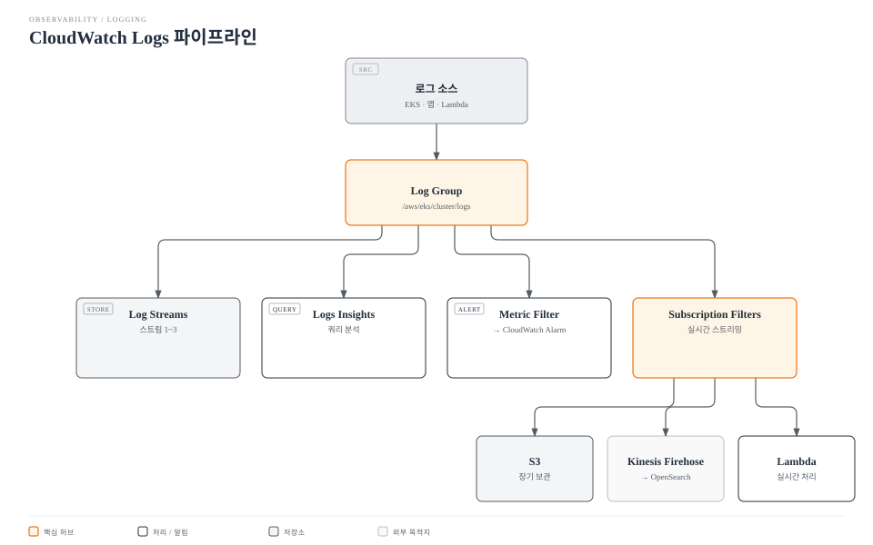

# CloudWatch Logs

> **마지막 업데이트**: 2026년 2월 20일

Amazon CloudWatch Logs는 AWS의 완전관리형 로그 모니터링 서비스입니다. EKS와 네이티브로 통합되어 별도의 인프라 관리 없이 로그 수집, 저장, 분석이 가능합니다.

## 목차

1. [개요](#개요)
2. [EKS 컨트롤 플레인 로깅](#eks-컨트롤-플레인-로깅)
3. [Container Insights](#container-insights)
4. [FluentBit 연동](#fluentbit-연동)
5. [CloudWatch Logs Insights](#cloudwatch-logs-insights)
6. [Subscription Filters](#subscription-filters)
7. [비용 최적화](#비용-최적화)

---

## 개요

### CloudWatch Logs 특징

| 특징 | 설명 |
|------|------|
| **완전 관리형** | 인프라 관리 불필요 |
| **AWS 통합** | EKS, Lambda, EC2 등 네이티브 통합 |
| **보안** | IAM, KMS 암호화, VPC 엔드포인트 |
| **확장성** | 무제한 로그 수집/저장 |
| **실시간** | 실시간 로그 스트리밍 및 알림 |

### 핵심 개념



### 용어 정리

| 용어 | 설명 | 예시 |
|------|------|------|
| **Log Group** | 로그 스트림의 논리적 그룹 | `/aws/eks/my-cluster/cluster` |
| **Log Stream** | 단일 소스의 로그 시퀀스 | `kube-apiserver-xxx` |
| **Log Event** | 개별 로그 항목 | 타임스탬프 + 메시지 |
| **Retention** | 로그 보존 기간 | 1일 ~ 영구 |

---

## EKS 컨트롤 플레인 로깅

### 로그 유형

| 로그 유형 | 설명 | 권장 여부 |
|----------|------|----------|
| **api** | Kubernetes API 서버 로그 | 필수 |
| **audit** | API 호출 감사 로그 | 필수 (보안) |
| **authenticator** | IAM 인증 로그 | 권장 |
| **controllerManager** | 컨트롤러 매니저 로그 | 선택 |
| **scheduler** | 스케줄러 로그 | 선택 |

### AWS CLI로 활성화

```bash
# 모든 컨트롤 플레인 로그 활성화
aws eks update-cluster-config \
  --name my-cluster \
  --region ap-northeast-2 \
  --logging '{
    "clusterLogging": [
      {
        "types": ["api", "audit", "authenticator", "controllerManager", "scheduler"],
        "enabled": true
      }
    ]
  }'

# 특정 로그만 활성화
aws eks update-cluster-config \
  --name my-cluster \
  --region ap-northeast-2 \
  --logging '{
    "clusterLogging": [
      {
        "types": ["api", "audit", "authenticator"],
        "enabled": true
      },
      {
        "types": ["controllerManager", "scheduler"],
        "enabled": false
      }
    ]
  }'
```

### Terraform으로 설정

```hcl
resource "aws_eks_cluster" "main" {
  name     = "my-cluster"
  role_arn = aws_iam_role.eks_cluster.arn
  version  = "1.29"

  vpc_config {
    subnet_ids              = var.subnet_ids
    endpoint_private_access = true
    endpoint_public_access  = true
  }

  enabled_cluster_log_types = [
    "api",
    "audit",
    "authenticator"
  ]

  tags = {
    Environment = "production"
  }
}

# 로그 그룹 보존 기간 설정
resource "aws_cloudwatch_log_group" "eks" {
  name              = "/aws/eks/my-cluster/cluster"
  retention_in_days = 30

  tags = {
    Environment = "production"
    Cluster     = "my-cluster"
  }
}
```

### 로그 그룹 구조

```
/aws/eks/my-cluster/cluster
├── kube-apiserver-xxx           # API 서버 로그
├── kube-apiserver-audit-xxx     # 감사 로그
├── authenticator-xxx            # 인증 로그
├── kube-controller-manager-xxx  # 컨트롤러 매니저
└── kube-scheduler-xxx           # 스케줄러
```

---

## Container Insights

### Container Insights 개요

Container Insights는 EKS 클러스터의 컨테이너화된 애플리케이션과 마이크로서비스에서 메트릭과 로그를 수집, 집계, 요약합니다.

### 설치 방법

#### CloudWatch Agent + FluentBit (권장)

```bash
# 네임스페이스 생성
kubectl create namespace amazon-cloudwatch

# CloudWatch Agent 설치
kubectl apply -f https://raw.githubusercontent.com/aws-samples/amazon-cloudwatch-container-insights/latest/k8s-deployment-manifest-templates/deployment-mode/daemonset/container-insights-monitoring/quickstart/cwagent-fluent-bit-quickstart.yaml
```

#### Helm 차트로 설치

```bash
# Helm 레포지토리 추가
helm repo add aws-observability https://aws-observability.github.io/aws-otel-helm-charts
helm repo update

# 설치
helm install container-insights aws-observability/adot-exporter-for-eks-on-ec2 \
  --namespace amazon-cloudwatch \
  --set clusterName=my-cluster \
  --set awsRegion=ap-northeast-2 \
  --set serviceAccount.create=true \
  --set serviceAccount.annotations."eks\.amazonaws\.com/role-arn"=arn:aws:iam::123456789012:role/ContainerInsightsRole
```

### IRSA 설정

```bash
# IAM 정책 생성
cat > container-insights-policy.json << 'EOF'
{
  "Version": "2012-10-17",
  "Statement": [
    {
      "Effect": "Allow",
      "Action": [
        "cloudwatch:PutMetricData",
        "logs:CreateLogGroup",
        "logs:CreateLogStream",
        "logs:PutLogEvents",
        "logs:DescribeLogGroups",
        "logs:DescribeLogStreams",
        "ec2:DescribeInstances",
        "ec2:DescribeTags",
        "ec2:DescribeVolumes"
      ],
      "Resource": "*"
    }
  ]
}
EOF

aws iam create-policy \
  --policy-name ContainerInsightsPolicy \
  --policy-document file://container-insights-policy.json

# IRSA 설정
eksctl create iamserviceaccount \
  --cluster=my-cluster \
  --namespace=amazon-cloudwatch \
  --name=cloudwatch-agent \
  --attach-policy-arn=arn:aws:iam::123456789012:policy/ContainerInsightsPolicy \
  --approve
```

### 수집되는 로그

| 로그 유형 | 로그 그룹 | 설명 |
|----------|----------|------|
| **애플리케이션** | `/aws/containerinsights/cluster/application` | 컨테이너 stdout/stderr |
| **호스트** | `/aws/containerinsights/cluster/host` | 노드 시스템 로그 |
| **데이터플레인** | `/aws/containerinsights/cluster/dataplane` | kubelet, kube-proxy |
| **성능** | `/aws/containerinsights/cluster/performance` | 성능 메트릭 |

---

## FluentBit 연동

### FluentBit ConfigMap

```yaml
apiVersion: v1
kind: ConfigMap
metadata:
  name: fluent-bit-config
  namespace: amazon-cloudwatch
  labels:
    k8s-app: fluent-bit
data:
  fluent-bit.conf: |
    [SERVICE]
        Flush                     5
        Grace                     30
        Log_Level                 info
        Daemon                    off
        Parsers_File              parsers.conf
        HTTP_Server               On
        HTTP_Listen               0.0.0.0
        HTTP_Port                 2020
        storage.path              /var/fluent-bit/state/flb-storage/
        storage.sync              normal
        storage.checksum          off
        storage.backlog.mem_limit 5M

    @INCLUDE application-log.conf
    @INCLUDE dataplane-log.conf
    @INCLUDE host-log.conf

  application-log.conf: |
    [INPUT]
        Name                tail
        Tag                 application.*
        Exclude_Path        /var/log/containers/cloudwatch-agent*, /var/log/containers/fluent-bit*, /var/log/containers/aws-node*, /var/log/containers/kube-proxy*
        Path                /var/log/containers/*.log
        multiline.parser    docker, cri
        DB                  /var/fluent-bit/state/flb_container.db
        Mem_Buf_Limit       50MB
        Skip_Long_Lines     On
        Refresh_Interval    10
        Rotate_Wait         30
        storage.type        filesystem
        Read_from_Head      Off

    [FILTER]
        Name                kubernetes
        Match               application.*
        Kube_URL            https://kubernetes.default.svc:443
        Kube_Tag_Prefix     application.var.log.containers.
        Merge_Log           On
        Merge_Log_Key       log_processed
        K8S-Logging.Parser  On
        K8S-Logging.Exclude Off
        Labels              Off
        Annotations         Off
        Use_Kubelet         On
        Kubelet_Port        10250
        Buffer_Size         0

    [OUTPUT]
        Name                cloudwatch_logs
        Match               application.*
        region              ${AWS_REGION}
        log_group_name      /aws/containerinsights/${CLUSTER_NAME}/application
        log_stream_prefix   ${HOST_NAME}-
        auto_create_group   true
        extra_user_agent    container-insights
        log_retention_days  30

  dataplane-log.conf: |
    [INPUT]
        Name                systemd
        Tag                 dataplane.systemd.*
        Systemd_Filter      _SYSTEMD_UNIT=docker.service
        Systemd_Filter      _SYSTEMD_UNIT=containerd.service
        Systemd_Filter      _SYSTEMD_UNIT=kubelet.service
        DB                  /var/fluent-bit/state/systemd.db
        Path                /var/log/journal
        Read_From_Tail      On

    [INPUT]
        Name                tail
        Tag                 dataplane.tail.*
        Path                /var/log/containers/aws-node*, /var/log/containers/kube-proxy*
        multiline.parser    docker, cri
        DB                  /var/fluent-bit/state/flb_dataplane_tail.db
        Mem_Buf_Limit       50MB
        Skip_Long_Lines     On
        Refresh_Interval    10
        Rotate_Wait         30
        storage.type        filesystem
        Read_from_Head      Off

    [OUTPUT]
        Name                cloudwatch_logs
        Match               dataplane.*
        region              ${AWS_REGION}
        log_group_name      /aws/containerinsights/${CLUSTER_NAME}/dataplane
        log_stream_prefix   ${HOST_NAME}-
        auto_create_group   true
        extra_user_agent    container-insights
        log_retention_days  30

  host-log.conf: |
    [INPUT]
        Name                tail
        Tag                 host.dmesg
        Path                /var/log/dmesg
        Key                 message
        DB                  /var/fluent-bit/state/flb_dmesg.db
        Mem_Buf_Limit       5MB
        Skip_Long_Lines     On
        Refresh_Interval    10
        Read_from_Head      Off

    [INPUT]
        Name                tail
        Tag                 host.messages
        Path                /var/log/messages
        Parser              syslog
        DB                  /var/fluent-bit/state/flb_messages.db
        Mem_Buf_Limit       5MB
        Skip_Long_Lines     On
        Refresh_Interval    10
        Read_from_Head      Off

    [INPUT]
        Name                tail
        Tag                 host.secure
        Path                /var/log/secure
        Parser              syslog
        DB                  /var/fluent-bit/state/flb_secure.db
        Mem_Buf_Limit       5MB
        Skip_Long_Lines     On
        Refresh_Interval    10
        Read_from_Head      Off

    [OUTPUT]
        Name                cloudwatch_logs
        Match               host.*
        region              ${AWS_REGION}
        log_group_name      /aws/containerinsights/${CLUSTER_NAME}/host
        log_stream_prefix   ${HOST_NAME}.
        auto_create_group   true
        extra_user_agent    container-insights
        log_retention_days  30

  parsers.conf: |
    [PARSER]
        Name                docker
        Format              json
        Time_Key            time
        Time_Format         %Y-%m-%dT%H:%M:%S.%LZ

    [PARSER]
        Name                cri
        Format              regex
        Regex               ^(?<time>[^ ]+) (?<stream>stdout|stderr) (?<logtag>[^ ]*) (?<log>.*)$
        Time_Key            time
        Time_Format         %Y-%m-%dT%H:%M:%S.%L%z

    [PARSER]
        Name                syslog
        Format              regex
        Regex               ^(?<time>[^ ]* {1,2}[^ ]* [^ ]*) (?<host>[^ ]*) (?<ident>[a-zA-Z0-9_\/\.\-]*)(?:\[(?<pid>[0-9]+)\])?(?:[^\:]*\:)? *(?<message>.*)$
        Time_Key            time
        Time_Format         %b %d %H:%M:%S
```

### FluentBit DaemonSet

```yaml
apiVersion: apps/v1
kind: DaemonSet
metadata:
  name: fluent-bit
  namespace: amazon-cloudwatch
  labels:
    k8s-app: fluent-bit
spec:
  selector:
    matchLabels:
      k8s-app: fluent-bit
  template:
    metadata:
      labels:
        k8s-app: fluent-bit
    spec:
      serviceAccountName: fluent-bit
      terminationGracePeriodSeconds: 10
      hostNetwork: true
      dnsPolicy: ClusterFirstWithHostNet
      tolerations:
        - key: node-role.kubernetes.io/master
          operator: Exists
          effect: NoSchedule
        - operator: Exists
          effect: NoExecute
        - operator: Exists
          effect: NoSchedule
      containers:
        - name: fluent-bit
          image: public.ecr.aws/aws-observability/aws-for-fluent-bit:stable
          imagePullPolicy: Always
          env:
            - name: AWS_REGION
              value: "ap-northeast-2"
            - name: CLUSTER_NAME
              value: "my-cluster"
            - name: HOST_NAME
              valueFrom:
                fieldRef:
                  fieldPath: spec.nodeName
          resources:
            limits:
              cpu: 500m
              memory: 250Mi
            requests:
              cpu: 50m
              memory: 50Mi
          volumeMounts:
            - name: fluentbitstate
              mountPath: /var/fluent-bit/state
            - name: varlog
              mountPath: /var/log
              readOnly: true
            - name: varlibdockercontainers
              mountPath: /var/lib/docker/containers
              readOnly: true
            - name: fluent-bit-config
              mountPath: /fluent-bit/etc/
            - name: runlogjournal
              mountPath: /run/log/journal
              readOnly: true
            - name: dmesg
              mountPath: /var/log/dmesg
              readOnly: true
      volumes:
        - name: fluentbitstate
          hostPath:
            path: /var/fluent-bit/state
        - name: varlog
          hostPath:
            path: /var/log
        - name: varlibdockercontainers
          hostPath:
            path: /var/lib/docker/containers
        - name: fluent-bit-config
          configMap:
            name: fluent-bit-config
        - name: runlogjournal
          hostPath:
            path: /run/log/journal
        - name: dmesg
          hostPath:
            path: /var/log/dmesg
```

---

## CloudWatch Logs Insights

### 기본 쿼리 문법

```sql
-- 기본 필터링
fields @timestamp, @message
| filter @message like /error/i
| sort @timestamp desc
| limit 100

-- 필드 추출 (JSON)
fields @timestamp, @message
| parse @message '{"level":"*","message":"*"}' as level, msg
| filter level = "ERROR"
| sort @timestamp desc

-- 정규식 파싱
fields @timestamp, @message
| parse @message /user_id=(?<user_id>\d+)/
| filter user_id = "12345"
```

### EKS 로그 쿼리 예시

```sql
-- API 서버 에러 조회
fields @timestamp, @message
| filter @logStream like /kube-apiserver/
| filter @message like /error|Error|ERROR/
| sort @timestamp desc
| limit 50

-- 감사 로그: 특정 사용자 활동
fields @timestamp, @message
| filter @logStream like /kube-apiserver-audit/
| parse @message '"user":{"username":"*"' as username
| filter username = "admin"
| sort @timestamp desc

-- 인증 실패 조회
fields @timestamp, @message
| filter @logStream like /authenticator/
| filter @message like /AccessDenied|Forbidden|unauthorized/
| sort @timestamp desc

-- Pod 생성/삭제 이벤트
fields @timestamp, @message
| filter @logStream like /kube-apiserver-audit/
| filter @message like /"verb":"create"/ or @message like /"verb":"delete"/
| filter @message like /"resource":"pods"/
| sort @timestamp desc
```

### 애플리케이션 로그 쿼리

```sql
-- 네임스페이스별 에러 수
fields @timestamp, @message, kubernetes.namespace_name
| filter @message like /error/i
| stats count(*) as error_count by kubernetes.namespace_name
| sort error_count desc

-- 응답 시간 분석 (JSON 로그)
fields @timestamp, @message
| filter kubernetes.container_name = "api"
| parse @message '{"response_time":*,' as response_time
| filter response_time > 1000
| sort response_time desc

-- 시간대별 로그 볼륨
fields @timestamp
| stats count(*) as log_count by bin(1h)
| sort @timestamp

-- 상위 에러 메시지
fields @timestamp, @message
| filter @message like /error/i
| stats count(*) as count by @message
| sort count desc
| limit 10
```

### 고급 쿼리

```sql
-- 백분위수 계산
fields @timestamp, @message
| filter kubernetes.container_name = "nginx"
| parse @message '* * * * * * * * * * "*" * * * * *' as date, time, remote_addr, dash1, dash2, request, status, body_bytes, referer, user_agent
| parse request '"* * *"' as method, path, protocol
| parse @message '* * * * * * * * * * * * * * * * * * * * * * *  * * * * * * * * * * * * * * * * * * * * * * * *' as d1,d2,d3,d4,d5,d6,d7,d8,d9,d10,d11,d12,d13,d14,d15,d16,d17,d18,d19,d20,d21,d22,d23,d24,d25,d26,d27,d28,d29,d30,d31,d32,d33,d34,d35,d36,response_time_ms
| stats percentile(response_time_ms, 50) as p50,
        percentile(response_time_ms, 90) as p90,
        percentile(response_time_ms, 99) as p99
  by bin(5m)

-- 컨테이너 재시작 감지
fields @timestamp, @message, kubernetes.pod_name
| filter @message like /Back-off restarting failed container/
| stats count(*) as restart_count by kubernetes.pod_name
| sort restart_count desc

-- 멀티 로그 그룹 쿼리 (Cross-account)
SOURCE '/aws/containerinsights/cluster-a/application'
     | '/aws/containerinsights/cluster-b/application'
| fields @timestamp, @message, @logStream
| filter @message like /error/i
| sort @timestamp desc
```

---

## Subscription Filters

### S3로 내보내기

```hcl
# Kinesis Data Firehose를 통한 S3 내보내기
resource "aws_kinesis_firehose_delivery_stream" "logs_to_s3" {
  name        = "cloudwatch-logs-to-s3"
  destination = "extended_s3"

  extended_s3_configuration {
    role_arn            = aws_iam_role.firehose.arn
    bucket_arn          = aws_s3_bucket.logs.arn
    prefix              = "logs/year=!{timestamp:yyyy}/month=!{timestamp:MM}/day=!{timestamp:dd}/"
    error_output_prefix = "errors/!{firehose:error-output-type}/year=!{timestamp:yyyy}/month=!{timestamp:MM}/day=!{timestamp:dd}/"
    buffering_size      = 64
    buffering_interval  = 300
    compression_format  = "GZIP"

    cloudwatch_logging_options {
      enabled         = true
      log_group_name  = aws_cloudwatch_log_group.firehose.name
      log_stream_name = "S3Delivery"
    }
  }
}

# Subscription Filter
resource "aws_cloudwatch_log_subscription_filter" "logs_to_s3" {
  name            = "logs-to-s3"
  log_group_name  = "/aws/containerinsights/my-cluster/application"
  filter_pattern  = ""  # 모든 로그
  destination_arn = aws_kinesis_firehose_delivery_stream.logs_to_s3.arn
  role_arn        = aws_iam_role.cloudwatch_to_firehose.arn
}
```

### Lambda로 처리

```python
# lambda_function.py
import json
import gzip
import base64
import boto3

def lambda_handler(event, context):
    # CloudWatch Logs 데이터 디코딩
    compressed_payload = base64.b64decode(event['awslogs']['data'])
    uncompressed_payload = gzip.decompress(compressed_payload)
    log_data = json.loads(uncompressed_payload)

    for log_event in log_data['logEvents']:
        message = log_event['message']

        # 에러 로그 감지 시 알림
        if 'ERROR' in message or 'error' in message:
            send_alert(log_data['logGroup'], message)

    return {
        'statusCode': 200,
        'body': json.dumps('Processed successfully')
    }

def send_alert(log_group, message):
    sns = boto3.client('sns')
    sns.publish(
        TopicArn='arn:aws:sns:ap-northeast-2:123456789012:alerts',
        Subject=f'Error in {log_group}',
        Message=message[:1000]  # SNS 메시지 크기 제한
    )
```

```hcl
# Lambda Subscription Filter
resource "aws_cloudwatch_log_subscription_filter" "logs_to_lambda" {
  name            = "logs-to-lambda"
  log_group_name  = "/aws/containerinsights/my-cluster/application"
  filter_pattern  = "?ERROR ?error ?Error"
  destination_arn = aws_lambda_function.log_processor.arn
}

resource "aws_lambda_permission" "cloudwatch" {
  statement_id  = "AllowCloudWatchLogs"
  action        = "lambda:InvokeFunction"
  function_name = aws_lambda_function.log_processor.function_name
  principal     = "logs.ap-northeast-2.amazonaws.com"
  source_arn    = "${aws_cloudwatch_log_group.app.arn}:*"
}
```

### Metric Filter로 알림 생성

```hcl
# 에러 카운트 메트릭
resource "aws_cloudwatch_log_metric_filter" "error_count" {
  name           = "ErrorCount"
  pattern        = "[timestamp, requestid, level=ERROR, ...]"
  log_group_name = "/aws/containerinsights/my-cluster/application"

  metric_transformation {
    name          = "ErrorCount"
    namespace     = "Application/Logs"
    value         = "1"
    default_value = "0"
  }
}

# 알림 설정
resource "aws_cloudwatch_metric_alarm" "high_error_rate" {
  alarm_name          = "HighErrorRate"
  comparison_operator = "GreaterThanThreshold"
  evaluation_periods  = 2
  metric_name         = "ErrorCount"
  namespace           = "Application/Logs"
  period              = 300
  statistic           = "Sum"
  threshold           = 100
  alarm_description   = "Error count exceeded 100 in 5 minutes"
  alarm_actions       = [aws_sns_topic.alerts.arn]
}
```

---

## 비용 최적화

### 비용 구조

CloudWatch Logs 비용 (ap-northeast-2 기준):

| 항목 | 단가 | 비고 |
|------|------|------|
| 수집 (Ingestion) | $0.50/GB | 압축 전 크기 기준 |
| 저장 (Storage) | $0.03/GB/월 | 압축 후 크기 기준 |
| 분석 (Insights) | $0.005/GB 스캔 | 쿼리당 스캔 데이터 |
| Logs to S3 | $0.00/GB | 무료 (S3 비용 별도) |

**예시: 일 100GB 수집, 30일 보존**
- 수집: 100GB x $0.50 x 30일 = $1,500
- 저장: ~50GB x $0.03 x 30일 = $45 (압축률 50% 가정)
- 분석: ~200GB x $0.005 = $1 (일 평균)
- **총 월간 비용: ~$1,576**

### 비용 절감 전략

#### 1. 로그 필터링

```yaml
# FluentBit에서 불필요한 로그 제외
[FILTER]
    Name     grep
    Match    *
    Exclude  log healthcheck
    Exclude  log readiness
    Exclude  log liveness

[FILTER]
    Name     grep
    Match    *
    Exclude  kubernetes_namespace_name kube-system
```

#### 2. 보존 기간 최적화

```hcl
# 환경별 보존 기간 설정
resource "aws_cloudwatch_log_group" "production" {
  name              = "/aws/containerinsights/prod-cluster/application"
  retention_in_days = 30  # 프로덕션: 30일
}

resource "aws_cloudwatch_log_group" "development" {
  name              = "/aws/containerinsights/dev-cluster/application"
  retention_in_days = 7   # 개발: 7일
}

resource "aws_cloudwatch_log_group" "audit" {
  name              = "/aws/eks/my-cluster/cluster"
  retention_in_days = 365  # 감사 로그: 1년
}
```

#### 3. S3로 아카이브

```hcl
# 장기 보존이 필요한 로그는 S3로
resource "aws_cloudwatch_log_subscription_filter" "archive" {
  name            = "archive-to-s3"
  log_group_name  = aws_cloudwatch_log_group.audit.name
  filter_pattern  = ""
  destination_arn = aws_kinesis_firehose_delivery_stream.archive.arn
  role_arn        = aws_iam_role.cloudwatch_to_firehose.arn
}

# S3 Glacier로 전환
resource "aws_s3_bucket_lifecycle_configuration" "archive" {
  bucket = aws_s3_bucket.logs_archive.id

  rule {
    id     = "archive"
    status = "Enabled"

    transition {
      days          = 30
      storage_class = "STANDARD_IA"
    }

    transition {
      days          = 90
      storage_class = "GLACIER"
    }
  }
}
```

#### 4. 로그 레벨 조정

```yaml
# 프로덕션에서 DEBUG 로그 비활성화
apiVersion: v1
kind: ConfigMap
metadata:
  name: app-config
data:
  LOG_LEVEL: "INFO"  # DEBUG, INFO, WARN, ERROR
```

### 비용 모니터링

```sql
-- CloudWatch Logs 사용량 확인 (Logs Insights)
fields @timestamp, @ingestionTime, @message
| stats sum(@billedDuration) as total_billed by bin(1d)

-- AWS Cost Explorer API로 비용 추적
aws ce get-cost-and-usage \
  --time-period Start=2025-01-01,End=2025-01-31 \
  --granularity MONTHLY \
  --metrics "BlendedCost" \
  --filter '{"Dimensions":{"Key":"SERVICE","Values":["AmazonCloudWatch"]}}'
```

---

## 퀴즈

이 장에서 배운 내용을 테스트하려면 [CloudWatch Logs 퀴즈](../../quizzes/observability/logging/03-cloudwatch-logs-quiz.md)를 풀어보세요.
