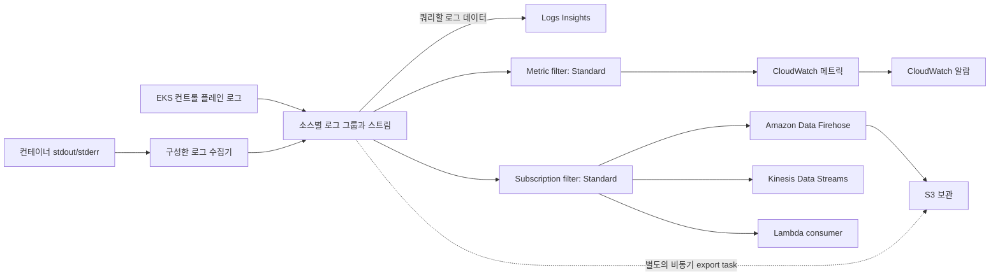

# CloudWatch Logs

> **마지막 업데이트**: 2026년 9월 13일
> **검사한 예제**: AWS provider 6.64.0, 선택적 CloudWatch Observability Helm chart 6.6.0, 수동 AWS for Fluent Bit 3.4.15/Fluent Bit 5.0.9. 로컬 설정·SDK·합성 payload 검사이며 AWS 리소스, 로그 전달, Insights 쿼리나 알람을 실제 실행하지 않았습니다.

Amazon CloudWatch Logs는 로그 수집·저장·분석을 관리합니다. Producer, identity, 네트워크, 보존, quota와 downstream consumer는 별도로 구성해야 합니다. EKS 컨트롤 플레인, 워크로드, EKS Auto Mode 관리형 컴포넌트 로그는 수집 경로가 다릅니다.

## 목차

1. [개요](#개요)
2. [EKS 컨트롤 플레인 로깅](#eks-컨트롤-플레인-로깅)
3. [Container Insights](#container-insights)
4. [FluentBit 연동](#fluentbit-연동)
5. [CloudWatch Logs Insights](#cloudwatch-logs-insights)
6. [Subscription Filters](#subscription-filters)
7. [비용 최적화](#비용-최적화)

## 개요

<span id="cloudwatch-logs-특징"></span>

### 기능과 로그 클래스

| 영역 | 확인할 내용 |
|---|---|
| 관리형 서비스 | 검색 클러스터를 운영할 필요는 없지만 수집기·전송 연동에는 관리 주체가 필요함 |
| 용량 | 이벤트 크기, API, subscription 및 목적지 quota가 있으므로 무제한 수집이 아님 |
| 보안 | IAM, 암호화, data protection, private 연결은 별도 설정 |
| 전달 시점 | 전송·알람은 비동기이며 재시도, 중복·누락을 고려해야 함 |
| Standard | 이 장의 metric filter와 subscription을 지원 |
| Infrequent Access | 수집 단가와 기능 구성이 다르며 subscription filter, metric filter, EMF는 지원하지 않음 |
| Delivery | Lambda 로그를 S3/Firehose로 전달하는 별도 선택지. CloudWatch 내 보존은 고정 2일이며 Logs Insights 쿼리를 지원하지 않음 |

생성 후 로그 그룹의 class를 바꿀 수 없습니다. 현재 Infrequent Access는 S3 export, Logs Insights, data protection 등을 지원하므로 이 기능을 전부 사용할 수 없다는 오래된 설명은 맞지 않습니다. 수집 방식을 변경하기 전에 현재 기능 표를 확인합니다.

<span id="용어-정리"></span>

### 핵심 개념



Subscription filter의 목적지에 S3 bucket ARN을 직접 지정할 수는 없습니다. Firehose를 통한 연속 S3 전송과 비동기 S3 export task는 별도 경로입니다. CloudWatch Logs batch를 Firehose의 OpenSearch 목적지로 전달하는 경로도 지원되지 않으므로 문서화된 CloudWatch→OpenSearch 연동을 사용합니다. 애플리케이션 레코드를 Firehose로 직접 보내는 경우는 입력 계약이 다릅니다.

| 용어 | 의미 |
|---|---|
| Log group | 보존·접근·설정의 공통 범위. 예: `/aws/eks/example-eks/cluster` |
| Log stream | 그룹에 속한 로그 이벤트의 시퀀스 |
| Log event | Timestamp와 message로 구성되며 서비스 한도 적용 |
| Retention | 지원되는 이산 보존 기간. 설정하지 않으면 만료 없음 |

## EKS 컨트롤 플레인 로깅

### 로그 유형

`api`, `audit`, `authenticator`, `controllerManager`, `scheduler`의 5개 유형이 있습니다. 각각 API 서버 진단, audit event, IAM 인증, controller-manager 진단, scheduling을 다룹니다. Worker node와 애플리케이션 로그는 별도입니다.

컨트롤 플레인 로깅은 기본적으로 비활성화되어 있습니다. 진단·보안·보존 요건에 맞게 선택하며, 기존 표의 “필수” 항목이 API의 필수 설정이라는 뜻은 아닙니다. 보통 수분 이내 전송되지만 best effort입니다. 활성화 전에 이미 rotate된 과거 로그가 복구되는 것은 아닙니다.

<span id="aws-cli로-활성화"></span>

### 활성화와 업데이트 확인

기존 클러스터를 대상으로 다음 파일을 `control-plane-logging.json`으로 저장합니다.

```json
{
  "clusterLogging": [
    {
      "types": [
        "api",
        "audit",
        "authenticator",
        "controllerManager",
        "scheduler"
      ],
      "enabled": true
    }
  ]
}
```

```bash
DOCS_CLUSTER=example-eks
DOCS_REGION=ap-northeast-2

aws eks describe-cluster --name "$DOCS_CLUSTER" --region "$DOCS_REGION" \
  --query 'cluster.{version:version,logging:logging}'

UPDATE_ID=$(aws eks update-cluster-config \
  --name "$DOCS_CLUSTER" --region "$DOCS_REGION" \
  --logging file://control-plane-logging.json --query update.id --output text)

aws eks describe-update --name "$DOCS_CLUSTER" --region "$DOCS_REGION" \
  --update-id "$UPDATE_ID" --query 'update.{status:status,errors:errors}'
```

상태가 `Successful`인지 확인해야 하며 요청 접수만으로 완료된 것은 아닙니다. 로깅 업데이트에는 cluster subnet마다 여유 IP가 최대 5개 필요할 수 있습니다. 유형을 끌 때는 기존 로그를 암묵적으로 비활성화하는 예제를 복사하지 말고 해당 변경을 검토합니다.

<span id="terraform으로-설정"></span>

### Terraform 소유권과 보존

Terraform으로 관리하는 클러스터라면 **기존 cluster resource를 소유하는 설정**의 `enabled_cluster_log_types`를 변경합니다. 로그를 켜기 위해 두 번째 `aws_eks_cluster` 리소스를 만들거나 오래된 Kubernetes 1.29 생성 예제를 복사하지 않습니다.

다음 별도 파일은 로그 그룹과 수동 수집기 정책을 관리합니다.

```hcl
terraform {
  required_providers {
    aws = {
      source  = "hashicorp/aws"
      version = "6.64.0"
    }
  }
}

variable "region" {
  type    = string
  default = "ap-northeast-2"
}

variable "account_id" {
  type = string
  validation {
    condition     = can(regex("^[0-9]{12}$", var.account_id))
    error_message = "Use the owning account ID."
  }
}

variable "cluster_name" {
  type    = string
  default = "example-eks"
}

provider "aws" {
  region = var.region
}

resource "aws_cloudwatch_log_group" "application" {
  name              = "/aws/containerinsights/${var.cluster_name}/application"
  log_group_class   = "STANDARD"
  retention_in_days = 30

  lifecycle {
    prevent_destroy = true
  }
}

resource "aws_cloudwatch_log_group" "control_plane" {
  name              = "/aws/eks/${var.cluster_name}/cluster"
  log_group_class   = "STANDARD"
  retention_in_days = 30

  lifecycle {
    prevent_destroy = true
  }
}

resource "aws_iam_policy" "collector" {
  name_prefix = "fluent-bit-cloudwatch-"
  policy = jsonencode({
    Version = "2012-10-17"
    Statement = [{
      Effect   = "Allow"
      Action   = ["logs:CreateLogStream", "logs:PutLogEvents"]
      Resource = "${aws_cloudwatch_log_group.application.arn}:*"
    }]
  })
}

output "collector_policy_arn" {
  value = aws_iam_policy.collector.arn
}
```

그룹이 이미 있으면 기존 관리 주체를 재사용하거나 적용 전에 의도한 state로 import합니다. 예를 들어 control-plane group의 import ID는 `/aws/eks/example-eks/cluster`입니다. 같은 그룹을 “audit” 리소스로 다시 선언하지 않습니다. 컨트롤 플레인 5개 로그 유형은 같은 그룹과 보존 기간을 공유합니다.

30일은 예시이며 법적 최소 요건이 아닙니다. `prevent_destroy`는 Terraform 삭제를 막지만 보존 기간 축소나 Terraform 밖의 삭제까지 막지는 않습니다. CloudWatch는 저장 로그를 암호화하며, customer-managed KMS key에는 별도 key policy와 운영 계획이 필요합니다.

### 로그 그룹 구조

```text
/aws/eks/example-eks/cluster
  kube-apiserver-...          API server
  kube-apiserver-audit-...    Audit
  authenticator-...          IAM authentication
  kube-controller-manager-... Controller manager
  kube-scheduler-...         Scheduler
```

Stream suffix는 rotate됩니다. 기존 그림의 `/aws/eks/cluster/logs`는 실제 컨트롤 플레인 그룹 이름 규칙이 아닙니다.

## Container Insights

<span id="container-insights-개요"></span>
<span id="설치-방법"></span>
<span id="cloudwatch-agent-fluentbit-권장"></span>
<span id="helm-차트로-설치"></span>
<span id="irsa-설정"></span>

### 설치 선택지

현재의 **Amazon CloudWatch Observability EKS add-on** 또는 **amazon-cloudwatch-observability** Helm chart를 사용합니다. 과거 ADOT exporter chart나 치환되지 않은 quickstart URL은 같은 설치 경로가 아닙니다.

Add-on은 실제 클러스터와 호환되는 버전을 조회하고 선택한 설정 schema와 IAM association을 확인합니다. Chart version과 EKS add-on version 문자열은 다릅니다.

```bash
K8S_VERSION=$(aws eks describe-cluster --name "$DOCS_CLUSTER" \
  --region "$DOCS_REGION" --query cluster.version --output text)
aws eks describe-addon-versions \
  --addon-name amazon-cloudwatch-observability \
  --kubernetes-version "$K8S_VERSION" --region "$DOCS_REGION"
```

선택적 Helm 예제의 `cloudwatch-values.yaml`은 기존 Container Insights 경로와 container logs를 켜고, Application Signals 및 별도 OTel Container Insights pipeline은 끕니다.

```yaml
clusterName: example-eks
region: ap-northeast-2
containerInsights:
  enabled: true
containerLogs:
  enabled: true
applicationSignals:
  enabled: false
otelContainerInsights:
  enabled: false
  logs:
    enabled: false
```

```bash
helm repo add aws-observability https://aws-observability.github.io/helm-charts
helm repo update aws-observability
helm upgrade --install cloudwatch-observability \
  aws-observability/amazon-cloudwatch-observability \
  --version 6.6.0 --namespace amazon-cloudwatch --create-namespace \
  --values cloudwatch-values.yaml
```

IAM 권한을 **설치 전에** 준비합니다. 이 chart의 Fluent Bit DaemonSet은 `cloudwatch-agent` ServiceAccount를 사용하므로 이름·namespace가 선택한 Pod Identity association과 일치해야 합니다. 공식 association·role trust 요건을 따릅니다. 다른 이름의 ServiceAccount에 IRSA role을 연결해도 수동 `fluent-bit` Pod에 권한이 생기지 않습니다. EKS-managed add-on 위에 chart를 겹쳐 설치하거나 같은 로그를 중복 수집하지 않습니다.

<span id="수집되는-로그"></span>

### 수집 로그와 플랫폼

| 일반적인 그룹 suffix | 내용과 제한 |
|---|---|
| `application` | `/aws/containerinsights/CLUSTER/application` 아래의 컨테이너 stdout/stderr |
| `dataplane` | 구성한 kubelet/runtime/VPC CNI/kube-proxy 소스. 실제 컴포넌트는 플랫폼별로 다름 |
| `host` | 구성한 Linux 파일·journal 또는 Windows event log. 모든 OS에 `/var/log/messages`, `/var/log/secure`, `/var/log/dmesg`가 있는 것은 아님 |
| `performance` | 주로 EMF 형태의 performance event이며 애플리케이션 메시지와 다름 |

지원되는 add-on/chart에는 Linux·Windows 경로가 있지만 EKS Windows의 Application Signals는 지원되지 않습니다. Fargate는 플랫폼 로그 라우터를 사용하며 이 수동 DaemonSet을 사용하지 않습니다. Hybrid Nodes와 Auto Mode도 별도로 확인하고 일반 EC2 host path가 어디서나 존재한다고 가정하지 않습니다.

EKS Auto Mode의 AWS-managed Karpenter, EBS CSI, load-balancer-controller, IPAM 로그에는 별도의 **vended log delivery** 구성이 필요합니다. 유형은 `AUTO_MODE_COMPUTE_LOGS`, `AUTO_MODE_BLOCK_STORAGE_LOGS`, `AUTO_MODE_LOAD_BALANCING_LOGS`, `AUTO_MODE_IPAM_LOGS`입니다. 공식 `PutDeliverySource` → `PutDeliveryDestination` → `CreateDelivery` 흐름은 log group, S3, Firehose를 대상으로 할 수 있습니다. 이 API는 `PutSubscriptionFilter` 및 컨트롤 플레인 5개 로그 유형 활성화와 다릅니다.

## FluentBit 연동

<span id="fluentbit-configmap"></span>
<span id="fluentbit-daemonset"></span>

### 수동 애플리케이션 로그 수집기

이 구성은 적격 Linux EC2 Node를 위한 **애플리케이션 로그 전용 대안**입니다. 전체 Container Insights metric pipeline을 설치하거나 모든 host/dataplane 로그 수집을 보장하지 않습니다.

먼저 application group을 생성하거나 재사용합니다. 앞의 정책은 해당 그룹의 stream 생성·이벤트 쓰기만 허용하며 그룹 생성·보존 변경은 하지 않습니다. 따라서 수동 구성에는 `cloudwatch:PutMetricData`, `s3:PutObject`, 광범위한 `logs:*`가 필요하지 않습니다.

OIDC trust가 `system:serviceaccount:logging:fluent-bit-cloudwatch`, audience가 `sts.amazonaws.com`인 승인된 IRSA role을 준비하고 생성한 정책을 연결합니다. `eksctl --role-only` 방식으로 역할을 만들고 manifest가 ServiceAccount를 관리할 수 있습니다. Role ARN, cluster name, Region을 일관되게 교체합니다.

```yaml
apiVersion: v1
kind: Namespace
metadata:
  name: logging
---
apiVersion: v1
kind: ServiceAccount
metadata:
  name: fluent-bit-cloudwatch
  namespace: logging
  annotations:
    eks.amazonaws.com/role-arn: arn:aws:iam::123456789012:role/FluentBitCloudWatchLogsRole
---
apiVersion: rbac.authorization.k8s.io/v1
kind: ClusterRole
metadata:
  name: fluent-bit-cloudwatch-metadata
rules:
- apiGroups:
  - ''
  resources:
  - namespaces
  - pods
  verbs:
  - get
  - list
  - watch
---
apiVersion: rbac.authorization.k8s.io/v1
kind: ClusterRoleBinding
metadata:
  name: fluent-bit-cloudwatch-metadata
roleRef:
  apiGroup: rbac.authorization.k8s.io
  kind: ClusterRole
  name: fluent-bit-cloudwatch-metadata
subjects:
- kind: ServiceAccount
  name: fluent-bit-cloudwatch
  namespace: logging
---
apiVersion: v1
kind: ConfigMap
metadata:
  name: fluent-bit-cloudwatch-config
  namespace: logging
data:
  fluent-bit.conf: |
    [SERVICE]
        Flush         5
        Grace         30
        Log_Level     info
        HTTP_Server   Off
        storage.path  /buffers/storage

    [INPUT]
        Name              tail
        Tag               application.*
        Path              /var/log/containers/*.log
        Exclude_Path      /var/log/containers/fluent-bit-cloudwatch-*_logging_fluent-bit-*.log
        multiline.parser  docker, cri
        DB                /buffers/tail.db
        Mem_Buf_Limit     50MB
        Skip_Long_Lines   On
        Read_from_Head    Off
        storage.type      filesystem

    [FILTER]
        Name                kubernetes
        Match               application.*
        Kube_Tag_Prefix     application.var.log.containers.
        Use_Kubelet         Off
        Merge_Log           On
        Merge_Log_Key       log_processed
        Keep_Log            On
        Labels              Off
        Annotations         Off
        K8S-Logging.Parser  Off
        K8S-Logging.Exclude Off

    [OUTPUT]
        Name                     cloudwatch_logs
        Match                    application.*
        region                   ap-northeast-2
        log_group_name           /aws/containerinsights/example-eks/application
        log_stream_prefix        ${HOST_NAME}-
        auto_create_group        false
        Retry_Limit              5
        storage.total_limit_size 1G
---
apiVersion: apps/v1
kind: DaemonSet
metadata:
  name: fluent-bit-cloudwatch
  namespace: logging
spec:
  selector:
    matchLabels:
      app: fluent-bit-cloudwatch
  template:
    metadata:
      labels:
        app: fluent-bit-cloudwatch
    spec:
      serviceAccountName: fluent-bit-cloudwatch
      nodeSelector:
        kubernetes.io/os: linux
      tolerations:
      - operator: Exists
        effect: NoSchedule
      containers:
      - name: fluent-bit
        image: public.ecr.aws/aws-observability/aws-for-fluent-bit:3.4.15@sha256:88e1b56cedb230486afeca6eeb26c5f6bd59c48879d0054d1674d5a58838c607
        args:
        - -c
        - /fluent-bit/custom/fluent-bit.conf
        securityContext:
          runAsUser: 0
          allowPrivilegeEscalation: false
          readOnlyRootFilesystem: true
          capabilities:
            drop:
            - ALL
          seccompProfile:
            type: RuntimeDefault
        resources:
          requests:
            cpu: 100m
            memory: 128Mi
          limits:
            memory: 512Mi
        volumeMounts:
        - name: logs
          mountPath: /var/log
          readOnly: true
        - name: buffers
          mountPath: /buffers
        - name: config
          mountPath: /fluent-bit/custom
          readOnly: true
        - name: tmp
          mountPath: /tmp
        command:
        - /fluent-bit/bin/fluent-bit
        env:
        - name: HOST_NAME
          valueFrom:
            fieldRef:
              fieldPath: spec.nodeName
      volumes:
      - name: logs
        hostPath:
          path: /var/log
          type: Directory
      - name: buffers
        hostPath:
          path: /var/lib/fluent-bit-cloudwatch
          type: DirectoryOrCreate
      - name: config
        configMap:
          name: fluent-bit-cloudwatch-config
      - name: tmp
        emptyDir: {}
      terminationGracePeriodSeconds: 45
```

Native plugin 이름은 `cloudwatch_logs`이며 이전 Go plugin은 `cloudwatch`입니다. 이미지 기본 command가 entrypoint script이므로 수동 manifest는 native Fluent Bit binary와 설정 파일을 명시합니다.

Tail DB·파일시스템 버퍼는 writable이며 읽기 전용 로그 mount와 분리됩니다. Grace는 30초, Pod termination grace는 45초이지만 버퍼 전체 전송을 보장하지 않습니다. Node 손실, 디스크 부족, 긴 라인, 유한 재시도와 재시작 offset에서 로그를 잃을 수 있습니다. `Read_from_Head Off`는 처음 발견한 파일에 적용되며 저장된 offset도 고려해야 합니다.

Host-network kubelet 접근 대신 API 서버에서 metadata를 조회합니다. 앱 annotation이 파싱을 바꾸거나 로그를 제외할 수 없도록 했습니다. 사용자 수집기에 예약된 `extra_user_agent: container-insights` 값을 넣어 관리형 설치인 것처럼 표시하지 않습니다.

### 레코드 구조와 Host 소스

CloudWatch로 보내는 enriched event 예시는 다음과 같습니다.

```json
{"log":"{\"level\":\"error\",\"message\":\"upstream request failed\",\"error_type\":\"upstream_timeout\",\"http\":{\"response_time_ms\":1250,\"status_code\":503}}","stream":"stderr","kubernetes":{"namespace_name":"production","pod_name":"api-example","container_name":"api"},"log_processed":{"level":"error","message":"upstream request failed","error_type":"upstream_timeout","http":{"response_time_ms":1250,"status_code":503}}}
```

앱 필드는 `log_processed`, 신뢰된 Kubernetes metadata는 `kubernetes` 아래에 있습니다. 원문 `log`에는 앱 데이터가 중복되므로 수집 전에 금지된 정보를 제거합니다. 아래 쿼리·subscription·metric filter는 이 JSON 구조와 소문자 `level: error`를 사용합니다.

Linux journal을 수집하려면 `/var/log/journal`의 persistent journal 또는 `/run/log/journal`의 volatile journal 존재 여부를 확인합니다. `systemd` input, unit filter, read-only mount, 별도 writable DB, output group과 IAM 권한을 구성합니다. containerd/Bottlerocket/AL2023 Node에 과거 Docker의 `/var/lib/docker/containers`나 존재하지 않는 텍스트 파일을 무조건 mount하지 않습니다. 이 플랫폼별 host 구성은 수동 예제에 배포되어 있지 않습니다.

## CloudWatch Logs Insights

아래 문법은 SQL이 아닌 **Logs Insights QL**입니다. 의도한 그룹·제한된 시간 범위를 선택합니다. 로컬 검토에서는 공개한 문법·설정 관계를 확인했으며 관리형 쿼리 서비스는 호출하지 않았습니다.

### 기본 쿼리 문법

```text
fields @timestamp, @message
| filter @message like /(?i)error/
| sort @timestamp desc
| limit 100
```

대소문자 구분 없는 regex는 JavaScript식 `/error/i` suffix 대신 `/(?i)error/`를 사용합니다. 본문 검색은 앱의 구조화된 error level과 무관한 단어도 매칭할 수 있습니다.

수집기의 JSON 구조에는 다음 쿼리를 사용합니다.

```text
fields jsonParse(@message) as record
| filter record.log_processed.level = "error"
| fields @timestamp, record.log_processed.message as message
| sort @timestamp desc
| limit 100
```

실제 텍스트에 `user_id=12345`가 들어 있다면:

```text
fields @timestamp, @message
| parse @message /user_id=(?<user_id>\d+)/
| filter user_id = "12345"
| limit 100
```

임의 JSON의 key 순서·공백을 가정한 glob에 의존하지 않습니다. `jsonParse`와 명시적인 중첩 필드로 기대하는 레코드 구조를 드러냅니다.

### EKS 로그 쿼리 예시

API 서버 진단에서는 겹치는 audit stream prefix를 제외합니다.

```text
fields @timestamp, @logStream, @message
| filter @logStream like /^kube-apiserver-/
| filter @logStream not like /^kube-apiserver-audit-/
| filter @message like /(?i)error/
| sort @timestamp desc
| limit 50
```

특정 Kubernetes username의 audit 활동:

```text
fields jsonParse(@message) as audit
| filter @logStream like /^kube-apiserver-audit-/
| filter audit.user.username = "example-user"
| fields @timestamp, audit.verb as verb, audit.objectRef as objectRef
| sort @timestamp desc
| limit 100
```

Authenticator 진단:

```text
fields @timestamp, @message
| filter @logStream like /^authenticator-/
| filter @message like /(?i)(AccessDenied|Forbidden|unauthorized)/
| sort @timestamp desc
| limit 100
```

Pod 생성·삭제 audit event:

```text
fields jsonParse(@message) as audit
| filter @logStream like /^kube-apiserver-audit-/
| filter audit.verb in ["create", "delete"]
| filter audit.objectRef.resource = "pods"
| fields @timestamp, audit.verb as verb, audit.objectRef.name as pod
| sort @timestamp desc
| limit 100
```

진단용 검색이며 audit이 모든 동작을 기록하거나 텍스트 매칭만으로 원인을 확정한다는 보장은 아닙니다.

### 애플리케이션 로그 쿼리

Namespace별 error:

```text
fields jsonParse(@message) as record
| filter record.log_processed.level = "error"
| stats count(*) as error_count by record.kubernetes.namespace_name as namespace
| sort error_count desc
```

정의한 숫자형 밀리초 필드로 느린 응답을 조회합니다.

```text
fields jsonParse(@message) as record
| filter record.kubernetes.container_name = "api"
| filter record.log_processed.http.response_time_ms > 1000
| fields @timestamp, record.log_processed.http.response_time_ms as response_time_ms
| sort response_time_ms desc
| limit 100
```

시간별 이벤트 건수:

```text
stats count(*) as log_count by bin(1h) as bucket
| sort bucket asc
```

`stats` 이후에는 정의한 bucket alias로 정렬합니다. 원래 이벤트의 `@timestamp`는 그룹 결과에 그대로 남는 필드가 아닙니다.

상위 오류 분류:

```text
fields jsonParse(@message) as record
| filter record.log_processed.level = "error"
| stats count(*) as error_count by record.log_processed.error_type as error_type
| sort error_count desc
| limit 10
```

범위가 제한된 분류는 고유한 전체 메시지별 그룹보다 해석하기 쉽습니다. Request ID나 임의 메시지를 무제한 metric dimension으로 만들지 않습니다.

### 고급 쿼리

```text
fields jsonParse(@message) as record
| filter ispresent(record.log_processed.http.response_time_ms)
| stats pct(record.log_processed.http.response_time_ms, 50) as p50_ms,
        pct(record.log_processed.http.response_time_ms, 90) as p90_ms,
        pct(record.log_processed.http.response_time_ms, 99) as p99_ms
  by bin(5m) as bucket
| sort bucket asc
```

QL 집계 함수는 `percentile`이 아닌 `pct`입니다. Producer는 숫자형 밀리초를 출력해야 합니다. 기존 nginx 예제는 wildcard 개수와 추출 필드 수가 맞지 않았고 실제 필드 위치 근거가 없었습니다.

```text
fields @timestamp, @message, @logStream
| filter @message like /Back-off restarting failed container/
| stats count(*) as backoff_log_events by @logStream
| sort backoff_log_events desc
```

이 쿼리는 재시작 횟수가 아니라 일치하는 **로그 이벤트 수**를 셉니다. Kubelet event·메시지는 없거나 반복·집계될 수 있습니다. 실제 컨테이너 재시작 횟수에는 적절한 Kubernetes restart metric을 사용합니다.

`SOURCE`는 CLI/API 쿼리에서 지원하며 콘솔 쿼리 편집기에서는 지원하지 않습니다.

```text
SOURCE logGroups(accountIdentifier:['111122223333'], namePrefix:['/aws/containerinsights/prod-', '/aws/containerinsights/stage-'])
| fields @timestamp, @message, @logStream
| filter @message like /(?i)error/
| sort @timestamp desc
| limit 100
```

`accountIdentifier`는 단수형입니다. Cross-account 조회에는 승인된 monitoring/source account 구성과 권한이 필요합니다. 다른 계정·그룹 이름을 쓰는 것만으로 접근 권한이 생기지는 않습니다. Account·prefix 선택을 생략하면 조회 범위가 크게 늘어날 수 있습니다.

## Subscription Filters

Subscription filter는 새로 들어온 일치 이벤트를 비동기로 전달합니다. At-least-once 전송이므로 중복될 수 있습니다. 재시도 가능한 목적지 오류는 최대 24시간 재시도하지만, 재시도 불가 오류나 지속적인 장애에서는 전송을 잃을 수 있습니다. Quota, `DeliveryErrors`, `DeliveryThrottling`을 모니터링합니다. 모든 과거 로그를 backfill하는 기능은 아닙니다.

이 예제의 직접 Lambda·Kinesis·Firehose 목적지는 로그 그룹과 같은 계정에 속합니다. Cross-account 전송은 지원되는 logical destination과 destination policy를 사용하며, 임의의 다른 계정 Lambda ARN으로 대체할 수 없습니다.

<span id="s3로-내보내기"></span>

### Firehose를 통한 S3 보관

다음 선택적 파일은 앞의 그룹, 기존 비공개 S3 bucket과 승인된 Firehose delivery role을 사용합니다.

```hcl
variable "firehose_delivery_role_arn" {
  type = string
}

variable "archive_bucket_arn" {
  type = string
}

resource "aws_cloudwatch_log_group" "firehose" {
  name              = "/aws/kinesisfirehose/cloudwatch-archive"
  retention_in_days = 30
}

resource "aws_cloudwatch_log_stream" "firehose" {
  name           = "S3Delivery"
  log_group_name = aws_cloudwatch_log_group.firehose.name
}

resource "aws_kinesis_firehose_delivery_stream" "archive" {
  name        = "cloudwatch-archive"
  destination = "extended_s3"

  extended_s3_configuration {
    role_arn            = var.firehose_delivery_role_arn
    bucket_arn          = var.archive_bucket_arn
    prefix              = "cloudwatch/year=!{timestamp:yyyy}/month=!{timestamp:MM}/day=!{timestamp:dd}/"
    error_output_prefix = "errors/!{firehose:error-output-type}/year=!{timestamp:yyyy}/"
    buffering_size      = 64
    buffering_interval  = 300
    compression_format  = "UNCOMPRESSED"

    cloudwatch_logging_options {
      enabled         = true
      log_group_name  = aws_cloudwatch_log_group.firehose.name
      log_stream_name = aws_cloudwatch_log_stream.firehose.name
    }
  }
}

resource "aws_iam_role" "logs_to_firehose" {
  name_prefix = "cloudwatch-to-firehose-"
  assume_role_policy = jsonencode({
    Version = "2012-10-17"
    Statement = [{
      Effect    = "Allow"
      Principal = { Service = "logs.amazonaws.com" }
      Action    = "sts:AssumeRole"
      Condition = {
        StringEquals = { "aws:SourceAccount" = var.account_id }
        ArnLike      = { "aws:SourceArn" = "arn:aws:logs:${var.region}:${var.account_id}:*" }
      }
    }]
  })
}

resource "aws_iam_role_policy" "logs_to_firehose" {
  role = aws_iam_role.logs_to_firehose.id
  policy = jsonencode({
    Version = "2012-10-17"
    Statement = [{
      Effect   = "Allow"
      Action   = ["firehose:PutRecord", "firehose:PutRecordBatch"]
      Resource = aws_kinesis_firehose_delivery_stream.archive.arn
    }]
  })
}

resource "aws_cloudwatch_log_subscription_filter" "archive" {
  name            = "application-archive"
  log_group_name  = aws_cloudwatch_log_group.application.name
  filter_pattern  = ""
  destination_arn = aws_kinesis_firehose_delivery_stream.archive.arn
  role_arn        = aws_iam_role.logs_to_firehose.arn

  depends_on = [aws_iam_role_policy.logs_to_firehose]
}
```

Delivery role에는 검토한 Firehose trust, bucket/prefix 접근, 필요한 KMS 및 목적지 로그 권한이 있어야 합니다. CloudWatch→Firehose 역할은 별도이며 배포자에게 범위를 제한한 `iam:PassRole`이 필요합니다. 전송 오류 로그가 같은 pipeline에 재유입되지 않도록 합니다.

CloudWatch subscription record는 이미 gzip 압축되어 있습니다. 여기서 `UNCOMPRESSED`는 **추가 Firehose 압축**을 끕니다. 들어온 payload를 평문으로 바꾸거나 CloudWatch envelope를 제거하지 않습니다. Consumer는 실제 보관 레코드 형식을 처리해야 합니다.

압축 해제된 출력이 필요하면 Firehose의 공식 decompression 기능을 명시적으로 구성합니다. 선택적 message extraction은 `owner`, `logGroup`, `logStream` 등의 envelope metadata를 제거합니다. CloudWatch-subscription decompression을 켠 stream에 vended-log 입력을 혼합하지 않으며, 이 설정으로 미지원 CloudWatch→Firehose→OpenSearch 경로가 지원된다고 가정하지 않습니다.

### Lambda로 처리

다음 예제는 위의 구조화된 envelope를 처리하고 control message를 무시하며, 원문 대신 오류 **요약**을 보냅니다. `log_processor.py`로 저장합니다.

```python
import base64
import gzip
import hashlib
import io
import json
import os

import boto3

# Example processing limit, not an AWS service quota.
MAX_UNCOMPRESSED_BYTES = 8 * 1024 * 1024


def summarize(event):
    compressed = base64.b64decode(event["awslogs"]["data"], validate=True)
    with gzip.GzipFile(fileobj=io.BytesIO(compressed)) as stream:
        payload = stream.read(MAX_UNCOMPRESSED_BYTES + 1)
    if len(payload) > MAX_UNCOMPRESSED_BYTES:
        raise ValueError("Batch exceeds this example's processing limit")
    batch = json.loads(payload)
    if batch.get("messageType") == "CONTROL_MESSAGE":
        return None
    if batch.get("messageType") != "DATA_MESSAGE":
        raise ValueError("Unsupported subscription message type")

    errors = []
    unparsed = 0
    for item in batch["logEvents"]:
        try:
            record = json.loads(item["message"])
            application = record["log_processed"]
            if not isinstance(application, dict):
                raise ValueError("Expected an application object")
        except (ValueError, KeyError, TypeError):
            unparsed += 1
            continue
        if application.get("level") == "error":
            errors.append(item)
    if not errors:
        return None

    # Raw messages are intentionally excluded from the notification.
    event_keys = [
        hashlib.sha256(
            json.dumps([batch["owner"], batch["logGroup"], batch["logStream"], item["id"]],
                       ensure_ascii=True).encode("utf-8")
        ).hexdigest()
        for item in errors[:20]
    ]
    return {
        "errorCount": len(errors),
        "unparsedRecords": unparsed,
        "sampleEventKeys": event_keys,
    }


def lambda_handler(event, context):
    summary = summarize(event)
    if summary is None:
        return {"notified": False}
    topic_arn = os.environ["ALERT_TOPIC_ARN"]  # Non-secret destination identifier.
    message = json.dumps(summary, ensure_ascii=True)
    if len(message.encode("utf-8")) > 262144:
        raise ValueError("SNS message is too large")
    boto3.client("sns").publish(
        TopicArn=topic_arn,
        Subject="CloudWatch Logs error batch",
        Message=message,
    )
    return {"notified": True, "errorCount": summary["errorCount"]}
```

`ALERT_TOPIC_ARN`은 같은 Region의 승인된 topic을 가리키는 비밀이 아닌 목적지 식별자입니다. Lambda execution role에는 범위를 제한한 `sns:Publish`, 자체 로그 권한과 필요한 KMS 권한이 있어야 합니다. 함수의 로그 그룹이 같은 subscription으로 재귀 유입되지 않도록 합니다.

8MiB 처리 한도는 예제의 선택이며 AWS quota가 아닙니다. 잘못된 envelope는 오류를 발생시키며 기대한 앱 구조 밖의 레코드를 구조화된 오류로 취급하지 않습니다. 파싱 실패를 모니터링하고 failure handling·재처리를 배포 전에 시험합니다. SNS의 비 SMS 메시지 한도는 1,000글자 규칙이 아니라 **UTF-8 byte 수** 기준입니다. 고정 subject도 subject 한도보다 짧게 유지합니다.

Event key는 조사에 도움이 되지만 **영속적인 중복 제거**가 아닙니다. 반복 호출에서 알림을 반복 전송할 수 있으므로 운영 consumer에는 명시적인 멱등성·실패 목적지 설계가 필요합니다.

<span id="metric-filter로-알림-생성"></span>

### Metric Filter와 Alarm

다음 선택적 파일은 이미 배포한 unqualified Lambda function ARN을 연결하고 건수 metric·alarm을 만듭니다. 수집기·쿼리와 같은 JSON 필드를 사용합니다.

```hcl
variable "processor_function_arn" {
  type = string
}

variable "alerts_topic_arn" {
  type = string
}

resource "aws_lambda_permission" "cloudwatch" {
  statement_id   = "AllowOwnedCloudWatchLogGroup"
  action         = "lambda:InvokeFunction"
  function_name  = var.processor_function_arn
  principal      = "logs.${var.region}.amazonaws.com"
  source_arn     = "${aws_cloudwatch_log_group.application.arn}:*"
  source_account = var.account_id
}

resource "aws_cloudwatch_log_subscription_filter" "processor" {
  name            = "structured-errors"
  log_group_name  = aws_cloudwatch_log_group.application.name
  filter_pattern  = "{ $.log_processed.level = \"error\" }"
  destination_arn = var.processor_function_arn

  depends_on = [aws_lambda_permission.cloudwatch]
}

resource "aws_cloudwatch_log_metric_filter" "errors" {
  name           = "StructuredErrorCount"
  log_group_name = aws_cloudwatch_log_group.application.name
  pattern        = "{ $.log_processed.level = \"error\" }"

  metric_transformation {
    name          = "ErrorCount"
    namespace     = "Example/Logs"
    value         = "1"
    default_value = "0"
    unit          = "Count"
  }
}

resource "aws_cloudwatch_metric_alarm" "high_error_count" {
  alarm_name          = "ExampleHighErrorCount"
  comparison_operator = "GreaterThanThreshold"
  evaluation_periods  = 2
  datapoints_to_alarm = 2
  metric_name         = "ErrorCount"
  namespace           = "Example/Logs"
  period              = 300
  statistic           = "Sum"
  threshold           = 100
  treat_missing_data  = "missing"
  alarm_description   = "More than 100 matching error events in each of two 5-minute periods"
  alarm_actions       = [var.alerts_topic_arn]
}
```

Lambda subscription 전에 log-group ARN과 source account로 제한한 permission을 설정합니다. SNS alarm 목적지에도 적절한 topic policy가 필요합니다. 함수 배포, execution-role policy, topic subscription, 전체 알림 전달은 별도 사전 조건입니다.

알람은 **오류 건수**이며 오류율이 아닙니다. 5분 구간 두 번 각각에서 일치 이벤트가 100건을 초과하는 조건입니다. `default_value = 0`은 로그가 들어왔지만 일치 항목이 없을 때 적용됩니다. 로그 자체가 없으면 missing data가 될 수 있고 `treat_missing_data = "missing"`은 침묵을 정상으로 판단하지 않습니다. Metric filter는 과거 이벤트를 backfill하지 않으며 중복 전송이 집계에 영향을 줄 수 있습니다.

<span id="_3-s3로-아카이브"></span>

### Export Task와 S3 Lifecycle

제한된 과거 범위를 내보낼 때는 별도의 S3 export task API와 bucket/KMS 권한을 사용합니다. Export 대상이 되기까지 최대 12시간 지연될 수 있고 정렬도 보장되지 않습니다. 연속 보관을 위해 주기적인 export task를 사용하는 방식은 서비스에서 권장하지 않습니다.

Archive lifecycle은 bucket의 단일 설정 소유자가 관리합니다. 두 번째 Terraform 리소스로 기존 규칙을 덮어쓰지 말고 검토한 prefix 범위 규칙을 기존 설정에 병합합니다. Standard-IA·Glacier를 선택할 때 작은 객체의 transition 동작, 최소 저장 기간, retrieval 비용과 Object Lock을 고려합니다.

## 비용 최적화

### 비용 구조

현재 Region·class·tier별 수집, 저장, query scan, vended delivery, 변환 및 downstream 단가를 확인합니다. Firehose, S3, KMS, Lambda, custom metric, alarm이 항상 무료인 것은 아닙니다. 기존 표에는 서울 단가와 무료 “Logs to S3” 경로를 뒷받침하는 근거가 없었습니다.

아래는 **가상의 산술 예시이며 현재 지역별 단가가 아닙니다**.

| 가정 | 월간 계산 |
|---|---|
| 일 100GB를 30일 수집, 가정 단가 $0.50/GB | 3,000 × $0.50 = $1,500 |
| 30일 steady-state 보존, 저장 비율 0.5 가정, $0.03/GB-month | 평균 1,500GB × $0.03 = $45 |
| 일 200GB를 30일 scan, 가정 단가 $0.005/GB | 6,000 × $0.005 = $30 |
| 이 가정만 적용한 소계 | **$1,575** |

첫 달 저장량 증가 곡선, 압축 벤치마크나 완전한 청구액이 아닙니다. 기존 $1,576 합계는 일간·월간 query 값을 혼합했습니다. 측정한 평균 저장량·scan 양, 현재 단가와 다른 모든 비용 항목을 사용합니다.

<span id="비용-절감-전략"></span>
<span id="_1-로그-필터링"></span>
<span id="_2-보존-기간-최적화"></span>
<span id="_4-로그-레벨-조정"></span>

### 필터링·보존·로그 레벨

진단·보안 요건상 폐기해도 되는 레코드만 필터링합니다. Fluent Bit classic 설정은 YAML이 아닙니다. 이 구조의 namespace filter는 존재하지 않는 평면 필드 `kubernetes_namespace_name` 대신 `$kubernetes['namespace_name']` 같은 record accessor를 사용합니다.

Health-check path를 언급했다는 이유로 중요한 오류까지 버리는 광범위 substring filter를 피합니다. 검토한 event type 같은 명시적 필드를 사용하고, 버릴 예제와 반드시 보존할 예제를 함께 확인합니다.

개발·운영·audit의 보존 기간은 다를 수 있지만 변경 시 데이터가 삭제될 수 있습니다. 같은 그룹의 모든 control-plane stream은 하나의 보존 정책을 공유합니다. 로그 레벨도 앱 계약입니다. ConfigMap에 `LOG_LEVEL: INFO`를 넣어도 앱이 읽고 구현하지 않으면 아무 효과가 없습니다. 일시적인 상세 로깅에는 접근 통제, 종료 시점과 volume budget이 필요합니다.

### 비용 모니터링

`AWS/Logs`의 `IncomingBytes`, `IncomingLogEvents` 등에 `LogGroupName` dimension과 `Sum` statistic을 사용합니다. 이는 수집량이며 전체 청구액이 아닙니다. `@billedDuration`은 Lambda 필드이며 CloudWatch Logs 저장·수집 과금 metric이 아닙니다.

```bash
aws logs describe-log-groups --region "$DOCS_REGION" \
  --log-group-name-prefix /aws/containerinsights/example-eks/ \
  --query 'logGroups[].{name:logGroupName,retention:retentionInDays,class:logGroupClass,storedBytes:storedBytes}'

# Example complete month; End is exclusive.
aws ce get-dimension-values --region us-east-1 \
  --time-period Start=2026-08-01,End=2026-09-01 \
  --dimension SERVICE --search-string CloudWatch
```

반환된 billing-service 값을 Cost Explorer filter에 사용하고 전체 pipeline 비용에는 관련 서비스를 포함합니다. `storedBytes`는 log-group 속성이며 같은 이름의 `AWS/Logs` metric을 보장하지 않습니다. 비용 추정을 위해 모든 로그를 쿼리하는 행위도 query 비용을 발생시킬 수 있습니다.

## 검증과 참고 자료

감사에서는 로컬 Terraform/Helm 설정, Kubernetes schema, SDK payload type, 합성 Lambda event, 한·영 예제·퀴즈·Markdown을 검사했습니다. 실제 IAM, 수집기 전달, 관리형 QL 실행, Firehose 보관, 알람 전송이나 실제 비용을 입증하지 않습니다.

- [EKS 컨트롤 플레인 로그](https://docs.aws.amazon.com/eks/latest/userguide/control-plane-logs.html)
- [CloudWatch Observability add-on·Helm 설치](https://docs.aws.amazon.com/AmazonCloudWatch/latest/monitoring/install-CloudWatch-Observability-EKS-addon.html)
- [Auto Mode 관리 컴포넌트 로그 전송](https://docs.aws.amazon.com/eks/latest/userguide/auto-managed-component-logs.html)
- [로그 클래스](https://docs.aws.amazon.com/AmazonCloudWatch/latest/logs/CloudWatch_Logs_Log_Classes.html), [quota](https://docs.aws.amazon.com/AmazonCloudWatch/latest/logs/cloudwatch_limits_cwl.html)
- [Fluent Bit native CloudWatch output](https://raw.githubusercontent.com/fluent/fluent-bit-docs/master/pipeline/outputs/cloudwatch.md)
- [QL filter](https://docs.aws.amazon.com/AmazonCloudWatch/latest/logs/CWL_QuerySyntax-Filter.html), [stats](https://docs.aws.amazon.com/AmazonCloudWatch/latest/logs/CWL_QuerySyntax-Stats.html), [함수](https://docs.aws.amazon.com/AmazonCloudWatch/latest/logs/CWL_QuerySyntax-operations-functions.html), [SOURCE](https://docs.aws.amazon.com/AmazonCloudWatch/latest/logs/CWL_QuerySyntax-Source.html)
- [Subscription 예제](https://docs.aws.amazon.com/AmazonCloudWatch/latest/logs/SubscriptionFilters.html), [목적지 API](https://docs.aws.amazon.com/AmazonCloudWatchLogs/latest/APIReference/API_PutSubscriptionFilter.html)
- [CloudWatch Logs→Firehose 제한](https://docs.aws.amazon.com/firehose/latest/dev/writing-with-cloudwatch-logs.html), [decompression](https://docs.aws.amazon.com/firehose/latest/dev/writing-with-cloudwatch-logs-decompression.html), [message extraction](https://docs.aws.amazon.com/firehose/latest/dev/Message_extraction.html)
- [Metric filter](https://docs.aws.amazon.com/AmazonCloudWatch/latest/logs/MonitoringLogData.html), [S3 export task](https://docs.aws.amazon.com/AmazonCloudWatch/latest/logs/S3Export.html), [CloudWatch Logs 서비스 metric](https://docs.aws.amazon.com/AmazonCloudWatch/latest/logs/CloudWatch-Logs-Monitoring-CloudWatch-Metrics.html)
- [SNS Publish API](https://docs.aws.amazon.com/sns/latest/api/API_Publish.html), [현재 CloudWatch 요금](https://aws.amazon.com/cloudwatch/pricing/)

## 퀴즈

[CloudWatch Logs 퀴즈](../../quizzes/observability/logging/03-cloudwatch-logs-quiz.md)에서 위 차이를 확인합니다.
