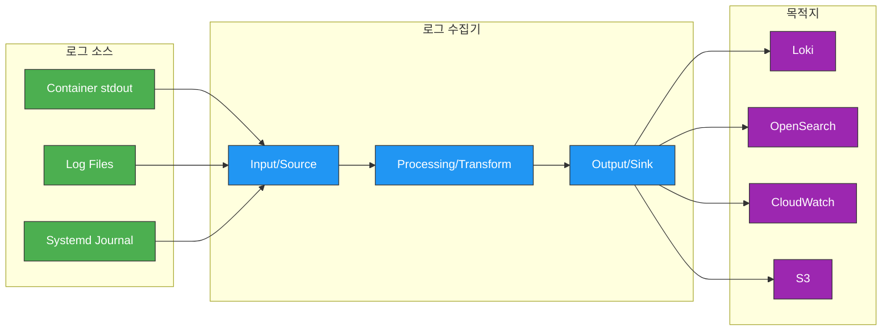
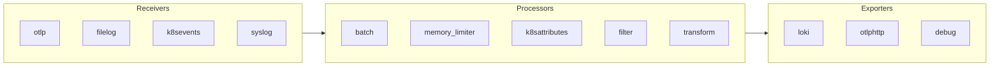
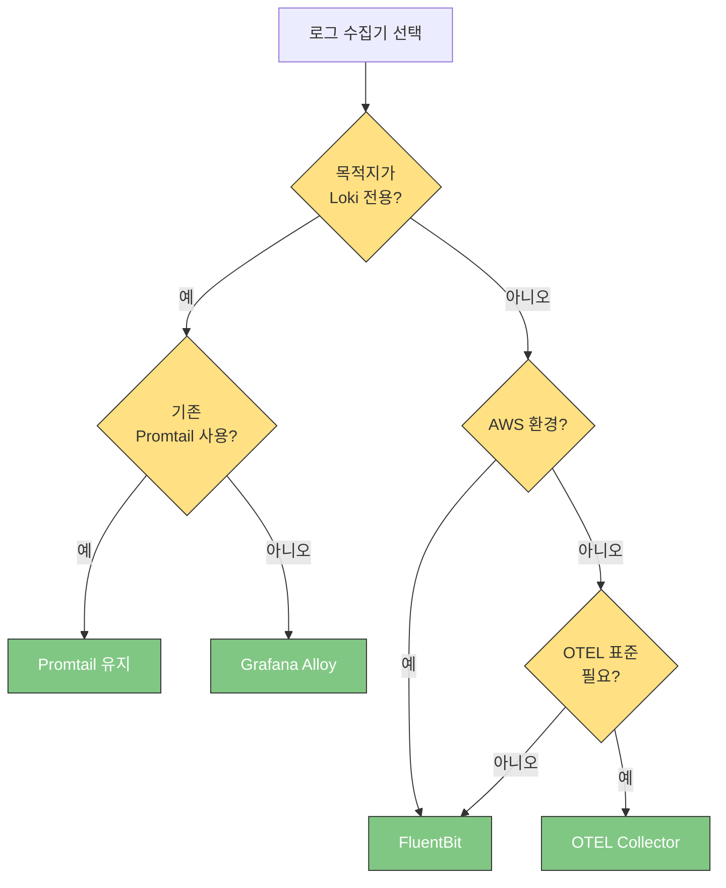

```mermaid
flowchart LR
    subgraph Input["Input Plugins"]
        TAIL[tail]
        SYSLOG[syslog]
        TCP[tcp]
        SYSTEMD[systemd]
    end

    subgraph Parser["Parser"]
        JSON[json]
        REGEX[regex]
        DOCKER[docker]
        CRI[cri]
    end

    subgraph Filter["Filter Plugins"]
        K8S[kubernetes]
        MODIFY[modify]
        GREP[grep]
        LUA[lua]
        MULTILINE[multiline]
    end

    subgraph Buffer["Buffer"]
        MEM[Memory]
        FS[Filesystem]
    end

    subgraph Output["Output Plugins"]
        LOKI[loki]
        ES[opensearch]
        CW[cloudwatch_logs]
        S3[s3]
        KAFKA[kafka]
    end

    Input --> Parser
    Parser --> Filter
    Filter --> Buffer
    Buffer --> Output
```

```mermaid
flowchart LR
    subgraph Discovery["Service Discovery"]
        K8S_SD[kubernetes_sd]
        FILE_SD[file_sd]
        STATIC[static]
    end

    subgraph Scrape["Scrape Targets"]
        PODS[Pod Logs]
        JOURNAL[Journal]
        SYSLOG[Syslog]
    end

    subgraph Pipeline["Pipeline Stages"]
        DOCKER[docker]
        CRI[cri]
        JSON[json]
        REGEX[regex]
        MULTILINE[multiline]
        LABELS[labels]
        TIMESTAMP[timestamp]
        OUTPUT[output]
    end

    subgraph Push["Push to Loki"]
        LOKI[Loki API]
    end

    Discovery --> Scrape
    Scrape --> Pipeline
    Pipeline --> Push
```

# 로그 수집기 비교

> **마지막 업데이트**: 2026년 2월 20일

Kubernetes 환경에서 로그를 수집하는 다양한 도구들이 있습니다. 이 문서에서는 FluentBit, Promtail, Grafana Alloy, OpenTelemetry Collector를 심층적으로 비교하고, 각 도구의 설정 방법과 최적화 전략을 설명합니다.

## 목차

1. [개요](#개요)
2. [FluentBit](#fluentbit)
3. [Promtail](#promtail)
4. [Grafana Alloy](#grafana-alloy)
5. [OpenTelemetry Collector](#opentelemetry-collector)
6. [비교 및 선택 가이드](#비교-및-선택-가이드)

---

## 개요

### 로그 수집기 역할



### 핵심 기능

| 기능 | 설명 |
|------|------|
| **수집 (Input)** | 다양한 소스에서 로그 읽기 |
| **파싱 (Parsing)** | 로그 형식 해석 및 구조화 |
| **필터링 (Filtering)** | 불필요한 로그 제거 |
| **변환 (Transform)** | 필드 추가/수정/삭제 |
| **버퍼링 (Buffering)** | 일시적 저장으로 안정성 확보 |
| **출력 (Output)** | 목적지로 로그 전송 |

---

## FluentBit

### 개요

FluentBit은 CNCF 프로젝트로, C로 작성된 경량 로그 프로세서입니다. Fluentd의 경량 버전으로 시작했지만, 현재는 독립적인 프로젝트로 발전했습니다.

| 항목 | 값 |
|------|-----|
| 언어 | C |
| 메모리 | ~10MB |
| 성능 | 초당 수십만 이벤트 |
| 플러그인 | 100+ 내장 |
| 라이선스 | Apache 2.0 |
| CNCF | Graduated |

### 아키텍처



### 전체 설정 예시

```ini
# /fluent-bit/etc/fluent-bit.conf

[SERVICE]
    # 기본 설정
    Flush                     5
    Grace                     30
    Daemon                    off
    Log_Level                 info

    # 파서 파일
    Parsers_File              parsers.conf

    # HTTP 서버 (메트릭/헬스체크)
    HTTP_Server               On
    HTTP_Listen               0.0.0.0
    HTTP_Port                 2020

    # 스토리지 (버퍼링)
    storage.path              /var/log/flb-storage/
    storage.sync              normal
    storage.checksum          off
    storage.backlog.mem_limit 50M
    storage.metrics           on

#---------------------------------------------
# INPUT: 컨테이너 로그 수집
#---------------------------------------------
[INPUT]
    Name                      tail
    Tag                       kube.*
    Path                      /var/log/containers/*.log
    # kube-system 제외
    Exclude_Path              /var/log/containers/*_kube-system_*.log,/var/log/containers/*_kube-public_*.log
    # 파서
    multiline.parser          docker, cri
    # 상태 DB
    DB                        /var/log/flb_kube.db
    DB.locking                true
    # 메모리 제한
    Mem_Buf_Limit             50MB
    # 긴 라인 스킵
    Skip_Long_Lines           On
    # 새로고침 간격
    Refresh_Interval          10
    # 로테이션 대기
    Rotate_Wait               30
    # 파일시스템 버퍼
    storage.type              filesystem
    # 기존 파일 처리
    Read_from_Head            Off

#---------------------------------------------
# INPUT: 시스템 로그
#---------------------------------------------
[INPUT]
    Name                      systemd
    Tag                       host.systemd
    Systemd_Filter            _SYSTEMD_UNIT=kubelet.service
    Systemd_Filter            _SYSTEMD_UNIT=containerd.service
    Systemd_Filter            _SYSTEMD_UNIT=docker.service
    DB                        /var/log/flb_systemd.db
    Read_From_Tail            On
    Strip_Underscores         On

#---------------------------------------------
# FILTER: Kubernetes 메타데이터 추가
#---------------------------------------------
[FILTER]
    Name                      kubernetes
    Match                     kube.*
    # API 서버 설정
    Kube_URL                  https://kubernetes.default.svc:443
    Kube_CA_File              /var/run/secrets/kubernetes.io/serviceaccount/ca.crt
    Kube_Token_File           /var/run/secrets/kubernetes.io/serviceaccount/token
    Kube_Tag_Prefix           kube.var.log.containers.
    # 로그 병합
    Merge_Log                 On
    Merge_Log_Key             log_processed
    # 파서 자동 감지
    K8S-Logging.Parser        On
    K8S-Logging.Exclude       Off
    # Kubelet 사용 (API 서버 부하 감소)
    Use_Kubelet               On
    Kubelet_Port              10250
    # 레이블/어노테이션
    Labels                    On
    Annotations               Off
    # 버퍼
    Buffer_Size               0

#---------------------------------------------
# FILTER: 필드 추가/수정
#---------------------------------------------
[FILTER]
    Name                      modify
    Match                     *
    # 클러스터 정보 추가
    Add                       cluster_name eks-production
    Add                       environment production
    Add                       region ap-northeast-2
    # 불필요한 필드 제거
    Remove                    stream
    Remove                    _p

#---------------------------------------------
# FILTER: 노이즈 제거
#---------------------------------------------
[FILTER]
    Name                      grep
    Match                     kube.*
    # 헬스체크 로그 제외
    Exclude                   log healthcheck
    Exclude                   log readiness
    Exclude                   log liveness
    Exclude                   log health
    Exclude                   log /health
    Exclude                   log /ready
    Exclude                   log /live

#---------------------------------------------
# FILTER: 로그 레벨 추출 (JSON이 아닌 경우)
#---------------------------------------------
[FILTER]
    Name                      parser
    Match                     kube.*
    Key_Name                  log
    Parser                    extract_level
    Reserve_Data              True
    Preserve_Key              True

#---------------------------------------------
# FILTER: 멀티라인 처리
#---------------------------------------------
[FILTER]
    Name                      multiline
    Match                     kube.*
    multiline.key_content     log
    multiline.parser          java_multiline, python_multiline, go_multiline

#---------------------------------------------
# FILTER: Lua 스크립트 (고급 처리)
#---------------------------------------------
[FILTER]
    Name                      lua
    Match                     kube.*
    script                    /fluent-bit/scripts/process.lua
    call                      process_log

#---------------------------------------------
# OUTPUT: Loki
#---------------------------------------------
[OUTPUT]
    Name                      loki
    Match                     kube.*
    Host                      loki-gateway.loki.svc.cluster.local
    Port                      80
    Labels                    job=fluentbit, namespace=$kubernetes['namespace_name'], app=$kubernetes['labels']['app'], pod=$kubernetes['pod_name']
    # 배치 설정
    BatchWait                 1
    BatchSize                 1048576
    # 라인 형식
    LineFormat                json
    # 자동 레이블 추출
    AutoKubernetesLabels      off
    # 재시도
    Retry_Limit               5
    # 테넌트 (멀티테넌시)
    TenantID                  default

#---------------------------------------------
# OUTPUT: CloudWatch Logs
#---------------------------------------------
[OUTPUT]
    Name                      cloudwatch_logs
    Match                     kube.*
    region                    ap-northeast-2
    log_group_name            /aws/containerinsights/${CLUSTER_NAME}/application
    log_stream_prefix         ${HOST_NAME}-
    auto_create_group         true
    log_retention_days        30
    # 압축
    compress                  gzip
    # 재시도
    retry_limit               5

#---------------------------------------------
# OUTPUT: S3 (백업/아카이브)
#---------------------------------------------
[OUTPUT]
    Name                      s3
    Match                     kube.*
    region                    ap-northeast-2
    bucket                    my-logs-backup
    total_file_size           100M
    upload_timeout            10m
    s3_key_format             /logs/$TAG/%Y/%m/%d/%H/%M/%S
    compression               gzip
    content_type              application/gzip
```

### 파서 설정

```ini
# /fluent-bit/etc/parsers.conf

[PARSER]
    Name        docker
    Format      json
    Time_Key    time
    Time_Format %Y-%m-%dT%H:%M:%S.%L
    Time_Keep   On

[PARSER]
    Name        cri
    Format      regex
    Regex       ^(?<time>[^ ]+) (?<stream>stdout|stderr) (?<logtag>[^ ]*) (?<log>.*)$
    Time_Key    time
    Time_Format %Y-%m-%dT%H:%M:%S.%L%z
    Time_Keep   On

[PARSER]
    Name        json
    Format      json
    Time_Key    timestamp
    Time_Format %Y-%m-%dT%H:%M:%S.%LZ

[PARSER]
    Name        extract_level
    Format      regex
    Regex       (?<level>(DEBUG|INFO|WARN|WARNING|ERROR|FATAL|CRITICAL))

[PARSER]
    Name        nginx
    Format      regex
    Regex       ^(?<remote>[^ ]*) (?<host>[^ ]*) (?<user>[^ ]*) \[(?<time>[^\]]*)\] "(?<method>\S+)(?: +(?<path>[^\"]*?)(?: +\S*)?)?" (?<code>[^ ]*) (?<size>[^ ]*)(?: "(?<referer>[^\"]*)" "(?<agent>[^\"]*)")
    Time_Key    time
    Time_Format %d/%b/%Y:%H:%M:%S %z

[MULTILINE_PARSER]
    Name          java_multiline
    Type          regex
    Flush_timeout 1000
    Rule          "start_state"  "/^\d{4}-\d{2}-\d{2}|^\[?\d{4}[-\/]\d{2}[-\/]\d{2}/"  "cont"
    Rule          "cont"         "/^[\s\t]+|^Caused by:|^[\w\.]+(Exception|Error)/"    "cont"

[MULTILINE_PARSER]
    Name          python_multiline
    Type          regex
    Flush_timeout 1000
    Rule          "start_state"  "/^Traceback|^\d{4}-\d{2}-\d{2}/"  "cont"
    Rule          "cont"         "/^\s+|^[A-Za-z]+Error:/"          "cont"

[MULTILINE_PARSER]
    Name          go_multiline
    Type          regex
    Flush_timeout 1000
    Rule          "start_state"  "/^panic:|^goroutine \d+/"  "cont"
    Rule          "cont"         "/^\s+/"                    "cont"
```

### Lua 스크립트 예시

```lua
-- /fluent-bit/scripts/process.lua

function process_log(tag, timestamp, record)
    -- 로그 레벨 정규화
    if record["level"] then
        record["level"] = string.upper(record["level"])
    elseif record["log"] then
        if string.match(record["log"], "ERROR") then
            record["level"] = "ERROR"
        elseif string.match(record["log"], "WARN") then
            record["level"] = "WARN"
        elseif string.match(record["log"], "DEBUG") then
            record["level"] = "DEBUG"
        else
            record["level"] = "INFO"
        end
    end

    -- 민감 정보 마스킹
    if record["log"] then
        record["log"] = string.gsub(record["log"], "password[=:][^%s]+", "password=***")
        record["log"] = string.gsub(record["log"], "api[_-]?key[=:][^%s]+", "api_key=***")
        record["log"] = string.gsub(record["log"], "token[=:][^%s]+", "token=***")
    end

    -- 메시지 길이 제한
    if record["log"] and string.len(record["log"]) > 10000 then
        record["log"] = string.sub(record["log"], 1, 10000) .. "...[TRUNCATED]"
    end

    return 1, timestamp, record
end
```

### DaemonSet 배포

```yaml
# fluent-bit-daemonset.yaml
apiVersion: apps/v1
kind: DaemonSet
metadata:
  name: fluent-bit
  namespace: logging
  labels:
    app.kubernetes.io/name: fluent-bit
spec:
  selector:
    matchLabels:
      app.kubernetes.io/name: fluent-bit
  template:
    metadata:
      labels:
        app.kubernetes.io/name: fluent-bit
      annotations:
        prometheus.io/scrape: "true"
        prometheus.io/port: "2020"
        prometheus.io/path: "/api/v1/metrics/prometheus"
    spec:
      serviceAccountName: fluent-bit
      priorityClassName: system-node-critical
      tolerations:
        - operator: Exists
      containers:
        - name: fluent-bit
          image: public.ecr.aws/aws-observability/aws-for-fluent-bit:2.31.12
          imagePullPolicy: IfNotPresent
          ports:
            - name: http
              containerPort: 2020
              protocol: TCP
          livenessProbe:
            httpGet:
              path: /
              port: http
            initialDelaySeconds: 10
            periodSeconds: 30
          readinessProbe:
            httpGet:
              path: /api/v1/health
              port: http
            initialDelaySeconds: 10
            periodSeconds: 30
          resources:
            requests:
              cpu: 100m
              memory: 128Mi
            limits:
              cpu: 500m
              memory: 512Mi
          env:
            - name: HOST_NAME
              valueFrom:
                fieldRef:
                  fieldPath: spec.nodeName
            - name: CLUSTER_NAME
              value: "eks-production"
          volumeMounts:
            - name: varlog
              mountPath: /var/log
              readOnly: true
            - name: varlibdockercontainers
              mountPath: /var/lib/docker/containers
              readOnly: true
            - name: fluent-bit-config
              mountPath: /fluent-bit/etc/
            - name: fluent-bit-scripts
              mountPath: /fluent-bit/scripts/
            - name: flb-storage
              mountPath: /var/log/flb-storage/
      volumes:
        - name: varlog
          hostPath:
            path: /var/log
        - name: varlibdockercontainers
          hostPath:
            path: /var/lib/docker/containers
        - name: fluent-bit-config
          configMap:
            name: fluent-bit-config
        - name: fluent-bit-scripts
          configMap:
            name: fluent-bit-scripts
        - name: flb-storage
          hostPath:
            path: /var/log/flb-storage
            type: DirectoryOrCreate
```

---

## Promtail

### 개요

Promtail은 Grafana Labs에서 개발한 Loki 전용 로그 수집 에이전트입니다. Loki와 함께 사용하도록 최적화되어 있습니다.

| 항목 | 값 |
|------|-----|
| 언어 | Go |
| 메모리 | ~50MB |
| 목적지 | Loki 전용 |
| K8s 통합 | 네이티브 |
| 라이선스 | AGPL-3.0 |
| 개발사 | Grafana Labs |

### 아키텍처



### 전체 설정 예시

```yaml
# promtail-config.yaml
server:
  http_listen_port: 3101
  grpc_listen_port: 0
  log_level: info

# 위치 파일 (오프셋 추적)
positions:
  filename: /tmp/positions.yaml
  sync_period: 10s
  ignore_invalid_yaml: true

# Loki 클라이언트 설정
clients:
  - url: http://loki-gateway.loki.svc.cluster.local/loki/api/v1/push
    tenant_id: default
    batchwait: 1s
    batchsize: 1048576
    timeout: 10s
    backoff_config:
      min_period: 500ms
      max_period: 5m
      max_retries: 10
    # 외부 레이블 (모든 로그에 추가)
    external_labels:
      cluster: eks-production
      environment: production

# 스크랩 설정
scrape_configs:
  #-----------------------------------------
  # Kubernetes 파드 로그
  #-----------------------------------------
  - job_name: kubernetes-pods
    kubernetes_sd_configs:
      - role: pod
        namespaces:
          names: []  # 모든 네임스페이스

    # 레이블 재작성
    relabel_configs:
      # 네임스페이스
      - source_labels: [__meta_kubernetes_namespace]
        target_label: namespace

      # 파드 이름
      - source_labels: [__meta_kubernetes_pod_name]
        target_label: pod

      # 컨테이너 이름
      - source_labels: [__meta_kubernetes_pod_container_name]
        target_label: container

      # 앱 레이블
      - source_labels: [__meta_kubernetes_pod_label_app]
        target_label: app

      # 앱 이름 (app.kubernetes.io/name)
      - source_labels: [__meta_kubernetes_pod_label_app_kubernetes_io_name]
        target_label: app
        regex: (.+)

      # 컴포넌트
      - source_labels: [__meta_kubernetes_pod_label_component]
        target_label: component

      # 노드 이름
      - source_labels: [__meta_kubernetes_pod_node_name]
        target_label: node

      # 로그 파일 경로 설정
      - source_labels: [__meta_kubernetes_pod_uid, __meta_kubernetes_pod_container_name]
        target_label: __path__
        separator: /
        replacement: /var/log/pods/*$1/*.log

      # kube-system 네임스페이스 제외
      - source_labels: [__meta_kubernetes_namespace]
        action: drop
        regex: kube-system|kube-public

      # 특정 어노테이션으로 수집 제외
      - source_labels: [__meta_kubernetes_pod_annotation_promtail_io_scrape]
        action: drop
        regex: "false"

    # 파이프라인 스테이지
    pipeline_stages:
      # Docker/CRI 로그 파싱
      - cri: {}

      # JSON 파싱 (가능한 경우)
      - json:
          expressions:
            level: level
            message: message
            timestamp: timestamp
            trace_id: trace_id

      # 레이블 추출
      - labels:
          level:

      # 타임스탬프 설정
      - timestamp:
          source: timestamp
          format: RFC3339Nano
          fallback_formats:
            - RFC3339
            - "2006-01-02T15:04:05.999999999Z07:00"

      # 로그 레벨 정규화
      - template:
          source: level
          template: '{{ ToUpper .Value }}'

      # 출력 설정
      - output:
          source: message

  #-----------------------------------------
  # 시스템 저널 로그
  #-----------------------------------------
  - job_name: journal
    journal:
      max_age: 12h
      path: /var/log/journal
      labels:
        job: systemd-journal
    relabel_configs:
      - source_labels: [__journal__systemd_unit]
        target_label: unit
      - source_labels: [__journal__hostname]
        target_label: hostname
    pipeline_stages:
      - labels:
          unit:
          hostname:

  #-----------------------------------------
  # 감사 로그 (특별 처리)
  #-----------------------------------------
  - job_name: audit-logs
    static_configs:
      - targets:
          - localhost
        labels:
          job: audit
          __path__: /var/log/audit/audit.log
    pipeline_stages:
      - regex:
          expression: 'type=(?P<type>\w+).*msg=audit\((?P<timestamp>\d+\.\d+):(?P<id>\d+)\)'
      - labels:
          type:
      - timestamp:
          source: timestamp
          format: Unix

# 리소스 제한
limits_config:
  readline_rate: 100
  readline_burst: 1000
  readline_rate_enabled: true
  max_streams: 10000
```

### 파이프라인 스테이지 상세

```yaml
pipeline_stages:
  #-----------------------------------------
  # 1. 파싱 스테이지
  #-----------------------------------------

  # Docker 로그 파싱
  - docker: {}

  # CRI 로그 파싱
  - cri: {}

  # JSON 파싱
  - json:
      expressions:
        level: level
        msg: message
        ts: timestamp
        caller: caller
        trace_id: traceID
        user_id: context.user_id

  # 정규식 파싱
  - regex:
      expression: '^(?P<ip>\S+) \S+ \S+ \[(?P<timestamp>[^\]]+)\] "(?P<method>\S+) (?P<path>\S+) \S+" (?P<status>\d+) (?P<size>\d+)'
      source: log

  # Logfmt 파싱
  - logfmt:
      mapping:
        level:
        msg: message
        ts: timestamp

  #-----------------------------------------
  # 2. 변환 스테이지
  #-----------------------------------------

  # 레이블 추출
  - labels:
      level:
      method:
      status:

  # 레이블 삭제
  - labeldrop:
      - filename
      - stream

  # 메트릭 생성
  - metrics:
      log_lines_total:
        type: Counter
        description: "Total log lines"
        prefix: promtail_custom_
        max_idle_duration: 24h
        config:
          match_all: true
          action: inc

      http_requests_total:
        type: Counter
        description: "HTTP requests by status"
        prefix: promtail_custom_
        config:
          match_all: false
          action: inc
          labels:
            method:
            status:

  # 타임스탬프 설정
  - timestamp:
      source: ts
      format: RFC3339Nano
      fallback_formats:
        - RFC3339
        - UnixMs
        - "2006-01-02 15:04:05"

  # 템플릿
  - template:
      source: level
      template: '{{ if eq .Value "" }}INFO{{ else }}{{ ToUpper .Value }}{{ end }}'

  #-----------------------------------------
  # 3. 필터링 스테이지
  #-----------------------------------------

  # 매치 (조건부 파이프라인)
  - match:
      selector: '{app="nginx"}'
      stages:
        - regex:
            expression: '^(?P<ip>\S+)'
        - labels:
            ip:

  # 드롭 (로그 제외)
  - drop:
      expression: "healthcheck|readiness|liveness"
      drop_counter_reason: "health_check"

  - drop:
      source: level
      value: DEBUG
      drop_counter_reason: "debug_logs"

  #-----------------------------------------
  # 4. 출력 스테이지
  #-----------------------------------------

  # 멀티라인
  - multiline:
      firstline: '^\d{4}-\d{2}-\d{2}|^[A-Z]{3,5}\s+\d{4}'
      max_wait_time: 3s
      max_lines: 128

  # 출력 (로그 라인 설정)
  - output:
      source: msg

  # 패킹 (구조화된 메타데이터)
  - pack:
      labels:
        - level
        - trace_id
      ingest_timestamp: true
```

### DaemonSet 배포

```yaml
# promtail-daemonset.yaml
apiVersion: apps/v1
kind: DaemonSet
metadata:
  name: promtail
  namespace: loki
spec:
  selector:
    matchLabels:
      app.kubernetes.io/name: promtail
  template:
    metadata:
      labels:
        app.kubernetes.io/name: promtail
    spec:
      serviceAccountName: promtail
      tolerations:
        - operator: Exists
      containers:
        - name: promtail
          image: grafana/promtail:2.9.4
          args:
            - -config.file=/etc/promtail/promtail.yaml
            - -config.expand-env=true
          ports:
            - name: http-metrics
              containerPort: 3101
              protocol: TCP
          env:
            - name: HOSTNAME
              valueFrom:
                fieldRef:
                  fieldPath: spec.nodeName
          resources:
            requests:
              cpu: 100m
              memory: 128Mi
            limits:
              cpu: 500m
              memory: 512Mi
          securityContext:
            allowPrivilegeEscalation: false
            capabilities:
              drop:
                - ALL
            readOnlyRootFilesystem: true
          volumeMounts:
            - name: config
              mountPath: /etc/promtail
            - name: run
              mountPath: /run/promtail
            - name: containers
              mountPath: /var/lib/docker/containers
              readOnly: true
            - name: pods
              mountPath: /var/log/pods
              readOnly: true
      volumes:
        - name: config
          configMap:
            name: promtail-config
        - name: run
          hostPath:
            path: /run/promtail
        - name: containers
          hostPath:
            path: /var/lib/docker/containers
        - name: pods
          hostPath:
            path: /var/log/pods
```

---

## Grafana Alloy

### 개요

Grafana Alloy는 Grafana Agent의 후속 프로젝트로, OpenTelemetry Collector 배포판을 기반으로 합니다. River 설정 언어를 사용하여 더 유연한 구성이 가능합니다.

| 항목 | 값 |
|------|-----|
| 언어 | Go |
| 기반 | OTEL Collector |
| 설정 | River (HCL 유사) |
| 목적지 | 다중 (Loki 최적화) |
| 라이선스 | Apache 2.0 |
| 개발사 | Grafana Labs |

### River 설정

```river
// alloy-config.river

// 로깅 설정
logging {
  level  = "info"
  format = "logfmt"
}

//--------------------------------------------
// 로컬 파일 소스
//--------------------------------------------
local.file_match "pods" {
  path_targets = [{
    __address__ = "localhost",
    __path__    = "/var/log/pods/*/*/*.log",
    job         = "kubernetes-pods",
  }]
}

//--------------------------------------------
// Loki 소스 (파일 읽기)
//--------------------------------------------
loki.source.file "pods" {
  targets    = local.file_match.pods.targets
  forward_to = [loki.process.pods.receiver]

  tail_from_end = true
}

//--------------------------------------------
// Kubernetes 디스커버리
//--------------------------------------------
discovery.kubernetes "pods" {
  role = "pod"
}

//--------------------------------------------
// 레이블 재작성
//--------------------------------------------
discovery.relabel "pods" {
  targets = discovery.kubernetes.pods.targets

  // 네임스페이스
  rule {
    source_labels = ["__meta_kubernetes_namespace"]
    target_label  = "namespace"
  }

  // 파드 이름
  rule {
    source_labels = ["__meta_kubernetes_pod_name"]
    target_label  = "pod"
  }

  // 컨테이너 이름
  rule {
    source_labels = ["__meta_kubernetes_pod_container_name"]
    target_label  = "container"
  }

  // 앱 레이블
  rule {
    source_labels = ["__meta_kubernetes_pod_label_app"]
    target_label  = "app"
  }

  // kube-system 제외
  rule {
    source_labels = ["__meta_kubernetes_namespace"]
    regex         = "kube-system"
    action        = "drop"
  }

  // 로그 경로 설정
  rule {
    source_labels = ["__meta_kubernetes_pod_uid", "__meta_kubernetes_pod_container_name"]
    separator     = "/"
    target_label  = "__path__"
    replacement   = "/var/log/pods/*$1/*.log"
  }
}

//--------------------------------------------
// Loki 소스 (Kubernetes)
//--------------------------------------------
loki.source.kubernetes "pods" {
  targets    = discovery.relabel.pods.output
  forward_to = [loki.process.pods.receiver]
}

//--------------------------------------------
// 로그 처리 파이프라인
//--------------------------------------------
loki.process "pods" {
  forward_to = [loki.write.default.receiver]

  // CRI 파싱
  stage.cri {}

  // JSON 파싱 시도
  stage.json {
    expressions = {
      level     = "level",
      message   = "message",
      timestamp = "timestamp",
      trace_id  = "trace_id",
    }
    drop_malformed = true
  }

  // 레이블 추출
  stage.labels {
    values = {
      level = null,
    }
  }

  // 레벨 정규화
  stage.template {
    source   = "level"
    template = "{{ ToUpper .Value }}"
  }

  // 타임스탬프 설정
  stage.timestamp {
    source = "timestamp"
    format = "RFC3339Nano"
    fallback_formats = [
      "RFC3339",
      "2006-01-02T15:04:05.999999999Z07:00",
    ]
  }

  // 노이즈 필터링
  stage.drop {
    expression = "healthcheck|readiness|liveness"
    drop_counter_reason = "health_check"
  }

  // 출력 설정
  stage.output {
    source = "message"
  }
}

//--------------------------------------------
// Loki 출력
//--------------------------------------------
loki.write "default" {
  endpoint {
    url = "http://loki-gateway.loki.svc.cluster.local/loki/api/v1/push"

    tenant_id = "default"

    basic_auth {
      username = env("LOKI_USERNAME")
      password = env("LOKI_PASSWORD")
    }
  }

  external_labels = {
    cluster     = "eks-production",
    environment = "production",
  }
}

//--------------------------------------------
// 메트릭 내보내기
//--------------------------------------------
prometheus.exporter.self "alloy" {}

prometheus.scrape "alloy" {
  targets    = prometheus.exporter.self.alloy.targets
  forward_to = [prometheus.remote_write.default.receiver]
}

prometheus.remote_write "default" {
  endpoint {
    url = "http://prometheus.monitoring.svc.cluster.local/api/v1/write"
  }
}
```

### Promtail에서 마이그레이션

```river
// promtail-migration.river

// Promtail 스타일 설정을 River로 변환

// 기존 Promtail job: kubernetes-pods
loki.source.kubernetes "pods" {
  targets = discovery.relabel.kubernetes_pods.output
  forward_to = [loki.process.pods.receiver]
}

// Promtail pipeline_stages를 River stage로 변환
loki.process "pods" {
  forward_to = [loki.write.loki.receiver]

  // docker: {} -> stage.docker {}
  stage.docker {}

  // json: expressions: {...} -> stage.json {...}
  stage.json {
    expressions = {
      level   = "level",
      message = "msg",
    }
  }

  // labels: level: -> stage.labels { values = {...} }
  stage.labels {
    values = {
      level = null,
    }
  }

  // timestamp: {...} -> stage.timestamp {...}
  stage.timestamp {
    source = "timestamp"
    format = "RFC3339"
  }

  // output: source: message -> stage.output {...}
  stage.output {
    source = "message"
  }
}
```

---

## OpenTelemetry Collector

### 개요

OpenTelemetry Collector는 벤더 중립적인 텔레메트리 데이터 수집, 처리, 내보내기 파이프라인입니다.

| 항목 | 값 |
|------|-----|
| 언어 | Go |
| 목적지 | 다중 |
| 신호 | Logs, Metrics, Traces |
| 라이선스 | Apache 2.0 |
| CNCF | Incubating |

### 아키텍처



### 전체 설정 예시

```yaml
# otel-collector-config.yaml
receivers:
  #-----------------------------------------
  # OTLP 수신 (gRPC/HTTP)
  #-----------------------------------------
  otlp:
    protocols:
      grpc:
        endpoint: 0.0.0.0:4317
      http:
        endpoint: 0.0.0.0:4318

  #-----------------------------------------
  # 파일 로그 수신
  #-----------------------------------------
  filelog:
    include:
      - /var/log/pods/*/*/*.log
    exclude:
      - /var/log/pods/*/otel-collector/*.log
    start_at: end
    include_file_path: true
    include_file_name: false
    operators:
      # CRI 로그 파싱
      - type: router
        id: get-format
        routes:
          - output: parser-docker
            expr: 'body matches "^\\{"'
          - output: parser-cri
            expr: 'body matches "^[^ Z]+ "'
          - output: parser-containerd
            expr: 'body matches "^[^ Z]+Z"'

      - type: json_parser
        id: parser-docker
        output: extract-metadata

      - type: regex_parser
        id: parser-cri
        regex: '^(?P<time>[^ Z]+) (?P<stream>stdout|stderr) (?P<logtag>[^ ]*) ?(?P<log>.*)$'
        output: extract-metadata
        timestamp:
          parse_from: attributes.time
          layout_type: gotime
          layout: '2006-01-02T15:04:05.999999999Z07:00'

      - type: regex_parser
        id: parser-containerd
        regex: '^(?P<time>[^ ^Z]+Z) (?P<stream>stdout|stderr) (?P<logtag>[^ ]*) ?(?P<log>.*)$'
        output: extract-metadata
        timestamp:
          parse_from: attributes.time
          layout: '%Y-%m-%dT%H:%M:%S.%LZ'

      # 파일 경로에서 메타데이터 추출
      - type: regex_parser
        id: extract-metadata
        regex: '^.*\/(?P<namespace>[^_]+)_(?P<pod_name>[^_]+)_(?P<uid>[a-f0-9\-]+)\/(?P<container_name>[^\._]+)\/(?P<restart_count>\d+)\.log$'
        parse_from: attributes["log.file.path"]
        cache:
          size: 128

      # 본문 이동
      - type: move
        from: attributes.log
        to: body

      # 스트림 속성
      - type: move
        from: attributes.stream
        to: attributes["log.iostream"]

  #-----------------------------------------
  # Kubernetes 이벤트 수신
  #-----------------------------------------
  k8s_events:
    auth_type: serviceAccount
    namespaces: [default, production, staging]

  #-----------------------------------------
  # Syslog 수신
  #-----------------------------------------
  syslog:
    tcp:
      listen_address: 0.0.0.0:54526
    protocol: rfc5424

processors:
  #-----------------------------------------
  # 메모리 제한
  #-----------------------------------------
  memory_limiter:
    check_interval: 1s
    limit_mib: 400
    spike_limit_mib: 100

  #-----------------------------------------
  # 배치 처리
  #-----------------------------------------
  batch:
    send_batch_size: 10000
    send_batch_max_size: 11000
    timeout: 5s

  #-----------------------------------------
  # Kubernetes 속성 추가
  #-----------------------------------------
  k8sattributes:
    auth_type: serviceAccount
    passthrough: false
    extract:
      metadata:
        - k8s.namespace.name
        - k8s.pod.name
        - k8s.pod.uid
        - k8s.deployment.name
        - k8s.node.name
        - k8s.container.name
      labels:
        - tag_name: app
          key: app
          from: pod
        - tag_name: component
          key: component
          from: pod
    pod_association:
      - sources:
          - from: resource_attribute
            name: k8s.pod.uid

  #-----------------------------------------
  # 리소스 추가
  #-----------------------------------------
  resource:
    attributes:
      - key: cluster
        value: eks-production
        action: insert
      - key: environment
        value: production
        action: insert

  #-----------------------------------------
  # 필터링
  #-----------------------------------------
  filter:
    logs:
      exclude:
        match_type: regexp
        bodies:
          - "healthcheck"
          - "readiness"
          - "liveness"
        resource_attributes:
          - key: k8s.namespace.name
            value: "kube-system"

  #-----------------------------------------
  # 변환
  #-----------------------------------------
  transform:
    log_statements:
      - context: log
        statements:
          # 로그 레벨 추출
          - set(severity_text, "INFO") where severity_text == ""
          - set(severity_text, ConvertCase(severity_text, "upper"))

          # JSON 파싱 시도
          - merge_maps(cache, ParseJSON(body), "insert") where IsMatch(body, "^\\{")
          - set(body, cache["message"]) where cache["message"] != nil
          - set(attributes["level"], cache["level"]) where cache["level"] != nil

exporters:
  #-----------------------------------------
  # Loki 출력
  #-----------------------------------------
  loki:
    endpoint: http://loki-gateway.loki.svc.cluster.local/loki/api/v1/push
    tenant_id: default
    labels:
      attributes:
        k8s.namespace.name: namespace
        k8s.pod.name: pod
        k8s.container.name: container
        app: app
        level: level
      resource:
        cluster: cluster
        environment: environment

  #-----------------------------------------
  # OTLP HTTP 출력 (다른 시스템으로)
  #-----------------------------------------
  otlphttp:
    endpoint: http://other-collector:4318
    tls:
      insecure: true

  #-----------------------------------------
  # 디버그 출력
  #-----------------------------------------
  debug:
    verbosity: detailed
    sampling_initial: 5
    sampling_thereafter: 200

service:
  telemetry:
    logs:
      level: info
    metrics:
      address: 0.0.0.0:8888

  pipelines:
    logs:
      receivers: [filelog, otlp, k8s_events]
      processors: [memory_limiter, k8sattributes, resource, filter, transform, batch]
      exporters: [loki]

    logs/debug:
      receivers: [filelog]
      processors: [memory_limiter]
      exporters: [debug]
```

---

## 비교 및 선택 가이드

### 기능 비교표

| 기능 | FluentBit | Promtail | Grafana Alloy | OTEL Collector |
|------|-----------|----------|---------------|----------------|
| **메모리 사용량** | ~10-50MB | ~50-100MB | ~50-100MB | ~50-100MB |
| **CPU 사용량** | 낮음 | 중간 | 중간 | 중간 |
| **설정 언어** | INI | YAML | River (HCL) | YAML |
| **Kubernetes 통합** | 우수 | 우수 | 우수 | 우수 |
| **멀티라인 처리** | 우수 | 우수 | 우수 | 양호 |
| **JSON 파싱** | 우수 | 우수 | 우수 | 우수 |
| **Lua 스크립팅** | 지원 | 미지원 | 미지원 | 미지원 |
| **WASM 플러그인** | 지원 | 미지원 | 미지원 | 미지원 |
| **Loki 지원** | 우수 | 네이티브 | 네이티브 | 양호 |
| **OpenSearch 지원** | 네이티브 | 미지원 | 미지원 | 양호 |
| **CloudWatch 지원** | 네이티브 | 미지원 | 미지원 | 양호 |
| **메트릭 수집** | 지원 | 제한적 | 우수 | 우수 |
| **트레이스 수집** | 미지원 | 미지원 | 우수 | 네이티브 |
| **버퍼링** | 메모리/파일 | 메모리 | 메모리 | 메모리 |

### 사용 사례별 권장

```
FluentBit 권장:
├── AWS 환경 (CloudWatch, OpenSearch)
├── 다중 목적지 필요
├── 최소 리소스 사용 필요
├── Lua 스크립트로 복잡한 처리
└── 레거시 시스템 통합

Promtail 권장:
├── Loki 전용 환경
├── 간단한 설정
├── Grafana 스택 표준화
└── 빠른 시작

Grafana Alloy 권장:
├── Grafana 통합 환경 (Loki + Prometheus + Tempo)
├── 새 프로젝트 (Promtail 대체)
├── River 설정 언어 선호
└── 메트릭 + 로그 + 트레이스 통합

OTEL Collector 권장:
├── 멀티 벤더 환경
├── 표준화된 텔레메트리 파이프라인
├── 기존 OTEL 계측 코드
└── 트레이스 중심 환경
```

### 의사결정 플로우



---

## 퀴즈

이 장에서 배운 내용을 테스트하려면 [로그 수집기 퀴즈](../../quizzes/observability/logging/05-collectors-quiz.md)를 풀어보세요.
