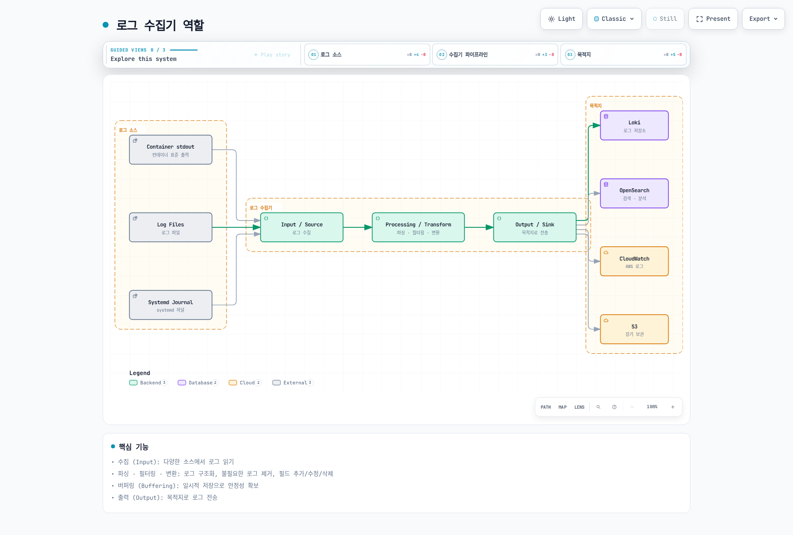
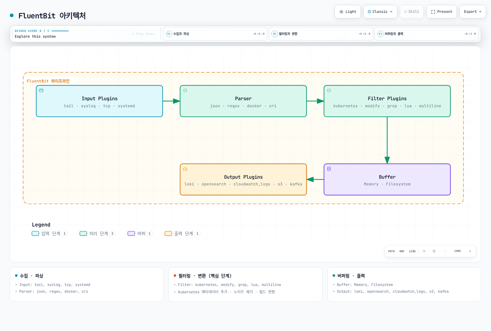
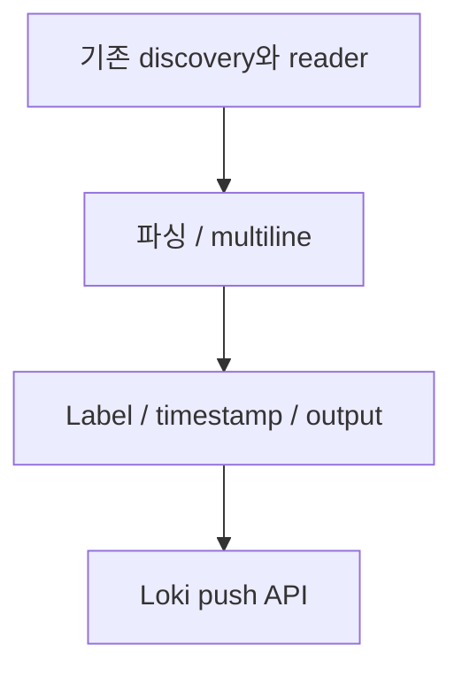
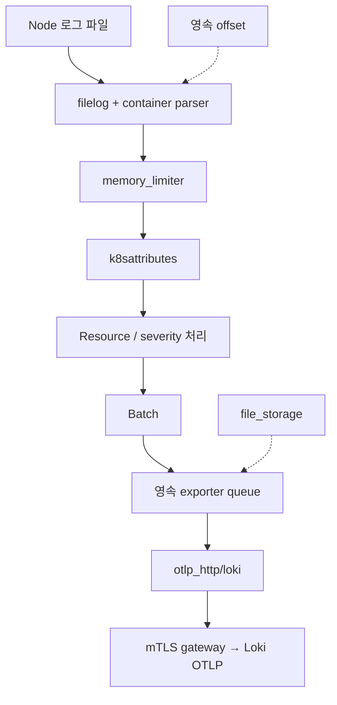
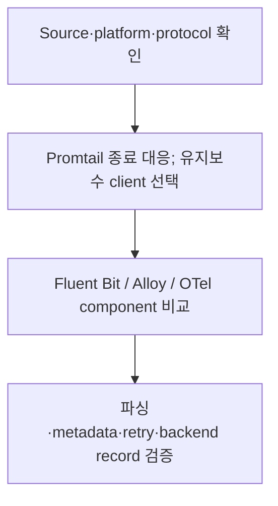

# 로그 수집기 비교

> **마지막 업데이트**: 2026년 9월 13일

Fluent Bit, Grafana Alloy, OpenTelemetry Collector를 비교하고 지원 종료된 Promtail에서의 마이그레이션을 설명합니다. 고정된 메모리·초당 이벤트 순위가 아니라 실제 입력, 출력 플러그인, 배포 권한, 실패 동작으로 수집기를 선택합니다.

설정 검토 기준은 **Fluent Bit 5.1.2**, **Alloy 1.19.2**, **OpenTelemetry Collector Contrib 0.160.0**입니다. 배포판 버전, 포함한 컴포넌트, 지원 플랫폼은 각각 확인해야 합니다.

## 목차

1. [개요](#개요)
2. [FluentBit](#fluentbit)
3. [Promtail](#promtail)
4. [Grafana Alloy](#grafana-alloy)
5. [OpenTelemetry Collector](#opentelemetry-collector)
6. [비교 및 선택 가이드](#비교-및-선택-가이드)

## 개요

### 로그 수집기 역할



[인터랙티브 다이어그램 보기](https://www.atomai.click/kubernetes-docs/archmaps/ko-observability-logging-05-collectors-0.html)

그림은 가능한 목적지를 보여줍니다. 모든 수집기가 모든 목적지를 네이티브로 지원하거나 여러 output에 원자적으로 전달한다는 뜻은 아닙니다.

### 핵심 기능

| 기능 | 확인할 내용 |
|---|---|
| Input | 파일/API 권한, rotation, 첫 읽기 위치, 수집 소유권 |
| Parsing | Container runtime framing과 앱 JSON·stack trace를 구분 |
| Transform/filter | 어떤 레코드·필드를 변경하거나 버리는지 |
| Metadata | 올바른 Pod/namespace 연결과 label cardinality |
| Buffering | 메모리·영속 저장소, 용량, retry, overflow 정책 |
| Output | 인증·TLS·tenant 매핑·acknowledgement·목적지 제한 |

소스마다 의도한 수집 경로 하나를 운영합니다. 여러 agent가 같은 파일을 읽거나 file/API reader가 같은 Pod를 대상으로 하면 로그가 중복될 수 있습니다. Offset, 영속 queue, backend 수집 완료는 서로 다른 상태입니다.

| 플랫폼 | 수집 시 고려할 점 |
|---|---|
| Linux Kubernetes node | Host-file agent에 node log mount와 허용된 security context 필요; journal 위치는 OS별 확인 |
| Windows node | 지원하는 Windows build·설정·실제 경로 사용; 아래 Linux manifest는 해당하지 않음 |
| EKS Fargate | Host-file DaemonSet을 설치하지 않음; 관리형 Fargate log router나 적절한 API/앱 기반 경로 사용 |
| EKS Auto Mode | 실제 host path·add-on 지원 확인; 관리 컴포넌트 vended log와 앱 stdout은 별도 |

예제 목적지는 **이미 구성된 private mTLS log gateway**입니다. Gateway가 agent client 인증서를 신뢰하고, DNS와 일치하는 서버 인증서를 제공하며, Loki/OTLP 경로와 tenant 정책을 처리해야 합니다. 인증서·DNS·gateway·NetworkPolicy는 선행 조건이며 아래 설정이 생성하지 않습니다.

## FluentBit

### 개요

Fluent Bit은 Graduated Fluentd 생태계에 속한 C 기반 telemetry agent입니다. 현재 build는 logs·metrics·traces와 OpenTelemetry 플러그인을 지원하므로 예전의 “traces/OTLP 미지원” 비교는 부정확합니다. 실제 image에 포함된 플러그인을 확인합니다.

Fluent Bit 5.1.2와 AWS for Fluent Bit은 별도 버전의 배포판입니다. AWS image tag가 내장 Fluent Bit 버전은 아닙니다. 이 예제는 upstream 공식 image와 manifest digest를 고정하며, 아래 연결한 AWS 전용 가이드는 각자 검토한 image 기준을 사용합니다.

### 아키텍처



[인터랙티브 다이어그램 보기](https://www.atomai.click/kubernetes-docs/archmaps/ko-observability-logging-05-collectors-1.html)

그림은 논리적 개요입니다. Buffer가 exactly-once를 보장하지 않으며 filter가 원본 container log file을 지우지도 않습니다. Node 저장소를 보호하고 앱이 기록하는 민감정보를 원천에서 통제합니다.

### 전체 설정 예시

다음을 `fluent-bit.conf`로 저장합니다. Container log를 수집하고 **C 기반 native `loki` output**을 사용합니다. 옵션 이름은 `line_format`, `tenant_id`, `auto_kubernetes_labels` 등입니다. 별도 Go plugin의 `LineFormat`, `TenantID`, `BatchWait`, `BatchSize`를 그대로 섞어 쓸 수 없습니다.

```ini
[SERVICE]
    Flush                     2
    Grace                     30
    Daemon                    Off
    Log_Level                 info
    HTTP_Server               On
    HTTP_Listen               0.0.0.0
    HTTP_Port                 2020
    Health_Check              On
    storage.path              /var/lib/fluent-bit/storage
    storage.sync              normal
    storage.checksum          On
    storage.backlog.mem_limit 32M

[INPUT]
    Name                      tail
    Tag                       kube.*
    Path                      /var/log/containers/*.log
    Exclude_Path              /var/log/containers/fluent-bit-*_logging_*.log
    multiline.parser          docker, cri
    DB                        /var/lib/fluent-bit/tail.db
    DB.locking                true
    Mem_Buf_Limit             32M
    Skip_Long_Lines           On
    Refresh_Interval          10
    Rotate_Wait               30
    Read_From_Head            Off
    storage.type              filesystem

[FILTER]
    Name                      kubernetes
    Match                     kube.*
    Kube_URL                  https://kubernetes.default.svc:443
    Kube_Tag_Prefix           kube.var.log.containers.
    Merge_Log                 On
    Merge_Log_Key             log_processed
    Keep_Log                  On
    K8S-Logging.Parser         Off
    K8S-Logging.Exclude        Off
    Use_Kubelet               Off
    Labels                    On
    Annotations               Off

[FILTER]
    Name                      lua
    Match                     kube.*
    script                    /fluent-bit/scripts/process.lua
    call                      process_log
    protected_mode            On

[OUTPUT]
    Name                      loki
    Match                     kube.*
    Host                      logs-gateway.logging.svc.cluster.local
    Port                      443
    tls                       On
    tls.verify                On
    tls.verify_hostname       On
    tls.ca_file               /fluent-bit/tls/ca.crt
    tls.crt_file              /fluent-bit/tls/tls.crt
    tls.key_file              /fluent-bit/tls/tls.key
    Labels                    job=fluent-bit,namespace=$kubernetes['namespace_name']
    line_format               json
    auto_kubernetes_labels    Off
    Retry_Limit               5
    storage.total_limit_size  1G
```

Tail database와 filesystem chunk는 읽기 전용 log mount가 아닌 writable state mount에 둡니다. 기존 offset이 있으면 DB에서 재개합니다. `Read_From_Head Off`는 처음 발견한 파일의 기존 내용을 건너뛰므로 변경 전에 backfill 정책을 정합니다. `Skip_Long_Lines On`, 유한한 retry와 저장소 용량은 데이터를 버릴 수 있으므로 관련 상태를 관찰합니다.

Exclude는 이 예제의 수집기 Pod를 대상으로 합니다. Namespace·workload 이름이 바뀌면 수정하며, 한 namespace의 앱 로그 전체를 무조건 제외하지 않습니다. 이 설정에서는 Kubernetes annotation이 parser/exclusion 정책을 바꾸지 못합니다.

Metadata는 API server로 조회하며 kubelet `nodes/proxy` 접근이 필요하지 않습니다. `Use_Kubelet`을 켜면 kubelet 주소·인증·인증서·네트워크를 별도로 검증합니다. HTTP metrics listener를 켠 것이 수집기 UI/health endpoint의 외부 공개를 허용한다는 뜻은 아닙니다.

다른 목적지는 output과 workload identity를 함께 선택합니다.

- [CloudWatch Logs](03-cloudwatch-logs.md): native `cloudwatch_logs`, 미리 만든 log group, 실제 agent ServiceAccount identity를 사용합니다. 지원하지 않는 `compress` 옵션을 넣거나 생성·retention 권한이 있다고 가정하지 않습니다.
- [OpenSearch](02-opensearch.md): native `opensearch` output과 선택한 backend의 SigV4 service/Region, TLS, typeless API 설정을 사용합니다.
- S3: `s3` output 전용 writable `store_dir`, 고유 object key, bucket-prefix 권한을 설정합니다. 일반 filesystem queue와 업로드·버퍼링 방식이 다릅니다. 부분 업로드·재시작 복구·실제 읽기를 검증한 뒤 backup으로 취급합니다.

`systemd` input을 추가하면 해당 node OS의 실제 journal을 mount하고 cursor DB를 writable하게 두며 tag와 일치하는 output을 추가합니다. `host.systemd` input에 `Match kube.*` output만 있으면 전달 경로가 없습니다. Host journal/audit 파일은 EKS control-plane API audit log가 아닙니다.

### 파서 설정

Tail input의 내장 `docker, cri` multiline parser는 container runtime fragment를 재조립합니다. 앱의 Java/Python/Go stack trace를 합치는 것과 다릅니다.

| 형식 | 처리 방법 |
|---|---|
| Docker JSON envelope | Runtime envelope를 먼저 풀고 앱 JSON 처리 |
| CRI/containerd/CRI-O | Timestamp·stream·partial/full marker 파싱과 partial record 재조립 |
| JSON 앱 로그 | 앱 payload만 파싱; 잘못된 JSON/일반 텍스트 처리 정책 명시 |
| Nginx/logfmt/custom text | 해당 앱 형식의 parser 선택; 모든 parser를 무조건 순서대로 적용하지 않음 |
| 앱 stack trace | Stream 경계·크기·timeout이 검증된 multiline parser 사용 |

Multiline **filter**는 re-emission과 순서 규칙을 따릅니다. 다시 입력되는 레코드에 앞선 filter가 반복 적용되지 않도록 배치합니다. 여러 container의 interleaving과 날짜 없는 exception도 테스트합니다. “날짜로 시작하는 줄” 하나가 모든 stack trace의 경계는 아닙니다.

### Lua 스크립트 예시

다음을 `process.lua`로 저장합니다. 파싱한 앱 object의 지정 key를 중첩 object/array까지 가리고, 미처리 raw 복사본을 제거합니다. 임의의 텍스트에서 모든 비밀·개인정보를 찾는 기능은 아닙니다.

```lua
-- Redacts selected structured keys; it is not a general PII detector.
local sensitive = {
    password = true, passwd = true, token = true, secret = true,
    api_key = true, ["api-key"] = true, authorization = true
}

local function redact(value, depth)
    if type(value) ~= "table" then
        return value
    end
    if depth > 8 then
        return "[DEPTH_LIMIT]"
    end
    for key, child in pairs(value) do
        if type(key) == "string" and sensitive[string.lower(key)] then
            value[key] = "***"
        elseif type(child) == "table" then
            value[key] = redact(child, depth + 1)
        end
    end
    return value
end

function process_log(tag, timestamp, record)
    local app = record["log_processed"]
    if type(app) == "table" then
        record["log_processed"] = redact(app, 0)
        -- Do not retain an unredacted duplicate of the parsed application JSON.
        record["log"] = nil
        if type(app["level"]) == "string" then
            record["level"] = string.upper(app["level"])
        else
            record["level"] = "UNKNOWN"
        end
    else
        if type(record["log"]) ~= "string" then
            record["log"] = "[NON_STRING_LOG]"
        end
        record["level"] = "UNKNOWN"
    end
    -- 2 changes the record while retaining the original Fluent Bit timestamp.
    return 2, timestamp, record
end
```

예를 들어 `password` 필드는 가리지만 `"message": "password=..."` 안의 문장을 자동으로 credential로 해석하지는 않습니다. 일반 텍스트 로그는 그대로 남습니다. 이 변환은 fail-closed 보안 경계가 아닙니다. 원본 파일·로컬 저장소·목적지를 보호하고 더 강한 보장이 필요하면 앱 logging allowlist를 사용합니다.

`return 2`는 레코드를 변경하면서 Fluent Bit의 원래 timestamp를 유지합니다. Type 검사로 boolean log level 같은 입력이 callback을 중단시키지 않도록 합니다. Native Lua interpreter로 변환을 확인했으며 전체 Fluent Bit container 실행을 검증한 것은 아닙니다.

### DaemonSet 배포

다음을 `fluent-bit-workload.yaml`로 저장합니다. `logging` namespace에 `ca.crt`, `tls.crt`, `tls.key`가 있는 `agent-gateway-client` Secret이 필요합니다. 배포 환경의 credential이며 예제 private key를 Git에 넣지 않습니다.

```yaml
apiVersion: v1
kind: ServiceAccount
metadata:
  name: fluent-bit
  namespace: logging
---
apiVersion: rbac.authorization.k8s.io/v1
kind: ClusterRole
metadata:
  name: log-collector-fluent-bit
rules:
- apiGroups:
  - ''
  resources:
  - pods
  - namespaces
  verbs:
  - get
  - list
  - watch
---
apiVersion: rbac.authorization.k8s.io/v1
kind: ClusterRoleBinding
metadata:
  name: log-collector-fluent-bit
roleRef:
  apiGroup: rbac.authorization.k8s.io
  kind: ClusterRole
  name: log-collector-fluent-bit
subjects:
- kind: ServiceAccount
  name: fluent-bit
  namespace: logging
---
apiVersion: apps/v1
kind: DaemonSet
metadata:
  name: fluent-bit
  namespace: logging
spec:
  selector:
    matchLabels: &id001
      app.kubernetes.io/name: fluent-bit
  template:
    metadata:
      labels: *id001
    spec:
      serviceAccountName: fluent-bit
      nodeSelector:
        kubernetes.io/os: linux
      terminationGracePeriodSeconds: 45
      containers:
      - name: fluent-bit
        image: fluent/fluent-bit:5.1.2@sha256:d792375ca8e53be72fc25716c28f291f32c6fc6f4f31d12d0d14bc78cefe9226
        command:
        - /fluent-bit/bin/fluent-bit
        args:
        - -c
        - /fluent-bit/etc/fluent-bit.conf
        ports:
        - name: metrics
          containerPort: 2020
        securityContext:
          runAsUser: 0
          allowPrivilegeEscalation: false
          readOnlyRootFilesystem: true
          capabilities:
            drop:
            - ALL
        resources:
          requests:
            cpu: 100m
            memory: 128Mi
          limits:
            cpu: 500m
            memory: 512Mi
        livenessProbe:
          httpGet:
            path: /
            port: metrics
          initialDelaySeconds: 10
        readinessProbe:
          httpGet:
            path: /api/v1/health
            port: metrics
          initialDelaySeconds: 10
        volumeMounts:
        - name: logs
          mountPath: /var/log
          readOnly: true
        - name: state
          mountPath: /var/lib/fluent-bit
        - name: config
          mountPath: /fluent-bit/etc
          readOnly: true
        - name: scripts
          mountPath: /fluent-bit/scripts
          readOnly: true
        - name: tls
          mountPath: /fluent-bit/tls
          readOnly: true
        - name: tmp
          mountPath: /tmp
      volumes:
      - name: logs
        hostPath:
          path: /var/log
          type: Directory
      - name: state
        hostPath:
          path: /var/lib/fluent-bit
          type: DirectoryOrCreate
      - name: config
        configMap:
          name: fluent-bit-config
          items:
          - key: fluent-bit.conf
            path: fluent-bit.conf
      - name: scripts
        configMap:
          name: fluent-bit-config
          items:
          - key: process.lua
            path: process.lua
      - name: tls
        secret:
          secretName: agent-gateway-client
      - name: tmp
        emptyDir:
          sizeLimit: 32Mi
```

앞의 설정·스크립트를 파일로 저장하고 workload 실행 전에 ConfigMap을 만듭니다.

```bash
kubectl create namespace logging --dry-run=client -o yaml |
  kubectl apply -f -
kubectl -n logging create configmap fluent-bit-config \
  --from-file=fluent-bit.conf --from-file=process.lua \
  --dry-run=client -o yaml | kubectl apply -f -
kubectl apply -f fluent-bit-workload.yaml
kubectl -n logging rollout status daemonset/fluent-bit
```

예제 node log를 읽고 전용 state 디렉터리에 쓰기 위해 root로 실행하지만 추가 capability·권한 상승·writable root filesystem은 허용하지 않습니다. HostPath 사용은 적절한 cluster admission 정책이 필요합니다. 실제 OS의 파일 권한, SELinux/AppArmor, taint, storage에 맞게 조정합니다. 앱 log agent를 유지한다는 이유만으로 예약된 system-critical PriorityClass를 부여하지 않습니다.

Pod 종료 유예 45초는 Fluent Bit의 30초보다 길지만 장시간 장애에서 전달을 보장하지 않습니다. Resource limit은 예시입니다. Backend의 실제 record, tail offset, health, buffer/retry 지표를 확인하며 Ready Pod만으로 수집 완료를 판정하지 않습니다.

## Promtail

### 개요

**Promtail은 2026년 3월 2일 지원 종료(EOL)되었습니다.** 상용 지원과 향후 업데이트가 끝났습니다. 기존 설치를 Alloy 또는 지원되는 다른 client로 이전하고 신규 Loki 구성에 Promtail을 선택하지 않습니다. 이 종료 공지에는 별도의 `lambda-promtail` client가 포함되지 않습니다.

### 아키텍처



설치 권장이 아닌 과거 데이터 경로입니다. Loki 저장소의 [라이선스 예외](https://github.com/grafana/loki/blob/v2.9.4/LICENSING.md)는 Promtail source가 있는 `clients/`를 Apache-2.0으로 명시합니다. Loki server의 AGPL 표기를 모든 client에 그대로 적용하지 않습니다. 실제 artifact·dependency의 license도 확인합니다. Position은 읽기 기록이지 backend 전달 완료가 아닙니다.

### 전체 설정 예시

오래된 2.9.4 image를 새로 배포하지 않고 **기존** `promtail.yaml`을 migration input으로 사용합니다.

```bash
alloy convert --source-format=promtail \
  --report=conversion-report.txt \
  --output=config.alloy promtail.yaml
alloy validate config.alloy
```

생성한 설정과 진단 보고서를 확인합니다. 오류 우회를 정상적인 배포 단계로 삼지 않습니다. Converter는 대부분의 기존 기능을 지원하지만 모든 동작의 완전한 동일성을 보장하지 않습니다.

검토한 기존 설정은 변환에 성공했으나, 전역 read-rate limit이 pipeline별 `stage.limit`로 바뀌고 Promtail 자체 tracing 설정은 수동 이전이 필요할 수 있으며 self-metric도 달라진다는 경고가 나왔습니다. Alert/dashboard를 수정하고 실제 데이터로 차이를 확인합니다.

### 파이프라인 스테이지 상세

다음은 **개별 기능의 대응표**이며 모든 parser를 연속 실행하는 설정이 아닙니다.

| Promtail YAML | Alloy 대응 | 구분할 점 |
|---|---|---|
| `cri` / `docker` | `stage.cri` / `stage.docker` | 실제 runtime framing 선택 |
| `json`, `regex`, `logfmt` | 해당 `stage.*` | 입력 필드와 malformed-data 정책 확인 |
| `template` 후 `labels` | `stage.template` 후 `stage.labels` | Label로 복사하기 전에 정규화 |
| `drop` | `stage.drop` | Promtail YAML key는 `stage.drop`이 아닌 `drop` |
| `match` | `stage.match` | 의도한 stream에만 분기 적용 |
| `metrics` | `stage.metrics` | Label set·idle series·metric 이름 검토 |
| `timestamp`, `multiline` | 해당 stage | 시간 형식·stream 분리·대기 상한 검증 |
| `output` | `stage.output` | 본문 교체로 상관관계 필드가 사라질 수 있음 |
| `pack` | `stage.pack` | JSON line packing은 Loki의 별도 structured metadata와 다름 |

Client IP, 주문 ID, trace ID, 모든 임의의 앱 label을 기본 index로 만들지 않습니다. Pod·filename도 cardinality 비용이 있습니다. Label·structured metadata·본문 중 어디에 정보가 남아야 하는지 정합니다.

### DaemonSet 배포

지원되는 수집기로 교체하면서 source/state 전환을 계획합니다. 예전 read-only-root 예제의 `/tmp` positions 파일은 영속적이지도 writable하지도 않습니다. 설정이 다른 경로에 쓰면 `/run/promtail` mount가 문제를 해결하지 못합니다.

기존 reader의 종료 위치, 새 reader의 시작 위치, backend 검증을 조정합니다. 같은 로그를 두 reader가 무기한 함께 읽게 하지 않습니다. 변환 성공은 Secret mount·Kubernetes RBAC·journal path·state migration·backend 전달 검증이 아닙니다.

## Grafana Alloy

### 개요

Alloy는 Prometheus·Loki component를 제공하는 Grafana의 OpenTelemetry Collector 배포판입니다. 언어는 **Alloy 설정 문법**이며 이전 명칭이 River입니다. HCL과 비슷하지만 Terraform 파일과 호환된다는 뜻은 아닙니다.

### River 설정

다음을 `config.alloy`로 저장합니다. Linux CRI 로그의 **file 기반 경로 하나**를 사용합니다. 비밀이 아닌 `NODE_NAME`을 Pod Downward API의 `spec.nodeName`으로 설정하고 node log mount와 writable persistent `--storage.path`를 제공합니다.

```alloy
logging {
  level = "info"
}

discovery.kubernetes "pods" {
  role = "pod"
  selectors {
    role = "pod"
    field = "spec.nodeName=" + sys.env("NODE_NAME")
  }
}

discovery.relabel "pods" {
  targets = discovery.kubernetes.pods.targets
  rule {
    source_labels = ["__meta_kubernetes_namespace", "__meta_kubernetes_pod_label_app_kubernetes_io_name"]
    regex = "logging;alloy"
    action = "drop"
  }
  rule {
    source_labels = ["__meta_kubernetes_namespace"]
    target_label = "namespace"
  }
  rule {
    source_labels = ["__meta_kubernetes_pod_name"]
    target_label = "pod"
  }
  rule {
    source_labels = ["__meta_kubernetes_pod_container_name"]
    target_label = "container"
  }
  rule {
    source_labels = ["__meta_kubernetes_pod_label_app_kubernetes_io_name"]
    target_label = "service_name"
    regex = "(.+)"
  }
  rule {
    source_labels = ["__meta_kubernetes_pod_uid", "__meta_kubernetes_pod_container_name"]
    separator = "/"
    target_label = "__path__"
    replacement = "/var/log/pods/*$1/*.log"
  }
}

local.file_match "pods" {
  path_targets = discovery.relabel.pods.output
}

loki.source.file "pods" {
  targets = local.file_match.pods.targets
  forward_to = [loki.process.pods.receiver]
  tail_from_end = true
}

loki.process "pods" {
  forward_to = [loki.write.logs.receiver]
  stage.cri {}
  stage.json {
    expressions = {
      level = "level",
    }
    drop_malformed = false
  }
  stage.template {
    source = "level"
    template = "{{ if .Value }}{{ $v := ToUpper .Value }}{{ if or (eq $v \"TRACE\") (eq $v \"DEBUG\") (eq $v \"INFO\") (eq $v \"WARN\") (eq $v \"WARNING\") (eq $v \"ERROR\") (eq $v \"FATAL\") (eq $v \"CRITICAL\") }}{{ $v }}{{ else }}UNKNOWN{{ end }}{{ else }}UNKNOWN{{ end }}"
  }
  stage.labels {
    values = {
      level = "",
    }
  }
  stage.label_drop {
    values = ["filename"]
  }
  // Retain the application line, including its trace ID; do not assume it is safe.
}

loki.write "logs" {
  endpoint {
    url = "https://logs-gateway.logging.svc.cluster.local/loki/api/v1/push"
    batch_wait = "1s"
    batch_size = "1MiB"
    tls_config {
      ca_file = "/etc/alloy/tls/ca.crt"
      cert_file = "/etc/alloy/tls/tls.crt"
      key_file = "/etc/alloy/tls/tls.key"
      insecure_skip_verify = false
    }
  }
  external_labels = {
    cluster = "lab-cluster",
  }
}
```

mTLS 인증서 파일이 실제로 있어야 합니다. Kubernetes discovery 권한과 gateway 정책은 따로 구성합니다. 선택한 Alloy binary로 검증합니다.

```bash
alloy validate config.alloy
```

Severity label을 알려진 level과 `UNKNOWN`으로 제한하면서 trace ID 조회를 위한 앱 본문은 남깁니다. Redaction pipeline은 아닙니다. Filename label을 제거하지만 Pod/container는 남으므로 retention/cardinality 한도를 함께 평가합니다.

API 방식이면 file reader **대신** `loki.source.kubernetes`를 사용하고 CRI/Docker envelope stage를 제거합니다. Kubernetes log API는 앱 로그 줄을 제공합니다. API collector 하나가 host mount 없이 cluster 로그를 수집할 수 있습니다. 여러 instance는 명시적인 target 분리 또는 component 참여를 포함한 Alloy clustering이 필요하며 replica만 늘리면 중복 수집될 수 있습니다.

검토한 릴리스에서 `env()`는 제거된 함수가 아니라 deprecated 함수입니다. 비밀이 아닌 설정에는 `sys.env()`를 사용합니다. Token은 환경변수 dump로 노출시키기보다 mount한 credential file이나 secret-aware component로 처리합니다.

Alloy self-metric을 scrape할 수 있습니다. Prometheus `/api/v1/write`로 보내려면 remote-write receiver가 활성화되어 있거나 remote write를 지원하는 backend여야 합니다. URL만 지정해서 receiver가 켜지지는 않습니다. Metrics/UI 접근을 private하게 유지하고 reporting/telemetry 설정도 명시합니다.

### Promtail에서 마이그레이션

Runtime parser, discovery label, 앱 필드, offset, drop 정책, client 인증, self-metric alert를 각각 유지·검증합니다. 정의하지 않은 discovery component를 참조하거나 이미 decoding한 API 로그에 `stage.docker`를 적용하는 예제는 완성된 migration이 아닙니다.

Alloy 1.19.2에 선택적인 Loki WAL이 있지만 **experimental이며 기본 비활성화**입니다. 기본 예제에서는 켜지 않습니다. 영속적인 source position은 durable acknowledgement queue가 아니므로 retry, rotation, WAL retention을 별도로 평가합니다.

## OpenTelemetry Collector

### 개요

OpenTelemetry는 벤더 중립적인 telemetry pipeline을 제공하며 **2026년 5월 11일 CNCF Graduated**가 되었습니다. 필요한 receiver/processor/exporter를 포함한 배포판을 사용합니다. Core 배포판에 모든 Contrib component가 들어 있지는 않습니다.

OTLP는 Protobuf 또는 JSON을 사용할 수 있습니다. 실제 필드·resource grouping·압축·transport에 따라 전송량이 달라집니다. Filebeat/Fluentd도 batch할 수 있으며 Protobuf tag가 임의의 JSON body나 attribute key 문자열을 없애는 것은 아닙니다.

조건부 산술 예로, 기존 pipeline이 event당 Kafka record 하나를 만들고 새 encoder가 record당 150개를 묶으면 event 1,000개에 약 7개 record가 필요합니다. Network request가 같은 비율로 줄거나 처리량이 18배 늘어난다는 증거는 아닙니다. 같은 hardware·데이터·목적지·내구성 조건에서 전체 pipeline을 측정합니다.

### 아키텍처



Loki에는 OTLP endpoint로 전달합니다. 종료된 Collector `loki` exporter는 Contrib 0.160.0에 없습니다. Cluster 전체 Kubernetes event와 중앙 Syslog/OTLP receiver는 별도 소유권·배포 모델이 필요하며 node마다 같은 event watcher를 복제하지 않습니다.

### 전체 설정 예시

다음을 `otel.yaml`로 저장합니다. Contrib `container` operator로 runtime 파싱·재조립·파일 경로의 resource metadata를 처리합니다. 아래 Kubernetes association은 **resource attribute**의 Pod UID를 사용하므로 일반 `attributes.uid` 추출만으로는 충분하지 않습니다.

```yaml
extensions:
  file_storage/offsets:
    directory: /var/lib/otelcol/offsets
    create_directory: true
  file_storage/queue:
    directory: /var/lib/otelcol/queue
    create_directory: true
  health_check:
    endpoint: 0.0.0.0:13133

receivers:
  filelog:
    include: [/var/log/pods/*/*/*.log]
    exclude: [/var/log/pods/logging_otel-collector-*/*/*.log]
    start_at: end
    include_file_path: true
    storage: file_storage/offsets
    retry_on_failure:
      enabled: true
      max_elapsed_time: 5m
    operators:
      - type: container
        id: container-parser

processors:
  memory_limiter:
    check_interval: 1s
    limit_mib: 400
    spike_limit_mib: 100
  k8sattributes:
    auth_type: serviceAccount
    filter:
      node_from_env_var: NODE_NAME
    pod_association:
      - sources:
          - from: resource_attribute
            name: k8s.pod.uid
    extract:
      metadata:
        - k8s.namespace.name
        - k8s.pod.name
        - k8s.pod.uid
        - k8s.node.name
        - k8s.container.name
  resource/cluster:
    attributes:
      - key: k8s.cluster.name
        value: lab-cluster
        action: upsert
  transform/application:
    error_mode: ignore
    log_statements:
      - context: log
        statements:
          - 'set(cache["app"], ParseJSON(body)) where IsString(body) and IsMatch(body, "^\\s*\\{")'
          - 'set(severity_text, ConvertCase(cache["app"]["level"], "upper")) where IsMap(cache["app"]) and IsString(cache["app"]["level"])'
          - 'set(severity_number, SEVERITY_NUMBER_ERROR) where severity_text == "ERROR"'
          - 'set(severity_number, SEVERITY_NUMBER_WARN) where severity_text == "WARN" or severity_text == "WARNING"'
          - 'set(severity_number, SEVERITY_NUMBER_INFO) where severity_text == "INFO"'
          - 'set(severity_number, SEVERITY_NUMBER_DEBUG) where severity_text == "DEBUG"'
          - 'set(severity_number, SEVERITY_NUMBER_TRACE) where severity_text == "TRACE"'
          - 'set(severity_number, SEVERITY_NUMBER_FATAL) where severity_text == "FATAL" or severity_text == "CRITICAL"'
  batch:
    send_batch_size: 1024
    send_batch_max_size: 2048
    timeout: 2s

exporters:
  otlp_http/loki:
    endpoint: https://logs-gateway.logging.svc.cluster.local/otlp
    encoding: proto
    compression: gzip
    tls:
      ca_file: /etc/otelcol/tls/ca.crt
      cert_file: /etc/otelcol/tls/tls.crt
      key_file: /etc/otelcol/tls/tls.key
    sending_queue:
      enabled: true
      num_consumers: 2
      queue_size: 128
      storage: file_storage/queue
    retry_on_failure:
      enabled: true
      max_elapsed_time: 5m

service:
  extensions: [file_storage/offsets, file_storage/queue, health_check]
  telemetry:
    logs:
      level: info
    metrics:
      readers:
        - pull:
            exporter:
              prometheus:
                host: 0.0.0.0
                port: 8888
  pipelines:
    logs:
      receivers: [filelog]
      processors: [memory_limiter, k8sattributes, resource/cluster, transform/application, batch]
      exporters: [otlp_http/loki]
```

`NODE_NAME` Downward API, 읽기 전용 node log mount, writable `/var/lib/otelcol`, Kubernetes metadata RBAC, client 인증서 mount가 필요합니다. Storage extension이 writable volume 안에 전용 디렉터리를 만듭니다. 배포 환경의 값을 설정한 상태에서 검증합니다.

```bash
otelcol-contrib validate --config=otel.yaml
```

Exporter가 `/otlp`에 `/v1/logs`를 덧붙이므로 gateway 경로와 Loki OTLP/structured-metadata 지원을 맞춥니다. 이 기준에서 유효하지 않은 예전 `address` 대신 `service.telemetry.metrics.readers`를 사용합니다.

`memory_limiter`는 retryable error로 데이터를 거절하고 garbage collection을 요청할 수 있습니다. 프로세스 메모리 상한이나 절대적인 OOM 방지 기능은 아닙니다. Upstream retry가 중요하며 이 file receiver는 최대 5분 재시도 후 실패한 batch를 버릴 수 있습니다. Queue·disk 용량·종료·backend 장애도 검증해야 합니다.

일반 텍스트와 잘못된 JSON을 포함한 앱 본문을 유지합니다. Severity 파싱은 민감정보 제거가 아닙니다. Production payload를 수집기 로그로 복사하는 별도 detailed-debug exporter를 무심코 추가하지 않습니다.

### Routing Connector

다음은 모든 참조 component와 fallback route가 정의된 **별도의 로컬 routing 데모**입니다. OTLP producer가 `resource.attributes["logtype"]`를 제공합니다. 앱 JSON 필드가 자동으로 resource attribute가 되지는 않습니다.

```yaml
receivers:
  otlp:
    protocols:
      http:
        endpoint: 127.0.0.1:4318

connectors:
  routing:
    default_pipelines: [logs/other]
    table:
      - condition: resource.attributes["logtype"] == "mysql"
        pipelines: [logs/mysql]
      - condition: resource.attributes["logtype"] == "nginx"
        pipelines: [logs/nginx]
      - condition: resource.attributes["logtype"] == "app"
        pipelines: [logs/app]

exporters:
  file/mysql:
    path: /var/lib/otelcol/routed/mysql.json
  file/nginx:
    path: /var/lib/otelcol/routed/nginx.json
  file/app:
    path: /var/lib/otelcol/routed/app.json
  file/other:
    path: /var/lib/otelcol/routed/other.json

service:
  pipelines:
    logs/ingestion:
      receivers: [otlp]
      exporters: [routing]
    logs/mysql:
      receivers: [routing]
      exporters: [file/mysql]
    logs/nginx:
      receivers: [routing]
      exporters: [file/nginx]
    logs/app:
      receivers: [routing]
      exporters: [file/app]
    logs/other:
      receivers: [routing]
      exporters: [file/other]
```

실행 전에 writable output 디렉터리를 만듭니다. Receiver는 loopback에 bind하고 목적지는 local file이므로 production gateway나 ClickHouse 배포가 아닙니다. 실제 backend·인증·storage policy를 구성한 뒤 output을 교체합니다.

현재 connector는 `statement: route() where ...`도 지원하며 실제로 검증했습니다. 제거된 API로 취급하지 않습니다. 예제에서는 더 간결한 `condition`을 사용합니다. 기본 `move`는 일치한 데이터를 뒤의 route 평가에서 제외하며 `copy`는 fan-out 의미가 다릅니다. 일치하지 않은 record의 fallback도 명시합니다.

Kafka topic 통합은 ACL·retention·partition·consumer 소유권·장애 분리가 적합할 때만 관리 부담을 줄일 수 있습니다. Collector 분류가 broker 격리나 원자적인 fan-out을 대체하지 않습니다. Producer가 정하는 routing attribute는 tenant 인증 경계가 아닙니다.

### 로그 레벨별 Pool 분리 (대규모 환경)

| Pool | 목표 예시 | 필요한 제어 |
|---|---|---|
| Fast: ERROR/FATAL | 2분 이내 도착 | 예비 capacity, queue/partition 분리, 실제 backlog 측정 |
| Common: INFO/WARN | 15분 이내 도착 | 측정 기반 autoscaling과 제한된 retention/queue |
| Debug: DEBUG/TRACE | Best effort | 명시적인 drop/throttle과 버린 데이터 관찰 |

실측 SLA가 아닌 목표 예시입니다. Deployment 세 개에 이름·replica만 지정해도 routing이나 혼잡한 공용 input queue의 격리가 생기지 않습니다. 입력 크기·처리·batch·retry 측정값으로 resource request/limit을 정합니다.

Cluster에 맞는 운영자 소유 PriorityClass를 사용하며 `system-cluster-critical`/`system-node-critical`을 일반 logging 권장값으로 쓰지 않습니다. 전용 node·priority·예비 capacity도 모든 장애의 가용성을 보장하지 않습니다.

## 비교 및 선택 가이드

### 기능 비교표

| 항목 | Fluent Bit | Promtail | Alloy | OTel Collector Contrib |
|---|---|---|---|---|
| Lifecycle | 유지보수 중 | EOL; 이전 필요 | 유지보수 중 | 유지보수 중 |
| 설정 | Classic config / YAML | 기존 YAML | Alloy 문법 | YAML |
| Signals | Plugin별 logs/metrics/traces | 주로 Loki logs | Logs/metrics/traces | Component별 logs/metrics/traces |
| Loki 경로 | Native output | 기존 push client | Loki component | OTLP HTTP exporter |
| AWS output | Native plugin 제공 | 주 목적이 아님 | 포함 component/forwarding 확인 | 포함 AWS exporter 확인 |
| 확장 | C/plugin, Lua filter 등 build별 확인 | 기존 pipeline stage | Component와 pipeline | Receiver/processor/connector/exporter |
| 영속성 | Input chunk/state와 output별 저장소 | Source position·제한된 client buffer | Position·선택적인 experimental Loki WAL | Offset와 지원 exporter queue의 file storage |
| 자원 사용 | 선택한 설정 측정 | 과거 측정치로만 해석 | 선택한 설정 측정 | 선택한 설정 측정 |

Native plugin 지원과 OTLP를 다른 collector로 전달하는 것은 다릅니다. 설치한 배포판의 실제 component 목록과 backend protocol을 확인한 뒤 지원 여부를 판정합니다.

### 사용 사례별 권장

- 기존 native output 통합과 측정한 node-agent 요구에 Fluent Bit을 검토합니다.
- Grafana/Loki/Prometheus 흐름과 Promtail 이전에 Alloy를 검토하되 source 소유권을 명시합니다.
- 표준 OTLP와 여러 vendor의 processor/connector 조합에 OTel Collector를 검토합니다.
- Promtail은 이전합니다. 이미 실행 중이라는 이유만으로 유지하는 것은 지원되는 장기 선택이 아닙니다.

### 의사결정 플로우



## 참고 자료와 검증 범위

- [Fluent Bit 5.1.2 source와 기능](https://github.com/fluent/fluent-bit/tree/v5.1.2)
- [Native Loki output 옵션](https://github.com/fluent/fluent-bit/blob/v5.1.2/plugins/out_loki/loki.c)
- [Promtail lifecycle](https://grafana.com/docs/loki/latest/send-data/promtail/)
- [Alloy migration](https://grafana.com/docs/alloy/latest/set-up/migrate/from-promtail/)
- [Alloy Kubernetes API source](https://grafana.com/docs/alloy/latest/reference/components/loki/loki.source.kubernetes/)
- [Alloy Loki output/WAL](https://grafana.com/docs/alloy/latest/reference/components/loki/loki.write/)
- [Collector Contrib 릴리스](https://github.com/open-telemetry/opentelemetry-collector-releases/releases/tag/v0.160.0)
- [Filelog receiver](https://github.com/open-telemetry/opentelemetry-collector-contrib/blob/v0.160.0/receiver/filelogreceiver/README.md)
- [Routing connector](https://github.com/open-telemetry/opentelemetry-collector-contrib/blob/v0.160.0/connector/routingconnector/README.md)
- [Memory limiter](https://github.com/open-telemetry/opentelemetry-collector/blob/v0.160.0/processor/memorylimiterprocessor/README.md)
- [OpenTelemetry CNCF 상태](https://www.cncf.io/projects/opentelemetry/)
- [EKS Fargate logging](https://docs.aws.amazon.com/eks/latest/userguide/fargate-logging.html)

검증 범위는 릴리스된 Alloy/Collector 설정 검사와 로컬 합성 로그 처리, Lua 변환, 공식 plugin/source 계약, Kubernetes manifest 구조입니다. 실제 Kubernetes metadata 조회, node-agent 배포, gateway mTLS, AWS 전달, HA, production 부하·throughput benchmark는 실행하지 않았습니다.

## 퀴즈

[로그 수집기 퀴즈](../../quizzes/observability/logging/05-collectors-quiz.md)로 내용을 확인합니다.
