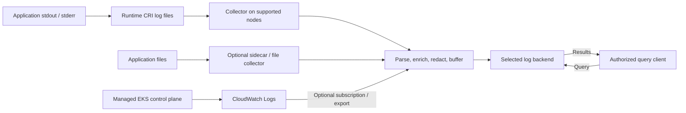

# 로깅 개요

> **마지막 업데이트**: 2026년 9월 13일

Logging은 application 동작·인프라 event·감사 증거를 연결합니다.
Event schema, 수집 소유권, 전달 실패 처리, 접근·retention·query를 함께 설계합니다.
Collector/backend 선택만으로 기록 완전성·tenant 격리·규정 준수를 보장하지 않습니다.

## 로깅 기본 개념

### 구조화된 record도 parsing이 필요함

JSON은 field를 명시해 검증·검색을 돕지만 decoding, timestamp/type mapping,
container-runtime framing 처리가 여전히 필요합니다. Plain text보다 커질 수도 있으며
민감 데이터를 자동으로 없애지 않습니다. 검증한 multiline 형식이 아니라면 한 줄에
event 하나를 출력합니다.

다음은 기존 2025 timestamp를 형식 예시로 보존한 합성 record이며 현재 incident 기록이 아닙니다.

```json
{
  "timestamp": "2025-02-15T10:23:45.123Z",
  "level": "ERROR",
  "message": "Database connection timed out",
  "service": "example-api",
  "operation": "database.connect",
  "timeout_ms": 30000,
  "trace_id": "4bf92f3577b34da6a3ce929d0e0e4736",
  "span_id": "00f067aa0ba902b7"
}
```

위 JSON은 읽기 쉽게 펼친 것입니다. 실제 line-oriented 출력은 message 안에 newline이
있더라도 다음처럼 직렬화할 수 있습니다.

```python
import json


def encode_log(record):
    # JSON escapes embedded newlines; append exactly one record delimiter.
    return json.dumps(record, ensure_ascii=False, separators=(",", ":")) + "\n"
```

이 field 이름은 application convention이며 OTLP wire schema가 아닙니다.
필요하면 collector/backend에서 OpenTelemetry Timestamp, SeverityText/SeverityNumber,
Body, Resource, Attributes와 trace context로 mapping합니다.

Trace ID는 16 bytes(여기서는 hex 32자), span ID는 8 bytes(hex 16자)입니다.
모두 0인 ID는 유효하지 않습니다. Log마다 무관한 ID를 만들지 말고 실제 active context를
연결합니다. Span이 없는 startup/system record는 trace context를 생략할 수 있으므로
모든 JSON log의 필수 field는 아닙니다. 올바른 ID만으로 span 생성이나 서비스 간 연결이
보장되지도 않습니다.

필요한 business/context field만 수집합니다. Raw session token·password·고객 데이터·
IP·request body를 모든 로그의 기본 field로 권장하지 않습니다. 식별 가능한 audit data가
필요한 경우에도 접근·retention·redaction 정책을 정합니다.
Application JSON이 임의 tenant/namespace를 주장하게 두지 말고 신뢰할 수 있는
collector metadata를 routing에 사용합니다.

### Severity는 보편적인 0–5 척도가 아님

Framework별 이름과 숫자가 다르므로 의미를 mapping합니다.
OpenTelemetry log model의 범위는 다음과 같습니다.

| Severity | SeverityNumber |
| --- | --- |
| TRACE | 1–4 |
| DEBUG | 5–8 |
| INFO | 9–12 |
| WARN | 13–16 |
| ERROR | 17–20 |
| FATAL | 21–24 |

이 모델의 0은 severity 미지정입니다. ERROR가 언제나 복구 가능함을 뜻하지 않으며
이름만으로 retry/recovery 정책을 정하지 않습니다.
INFO는 운영의 출발점이 될 수 있지만 audit/security event와 일시적 debugging에는
별도 요구가 있습니다. Volume을 줄이려고 모두 WARN 이상으로 올리면 필요한 증거도 사라집니다.

## 수집과 처리

아래 계층은 역할이며 반드시 다른 process라는 뜻은 아닙니다.
Destination을 명시적으로 선택하고 모든 record를 모든 backend에 복사하지 않습니다.
Managed EKS control-plane record는 worker-node file이 아닌 CloudWatch 경로로 들어옵니다.



| 패턴 | 사용 조건과 한계 |
| --- | --- |
| stdout/stderr + node collector | 일반적인 Linux worker-node 경로; runtime file/collector 권한 필요 |
| File + sidecar | Legacy/file-only application이나 전용 처리; shared volume·시작/종료·overhead 검토 |
| Application/SDK push | 구조화된 event를 직접 전송; buffering·인증·실패 처리가 application에 영향 |
| 관리형 platform router | EKS Fargate built-in router 등 해당 구성 모델 사용 |

DaemonSet은 selector·affinity·toleration·OS·rollout에 맞는 node에 배치됩니다.
모든 node에서 collector가 정상이며 모든 container를 포함한다고 증명하지 않습니다.
Collector 중복이나 rollout overlap은 중복 수집을 만들 수 있습니다.
Sidecar만으로 강한 multi-tenant 보안 격리가 되는 것도 아닙니다.

### Linux 기본 log 경로와 수명

일반적인 기본 배치는 다음과 같습니다.

```text
Runtime이 쓰는 실제 log file:
  /var/log/pods/<namespace>_<pod>_<uid>/<container>/0.log

그 file을 가리키는 호환성 symlink:
  /var/log/containers/<pod>_<namespace>_<container>-<container-id>.log
```

Kubelet이 runtime의 CRI log 경로를 지정하고 rotation을 관리합니다.
`podLogsDir`로 기본 경로를 바꿀 수 있고 OS/runtime별 차이도 있습니다.
Containerd workload에 Docker 전용 mount를 무조건 추가하지 말고 실제 배포를 확인합니다.
`kubectl logs`는 현재 log file을 제공하며 `--previous`는 보존된 이전 container instance를
볼 수 있는 기능이지 과거 log archive가 아닙니다.

Rotation은 local file을 제한할 뿐 중앙 retention/backup을 구현하지 않습니다.
Node 손실·eviction·삭제로 수집 전 record가 사라질 수 있습니다.
Sidecar의 `emptyDir`는 같은 Pod의 container 재시작을 견디지만 Pod 삭제는 견디지 못합니다.
Collector offset DB·queue·persistent storage를 output acknowledgment/retry와 함께 설계합니다.
Buffer는 유한하고 retry는 중복을 만들 수 있으므로 loss/duplicate·backlog·공간 부족·복구를 시험합니다.

Record별 기본 경로를 정합니다. Sidecar가 직접 전송하면서 같은 record를 stdout에도
쓰면 node collector와 중복될 수 있습니다. Collector 출력의 재귀 수집이나 같은
subscription source log group으로 되돌려 보내는 경로를 피합니다.

### Fluent Bit 처리 fragment

다음은 YAML이 아닌 **Fluent Bit classic configuration**입니다.
Filter만 보여주므로 실제 input·CRI/multiline parser·tag 형식·RBAC/cache 접근·storage·
output을 별도로 구성하고 검증합니다.

```text
# Fluent Bit classic-format FILTER fragment, not YAML or a complete pipeline.
# Requires matching tail input tags and CRI/Docker parsing.
[FILTER]
    Name               kubernetes
    Match              kube.*
    Kube_Tag_Prefix     kube.var.log.containers.
    Merge_Log          On
    Merge_Log_Key      app
    Keep_Log           On
    K8S-Logging.Parser  Off
    Labels             Off
    Annotations        Off

[FILTER]
    Name               modify
    Match              kube.*
    Set                cluster_name example-cluster
    Set                environment demo
```

`Merge_Log_Key app`는 parsing한 application field를 collector metadata와 분리합니다.
`Set`은 지정한 cluster/environment 값을 교체하며 `Add`는 이미 있는 값을 그대로 둡니다.
여기서는 workload가 선택한 parser/annotation을 자동 신뢰하지 않습니다.
`Kube_Tag_Prefix`도 실제 input tag에 맞춥니다.

`Keep_Log On`에서는 raw log와 parsed copy 둘 다 redaction 대상입니다.
Raw copy 제거는 검증한 정책에 따라 수행합니다.
`HealthCheck`라는 문자열이 있는 모든 line을 버리면 실패 증거도 잃을 수 있습니다.
Application format과 실패 사례를 확인한 뒤 정의된 일상 event만 filter합니다.

이 개요는 불완전한 `latest` image DaemonSet을 완전한 설치 예제로 제시하지 않습니다.
실제 collector에는 고정 image·config·service account/RBAC·mount·권한·resource가 필요합니다.
배포는 [collector 장](05-collectors.md)을 참고하고 선택한 platform/backend 구성을 검증합니다.

## EKS 로깅 경로

### Control-plane log

EKS는 `api`, `audit`, `authenticator`, `controllerManager`, `scheduler` record를
해당 계정의 CloudWatch Logs로 직접 보낼 수 있습니다.
각각 API 진단·audit event·IAM 인증 진단·controller·scheduler 진단에 해당합니다.
운영/security 요구에 맞는 유형을 선택합니다.

다음을 `control-plane-logging.json`으로 저장합니다.

```json
{
  "clusterLogging": [
    {
      "types": [
        "api",
        "audit",
        "authenticator",
        "controllerManager",
        "scheduler"
      ],
      "enabled": true
    }
  ]
}
```
```bash
export AWS_REGION=ap-northeast-2
export CLUSTER_NAME=my-cluster

# Inspect the existing configuration before choosing a change.
aws eks describe-cluster --name "$CLUSTER_NAME" --region "$AWS_REGION" \
  --query 'cluster.logging'

# This changes the cluster logging configuration and can incur log charges.
aws eks update-cluster-config --name "$CLUSTER_NAME" --region "$AWS_REGION" \
  --logging file://control-plane-logging.json

# Use the actual update ID from the response, then inspect status/errors.
: "${UPDATE_ID:?Set the returned update ID}"
aws eks describe-update --name "$CLUSTER_NAME" --region "$AWS_REGION" \
  --update-id "$UPDATE_ID"
```

변경은 비동기입니다. EKS 문서는 update를 위해 subnet마다 최대 5개의 가용 IP가
필요할 수 있다고 명시합니다. Update 상태·실제 stream·log group retention/권한을
확인합니다. 전달은 best effort이며 보통 수분 내에 도착합니다.
활성화했다고 모든 이전 event가 소급 수집되는 것은 아닙니다.

Audit event는 policy의 level/stage/제외 조건에 따릅니다. 모든 request/body가
기록되었다는 증거가 아니며 `audit` 활성화만으로 규정 준수가 성립하지 않습니다.
Node DaemonSet이 managed control-plane host를 읽는 것도 아닙니다.
CloudWatch record를 다른 곳으로 보내는 subscription/export에는 별도 encoding·IAM·
전달·중복 처리 요구가 있습니다.

### Fargate와 Container Insights

EKS Fargate에는 Fluent Bit 기반 managed router가 있으며 `aws-observability`
namespace의 `aws-logging` ConfigMap으로 설정합니다.
문서화된 5,300-character 한도와 section/plugin 제한이 있고 일반 host DaemonSet을
설치하는 방식이 아닙니다. Destination 권한을 설정하고 새 workload의 log를 시험합니다.
Auto Mode·혼합·Windows 환경도 지원되는 수집 경로를 확인합니다.

Namespace에는 `aws-observability: enabled` label이 필요합니다. 문서에 따라 Fargate
pod execution role에 destination 권한을 부여합니다. ConfigMap 변경은 기존 Pod가
아닌 새 Pod에 적용되므로 통제된 rollout과 전달 확인을 계획합니다.


CloudWatch Agent의 `logs.metrics_collected.kubernetes`는 Container Insights
performance data를 만들며 application stdout/stderr 수집 자체가 아닙니다.
Fluent Bit나 구성된 OTel log 경로가 application log를 별도로 처리합니다.
실제 workload/Operator가 읽지 않는 ConfigMap은 효과가 없습니다.
검토된 [CloudWatch 장](../metrics/04-cloudwatch-metrics.md)의 모델·구성 경계를 참고하세요.

## 저장·retention·비용 결정

| Backend | 설계 질문 |
| --- | --- |
| Loki | LogQL, label-indexed stream/chunk와 지원 metadata/filter; label·tenancy/auth·storage·query capacity 선택 |
| OpenSearch | Search/aggregation API, mapping/index lifecycle; 자체 운영·managed domain·UltraWarm·Serverless 구분 |
| CloudWatch Logs | Managed log group, IAM, retention, Logs Insights QL/SQL/PPL; log class/Region별 기능 확인 |
| ClickHouse | Column-oriented SQL analytics, schema/order/partition/TTL과 자체 운영/cloud storage 모델 선택 |

OpenSearch가 모두 “S3 snapshot만” 쓰는 것은 아닙니다. UltraWarm은 S3/cache를
사용하며 Serverless도 storage와 compute를 분리합니다.
CloudWatch는 사용자가 구성하는 S3 log backend는 아니지만 별도 export/delivery/
integration 경로를 지원합니다. Tenant ID나 sidecar가 인증된 routing과 backend 접근
제어를 대신하지 않습니다.

Full-text filtering·indexing·query latency는 다른 질문입니다.
실제 volume·predicate·concurrency·cold data·복구를 시험합니다.
조건 없는 “우수/제한적” 순위, schemaless면 schema가 없다는 설명, 측정 dataset/config
없는 압축률을 피합니다.

### 실제 record에 대한 retention 정책

`financial=7년`, `healthcare=6년`, 일반 log=1년을 보편적인 법 규칙으로 쓰지 않습니다.
Record 분류·관할·계약·legal hold와 승인된 owner 정책을 확인합니다.
Hot/warm/cold tier는 운영 선택이지 의무 충족의 증거가 아닙니다.
Replica·object version·backup·export를 삭제/접근 계획에 포함하고 복원도 별도로 시험합니다.

### 같은 조건의 비용 비교

기존 2025 표는 GB당 storage와 ingestion 단가를 섞고 자체 운영 query를 무료라고
표현했습니다. 뒤의 100-GB 예시도 재현 가능한 Region·시간·retention·capacity·workload
근거가 없었습니다. 실제 측정이 아닌 추정 예시이므로 날짜나 단가 하나만 바꿔도
비교가 올바르게 되지는 않습니다.

수집량, 보존/압축 byte와 index overhead, replica, compute, query scan/capacity,
storage request, network, backup과 운영을 함께 비교합니다.
Object storage 단가는 한 항목이며 별도 query 요금이 없어도 CPU/memory/I/O를
소모합니다. Loki+S3가 항상 가장 저렴하거나 특정 backend가 자동으로 규정 준수에
적합하다고 보장하지 않습니다.

1. Query·freshness·retention·접근·복구 목표를 정의합니다.
2. 충족 가능한 배포 모델을 추립니다.
3. 대표 데이터/query와 장애·복구 사례를 재현합니다.
4. 전체 비용과 운영 소유권을 비교합니다.
5. 남은 가정을 기록하고 production 전에 확인합니다.

## 다음 단계와 검증 범위

Promtail은 **2026-03-02**에 지원 종료되었습니다.
새 구성에는 Alloy 또는 지원 client를 사용하고 기존 Promtail은 migration을 계획합니다.
공식 공지는 `lambda-promtail`을 별도로 취급하므로 종료 범위를 임의 확대하지 않습니다.

- [Loki](01-loki.md)
- [OpenSearch](02-opensearch.md)
- [CloudWatch Logs](03-cloudwatch-logs.md)
- [ClickHouse](04-clickhouse.md)
- [Collector: Fluent Bit, Alloy, OpenTelemetry](05-collectors.md)

이번 감사는 공식 사실, 예시 직렬화/ID와 요청/config 구조를 확인했습니다.
EKS logging 변경, collector 배포, tenant/storage 생성, 법적 판단, production 비용
측정이나 실제 전달·복구 시험은 수행하지 않았습니다.

## 참고 자료

- [Kubernetes logging architecture](https://kubernetes.io/docs/concepts/cluster-administration/logging/)
- [Kubelet legacy log symlinks](https://github.com/kubernetes/kubernetes/blob/v1.36.2/pkg/kubelet/kuberuntime/legacy.go)
- [DaemonSet behavior](https://kubernetes.io/docs/concepts/workloads/controllers/daemonset/)
- [Kubernetes audit policy](https://kubernetes.io/docs/tasks/debug/debug-cluster/audit/)
- [OpenTelemetry logs data model](https://opentelemetry.io/docs/specs/otel/logs/data-model/)
- [W3C Trace Context](https://www.w3.org/TR/trace-context/)
- [EKS control-plane logging](https://docs.aws.amazon.com/eks/latest/userguide/control-plane-logs.html)
- [EKS Fargate log router](https://docs.aws.amazon.com/eks/latest/userguide/fargate-logging.html)
- [Fluent Bit Kubernetes filter source documentation](https://github.com/fluent/fluent-bit-docs/blob/master/pipeline/filters/kubernetes.md)
- [Fluent Bit modify filter](https://github.com/fluent/fluent-bit-docs/blob/master/pipeline/filters/modify.md)
- [Loki architecture](https://grafana.com/docs/loki/latest/get-started/overview/)
- [Promtail end of life](https://grafana.com/docs/loki/latest/send-data/promtail/)
- [OpenSearch UltraWarm](https://docs.aws.amazon.com/opensearch-service/latest/developerguide/ultrawarm.html)
- [OpenSearch Serverless](https://docs.aws.amazon.com/opensearch-service/latest/developerguide/serverless-overview.html)
- [CloudWatch Logs query languages](https://docs.aws.amazon.com/AmazonCloudWatch/latest/logs/AnalyzingLogData.html)
- [CloudWatch log classes](https://docs.aws.amazon.com/AmazonCloudWatch/latest/logs/CloudWatch_Logs_Log_Classes.html)
- [ClickHouse overview](https://github.com/ClickHouse/ClickHouse)

[퀴즈](../../quizzes/observability/logging/README-quiz.md)
