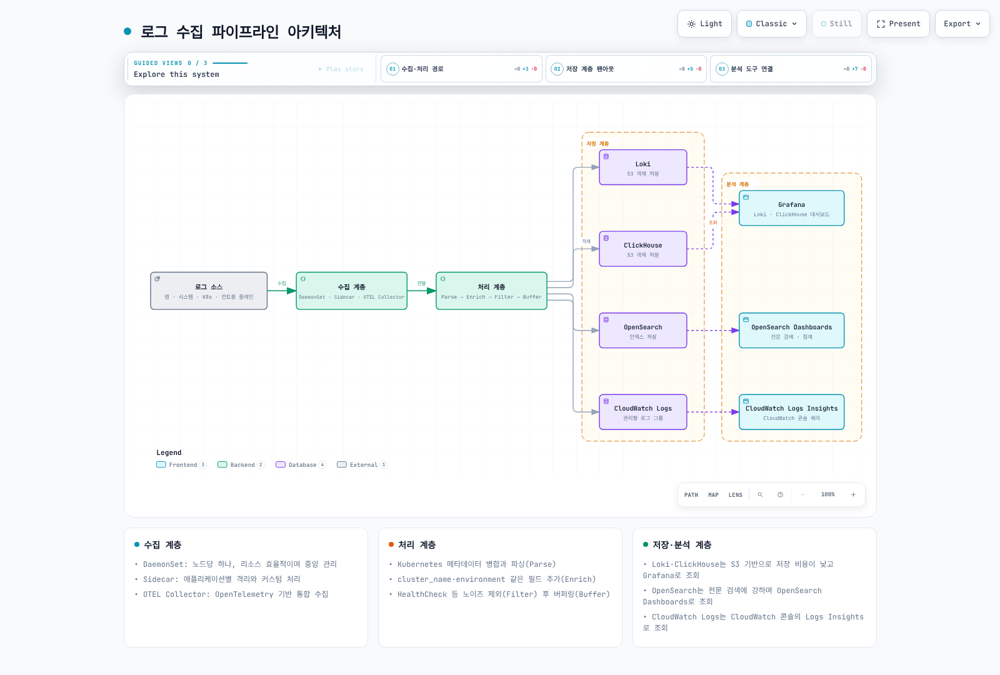
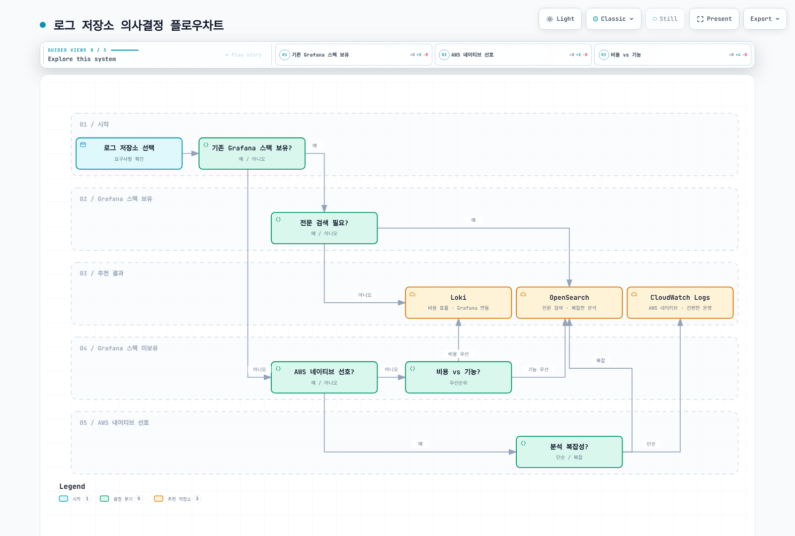

# 로깅 개요

> **마지막 업데이트**: 2026년 2월 20일

Kubernetes 환경에서 효과적인 로깅은 시스템의 가시성, 문제 해결, 보안 감사에 필수적입니다. 이 문서에서는 로깅의 기본 개념, 로그 수집 파이프라인 아키텍처, 그리고 EKS 환경에서의 로깅 전략에 대해 설명합니다.

## 목차

1. [로깅 기본 개념](#로깅-기본-개념)
2. [로그 수집 파이프라인 아키텍처](#로그-수집-파이프라인-아키텍처)
3. [로그 저장소 선택 기준](#로그-저장소-선택-기준)
4. [EKS 로깅 전략](#eks-로깅-전략)
5. [솔루션 비교](#솔루션-비교)

---

## 로깅 기본 개념

### 구조화된 로깅 (Structured Logging)

구조화된 로깅은 로그 메시지를 일관된 형식으로 출력하여 파싱과 분석을 용이하게 합니다. 비구조화된 텍스트 로그와 달리, 구조화된 로그는 필드-값 쌍으로 구성되어 검색과 필터링이 훨씬 효율적입니다.

#### 비구조화 로그 vs 구조화 로그

```plaintext
# 비구조화 로그 (파싱이 어려움)
2025-02-15 10:23:45 ERROR Failed to connect to database: connection timeout after 30s

# 구조화 로그 (JSON 형식)
{
  "timestamp": "2025-02-15T10:23:45.123Z",
  "level": "ERROR",
  "message": "Failed to connect to database",
  "error": "connection timeout",
  "timeout_seconds": 30,
  "service": "user-api",
  "pod": "user-api-7d4f8b9c6-x2k9m",
  "namespace": "production",
  "trace_id": "abc123def456"
}
```

#### 구조화된 로깅의 장점

| 장점 | 설명 |
|------|------|
| **검색 효율성** | 특정 필드로 빠른 필터링 가능 |
| **일관성** | 모든 서비스에서 동일한 형식 사용 |
| **상관 관계 분석** | trace_id, request_id 등으로 요청 추적 |
| **자동화** | 파싱 없이 즉시 분석 도구에서 사용 가능 |
| **알림 설정** | 특정 필드 값 기반 알림 규칙 생성 용이 |

### 로그 레벨 (Log Levels)

로그 레벨은 메시지의 중요도와 심각도를 나타냅니다. 적절한 로그 레벨 사용은 효과적인 문제 해결과 노이즈 감소에 중요합니다.

| 레벨 | 숫자 | 용도 | 예시 |
|------|------|------|------|
| **TRACE** | 0 | 가장 상세한 디버깅 정보 | 함수 진입/종료, 변수 값 |
| **DEBUG** | 1 | 개발 중 디버깅 정보 | SQL 쿼리, 요청 파라미터 |
| **INFO** | 2 | 일반적인 운영 정보 | 서비스 시작, 요청 처리 완료 |
| **WARN** | 3 | 잠재적 문제 상황 | 재시도 발생, 성능 저하 |
| **ERROR** | 4 | 오류 발생 (복구 가능) | API 호출 실패, 유효성 검사 실패 |
| **FATAL** | 5 | 치명적 오류 (복구 불가) | 서비스 시작 실패, 필수 의존성 없음 |

#### 환경별 권장 로그 레벨

```yaml
# 개발 환경
LOG_LEVEL: DEBUG

# 스테이징 환경
LOG_LEVEL: INFO

# 프로덕션 환경
LOG_LEVEL: INFO  # 또는 WARN (높은 트래픽 시)
```

### JSON 로그 형식

Kubernetes 환경에서 JSON 형식은 사실상 표준입니다. 대부분의 로그 수집기와 분석 도구가 JSON을 기본 지원합니다.

#### 권장 JSON 필드

```json
{
  "timestamp": "2025-02-15T10:23:45.123Z",
  "level": "INFO",
  "logger": "com.example.UserService",
  "message": "User login successful",
  "context": {
    "user_id": "user-12345",
    "session_id": "sess-abc123",
    "ip_address": "10.0.1.50"
  },
  "kubernetes": {
    "namespace": "production",
    "pod": "user-api-7d4f8b9c6-x2k9m",
    "container": "user-api",
    "node": "ip-10-0-1-100.ec2.internal"
  },
  "trace": {
    "trace_id": "abc123def456",
    "span_id": "789ghi",
    "parent_span_id": "456def"
  }
}
```

#### 주요 필드 설명

| 필드 그룹 | 필드 | 설명 |
|-----------|------|------|
| **기본** | timestamp | ISO 8601 형식 타임스탬프 |
| | level | 로그 레벨 |
| | message | 사람이 읽을 수 있는 메시지 |
| **컨텍스트** | context.* | 비즈니스 로직 관련 정보 |
| **Kubernetes** | kubernetes.* | 파드, 네임스페이스 등 K8s 메타데이터 |
| **추적** | trace.* | 분산 추적 ID (OpenTelemetry 연동) |

---

## 로그 수집 파이프라인 아키텍처

### 전체 아키텍처 개요



[🔍 인터랙티브 다이어그램 보기](https://www.atomai.click/kubernetes-docs/archmaps/ko-observability-logging-readme-0.html)

### 계층별 역할

#### 1. 수집 계층 (Collection Layer)

로그 소스에서 원시 로그를 수집하는 역할을 담당합니다.

| 방식 | 장점 | 단점 | 적합한 경우 |
|------|------|------|------------|
| **DaemonSet** | 리소스 효율적, 중앙 관리 | 노드당 하나만 실행 | 대부분의 표준 워크로드 |
| **Sidecar** | 애플리케이션별 격리, 커스텀 처리 | 리소스 오버헤드 | 특수 로그 형식, 멀티테넌트 |
| **Direct Push** | 실시간성, 유연한 전송 | 애플리케이션 수정 필요 | 고성능 요구사항 |

#### 2. 처리 계층 (Processing Layer)

수집된 로그를 정규화하고 메타데이터를 추가합니다.

```yaml
# FluentBit 처리 파이프라인 예시
[FILTER]
    Name         kubernetes
    Match        kube.*
    Kube_URL     https://kubernetes.default.svc:443
    Merge_Log    On
    K8S-Logging.Parser  On

[FILTER]
    Name         modify
    Match        *
    Add          cluster_name eks-production
    Add          environment production

[FILTER]
    Name         grep
    Match        *
    Exclude      log HealthCheck
```

#### 3. 저장 계층 (Storage Layer)

처리된 로그를 저장하고 인덱싱합니다. 각 솔루션의 특성에 따라 저장 방식이 다릅니다.

#### 4. 분석 계층 (Analysis Layer)

저장된 로그를 검색하고 시각화합니다.

---

## 로그 저장소 선택 기준

### 주요 고려 사항

#### 1. 비용

월간 로그 볼륨: 1TB 기준 예상 비용 (2025년 기준)

| 솔루션 | 저장 비용/GB | 쿼리 비용 |
|--------|--------------|-----------|
| Loki (S3) | $0.023 (S3) | 무료 |
| OpenSearch | $0.10-0.15 | 무료 |
| CloudWatch | $0.50 (수집) | $0.005/GB 스캔 |
| ClickHouse | $0.023 (S3) | 무료 |

#### 2. 쿼리 성능

| 솔루션 | 실시간 쿼리 | 집계 쿼리 | 전문 검색 | 대시보드 |
|--------|------------|----------|----------|---------|
| **Loki** | 우수 | 양호 | 제한적 | Grafana |
| **OpenSearch** | 우수 | 우수 | 우수 | OpenSearch Dashboards |
| **CloudWatch** | 양호 | 양호 | 양호 | CloudWatch 콘솔 |
| **ClickHouse** | 우수 | 우수 | 양호 | Grafana |

#### 3. 보존 기간

```yaml
# 권장 보존 정책
regulatory_compliance:
  financial: 7년
  healthcare: 6년
  general: 1년

operational:
  hot_storage: 7-14일    # 빠른 쿼리
  warm_storage: 30-90일  # 조사용
  cold_storage: 1년+     # 규정 준수
```

#### 4. 운영 복잡성

| 솔루션 | 설치 복잡성 | 운영 부담 | 확장성 |
|--------|-----------|----------|--------|
| **Loki** | 낮음 | 낮음 | 높음 |
| **OpenSearch** | 중간 | 높음 | 중간 |
| **CloudWatch** | 매우 낮음 | 매우 낮음 | 높음 |
| **ClickHouse** | 높음 | 중간 | 높음 |

---

## EKS 로깅 전략

### 로그 수집 패턴

#### 1. stdout/stderr 패턴 (권장)

컨테이너의 표준 출력/에러를 통한 로깅은 Kubernetes의 기본 패턴입니다.

```yaml
apiVersion: v1
kind: Pod
metadata:
  name: app-pod
spec:
  containers:
  - name: app
    image: myapp:1.0
    # 애플리케이션은 stdout/stderr로 로그 출력
    # kubelet이 /var/log/containers/에 파일로 저장
    # DaemonSet 에이전트가 수집
```

**장점:**
- Kubernetes 네이티브 방식
- 로그 로테이션 자동 관리 (`/var/log/containers/`)
- `kubectl logs` 명령어 사용 가능
- 별도 볼륨 마운트 불필요

**로그 파일 위치:**
```bash
# 실제 로그 파일
/var/log/containers/<pod-name>_<namespace>_<container-name>-<container-id>.log

# 심볼릭 링크
/var/log/pods/<namespace>_<pod-name>_<pod-uid>/<container-name>/0.log
```

#### 2. Sidecar 패턴

파일 기반 로그나 특수 처리가 필요한 경우 사용합니다.

```yaml
apiVersion: v1
kind: Pod
metadata:
  name: app-with-sidecar
spec:
  containers:
  - name: app
    image: legacy-app:1.0
    volumeMounts:
    - name: log-volume
      mountPath: /var/log/app

  - name: log-collector
    image: fluent/fluent-bit:latest
    volumeMounts:
    - name: log-volume
      mountPath: /var/log/app
      readOnly: true
    - name: fluent-bit-config
      mountPath: /fluent-bit/etc/

  volumes:
  - name: log-volume
    emptyDir: {}
  - name: fluent-bit-config
    configMap:
      name: fluent-bit-sidecar-config
```

**사용 사례:**
- 레거시 애플리케이션 (파일 로깅만 지원)
- 멀티테넌트 환경에서 로그 격리
- 애플리케이션별 특수 파싱 필요
- 높은 보안 요구사항

#### 3. DaemonSet 패턴 (가장 일반적)

노드당 하나의 에이전트가 모든 컨테이너 로그를 수집합니다.

```yaml
apiVersion: apps/v1
kind: DaemonSet
metadata:
  name: fluent-bit
  namespace: logging
spec:
  selector:
    matchLabels:
      app: fluent-bit
  template:
    metadata:
      labels:
        app: fluent-bit
    spec:
      serviceAccountName: fluent-bit
      tolerations:
      - operator: Exists  # 모든 노드에 배포
      containers:
      - name: fluent-bit
        image: public.ecr.aws/aws-observability/aws-for-fluent-bit:latest
        volumeMounts:
        - name: varlog
          mountPath: /var/log
          readOnly: true
        - name: varlibdockercontainers
          mountPath: /var/lib/docker/containers
          readOnly: true
        resources:
          limits:
            memory: 200Mi
            cpu: 200m
          requests:
            memory: 100Mi
            cpu: 100m
      volumes:
      - name: varlog
        hostPath:
          path: /var/log
      - name: varlibdockercontainers
        hostPath:
          path: /var/lib/docker/containers
```

### EKS 컨트롤 플레인 로깅

EKS 컨트롤 플레인 로그는 CloudWatch Logs로 전송됩니다.

```bash
# AWS CLI로 컨트롤 플레인 로깅 활성화
aws eks update-cluster-config \
  --name my-cluster \
  --logging '{"clusterLogging":[{"types":["api","audit","authenticator","controllerManager","scheduler"],"enabled":true}]}'
```

| 로그 유형 | 설명 | 권장 여부 |
|----------|------|----------|
| **api** | API 서버 로그 | 필수 |
| **audit** | Kubernetes 감사 로그 | 필수 (보안) |
| **authenticator** | IAM 인증 로그 | 권장 |
| **controllerManager** | 컨트롤러 매니저 로그 | 선택 |
| **scheduler** | 스케줄러 로그 | 선택 |

### Container Insights 로깅

```yaml
# CloudWatch Agent ConfigMap
apiVersion: v1
kind: ConfigMap
metadata:
  name: cloudwatch-agent-config
  namespace: amazon-cloudwatch
data:
  cwagentconfig.json: |
    {
      "logs": {
        "metrics_collected": {
          "kubernetes": {
            "cluster_name": "my-cluster",
            "metrics_collection_interval": 60
          }
        },
        "force_flush_interval": 5
      }
    }
```

---

## 솔루션 비교

### 기능 비교표

| 기능 | Loki | OpenSearch | CloudWatch | ClickHouse |
|------|------|------------|------------|------------|
| **설치 복잡성** | 낮음 | 중간 | 없음 (관리형) | 높음 |
| **쿼리 언어** | LogQL | Lucene/DQL | Insights QL | SQL |
| **전문 검색** | 제한적 | 우수 | 양호 | 양호 |
| **스키마** | 스키마리스 | 스키마리스 | 스키마리스 | 스키마 정의 |
| **압축률** | 높음 | 중간 | N/A | 매우 높음 |
| **실시간 테일링** | 지원 | 지원 | 제한적 | 지원 |
| **알림** | Grafana | 내장 | 내장 | Grafana |
| **멀티테넌시** | 지원 | 지원 | 지원 | 지원 |
| **S3 백엔드** | 네이티브 | 스냅샷만 | N/A | 네이티브 |

### 사용 사례별 권장 솔루션

| 사용 사례 | 권장 솔루션 |
|-----------|-------------|
| 비용 최적화가 최우선 | Loki + S3 |
| 전문 검색 및 분석 필요 | OpenSearch |
| AWS 네이티브 환경, 간편한 운영 | CloudWatch Logs |
| 대규모 분석 워크로드, SQL 선호 | ClickHouse |
| 기존 Grafana 스택 보유 | Loki |
| 규정 준수 요구사항 | OpenSearch/CloudWatch |
| 스타트업/소규모 팀 | Loki 또는 CloudWatch |
| 대기업/복잡한 분석 요구 | OpenSearch |

### 비용 시뮬레이션 (월간 100GB 로그 기준)

```
솔루션별 예상 월간 비용:

Loki (S3 Simple Scalable):
  ├─ S3 저장: $2.30
  ├─ S3 요청: $0.50
  ├─ EC2 (3x m5.large): $180
  └─ 총계: ~$183

OpenSearch (3x m5.large):
  ├─ 인스턴스: $300
  ├─ EBS 스토리지: $15
  └─ 총계: ~$315

CloudWatch Logs:
  ├─ 수집: $50
  ├─ 저장: $3
  ├─ 쿼리 (추정): $10
  └─ 총계: ~$63

ClickHouse (자체 호스팅):
  ├─ EC2 (3x m5.large): $180
  ├─ S3 저장: $2.30
  └─ 총계: ~$183
```

> **참고**: 실제 비용은 쿼리 패턴, 보존 기간, 리전에 따라 크게 달라질 수 있습니다.

### 의사결정 플로우차트



[🔍 인터랙티브 다이어그램 보기](https://www.atomai.click/kubernetes-docs/archmaps/ko-observability-logging-readme-1.html)

---

## 다음 단계

각 로그 저장소에 대한 자세한 내용은 다음 문서를 참조하세요:

- [Grafana Loki](./01-loki.md) - 비용 효율적인 로그 집계
- [Amazon OpenSearch Service](./02-opensearch.md) - 강력한 검색 및 분석
- [CloudWatch Logs](./03-cloudwatch-logs.md) - AWS 네이티브 로깅
- [ClickHouse](./04-clickhouse.md) - 고성능 로그 분석
- [로그 수집기 비교](./05-collectors.md) - FluentBit, Promtail, Alloy, OTEL

---

## 퀴즈

이 장에서 배운 내용을 테스트하려면 [로깅 개요 퀴즈](../../quizzes/observability/logging/README-quiz.md)를 풀어보세요.
