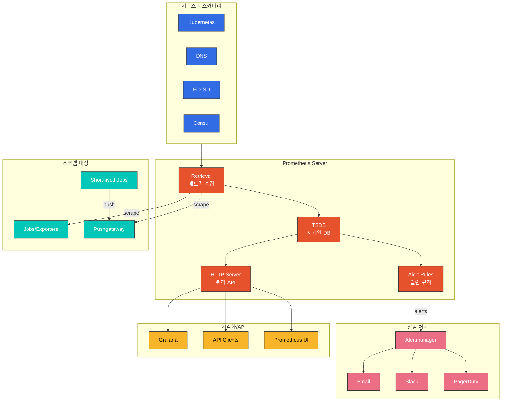
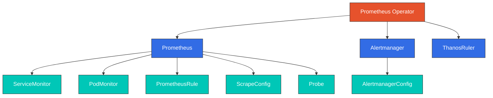

# Prometheus

> **지원 버전**: Prometheus 2.x / 3.x
> **마지막 업데이트**: 2025년 2월

## 목차

- [소개](#소개)
- [아키텍처](#아키텍처)
- [핵심 구성 요소](#핵심-구성-요소)
- [PromQL 쿼리 언어](#promql-쿼리-언어)
- [서비스 디스커버리](#서비스-디스커버리)
- [Prometheus Operator](#prometheus-operator)
- [kube-prometheus-stack 설치](#kube-prometheus-stack-설치)
- [Alertmanager 연동](#alertmanager-연동)
- [Remote Write 및 AMP 연동](#remote-write-및-amp-연동)
- [성능 튜닝](#성능-튜닝)
- [모범 사례](#모범-사례)
- [문제 해결](#문제-해결)

## 소개

Prometheus는 SoundCloud에서 개발되어 CNCF(Cloud Native Computing Foundation)에 기증된 오픈소스 시스템 모니터링 및 알림 툴킷입니다. Kubernetes 환경에서 사실상의 표준(de facto standard) 모니터링 솔루션으로 자리잡았습니다.

### 주요 특징

1. **다차원 데이터 모델**: 메트릭명과 키-값 쌍(레이블)으로 식별되는 시계열 데이터
2. **PromQL**: 다차원 데이터를 활용하는 유연한 쿼리 언어
3. **Pull 기반 수집**: HTTP를 통해 타겟에서 메트릭을 주기적으로 스크랩
4. **서비스 디스커버리**: Kubernetes 등 동적 환경에서 모니터링 대상 자동 발견
5. **알림 관리**: 규칙 기반 알림 정의 및 Alertmanager를 통한 알림 라우팅
6. **독립적인 서버**: 단일 서버로 동작하며 분산 스토리지에 의존하지 않음

### Prometheus가 적합한 경우

- 순수 수치 시계열 기록
- 머신 중심 모니터링과 고도로 동적인 서비스 지향 아키텍처
- 다차원 데이터 수집 및 쿼리
- 100% 정확도보다 시스템 개요 파악이 중요한 경우

### Prometheus가 적합하지 않은 경우

- 이벤트 로깅이나 트레이싱
- 요청별 과금 등 100% 정확도가 필요한 경우
- 장기 데이터 보존 (별도 장기 저장소 필요)

## 아키텍처



### 데이터 흐름

1. **서비스 디스커버리**: Kubernetes API, DNS, 파일 등에서 스크랩 대상 발견
2. **메트릭 수집**: HTTP를 통해 대상의 `/metrics` 엔드포인트에서 메트릭 스크랩
3. **데이터 저장**: 수집된 메트릭을 로컬 TSDB에 저장
4. **규칙 평가**: 저장된 데이터에 대해 알림 및 기록 규칙 평가
5. **알림 전송**: 발화된 알림을 Alertmanager로 전송
6. **쿼리 제공**: HTTP API를 통해 PromQL 쿼리 처리

## 핵심 구성 요소

### TSDB (Time Series Database)

Prometheus의 내장 시계열 데이터베이스는 효율적인 시계열 데이터 저장을 위해 설계되었습니다.

```yaml
# TSDB 관련 설정
storage:
  tsdb:
    path: /prometheus               # 데이터 저장 경로
    retention.time: 15d             # 데이터 보존 기간
    retention.size: 50GB            # 최대 스토리지 크기
    wal-compression: true           # WAL 압축 활성화
    min-block-duration: 2h          # 최소 블록 크기
    max-block-duration: 36h         # 최대 블록 크기 (보존 기간의 10% 권장)
```

**TSDB 블록 구조**:
```
data/
├── 01BKGV7JBM69T2G1BGBGM6KB12/   # 2시간 블록
│   ├── chunks/                    # 시계열 데이터
│   │   └── 000001
│   ├── tombstones                 # 삭제된 데이터
│   ├── index                      # 레이블 인덱스
│   └── meta.json                  # 블록 메타데이터
├── 01BKGV7JC0RY8A6MACW02A2PJD/   # 또 다른 블록
├── chunks_head/                   # 현재 쓰기 중인 데이터
│   └── 000001
├── wal/                          # Write-Ahead Log
│   ├── 00000000
│   └── 00000001
└── lock                          # 프로세스 잠금
```

### kube-state-metrics

Kubernetes API 객체에 대한 메트릭을 생성하는 서비스입니다.

```yaml
apiVersion: apps/v1
kind: Deployment
metadata:
  name: kube-state-metrics
  namespace: monitoring
spec:
  replicas: 1
  selector:
    matchLabels:
      app: kube-state-metrics
  template:
    metadata:
      labels:
        app: kube-state-metrics
    spec:
      serviceAccountName: kube-state-metrics
      containers:
      - name: kube-state-metrics
        image: registry.k8s.io/kube-state-metrics/kube-state-metrics:v2.10.1
        ports:
        - name: http-metrics
          containerPort: 8080
        - name: telemetry
          containerPort: 8081
        resources:
          requests:
            cpu: 10m
            memory: 128Mi
          limits:
            cpu: 100m
            memory: 256Mi
        livenessProbe:
          httpGet:
            path: /healthz
            port: 8080
          initialDelaySeconds: 5
          timeoutSeconds: 5
        readinessProbe:
          httpGet:
            path: /
            port: 8081
          initialDelaySeconds: 5
          timeoutSeconds: 5
```

**주요 메트릭**:
```promql
# Pod 상태 메트릭
kube_pod_status_phase{phase="Running"}
kube_pod_container_status_restarts_total
kube_pod_container_resource_requests{resource="cpu"}
kube_pod_container_resource_limits{resource="memory"}

# Deployment 메트릭
kube_deployment_spec_replicas
kube_deployment_status_replicas_available
kube_deployment_status_replicas_unavailable

# Node 메트릭
kube_node_status_condition{condition="Ready"}
kube_node_status_allocatable{resource="cpu"}
```

### node-exporter

호스트 수준의 하드웨어 및 OS 메트릭을 노출하는 익스포터입니다.

```yaml
apiVersion: apps/v1
kind: DaemonSet
metadata:
  name: node-exporter
  namespace: monitoring
spec:
  selector:
    matchLabels:
      app: node-exporter
  template:
    metadata:
      labels:
        app: node-exporter
    spec:
      hostNetwork: true
      hostPID: true
      containers:
      - name: node-exporter
        image: prom/node-exporter:v1.7.0
        args:
          - --path.procfs=/host/proc
          - --path.sysfs=/host/sys
          - --path.rootfs=/host/root
          - --collector.filesystem.mount-points-exclude=^/(dev|proc|sys|var/lib/docker/.+)($|/)
          - --collector.netclass.ignored-devices=^(veth.*|docker.*|br-.*)$
        ports:
        - name: metrics
          containerPort: 9100
        volumeMounts:
        - name: proc
          mountPath: /host/proc
          readOnly: true
        - name: sys
          mountPath: /host/sys
          readOnly: true
        - name: root
          mountPath: /host/root
          readOnly: true
          mountPropagation: HostToContainer
        resources:
          requests:
            cpu: 10m
            memory: 32Mi
          limits:
            cpu: 100m
            memory: 64Mi
      volumes:
      - name: proc
        hostPath:
          path: /proc
      - name: sys
        hostPath:
          path: /sys
      - name: root
        hostPath:
          path: /
      tolerations:
      - operator: Exists
```

**주요 메트릭**:
```promql
# CPU 메트릭
node_cpu_seconds_total{mode="idle"}
rate(node_cpu_seconds_total{mode!="idle"}[5m])

# 메모리 메트릭
node_memory_MemTotal_bytes
node_memory_MemAvailable_bytes
node_memory_Buffers_bytes
node_memory_Cached_bytes

# 디스크 메트릭
node_filesystem_size_bytes
node_filesystem_avail_bytes
node_disk_io_time_seconds_total

# 네트워크 메트릭
node_network_receive_bytes_total
node_network_transmit_bytes_total
```

## PromQL 쿼리 언어

PromQL(Prometheus Query Language)은 Prometheus의 함수형 쿼리 언어입니다.

### 기본 쿼리

```promql
# 인스턴트 벡터: 현재 시점의 값
http_requests_total

# 레이블 필터링
http_requests_total{method="GET"}
http_requests_total{status=~"2.."}           # 정규표현식 매칭
http_requests_total{status!~"5.."}           # 부정 정규표현식

# 범위 벡터: 시간 범위의 값들
http_requests_total[5m]                       # 최근 5분간의 모든 샘플
http_requests_total[1h:5m]                    # 1시간 동안 5분 간격 샘플

# 오프셋 수정자
http_requests_total offset 1h                 # 1시간 전 값
rate(http_requests_total[5m] offset 1h)       # 1시간 전의 5분간 rate
```

### 집계 연산자

```promql
# sum: 합계
sum(http_requests_total)
sum by (method)(http_requests_total)          # method별 합계
sum without (instance)(http_requests_total)   # instance 제외하고 합계

# avg: 평균
avg(node_cpu_seconds_total)

# count: 개수
count(kube_pod_status_phase{phase="Running"})

# min/max: 최소/최대
max(node_memory_MemAvailable_bytes)

# topk/bottomk: 상위/하위 k개
topk(5, sum by (pod)(rate(container_cpu_usage_seconds_total[5m])))

# quantile: 분위수
quantile(0.95, http_request_duration_seconds)

# stddev/stdvar: 표준편차/분산
stddev(rate(http_requests_total[5m]))
```

### Rate 및 증가량 함수

```promql
# rate: 초당 평균 증가율 (Counter용)
rate(http_requests_total[5m])

# irate: 마지막 두 샘플 간의 즉각적인 증가율
irate(http_requests_total[5m])

# increase: 시간 범위 동안의 총 증가량
increase(http_requests_total[1h])

# delta: 범위의 처음과 끝 값의 차이 (Gauge용)
delta(temperature_celsius[1h])

# deriv: 초당 변화율 (Gauge용, 선형 회귀)
deriv(temperature_celsius[1h])
```

### 수학 함수

```promql
# abs: 절대값
abs(rate(http_requests_total[5m]) - 100)

# ceil/floor/round: 올림/내림/반올림
ceil(http_request_duration_seconds)

# clamp: 값 범위 제한
clamp(cpu_usage, 0, 100)
clamp_min(temperature, 0)
clamp_max(memory_usage_percent, 100)

# sqrt/ln/log2/log10/exp: 수학 함수
sqrt(variance)
ln(http_requests_total)
```

### 시간 함수

```promql
# time(): 현재 Unix 타임스탬프
time()

# timestamp(): 샘플의 타임스탬프
timestamp(up)

# day_of_week/day_of_month/hour/minute 등
hour(timestamp(up))

# 시간 기반 필터링 예시
http_requests_total and on() hour() >= 9 < 18  # 업무 시간만
```

### 히스토그램 함수

```promql
# histogram_quantile: 히스토그램에서 분위수 계산
histogram_quantile(0.95, rate(http_request_duration_seconds_bucket[5m]))

# 레이블별 분위수
histogram_quantile(0.99,
  sum by (le, method)(rate(http_request_duration_seconds_bucket[5m]))
)

# 평균 지연시간 (히스토그램에서)
rate(http_request_duration_seconds_sum[5m])
/ rate(http_request_duration_seconds_count[5m])
```

### 예측 함수

```promql
# predict_linear: 선형 회귀 기반 미래 값 예측
predict_linear(node_filesystem_avail_bytes[6h], 24*60*60)  # 24시간 후 예측

# 디스크 공간 소진 예측 알림
predict_linear(node_filesystem_avail_bytes{mountpoint="/"}[6h], 24*60*60) < 0

# holt_winters: 계절성을 고려한 예측
holt_winters(http_requests_total[1d], 0.5, 0.5)
```

### 실용적인 쿼리 예시

```promql
# CPU 사용률 (%)
100 - (avg by (instance)(irate(node_cpu_seconds_total{mode="idle"}[5m])) * 100)

# 메모리 사용률 (%)
100 * (1 - node_memory_MemAvailable_bytes / node_memory_MemTotal_bytes)

# Pod 재시작 횟수 증가
increase(kube_pod_container_status_restarts_total[1h]) > 3

# HTTP 오류율 (%)
100 * sum(rate(http_requests_total{status=~"5.."}[5m]))
/ sum(rate(http_requests_total[5m]))

# p95 지연시간
histogram_quantile(0.95,
  sum by (le)(rate(http_request_duration_seconds_bucket[5m]))
)

# 디스크 사용률
100 - (node_filesystem_avail_bytes{mountpoint="/"}
/ node_filesystem_size_bytes{mountpoint="/"} * 100)

# 네트워크 처리량 (bytes/sec)
rate(node_network_receive_bytes_total{device="eth0"}[5m])
+ rate(node_network_transmit_bytes_total{device="eth0"}[5m])
```

## 서비스 디스커버리

### Kubernetes 서비스 디스커버리

Prometheus는 Kubernetes API를 통해 자동으로 모니터링 대상을 발견합니다.

```yaml
scrape_configs:
  # Pod 자동 발견
  - job_name: 'kubernetes-pods'
    kubernetes_sd_configs:
      - role: pod
    relabel_configs:
      # prometheus.io/scrape 어노테이션이 있는 Pod만 스크랩
      - source_labels: [__meta_kubernetes_pod_annotation_prometheus_io_scrape]
        action: keep
        regex: true
      # 커스텀 메트릭 경로
      - source_labels: [__meta_kubernetes_pod_annotation_prometheus_io_path]
        action: replace
        target_label: __metrics_path__
        regex: (.+)
      # 커스텀 포트
      - source_labels: [__address__, __meta_kubernetes_pod_annotation_prometheus_io_port]
        action: replace
        regex: ([^:]+)(?::\d+)?;(\d+)
        replacement: $1:$2
        target_label: __address__
      # 레이블 추가
      - source_labels: [__meta_kubernetes_namespace]
        target_label: namespace
      - source_labels: [__meta_kubernetes_pod_name]
        target_label: pod

  # Service 자동 발견
  - job_name: 'kubernetes-services'
    kubernetes_sd_configs:
      - role: service
    metrics_path: /probe
    params:
      module: [http_2xx]
    relabel_configs:
      - source_labels: [__meta_kubernetes_service_annotation_prometheus_io_probe]
        action: keep
        regex: true
      - source_labels: [__address__]
        target_label: __param_target
      - target_label: __address__
        replacement: blackbox-exporter:9115
      - source_labels: [__param_target]
        target_label: instance

  # Node 자동 발견
  - job_name: 'kubernetes-nodes'
    kubernetes_sd_configs:
      - role: node
    scheme: https
    tls_config:
      ca_file: /var/run/secrets/kubernetes.io/serviceaccount/ca.crt
    bearer_token_file: /var/run/secrets/kubernetes.io/serviceaccount/token
    relabel_configs:
      - action: labelmap
        regex: __meta_kubernetes_node_label_(.+)
```

### Pod 어노테이션 기반 스크래핑

```yaml
apiVersion: v1
kind: Pod
metadata:
  name: my-app
  annotations:
    prometheus.io/scrape: "true"       # 스크래핑 활성화
    prometheus.io/port: "8080"         # 메트릭 포트
    prometheus.io/path: "/metrics"     # 메트릭 경로
    prometheus.io/scheme: "http"       # http 또는 https
spec:
  containers:
  - name: app
    image: my-app:latest
    ports:
    - containerPort: 8080
```

## Prometheus Operator

Prometheus Operator는 Kubernetes에서 Prometheus를 선언적으로 관리하기 위한 컨트롤러입니다.

### 커스텀 리소스 정의 (CRDs)



### Prometheus 리소스

```yaml
apiVersion: monitoring.coreos.com/v1
kind: Prometheus
metadata:
  name: prometheus
  namespace: monitoring
spec:
  replicas: 2
  version: v2.48.0

  # 서비스 계정
  serviceAccountName: prometheus

  # 보안 컨텍스트
  securityContext:
    fsGroup: 2000
    runAsNonRoot: true
    runAsUser: 1000

  # 모니터 선택자
  serviceMonitorSelector:
    matchLabels:
      team: frontend
  serviceMonitorNamespaceSelector: {}  # 모든 네임스페이스

  podMonitorSelector:
    matchLabels:
      team: frontend

  # 규칙 선택자
  ruleSelector:
    matchLabels:
      role: alert-rules
  ruleNamespaceSelector: {}

  # 알림 설정
  alerting:
    alertmanagers:
    - namespace: monitoring
      name: alertmanager-main
      port: web

  # 리소스 제한
  resources:
    requests:
      memory: 1Gi
      cpu: 500m
    limits:
      memory: 4Gi
      cpu: 2000m

  # 스토리지 설정
  retention: 15d
  retentionSize: 50GB
  storage:
    volumeClaimTemplate:
      spec:
        storageClassName: gp3
        accessModes: ["ReadWriteOnce"]
        resources:
          requests:
            storage: 100Gi

  # 외부 레이블
  externalLabels:
    cluster: production
    region: ap-northeast-2

  # Remote Write 설정
  remoteWrite:
  - url: http://victoriametrics:8428/api/v1/write
    queueConfig:
      maxSamplesPerSend: 10000
      batchSendDeadline: 5s
```

### ServiceMonitor

```yaml
apiVersion: monitoring.coreos.com/v1
kind: ServiceMonitor
metadata:
  name: example-app
  namespace: monitoring
  labels:
    team: frontend
spec:
  # 대상 서비스 선택
  selector:
    matchLabels:
      app: example-app

  # 대상 네임스페이스
  namespaceSelector:
    matchNames:
    - production
    - staging

  # 엔드포인트 설정
  endpoints:
  - port: web
    interval: 30s
    scrapeTimeout: 10s
    path: /metrics
    scheme: http

    # TLS 설정 (HTTPS인 경우)
    # tlsConfig:
    #   insecureSkipVerify: true

    # 기본 인증
    # basicAuth:
    #   username:
    #     name: basic-auth
    #     key: username
    #   password:
    #     name: basic-auth
    #     key: password

    # 레이블 재작성
    relabelings:
    - sourceLabels: [__meta_kubernetes_pod_name]
      targetLabel: pod
    - sourceLabels: [__meta_kubernetes_namespace]
      targetLabel: namespace

    # 메트릭 필터링
    metricRelabelings:
    - sourceLabels: [__name__]
      regex: 'go_.*'
      action: drop
```

### PodMonitor

```yaml
apiVersion: monitoring.coreos.com/v1
kind: PodMonitor
metadata:
  name: example-pods
  namespace: monitoring
  labels:
    team: frontend
spec:
  selector:
    matchLabels:
      app: example-app

  namespaceSelector:
    any: true

  podMetricsEndpoints:
  - port: metrics
    interval: 30s
    path: /metrics

    relabelings:
    - sourceLabels: [__meta_kubernetes_pod_node_name]
      targetLabel: node
    - sourceLabels: [__meta_kubernetes_pod_label_version]
      targetLabel: version
```

### PrometheusRule

```yaml
apiVersion: monitoring.coreos.com/v1
kind: PrometheusRule
metadata:
  name: kubernetes-alerts
  namespace: monitoring
  labels:
    role: alert-rules
spec:
  groups:
  - name: kubernetes-system
    interval: 30s
    rules:
    # 노드 메모리 부족 알림
    - alert: NodeMemoryHigh
      expr: |
        (node_memory_MemTotal_bytes - node_memory_MemAvailable_bytes)
        / node_memory_MemTotal_bytes * 100 > 90
      for: 5m
      labels:
        severity: warning
        team: infrastructure
      annotations:
        summary: "Node {{ $labels.instance }} memory usage is high"
        description: "Memory usage is {{ printf \"%.2f\" $value }}%"
        runbook_url: "https://wiki.example.com/runbooks/node-memory-high"

    # Pod 재시작 알림
    - alert: PodRestartingFrequently
      expr: increase(kube_pod_container_status_restarts_total[1h]) > 5
      for: 10m
      labels:
        severity: warning
      annotations:
        summary: "Pod {{ $labels.namespace }}/{{ $labels.pod }} is restarting frequently"
        description: "Pod has restarted {{ $value }} times in the last hour"

    # 디스크 공간 부족 예측
    - alert: NodeDiskWillFillIn24Hours
      expr: |
        predict_linear(node_filesystem_avail_bytes{mountpoint="/"}[6h], 24*60*60) < 0
      for: 1h
      labels:
        severity: critical
      annotations:
        summary: "Disk on {{ $labels.instance }} will fill in 24 hours"
        description: "Based on current trend, disk will be full within 24 hours"

  - name: recording-rules
    rules:
    # CPU 사용률 기록 규칙
    - record: instance:node_cpu_utilization:rate5m
      expr: |
        100 - (avg by (instance)(irate(node_cpu_seconds_total{mode="idle"}[5m])) * 100)

    # 메모리 사용률 기록 규칙
    - record: instance:node_memory_utilization:ratio
      expr: |
        1 - node_memory_MemAvailable_bytes / node_memory_MemTotal_bytes
```

## kube-prometheus-stack 설치

kube-prometheus-stack은 Prometheus, Alertmanager, Grafana 및 관련 구성 요소를 포함하는 포괄적인 Helm 차트입니다.

### Helm을 사용한 설치

```bash
# Helm 저장소 추가
helm repo add prometheus-community https://prometheus-community.github.io/helm-charts
helm repo update

# 기본 설치
helm install prometheus prometheus-community/kube-prometheus-stack \
  --namespace monitoring \
  --create-namespace

# 커스텀 값으로 설치
helm install prometheus prometheus-community/kube-prometheus-stack \
  --namespace monitoring \
  --create-namespace \
  -f values.yaml
```

### values.yaml 예시

```yaml
# Prometheus 설정
prometheus:
  prometheusSpec:
    # 복제본 수
    replicas: 2

    # 보존 기간
    retention: 15d
    retentionSize: 50GB

    # 스토리지
    storageSpec:
      volumeClaimTemplate:
        spec:
          storageClassName: gp3
          accessModes: ["ReadWriteOnce"]
          resources:
            requests:
              storage: 100Gi

    # 리소스
    resources:
      requests:
        cpu: 500m
        memory: 2Gi
      limits:
        cpu: 2000m
        memory: 8Gi

    # Remote Write
    remoteWrite:
    - url: http://victoriametrics:8428/api/v1/write
      queueConfig:
        maxSamplesPerSend: 10000
        batchSendDeadline: 5s

    # 외부 레이블
    externalLabels:
      cluster: production

    # 추가 스크랩 설정
    additionalScrapeConfigs:
    - job_name: 'custom-endpoints'
      static_configs:
      - targets: ['custom-service:8080']

    # 모든 네임스페이스의 ServiceMonitor 수집
    serviceMonitorSelectorNilUsesHelmValues: false
    podMonitorSelectorNilUsesHelmValues: false
    ruleSelectorNilUsesHelmValues: false

# Alertmanager 설정
alertmanager:
  alertmanagerSpec:
    replicas: 3
    storage:
      volumeClaimTemplate:
        spec:
          storageClassName: gp3
          accessModes: ["ReadWriteOnce"]
          resources:
            requests:
              storage: 10Gi
    resources:
      requests:
        cpu: 50m
        memory: 64Mi
      limits:
        cpu: 200m
        memory: 256Mi

# Grafana 설정
grafana:
  enabled: true
  replicas: 1

  adminPassword: "admin"  # 실제 환경에서는 시크릿 사용

  persistence:
    enabled: true
    storageClassName: gp3
    size: 10Gi

  resources:
    requests:
      cpu: 100m
      memory: 256Mi
    limits:
      cpu: 500m
      memory: 512Mi

  # 추가 데이터 소스
  additionalDataSources:
  - name: VictoriaMetrics
    type: prometheus
    url: http://victoriametrics:8428
    access: proxy
    isDefault: false

  # 사이드카 설정 (대시보드 자동 로드)
  sidecar:
    dashboards:
      enabled: true
      searchNamespace: ALL
    datasources:
      enabled: true

# kube-state-metrics 설정
kubeStateMetrics:
  enabled: true

# node-exporter 설정
nodeExporter:
  enabled: true

# Prometheus Operator 설정
prometheusOperator:
  resources:
    requests:
      cpu: 100m
      memory: 128Mi
    limits:
      cpu: 200m
      memory: 256Mi
```

## Alertmanager 연동

### Alertmanager 설정

```yaml
apiVersion: monitoring.coreos.com/v1
kind: Alertmanager
metadata:
  name: main
  namespace: monitoring
spec:
  replicas: 3
  version: v0.26.0

  # 고가용성 설정
  clusterAdvertiseAddress: ""  # 자동 감지

  # 로그 레벨
  logLevel: info

  # 스토리지
  storage:
    volumeClaimTemplate:
      spec:
        storageClassName: gp3
        accessModes: ["ReadWriteOnce"]
        resources:
          requests:
            storage: 10Gi

  # 설정 선택자
  alertmanagerConfigSelector:
    matchLabels:
      alertmanagerConfig: main

  # 설정 네임스페이스 선택자
  alertmanagerConfigNamespaceSelector: {}
```

### AlertmanagerConfig

```yaml
apiVersion: monitoring.coreos.com/v1alpha1
kind: AlertmanagerConfig
metadata:
  name: main-config
  namespace: monitoring
  labels:
    alertmanagerConfig: main
spec:
  # 라우팅 설정
  route:
    receiver: 'default'
    groupBy: ['alertname', 'namespace', 'severity']
    groupWait: 30s
    groupInterval: 5m
    repeatInterval: 4h

    routes:
    # Critical 알림 -> PagerDuty
    - receiver: 'pagerduty-critical'
      matchers:
      - name: severity
        matchType: =
        value: critical
      groupWait: 10s
      repeatInterval: 1h

    # Warning 알림 -> Slack
    - receiver: 'slack-warnings'
      matchers:
      - name: severity
        matchType: =
        value: warning
      groupWait: 1m
      repeatInterval: 4h

    # 특정 팀 알림
    - receiver: 'slack-team-backend'
      matchers:
      - name: team
        matchType: =
        value: backend

  # 억제 규칙
  inhibitRules:
  - sourceMatch:
    - name: severity
      matchType: =
      value: critical
    targetMatch:
    - name: severity
      matchType: =
      value: warning
    equal: ['alertname', 'namespace']

  # 수신자 설정
  receivers:
  - name: 'default'
    emailConfigs:
    - to: 'alerts@example.com'
      from: 'alertmanager@example.com'
      smarthost: 'smtp.example.com:587'
      authUsername: 'alertmanager'
      authPassword:
        name: alertmanager-smtp
        key: password
      requireTLS: true

  - name: 'slack-warnings'
    slackConfigs:
    - apiURL:
        name: alertmanager-slack
        key: webhook-url
      channel: '#alerts'
      sendResolved: true
      title: '{{ template "slack.default.title" . }}'
      text: '{{ template "slack.default.text" . }}'
      actions:
      - type: button
        text: 'Runbook'
        url: '{{ (index .Alerts 0).Annotations.runbook_url }}'
      - type: button
        text: 'Dashboard'
        url: 'https://grafana.example.com/d/{{ (index .Alerts 0).Labels.dashboard }}'

  - name: 'slack-team-backend'
    slackConfigs:
    - apiURL:
        name: alertmanager-slack
        key: webhook-url
      channel: '#team-backend-alerts'
      sendResolved: true

  - name: 'pagerduty-critical'
    pagerdutyConfigs:
    - routingKey:
        name: alertmanager-pagerduty
        key: routing-key
      sendResolved: true
      severity: '{{ if eq .GroupLabels.severity "critical" }}critical{{ else }}warning{{ end }}'
      class: '{{ .GroupLabels.alertname }}'
      component: '{{ .GroupLabels.job }}'
      group: '{{ .GroupLabels.namespace }}'
```

## Remote Write 및 AMP 연동

### Amazon Managed Prometheus (AMP) 연동

```yaml
# Prometheus 설정
apiVersion: monitoring.coreos.com/v1
kind: Prometheus
metadata:
  name: prometheus
  namespace: monitoring
spec:
  # ... 기타 설정 ...

  # IRSA 서비스 계정
  serviceAccountName: prometheus-amp

  # Remote Write to AMP
  remoteWrite:
  - url: https://aps-workspaces.ap-northeast-2.amazonaws.com/workspaces/ws-xxxxxxxx-xxxx-xxxx-xxxx-xxxxxxxxxxxx/api/v1/remote_write
    sigv4:
      region: ap-northeast-2
    queueConfig:
      maxSamplesPerSend: 1000
      maxShards: 200
      capacity: 2500
    writeRelabelConfigs:
    # 불필요한 메트릭 제외
    - sourceLabels: [__name__]
      regex: 'go_.*'
      action: drop
```

### IRSA 설정

```bash
# OIDC 공급자 확인
aws eks describe-cluster --name my-cluster --query "cluster.identity.oidc.issuer" --output text

# IAM 정책 생성
cat <<EOF > amp-policy.json
{
    "Version": "2012-10-17",
    "Statement": [
        {
            "Effect": "Allow",
            "Action": [
                "aps:RemoteWrite",
                "aps:QueryMetrics",
                "aps:GetSeries",
                "aps:GetLabels",
                "aps:GetMetricMetadata"
            ],
            "Resource": "*"
        }
    ]
}
EOF

aws iam create-policy \
  --policy-name AmazonManagedPrometheusPolicy \
  --policy-document file://amp-policy.json

# 서비스 계정 생성 (eksctl 사용)
eksctl create iamserviceaccount \
  --name prometheus-amp \
  --namespace monitoring \
  --cluster my-cluster \
  --attach-policy-arn arn:aws:iam::123456789012:policy/AmazonManagedPrometheusPolicy \
  --approve
```

### VictoriaMetrics로 Remote Write

```yaml
remoteWrite:
- url: http://victoriametrics-vminsert:8480/insert/0/prometheus/api/v1/write
  queueConfig:
    maxSamplesPerSend: 10000
    maxShards: 30
    capacity: 10000
    batchSendDeadline: 5s
    minBackoff: 30ms
    maxBackoff: 5s
  writeRelabelConfigs:
  # 높은 카디널리티 메트릭 제외
  - sourceLabels: [__name__]
    regex: '(apiserver_request_duration_seconds_bucket|etcd_request_duration_seconds_bucket)'
    action: drop
  # 레이블 수정
  - sourceLabels: [__name__, le]
    regex: '.*;0\..*'
    action: drop
```

## 성능 튜닝

### 메모리 최적화

```yaml
apiVersion: monitoring.coreos.com/v1
kind: Prometheus
metadata:
  name: prometheus
spec:
  # 메모리 제한
  resources:
    requests:
      memory: 2Gi
    limits:
      memory: 8Gi

  # 쿼리 제한
  query:
    maxConcurrency: 20          # 최대 동시 쿼리 수
    maxSamples: 50000000        # 쿼리당 최대 샘플 수
    timeout: 2m                 # 쿼리 타임아웃

  # WAL 압축
  walCompression: true

  # 청크 풀 크기
  # additionalArgs:
  # - --storage.tsdb.head-chunks-write-queue-size=1000
```

### 스크랩 최적화

```yaml
scrape_configs:
- job_name: 'high-cardinality-app'
  scrape_interval: 60s           # 간격 늘리기
  scrape_timeout: 30s
  sample_limit: 10000            # 샘플 수 제한

  metric_relabel_configs:
  # 불필요한 메트릭 제거
  - source_labels: [__name__]
    regex: 'go_.*|process_.*'
    action: drop

  # 높은 카디널리티 레이블 제거
  - regex: 'pod_template_hash|controller_revision_hash'
    action: labeldrop
```

### TSDB 튜닝

```yaml
# 명령줄 인자로 TSDB 튜닝
additionalArgs:
  # 블록 크기 조정 (보존 기간의 10% 이하)
  - --storage.tsdb.max-block-duration=4h
  - --storage.tsdb.min-block-duration=2h

  # 청크 인코딩 최적화
  - --storage.tsdb.head-chunks-write-queue-size=1000

  # 메모리 맵 청크 (성능 향상)
  - --storage.tsdb.head-chunks-max-mmap-bytes=1073741824
```

## 모범 사례

### 고가용성 구성

```yaml
apiVersion: monitoring.coreos.com/v1
kind: Prometheus
metadata:
  name: prometheus
spec:
  # 복제본 2개 운영
  replicas: 2

  # Pod 반친화성
  affinity:
    podAntiAffinity:
      requiredDuringSchedulingIgnoredDuringExecution:
      - labelSelector:
          matchLabels:
            app.kubernetes.io/name: prometheus
        topologyKey: kubernetes.io/hostname

  # 샤딩 설정 (대규모 환경)
  shards: 2

  # 외부 레이블 (중복 제거용)
  externalLabels:
    cluster: production
    replica: $(POD_NAME)
```

### 레이블링 전략

```yaml
# 일관된 레이블 체계
relabelings:
  # 환경 레이블
  - sourceLabels: [__meta_kubernetes_namespace]
    regex: '(prod|staging|dev)-.*'
    replacement: '$1'
    targetLabel: environment

  # 팀 레이블
  - sourceLabels: [__meta_kubernetes_pod_label_team]
    targetLabel: team

  # 서비스 레이블
  - sourceLabels: [__meta_kubernetes_pod_label_app]
    targetLabel: service
```

### 알림 규칙 가이드라인

```yaml
# 좋은 알림 규칙 예시
- alert: HighErrorRate
  # 의미 있는 임계값
  expr: |
    sum(rate(http_requests_total{status=~"5.."}[5m])) by (service)
    / sum(rate(http_requests_total[5m])) by (service) > 0.01
  # 적절한 대기 시간 (노이즈 방지)
  for: 5m
  labels:
    # 심각도 레벨
    severity: warning
    # 담당 팀
    team: backend
  annotations:
    # 명확한 요약
    summary: "High error rate on {{ $labels.service }}"
    # 상세 설명
    description: |
      Service {{ $labels.service }} has error rate of {{ printf "%.2f" $value }}%.
      This is above the 1% threshold.
    # 런북 링크
    runbook_url: "https://wiki.example.com/runbooks/high-error-rate"
    # 대시보드 링크
    dashboard_url: "https://grafana.example.com/d/service-overview?var-service={{ $labels.service }}"
```

## 문제 해결

### 일반적인 문제

#### 1. 메모리 부족 (OOMKilled)

```bash
# 현재 메모리 사용량 확인
kubectl top pod -n monitoring prometheus-prometheus-0

# TSDB 상태 확인
curl -s http://prometheus:9090/api/v1/status/tsdb | jq .

# 해결: 메모리 제한 증가 또는 보존 기간 감소
```

#### 2. 높은 카디널리티

```promql
# 카디널리티 높은 메트릭 찾기
topk(10, count by (__name__)({__name__=~".+"}))

# 특정 메트릭의 레이블 조합 수
count(http_requests_total)

# 해결: metric_relabel_configs로 불필요한 레이블/메트릭 제거
```

#### 3. 스크랩 실패

```bash
# 대상 상태 확인
curl -s http://prometheus:9090/api/v1/targets | jq '.data.activeTargets[] | select(.health != "up")'

# 특정 대상 메트릭 직접 확인
kubectl exec -it prometheus-prometheus-0 -n monitoring -- \
  wget -qO- http://target-service:8080/metrics | head -20

# 해결: 네트워크 정책, RBAC, 서비스 엔드포인트 확인
```

#### 4. 쿼리 타임아웃

```yaml
# 쿼리 타임아웃 증가
apiVersion: monitoring.coreos.com/v1
kind: Prometheus
spec:
  query:
    timeout: 5m
    maxSamples: 100000000
```

### 디버깅 명령어

```bash
# Prometheus 로그 확인
kubectl logs -f prometheus-prometheus-0 -n monitoring

# Prometheus API 상태
curl http://prometheus:9090/api/v1/status/config
curl http://prometheus:9090/api/v1/status/flags
curl http://prometheus:9090/api/v1/status/runtimeinfo

# TSDB 상태
curl http://prometheus:9090/api/v1/status/tsdb

# 대상 메타데이터
curl http://prometheus:9090/api/v1/targets/metadata

# 규칙 상태
curl http://prometheus:9090/api/v1/rules

# 알림 상태
curl http://prometheus:9090/api/v1/alerts
```

## 참고 자료

- [Prometheus 공식 문서](https://prometheus.io/docs/)
- [Prometheus Operator 문서](https://prometheus-operator.dev/)
- [PromQL 치트시트](https://promlabs.com/promql-cheat-sheet/)
- [kube-prometheus-stack Chart](https://github.com/prometheus-community/helm-charts/tree/main/charts/kube-prometheus-stack)
- [Prometheus Best Practices](https://prometheus.io/docs/practices/)

## 퀴즈

이 장에서 배운 내용을 테스트하려면 [Prometheus 퀴즈](../../quizzes/observability/metrics/01-prometheus-quiz.md)를 풀어보세요.
