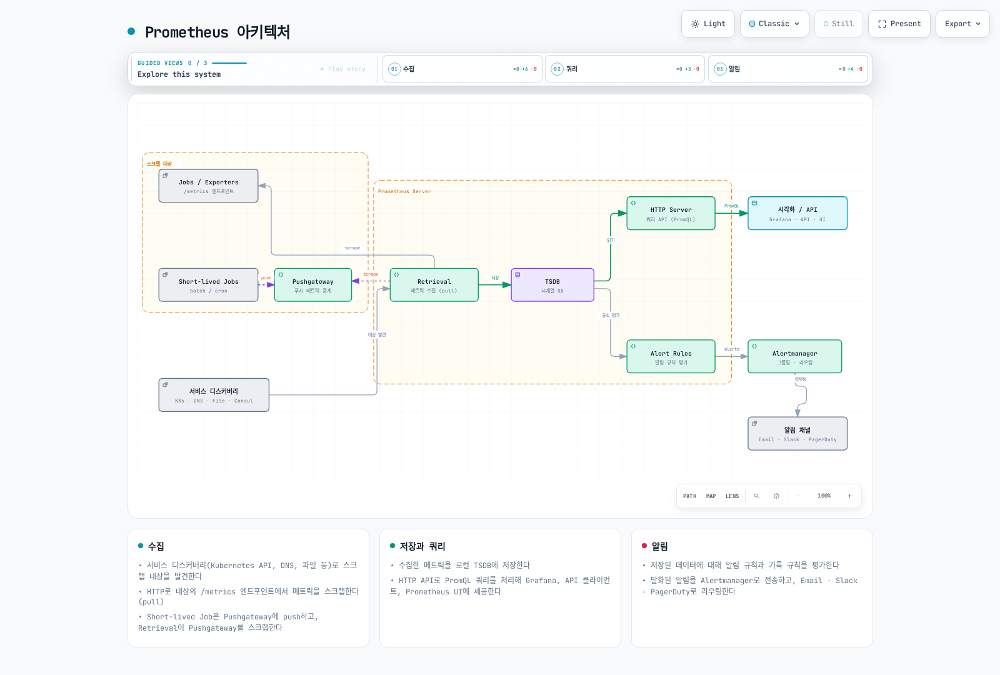
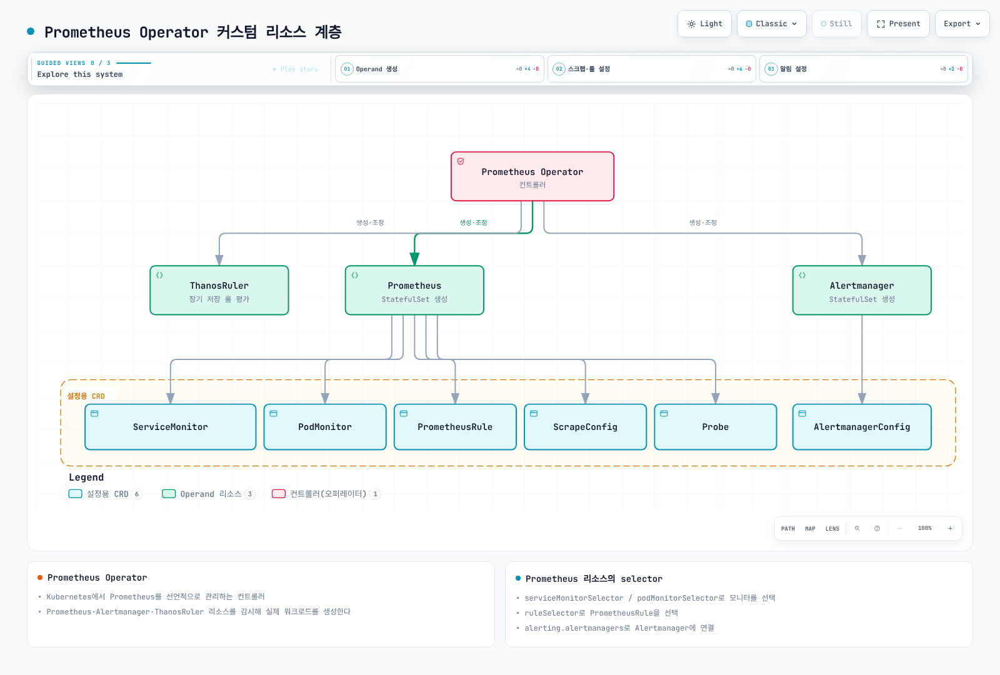

# Prometheus

> 검토: 2026년 9월 13일. 아래에 로컬 설정·쿼리 검증 범위를 명시합니다. 클러스터·클라우드 배포는 수행하지 않았습니다.

## 목차

- [소개와 버전](#소개와-버전)
- [아키텍처와 구성 요소](#아키텍처와-구성-요소)
- [PromQL](#promql)
- [Discovery와 Operator selector](#discovery와-operator-selector)
- [kube-prometheus-stack 설치](#kube-prometheus-stack-설치)
- [Rule과 Alertmanager](#rule과-alertmanager)
- [Remote write와 AMP](#remote-write와-amp)
- [성능·HA·문제 해결](#성능·ha·문제-해결)

## 소개와 버전

Prometheus는 SoundCloud에서 시작한 CNCF 모니터링 툴킷입니다. 수치 시계열을 수집해 local TSDB에 저장하고, PromQL·recording/alert rule을 평가하며 Alertmanager에 알림을 보냅니다. 기본 수집 경로는 HTTP scrape이고 remote write·선택적인 배치 통합은 다른 전달 경로를 추가합니다. 이벤트 로그·트레이스 저장소나 요청별 정밀 과금 원장은 아닙니다.

Local 보존 기간은 설정할 수 있으며 30일을 넘길 수도 있습니다. 별도 저장소는 보존·용량·통합 조회·장애 복구 요구에 따른 선택입니다.

2026년 9월 6일 공개된 공식 **kube-prometheus-stack 90.0.0** 패키지를 기준으로 컴포넌트 조합을 확인했습니다.

| 컴포넌트 | 패키지 기본 버전 |
|---|---|
| Prometheus Operator | 0.93.1 |
| Prometheus | 3.14.0, distroless 이미지 |
| Alertmanager | 0.34.0 |
| Grafana | 13.2.1, subchart 13.2.2 |
| kube-state-metrics | 2.20.0, subchart 8.4.2 |
| node-exporter | 1.12.1, subchart 4.56.3 |

차트의 `kubeVersion` 조건은 `>=1.25.0-0`입니다. 전체 호환성 표이거나 모든 Kubernetes 1.25 이상 버전이 계속 지원된다는 뜻은 아닙니다. 실제 cluster·컴포넌트 지원·admission 정책·storage driver를 확인합니다.

Profile은 **Linux EC2 worker를 사용하는 EKS** 대상입니다. Fargate는 DaemonSet을 지원하지 않으며 Auto Mode·Hybrid Nodes·Windows는 수집기와 저장소를 별도로 검토해야 합니다.

### 2026년 7월의 업데이트 기록

- [7월 14일 Kubernetes exporter 글](https://kubernetes.io/blog/2026/07/14/custom-metrics-exporter-kubernetes/)은 애플리케이션 계측과 custom exporter를 설명합니다. HPA 연동에는 맞는 metrics API/adapter도 필요하며 scrape만으로 임의 메트릭이 HPA에 연결되지는 않습니다.
- [7월 21일 AMP 발표](https://aws.amazon.com/about-aws/whats-new/2026/07/amazon-managed-service-prometheus-1500m-metrics-workspace/)는 workspace당 활성 시계열 최대 15억 개, recording/alerting rule 최대 20만 개 지원을 안내합니다. 자동 부여되는 기본 쿼터나 상향 승인 보장이 아닙니다. 대상 workspace·계정의 현재 쿼터를 확인합니다.

## 아키텍처와 구성 요소



[인터랙티브 다이어그램](https://www.atomai.click/kubernetes-docs/archmaps/ko-observability-metrics-01-prometheus-0.html)

Pushgateway 분기는 적합한 서비스 단위 배치의 선택적 경로이지 모든 짧은 Pod의 기본값이 아닙니다. 그룹 수명 관리는 [메트릭 개요](README.md)를 참고합니다. `up`은 scrape 상태이며 애플리케이션 가용성과 다릅니다.

| 컴포넌트 | 책임과 전제 조건 |
|---|---|
| Prometheus | Discovery·scrape·local TSDB·query API·rule 평가 |
| kube-state-metrics | API 객체 상태; ServiceAccount·RBAC·scrape endpoint 필요 |
| node-exporter | 호스트 OS 메트릭; host 접근·mount·플랫폼 지원 검토 |
| kubelet/cAdvisor | 컨테이너 측정; serving certificate·권한·endpoint 제공 여부 확인 |
| metrics-server / adapter | Autoscaling을 위한 resource/custom metrics API; 과거 TSDB 저장과 별개 |
| Alertmanager | Alert 그룹화·중복 제거·억제·수신자 라우팅 |
| Grafana | Data source 조회·시각화; 인증·database/storage 별도 설정 |

차트가 exporter와 지원 자원을 제공합니다. 불완전한 standalone Deployment/DaemonSet 조각은 누락된 ServiceAccount·RBAC·Service를 만들어 주지 않으며 모니터링 stack을 중복 배포하는 용도로 사용하지 않습니다.

### TSDB와 설정 계층

최근 샘플은 head/WAL을 사용하고 압축 block에는 chunks·index·metadata가 있습니다. Tombstone은 삭제 범위를 표시합니다. WAL replay는 비정상 종료 복구를 돕지만 백업·볼륨 손실 대응·모든 이벤트 복구를 보장하지는 않습니다.

| 계층 | 맞는 설정 |
|---|---|
| Process flag | `--storage.tsdb.path`, `--storage.tsdb.retention.time`, `--storage.tsdb.retention.size` |
| Prometheus 설정 | `global`, `scrape_configs`, `rule_files`, `remote_write` |
| Operator의 `Prometheus.spec` | `retention`, `retentionSize`, `storage`, `replicas`, `shards` |
| 이 차트의 values | `prometheus.prometheusSpec.retention`, `storageSpec` 등 아래 값 |

기존 `storage.tsdb.path/retention.time/...` YAML은 올바른 process 설정이 아닙니다. **별도 standalone 설치**에서 기본 flag 형태는 다음과 같습니다.

```sh
prometheus --config.file=prometheus.yml \
  --storage.tsdb.path=/prometheus \
  --storage.tsdb.retention.time=15d \
  --storage.tsdb.retention.size=15GB
```

Operator 설치에서는 소유한 Helm values를 수정합니다. Retention size가 총 디스크의 엄격한 상한은 아니므로 WAL·head·index·compaction 공간을 남깁니다. 지원되는 local/block storage를 사용하며 임의의 NFS를 대체 저장소로 가정하지 않습니다.

## PromQL

예제는 `job="example-app"`과 차트의 node-exporter·kube-state-metrics job 레이블을 사용하므로 실제 대상에 맞춰 조정합니다. `example_queue_depth`, `temperature_celsius`는 애플리케이션 Gauge이며 Kubernetes 내장 메트릭이 아닙니다.

### Selector·구간·변화율

Instant selector는 lookback·staleness 규칙에 맞는 샘플을 선택합니다. “현재 값”이 평가 시각과 정확히 같은 시각에 관측됐다는 뜻은 아닙니다. Range selector는 샘플 구간을 선택하고 subquery는 해상도에 맞춰 식을 평가합니다. 저장된 원시 샘플을 N개마다 선택하는 것과는 다릅니다.

| 목적 | PromQL |
|---|---|
| Instant selector | `http_requests_total{job="example-app"}` |
| 양수·정규식 조건 | `http_requests_total{job="example-app",method="GET",status=~"2[0-9]{2}"}` |
| 부정 정규식 | `http_requests_total{job="example-app",status!~"5[0-9]{2}"}` |
| 범위 벡터 | `http_requests_total{job="example-app"}[5m]` |
| 1시간 subquery, 5분 평가 해상도 | `rate(http_requests_total{job="example-app"}[5m])[1h:5m]` |
| 1시간 전 구간의 변화율 | `rate(http_requests_total{job="example-app"}[5m] offset 1h)` |
| Counter의 초당 평균 변화율 | `rate(http_requests_total{job="example-app"}[5m])` |
| 최근 두 유효 샘플의 변화율 | `irate(http_requests_total{job="example-app"}[5m])` |
| 외삽한 Counter 증가량 | `increase(http_requests_total{job="example-app"}[1h])` |

부정 matcher는 해당 레이블이 없는 시계열도 선택할 수 있습니다. `rate()`·`increase()`는 관측한 리셋을 처리하고 외삽하지만 놓친 모든 증가량을 복원하지는 않습니다. **Rate를 계산한 뒤 집계**합니다. `irate()`는 최근 샘플에 민감하므로 안정적인 알림 조건에는 보통 덜 적합합니다.

Range vector는 range 함수의 입력이며 곧바로 range-query 그래프가 되는 것은 아닙니다. 평가한 변화율 시계열이 필요하면 `rate(counter[5m])` 같은 식을 사용합니다.

### 집계·Gauge·시간

| 목적 | PromQL |
|---|---|
| 메서드별 요청 변화율 | `sum by (method) (rate(http_requests_total{job="example-app"}[5m]))` |
| instance를 제외하고 집계 | `sum without (instance) (rate(http_requests_total{job="example-app"}[5m]))` |
| 중복 제거한 Running 지표 합계 | `sum(max by (namespace,pod,uid) (kube_pod_status_phase{job="kube-state-metrics",phase="Running"}))` |
| 사용 가능한 메모리 최댓값 | `max(node_memory_MemAvailable_bytes{job="node-exporter"})` |
| 빈·infra container 레이블을 제외한 Pod CPU 상위값 | `topk(5, sum by (namespace,pod) (rate(container_cpu_usage_seconds_total{job="kubelet",container!="",container!="POD"}[5m])))` |
| 현재 queue-depth Gauge 사이의 분위수 | `quantile(0.95, example_queue_depth{job="example-app"})` |
| 변화율의 표준편차 | `stddev(rate(http_requests_total{job="example-app"}[5m]))` |
| 외삽한 Gauge 변화량 | `delta(temperature_celsius{job="example-app"}[1h])` |
| Gauge의 초당 회귀 기울기 | `deriv(temperature_celsius{job="example-app"}[1h])` |
| 20°C와의 절대 차이 | `abs(temperature_celsius{job="example-app"} - 20)` |
| 올림 | `ceil(example_queue_depth{job="example-app"})` |
| 범위 제한 | `clamp(example_queue_depth{job="example-app"}, 0, 100)` |
| 제곱근 | `sqrt(example_queue_depth{job="example-app"})` |
| 자연로그 | `ln(example_queue_depth{job="example-app"})` |
| 평가 시각의 Unix 초 | `time()` |
| 선택한 샘플의 타임스탬프 | `timestamp(up{job="example-app"})` |
| 샘플 시각의 UTC 시간 | `hour(timestamp(up{job="example-app"}))` |

`kube_pod_status_phase{phase="Running"}` 시계열을 count하면 값 0도 셉니다. 중복 exporter 식별자를 제거한 0/1 지표를 합치면 0인 지표만 있을 때는 0, 텔레메트리가 없을 때는 데이터 없음을 유지합니다.

Gauge `quantile()` 예제는 시계열 사이의 값을 비교합니다. Histogram의 요청 지연 시간 p95나 여러 Summary p99를 합친 분위수가 아닙니다. 수학 함수에는 입력 범위 제한이 있으므로 양수가 아닌 값의 로그 등을 처리해야 합니다. 관련 함수에는 `floor`, `round`, `clamp_min`, `clamp_max`도 있습니다.

아래 업무 시간 필터는 브라우저·클러스터 지역 시간이 아닌 **UTC** 기준입니다.

```promql
sum(rate(http_requests_total{job="example-app"}[5m])) and on() (hour() >= 9 < 18)
```

### 분포와 예측

```promql
histogram_quantile(0.95, sum by (le) (rate(http_request_duration_seconds_bucket{job="example-app"}[5m])))
```

```promql
histogram_quantile(0.99, sum by (le,method) (rate(http_request_duration_seconds_bucket{job="example-app"}[5m])))
```

```promql
sum(rate(http_request_duration_seconds_sum{job="example-app"}[5m])) / sum(rate(http_request_duration_seconds_count{job="example-app"}[5m]))
```

호환되는 classic 버킷을 집계할 때 `le`를 유지합니다. 분위수는 버킷 안을 보간합니다. Summary 분위수도 근사값이며 평균을 내 전체 분위수로 만들 수 없습니다. Sum/count는 전체 평균에 사용할 수 있습니다.

`predict_linear()`는 Gauge의 선형 추세를 외삽합니다. 음수 예측은 조사할 신호이지 미래 디스크 장애의 보장이 아닙니다.

```promql
predict_linear(node_filesystem_avail_bytes{job="node-exporter",mountpoint="/",fstype!~"tmpfs|overlay"}[6h], 86400)
```

Prometheus 3에서는 `holt_winters`가 `double_exponential_smoothing`으로 바뀌었습니다. **Holt 선형 평활화이며 계절성 triple-exponential 예측이 아닙니다.** Gauge float 샘플에 사용합니다. 선택적 식은 `double_exponential_smoothing(example_queue_depth{job="example-app"}[1h], 0.5, 0.5)`이며 평가 서버에 `--enable-feature=promql-experimental-functions`가 필요합니다. 로컬 감사에서는 파서 문법을 확인했으며 실험 기능의 값 평가 통과를 주장하지 않습니다.

### 운영 쿼리 예시

| 목적 | PromQL |
|---|---|
| CPU non-idle 비율 | `100 * (1 - avg by (instance) (rate(node_cpu_seconds_total{job="node-exporter",mode="idle"}[5m])))` |
| MemAvailable로 보고되지 않은 비율 | `100 * (1 - node_memory_MemAvailable_bytes{job="node-exporter"} / node_memory_MemTotal_bytes{job="node-exporter"})` |
| 재시작 추정 증가량 3 초과 | `increase(kube_pod_container_status_restarts_total{job="kube-state-metrics"}[1h]) > 3` |
| 파일시스템에서 사용 가능하지 않은 공간 비율 | `100 * (1 - node_filesystem_avail_bytes{job="node-exporter",mountpoint="/"} / node_filesystem_size_bytes{job="node-exporter",mountpoint="/"})` |
| 초당 수신·송신 바이트 합계 | `rate(node_network_receive_bytes_total{job="node-exporter",device="eth0"}[5m]) + rate(node_network_transmit_bytes_total{job="node-exporter",device="eth0"}[5m])` |

정상 서비스에는 5xx 시계열이 없을 수 있습니다. 아래 오류율의 0 대체는 일치하는 전체 요청 그룹이 있을 때만 적용하며, 누락된 서비스의 정상 데이터를 만들지 않습니다.

```promql
100 * (sum by (namespace, service) (rate(http_requests_total{job="example-app",status=~"5[0-9]{2}"}[5m])) or on (namespace, service) (0 * (sum by (namespace, service) (rate(http_requests_total{job="example-app"}[5m]))))) / (sum by (namespace, service) (rate(http_requests_total{job="example-app"}[5m])))
```

관측된 정상 트래픽은 0, 모두 5xx인 트래픽은 100이며 분모가 0이면 정의되지 않습니다. 텔레메트리 누락은 그대로 유지하고 수집 실패는 별도로 모니터링합니다.

## Discovery와 Operator selector



[인터랙티브 다이어그램](https://www.atomai.click/kubernetes-docs/archmaps/ko-observability-metrics-01-prometheus-1.html)

그림의 Prometheus·Alertmanager는 **custom resource**를 뜻합니다. Operator가 이를 읽고 StatefulSet 같은 실제 workload를 조정합니다. 객체나 Prometheus 서버 자체가 StatefulSet을 생성하는 것은 아닙니다.

| 선택 단계 | 선택하는 대상 |
|---|---|
| Prometheus의 `serviceMonitorNamespaceSelector` | ServiceMonitor 객체가 있는 namespace |
| Prometheus의 `serviceMonitorSelector` | 그 ServiceMonitor 객체의 레이블 |
| ServiceMonitor의 `namespaceSelector` / `selector` | 대상 Service의 namespace·레이블 |
| ServiceMonitor endpoint의 `port` | 임의의 container port 숫자가 아닌 **Service port 이름** |
| PodMonitor selector / endpoint의 `port` | Pod 레이블과 선언한 container port 이름 |

RBAC·discovery·네트워크·TLS 접근도 필요하며 selector가 권한을 대신하지는 않습니다. Helm의 `*SelectorNilUsesHelmValues`는 레이블 선택 기본값에 영향을 주며 모든 대상 namespace를 의미하지 않습니다.

### 일관된 애플리케이션 scrape

`example-app`에 이미 계측된 Deployment가 있고 Pod 레이블이 `app: example-app`, `/metrics`를 제공하는 포트 이름이 `metrics`라고 가정합니다. 아래 Service는 애플리케이션을 생성하지 않습니다.

```yaml
# service.yaml
apiVersion: v1
kind: Service
metadata:
  name: example-app
  namespace: example-app
  labels:
    app: example-app
    metrics-job: example-app
spec:
  selector:
    app: example-app
  ports:
  - name: http-metrics
    port: 8080
    targetPort: metrics
```

```yaml
# servicemonitor.yaml
apiVersion: monitoring.coreos.com/v1
kind: ServiceMonitor
metadata:
  name: example-app
  namespace: monitoring
  labels:
    release: kube-prom
spec:
  jobLabel: metrics-job
  selector:
    matchLabels:
      app: example-app
  namespaceSelector:
    matchNames:
    - example-app
  endpoints:
  - port: http-metrics
    path: /metrics
    interval: 30s
    scrapeTimeout: 10s
    relabelings:
    - sourceLabels:
      - __meta_kubernetes_service_name
      targetLabel: service
    - sourceLabels:
      - __meta_kubernetes_namespace
      targetLabel: namespace
    - sourceLabels:
      - __meta_kubernetes_pod_name
      targetLabel: pod
```

ServiceMonitor의 `release: kube-prom`은 설치와 일치합니다. `jobLabel`은 Service의 `metrics-job: example-app`을 읽어 애플리케이션 쿼리의 job 레이블을 정합니다.

PodMonitor는 같은 Pod에 대한 **대안**입니다. 동일 endpoint를 중복 수집하지 않도록 의도한 한 경로를 사용합니다.

```yaml
# podmonitor.yaml
apiVersion: monitoring.coreos.com/v1
kind: PodMonitor
metadata:
  name: example-app-pods
  namespace: monitoring
  labels:
    release: kube-prom
spec:
  selector:
    matchLabels:
      app: example-app
  namespaceSelector:
    matchNames:
    - example-app
  podMetricsEndpoints:
  - port: metrics
    interval: 30s
    path: /metrics
    relabelings:
    - targetLabel: job
      replacement: example-app
    - targetLabel: service
      replacement: example-app
```

### 다른 discovery 경로

- Standalone·agent Pod discovery는 [개요의 named-port 설정](README.md#metric-collection-models)처럼 제공된 IPv4/IPv6 주소를 유지합니다. `prometheus.io/scheme` 같은 annotation도 실제 설정에서 읽어야 효과가 있습니다.
- Service blackbox probe에는 설치된 exporter·정의된 module·올바른 대상 URL/scheme·Probe/scrape 설정이 필요합니다. `up`은 exporter scrape 상태이고 probe 성공은 별도 신호입니다.
- Node discovery는 kubelet endpoint에 접근하며 node-exporter가 자동 연결되는 것은 아닙니다. Serving certificate·맞는 CA·node metric RBAC를 검증합니다. Kubernetes API CA가 임의 노드의 인증서까지 신뢰한다는 뜻은 아닙니다.
- 무제한 Node `labelmap`보다 검토한 namespace·service·team 레이블을 사용합니다. 식별 레이블 삭제는 집계 연산이 아닙니다.

## kube-prometheus-stack 설치

아래는 클러스터를 변경하는 운영자 명령이며 **감사에서 실행한 명령이 아닙니다**. 의도한 context와 소유한 release를 사용합니다. 기존 설치는 stack을 중복 배포하기보다 실제 values·CRD·storage·upgrade 지침을 검토합니다.

이 profile의 전제 조건은 다음과 같습니다.

- Helm·Kubernetes 접근 권한과 충분한 Linux EC2 node 자원
- 정상적인 기본 block-storage StorageClass/CSI driver 또는 각 PVC에 명시할 검토된 class 이름. `gp3`가 항상 존재하지는 않음
- 기존 `monitoring` namespace와 Linux EC2 node의 Secrets Store CSI driver·AWS provider(ASCP)가 필요합니다. `ap-northeast-2`의 AWS Secrets Manager에 `observability/grafana-admin`을 준비하고 JSON string key `admin-password`를 저장합니다. Kubernetes Secret 동기화는 사용하지 않습니다.
- `metrics-demo-grafana` ServiceAccount의 IRSA role을 해당 secret으로 제한합니다. 예제 IAM role ARN을 실제 role로 바꾸고 SecretProviderClass를 적용합니다. [전체 identity·KMS·mount·rotation 전제조건](https://github.com/Atom-oh/kubernetes-docs/blob/5ff787faed758902c12a74e8429466f434bb26ae/examples/observability/secret-profiles/README.md)을 확인합니다.
- 검증한 kubelet TLS 신뢰 경로. Profile은 인증서 검증을 켜므로 다른 issuer를 쓰면 검증을 끄는 대신 올바른 CA를 제공

자원 크기는 예시입니다. Prometheus 복제본마다 PVC가 생기고 retention size는 WAL·head·compaction 사용량을 제한하지 않습니다. Grafana는 PVC의 database를 쓰는 한 복제본입니다. 복제본 수만 늘리는 것은 공유 database 기반 HA가 아닙니다.

```yaml
# kube-prometheus-stack 90.0.0; replace the example IRSA role ARN before use.
fullnameOverride: metrics-demo
kubeControllerManager:
  enabled: false
kubeScheduler:
  enabled: false
kubeEtcd:
  enabled: false
kubeProxy:
  enabled: false
kubelet:
  serviceMonitor:
    tlsConfig:
      insecureSkipVerify: false
prometheus:
  serviceAccount:
    create: true
    name: metrics-demo-prometheus
  prometheusSpec:
    replicas: 1
    shards: 1
    retention: 15d
    retentionSize: 15GB
    storageSpec:
      volumeClaimTemplate:
        spec:
          accessModes:
          - ReadWriteOnce
          resources:
            requests:
              storage: 20Gi
    resources:
      requests:
        cpu: 500m
        memory: 2Gi
      limits:
        memory: 4Gi
    externalLabels:
      cluster: eks-metrics-demo
    serviceMonitorSelectorNilUsesHelmValues: true
    serviceMonitorNamespaceSelector: &id001
      matchExpressions:
      - key: kubernetes.io/metadata.name
        operator: In
        values:
        - monitoring
        - example-app
    podMonitorSelectorNilUsesHelmValues: true
    podMonitorNamespaceSelector: *id001
    ruleSelectorNilUsesHelmValues: true
    ruleNamespaceSelector:
      matchLabels:
        kubernetes.io/metadata.name: monitoring
alertmanager:
  alertmanagerSpec:
    replicas: 1
    storage:
      volumeClaimTemplate:
        spec:
          accessModes:
          - ReadWriteOnce
          resources:
            requests:
              storage: 5Gi
grafana:
  fullnameOverride: metrics-demo-grafana
  replicas: 1
  persistence:
    enabled: true
    size: 10Gi
  sidecar:
    dashboards:
      searchNamespace: monitoring
      skipReload: true
      initDashboards: true
      provider:
        updateIntervalSeconds: 30
    datasources:
      searchNamespace: monitoring
      skipReload: true
      initDatasources: true
  serviceAccount:
    create: true
    name: metrics-demo-grafana
    annotations:
      eks.amazonaws.com/role-arn: arn:aws:iam::111122223333:role/metrics-grafana-secrets
  env:
    GF_SECURITY_ADMIN_USER: admin
    GF_SECURITY_ADMIN_PASSWORD: $__file{/mnt/grafana-secrets/admin-password}
  grafana.ini:
    security:
      admin_user: admin
      admin_password: $__file{/mnt/grafana-secrets/admin-password}
  extraVolumes:
  - name: grafana-secrets
    csi:
      driver: secrets-store.csi.k8s.io
      readOnly: true
      volumeAttributes:
        secretProviderClass: metrics-grafana-admin
  extraVolumeMounts:
  - name: grafana-secrets
    mountPath: /mnt/grafana-secrets
    readOnly: true
```

이 EKS profile은 노출을 가정하지 않는 관리형 control-plane 컴포넌트와 kube-proxy endpoint monitor를 끕니다. Kubernetes 자체를 끄지는 않습니다. `monitoring`·`example-app`의 ServiceMonitor는 release 레이블도 일치해야 하고 rule은 `monitoring`에서 선택합니다.

`GF_SECURITY_ADMIN_PASSWORD`에는 암호 값 대신 **file-provider 표현식 자체**를 넣어 chart의 자동 Secret 환경 변수 주입을 막습니다. Grafana 13.2.1은 환경 변수 override 후 설정 안에서 `$__file{...}`을 평가하며, `__FILE` entrypoint나 shell이 파일 내용을 환경 변수로 export하지 않습니다. CSI 파일은 read-only이고 UID/GID 472가 읽을 수 있어야 합니다(`fsGroup: 472`, mode `0440`). Main Grafana 컨테이너만 암호 volume을 mount합니다. File provider가 양끝 공백을 제거하므로 암호에 앞뒤 공백을 넣지 않습니다.

Dashboard/datasource init container가 시작 전에 provisioning 파일을 채웁니다. Sidecar는 파일을 계속 감시하지만 `skipReload: true`로 admin credential을 사용하지 않습니다. Grafana는 dashboard 파일을 30초마다 확인하며 **datasource 변경에는 통제된 Pod 재시작이 필요합니다**. `admin_password`는 새 DB를 초기화할 때만 적용됩니다. AWS secret 변경·CSI rotation·재시작으로 기존 PVC/DB의 admin 암호가 바뀌지는 않습니다. 승인된 암호 변경/SSO 절차와 secret 값을 함께 관리하며 PVC는 보존합니다.

`grafana-secret-provider.yaml`을 포함한 [재사용 profile](https://github.com/Atom-oh/kubernetes-docs/blob/5ff787faed758902c12a74e8429466f434bb26ae/examples/observability/secret-profiles/README.md)을 사용합니다. 로컬 render/test는 설정·mount 계약을 확인하며 실제 CSI 권한·로그인·rotation 검증은 아닙니다. Primary 문서: [Grafana 설정](https://grafana.com/docs/grafana/latest/setup-grafana/configure-grafana/)과 [AWS ASCP](https://github.com/aws/secrets-store-csi-driver-provider-aws/blob/main/README.md).

검토한 values로 한 번 설치합니다.

```sh
PROFILE=examples/observability/secret-profiles
kubectl apply -f "$PROFILE/grafana-secret-provider.yaml"
helm repo add prometheus-community https://prometheus-community.github.io/helm-charts
helm repo update prometheus-community
helm template kube-prom prometheus-community/kube-prometheus-stack \
  --version 90.0.0 --namespace monitoring -f "$PROFILE/prometheus-values.yaml" \
  > grafana-reviewed-render.yaml
# Review resources, prerequisites and ownership before this cluster-changing command.
helm upgrade --install kube-prom prometheus-community/kube-prometheus-stack \
  --version 90.0.0 --namespace monitoring -f "$PROFILE/prometheus-values.yaml" \
  --wait --timeout 15m
```

CRD Established·Operator 상태·PVC 바인딩·실제 target을 확인합니다. 선택한 애플리케이션 monitor·rule은 CRD가 준비된 후 적용합니다.

CRD upgrade 처리는 차트 버전에 따라 다르므로 단순 Helm upgrade가 모든 CRD 마이그레이션을 해결한다고 가정하지 않습니다. 차트 90은 Grafana 의존성을 community repository로 바꾸므로 upgrade 시 기존 인증·provisioning 값과 database/PVC 백업을 확인합니다.

## Rule과 Alertmanager

아래 선택 대상 PrometheusRule은 alert·recording 예제입니다. CPU recording은 `rate`와 ratio 단위를 일관되게 사용합니다. 오류율 식은 백분율이므로 임계값은 1이고 annotation도 백분율을 표시합니다.

```yaml
# prometheusrule.yaml
apiVersion: monitoring.coreos.com/v1
kind: PrometheusRule
metadata:
  name: example-rules
  namespace: monitoring
  labels:
    release: kube-prom
spec:
  groups:
  - name: example-alerts
    interval: 30s
    rules:
    - alert: NodeMemoryHigh
      expr: 100 * (1 - node_memory_MemAvailable_bytes{job="node-exporter"} / node_memory_MemTotal_bytes{job="node-exporter"})
        > 90
      for: 5m
      labels:
        severity: warning
        team: infrastructure
      annotations:
        summary: Node {{ $labels.instance }} memory availability is low
        description: '{{ printf "%.2f" $value }}% is not reported as MemAvailable.'
    - alert: PodRestartingFrequently
      expr: increase(kube_pod_container_status_restarts_total{job="kube-state-metrics"}[1h]) > 5
      for: 10m
      labels:
        severity: warning
      annotations:
        summary: Pod {{ $labels.namespace }}/{{ $labels.pod }} is restarting
        description: '{{ printf "%.2f" $value }} estimated restarts in one hour.'
    - alert: ProjectedDiskExhaustion
      expr: predict_linear(node_filesystem_avail_bytes{job="node-exporter",mountpoint="/",fstype!~"tmpfs|overlay"}[6h],
        86400) < 0
      for: 1h
      labels:
        severity: warning
      annotations:
        summary: Projected disk exhaustion on {{ $labels.instance }}
        description: The fitted six-hour trend projects negative free space in 24 hours; inspect the filesystem
          and workload.
    - alert: HighErrorRate
      expr: (100 * (sum by (namespace, service) (rate(http_requests_total{job="example-app",status=~"5[0-9]{2}"}[5m]))
        or on (namespace, service) (0 * (sum by (namespace, service) (rate(http_requests_total{job="example-app"}[5m])))))
        / (sum by (namespace, service) (rate(http_requests_total{job="example-app"}[5m])))) > 1
      for: 5m
      labels:
        severity: warning
        team: backend
      annotations:
        summary: High error rate on {{ $labels.namespace }}/{{ $labels.service }}
        description: '{{ printf "%.2f" $value }}% of requests are 5xx, above the 1% threshold.'
  - name: example-recording
    rules:
    - record: instance:node_cpu_utilization:ratio_rate5m
      expr: 100 * (1 - avg by (instance) (rate(node_cpu_seconds_total{job="node-exporter",mode="idle"}[5m])))
        / 100
    - record: instance:node_memory_not_available:ratio
      expr: max by (instance) ((1 - node_memory_MemAvailable_bytes{job="node-exporter"} / node_memory_MemTotal_bytes{job="node-exporter"}))
```

`for`는 같은 alert 레이블 집합이 평가마다 계속 조건을 충족해야 firing이 된다는 뜻입니다. 데이터 누락·레이블 변화는 pending을 끊을 수 있습니다. Alertmanager의 전송 대기·반복 주기가 아닙니다. 예측 알림도 추세를 설명하며 장애를 보장하지 않습니다.

### AlertmanagerConfig와 namespace 경계

Operator 0.93.1 패키지의 AlertmanagerConfig CRD는 **v1alpha1**을 제공합니다. 예제는 관리자가 소유한 **전역 설정**으로 사용합니다. 참조 Secret은 `monitoring`에 있어야 하며 실제 전송 전에 주소·채널·수신 대상을 바꾸고 확인해야 합니다.

Operator API는 `alertmanagerConfiguration`을 실험 기능으로 표시하므로 버전 경계를 유지하고 upgrade를 검사합니다. 일반적으로 선택한 namespaced AlertmanagerConfig에는 namespace matcher가 추가됩니다. `monitoring`의 config가 모든 namespace의 애플리케이션 알림을 자동으로 받지는 않습니다. 전역 설정은 의도적으로 더 넓은 관리 경계를 가집니다.

```yaml
# alertmanagerconfig.yaml
apiVersion: monitoring.coreos.com/v1alpha1
kind: AlertmanagerConfig
metadata:
  name: main-config
  namespace: monitoring
spec:
  route:
    receiver: default
    groupBy:
    - alertname
    - namespace
    - severity
    groupWait: 30s
    groupInterval: 5m
    repeatInterval: 4h
    routes:
    - receiver: pagerduty-critical
      matchers:
      - name: severity
        matchType: '='
        value: critical
      groupWait: 10s
      repeatInterval: 1h
    - receiver: slack-backend
      matchers:
      - name: team
        matchType: '='
        value: backend
    - receiver: slack-warnings
      matchers:
      - name: severity
        matchType: '='
        value: warning
      groupWait: 1m
  inhibitRules:
  - sourceMatch:
    - name: severity
      matchType: '='
      value: critical
    targetMatch:
    - name: severity
      matchType: '='
      value: warning
    equal:
    - alertname
    - cluster
    - namespace
    - service
    - instance
    - pod
    - container
  receivers:
  - name: default
    emailConfigs:
    - to: alerts@example.com
      from: alertmanager@example.com
      smarthost: smtp.example.com:587
      authUsername: alertmanager
      authPassword:
        name: alertmanager-smtp
        key: password
      requireTLS: true
  - name: slack-backend
    slackConfigs:
    - apiURL:
        name: alertmanager-slack
        key: webhook-url
      channel: '#team-backend-alerts'
      sendResolved: true
  - name: slack-warnings
    slackConfigs:
    - apiURL:
        name: alertmanager-slack
        key: webhook-url
      channel: '#alerts'
      sendResolved: true
  - name: pagerduty-critical
    pagerdutyConfigs:
    - routingKey:
        name: alertmanager-pagerduty
        key: routing-key
      sendResolved: true
```

기본적으로 같은 단계의 route는 첫 일치에서 멈춥니다. Critical을 먼저 두고 backend route를 일반 warning보다 앞에 두어 도달 가능하게 했습니다. 여러 곳에 전송하려는 경우에만 `continue`를 명시적으로 사용합니다. Inhibition은 alert 이름과 자원 식별자를 함께 비교해 한 서비스·노드의 critical이 다른 warning을 억제하지 않게 합니다. Alert 유형에 맞는 equal 레이블을 선택해야 하며 양쪽 모두 없는 레이블은 같다고 처리됩니다.

CR의 `groupBy`는 native Alertmanager 설정의 `group_by`가 됩니다. 그룹화는 notification 묶음이며 동일 alert의 중복 제거와는 다릅니다. `groupWait`·`groupInterval`·`repeatInterval`은 PrometheusRule의 `for`와 별도로 알림 시간을 제어합니다.

참조 Secret과 AlertmanagerConfig를 만든 다음 **같은** 고정 release에 추가 values 파일을 병합합니다.

```yaml
# alerting-values.yaml
alertmanager:
  alertmanagerSpec:
    alertmanagerConfiguration:
      name: main-config
```

```sh
helm upgrade --install kube-prom prometheus-community/kube-prometheus-stack \
  --version 90.0.0 --namespace monitoring \
  -f values.yaml -f alerting-values.yaml --wait --timeout 15m
```

Native 라우팅 검사는 알림을 전송하지 않고 receiver 이름만 검증했습니다. Secret 조회·공급자 인증·실제 알림 전달은 통제된 환경에서 별도로 확인해야 합니다.

## Remote write와 AMP

Remote write는 설정한 backend에 샘플을 비동기로 전달합니다. 알림 전송·무제한 버퍼링·백업을 대신하지 않습니다. Backlog·재시도·수신 제한을 모니터링합니다. 검토한 집계·제외 정책이 없다면 Histogram 분포를 임의로 잘라내지 않습니다.

### 범위를 제한한 AMP 수집

아래 계정·workspace 식별자는 **합성 placeholder**입니다. 승인한 Region·계정·workspace를 endpoint·IAM resource·role annotation에 일관되게 반영합니다. 수집 role은 해당 workspace의 `aps:RemoteWrite`만 필요합니다. 조회 권한은 적절한 조회 client에 부여하며 수집기에 자동으로 합치지 않습니다.

```json
{
  "Version": "2012-10-17",
  "Statement": [
    {
      "Effect": "Allow",
      "Action": "aps:RemoteWrite",
      "Resource": "arn:aws:aps:ap-northeast-2:111122223333:workspace/ws-11111111-1111-4111-8111-111111111111"
    }
  ]
}
```

환경의 기존 IaC 소유자가 role을 생성·관리합니다. IRSA 예제의 trust는 의도한 cluster의 IAM OIDC provider를 참조하고 audience `sts.amazonaws.com`, subject `system:serviceaccount:monitoring:metrics-demo-prometheus`를 모두 제한해야 합니다. OIDC issuer URL만으로 IAM provider·trust가 존재함을 증명하지는 못합니다.

이 profile에서는 Helm이 ServiceAccount와 annotation을 소유합니다. 다른 도구가 같은 ServiceAccount를 중복 생성하지 않게 합니다. 기존 계정을 재사용하면 소유권과 차트의 `create` 설정을 대조합니다. EKS Pod Identity도 다른 credential 전달 방식으로 사용할 수 있지만 별도 설정·검증 없이 IRSA와 가정을 혼합하지 않습니다.

```yaml
# amp-values.yaml
prometheus:
  serviceAccount:
    create: true
    name: metrics-demo-prometheus
    annotations:
      eks.amazonaws.com/role-arn: arn:aws:iam::111122223333:role/metrics-prometheus-amp
  prometheusSpec:
    replicas: 2
    shards: 1
    podAntiAffinity: hard
    podAntiAffinityTopologyKey: kubernetes.io/hostname
    replicaExternalLabelName: __replica__
    externalLabels:
      cluster: eks-metrics-demo
    remoteWrite:
    - url: https://aps-workspaces.ap-northeast-2.amazonaws.com/workspaces/ws-11111111-1111-4111-8111-111111111111/api/v1/remote_write
      sigv4:
        region: ap-northeast-2
      queueConfig:
        capacity: 10000
        maxSamplesPerSend: 2000
        maxShards: 10
```

Identity·workspace 확인 후 같은 release에 base와 선택적인 AMP values를 병합합니다. Hard node anti-affinity의 복제본 2개에는 적절한 노드 최소 2개와 복제본별 PVC가 필요합니다.

AMP HA 중복 제거는 `cluster`·`__replica__`를 사용합니다. Operator의 `replicaExternalLabelName`으로 지원되는 Pod별 식별자를 설정합니다. 임의의 추가 replica 레이블로 대신하지 말고 기존 메트릭과 HA 레이블 충돌도 확인합니다.

예제는 의도적으로 `shards: 1`입니다. Sharding은 대상 집합을 나누고 replication은 같은 대상 집합을 복제합니다. Sharding을 추가하면 shard별 HA 그룹의 중복 제거 식별자와 전체 조회 설계를 분리해야 합니다. 서로 다른 shard를 같은 HA 식별자로 전송하고 데이터 유실이 없다고 가정하면 안 됩니다.

이 장의 쿼리는 local cluster 기준입니다. 중앙 저장소·AMP에서 여러 cluster를 조회하면 의도한 cluster 범위를 추가하거나 명시적으로 집계합니다.

### 다른 수신기

VictoriaMetrics single-node는 설정한 HTTP 포트의 `/api/v1/write`를 일반적으로 사용합니다. Cluster의 vminsert는 `/insert/<tenant>/prometheus/api/v1/write` 경로이며 vmauth 등 승인된 접근 계층에서 라우팅·인증을 구성해야 합니다. Tenant ID 자체는 credential이 아닙니다. Mimir 등 다른 수신기도 각각의 URL·identity·HA 계약을 가집니다.

1초 미만 Histogram 버킷이나 control-plane 지연 시간 계열 전체를 제거하던 규칙은 분위수·SLO 손실을 평가하지 않고 복사하면 안 됩니다. Queue 기본값은 출발점이지 측정한 운영 최적값이 아닙니다.

## 성능·HA·문제 해결

### 측정에 근거한 튜닝

Head series/chunk·카디널리티 churn·scrape 부하·동시 쿼리가 메모리에 영향을 줍니다. 과거 보존 기간을 줄이는 것이 active head·query OOM의 보편적인 해결책은 아닙니다. 실제 사용량과 쿼리 부하를 확인한 뒤 제한을 바꿉니다.

다음 추가 values는 query 제한의 예시이며 용량 권장값이 아닙니다.

```yaml
# tuning-values.yaml
prometheus:
  prometheusSpec:
    query:
      maxConcurrency: 10
      maxSamples: 50000000
      timeout: 2m
```

Timeout·`maxSamples`를 늘리면 자원 부담이 커질 수 있습니다. 둘 다 높이기 전에 비용이 큰 식·조회 구간·집계·recording rule을 검토합니다.

다음 **standalone** scrape 설정은 한 job의 제한과 검토한 debug 계열 하나의 제외를 보여줍니다.

```yaml
# scrape-limits.yaml
scrape_configs:
- job_name: example-app
  scrape_interval: 30s
  scrape_timeout: 10s
  sample_limit: 10000
  static_configs:
  - targets:
    - example-app.example-app.svc:8080
  metric_relabel_configs:
  - source_labels:
    - __name__
    regex: example_debug_payload_total
    action: drop
```

`sample_limit`는 metric relabeling 후 scrape 수용 한도입니다. 넘으면 scrape가 실패하며 endpoint를 10,000개 샘플로 잘라 보관하는 동작이 아닙니다. 수집 간격을 늘리면 해상도·탐지 속도가 낮아지고, `go_.*`·`process_.*`를 모두 제거하면 runtime 진단 정보도 잃습니다.

`labeldrop`은 구별되던 샘플을 동일 시계열로 충돌시킬 수 있으며 합산해 주지 않습니다. 식별 레이블을 없애기 전에 유일성·수신기·카디널리티 영향을 확인합니다. 조회 범위도 의도한 job으로 제한합니다.

```promql
topk(10, count by (__name__) ({job="example-app"}))
```

지원 여부를 확인하지 않은 TSDB flag나 문자열 형태의 `additionalArgs`를 Operator CR에 복사하지 않습니다. `additionalArgs`는 이름·값 객체를 사용하며 CR schema가 유효해도 해당 Prometheus binary에 flag가 존재한다는 뜻은 아닙니다. 버전별 근거 없이 내부 block/chunk 동작을 바꾸지 않습니다.

### HA 경계

Prometheus의 `replicas`·`shards`는 Pod 수를 곱하지만 역할은 다릅니다. Anti-affinity에는 충분한 노드가 필요하고 zone 내성에는 배치·storage도 맞아야 합니다. 한 shard 조회만으로 전체 대상 데이터를 볼 수는 없습니다.

수집기 HA가 Alertmanager·Grafana·PVC·원격 저장소까지 자동으로 HA로 만들지는 않습니다. Alertmanager 복제본에는 peer 연결·독립 배치·저장소가, Grafana HA에는 적절한 공유 database·인증 설계가 필요합니다. 수신기별 중복 제거 레이블과 alert 식별자를 일관되게 관리합니다.

### 소유한 release를 기준으로 문제 해결

Context·release 식별자·생성된 자원 이름을 확인합니다. 아래 이름은 예제의 `fullnameOverride: metrics-demo` 기준이며 모든 설치에 공통인 이름이 아닙니다.

```sh
kubectl config current-context
helm status kube-prom --namespace monitoring
kubectl get prometheus,alertmanager,servicemonitor,podmonitor,prometheusrule \
  --namespace monitoring
kubectl get pods,pvc --namespace monitoring
kubectl get pods --namespace monitoring -l app.kubernetes.io/name=prometheus -o wide
kubectl top pod --namespace monitoring
```

`kubectl top`에는 정상적인 Resource Metrics API가 필요하며 Prometheus 메모리 문제의 모든 원인을 측정하지는 않습니다.

API를 비공개로 확인하려면 loopback에 port-forward를 바인딩하고 별도 터미널에서 유지합니다.

```sh
kubectl port-forward --namespace monitoring --address 127.0.0.1 \
  service/metrics-demo-prometheus 9090:9090
```

```sh
curl --fail --silent --show-error --max-time 10 \
  http://127.0.0.1:9090/api/v1/targets \
  | jq '.data.activeTargets[] | select(.health != "up") | {labels, scrapeUrl, lastError}'
curl --fail --silent --show-error --max-time 10 http://127.0.0.1:9090/api/v1/status/tsdb
curl --fail --silent --show-error --max-time 10 http://127.0.0.1:9090/api/v1/status/flags
curl --fail --silent --show-error --max-time 10 http://127.0.0.1:9090/api/v1/status/runtimeinfo
curl --fail --silent --show-error --max-time 10 http://127.0.0.1:9090/api/v1/rules
curl --fail --silent --show-error --max-time 10 http://127.0.0.1:9090/api/v1/alerts
```

| 증상 | 자원을 바꾸기 전에 확인할 것 |
|---|---|
| OOMKilled | Container limit·head series/churn·쿼리 동시성/범위·샘플량·부하 peak |
| PVC Pending | 실제 StorageClass/CSI·access mode·용량·zone 스케줄링 |
| 대상 누락 | 두 단계 monitor selector·namespace 선택·Service 레이블/포트·Pod 레이블·Operator 조정 |
| Target down | URL·CA/SAN/인증·RBAC/네트워크·endpoint 응답. 오류를 자원 부재로 해석하지 않음 |
| 알림 없음 | Rule 상태·레이블 안정성·선택/전역 config·namespace 조건·route 순서/inhibition·Secret·공급자 상태 |
| Remote backlog | Credential/Region/workspace·수신 오류/쿼터·queue/WAL·중복 레이블 계약 |

Distroless Prometheus 이미지에 shell·`wget`·`curl`이 있다고 가정하면 안 됩니다. Pod 네트워크 위치에서 점검해야 하면 승인된 진단 도구를 사용합니다. 설정·대상·로그 출력은 운영 데이터로 취급하고 민감 endpoint나 credential을 공개하지 않습니다.

## 검증과 참고 자료

고정 Helm base·alerting·AMP profile 렌더링, 릴리스 CRD 구조 검증, 합성 샘플의 핵심 PromQL·rule 평가, native Alertmanager 라우팅을 로컬에서 확인했습니다. Discovery·admission/CEL·storage 바인딩·IAM 집행·외부 Secret·알림 전송은 실행하지 않았습니다. 실험적 평활화는 파서 문법만 확인했으며 공개된 promtool test engine은 기능 flag를 주어도 해당 값 검증을 받아들이지 않았습니다.

- [차트 90.0.0 릴리스](https://github.com/prometheus-community/helm-charts/releases/tag/kube-prometheus-stack-90.0.0), [버전별 upgrade 지침](https://github.com/prometheus-community/helm-charts/blob/kube-prometheus-stack-90.0.0/charts/kube-prometheus-stack/README.md)
- [Operator 0.93.1 API](https://github.com/prometheus-operator/prometheus-operator/blob/v0.93.1/Documentation/api-reference/api.md)
- [Prometheus 3.14 설정](https://github.com/prometheus/prometheus/blob/v3.14.0/docs/configuration/configuration.md), [함수](https://github.com/prometheus/prometheus/blob/v3.14.0/docs/querying/functions.md), [저장소](https://github.com/prometheus/prometheus/blob/v3.14.0/docs/storage.md)
- [AMP 수집](https://docs.aws.amazon.com/prometheus/latest/userguide/AMP-onboard-ingest-metrics-existing-Prometheus.html), [HA 중복 제거](https://docs.aws.amazon.com/prometheus/latest/userguide/AMP-ingest-dedupe.html), [쿼터](https://docs.aws.amazon.com/prometheus/latest/userguide/AMP_quotas.html)
- [메트릭 개요](README.md), [Prometheus 퀴즈](../../quizzes/observability/metrics/01-prometheus-quiz.md)
