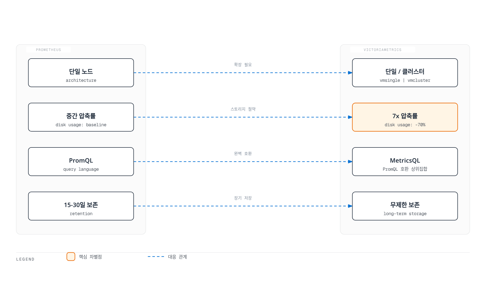
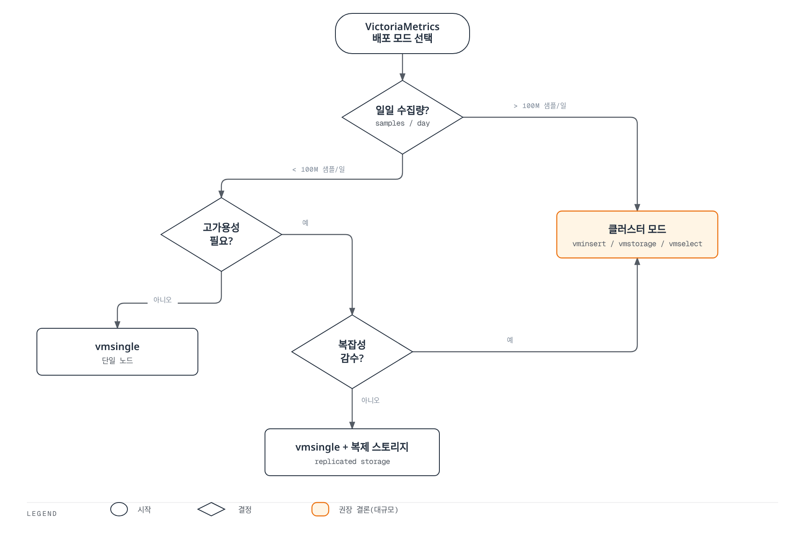
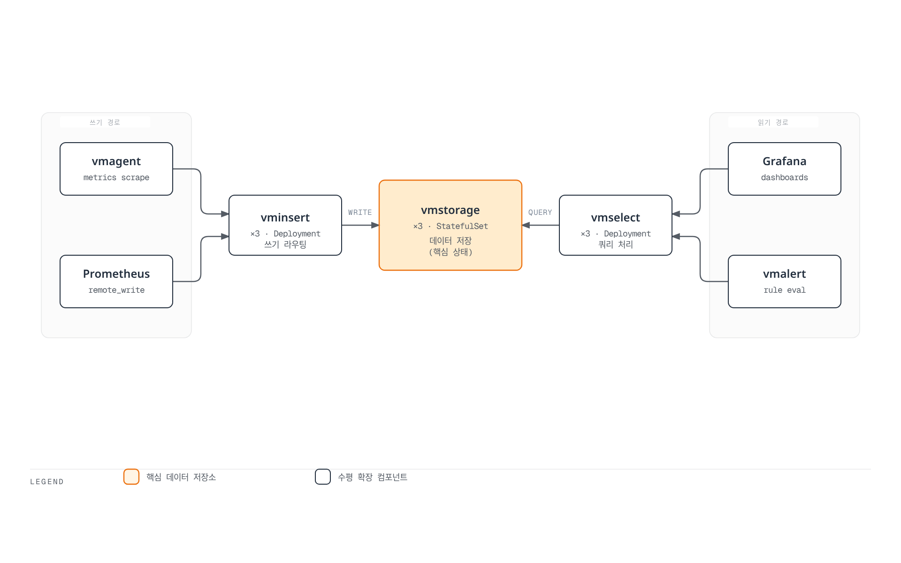

# VictoriaMetrics

> **지원 버전**: VictoriaMetrics 1.x
> **마지막 업데이트**: 2026년 2월 20일

## 목차

- [소개](#소개)
- [아키텍처 옵션](#아키텍처-옵션)
- [단일 노드 모드](#단일-노드-모드)
- [클러스터 모드](#클러스터-모드)
- [vmagent](#vmagent)
- [vmalert](#vmalert)
- [MetricsQL](#metricsql)
- [Helm 설치](#helm-설치)
- [장기 저장소 구성](#장기-저장소-구성)
- [다운샘플링](#다운샘플링)
- [성능 최적화](#성능-최적화)
- [모범 사례](#모범-사례)
- [문제 해결](#문제-해결)

## 소개

VictoriaMetrics는 고성능, 비용 효율적인 시계열 데이터베이스 및 모니터링 솔루션입니다. Prometheus와 완벽하게 호환되면서도 더 나은 압축률, 쿼리 성능, 확장성을 제공합니다.

### 주요 특징

| 특징 | 설명 |
|------|------|
| **높은 압축률** | Prometheus 대비 최대 7배 더 효율적인 데이터 압축 |
| **빠른 쿼리 성능** | 복잡한 쿼리에서 Prometheus보다 최대 20배 빠른 성능 |
| **수평적 확장** | 클러스터 모드에서 무제한 확장 가능 |
| **낮은 운영 오버헤드** | 단일 바이너리로 배포, 최소한의 설정 |
| **Prometheus 호환** | PromQL, Remote Write/Read API 완벽 지원 |
| **멀티테넌시** | 여러 팀/프로젝트를 위한 격리된 환경 |
| **장기 저장** | 효율적인 장기 메트릭 저장 및 다운샘플링 |

### VictoriaMetrics vs Prometheus



| 항목 | Prometheus | VictoriaMetrics |
|------|------------|-----------------|
| 아키텍처 | 단일 노드 | 단일/클러스터 |
| 수평 확장 | Thanos/Cortex 필요 | 네이티브 지원 |
| 디스크 사용량 | 기준 | ~70% 절감 |
| 쿼리 속도 | 기준 | 2-20x 빠름 |
| 메모리 사용량 | 높음 | 낮음 |
| 카디널리티 한계 | ~10M 시계열 | ~100M+ 시계열 |
| 쿼리 언어 | PromQL | MetricsQL (상위 호환) |

## 아키텍처 옵션

VictoriaMetrics는 두 가지 배포 모드를 제공합니다:

### 선택 가이드



## 단일 노드 모드

단일 노드 모드(vmsingle)는 소규모~중규모 환경에 적합합니다.

### 특징

- 단일 바이너리로 모든 기능 제공
- 설정 및 운영이 간단
- 초당 수백만 샘플 처리 가능
- 수십억 개의 활성 시계열 지원

### StatefulSet 배포

```yaml
apiVersion: apps/v1
kind: StatefulSet
metadata:
  name: vmsingle
  namespace: monitoring
spec:
  serviceName: "vmsingle"
  replicas: 1
  selector:
    matchLabels:
      app: vmsingle
  template:
    metadata:
      labels:
        app: vmsingle
    spec:
      containers:
      - name: vmsingle
        image: victoriametrics/victoria-metrics:v1.96.0
        args:
          - "--storageDataPath=/storage"
          - "--httpListenAddr=:8428"
          - "--retentionPeriod=1y"
          - "--search.latencyOffset=30s"
          - "--search.maxUniqueTimeseries=1000000"
          - "--search.maxSamplesPerQuery=1000000000"
          # 메모리 최적화
          - "--memory.allowedPercent=60"
          # 압축 설정
          - "--dedup.minScrapeInterval=30s"
        ports:
        - containerPort: 8428
          name: http
        resources:
          requests:
            cpu: 500m
            memory: 2Gi
          limits:
            cpu: 2000m
            memory: 8Gi
        volumeMounts:
        - name: storage
          mountPath: /storage
        livenessProbe:
          httpGet:
            path: /health
            port: 8428
          initialDelaySeconds: 30
          periodSeconds: 30
        readinessProbe:
          httpGet:
            path: /health
            port: 8428
          initialDelaySeconds: 5
          periodSeconds: 15
      securityContext:
        fsGroup: 65534
        runAsNonRoot: true
        runAsUser: 65534
  volumeClaimTemplates:
  - metadata:
      name: storage
    spec:
      accessModes: ["ReadWriteOnce"]
      storageClassName: gp3
      resources:
        requests:
          storage: 100Gi
---
apiVersion: v1
kind: Service
metadata:
  name: vmsingle
  namespace: monitoring
spec:
  selector:
    app: vmsingle
  ports:
  - port: 8428
    targetPort: 8428
    name: http
  type: ClusterIP
```

### 주요 엔드포인트

| 엔드포인트 | 설명 |
|-----------|------|
| `/api/v1/write` | Prometheus Remote Write |
| `/api/v1/query` | 인스턴트 쿼리 |
| `/api/v1/query_range` | 범위 쿼리 |
| `/api/v1/series` | 시리즈 메타데이터 |
| `/api/v1/labels` | 레이블 목록 |
| `/api/v1/label/{name}/values` | 레이블 값 목록 |
| `/vmui` | 내장 UI |
| `/metrics` | 자체 메트릭 |

## 클러스터 모드

대규모 환경을 위한 확장 가능한 클러스터 구성입니다.

### 아키텍처



### 구성 요소

| 구성 요소 | 역할 | 확장 방법 |
|----------|------|----------|
| **vminsert** | 쓰기 요청 라우팅 | 수평 확장 (Deployment) |
| **vmstorage** | 데이터 저장 | 수평 확장 (StatefulSet) |
| **vmselect** | 쿼리 처리 | 수평 확장 (Deployment) |

### vmstorage 배포

```yaml
apiVersion: apps/v1
kind: StatefulSet
metadata:
  name: vmstorage
  namespace: monitoring
spec:
  serviceName: "vmstorage"
  replicas: 3
  selector:
    matchLabels:
      app: vmstorage
  template:
    metadata:
      labels:
        app: vmstorage
    spec:
      containers:
      - name: vmstorage
        image: victoriametrics/vmstorage:v1.96.0-cluster
        args:
          - "--storageDataPath=/storage"
          - "--httpListenAddr=:8482"
          - "--vminsertAddr=:8400"
          - "--vmselectAddr=:8401"
          - "--retentionPeriod=1y"
          - "--dedup.minScrapeInterval=30s"
        ports:
        - containerPort: 8482
          name: http
        - containerPort: 8400
          name: vminsert
        - containerPort: 8401
          name: vmselect
        resources:
          requests:
            cpu: 500m
            memory: 2Gi
          limits:
            cpu: 2000m
            memory: 8Gi
        volumeMounts:
        - name: storage
          mountPath: /storage
        livenessProbe:
          httpGet:
            path: /health
            port: 8482
          initialDelaySeconds: 30
          periodSeconds: 30
      affinity:
        podAntiAffinity:
          requiredDuringSchedulingIgnoredDuringExecution:
          - labelSelector:
              matchLabels:
                app: vmstorage
            topologyKey: kubernetes.io/hostname
  volumeClaimTemplates:
  - metadata:
      name: storage
    spec:
      accessModes: ["ReadWriteOnce"]
      storageClassName: gp3
      resources:
        requests:
          storage: 100Gi
---
apiVersion: v1
kind: Service
metadata:
  name: vmstorage
  namespace: monitoring
spec:
  selector:
    app: vmstorage
  clusterIP: None
  ports:
  - port: 8482
    name: http
  - port: 8400
    name: vminsert
  - port: 8401
    name: vmselect
```

### vminsert 배포

```yaml
apiVersion: apps/v1
kind: Deployment
metadata:
  name: vminsert
  namespace: monitoring
spec:
  replicas: 3
  selector:
    matchLabels:
      app: vminsert
  template:
    metadata:
      labels:
        app: vminsert
    spec:
      containers:
      - name: vminsert
        image: victoriametrics/vminsert:v1.96.0-cluster
        args:
          - "--httpListenAddr=:8480"
          - "--storageNode=vmstorage-0.vmstorage:8400"
          - "--storageNode=vmstorage-1.vmstorage:8400"
          - "--storageNode=vmstorage-2.vmstorage:8400"
          - "--replicationFactor=2"
        ports:
        - containerPort: 8480
          name: http
        resources:
          requests:
            cpu: 200m
            memory: 256Mi
          limits:
            cpu: 1000m
            memory: 1Gi
        livenessProbe:
          httpGet:
            path: /health
            port: 8480
          initialDelaySeconds: 10
          periodSeconds: 30
---
apiVersion: v1
kind: Service
metadata:
  name: vminsert
  namespace: monitoring
spec:
  selector:
    app: vminsert
  ports:
  - port: 8480
    targetPort: 8480
    name: http
  type: ClusterIP
```

### vmselect 배포

```yaml
apiVersion: apps/v1
kind: Deployment
metadata:
  name: vmselect
  namespace: monitoring
spec:
  replicas: 3
  selector:
    matchLabels:
      app: vmselect
  template:
    metadata:
      labels:
        app: vmselect
    spec:
      containers:
      - name: vmselect
        image: victoriametrics/vmselect:v1.96.0-cluster
        args:
          - "--httpListenAddr=:8481"
          - "--storageNode=vmstorage-0.vmstorage:8401"
          - "--storageNode=vmstorage-1.vmstorage:8401"
          - "--storageNode=vmstorage-2.vmstorage:8401"
          - "--search.maxUniqueTimeseries=1000000"
          - "--search.maxSamplesPerQuery=1000000000"
        ports:
        - containerPort: 8481
          name: http
        resources:
          requests:
            cpu: 200m
            memory: 512Mi
          limits:
            cpu: 1000m
            memory: 2Gi
        livenessProbe:
          httpGet:
            path: /health
            port: 8481
          initialDelaySeconds: 10
          periodSeconds: 30
---
apiVersion: v1
kind: Service
metadata:
  name: vmselect
  namespace: monitoring
spec:
  selector:
    app: vmselect
  ports:
  - port: 8481
    targetPort: 8481
    name: http
  type: ClusterIP
```

## vmagent

vmagent는 메트릭 수집 및 전달을 위한 경량 에이전트입니다.

### 주요 기능

- Prometheus scrape 설정 호환
- 여러 Remote Write 대상 지원
- 데이터 버퍼링 및 재전송
- 낮은 리소스 사용량
- 레이블 재작성 및 필터링

### 배포

```yaml
apiVersion: apps/v1
kind: Deployment
metadata:
  name: vmagent
  namespace: monitoring
spec:
  replicas: 2
  selector:
    matchLabels:
      app: vmagent
  template:
    metadata:
      labels:
        app: vmagent
    spec:
      serviceAccountName: vmagent
      containers:
      - name: vmagent
        image: victoriametrics/vmagent:v1.96.0
        args:
          - "--promscrape.config=/etc/vmagent/prometheus.yml"
          - "--remoteWrite.url=http://vminsert:8480/insert/0/prometheus/api/v1/write"
          - "--remoteWrite.tmpDataPath=/tmp/vmagent-remotewrite-data"
          - "--remoteWrite.maxDiskUsagePerURL=1GB"
          - "--promscrape.cluster.membersCount=2"
          - "--promscrape.cluster.memberNum=$(POD_INDEX)"
        env:
        - name: POD_INDEX
          valueFrom:
            fieldRef:
              fieldPath: metadata.name
        ports:
        - containerPort: 8429
          name: http
        resources:
          requests:
            cpu: 100m
            memory: 256Mi
          limits:
            cpu: 500m
            memory: 1Gi
        volumeMounts:
        - name: config
          mountPath: /etc/vmagent
        - name: tmpdata
          mountPath: /tmp/vmagent-remotewrite-data
      volumes:
      - name: config
        configMap:
          name: vmagent-config
      - name: tmpdata
        emptyDir: {}
---
apiVersion: v1
kind: ConfigMap
metadata:
  name: vmagent-config
  namespace: monitoring
data:
  prometheus.yml: |
    global:
      scrape_interval: 30s
      scrape_timeout: 10s

    scrape_configs:
      - job_name: 'kubernetes-pods'
        kubernetes_sd_configs:
          - role: pod
        relabel_configs:
          - source_labels: [__meta_kubernetes_pod_annotation_prometheus_io_scrape]
            action: keep
            regex: true
          - source_labels: [__meta_kubernetes_pod_annotation_prometheus_io_path]
            action: replace
            target_label: __metrics_path__
            regex: (.+)
          - source_labels: [__address__, __meta_kubernetes_pod_annotation_prometheus_io_port]
            action: replace
            regex: ([^:]+)(?::\d+)?;(\d+)
            replacement: $1:$2
            target_label: __address__
          - source_labels: [__meta_kubernetes_namespace]
            target_label: namespace
          - source_labels: [__meta_kubernetes_pod_name]
            target_label: pod

      - job_name: 'kubernetes-nodes'
        kubernetes_sd_configs:
          - role: node
        scheme: https
        tls_config:
          ca_file: /var/run/secrets/kubernetes.io/serviceaccount/ca.crt
          insecure_skip_verify: true
        bearer_token_file: /var/run/secrets/kubernetes.io/serviceaccount/token
        relabel_configs:
          - action: labelmap
            regex: __meta_kubernetes_node_label_(.+)
---
apiVersion: v1
kind: ServiceAccount
metadata:
  name: vmagent
  namespace: monitoring
---
apiVersion: rbac.authorization.k8s.io/v1
kind: ClusterRole
metadata:
  name: vmagent
rules:
- apiGroups: [""]
  resources: ["nodes", "nodes/proxy", "nodes/metrics", "services", "endpoints", "pods"]
  verbs: ["get", "list", "watch"]
- apiGroups: ["networking.k8s.io"]
  resources: ["ingresses"]
  verbs: ["get", "list", "watch"]
- nonResourceURLs: ["/metrics", "/metrics/cadvisor"]
  verbs: ["get"]
---
apiVersion: rbac.authorization.k8s.io/v1
kind: ClusterRoleBinding
metadata:
  name: vmagent
roleRef:
  apiGroup: rbac.authorization.k8s.io
  kind: ClusterRole
  name: vmagent
subjects:
- kind: ServiceAccount
  name: vmagent
  namespace: monitoring
```

### vmagent 샤딩

대규모 환경에서 vmagent 간 스크랩 대상을 분산합니다:

```yaml
args:
  - "--promscrape.cluster.membersCount=3"    # 총 vmagent 수
  - "--promscrape.cluster.memberNum=0"       # 현재 인스턴스 번호 (0, 1, 2)
  - "--promscrape.cluster.replicationFactor=2"  # 각 대상을 몇 개 인스턴스가 스크랩
```

## vmalert

vmalert는 알림 규칙을 평가하고 알림을 생성하는 구성 요소입니다.

### 배포

```yaml
apiVersion: apps/v1
kind: Deployment
metadata:
  name: vmalert
  namespace: monitoring
spec:
  replicas: 2
  selector:
    matchLabels:
      app: vmalert
  template:
    metadata:
      labels:
        app: vmalert
    spec:
      containers:
      - name: vmalert
        image: victoriametrics/vmalert:v1.96.0
        args:
          - "--datasource.url=http://vmselect:8481/select/0/prometheus"
          - "--remoteRead.url=http://vmselect:8481/select/0/prometheus"
          - "--remoteWrite.url=http://vminsert:8480/insert/0/prometheus"
          - "--notifier.url=http://alertmanager:9093"
          - "--rule=/etc/vmalert/rules/*.yaml"
          - "--evaluationInterval=30s"
          - "--external.url=http://vmalert:8880"
          - "--external.label=cluster=production"
        ports:
        - containerPort: 8880
          name: http
        resources:
          requests:
            cpu: 100m
            memory: 128Mi
          limits:
            cpu: 500m
            memory: 512Mi
        volumeMounts:
        - name: rules
          mountPath: /etc/vmalert/rules
        livenessProbe:
          httpGet:
            path: /health
            port: 8880
          initialDelaySeconds: 10
          periodSeconds: 30
      volumes:
      - name: rules
        configMap:
          name: vmalert-rules
---
apiVersion: v1
kind: ConfigMap
metadata:
  name: vmalert-rules
  namespace: monitoring
data:
  kubernetes.yaml: |
    groups:
    - name: kubernetes
      interval: 30s
      rules:
      - alert: NodeMemoryHigh
        expr: |
          (node_memory_MemTotal_bytes - node_memory_MemAvailable_bytes)
          / node_memory_MemTotal_bytes * 100 > 90
        for: 5m
        labels:
          severity: warning
        annotations:
          summary: "High memory usage on {{ $labels.instance }}"
          description: "Memory usage is {{ printf \"%.2f\" $value }}%"

      - alert: PodCrashLooping
        expr: increase(kube_pod_container_status_restarts_total[1h]) > 5
        for: 10m
        labels:
          severity: warning
        annotations:
          summary: "Pod {{ $labels.namespace }}/{{ $labels.pod }} is crash looping"
          description: "Pod has restarted {{ $value }} times in the last hour"

    - name: recording-rules
      interval: 30s
      rules:
      - record: instance:node_cpu_utilization:rate5m
        expr: |
          100 - (avg by (instance)(irate(node_cpu_seconds_total{mode="idle"}[5m])) * 100)

      - record: instance:node_memory_utilization:ratio
        expr: |
          1 - node_memory_MemAvailable_bytes / node_memory_MemTotal_bytes
```

## MetricsQL

MetricsQL은 VictoriaMetrics의 쿼리 언어로, PromQL의 상위 호환입니다.

### PromQL 호환성

모든 PromQL 쿼리는 MetricsQL에서 동작합니다:

```promql
# 기본 PromQL 쿼리 (MetricsQL에서도 동작)
rate(http_requests_total[5m])
histogram_quantile(0.95, rate(http_request_duration_seconds_bucket[5m]))
```

### MetricsQL 확장 기능

```promql
# 범위 함수의 기본값
# PromQL: 범위 지정 필수
rate(http_requests_total[5m])

# MetricsQL: 범위 생략 가능 (기본값 사용)
rate(http_requests_total)

# keep_last_value: 마지막 값 유지 (갭 채우기)
keep_last_value(up)

# default: 기본값 설정
http_requests_total default 0

# label_set: 레이블 설정
label_set(up, "env", "production")

# label_del: 레이블 삭제
label_del(up, "instance")

# label_copy: 레이블 복사
label_copy(up, "instance", "node")

# label_move: 레이블 이동
label_move(up, "instance", "node")

# label_join: 레이블 결합
label_join(up, "dst", "-", "job", "instance")

# label_transform: 레이블 변환 (정규식)
label_transform(up, "instance", "([^:]+):.*", "$1")

# union: 여러 시리즈 결합
union(up{job="api"}, up{job="web"})

# lag: 이전 값과의 시간 차이
lag(up)

# lifetime: 시리즈의 생존 시간
lifetime(up)

# scrape_interval: 스크랩 간격 추정
scrape_interval(up)

# range_* 함수: 범위 벡터 없이 사용 가능
range_avg(http_requests_total)        # 전체 범위 평균
range_max(http_requests_total)        # 전체 범위 최대
range_min(http_requests_total)        # 전체 범위 최소
range_sum(http_requests_total)        # 전체 범위 합계
range_first(http_requests_total)      # 첫 번째 값
range_last(http_requests_total)       # 마지막 값

# rollup_* 함수: 고급 집계
rollup(http_requests_total[5m])       # min, max, avg 반환
rollup_rate(http_requests_total[5m])  # rate의 min, max, avg
rollup_delta(gauge_metric[5m])        # delta의 min, max, avg

# 이상 탐지 함수
anomaly_score(http_requests_total[1h])  # 이상 점수 (0-1)

# histogram_share: 히스토그램에서 특정 값 이하 비율
histogram_share(0.1, http_request_duration_seconds_bucket)  # 100ms 이하 비율
```

### 유용한 MetricsQL 쿼리

```promql
# 시계열 수 (카디널리티)
count(up)

# 레이블별 시계열 수
count by (job)(up)

# 갭이 있는 데이터 채우기
keep_last_value(up)

# 여러 조건 OR 결합
up{job="api"} or up{job="web"}

# MetricsQL: 더 간단한 구문
union(up{job="api"}, up{job="web"})

# 비율 계산 (안전한 나눗셈)
rate(http_requests_total{status=~"5.."}[5m])
/ (rate(http_requests_total[5m]) > 0)

# MetricsQL: default로 간단하게
rate(http_requests_total{status=~"5.."}[5m])
/ rate(http_requests_total[5m]) default 0

# 히스토그램 버킷 비율
histogram_share(0.5, http_request_duration_seconds_bucket)  # 500ms 이하 비율
```

## Helm 설치

### victoria-metrics-k8s-stack

```bash
# Helm 저장소 추가
helm repo add vm https://victoriametrics.github.io/helm-charts/
helm repo update

# 설치
helm install victoria-metrics vm/victoria-metrics-k8s-stack \
  --namespace monitoring \
  --create-namespace \
  -f values.yaml
```

### values.yaml (단일 노드)

```yaml
# VictoriaMetrics Single
victoria-metrics-single:
  enabled: true
  server:
    retentionPeriod: 1y
    resources:
      requests:
        cpu: 500m
        memory: 2Gi
      limits:
        cpu: 2000m
        memory: 8Gi
    persistentVolume:
      enabled: true
      storageClassName: gp3
      size: 100Gi
    extraArgs:
      dedup.minScrapeInterval: 30s
      search.maxUniqueTimeseries: 1000000

# vmagent
vmagent:
  enabled: true
  spec:
    replicaCount: 2
    resources:
      requests:
        cpu: 100m
        memory: 256Mi
      limits:
        cpu: 500m
        memory: 1Gi
    extraArgs:
      promscrape.maxScrapeSize: 64MB
      promscrape.cluster.membersCount: "2"

# vmalert
vmalert:
  enabled: true
  spec:
    replicaCount: 2
    resources:
      requests:
        cpu: 100m
        memory: 128Mi
      limits:
        cpu: 500m
        memory: 512Mi

# Grafana
grafana:
  enabled: true
  persistence:
    enabled: true
    storageClassName: gp3
    size: 10Gi

# Alertmanager
alertmanager:
  enabled: true
  spec:
    replicaCount: 3
    storage:
      volumeClaimTemplate:
        spec:
          storageClassName: gp3
          resources:
            requests:
              storage: 10Gi

# kube-state-metrics
kube-state-metrics:
  enabled: true

# node-exporter
prometheus-node-exporter:
  enabled: true
```

### values.yaml (클러스터)

```yaml
# VictoriaMetrics Cluster
victoria-metrics-cluster:
  enabled: true

  vmselect:
    replicaCount: 3
    resources:
      requests:
        cpu: 200m
        memory: 512Mi
      limits:
        cpu: 1000m
        memory: 2Gi
    extraArgs:
      search.maxUniqueTimeseries: "1000000"

  vminsert:
    replicaCount: 3
    resources:
      requests:
        cpu: 200m
        memory: 256Mi
      limits:
        cpu: 1000m
        memory: 1Gi
    extraArgs:
      replicationFactor: "2"

  vmstorage:
    replicaCount: 3
    resources:
      requests:
        cpu: 500m
        memory: 2Gi
      limits:
        cpu: 2000m
        memory: 8Gi
    persistentVolume:
      enabled: true
      storageClassName: gp3
      size: 100Gi
    extraArgs:
      retentionPeriod: "1y"
      dedup.minScrapeInterval: "30s"

# 단일 노드 비활성화
victoria-metrics-single:
  enabled: false
```

## 장기 저장소 구성

### 보존 기간 설정

```yaml
# vmsingle
args:
  - "--retentionPeriod=1y"         # 1년 보존
  - "--retentionPeriod=365d"       # 365일 보존
  - "--retentionPeriod=8760h"      # 8760시간 보존

# 크기 기반 보존
args:
  - "--retentionPeriod=1y"
  - "--storage.maxDiskSpace=500GB"  # 최대 디스크 사용량
```

### 객체 스토리지 백업

```yaml
# vmbackup을 사용한 S3 백업
apiVersion: batch/v1
kind: CronJob
metadata:
  name: vmbackup
  namespace: monitoring
spec:
  schedule: "0 2 * * *"  # 매일 02:00
  jobTemplate:
    spec:
      template:
        spec:
          containers:
          - name: vmbackup
            image: victoriametrics/vmbackup:v1.96.0
            args:
              - "--storageDataPath=/storage"
              - "--snapshot.createURL=http://vmsingle:8428/snapshot/create"
              - "--dst=s3://my-bucket/vmbackup"
            env:
            - name: AWS_ACCESS_KEY_ID
              valueFrom:
                secretKeyRef:
                  name: aws-credentials
                  key: access-key-id
            - name: AWS_SECRET_ACCESS_KEY
              valueFrom:
                secretKeyRef:
                  name: aws-credentials
                  key: secret-access-key
            volumeMounts:
            - name: storage
              mountPath: /storage
              readOnly: true
          volumes:
          - name: storage
            persistentVolumeClaim:
              claimName: vmsingle-storage-vmsingle-0
          restartPolicy: OnFailure
```

## 다운샘플링

VictoriaMetrics Enterprise에서는 다운샘플링을 지원합니다. 오픈소스 버전에서는 기록 규칙을 사용합니다.

### 기록 규칙을 사용한 다운샘플링

```yaml
# vmalert 규칙
groups:
- name: downsampling
  interval: 5m
  rules:
  # 5분 평균 CPU 사용률
  - record: cpu_usage:5m_avg
    expr: avg_over_time(node_cpu_seconds_total[5m])

  # 1시간 평균 (5분마다 계산)
  - record: cpu_usage:1h_avg
    expr: avg_over_time(cpu_usage:5m_avg[1h])

  # 히스토그램 다운샘플링
  - record: http_request_duration:5m
    expr: |
      histogram_quantile(0.50, sum(rate(http_request_duration_seconds_bucket[5m])) by (le, service))
      or
      histogram_quantile(0.90, sum(rate(http_request_duration_seconds_bucket[5m])) by (le, service))
      or
      histogram_quantile(0.99, sum(rate(http_request_duration_seconds_bucket[5m])) by (le, service))
```

## 성능 최적화

### 메모리 최적화

```yaml
args:
  # 메모리 사용량 제한 (가용 메모리의 60%)
  - "--memory.allowedPercent=60"

  # 검색 캐시 크기
  - "--search.maxMemoryPerQuery=512MB"

  # 인덱스 캐시
  - "--storage.cacheSizeIndexDBDataBlocks=256MB"
  - "--storage.cacheSizeIndexDBIndexBlocks=128MB"
```

### 쿼리 최적화

```yaml
args:
  # 최대 고유 시계열
  - "--search.maxUniqueTimeseries=1000000"

  # 쿼리당 최대 샘플
  - "--search.maxSamplesPerQuery=1000000000"

  # 쿼리 타임아웃
  - "--search.maxQueryDuration=60s"

  # 포인트당 최대 스텝
  - "--search.maxPointsPerTimeseries=30000"
```

### 쓰기 최적화

```yaml
args:
  # 중복 제거 (스크랩 간격보다 작게)
  - "--dedup.minScrapeInterval=30s"

  # 최대 라벨 수
  - "--maxLabelsPerTimeseries=30"

  # 레이블 값 최대 길이
  - "--maxLabelValueLen=1024"
```

## 모범 사례

### 프로덕션 체크리스트

1. **리소스 할당**
   ```yaml
   resources:
     requests:
       cpu: 500m
       memory: 2Gi
     limits:
       cpu: 2000m
       memory: 8Gi
   ```

2. **고가용성**
   - 클러스터 모드에서 `replicationFactor=2` 설정
   - vmselect, vminsert 최소 2개 복제본
   - vmstorage 최소 3개 복제본

3. **모니터링**
   ```promql
   # VictoriaMetrics 자체 메트릭 모니터링
   vm_app_version{job="vmsingle"}
   vm_rows_inserted_total
   vm_slow_queries_total
   process_resident_memory_bytes{job=~"vm.*"}
   ```

4. **백업**
   - vmbackup으로 정기 백업
   - 스냅샷 기능 활용

### 마이그레이션 가이드

Prometheus에서 VictoriaMetrics로 마이그레이션:

```yaml
# 1단계: Prometheus에 remote_write 추가
# prometheus.yml
remote_write:
  - url: http://victoriametrics:8428/api/v1/write

# 2단계: Grafana 데이터소스 추가 (VictoriaMetrics)
# 두 데이터소스를 병렬로 운영하며 비교

# 3단계: 기존 데이터 마이그레이션 (선택)
vmctl prometheus --prometheus.snapshot-path=/prometheus/snapshots/xxx \
  --vm-url=http://victoriametrics:8428

# 4단계: 완전 전환
# Prometheus remote_write 제거, Grafana 기본 데이터소스 변경
```

## 문제 해결

### 일반적인 문제

#### 1. 높은 메모리 사용량

```bash
# 메모리 사용량 확인
curl http://vmsingle:8428/api/v1/status/tsdb

# 해결: 메모리 제한 설정
args:
  - "--memory.allowedPercent=60"
```

#### 2. 느린 쿼리

```bash
# 느린 쿼리 로그 확인
curl http://vmsingle:8428/api/v1/status/top_queries

# 해결: 쿼리 최적화
# - 시간 범위 줄이기
# - 레이블 필터 추가
# - step 증가
```

#### 3. 디스크 공간 부족

```bash
# 디스크 사용량 확인
curl http://vmsingle:8428/api/v1/status/tsdb | jq .

# 해결
# - 보존 기간 줄이기
# - 불필요한 메트릭 삭제
curl -X POST "http://vmsingle:8428/api/v1/admin/tsdb/delete_series?match[]=go_.*"
```

### 디버깅 명령어

```bash
# 상태 확인
curl http://vmsingle:8428/api/v1/status/tsdb
curl http://vmsingle:8428/api/v1/status/active_queries
curl http://vmsingle:8428/api/v1/status/top_queries

# 메트릭 확인
curl http://vmsingle:8428/metrics

# 스냅샷 생성
curl http://vmsingle:8428/snapshot/create

# 강제 머지 (디스크 공간 회수)
curl http://vmsingle:8428/internal/force_merge
```

## 참고 자료

- [VictoriaMetrics 공식 문서](https://docs.victoriametrics.com/)
- [VictoriaMetrics GitHub](https://github.com/VictoriaMetrics/VictoriaMetrics)
- [MetricsQL 문서](https://docs.victoriametrics.com/MetricsQL.html)
- [victoria-metrics-k8s-stack Chart](https://github.com/VictoriaMetrics/helm-charts)

## 퀴즈

이 장에서 배운 내용을 테스트하려면 [VictoriaMetrics 퀴즈](../../quizzes/observability/metrics/02-victoriametrics-quiz.md)를 풀어보세요.
