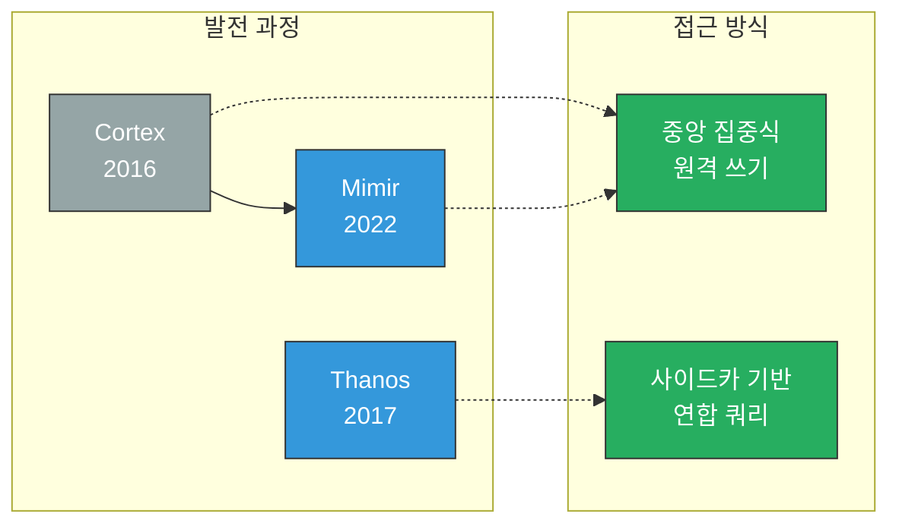
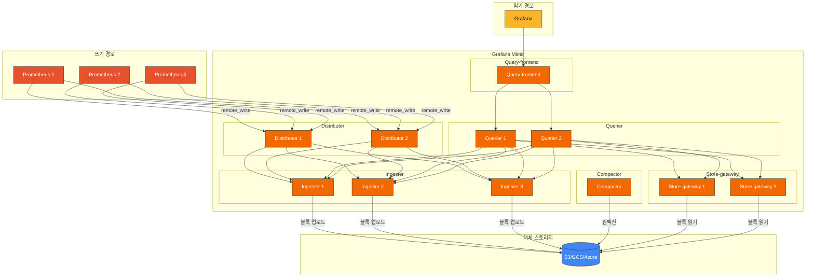
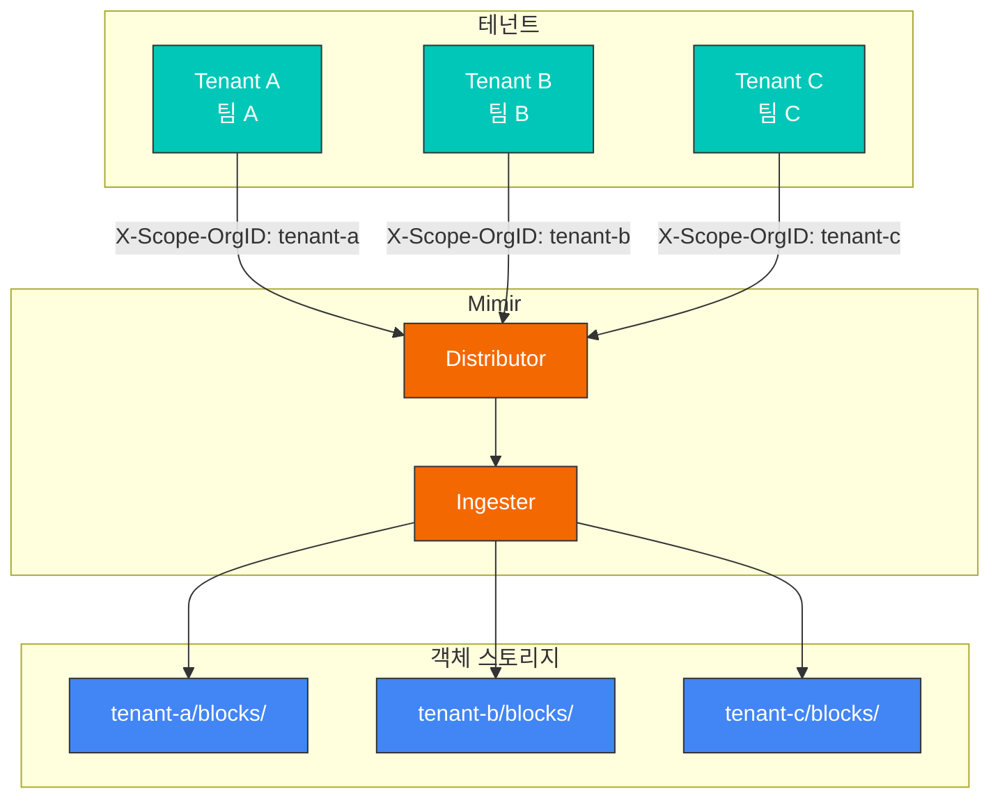
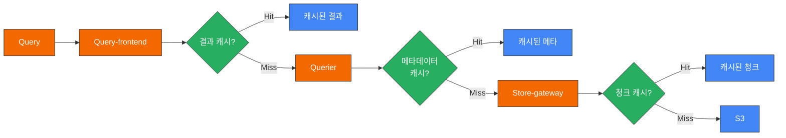
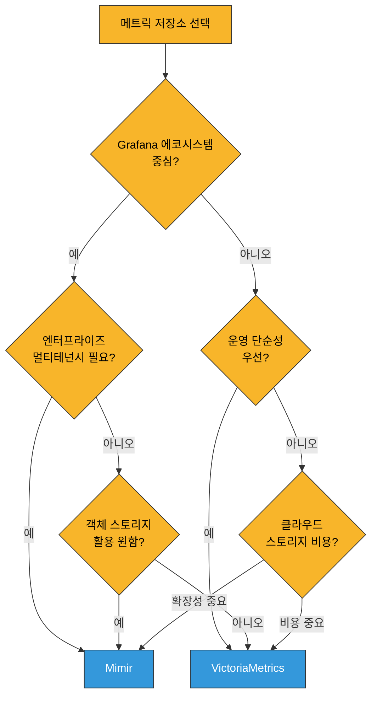

# Grafana Mimir

> **지원 버전**: Mimir 2.x
> **마지막 업데이트**: 2025년 2월

## 목차

- [소개](#소개)
- [아키텍처](#아키텍처)
- [핵심 구성 요소](#핵심-구성-요소)
- [멀티테넌시](#멀티테넌시)
- [Helm 설치](#helm-설치)
- [S3 백엔드 구성](#s3-백엔드-구성)
- [쿼리 및 데이터 보존](#쿼리-및-데이터-보존)
- [VictoriaMetrics와 비교](#victoriametrics와-비교)
- [성능 튜닝](#성능-튜닝)
- [모범 사례](#모범-사례)
- [문제 해결](#문제-해결)

## 소개

Grafana Mimir는 Grafana Labs에서 개발한 오픈소스, 수평 확장 가능한 장기 메트릭 저장소입니다. Prometheus 메트릭을 위한 엔터프라이즈급 저장소로, 멀티테넌시, 고가용성, 그리고 객체 스토리지를 활용한 무제한 확장성을 제공합니다.

### 주요 특징

| 특징 | 설명 |
|------|------|
| **수평 확장** | 수십억 개의 활성 시계열까지 확장 가능 |
| **멀티테넌시** | 네이티브 테넌트 격리 지원 |
| **고가용성** | 컴포넌트별 복제 및 자동 장애 복구 |
| **객체 스토리지** | S3, GCS, Azure Blob 등 지원 |
| **100% PromQL 호환** | 모든 PromQL 쿼리 지원 |
| **장기 보존** | 무제한 데이터 보존 기간 |
| **Grafana 통합** | Grafana와 네이티브 통합 |

### Mimir vs Cortex vs Thanos

Mimir는 Cortex의 후속 프로젝트로, 더 나은 성능과 운영성을 제공합니다:



| 항목 | Mimir | Cortex | Thanos |
|------|-------|--------|--------|
| 아키텍처 | 중앙 집중식 | 중앙 집중식 | 사이드카 기반 |
| 복잡성 | 중간 | 높음 | 중간 |
| 쿼리 성능 | 빠름 | 중간 | 중간 |
| 운영 오버헤드 | 낮음 | 높음 | 중간 |
| Prometheus 수정 | 불필요 | 불필요 | 사이드카 필요 |
| 멀티테넌시 | 네이티브 | 네이티브 | 제한적 |

## 아키텍처

### 전체 아키텍처



### 데이터 흐름

1. **쓰기 경로**:
   - Prometheus가 remote_write로 메트릭 전송
   - Distributor가 테넌트 검증 및 샘플 분배
   - Ingester가 메모리에 저장 후 주기적으로 블록 업로드

2. **읽기 경로**:
   - Query-frontend가 쿼리 분할 및 캐싱
   - Querier가 Ingester(최근 데이터)와 Store-gateway(과거 데이터) 쿼리
   - 결과 병합 후 반환

3. **백그라운드 프로세스**:
   - Compactor가 작은 블록을 큰 블록으로 병합
   - 다운샘플링 및 보존 정책 적용

## 핵심 구성 요소

### Distributor

쓰기 요청의 첫 번째 진입점으로, 테넌트 검증과 샘플 분배를 담당합니다.

```yaml
# distributor 설정
distributor:
  ring:
    kvstore:
      store: memberlist
  instance_limits:
    max_inflight_push_requests: 30000
    max_ingestion_rate: 100000
```

**역할**:
- 테넌트 ID 검증
- 시계열 검증 (레이블, 샘플 값)
- 해시 링 기반 Ingester 분배
- 레플리케이션 팩터에 따른 복제

### Ingester

시계열 데이터를 메모리에 저장하고 주기적으로 객체 스토리지에 업로드합니다.

```yaml
# ingester 설정
ingester:
  ring:
    replication_factor: 3
    kvstore:
      store: memberlist
  instance_limits:
    max_series: 5000000
    max_inflight_push_requests: 30000

blocks_storage:
  tsdb:
    block_ranges_period: [2h]
    retention_period: 24h
    ship_interval: 1m
```

**역할**:
- 시계열 데이터 메모리 저장
- WAL(Write-Ahead Log) 유지
- TSDB 블록 생성 및 업로드
- 최근 데이터 쿼리 처리

### Store-gateway

객체 스토리지의 블록을 캐싱하고 쿼리합니다.

```yaml
# store-gateway 설정
store_gateway:
  sharding_ring:
    replication_factor: 3
    kvstore:
      store: memberlist

blocks_storage:
  bucket_store:
    sync_interval: 15m
    bucket_index:
      enabled: true
    chunks_cache:
      backend: memcached
      memcached:
        addresses: dns+memcached:11211
    metadata_cache:
      backend: memcached
      memcached:
        addresses: dns+memcached:11211
```

**역할**:
- 객체 스토리지 블록 인덱스 캐싱
- 과거 데이터 쿼리 처리
- 블록 메타데이터 및 청크 캐싱

### Compactor

블록 컴팩션과 다운샘플링을 수행합니다.

```yaml
# compactor 설정
compactor:
  data_dir: /data/compactor
  sharding_ring:
    kvstore:
      store: memberlist
  compaction_interval: 1h
  block_ranges: [2h, 12h, 24h]
  deletion_delay: 12h
```

**역할**:
- 작은 블록을 큰 블록으로 병합
- 중복 데이터 제거
- 보존 정책에 따른 데이터 삭제
- 블록 인덱스 최적화

### Querier

Ingester와 Store-gateway에서 데이터를 쿼리하고 병합합니다.

```yaml
# querier 설정
querier:
  max_concurrent: 20
  timeout: 2m
  query_ingesters_within: 13h
```

**역할**:
- PromQL 쿼리 실행
- Ingester/Store-gateway 병렬 쿼리
- 결과 병합 및 중복 제거

### Query-frontend

쿼리 최적화와 캐싱을 담당합니다.

```yaml
# query-frontend 설정
query_frontend:
  align_querier_with_step: true
  cache_results: true
  results_cache:
    backend: memcached
    memcached:
      addresses: dns+memcached:11211
      timeout: 500ms
  split_queries_by_interval: 24h
  max_retries: 5
```

**역할**:
- 대규모 쿼리 분할
- 결과 캐싱
- 쿼리 대기열 관리
- 재시도 처리

## 멀티테넌시

Mimir는 네이티브 멀티테넌시를 지원하여 여러 팀/조직의 메트릭을 격리합니다.

### 테넌트 설정

```yaml
# Prometheus remote_write에 테넌트 헤더 추가
remote_write:
  - url: http://mimir:8080/api/v1/push
    headers:
      X-Scope-OrgID: tenant-1

# 또는 basic auth로 테넌트 식별
remote_write:
  - url: http://mimir:8080/api/v1/push
    basic_auth:
      username: tenant-1
      password: secret
```

### 테넌트별 제한

```yaml
# mimir 설정
limits:
  # 기본 제한 (모든 테넌트)
  ingestion_rate: 100000
  ingestion_burst_size: 200000
  max_global_series_per_user: 5000000
  max_global_series_per_metric: 50000
  max_label_names_per_series: 30
  max_label_value_length: 2048

# 테넌트별 오버라이드
overrides:
  tenant-1:
    ingestion_rate: 200000
    max_global_series_per_user: 10000000
  tenant-2:
    ingestion_rate: 50000
    max_global_series_per_user: 1000000
```

### 테넌트 격리



## Helm 설치

### mimir-distributed 설치

```bash
# Helm 저장소 추가
helm repo add grafana https://grafana.github.io/helm-charts
helm repo update

# 설치
helm install mimir grafana/mimir-distributed \
  --namespace monitoring \
  --create-namespace \
  -f values.yaml
```

### values.yaml

```yaml
# 전역 설정
global:
  # 객체 스토리지 설정
  extraEnvFrom:
    - secretRef:
        name: mimir-s3-credentials

# Distributor
distributor:
  replicas: 3
  resources:
    requests:
      cpu: 100m
      memory: 512Mi
    limits:
      cpu: 1000m
      memory: 2Gi

# Ingester
ingester:
  replicas: 3
  persistentVolume:
    enabled: true
    storageClass: gp3
    size: 50Gi
  resources:
    requests:
      cpu: 500m
      memory: 2Gi
    limits:
      cpu: 2000m
      memory: 8Gi
  zoneAwareReplication:
    enabled: true
    zones:
      - name: zone-a
        nodeSelector:
          topology.kubernetes.io/zone: ap-northeast-2a
      - name: zone-b
        nodeSelector:
          topology.kubernetes.io/zone: ap-northeast-2b
      - name: zone-c
        nodeSelector:
          topology.kubernetes.io/zone: ap-northeast-2c

# Store-gateway
store_gateway:
  replicas: 3
  persistentVolume:
    enabled: true
    storageClass: gp3
    size: 20Gi
  resources:
    requests:
      cpu: 200m
      memory: 1Gi
    limits:
      cpu: 1000m
      memory: 4Gi

# Compactor
compactor:
  replicas: 1
  persistentVolume:
    enabled: true
    storageClass: gp3
    size: 50Gi
  resources:
    requests:
      cpu: 500m
      memory: 2Gi
    limits:
      cpu: 2000m
      memory: 8Gi

# Querier
querier:
  replicas: 3
  resources:
    requests:
      cpu: 200m
      memory: 512Mi
    limits:
      cpu: 1000m
      memory: 2Gi

# Query-frontend
query_frontend:
  replicas: 2
  resources:
    requests:
      cpu: 100m
      memory: 256Mi
    limits:
      cpu: 500m
      memory: 1Gi

# Query-scheduler (선택)
query_scheduler:
  enabled: true
  replicas: 2

# Ruler (선택)
ruler:
  enabled: true
  replicas: 2

# Alertmanager (선택, Mimir 내장)
alertmanager:
  enabled: false

# 캐시 설정
memcached:
  enabled: true

memcached-queries:
  enabled: true
  replicas: 2

memcached-metadata:
  enabled: true
  replicas: 2

# Minio (테스트용, 프로덕션에서는 S3 사용)
minio:
  enabled: false

# 구조화된 설정
mimir:
  structuredConfig:
    common:
      storage:
        backend: s3
        s3:
          endpoint: s3.ap-northeast-2.amazonaws.com
          region: ap-northeast-2
          bucket_name: my-mimir-bucket

    limits:
      ingestion_rate: 100000
      ingestion_burst_size: 200000
      max_global_series_per_user: 5000000
      compactor_blocks_retention_period: 365d

    blocks_storage:
      tsdb:
        dir: /data/tsdb
      bucket_store:
        sync_dir: /data/tsdb-sync

    compactor:
      data_dir: /data/compactor
```

## S3 백엔드 구성

### IRSA 설정

```bash
# OIDC 프로바이더 확인
aws eks describe-cluster --name my-cluster --query "cluster.identity.oidc.issuer" --output text

# IAM 정책 생성
cat <<EOF > mimir-s3-policy.json
{
    "Version": "2012-10-17",
    "Statement": [
        {
            "Effect": "Allow",
            "Action": [
                "s3:PutObject",
                "s3:GetObject",
                "s3:DeleteObject",
                "s3:ListBucket"
            ],
            "Resource": [
                "arn:aws:s3:::my-mimir-bucket",
                "arn:aws:s3:::my-mimir-bucket/*"
            ]
        }
    ]
}
EOF

aws iam create-policy \
  --policy-name MimirS3Policy \
  --policy-document file://mimir-s3-policy.json

# 서비스 계정 생성
eksctl create iamserviceaccount \
  --name mimir \
  --namespace monitoring \
  --cluster my-cluster \
  --attach-policy-arn arn:aws:iam::123456789012:policy/MimirS3Policy \
  --approve
```

### S3 버킷 구성

```yaml
# Mimir S3 설정
mimir:
  structuredConfig:
    common:
      storage:
        backend: s3
        s3:
          endpoint: s3.ap-northeast-2.amazonaws.com
          region: ap-northeast-2
          bucket_name: my-mimir-bucket
          # IRSA 사용 시 access_key, secret_key 불필요

    blocks_storage:
      s3:
        bucket_name: my-mimir-bucket

    ruler_storage:
      s3:
        bucket_name: my-mimir-bucket

    alertmanager_storage:
      s3:
        bucket_name: my-mimir-bucket
```

### S3 버킷 수명 주기 정책

```json
{
  "Rules": [
    {
      "ID": "CleanupIncompleteMultipartUploads",
      "Status": "Enabled",
      "Filter": {},
      "AbortIncompleteMultipartUpload": {
        "DaysAfterInitiation": 7
      }
    },
    {
      "ID": "TransitionToIA",
      "Status": "Enabled",
      "Filter": {
        "Prefix": "blocks/"
      },
      "Transitions": [
        {
          "Days": 90,
          "StorageClass": "STANDARD_IA"
        }
      ]
    }
  ]
}
```

## 쿼리 및 데이터 보존

### 보존 정책 설정

```yaml
mimir:
  structuredConfig:
    limits:
      # 블록 보존 기간
      compactor_blocks_retention_period: 365d

    compactor:
      # 삭제 지연 (실수 복구 시간)
      deletion_delay: 12h
```

### 쿼리 최적화 설정

```yaml
mimir:
  structuredConfig:
    query_frontend:
      # 쿼리 분할
      split_queries_by_interval: 24h
      # 쿼리 스텝 정렬
      align_querier_with_step: true
      # 결과 캐싱
      cache_results: true
      results_cache:
        backend: memcached
        memcached:
          addresses: dns+memcached:11211
          timeout: 500ms

    querier:
      # 동시 쿼리 수
      max_concurrent: 20
      # 쿼리 타임아웃
      timeout: 2m
      # Ingester 쿼리 범위
      query_ingesters_within: 13h

    limits:
      # 쿼리당 최대 샘플
      max_fetched_samples_per_query: 50000000
      # 쿼리 범위 제한
      max_query_length: 30d
      # 최대 쿼리 병렬화
      max_query_parallelism: 32
```

### 쿼리 캐싱 전략



## VictoriaMetrics와 비교

### 상세 비교

| 항목 | Grafana Mimir | VictoriaMetrics |
|------|---------------|-----------------|
| **라이선스** | AGPL v3 | Apache 2.0 |
| **아키텍처** | 마이크로서비스 | 모놀리식/클러스터 |
| **스토리지** | 객체 스토리지 필수 | 로컬 디스크 가능 |
| **운영 복잡성** | 높음 | 낮음-중간 |
| **쿼리 언어** | PromQL | MetricsQL (상위 호환) |
| **멀티테넌시** | 네이티브 | 지원 |
| **압축률** | 좋음 | 매우 좋음 |
| **메모리 효율** | 중간 | 높음 |
| **커뮤니티** | Grafana Labs | 활발한 오픈소스 |
| **상용 지원** | Grafana Cloud | VictoriaMetrics Inc. |

### 선택 기준



**Mimir 선택 시**:
- Grafana Cloud 또는 Grafana 에코시스템 사용
- 엔터프라이즈급 멀티테넌시 필요
- 객체 스토리지 활용 원함
- 복잡한 운영 환경 관리 가능

**VictoriaMetrics 선택 시**:
- 단순한 운영 환경 선호
- 로컬 디스크 기반 저장 선호
- 최대 압축률 및 성능 중요
- 비용 효율성 우선

## 성능 튜닝

### Ingester 튜닝

```yaml
ingester:
  ring:
    replication_factor: 3
  instance_limits:
    max_series: 5000000
    max_inflight_push_requests: 30000

blocks_storage:
  tsdb:
    block_ranges_period: [2h]
    retention_period: 24h
    head_compaction_interval: 15m
    head_compaction_concurrency: 4
    wal_compression_enabled: true
```

### Store-gateway 튜닝

```yaml
blocks_storage:
  bucket_store:
    sync_interval: 15m
    max_chunk_pool_bytes: 2147483648  # 2GB
    chunk_pool_min_bucket_size_bytes: 16384
    chunk_pool_max_bucket_size_bytes: 524288

    index_cache:
      backend: memcached
      memcached:
        addresses: dns+memcached:11211
        max_item_size: 5242880  # 5MB
        timeout: 450ms

    chunks_cache:
      backend: memcached
      memcached:
        addresses: dns+memcached:11211
        max_item_size: 1048576  # 1MB
        timeout: 450ms
```

### 쿼리 튜닝

```yaml
query_frontend:
  parallelize_shardable_queries: true
  split_queries_by_interval: 24h
  max_retries: 5

  query_sharding:
    enabled: true
    total_shards: 16

querier:
  max_concurrent: 20
  timeout: 2m
```

## 모범 사례

### 프로덕션 체크리스트

1. **고가용성**
   - Ingester: 최소 3개, zone-aware 복제
   - Store-gateway: 최소 2개
   - Distributor: 최소 2개
   - Query-frontend: 최소 2개

2. **캐싱**
   - 결과 캐시: memcached
   - 메타데이터 캐시: memcached
   - 청크 캐시: memcached

3. **모니터링**
   ```promql
   # Mimir 자체 메트릭
   cortex_ingester_active_series
   cortex_distributor_received_samples_total
   cortex_querier_request_duration_seconds
   cortex_compactor_runs_completed_total
   ```

4. **알림 규칙**
   ```yaml
   groups:
   - name: mimir
     rules:
     - alert: MimirIngesterUnhealthy
       expr: cortex_ring_members{state="Unhealthy"} > 0
       for: 5m
       labels:
         severity: critical

     - alert: MimirCompactorFailed
       expr: increase(cortex_compactor_runs_failed_total[1h]) > 0
       for: 5m
       labels:
         severity: warning
   ```

### 비용 최적화

```yaml
# S3 스토리지 클래스 활용
blocks_storage:
  s3:
    storage_class: INTELLIGENT_TIERING

# 불필요한 메트릭 필터링
limits:
  drop_labels:
    - pod_template_hash
    - controller_revision_hash

# 다운샘플링 (Enterprise)
compactor:
  downsampling_enabled: true
```

## 문제 해결

### 일반적인 문제

#### 1. Ingester OOM

```bash
# 메모리 사용량 확인
kubectl top pod -l app.kubernetes.io/component=ingester -n monitoring

# 해결: 시계열 제한 조정
ingester:
  instance_limits:
    max_series: 3000000  # 줄이기
```

#### 2. 쿼리 타임아웃

```bash
# 느린 쿼리 확인
curl http://query-frontend:8080/api/v1/status/buildinfo

# 해결: 쿼리 분할 및 병렬화
query_frontend:
  split_queries_by_interval: 12h  # 더 작게
  query_sharding:
    total_shards: 32  # 늘리기
```

#### 3. Compactor 지연

```bash
# Compactor 상태 확인
curl http://compactor:8080/compactor/ring

# 해결: 리소스 증가
compactor:
  resources:
    limits:
      cpu: 4000m
      memory: 16Gi
```

### 디버깅 명령어

```bash
# 컴포넌트 상태 확인
curl http://distributor:8080/distributor/all_user_stats
curl http://ingester:8080/ingester/ring
curl http://store-gateway:8080/store-gateway/ring
curl http://compactor:8080/compactor/ring

# 메트릭 확인
curl http://distributor:8080/metrics | grep cortex_
curl http://ingester:8080/metrics | grep cortex_

# 설정 확인
curl http://distributor:8080/config
```

## 참고 자료

- [Grafana Mimir 공식 문서](https://grafana.com/docs/mimir/latest/)
- [Mimir GitHub](https://github.com/grafana/mimir)
- [mimir-distributed Helm Chart](https://github.com/grafana/mimir/tree/main/operations/helm/charts/mimir-distributed)
- [Mimir 아키텍처](https://grafana.com/docs/mimir/latest/references/architecture/)

## 퀴즈

이 장에서 배운 내용을 테스트하려면 [Grafana Mimir 퀴즈](../../quizzes/observability/metrics/03-mimir-quiz.md)를 풀어보세요.
