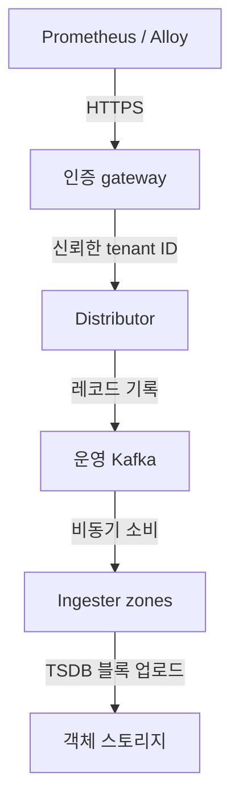
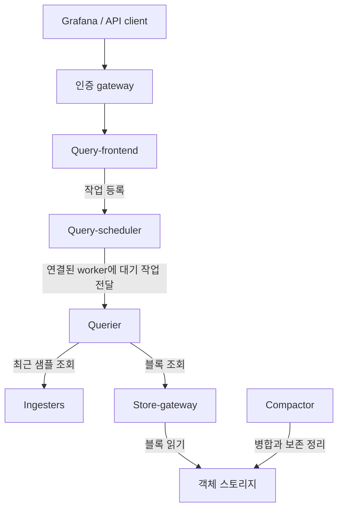

# Grafana Mimir

> **검토 기준**: Mimir 3.2.1 / mimir-distributed Helm chart 6.2.0
> **마지막 업데이트**: 2026년 9월 12일

Grafana Mimir는 테넌트별 수집·조회와 장기 블록 저장을 제공하는 Prometheus 호환 메트릭 백엔드입니다. 처리 용량·쿼리 호환성·운영 비용은 아키텍처와 설정, 실제 워크로드에 따라 달라지며 보존 기간과 확장성이 무제한인 것은 아닙니다.

## Mimir, Cortex, Thanos 비교

Mimir와 Cortex는 기원이 관련된 별도 프로젝트입니다. Mimir를 Cortex의 사용 중단 공지처럼 설명하면 안 됩니다. Thanos도 sidecar 외에 remote write를 받는 Receiver를 제공하므로 모든 구성에 sidecar가 필수인 것은 아닙니다.

| 프로젝트 | 비교할 배포 경로 |
| --- | --- |
| Mimir | 테넌트별 remote write, 객체 스토리지와 현재 Kafka 기반 ingest-storage 아키텍처 |
| Cortex | 별도 Prometheus 호환 멀티테넌트 백엔드. 자체 릴리스와 스토리지 설정 확인 |
| Thanos | Sidecar 연동 또는 Receive 수집, 통합 조회와 객체 스토리지 컴포넌트 |

동일 워크로드에서 장애 복구, 쿼리 동작, 저장·요청·전송 비용과 팀의 운영 역량을 비교하세요. 근거 없는 “빠름/중간” 순위는 벤치마크가 아닙니다. [Cortex](https://cortexmetrics.io/docs/)와 [Thanos Receive](https://thanos.io/tip/components/receive.md/)를 참고하세요.

## 핵심 아키텍처

### Ingest storage와 classic 쓰기 경로

Mimir 3.0부터 ingest storage는 stable이며 권장 아키텍처입니다. Distributor는 샘플을 검증하고 Kafka에 레코드를 기록합니다. 쓰기 성공 응답은 설정된 내구성·복제 조건에 따른 Kafka 쓰기가 성공했다는 뜻이며, 이미 S3에 블록이 올라갔다는 뜻은 아닙니다.



Ingester 하나는 파티션 하나를 소비하고, 다른 zone의 ingester들이 같은 파티션을 소비해 읽기 경로의 가용성을 높일 수 있습니다. 파티션 배정에는 ingester instance ID 끝의 숫자가 사용됩니다. Kafka 파티션 수와 보존은 계획한 ingester ordinal, backlog와 복구 시간을 감당해야 합니다. Broker 복제·ISR·영속 저장·장애 복구는 별도 구성입니다.

Ingester는 메모리 TSDB와 로컬 WAL을 유지하고 주기적으로 블록을 만든 뒤 업로드합니다(기본 블록 범위 2시간). 로컬 TSDB 보존은 querier/store-gateway가 새 블록을 발견할 시간을 주는 설정이며 장기 보존과 다릅니다. 영속 디스크는 복구에 도움이 되지만 WAL·객체 스토리지만으로 모든 장애나 Kafka 보존 기간을 넘은 backlog 복구가 보장되지는 않습니다.

**Classic** 아키텍처는 distributor가 ingester quorum에 직접 씁니다. 이때의 ingester replication factor는 Kafka 쓰기 복제 설정이 아닙니다. 기존 배포는 classic을 유지할 수 있으며 바이너리와 Helm의 기본값도 다릅니다. Chart 6.x는 ingest storage를 켜지만 검토한 3.2.1 바이너리의 `ingest_storage.enabled` 기본값은 false입니다. 운영 배포를 플래그 하나로 바꾸지 말고 [아키텍처](https://grafana.com/docs/mimir/latest/get-started/about-grafana-mimir-architecture/about-ingest-storage-architecture/)와 [이전 절차](https://grafana.com/docs/mimir/latest/set-up/migrate/migrate-ingest-storage/)를 확인하세요.

### 쿼리 경로와 컴포넌트



위 그림은 요청·작업 관계를 나타내며 결과는 frontend를 통해 반환됩니다. Frontend는 쿼리를 분할·shard하고 결과 캐시를 사용하며 응답을 합칩니다. Scheduler는 querier가 처리할 작업을 대기시킵니다. Querier는 ingester와 store-gateway에서 필요한 데이터를 조회합니다. 블록 인계 중에는 데이터 범위가 겹칠 수 있어 최근/과거의 완전히 분리된 두 구간으로 해석하면 안 됩니다.

Kafka 소비는 비동기이므로 기본 읽기는 read-after-write를 보장하지 않습니다. `X-Read-Consistency: strong`을 요청하면 ingester가 전달된 파티션 offset까지 기다리지만 timeout과 지연 비용이 있습니다. 모든 broker·ingester 장애에서 성공을 보장하는 옵션은 아닙니다.

| 컴포넌트 | 역할 |
| --- | --- |
| Distributor | 쓰기 검증·제한 후 Kafka 전송. Classic에서는 ingester 전송 |
| Ingester | Kafka 파티션 소비, 로컬 TSDB/WAL 유지, 최근 샘플 조회와 블록 업로드 |
| Store-gateway | 객체 스토리지·로컬 index header·설정한 캐시로 블록 데이터 조회 |
| Compactor | 블록 병합, 복제된 샘플 중복 제거와 보존 조건에 따른 정리 |
| Query-frontend / scheduler / querier | 쿼리 계획·캐시·대기열과 실행 |
| Ruler / Alertmanager | 선택적 규칙 평가·알림 처리. 저장소·identity·HA는 별도 구성 |

Compaction에 `compactor.downsampling_enabled`라는 설정을 만들어 사용하면 안 됩니다. Recording rule은 파생 시계열을 만들지만 원시 시계열을 자동 다운샘플링하거나 제거하지 않습니다.

## 멀티테넌시와 인증

`X-Scope-OrgID`는 테넌트 식별자이며 **인증 수단이 아닙니다**. Gateway에서 호출자를 인증하고 허용된 테넌트를 결정한 뒤, 신뢰하지 않는 tenant header를 덮어쓰고 허용된 요청만 전달해야 합니다. 백엔드 서비스 직접 접근도 제한하세요. Basic-auth username이 테넌트 ID가 되려면 신뢰한 proxy가 그 매핑을 명시적으로 구현해야 합니다. Chart의 기본 라우팅 gateway만으로 이 정책이 완성되지는 않습니다.

다음 Prometheus 예제는 해당 HTTPS gateway와 마운트된 credential 파일이 준비되어 있다고 가정합니다. Gateway가 인증된 identity에서 tenant를 정하므로 client가 tenant header를 고르지 않습니다.

```yaml
remote_write:
  - url: https://metrics.example.internal/api/v1/push
    authorization:
      type: Bearer
      credentials_file: /etc/prometheus/credentials/mimir-token
```

직접 tenant header를 지정하는 경로는 별도로 신뢰가 확보된 테스트 경로로 제한해야 합니다. 테넌트별 객체 key와 limits만으로 무인증 호출자의 다른 tenant 선택을 막을 수는 없습니다. 멀티테넌시를 끄면 공통 tenant로 매핑되며 보호 기능이 추가되는 것은 아닙니다. [인증과 권한](https://grafana.com/docs/mimir/latest/manage/secure/authentication-and-authorization/)을 참고하세요.

### 테넌트 제한과 runtime configuration

주 설정의 `limits`는 기본값입니다. 테넌트별 `overrides`는 주 Mimir 설정의 최상위가 아닌 별도 runtime 설정 파일에 둡니다. 이 Chart에서는 아래와 같이 최상위 `runtimeConfig.overrides`를 사용합니다. 지원되는 limits는 프로세스 재시작 없이 변경할 수 있지만 모든 시작 설정이 reload 가능해지는 것은 아닙니다. [Runtime 설정](https://grafana.com/docs/mimir/latest/configure/about-runtime-configuration/)의 접근과 실제 reload 결과를 검증하세요.

## EKS의 Helm 구성

Chart **6.2.0**은 appVersion **3.2.0**, Kubernetes `^1.32.0-0`을 선언합니다. 이 예제는 2026년 9월 10일 공개된 **3.2.1** 패치 이미지를 명시합니다. Chart의 제약을 EKS 지원·수명 주기 표로 간주하지 마세요. 선택한 EKS 버전·CSI driver·admission 정책·rollout operator 의존성을 확인해야 하며 weekly 개발 Chart와 stable 릴리스도 구분해야 합니다.

### 의존성 준비

아래는 **검토를 위한 렌더링 가능한 설정**이며 운영 배포를 검증한 결과가 아닙니다. 적용 전에 다음을 준비해야 합니다.

- 예제의 client 인증서 방식으로 인증할 운영 Kafka cluster/topic, 적절한 broker 복제·보존과 producer/consumer 권한. 주소와 포트를 실제 bootstrap endpoint로 바꾸세요. 다른 SASL/MSK 경로는 그 방식에 맞는 Mimir 옵션과 identity가 필요합니다.
- `monitoring`의 `mimir-kafka-client-tls` Secret과 `ca.crt`, `tls.crt`, `tls.key` 파일. 공통 TLS 설정을 읽는 모든 Mimir 프로세스가 필요로 하며 Kafka를 직접 소비하지 않는 컴포넌트도 포함됩니다.
- 아래에 설명한 기존 S3 버킷 세 개와 권한이 연결된 `mimir-storage` ServiceAccount. Mimir는 이 버킷을 생성하지 않습니다.
- 실제 AZ label, 적합한 기존 StorageClass, 배치 가능한 노드와 PVC 용량. `gp3`는 예시 이름입니다. EKS Auto Mode와 EBS CSI add-on은 provisioner가 다르므로 클러스터의 storage owner에 맞는 class를 선택하세요.
- Distributor와 query-frontend로 연결할 인증된 외부 라우팅. 예제는 무인증 Chart routing gateway를 끄며 다른 공개 ingress를 만들지 않습니다.

Rollout operator는 활성화되어 있습니다. 설치·업그레이드 전에 CRD·webhook·권한과 owner를 검토해야 하며 아래 `--include-crds`는 이를 로컬 출력에 포함합니다. 기존 배포에서 zone-aware rollout 동작을 확인하지 않고 operator를 끄지 마세요. 세 zone 구성도 실제 node selector가 필요하며 논리적 zone 이름만으로 AZ 중복성이 생기지 않습니다.

### Values와 로컬 렌더링

다음을 `mimir-values.yaml`로 저장합니다. YAML anchor는 인증서 마운트와 AZ 정의를 재사용합니다. Replica·볼륨·수집률·쿼리 제한은 워크로드 측정으로 조정할 예시입니다. 렌더링 결과는 **zone마다 ingester와 store-gateway 각 1개**, 총 각각 3개입니다. Compactor 하나를 포함한 전체 예제를 포괄적인 HA 보장으로 해석하면 안 됩니다.

```yaml
image:
  tag: 3.2.1
serviceAccount:
  create: false
  name: mimir-storage
minio:
  enabled: false
kafka:
  enabled: false
gateway:
  enabled: false
distributor:
  replicas: 2
  extraVolumes: &kafka-volumes
  - name: kafka-client-tls
    secret:
      secretName: mimir-kafka-client-tls
  extraVolumeMounts: &kafka-mounts
  - name: kafka-client-tls
    mountPath: /etc/mimir/kafka-tls
    readOnly: true
ingester:
  replicas: 3
  persistentVolume:
    enabled: true
    storageClass: gp3
    size: 50Gi
  zoneAwareReplication:
    enabled: true
    topologyKey: kubernetes.io/hostname
    zones: &az-zones
    - name: zone-a
      nodeSelector:
        topology.kubernetes.io/zone: ap-northeast-2a
    - name: zone-b
      nodeSelector:
        topology.kubernetes.io/zone: ap-northeast-2b
    - name: zone-c
      nodeSelector:
        topology.kubernetes.io/zone: ap-northeast-2c
  extraVolumes: *kafka-volumes
  extraVolumeMounts: *kafka-mounts
store_gateway:
  replicas: 3
  persistentVolume:
    enabled: true
    storageClass: gp3
    size: 20Gi
  zoneAwareReplication:
    enabled: true
    topologyKey: kubernetes.io/hostname
    zones: *az-zones
  extraVolumes: *kafka-volumes
  extraVolumeMounts: *kafka-mounts
compactor:
  replicas: 1
  persistentVolume:
    enabled: true
    storageClass: gp3
    size: 50Gi
  extraVolumes: *kafka-volumes
  extraVolumeMounts: *kafka-mounts
querier:
  replicas: 2
  extraVolumes: *kafka-volumes
  extraVolumeMounts: *kafka-mounts
query_frontend:
  replicas: 2
  extraVolumes: *kafka-volumes
  extraVolumeMounts: *kafka-mounts
query_scheduler:
  enabled: true
  replicas: 2
  extraVolumes: *kafka-volumes
  extraVolumeMounts: *kafka-mounts
ruler:
  enabled: false
alertmanager:
  enabled: false
rollout_operator:
  enabled: true
chunks-cache:
  enabled: true
index-cache:
  enabled: true
metadata-cache:
  enabled: true
results-cache:
  enabled: true
mimir:
  structuredConfig:
    common:
      storage:
        backend: s3
        s3:
          endpoint: s3.ap-northeast-2.amazonaws.com
          region: ap-northeast-2
    blocks_storage:
      s3:
        bucket_name: example-mimir-blocks
    ruler_storage:
      s3:
        bucket_name: example-mimir-rules
    alertmanager_storage:
      s3:
        bucket_name: example-mimir-alerts
    ingest_storage:
      enabled: true
      kafka:
        address: kafka.metrics.example.internal:9093
        topic: mimir-ingest
        auto_create_topic_enabled: false
        tls_enabled: true
        tls_ca_path: /etc/mimir/kafka-tls/ca.crt
        tls_cert_path: /etc/mimir/kafka-tls/tls.crt
        tls_key_path: /etc/mimir/kafka-tls/tls.key
    frontend:
      split_queries_by_interval: 24h
    querier:
      max_concurrent: 20
      max_samples: 50000000
      timeout: 2m
    limits:
      ingestion_rate: 100000
      ingestion_burst_size: 200000
      max_global_series_per_user: 5000000
      compactor_blocks_retention_period: 365d
      max_total_query_length: 30d
      max_query_parallelism: 32
      query_sharding_total_shards: 16
      align_queries_with_step: false
runtimeConfig:
  overrides:
    tenant-1:
      ingestion_rate: 50000
      ingestion_burst_size: 100000
      max_global_series_per_user: 1000000
overrides_exporter:
  extraVolumes: *kafka-volumes
  extraVolumeMounts: *kafka-mounts
```

```bash
helm repo add grafana https://grafana.github.io/helm-charts
helm repo update grafana
helm template mimir grafana/mimir-distributed \
  --version 6.2.0 --namespace monitoring --include-crds \
  --kube-version 1.36.2 -f mimir-values.yaml > mimir-rendered.yaml
```

`--kube-version`은 오프라인 렌더링 조건이며 클러스터 업그레이드나 실환경 호환성 검사가 아닙니다. 생성된 Service·selector·PVC·security context·CRD·workload 설정을 검토한 뒤 적용해야 합니다. Chart의 단일 Kafka와 MinIO 기본값은 데모용입니다. 각각의 `enabled: false`는 내장 배포를 끌 뿐 Mimir의 ingest storage나 S3 백엔드를 끄는 설정은 아닙니다.

이 예제의 Ruler와 Alertmanager는 비활성 상태입니다. 활성화하려면 각 replica·스토리지·보안과 공통 설정의 인증서 마운트를 준비해야 합니다. [운영 구성 문서](https://grafana.com/docs/helm-charts/mimir-distributed/latest/run-production-environment-with-helm/)를 참고하세요.

### 기존 classic 설치

Chart 5.x→6.x에서는 gateway와 rollout operator 요구도 달라집니다. Classic을 유지하려면 ingest storage를 끄고 ingester Push RPC를 허용해야 합니다. 아래는 해당 선택을 설명하는 조각이며 완전한 이전 절차가 아닙니다. 새 Kafka 설치에 무조건 합치지 마세요.

```yaml
kafka:
  enabled: false
mimir:
  structuredConfig:
    ingest_storage:
      enabled: false
    ingester:
      push_grpc_method_enabled: true
```

[5.x→6.x 이전 문서](https://grafana.com/docs/helm-charts/mimir-distributed/latest/migration-guides/migrate-helm-chart-5.x-to-6.0/)와 검토한 values diff를 사용하세요. Chart 업그레이드만으로 데이터 backfill·Kafka 내구성·가용성이 확보되거나 기존 webhook을 안전하게 삭제할 수 있다고 가정하면 안 됩니다.

## S3와 workload identity

### 버킷과 IRSA

예제는 블록·규칙·Alertmanager 상태에 별도 버킷을 사용합니다. Blocks는 ruler 또는 Alertmanager와 **같은 버킷 및 storage prefix**를 사용하면 안 됩니다. 해당 storage target이 충돌을 검사하므로 distributor만 시작해 보는 것으로 모든 저장 역할을 검증할 수는 없습니다. 지원되는 별도 `storage_prefix`를 의도적으로 지정하는 방법도 있습니다. 임의의 `blocks/` lifecycle filter가 실제 저장 구조와 일치한다고 가정하지 마세요.

EKS cluster의 OIDC provider와 IRSA role을 준비하고, trust policy의 `sub`를 `system:serviceaccount:monitoring:mimir-storage`, `aud`를 `sts.amazonaws.com`으로 제한합니다. Chart의 `serviceAccount.create: false`, `name: mimir-storage`가 준비한 계정과 일치해야 합니다. Role annotation과 projected token 전달을 확인하세요. Kubernetes RBAC가 S3 권한을 부여하는 것은 아닙니다.

예시 버킷 세 개의 범위를 제한한 S3 정책 형식은 다음과 같습니다. 버킷 이름을 바꾸고 필요한 KMS·key policy 권한은 따로 검토하세요.

```json
{
  "Version": "2012-10-17",
  "Statement": [
    {
      "Effect": "Allow",
      "Action": ["s3:ListBucket"],
      "Resource": ["arn:aws:s3:::example-mimir-blocks", "arn:aws:s3:::example-mimir-rules", "arn:aws:s3:::example-mimir-alerts"]
    },
    {
      "Effect": "Allow",
      "Action": ["s3:GetObject", "s3:PutObject", "s3:DeleteObject"],
      "Resource": ["arn:aws:s3:::example-mimir-blocks/*", "arn:aws:s3:::example-mimir-rules/*", "arn:aws:s3:::example-mimir-alerts/*"]
    }
  ]
}
```

검토한 S3 provider chain은 IRSA web-identity token 파일과 role ARN을 처리합니다. Values에 고정 access key·secret을 넣거나 `extraEnvFrom`으로 주입하지 않습니다. 실제 STS/S3 접근을 검증하고 의도하지 않은 node credential fallback을 방지해야 합니다. 선택한 credential provider와 설치 조건을 확인하지 않고 IRSA를 EKS Pod Identity와 동일하게 취급하지 마세요. S3 Block Public Access를 유지하고 암호화·versioning·Object Lock·백업 요구도 검토하세요.

[Mimir 객체 스토리지](https://grafana.com/docs/mimir/latest/configure/configure-object-storage-backend/)와 [EKS ServiceAccount IAM role](https://docs.aws.amazon.com/eks/latest/userguide/associate-service-account-role.html)을 참고하세요.

### Lifecycle과 보존

`limits.compactor_blocks_retention_period: 365d`는 보존 정책을 설정합니다. 정리는 비동기·블록 단위이며 scan·mark·delete 일정, 블록의 시간 범위와 `compactor.deletion_delay`가 실제 제거 시점에 영향을 줍니다. 정확한 삭제 시한이나 자동 규정 준수 기능이 아닙니다. 삭제 지연은 backup/undo 보장이 아니고 현재 객체 삭제가 noncurrent version·백업 전체 삭제를 뜻하지도 않습니다.

Mimir가 사용하는 블록을 먼저 지워버리는 S3 expiration 정책을 별도로 추가하면 안 됩니다. 미완료 multipart upload 정리는 별도의 버킷 관리 선택지입니다. 스토리지 class 전환은 객체 크기·최소 보존 기간·요청/조회 비용과 compaction 재작성을 분석해야 하며 “90일 후 STANDARD_IA”가 모든 환경에 맞지는 않습니다. [S3 전환 조건](https://docs.aws.amazon.com/AmazonS3/latest/userguide/lifecycle-transition-general-considerations.html)을 참고하세요.

## 쿼리, 캐시와 성능

### 현재 설정 키

Mimir 주 설정의 frontend는 `frontend`, Helm workload 설정은 `query_frontend`로 서로 다른 영역입니다. 현재 예제는 `querier.max_samples`, `limits.max_total_query_length`, `limits.query_sharding_total_shards`, `limits.align_queries_with_step`를 사용합니다. 이전 `query_frontend.query_sharding.enabled/total_shards`, `align_querier_with_step`, `max_fetched_samples_per_query`를 그대로 대입할 수 없습니다.

요청한 timestamp·PromQL conformance를 유지하려면 step alignment를 비활성으로 유지하세요. Step 정렬은 cache 재사용을 늘릴 수 있지만 의미도 바꿉니다. Query parallelism·shard·samples·timeout 증가가 병목을 해결하기보다 메모리·하위 시스템 부하를 늘릴 수도 있습니다.

### 캐시의 역할

| Chart cache | 설정의 역할 |
| --- | --- |
| `results-cache` | Frontend 쿼리 결과. 부분 적중이면 나머지 작업이 필요 |
| `index-cache` | 블록 index/postings/series 정보 |
| `chunks-cache` | 블록 chunk 데이터 |
| `metadata-cache` | 객체 스토리지 metadata 작업 |

Metadata·index cache 적중만으로 완전한 쿼리 답이 만들어지지는 않습니다. 세 단계 중 적중한 곳에서 즉시 답을 반환하는 단순 cascade가 아닙니다. 로컬 index-header 파일과 TSDB/WAL 디스크도 Memcached와 다릅니다. Hit rate·지연·메모리/item 크기·eviction·cold cache를 측정한 뒤 조정하세요. [Query frontend](https://grafana.com/docs/mimir/latest/references/architecture/components/query-frontend/)와 [store-gateway](https://grafana.com/docs/mimir/latest/references/architecture/components/store-gateway/)를 참고하세요.

### 용량과 가용성

수집 samples/series/cardinality, ingester memory/WAL/disk, Kafka backlog, frontend queue, querier memory/CPU, store-gateway cache miss와 compactor 진행을 관측하세요. Chart의 small/large 계획은 출발점이지 처리량 보장이 아닙니다. Replica·동시성을 늘리기 전에 query 형태와 tenant limits를 확인해야 합니다.

내구성과 가용성은 Kafka 쓰기 복제, ingester partition/zone coverage, store-gateway 배치, 실제 schedulable capacity, 객체 스토리지, frontend/scheduler replica와 rollout 동작을 각각 검토해야 합니다. Cache 복제는 데이터 내구성이 아닙니다. Rate/cardinality limit은 데이터를 거절할 수 있으며 거절된 샘플을 자동 보관하거나 집계하지 않습니다.

수집량을 줄일 때는 데이터에 맞는 collector relabeling이나 recording rule을 검토하세요. Mimir는 `limits.drop_labels`와 해당 테넌트별 runtime override도 지원합니다. 이 설정은 수집 label을 바꾸며 임의의 cardinality를 안전하게 줄여주는 것은 아닙니다. Identity label을 제거하면 다른 시계열이 합쳐질 수 있으므로 충돌과 query/alert 의미를 먼저 테스트해야 합니다.

## VictoriaMetrics와 비교

| 항목 | Mimir | VictoriaMetrics |
| --- | --- | --- |
| 오픈소스 라이선스 | AGPL-3.0 | Apache-2.0. Enterprise 기능 구분 |
| 배포 | 바이너리 target 선택. 이 예제는 microservices | Single-node와 cluster |
| 저장 | 운영 블록은 객체 스토리지. 로컬 개발용 filesystem backend도 존재 | 검토한 single/cluster는 로컬 storage path, backup은 별도 경로 |
| 쿼리 | 기능·설정별 제한이 있는 PromQL 호환 API | 의미 차이가 문서화된 MetricsQL |
| 테넌트 | Tenant ID와 강제되는 인증·권한 계층 | Tenant/account 경로와 강제되는 인증·권한 계층 |
| 비용·성능 | 수집·조회·Kafka·cache·object 요청·운영을 측정 | 동일 workload·복제·디스크·운영을 측정 |

Grafana 연동이나 멀티테넌시 요구만으로 항상 더 좋은 제품을 고를 수는 없습니다. 이전·query parity·보존·장애 복구·운영 역량·총비용을 검증하세요. [검토한 VictoriaMetrics 가이드](02-victoriametrics.md)를 참고하세요.

## 모니터링과 문제 해결

버전에 맞는 Mimir mixin/integration으로 배포를 관측하세요. 현재 `cortex_ingester_active_series`, `cortex_distributor_received_samples_total`, `cortex_ingest_storage_reader_last_consumed_offset`, compactor 진행 메트릭을 확인하되 counter/offset 하나를 lag·처리량·SLO로 해석하면 안 됩니다. 지원이 끝난 Grafana Agent 기반 meta-monitoring을 신규 기본 경로로 사용하지 마세요. 현재 문서는 Alloy/Kubernetes Monitoring 연동을 안내합니다.

다음 compactor 알림은 고정 버전 mixin에 있는 메트릭을 사용한 예시입니다. 시간 구간 안의 실패 횟수이지 반드시 연속 시도 실패 횟수는 아닙니다. 실제 scrape label에 집계 범위를 맞추고 missing target 감시를 별도로 준비하세요.

```yaml
groups:
  - name: mimir-example
    rules:
      - alert: MimirCompactorRepeatedFailures
        expr: sum by (cluster, namespace, pod) (increase(cortex_compactor_runs_failed_total{reason!="shutdown"}[2h])) >= 2
        for: 5m
        labels:
          severity: warning
```

예제 release/namespace에서 권한이 있는 운영자는 localhost port-forward로 query-frontend를 점검할 수 있습니다.

```bash
kubectl -n monitoring get pods
kubectl -n monitoring get pvc
kubectl -n monitoring port-forward service/mimir-query-frontend 18080:8080
```

다른 터미널에서:

```bash
curl --fail --silent --show-error http://127.0.0.1:18080/ready
curl --fail --silent --show-error http://127.0.0.1:18080/api/v1/status/buildinfo
```

`buildinfo`는 느린 쿼리가 아닌 build metadata를 반환합니다. Timeout에는 queue·query 통계/로그와 범위를 제한한 query sample을 조사하세요. Ingester OOM은 실제 series/cardinality와 buffer를 확인한 뒤 instance limit을 조정하고, compactor 지연은 객체 권한·디스크·실패·backlog를 먼저 확인하세요. `/config`, `/runtime_config`, tenant 통계, ring·metrics endpoint를 보호하고 공개 진단 경로로 노출하지 마세요. Ring endpoint는 컴포넌트마다 다르며 Kafka에서는 partition ring도 중요합니다.

## 검증과 참고 자료

예제는 Chart 6.2.0으로 렌더링하고 Mimir 3.2.1의 실제 배포 target 8종에 대해 `-print.config`로 파싱·검증했습니다. 이 옵션은 서비스 초기화 전에 종료합니다. 준비할 Secret 볼륨 대신 테스트용 인증서의 로컬 경로를 대입했습니다. 설정 구조·validation 동작 검증이며 Kafka/mTLS/IRSA/S3 연결·PVC 생성·runtime reload·HA·부하 성능 검증은 아닙니다. 클라우드 리소스는 생성하지 않았습니다.

- [설정 reference](https://grafana.com/docs/mimir/latest/configure/configuration-parameters/)
- [Mimir Helm chart](https://grafana.com/docs/helm-charts/mimir-distributed/latest/)
- [Mimir 배포 모드](https://grafana.com/docs/mimir/latest/references/architecture/deployment-modes/)
- [HTTP API reference](https://grafana.com/docs/mimir/latest/references/http-api/)

## 퀴즈

[Grafana Mimir 퀴즈](../../quizzes/observability/metrics/03-mimir-quiz.md)로 내용을 확인하세요.
