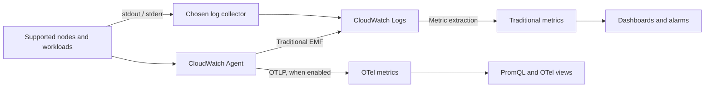

# CloudWatch Metrics

> 검토: 2026-09-13. Helm 예제: amazon-cloudwatch-observability 6.6.0.
> 아래 4월·7월 발표는 실제 과거 발표일을 유지합니다.

## 소개

CloudWatch는 저장·조회·대시보드·알람 backend를 관리합니다. 팀은 collector,
workload identity, network, cardinality, retention과 장애 대응 책임을 여전히
설정해야 합니다. 관리형 backend가 운영 책임 전체를 없애지는 않습니다.

| 항목 | CloudWatch | 자체 운영 Prometheus / VictoriaMetrics |
| --- | --- | --- |
| Backend | AWS 관리형; 기능·Region별 가용성 확인 | 용량·저장소·업그레이드·복구 운영 |
| 수집 | AWS 서비스 지표와 설정한 agent/SDK/OTLP | Exporter·agent·scraping·remote write |
| 조회 | Metric Math, Metrics Insights; OTel 지표는 PromQL | PromQL / MetricsQL |
| 비용 | Metric/observation 또는 OTLP 수집, 로그·조회·알람 | Compute/storage/network와 운영 비용 |
| 플랫폼 | AWS 및 지원되는 hybrid/multicloud 수집 | Cloud-neutral 배포 선택 |
| 보존 | 지표 모델·해상도별 정책; 로그 보존은 별도 | 저장소·보존 정책을 직접 설정 |

## Container Insights: 지표 모델 선택

CloudWatch Observability EKS add-on과 Helm chart는 Operator와 수집 구성요소를
설정합니다. 기존 Container Insights는 performance log event와 추출된 CloudWatch
지표를 사용하고, OTel 기반 경로는 OpenTelemetry 지표를 보내며 PromQL로 조회할 수
있습니다. 이름·dimension·과금 모델이 서로 다릅니다.

| 기존 `ContainerInsights` 지표 | 의미와 dimension 예시 |
| --- | --- |
| `cluster_node_count` | Node 수; `ClusterName` |
| `cluster_failed_node_count` | 실패 조건이 있는 node 수; `ClusterName`. `NotReady`만 의미하지 않음 |
| `node_cpu_utilization`, `node_memory_utilization` | Node 사용률; `ClusterName` 또는 `NodeName,ClusterName,InstanceId` |
| `node_network_total_bytes` | **bytes/second** 처리율; 누적 byte counter가 아님 |
| `namespace_number_of_running_pods` | Pod 수; `Namespace,ClusterName` |
| `pod_cpu_utilization`, `pod_memory_utilization` | **Node** 한도 대비 Pod 사용량; Pod limit 대비 비율은 문서화된 `_over_pod_limit` 지표 확인 |
| `pod_number_of_container_restarts` | Pod의 총 container 재시작 수; `PodName,Namespace,ClusterName` |

공식 목록에는 `cluster_cpu_utilization`과 `cluster_memory_utilization`이 없습니다.
Node 지표에 `ClusterName`만 지정한다고 capacity-weighted cluster 사용률이 되는
것은 아닙니다. 실제 발행된 dimension set을 정확히 맞춥니다. 일부 값은 performance
log의 field일 뿐이며, enhanced 지표에는 `FullPodName` 같은 추가 set도 있습니다.
Log field에서 지표 이름을 임의로 만들지 않습니다. Network receive/transmit도
rate이므로 누적 byte counter처럼 `RATE()`를 다시 적용하지 않습니다.

다음 그림은 기존 지표 추출·선택적 OTLP 지표·application log 경로를 구분합니다.



### 설치와 플랫폼 범위

같은 구성요소는 EKS managed add-on 또는 Helm 중 소유권이 정해진 방식으로 운영합니다.
전환 전에 기존 자원 소유권을 확인하고 두 방식을 무작정 중복 설치하지 않습니다.
Managed add-on은 실제 Kubernetes 버전·architecture·compute type·Region에 맞는
호환성을 조회합니다. Helm 버전은 EKS의 `v…-eksbuild.…` 버전과 다릅니다.

```bash
# Read-only discovery. Use the intended account, Region and cluster.
export AWS_REGION=ap-northeast-2
export CLUSTER_NAME=my-cluster
K8S_VERSION=$(aws eks describe-cluster --name "$CLUSTER_NAME" \
  --region "$AWS_REGION" --query 'cluster.version' --output text)
aws eks describe-addon-versions \
  --addon-name amazon-cloudwatch-observability \
  --kubernetes-version "$K8S_VERSION" --region "$AWS_REGION" \
  --query 'addons[0].addonVersions[].{version:addonVersion,architectures:architecture,computeTypes:computeTypes,compatibilities:compatibilities}'

# Set ADDON_VERSION to the exact compatible version selected above.
: "${ADDON_VERSION:?Select a compatible EKS add-on version}"
aws eks describe-addon-configuration \
  --addon-name amazon-cloudwatch-observability \
  --addon-version "$ADDON_VERSION" --region "$AWS_REGION" \
  --query configurationSchema --output text > addon-schema.json
```

Add-on의 문서화된 IAM 권한과 workload identity를 별도로 준비합니다.
지원 버전에서는 EKS Pod Identity가 권장되며 Agent와 실제 namespace/service account의
association이 필요합니다. IRSA는 cluster OIDC provider·trust policy·SA annotation을
준비하는 대안입니다. 로컬 `aws sts get-caller-identity`는 그 caller만 확인하며,
collector 내부에서 선택된 credential을 증명하지 않습니다.

Add-on의 Container Insights는 Linux/Windows worker node를 지원하며 Windows는
1.5.0 이상이 필요합니다. EKS Windows의 Application Signals는 지원되지 않습니다.
Fargate에는 이 host-mounted DaemonSet을 배포할 수 없으므로 문서화된 별도 수집
경로를 사용합니다. Auto Mode·혼합 cluster는 선택한 add-on의 compute type 지원과
수집 요구사항을 확인합니다. 모든 플랫폼에서 같은 host 지표가 수집된다고 보장하지
않습니다. Workload·collector·AWS endpoint 사이 network 경로와 RBAC도 필요합니다.

다음 Helm 예제는 **Linux EC2 worker node** 대상입니다. Chart 6.6.0의 기본 agent
image는 `1.300072.0b1766`이며 공개 GitHub agent release `v1.300071.0`과 배포 채널이
다릅니다. Chart 버전을 고정하고 해당 기본 image를 유지합니다. 이번 검증은
chart 렌더링이며 실제 EKS 배포는 아닙니다.

```yaml
# cloudwatch-values.yaml: reviewed Helm chart 6.6.0, Linux EC2 example
clusterName: my-cluster
region: ap-northeast-2
containerInsights:
  enabled: true
containerLogs:
  enabled: true
applicationSignals:
  enabled: false
otelContainerInsights:
  enabled: false
  logs:
    enabled: false
```

이 chart의 CloudWatch agent와 Fluent Bit는 release namespace의 `cloudwatch-agent`
service account를 사용합니다. 수집 전에 해당 SA의 Pod Identity association을 준비합니다.
IRSA를 선택하면 실제 SA의 annotation을 별도로 설정·관리합니다. Chart 최상위
`roleArn`은 **EKS IRSA 설정의 지름길이 아닙니다**.
생성된 CRD·ClusterRole·Secret·host mount·node selector를 검토합니다.
Operator는 `AmazonCloudWatchAgent` CR을 보고 agent workload를 만들므로
`helm template`만으로 그 reconciliation까지 실행되지는 않습니다.

Chart 6.6.0은 이 Linux 예제에서도 Windows node를 선택하는 agent CR 두 개를
추가로 렌더링합니다. Linux의 `applicationSignals.enabled: false` 설정이 그 Windows
CR을 제거하지는 않습니다. 이 예제는 Linux-only node를 가정하므로 혼합 cluster에
사용하기 전에 생성되는 Windows 설정을 별도로 검토합니다.

```bash
helm repo add aws-observability https://aws-observability.github.io/helm-charts
helm repo update aws-observability
helm template cloudwatch aws-observability/amazon-cloudwatch-observability \
  --version 6.6.0 --namespace amazon-cloudwatch \
  --include-crds --values cloudwatch-values.yaml > cloudwatch-rendered.yaml

# Installation changes the cluster; run only after reviewing ownership and prerequisites.
helm upgrade --install cloudwatch aws-observability/amazon-cloudwatch-observability \
  --version 6.6.0 --namespace amazon-cloudwatch --create-namespace \
  --values cloudwatch-values.yaml
```

`eksctl utils update-cluster-logging`은 **EKS control-plane log**를 설정합니다.
CloudWatch Agent 설치나 Container Insights 활성화 명령이 아닙니다.

### OTel 전환과 과거 발표 기록

현재 OTel Container Insights 가이드는 신규 개발에 OTel 경로를 권장하고 기존 경로는
maintenance mode로 설명합니다. OTel은 기본 비활성화이며 가이드의 최소 add-on
버전은 6.2.0입니다. 이 최소값만 보고 현재 cluster 호환성·기능 가용성을 판단하지 않습니다.

검토한 chart에서는 OTel 지표 모델을 평가한 뒤 `otelContainerInsights.enabled`를
켭니다. `containerInsights.enabled: true`를 유지하면 전환 중 두 지표 경로를
병행할 수 있으므로 추가 수집·비용을 평가합니다. 예제는 Fluent Bit가 로그를 수집하는
동안 `otelContainerInsights.logs.enabled: false`로 둡니다. Log collector 소유권을
정하고 같은 로그를 중복 수집하지 않습니다.

OTel 지표는 `container_cpu_usage_seconds_total` 같은 원래 이름을 유지하며
source/resource/Kubernetes metadata에서 최대 150개 label을 사용할 수 있습니다.
기존 `PutMetricData` 지표의 최대 30 dimension과 다른 모델입니다.
Label은 payload 크기와 metadata 공개 범위를 늘리므로 무료·무제한 cardinality
예산으로 취급하지 않습니다. Accelerator 지표에는 지원 driver/plugin/toolkit도 필요합니다.

**2026-04-02 preview 발표**는 N. Virginia·Oregon·Sydney·Singapore·Ireland를
열거했습니다. 이는 당시 출시 기록이며 현재 전체 가용 Region·가격표가 아닙니다.
**2026-07-06 Service Events 발표**는 활성화된 Application Signals application의
오류·latency·배포 event, Java/Python/JavaScript 계측과 선택적 function 지표를
설명합니다. 실제 Application Signals 활성화와 계측이 전제이며 위 metrics 중심
예제는 이를 켜지 않습니다. URL에 `/06/`이 있어도 실제 7월 발표일을 유지합니다.

## CloudWatch Agent 구성

### 올바른 기존 Container Insights JSON

Kubernetes collector의 위치는 **`logs.metrics_collected.kubernetes`**입니다.
다음은 해당 수집 설정을 보여주는 fragment이며 완전한 DaemonSet·identity policy나
전체 add-on 설정을 대체하지 않습니다. JSON 안에는 inline comment를 넣지 않습니다.

```json
{
  "logs": {
    "metrics_collected": {
      "kubernetes": {
        "cluster_name": "my-cluster",
        "metrics_collection_interval": 60,
        "enhanced_container_insights": true
      }
    }
  }
}
```

`metrics.metrics_collected` 아래에 Kubernetes collector를 다시 넣지 않습니다.
Helm chart의 custom `agent.config`는 생성되는 기본 설정을 덮어쓰므로 Application
Signals·trace 등 필요한 수집이 빠질 수 있습니다. 실제 렌더링된 config에서 시작해
유지할 기능을 보존합니다. Workload가 mount하지 않는 ConfigMap만 바꾸어도 효과가 없습니다.

Chart/Operator는 service account·discovery RBAC·config mount·runtime별 host path를
제공합니다. 수동 DaemonSet을 만들려면 이 구성 전체와 플랫폼 차이를 고려해야 합니다.
Docker socket 중심 예제를 containerd/Fargate/Auto Mode에 복사하고 같은 동작을
가정하지 않습니다. Host 수집은 권한이 큰 접근이므로 workload와 SA 수정 권한을 제한합니다.

Enhanced observability는 지표와 dimension을 추가하지만 reserved-capacity 지표 일부는
기존 목록에도 있습니다. 모든 reserved/GPU 지표를 enhanced 전용으로 분류하지 말고
실제 catalogue와 과금 모델을 확인합니다. GPU/EFA/Neuron 수집에는 지원 node hardware와
software 조건도 필요합니다.

## 커스텀 메트릭 수집

### Target 선택과 dimension label

각 target의 수집 소유자를 CloudWatch Agent Prometheus, ADOT/EMF 또는 적절한
OTLP 경로 중 하나로 정합니다. 모든 DaemonSet replica가 모든 Pod를 scrape하면
sample과 비용이 중복될 수 있습니다. Singleton Deployment는 단순한 소유 모델이며,
HA/sharding에는 검토된 allocation 전략이 필요합니다.

예제는 `/metrics`의 **gauge** `queue_depth`, container port 이름 `metrics`,
annotation `prometheus.io/scrape: "true"`와 `app.kubernetes.io/name` label이 있는
`default` namespace Pod를 가정합니다. 실제 endpoint의 network·권한과 TLS/auth를
맞춥니다. 이 HTTP fragment는 허용된 내부 endpoint 예시이며 public metrics 서비스가 아닙니다.

다음을 `prometheus.yaml`로 저장합니다. Named port를 고르고 EMF declaration에
필요한 label **세 개의 값**을 생성합니다. EMF dimension 목록만 쓰면 없는 label이
생기지 않습니다. Pod label에서 만든 `Service`는 논리 서비스 identity이며 실제
Kubernetes Service 객체가 존재한다는 증거는 아닙니다.

```yaml
global:
  scrape_interval: 30s
  scrape_timeout: 10s
scrape_configs:
- job_name: my-app
  kubernetes_sd_configs:
  - role: pod
    namespaces:
      names:
      - default
  relabel_configs:
  - source_labels:
    - __meta_kubernetes_pod_annotation_prometheus_io_scrape
    action: keep
    regex: 'true'
  - source_labels:
    - __meta_kubernetes_pod_container_port_name
    action: keep
    regex: metrics
  - source_labels:
    - __meta_kubernetes_namespace
    target_label: Namespace
  - source_labels:
    - __meta_kubernetes_pod_label_app_kubernetes_io_name
    target_label: Service
  - source_labels:
    - Service
    action: keep
    regex: .+
  - target_label: ClusterName
    replacement: my-cluster
  metric_relabel_configs:
  - source_labels:
    - __name__
    action: keep
    regex: queue_depth
```

### CloudWatch Agent Prometheus 설정

Agent JSON과 Prometheus YAML은 별도 파일입니다. 전자는 agent가 읽도록 설정한
input 경로에, 후자는 아래 참조와 정확히 같은
`/etc/prometheusconfig/prometheus.yaml`에 mount합니다. 별도로 소유권을 정한
collector의 설정이며 완전한 설치 예제나 모든 Container Insights DaemonSet에
붙여 넣을 override가 아닙니다.

```json
{
  "logs": {
    "metrics_collected": {
      "prometheus": {
        "cluster_name": "my-cluster",
        "log_group_name": "/aws/containerinsights/my-cluster/prometheus",
        "prometheus_config_path": "/etc/prometheusconfig/prometheus.yaml",
        "emf_processor": {
          "metric_declaration_dedup": true,
          "metric_namespace": "CustomMetrics",
          "metric_unit": {
            "queue_depth": "Count"
          },
          "metric_declaration": [
            {
              "source_labels": [
                "job"
              ],
              "label_matcher": "^my-app$",
              "dimensions": [
                [
                  "ClusterName",
                  "Namespace",
                  "Service"
                ]
              ],
              "metric_selectors": [
                "^queue_depth$"
              ]
            }
          ]
        }
      }
    }
  }
}
```

기존 Prometheus integration 공식 문서는 gauge·counter·summary를 지원하며
Prometheus histogram 자동 수집을 보장하지 않습니다. Counter delta·첫 sample·reset과
summary field의 의미를 각각 확인합니다. 이 예제는 gauge를 사용하므로
`Average`/`Maximum`은 queue depth이고, snapshot의 합이 처리한 request 수는 아닙니다.
적절한 경우 OTel 경로를 선택하되 실제 histogram/temporality 변환은 별도 확인합니다.

### AWS Distro for OpenTelemetry (ADOT)

**EMF 경로**에서는 `prometheus` receiver와 `awsemf` exporter가 있는 ADOT collector에
다음 `config.yaml`을 사용할 수 있습니다. 확인한 ADOT release는 `v0.50.0`이며
배포 image/platform과 포함 component를 확인합니다. Exporter가 EMF log event를 보내고
CloudWatch가 기존 지표로 추출합니다. 모든 최신 CloudWatch/OTLP 경로가 EMF를
사용한다는 뜻은 아닙니다.

```yaml
receivers:
  prometheus:
    config:
      global:
        scrape_interval: 30s
        scrape_timeout: 10s
      scrape_configs:
      - job_name: my-app
        kubernetes_sd_configs:
        - role: pod
          namespaces:
            names:
            - default
        relabel_configs:
        - source_labels:
          - __meta_kubernetes_pod_annotation_prometheus_io_scrape
          action: keep
          regex: 'true'
        - source_labels:
          - __meta_kubernetes_pod_container_port_name
          action: keep
          regex: metrics
        - source_labels:
          - __meta_kubernetes_namespace
          target_label: Namespace
        - source_labels:
          - __meta_kubernetes_pod_label_app_kubernetes_io_name
          target_label: Service
        - source_labels:
          - Service
          action: keep
          regex: .+
        - target_label: ClusterName
          replacement: my-cluster
        metric_relabel_configs:
        - source_labels:
          - __name__
          action: keep
          regex: queue_depth
processors:
  memory_limiter:
    check_interval: 1s
    limit_mib: 384
    spike_limit_mib: 64
  batch:
    timeout: 10s
exporters:
  awsemf:
    region: ap-northeast-2
    namespace: CustomMetrics
    log_group_name: /aws/containerinsights/my-cluster/prometheus
    dimension_rollup_option: NoDimensionRollup
    metric_declarations:
    - dimensions:
      - - ClusterName
        - Namespace
        - Service
      metric_name_selectors:
      - ^queue_depth$
service:
  pipelines:
    metrics:
      receivers:
      - prometheus
      processors:
      - memory_limiter
      - batch
      exporters:
      - awsemf
```

Collector에는 해당 파일의 mount와 일치하는 `--config`, 의도한 **Standard-class**
EMF log group/stream에 쓸 workload IAM credential, limiter와 맞는 memory limit이
필요합니다. Kubernetes discovery RBAC, target과 AWS Logs까지의 network도 필요합니다.
다음 Role은 조회할 namespace 하나로 제한합니다. `amazon-cloudwatch` namespace를
먼저 만들고 실제 collector가 이 SA를 쓰도록 연결합니다.

```yaml
apiVersion: v1
kind: ServiceAccount
metadata:
  name: metrics-scraper
  namespace: amazon-cloudwatch
---
apiVersion: rbac.authorization.k8s.io/v1
kind: Role
metadata:
  name: metrics-pod-discovery
  namespace: default
rules:
- apiGroups:
  - ''
  resources:
  - pods
  verbs:
  - get
  - list
  - watch
---
apiVersion: rbac.authorization.k8s.io/v1
kind: RoleBinding
metadata:
  name: metrics-pod-discovery
  namespace: default
roleRef:
  apiGroup: rbac.authorization.k8s.io
  kind: Role
  name: metrics-pod-discovery
subjects:
- kind: ServiceAccount
  name: metrics-scraper
  namespace: amazon-cloudwatch
```

IAM과 Kubernetes RBAC는 다른 권한입니다. SA를 자체 Pod Identity role 또는
올바른 IRSA role과 연결하며, 이 RBAC manifest가 IAM role을 만들지는 않습니다.
Log group을 사전 생성·소유하거나 생성 권한을 명시적으로 허용합니다.
Replica/namespace를 늘리면 target 소유권을 검토하고 필요한 discovery 권한만
확장합니다. 이번 감사에서는 이 fragment를 배포하거나 실제 지표를 전송하지 않았습니다.

### SDK를 통한 커스텀 메트릭 전송

다음은 단독 실행 프로그램이 아닌 재사용 helper입니다. Caller가 의도한 Region,
workload credential, timeout·retry 정책으로 boto3/AWS SDK for Go v2 CloudWatch
client를 생성해 재사용합니다. 오류는 caller에 전달하며 credential을 코드에 넣지 않습니다.
Python은 timezone-aware UTC timestamp를 사용합니다. 값은 application의 보고 구간
count이므로 해당 구간 `Sum`으로 조회하고 누적 counter로 취급하지 않습니다.
`PutMetricData`에는 idempotency token이 없어 응답 불명확 상태에서 재시도하면 sample이
중복될 수 있습니다. Telemetry 전송을 exactly-once business ledger로 사용하지 않습니다.

```python
from datetime import datetime, timezone


def put_orders_processed(cloudwatch, count):
    """The caller supplies a configured boto3 CloudWatch client."""
    if isinstance(count, bool) or not isinstance(count, int) or count < 0:
        raise ValueError("count must be a non-negative integer")
    return cloudwatch.put_metric_data(
        Namespace="MyApp/Production",
        MetricData=[{
            "MetricName": "OrdersProcessed",
            "Dimensions": [
                {"Name": "Service", "Value": "order-service"},
                {"Name": "Environment", "Value": "production"},
            ],
            "Timestamp": datetime.now(timezone.utc),
            "Value": count,
            "Unit": "Count",
            "StorageResolution": 60,
        }],
    )
```

```go
package metrics

import (
    "context"
    "time"

    "github.com/aws/aws-sdk-go-v2/aws"
    "github.com/aws/aws-sdk-go-v2/service/cloudwatch"
    "github.com/aws/aws-sdk-go-v2/service/cloudwatch/types"
)

func PutOrdersProcessed(ctx context.Context, client *cloudwatch.Client, count uint64) error {
    _, err := client.PutMetricData(ctx, &cloudwatch.PutMetricDataInput{
        Namespace: aws.String("MyApp/Production"),
        MetricData: []types.MetricDatum{{
            MetricName: aws.String("OrdersProcessed"),
            Dimensions: []types.Dimension{
                {Name: aws.String("Service"), Value: aws.String("order-service")},
                {Name: aws.String("Environment"), Value: aws.String("production")},
            },
            Timestamp: aws.Time(time.Now().UTC()),
            Value: aws.Float64(float64(count)),
            Unit: types.StandardUnitCount,
            StorageResolution: aws.Int32(60),
        }},
    })
    return err
}
```

기존 지표는 namespace·metric name·**전체 dimension set**으로 식별됩니다.
`Environment`를 빼면 다른 identity이며 모든 조합의 aggregate series가 자동으로
생기지 않습니다. 문서화된 API 한도 안에서 batch하고 `cloudwatch:namespace` IAM
condition으로 `PutMetricData`의 대상 namespace를 제한합니다.

## Metric Math 및 이상 탐지

### Metric Math

관련 series의 기간·dimension·단위를 맞춥니다. ALB target error와 request는 count이므로
다음 widget은 **Sum**을 사용합니다. 실제 load balancer dimension 값과 두 지표가
같은 load balancer의 값인지 확인합니다.

```json
{
  "metrics": [
    [{"expression": "IF(m2>0,100*m1/m2)", "label": "Target 5xx / requests (%)", "id": "e1"}],
    ["AWS/ApplicationELB", "HTTPCode_Target_5XX_Count", "LoadBalancer", "app/replace-with-your-alb/id", {"id": "m1", "visible": false}],
    [".", "RequestCount", ".", ".", {"id": "m2", "visible": false}]
  ],
  "view": "timeSeries",
  "region": "ap-northeast-2",
  "period": 60,
  "stat": "Sum"
}
```

CloudWatch 산술은 누락 datapoint를 0으로 취급하고 0으로 나누는 결과는 버립니다.
`IF`는 무트래픽 구간을 이 비율에서 제외합니다. Request가 있지만 target-5xx가
발행되지 않은 구간에서는 누락 numerator가 0으로 계산됩니다.
이 문서화된 sparse metric 동작과 수집 장애를 구분합니다. Request telemetry 누락을
정상적인 오류율 0으로 표시하지 않습니다.

| 수식 또는 설정 | 의미 / 한계 |
| --- | --- |
| `SUM(METRICS())`, `AVG(METRICS())` | Widget의 metric series를 결합; 시간축 moving average가 아님 |
| `AVG(m1)`, `STDDEV(m1)` | 한 series의 scalar 요약; 단독으로 최종 time-series 결과가 될 수 없음 |
| `DIFF(m1)`, `RATE(m1)` | Datapoint 차이/rate; 원래 지표 의미·sparsity·reset 확인 |
| `FILL(m1,0)` | 명시적 채움; 별도 freshness 검사 없이 쓰면 수집 장애를 숨길 수 있음 |
| Metric statistic `p95` | 선택한 지표의 지원되는 sample에 대한 percentile |
| `period: 300`, `stat: "Average"` | 5분 집계 bucket; sliding 5분 평균이 아님 |
| `SEARCH(...)` | Dashboard의 matching series 배열; 직접 alarm으로 사용할 수 없음 |
| `SLICE(SORT(SEARCH(...), AVG, DESC), 0, 10)` | 평가 구간 평균으로 정렬하고 상위 10개만 선택 |

`PERCENTILE(m1,95)`와 `AVG(METRICS()) PERIOD(300)`은 유효한 Metric Math가 아닙니다.
지원되는 지표에서 statistic을 `p95`로 선택합니다. Service별 p95의 평균이나
percentile은 전체 request latency p95를 복원하지 못합니다. Collection 단계에서
호환되는 distribution/sample 집계가 필요합니다. PromQL 의미와 혼동하지 않습니다.

### 이상 탐지 (Anomaly Detection)

CloudWatch Anomaly Detection은 ML 기반으로 비정상적인 메트릭 패턴을 자동으로 감지합니다.

```bash
# CLI로 이상 탐지 활성화
aws cloudwatch put-anomaly-detector \
  --namespace ContainerInsights \
  --metric-name pod_cpu_utilization \
  --stat Average \
  --dimensions Name=ClusterName,Value=my-cluster

# 이상 탐지 알림 생성
aws cloudwatch put-metric-alarm \
  --alarm-name "AnomalyDetection-PodCPU" \
  --comparison-operator LessThanLowerOrGreaterThanUpperThreshold \
  --evaluation-periods 2 \
  --metrics '[
    {
      "Id": "m1",
      "MetricStat": {
        "Metric": {
          "Namespace": "ContainerInsights",
          "MetricName": "pod_cpu_utilization",
          "Dimensions": [{"Name": "ClusterName", "Value": "my-cluster"}]
        },
        "Period": 300,
        "Stat": "Average"
      },
      "ReturnData": true
    },
    {
      "Id": "ad1",
      "Expression": "ANOMALY_DETECTION_BAND(m1, 2)",
      "ReturnData": true
    }
  ]' \
  --threshold-metric-id ad1 \
  --alarm-actions arn:aws:sns:ap-northeast-2:123456789012:my-alerts
```

### Terraform으로 이상 탐지 설정

```hcl
resource "aws_cloudwatch_metric_alarm" "anomaly_detection" {
  alarm_name          = "pod-cpu-anomaly"
  comparison_operator = "LessThanLowerOrGreaterThanUpperThreshold"
  evaluation_periods  = 2
  threshold_metric_id = "ad1"

  metric_query {
    id          = "m1"
    return_data = true

    metric {
      metric_name = "pod_cpu_utilization"
      namespace   = "ContainerInsights"
      period      = 300
      stat        = "Average"

      dimensions = {
        ClusterName = var.cluster_name
      }
    }
  }

  metric_query {
    id          = "ad1"
    expression  = "ANOMALY_DETECTION_BAND(m1, 2)"
    label       = "Anomaly Detection Band"
    return_data = true
  }

  alarm_actions = [var.alert_topic_arn]

  tags = {
    Environment = "production"
  }
}
```

## 대시보드 생성

### CloudFormation

Node CPU/memory/count, namespace Pod count, network throughput와 상위 10개 Pod
view를 모두 보존한 template입니다. 실제 발행된 namespace/dimension을 맞춥니다.
`namespace_number_of_running_pods`가 Pod 수이며 실행 **container** 수는 다릅니다.
Count snapshot은 반복 sample을 합산하는 `Sum` 대신 `Average`를 사용합니다.
Network 지표는 이미 bytes/second입니다. Top-10은 선택한 구간으로 series를 정렬한
view이며 10개 Pod 각각에 대한 alarm은 아닙니다.

```yaml
AWSTemplateFormatVersion: '2010-09-09'
Description: Traditional Container Insights dashboard
Parameters:
  ClusterName:
    Type: String
    MinLength: 1
  NamespaceName:
    Type: String
    Default: default
    MinLength: 1
Resources:
  Dashboard:
    Type: AWS::CloudWatch::Dashboard
    Properties:
      DashboardName:
        Fn::Sub: ${AWS::StackName}-${AWS::Region}
      DashboardBody:
        Fn::Sub: |-
          {
            "widgets": [
              {
                "type": "metric",
                "x": 0,
                "y": 0,
                "width": 8,
                "height": 6,
                "properties": {
                  "title": "Node CPU (ClusterName series)",
                  "region": "${AWS::Region}",
                  "period": 60,
                  "stat": "Average",
                  "view": "timeSeries",
                  "metrics": [
                    [
                      "ContainerInsights",
                      "node_cpu_utilization",
                      "ClusterName",
                      "${ClusterName}"
                    ]
                  ]
                }
              },
              {
                "type": "metric",
                "x": 8,
                "y": 0,
                "width": 8,
                "height": 6,
                "properties": {
                  "title": "Node memory (ClusterName series)",
                  "region": "${AWS::Region}",
                  "period": 60,
                  "stat": "Average",
                  "view": "timeSeries",
                  "metrics": [
                    [
                      "ContainerInsights",
                      "node_memory_utilization",
                      "ClusterName",
                      "${ClusterName}"
                    ]
                  ]
                }
              },
              {
                "type": "metric",
                "x": 16,
                "y": 0,
                "width": 8,
                "height": 6,
                "properties": {
                  "title": "Node count",
                  "region": "${AWS::Region}",
                  "period": 60,
                  "stat": "Average",
                  "view": "singleValue",
                  "metrics": [
                    [
                      "ContainerInsights",
                      "cluster_node_count",
                      "ClusterName",
                      "${ClusterName}"
                    ]
                  ]
                }
              },
              {
                "type": "metric",
                "x": 0,
                "y": 6,
                "width": 8,
                "height": 6,
                "properties": {
                  "title": "Running pods in namespace",
                  "region": "${AWS::Region}",
                  "period": 60,
                  "stat": "Average",
                  "view": "timeSeries",
                  "metrics": [
                    [
                      "ContainerInsights",
                      "namespace_number_of_running_pods",
                      "Namespace",
                      "${NamespaceName}",
                      "ClusterName",
                      "${ClusterName}"
                    ]
                  ]
                }
              },
              {
                "type": "metric",
                "x": 8,
                "y": 6,
                "width": 8,
                "height": 6,
                "properties": {
                  "title": "Node network (bytes/second)",
                  "region": "${AWS::Region}",
                  "period": 60,
                  "stat": "Average",
                  "view": "timeSeries",
                  "metrics": [
                    [
                      "ContainerInsights",
                      "node_network_total_bytes",
                      "ClusterName",
                      "${ClusterName}"
                    ]
                  ]
                }
              },
              {
                "type": "metric",
                "x": 16,
                "y": 6,
                "width": 8,
                "height": 6,
                "properties": {
                  "title": "Top 10 pod series by average CPU",
                  "region": "${AWS::Region}",
                  "view": "timeSeries",
                  "period": 60,
                  "metrics": [
                    [
                      {
                        "expression": "SLICE(SORT(SEARCH('{ContainerInsights,ClusterName,Namespace,PodName} MetricName=\"pod_cpu_utilization\" ClusterName=\"${ClusterName}\"', 'Average', 60), AVG, DESC), 0, 10)",
                        "id": "top10",
                        "label": "Pod CPU"
                      }
                    ]
                  ]
                }
              }
            ]
          }
```

### Terraform

AWS provider 버전을 constraints/lock file로 고정하고 의도한 account/Region으로
설정한 root module에서 다음 fragment를 사용합니다. Anomaly·dashboard·alarm 예제에
필요한 input을 한 번 선언합니다. 정의하지 않은 SNS resource를 참조하지 말고
기존 topic ARN을 전달합니다.

```hcl
variable "cluster_name" {
  type = string
}
variable "namespace_name" {
  type    = string
  default = "default"
}
variable "region" {
  type = string
}
variable "alert_topic_arn" {
  type = string
}
```
```hcl
resource "aws_cloudwatch_dashboard" "eks_monitoring" {
  dashboard_name = "${var.cluster_name}-${var.region}-metrics"
  dashboard_body = jsonencode({
  "widgets": [
    {
      "type": "metric",
      "x": 0,
      "y": 0,
      "width": 8,
      "height": 6,
      "properties": {
        "title": "Node CPU (ClusterName series)",
        "region": "${var.region}",
        "period": 60,
        "stat": "Average",
        "view": "timeSeries",
        "metrics": [
          [
            "ContainerInsights",
            "node_cpu_utilization",
            "ClusterName",
            "${var.cluster_name}"
          ]
        ]
      }
    },
    {
      "type": "metric",
      "x": 8,
      "y": 0,
      "width": 8,
      "height": 6,
      "properties": {
        "title": "Node memory (ClusterName series)",
        "region": "${var.region}",
        "period": 60,
        "stat": "Average",
        "view": "timeSeries",
        "metrics": [
          [
            "ContainerInsights",
            "node_memory_utilization",
            "ClusterName",
            "${var.cluster_name}"
          ]
        ]
      }
    },
    {
      "type": "metric",
      "x": 16,
      "y": 0,
      "width": 8,
      "height": 6,
      "properties": {
        "title": "Node count",
        "region": "${var.region}",
        "period": 60,
        "stat": "Average",
        "view": "singleValue",
        "metrics": [
          [
            "ContainerInsights",
            "cluster_node_count",
            "ClusterName",
            "${var.cluster_name}"
          ]
        ]
      }
    },
    {
      "type": "metric",
      "x": 0,
      "y": 6,
      "width": 8,
      "height": 6,
      "properties": {
        "title": "Running pods in namespace",
        "region": "${var.region}",
        "period": 60,
        "stat": "Average",
        "view": "timeSeries",
        "metrics": [
          [
            "ContainerInsights",
            "namespace_number_of_running_pods",
            "Namespace",
            "${var.namespace_name}",
            "ClusterName",
            "${var.cluster_name}"
          ]
        ]
      }
    },
    {
      "type": "metric",
      "x": 8,
      "y": 6,
      "width": 8,
      "height": 6,
      "properties": {
        "title": "Node network (bytes/second)",
        "region": "${var.region}",
        "period": 60,
        "stat": "Average",
        "view": "timeSeries",
        "metrics": [
          [
            "ContainerInsights",
            "node_network_total_bytes",
            "ClusterName",
            "${var.cluster_name}"
          ]
        ]
      }
    },
    {
      "type": "metric",
      "x": 16,
      "y": 6,
      "width": 8,
      "height": 6,
      "properties": {
        "title": "Top 10 pod series by average CPU",
        "region": "${var.region}",
        "view": "timeSeries",
        "period": 60,
        "metrics": [
          [
            {
              "expression": "SLICE(SORT(SEARCH('{ContainerInsights,ClusterName,Namespace,PodName} MetricName=\"pod_cpu_utilization\" ClusterName=\"${var.cluster_name}\"', 'Average', 60), AVG, DESC), 0, 10)",
              "id": "top10",
              "label": "Pod CPU"
            }
          ]
        ]
      }
    }
  ]
})
}
```

## 알림 설정

다음 CloudFormation template은 dashboard와 별개이며 input을 직접 선언합니다.
Threshold는 예시이지 보편적 장애 기준이 아닙니다. `ClusterName`만 사용하는 node
series가 과부하 node 하나를 숨길 수 있으므로 필요한 per-node series/집계를
검토합니다. Alarm 전달과 누락 데이터 동작도 시험합니다.

```yaml
AWSTemplateFormatVersion: '2010-09-09'
Description: Example traditional metric alarms; tune thresholds
Parameters:
  ClusterName:
    Type: String
    MinLength: 1
  NamespaceName:
    Type: String
    Default: default
    MinLength: 1
  PodMetricName:
    Type: String
    Description: Exact published PodName dimension value
    MinLength: 1
  AlertTopicArn:
    Type: String
    Description: Existing authorized SNS topic with confirmed delivery
    AllowedPattern: ^arn:[^:]+:sns:[^:]+:[0-9]{12}:.+$
Resources:
  HighCPU:
    Type: AWS::CloudWatch::Alarm
    Properties:
      AlarmDescription: Node CPU ClusterName series exceeds the example threshold
      Namespace: ContainerInsights
      MetricName: node_cpu_utilization
      Dimensions:
      - Name: ClusterName
        Value:
          Ref: ClusterName
      Statistic: Average
      Period: 300
      EvaluationPeriods: 2
      DatapointsToAlarm: 2
      Threshold: 80
      ComparisonOperator: GreaterThanThreshold
      TreatMissingData: missing
      AlarmActions:
      - Ref: AlertTopicArn
  HighMemory:
    Type: AWS::CloudWatch::Alarm
    Properties:
      AlarmDescription: Node memory ClusterName series exceeds the example threshold
      Namespace: ContainerInsights
      MetricName: node_memory_utilization
      Dimensions:
      - Name: ClusterName
        Value:
          Ref: ClusterName
      Statistic: Average
      Period: 300
      EvaluationPeriods: 2
      DatapointsToAlarm: 2
      Threshold: 85
      ComparisonOperator: GreaterThanThreshold
      TreatMissingData: missing
      AlarmActions:
      - Ref: AlertTopicArn
  PodRestartTotal:
    Type: AWS::CloudWatch::Alarm
    Properties:
      AlarmDescription: Observed restart total exceeds 5; not five new restarts per
        period
      Namespace: ContainerInsights
      MetricName: pod_number_of_container_restarts
      Dimensions:
      - Name: ClusterName
        Value:
          Ref: ClusterName
      - Name: Namespace
        Value:
          Ref: NamespaceName
      - Name: PodName
        Value:
          Ref: PodMetricName
      Statistic: Maximum
      Period: 300
      EvaluationPeriods: 2
      DatapointsToAlarm: 2
      Threshold: 5
      ComparisonOperator: GreaterThanThreshold
      TreatMissingData: missing
      AlarmActions:
      - Ref: AlertTopicArn
```

재시작 alarm은 **누적 total**을 평가하며 5분 동안 새로 발생한 재시작 5회를 뜻하지
않습니다. 정확한 `PodName` dimension을 사용합니다. 이 값은 Kubernetes 전체 Pod
이름 대신 workload로 정규화된 이름일 수 있습니다. Pod 교체와 identity 변화로
관측값이 reset/분리될 수 있습니다. 최근 재시작 탐지에는 delta/rate 수집과 reset
처리를 별도로 정의·검증합니다.

Anomaly model에는 적절한 이력이 필요하며 범위를 벗어났다는 사실만으로 장애가
확정되지 않습니다. 문서화된 anomaly alarm에서는 관측 series와
`ANOMALY_DETECTION_BAND` query 둘 다 `ReturnData: true`일 수 있습니다.
일반 math alarm의 단일 출력 규칙으로 필요한 series를 무작정 제거하지 않습니다.

### Terraform 알림

```hcl
resource "aws_cloudwatch_metric_alarm" "high_cpu" {
  alarm_name          = "${var.cluster_name}-node-cpu"
  comparison_operator = "GreaterThanThreshold"
  evaluation_periods  = 2
  datapoints_to_alarm  = 2
  metric_name         = "node_cpu_utilization"
  namespace           = "ContainerInsights"
  period              = 300
  statistic           = "Average"
  threshold           = 80
  treat_missing_data  = "missing"
  alarm_description   = "Node CPU ClusterName series exceeds the example threshold"
  dimensions          = { ClusterName = var.cluster_name }
  alarm_actions       = [var.alert_topic_arn]
  ok_actions          = [var.alert_topic_arn]
}

resource "aws_cloudwatch_metric_alarm" "failed_nodes" {
  alarm_name          = "${var.cluster_name}-failed-nodes"
  comparison_operator = "GreaterThanThreshold"
  evaluation_periods  = 2
  datapoints_to_alarm  = 2
  metric_name         = "cluster_failed_node_count"
  namespace           = "ContainerInsights"
  period              = 60
  statistic           = "Maximum"
  threshold           = 0
  treat_missing_data  = "missing"
  alarm_description   = "Node failure conditions; inspect the actual conditions"
  dimensions          = { ClusterName = var.cluster_name }
  alarm_actions       = [var.alert_topic_arn]
}
```

`cluster_failed_node_count`는 NotReady만이 아닌 node 실패 조건을 다룹니다.
`TreatMissingData: missing`은 해당 상황에서 telemetry 공백을 insufficient data로
드러내지만, 그 상태의 notification action을 설정하지 않으면 알림을 보내지 않습니다.
별도 수집 상태 검사와 SNS subscription·policy·전달을 확인합니다.
Template/plan 성공은 실제 metric datapoint의 존재를 증명하지 않습니다.

## 비용 최적화

### 수집 경로별 과금 모델

| 경로 | 확인할 비용 요인 |
| --- | --- |
| 기존 custom metric / `PutMetricData` | 발행된 metric/dimension identity, API 사용·조회·알람 |
| EKS Enhanced Container Insights | Observation 기반 구간 과금; performance log 저장과 container log는 별도 |
| OTel 지표 | Attribute/resource metadata를 포함한 OTLP 수집 byte; 해당 조회·centralization 비용 |
| 로그 | 수집·저장·조회 scan과 활성화한 부가 기능 |

고정된 서울 가격표나 “10개 지표/100만 API call 무료” 조건을 모든 상품·계정 offer에
일괄 적용하지 않습니다. 현재 Region/상품 가격과 계정 자격을 확인합니다.
OTel은 기존 unique metric 개수별 과금 모델과 다르지만 label 증가로 byte와 공개 위험이
늘어납니다. 기존/OTel 수집을 동시에 켜면 두 모델의 비용이 발생할 수 있습니다.

1초 custom metric의 저장 단가가 언제나 10배인 것은 아닙니다.
더 잦은 `PutMetricData`와 high-resolution alarm이 비용을 늘릴 수 있습니다.
지원되는 batch 전송, 필요한 series 선택과 탐지 목적에 맞는 해상도를 사용합니다.
기존 지표는 오래된 sample을 더 큰 간격으로 rollup하므로 “15개월 보존”이 1초 sample
모두를 15개월 동안 같은 해상도로 조회할 수 있다는 뜻은 아닙니다.

### Retention은 데이터 삭제 결정

소유권과 보존 요구가 승인된 특정 log group에만 retention을 설정합니다.
기간을 줄이면 이미 저장된 기록도 만료되므로 미래 비용만 바꾸는 옵션이 아닙니다.
계정의 retention 없는 모든 log group을 순회하며 짧은 기간을 적용하지 않습니다.

```bash
# Inspect exactly one owned log group and its current retention before changing it.
: "${AWS_REGION:?Set the intended Region}"
: "${OWNED_LOG_GROUP:?Set one approved log group name}"
aws logs describe-log-groups --region "$AWS_REGION" \
  --log-group-name-prefix "$OWNED_LOG_GROUP" \
  --query 'logGroups[].{name:logGroupName,retention:retentionInDays,class:logGroupClass}'

# Only after checking exact name, ownership and the approved retention requirement:
aws logs put-retention-policy --region "$AWS_REGION" \
  --log-group-name "$OWNED_LOG_GROUP" --retention-in-days 30
```

Prefix 조회에는 다른 group도 포함될 수 있으므로 정확한 이름을 확인합니다.
쓰기 대상은 `OWNED_LOG_GROUP` 하나입니다. 30일 예시를 보편 기준으로 삼지 말고
조직의 법적·사고 조사 보존 요구를 적용합니다. 반복 운영은 해당 group을 소유하는
IaC에서 관리합니다.

### Infrequent Access의 기능 제약

Standard와 Infrequent Access는 수집 단가가 다르며 저장·Logs Insights 조회 단가는
같습니다. 생성된 log group의 class는 변경할 수 없습니다.
Infrequent Access는 **EMF, Container Insights log 수집, metric filter, subscription
filter와 Live Tail을 지원하지 않습니다**. 이 장의 performance/EMF log를 일괄 이동하는
절감책으로 쓰지 않습니다. 지원 query 기능을 확인하고 적합한 forensic/archive log에
평가합니다. 수집 단가 차이가 전체 관측 비용의 50% 절감을 보장하지 않습니다.

### 비용 확인

과금된 사용량과 cost allocation을 기준으로 분석합니다. `ListMetrics`는 discovery이며
청구서나 전체 과거 series inventory가 아닙니다. 비활성 지표가 빠질 수 있습니다.
Dimension **이름**의 개수는 고유 dimension-value 조합 수가 아니므로 cardinality를
측정하지 못합니다.

`AWS/Billing` EstimatedCharges에는 billing alert 활성화가 필요하고 지표는
**us-east-1**에 발행됩니다. 해당 account/payer 범위와 실제 `Currency`/service
dimension을 확인합니다. 주기적 추정값이며 지출 상한이 아닙니다.
AWS Budgets/Cost Explorer로 서비스 비용과 알림을 추적하고 SNS subscription 확인과
전달 시험도 별도로 수행합니다.

## 모범 사례

- Application namespace와 AWS/collector 소유 namespace를 구분합니다. Namespace
  이름 자체가 IAM 보안 경계는 아닙니다.
- 안정적인 service/environment dimension을 사용하고 user ID·request ID·raw URL 등
  민감하거나 cardinality가 큰 label은 피합니다. Dimension 누락/변경은 identity를 바꿉니다.
- Gauge·구간 count·누적 counter·distribution을 구분한 뒤 `Average`, `Sum`,
  percentile, rate를 선택합니다. 실제 sample과 reset을 확인합니다.
- 탐지 구간·missing data 정책·전달 책임을 함께 정의합니다. CPU만이 아니라
  SLO/사용자 영향과 resource·수집 상태를 연결합니다.
- 수집 모델·고정 버전·IAM/SA 소유권·retention 결정과 측정 비용을 기록합니다.
  예시에 맞추기 위해 모델을 바꾸거나 기존 기록을 지우지 않습니다.

## 문제 해결

### 지표가 없거나 값이 예상과 다른 경우

먼저 **선택한 수집 모델**을 확인합니다. OTel 원래 이름과 기존 `ContainerInsights`
이름이 같다고 가정하지 않습니다. Region·namespace·전체 dimension set·조회 시간/
statistic과 수집 후 반영 지연을 확인합니다. Collector 상태/log, 실제 mount된 config,
scrape target/label 선택을 조사합니다. Annotation만 있다고 port/path가 맞는 것은 아닙니다.

```bash
# Read-only checks; use the actual Region and installation owner.
aws eks describe-addon --cluster-name "$CLUSTER_NAME" \
  --addon-name amazon-cloudwatch-observability --region "$AWS_REGION" \
  --query 'addon.{version:addonVersion,status:status,health:health,config:configurationValues}'
kubectl get amazoncloudwatchagents -n amazon-cloudwatch
kubectl get pods,daemonsets,deployments,serviceaccounts -n amazon-cloudwatch

aws cloudwatch list-metrics --region "$AWS_REGION" \
  --namespace ContainerInsights --metric-name node_cpu_utilization \
  --dimensions "Name=ClusterName,Value=$CLUSTER_NAME"

: "${ALARM_NAME:?Set one alarm name}"
aws cloudwatch describe-alarms --alarm-names "$ALARM_NAME" --region "$AWS_REGION"
aws cloudwatch describe-alarm-history --alarm-name "$ALARM_NAME" \
  --history-item-type StateUpdate --region "$AWS_REGION"
```

`describe-addon`은 managed add-on에 해당하며 Helm-only 설치에는 같은 add-on
record가 없습니다. `ListMetrics`의 dimension filter는 지정 dimension을 포함하는
지표를 찾으므로 추가 dimension이 있는 결과도 반환합니다. **전체** set을 확인한 뒤
조회합니다. Discovery는 최근 datapoint, 전체 과거 inventory나 현재 청구 cardinality를
증명하지 않습니다.

Kubernetes discovery 권한과 IAM을 따로 확인합니다. 실제 collector의 SA/association
또는 IRSA trust, 해당 workload에서 선택된 credential provider를 조사합니다.
로컬 STS나 IAM policy simulation만으로 전체 접근 성공을 증명할 수 없습니다.
SCP·resource policy·endpoint·runtime identity가 결과에 영향을 줍니다.
진단을 위해 temporary credential이나 token을 로그에 출력하지 않습니다.

### 비용이 높거나 alarm이 작동하지 않는 경우

Billing usage category로 중복 scrape·추가 dimension set·enhanced observation·
OTLP payload·log·scan·alarm/query 비용을 구분합니다. 수집 소유자에서 불필요한
항목을 줄이고 모든 log group의 retention을 일괄 단축하지 않습니다.
Alarm의 실제 metric data·state reason·missing-data 정책·history를 먼저 확인한 뒤
action 활성화·SNS topic 권한·subscription 확인과 전달을 검증합니다.
Threshold 미초과와 사용 가능한 telemetry 자체가 없는 상태는 다릅니다.

## 검증 범위

설정/구조 검증과 실제 배포 동작을 구분합니다. 감사 중 EKS 설치, identity/credential
조회, metric/log 전송, retention 변경, CloudFormation/Terraform apply,
실제 alarm 전달이나 가격 측정을 수행하지 않았습니다. Collector fragment에는 명시한
runtime·mount·RBAC·identity·network 조건이 필요합니다. 운영 전 실제 target과
전체 수집/알림 결과를 확인합니다.

로컬 검사는 Helm 6.6.0 렌더, agent v1.300071.0 JSON schema, Python 3.12.13/
boto3 1.42.97 Stubber 요청, HCL 문법과 Markdown/diagram 렌더를 포함합니다.
Chart는 선언된 더 새로운 image를 유지하며 schema 검사는 그 binary의 실행 검증이
아닙니다. ADOT v0.50.0 component field와 Go SDK CloudWatch v1.72.0 API type은
소스로 확인했으며 collector 실행이나 Go 컴파일은 하지 않았습니다. Metric Math는
공식 참조와 산술 경우로 확인했고 CloudWatch expression engine을 호출하지 않았습니다.

## 참고 자료

- [EKS add-on and Helm installation](https://docs.aws.amazon.com/AmazonCloudWatch/latest/monitoring/install-CloudWatch-Observability-EKS-addon.html)
- [Reviewed Helm 6.6.0 release](https://github.com/aws-observability/helm-charts/releases/tag/amazon-cloudwatch-observability-6.6.0)
- [Traditional EKS metrics and dimensions](https://docs.aws.amazon.com/AmazonCloudWatch/latest/monitoring/Container-Insights-metrics-EKS.html)
- [Enhanced EKS metrics](https://docs.aws.amazon.com/AmazonCloudWatch/latest/monitoring/Container-Insights-metrics-enhanced-EKS.html)
- [OTel Container Insights](https://docs.aws.amazon.com/AmazonCloudWatch/latest/monitoring/container-insights-eks-otel.html)
- [OTel quick start](https://docs.aws.amazon.com/AmazonCloudWatch/latest/monitoring/container-insights-eks-otel-quickstart.html)
- [April 2 preview announcement](https://aws.amazon.com/about-aws/whats-new/2026/04/cloudwatch-otel-container-insights-eks/)
- [July 6 Service Events announcement](https://aws.amazon.com/about-aws/whats-new/2026/06/cloudwatch-service-events/)
- [Agent configuration reference](https://docs.aws.amazon.com/AmazonCloudWatch/latest/monitoring/CloudWatch-Agent-Configuration-File-Details.html)
- [Prometheus / EMF configuration](https://docs.aws.amazon.com/AmazonCloudWatch/latest/monitoring/ContainerInsights-Prometheus-Setup-configure.html)
- [ADOT v0.50.0](https://github.com/aws-observability/aws-otel-collector/releases/tag/v0.50.0)
- [PutMetricData API](https://docs.aws.amazon.com/AmazonCloudWatch/latest/APIReference/API_PutMetricData.html)
- [Namespace IAM condition](https://docs.aws.amazon.com/AmazonCloudWatch/latest/monitoring/iam-cw-condition-keys-namespace.html)
- [Metric Math](https://docs.aws.amazon.com/AmazonCloudWatch/latest/monitoring/using-metric-math.html)
- [Dashboard body structure](https://docs.aws.amazon.com/AmazonCloudWatch/latest/monitoring/CloudWatch-Dashboard-Body-Structure.html)
- [Log class capabilities](https://docs.aws.amazon.com/AmazonCloudWatch/latest/logs/CloudWatch_Logs_Log_Classes.html)
- [CloudWatch pricing](https://aws.amazon.com/cloudwatch/pricing/)
- [Billing alarm prerequisites](https://docs.aws.amazon.com/AmazonCloudWatch/latest/monitoring/monitor_estimated_charges_with_cloudwatch.html)

[퀴즈](../../quizzes/observability/metrics/04-cloudwatch-metrics-quiz.md)
