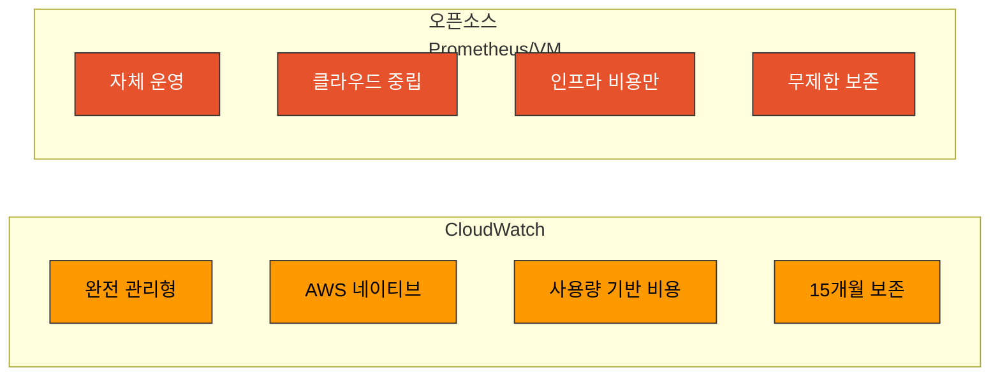
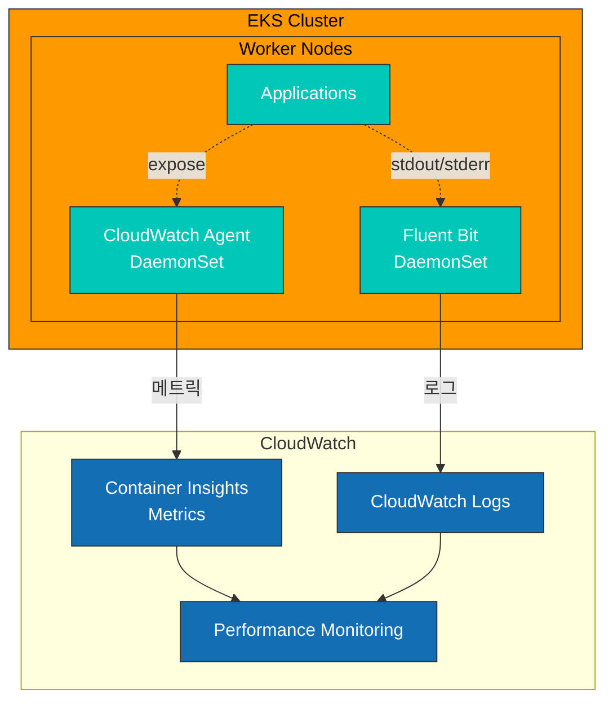
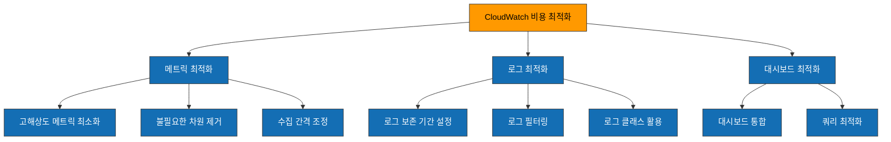

# CloudWatch Metrics

> **마지막 업데이트**: 2025년 2월

## 목차

- [소개](#소개)
- [Container Insights 개요](#container-insights-개요)
- [CloudWatch Agent 구성](#cloudwatch-agent-구성)
- [커스텀 메트릭 수집](#커스텀-메트릭-수집)
- [Metric Math 및 이상 탐지](#metric-math-및-이상-탐지)
- [대시보드 생성](#대시보드-생성)
- [알림 설정](#알림-설정)
- [비용 최적화](#비용-최적화)
- [모범 사례](#모범-사례)
- [문제 해결](#문제-해결)

## 소개

Amazon CloudWatch는 AWS의 네이티브 모니터링 및 관측성 서비스입니다. EKS 환경에서 CloudWatch를 사용하면 별도의 모니터링 인프라 없이 AWS 서비스들과 통합된 메트릭 수집, 알림, 대시보드 기능을 활용할 수 있습니다.

### 주요 특징

| 특징 | 설명 |
|------|------|
| **완전 관리형** | 인프라 관리 불필요 |
| **AWS 네이티브 통합** | EC2, EKS, RDS 등 자동 연동 |
| **Container Insights** | 컨테이너/파드 수준 모니터링 |
| **이상 탐지** | ML 기반 자동 이상 탐지 |
| **Metric Math** | 수학 표현식으로 메트릭 계산 |
| **통합 대시보드** | 로그, 메트릭, 트레이스 통합 |
| **글로벌 가용성** | 모든 AWS 리전 지원 |

### CloudWatch vs 오픈소스 솔루션



| 항목 | CloudWatch | Prometheus/VM |
|------|------------|---------------|
| 운영 오버헤드 | 없음 | 있음 |
| 비용 모델 | 사용량 기반 | 인프라 기반 |
| 확장성 | 자동 | 수동 설정 |
| 쿼리 언어 | Metric Math | PromQL/MetricsQL |
| 멀티클라우드 | AWS 전용 | 클라우드 중립 |
| 커스터마이징 | 제한적 | 완전 자유 |

## Container Insights 개요

Container Insights는 EKS 클러스터의 컨테이너화된 워크로드를 모니터링하기 위한 CloudWatch 기능입니다.

### 아키텍처



### 수집되는 메트릭

**클러스터 수준**:
- `cluster_node_count` - 노드 수
- `cluster_failed_node_count` - 실패한 노드 수
- `cluster_cpu_utilization` - CPU 사용률
- `cluster_memory_utilization` - 메모리 사용률

**노드 수준**:
- `node_cpu_utilization` - 노드 CPU 사용률
- `node_memory_utilization` - 노드 메모리 사용률
- `node_network_total_bytes` - 네트워크 총 바이트
- `node_filesystem_utilization` - 파일시스템 사용률

**파드/컨테이너 수준**:
- `pod_cpu_utilization` - 파드 CPU 사용률
- `pod_memory_utilization` - 파드 메모리 사용률
- `pod_network_rx_bytes` - 수신 네트워크 바이트
- `pod_network_tx_bytes` - 송신 네트워크 바이트
- `container_cpu_utilization` - 컨테이너 CPU 사용률
- `container_memory_utilization` - 컨테이너 메모리 사용률

### Container Insights 활성화

```bash
# EKS 애드온으로 활성화 (권장)
aws eks create-addon \
  --cluster-name my-cluster \
  --addon-name amazon-cloudwatch-observability \
  --addon-version v1.5.0-eksbuild.1 \
  --service-account-role-arn arn:aws:iam::123456789012:role/CloudWatchAgentRole

# 또는 eksctl로 활성화
eksctl utils update-cluster-logging \
  --cluster my-cluster \
  --enable-types all \
  --approve
```

## CloudWatch Agent 구성

### IRSA 설정

```bash
# IAM 정책 생성
cat <<EOF > cloudwatch-agent-policy.json
{
    "Version": "2012-10-17",
    "Statement": [
        {
            "Effect": "Allow",
            "Action": [
                "cloudwatch:PutMetricData",
                "ec2:DescribeVolumes",
                "ec2:DescribeTags",
                "logs:PutLogEvents",
                "logs:DescribeLogStreams",
                "logs:DescribeLogGroups",
                "logs:CreateLogStream",
                "logs:CreateLogGroup"
            ],
            "Resource": "*"
        },
        {
            "Effect": "Allow",
            "Action": [
                "ssm:GetParameter"
            ],
            "Resource": "arn:aws:ssm:*:*:parameter/AmazonCloudWatch-*"
        }
    ]
}
EOF

aws iam create-policy \
  --policy-name CloudWatchAgentPolicy \
  --policy-document file://cloudwatch-agent-policy.json

# 서비스 계정 생성
eksctl create iamserviceaccount \
  --name cloudwatch-agent \
  --namespace amazon-cloudwatch \
  --cluster my-cluster \
  --attach-policy-arn arn:aws:iam::123456789012:policy/CloudWatchAgentPolicy \
  --approve
```

### DaemonSet 배포

```yaml
apiVersion: v1
kind: Namespace
metadata:
  name: amazon-cloudwatch
---
apiVersion: v1
kind: ConfigMap
metadata:
  name: cwagentconfig
  namespace: amazon-cloudwatch
data:
  cwagentconfig.json: |
    {
      "logs": {
        "metrics_collected": {
          "kubernetes": {
            "cluster_name": "my-cluster",
            "metrics_collection_interval": 60
          }
        },
        "force_flush_interval": 5
      },
      "metrics": {
        "namespace": "ContainerInsights",
        "metrics_collected": {
          "kubernetes": {
            "cluster_name": "my-cluster",
            "metrics_collection_interval": 60,
            "enhanced_container_insights": true
          }
        }
      }
    }
---
apiVersion: apps/v1
kind: DaemonSet
metadata:
  name: cloudwatch-agent
  namespace: amazon-cloudwatch
spec:
  selector:
    matchLabels:
      name: cloudwatch-agent
  template:
    metadata:
      labels:
        name: cloudwatch-agent
    spec:
      serviceAccountName: cloudwatch-agent
      containers:
      - name: cloudwatch-agent
        image: public.ecr.aws/cloudwatch-agent/cloudwatch-agent:1.300031.0b311
        resources:
          limits:
            cpu: 400m
            memory: 400Mi
          requests:
            cpu: 200m
            memory: 200Mi
        env:
        - name: HOST_IP
          valueFrom:
            fieldRef:
              fieldPath: status.hostIP
        - name: HOST_NAME
          valueFrom:
            fieldRef:
              fieldPath: spec.nodeName
        - name: K8S_NAMESPACE
          valueFrom:
            fieldRef:
              fieldPath: metadata.namespace
        - name: CI_VERSION
          value: "k8s/1.3.11"
        volumeMounts:
        - name: cwagentconfig
          mountPath: /etc/cwagentconfig
        - name: rootfs
          mountPath: /rootfs
          readOnly: true
        - name: dockersock
          mountPath: /var/run/docker.sock
          readOnly: true
        - name: varlibdocker
          mountPath: /var/lib/docker
          readOnly: true
        - name: containerdsock
          mountPath: /run/containerd/containerd.sock
          readOnly: true
        - name: sys
          mountPath: /sys
          readOnly: true
        - name: devdisk
          mountPath: /dev/disk
          readOnly: true
      volumes:
      - name: cwagentconfig
        configMap:
          name: cwagentconfig
      - name: rootfs
        hostPath:
          path: /
      - name: dockersock
        hostPath:
          path: /var/run/docker.sock
      - name: varlibdocker
        hostPath:
          path: /var/lib/docker
      - name: containerdsock
        hostPath:
          path: /run/containerd/containerd.sock
      - name: sys
        hostPath:
          path: /sys
      - name: devdisk
        hostPath:
          path: /dev/disk/
      terminationGracePeriodSeconds: 60
      tolerations:
      - operator: Exists
```

### Enhanced Container Insights

Enhanced Container Insights는 추가 메트릭과 더 세분화된 모니터링을 제공합니다.

```yaml
# ConfigMap에서 활성화
cwagentconfig.json: |
  {
    "metrics": {
      "metrics_collected": {
        "kubernetes": {
          "enhanced_container_insights": true,
          "accelerated_compute_metrics": true  # GPU 메트릭
        }
      }
    }
  }
```

**추가 메트릭**:
- `pod_cpu_reserved_capacity` - 예약된 CPU 용량
- `pod_memory_reserved_capacity` - 예약된 메모리 용량
- `node_cpu_reserved_capacity` - 노드 예약 CPU
- `node_memory_reserved_capacity` - 노드 예약 메모리
- GPU 메트릭 (NVIDIA GPU 사용 시)

## 커스텀 메트릭 수집

### CloudWatch Agent로 Prometheus 메트릭 수집

CloudWatch Agent는 Prometheus 형식의 메트릭을 수집하여 CloudWatch로 전송할 수 있습니다.

```yaml
apiVersion: v1
kind: ConfigMap
metadata:
  name: prometheus-cwagentconfig
  namespace: amazon-cloudwatch
data:
  cwagentconfig.json: |
    {
      "logs": {
        "metrics_collected": {
          "prometheus": {
            "cluster_name": "my-cluster",
            "log_group_name": "/aws/containerinsights/my-cluster/prometheus",
            "prometheus_config_path": "/etc/prometheusconfig/prometheus.yaml",
            "emf_processor": {
              "metric_declaration_dedup": true,
              "metric_namespace": "ContainerInsights/Prometheus",
              "metric_unit": {
                "http_requests_total": "Count",
                "http_request_duration_seconds": "Seconds"
              },
              "metric_declaration": [
                {
                  "source_labels": ["job"],
                  "label_matcher": "^my-app$",
                  "dimensions": [["ClusterName", "Namespace", "Service"]],
                  "metric_selectors": [
                    "^http_requests_total$",
                    "^http_request_duration_seconds.*$"
                  ]
                }
              ]
            }
          }
        }
      }
    }
  prometheus.yaml: |
    global:
      scrape_interval: 1m
      scrape_timeout: 10s
    scrape_configs:
      - job_name: 'my-app'
        kubernetes_sd_configs:
          - role: pod
        relabel_configs:
          - source_labels: [__meta_kubernetes_pod_annotation_prometheus_io_scrape]
            action: keep
            regex: true
          - source_labels: [__meta_kubernetes_pod_annotation_prometheus_io_path]
            action: replace
            target_label: __metrics_path__
            regex: (.+)
```

### AWS Distro for OpenTelemetry (ADOT)

ADOT를 사용하면 Prometheus 메트릭을 CloudWatch로 전송할 수 있습니다.

```yaml
apiVersion: v1
kind: ConfigMap
metadata:
  name: adot-collector-config
  namespace: amazon-cloudwatch
data:
  config.yaml: |
    receivers:
      prometheus:
        config:
          global:
            scrape_interval: 30s
          scrape_configs:
            - job_name: 'kubernetes-pods'
              kubernetes_sd_configs:
                - role: pod
              relabel_configs:
                - source_labels: [__meta_kubernetes_pod_annotation_prometheus_io_scrape]
                  action: keep
                  regex: true

    processors:
      batch:
        timeout: 60s

    exporters:
      awsemf:
        namespace: CustomMetrics
        log_group_name: '/aws/containerinsights/my-cluster/prometheus'
        dimension_rollup_option: NoDimensionRollup
        metric_declarations:
          - dimensions: [[ClusterName, Namespace, Service]]
            metric_name_selectors:
              - "^http_.*"

    service:
      pipelines:
        metrics:
          receivers: [prometheus]
          processors: [batch]
          exporters: [awsemf]
---
apiVersion: apps/v1
kind: Deployment
metadata:
  name: adot-collector
  namespace: amazon-cloudwatch
spec:
  replicas: 1
  selector:
    matchLabels:
      app: adot-collector
  template:
    metadata:
      labels:
        app: adot-collector
    spec:
      serviceAccountName: adot-collector
      containers:
      - name: adot-collector
        image: public.ecr.aws/aws-observability/aws-otel-collector:v0.35.0
        command:
          - "/awscollector"
          - "--config=/etc/config/config.yaml"
        resources:
          limits:
            cpu: 500m
            memory: 512Mi
          requests:
            cpu: 200m
            memory: 256Mi
        volumeMounts:
        - name: config
          mountPath: /etc/config
      volumes:
      - name: config
        configMap:
          name: adot-collector-config
```

### SDK를 통한 커스텀 메트릭 전송

```python
# Python 예시
import boto3
from datetime import datetime

cloudwatch = boto3.client('cloudwatch', region_name='ap-northeast-2')

def put_custom_metric(namespace, metric_name, value, dimensions, unit='Count'):
    cloudwatch.put_metric_data(
        Namespace=namespace,
        MetricData=[
            {
                'MetricName': metric_name,
                'Dimensions': dimensions,
                'Timestamp': datetime.utcnow(),
                'Value': value,
                'Unit': unit
            }
        ]
    )

# 사용 예시
put_custom_metric(
    namespace='MyApp/Production',
    metric_name='OrdersProcessed',
    value=150,
    dimensions=[
        {'Name': 'Service', 'Value': 'order-service'},
        {'Name': 'Environment', 'Value': 'production'}
    ]
)
```

```go
// Go 예시
package main

import (
    "context"
    "time"

    "github.com/aws/aws-sdk-go-v2/config"
    "github.com/aws/aws-sdk-go-v2/service/cloudwatch"
    "github.com/aws/aws-sdk-go-v2/service/cloudwatch/types"
)

func putCustomMetric(ctx context.Context, client *cloudwatch.Client) error {
    _, err := client.PutMetricData(ctx, &cloudwatch.PutMetricDataInput{
        Namespace: aws.String("MyApp/Production"),
        MetricData: []types.MetricDatum{
            {
                MetricName: aws.String("OrdersProcessed"),
                Dimensions: []types.Dimension{
                    {
                        Name:  aws.String("Service"),
                        Value: aws.String("order-service"),
                    },
                },
                Timestamp: aws.Time(time.Now()),
                Value:     aws.Float64(150),
                Unit:      types.StandardUnitCount,
            },
        },
    })
    return err
}
```

## Metric Math 및 이상 탐지

### Metric Math

Metric Math를 사용하면 여러 메트릭을 수학적으로 조합할 수 있습니다.

```json
// CloudWatch 대시보드 위젯에서 Metric Math 사용
{
  "metrics": [
    [ { "expression": "m1/m2*100", "label": "Error Rate (%)", "id": "e1" } ],
    [ "AWS/ApplicationELB", "HTTPCode_Target_5XX_Count", "LoadBalancer", "app/my-alb/xxx", { "id": "m1", "visible": false } ],
    [ ".", "RequestCount", ".", ".", { "id": "m2", "visible": false } ]
  ],
  "view": "timeSeries",
  "stacked": false,
  "region": "ap-northeast-2",
  "period": 60
}
```

**주요 Metric Math 함수**:

```
# 기본 연산
m1 + m2                    # 덧셈
m1 - m2                    # 뺄셈
m1 * m2                    # 곱셈
m1 / m2                    # 나눗셈

# 집계 함수
SUM(METRICS())            # 모든 메트릭 합계
AVG(METRICS())            # 평균
MIN(METRICS())            # 최소값
MAX(METRICS())            # 최대값

# 통계 함수
STDDEV(m1)                # 표준편차
PERCENTILE(m1, 95)        # 백분위수

# 시계열 함수
RATE(m1)                  # 변화율
DIFF(m1)                  # 이전 값과의 차이
PERIOD(m1)                # 기간 (초)
FILL(m1, 0)               # 누락 데이터 채우기

# 검색
SEARCH('{Namespace, Dim1, Dim2} MetricName', 'Average')
```

**실용적인 예시**:

```json
// CPU 사용률 계산
{
  "expression": "m1 / m2 * 100",
  "label": "CPU Utilization %"
}

// 오류율 계산
{
  "expression": "100 * m1 / (m1 + m2)",
  "label": "Error Rate %"
}

// p95 지연시간 (여러 서비스 합산)
{
  "expression": "PERCENTILE(METRICS(), 95)",
  "label": "p95 Latency"
}

// 이동 평균
{
  "expression": "AVG(METRICS()) PERIOD(300)",
  "label": "5min Moving Average"
}
```

### 이상 탐지 (Anomaly Detection)

CloudWatch Anomaly Detection은 ML 기반으로 비정상적인 메트릭 패턴을 자동으로 감지합니다.

```bash
# CLI로 이상 탐지 활성화
aws cloudwatch put-anomaly-detector \
  --namespace ContainerInsights \
  --metric-name pod_cpu_utilization \
  --stat Average \
  --dimensions Name=ClusterName,Value=my-cluster

# 이상 탐지 알림 생성
aws cloudwatch put-metric-alarm \
  --alarm-name "AnomalyDetection-PodCPU" \
  --comparison-operator LessThanLowerOrGreaterThanUpperThreshold \
  --evaluation-periods 2 \
  --metrics '[
    {
      "Id": "m1",
      "MetricStat": {
        "Metric": {
          "Namespace": "ContainerInsights",
          "MetricName": "pod_cpu_utilization",
          "Dimensions": [{"Name": "ClusterName", "Value": "my-cluster"}]
        },
        "Period": 300,
        "Stat": "Average"
      },
      "ReturnData": true
    },
    {
      "Id": "ad1",
      "Expression": "ANOMALY_DETECTION_BAND(m1, 2)",
      "ReturnData": true
    }
  ]' \
  --threshold-metric-id ad1 \
  --alarm-actions arn:aws:sns:ap-northeast-2:123456789012:my-alerts
```

### Terraform으로 이상 탐지 설정

```hcl
resource "aws_cloudwatch_metric_alarm" "anomaly_detection" {
  alarm_name          = "pod-cpu-anomaly"
  comparison_operator = "LessThanLowerOrGreaterThanUpperThreshold"
  evaluation_periods  = 2
  threshold_metric_id = "ad1"

  metric_query {
    id          = "m1"
    return_data = true

    metric {
      metric_name = "pod_cpu_utilization"
      namespace   = "ContainerInsights"
      period      = 300
      stat        = "Average"

      dimensions = {
        ClusterName = "my-cluster"
      }
    }
  }

  metric_query {
    id          = "ad1"
    expression  = "ANOMALY_DETECTION_BAND(m1, 2)"
    label       = "Anomaly Detection Band"
    return_data = true
  }

  alarm_actions = [aws_sns_topic.alerts.arn]

  tags = {
    Environment = "production"
  }
}
```

## 대시보드 생성

### CloudFormation으로 대시보드 생성

```yaml
AWSTemplateFormatVersion: '2010-09-09'
Description: EKS Monitoring Dashboard

Parameters:
  ClusterName:
    Type: String
    Default: my-cluster

Resources:
  EKSDashboard:
    Type: AWS::CloudWatch::Dashboard
    Properties:
      DashboardName: !Sub "${ClusterName}-monitoring"
      DashboardBody: !Sub |
        {
          "widgets": [
            {
              "type": "metric",
              "x": 0,
              "y": 0,
              "width": 12,
              "height": 6,
              "properties": {
                "title": "Cluster CPU Utilization",
                "metrics": [
                  ["ContainerInsights", "cluster_cpu_utilization", "ClusterName", "${ClusterName}"]
                ],
                "view": "timeSeries",
                "region": "${AWS::Region}",
                "period": 60,
                "stat": "Average"
              }
            },
            {
              "type": "metric",
              "x": 12,
              "y": 0,
              "width": 12,
              "height": 6,
              "properties": {
                "title": "Cluster Memory Utilization",
                "metrics": [
                  ["ContainerInsights", "cluster_memory_utilization", "ClusterName", "${ClusterName}"]
                ],
                "view": "timeSeries",
                "region": "${AWS::Region}",
                "period": 60,
                "stat": "Average"
              }
            },
            {
              "type": "metric",
              "x": 0,
              "y": 6,
              "width": 8,
              "height": 6,
              "properties": {
                "title": "Node Count",
                "metrics": [
                  ["ContainerInsights", "cluster_node_count", "ClusterName", "${ClusterName}"]
                ],
                "view": "singleValue",
                "region": "${AWS::Region}",
                "period": 60,
                "stat": "Average"
              }
            },
            {
              "type": "metric",
              "x": 8,
              "y": 6,
              "width": 8,
              "height": 6,
              "properties": {
                "title": "Pod Count by Namespace",
                "metrics": [
                  ["ContainerInsights", "pod_number_of_running_containers", "ClusterName", "${ClusterName}", "Namespace", "default"],
                  ["...", "kube-system"],
                  ["...", "monitoring"]
                ],
                "view": "timeSeries",
                "region": "${AWS::Region}",
                "period": 60,
                "stat": "Sum"
              }
            },
            {
              "type": "metric",
              "x": 16,
              "y": 6,
              "width": 8,
              "height": 6,
              "properties": {
                "title": "Network I/O",
                "metrics": [
                  ["ContainerInsights", "node_network_total_bytes", "ClusterName", "${ClusterName}"]
                ],
                "view": "timeSeries",
                "region": "${AWS::Region}",
                "period": 60,
                "stat": "Average"
              }
            }
          ]
        }
```

### Terraform으로 대시보드 생성

```hcl
resource "aws_cloudwatch_dashboard" "eks_monitoring" {
  dashboard_name = "${var.cluster_name}-monitoring"

  dashboard_body = jsonencode({
    widgets = [
      {
        type   = "metric"
        x      = 0
        y      = 0
        width  = 12
        height = 6
        properties = {
          title  = "Cluster CPU Utilization"
          region = var.region
          metrics = [
            ["ContainerInsights", "cluster_cpu_utilization", "ClusterName", var.cluster_name]
          ]
          view   = "timeSeries"
          period = 60
          stat   = "Average"
          yAxis = {
            left = {
              min = 0
              max = 100
            }
          }
        }
      },
      {
        type   = "metric"
        x      = 12
        y      = 0
        width  = 12
        height = 6
        properties = {
          title  = "Cluster Memory Utilization"
          region = var.region
          metrics = [
            ["ContainerInsights", "cluster_memory_utilization", "ClusterName", var.cluster_name]
          ]
          view   = "timeSeries"
          period = 60
          stat   = "Average"
        }
      },
      {
        type   = "metric"
        x      = 0
        y      = 6
        width  = 24
        height = 6
        properties = {
          title  = "Top 10 Pods by CPU"
          region = var.region
          metrics = [
            [{
              expression  = "SEARCH('{ContainerInsights,ClusterName,Namespace,PodName} MetricName=\"pod_cpu_utilization\" ClusterName=\"${var.cluster_name}\"', 'Average', 60)"
              id          = "pods"
              period      = 60
              label       = "CPU"
            }]
          ]
          view   = "timeSeries"
          period = 60
        }
      }
    ]
  })
}
```

## 알림 설정

### 기본 알림 규칙

```yaml
# CloudFormation
Resources:
  HighCPUAlarm:
    Type: AWS::CloudWatch::Alarm
    Properties:
      AlarmName: !Sub "${ClusterName}-high-cpu"
      AlarmDescription: "Cluster CPU utilization is high"
      MetricName: cluster_cpu_utilization
      Namespace: ContainerInsights
      Dimensions:
        - Name: ClusterName
          Value: !Ref ClusterName
      Statistic: Average
      Period: 300
      EvaluationPeriods: 2
      Threshold: 80
      ComparisonOperator: GreaterThanThreshold
      AlarmActions:
        - !Ref AlertSNSTopic

  HighMemoryAlarm:
    Type: AWS::CloudWatch::Alarm
    Properties:
      AlarmName: !Sub "${ClusterName}-high-memory"
      AlarmDescription: "Cluster memory utilization is high"
      MetricName: cluster_memory_utilization
      Namespace: ContainerInsights
      Dimensions:
        - Name: ClusterName
          Value: !Ref ClusterName
      Statistic: Average
      Period: 300
      EvaluationPeriods: 2
      Threshold: 85
      ComparisonOperator: GreaterThanThreshold
      AlarmActions:
        - !Ref AlertSNSTopic

  PodRestartAlarm:
    Type: AWS::CloudWatch::Alarm
    Properties:
      AlarmName: !Sub "${ClusterName}-pod-restarts"
      AlarmDescription: "Pod restart count is increasing"
      MetricName: pod_number_of_container_restarts
      Namespace: ContainerInsights
      Dimensions:
        - Name: ClusterName
          Value: !Ref ClusterName
      Statistic: Sum
      Period: 300
      EvaluationPeriods: 2
      Threshold: 5
      ComparisonOperator: GreaterThanThreshold
      AlarmActions:
        - !Ref AlertSNSTopic
```

### Terraform 알림 설정

```hcl
resource "aws_cloudwatch_metric_alarm" "high_cpu" {
  alarm_name          = "${var.cluster_name}-high-cpu"
  comparison_operator = "GreaterThanThreshold"
  evaluation_periods  = 2
  metric_name         = "cluster_cpu_utilization"
  namespace           = "ContainerInsights"
  period              = 300
  statistic           = "Average"
  threshold           = 80
  alarm_description   = "Cluster CPU utilization exceeds 80%"

  dimensions = {
    ClusterName = var.cluster_name
  }

  alarm_actions = [aws_sns_topic.alerts.arn]
  ok_actions    = [aws_sns_topic.alerts.arn]

  tags = {
    Environment = var.environment
  }
}

resource "aws_cloudwatch_metric_alarm" "node_not_ready" {
  alarm_name          = "${var.cluster_name}-node-not-ready"
  comparison_operator = "GreaterThanThreshold"
  evaluation_periods  = 2
  metric_name         = "cluster_failed_node_count"
  namespace           = "ContainerInsights"
  period              = 60
  statistic           = "Maximum"
  threshold           = 0
  alarm_description   = "One or more nodes are not ready"

  dimensions = {
    ClusterName = var.cluster_name
  }

  alarm_actions = [aws_sns_topic.alerts.arn]
}
```

## 비용 최적화

### CloudWatch 비용 구조

| 항목 | 비용 (ap-northeast-2) |
|------|----------------------|
| 커스텀 메트릭 | $0.30/메트릭/월 (처음 10,000개) |
| GetMetricData API | $0.01/1,000 메트릭 요청 |
| 대시보드 | $3.00/대시보드/월 (처음 3개 무료) |
| 로그 수집 | $0.76/GB |
| 로그 저장 | $0.0314/GB/월 |
| 알림 | 무료 (처음 10개), $0.10/알림/월 |

### 비용 최적화 전략



### 1. 메트릭 수집 최적화

```yaml
# CloudWatch Agent 설정에서 필터링
cwagentconfig.json: |
  {
    "metrics": {
      "metrics_collected": {
        "kubernetes": {
          "cluster_name": "my-cluster",
          "metrics_collection_interval": 60,  # 30초 대신 60초
          "enhanced_container_insights": false  # 필요할 때만 활성화
        }
      },
      "aggregation_dimensions": [
        ["ClusterName"],
        ["ClusterName", "Namespace"]
        # 불필요한 차원 조합 제거
      ]
    }
  }
```

### 2. 로그 보존 정책

```bash
# 로그 그룹 보존 기간 설정
aws logs put-retention-policy \
  --log-group-name /aws/containerinsights/my-cluster/application \
  --retention-in-days 7

aws logs put-retention-policy \
  --log-group-name /aws/containerinsights/my-cluster/performance \
  --retention-in-days 30

# 오래된 로그 그룹 정리
for lg in $(aws logs describe-log-groups --query 'logGroups[?retentionInDays==`null`].logGroupName' --output text); do
  aws logs put-retention-policy --log-group-name "$lg" --retention-in-days 14
done
```

### 3. Infrequent Access 로그 클래스 활용

```bash
# 새 로그 그룹에 Infrequent Access 클래스 적용 (50% 비용 절감)
aws logs create-log-group \
  --log-group-name /aws/containerinsights/my-cluster/audit \
  --log-group-class INFREQUENT_ACCESS
```

### 비용 모니터링

```hcl
# CloudWatch 비용 알림
resource "aws_cloudwatch_metric_alarm" "cw_cost_alarm" {
  alarm_name          = "cloudwatch-cost-alarm"
  comparison_operator = "GreaterThanThreshold"
  evaluation_periods  = 1
  metric_name         = "EstimatedCharges"
  namespace           = "AWS/Billing"
  period              = 86400
  statistic           = "Maximum"
  threshold           = 100  # $100
  alarm_description   = "CloudWatch estimated charges exceed $100"

  dimensions = {
    ServiceName = "AmazonCloudWatch"
    Currency    = "USD"
  }

  alarm_actions = [aws_sns_topic.billing_alerts.arn]
}
```

## 모범 사례

### 1. 네임스페이스 전략

```yaml
# 커스텀 메트릭 네임스페이스 구조
MyCompany/Production/API        # 프로덕션 API 메트릭
MyCompany/Staging/API           # 스테이징 API 메트릭
MyCompany/Production/Workers    # 프로덕션 워커 메트릭
```

### 2. 차원 설계

```yaml
# 권장 차원 구조
dimensions:
  - ClusterName     # 필수
  - Namespace       # K8s 네임스페이스
  - Service         # 서비스명
  - Environment     # 환경 (prod/staging/dev)

# 피해야 할 차원 (높은 카디널리티)
dimensions:
  - PodName         # 파드마다 다름 (비용 증가)
  - RequestID       # 요청마다 다름 (매우 높은 비용)
```

### 3. 알림 설계

```yaml
# 계층화된 알림 전략
Critical (P1):
  - 클러스터 다운
  - 50% 이상 노드 실패
  - SNS -> PagerDuty

Warning (P2):
  - CPU/메모리 80% 이상
  - 파드 재시작 증가
  - SNS -> Slack

Info (P3):
  - 스케일링 이벤트
  - 배포 완료
  - SNS -> 이메일/로그
```

## 문제 해결

### 일반적인 문제

#### 1. 메트릭이 표시되지 않음

```bash
# CloudWatch Agent 로그 확인
kubectl logs -n amazon-cloudwatch -l name=cloudwatch-agent

# IAM 권한 확인
aws sts get-caller-identity
aws iam simulate-principal-policy \
  --policy-source-arn arn:aws:iam::123456789012:role/CloudWatchAgentRole \
  --action-names cloudwatch:PutMetricData

# 메트릭 직접 확인
aws cloudwatch list-metrics \
  --namespace ContainerInsights \
  --dimensions Name=ClusterName,Value=my-cluster
```

#### 2. 높은 비용

```bash
# 메트릭 수 확인
aws cloudwatch list-metrics --namespace ContainerInsights | jq '.Metrics | length'

# 높은 카디널리티 메트릭 찾기
aws cloudwatch list-metrics \
  --namespace ContainerInsights \
  --query 'Metrics[*].Dimensions[*].Name' \
  --output text | sort | uniq -c | sort -rn | head -20
```

#### 3. 알림이 트리거되지 않음

```bash
# 알림 상태 확인
aws cloudwatch describe-alarms --alarm-names "my-alarm"

# 알림 히스토리 확인
aws cloudwatch describe-alarm-history \
  --alarm-name "my-alarm" \
  --history-item-type StateUpdate

# SNS 주제 확인
aws sns list-subscriptions-by-topic \
  --topic-arn arn:aws:sns:ap-northeast-2:123456789012:my-alerts
```

### 디버깅 명령어

```bash
# Container Insights 상태 확인
kubectl get pods -n amazon-cloudwatch

# CloudWatch Agent 설정 확인
kubectl describe configmap cwagentconfig -n amazon-cloudwatch

# 실시간 메트릭 확인
aws cloudwatch get-metric-statistics \
  --namespace ContainerInsights \
  --metric-name cluster_cpu_utilization \
  --dimensions Name=ClusterName,Value=my-cluster \
  --start-time $(date -u -d '1 hour ago' +%Y-%m-%dT%H:%M:%SZ) \
  --end-time $(date -u +%Y-%m-%dT%H:%M:%SZ) \
  --period 60 \
  --statistics Average
```

## 참고 자료

- [Amazon CloudWatch 공식 문서](https://docs.aws.amazon.com/cloudwatch/)
- [Container Insights 설정 가이드](https://docs.aws.amazon.com/AmazonCloudWatch/latest/monitoring/Container-Insights-setup-EKS-quickstart.html)
- [CloudWatch Agent 설정](https://docs.aws.amazon.com/AmazonCloudWatch/latest/monitoring/CloudWatch-Agent-Configuration-File-Details.html)
- [CloudWatch 요금](https://aws.amazon.com/cloudwatch/pricing/)

## 퀴즈

이 장에서 배운 내용을 테스트하려면 [CloudWatch Metrics 퀴즈](../../quizzes/observability/metrics/04-cloudwatch-metrics-quiz.md)를 풀어보세요.
