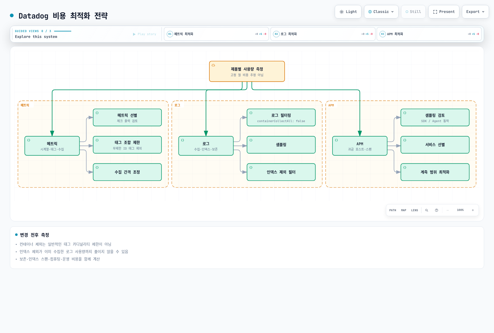

# Datadog

> **마지막 업데이트**: 2026년 9월 13일
> Helm chart 3.244.0; Agent/Cluster Agent 7.83.1을 같은 버전으로 사용합니다.
> 설정·SDK·로컬 검증의 한계는 아래에 명시합니다. Datadog tenant를 변경하지 않았습니다.

## 소개

Datadog은 SaaS 관측 backend를 제공합니다. 팀은 collector·identity·network·계측·
데이터 공개·retention·monitor·비용을 여전히 관리합니다. Infrastructure Monitoring,
APM, profiling, logs 등은 entitlement와 과금 단위가 다르며 Agent 설치만으로
모든 상품이 포함되는 것은 아닙니다.

| 항목 | Datadog | CloudWatch | 자체 운영 Prometheus / Grafana |
| --- | --- | --- | --- |
| Backend | Datadog SaaS; site별 가용성 확인 | AWS 관리형 서비스 | 저장·조회·시각화 운영 |
| 수집 | Agent/Cluster Agent, library, 지원 OTel 경로 | AWS 지표와 agent/SDK/OTLP | Exporter·scraping·agent·remote write |
| APM/log | 필요한 상품 선택·설정 | Application Signals·tracing·Logs 연동 | 해당 backend·collector 구성 |
| 운영 | Collector/config와 application 책임 유지 | 수집/config와 대응 책임 유지 | Backend와 수집 책임 유지 |
| 비용 | Host 및 상품별 사용량·보존 단위 | Metric/observation/OTLP/log/query/alarm 단위 | 인프라와 운영 비용 |

조직과 credential에 맞는 Datadog **site**를 선택합니다. API endpoint·data residency·
상품 가용성·가격 조건을 site 간 동일하게 취급하지 않습니다. 고정된 integration
개수나 보편적인 “쉬움/고급/저렴함” 순위보다 실제 catalogue와 요구사항을 확인합니다.

## EKS 통합 아키텍처

| 구성요소 | 역할 / 경계 |
| --- | --- |
| Node Agent | Host/container check; 지원 EC2 node에서는 보통 DaemonSet |
| Cluster Agent | Kubernetes metadata/check·event 조정과 선택적 admission/external metric 기능 |
| Trace Agent | Application trace payload 수신·전송 |
| Process collection / system-probe | OS·권한·상품 조건이 있는 선택적 process/network/security 기능 |
| Admission Controller | 새 Pod에 연결 설정과, 구성한 경우 지원 client library 주입 |

Trace/profile은 application 계측이 생성합니다. Agent listener나 Pod label만으로
계측 성공이 증명되지는 않습니다. Cluster Agent는 일반 application log/trace
전송 경로가 아닙니다.

설치 예제는 **Linux EC2 기반 EKS node** 대상입니다. EKS Fargate는 이 host
DaemonSet 대신 문서화된 Pod/sidecar 수집 경로를 사용합니다. UDS는 host-local이며
Windows에서 지원되지 않습니다. Windows·Bottlerocket·Auto Mode·혼합 compute는
배포판/기능별 설정과 지원 host 접근을 확인합니다. TLS 검증을 무작정 끄거나 모든
eBPF/process 기능이 어디서나 동작한다고 가정하지 않습니다.

Datadog은 Kubernetes 1.33+의 `AllocatedResources` 호환성에 Agent/Cluster Agent
7.67+를 명시하며 같은 버전을 권장합니다. 이런 최소 기능 요구사항이 현재 EKS
지원 matrix를 대신하지는 않습니다.

## Datadog Agent 설치

Datadog은 상위 lifecycle 설정을 위한 Operator를 권장하며 Helm 설치도 지원합니다.
이 예제는 **Datadog Agent Helm chart**가 node/Cluster Agent를 소유합니다.
Chart 3.244.0에는 선택적 Operator dependency도 있으므로
`datadog.operator.enabled: false`로 이 예제의 추가 controller를 끕니다.
Operator가 폐기되었다는 뜻은 아닙니다.

Chart의 기본 Agent/Cluster Agent는 7.82.3입니다. 여기서는 둘 다 **7.83.1**과
검증한 image-index digest로 고정합니다. 해당 release에는 network test 과금,
containerd snapshot 정리, Cluster Agent 종료 시 leader lock 해제 수정이 있습니다.
두 image index에 Linux amd64/arm64가 포함됨을 확인했습니다. Template 렌더 성공이
Kubernetes 배포나 runtime 호환성 시험을 뜻하지는 않습니다.

### Credential과 설치 소유권

이 profile은 native `aws.secrets` backend와 IRSA로 AWS Secrets Manager의 API key와
공유 Cluster Agent token을 조회합니다. 기본 수집에는 application key가 필요하지
않으며 external metrics는 계속 비활성화합니다.

`ap-northeast-2`에 `observability/datadog` secret을 준비하고 JSON string key `api-key`,
`cluster-token`을 저장합니다. Token은 32자 이상의 암호학적 난수이며 API key는 선택한
Datadog site와 일치해야 합니다. `datadog` namespace의 `datadog`,
`datadog-cluster-agent` ServiceAccount에는 해당 secret으로 제한한 IRSA role,
regional STS/Secrets Manager 연결과 필요한 KMS 권한이 있어야 합니다. 예제 role ARN
두 개를 교체합니다. EC2 metadata credential fallback은 끕니다.
[전체 전제조건과 재사용 profile](../../../examples/observability/secret-profiles/README.md)을 확인합니다.

Python 3/PyYAML 6.0.3과 해당 repository의 실행 가능한 pinned-chart postrenderer를
사용합니다. Chart에 고정된 SecretKeyRef 7개를 **`ENC[...]` 문자열 handle**로 바꾸며,
node·trace·init·Cluster Agent 소비자를 모두 보존합니다. Native resolver는 값을
환경 변수가 아닌 메모리 설정에 반영합니다. Init script는 비어 있지 않은 `DD_API_KEY`를
요구하므로 대체 경로 없이 삭제하면 시작이 실패합니다. `must-use-secret-postrenderer`
Secret은 의도적으로 만들지 않습니다. Renderer 누락을 우회하려고 생성하지 마세요.
모든 install/upgrade에 renderer를 유지하고 chart·image·profile 계약 변경을 검토합니다.

다음 명령은 install 단계에서 cluster를 변경하며 감사에서 배포를 실행한 것은 아닙니다.
IAM/secret 전제조건, 기존 `datadog` namespace와 release 소유권을 확인한 뒤 repository
root에서 실행합니다.

```bash
PROFILE=examples/observability/secret-profiles
helm repo add datadog https://helm.datadoghq.com
helm repo update datadog
helm template datadog datadog/datadog --version 3.244.0 \
  --namespace datadog --include-crds -f "$PROFILE/datadog-values.yaml" \
  --post-renderer "$PROFILE/datadog_postrender.py" > datadog-reviewed-render.yaml
# Review resources and ownership first; retain the renderer on EVERY upgrade.
helm upgrade --install datadog datadog/datadog --version 3.244.0 \
  --namespace datadog -f "$PROFILE/datadog-values.yaml" \
  --post-renderer "$PROFILE/datadog_postrender.py"
```

### 검토한 values

다음은 재사용 `datadog-values.yaml`과 같은 설정입니다. Log는 container 설정으로 선택하고
APM/DogStatsD는 UDS를 사용합니다. Cluster 전체 자동 library 주입, external HPA
metric, discovery network statistics, 선택적 process/network 수집은 여기서 켜지 않습니다.
Application은 Agent와 다른 namespace에 둡니다. SSI는 Agent 자체 namespace의
Pod를 계측하지 않습니다.

```yaml
# datadog 3.244.0: postrenderer required; replace example IRSA role ARNs.
targetSystem: linux
registry: gcr.io/datadoghq
datadog:
  apiKeyExistingSecret: must-use-secret-postrenderer
  clusterName: my-eks-cluster
  site: datadoghq.com
  tags:
  - env:demo
  - team:platform
  logs:
    enabled: true
    containerCollectAll: false
    containerCollectUsingFiles: true
  apm:
    socketEnabled: true
    portEnabled: false
    instrumentation:
      enabled: false
  dogstatsd:
    useSocketVolume: true
    useHostPort: false
    nonLocalTraffic: false
  processAgent:
    processCollection: false
    processDiscovery: false
    containerCollection: true
  networkMonitoring:
    enabled: false
  discovery:
    enabled: false
    networkStats:
      enabled: false
  autoscaling:
    workload:
      enabled: false
  profiling:
    enabled: null
  collectEvents: true
  prometheusScrape:
    enabled: false
  kubeStateMetricsCore:
    enabled: true
    collectSecretMetrics: false
    collectConfigMaps: false
  operator:
    enabled: false
  secretBackend:
    type: aws.secrets
    config:
      aws_session:
        aws_region: ap-northeast-2
    enableGlobalPermissions: false
  env: &id001
  - name: AWS_EC2_METADATA_DISABLED
    value: 'true'
  - name: DD_SECRET_REFRESH_INTERVAL
    value: '0'
  - name: DD_SECRET_REFRESH_ON_API_KEY_FAILURE_INTERVAL
    value: '0'
clusterAgent:
  enabled: true
  replicas: 2
  image:
    tag: 7.83.1
    digest: sha256:8e420c81e68abec34ab792c72a6513b739dcba8f7682c52e1e7e276363827b1a
  metricsProvider:
    enabled: false
    useDatadogMetrics: false
  admissionController:
    enabled: true
    mutateUnlabelled: false
  tokenExistingSecret: must-use-secret-postrenderer
  rbac:
    create: true
    serviceAccountAnnotations:
      eks.amazonaws.com/role-arn: arn:aws:iam::111122223333:role/datadog-cluster-agent-secrets
  env: *id001
agents:
  image:
    tag: 7.83.1
    digest: sha256:ed0bd588e955d82f661d1b8dd1cdf179c1023e74a2817e7a812c99d52f05c319
  rbac:
    create: true
    serviceAccountAnnotations:
      eks.amazonaws.com/role-arn: arn:aws:iam::111122223333:role/datadog-agent-secrets
```

Postrenderer 출력의 credential 관련 환경 변수 값은
`ENC[observability/datadog;api-key]`, `ENC[observability/datadog;cluster-token]`
handle뿐입니다. `DD_SECRET_BACKEND_TYPE`/`CONFIG`에는 backend 종류와 region만 들어갑니다.
Shell이 실제 값을 export하지 않으며 Helm values나 Kubernetes credential Secret에 실제
key를 넣지 않습니다. 두 init-volume container는 image 설정만 복사하고, init-config는
API-key handle로 bootstrap 검사를 통과합니다. 실제 native backend 권한과 Datadog 수집은
runtime에서 별도로 확인해야 합니다.

예약/API 실패 시 secret refresh는 명시적으로 끕니다. 승인된 절차로 node/trace·Cluster
Agent Pod를 함께 재시작해 rotation하고 전체 fleet 전환 전에는 기존 API key를 유지합니다.
Cluster token 변경 중 구·신 Pod가 공존하면 인증이 끊길 수 있으므로 maintenance window나
별도로 검증한 전환 절차를 준비합니다. 무중단 rotation을 보장하지 않습니다.
[Datadog secret backend 문서](https://docs.datadoghq.com/agent/guide/secrets-management/)를 참고합니다.

`processAgent.enabled`는 deprecated이며 개별 collection 옵션을 사용합니다.
필요한 경우 chart가 이미 `/etc/passwd`를 mount하므로 수동 `passwd` volume/mount를
중복 추가하지 않습니다. Resource override는 `agents.containers.agent.resources`
같은 구성요소별 위치에 지정하고 실제 컨테이너를 부하 아래에서 측정합니다.
Cluster Agent replica 2개만으로 배치·disruption·장애 시험을 대신하지 않습니다.

기존 최상위 `kubeStateMetricsEnabled`와 `prometheus.enabled`는 설명한 integration을
설정하지 않습니다. Legacy KSM 옵션은 `datadog` 아래에 있으며 예제는
`datadog.kubeStateMetricsCore.enabled`로 legacy 중복 수집을 피합니다.
명시적 Datadog Autodiscovery check와 annotation 전체를 찾는 `prometheusScrape`도 다릅니다.

`datadog.profiling.enabled`는 **유효한 설정**입니다. 대상 Pod에
`DD_PROFILING_ENABLED`를 주입하며 설치된 client library와 Cluster Agent 7.57+가
필요합니다. 계측되지 않은 임의 application에 profiler를 설치하는 기능이 아닙니다.
`null`/`false`/`auto`/`true` 의미를 확인해 선택합니다. External HPA metric에는
application key·API 권한·service/CRD·실제 지표가 필요하며 network monitoring은
지원되는 system-probe 접근이 필요합니다.

### AWS 계정 integration은 별도 경로

SaaS AWS account integration은 Datadog이 제공한 external ID와 승인된
cross-account role, 선택한 integration의 권한을 사용합니다. Node Agent SA에
임의 IRSA role을 붙여도 SaaS integration이 구성되지는 않습니다.
일반 Kubernetes Agent 수집에 기존의 광범위한 CloudWatch/EC2/tag policy가 필요한 것은 아닙니다.

실제 AWS API를 호출하는 Agent/check에만 해당 role·trust·권한으로 Pod Identity나
IRSA를 구성합니다. **렌더링된** SA 이름을 확인합니다. 추측한 `datadog-agent`에
IAM association을 만들어도 Helm release의 다른 SA에 연결되지 않습니다.
로컬 STS caller 확인을 workload identity의 증거로 삼지 않습니다.

## 인프라 모니터링

### Collector·단위·tag 확인

| 지표 / 수집원 | 의미 |
| --- | --- |
| `system.cpu.idle` / System check | CPU idle **percent**; node의 퍼센트 threshold에 사용 가능 |
| `system.mem.total`, `system.mem.used`, `system.mem.free` | 메모리 값; free와 usable/reclaimable은 같지 않음 |
| `kubernetes.cpu.usage.total` / Kubelet | Percent가 아닌 **nanocore**; 1 core = 1,000,000,000 nanocore |
| `kubernetes.memory.usage`, `kubernetes.memory.limits` | Bytes; 같은 entity/tag set의 usage와 limit을 비교 |
| `kubernetes.pods.running`, `kubernetes.containers.restarts` | 유효한 Kubelet gauge: 실행 Pod 수와 container 누적 재시작 수 |
| `kubernetes_state.deployment.replicas_available`, `kubernetes_state.deployment.replicas_desired` | Kubernetes State Metrics Core의 Deployment 상태 |
| `kubernetes_state.pod.status_phase`, `kubernetes_state.service.count` | Pod phase/service inventory; 실제 grouping tag 확인 |
| `kubernetes_state.container.restarts` | Namespace/Pod/container tag가 있는 State Core의 restart gauge |

Legacy Kubernetes integration·Kubelet·State Core의 catalogue는 다릅니다.
한 목록에 없다는 이유로 Agent에서 제거된 지표라고 판단하거나 유효한 Kubelet
지표를 무작정 바꾸지 않습니다. Filesystem/network 가용성과 rate 단위도
collector/runtime에 따라 실제 정의를 확인합니다.

이 Kubernetes 설치의 표준 tag는 `kube_cluster_name`이며 실제 tag를 확인한 뒤
grouping합니다. Cluster 중심 State Core 지표에는 항상 `host` tag가 있지는 않습니다.
`cluster_name`과 `kube_cluster_name`은 다릅니다. Nanocore 값을 80과 비교해도 CPU 80%가 아닙니다.

### OpenMetrics Autodiscovery

다음 **metadata fragment**는 container 이름이 `app`이고 9464 포트에서 gauge
`queue_depth`를 제공하는 workload에 병합합니다. Application/endpoint 자체를
생성하는 예제가 아닙니다. Annotation의 container identifier를 맞추고 endpoint 접근
및 필요한 TLS/authentication을 설정합니다.

```yaml
metadata:
  annotations:
    ad.datadoghq.com/app.checks: "{\n  \"openmetrics\": {\n    \"init_config\": {},\n\
      \    \"instances\": [\n      {\n        \"openmetrics_endpoint\": \"http://%%host%%:9464/metrics\"\
      ,\n        \"namespace\": \"my_app\",\n        \"metrics\": [\n          {\n\
      \            \"queue_depth\": \"queue_depth\"\n          }\n        ]\n    \
      \  }\n    ]\n  }\n}"
```

현재 `openmetrics` check는 `openmetrics_endpoint`를 사용합니다. 이 Datadog
Autodiscovery annotation에는 별도 Prometheus server나 chart의 광범위한
`prometheusScrape` discovery가 필요하지 않습니다. 필요한 지표/label만 선택합니다.
Counter/histogram은 이름 정규화·생성되는 `.count`/bucket series·check 버전을
확인하고 Prometheus 이름이 최종 Datadog 이름이라고 가정하지 않습니다.

### DogStatsD: application에서 접근 가능한 endpoint

Application Pod의 `localhost`는 node Agent가 아닙니다. Linux 예제는 host-local
UDS directory를 사용합니다. Admission Controller의 `socket` mode는
`DD_DOGSTATSD_URL`, `DD_TRACE_AGENT_URL`과 volume을 주입할 수 있으며,
그 외에는 같은 경로의 mount와 권한을 직접 맞춥니다.
Pod별 `admission.datadoghq.com/config.mode`는 annotation이 아닌 **label**입니다.
Agent 재시작 때 socket 교체가 보이도록 개별 socket 대신 부모 directory를 mount합니다.

Python helper는 `datadog==0.53.0`으로 확인했습니다. `socket_path`에는
`/var/run/datadog/dsd.socket` 같은 실제 파일 경로를 전달합니다.
다른 SDK/env의 `unix://` URL과 같은 인자 형식이 아닙니다.
`emit_batch`에는 실제 구간 count를 전달하고 good/error가 0이어도 발행합니다.

```python
from datadog import DogStatsd


def emit_batch(client, total, errors):
    """Report one real reporting interval; explicit zeros keep the series present."""
    if any(isinstance(x, bool) or not isinstance(x, int) for x in (total, errors)):
        raise ValueError("counts must be integers")
    if not 0 <= errors <= total:
        raise ValueError("require 0 <= errors <= total")
    client.increment("requests.total", total)
    client.increment("requests.error", errors)
    client.increment("requests.good", total - errors)


# Create once in an application with the Agent's UDS directory mounted.
# This construction does not mean that the socket or receiving Agent is ready.
def make_metrics_client(socket_path):
    return DogStatsd(
        socket_path=socket_path,
        namespace="my_app",
        constant_tags=["env:demo", "service:orders"],
        disable_telemetry=True,
        disable_buffering=True,
    )
```

Go helper는 datadog-go/v5를 사용합니다. `WithNamespace("my_app.")`와 같은
`env:demo,service:orders` tag로 client를 만들고 생성·전송·종료 오류를 처리합니다.
`statsd.New` 오류를 버리지 않습니다. Helper는 caller가 준 공유 client를 종료하지 않습니다.

```go
package metrics

import (
    "fmt"

    "github.com/DataDog/datadog-go/v5/statsd"
)

// The caller creates/reuses the client, checks New's error, and closes it at shutdown.
// For the Linux UDS example, use unix:///var/run/datadog/dsd.socket.
func EmitBatch(client *statsd.Client, total, errors int64) error {
    if errors < 0 || total < errors {
        return fmt.Errorf("require 0 <= errors <= total")
    }
    for _, item := range []struct {
        name string
        value int64
    }{
        {"requests.total", total},
        {"requests.error", errors},
        {"requests.good", total - errors},
    } {
        if err := client.Count(item.name, item.value, nil, 1); err != nil {
            return err
        }
    }
    return nil
}
```

| DogStatsD 유형 | 해석 |
| --- | --- |
| Counter | 구간 count; Datadog에는 rate로 저장될 수 있으며 `.as_count()`로 조회 구간 count 계산 |
| Gauge | Queue depth 같은 snapshot; 합이 처리 request 수는 아님 |
| Histogram | 수신 Agent별 집계; host percentile 평균은 전체 percentile이 아님 |
| Distribution | Backend distribution 집계; percentile 활성화·tag·과금 확인 |
| Service check | 실제 health check의 상태: 0 OK, 1 warning, 2 critical, 3 unknown |

로컬 datagram 전달은 SaaS 수집 확인 응답이 아닙니다. UDP 손실, UDS/client buffer와
Agent queue도 관측해야 합니다. 예제 helper는 DogStatsD client telemetry를 켜지
않으므로 배포 시 별도 수집 상태 신호를 선택합니다.
Counter 재전송·중복 전송을 exactly-once business ledger로 취급하지 않습니다.

### 파일 기반 Autodiscovery 설정

Helm 소유 config는 `datadog.confd`가 check file 생성과 mount를 처리합니다.
`datadog-checks`라는 독립 ConfigMap이 있다고 자동 발견되는 것은 아닙니다.
다음 NGINX fragment에는 일치하는 image identity와 설정·접근 권한이 있는
`stub_status` endpoint가 필요합니다.

```yaml
datadog:
  confd:
    nginx.yaml: "ad_identifiers:\n  - nginx\ninit_config: {}\ninstances:\n  - nginx_status_url:\
      \ http://%%host%%:80/nginx_status\n"
```

인증된 Redis check에는 port/TLS와 credential 전달을 추가로 준비합니다.
`%%env_REDIS_PASSWORD%%`는 Redis Pod가 아니라 **Agent의** environment를 읽습니다.
필요한 권한으로 구성한 Datadog secret backend나 보호된 file 전달을 사용하고,
공개 예제에 password를 넣거나 discovery만을 위해 cluster 전체 Secret 읽기를
허용하지 않습니다.

## APM 및 분산 트레이싱

### Local SDK injection과 SSI를 명시적으로 선택

Admission opt-in label은 mutation과 연결 설정 주입을 허용합니다.
Tracing library를 설치하려면 SSI target 또는 지원 언어/version annotation을
설정합니다. Label만으로 SDK 설치나 Datadog까지의 trace 전달이 증명되지는 않습니다.
Local injection은 Java/Python/Node.js에 Cluster Agent 7.40+, .NET/Ruby에 7.44+가
필요합니다. 현재 7.83.1은 `kube-system`과 자신의 namespace도 주입에서 제외합니다.

제한된 Java 예제는 다음 **pod-template fragment**를 application namespace의
기존 Deployment에 병합합니다. Selector·container·security 설정을 보존하며,
단독 apply할 완전한 Deployment가 아닙니다. Java init image
`gcr.io/datadoghq/dd-lib-java-init:v1.66.0`의 Linux amd64/arm64 배포를 확인했습니다.
실제 application의 JVM/framework/image 호환성은 별도로 확인합니다.

```yaml
spec:
  template:
    metadata:
      labels:
        admission.datadoghq.com/enabled: 'true'
        admission.datadoghq.com/config.mode: socket
        tags.datadoghq.com/env: demo
        tags.datadoghq.com/service: orders
        tags.datadoghq.com/version: 1.0.0
      annotations:
        admission.datadoghq.com/java-lib.version: v1.66.0
```

`tags.datadoghq.com/*` label로 service/environment/version tag를 통일합니다.
Deployment metadata에만 넣었다고 Pod에 상속되지는 않습니다.
주입은 **새 Pod** admission 시점에 이루어집니다. Init container·library file·UDS
mount/권한·비밀값이 아닌 연결 설정을 확인한 뒤 실제 traffic/trace를 검증합니다.
Namespace 제외·webhook 오류·security policy·미지원 image가 계측을 막을 수 있습니다.

Cluster 전체 SSI는 `datadog.apm.instrumentation`의 namespace/pod target과 library
버전을 검토해 설정하는 다른 방식입니다. 수동/injected tracer를 의도치 않게 중복
설치하지 않습니다. 주입된 library가 수동 설치 버전보다 우선할 수 있습니다.
Profiler도 지원 client library와 해당 상품/runtime 조건이 필요합니다.

### 수동 Java 계측

Application JVM을 시작할 때 버전이 고정된 `dd-java-agent.jar`를 준비해 사용하거나
위 주입 경로를 선택합니다. `dd-trace-api` dependency만 추가하면 annotation/API를
사용할 수 있지만 runtime bytecode 계측이 **시작되지는 않습니다**.
다음 Maven dependency와 Java source는 별도 파일입니다.

```xml
<dependency>
  <groupId>com.datadoghq</groupId>
  <artifactId>dd-trace-api</artifactId>
  <version>1.66.0</version>
</dependency>
```
```java
import java.util.function.Supplier;
import datadog.trace.api.Trace;

public final class TraceMethods {
    private TraceMethods() {}

    @Trace(operationName = "order.process", resourceName = "process_order")
    public static <T> T process(Supplier<T> handler) {
        return handler.get();
    }
}
```

Handler는 caller가 제공한 application 코드입니다. Operation/resource 이름은
유한한 값으로 유지합니다. 기존 per-order/customer ID tag는 이 예제에 필요하지
않으며 공개 범위/cardinality 위험을 늘릴 수 있습니다.
수동 span API에는 지원 bridge/library가 필요합니다. Annotation API만 있는
project에 OpenTracing import를 추가하는 것만으로 동작하지 않습니다.

### 수동 Python 계측

검토한 4.14.0 예제는 현재 `ddtrace.trace` import를 사용합니다.
Dependency 선언은 Python 코드 안이 아니라 `requirements.txt`에 둡니다.
Framework 자동 계측은 application import 전에 선택한 `ddtrace-run`/SSI 절차를
따릅니다. 이 helper가 framework 전체를 patch한다고 가정하지 않습니다.

```text
ddtrace==4.14.0
```
```python
from ddtrace.trace import tracer


def process_order(handler):
    with tracer.trace("order.process", service="orders", resource="process_order") as span:
        span.set_tag("operation.kind", "order")
        return handler()
```

Method 계측에는 `tracer.wrap` decorator도 사용할 수 있습니다.
Handler 오류는 caller로 전달해야 하며 span 기록이 재시도나 성공을 보장하지 않습니다.
지원 HTTP/message integration의 context propagation과 service/env/version tag를
맞춥니다. Service map은 관측된 계측 관계로 생성되며 임의 `DD_TAGS`만으로 만들어지지 않습니다.

Raw customer/order ID, token, request body를 기본 tag로 넣지 않습니다.
실제 application의 수집 항목·오류 메시지·sampling/redaction을 검토합니다.
자동 계측이 PII를 모두 제거한다고 보장하지 않습니다.

## 로그 관리

### 수집과 parsing을 명시적으로 선택

설치 예제는 log collection을 켜고 `containerCollectAll: false`로 둡니다.
다음 metadata를 container 이름이 `app`인 Pod template에 병합합니다.
Multiline rule은 **날짜로 시작하는 plain-text Java record**에 해당하며 일반 JSON
parser가 아닙니다. Container runtime framing과 application message parsing은
다른 단계이므로 실제 수집 record를 확인합니다.

```yaml
metadata:
  annotations:
    ad.datadoghq.com/app.logs: "[\n  {\n    \"source\": \"java\",\n    \"service\"\
      : \"orders\",\n    \"log_processing_rules\": [\n      {\n        \"type\": \"\
      multi_line\",\n        \"name\": \"java_timestamp_start\",\n        \"pattern\"\
      : \"^\\\\d{4}-\\\\d{2}-\\\\d{2}\"\n      }\n    ]\n  }\n]"
```

한 줄에 JSON event 하나를 쓰는 application은 지원 JSON 경로를 사용하고 이 rule로
무관한 JSON event를 합치지 않습니다. File 접근·runtime path·annotation matching·
exclude 설정·backend pipeline filter가 모두 수집에 영향을 줍니다.
대상 application과 제외 대상 모두로 선택 수집을 확인합니다.

### Pipeline 요청 구조

실제 API field는 **`match_rules`와 `support_rules`**입니다.
기존 camelCase field는 Logs API model과 맞지 않습니다. Sample message가 기대하는
line format을 정의합니다. 실제 application format/timezone과 unmatched/multiline/
error 사례를 시험합니다. 요청 model이 유효해도 Datadog tenant에서 Grok parsing이나
수집/indexing이 성공했다는 뜻은 아닙니다.

```json
{
  "name": "Java application logs",
  "is_enabled": true,
  "filter": {
    "query": "source:java service:orders"
  },
  "processors": [
    {
      "type": "grok-parser",
      "name": "Parse the documented Java line format",
      "is_enabled": true,
      "source": "message",
      "samples": [
        "2026-09-13 12:00:00,123 INFO [main] example.Service - completed"
      ],
      "grok": {
        "support_rules": "",
        "match_rules": "java_log %{date(\"yyyy-MM-dd HH:mm:ss,SSS\"):timestamp} %{word:level} \\[%{notSpace:thread}\\] %{notSpace:logger} - %{data:message}"
      }
    },
    {
      "type": "status-remapper",
      "name": "Use level as status",
      "is_enabled": true,
      "sources": [
        "level"
      ]
    },
    {
      "type": "date-remapper",
      "name": "Use parsed timestamp",
      "is_enabled": true,
      "sources": [
        "timestamp"
      ]
    }
  ]
}
```

Pipeline 생성/순서 변경은 matching log 처리에 영향을 줍니다.
올바른 site·제한된 API 권한·기존 pipeline 소유권으로 설정합니다.
이번 감사에서는 pipeline API 요청을 보내지 않았습니다.

### Trace-log 연결과 MDC 소유권

가능하면 지원되는 자동 log injection을 쓰고 structured log의 trace/span ID를
문자열로 보존합니다. Service/env/version·timestamp·parsing과 실제 trace data도
필요합니다. ID field 두 개만 있다고 correlation이 보장되지는 않습니다.
계측하지 않은 process에는 유용한 active trace ID가 없습니다.

SLF4J MDC를 직접 다루는 application에서는 다음 helper가 성공/실패 후 caller의
**기존 context 전체**를 복원합니다. 기존의 무조건적인 `MDC.clear()`는 무관한 caller
field도 지웠습니다. 이 코드는 동기 helper이며 async context propagation이나
완전한 servlet filter가 아닙니다.

```java
import java.util.Map;
import java.util.function.Supplier;
import datadog.trace.api.CorrelationIdentifier;
import org.slf4j.MDC;

public final class TraceLogContext {
    private TraceLogContext() {}

    public static <T> T withTraceContext(Supplier<T> handler) {
        Map<String, String> previous = MDC.getCopyOfContextMap();
        try {
            MDC.put("dd.trace_id", CorrelationIdentifier.getTraceId());
            MDC.put("dd.span_id", CorrelationIdentifier.getSpanId());
            return handler.get();
        } finally {
            if (previous == null) {
                MDC.clear();
            } else {
                MDC.setContextMap(previous);
            }
        }
    }
}
```

`dd-trace-api`와 application에 맞는 SLF4J API/provider가 필요합니다.
Log pattern/JSON encoder도 MDC 값을 포함해야 합니다. Servlet 예제라면 해당 API·
import·checked exception 계약 없이 그대로 복사하지 않습니다.

## 대시보드 및 알림

### 대시보드 생성 (API)

```python
from datadog_api_client import ApiClient, Configuration
from datadog_api_client.v1.api.dashboards_api import DashboardsApi
from datadog_api_client.v1.model.dashboard import Dashboard
from datadog_api_client.v1.model.dashboard_layout_type import DashboardLayoutType

configuration = Configuration()
with ApiClient(configuration) as api_client:
    api_instance = DashboardsApi(api_client)

    dashboard = Dashboard(
        title="EKS Cluster Overview",
        description="Kubernetes cluster monitoring dashboard",
        layout_type=DashboardLayoutType.ORDERED,
        widgets=[
            {
                "definition": {
                    "type": "timeseries",
                    "title": "CPU Usage by Node",
                    "requests": [
                        {
                            "q": "avg:kubernetes.cpu.usage.total{cluster_name:my-cluster} by {host}",
                            "display_type": "line"
                        }
                    ]
                }
            },
            {
                "definition": {
                    "type": "toplist",
                    "title": "Top Pods by Memory",
                    "requests": [
                        {
                            "q": "top(avg:kubernetes.memory.usage{cluster_name:my-cluster} by {pod_name}, 10, 'mean', 'desc')"
                        }
                    ]
                }
            }
        ],
        template_variables=[
            {
                "name": "cluster",
                "default": "my-cluster",
                "prefix": "cluster_name"
            },
            {
                "name": "namespace",
                "default": "*",
                "prefix": "kube_namespace"
            }
        ]
    )

    response = api_instance.create_dashboard(body=dashboard)
```

### 모니터(알림) 설정

```hcl
# Terraform으로 모니터 생성
resource "datadog_monitor" "high_cpu" {
  name    = "High CPU Usage on EKS Nodes"
  type    = "metric alert"
  message = <<-EOT
    CPU usage is high on {{host.name}}.

    Current value: {{value}}%

    @slack-alerts @pagerduty-critical
  EOT

  query = "avg(last_5m):avg:kubernetes.cpu.usage.total{cluster_name:my-cluster} by {host} > 80"

  monitor_thresholds {
    warning  = 70
    critical = 80
  }

  notify_no_data    = false
  renotify_interval = 60

  tags = ["env:production", "team:platform", "cluster:my-cluster"]
}

resource "datadog_monitor" "pod_restarts" {
  name    = "Pod Restart Alert"
  type    = "metric alert"
  message = <<-EOT
    Pod {{pod_name.name}} in namespace {{kube_namespace.name}} is restarting frequently.

    @slack-alerts
  EOT

  query = "change(sum(last_5m),last_5m):sum:kubernetes.containers.restarts{cluster_name:my-cluster} by {pod_name,kube_namespace} > 3"

  monitor_thresholds {
    warning  = 2
    critical = 3
  }

  tags = ["env:production", "cluster:my-cluster"]
}

resource "datadog_monitor" "error_rate" {
  name    = "High Error Rate"
  type    = "metric alert"
  message = <<-EOT
    Error rate is high for service {{service.name}}.

    Current error rate: {{value}}%

    [View APM Dashboard](https://app.datadoghq.com/apm/service/{{service.name}})

    @slack-alerts @pagerduty-warning
  EOT

  query = "sum(last_5m):sum:trace.http.request.errors{env:production} by {service}.as_count() / sum:trace.http.request.hits{env:production} by {service}.as_count() * 100 > 5"

  monitor_thresholds {
    warning  = 2
    critical = 5
  }

  tags = ["env:production", "type:apm"]
}
```

### Watchdog AI

Watchdog은 자동으로 이상을 감지하고 알림을 생성합니다:

```hcl
# Watchdog 알림 설정
resource "datadog_monitor" "watchdog" {
  name    = "Watchdog Alert"
  type    = "event-v2 alert"
  message = <<-EOT
    Watchdog detected an anomaly:
    {{event.title}}

    {{event.text}}

    @slack-alerts
  EOT

  query = "events(\"source:watchdog\").rollup(\"count\").by(\"story_category\").last(\"5m\") > 0"

  tags = ["env:production", "type:watchdog"]
}
```

## 비용 구조

### 요금제 개요

| 플랜 | 인프라 | APM | 로그 | 특징 |
|------|--------|-----|------|------|
| **Free** | 5 호스트 | - | - | 1일 보존 |
| **Pro** | $15/호스트/월 | $31/호스트/월 | $0.10/GB | 15개월 보존 |
| **Enterprise** | $23/호스트/월 | $40/호스트/월 | $0.10/GB | 커스텀 보존 |

### 비용 계산 예시

**100 노드 EKS 클러스터**:
```
인프라 모니터링: 100 × $15 = $1,500/월
APM (50개 서비스): 50 × $31 = $1,550/월
로그 (100GB/일): 100 × 30 × $0.10 = $300/월
-----------------------------------------
예상 총 비용: ~$3,350/월
```

### 비용 최적화 전략



[🔍 인터랙티브 다이어그램 보기](https://www.atomai.click/kubernetes-docs/archmaps/ko-observability-metrics-05-datadog-2.html)

#### 1. 메트릭 최적화

```yaml
# values.yaml
datadog:
  # 불필요한 메트릭 제외
  ignoreAutoConfig:
    - docker
    - containerd

  # 커스텀 메트릭 제한
  dogstatsd:
    nonLocalTraffic: false

  # 태그 카디널리티 제한
  containerExcludeLogs: "name:datadog-agent"
  containerExcludeMetrics: "name:pause"
```

#### 2. 로그 최적화

```yaml
# 로그 필터링 및 샘플링
datadog:
  logs:
    enabled: true
    containerCollectAll: false  # 선별적 수집

# 파드 레벨에서 로그 제외
metadata:
  annotations:
    ad.datadoghq.com/my-app.logs: |
      [{
        "source": "java",
        "service": "my-app",
        "log_processing_rules": [
          {
            "type": "exclude_at_match",
            "name": "exclude_health_checks",
            "pattern": "GET /health"
          }
        ]
      }]
```

#### 3. APM 샘플링

```yaml
# 트레이스 샘플링 설정
env:
  - name: DD_TRACE_SAMPLE_RATE
    value: "0.1"  # 10% 샘플링
  - name: DD_TRACE_RATE_LIMIT
    value: "100"  # 초당 최대 100 트레이스
```

## 모범 사례

### 1. 태깅 전략

```yaml
# 일관된 태깅 체계
datadog:
  tags:
    - env:production
    - team:platform
    - cost-center:engineering
    - cluster:my-eks-cluster

# 서비스 태그
env:
  - name: DD_SERVICE
    value: "order-service"
  - name: DD_ENV
    value: "production"
  - name: DD_VERSION
    valueFrom:
      fieldRef:
        fieldPath: metadata.labels['app.kubernetes.io/version']
```

### 2. 알림 계층화

```yaml
# P1 (Critical) - 즉시 대응
- name: "Service Down"
  priority: P1
  notify: "@pagerduty-critical @slack-incidents"

# P2 (High) - 1시간 내 대응
- name: "High Error Rate"
  priority: P2
  notify: "@pagerduty-warning @slack-alerts"

# P3 (Medium) - 업무 시간 내 대응
- name: "High Latency"
  priority: P3
  notify: "@slack-alerts"

# P4 (Low) - 다음 스프린트
- name: "Resource Warning"
  priority: P4
  notify: "@slack-monitoring"
```

### 3. SLO 설정

```python
# API로 SLO 생성
from datadog_api_client.v1.api.service_level_objectives_api import ServiceLevelObjectivesApi
from datadog_api_client.v1.model.service_level_objective_request import ServiceLevelObjectiveRequest

slo = ServiceLevelObjectiveRequest(
    name="API Availability SLO",
    type="metric",
    description="99.9% availability for API endpoints",
    query={
        "numerator": "sum:trace.http.request.hits{service:api-gateway,http.status_code:2*}.as_count()",
        "denominator": "sum:trace.http.request.hits{service:api-gateway}.as_count()"
    },
    thresholds=[
        {
            "timeframe": "30d",
            "target": 99.9,
            "warning": 99.95
        }
    ],
    tags=["service:api-gateway", "env:production"]
)
```

## 문제 해결

### 일반적인 문제

#### 1. Agent가 메트릭을 전송하지 않음

```bash
# Agent 상태 확인
kubectl exec -it $(kubectl get pods -n datadog -l app=datadog -o jsonpath='{.items[0].metadata.name}') -n datadog -- agent status

# 연결 테스트
kubectl exec -it <agent-pod> -n datadog -- agent diagnose

# 로그 확인
kubectl logs -n datadog -l app=datadog --tail=100
```

#### 2. APM 트레이스 누락

```bash
# Trace Agent 상태 확인
kubectl exec -it <agent-pod> -n datadog -- agent status | grep -A 20 "APM Agent"

# 트레이스 엔드포인트 확인
kubectl exec -it <app-pod> -- env | grep DD_

# 연결 테스트
kubectl exec -it <app-pod> -- nc -zv <agent-service> 8126
```

#### 3. 로그 수집 안됨

```bash
# 로그 설정 확인
kubectl exec -it <agent-pod> -n datadog -- agent configcheck | grep logs

# 파드 어노테이션 확인
kubectl get pod <pod-name> -o jsonpath='{.metadata.annotations}'

# Agent 로그 확인
kubectl logs -n datadog <agent-pod> -c agent | grep -i logs
```

### 디버깅 명령어

```bash
# 전체 Agent 상태
kubectl exec -it <agent-pod> -n datadog -- agent status

# 설정 확인
kubectl exec -it <agent-pod> -n datadog -- agent configcheck

# 연결 진단
kubectl exec -it <agent-pod> -n datadog -- agent diagnose

# 실시간 로그
kubectl exec -it <agent-pod> -n datadog -- agent stream-logs

# 플레어 생성 (지원 요청 시)
kubectl exec -it <agent-pod> -n datadog -- agent flare <case-id>
```

## 참고 자료

- [Datadog 공식 문서](https://docs.datadoghq.com/)
- [Kubernetes Integration](https://docs.datadoghq.com/integrations/kubernetes/)
- [Datadog Helm Charts](https://github.com/DataDog/helm-charts)
- [APM 설정 가이드](https://docs.datadoghq.com/tracing/)
- [Datadog 요금](https://www.datadoghq.com/pricing/)

## 퀴즈

이 장에서 배운 내용을 테스트하려면 [Datadog 퀴즈](../../quizzes/observability/metrics/05-datadog-quiz.md)를 풀어보세요.
