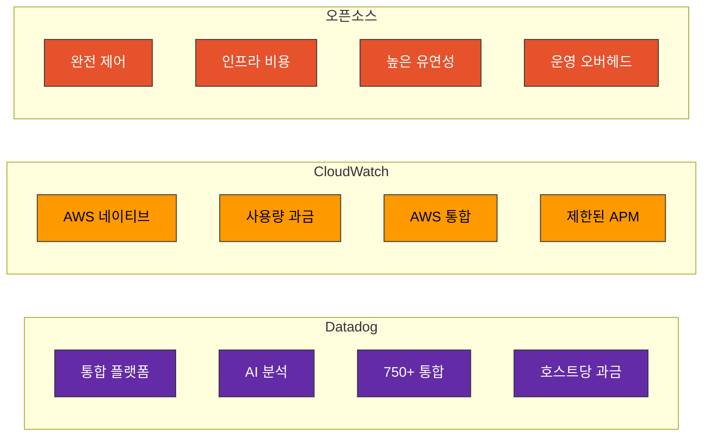
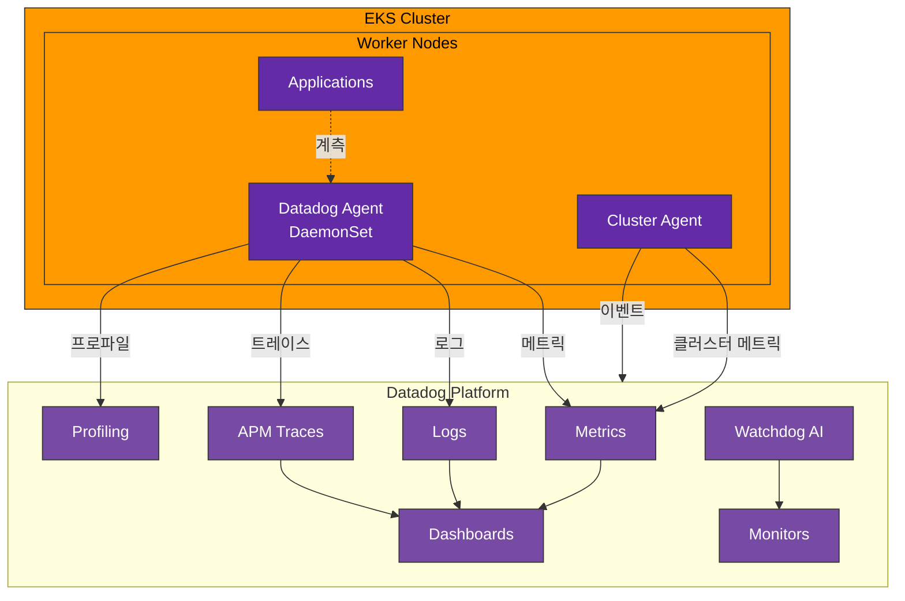
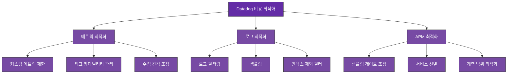

# Datadog

> **마지막 업데이트**: 2026년 2월 20일

## 목차

- [소개](#소개)
- [EKS 통합 아키텍처](#eks-통합-아키텍처)
- [Datadog Agent 설치](#datadog-agent-설치)
- [인프라 모니터링](#인프라-모니터링)
- [APM 및 분산 트레이싱](#apm-및-분산-트레이싱)
- [로그 관리](#로그-관리)
- [대시보드 및 알림](#대시보드-및-알림)
- [비용 구조](#비용-구조)
- [모범 사례](#모범-사례)
- [문제 해결](#문제-해결)

## 소개

Datadog은 클라우드 규모의 인프라, 애플리케이션, 로그를 모니터링하는 통합 관측성 플랫폼입니다. SaaS 모델로 제공되어 인프라 관리 없이 강력한 모니터링 기능을 사용할 수 있습니다.

### 주요 특징

| 특징 | 설명 |
|------|------|
| **통합 플랫폼** | 메트릭, 로그, 트레이스, 프로파일링 통합 |
| **750+ 통합** | AWS, Kubernetes, 데이터베이스 등 광범위한 통합 |
| **자동 계측** | APM Auto-instrumentation 지원 |
| **AI 기반 분석** | Watchdog AI로 자동 이상 탐지 |
| **실시간 모니터링** | 1초 단위 메트릭 수집 가능 |
| **글로벌 인프라** | 전 세계 데이터 센터 |
| **SSO/RBAC** | 엔터프라이즈 보안 기능 |

### Datadog vs 오픈소스 vs CloudWatch



| 항목 | Datadog | CloudWatch | Prometheus+Grafana |
|------|---------|------------|-------------------|
| 배포 모델 | SaaS | 관리형 | 자체 호스팅 |
| 초기 설정 | 매우 쉬움 | 쉬움 | 중간 |
| 운영 부담 | 없음 | 낮음 | 높음 |
| 비용 예측성 | 높음 (호스트 기반) | 낮음 (사용량 기반) | 높음 (인프라 기반) |
| 확장성 | 자동 | 자동 | 수동 |
| APM | 포함 | 별도 (X-Ray) | 별도 구축 |
| 알림 | 고급 | 기본 | Alertmanager |

## EKS 통합 아키텍처

### 전체 아키텍처



### 구성 요소

| 구성 요소 | 역할 |
|----------|------|
| **Datadog Agent** | 노드별 메트릭, 로그, 트레이스 수집 (DaemonSet) |
| **Cluster Agent** | 클러스터 레벨 메트릭 및 이벤트 수집 |
| **Admission Controller** | 자동 APM 계측 주입 |
| **Trace Agent** | APM 트레이스 수집 및 전송 |
| **Process Agent** | 프로세스 및 컨테이너 메트릭 |

## Datadog Agent 설치

### Helm을 사용한 설치

```bash
# Helm 저장소 추가
helm repo add datadog https://helm.datadoghq.com
helm repo update

# API 키 시크릿 생성
kubectl create namespace datadog
kubectl create secret generic datadog-secret \
  --namespace datadog \
  --from-literal api-key=<YOUR_API_KEY> \
  --from-literal app-key=<YOUR_APP_KEY>

# Datadog Agent 설치
helm install datadog datadog/datadog \
  --namespace datadog \
  -f values.yaml
```

### values.yaml

```yaml
# API 키 설정
datadog:
  apiKeyExistingSecret: datadog-secret
  appKeyExistingSecret: datadog-secret

  # 클러스터 이름
  clusterName: my-eks-cluster

  # 사이트 (US1, US3, US5, EU1, AP1 등)
  site: datadoghq.com

  # 태그
  tags:
    - env:production
    - team:platform
    - service:eks

  # 로그 수집
  logs:
    enabled: true
    containerCollectAll: true
    containerCollectUsingFiles: true

  # APM 설정
  apm:
    portEnabled: true
    socketEnabled: true

  # 프로세스 모니터링
  processAgent:
    enabled: true
    processCollection: true

  # 네트워크 모니터링
  networkMonitoring:
    enabled: true

  # 프로파일링
  profiling:
    enabled: true

  # Kubernetes 이벤트
  collectEvents: true

  # Prometheus 메트릭 수집
  prometheusScrape:
    enabled: true
    serviceEndpoints: true

  # 라이브 컨테이너
  containerExclude: "image:datadog/agent"

# Cluster Agent
clusterAgent:
  enabled: true
  replicas: 2

  # 메트릭 서버 (HPA용)
  metricsProvider:
    enabled: true
    useDatadogMetrics: true

  # Admission Controller (자동 계측)
  admissionController:
    enabled: true
    mutateUnlabelled: false

  resources:
    requests:
      cpu: 200m
      memory: 256Mi
    limits:
      cpu: 500m
      memory: 512Mi

# Agent 설정
agents:
  # DaemonSet 설정
  rbac:
    create: true

  # 리소스 제한
  resources:
    requests:
      cpu: 200m
      memory: 256Mi
    limits:
      cpu: 500m
      memory: 512Mi

  # 볼륨 마운트
  volumeMounts:
    - name: passwd
      mountPath: /etc/passwd
      readOnly: true
    - name: group
      mountPath: /etc/group
      readOnly: true

  volumes:
    - name: passwd
      hostPath:
        path: /etc/passwd
    - name: group
      hostPath:
        path: /etc/group

  # tolerations (모든 노드에 배포)
  tolerations:
    - operator: Exists

  # 우선순위 클래스
  priorityClassName: system-node-critical

# Kubernetes 통합
kubeStateMetricsEnabled: true

# Prometheus 오퍼레이터 통합
prometheus:
  enabled: true
```

### IRSA 설정 (선택사항 - AWS 통합용)

```bash
# IAM 정책
cat <<EOF > datadog-aws-policy.json
{
    "Version": "2012-10-17",
    "Statement": [
        {
            "Effect": "Allow",
            "Action": [
                "cloudwatch:GetMetricStatistics",
                "cloudwatch:ListMetrics",
                "ec2:DescribeInstances",
                "ec2:DescribeVolumes",
                "ec2:DescribeTags",
                "tag:GetResources",
                "tag:GetTagKeys",
                "tag:GetTagValues"
            ],
            "Resource": "*"
        }
    ]
}
EOF

aws iam create-policy \
  --policy-name DatadogAWSIntegration \
  --policy-document file://datadog-aws-policy.json

# 서비스 계정 생성
eksctl create iamserviceaccount \
  --name datadog-agent \
  --namespace datadog \
  --cluster my-cluster \
  --attach-policy-arn arn:aws:iam::123456789012:policy/DatadogAWSIntegration \
  --approve
```

## 인프라 모니터링

### 자동 수집 메트릭

Datadog Agent는 자동으로 다양한 인프라 메트릭을 수집합니다.

**시스템 메트릭**:
```yaml
# CPU
system.cpu.user           # 사용자 CPU 사용률
system.cpu.system         # 시스템 CPU 사용률
system.cpu.idle           # 유휴 CPU
system.load.1             # 1분 로드 평균

# 메모리
system.mem.total          # 총 메모리
system.mem.used           # 사용 메모리
system.mem.free           # 가용 메모리
system.mem.cached         # 캐시 메모리

# 디스크
system.disk.total         # 총 디스크
system.disk.used          # 사용 디스크
system.disk.free          # 가용 디스크
system.io.r_s             # 디스크 읽기/초
system.io.w_s             # 디스크 쓰기/초

# 네트워크
system.net.bytes_rcvd     # 수신 바이트
system.net.bytes_sent     # 송신 바이트
```

**Kubernetes 메트릭**:
```yaml
# 노드
kubernetes.cpu.usage.total
kubernetes.memory.usage
kubernetes.memory.limits
kubernetes.filesystem.usage

# 파드
kubernetes.pods.running
kubernetes.containers.running
kubernetes.containers.restarts

# 배포
kubernetes.deployment.replicas
kubernetes.deployment.replicas_available
kubernetes.deployment.replicas_desired

# 서비스
kubernetes.endpoint.address_available
kubernetes.service.count
```

### 커스텀 메트릭 수집

#### Prometheus 어노테이션 기반

```yaml
apiVersion: v1
kind: Pod
metadata:
  name: my-app
  annotations:
    # Datadog Agent가 자동으로 스크랩
    ad.datadoghq.com/my-app.checks: |
      {
        "prometheus": {
          "instances": [
            {
              "prometheus_url": "http://%%host%%:8080/metrics",
              "namespace": "my_app",
              "metrics": ["http_requests_total", "http_request_duration_*"]
            }
          ]
        }
      }
spec:
  containers:
  - name: my-app
    image: my-app:latest
```

#### DogStatsD 사용

```python
# Python 예시
from datadog import initialize, statsd

initialize(statsd_host='localhost', statsd_port=8125)

# 카운터
statsd.increment('my_app.requests', tags=['endpoint:/api/users', 'method:get'])

# 게이지
statsd.gauge('my_app.queue_size', 150, tags=['queue:orders'])

# 히스토그램
statsd.histogram('my_app.response_time', 0.25, tags=['endpoint:/api/users'])

# 분포
statsd.distribution('my_app.request_size', 1024, tags=['content_type:json'])

# 서비스 체크
statsd.service_check('my_app.database', 0)  # 0=OK, 1=WARNING, 2=CRITICAL
```

```go
// Go 예시
package main

import (
    "github.com/DataDog/datadog-go/v5/statsd"
)

func main() {
    client, _ := statsd.New("localhost:8125",
        statsd.WithNamespace("my_app."),
        statsd.WithTags([]string{"env:production"}),
    )
    defer client.Close()

    // 카운터
    client.Incr("requests", []string{"endpoint:/api/users"}, 1)

    // 게이지
    client.Gauge("queue_size", 150, []string{"queue:orders"}, 1)

    // 히스토그램
    client.Histogram("response_time", 0.25, []string{"endpoint:/api/users"}, 1)
}
```

### 서비스 디스커버리

```yaml
# ConfigMap으로 자동 디스커버리 설정
apiVersion: v1
kind: ConfigMap
metadata:
  name: datadog-checks
  namespace: datadog
data:
  nginx.yaml: |
    ad_identifiers:
      - nginx
    init_config:
    instances:
      - nginx_status_url: http://%%host%%:80/nginx_status

  redis.yaml: |
    ad_identifiers:
      - redis
    init_config:
    instances:
      - host: "%%host%%"
        port: "6379"
        password: "%%env_REDIS_PASSWORD%%"
```

## APM 및 분산 트레이싱

### 자동 계측 설정

Admission Controller를 통한 자동 계측:

```yaml
# 파드에 라벨 추가로 자동 계측 활성화
apiVersion: apps/v1
kind: Deployment
metadata:
  name: my-app
spec:
  template:
    metadata:
      labels:
        # 자동 APM 계측 활성화
        admission.datadoghq.com/enabled: "true"
      annotations:
        # 라이브러리 버전 지정 (선택)
        admission.datadoghq.com/java-lib.version: "v1.24.0"
    spec:
      containers:
      - name: my-app
        image: my-java-app:latest
        env:
        # 서비스 이름
        - name: DD_SERVICE
          value: "my-app"
        # 환경
        - name: DD_ENV
          value: "production"
        # 버전
        - name: DD_VERSION
          value: "1.0.0"
```

### 수동 계측 (Java)

```java
// build.gradle
dependencies {
    implementation 'com.datadoghq:dd-trace-api:1.24.0'
}

// Java 코드
import datadog.trace.api.Trace;
import datadog.trace.api.DDTags;
import io.opentracing.Span;
import io.opentracing.util.GlobalTracer;

public class OrderService {

    @Trace(operationName = "order.process", resourceName = "processOrder")
    public Order processOrder(OrderRequest request) {
        Span span = GlobalTracer.get().activeSpan();
        if (span != null) {
            span.setTag("order.id", request.getOrderId());
            span.setTag("customer.id", request.getCustomerId());
        }

        // 비즈니스 로직
        return doProcessOrder(request);
    }
}
```

### 수동 계측 (Python)

```python
# requirements.txt
ddtrace==2.5.0

# 애플리케이션 코드
from ddtrace import tracer, patch_all

# 자동 패치
patch_all()

# 수동 스팬 생성
@tracer.wrap(service='order-service', resource='process_order')
def process_order(order_id):
    span = tracer.current_span()
    if span:
        span.set_tag('order.id', order_id)

    # 비즈니스 로직
    return do_process_order(order_id)

# 컨텍스트 매니저 사용
with tracer.trace('custom.operation', service='my-service') as span:
    span.set_tag('custom.tag', 'value')
    # 작업 수행
```

### 서비스 맵

트레이스 데이터를 기반으로 자동으로 서비스 맵이 생성됩니다:

```yaml
# 서비스 관계 태깅
env:
  - name: DD_SERVICE
    value: "api-gateway"
  - name: DD_ENV
    value: "production"
  - name: DD_VERSION
    value: "2.1.0"
  - name: DD_TAGS
    value: "team:platform,component:gateway"
```

## 로그 관리

### 자동 로그 수집

```yaml
# values.yaml에서 활성화
datadog:
  logs:
    enabled: true
    containerCollectAll: true  # 모든 컨테이너 로그 수집
```

### 파드별 로그 설정

```yaml
apiVersion: v1
kind: Pod
metadata:
  name: my-app
  annotations:
    # 로그 수집 활성화
    ad.datadoghq.com/my-app.logs: |
      [{
        "source": "java",
        "service": "my-app",
        "log_processing_rules": [
          {
            "type": "multi_line",
            "name": "log_start_with_date",
            "pattern": "\\d{4}-\\d{2}-\\d{2}"
          }
        ]
      }]
spec:
  containers:
  - name: my-app
    image: my-app:latest
```

### 로그 파이프라인

Datadog UI에서 로그 파이프라인을 구성하거나 API로 설정:

```json
{
  "name": "Java Application Logs",
  "is_enabled": true,
  "filter": {
    "query": "source:java"
  },
  "processors": [
    {
      "type": "grok-parser",
      "name": "Parse Java logs",
      "is_enabled": true,
      "source": "message",
      "samples": [],
      "grok": {
        "supportRules": "",
        "matchRules": "java_log %{date(\"yyyy-MM-dd HH:mm:ss,SSS\"):timestamp} %{word:level} \\[%{notSpace:thread}\\] %{notSpace:logger} - %{data:message}"
      }
    },
    {
      "type": "status-remapper",
      "name": "Set status from level",
      "is_enabled": true,
      "sources": ["level"]
    },
    {
      "type": "date-remapper",
      "name": "Set timestamp",
      "is_enabled": true,
      "sources": ["timestamp"]
    }
  ]
}
```

### 트레이스-로그 연결

```java
// Java에서 트레이스 ID를 로그에 포함
import org.slf4j.MDC;
import datadog.trace.api.CorrelationIdentifier;

// 로그 패턴에 트레이스 ID 추가
// logback.xml: %d{ISO8601} [%thread] %-5level %logger - dd.trace_id=%X{dd.trace_id} dd.span_id=%X{dd.span_id} - %msg%n

public class LoggingFilter implements Filter {
    @Override
    public void doFilter(ServletRequest request, ServletResponse response, FilterChain chain) {
        MDC.put("dd.trace_id", CorrelationIdentifier.getTraceId());
        MDC.put("dd.span_id", CorrelationIdentifier.getSpanId());
        try {
            chain.doFilter(request, response);
        } finally {
            MDC.clear();
        }
    }
}
```

## 대시보드 및 알림

### 대시보드 생성 (API)

```python
from datadog_api_client import ApiClient, Configuration
from datadog_api_client.v1.api.dashboards_api import DashboardsApi
from datadog_api_client.v1.model.dashboard import Dashboard
from datadog_api_client.v1.model.dashboard_layout_type import DashboardLayoutType

configuration = Configuration()
with ApiClient(configuration) as api_client:
    api_instance = DashboardsApi(api_client)

    dashboard = Dashboard(
        title="EKS Cluster Overview",
        description="Kubernetes cluster monitoring dashboard",
        layout_type=DashboardLayoutType.ORDERED,
        widgets=[
            {
                "definition": {
                    "type": "timeseries",
                    "title": "CPU Usage by Node",
                    "requests": [
                        {
                            "q": "avg:kubernetes.cpu.usage.total{cluster_name:my-cluster} by {host}",
                            "display_type": "line"
                        }
                    ]
                }
            },
            {
                "definition": {
                    "type": "toplist",
                    "title": "Top Pods by Memory",
                    "requests": [
                        {
                            "q": "top(avg:kubernetes.memory.usage{cluster_name:my-cluster} by {pod_name}, 10, 'mean', 'desc')"
                        }
                    ]
                }
            }
        ],
        template_variables=[
            {
                "name": "cluster",
                "default": "my-cluster",
                "prefix": "cluster_name"
            },
            {
                "name": "namespace",
                "default": "*",
                "prefix": "kube_namespace"
            }
        ]
    )

    response = api_instance.create_dashboard(body=dashboard)
```

### 모니터(알림) 설정

```yaml
# Terraform으로 모니터 생성
resource "datadog_monitor" "high_cpu" {
  name    = "High CPU Usage on EKS Nodes"
  type    = "metric alert"
  message = <<-EOT
    CPU usage is high on {{host.name}}.

    Current value: {{value}}%

    @slack-alerts @pagerduty-critical
  EOT

  query = "avg(last_5m):avg:kubernetes.cpu.usage.total{cluster_name:my-cluster} by {host} > 80"

  monitor_thresholds {
    warning  = 70
    critical = 80
  }

  notify_no_data    = false
  renotify_interval = 60

  tags = ["env:production", "team:platform", "cluster:my-cluster"]
}

resource "datadog_monitor" "pod_restarts" {
  name    = "Pod Restart Alert"
  type    = "metric alert"
  message = <<-EOT
    Pod {{pod_name.name}} in namespace {{kube_namespace.name}} is restarting frequently.

    @slack-alerts
  EOT

  query = "change(sum(last_5m),last_5m):sum:kubernetes.containers.restarts{cluster_name:my-cluster} by {pod_name,kube_namespace} > 3"

  monitor_thresholds {
    warning  = 2
    critical = 3
  }

  tags = ["env:production", "cluster:my-cluster"]
}

resource "datadog_monitor" "error_rate" {
  name    = "High Error Rate"
  type    = "metric alert"
  message = <<-EOT
    Error rate is high for service {{service.name}}.

    Current error rate: {{value}}%

    [View APM Dashboard](https://app.datadoghq.com/apm/service/{{service.name}})

    @slack-alerts @pagerduty-warning
  EOT

  query = "sum(last_5m):sum:trace.http.request.errors{env:production} by {service}.as_count() / sum:trace.http.request.hits{env:production} by {service}.as_count() * 100 > 5"

  monitor_thresholds {
    warning  = 2
    critical = 5
  }

  tags = ["env:production", "type:apm"]
}
```

### Watchdog AI

Watchdog은 자동으로 이상을 감지하고 알림을 생성합니다:

```yaml
# Watchdog 알림 설정
resource "datadog_monitor" "watchdog" {
  name    = "Watchdog Alert"
  type    = "event-v2 alert"
  message = <<-EOT
    Watchdog detected an anomaly:
    {{event.title}}

    {{event.text}}

    @slack-alerts
  EOT

  query = "events(\"source:watchdog\").rollup(\"count\").by(\"story_category\").last(\"5m\") > 0"

  tags = ["env:production", "type:watchdog"]
}
```

## 비용 구조

### 요금제 개요

| 플랜 | 인프라 | APM | 로그 | 특징 |
|------|--------|-----|------|------|
| **Free** | 5 호스트 | - | - | 1일 보존 |
| **Pro** | $15/호스트/월 | $31/호스트/월 | $0.10/GB | 15개월 보존 |
| **Enterprise** | $23/호스트/월 | $40/호스트/월 | $0.10/GB | 커스텀 보존 |

### 비용 계산 예시

**100 노드 EKS 클러스터**:
```
인프라 모니터링: 100 × $15 = $1,500/월
APM (50개 서비스): 50 × $31 = $1,550/월
로그 (100GB/일): 100 × 30 × $0.10 = $300/월
-----------------------------------------
예상 총 비용: ~$3,350/월
```

### 비용 최적화 전략



#### 1. 메트릭 최적화

```yaml
# values.yaml
datadog:
  # 불필요한 메트릭 제외
  ignoreAutoConfig:
    - docker
    - containerd

  # 커스텀 메트릭 제한
  dogstatsd:
    nonLocalTraffic: false

  # 태그 카디널리티 제한
  containerExcludeLogs: "name:datadog-agent"
  containerExcludeMetrics: "name:pause"
```

#### 2. 로그 최적화

```yaml
# 로그 필터링 및 샘플링
datadog:
  logs:
    enabled: true
    containerCollectAll: false  # 선별적 수집

# 파드 레벨에서 로그 제외
metadata:
  annotations:
    ad.datadoghq.com/my-app.logs: |
      [{
        "source": "java",
        "service": "my-app",
        "log_processing_rules": [
          {
            "type": "exclude_at_match",
            "name": "exclude_health_checks",
            "pattern": "GET /health"
          }
        ]
      }]
```

#### 3. APM 샘플링

```yaml
# 트레이스 샘플링 설정
env:
  - name: DD_TRACE_SAMPLE_RATE
    value: "0.1"  # 10% 샘플링
  - name: DD_TRACE_RATE_LIMIT
    value: "100"  # 초당 최대 100 트레이스
```

## 모범 사례

### 1. 태깅 전략

```yaml
# 일관된 태깅 체계
datadog:
  tags:
    - env:production
    - team:platform
    - cost-center:engineering
    - cluster:my-eks-cluster

# 서비스 태그
env:
  - name: DD_SERVICE
    value: "order-service"
  - name: DD_ENV
    value: "production"
  - name: DD_VERSION
    valueFrom:
      fieldRef:
        fieldPath: metadata.labels['app.kubernetes.io/version']
```

### 2. 알림 계층화

```yaml
# P1 (Critical) - 즉시 대응
- name: "Service Down"
  priority: P1
  notify: "@pagerduty-critical @slack-incidents"

# P2 (High) - 1시간 내 대응
- name: "High Error Rate"
  priority: P2
  notify: "@pagerduty-warning @slack-alerts"

# P3 (Medium) - 업무 시간 내 대응
- name: "High Latency"
  priority: P3
  notify: "@slack-alerts"

# P4 (Low) - 다음 스프린트
- name: "Resource Warning"
  priority: P4
  notify: "@slack-monitoring"
```

### 3. SLO 설정

```python
# API로 SLO 생성
from datadog_api_client.v1.api.service_level_objectives_api import ServiceLevelObjectivesApi
from datadog_api_client.v1.model.service_level_objective_request import ServiceLevelObjectiveRequest

slo = ServiceLevelObjectiveRequest(
    name="API Availability SLO",
    type="metric",
    description="99.9% availability for API endpoints",
    query={
        "numerator": "sum:trace.http.request.hits{service:api-gateway,http.status_code:2*}.as_count()",
        "denominator": "sum:trace.http.request.hits{service:api-gateway}.as_count()"
    },
    thresholds=[
        {
            "timeframe": "30d",
            "target": 99.9,
            "warning": 99.95
        }
    ],
    tags=["service:api-gateway", "env:production"]
)
```

## 문제 해결

### 일반적인 문제

#### 1. Agent가 메트릭을 전송하지 않음

```bash
# Agent 상태 확인
kubectl exec -it $(kubectl get pods -n datadog -l app=datadog -o jsonpath='{.items[0].metadata.name}') -n datadog -- agent status

# 연결 테스트
kubectl exec -it <agent-pod> -n datadog -- agent diagnose

# 로그 확인
kubectl logs -n datadog -l app=datadog --tail=100
```

#### 2. APM 트레이스 누락

```bash
# Trace Agent 상태 확인
kubectl exec -it <agent-pod> -n datadog -- agent status | grep -A 20 "APM Agent"

# 트레이스 엔드포인트 확인
kubectl exec -it <app-pod> -- env | grep DD_

# 연결 테스트
kubectl exec -it <app-pod> -- nc -zv <agent-service> 8126
```

#### 3. 로그 수집 안됨

```bash
# 로그 설정 확인
kubectl exec -it <agent-pod> -n datadog -- agent configcheck | grep logs

# 파드 어노테이션 확인
kubectl get pod <pod-name> -o jsonpath='{.metadata.annotations}'

# Agent 로그 확인
kubectl logs -n datadog <agent-pod> -c agent | grep -i logs
```

### 디버깅 명령어

```bash
# 전체 Agent 상태
kubectl exec -it <agent-pod> -n datadog -- agent status

# 설정 확인
kubectl exec -it <agent-pod> -n datadog -- agent configcheck

# 연결 진단
kubectl exec -it <agent-pod> -n datadog -- agent diagnose

# 실시간 로그
kubectl exec -it <agent-pod> -n datadog -- agent stream-logs

# 플레어 생성 (지원 요청 시)
kubectl exec -it <agent-pod> -n datadog -- agent flare <case-id>
```

## 참고 자료

- [Datadog 공식 문서](https://docs.datadoghq.com/)
- [Kubernetes Integration](https://docs.datadoghq.com/integrations/kubernetes/)
- [Datadog Helm Charts](https://github.com/DataDog/helm-charts)
- [APM 설정 가이드](https://docs.datadoghq.com/tracing/)
- [Datadog 요금](https://www.datadoghq.com/pricing/)

## 퀴즈

이 장에서 배운 내용을 테스트하려면 [Datadog 퀴즈](../../quizzes/observability/metrics/05-datadog-quiz.md)를 풀어보세요.
