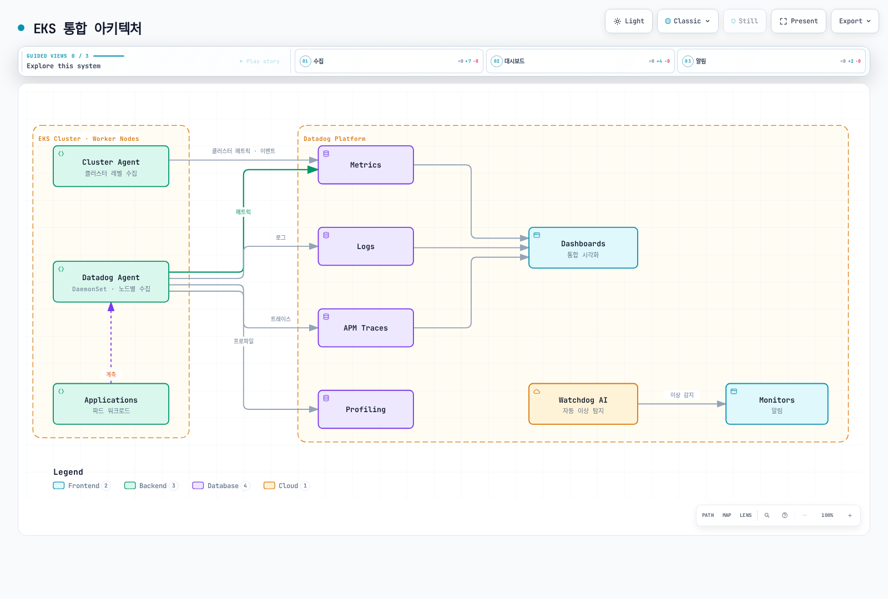

# Datadog

> **마지막 업데이트**: 2026년 9월 13일
> Helm chart 3.244.0; Agent/Cluster Agent 7.83.1을 같은 버전으로 사용합니다.
> 설정·SDK·로컬 검증의 한계는 아래에 명시합니다. Datadog tenant를 변경하지 않았습니다.

## 소개

Datadog은 SaaS 관측 backend를 제공합니다. 팀은 collector·identity·network·계측·
데이터 공개·retention·monitor·비용을 여전히 관리합니다. Infrastructure Monitoring,
APM, profiling, logs 등은 entitlement와 과금 단위가 다르며 Agent 설치만으로
모든 상품이 포함되는 것은 아닙니다.

| 항목 | Datadog | CloudWatch | 자체 운영 Prometheus / Grafana |
| --- | --- | --- | --- |
| Backend | Datadog SaaS; site별 가용성 확인 | AWS 관리형 서비스 | 저장·조회·시각화 운영 |
| 수집 | Agent/Cluster Agent, library, 지원 OTel 경로 | AWS 지표와 agent/SDK/OTLP | Exporter·scraping·agent·remote write |
| APM/log | 필요한 상품 선택·설정 | Application Signals·tracing·Logs 연동 | 해당 backend·collector 구성 |
| 운영 | Collector/config와 application 책임 유지 | 수집/config와 대응 책임 유지 | Backend와 수집 책임 유지 |
| 비용 | Host 및 상품별 사용량·보존 단위 | Metric/observation/OTLP/log/query/alarm 단위 | 인프라와 운영 비용 |

조직과 credential에 맞는 Datadog **site**를 선택합니다. API endpoint·data residency·
상품 가용성·가격 조건을 site 간 동일하게 취급하지 않습니다. 고정된 integration
개수나 보편적인 “쉬움/고급/저렴함” 순위보다 실제 catalogue와 요구사항을 확인합니다.

## EKS 통합 아키텍처

| 구성요소 | 역할 / 경계 |
| --- | --- |
| Node Agent | Host/container check; 지원 EC2 node에서는 보통 DaemonSet |
| Cluster Agent | Kubernetes metadata/check·event 조정과 선택적 admission/external metric 기능 |
| Trace Agent | Application trace payload 수신·전송 |
| Process collection / system-probe | OS·권한·상품 조건이 있는 선택적 process/network/security 기능 |
| Admission Controller | 새 Pod에 연결 설정과, 구성한 경우 지원 client library 주입 |

Trace/profile은 application 계측이 생성합니다. Agent listener나 Pod label만으로
계측 성공이 증명되지는 않습니다. Cluster Agent는 일반 application log/trace
전송 경로가 아닙니다.

설치 예제는 **Linux EC2 기반 EKS node** 대상입니다. EKS Fargate는 이 host
DaemonSet 대신 문서화된 Pod/sidecar 수집 경로를 사용합니다. UDS는 host-local이며
Windows에서 지원되지 않습니다. Windows·Bottlerocket·Auto Mode·혼합 compute는
배포판/기능별 설정과 지원 host 접근을 확인합니다. TLS 검증을 무작정 끄거나 모든
eBPF/process 기능이 어디서나 동작한다고 가정하지 않습니다.

Datadog은 Kubernetes 1.33+의 `AllocatedResources` 호환성에 Agent/Cluster Agent
7.67+를 명시하며 같은 버전을 권장합니다. 이런 최소 기능 요구사항이 현재 EKS
지원 matrix를 대신하지는 않습니다.

다음은 가능한 수집 경로의 개요입니다. Trace/profile에는 application 계측과 해당 상품이 필요하며 Watchdog notification routing도 설정해야 합니다.



[Interactive diagram](https://www.atomai.click/kubernetes-docs/archmaps/ko-observability-metrics-05-datadog-1.html)

## Datadog Agent 설치

Datadog은 상위 lifecycle 설정을 위한 Operator를 권장하며 Helm 설치도 지원합니다.
이 예제는 **Datadog Agent Helm chart**가 node/Cluster Agent를 소유합니다.
Chart 3.244.0에는 선택적 Operator dependency도 있으므로
`datadog.operator.enabled: false`로 이 예제의 추가 controller를 끕니다.
Operator가 폐기되었다는 뜻은 아닙니다.

Chart의 기본 Agent/Cluster Agent는 7.82.3입니다. 여기서는 둘 다 **7.83.1**과
검증한 image-index digest로 고정합니다. 해당 release에는 network test 과금,
containerd snapshot 정리, Cluster Agent 종료 시 leader lock 해제 수정이 있습니다.
두 image index에 Linux amd64/arm64가 포함됨을 확인했습니다. Template 렌더 성공이
Kubernetes 배포나 runtime 호환성 시험을 뜻하지는 않습니다.

### Credential과 설치 소유권

기본 Agent 수집에는 Agent와 같은 namespace의 API key가 필요합니다.
Application key는 external metrics provider 같은 API 조회/제어 기능에 필요하며
기본 Agent 설치만을 위해 요구되지는 않습니다. 선택한 기능에 필요한 범위로 제한해 사용합니다.

승인된 Secret 관리 절차를 사용합니다. 다음 파일 기반 명령은 기존 예제의 따옴표 없는
`<YOUR_API_KEY>`가 shell redirect로 해석되는 문제와 process argument의 key 노출을
피합니다. 임시 key 파일의 보호·삭제도 credential 절차에 따릅니다.
Kubernetes Secret에도 접근·암호화 통제가 필요합니다. 다른 release/controller가
소유한 자원 위에 이 설치를 그대로 실행하지 않습니다.

```bash
helm repo add datadog https://helm.datadoghq.com
helm repo update datadog
kubectl create namespace datadog --dry-run=client -o yaml | kubectl apply -f -

# The protected file contains only the API key; obtain it through your approved secret process.
# Do not put the key in command-line literals, Git or terminal output.
: "${DATADOG_API_KEY_FILE:?Set the path to the protected API-key file}"
kubectl create secret generic datadog-secret --namespace datadog \
  --from-file="api-key=$DATADOG_API_KEY_FILE" --dry-run=client -o yaml | kubectl apply -f -

helm template datadog datadog/datadog --version 3.244.0 \
  --namespace datadog --include-crds --values datadog-values.yaml > datadog-rendered.yaml

# This changes the cluster. Review the rendered resources and installation ownership first.
helm upgrade --install datadog datadog/datadog --version 3.244.0 \
  --namespace datadog --values datadog-values.yaml
```

### 검토한 values

다음을 `datadog-values.yaml`로 저장합니다. Log는 container 설정으로 선택하고
APM/DogStatsD는 UDS를 사용합니다. Cluster 전체 자동 library 주입, external HPA
metric, discovery network statistics, 선택적 process/network 수집은 여기서 켜지 않습니다.
Application은 Agent와 다른 namespace에 둡니다. SSI는 Agent 자체 namespace의
Pod를 계측하지 않습니다.

```yaml
targetSystem: linux
registry: gcr.io/datadoghq
datadog:
  apiKeyExistingSecret: datadog-secret
  clusterName: my-eks-cluster
  site: datadoghq.com
  tags:
  - env:demo
  - team:platform
  logs:
    enabled: true
    containerCollectAll: false
    containerCollectUsingFiles: true
  apm:
    socketEnabled: true
    portEnabled: false
    instrumentation:
      enabled: false
  dogstatsd:
    useSocketVolume: true
    useHostPort: false
    nonLocalTraffic: false
  processAgent:
    processCollection: false
    processDiscovery: false
    containerCollection: true
  networkMonitoring:
    enabled: false
  discovery:
    enabled: false
    networkStats:
      enabled: false
  autoscaling:
    workload:
      enabled: false
  profiling:
    enabled: null
  collectEvents: true
  prometheusScrape:
    enabled: false
  kubeStateMetricsCore:
    enabled: true
    collectSecretMetrics: false
    collectConfigMaps: false
  operator:
    enabled: false
clusterAgent:
  enabled: true
  replicas: 2
  image:
    tag: 7.83.1
    digest: sha256:8e420c81e68abec34ab792c72a6513b739dcba8f7682c52e1e7e276363827b1a
  metricsProvider:
    enabled: false
    useDatadogMetrics: false
  admissionController:
    enabled: true
    mutateUnlabelled: false
agents:
  image:
    tag: 7.83.1
    digest: sha256:ed0bd588e955d82f661d1b8dd1cdf179c1023e74a2817e7a812c99d52f05c319
```

`processAgent.enabled`는 deprecated이며 개별 collection 옵션을 사용합니다.
필요한 경우 chart가 이미 `/etc/passwd`를 mount하므로 수동 `passwd` volume/mount를
중복 추가하지 않습니다. Resource override는 `agents.containers.agent.resources`
같은 구성요소별 위치에 지정하고 실제 컨테이너를 부하 아래에서 측정합니다.
Cluster Agent replica 2개만으로 배치·disruption·장애 시험을 대신하지 않습니다.

기존 최상위 `kubeStateMetricsEnabled`와 `prometheus.enabled`는 설명한 integration을
설정하지 않습니다. Legacy KSM 옵션은 `datadog` 아래에 있으며 예제는
`datadog.kubeStateMetricsCore.enabled`로 legacy 중복 수집을 피합니다.
명시적 Datadog Autodiscovery check와 annotation 전체를 찾는 `prometheusScrape`도 다릅니다.

`datadog.profiling.enabled`는 **유효한 설정**입니다. 대상 Pod에
`DD_PROFILING_ENABLED`를 주입하며 설치된 client library와 Cluster Agent 7.57+가
필요합니다. 계측되지 않은 임의 application에 profiler를 설치하는 기능이 아닙니다.
`null`/`false`/`auto`/`true` 의미를 확인해 선택합니다. External HPA metric에는
application key·API 권한·service/CRD·실제 지표가 필요하며 network monitoring은
지원되는 system-probe 접근이 필요합니다.

### AWS 계정 integration은 별도 경로

SaaS AWS account integration은 Datadog이 제공한 external ID와 승인된
cross-account role, 선택한 integration의 권한을 사용합니다. Node Agent SA에
임의 IRSA role을 붙여도 SaaS integration이 구성되지는 않습니다.
일반 Kubernetes Agent 수집에 기존의 광범위한 CloudWatch/EC2/tag policy가 필요한 것은 아닙니다.

실제 AWS API를 호출하는 Agent/check에만 해당 role·trust·권한으로 Pod Identity나
IRSA를 구성합니다. **렌더링된** SA 이름을 확인합니다. 추측한 `datadog-agent`에
IAM association을 만들어도 Helm release의 다른 SA에 연결되지 않습니다.
로컬 STS caller 확인을 workload identity의 증거로 삼지 않습니다.

## 인프라 모니터링

### Collector·단위·tag 확인

| 지표 / 수집원 | 의미 |
| --- | --- |
| `system.cpu.idle` / System check | CPU idle **percent**; node의 퍼센트 threshold에 사용 가능 |
| `system.mem.total`, `system.mem.used`, `system.mem.free` | 메모리 값; free와 usable/reclaimable은 같지 않음 |
| `kubernetes.cpu.usage.total` / Kubelet | Percent가 아닌 **nanocore**; 1 core = 1,000,000,000 nanocore |
| `kubernetes.memory.usage`, `kubernetes.memory.limits` | Bytes; 같은 entity/tag set의 usage와 limit을 비교 |
| `kubernetes.pods.running`, `kubernetes.containers.restarts` | 유효한 Kubelet gauge: 실행 Pod 수와 container 누적 재시작 수 |
| `kubernetes_state.deployment.replicas_available`, `kubernetes_state.deployment.replicas_desired` | Kubernetes State Metrics Core의 Deployment 상태 |
| `kubernetes_state.pod.status_phase`, `kubernetes_state.service.count` | Pod phase/service inventory; 실제 grouping tag 확인 |
| `kubernetes_state.container.restarts` | Namespace/Pod/container tag가 있는 State Core의 restart gauge |

Legacy Kubernetes integration·Kubelet·State Core의 catalogue는 다릅니다.
한 목록에 없다는 이유로 Agent에서 제거된 지표라고 판단하거나 유효한 Kubelet
지표를 무작정 바꾸지 않습니다. Filesystem/network 가용성과 rate 단위도
collector/runtime에 따라 실제 정의를 확인합니다.

이 Kubernetes 설치의 표준 tag는 `kube_cluster_name`이며 실제 tag를 확인한 뒤
grouping합니다. Cluster 중심 State Core 지표에는 항상 `host` tag가 있지는 않습니다.
`cluster_name`과 `kube_cluster_name`은 다릅니다. Nanocore 값을 80과 비교해도 CPU 80%가 아닙니다.

### OpenMetrics Autodiscovery

다음 **metadata fragment**는 container 이름이 `app`이고 9464 포트에서 gauge
`queue_depth`를 제공하는 workload에 병합합니다. Application/endpoint 자체를
생성하는 예제가 아닙니다. Annotation의 container identifier를 맞추고 endpoint 접근
및 필요한 TLS/authentication을 설정합니다.

```yaml
metadata:
  annotations:
    ad.datadoghq.com/app.checks: "{\n  \"openmetrics\": {\n    \"init_config\": {},\n\
      \    \"instances\": [\n      {\n        \"openmetrics_endpoint\": \"http://%%host%%:9464/metrics\"\
      ,\n        \"namespace\": \"my_app\",\n        \"metrics\": [\n          {\n\
      \            \"queue_depth\": \"queue_depth\"\n          }\n        ]\n    \
      \  }\n    ]\n  }\n}"
```

현재 `openmetrics` check는 `openmetrics_endpoint`를 사용합니다. 이 Datadog
Autodiscovery annotation에는 별도 Prometheus server나 chart의 광범위한
`prometheusScrape` discovery가 필요하지 않습니다. 필요한 지표/label만 선택합니다.
Counter/histogram은 이름 정규화·생성되는 `.count`/bucket series·check 버전을
확인하고 Prometheus 이름이 최종 Datadog 이름이라고 가정하지 않습니다.

### DogStatsD: application에서 접근 가능한 endpoint

Application Pod의 `localhost`는 node Agent가 아닙니다. Linux 예제는 host-local
UDS directory를 사용합니다. Admission Controller의 `socket` mode는
`DD_DOGSTATSD_URL`, `DD_TRACE_AGENT_URL`과 volume을 주입할 수 있으며,
그 외에는 같은 경로의 mount와 권한을 직접 맞춥니다.
Pod별 `admission.datadoghq.com/config.mode`는 annotation이 아닌 **label**입니다.
Agent 재시작 때 socket 교체가 보이도록 개별 socket 대신 부모 directory를 mount합니다.

Python helper는 `datadog==0.53.0`으로 확인했습니다. `socket_path`에는
`/var/run/datadog/dsd.socket` 같은 실제 파일 경로를 전달합니다.
다른 SDK/env의 `unix://` URL과 같은 인자 형식이 아닙니다.
`emit_batch`에는 실제 구간 count를 전달하고 good/error가 0이어도 발행합니다.

```python
from datadog import DogStatsd


def emit_batch(client, total, errors):
    """Report one real interval; send zeros instead of omitting counters."""
    if any(isinstance(x, bool) or not isinstance(x, int) for x in (total, errors)):
        raise ValueError("counts must be integers")
    if not 0 <= errors <= total:
        raise ValueError("require 0 <= errors <= total")
    client.increment("requests.total", total)
    client.increment("requests.error", errors)
    client.increment("requests.good", total - errors)


# Create once in an application with the Agent's UDS directory mounted.
# This construction does not mean that the socket or receiving Agent is ready.
def make_metrics_client(socket_path):
    return DogStatsd(
        socket_path=socket_path,
        namespace="my_app",
        constant_tags=["env:demo", "service:orders"],
        disable_telemetry=True,
        disable_buffering=True,
    )
```

Go helper는 datadog-go/v5를 사용합니다. `WithNamespace("my_app.")`와 같은
`env:demo,service:orders` tag로 client를 만들고 생성·전송·종료 오류를 처리합니다.
`statsd.New` 오류를 버리지 않습니다. Helper는 caller가 준 공유 client를 종료하지 않습니다.

```go
package metrics

import (
    "fmt"

    "github.com/DataDog/datadog-go/v5/statsd"
)

// The caller creates/reuses the client, checks New's error, and closes it at shutdown.
// For the Linux UDS example, use unix:///var/run/datadog/dsd.socket.
func EmitBatch(client *statsd.Client, total, errors int64) error {
    if errors < 0 || total < errors {
        return fmt.Errorf("require 0 <= errors <= total")
    }
    for _, item := range []struct {
        name string
        value int64
    }{
        {"requests.total", total},
        {"requests.error", errors},
        {"requests.good", total - errors},
    } {
        if err := client.Count(item.name, item.value, nil, 1); err != nil {
            return err
        }
    }
    return nil
}
```

| DogStatsD 유형 | 해석 |
| --- | --- |
| Counter | 구간 count; Datadog에는 rate로 저장될 수 있으며 `.as_count()`로 조회 구간 count 계산 |
| Gauge | Queue depth 같은 snapshot; 합이 처리 request 수는 아님 |
| Histogram | 수신 Agent별 집계; host percentile 평균은 전체 percentile이 아님 |
| Distribution | Backend distribution 집계; percentile 활성화·tag·과금 확인 |
| Service check | 실제 health check의 상태: 0 OK, 1 warning, 2 critical, 3 unknown |

로컬 datagram 전달은 SaaS 수집 확인 응답이 아닙니다. UDP 손실, UDS/client buffer와
Agent queue도 관측해야 합니다. 예제 helper는 DogStatsD client telemetry를 켜지
않으므로 배포 시 별도 수집 상태 신호를 선택합니다.
Counter 재전송·중복 전송을 exactly-once business ledger로 취급하지 않습니다.

### 파일 기반 Autodiscovery 설정

Helm 소유 config는 `datadog.confd`가 check file 생성과 mount를 처리합니다.
`datadog-checks`라는 독립 ConfigMap이 있다고 자동 발견되는 것은 아닙니다.
다음 NGINX fragment에는 일치하는 image identity와 설정·접근 권한이 있는
`stub_status` endpoint가 필요합니다.

```yaml
datadog:
  confd:
    nginx.yaml: "ad_identifiers:\n  - nginx\ninit_config: {}\ninstances:\n  - nginx_status_url:\
      \ http://%%host%%:80/nginx_status\n"
```

인증된 Redis check에는 port/TLS와 credential 전달을 추가로 준비합니다.
`%%env_REDIS_PASSWORD%%`는 Redis Pod가 아니라 **Agent의** environment를 읽습니다.
필요한 권한으로 구성한 Datadog secret backend나 보호된 file 전달을 사용하고,
공개 예제에 password를 넣거나 discovery만을 위해 cluster 전체 Secret 읽기를
허용하지 않습니다.

## APM 및 분산 트레이싱

### Local SDK injection과 SSI를 명시적으로 선택

Admission opt-in label은 mutation과 연결 설정 주입을 허용합니다.
Tracing library를 설치하려면 SSI target 또는 지원 언어/version annotation을
설정합니다. Label만으로 SDK 설치나 Datadog까지의 trace 전달이 증명되지는 않습니다.
Local injection은 Java/Python/Node.js에 Cluster Agent 7.40+, .NET/Ruby에 7.44+가
필요합니다. 현재 7.83.1은 `kube-system`과 자신의 namespace도 주입에서 제외합니다.

제한된 Java 예제는 다음 **pod-template fragment**를 application namespace의
기존 Deployment에 병합합니다. Selector·container·security 설정을 보존하며,
단독 apply할 완전한 Deployment가 아닙니다. Java init image
`gcr.io/datadoghq/dd-lib-java-init:v1.66.0`의 Linux amd64/arm64 배포를 확인했습니다.
실제 application의 JVM/framework/image 호환성은 별도로 확인합니다.

```yaml
spec:
  template:
    metadata:
      labels:
        admission.datadoghq.com/enabled: 'true'
        admission.datadoghq.com/config.mode: socket
        tags.datadoghq.com/env: demo
        tags.datadoghq.com/service: orders
        tags.datadoghq.com/version: 1.0.0
      annotations:
        admission.datadoghq.com/java-lib.version: v1.66.0
```

`tags.datadoghq.com/*` label로 service/environment/version tag를 통일합니다.
Deployment metadata에만 넣었다고 Pod에 상속되지는 않습니다.
주입은 **새 Pod** admission 시점에 이루어집니다. Init container·library file·UDS
mount/권한·비밀값이 아닌 연결 설정을 확인한 뒤 실제 traffic/trace를 검증합니다.
Namespace 제외·webhook 오류·security policy·미지원 image가 계측을 막을 수 있습니다.

Cluster 전체 SSI는 `datadog.apm.instrumentation`의 namespace/pod target과 library
버전을 검토해 설정하는 다른 방식입니다. 수동/injected tracer를 의도치 않게 중복
설치하지 않습니다. 주입된 library가 수동 설치 버전보다 우선할 수 있습니다.
Profiler도 지원 client library와 해당 상품/runtime 조건이 필요합니다.

### 수동 Java 계측

Application JVM을 시작할 때 버전이 고정된 `dd-java-agent.jar`를 준비해 사용하거나
위 주입 경로를 선택합니다. `dd-trace-api` dependency만 추가하면 annotation/API를
사용할 수 있지만 runtime bytecode 계측이 **시작되지는 않습니다**.
다음 Maven dependency와 Java source는 별도 파일입니다.

```xml
<dependency>
  <groupId>com.datadoghq</groupId>
  <artifactId>dd-trace-api</artifactId>
  <version>1.66.0</version>
</dependency>
```
```java
import java.util.function.Supplier;
import datadog.trace.api.Trace;

public final class TraceMethods {
    private TraceMethods() {}

    @Trace(operationName = "order.process", resourceName = "process_order")
    public static <T> T process(Supplier<T> handler) {
        return handler.get();
    }
}
```

Handler는 caller가 제공한 application 코드입니다. Operation/resource 이름은
유한한 값으로 유지합니다. 기존 per-order/customer ID tag는 이 예제에 필요하지
않으며 공개 범위/cardinality 위험을 늘릴 수 있습니다.
수동 span API에는 지원 bridge/library가 필요합니다. Annotation API만 있는
project에 OpenTracing import를 추가하는 것만으로 동작하지 않습니다.

### 수동 Python 계측

검토한 4.14.0 예제는 현재 `ddtrace.trace` import를 사용합니다.
Dependency 선언은 Python 코드 안이 아니라 `requirements.txt`에 둡니다.
Framework 자동 계측은 application import 전에 선택한 `ddtrace-run`/SSI 절차를
따릅니다. 이 helper가 framework 전체를 patch한다고 가정하지 않습니다.

```text
ddtrace==4.14.0
```
```python
from ddtrace.trace import tracer


def process_order(handler):
    with tracer.trace("order.process", service="orders", resource="process_order") as span:
        span.set_tag("operation.kind", "order")
        return handler()
```

Method 계측에는 `tracer.wrap` decorator도 사용할 수 있습니다.
Handler 오류는 caller로 전달해야 하며 span 기록이 재시도나 성공을 보장하지 않습니다.
지원 HTTP/message integration의 context propagation과 service/env/version tag를
맞춥니다. Service map은 관측된 계측 관계로 생성되며 임의 `DD_TAGS`만으로 만들어지지 않습니다.

Raw customer/order ID, token, request body를 기본 tag로 넣지 않습니다.
실제 application의 수집 항목·오류 메시지·sampling/redaction을 검토합니다.
자동 계측이 PII를 모두 제거한다고 보장하지 않습니다.

## 로그 관리

### 수집과 parsing을 명시적으로 선택

설치 예제는 log collection을 켜고 `containerCollectAll: false`로 둡니다.
다음 metadata를 container 이름이 `app`인 Pod template에 병합합니다.
Multiline rule은 **날짜로 시작하는 plain-text Java record**에 해당하며 일반 JSON
parser가 아닙니다. Container runtime framing과 application message parsing은
다른 단계이므로 실제 수집 record를 확인합니다.

```yaml
metadata:
  annotations:
    ad.datadoghq.com/app.logs: "[\n  {\n    \"source\": \"java\",\n    \"service\"\
      : \"orders\",\n    \"log_processing_rules\": [\n      {\n        \"type\": \"\
      multi_line\",\n        \"name\": \"java_timestamp_start\",\n        \"pattern\"\
      : \"^\\\\d{4}-\\\\d{2}-\\\\d{2}\"\n      }\n    ]\n  }\n]"
```

한 줄에 JSON event 하나를 쓰는 application은 지원 JSON 경로를 사용하고 이 rule로
무관한 JSON event를 합치지 않습니다. File 접근·runtime path·annotation matching·
exclude 설정·backend pipeline filter가 모두 수집에 영향을 줍니다.
대상 application과 제외 대상 모두로 선택 수집을 확인합니다.

### Pipeline 요청 구조

실제 API field는 **`match_rules`와 `support_rules`**입니다.
기존 camelCase field는 Logs API model과 맞지 않습니다. Sample message가 기대하는
line format을 정의합니다. 실제 application format/timezone과 unmatched/multiline/
error 사례를 시험합니다. 요청 model이 유효해도 Datadog tenant에서 Grok parsing이나
수집/indexing이 성공했다는 뜻은 아닙니다.

```json
{
  "name": "Java application logs",
  "is_enabled": true,
  "filter": {
    "query": "source:java service:orders"
  },
  "processors": [
    {
      "type": "grok-parser",
      "name": "Parse the documented Java line format",
      "is_enabled": true,
      "source": "message",
      "samples": [
        "2026-09-13 12:00:00,123 INFO [main] example.Service - completed"
      ],
      "grok": {
        "support_rules": "",
        "match_rules": "java_log %{date(\"yyyy-MM-dd HH:mm:ss,SSS\"):timestamp} %{word:level} \\[%{notSpace:thread}\\] %{notSpace:logger} - %{data:message}"
      }
    },
    {
      "type": "status-remapper",
      "name": "Use level as status",
      "is_enabled": true,
      "sources": [
        "level"
      ]
    },
    {
      "type": "date-remapper",
      "name": "Use parsed timestamp",
      "is_enabled": true,
      "sources": [
        "timestamp"
      ]
    }
  ]
}
```

Pipeline 생성/순서 변경은 matching log 처리에 영향을 줍니다.
올바른 site·제한된 API 권한·기존 pipeline 소유권으로 설정합니다.
이번 감사에서는 pipeline API 요청을 보내지 않았습니다.

### Trace-log 연결과 MDC 소유권

가능하면 지원되는 자동 log injection을 쓰고 structured log의 trace/span ID를
문자열로 보존합니다. Service/env/version·timestamp·parsing과 실제 trace data도
필요합니다. ID field 두 개만 있다고 correlation이 보장되지는 않습니다.
계측하지 않은 process에는 유용한 active trace ID가 없습니다.

SLF4J MDC를 직접 다루는 application에서는 다음 helper가 성공/실패 후 caller의
**기존 context 전체**를 복원합니다. 기존의 무조건적인 `MDC.clear()`는 무관한 caller
field도 지웠습니다. 이 코드는 동기 helper이며 async context propagation이나
완전한 servlet filter가 아닙니다.

```java
import java.util.Map;
import java.util.function.Supplier;
import datadog.trace.api.CorrelationIdentifier;
import org.slf4j.MDC;

public final class TraceLogContext {
    private TraceLogContext() {}

    public static <T> T withTraceContext(Supplier<T> handler) {
        Map<String, String> previous = MDC.getCopyOfContextMap();
        try {
            MDC.put("dd.trace_id", CorrelationIdentifier.getTraceId());
            MDC.put("dd.span_id", CorrelationIdentifier.getSpanId());
            return handler.get();
        } finally {
            if (previous == null) {
                MDC.clear();
            } else {
                MDC.setContextMap(previous);
            }
        }
    }
}
```

`dd-trace-api`와 application에 맞는 SLF4J API/provider가 필요합니다.
Log pattern/JSON encoder도 MDC 값을 포함해야 합니다. Servlet 예제라면 해당 API·
import·checked exception 계약 없이 그대로 복사하지 않습니다.

## 대시보드 및 알림

### Dashboard 요청 생성

다음 helper는 `datadog-api-client==2.60.0`으로 요청 body를 만듭니다.
Query가 cluster/namespace template variable을 실제 참조합니다.
Host widget은 percent 지표, Pod widget은 memory byte와 namespace filter를
사용합니다. 실제 데이터에 해당 grouping tag가 있는지 확인합니다.

```python
from datadog_api_client.v1.model.dashboard import Dashboard
from datadog_api_client.v1.model.dashboard_layout_type import DashboardLayoutType


def build_dashboard(cluster_name):
    return Dashboard(
        title="EKS observability example",
        layout_type=DashboardLayoutType.ORDERED,
        widgets=[
            {"definition": {
                "type": "timeseries",
                "title": "CPU idle by host (%)",
                "requests": [{"q": "avg:system.cpu.idle{$cluster} by {host}", "display_type": "line"}],
            }},
            {"definition": {
                "type": "toplist",
                "title": "Top 10 pod memory series by mean (bytes)",
                "requests": [{"q": "top(sum:kubernetes.memory.usage{$cluster,$namespace} by {pod_name,kube_namespace}, 10, 'mean', 'desc')"}],
            }},
        ],
        template_variables=[
            {"name": "cluster", "prefix": "kube_cluster_name", "default": cluster_name},
            {"name": "namespace", "prefix": "kube_namespace", "default": "*"},
        ],
    )
```

Caller가 올바른 `ApiClient`를 구성하고 `DashboardsApi`로 의도한 dashboard를
생성/수정합니다. 반환 ID를 저장·대조하며 title만으로 반복 생성하면 중복될 수
있습니다. Site와 제한된 automation credential은 node Agent API key와 별개입니다.
이번 감사에서는 dashboard API를 호출하지 않았습니다.

### Monitor query와 단위

Datadog Terraform provider와 project의 version constraints/lock file을 구성합니다.
아래는 resource fragment이며 완전한 provider/credential 설정이 아닙니다.
Threshold는 예시이므로 실제 단위·tag·평가 구간·application 목표를 확인합니다.
첫 monitor는 nanocore를 80과 비교해 CPU percent라고 부르지 않고 idle percent를
직접 평가합니다.

```hcl
# Fragments for a configured, version-pinned Datadog Terraform provider.
# Replace notification destinations with approved, tested destinations.
resource "datadog_monitor" "low_cpu_idle" {
  name    = "Low CPU idle on EKS nodes"
  type    = "metric alert"
  message = "CPU idle on {{host.name}} is {{value}}%. Inspect the host and collection health."
  query   = "avg(last_5m):avg:system.cpu.idle{kube_cluster_name:my-eks-cluster} by {host} < 20"
  monitor_thresholds {
    warning  = 30
    critical = 20
  }
  require_full_window = false
  notify_no_data      = false
  tags               = ["env:demo", "team:platform"]
}

resource "datadog_monitor" "restart_total" {
  name    = "Container restart total exceeds example threshold"
  type    = "metric alert"
  message = "Inspect {{pod_name.name}} / {{kube_container_name.name}}. This is a restart total, not a count of new restarts in five minutes."
  query   = "max(last_5m):max:kubernetes_state.container.restarts{kube_cluster_name:my-eks-cluster} by {pod_name,kube_namespace,kube_container_name} > 3"
  monitor_thresholds {
    warning  = 2
    critical = 3
  }
  require_full_window = false
  notify_no_data      = false
  tags               = ["env:demo", "team:platform"]
}

resource "datadog_monitor" "request_error_rate" {
  name    = "High request error ratio"
  type    = "metric alert"
  message = "Error ratio for {{service.name}} is {{value}}%. Check traffic volume and the reporting path."
  query   = "sum(last_5m):sum:my_app.requests.error{env:demo} by {service}.as_count() / sum:my_app.requests.total{env:demo} by {service}.as_count() * 100 > 5"
  monitor_thresholds {
    warning  = 2
    critical = 5
  }
  require_full_window = false
  notify_no_data      = false
  tags               = ["env:demo", "type:application"]
}
```

Restart gauge는 **누적 total**입니다. 두 구간에서 반복 수집한 gauge sample 합의
차이는 reset·Pod 교체·수집 간격 차이가 있으면 새 재시작 횟수가 아닙니다.
최근 재시작 monitor에는 검증된 delta/reset 설계가 필요합니다.
이 예제는 total threshold임을 명시합니다.

Error monitor는 `emit_batch`의 세 counter를 사용하며 errors/good가 0인 경우도
발행합니다. `.as_count()` 경로는 **나누기 전에** 시간축을 집계하여
sum(errors)/sum(total)을 계산합니다. 각 시간 bucket의 비율을 합하는 것과 다르며
이 경로에는 sum aggregator를 사용합니다.

무트래픽·telemetry 누락·실제 오류 없는 traffic은 다릅니다. 최소 traffic과 수집 상태
조건을 정하고 monitor의 no-data 동작을 검증합니다. `notify_no_data: false`는
여기서 누락 데이터 알림을 보내지 않을 뿐 정상 상태의 증거가 아닙니다.

내장 APM 지표는 선택한 integration의 실제 `trace.<operation>.hits/errors`와 tag를
사용합니다. Java/Python 등 모든 integration이 `trace.http.request.*`를 발행하지는
않습니다. Trace analytics·생성된 trace metric·custom DogStatsD metric은 다른 수집원입니다.

### Watchdog과 알림 전달

Watchdog은 모든 threshold를 수동 지정하지 않아도 탐지한 anomaly/insight를 보여줄 수
있습니다. Insight가 있다는 사실은 notification 전달의 증거가 아닙니다.
해당 site의 지원 Watchdog/monitor 절차와 event source·상품 가용성·routing을 확인합니다.

다음 event-monitor fragment는 조직에 `source:watchdog`과 일치하는 실제 event가
있다는 전제입니다. `story_category` group tag를 임의 가정하거나 모든 Watchdog
결과가 이 stream에 들어온다고 보장하지 않습니다. 알림을 켜기 전에 실제 event로
filter를 검증합니다.

```hcl
resource "datadog_monitor" "watchdog_events" {
  name    = "Review matching Watchdog events"
  type    = "event-v2 alert"
  message = "Review the matching Watchdog event and affected services. Add an approved notification destination."
  query   = "events(\"source:watchdog\").rollup(\"count\").last(\"5m\") > 0"
  tags    = ["env:demo", "type:watchdog"]
}
```

### SLO 요청 생성

Metric 기반 SLO에는 명확한 good/total count 정의가 필요합니다.
다음 helper는 앞에서 명시적으로 발행한 counter를 사용합니다.
Good은 application SLI 정책과 맞춰야 하며 HTTP 2xx만 성공으로 세는 것이
보편적 availability 정의는 아닙니다. 무트래픽·누락 데이터 동작을 검증하고 부재를
100% 성공으로 취급하지 않습니다.

```python
from datadog_api_client.v1.model.service_level_objective_request import ServiceLevelObjectiveRequest


def build_success_slo():
    return ServiceLevelObjectiveRequest(
        name="Orders successful-request SLO",
        type="metric",
        description="Successful requests divided by all reported requests",
        query={
            "numerator": "sum:my_app.requests.good{env:demo,service:orders}.as_count()",
            "denominator": "sum:my_app.requests.total{env:demo,service:orders}.as_count()",
        },
        thresholds=[{"timeframe": "30d", "target": 99.9, "warning": 99.95}],
        tags=["env:demo", "service:orders"],
    )
```

이 함수는 요청을 만들며 live SLO를 생성하지 않습니다. 구성된 caller가 소유권·
데이터·권한을 확인한 뒤 `ServiceLevelObjectivesApi.create_slo`에 전달할 수 있습니다.
Monitor 기반과 time-slice SLO도 지원하므로 gauge/restart total을 good-event count로
억지 변환하지 말고 SLI에 맞는 모델을 선택합니다.

## 비용 구조

### 실제 상품·계약 단위로 계산

| 구성요소 | 계산에 필요한 입력 |
| --- | --- |
| Infrastructure | Billable host/container 또는 해당 플랫폼 모델, plan과 약정 조건 |
| APM | Billable APM host와 plan/model, 포함량, ingested/indexed span |
| Logs | 수집량과 indexing/retention/search/archive 선택 |
| Custom metrics / distribution | 고유 metric/tag 조합, 활성 aggregation과 포함량 |
| 추가 상품 | Profiling·network/security·serverless 등 활성화한 상품 비용 |

모든 상품을 하나의 Free/Pro/Enterprise 표로 합치지 않습니다. 가격표는 상품,
연간/on-demand 조건, 다른 상품에 결합한 경우와 standalone 조건을 구분합니다.
Infrastructure metric·검색 가능한 trace·indexed log의 retention이 모두 같은
“15개월” 설정인 것은 아닙니다.

기존 100-node 예제에서 **service 50개가 APM host 50개를 뜻하지 않습니다**.
Host 단위 계약이라면 실제 billable Infrastructure/APM host 수를 먼저 확인합니다.
100 GB/day를 30일 수집하면 3,000 GB이지만 수집료만으로 전체 log 비용을 계산할 수 없습니다.

```text
예상 비용 =
  billable infrastructure 단위 × 적용 단가
  + billable APM 단위 × 적용 단가
  + 계약상 ingested/indexed span 초과분
  + 3,000 GB × 적용 log 수집 단가
  + indexed event/retention/search/archive 비용
  + custom metric 및 기타 활성 상품 비용
```

기존 약 $3,350 합계는 APM 단위를 혼동하고 일부 과금 항목을 누락했으며 실제 측정한
production 청구액이 아닙니다. 현재 site/상품 견적과 측정 사용량을 사용하고
그 예시를 예산 보장으로 취급하지 않습니다.

### Metric·log·trace 제어는 역할이 다름

- `dogstatsd.nonLocalTraffic`은 receiver 접근 범위이며 custom metric quota가
  아닙니다. Receiver를 닫으면 telemetry가 유실될 수 있습니다.
- `ignoreAutoConfig`는 선택한 자동 check를 끕니다. Container exclude는 container를
  선택하며 어느 것도 일반적인 tag-cardinality limiter가 아닙니다.
- 수집 소유자에서 metric/tag 값을 검토합니다. Origin tag cardinality를 바꾸면
  grouping tag도 달라질 수 있으므로 monitor/SLO를 다시 확인합니다.
- Source log exclude는 선택한 record 전송을 막지만 index exclude는 이후 단계여서
  ingestion 비용을 없애지 않습니다. 사고 증거와 실패 log를 보존하고 성공 여부와
  무관하게 모든 health-check line을 버리지 않습니다.
- Sampling과 indexing/retention은 별도입니다. `DD_TRACE_SAMPLE_RATE`나 sampling
  rule은 library/version·matching 범위에 따릅니다. Python의 문서화된
  `DD_TRACE_RATE_LIMIT`은 설정한 sampling rule/rate와 함께 적용하는 process별 제한이며
  cluster 전체/금액 상한이 아닙니다. Trace 10% sampling이 전체 비용 90% 절감을 뜻하지 않습니다.

## 모범 사례

Service/env/version label과 유한한 tag를 일관되게 사용하고 API-key 수집 권한과
application-key automation 권한을 구분합니다. 모든 log·process argument·profile을
수집하기 전에 application capture와 secret/redaction 경로를 검토합니다.
Collector queue/drop을 관측하고 filter 변경 후 실제 결과를 확인합니다.

운영팀과 severity·담당자·응답 목표를 합의합니다. Runbook의 P1/P2 표기는 운영 정책이며
단독 Datadog resource 정의가 아닙니다. 실제 destination·missing data·recovery 알림을
시험합니다. 예시 숫자만으로 threshold를 정하지 말고 SLI/SLO와 traffic 상황을 사용합니다.

## 문제 해결

설치 소유자·실제 Pod/container 이름·의도한 site부터 확인합니다.
API-key Secret 참조, Agent/Cluster Agent 상태, Kubelet/RBAC 접근, scrape config,
queue/drop을 조사합니다. 이 release에서 렌더링한 node Agent에는 `agent`와
`trace-agent` container가 있습니다. 기존 `app=datadog` selector를 현재 label 확인
대신 무조건 사용하지 않습니다.

```bash
kubectl get pods -n datadog \
  -l app.kubernetes.io/instance=datadog,app.kubernetes.io/component=agent -o wide

# Select the actual node Agent pod after inspecting the list.
: "${DD_AGENT_POD:?Set the node Agent pod name}"
kubectl exec -n datadog "$DD_AGENT_POD" -c agent -- agent status
kubectl logs -n datadog "$DD_AGENT_POD" -c agent --tail=100
kubectl logs -n datadog "$DD_AGENT_POD" -c trace-agent --tail=100

# Check new application pods without dumping credentials/environment values.
: "${APP_NAMESPACE:?Set the application namespace}"
: "${APP_POD:?Set the application pod name}"
kubectl get pod -n "$APP_NAMESPACE" "$APP_POD" \
  -o jsonpath='{.spec.initContainers[*].image}'
kubectl get pod -n "$APP_NAMESPACE" "$APP_POD" \
  -o jsonpath='{range .spec.containers[*]}{.name}{": "}{.env[*].name}{"\n"}{end}'

# Create a local diagnostic archive only; review it before any authorized sharing.
kubectl exec -n datadog "$DD_AGENT_POD" -c agent -- agent flare --local
```

Trace는 실제 library 주입/시작, socket 또는 host endpoint, 권한과 tag를 확인합니다.
TCP 연결 성공이 UDS 경로나 trace payload 수신 성공을 검증하지는 않습니다.
`env | grep DD_`는 API/application key나 proxy credential을 노출할 수 있으므로 사용하지 않습니다.

Log는 실제 annotation/container identifier와 file 접근을 먼저 확인하고
collection exclude·parser·index filter를 조사합니다. `agent configcheck`, status,
log와 archive에는 configuration/application data가 포함될 수 있으므로 공유 전에 검토·마스킹합니다.

`agent flare --local`은 검토할 로컬 bundle을 만듭니다. Upload나 remote flare 수집은
별도로 승인된 support 작업입니다. 내장 redaction이 application에서 수집한 데이터의
검토를 대신하지는 않습니다.

## 검증 범위

Chart 렌더·공식 schema/source 확인, 로컬 DogStatsD Unix datagram, export/telemetry를
끈 Python 3.12의 ddtrace 4.14.0 manual span, Java 17 대상 dd-trace-api 1.66.0 compile·동기 MDC test,
API client 2.60.0 request model/serialization을 사용했습니다.
Datadog tenant 호출, EKS 설치, admission webhook 실행, SaaS trace/log 전송,
dashboard/monitor/SLO 생성이나 비용 측정은 하지 않았습니다.

Monitor 의미는 문서화된 단위·집계 규칙과 대조했으며 Datadog query engine이나
Terraform provider plan은 호출하지 않았습니다. Grok 요청 schema와 실제 parsing도
다릅니다. Application·credential·traffic·runtime 지원·destination 소유권은
실제 배포 시 준비해야 합니다.

## 참고 자료

- [Kubernetes installation and version prerequisites](https://docs.datadoghq.com/containers/kubernetes/installation.md)
- [Helm chart 3.244.0](https://github.com/DataDog/helm-charts/releases/tag/datadog-3.244.0)
- [Agent 7.83.1 release](https://github.com/DataDog/datadog-agent/releases/tag/7.83.1)
- [Kubernetes distributions](https://docs.datadoghq.com/containers/kubernetes/distributions.md)
- [Kubelet metrics](https://docs.datadoghq.com/integrations/kubelet.md)
- [Kubernetes State Metrics Core](https://docs.datadoghq.com/integrations/kubernetes_state_core.md)
- [System metrics](https://docs.datadoghq.com/integrations/system.md)
- [AWS account integration](https://docs.datadoghq.com/integrations/amazon-web-services.md)
- [Admission Controller](https://docs.datadoghq.com/containers/cluster_agent/admission_controller.md)
- [Local SDK injection](https://docs.datadoghq.com/tracing/guide/local_sdk_injection.md)
- [OpenMetrics on Kubernetes](https://docs.datadoghq.com/containers/kubernetes/prometheus.md)
- [DogStatsD UDS](https://docs.datadoghq.com/extend/dogstatsd/unix_socket.md)
- [Python tracing configuration](https://docs.datadoghq.com/tracing/trace_collection/library_config/python.md)
- [Custom instrumentation](https://docs.datadoghq.com/tracing/trace_collection/custom_instrumentation/server-side.md)
- [Log parsing](https://docs.datadoghq.com/logs/log_configuration/parsing.md)
- [as_count monitor evaluation](https://docs.datadoghq.com/monitors/guide/as-count-in-monitor-evaluations.md)
- [Metric-based SLOs](https://docs.datadoghq.com/service_level_objectives/metric.md)
- [Datadog pricing and billing FAQs](https://www.datadoghq.com/pricing/)
- [Agent flare handling](https://docs.datadoghq.com/agent/troubleshooting/send_a_flare.md)

[퀴즈](../../quizzes/observability/metrics/05-datadog-quiz.md)
