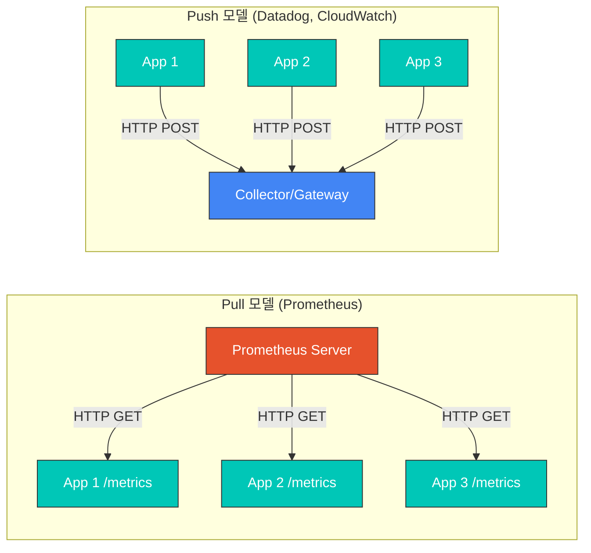
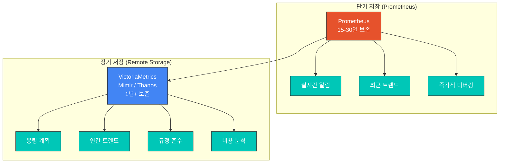
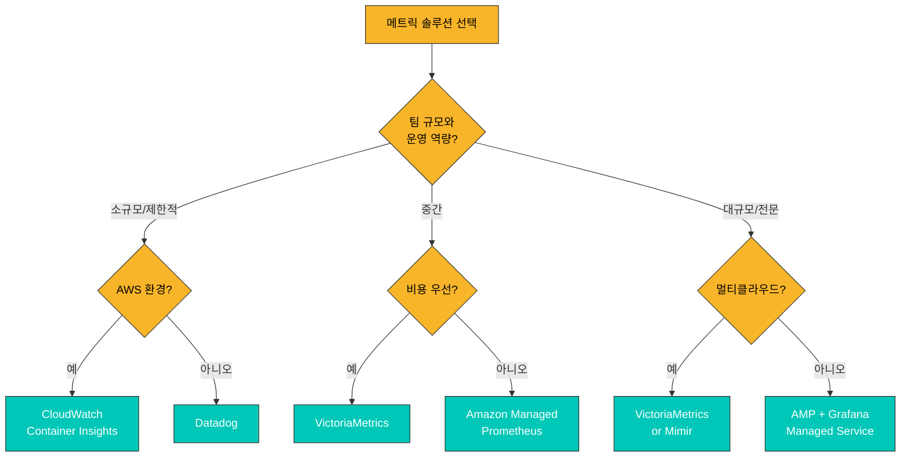
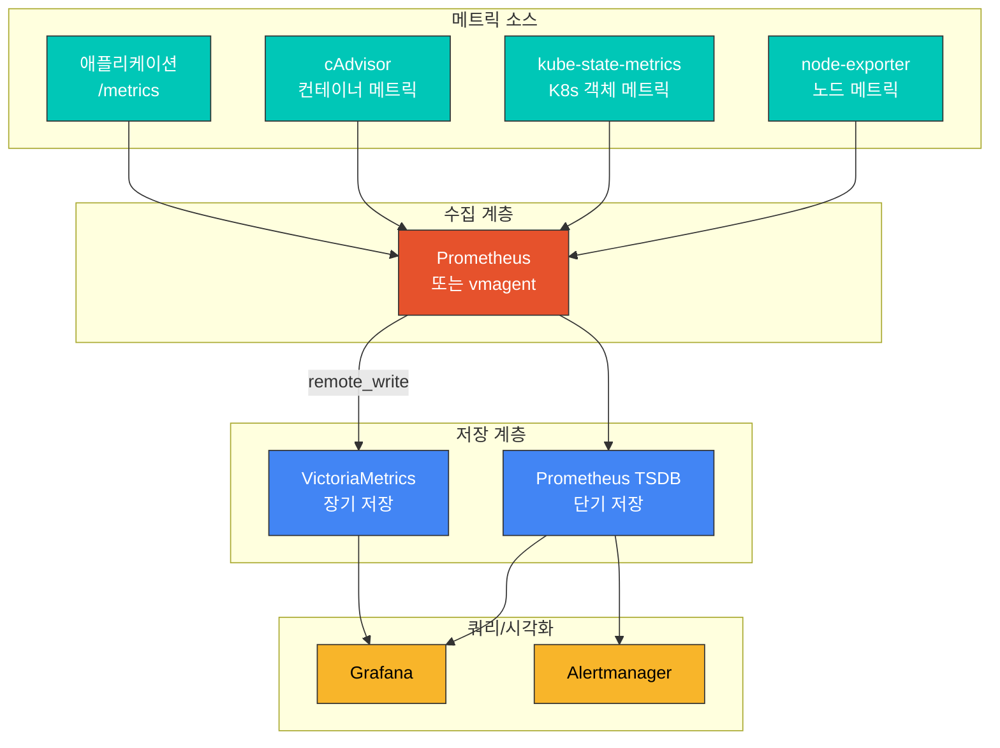

# 메트릭 개요

> **마지막 업데이트**: 2026년 2월 20일

## 목차

- [메트릭 기본 개념](#메트릭-기본-개념)
- [메트릭 유형](#메트릭-유형)
- [Pull vs Push 모델](#pull-vs-push-모델)
- [카디널리티와 메트릭 설계](#카디널리티와-메트릭-설계)
- [장기 저장소 필요성](#장기-저장소-필요성)
- [솔루션 비교](#솔루션-비교)
- [메트릭 수집 아키텍처](#메트릭-수집-아키텍처)

## 메트릭 기본 개념

메트릭(Metrics)은 시스템의 상태와 성능을 정량적으로 측정하고 모니터링하기 위한 수치 데이터입니다. Kubernetes 환경에서 메트릭은 클러스터의 건강 상태를 파악하고, 문제를 조기에 감지하며, 용량 계획과 성능 최적화를 수행하는 데 필수적인 요소입니다.

### 메트릭의 구성 요소

메트릭은 다음과 같은 구성 요소로 이루어집니다:

```
http_requests_total{method="GET", endpoint="/api/users", status="200"} 1234 1677649200000
      |                              |                                   |        |
   메트릭명                        레이블                               값    타임스탬프
```

1. **메트릭명 (Metric Name)**: 측정 대상을 식별하는 이름
2. **레이블 (Labels)**: 메트릭을 세분화하는 키-값 쌍
3. **값 (Value)**: 측정된 수치 데이터
4. **타임스탬프 (Timestamp)**: 측정 시점 (밀리초 단위 Unix 시간)

### 메트릭 네이밍 규칙

좋은 메트릭 이름은 다음 규칙을 따릅니다:

```yaml
# 좋은 예시
http_requests_total              # 요청 총 수 (Counter)
http_request_duration_seconds    # 요청 지속 시간 (Histogram)
node_memory_usage_bytes          # 메모리 사용량 (Gauge)

# 나쁜 예시
requests                         # 너무 모호함
httpRequestDurationMs            # 단위가 이름에 없음, camelCase 사용
```

**네이밍 규칙**:
- snake_case 사용 (소문자와 언더스코어)
- 단위를 접미사로 포함 (`_seconds`, `_bytes`, `_total`)
- 애플리케이션/도메인 접두사 사용 (`http_`, `node_`, `kube_`)

## 메트릭 유형

Prometheus와 호환되는 메트릭 시스템에서는 네 가지 기본 메트릭 유형을 사용합니다:

### 1. Counter (카운터)

누적되는 값을 추적하는 메트릭 유형입니다. 값은 증가만 가능하며, 재시작 시 0으로 리셋됩니다.

```yaml
# 사용 사례: 요청 수, 에러 수, 완료된 작업 수
http_requests_total{method="GET", status="200"} 12345
http_requests_total{method="POST", status="500"} 23

# PromQL 쿼리 예시
rate(http_requests_total[5m])                    # 초당 요청 수
increase(http_requests_total[1h])                # 1시간 동안 증가량
```

**특징**:
- 단조 증가 (monotonically increasing)
- 재시작 시 리셋되지만, `rate()` 함수가 자동 보정
- 총량보다는 변화율(rate)로 분석

### 2. Gauge (게이지)

현재 상태를 나타내는 값으로, 증가하거나 감소할 수 있습니다.

```yaml
# 사용 사례: 온도, 메모리 사용량, 현재 연결 수
node_memory_usage_bytes 8589934592
kube_pod_status_ready{pod="nginx-abc123"} 1
temperature_celsius{location="datacenter-1"} 23.5

# PromQL 쿼리 예시
node_memory_usage_bytes / node_memory_total_bytes * 100  # 메모리 사용률
max_over_time(temperature_celsius[1h])                    # 1시간 내 최고 온도
```

**특징**:
- 현재 상태의 스냅샷
- 증가 또는 감소 가능
- 특정 시점의 절대값으로 의미가 있음

### 3. Histogram (히스토그램)

값의 분포를 버킷(bucket)으로 관측합니다. 지연 시간, 응답 크기 등의 분포 분석에 적합합니다.

```yaml
# 히스토그램은 세 가지 메트릭을 생성
http_request_duration_seconds_bucket{le="0.005"} 24054    # 5ms 이하 요청 수
http_request_duration_seconds_bucket{le="0.01"} 33444     # 10ms 이하 요청 수
http_request_duration_seconds_bucket{le="0.025"} 100392   # 25ms 이하 요청 수
http_request_duration_seconds_bucket{le="0.05"} 129389    # 50ms 이하 요청 수
http_request_duration_seconds_bucket{le="0.1"} 133988     # 100ms 이하 요청 수
http_request_duration_seconds_bucket{le="+Inf"} 144320    # 전체 요청 수
http_request_duration_seconds_sum 53.42                    # 총 지속 시간
http_request_duration_seconds_count 144320                 # 총 요청 수

# PromQL 쿼리 예시
histogram_quantile(0.95, rate(http_request_duration_seconds_bucket[5m]))  # p95 지연시간
rate(http_request_duration_seconds_sum[5m]) / rate(http_request_duration_seconds_count[5m])  # 평균 지연시간
```

**특징**:
- 서버 측에서 버킷으로 집계
- 여러 인스턴스의 분위수 계산 가능
- 버킷 경계는 메트릭 정의 시 결정됨

### 4. Summary (서머리)

클라이언트 측에서 분위수(quantile)를 계산합니다. 히스토그램과 유사하지만 계산 방식이 다릅니다.

```yaml
# Summary는 분위수와 합계/개수를 생성
http_request_duration_seconds{quantile="0.5"} 0.052      # 중앙값 (p50)
http_request_duration_seconds{quantile="0.9"} 0.089      # p90
http_request_duration_seconds{quantile="0.99"} 0.245     # p99
http_request_duration_seconds_sum 29969.50               # 총 지속 시간
http_request_duration_seconds_count 562887               # 총 요청 수

# PromQL 쿼리 예시
http_request_duration_seconds{quantile="0.99"}           # p99 지연시간 (직접 조회)
```

**특징**:
- 클라이언트 측에서 분위수 계산
- 여러 인스턴스 간 집계 불가능
- 정확한 분위수 제공 (근사값 아님)

### Histogram vs Summary 비교

| 특성 | Histogram | Summary |
|------|-----------|---------|
| 분위수 계산 위치 | 서버 (쿼리 시) | 클라이언트 (수집 시) |
| 집계 가능성 | 여러 인스턴스 집계 가능 | 집계 불가능 |
| 정확도 | 버킷 경계에 따른 근사값 | 정확한 분위수 |
| 설정 변경 | 버킷 경계 변경 시 재배포 필요 | 분위수 변경 시 재배포 필요 |
| 권장 사용 | SLO/SLI 측정, 분산 시스템 | 단일 인스턴스, 정확도 중요 시 |

## Pull vs Push 모델

메트릭 수집에는 두 가지 주요 모델이 있습니다:



### Pull 모델

Prometheus가 대표적인 Pull 기반 시스템입니다.

**장점**:
- 중앙에서 수집 대상 및 주기 제어
- 대상의 가용성 자동 감지
- 방화벽 설정 단순화 (인바운드만 허용)
- 디버깅 용이 (엔드포인트 직접 조회 가능)

**단점**:
- 짧은 수명의 작업(batch job) 메트릭 수집 어려움
- NAT/방화벽 뒤의 대상 접근 제한
- 서비스 디스커버리 필요

```yaml
# Prometheus scrape 설정 예시
scrape_configs:
  - job_name: 'kubernetes-pods'
    kubernetes_sd_configs:
      - role: pod
    relabel_configs:
      - source_labels: [__meta_kubernetes_pod_annotation_prometheus_io_scrape]
        action: keep
        regex: true
      - source_labels: [__meta_kubernetes_pod_annotation_prometheus_io_path]
        action: replace
        target_label: __metrics_path__
        regex: (.+)
```

### Push 모델

Datadog, CloudWatch, Graphite 등이 Push 기반입니다.

**장점**:
- 짧은 수명 작업의 메트릭 수집 가능
- 방화벽/NAT 환경에서 유리
- 이벤트 기반 메트릭 전송

**단점**:
- 수집 서버 과부하 가능성
- 대상 가용성 자동 감지 어려움
- 클라이언트에서 전송 로직 필요

```yaml
# Pushgateway를 통한 Push 예시
# 짧은 수명 배치 작업에서 사용
apiVersion: batch/v1
kind: Job
metadata:
  name: batch-job
spec:
  template:
    spec:
      containers:
      - name: worker
        image: my-batch-job:latest
        env:
        - name: PUSHGATEWAY_URL
          value: "http://pushgateway:9091"
        command:
        - /bin/sh
        - -c
        - |
          # 작업 수행
          do_work()

          # 메트릭 푸시
          cat <<EOF | curl --data-binary @- ${PUSHGATEWAY_URL}/metrics/job/batch_job/instance/${HOSTNAME}
          batch_job_duration_seconds ${DURATION}
          batch_job_records_processed ${RECORDS}
          EOF
      restartPolicy: Never
```

## 카디널리티와 메트릭 설계

### 카디널리티란?

카디널리티(Cardinality)는 메트릭의 고유한 시계열 조합 수를 의미합니다. 높은 카디널리티는 스토리지와 쿼리 성능에 직접적인 영향을 미칩니다.

```yaml
# 낮은 카디널리티 (좋음)
http_requests_total{method="GET", status="200"}     # method: ~5, status: ~10 = 최대 50 조합

# 높은 카디널리티 (주의 필요)
http_requests_total{method="GET", user_id="12345"}  # user_id가 수백만 개일 수 있음

# 매우 높은 카디널리티 (위험)
http_requests_total{request_id="abc-123-def"}       # 요청마다 고유 ID = 무한 증가
```

### 카디널리티 계산

```
총 시계열 수 = 레이블1 고유값 × 레이블2 고유값 × ... × 레이블N 고유값
```

**예시**:
- `method`: 5개 (GET, POST, PUT, DELETE, PATCH)
- `endpoint`: 20개
- `status`: 10개 (200, 201, 400, 401, 403, 404, 500, 502, 503, 504)
- **총 시계열**: 5 × 20 × 10 = **1,000개**

### 카디널리티 모범 사례

```yaml
# 나쁜 예시: 무한 카디널리티
http_request_duration_seconds{
  user_id="12345",           # 사용자마다 고유
  request_id="abc-123",      # 요청마다 고유
  timestamp="1677649200"     # 매 초 새로운 값
}

# 좋은 예시: 제한된 카디널리티
http_request_duration_seconds{
  method="GET",              # 5개 이하
  endpoint="/api/users",     # 수십 개
  status_class="2xx"         # 5개 (1xx, 2xx, 3xx, 4xx, 5xx)
}
```

**권장 사항**:
1. 레이블 값이 무한히 증가할 수 있는 필드 사용 금지
2. 사용자 ID, 요청 ID, 세션 ID 등은 레이블로 사용하지 않음
3. 상태 코드는 그룹화 (200 → 2xx)
4. URL 경로는 정규화 (`/users/123` → `/users/{id}`)

### 카디널리티 모니터링

```yaml
# 높은 카디널리티 메트릭 탐지 쿼리
topk(10, count by (__name__)({__name__=~".+"}))

# 특정 메트릭의 카디널리티 확인
count(http_requests_total)

# 레이블별 고유 값 수 확인
count(count by (endpoint)(http_requests_total))
```

## 장기 저장소 필요성

### Prometheus의 한계

Prometheus는 뛰어난 실시간 모니터링 도구이지만, 장기 데이터 저장에는 몇 가지 한계가 있습니다:



**Prometheus 장기 저장의 문제점**:

1. **스토리지 효율성**: 압축률이 낮아 디스크 사용량 증가
2. **수평 확장성**: 단일 노드 아키텍처로 확장 제한
3. **고가용성**: 네이티브 HA 클러스터링 미지원
4. **쿼리 성능**: 장기간 데이터에 대한 쿼리 속도 저하

### 장기 저장이 필요한 이유

| 사용 사례 | 필요 보존 기간 | 설명 |
|----------|--------------|------|
| 실시간 알림 | 1-7일 | 즉각적인 문제 감지 |
| 트러블슈팅 | 7-30일 | 최근 이슈 분석 |
| 용량 계획 | 3-12개월 | 성장 추세 예측 |
| 연간 비교 | 12개월+ | YoY 비교 분석 |
| 규정 준수 | 1-7년 | 감사 및 법적 요구사항 |
| 비용 최적화 | 6-12개월 | 리소스 사용 패턴 분석 |

### Remote Write 아키텍처

```yaml
# Prometheus remote_write 설정
global:
  scrape_interval: 15s

remote_write:
  - url: "http://victoriametrics:8428/api/v1/write"
    queue_config:
      max_samples_per_send: 10000
      batch_send_deadline: 5s
      min_backoff: 30ms
      max_backoff: 5s
      max_shards: 10
      capacity: 2500
    write_relabel_configs:
      # 높은 카디널리티 메트릭 제외
      - source_labels: [__name__]
        regex: "go_.*"
        action: drop
```

## 솔루션 비교

### 주요 메트릭 솔루션 비교표

| 기능 | Prometheus | VictoriaMetrics | Mimir | CloudWatch | Datadog |
|------|------------|-----------------|-------|------------|---------|
| **배포 모델** | 자체 호스팅 | 자체 호스팅 | 자체 호스팅 | 관리형 | SaaS |
| **확장성** | 단일 노드 | 수평 확장 | 수평 확장 | 자동 확장 | 자동 확장 |
| **고가용성** | Thanos/Cortex 필요 | 네이티브 | 네이티브 | 네이티브 | 네이티브 |
| **데이터 압축** | 중간 | 매우 높음 (7x) | 높음 | 해당 없음 | 해당 없음 |
| **쿼리 언어** | PromQL | MetricsQL | PromQL | 자체 문법 | 자체 문법 |
| **장기 저장** | 제한적 | 효율적 | 효율적 | 15개월 | 15개월 |
| **멀티 테넌시** | 제한적 | 지원 | 지원 | 계정 분리 | 조직 분리 |
| **비용** | 무료 (인프라만) | 무료 (인프라만) | 무료 (인프라만) | 사용량 기반 | 호스트 기반 |
| **설정 복잡성** | 낮음 | 중간 | 높음 | 낮음 | 낮음 |
| **AWS 통합** | 수동 설정 | 수동 설정 | 수동 설정 | 네이티브 | 네이티브 |

### 비용 비교 (월간 추정)

**가정**: 1,000개 노드, 100만 활성 시계열, 30일 보존

| 솔루션 | 인프라 비용 | 서비스 비용 | 총 비용 |
|--------|-----------|-----------|--------|
| Prometheus + VictoriaMetrics | ~$500 | $0 | ~$500 |
| Amazon Managed Prometheus | ~$200 | ~$1,500 | ~$1,700 |
| CloudWatch | $0 | ~$3,000+ | ~$3,000+ |
| Datadog | $0 | ~$15,000+ | ~$15,000+ |

*실제 비용은 사용 패턴에 따라 크게 달라질 수 있습니다.*

### 선택 가이드



## 메트릭 수집 아키텍처

### Kubernetes 환경의 메트릭 수집 구조



### 주요 메트릭 소스

| 컴포넌트 | 역할 | 주요 메트릭 |
|---------|------|-----------|
| **node-exporter** | 노드 수준 메트릭 | CPU, 메모리, 디스크, 네트워크 |
| **kube-state-metrics** | K8s 객체 상태 | Pod, Deployment, Node 상태 |
| **cAdvisor** | 컨테이너 메트릭 | 컨테이너별 CPU, 메모리, I/O |
| **metrics-server** | 리소스 메트릭 | HPA/VPA용 CPU, 메모리 |

### 다음 단계

각 메트릭 솔루션에 대한 자세한 내용은 다음 문서를 참조하세요:

1. [Prometheus](./01-prometheus.md) - 오픈소스 모니터링의 표준
2. [VictoriaMetrics](./02-victoriametrics.md) - 고성능 장기 저장소
3. [Grafana Mimir](./03-mimir.md) - 엔터프라이즈급 메트릭 저장소
4. [CloudWatch Metrics](./04-cloudwatch-metrics.md) - AWS 네이티브 모니터링
5. [Datadog](./05-datadog.md) - 통합 관측성 플랫폼

## 퀴즈

이 장에서 배운 내용을 테스트하려면 [메트릭 개요 퀴즈](../../quizzes/observability/metrics/00-metrics-overview-quiz.md)를 풀어보세요.
