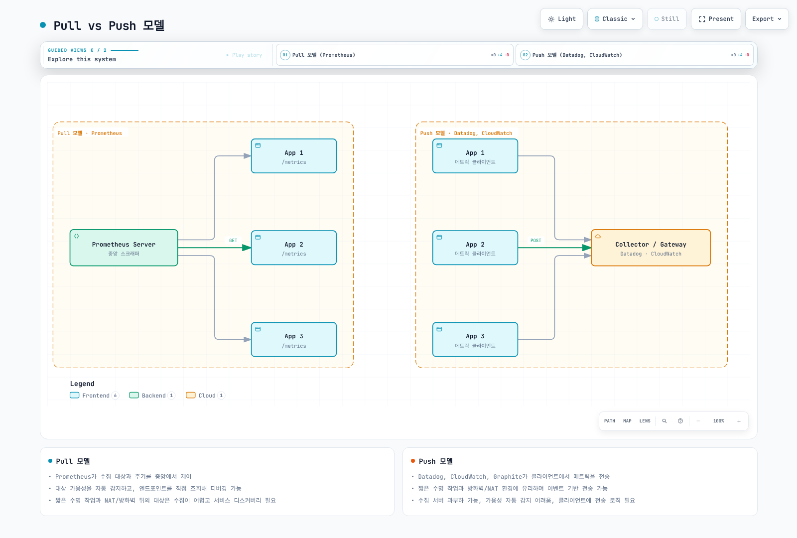

# 메트릭 개요

> 검토: 2026년 9월 13일. 예제는 Prometheus 3.14.0 도구로 로컬 검증했으며 클러스터·클라우드 배포는 수행하지 않았습니다.

## 목차

- [메트릭 기본 개념](#메트릭-기본-개념)
- [메트릭 유형](#메트릭-유형)
- [Pull vs Push 모델](#pull-vs-push-모델)
- [카디널리티와 메트릭 설계](#카디널리티와-메트릭-설계)
- [장기 저장소 필요성](#장기-저장소-필요성)
- [솔루션 비교](#솔루션-비교)
- [메트릭 수집 아키텍처](#메트릭-수집-아키텍처)

## 메트릭 기본 개념

메트릭은 시스템의 상태와 동작을 수치로 표현합니다. 메트릭 이름과 전체 레이블 집합이 시계열을 식별하고, 각 샘플에는 값과 타임스탬프가 있습니다. 알림·장애 분석·용량 계획·성능 분석에 활용하지만 샘플링된 측정값이 개별 이벤트를 모두 보존하는 것은 아닙니다.

예를 들어 `http_requests_total`은 요청 Counter의 이름이고, `method="GET"`, `status="200"`은 측정 대상을 구분합니다. 샘플 값은 누적 횟수입니다. `job`, `instance` 같은 대상 레이블은 보통 scrape 과정에서 추가됩니다.

타임스탬프 단위는 형식에 따라 다릅니다. 기존 Prometheus text exposition에 명시하는 Unix timestamp는 **밀리초**, OpenMetrics는 **초**입니다. 일반적인 exporter는 타임스탬프를 생략하고 Prometheus가 scrape 시각을 부여하게 합니다. 하나의 단위를 모든 텔레메트리 프로토콜에 적용하면 안 됩니다.

### 이름과 단위

| 예시 | 의미 |
|---|---|
| `http_requests_total` | Counter이며 `_total`은 누적 횟수 표시이지 물리 단위가 아님 |
| `http_request_duration_seconds` | 기본 단위를 사용하는 지연 시간 |
| `node_memory_MemAvailable_bytes` | node-exporter의 실제 메트릭 이름; 공개된 표기를 유지 |
| `requests` | 새 애플리케이션 메트릭 이름으로는 문맥이 부족 |
| `httpRequestDurationMs` | 단위는 있지만 camelCase와 밀리초를 사용해 일반적인 Prometheus 이름·기본 단위 관례와 다름 |

새 메트릭은 의미 있는 접두사, 소문자와 언더스코어, `_seconds`·`_bytes` 같은 단위를 사용하는 것이 좋습니다. 이름 관례를 이유로 exporter의 기존 API 이름을 임의로 바꾸지는 않습니다.

아래 `text` 블록은 합성 **Prometheus text exposition**이며 YAML이 아닙니다. 조회 식은 별도 `promql` 블록으로 분리했습니다. 쿼리의 scrape job 이름은 예제 기준이므로 실제 대상 레이블에 맞춰야 합니다.

## 메트릭 유형

Prometheus client library에서 흔히 사용하는 유형은 Counter, Gauge, Histogram, Summary입니다. 어떤 쿼리가 샘플을 받아들인다는 이유보다 측정값의 의미에 맞춰 유형을 선택합니다.

### 1. Counter

Counter는 요청·오류·완료 작업 수처럼 음수가 아닌 증가량을 누적합니다. 측정하는 프로세스나 상태가 다시 만들어지면 리셋될 수 있지만, exporter 재시작마다 원래 Counter가 반드시 리셋되는 것은 아닙니다.

```text
# TYPE http_requests_total counter
http_requests_total{method="GET",endpoint="/api/users",status="200"} 12345
http_requests_total{method="POST",endpoint="/api/users",status="500"} 23
```

시계열별 변화율, 서비스 전체 변화율, 기간 증가량 예시입니다.

```promql
rate(http_requests_total{job="example-app"}[5m])
```

```promql
sum(rate(http_requests_total{job="example-app"}[5m]))
```

```promql
increase(http_requests_total{job="example-app"}[1h])
```

`rate()`는 관측된 Counter 리셋을 처리하고 조회 구간으로 외삽합니다. 관측 사이에 잃어버린 증가량을 복원하는 것은 아닙니다. 따라서 정수 Counter라도 `increase()`의 추정 결과는 소수일 수 있습니다. 한 인스턴스의 리셋이 다른 인스턴스의 증가에 가려지지 않도록 **`rate()`를 먼저 적용한 뒤 집계**합니다.

### 2. Gauge

Gauge는 현재 상태이며 증가·감소할 수 있습니다. 다음 합성 값은 node-exporter·kube-state-metrics의 실제 이름과 애플리케이션에서 정의한 온도 메트릭을 함께 보여줍니다.

```text
# TYPE node_memory_MemAvailable_bytes gauge
node_memory_MemAvailable_bytes 8589934592
# TYPE node_memory_MemTotal_bytes gauge
node_memory_MemTotal_bytes 17179869184
# TYPE kube_pod_status_ready gauge
kube_pod_status_ready{namespace="example-app",pod="example-0",uid="00000000-0000-4000-8000-000000000001",condition="true"} 1
# TYPE temperature_celsius gauge
temperature_celsius{location="datacenter-1"} 23.5
```

```promql
100 * (1 - node_memory_MemAvailable_bytes{job="node-exporter"} / node_memory_MemTotal_bytes{job="node-exporter"})
```

```promql
max_over_time(temperature_celsius{job="example-app"}[1h])
```

메모리 식은 `MemAvailable`로 보고되지 않은 비율이며 특정 애플리케이션의 상주 메모리 사용률과 같지 않습니다. Pod readiness는 `condition`별 시계열입니다. `condition="false"`의 값 1과 `condition="true"`의 값 1은 의미가 다릅니다.

### 3. Histogram

**Classic histogram**은 계측한 애플리케이션·exporter에서 관측값을 누적 버킷으로 집계합니다. Prometheus가 나중에 분위수를 계산합니다. `le`는 해당 값을 포함하는 상한이고, `+Inf` 버킷은 `_count`와 같습니다.

```text
# TYPE http_request_duration_seconds histogram
http_request_duration_seconds_bucket{le="0.005"} 24054
http_request_duration_seconds_bucket{le="0.01"} 33444
http_request_duration_seconds_bucket{le="0.025"} 100392
http_request_duration_seconds_bucket{le="0.05"} 129389
http_request_duration_seconds_bucket{le="0.1"} 133988
http_request_duration_seconds_bucket{le="0.25"} 144320
http_request_duration_seconds_bucket{le="+Inf"} 144320
http_request_duration_seconds_sum 4800.8625
http_request_duration_seconds_count 144320
```

이 값은 벤치마크가 아닌 설명용 분포입니다. 144,320개 관측의 합계는 **4,800.8625초**입니다. 기존 합계 53.42초는 버킷 개수만으로 계산한 하한이 2,704초를 넘는다는 점과 모순됐습니다. 0.25초 버킷도 추가해 이 예제의 p95가 무한대 버킷에만 속하지 않게 했습니다.

버킷 구성이 일치하는 여러 인스턴스의 전체 p95와 평균은 다음과 같이 구합니다.

```promql
histogram_quantile(0.95, sum by (le) (rate(http_request_duration_seconds_bucket{job="example-app"}[5m])))
```

```promql
sum(rate(http_request_duration_seconds_sum{job="example-app"}[5m])) / sum(rate(http_request_duration_seconds_count{job="example-app"}[5m]))
```

Classic 버킷을 집계할 때는 `le`를 유지합니다. 분위수는 버킷 내부를 보간하므로 분포와 버킷 해상도에 따라 정확도가 달라집니다. Classic 버킷 경계를 바꾸는 것은 쿼리만의 수정이 아니라 계측 설정 변경입니다.

Native histogram은 분포 표현 방식이 다릅니다. 현재 Prometheus 가이드는 client·scrape protocol·저장·조회 경로가 지원하면 native histogram을 우선 고려하도록 안내합니다. 전체 경로의 호환성과 설정을 확인해야 하며, 이 장의 classic 예제를 native histogram wire 출력으로 해석하면 안 됩니다.

### 4. Summary

Summary는 client에서 설정한 시간 구간의 분위수를 계산할 수 있습니다. 이 값은 일반적으로 **알고리즘·구간 설정에 따른 오차가 있는 근사값**이지 정확한 분위수가 아닙니다. Library마다 지원이 달라 Summary가 sum/count만 제공할 수도 있습니다.

```text
# TYPE rpc_request_duration_seconds summary
rpc_request_duration_seconds{quantile="0.5"} 0.052
rpc_request_duration_seconds{quantile="0.9"} 0.089
rpc_request_duration_seconds{quantile="0.99"} 0.245
rpc_request_duration_seconds_sum 29969.50
rpc_request_duration_seconds_count 562887
```

```promql
rpc_request_duration_seconds{job="example-app",quantile="0.99"}
```

```promql
sum(rate(rpc_request_duration_seconds_sum{job="example-app"}[5m])) / sum(rate(rpc_request_duration_seconds_count{job="example-app"}[5m]))
```

첫 식은 일치하는 인스턴스가 보고한 p99를 각각 반환합니다. 여러 p99의 평균이나 합계는 전체 p99가 아닙니다. 반면 두 번째 식처럼 음수가 아닌 지연 시간의 `_sum`·`_count` 변화율을 합쳐 전체 평균을 계산하는 것은 가능합니다.

| 질문 | Classic Histogram | 분위수를 제공하는 Summary |
|---|---|---|
| 어디에서 처리하는가? | 계측 시 버킷 집계, 조회 시 분위수 계산 | 계측 시 분위수 계산 |
| 여러 인스턴스를 결합할 수 있는가? | 호환되는 버킷을 집계 가능 | 분위수는 불가, sum/count는 가능 |
| 오차의 기준 | 버킷 해상도와 관측 분포 | Client 알고리즘·오차 목표·시간 구간 |
| 나중에 다른 분위수·구간을 조회할 수 있는가? | 보존한 버킷 샘플에서 계산 | 미리 계산된 분위수만으로는 불가 |

트래픽이 0이면 평균이 `NaN`일 수 있고, 시계열이 없으면 빈 결과가 나올 수 있습니다. 어느 경우도 정상 트래픽의 증거로 조용히 바꾸면 안 됩니다.

<a id="metric-collection-models"></a>

## Pull vs Push 모델



[인터랙티브 다이어그램](https://www.atomai.click/kubernetes-docs/archmaps/ko-observability-metrics-readme-0.html)

그림은 연결을 시작하는 방향을 설명합니다. 실제로는 agent가 endpoint를 scrape한 뒤 결과를 전송하는 등 두 방식을 혼합할 수 있습니다. 제품 이름만으로 모든 통합 경로가 한 방식이라고 판단하지 않습니다.

### Pull과 Kubernetes discovery

Pull 수집은 중앙에서 대상·주기를 제어하고 endpoint를 직접 확인하기 쉽습니다. 수집기의 outbound 연결과 대상의 허용된 inbound 접근, 라우팅·TLS·인증이 모두 필요합니다. NAT가 대상 접근을 자동으로 해결하지는 않습니다. Prometheus의 `up`은 scrape 성공 여부이지 애플리케이션 가용성 SLO가 아닙니다.

다음 Prometheus 설정 조각은 **`example-app` namespace의 Running Pod 중 수집을 허용하고 TCP `metrics` container port를 선언한 대상**을 선택합니다. IPv4 전용 정규식으로 주소를 다시 만들지 않고 discovery가 제공한 주소를 사용합니다.

```yaml
# pod-scrape.yaml
scrape_configs:
- job_name: example-app
  kubernetes_sd_configs:
  - role: pod
    namespaces:
      names:
      - example-app
  relabel_configs:
  - source_labels:
    - __meta_kubernetes_pod_annotation_prometheus_io_scrape
    action: keep
    regex: 'true'
  - source_labels:
    - __meta_kubernetes_pod_phase
    action: keep
    regex: Running
  - source_labels:
    - __meta_kubernetes_pod_container_port_name
    action: keep
    regex: metrics
  - source_labels:
    - __meta_kubernetes_pod_container_port_protocol
    action: keep
    regex: TCP
  - source_labels:
    - __meta_kubernetes_pod_annotation_prometheus_io_path
    action: replace
    target_label: __metrics_path__
    regex: (.+)
  - source_labels:
    - __meta_kubernetes_namespace
    target_label: namespace
  - source_labels:
    - __meta_kubernetes_pod_name
    target_label: pod
```

전제 조건은 Pod의 `prometheus.io/scrape: "true"` annotation, 이름이 `metrics`인 포트 선언, 선택적인 `prometheus.io/path`, 해당 Pod를 discovery할 Prometheus의 Kubernetes API 인증·RBAC입니다. 지정한 포트·경로가 실제 메트릭을 제공해야 합니다. 이 조각은 클러스터 설치 예제나 연결 가능성의 증거가 아닙니다.

### Push와 서비스 단위 배치

Push는 outbound 연결이 가능한 생산자와 일부 짧은 작업에 적합할 수 있습니다. 그래도 수신 용량·인증·timeout·재시도·생산자 누락 탐지가 필요합니다. 수신기 상태가 정상이라고 배치 실행을 증명하지는 못합니다.

Prometheus는 Pushgateway를 모든 짧은 Pod의 기본 수집기가 아니라 제한적인 **서비스 단위 배치**에 권장합니다. 전송한 그룹은 자동 만료되지 않습니다. Pod별 `HOSTNAME`을 grouping key로 넣어 고아 그룹을 만들지 말고, 안정적인 작업 식별자와 소유자·폐기 시 정리 절차를 정합니다.

다음은 하나의 논리적 배치가 **성공한 뒤 실행하는 통합 조각**이며 완성된 Kubernetes Job이 아닙니다. 접근 권한이 있는 Pushgateway와 `sh`·`awk`·`curl`이 필요합니다. 배치가 실제 실행 시간·처리 건수·원래 완료 시각을 제공해야 하며 전송을 재시도해도 완료 시각을 새로 만들지 않습니다. 환경에 필요한 TLS·인증은 설정하되 예제에 비밀값을 포함하지 않습니다.

```sh
set -eu
: "${PUSHGATEWAY_URL:?Set the reachable authorized Pushgateway base URL}"
: "${DURATION_SECONDS:?Set the measured duration of the successful batch}"
: "${RECORDS_PROCESSED:?Set the number of records processed by that batch}"
: "${COMPLETED_AT_SECONDS:?Set its original Unix completion time in seconds}"

# Reject nonnumeric metric values before sending anything.
awk -v n="$DURATION_SECONDS" 'BEGIN { exit !(n ~ /^[0-9]+([.][0-9]+)?$/) }'
case "$RECORDS_PROCESSED" in *[!0-9]*|'') exit 2;; esac
case "$COMPLETED_AT_SECONDS" in *[!0-9]*|'') exit 2;; esac

cat <<EOF | curl --fail --silent --show-error --connect-timeout 5 --max-time 15 \
  --request PUT --data-binary @- "${PUSHGATEWAY_URL%/}/metrics/job/example_batch"
# TYPE example_batch_last_run_duration_seconds gauge
example_batch_last_run_duration_seconds ${DURATION_SECONDS}
# TYPE example_batch_last_run_records_processed gauge
example_batch_last_run_records_processed ${RECORDS_PROCESSED}
# TYPE example_batch_last_success_timestamp_seconds gauge
example_batch_last_success_timestamp_seconds ${COMPLETED_AT_SECONDS}
EOF
```

`PUT`은 이 안정적인 grouping key의 메트릭을 교체합니다. 서로 다른 작업이 같은 key를 경쟁해서 갱신하면 안 됩니다. 실패한 작업을 성공 시각으로 기록하거나 성공할 때마다 scrape 전에 그룹을 삭제하지 않습니다. 논리적 작업을 폐기할 때 소유한 그룹을 명시적으로 정리합니다.

전송한 작업 식별자를 유지하려면 Pushgateway를 `honor_labels`와 함께 scrape합니다.

```yaml
# pushgateway-scrape.yaml
scrape_configs:
- job_name: pushgateway
  honor_labels: true
  static_configs:
  - targets:
    - pushgateway:9091
```

마지막 성공 완료 이후 경과 시간(초)을 조회합니다.

```promql
time() - max(example_batch_last_success_timestamp_seconds{job="example_batch"})
```

스케줄과 예상 실행 시간을 기준으로 임계값을 정하고, 시계열 자체가 전혀 없는 경우도 별도로 처리합니다. Pushgateway의 `up`은 gateway scrape 상태만 설명합니다.

## 카디널리티와 메트릭 설계

카디널리티는 정한 범위에서 서로 다른 시계열의 개수입니다. 레이블별 값 개수의 곱은 **모든 조합이 발생할 수 있을 때의 상한**이지 실제 모든 조합이 존재한다는 보장이 아닙니다.

메서드 5개 × 정규화 경로 20개 × 상태 코드 10개는 애플리케이션 레이블 조합 최대 1,000개입니다. 여기에 대상·복제본 레이블과 classic histogram 버킷·sum/count가 시계열을 늘릴 수 있습니다. 시계열이 계속 교체되는 churn도 과거 데이터와 index 비용을 늘립니다.

`/users/{id}`처럼 제한된 경로 template을 사용합니다. 사용자·요청·세션 ID와 계속 변하는 타임스탬프는 일반 메트릭 레이블로 사용하지 않는 것이 좋으며, 민감 정보 노출 위험도 있습니다. 상세 구분이 사라져도 되는 경우에만 상태 코드를 그룹화합니다. 요청별 문맥은 적절히 통제한 로그·트레이스에서 다룹니다.

다음 범위를 제한한 쿼리는 현재 선택 가능한 시계열을 셉니다. TSDB에 보관된 모든 과거 시계열 수는 아닙니다.

```promql
topk(10, count by (__name__) ({job="example-app"}))
```

```promql
count(http_requests_total{job="example-app"})
```

```promql
count(count by (endpoint) (http_requests_total{job="example-app"}))
```

메트릭·레이블 이름과 값의 길이도 형식 제한·저장 비용·backend 수용 여부에 영향을 줍니다. 카디널리티가 중요하지만 유일한 설계 조건은 아닙니다.

## 장기 저장소 필요성

Prometheus의 local TSDB는 압축을 사용하며 적절한 설정·용량이 있으면 30일보다 훨씬 오래 데이터를 보존할 수 있습니다. **시간·용량 보존 설정이 없을 때 기본 시간 보존은 15일**이며 최대값이 아닙니다.

Local storage 자체는 복제된 분산 저장소가 아닙니다. Thanos나 Mimir 없이도 독립 Prometheus 복제본으로 수집·알림 중복성을 구성할 수 있지만 통합 조회·중복 제거·원격 내구성·복구는 별도 설계가 필요합니다. 장기 쿼리 비용은 날짜 범위만이 아니라 데이터량과 식에 따라 달라집니다.

### 보존 계획

| 필요 | 계획할 질문 |
|---|---|
| 알림 평가 | 조회 구간·장애 버퍼·누락 데이터 처리는 무엇인가? |
| 장애 분석 | 유용한 해상도를 얼마나 오래 유지해야 하는가? |
| 용량·계절성 | 수개월 추세나 전년 동기 비교가 필요한가? |
| 감사 의무 | 이 데이터의 접근·삭제·보존에 실제로 적용되는 정책은 무엇인가? |
| 복구 | 백업·복원 검사·독립 장애 영역이 필요한가? |

모든 메트릭에 적용되는 “1–7년 보관 의무”는 없습니다. 업무별로 보존 기간과 **해상도**, 삭제·접근 정책, 복구 목표를 함께 정합니다.

### Remote write

다음 조각은 이미 배포된 **single-node VictoriaMetrics** 수신기를 대상으로 합니다. 검토한 scrape 설정과 합쳐야 합니다. Cluster 수신기는 경로·구성이 다르며 tenant ID 자체는 인증이 아닙니다. 실제 환경에 맞는 접근 제어와 TLS endpoint를 사용합니다.

```yaml
# remote-write.yaml
global:
  scrape_interval: 15s
remote_write:
- url: http://victoriametrics:8428/api/v1/write
  queue_config:
    capacity: 10000
    max_samples_per_send: 2000
    max_shards: 10
  write_relabel_configs:
  - source_labels:
    - __name__
    regex: example_debug_payload_total
    action: drop
```

예제는 문서화된 queue/batch 기본값 10,000/2,000을 유지합니다. `max_shards: 10`은 동시성 제한 예시이지 측정한 최적값이 아닙니다. Shard 수와 capacity가 늘면 메모리 사용량도 증가합니다. 튜닝 가이드는 capacity를 batch 크기의 약 3–10배로 안내하므로 기본값에서 시작해 backlog·처리량·메모리를 측정합니다.

명시적인 drop 규칙은 검토한 debug 메트릭 하나의 **원격** 전송을 제외하는 예시이며 local 샘플을 지우지 않습니다. `go_.*` 전체 삭제는 일반적인 카디널리티 해결책이 아니고 runtime 진단 정보를 잃게 합니다.

Remote write는 비동기이며 WAL 버퍼도 유한합니다. Prometheus 튜닝 문서는 장기 수신 장애가 문서화된 WAL 구간(해당 가이드에서 약 2시간)을 넘으면 미전송 데이터가 유실될 수 있다고 설명합니다. 백업이나 항상 성공하는 전송 보장이 아닙니다.

## 솔루션 비교

### 배포와 운영 경계

| 선택지 | 검토할 내용 |
|---|---|
| Prometheus server | Local TSDB·PromQL·rule; 보존·용량, 독립 복제본과 복구 |
| VictoriaMetrics | Single-node와 cluster 구분; MetricsQL/PromQL 호환성, 저장 용량, tenant 인증, 복제와 edition별 기능 |
| Grafana Mimir | 분산 서비스와 object storage; local/ingest 자원, 복제, tenant 인증, 제한과 운영 용량 |
| CloudWatch metrics | AWS 관리형 저장, metric math/Metrics Insights와 관련 통합; dimension·조회 제품·쿼터·해상도 |
| Datadog metrics | SaaS와 agent·통합; tag 카디널리티·제품 기능·조회 rollup·과금 |

Object storage를 사용한다고 무제한 확장되거나 모든 local disk가 불필요해지는 것은 아닙니다. VictoriaMetrics의 백업 대상이나 특정 edition 기능을 기본 저장 구조와 혼동하지 않습니다. “7배 압축” 같은 비교는 데이터셋·버전·측정 방법이 있어야 하며 이 장에서는 주장하지 않습니다.

**기존 CloudWatch metrics**는 시간이 지나면 해상도가 바뀝니다. 1분 미만 데이터는 3시간, 1분 데이터는 15일, 5분 데이터는 63일, 1시간 데이터는 455일 보존합니다. 다른 metric 제품·수집 경로는 별도로 확인해야 합니다. Datadog의 공개 보존 표는 metric tag/value를 15개월로 안내하지만 쿼리에는 rollup이 적용되므로 모든 그래프에서 최초 수집 해상도를 보장한다는 뜻은 아닙니다.

### 근거 없는 월 비용 대신 입력 조건 계산

**실제 노출되는 시계열 수가 100만 개**이고 모두 15초마다 30일간 수집된다면 전송 filtering/deduplication 전 샘플 수는 `1,000,000 × 30 × 86,400 / 15 = 172,800,000,000`개입니다. 100만이 애플리케이션 레이블 조합만 의미한다면 대상·복제본·Histogram 시계열을 먼저 반영합니다.

| 선택지 | 추정에 필요한 입력 |
|---|---|
| 자체 운영 저장소 | CPU/RAM, 측정한 샘플당 바이트, index/WAL/여유 용량, 복제본, 저장·네트워크, 백업·운영 인력 |
| Amazon Managed Service for Prometheus | 수집 샘플·저장량·쿼리 처리·선택한 수집 기능·지역별 단가 |
| CloudWatch | 과금되는 metric/dimension 조합·해상도·API/조회·선택한 관측성 기능 |
| Datadog | 선택한 plan·호스트/컨테이너·포함/추가 custom metrics·tag·기타 활성 제품 |

동등한 수집량·보존·HA·기능 조건으로 비교합니다. 아래 공식 가격 페이지에서 최신 단가를 확인하고 업무별 자원 사용량을 측정합니다. 오픈소스여도 인프라와 운영 비용은 사라지지 않습니다.

필요한 쿼리·해상도, 카디널리티·churn, 장애·복구 목표, tenant·접근 경계, 통합 요구와 측정한 비용 모델로 선택합니다. 팀 규모만으로 제품을 결정하지 않습니다.

## 메트릭 수집 아키텍처

수집, 저장·조회, rule 평가, 알림 전달의 책임을 분리합니다.

| 컴포넌트 | 역할 |
|---|---|
| node-exporter | 메모리·파일시스템·네트워크 Counter 등 호스트 OS 메트릭 |
| kube-state-metrics | Kubernetes API 객체 상태; 컨테이너 CPU 측정을 대신하지 않음 |
| kubelet/cAdvisor endpoint | 컨테이너 자원 측정; endpoint 제공 여부·scrape 권한 확인 필요 |
| metrics-server | Autoscaling과 `kubectl top`의 Resource Metrics API; 과거 데이터를 저장하는 Prometheus TSDB가 아님 |
| Prometheus | Scrape, local 저장·조회와 rule 평가 |
| vmagent | 메트릭 수집·전달·버퍼링; 조회 가능한 Prometheus TSDB가 아님 |
| VictoriaMetrics / Mimir | 각 배포 구조에 따른 메트릭 저장·조회 |
| Prometheus rule / vmalert / Mimir ruler | 식을 평가하고 Alertmanager로 alert 전송 |
| Alertmanager | Alert 그룹화·라우팅·억제·전달; TSDB를 조회해 PromQL을 평가하는 구성 요소가 아님 |
| Grafana | 설정한 data source를 조회하고 시각화 |

각 연결의 discovery·RBAC·credential·TLS·네트워크 접근을 계획합니다. 더 많은 endpoint를 scrape하는 것이 업무에 필요한 신호 정의를 대신하지는 않습니다.

## 공식 참고 자료

- [Prometheus metric types](https://github.com/prometheus/docs/blob/main/docs/concepts/metric_types.md), [Histogram·Summary](https://github.com/prometheus/docs/blob/main/docs/practices/histograms.md), [노출 형식](https://github.com/prometheus/docs/blob/main/docs/instrumenting/exposition_formats.md)
- [Prometheus 3.14 설정](https://github.com/prometheus/prometheus/blob/v3.14.0/docs/configuration/configuration.md), [저장소](https://github.com/prometheus/prometheus/blob/v3.14.0/docs/storage.md)
- [Pushgateway 사용 범위](https://github.com/prometheus/docs/blob/main/docs/practices/pushing.md), [Pushgateway lifecycle/API](https://github.com/prometheus/pushgateway), [remote-write 튜닝](https://github.com/prometheus/docs/blob/main/docs/practices/remote_write.md)
- [VictoriaMetrics cluster](https://docs.victoriametrics.com/victoriametrics/cluster-victoriametrics/), [vmagent](https://docs.victoriametrics.com/victoriametrics/vmagent/), [Mimir 구조](https://grafana.com/docs/mimir/latest/references/architecture/)
- [CloudWatch 보존 정책](https://docs.aws.amazon.com/AmazonCloudWatch/latest/monitoring/cloudwatch_concepts.html), [Datadog 보존 정책](https://docs.datadoghq.com/data_security/data_retention_periods/), [Datadog rollup](https://docs.datadoghq.com/dashboards/functions/rollup/)
- 공식 가격: [Amazon Managed Service for Prometheus](https://aws.amazon.com/prometheus/pricing/), [CloudWatch](https://aws.amazon.com/cloudwatch/pricing/), [Datadog](https://www.datadoghq.com/pricing/)

## 다음 단계

1. [Prometheus](01-prometheus.md)
2. [VictoriaMetrics](02-victoriametrics.md)
3. [Grafana Mimir](03-mimir.md)
4. [CloudWatch Metrics](04-cloudwatch-metrics.md)
5. [Datadog](05-datadog.md)

[메트릭 개요 퀴즈](../../quizzes/observability/metrics/00-metrics-overview-quiz.md)
