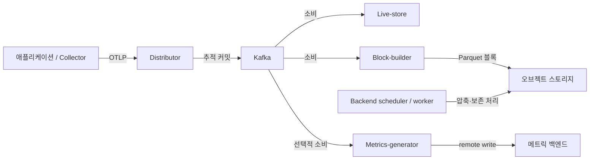
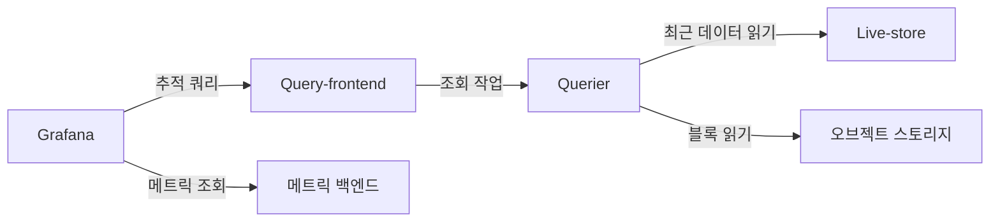

# Grafana Tempo

> **검증 기준**: Tempo 3.0.3, `tempo-distributed` 차트 3.6.0(appVersion 3.0.3)
> **마지막 업데이트**: 2026년 9월 13일

## 소개

Grafana Tempo는 오브젝트 스토리지, Parquet 블록, TraceQL로 분산 추적을 저장하고 조회합니다. TraceID로 찾을 수 있는 것은 **정상 수집되어 아직 보관 중인 데이터**입니다. 샘플링·전송 실패·보존 기간 만료로 사라진 스팬은 복구하지 못합니다. 별도의 범용 검색 데이터베이스를 요구하지 않지만 전용 컬럼, 메타데이터, 캐시, 컴퓨팅과 스토리지 요청 비용은 발생합니다.

이 장은 로컬 단일 프로세스 예제와 EKS 분산 구성의 출발점을 구분합니다. 로컬 바이너리, 쿼리 컴파일러, Helm 렌더링과 설정 파싱을 확인했습니다. 실제 EKS 배포, Kafka 인증, S3 권한, 고가용성, 운영 용량은 **실행 검증하지 않았습니다**.

## 주요 특징

| 기능 | 범위 |
|------|------|
| 오브젝트 스토리지 | S3, GCS, Azure Blob 및 제한적인 개발 예제용 로컬 저장소 |
| TraceQL | 속성·지속 시간·상태·구조 쿼리. 시계열 함수와 추적별 집계는 별개 |
| 프로토콜 | OTLP와 선택적인 Jaeger·Zipkin 수신기. 차트의 해당 포트도 활성화 필요 |
| 상관분석 | 식별자와 데이터 소스 UID가 일치할 때 Grafana에서 추적·로그·메트릭·exemplar 연결 |
| 배포 모드 | `target: all` 모놀리식 또는 Kafka 호환 수집 큐를 사용하는 마이크로서비스 |
| 메트릭 생성 | 선택적인 span metrics/service graphs. 프로세서와 remote-write 수신처 필요 |

## 아키텍처

**Tempo 3 마이크로서비스에는 Kafka가 필요하고 모놀리식에는 필요하지 않습니다.** Distributor는 Kafka에 기록한 뒤 수집 요청에 응답합니다. Live-store, Block-builder, Metrics-generator는 각각 독립적으로 소비합니다. Live-store는 최근 데이터를, Block-builder는 장기 보관 블록 생성을 담당합니다. Query-frontend가 작업을 나누고 Querier가 최근 저장소나 오브젝트 스토리지를 조회합니다.



조회 경로(위와 같은 저장소·메트릭 구성 요소):



화살표는 요청과 데이터 흐름이며 모든 응답·제어 연결을 표현하지 않습니다. Grafana는 메트릭 백엔드를 **조회**합니다. Metrics-generator가 Grafana에 메트릭을 저장하는 구조가 아닙니다.

### 구성 요소 상세

| 구성 요소 | Tempo 3 역할 | 운영 확인 사항 |
|-----------|--------------|----------------|
| Distributor | 검증 후 Kafka 파티션으로 전송 | 역압력, 수락·거부 바이트와 스팬 |
| Live-store | 최근 추적 조회, 로컬 WAL | Consumer lag, 로컬 용량, 파티션 소유권 |
| Block-builder | Kafka 소비 후 Parquet 블록 저장 | 파티션 할당, 오브젝트 스토리지 처리량 |
| Query-frontend / Querier | 쿼리 분할·스케줄링·실행 | 대기열, 조회 바이트, 동시성, 캐시 |
| Backend scheduler / worker | Compaction, 보존 정책, 백그라운드 작업 | 스케줄러 조정, 워커 자원, 실패한 작업 |
| Metrics-generator | Span metrics, service graphs 생성 | 카디널리티, 프로세서 활성화, remote-write 상태 |

Tempo 2의 `ingester`·`compactor` 설정을 Tempo 3 설치에 그대로 사용할 수 없습니다. 분산 **2→3 마이그레이션은 병행 배포**이며, 기존 블록은 `vParquet4` 이상이어야 합니다. 새 수집 경로를 구성한 뒤 통제된 전환이 필요하고 3→2 다운그레이드는 지원하지 않습니다. [공식 마이그레이션 절차](https://grafana.com/docs/tempo/latest/set-up-for-tracing/setup-tempo/upgrade/) 없이 두 설치가 같은 데이터를 동시에 변경하도록 만들지 마세요.

쓰기 내구성은 Kafka 복제, ISR, 보존 기간과 디스크 용량에 달려 있습니다. Tempo 복제본 수만으로 Kafka 내구성이나 무손실을 보장할 수 없습니다. 차트 3.6.0의 Live-store·Block-builder 데이터 볼륨은 `emptyDir`입니다. 복제본 3개가 영구 PVC 3개를 뜻하지 않습니다.

## Helm 설치 (Distributed 모드)

### 1. Helm 저장소 추가

유지보수 중인 community 차트와 명시적인 버전을 사용합니다.

```bash
helm repo add grafana-community https://grafana-community.github.io/helm-charts
helm repo update grafana-community
helm show chart grafana-community/tempo-distributed --version 3.6.0
helm show values grafana-community/tempo-distributed --version 3.6.0 > tempo-defaults.yaml
```

차트의 Kubernetes 제약은 `^1.25.0-0`입니다. 이는 차트 제약이며 모든 Kubernetes/EKS 릴리스·애드온 조합의 검증 표가 아닙니다.

### 2. values.yaml 구성

다음을 `tempo-distributed-values.yaml`로 저장합니다. 계정·버킷 자리표시자와 격리된 테스트용 Kafka 주소를 포함한 **렌더링용 출발점**입니다.

```yaml
# Render-only baseline. Read the Kafka security/deployment gates first.
fullnameOverride: tempo
reportingEnabled: false
serviceAccount:
  create: true
  name: tempo
  annotations:
    eks.amazonaws.com/role-arn: arn:aws:iam::123456789012:role/tempo-s3
traces:
  otlp:
    grpc:
      enabled: true
    http:
      enabled: true
ingest:
  kafka:
    address: kafka-bootstrap.kafka.svc.cluster.local:9092
    topic: tempo-traces
    auto_create_topic_enabled: false
storage:
  trace:
    backend: s3
    s3:
      bucket: replace-with-owned-tempo-bucket
      region: ap-northeast-2
      endpoint: s3.ap-northeast-2.amazonaws.com
      insecure: false
backendScheduler:
  config:
    provider:
      compaction:
        compaction:
          block_retention: 336h
metricsGenerator:
  enabled: false
gateway:
  enabled: false
ingress:
  enabled: false
metaMonitoring:
  serviceMonitor:
    enabled: false
tempo:
  structuredConfig:
    distributor:
      receivers:
        otlp:
          protocols:
            grpc:
              max_recv_msg_size_mib: 16
    overrides:
      defaults:
        ingestion:
          rate_limit_bytes: 15000000
          burst_size_bytes: 20000000
```

실제 배포 전에 아래 조건을 충족해야 합니다.

- Kafka 토픽의 생성과 소유권은 별도로 관리합니다. 기본 Live-store·Block-builder 복제본 3개와 `partitions_per_instance: 1`에 맞는 파티션 설계가 필요합니다. Pod 수만 늘린다고 모든 Block-builder 할당이 재분배되지는 않습니다.
- Kafka 전송 보안과 인증을 끝까지 검증합니다. **Tempo 3.0.3 Kafka 클라이언트는 SASL/PLAIN 설정을 제공하지만 Kafka TLS·SCRAM·MSK IAM 설정은 제공하지 않습니다.** PLAIN은 암호화가 아닙니다. 이 예제를 안전한 MSK 직접 연결 구성으로 해석하면 안 됩니다. 네트워크·프록시 방식은 bootstrap뿐 아니라 모든 advertised broker 주소를 처리해야 하며 운영 적용 전에 별도 검증이 필요합니다.
- 뒤의 S3 버킷·역할을 연결합니다. ServiceAccount 이름과 역할 annotation을 정확히 맞춰야 합니다. 무관한 ServiceAccount를 하나 만드는 것만으로 적용되지 않습니다.
- OTLP, 조회, memberlist, 구성 요소 RPC 경로에 실제 클러스터의 네트워크 통제와 인증된 전송을 적용합니다. 내부 로드 밸런서나 `X-Scope-OrgID` 헤더 자체는 인증이 아닙니다.
- 워크로드에 맞게 자원, 스케줄링, 중단 예산과 저장·복구 정책을 정합니다. PodDisruptionBudget은 자발적 eviction을 제한하고 anti-affinity는 배치를 제어합니다. 어느 것도 가용성을 증명하지는 않습니다.

수신 크기 제한 단위는 **MiB**, 수집 rate/burst 단위는 **바이트**입니다. 16 MiB 및 15/20 MB 값은 예시 제한이며 측정된 처리 용량이 아닙니다.

선택적인 메트릭 생성은 프로세서 활성화와 기존 인증 수신처가 모두 필요합니다. URL을 교체하고 세 인증서 파일을 가진 `tempo-metrics-client` Secret을 준비한 뒤 두 번째 파일을 병합합니다.

```yaml
metricsGenerator:
  enabled: true
  config:
    storage:
      remote_write:
        - url: https://metrics-write.example.org/api/v1/write
          send_exemplars: true
          tls_config:
            ca_file: /etc/metrics-tls/ca.crt
            cert_file: /etc/metrics-tls/tls.crt
            key_file: /etc/metrics-tls/tls.key
  extraVolumes:
    - name: metrics-tls
      secret:
        secretName: tempo-metrics-client
  extraVolumeMounts:
    - name: metrics-tls
      mountPath: /etc/metrics-tls
      readOnly: true
overrides:
  defaults:
    metrics_generator:
      processors: [span-metrics, service-graphs]
      generate_native_histograms: both
```

수신처는 Prometheus remote write를 지원해야 하고 exemplar·native histogram도 목적지 지원이 필요합니다. 차트의 기본 generator WAL은 임시 저장소입니다. 재전송·대기열·저장소를 별도로 검증하세요. `send_exemplars: true`는 전달 보장이 아닙니다.

### 3. IRSA 설정

예제의 정확한 주체는 `system:serviceaccount:monitoring:tempo`입니다. 역할 신뢰 정책에서 OIDC `sub`와 `aud`를 모두 제한하고, 해당 Tempo 버킷에만 권한을 부여합니다. 정적 access key를 환경 변수나 Helm values에 넣지 않습니다.

IRSA는 이 예제에서 사용하는 경로이며 EKS의 유일한 워크로드 자격 증명 방식이라는 뜻은 아닙니다. Pod Identity를 선택하려면 고정한 Tempo 이미지가 사용하는 credential provider와의 호환성을 확인해야 합니다. STS 접근, 버킷 정책, VPC 엔드포인트, 사용 시 KMS 키 정책도 확인합니다. YAML 렌더 성공으로 이 조건이 검증되지는 않습니다.

### 4. 설치 실행

먼저 클러스터에 연결하지 않고 렌더링합니다.

```bash
helm template tempo grafana-community/tempo-distributed \
  --version 3.6.0 --namespace monitoring --kube-version 1.36.2 \
  -f tempo-distributed-values.yaml > tempo-rendered.yaml
```

`--kube-version`은 렌더링 기능을 선택하며 EKS 1.36.2 호환 인증이 아닙니다. Service 포트, Pod 주체, ConfigMap, 자원과 선택적인 generator 설정을 확인합니다. 렌더된 `tempo.yaml`을 추출하여 **동일 버전** 바이너리로 검사합니다.

```bash
tempo -config.file=tempo.yaml -config.verify=true
```

이 명령은 서비스 초기화 전에 종료합니다. Kafka/S3 연결이나 임의의 receiver 내부 설정 전체를 실행 검증하지 않습니다. **앞의 배포 조건을 해결하기 전에는 Helm install을 실행하지 마세요.** 이후 검토한 values·소유한 release/namespace·롤백 또는 마이그레이션 계획을 배포 절차에 적용합니다.

로컬 단일 프로세스 검사는 아래 별도 파일을 `tempo-local.yaml`로 저장하고 OS/아키텍처에 맞게 검증한 공식 Tempo 3.0.3 바이너리를 사용합니다.

```yaml
target: all
stream_over_http_enabled: true
server:
  http_listen_address: 127.0.0.1
  http_listen_port: 3200
  grpc_listen_address: 127.0.0.1
  grpc_listen_port: 9095
distributor:
  receivers:
    otlp:
      protocols:
        grpc:
          endpoint: 127.0.0.1:4317
        http:
          endpoint: 127.0.0.1:4318
storage:
  trace:
    backend: local
    wal:
      path: ./tempo-data/wal
    local:
      path: ./tempo-data/blocks
live_store:
  wal:
    path: ./tempo-data/live-store/traces
  shutdown_marker_dir: ./tempo-data/live-store/shutdown-marker
  ring:
    instance_addr: 127.0.0.1
    instance_interface_names: [lo]
metrics_generator:
  storage:
    path: ./tempo-data/generator/wal
backend_scheduler:
  local_work_path: ./tempo-data/scheduler
memberlist:
  bind_addr: [127.0.0.1]
  advertise_addr: 127.0.0.1
usage_report:
  reporting_enabled: false
```

```bash
tempo -config.file=tempo-local.yaml -config.verify=true
tempo -config.file=tempo-local.yaml
# 다른 터미널에서:
curl --fail http://127.0.0.1:3200/ready
```

Loopback으로 제한하고 사용량 보고를 끄며 `./tempo-data`에 기록합니다. Ctrl-C로 프로세스를 종료합니다. Kafka·S3·인증 게이트웨이가 없는 로컬 단일 인스턴스이며 HA를 보장하지 않습니다.

## TraceQL 쿼리

### 기본 문법

직접 조회에는 Grafana Explore의 TraceID 모드를 사용하거나 32자리 16진수 ID를 TraceQL intrinsic에 넣습니다.

```traceql
{ trace:id = "4bf92f3577b34da6a3ce929d0e0e4736" }
{ resource.service.name = "payment-service" }
{ span.http.response.status_code >= 400 }
{ duration > 1s }
{ status = error }
```

각 줄은 별개의 쿼리입니다. 스팬 상태 `error`와 HTTP 상태 ≥400은 동일한 조건이 아닙니다. 속성 이름은 송신 SDK의 semantic convention 버전에 따릅니다. 과거 `http.status_code`·`db.system` 데이터는 원래 이름으로 조회하며 Tempo가 저장된 속성을 자동으로 바꾸지는 않습니다.

### 고급 쿼리 예시

```traceql
{ span.db.system.name = "postgresql" && duration > 100ms }
{ span.http.route = "/api/payment" && status = error }
{ resource.service.name = "api-gateway" } >> { resource.service.name = "payment-service" }
{ resource.service.name = "order-service" } > { span.db.system.name = "postgresql" }
{ resource.service.name = "order-service" } ~ { resource.service.name = "inventory-service" }
{ trace:rootService = "api-gateway" } | count() > 50
{ duration > 2s } | by(resource.service.name) | avg(duration) > 2s
{ status = error } | rate() by (resource.service.name)
{ } | avg_over_time(duration) by (resource.service.name)
```

- `A >> B`는 A의 **B 후손 스팬**, `A > B`는 B 직계 자식을 반환합니다. 부모를 얻으려면 반대 방향 관계를 사용해야 합니다. 반환된 자식을 부모라고 설명하면 안 됩니다.
- `A ~ B`는 형제 관계이며 A→B 네트워크 호출을 증명하지 않습니다.
- `count()`는 **현재 spanset**의 스팬 수입니다. 먼저 오류만 필터링하면 전체 추적이 아니라 오류 스팬만 셉니다. `traceSpanCount`는 유효한 intrinsic이 아닙니다.
- 이 버전에서 `nestedSetParent`는 허용되지만 내부 nested-set 부모 표시값이지 중첩 깊이가 아닙니다.
- `by(...) | avg(...) > ...`는 추적별 spanset 필터이며 `rate()`·`avg_over_time(...)`은 시계열을 만듭니다. 오류 스팬 rate는 **오류 비율이 아닙니다**. 실제 시간 구간은 Grafana나 쿼리 API에서 지정합니다. duration 필터는 조회 시각 범위가 아닙니다.

`{ span.user.id = "synthetic-user-123" }` 같은 쿼리는 해당 속성을 명시적으로 수집했을 때만 동작합니다. 합성 또는 승인된 가명 식별자를 사용하고 개인정보 수집을 추적의 전제로 만들지 마세요. 사용자 ID·쿼리 문자열이 담긴 원본 URL 대신 카디널리티가 낮은 `http.route`를 우선합니다.

### Grafana에서 TraceQL 사용

포트 **3200**의 Query-frontend URL로 Tempo 데이터 소스를 만들고 Explore → Tempo → Search/TraceQL을 선택합니다. `tempo` UID를 로그 링크와 exemplar 목적지에 맞춥니다. 동시성·제한을 높이기 전에 조회 시간 범위를 줄입니다.

## S3 백엔드 구성

### S3 버킷 설정

전용 버킷에 Block Public Access, bucket-owner-enforced 소유권과 암호화를 적용합니다. 하나의 인프라 상태에서 소유권을 관리하고 동일 버킷을 CLI 예제와 Terraform으로 중복 생성하지 않습니다.

`block_retention: 336h`는 백그라운드 작업이 비동기 적용하는 보존 목표이며 정확한 삭제 시각이 아닙니다. S3 전체 객체에 “30일 후 삭제”를 적용하면 compaction·메타데이터와 충돌할 수 있습니다. 백엔드 동작에 맞춘 수명 주기 설계 없이 추가하지 마세요. Versioning을 사용하면 현재 객체 삭제 뒤 noncurrent version과 비용이 남을 수 있으므로 별도 보존·복구 정책이 필요합니다.

### Terraform으로 S3 및 IRSA 설정

AWS provider **6.64.0** 예제는 SSE-S3와 **기존** 클러스터 OIDC provider를 사용합니다. 계정·전역적으로 고유한 버킷 이름·issuer 입력을 교체합니다. EKS 클러스터, Kafka, KMS 키를 생성하는 예제는 아닙니다.

```hcl
terraform {
  required_version = ">= 1.6.0"
  required_providers {
    aws = {
      source  = "hashicorp/aws"
      version = "6.64.0"
    }
  }
}

variable "region" {
  type    = string
  default = "ap-northeast-2"
}
variable "account_id" {
  type = string
  validation {
    condition     = can(regex("^[0-9]{12}$", var.account_id))
    error_message = "Supply the bucket and role owner account ID."
  }
}
variable "bucket_name" { type = string }
variable "oidc_provider_arn" { type = string }
variable "oidc_issuer_hostpath" {
  type        = string
  description = "Existing cluster OIDC issuer without https://."
}
provider "aws" { region = var.region }

resource "aws_s3_bucket" "tempo" {
  bucket        = var.bucket_name
  force_destroy = false
  lifecycle { prevent_destroy = true }
}
resource "aws_s3_bucket_public_access_block" "tempo" {
  bucket                  = aws_s3_bucket.tempo.id
  block_public_acls       = true
  block_public_policy     = true
  ignore_public_acls      = true
  restrict_public_buckets = true
}
resource "aws_s3_bucket_ownership_controls" "tempo" {
  bucket = aws_s3_bucket.tempo.id
  rule { object_ownership = "BucketOwnerEnforced" }
}
resource "aws_s3_bucket_server_side_encryption_configuration" "tempo" {
  bucket = aws_s3_bucket.tempo.id
  rule {
    apply_server_side_encryption_by_default { sse_algorithm = "AES256" }
  }
}
resource "aws_s3_bucket_policy" "tempo" {
  bucket = aws_s3_bucket.tempo.id
  policy = jsonencode({
    Version = "2012-10-17"
    Statement = [{
      Sid       = "DenyInsecureTransport"
      Effect    = "Deny"
      Principal = "*"
      Action    = "s3:*"
      Resource  = [aws_s3_bucket.tempo.arn, "${aws_s3_bucket.tempo.arn}/*"]
      Condition = { Bool = { "aws:SecureTransport" = "false" } }
    }]
  })
}
resource "aws_iam_role" "tempo" {
  name = "tempo-s3"
  assume_role_policy = jsonencode({
    Version = "2012-10-17"
    Statement = [{
      Effect    = "Allow"
      Principal = { Federated = var.oidc_provider_arn }
      Action    = "sts:AssumeRoleWithWebIdentity"
      Condition = {
        StringEquals = {
          "${var.oidc_issuer_hostpath}:aud" = "sts.amazonaws.com"
          "${var.oidc_issuer_hostpath}:sub" = "system:serviceaccount:monitoring:tempo"
        }
      }
    }]
  })
}
resource "aws_iam_role_policy" "tempo" {
  role = aws_iam_role.tempo.id
  policy = jsonencode({
    Version = "2012-10-17"
    Statement = [
      {
        Effect    = "Allow"
        Action    = ["s3:ListBucket", "s3:GetBucketLocation"]
        Resource  = aws_s3_bucket.tempo.arn
        Condition = { StringEquals = { "aws:ResourceAccount" = var.account_id } }
      },
      {
        Effect    = "Allow"
        Action    = ["s3:GetObject", "s3:PutObject", "s3:DeleteObject", "s3:AbortMultipartUpload"]
        Resource  = "${aws_s3_bucket.tempo.arn}/*"
        Condition = { StringEquals = { "aws:ResourceAccount" = var.account_id } }
      }
    ]
  })
}
output "tempo_role_arn" { value = aws_iam_role.tempo.arn }
output "tempo_bucket" { value = aws_s3_bucket.tempo.id }
```

출력 `tempo_role_arn`·`tempo_bucket`을 Helm values에 반영합니다. 포맷·스키마 검사는 plan 전 검증이며 실제 적용 전에는 plan과 소유권을 검토해야 합니다. SSE-KMS가 필요하면 소유한 키, 일치하는 버킷·Tempo 설정, 제한된 `kms:GenerateDataKey`·`kms:Decrypt` 권한과 워크로드를 허용하는 키 정책을 구성합니다. 정의되지 않은 `aws_kms_key` 참조는 완전한 설정이 아닙니다.

## Trace-to-Log 상관분석 (Loki 연동)

### Grafana 데이터 소스 설정

다음은 차트 전용 `values.yaml`이 아닌 **Grafana provisioning 파일**입니다. 사용 중인 Grafana 차트가 지원하는 방식으로 마운트합니다. 세 내부 URL은 기존 접근 통제된 서비스를 가리키도록 교체합니다.

```yaml
apiVersion: 1
datasources:
  - name: Tempo
    uid: tempo
    type: tempo
    access: proxy
    url: http://tempo-query-frontend.monitoring.svc.cluster.local:3200
    jsonData:
      tracesToLogsV2:
        datasourceUid: loki
        spanStartTimeShift: '-1m'
        spanEndTimeShift: '1m'
        tags: [{key: service.name, value: service_name}]
        filterByTraceID: true
        filterBySpanID: false
        customQuery: false
      tracesToMetrics:
        datasourceUid: prometheus
        tags: [{key: service.name, value: service}]
        queries:
          - name: Span request rate
            query: 'sum(rate(traces_spanmetrics_calls_total{$$__tags}[5m]))'
          - name: Span error ratio
            query: '(sum(rate(traces_spanmetrics_calls_total{$$__tags,status_code="STATUS_CODE_ERROR"}[5m])) or (0 * sum(rate(traces_spanmetrics_calls_total{$$__tags}[5m])))) / (sum(rate(traces_spanmetrics_calls_total{$$__tags}[5m])) > 0)'
      serviceMap:
        datasourceUid: prometheus
      nodeGraph:
        enabled: true
  - name: Loki
    uid: loki
    type: loki
    access: proxy
    url: http://loki-gateway.logging.svc.cluster.local
    jsonData:
      derivedFields:
        - name: TraceID
          matcherRegex: '"traceId"\s*:\s*"([0-9a-f]{32})"'
          datasourceUid: tempo
          url: '$${__value.raw}'
  - name: Prometheus
    uid: prometheus
    type: prometheus
    access: proxy
    url: http://prometheus-operated.monitoring.svc.cluster.local:9090
    jsonData:
      httpMethod: POST
      exemplarTraceIdDestinations:
        - name: traceID
          datasourceUid: tempo
```

Tempo `tracesToLogsV2`는 **Trace→Logs**, Loki `derivedFields`는 **Logs→Trace**입니다. 예제는 OTel `service.name`을 Loki의 기존 `service_name` 라벨로 매핑합니다. Collector의 실제 매핑을 확인하세요. 링크가 없는 라벨·로그를 만들어 주지는 않습니다. 모든 로그에 SpanID가 있는 것은 아니므로 span 필터는 껐습니다.

Provisioning YAML의 `$$`는 Grafana 런타임 매크로에 전달할 `$`를 보존합니다. `__tags`는 라벨 matcher 집합으로 확장되므로 `service="..."`의 값 안에 넣으면 안 됩니다. 오류 비율은 total로부터 누락된 오류 시계열의 0을 만들고, total rate가 양수일 때만 나눕니다. 무트래픽과 텔레메트리 부재는 빈 결과로 남습니다.

Span-metrics 라벨 `service`와 상태 `STATUS_CODE_ERROR`는 실제 생성된 시계열과 맞아야 합니다. Exemplar 목적지는 관측한 라벨 이름을 사용합니다. 예시 generator 구성은 `traceID`를 사용하지만 다른 producer는 `trace_id`를 사용할 수 있습니다. 샘플링에 따라 생성 메트릭과 전체 애플리케이션 요청 수가 달라질 수 있습니다.

### 애플리케이션 로깅 설정

OpenTelemetry API 1.44를 사용하는 Python에서는 `span.is_recording()` 대신 context 유효성을 검사합니다. 기록하지 않는 스팬도 유효한 상관분석 ID를 가질 수 있습니다.

```python
import datetime
import json
import logging
from opentelemetry import trace


class TraceJsonFormatter(logging.Formatter):
    def format(self, record):
        payload = {
            "timestamp": datetime.datetime.fromtimestamp(
                record.created, datetime.timezone.utc
            ).isoformat(),
            "level": record.levelname,
            "message": record.getMessage(),
        }
        context = trace.get_current_span().get_span_context()
        if context.is_valid:
            payload["traceId"] = f"{context.trace_id:032x}"
            payload["spanId"] = f"{context.span_id:016x}"
        if record.exc_info:
            payload["exception"] = self.formatException(record.exc_info)
        return json.dumps(payload, ensure_ascii=False)


logger = logging.getLogger("payment")
logger.setLevel(logging.INFO)
logger.propagate = False
# Configure once at application startup.
if not logger.handlers:
    handler = logging.StreamHandler()
    handler.setFormatter(TraceJsonFormatter())
    logger.addHandler(handler)
```

UTC 시각, 메시지 포맷과 예외를 보존하고 유효하지 않은 ID는 0으로 꾸미지 않고 생략합니다. Handler는 시작 시 한 번 구성합니다. 비동기 경계에서 OTel context를 전달하고 민감한 메시지·예외는 생성 지점에서 제거해야 합니다.

Java는 [추적 개요의 범위 제한 MDC helper](README.md#traceid를-통한-로그-연결)를 참고합니다. 현재 `SpanContext`를 검증하여 로깅 범위에 ID를 설정한 뒤 `finally`에서 이전 MDC를 복원합니다. `MDC.put`만 실행하면 재사용 스레드에서 이전 요청 ID가 남을 수 있습니다. Java API 계약은 확인했지만 이 장에서 Java 애플리케이션을 실행하지는 않았습니다.

## 성능 튜닝

### Ingestion Rate 최적화

수락·거부 바이트와 스팬, exporter 재시도, Kafka producer 오류와 consumer lag를 측정합니다. 메모리·큐 용량 없이 수신 크기, rate limit, 복제본만 늘리면 병목이 옮겨갈 수 있습니다. 생성 메트릭을 해석할 때 upstream 샘플링 조건도 유지해야 합니다.

테넌트 제한은 `overrides.defaults.ingestion`, gRPC 수신 크기는 `max_recv_msg_size_mib`를 사용합니다. 이전 `distributor.rate_limit` 블록이나 Tempo 2 `ingester` 튜닝 블록은 Tempo 3 설정이 아닙니다.

### Compaction 최적화

차트의 `backendScheduler.config.provider.compaction.compaction`과 대응하는 backend-worker 설정으로 보존 처리를 구성합니다. 작업 대기 시간, 실패, 객체 요청과 임시 공간을 관측합니다. 동시성을 늘리면 스토리지 트래픽·메모리가 증가할 수 있습니다. 이전 구조에도 “클러스터당 Compactor는 항상 한 개”라는 일반 규칙을 적용하면 안 됩니다.

### 쿼리 성능 최적화

시간 범위와 조건부터 좁히고 조회 바이트, 대기열, Querier 동시성, 필요한 캐시 역할을 확인합니다. 제거된 `cache:` 구조를 복사하지 말고 고정한 차트·설정의 필드를 사용합니다. S3 hedging은 지연을 낮추는 대신 요청을 늘릴 수 있으므로 측정으로 판단합니다.

Tempo 3 Live-store의 `fail_on_high_lag` 기본값은 true, Query-frontend의 `query_end_cutoff` 기본값은 30s입니다. 아주 최근의 검색 가시성은 직접 TraceID 조회보다 늦을 수 있습니다. 빈 대시보드를 정상처럼 보이게 하려고 보호 설정을 끄지 마세요.

### 리소스 권장 사항

Distributor는 수집량, Live-store는 최근 데이터·lag, Block-builder는 할당 파티션·블록 크기, Querier는 조회 동시성, Generator는 활성 시계열 수를 기준으로 용량을 산정합니다. 이전의 측정 근거 없는 Tempo 2 Ingester/Compactor CPU·디스크 표를 Tempo 3 권장 용량으로 사용할 수 없습니다. 대표 트래픽에서 CPU, RSS, 로컬/WAL 사용량, Kafka lag, 요청 비용과 포화를 측정합니다.

## 트러블슈팅

### 일반적인 문제와 해결책

#### 1. 추적 데이터가 표시되지 않음

SDK 전송 오류, 샘플링, context 전달, Collector 큐, OTLP 전송, 테넌트 경로와 보존 기간을 확인합니다. `/v1/traces`에 GET을 보내는 것은 수집 검사가 아닙니다. 유효한 OTLP POST를 보내고 알고 있는 합성 TraceID로 조회합니다. `/ready` 성공만으로 전체 경로가 동작한다고 판단할 수 없습니다.

#### 2. S3 권한 오류

정확한 ServiceAccount, 역할 신뢰, 버킷 정책, 엔드포인트 접근과 사용 시 KMS 정책을 확인합니다. Pod 환경 변수나 projected token을 출력하지 않습니다. Tempo 이미지에 AWS CLI나 shell이 있다고 가정하지 않습니다.

```bash
kubectl get serviceaccount tempo -n monitoring -o yaml
kubectl get pods -n monitoring -l app.kubernetes.io/instance=tempo \
  -o custom-columns=NAME:.metadata.name,SA:.spec.serviceAccountName
kubectl logs -n monitoring -l app.kubernetes.io/component=block-builder --tail=100
```

로그에 운영 메타데이터·애플리케이션 속성이 포함될 수 있으므로 진단 출력 접근도 제한합니다.

#### 3. 쿼리 타임아웃

Query-frontend/Querier 로그, 시간 범위, Kafka lag, Live-store 파티션 가용성과 S3 throttling을 확인합니다. 메모리·백엔드 제한을 측정한 뒤 동시성을 조정합니다. 빈 결과, timeout, 텔레메트리 부재는 다른 상태입니다.

<a id="_4-ingester-oom"></a>
#### 4. Live-store 메모리 압력

Tempo 3에서는 Live-store 메모리, 최근 데이터 구간, 블록 회전과 파티션 소유권을 확인합니다. 아직 Tempo 2를 운영 중이면 마이그레이션 중 해당 버전의 Ingester 문서를 사용합니다. `ingester.max_block_duration: 30m`을 Tempo 3에 복사해도 Live-store를 튜닝하지 못합니다.

### 유용한 디버깅 명령어

권한이 있는 port-forward로 실제 Query-frontend를 확인합니다.

```bash
kubectl port-forward -n monitoring service/tempo-query-frontend 3200:3200
# 다른 터미널에서:
curl --fail http://127.0.0.1:3200/ready
curl --fail http://127.0.0.1:3200/metrics
curl --fail http://127.0.0.1:3200/api/traces/4bf92f3577b34da6a3ce929d0e0e4736
```

마지막 ID는 해당 배포에 실제 존재해야 합니다. 읽기 전용 ring/status endpoint도 구성 요소별로 다르므로 고정한 API를 확인합니다. 제거된 `/ingester/ring`, `/compactor/ring`과 강제 flush 명령은 일반적인 Tempo 3 진단 명령이 아닙니다.

### 모니터링 대시보드

배포가 실제 내보내는 시계열과 target 라벨을 사용합니다.

```promql
sum(rate(tempo_distributor_spans_received_total[5m]))
sum(process_resident_memory_bytes{job=~"tempo.*"})
histogram_quantile(0.99, sum by (le) (rate(tempo_request_duration_seconds_bucket{route="api_search"}[5m])))
```

각각 **수신 스팬/초**, **프로세스 RSS 바이트**, **HTTP 검색 요청 p99 초**입니다. 메모리 selector는 scrape job 이름을 가정하므로 라벨을 먼저 확인합니다. 바이트 기록 counter는 메모리가 아니고 스팬 수는 추적 수가 아닙니다. 요청 histogram/route는 로컬 Tempo 3.0.3 검사에서 관측했으며 분산 경로 전체 지연 측정은 아닙니다.

## 참고 자료

- [Tempo 3.0.3 릴리스](https://github.com/grafana/tempo/releases/tag/v3.0.3), [차트 3.6.0 values](https://github.com/grafana-community/helm-charts/blob/tempo-distributed-3.6.0/charts/tempo-distributed/values.yaml)
- [Tempo 아키텍처](https://grafana.com/docs/tempo/latest/introduction/architecture/), [Kafka 클라이언트 구현](https://github.com/grafana/tempo/blob/v3.0.3/pkg/ingest/writer_client.go)
- [TraceQL 문법](https://grafana.com/docs/tempo/latest/traceql/construct-traceql-queries/), [Grafana provisioning](https://grafana.com/docs/grafana/latest/datasources/tempo/configure-tempo-data-source/provision/)
- [EKS IRSA 연결](https://docs.aws.amazon.com/eks/latest/userguide/associate-service-account-role.html), [S3 Block Public Access](https://docs.aws.amazon.com/AmazonS3/latest/userguide/access-control-block-public-access.html)

## 퀴즈

[Tempo 퀴즈](../../quizzes/observability/tracing/01-tempo-quiz.md)로 이 장의 내용을 확인하세요.
