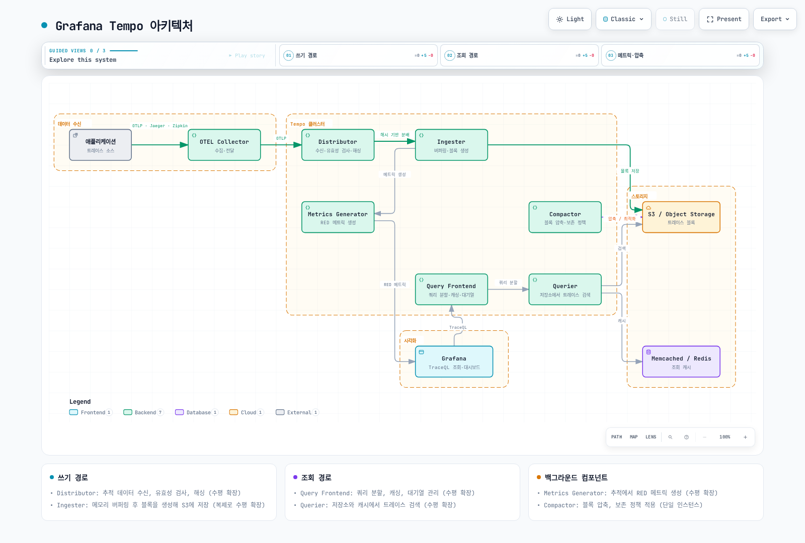

# Grafana Tempo

> **지원 버전**: Tempo 2.x
> **마지막 업데이트**: 2026년 2월 20일

## 소개

Grafana Tempo는 대규모 분산 추적을 위한 오픈소스 백엔드입니다. Tempo는 추적 데이터만 저장하고 인덱싱을 최소화하여 비용 효율적인 운영이 가능합니다. TraceID만 알면 어떤 추적도 찾을 수 있으며, Grafana와의 긴밀한 통합으로 로그, 메트릭과의 상관분석이 용이합니다.

## 주요 특징

| 특징 | 설명 |
|-----|------|
| **인덱스 없는 저장** | TraceID 기반 저장으로 인덱싱 비용 제거 |
| **Object Storage 지원** | S3, GCS, Azure Blob을 백엔드로 사용 |
| **다양한 프로토콜** | Jaeger, Zipkin, OTLP 등 다양한 형식 수신 |
| **TraceQL** | 강력한 추적 쿼리 언어 |
| **Grafana 통합** | Loki, Prometheus와의 네이티브 연동 |
| **수평 확장** | 마이크로서비스 아키텍처로 확장 가능 |

## 아키텍처

Tempo는 다음과 같은 주요 구성 요소로 이루어져 있습니다:



[🔍 인터랙티브 다이어그램 보기](https://www.atomai.click/kubernetes-docs/archmaps/ko-observability-tracing-01-tempo-0.html)

### 구성 요소 상세

| 컴포넌트 | 역할 | 확장 전략 |
|---------|-----|---------|
| **Distributor** | 추적 데이터 수신, 유효성 검사, 해싱 | 수평 확장 |
| **Ingester** | 메모리 버퍼링, 블록 생성, 저장 | 수평 확장 (복제) |
| **Querier** | 저장소에서 추적 검색 | 수평 확장 |
| **Query Frontend** | 쿼리 분할, 캐싱, 대기열 관리 | 수평 확장 |
| **Compactor** | 블록 압축, 보존 정책 적용 | 단일 인스턴스 |
| **Metrics Generator** | 추적에서 RED 메트릭 생성 | 수평 확장 |

## Helm 설치 (Distributed 모드)

### 1. Helm 저장소 추가

```bash
helm repo add grafana https://grafana.github.io/helm-charts
helm repo update
```

### 2. values.yaml 구성

```yaml
# tempo-distributed-values.yaml
global:
  clusterDomain: cluster.local

# Tempo 설정
tempo:
  structuredConfig:
    # 멀티테넌시 비활성화 (단일 테넌트)
    multitenancy_enabled: false

    # 수신기 설정
    distributor:
      receivers:
        otlp:
          protocols:
            grpc:
              endpoint: 0.0.0.0:4317
            http:
              endpoint: 0.0.0.0:4318
        jaeger:
          protocols:
            thrift_http:
              endpoint: 0.0.0.0:14268
            grpc:
              endpoint: 0.0.0.0:14250
        zipkin:
          endpoint: 0.0.0.0:9411

    # 쿼리 프론트엔드 설정
    query_frontend:
      search:
        max_duration: 12h
        default_result_limit: 20
      trace_by_id:
        query_shards: 50

    # Ingester 설정
    ingester:
      max_block_duration: 30m
      max_block_bytes: 500000000  # 500MB
      complete_block_timeout: 1h
      flush_check_period: 10s

    # Compactor 설정
    compactor:
      compaction:
        block_retention: 336h  # 14일
        compacted_block_retention: 1h
        compaction_window: 4h
        max_block_bytes: 107374182400  # 100GB

    # 메트릭 생성기 설정
    metrics_generator:
      registry:
        external_labels:
          source: tempo
          cluster: eks-production
      storage:
        path: /var/tempo/generator/wal
        remote_write:
          - url: http://prometheus:9090/api/v1/write
            send_exemplars: true
      processor:
        service_graphs:
          wait: 10s
          max_items: 10000
        span_metrics:
          dimensions:
            - service.namespace
            - http.method
            - http.status_code

# S3 스토리지 설정
storage:
  trace:
    backend: s3
    s3:
      bucket: tempo-traces-production
      endpoint: s3.ap-northeast-2.amazonaws.com
      region: ap-northeast-2
      # IRSA 사용 시 access_key, secret_key 생략
    blocklist_poll: 5m
    cache: memcached
    memcached:
      addresses:
        - dns+memcached.tempo.svc.cluster.local:11211
      timeout: 500ms
      max_idle_conns: 16
      max_item_size: 16777216  # 16MB

# Distributor 설정
distributor:
  replicas: 3
  resources:
    requests:
      cpu: 500m
      memory: 512Mi
    limits:
      cpu: 1000m
      memory: 1Gi
  autoscaling:
    enabled: true
    minReplicas: 3
    maxReplicas: 10
    targetCPUUtilizationPercentage: 70

# Ingester 설정
ingester:
  replicas: 3
  resources:
    requests:
      cpu: 1000m
      memory: 2Gi
    limits:
      cpu: 2000m
      memory: 4Gi
  persistence:
    enabled: true
    size: 50Gi
    storageClass: gp3
  autoscaling:
    enabled: true
    minReplicas: 3
    maxReplicas: 15
    targetCPUUtilizationPercentage: 70

# Querier 설정
querier:
  replicas: 2
  resources:
    requests:
      cpu: 500m
      memory: 512Mi
    limits:
      cpu: 1000m
      memory: 1Gi
  autoscaling:
    enabled: true
    minReplicas: 2
    maxReplicas: 10
    targetCPUUtilizationPercentage: 70

# Query Frontend 설정
queryFrontend:
  replicas: 2
  resources:
    requests:
      cpu: 300m
      memory: 256Mi
    limits:
      cpu: 500m
      memory: 512Mi
  autoscaling:
    enabled: true
    minReplicas: 2
    maxReplicas: 5
    targetCPUUtilizationPercentage: 70

# Compactor 설정
compactor:
  replicas: 1
  resources:
    requests:
      cpu: 500m
      memory: 1Gi
    limits:
      cpu: 1000m
      memory: 2Gi
  persistence:
    enabled: true
    size: 50Gi
    storageClass: gp3

# Metrics Generator 설정
metricsGenerator:
  enabled: true
  replicas: 2
  resources:
    requests:
      cpu: 500m
      memory: 512Mi
    limits:
      cpu: 1000m
      memory: 1Gi

# Memcached 캐시
memcached:
  enabled: true
  replicas: 2
  resources:
    requests:
      cpu: 100m
      memory: 256Mi
    limits:
      cpu: 500m
      memory: 512Mi

# Gateway (옵션)
gateway:
  enabled: true
  replicas: 2
  ingress:
    enabled: true
    ingressClassName: alb
    annotations:
      alb.ingress.kubernetes.io/scheme: internal
      alb.ingress.kubernetes.io/target-type: ip
    hosts:
      - host: tempo.internal.example.com
        paths:
          - path: /
            pathType: Prefix

# ServiceMonitor for Prometheus
serviceMonitor:
  enabled: true
  interval: 30s
  labels:
    release: prometheus

# Pod 안티-어피니티
podAntiAffinity:
  enabled: true
  type: soft
```

### 3. IRSA 설정

```yaml
# tempo-irsa.yaml
apiVersion: v1
kind: ServiceAccount
metadata:
  name: tempo
  namespace: tempo
  annotations:
    eks.amazonaws.com/role-arn: arn:aws:iam::123456789012:role/tempo-s3-role
---
# IAM Policy (Terraform)
# resource "aws_iam_policy" "tempo_s3" {
#   name = "tempo-s3-policy"
#   policy = jsonencode({
#     Version = "2012-10-17"
#     Statement = [
#       {
#         Effect = "Allow"
#         Action = [
#           "s3:PutObject",
#           "s3:GetObject",
#           "s3:DeleteObject",
#           "s3:ListBucket"
#         ]
#         Resource = [
#           "arn:aws:s3:::tempo-traces-production",
#           "arn:aws:s3:::tempo-traces-production/*"
#         ]
#       }
#     ]
#   })
# }
```

### 4. 설치 실행

```bash
# 네임스페이스 생성
kubectl create namespace tempo

# Helm 설치
helm upgrade --install tempo grafana/tempo-distributed \
  --namespace tempo \
  --values tempo-distributed-values.yaml \
  --version 1.7.0

# 설치 확인
kubectl get pods -n tempo
kubectl get svc -n tempo
```

## TraceQL 쿼리

TraceQL은 Tempo의 강력한 쿼리 언어입니다.

### 기본 문법

```traceql
# TraceID로 조회
{ trace:id = "abc123def456" }

# 서비스 이름으로 필터링
{ resource.service.name = "payment-service" }

# HTTP 상태 코드로 필터링
{ span.http.status_code >= 400 }

# 지속 시간으로 필터링
{ duration > 1s }

# 복합 조건
{ resource.service.name = "order-service" && span.http.status_code = 500 }

# 오류 스팬만 조회
{ status = error }
```

### 고급 쿼리 예시

```traceql
# 1. 느린 데이터베이스 쿼리 찾기
{ span.db.system = "postgresql" && duration > 100ms }

# 2. 특정 사용자의 요청 추적
{ span.user.id = "user123" }

# 3. 오류가 발생한 특정 엔드포인트
{ span.http.url =~ "/api/payment.*" && status = error }

# 4. 특정 시간 범위의 느린 요청
{ duration > 2s } | avg(duration) by (resource.service.name)

# 5. 서비스 간 호출 패턴
{ resource.service.name = "api-gateway" } >> { resource.service.name = "payment-service" }

# 6. 자식 스팬이 있는 부모 스팬
{ resource.service.name = "order-service" } > { span.db.system = "postgresql" }

# 7. 형제 스팬 조회
{ resource.service.name = "order-service" } ~ { resource.service.name = "inventory-service" }

# 8. 중첩 수준으로 필터링
{ nestedSetParent > 0 }

# 9. 스팬 수로 필터링
{ rootServiceName = "api-gateway" && traceSpanCount > 50 }

# 10. 집계 쿼리
{ status = error } | count() by (resource.service.name) | rate()
```

### Grafana에서 TraceQL 사용

```yaml
# Grafana 데이터 소스 설정
apiVersion: 1
datasources:
  - name: Tempo
    type: tempo
    uid: tempo
    url: http://tempo-query-frontend.tempo.svc.cluster.local:3100
    access: proxy
    jsonData:
      httpMethod: GET
      tracesToLogs:
        datasourceUid: loki
        tags: ['job', 'instance', 'pod', 'namespace']
        mappedTags: [{ key: 'service.name', value: 'service' }]
        mapTagNamesEnabled: true
        spanStartTimeShift: '-1h'
        spanEndTimeShift: '1h'
        filterByTraceID: true
        filterBySpanID: true
      tracesToMetrics:
        datasourceUid: prometheus
        tags: [{ key: 'service.name', value: 'service' }]
        queries:
          - name: 'Request Rate'
            query: 'sum(rate(traces_spanmetrics_calls_total{$$__tags}[5m]))'
          - name: 'Error Rate'
            query: 'sum(rate(traces_spanmetrics_calls_total{$$__tags,status_code="STATUS_CODE_ERROR"}[5m]))'
      serviceMap:
        datasourceUid: prometheus
      nodeGraph:
        enabled: true
      search:
        hide: false
      lokiSearch:
        datasourceUid: loki
```

## S3 백엔드 구성

### S3 버킷 설정

```bash
# S3 버킷 생성
aws s3 mb s3://tempo-traces-production --region ap-northeast-2

# 버킷 수명 주기 정책 (30일 후 삭제)
aws s3api put-bucket-lifecycle-configuration \
  --bucket tempo-traces-production \
  --lifecycle-configuration '{
    "Rules": [
      {
        "ID": "tempo-retention",
        "Status": "Enabled",
        "Filter": {
          "Prefix": ""
        },
        "Expiration": {
          "Days": 30
        },
        "NoncurrentVersionExpiration": {
          "NoncurrentDays": 7
        }
      }
    ]
  }'

# 서버 측 암호화 활성화
aws s3api put-bucket-encryption \
  --bucket tempo-traces-production \
  --server-side-encryption-configuration '{
    "Rules": [
      {
        "ApplyServerSideEncryptionByDefault": {
          "SSEAlgorithm": "aws:kms",
          "KMSMasterKeyID": "alias/tempo-encryption-key"
        },
        "BucketKeyEnabled": true
      }
    ]
  }'
```

### Terraform으로 S3 및 IRSA 설정

```hcl
# tempo-s3.tf
resource "aws_s3_bucket" "tempo" {
  bucket = "tempo-traces-${var.environment}"

  tags = {
    Name        = "tempo-traces"
    Environment = var.environment
  }
}

resource "aws_s3_bucket_versioning" "tempo" {
  bucket = aws_s3_bucket.tempo.id
  versioning_configuration {
    status = "Enabled"
  }
}

resource "aws_s3_bucket_server_side_encryption_configuration" "tempo" {
  bucket = aws_s3_bucket.tempo.id

  rule {
    apply_server_side_encryption_by_default {
      sse_algorithm     = "aws:kms"
      kms_master_key_id = aws_kms_key.tempo.arn
    }
    bucket_key_enabled = true
  }
}

resource "aws_s3_bucket_lifecycle_configuration" "tempo" {
  bucket = aws_s3_bucket.tempo.id

  rule {
    id     = "tempo-retention"
    status = "Enabled"

    expiration {
      days = 30
    }

    noncurrent_version_expiration {
      noncurrent_days = 7
    }
  }
}

# IRSA 설정
module "tempo_irsa" {
  source  = "terraform-aws-modules/iam/aws//modules/iam-role-for-service-accounts-eks"
  version = "~> 5.0"

  role_name = "tempo-s3-role"

  attach_external_secrets_policy = false

  oidc_providers = {
    main = {
      provider_arn               = module.eks.oidc_provider_arn
      namespace_service_accounts = ["tempo:tempo"]
    }
  }
}

resource "aws_iam_role_policy" "tempo_s3" {
  name = "tempo-s3-policy"
  role = module.tempo_irsa.iam_role_name

  policy = jsonencode({
    Version = "2012-10-17"
    Statement = [
      {
        Effect = "Allow"
        Action = [
          "s3:PutObject",
          "s3:GetObject",
          "s3:DeleteObject",
          "s3:ListBucket",
          "s3:GetObjectVersion",
          "s3:DeleteObjectVersion"
        ]
        Resource = [
          aws_s3_bucket.tempo.arn,
          "${aws_s3_bucket.tempo.arn}/*"
        ]
      },
      {
        Effect = "Allow"
        Action = [
          "kms:Encrypt",
          "kms:Decrypt",
          "kms:GenerateDataKey"
        ]
        Resource = [aws_kms_key.tempo.arn]
      }
    ]
  })
}
```

## Trace-to-Log 상관분석 (Loki 연동)

### Grafana 데이터 소스 설정

```yaml
# grafana-datasources.yaml
apiVersion: v1
kind: ConfigMap
metadata:
  name: grafana-datasources
  namespace: monitoring
data:
  datasources.yaml: |-
    apiVersion: 1
    datasources:
      # Tempo 데이터 소스
      - name: Tempo
        type: tempo
        uid: tempo
        url: http://tempo-query-frontend.tempo.svc.cluster.local:3100
        access: proxy
        jsonData:
          httpMethod: GET
          # Trace to Logs 연결
          tracesToLogs:
            datasourceUid: loki
            tags: ['job', 'namespace', 'pod']
            mappedTags:
              - key: service.name
                value: app
            mapTagNamesEnabled: true
            spanStartTimeShift: '-1h'
            spanEndTimeShift: '1h'
            filterByTraceID: true
            filterBySpanID: true
          # Trace to Metrics 연결
          tracesToMetrics:
            datasourceUid: prometheus
            tags:
              - key: service.name
                value: service
            queries:
              - name: 'Request Rate'
                query: 'sum(rate(http_server_requests_total{service="$${__tags}"}[5m]))'
              - name: 'Error Rate'
                query: 'sum(rate(http_server_requests_total{service="$${__tags}",status=~"5.."}[5m]))'
          # Service Graph
          serviceMap:
            datasourceUid: prometheus
          # Node Graph
          nodeGraph:
            enabled: true
          # Search 설정
          search:
            hide: false
          lokiSearch:
            datasourceUid: loki

      # Loki 데이터 소스
      - name: Loki
        type: loki
        uid: loki
        url: http://loki-gateway.loki.svc.cluster.local
        access: proxy
        jsonData:
          maxLines: 1000
          derivedFields:
            # 로그에서 TraceID 추출
            - name: TraceID
              matcherRegex: '"traceId":"([a-f0-9]+)"'
              url: '$${__value.raw}'
              datasourceUid: tempo
              urlDisplayLabel: 'View Trace'
            # 대안: trace_id 필드
            - name: trace_id
              matcherRegex: 'trace_id=([a-f0-9]+)'
              url: '$${__value.raw}'
              datasourceUid: tempo
              urlDisplayLabel: 'View Trace'

      # Prometheus 데이터 소스
      - name: Prometheus
        type: prometheus
        uid: prometheus
        url: http://prometheus-operated.monitoring.svc.cluster.local:9090
        access: proxy
        jsonData:
          httpMethod: POST
          exemplarTraceIdDestinations:
            - name: traceID
              datasourceUid: tempo
              urlDisplayLabel: 'View Trace'
```

### 애플리케이션 로깅 설정

```java
// Java 애플리케이션 - TraceID를 로그에 포함
// logback-spring.xml
/*
<configuration>
  <appender name="JSON" class="ch.qos.logback.core.ConsoleAppender">
    <encoder class="net.logstash.logback.encoder.LogstashEncoder">
      <includeMdcKeyName>traceId</includeMdcKeyName>
      <includeMdcKeyName>spanId</includeMdcKeyName>
    </encoder>
  </appender>

  <root level="INFO">
    <appender-ref ref="JSON"/>
  </root>
</configuration>
*/

// 코드에서 MDC 설정
import io.opentelemetry.api.trace.Span;
import org.slf4j.MDC;

@RestController
public class OrderController {

    @GetMapping("/orders/{id}")
    public Order getOrder(@PathVariable String id) {
        Span span = Span.current();
        MDC.put("traceId", span.getSpanContext().getTraceId());
        MDC.put("spanId", span.getSpanContext().getSpanId());

        logger.info("Fetching order: {}", id);
        // 로그 출력: {"traceId":"abc123","spanId":"span456","message":"Fetching order: 12345"}

        return orderService.findById(id);
    }
}
```

```python
# Python 애플리케이션 - TraceID를 로그에 포함
import logging
import json
from opentelemetry import trace

class TraceIdFilter(logging.Filter):
    def filter(self, record):
        span = trace.get_current_span()
        if span.is_recording():
            ctx = span.get_span_context()
            record.trace_id = format(ctx.trace_id, '032x')
            record.span_id = format(ctx.span_id, '016x')
        else:
            record.trace_id = '0' * 32
            record.span_id = '0' * 16
        return True

class JsonFormatter(logging.Formatter):
    def format(self, record):
        log_record = {
            'timestamp': self.formatTime(record),
            'level': record.levelname,
            'message': record.getMessage(),
            'traceId': getattr(record, 'trace_id', ''),
            'spanId': getattr(record, 'span_id', ''),
            'logger': record.name
        }
        return json.dumps(log_record)

# 로거 설정
logger = logging.getLogger(__name__)
handler = logging.StreamHandler()
handler.setFormatter(JsonFormatter())
handler.addFilter(TraceIdFilter())
logger.addHandler(handler)
logger.setLevel(logging.INFO)
```

## 성능 튜닝

### Ingestion Rate 최적화

```yaml
# tempo-config.yaml
ingester:
  # 블록 크기 설정
  max_block_duration: 30m        # 블록 최대 기간
  max_block_bytes: 500000000     # 블록 최대 크기 (500MB)
  complete_block_timeout: 1h     # 블록 완료 타임아웃

  # WAL 설정
  wal:
    path: /var/tempo/wal
    encoding: snappy             # 압축 인코딩
    search_encoding: snappy

  # Trace 설정
  trace_idle_period: 10s         # 유휴 추적 기간
  flush_check_period: 10s        # 플러시 체크 주기

distributor:
  # 수신 제한
  ring:
    kvstore:
      store: memberlist
  receivers:
    otlp:
      protocols:
        grpc:
          max_recv_msg_size: 104857600  # 100MB
        http:
          max_request_body_size: 104857600

  # Rate limiting
  rate_limit:
    enabled: true
    bytes_per_second: 100000000  # 100MB/s
    burst_bytes: 200000000       # 200MB 버스트
```

### Compaction 최적화

```yaml
compactor:
  compaction:
    # 보존 정책
    block_retention: 336h        # 14일
    compacted_block_retention: 1h

    # 압축 설정
    compaction_window: 4h        # 압축 윈도우
    max_block_bytes: 107374182400  # 100GB
    max_compaction_objects: 6

    # 테넌트별 오버라이드
    per_tenant_override_config: /etc/tempo/overrides.yaml

  ring:
    kvstore:
      store: memberlist
```

### 쿼리 성능 최적화

```yaml
query_frontend:
  search:
    max_duration: 12h
    default_result_limit: 20
    max_result_limit: 100

    # 쿼리 샤딩
    query_shards: 50

  trace_by_id:
    query_shards: 50
    hedge_requests_at: 2s
    hedge_requests_up_to: 2

querier:
  # 동시 쿼리
  max_concurrent_queries: 20

  # 검색 설정
  search:
    external_hedge_requests_at: 4s
    external_hedge_requests_up_to: 3

  # 캐시 설정
  frontend_worker:
    frontend_address: tempo-query-frontend:9095
    grpc_client_config:
      max_send_msg_size: 104857600

# 캐시 설정
cache:
  # 블룸 필터 캐시
  bloom_filter:
    memcached:
      addresses: dns+memcached:11211
      timeout: 500ms
      max_idle_conns: 100
      max_item_size: 1048576

  # Parquet 푸터 캐시
  parquet_footer:
    memcached:
      addresses: dns+memcached:11211
      timeout: 500ms
      max_idle_conns: 100
```

### 리소스 권장 사항

| 컴포넌트 | CPU | 메모리 | 디스크 | 비고 |
|---------|-----|-------|-------|-----|
| Distributor | 0.5-1 core | 512Mi-1Gi | - | 수평 확장 |
| Ingester | 1-2 core | 2-4Gi | 50-100Gi SSD | WAL 저장 |
| Querier | 0.5-1 core | 512Mi-1Gi | - | 쿼리 복잡도에 따라 |
| Query Frontend | 0.3-0.5 core | 256-512Mi | - | 경량 |
| Compactor | 0.5-1 core | 1-2Gi | 50-100Gi | 단일 인스턴스 |
| Memcached | 0.1-0.5 core | 256Mi-512Mi | - | 캐시 |

## 트러블슈팅

### 일반적인 문제와 해결책

#### 1. 추적 데이터가 표시되지 않음

```bash
# Distributor 로그 확인
kubectl logs -n tempo -l app.kubernetes.io/component=distributor --tail=100

# 일반적인 원인:
# - OTLP 엔드포인트 연결 문제
# - 네트워크 정책 차단
# - Rate limiting

# 연결 테스트
kubectl run test-tempo --rm -it --image=curlimages/curl -- \
  curl -v http://tempo-distributor.tempo.svc.cluster.local:4318/v1/traces
```

#### 2. S3 권한 오류

```bash
# IRSA 설정 확인
kubectl describe sa tempo -n tempo

# Pod의 AWS 자격 증명 확인
kubectl exec -n tempo -it $(kubectl get pod -n tempo -l app.kubernetes.io/component=ingester -o jsonpath='{.items[0].metadata.name}') -- \
  env | grep AWS

# S3 접근 테스트
kubectl exec -n tempo -it $(kubectl get pod -n tempo -l app.kubernetes.io/component=ingester -o jsonpath='{.items[0].metadata.name}') -- \
  aws s3 ls s3://tempo-traces-production/
```

#### 3. 쿼리 타임아웃

```bash
# Query Frontend 로그 확인
kubectl logs -n tempo -l app.kubernetes.io/component=query-frontend --tail=100

# 해결책:
# 1. query_shards 증가
# 2. max_duration 감소
# 3. Querier 복제본 증가
# 4. 캐시 활성화
```

#### 4. Ingester OOM

```bash
# 메모리 사용량 확인
kubectl top pods -n tempo -l app.kubernetes.io/component=ingester

# 해결책:
# 1. max_block_bytes 감소
# 2. max_block_duration 감소
# 3. 메모리 제한 증가
# 4. Ingester 복제본 증가
```

### 유용한 디버깅 명령어

```bash
# Tempo 상태 확인
curl http://tempo-query-frontend.tempo.svc.cluster.local:3100/status

# 링 상태 확인
curl http://tempo-distributor.tempo.svc.cluster.local:3100/distributor/ring
curl http://tempo-ingester.tempo.svc.cluster.local:3100/ingester/ring

# 메트릭 확인
curl http://tempo-distributor.tempo.svc.cluster.local:3100/metrics | grep tempo_

# Flush 강제 실행
curl -X POST http://tempo-ingester.tempo.svc.cluster.local:3100/flush

# Compaction 상태
curl http://tempo-compactor.tempo.svc.cluster.local:3100/compactor/ring
```

### 모니터링 대시보드

```yaml
# Grafana 대시보드 프로비저닝
apiVersion: v1
kind: ConfigMap
metadata:
  name: tempo-dashboard
  namespace: monitoring
  labels:
    grafana_dashboard: "true"
data:
  tempo-dashboard.json: |-
    {
      "title": "Tempo Overview",
      "panels": [
        {
          "title": "Traces Received/s",
          "targets": [
            {
              "expr": "sum(rate(tempo_distributor_spans_received_total[5m]))"
            }
          ]
        },
        {
          "title": "Ingester Memory",
          "targets": [
            {
              "expr": "sum(tempo_ingester_bytes_written_total)"
            }
          ]
        },
        {
          "title": "Query Latency",
          "targets": [
            {
              "expr": "histogram_quantile(0.99, sum(rate(tempo_query_frontend_queries_bucket[5m])) by (le))"
            }
          ]
        }
      ]
    }
```

## 퀴즈

이 장에서 배운 내용을 테스트하려면 [Tempo 퀴즈](../../quizzes/observability/tracing/01-tempo-quiz.md)를 풀어보세요.
