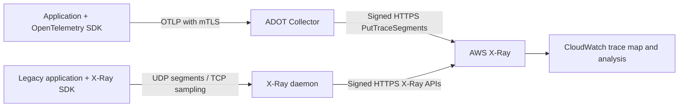
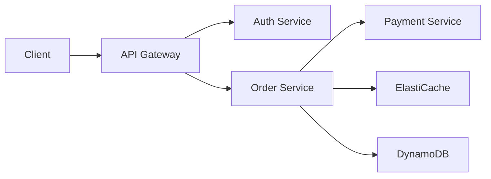

# AWS X-Ray

> **마지막 업데이트**: 2026년 9월 13일

## 소개

AWS X-Ray는 분산 애플리케이션의 요청을 추적하고 분석하는 AWS 네이티브 서비스입니다. EKS 환경에서 X-Ray를 사용하면 마이크로서비스 간의 요청 흐름을 시각화하고, 성능 병목을 식별하며, 오류의 근본 원인을 파악할 수 있습니다.

**X-Ray SDK와 Daemon은 2026년 2월 25일부터 maintenance 모드**이며 보안 수정만 받습니다. 현재 [공식 지원 일정](https://docs.aws.amazon.com/xray/latest/devguide/xray-sdk-daemon-timeline.html)에는 종료일이 명시되어 있지 않습니다. 이는 계측 도구의 수명 주기이며 X-Ray 서비스 종료를 뜻하지 않습니다. AWS는 새 계측과 마이그레이션에 OpenTelemetry를 권장합니다. 아래 Daemon 예제는 기존 SDK 호환 경로입니다.

## 주요 특징

| 특징 | 설명 |
|-----|------|
| **서비스 맵** | 서비스 간 의존성 자동 시각화 |
| **요청 추적** | 엔드투엔드 요청 경로 추적 |
| **분석 도구** | 응답 시간 분포, 오류율 분석 |
| **AWS 통합** | Lambda, API Gateway, ECS, EKS 네이티브 지원 |
| **샘플링 규칙** | 중앙 집중식 샘플링 구성 |
| **그룹 및 알림** | 필터 기반 그룹화와 CloudWatch 알림 |

## 아키텍처

아래는 이 문서의 두 가지 수집 경로입니다. Daemon은 AWS에 서명한 HTTPS 요청을 보내며 UDP/TCP2000은 앱과 연결하는 legacy protocol입니다. 여기서 구성한 ADOT awsxray exporter는 native CloudWatch OTLP endpoint가 아니라 PutTraceSegments를 사용합니다.



EKS가 모든 앱을 자동으로 계측하지는 않습니다. Lambda/API Gateway 등 각 서비스 통합에도 지원되는 tracing 설정과 propagation이 필요합니다. Native CloudWatch OTLP는 아래 설명하는 Transaction Search·SigV4 전제 조건이 있는 별도 수집 경로입니다.

## X-Ray Daemon 배포

### DaemonSet으로 배포

```yaml
# xray-daemon.yaml
apiVersion: v1
kind: ServiceAccount
metadata:
  name: xray-daemon
  namespace: amazon-cloudwatch
  annotations:
    eks.amazonaws.com/role-arn: arn:aws:iam::123456789012:role/xray-daemon-role
---
apiVersion: apps/v1
kind: DaemonSet
metadata:
  name: xray-daemon
  namespace: amazon-cloudwatch
spec:
  selector:
    matchLabels:
      app: xray-daemon
  updateStrategy:
    type: RollingUpdate
  template:
    metadata:
      labels:
        app: xray-daemon
    spec:
      serviceAccountName: xray-daemon
      nodeSelector:
        kubernetes.io/os: linux
      containers:
        - name: xray-daemon
          image: amazon/aws-xray-daemon:3.7.0@sha256:a2303d37f9dd7077c93e596689cb1de12f2ef8333c15b088ba223840164f6bc2
          args: ["-o", "-n", "ap-northeast-2"]
          ports:
            - name: xray-udp
              containerPort: 2000
              protocol: UDP
            - name: xray-tcp
              containerPort: 2000
              protocol: TCP
          resources:
            requests:
              cpu: 50m
              memory: 64Mi
            limits:
              cpu: 100m
              memory: 128Mi
          env:
            - name: AWS_REGION
              value: ap-northeast-2
      tolerations:
        - key: node-role.kubernetes.io/master
          effect: NoSchedule
---
apiVersion: v1
kind: Service
metadata:
  name: xray-daemon
  namespace: amazon-cloudwatch
spec:
  selector:
    app: xray-daemon
  ports:
    - name: xray-udp
      port: 2000
      protocol: UDP
    - name: xray-tcp
      port: 2000
      protocol: TCP
  type: ClusterIP
```

Maintenance 경로의 이미지는 공식 3.7.0 멀티 아키텍처 manifest(Linux amd64/arm64)로 고정했습니다. Entrypoint는 `/usr/bin/xray`가 아닌 `/xray`이며, `-o`는 EC2 메타데이터 부가 조회를 끄고 `-n`은 Region을 지정합니다. EKS Fargate에서는 DaemonSet이 실행되지 않습니다. ClusterIP Service는 다른 노드의 데몬도 선택하므로 노드 로컬 전달이나 UDP 무손실을 보장하지 않습니다.

기존 SDK 클라이언트에는 `AWS_XRAY_DAEMON_ADDRESS=xray-daemon.amazon-cloudwatch.svc.cluster.local:2000`을 설정합니다. UDP 세그먼트와 TCP 샘플링 경로가 모두 필요합니다. 암호화되지 않은 기존 경로는 신뢰한 워크로드로 제한하고, 인증된 TLS 수집에는 OpenTelemetry 경로를 사용합니다. Producer별 수집 경로를 하나 선택합니다.


### IRSA 설정

기존 소유자의 절차로 `amazon-cloudwatch` namespace를 준비합니다. Legacy daemon의 `xray-daemon` ServiceAccount에는 별도로 준비한 전용 role을 연결합니다. 다음 permission policy는 segment/telemetry 전송과 중앙 sampling 호출을 포함하며 Region을 실제 배포 위치로 바꿉니다.

```json
{
  "Version": "2012-10-17",
  "Statement": [
    {
      "Effect": "Allow",
      "Action": [
        "xray:PutTraceSegments",
        "xray:PutTelemetryRecords",
        "xray:GetSamplingRules",
        "xray:GetSamplingTargets",
        "xray:GetSamplingStatisticSummaries"
      ],
      "Resource": "*",
      "Condition": {
        "StringEquals": {
          "aws:RequestedRegion": "ap-northeast-2"
        }
      }
    }
  ]
}
```

해당 X-Ray action은 `Resource: "*"`를 사용하고 여기서는 `aws:RequestedRegion`으로 제한합니다. 아래 ADOT 전용 최소 정책과 구분합니다. 어느 정책도 운영자에게 group·sampling rule 생성 권한을 부여하지 않습니다.

각 collector의 IRSA role에는 클러스터에 등록한 OIDC provider, `aud=sts.amazonaws.com`, **정확한 namespace/ServiceAccount subject**를 사용합니다. 다음 trust 예제는 `adot-collector`용입니다. Daemon role에는 `system:serviceaccount:amazon-cloudwatch:xray-daemon`을 사용해야 합니다. 예시 account·Region·OIDC ID를 일관되게 교체합니다.

```json
{
  "Version": "2012-10-17",
  "Statement": [
    {
      "Effect": "Allow",
      "Principal": {
        "Federated": "arn:aws:iam::123456789012:oidc-provider/oidc.eks.ap-northeast-2.amazonaws.com/id/EXAMPLE"
      },
      "Action": "sts:AssumeRoleWithWebIdentity",
      "Condition": {
        "StringEquals": {
          "oidc.eks.ap-northeast-2.amazonaws.com/id/EXAMPLE:aud": "sts.amazonaws.com",
          "oidc.eks.ap-northeast-2.amazonaws.com/id/EXAMPLE:sub": "system:serviceaccount:amazon-cloudwatch:adot-collector"
        }
      }
    }
  ]
}
```

IAM/인프라 소유자가 의도한 role을 생성·갱신하고 해당 permission policy를 연결합니다. 기존 ServiceAccount 소유권을 유지하며 `eksctl --override-existing-serviceaccounts`를 일반 설치 단계로 실행하지 않습니다. 승인한 환경에서 최종 Pod의 projected token, role ARN, SDK credential 해석과 실제 인가를 확인합니다. ServiceAccount annotation만으로 인가 성공을 입증할 수는 없습니다.

## ADOT Collector 배포

이 trace pipeline은 Collector/Contrib 0.158.0을 기반으로 한 [ADOT Collector 0.50.0](https://github.com/aws-observability/aws-otel-collector/releases/tag/v0.50.0)을 사용합니다. ADOT 배포판의 component 목록은 독립적이므로 upstream Contrib의 모든 component가 포함된다고 가정하지 않습니다. 버전을 고정한 collector binary에 합성 OTLP/X-Ray 데이터와 loopback 가상 X-Ray endpoint를 연결하여 로컬 검증했습니다. AWS 인가, Kubernetes 배포나 운영 가용성 시험은 수행하지 않았습니다.

<a id="adot-collector-daemonset"></a>

### Collector Deployment와 전제 조건

예제는 host port 없는 중앙 **Deployment** 1개와 ClusterIP Service이며 HA 구성이 아닙니다. 앱이 DNS endpoint를 명시적으로 선택해야 하고 collector 설치만으로 instrumentation이 되지는 않습니다. DaemonSet은 별도 배치 설계이며 EKS Fargate에서 지원되지 않습니다. Fargate의 Deployment에도 일치하는 Fargate profile과 지원되는 resource/storage/network 구성이 필요합니다.

리소스를 적용하기 전에 다음을 준비합니다.

- 앞 절의 namespace·IRSA role을 준비하고 subject를 `system:serviceaccount:amazon-cloudwatch:adot-collector`로 제한합니다.
- 승인된 인증서 전달 절차로 기존 Kubernetes Secret `adot-collector-tls`를 준비합니다. `server.crt`, `server.key`, `ca.crt`가 필요합니다. 서버 인증서는 실제 Service DNS(예: `adot-collector.amazon-cloudwatch.svc.cluster.local`)를 포함해야 하며 CA는 의도한 client 인증서를 신뢰해야 합니다.
- Producer에는 승인한 CA/client 인증서·개인 키 파일을 mount합니다. Secret 접근, workload의4317/4318 연결과 health endpoint를 제한하고 인증서 rotation을 계획합니다. 개인 키 내용이나 AWS credential을 환경 변수에 넣지 않습니다.
- Cluster/account/Region 값을 교체하고 최종 workload identity를 확인합니다. Resource processor는 cluster 이름 하나를 명시적으로 지정하며 모든 Pod/node metadata를 자동 발견하지 않습니다. 다른 cluster의 telemetry까지 같은 cluster로 표시하지 않습니다.

아래 ADOT pipeline은 exporter telemetry를 비활성화하고 classic X-Ray `PutTraceSegments` 경로만 사용하므로 workload permission policy는 다음과 같습니다.

```json
{
  "Version": "2012-10-17",
  "Statement": [
    {
      "Effect": "Allow",
      "Action": ["xray:PutTraceSegments"],
      "Resource": "*",
      "Condition": {
        "StringEquals": {
          "aws:RequestedRegion": "ap-northeast-2"
        }
      }
    }
  ]
}
```

다음 전체 ConfigMap과 workload/Service manifest를 함께 사용합니다.

```yaml
apiVersion: v1
kind: ConfigMap
metadata:
  name: adot-collector-config
  namespace: amazon-cloudwatch
data:
  collector.yaml: |
    receivers:
      otlp:
        protocols:
          grpc:
            endpoint: 0.0.0.0:4317
            tls:
              cert_file: /etc/otel/tls/server.crt
              key_file: /etc/otel/tls/server.key
              client_ca_file: /etc/otel/tls/ca.crt
              min_version: "1.2"
          http:
            endpoint: 0.0.0.0:4318
            tls:
              cert_file: /etc/otel/tls/server.crt
              key_file: /etc/otel/tls/server.key
              client_ca_file: /etc/otel/tls/ca.crt
              min_version: "1.2"
    processors:
      memory_limiter:
        check_interval: 1s
        limit_mib: 400
        spike_limit_mib: 100
      resource:
        attributes:
          - key: cloud.provider
            value: aws
            action: upsert
          - key: k8s.cluster.name
            value: ${env:CLUSTER_NAME}
            action: upsert
      batch:
        timeout: 5s
        send_batch_size: 256
        send_batch_max_size: 512
    exporters:
      awsxray:
        region: ap-northeast-2
        local_mode: true
        index_all_attributes: false
        indexed_attributes:
          - deployment.environment.name
          - app.operation
        telemetry:
          enabled: false
    extensions:
      health_check:
        endpoint: 0.0.0.0:13133
    service:
      extensions: [health_check]
      pipelines:
        traces:
          receivers: [otlp]
          processors: [memory_limiter, resource, batch]
          exporters: [awsxray]
```

```yaml
apiVersion: v1
kind: ServiceAccount
metadata:
  name: adot-collector
  namespace: amazon-cloudwatch
  annotations:
    eks.amazonaws.com/role-arn: arn:aws:iam::123456789012:role/adot-xray-role
automountServiceAccountToken: false
---
apiVersion: apps/v1
kind: Deployment
metadata:
  name: adot-collector
  namespace: amazon-cloudwatch
spec:
  replicas: 1
  selector:
    matchLabels:
      app: adot-collector
  template:
    metadata:
      labels:
        app: adot-collector
    spec:
      serviceAccountName: adot-collector
      nodeSelector:
        kubernetes.io/os: linux
      automountServiceAccountToken: false
      terminationGracePeriodSeconds: 30
      securityContext:
        runAsNonRoot: true
        runAsUser: 4317
        runAsGroup: 4317
        fsGroup: 4317
        seccompProfile:
          type: RuntimeDefault
      containers:
        - name: collector
          image: public.ecr.aws/aws-observability/aws-otel-collector:v0.50.0
          args: ["--config=/conf/collector.yaml"]
          env:
            - name: CLUSTER_NAME
              value: replace-with-cluster-name
            - name: AWS_REGION
              value: ap-northeast-2
            - name: AWS_EC2_METADATA_DISABLED
              value: "true"
            - name: GOMEMLIMIT
              value: 400MiB
          resources:
            requests:
              cpu: 100m
              memory: 256Mi
            limits:
              cpu: 500m
              memory: 512Mi
          securityContext:
            allowPrivilegeEscalation: false
            readOnlyRootFilesystem: true
            capabilities:
              drop: [ALL]
          ports:
            - name: otlp-grpc
              containerPort: 4317
            - name: otlp-http
              containerPort: 4318
            - name: health
              containerPort: 13133
          volumeMounts:
            - name: config
              mountPath: /conf
              readOnly: true
            - name: tls
              mountPath: /etc/otel/tls
              readOnly: true
          readinessProbe:
            httpGet:
              path: /
              port: health
            initialDelaySeconds: 5
          livenessProbe:
            httpGet:
              path: /
              port: health
            initialDelaySeconds: 15
      volumes:
        - name: config
          configMap:
            name: adot-collector-config
        - name: tls
          secret:
            secretName: adot-collector-tls
            defaultMode: 0440
---
apiVersion: v1
kind: Service
metadata:
  name: adot-collector
  namespace: amazon-cloudwatch
spec:
  type: ClusterIP
  selector:
    app: adot-collector
  ports:
    - name: otlp-grpc
      port: 4317
      targetPort: otlp-grpc
    - name: otlp-http
      port: 4318
      targetPort: otlp-http
```

Container image는 `RUN_IN_CONTAINER=True`를 제공합니다. Standalone native collector 시험에서는 custom CLI가 `/opt`에 로그를 쓰지 않도록 이 변수를 지정해야 합니다. CLI가 모든 upstream `otelcol` 명령과 같지는 않습니다. 로컬 시험에는 AWS의 버전별 binary, 시험용 인증서와 loopback 목적지만 사용했습니다.

제안한 구성은 client 인증서 없는 요청 거부와 신뢰된 인증서 수용을 포함한 mTLS 검사 5개를 통과했고, Kubernetes 리소스 3개는 로컬 OpenAPI schema 검증을 통과했습니다. 실제 Secret, IRSA mutation, CNI policy, scheduling이나 AWS 권한의 검증은 아닙니다. Health endpoint는 collector 프로세스 상태를 보여 주며 X-Ray 전달 성공을 보장하지 않습니다. Queue·재시도·memory pressure·종료·backend 오류로 telemetry가 유실될 수 있으므로 용량과 refused/dropped/export-failed 지표를 관찰합니다.

### Legacy X-Ray Receiver와 별도 Telemetry Pipeline

ADOT0.50.0에는 `awsxray` receiver도 포함됩니다. 다음 UDP 구성은 지원되는 문법입니다.

```yaml
# Receiver fragment only; requires an explicitly connected trace pipeline.
receivers:
  awsxray:
    endpoint: 0.0.0.0:2000
    transport: udp
```

이는 SDK segment를 daemon으로 보내는 경로의 대안입니다. 동일 producer의 trace를 중복 전송하지 않습니다. Receiver는 기본적으로 TCP sampling proxy도 시작합니다. 중앙 sampling을 사용하면 UDP2000뿐 아니라 필요한 TCP2000 Service/proxy 경로와 sampling 권한을 구성·제한합니다. Legacy protocol은 OTLP receiver의 mTLS 설정으로 보호되지 않습니다. Native 감사에서 OTLP와 X-Ray UDP 수신을 확인했지만 원격 AWS sampling은 실행하지 않았습니다.

Metrics·애플리케이션 log·trace에는 각각 연결된 pipeline과 backend 구성이 필요합니다. `awscloudwatchlogs` exporter를 선언하는 것만으로 trace가 log로 변환되거나 임의의 `/aws/xray/traces` log group에 기록되지 않습니다. Metrics remote-write에도 실제 receiver, 인증과 TLS 구성이 필요하며 X-Ray의 필수 요소는 아닙니다.

## OpenTelemetry에서 X-Ray로 통합

다음 예제는 앞의 인증된 collector Service를 사용합니다. Producer에는 Service 접근과 mount한 client TLS 파일이 필요하며 collector의 AWS credential은 필요하지 않습니다. 합성 span을 만들 뿐 실제 결제·DB·AWS 비즈니스 작업은 실행하지 않습니다.

검증 기준은 Python SDK/exporter1.44.0·Flask3.1.3, Go SDK/exporter1.44.0·Go1.26.8, Java1.66.0 API source입니다. 이 pin은 전체 AWS 호환성 조합이나 각 언어의 최신 릴리스가 같다는 주장이 아닙니다. Python·Go는 로컬 실행으로 검증했고 Java는 tagged source의 API/설정을 확인했지만 이 감사 환경에서는 JDK/Maven compile을 수행하지 못했습니다.

아래는 유한한 demo 프로세스용 설정입니다. OTLP/HTTP endpoint에 `/v1/traces`를 포함하며 client private key는 보호된 mount 파일로 전달합니다. 이 demo는 root span을 sampling하고 remote parent 결정을 따릅니다. 무제한 운영 트래픽에 all-roots demo 설정을 그대로 적용하지 말고 실측한 production sampler를 선택합니다. 일반 SDK sampler가 X-Ray 중앙 규칙을 자동 조회하지는 않습니다.

```bash
# Application-process configuration; mounted file paths are not secret contents.
export OTEL_SDK_DISABLED=false
export OTEL_SERVICE_NAME=inventory-demo
export OTEL_TRACES_EXPORTER=otlp
export OTEL_METRICS_EXPORTER=none
export OTEL_LOGS_EXPORTER=none
export OTEL_EXPORTER_OTLP_TRACES_PROTOCOL=http/protobuf
export OTEL_EXPORTER_OTLP_TRACES_ENDPOINT=https://adot-collector.amazon-cloudwatch.svc.cluster.local:4318/v1/traces
export OTEL_EXPORTER_OTLP_TRACES_CERTIFICATE=/etc/otel/client/ca.crt
export OTEL_EXPORTER_OTLP_TRACES_CLIENT_CERTIFICATE=/etc/otel/client/client.crt
export OTEL_EXPORTER_OTLP_TRACES_CLIENT_KEY=/etc/otel/client/client.key
export OTEL_PROPAGATORS=tracecontext
export OTEL_TRACES_SAMPLER=parentbased_always_on
```

### 애플리케이션 설정 (Java)

기존 Java 프로젝트에 `InventoryDemo.java`를 저장합니다. Autoconfiguration은 표준 OTLP endpoint·protocol·CA/client-key/client-certificate 파일 설정을 읽으며 앱 전체를 자동 계측하지는 않습니다. Agent/framework가 SDK를 소유하면 두 번째 SDK를 초기화하지 않습니다. `OpenTelemetrySdk`는 Closeable을 구현하므로 close가 provider 종료를 조정하지만 메서드 반환만으로 backend 전달 성공이 입증되지는 않습니다.

```xml
<!-- Dependency fragment for an existing Java17+ Maven project. -->
<dependencies>
  <dependency>
    <groupId>io.opentelemetry</groupId>
    <artifactId>opentelemetry-sdk-extension-autoconfigure</artifactId>
    <version>1.66.0</version>
  </dependency>
  <dependency>
    <groupId>io.opentelemetry</groupId>
    <artifactId>opentelemetry-exporter-otlp</artifactId>
    <version>1.66.0</version>
  </dependency>
</dependencies>
```

```java
import io.opentelemetry.api.trace.Span;
import io.opentelemetry.api.trace.Tracer;
import io.opentelemetry.context.Scope;
import io.opentelemetry.sdk.OpenTelemetrySdk;
import io.opentelemetry.sdk.autoconfigure.AutoConfiguredOpenTelemetrySdk;

// Standalone finite demo; do not create a second SDK when an agent/framework owns it.
public final class InventoryDemo {
    public static void main(String[] args) {
        try (OpenTelemetrySdk sdk = AutoConfiguredOpenTelemetrySdk.builder()
                .build().getOpenTelemetrySdk()) {
            Tracer tracer = sdk.getTracer("inventory-demo");
            Span root = tracer.spanBuilder("inventory.demo").startSpan();
            try (Scope ignored = root.makeCurrent()) {
                root.setAttribute("app.operation", "inventory.demo");
                root.setAttribute("deployment.environment.name", "demo");
                Span child = tracer.spanBuilder("inventory.lookup").startSpan();
                try {
                    child.setAttribute("lookup.result", "demo");
                    // No AWS or database call is performed by this example.
                } finally {
                    child.end();
                }
            } finally {
                root.end();
            }
        } // SDK close shuts down providers/exporters; delivery must still be monitored.
    }
}
```

### 애플리케이션 설정 (Python)

격리한 앱 환경에 `opentelemetry-api==1.44.0`, `opentelemetry-sdk==1.44.0`, `opentelemetry-exporter-otlp-proto-http==1.44.0`, `Flask==3.1.3`을 사용하고 다음을 `payment_demo.py`로 저장합니다. `/api/payment`는 합성 응답만 반환하며 실제 결제를 실행·검증하지 않습니다. 로컬 Flask 개발 서버도 production WSGI 배포가 아닙니다.

```python
"""Synthetic Flask instrumentation example: no payment is processed."""
import os
from pathlib import Path
from urllib.parse import urlparse

from flask import Flask, jsonify, request
from opentelemetry.exporter.otlp.proto.http.trace_exporter import OTLPSpanExporter
from opentelemetry.sdk.resources import Resource
from opentelemetry.sdk.trace import TracerProvider
from opentelemetry.sdk.trace.export import BatchSpanProcessor
from opentelemetry.sdk.trace.sampling import ParentBased, ALWAYS_ON
from opentelemetry.trace import SpanKind
from opentelemetry.trace.propagation.tracecontext import TraceContextTextMapPropagator


def configure_provider():
    endpoint = os.environ["OTEL_EXPORTER_OTLP_TRACES_ENDPOINT"]
    url = urlparse(endpoint)
    if url.scheme != "https" or not url.hostname or url.username or url.password:
        raise ValueError("Configure an HTTPS collector endpoint without URL credentials")
    certs = {
        "certificate_file": os.environ["OTEL_EXPORTER_OTLP_TRACES_CERTIFICATE"],
        "client_certificate_file": os.environ["OTEL_EXPORTER_OTLP_TRACES_CLIENT_CERTIFICATE"],
        "client_key_file": os.environ["OTEL_EXPORTER_OTLP_TRACES_CLIENT_KEY"],
    }
    for path in certs.values():
        if not Path(path).is_file():
            raise ValueError("A required mounted TLS file is missing")
    provider = TracerProvider(
        resource=Resource.create({"service.name": "payment-demo"}),
        # Finite demo traffic only. Select a measured production sampling policy.
        sampler=ParentBased(ALWAYS_ON),
    )
    provider.add_span_processor(BatchSpanProcessor(
        OTLPSpanExporter(endpoint=endpoint, timeout=5, **certs),
        max_queue_size=256, max_export_batch_size=64,
    ))
    return provider


def create_app(provider):
    app = Flask(__name__)
    tracer = provider.get_tracer("payment-demo")
    propagator = TraceContextTextMapPropagator()

    @app.post("/api/payment")
    def payment_demo():
        carrier = {name.lower(): value for name, value in request.headers.items()}
        parent = propagator.extract(carrier)
        with tracer.start_as_current_span(
            "POST /api/payment", context=parent, kind=SpanKind.SERVER
        ) as span:
            span.set_attribute("app.operation", "payment.demo")
            span.set_attribute("deployment.environment.name", "demo")
            span.set_attribute("http.request.method", "POST")
            span.set_attribute("http.route", "/api/payment")
            with tracer.start_as_current_span("validation.demo") as child:
                child.set_attribute("validation.result", "accepted")
            span.set_attribute("http.response.status_code", 202)
            # No request payload/Authorization/user ID is added to telemetry.
            return jsonify(status="demo-only-no-payment-processed"), 202

    return app


if __name__ == "__main__":
    provider = configure_provider()
    try:
        # Local development server only; not a production WSGI deployment.
        create_app(provider).run(host="127.0.0.1", port=8080)
    finally:
        provider.shutdown()
```

### 애플리케이션 설정 (Go)

별도 예제 디렉터리에 다음 `go.mod`·`main.go`를 저장하고 `go mod tidy`로 고정한 의존성을 준비한 뒤 의도한 collector/TLS 환경에서만 실행합니다. 예제는 유한한 span2개를 만듭니다. `DEMO_TRACEPARENT`는 선택적인 설명용 carrier이며 실제 HTTP handler는 요청 header에서 context를 추출하고 outgoing request에 주입해야 합니다. SDK 생성만으로 모든 HTTP/DB library에 instrumentation이 추가되지는 않습니다.

```text
module example.invalid/xray-otel-demo

go 1.25.0

require (
    go.opentelemetry.io/otel v1.44.0
    go.opentelemetry.io/otel/exporters/otlp/otlptrace/otlptracehttp v1.44.0
    go.opentelemetry.io/otel/sdk v1.44.0
    go.opentelemetry.io/otel/trace v1.44.0
)
```

```go
package main

import (
	"context"
	"fmt"
	"log"
	"net/url"
	"os"
	"time"

	"go.opentelemetry.io/otel/attribute"
	"go.opentelemetry.io/otel/exporters/otlp/otlptrace/otlptracehttp"
	"go.opentelemetry.io/otel/propagation"
	"go.opentelemetry.io/otel/sdk/resource"
	sdktrace "go.opentelemetry.io/otel/sdk/trace"
	"go.opentelemetry.io/otel/trace"
)

func configureProvider(ctx context.Context) (*sdktrace.TracerProvider, error) {
	endpoint := os.Getenv("OTEL_EXPORTER_OTLP_TRACES_ENDPOINT")
	u, err := url.Parse(endpoint)
	if err != nil || u.Scheme != "https" || u.Hostname() == "" || u.User != nil {
		return nil, fmt.Errorf("configure an HTTPS collector endpoint without URL credentials")
	}
	for _, name := range []string{
		"OTEL_EXPORTER_OTLP_TRACES_CERTIFICATE",
		"OTEL_EXPORTER_OTLP_TRACES_CLIENT_CERTIFICATE",
		"OTEL_EXPORTER_OTLP_TRACES_CLIENT_KEY",
	} {
		info, err := os.Stat(os.Getenv(name))
		if err != nil || !info.Mode().IsRegular() {
			return nil, fmt.Errorf("required mounted TLS file is missing: %s", name)
		}
	}
	// This exporter reads the standard signal-specific TLS file environment settings.
	exporter, err := otlptracehttp.New(ctx,
		otlptracehttp.WithEndpointURL(endpoint),
		otlptracehttp.WithTimeout(5*time.Second))
	if err != nil {
		return nil, err
	}
	return sdktrace.NewTracerProvider(
		sdktrace.WithResource(resource.NewSchemaless(
			attribute.String("service.name", "inventory-demo"))),
		// Finite demo only; honors a remote parent's unsampled decision.
		sdktrace.WithSampler(sdktrace.ParentBased(sdktrace.AlwaysSample())),
		sdktrace.WithBatcher(exporter),
	), nil
}

func emitDemo(ctx context.Context, tracer trace.Tracer) {
	ctx, parent := tracer.Start(ctx, "inventory.demo")
	defer parent.End()
	parent.SetAttributes(
		attribute.String("app.operation", "inventory.demo"),
		attribute.String("deployment.environment.name", "demo"))
	_, child := tracer.Start(ctx, "inventory.lookup")
	child.SetAttributes(attribute.String("lookup.result", "demo"))
	child.End()
}

func run() error {
	ctx := context.Background()
	provider, err := configureProvider(ctx)
	if err != nil {
		return err
	}
	// Optional CLI demonstration carrier, not automatic HTTP instrumentation.
	parent := propagation.TraceContext{}.Extract(ctx,
		propagation.MapCarrier{"traceparent": os.Getenv("DEMO_TRACEPARENT")})
	emitDemo(parent, provider.Tracer("inventory-demo"))
	shutdown, cancel := context.WithTimeout(ctx, 10*time.Second)
	defer cancel()
	return provider.Shutdown(shutdown)
}

func main() {
	if err := run(); err != nil {
		log.Fatal(err)
	}
}
```

Python은 대소문자가 섞인 header, parent/child identity, unsampled parent, 민감 payload 미수집과 실제 loopback mTLS OTLP POST를 포함한13검사를 통과했습니다. Go는 mTLS/protobuf 전송·W3C identity·unsampled parent·평문 거부·TLS 파일 누락을 다루는 native test4개를 통과했습니다. AWS에 접속하거나 운영 앱 성능을 입증한 시험은 아닙니다. Java import·lifecycle·TLS autoconfiguration은 source 확인 범위입니다.

여기서는 W3C Trace Context를 사용합니다. X-Amzn-Trace-Id 연동에는 언어·통합 경로에 맞는 AWS propagator가 필요할 수 있지만 W3C trace에 X-Ray 전용 ID generator가 언제나 필요한 것은 아닙니다. 여러 형식을 수용하면 무조건 propagator를 합성하지 말고 우선순위·신뢰 경계를 정합니다. 비동기 작업은 parent context를 명시적으로 전달해야 합니다.

## 샘플링 규칙

### 중앙 집중식 샘플링 구성

X-Ray 중앙 규칙은 호환되는 X-Ray remote sampler를 사용하는 producer에만 적용됩니다. 일반 OpenTelemetry `parentbased_traceidratio` sampler는 규칙을 가져오지 않으며 AWS에 규칙을 생성해도 SDK의 remote sampling이 켜지지 않습니다. Collector의 `awsxray` exporter는 이미 선택된 span을 내보내며 요청을 사후 선택하지 않습니다.

Head sampling은 완료된 응답을 알기 전에 결정합니다. 미래의 HTTP500이나 최종 duration 조건으로 모든 오류·느린 요청을 수집한다고 보장할 수 없습니다. Classic X-Ray SDK는 `Attributes`가 있는 규칙을 무시하고 `ResourceARN: "*"`만 지원하므로 이전 오류 속성 규칙은 동작하는 전체 오류 정책이 아니었습니다. 넓은 경로에 일치하는 “slow” 규칙도 실제 최종 지연을 검사하지 않습니다.

숫자가 작은 priority부터 일치 여부를 평가합니다. Reservoir target·fixed rate는 best-effort 동작이며 초당 요청이 부족해도 trace 10개를 확보한다는 보장이 아닙니다. Parent 결정, 지원 sampler와 분산 quota가 영향을 줍니다.

다음은 별도 요청 파일 3개입니다. 로컬에서 AWS API 구조를 검증했으며 AWS에 적용하지 않았습니다.

**`sampling-production.json` — 일반 API 요청 정책:**

```json
{
  "SamplingRule": {
    "RuleName": "docs-production-api",
    "ResourceARN": "*",
    "Priority": 1000,
    "FixedRate": 0.05,
    "ReservoirSize": 10,
    "ServiceName": "*",
    "ServiceType": "*",
    "Host": "*",
    "HTTPMethod": "*",
    "URLPath": "/api/*",
    "Version": 1,
    "Attributes": {}
  }
}
```

**`sampling-health.json` — 더 높은 우선순위의 GET health-check 제외:**

```json
{
  "SamplingRule": {
    "RuleName": "docs-health-checks",
    "ResourceARN": "*",
    "Priority": 100,
    "FixedRate": 0,
    "ReservoirSize": 0,
    "ServiceName": "*",
    "ServiceType": "*",
    "Host": "*",
    "HTTPMethod": "GET",
    "URLPath": "/health*",
    "Version": 1,
    "Attributes": {}
  }
}
```

**`sampling-adaptive.json` — 선택적인 요청 범위 adaptive 예제:**

현재 [SamplingRateBoost](https://docs.aws.amazon.com/xray/latest/api/API_SamplingRateBoost.html)는 이상 징후에 따른 임시 sampling 증가의 최대 rate·cooldown을 지원합니다. `MaxRate: 0.5`는 절대 sampling rate 상한이며 기존 비율의 50% 증가가 아닙니다. 사후 tail sampling이나 모든 실패 요청 수집 보장이 아니므로 사용 전 producer의 adaptive-sampling 지원을 확인합니다.

```json
{
  "SamplingRule": {
    "RuleName": "docs-adaptive-checkout",
    "ResourceARN": "*",
    "Priority": 200,
    "FixedRate": 0.05,
    "ReservoirSize": 1,
    "ServiceName": "*",
    "ServiceType": "*",
    "Host": "*",
    "HTTPMethod": "POST",
    "URLPath": "/api/checkout*",
    "Version": 1,
    "Attributes": {},
    "SamplingRateBoost": {
      "MaxRate": 0.5,
      "CooldownWindowMinutes": 10
    }
  }
}
```

### 샘플링 규칙 관리

생성·갱신·제거 전 의도한 account/Region의 기존 rule 이름과 priority를 조회합니다. Rule 관리 권한이 있는 운영자 role을 사용하며 collector 쓰기 권한만으로는 충분하지 않습니다.

```bash
set -euo pipefail
: "${AWS_REGION:?Set the reviewed Region}"
aws xray get-sampling-rules --region "$AWS_REGION"
aws xray get-sampling-statistic-summaries --region "$AWS_REGION"
# AWS mutation: apply only a reviewed new rule with no conflicting owner.
aws xray create-sampling-rule --region "$AWS_REGION"   --cli-input-json file://sampling-production.json
```

소유한 기존 규칙에는 `update-sampling-rule`을 사용하고 이전 구성을 보관합니다. `delete-sampling-rule`로 제거할 대상도 명시적으로 폐기한 소유 규칙만 선택합니다. 조회 실패나 추측한 이름은 안전한 제거의 근거가 아닙니다.

오류·지연으로 완료 trace를 선택하려면 별도로 설계한 tail-sampling pipeline을 검토합니다. 앞단 head sampling에서 버리기 전에 관련 span을 받아야 하며 trace별 sampler 일관성, 늦은 span과 제한된 memory를 고려해야 합니다. 이미 버린 span을 복원하거나 모든 오류를 무손실로 수집할 수는 없습니다.

## 서비스 맵 시각화

### X-Ray 콘솔에서 서비스 맵 활용

CloudWatch trace map은 X-Ray map과 기존 ServiceLens map을 통합합니다. 트래픽 색상은 red=server fault(HTTP5xx), yellow=client error(HTTP4xx), purple=throttle(HTTP429), green=성공을 구분하며 임의의 지연 경고 임계값이 아닙니다.

이전 그림의 topology와 수치를 아래에 보존합니다. **설명용 집계 평균**이며 실측, 단일 trace에서 더할 수 있는 시간이나 QPS 순위가 아닙니다. Order Service의 outgoing 연결이 많다고 요청량이 가장 많다는 결론을 낼 수는 없습니다.



| 구성 요소 | 이전의 설명용 평균 |
|---|---:|
| Client |250ms|
| API Gateway |50ms|
| Auth Service |30ms|
| Order Service |100ms|
| Payment Service |150ms; 설명용 오류율2%|
| ElastiCache |5ms|
| DynamoDB |20ms|

### 프로그래밍 방식으로 서비스 맵 조회

```bash
# Read-only AWS API example; requires the approved operator role.
set -euo pipefail
: "${AWS_REGION:?Set the reviewed Region}"
END_TIME=$(date -u +%s)
START_TIME=$((END_TIME - 3600))
aws xray get-service-graph --region "$AWS_REGION"   --start-time "$START_TIME" --end-time "$END_TIME"
# Add --group-name only for a verified existing group.
```

## CloudWatch ServiceLens 연동

### ServiceLens 설정

CloudWatch에서 trace·metric·log를 연계하려면 실제로 각각 수집하고 적절한 service/trace 식별자를 공유해야 합니다. Mount하지 않은 ConfigMap만으로 agent가 설정되지 않습니다. [CloudWatch Observability EKS add-on](https://docs.aws.amazon.com/AmazonCloudWatch/latest/monitoring/install-CloudWatch-Observability-EKS-addon.html) 또는 승인한 기존 agent/operator 구성을 사용하면서 소유자, IAM identity, Secret/CA와 platform 지원 조건을 보존합니다. 다른 collector가 쓰는 host port에 수신기를 중복 설치하지 않습니다. 이전 ConfigMap 예제만으로는 이 통합이 완성되지 않았습니다.

Native OTLP trace 수집은 `https://xray.REGION.amazonaws.com/v1/traces`의 **HTTP·SigV4** 경로를 사용하며 [Transaction Search](https://docs.aws.amazon.com/AmazonCloudWatch/latest/monitoring/CloudWatch-Transaction-Search.html)가 필요합니다. 일반 unsigned OTLP exporter를 이 URL로 연결하는 것만으로는 충분하지 않습니다. 위 ADOT awsxray exporter가 OTLP span을 classic X-Ray segment 문서로 변환하는 경로와 구분합니다.

Transaction Search는 구조화된 span을 CloudWatch의 `aws/spans` log group에 저장합니다. Index sampling은 producer head sampling·span 수집과 별도 제어입니다. X-Ray는 W3C128-bit trace ID를 지원하며 classic segment 표현은 `1-8hex-24hex` 형식입니다. X-Ray 전용 SDK ID generator가 언제나 필요한 것은 아닙니다. 실제 upstream/downstream 통합이 요구할 때 X-Amzn-Trace-Id propagation을 선택하고 여러 형식을 수용하면 우선순위를 정합니다.

### ServiceLens 대시보드 쿼리

다음은 [문서화된 span 필드](https://docs.aws.amazon.com/AmazonCloudWatch/latest/monitoring/CloudWatch-Transaction-Search-search-analyze-spans.html)를 사용하는 `aws/spans`의 **서로 별개인 Logs Insights QL 쿼리**입니다. 수집 경로의 실제 필드를 먼저 확인하며 모든 custom span에 AWS local-service·HTTP 속성이 있는 것은 아닙니다. 제공된 `xray.traces` SQL table은 없습니다. 문서의 query/field 계약을 확인한 예시이며 관리형 CloudWatch 계정에서 실행하지 않았습니다.

```text
fields @timestamp, durationNano, attributes.aws.local.service
| filter ispresent(durationNano)
| limit 20

# Separate query: sampled span durations in milliseconds, not request-level SLOs.
filter ispresent(durationNano) and ispresent(attributes.aws.local.service)
| stats count(*) as sampled_spans,
        avg(durationNano) / 1000000 as avg_ms,
        pct(durationNano, 99) / 1000000 as p99_ms
  by attributes.aws.local.service
| sort p99_ms desc

# Separate query: largest sampled HTTP 5xx span counts.
filter attributes.http.response.status_code >= 500
| stats count(*) as sampled_5xx_spans by attributes.aws.local.service
| sort sampled_5xx_spans desc
```

UI에서 의도한 시간 범위와 span/service 범위를 선택합니다. 요청 하나에 여러 span이 있으므로 sampling한 span 수·duration percentile은 편향 없는 애플리케이션 오류율이나 요청 지연 SLO가 아닙니다. 요청별 비율에는 일관된 범위의 request metric을 사용하고 오류 없는 정상 트래픽, missing data와 sampling 편향을 고려합니다. 내림차순은 가장 큰 값을 먼저 보여 줍니다.

## 그룹 및 필터

### X-Ray 그룹 생성

권한 있는 운영자 role과 의도한 Region을 사용합니다. 생성 전에 기존 group을 조회하며 소유한 기존 group은 update 작업으로 변경합니다. 아래 demo filter는 SDK 예제가 내보내고 명시적으로 색인한 environment 속성에 맞춥니다. 운영 환경에는 실제 기록된 field/value를 사용합니다.

```bash
set -euo pipefail
: "${AWS_REGION:?Set the reviewed Region}"
aws xray get-groups --region "$AWS_REGION"
# AWS mutations: create only reviewed new groups whose names are not already owned.
aws xray create-group --region "$AWS_REGION" --group-name docs-demo \
  --filter-expression 'annotation[deployment.environment.name] = "demo"'
aws xray create-group --region "$AWS_REGION" --group-name docs-errors \
  --filter-expression 'fault = true OR error = true'
aws xray create-group --region "$AWS_REGION" --group-name docs-slow \
  --filter-expression 'responsetime > 1'
aws xray create-group --region "$AWS_REGION" --group-name docs-payment \
  --filter-expression 'service("payment-demo")'
```

Group은 수집한 trace를 필터링하고 관련 metric을 제공하며 IAM 격리·retention·producer sampling을 정의하지 않습니다. CloudWatch alarm은 별도로 구성·시험합니다. 빈 결과는 속성 불일치, sampling, 수집 부재나 잘못된 시간 범위 때문일 수 있으므로 앱이 정상이라는 뜻이 아닙니다.

### 필터 표현식 예시

다음은 X-Ray query UI/API의 filter 표현식이며 셸 명령이나 Logs Insights 문법이 아닙니다. Duration 단위는 초이며 `> 2`는2초 초과입니다. Producer가 실제로 내보내고 색인한 annotation을 선택합니다.

```text
service("order-service")
http.status >= 400
responsetime > 2
annotation[environment] = "demo"
service("api-gateway") AND responsetime > 1 AND !fault
edge("api-gateway", "order-service")
```

## Best Practices

### 1. 세그먼트 및 서브세그먼트 설계

의미 있는 작업에 범위가 제한된 이름을 부여하고 parent context를 유지합니다. 다음 legacy Java SDK 조각은 동기 작업의 중첩 구조이며 전체 앱이나 실행한 AWS 작업이 아닙니다. X-Ray Java 2.21.1의 Segment/Subsegment는 AutoCloseable을 구현하므로 try-with-resources가 유효합니다. Middleware가 만든 segment가 있으면 두 번째 root를 만들지 않고 재사용하며 비동기·thread 전환에는 지원되는 명시적 context 전달이 필요합니다. 신규 코드는 OpenTelemetry를 우선합니다.

```java
// Legacy X-Ray SDK structure fragment; no database/payment/queue call is executed.
// AWSXRay, Segment and Subsegment are from the reviewed X-Ray Java SDK.
try (Segment segment = AWSXRay.beginSegment("ProcessOrder")) {
    segment.putAnnotation("operation", "checkout");
    segment.putAnnotation("environment", "demo");
    try (Subsegment lookup = AWSXRay.beginSubsegment("inventory.lookup")) {
        lookup.putMetadata("operation", "GetItem");
        // Invoke the application's reviewed client here, without recording secrets.
    }
    try (Subsegment payment = AWSXRay.beginSubsegment("payment.authorize")) {
        payment.putAnnotation("payment_method", "card");
    }
    try (Subsegment notification = AWSXRay.beginSubsegment("notification.publish")) {
        notification.putMetadata("operation", "SendMessage");
    }
}
```

### 2. 주석(Annotation)과 메타데이터 활용

X-Ray는 **trace당 annotation 최대50개**를 색인하며 segment마다 독립적으로50개가 아닙니다. 필요한 low-cardinality 필드만 선택합니다. Metadata는 annotation으로 색인되지 않지만 저장되고 접근할 수 있으므로 redaction이나 개인정보 보호 경계가 아닙니다. 수집 전에 token·cookie·private key·원문 요청/응답·사용자 식별자·SQL parameter를 제거합니다. Transaction Search의 span/log 접근·보존도 검토해야 합니다. Collector의 index_all_attributes=false가 색인하지 않은 속성을 삭제하지는 않습니다.

```java
// Synthetic, bounded examples. Never attach complete request/response bodies.
segment.putAnnotation("environment", "demo");
segment.putAnnotation("operation", "checkout");
segment.putMetadata("diagnostics", Map.of(
    "operation", "GetItem",
    "result_category", "success"
));
```

### 3. 비용 최적화

선택한 SDK/remote sampler·collector의 실제 구성을 사용합니다. 임의의 sampling.default/errors YAML은 X-Ray API나 ADOT 설정이 아닙니다. Health-check 제외를 넓은 API 규칙보다 앞에 두고 실제 영향을 측정합니다. Head sampling으로 나중에 발생할 모든 오류를100%수집한다고 보장할 수 없습니다. 기록·조회/scan·Transaction Search 수집/색인·CloudWatch 보존·collector 용량을 현재 요금과 각각 비교합니다. Index sampling과 producer sampling은 별도 제어이므로 하나를 낮춰도 모든 span 저장량·요금이 동일하게 줄어드는 것은 아닙니다.

## 퀴즈

이 장에서 배운 내용을 테스트하려면 [X-Ray 퀴즈](../../quizzes/observability/tracing/02-xray-quiz.md)를 풀어보세요.
