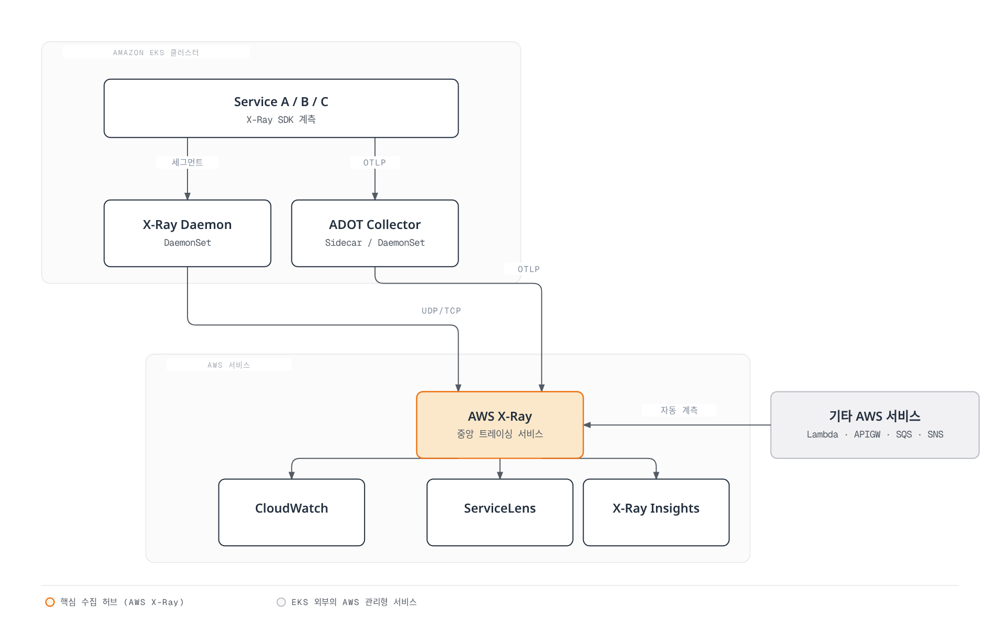
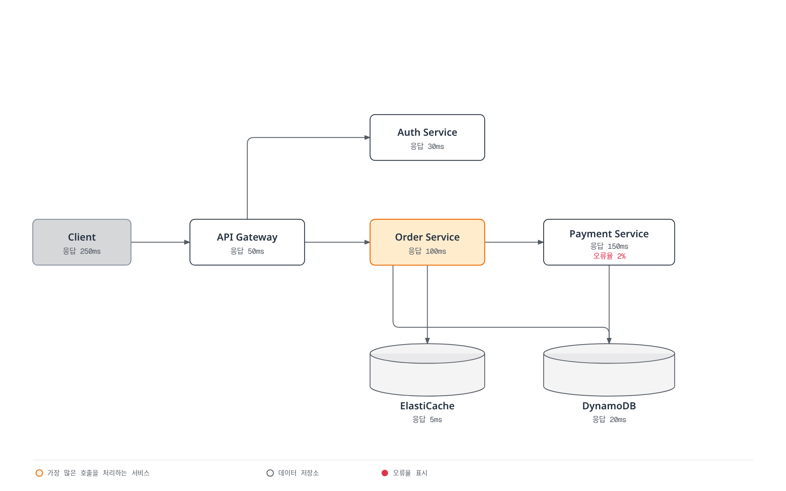

# AWS X-Ray

> **마지막 업데이트**: 2026년 2월 20일

## 소개

AWS X-Ray는 분산 애플리케이션의 요청을 추적하고 분석하는 AWS 네이티브 서비스입니다. EKS 환경에서 X-Ray를 사용하면 마이크로서비스 간의 요청 흐름을 시각화하고, 성능 병목을 식별하며, 오류의 근본 원인을 파악할 수 있습니다.

## 주요 특징

| 특징 | 설명 |
|-----|------|
| **서비스 맵** | 서비스 간 의존성 자동 시각화 |
| **요청 추적** | 엔드투엔드 요청 경로 추적 |
| **분석 도구** | 응답 시간 분포, 오류율 분석 |
| **AWS 통합** | Lambda, API Gateway, ECS, EKS 네이티브 지원 |
| **샘플링 규칙** | 중앙 집중식 샘플링 구성 |
| **그룹 및 알림** | 필터 기반 그룹화와 CloudWatch 알림 |

## 아키텍처



## X-Ray Daemon 배포

### DaemonSet으로 배포

```yaml
# xray-daemon.yaml
apiVersion: v1
kind: ServiceAccount
metadata:
  name: xray-daemon
  namespace: amazon-cloudwatch
  annotations:
    eks.amazonaws.com/role-arn: arn:aws:iam::123456789012:role/xray-daemon-role
---
apiVersion: apps/v1
kind: DaemonSet
metadata:
  name: xray-daemon
  namespace: amazon-cloudwatch
spec:
  selector:
    matchLabels:
      app: xray-daemon
  updateStrategy:
    type: RollingUpdate
  template:
    metadata:
      labels:
        app: xray-daemon
    spec:
      serviceAccountName: xray-daemon
      containers:
        - name: xray-daemon
          image: public.ecr.aws/xray/aws-xray-daemon:3.3.7
          command:
            - /usr/bin/xray
            - --bind=0.0.0.0:2000
            - --bind-tcp=0.0.0.0:2000
            - --region=ap-northeast-2
            - --log-level=info
          ports:
            - name: xray-udp
              containerPort: 2000
              hostPort: 2000
              protocol: UDP
            - name: xray-tcp
              containerPort: 2000
              hostPort: 2000
              protocol: TCP
          resources:
            requests:
              cpu: 50m
              memory: 64Mi
            limits:
              cpu: 100m
              memory: 128Mi
          env:
            - name: AWS_REGION
              value: ap-northeast-2
      tolerations:
        - key: node-role.kubernetes.io/master
          effect: NoSchedule
---
apiVersion: v1
kind: Service
metadata:
  name: xray-daemon
  namespace: amazon-cloudwatch
spec:
  selector:
    app: xray-daemon
  ports:
    - name: xray-udp
      port: 2000
      protocol: UDP
    - name: xray-tcp
      port: 2000
      protocol: TCP
  clusterIP: None
```

### IRSA 설정

```yaml
# IAM Policy for X-Ray
# xray-policy.json
{
  "Version": "2012-10-17",
  "Statement": [
    {
      "Effect": "Allow",
      "Action": [
        "xray:PutTraceSegments",
        "xray:PutTelemetryRecords",
        "xray:GetSamplingRules",
        "xray:GetSamplingTargets",
        "xray:GetSamplingStatisticSummaries"
      ],
      "Resource": "*"
    }
  ]
}
```

```bash
# IRSA 역할 생성
eksctl create iamserviceaccount \
  --name xray-daemon \
  --namespace amazon-cloudwatch \
  --cluster my-cluster \
  --attach-policy-arn arn:aws:iam::aws:policy/AWSXRayDaemonWriteAccess \
  --approve \
  --override-existing-serviceaccounts
```

## ADOT Collector 배포

AWS Distro for OpenTelemetry (ADOT)를 사용한 X-Ray 통합:

### ADOT Collector DaemonSet

```yaml
# adot-collector.yaml
apiVersion: v1
kind: ConfigMap
metadata:
  name: adot-collector-config
  namespace: amazon-cloudwatch
data:
  collector.yaml: |
    receivers:
      otlp:
        protocols:
          grpc:
            endpoint: 0.0.0.0:4317
          http:
            endpoint: 0.0.0.0:4318
      # X-Ray SDK 호환성
      awsxray:
        endpoint: 0.0.0.0:2000
        transport: udp
      # Prometheus 메트릭 (옵션)
      prometheus:
        config:
          scrape_configs:
            - job_name: 'otel-collector'
              scrape_interval: 10s
              static_configs:
                - targets: ['localhost:8888']

    processors:
      batch:
        timeout: 5s
        send_batch_size: 256

      memory_limiter:
        limit_mib: 512
        spike_limit_mib: 128
        check_interval: 5s

      # 리소스 속성 추가
      resource:
        attributes:
          - key: cloud.provider
            value: aws
            action: upsert
          - key: k8s.cluster.name
            from_attribute: CLUSTER_NAME
            action: upsert

      # AWS 속성 추가
      resourcedetection:
        detectors: [env, eks, ec2]
        timeout: 2s
        override: false

    exporters:
      awsxray:
        region: ap-northeast-2
        index_all_attributes: true
        indexed_attributes:
          - otel.resource.service.name
          - otel.resource.service.namespace
          - aws.local.service

      # CloudWatch Logs (트레이스 로그)
      awscloudwatchlogs:
        log_group_name: "/aws/xray/traces"
        log_stream_name: "otel-traces"
        region: ap-northeast-2

      # Prometheus Remote Write (옵션)
      prometheusremotewrite:
        endpoint: http://prometheus:9090/api/v1/write

    extensions:
      health_check:
        endpoint: 0.0.0.0:13133
      pprof:
        endpoint: 0.0.0.0:1777

    service:
      extensions: [health_check, pprof]
      pipelines:
        traces:
          receivers: [otlp, awsxray]
          processors: [memory_limiter, resourcedetection, resource, batch]
          exporters: [awsxray]
        metrics:
          receivers: [otlp, prometheus]
          processors: [memory_limiter, batch]
          exporters: [prometheusremotewrite]
---
apiVersion: apps/v1
kind: DaemonSet
metadata:
  name: adot-collector
  namespace: amazon-cloudwatch
spec:
  selector:
    matchLabels:
      app: adot-collector
  template:
    metadata:
      labels:
        app: adot-collector
    spec:
      serviceAccountName: adot-collector
      containers:
        - name: collector
          image: public.ecr.aws/aws-observability/aws-otel-collector:v0.36.0
          command:
            - /awscollector
            - --config=/conf/collector.yaml
          ports:
            - containerPort: 4317  # OTLP gRPC
              hostPort: 4317
              protocol: TCP
            - containerPort: 4318  # OTLP HTTP
              hostPort: 4318
              protocol: TCP
            - containerPort: 2000  # X-Ray
              hostPort: 2000
              protocol: UDP
            - containerPort: 13133 # Health check
              protocol: TCP
          env:
            - name: CLUSTER_NAME
              value: my-eks-cluster
            - name: AWS_REGION
              value: ap-northeast-2
          resources:
            requests:
              cpu: 100m
              memory: 256Mi
            limits:
              cpu: 500m
              memory: 512Mi
          volumeMounts:
            - name: config
              mountPath: /conf
          livenessProbe:
            httpGet:
              path: /
              port: 13133
            initialDelaySeconds: 15
            periodSeconds: 10
          readinessProbe:
            httpGet:
              path: /
              port: 13133
            initialDelaySeconds: 5
            periodSeconds: 10
      volumes:
        - name: config
          configMap:
            name: adot-collector-config
---
apiVersion: v1
kind: Service
metadata:
  name: adot-collector
  namespace: amazon-cloudwatch
spec:
  selector:
    app: adot-collector
  ports:
    - name: otlp-grpc
      port: 4317
      protocol: TCP
    - name: otlp-http
      port: 4318
      protocol: TCP
    - name: xray
      port: 2000
      protocol: UDP
```

## OpenTelemetry에서 X-Ray로 통합

### 애플리케이션 설정 (Java)

```xml
<!-- pom.xml -->
<dependencies>
    <!-- OpenTelemetry -->
    <dependency>
        <groupId>io.opentelemetry</groupId>
        <artifactId>opentelemetry-api</artifactId>
        <version>1.34.0</version>
    </dependency>
    <dependency>
        <groupId>io.opentelemetry</groupId>
        <artifactId>opentelemetry-sdk</artifactId>
        <version>1.34.0</version>
    </dependency>

    <!-- AWS X-Ray Propagator -->
    <dependency>
        <groupId>io.opentelemetry.contrib</groupId>
        <artifactId>opentelemetry-aws-xray-propagator</artifactId>
        <version>1.32.0-alpha</version>
    </dependency>

    <!-- OTLP Exporter -->
    <dependency>
        <groupId>io.opentelemetry</groupId>
        <artifactId>opentelemetry-exporter-otlp</artifactId>
        <version>1.34.0</version>
    </dependency>

    <!-- AWS X-Ray ID Generator -->
    <dependency>
        <groupId>io.opentelemetry.contrib</groupId>
        <artifactId>opentelemetry-aws-xray</artifactId>
        <version>1.32.0</version>
    </dependency>
</dependencies>
```

```java
// OpenTelemetry 설정
import io.opentelemetry.api.OpenTelemetry;
import io.opentelemetry.api.trace.Tracer;
import io.opentelemetry.api.trace.propagation.W3CTraceContextPropagator;
import io.opentelemetry.contrib.awsxray.AwsXrayIdGenerator;
import io.opentelemetry.contrib.awsxray.propagator.AwsXrayPropagator;
import io.opentelemetry.context.propagation.ContextPropagators;
import io.opentelemetry.context.propagation.TextMapPropagator;
import io.opentelemetry.exporter.otlp.trace.OtlpGrpcSpanExporter;
import io.opentelemetry.sdk.OpenTelemetrySdk;
import io.opentelemetry.sdk.resources.Resource;
import io.opentelemetry.sdk.trace.SdkTracerProvider;
import io.opentelemetry.sdk.trace.export.BatchSpanProcessor;
import io.opentelemetry.semconv.resource.attributes.ResourceAttributes;

@Configuration
public class OpenTelemetryConfig {

    @Bean
    public OpenTelemetry openTelemetry() {
        // Resource 정의
        Resource resource = Resource.getDefault()
            .merge(Resource.create(Attributes.of(
                ResourceAttributes.SERVICE_NAME, "order-service",
                ResourceAttributes.SERVICE_VERSION, "1.0.0",
                ResourceAttributes.DEPLOYMENT_ENVIRONMENT, "production"
            )));

        // OTLP Exporter (ADOT Collector로 전송)
        OtlpGrpcSpanExporter otlpExporter = OtlpGrpcSpanExporter.builder()
            .setEndpoint("http://adot-collector.amazon-cloudwatch.svc.cluster.local:4317")
            .build();

        // TracerProvider with X-Ray ID Generator
        SdkTracerProvider tracerProvider = SdkTracerProvider.builder()
            .setResource(resource)
            .setIdGenerator(AwsXrayIdGenerator.getInstance())
            .addSpanProcessor(BatchSpanProcessor.builder(otlpExporter)
                .setMaxQueueSize(2048)
                .setMaxExportBatchSize(512)
                .build())
            .build();

        // Context Propagators (W3C + X-Ray)
        TextMapPropagator compositePropagator = TextMapPropagator.composite(
            W3CTraceContextPropagator.getInstance(),
            AwsXrayPropagator.getInstance()
        );

        return OpenTelemetrySdk.builder()
            .setTracerProvider(tracerProvider)
            .setPropagators(ContextPropagators.create(compositePropagator))
            .build();
    }

    @Bean
    public Tracer tracer(OpenTelemetry openTelemetry) {
        return openTelemetry.getTracer("order-service", "1.0.0");
    }
}
```

### 애플리케이션 설정 (Python)

```python
# requirements.txt
# opentelemetry-api==1.22.0
# opentelemetry-sdk==1.22.0
# opentelemetry-exporter-otlp==1.22.0
# opentelemetry-propagator-aws-xray==1.0.1
# opentelemetry-sdk-extension-aws==2.0.1

from opentelemetry import trace
from opentelemetry.sdk.trace import TracerProvider
from opentelemetry.sdk.trace.export import BatchSpanProcessor
from opentelemetry.exporter.otlp.proto.grpc.trace_exporter import OTLPSpanExporter
from opentelemetry.sdk.resources import Resource, SERVICE_NAME, SERVICE_VERSION
from opentelemetry.propagate import set_global_textmap
from opentelemetry.propagators.composite import CompositePropagator
from opentelemetry.trace.propagation.tracecontext import TraceContextTextMapPropagator
from opentelemetry.propagators.aws import AwsXRayPropagator
from opentelemetry.sdk.extension.aws.trace import AwsXRayIdGenerator

def configure_tracer():
    # Resource 정의
    resource = Resource.create({
        SERVICE_NAME: "payment-service",
        SERVICE_VERSION: "1.0.0",
        "deployment.environment": "production"
    })

    # TracerProvider with X-Ray ID Generator
    provider = TracerProvider(
        resource=resource,
        id_generator=AwsXRayIdGenerator()
    )

    # OTLP Exporter
    otlp_exporter = OTLPSpanExporter(
        endpoint="http://adot-collector.amazon-cloudwatch.svc.cluster.local:4317",
        insecure=True
    )

    # Span Processor
    provider.add_span_processor(
        BatchSpanProcessor(
            otlp_exporter,
            max_queue_size=2048,
            max_export_batch_size=512
        )
    )

    trace.set_tracer_provider(provider)

    # Composite Propagator (W3C + X-Ray)
    set_global_textmap(CompositePropagator([
        TraceContextTextMapPropagator(),
        AwsXRayPropagator()
    ]))

    return trace.get_tracer("payment-service", "1.0.0")

# 사용 예시
tracer = configure_tracer()

@app.route('/api/payment', methods=['POST'])
def process_payment():
    with tracer.start_as_current_span("process_payment") as span:
        span.set_attribute("payment.method", "credit_card")
        span.set_attribute("payment.amount", request.json.get("amount"))

        # 비즈니스 로직
        result = payment_service.process(request.json)

        span.set_attribute("payment.status", result.status)
        return jsonify(result)
```

### 애플리케이션 설정 (Go)

```go
// go.mod
// require (
//     go.opentelemetry.io/otel v1.22.0
//     go.opentelemetry.io/otel/sdk v1.22.0
//     go.opentelemetry.io/otel/exporters/otlp/otlptrace/otlptracegrpc v1.22.0
//     go.opentelemetry.io/contrib/propagators/aws v1.22.0
//     go.opentelemetry.io/contrib/detectors/aws/eks v1.22.0
// )

package main

import (
    "context"
    "log"

    "go.opentelemetry.io/otel"
    "go.opentelemetry.io/otel/attribute"
    "go.opentelemetry.io/otel/exporters/otlp/otlptrace/otlptracegrpc"
    "go.opentelemetry.io/otel/propagation"
    "go.opentelemetry.io/otel/sdk/resource"
    sdktrace "go.opentelemetry.io/otel/sdk/trace"
    semconv "go.opentelemetry.io/otel/semconv/v1.17.0"
    "go.opentelemetry.io/contrib/propagators/aws/xray"
)

func initTracer() func() {
    ctx := context.Background()

    // OTLP Exporter
    exporter, err := otlptracegrpc.New(ctx,
        otlptracegrpc.WithEndpoint("adot-collector.amazon-cloudwatch.svc.cluster.local:4317"),
        otlptracegrpc.WithInsecure(),
    )
    if err != nil {
        log.Fatalf("Failed to create exporter: %v", err)
    }

    // Resource
    res, err := resource.New(ctx,
        resource.WithAttributes(
            semconv.ServiceName("inventory-service"),
            semconv.ServiceVersion("1.0.0"),
            attribute.String("deployment.environment", "production"),
        ),
    )
    if err != nil {
        log.Fatalf("Failed to create resource: %v", err)
    }

    // TracerProvider with X-Ray ID Generator
    tp := sdktrace.NewTracerProvider(
        sdktrace.WithBatcher(exporter),
        sdktrace.WithResource(res),
        sdktrace.WithIDGenerator(xray.NewIDGenerator()),
    )

    otel.SetTracerProvider(tp)

    // Composite Propagator
    otel.SetTextMapPropagator(propagation.NewCompositeTextMapPropagator(
        propagation.TraceContext{},
        xray.Propagator{},
    ))

    return func() {
        if err := tp.Shutdown(ctx); err != nil {
            log.Printf("Error shutting down tracer provider: %v", err)
        }
    }
}

func main() {
    cleanup := initTracer()
    defer cleanup()

    tracer := otel.Tracer("inventory-service")

    ctx, span := tracer.Start(context.Background(), "check_inventory")
    defer span.End()

    span.SetAttributes(
        attribute.String("product.id", "PROD-123"),
        attribute.Int("quantity.requested", 5),
    )

    // 비즈니스 로직...
}
```

## 샘플링 규칙

### 중앙 집중식 샘플링 구성

```bash
# 샘플링 규칙 생성
aws xray create-sampling-rule --cli-input-json '{
  "SamplingRule": {
    "RuleName": "production-api",
    "Priority": 1000,
    "FixedRate": 0.05,
    "ReservoirSize": 10,
    "ServiceName": "*",
    "ServiceType": "*",
    "Host": "*",
    "HTTPMethod": "*",
    "URLPath": "/api/*",
    "Version": 1,
    "Attributes": {}
  }
}'

# 오류 요청 100% 샘플링
aws xray create-sampling-rule --cli-input-json '{
  "SamplingRule": {
    "RuleName": "error-requests",
    "Priority": 100,
    "FixedRate": 1.0,
    "ReservoirSize": 50,
    "ServiceName": "*",
    "ServiceType": "*",
    "Host": "*",
    "HTTPMethod": "*",
    "URLPath": "*",
    "Version": 1,
    "Attributes": {
      "http.status_code": "5*"
    }
  }
}'

# 느린 요청 샘플링
aws xray create-sampling-rule --cli-input-json '{
  "SamplingRule": {
    "RuleName": "slow-requests",
    "Priority": 200,
    "FixedRate": 0.5,
    "ReservoirSize": 20,
    "ServiceName": "*",
    "ServiceType": "*",
    "Host": "*",
    "HTTPMethod": "*",
    "URLPath": "*",
    "Version": 1,
    "Attributes": {}
  }
}'
```

### 샘플링 규칙 관리

```bash
# 모든 샘플링 규칙 조회
aws xray get-sampling-rules

# 샘플링 규칙 업데이트
aws xray update-sampling-rule --cli-input-json '{
  "SamplingRuleUpdate": {
    "RuleName": "production-api",
    "FixedRate": 0.1,
    "ReservoirSize": 20
  }
}'

# 샘플링 규칙 삭제
aws xray delete-sampling-rule --rule-name "old-rule"

# 샘플링 통계 조회
aws xray get-sampling-statistic-summaries
```

## 서비스 맵 시각화

### X-Ray 콘솔에서 서비스 맵 활용



### 프로그래밍 방식으로 서비스 맵 조회

```bash
# 서비스 맵 데이터 조회
aws xray get-service-graph \
  --start-time $(date -u -d '1 hour ago' +%s) \
  --end-time $(date -u +%s)

# 특정 그룹의 서비스 맵
aws xray get-service-graph \
  --start-time $(date -u -d '1 hour ago' +%s) \
  --end-time $(date -u +%s) \
  --group-name "production-services"
```

## CloudWatch ServiceLens 연동

### ServiceLens 설정

ServiceLens는 X-Ray 추적, CloudWatch 메트릭, 로그를 통합하여 제공합니다:

```yaml
# CloudWatch Agent 설정 (EKS)
apiVersion: v1
kind: ConfigMap
metadata:
  name: cloudwatch-agent-config
  namespace: amazon-cloudwatch
data:
  cwagentconfig.json: |
    {
      "logs": {
        "metrics_collected": {
          "kubernetes": {
            "cluster_name": "my-eks-cluster",
            "metrics_collection_interval": 60
          }
        },
        "force_flush_interval": 5
      },
      "traces": {
        "traces_collected": {
          "xray": {
            "tcp_proxy": {
              "bind_address": "0.0.0.0:2000"
            }
          },
          "otlp": {
            "grpc_endpoint": "0.0.0.0:4317"
          }
        }
      }
    }
```

### ServiceLens 대시보드 쿼리

```sql
-- 서비스별 응답 시간
SELECT service,
       avg(response_time) as avg_response_time,
       percentile(response_time, 99) as p99_response_time
FROM xray.traces
WHERE timestamp > ago(1h)
GROUP BY service
ORDER BY avg_response_time DESC

-- 오류율 높은 서비스
SELECT service,
       count(*) as total_requests,
       sum(case when fault = true then 1 else 0 end) as errors,
       (sum(case when fault = true then 1 else 0 end) * 100.0 / count(*)) as error_rate
FROM xray.traces
WHERE timestamp > ago(1h)
GROUP BY service
HAVING error_rate > 1
ORDER BY error_rate DESC
```

## 그룹 및 필터

### X-Ray 그룹 생성

```bash
# 프로덕션 서비스 그룹
aws xray create-group \
  --group-name "production-services" \
  --filter-expression 'annotation.environment = "production"'

# 오류 요청 그룹
aws xray create-group \
  --group-name "error-traces" \
  --filter-expression 'fault = true OR error = true'

# 느린 요청 그룹
aws xray create-group \
  --group-name "slow-requests" \
  --filter-expression 'responsetime > 1'

# 특정 서비스 그룹
aws xray create-group \
  --group-name "payment-traces" \
  --filter-expression 'service("payment-service")'
```

### 필터 표현식 예시

```bash
# 특정 서비스 호출
service("order-service")

# HTTP 상태 코드 필터
http.status >= 400

# 응답 시간 필터
responsetime > 2

# 주석 기반 필터
annotation.user_id = "user123"

# 복합 필터
service("api-gateway") AND responsetime > 1 AND NOT fault

# 엣지 필터 (서비스 간 호출)
edge("api-gateway", "order-service")
```

## Best Practices

### 1. 세그먼트 및 서브세그먼트 설계

```java
// 좋은 예: 의미 있는 서브세그먼트
try (Segment segment = AWSXRay.beginSegment("ProcessOrder")) {
    segment.putAnnotation("order_id", orderId);
    segment.putAnnotation("customer_id", customerId);

    // 데이터베이스 호출
    try (Subsegment dbSubsegment = AWSXRay.beginSubsegment("DynamoDB-GetOrder")) {
        dbSubsegment.putMetadata("query", "GetItem");
        Order order = dynamoDb.getItem(orderId);
    }

    // 외부 API 호출
    try (Subsegment apiSubsegment = AWSXRay.beginSubsegment("PaymentAPI-Charge")) {
        apiSubsegment.putAnnotation("payment_method", "credit_card");
        PaymentResult result = paymentService.charge(order);
    }

    // 비동기 작업
    try (Subsegment sqsSubsegment = AWSXRay.beginSubsegment("SQS-SendNotification")) {
        sqsSubsegment.setNamespace("aws");
        sqs.sendMessage(notificationQueue, message);
    }
}
```

### 2. 주석(Annotation)과 메타데이터 활용

```java
// Annotation: 인덱싱됨, 필터링 가능 (제한: 50개)
segment.putAnnotation("environment", "production");
segment.putAnnotation("user_tier", "premium");
segment.putAnnotation("feature_flag", "new_checkout");

// Metadata: 인덱싱 안됨, 상세 정보 저장
segment.putMetadata("request", requestBody);
segment.putMetadata("response", responseBody);
segment.putMetadata("database", Map.of(
    "query", sqlQuery,
    "parameters", queryParams,
    "rows_affected", rowCount
));
```

### 3. 비용 최적화

```yaml
# 샘플링으로 비용 절감
sampling:
  # 기본 5% 샘플링
  default:
    fixed_rate: 0.05
    reservoir_size: 10

  # 오류는 100% 샘플링
  errors:
    fixed_rate: 1.0
    reservoir_size: 50

  # 헬스체크 제외
  health_checks:
    fixed_rate: 0
    url_path: "/health*"
```

## 퀴즈

이 장에서 배운 내용을 테스트하려면 [X-Ray 퀴즈](../../quizzes/observability/tracing/02-xray-quiz.md)를 풀어보세요.
