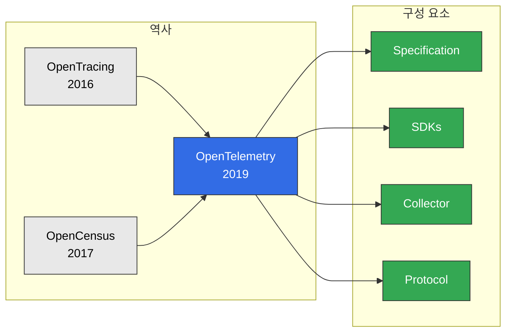
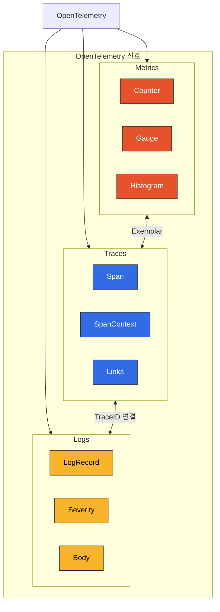
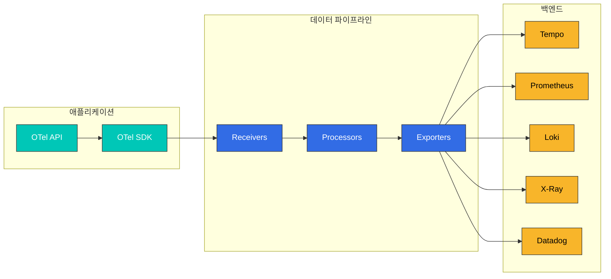
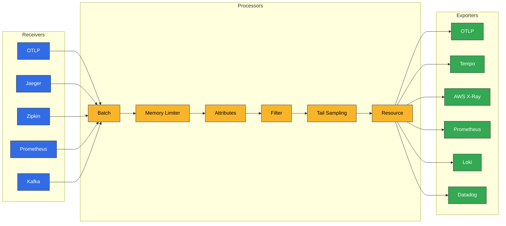

# OpenTelemetry

> **지원 버전**: OTEL 1.x
> **마지막 업데이트**: 2025년 2월

## 소개

OpenTelemetry(OTel)는 클라우드 네이티브 소프트웨어를 위한 관측성 프레임워크입니다. Traces, Metrics, Logs의 세 가지 신호를 생성, 수집, 관리하기 위한 벤더 중립적 표준을 제공합니다. CNCF의 두 번째로 활발한 프로젝트로, 업계 표준으로 자리잡고 있습니다.

## OpenTelemetry란?

OpenTelemetry는 OpenTracing과 OpenCensus 프로젝트가 합쳐져 탄생했습니다:



## 핵심 개념

### 세 가지 신호 (Three Signals)

| 신호 | 설명 | 사용 사례 |
|-----|------|---------|
| **Traces** | 분산 요청 추적 | 지연 시간 분석, 의존성 매핑 |
| **Metrics** | 수치 측정값 | 리소스 사용량, SLI/SLO |
| **Logs** | 이벤트 기록 | 디버깅, 감사 |



### 핵심 컴포넌트



## OpenTelemetry SDK

### Auto-instrumentation (자동 계측)

코드 변경 없이 자동으로 계측을 추가합니다.

#### Java Auto-instrumentation

```bash
# Java Agent 다운로드
curl -L -o opentelemetry-javaagent.jar \
  https://github.com/open-telemetry/opentelemetry-java-instrumentation/releases/latest/download/opentelemetry-javaagent.jar
```

```yaml
# Kubernetes Deployment
apiVersion: apps/v1
kind: Deployment
metadata:
  name: order-service
spec:
  template:
    spec:
      containers:
        - name: app
          image: order-service:latest
          env:
            - name: JAVA_TOOL_OPTIONS
              value: "-javaagent:/opt/opentelemetry-javaagent.jar"
            - name: OTEL_SERVICE_NAME
              value: "order-service"
            - name: OTEL_EXPORTER_OTLP_ENDPOINT
              value: "http://otel-collector:4317"
            - name: OTEL_EXPORTER_OTLP_PROTOCOL
              value: "grpc"
            - name: OTEL_TRACES_SAMPLER
              value: "parentbased_traceidratio"
            - name: OTEL_TRACES_SAMPLER_ARG
              value: "0.1"
            - name: OTEL_RESOURCE_ATTRIBUTES
              value: "service.namespace=ecommerce,deployment.environment=production"
            - name: OTEL_LOGS_EXPORTER
              value: "otlp"
            - name: OTEL_METRICS_EXPORTER
              value: "otlp"
          volumeMounts:
            - name: otel-agent
              mountPath: /opt/opentelemetry-javaagent.jar
              subPath: opentelemetry-javaagent.jar
      volumes:
        - name: otel-agent
          configMap:
            name: otel-java-agent
```

#### Python Auto-instrumentation

```bash
# 설치
pip install opentelemetry-distro opentelemetry-exporter-otlp
opentelemetry-bootstrap -a install
```

```yaml
# Kubernetes Deployment
apiVersion: apps/v1
kind: Deployment
metadata:
  name: payment-service
spec:
  template:
    spec:
      containers:
        - name: app
          image: payment-service:latest
          command:
            - opentelemetry-instrument
            - python
            - app.py
          env:
            - name: OTEL_SERVICE_NAME
              value: "payment-service"
            - name: OTEL_EXPORTER_OTLP_ENDPOINT
              value: "http://otel-collector:4317"
            - name: OTEL_PYTHON_LOGGING_AUTO_INSTRUMENTATION_ENABLED
              value: "true"
            - name: OTEL_TRACES_SAMPLER
              value: "parentbased_traceidratio"
            - name: OTEL_TRACES_SAMPLER_ARG
              value: "0.1"
```

#### Node.js Auto-instrumentation

```bash
# 설치
npm install @opentelemetry/auto-instrumentations-node \
            @opentelemetry/sdk-node \
            @opentelemetry/exporter-trace-otlp-grpc
```

```javascript
// tracing.js
const { NodeSDK } = require('@opentelemetry/sdk-node');
const { getNodeAutoInstrumentations } = require('@opentelemetry/auto-instrumentations-node');
const { OTLPTraceExporter } = require('@opentelemetry/exporter-trace-otlp-grpc');
const { OTLPMetricExporter } = require('@opentelemetry/exporter-metrics-otlp-grpc');
const { PeriodicExportingMetricReader } = require('@opentelemetry/sdk-metrics');

const sdk = new NodeSDK({
  serviceName: 'notification-service',
  traceExporter: new OTLPTraceExporter({
    url: 'http://otel-collector:4317',
  }),
  metricReader: new PeriodicExportingMetricReader({
    exporter: new OTLPMetricExporter({
      url: 'http://otel-collector:4317',
    }),
    exportIntervalMillis: 60000,
  }),
  instrumentations: [
    getNodeAutoInstrumentations({
      '@opentelemetry/instrumentation-fs': { enabled: false },
      '@opentelemetry/instrumentation-http': {
        ignoreIncomingRequestHook: (req) => req.url === '/health',
      },
    }),
  ],
});

sdk.start();

process.on('SIGTERM', () => {
  sdk.shutdown().then(() => process.exit(0));
});
```

```yaml
# Kubernetes Deployment
apiVersion: apps/v1
kind: Deployment
metadata:
  name: notification-service
spec:
  template:
    spec:
      containers:
        - name: app
          image: notification-service:latest
          command: ["node", "--require", "./tracing.js", "app.js"]
          env:
            - name: OTEL_SERVICE_NAME
              value: "notification-service"
            - name: OTEL_EXPORTER_OTLP_ENDPOINT
              value: "http://otel-collector:4317"
```

### Manual Instrumentation (수동 계측)

세밀한 제어가 필요한 경우 수동으로 계측합니다.

#### Java Manual Instrumentation

```java
import io.opentelemetry.api.OpenTelemetry;
import io.opentelemetry.api.trace.Span;
import io.opentelemetry.api.trace.SpanKind;
import io.opentelemetry.api.trace.StatusCode;
import io.opentelemetry.api.trace.Tracer;
import io.opentelemetry.api.common.Attributes;
import io.opentelemetry.api.common.AttributeKey;
import io.opentelemetry.context.Context;
import io.opentelemetry.context.Scope;

@Service
public class OrderService {

    private final Tracer tracer;

    public OrderService(OpenTelemetry openTelemetry) {
        this.tracer = openTelemetry.getTracer("order-service", "1.0.0");
    }

    public Order processOrder(OrderRequest request) {
        // 부모 스팬 생성
        Span parentSpan = tracer.spanBuilder("processOrder")
            .setSpanKind(SpanKind.SERVER)
            .setAttribute("order.id", request.getOrderId())
            .setAttribute("customer.id", request.getCustomerId())
            .startSpan();

        try (Scope scope = parentSpan.makeCurrent()) {
            // 비즈니스 로직
            parentSpan.addEvent("Order validation started");

            // 자식 스팬 - 재고 확인
            Order order = checkInventory(request);

            // 자식 스팬 - 결제 처리
            processPayment(order);

            parentSpan.addEvent("Order processing completed");
            parentSpan.setStatus(StatusCode.OK);

            return order;

        } catch (Exception e) {
            parentSpan.setStatus(StatusCode.ERROR, e.getMessage());
            parentSpan.recordException(e);
            throw e;

        } finally {
            parentSpan.end();
        }
    }

    private Order checkInventory(OrderRequest request) {
        Span span = tracer.spanBuilder("checkInventory")
            .setSpanKind(SpanKind.INTERNAL)
            .startSpan();

        try (Scope scope = span.makeCurrent()) {
            span.setAttribute("product.count", request.getItems().size());

            // 재고 확인 로직
            Order order = inventoryService.check(request);

            span.setAttribute("inventory.available", true);
            return order;

        } catch (InsufficientStockException e) {
            span.setAttribute("inventory.available", false);
            span.setStatus(StatusCode.ERROR, "Insufficient stock");
            throw e;

        } finally {
            span.end();
        }
    }

    private void processPayment(Order order) {
        Span span = tracer.spanBuilder("processPayment")
            .setSpanKind(SpanKind.CLIENT)  // 외부 서비스 호출
            .setAttribute("payment.method", order.getPaymentMethod())
            .setAttribute("payment.amount", order.getTotalAmount())
            .startSpan();

        try (Scope scope = span.makeCurrent()) {
            // 결제 처리
            PaymentResult result = paymentGateway.charge(order);

            span.setAttribute("payment.transaction_id", result.getTransactionId());
            span.setStatus(StatusCode.OK);

        } catch (PaymentException e) {
            span.setStatus(StatusCode.ERROR, e.getMessage());
            span.recordException(e);
            throw e;

        } finally {
            span.end();
        }
    }
}
```

#### Python Manual Instrumentation

```python
from opentelemetry import trace
from opentelemetry.trace import SpanKind, Status, StatusCode
from opentelemetry.sdk.trace import TracerProvider
from opentelemetry.sdk.resources import Resource, SERVICE_NAME
from opentelemetry.exporter.otlp.proto.grpc.trace_exporter import OTLPSpanExporter
from opentelemetry.sdk.trace.export import BatchSpanProcessor
from functools import wraps

# TracerProvider 설정
resource = Resource.create({SERVICE_NAME: "user-service"})
provider = TracerProvider(resource=resource)
processor = BatchSpanProcessor(OTLPSpanExporter(endpoint="http://otel-collector:4317"))
provider.add_span_processor(processor)
trace.set_tracer_provider(provider)

tracer = trace.get_tracer("user-service", "1.0.0")

# 데코레이터를 사용한 계측
def traced(span_name=None, kind=SpanKind.INTERNAL):
    def decorator(func):
        @wraps(func)
        def wrapper(*args, **kwargs):
            name = span_name or func.__name__
            with tracer.start_as_current_span(name, kind=kind) as span:
                try:
                    result = func(*args, **kwargs)
                    span.set_status(Status(StatusCode.OK))
                    return result
                except Exception as e:
                    span.set_status(Status(StatusCode.ERROR, str(e)))
                    span.record_exception(e)
                    raise
        return wrapper
    return decorator

class UserService:
    @traced("get_user", kind=SpanKind.SERVER)
    def get_user(self, user_id: str) -> dict:
        span = trace.get_current_span()
        span.set_attribute("user.id", user_id)

        # 데이터베이스 조회
        user = self._fetch_from_db(user_id)

        span.set_attribute("user.found", user is not None)
        span.add_event("User fetched from database")

        return user

    @traced("fetch_from_db", kind=SpanKind.CLIENT)
    def _fetch_from_db(self, user_id: str) -> dict:
        span = trace.get_current_span()
        span.set_attribute("db.system", "postgresql")
        span.set_attribute("db.operation", "SELECT")
        span.set_attribute("db.statement", f"SELECT * FROM users WHERE id = '{user_id}'")

        # 실제 DB 쿼리
        with self.db.cursor() as cursor:
            cursor.execute("SELECT * FROM users WHERE id = %s", (user_id,))
            result = cursor.fetchone()

        return result

    @traced("create_user", kind=SpanKind.SERVER)
    def create_user(self, user_data: dict) -> dict:
        span = trace.get_current_span()
        span.set_attribute("user.email", user_data.get("email"))

        # 검증
        with tracer.start_as_current_span("validate_user_data") as validation_span:
            self._validate(user_data)
            validation_span.add_event("Validation passed")

        # 저장
        with tracer.start_as_current_span("save_to_db", kind=SpanKind.CLIENT) as db_span:
            db_span.set_attribute("db.system", "postgresql")
            user = self._save_to_db(user_data)
            db_span.set_attribute("user.id", user["id"])

        # 이벤트 발행
        with tracer.start_as_current_span("publish_event", kind=SpanKind.PRODUCER) as event_span:
            event_span.set_attribute("messaging.system", "kafka")
            event_span.set_attribute("messaging.destination", "user-events")
            self._publish_event("user.created", user)

        return user
```

## OTEL Collector

### 아키텍처



### Collector 설정

```yaml
# otel-collector-config.yaml
receivers:
  # OTLP 수신기
  otlp:
    protocols:
      grpc:
        endpoint: 0.0.0.0:4317
        max_recv_msg_size_mib: 16
      http:
        endpoint: 0.0.0.0:4318
        cors:
          allowed_origins:
            - "http://*"
            - "https://*"

  # Jaeger 호환성
  jaeger:
    protocols:
      thrift_http:
        endpoint: 0.0.0.0:14268
      grpc:
        endpoint: 0.0.0.0:14250

  # Zipkin 호환성
  zipkin:
    endpoint: 0.0.0.0:9411

  # Prometheus 메트릭 스크래핑
  prometheus:
    config:
      scrape_configs:
        - job_name: 'otel-collector'
          scrape_interval: 15s
          static_configs:
            - targets: ['localhost:8888']

  # Kubernetes 메트릭
  k8s_cluster:
    collection_interval: 30s
    node_conditions_to_report:
      - Ready
      - MemoryPressure
      - DiskPressure
    allocatable_types_to_report:
      - cpu
      - memory

processors:
  # 메모리 제한
  memory_limiter:
    check_interval: 1s
    limit_mib: 1500
    spike_limit_mib: 500

  # 배치 처리
  batch:
    timeout: 5s
    send_batch_size: 1000
    send_batch_max_size: 1500

  # 속성 추가/수정
  attributes:
    actions:
      - key: environment
        value: production
        action: upsert
      - key: cluster
        value: eks-prod-cluster
        action: upsert

  # 리소스 탐지
  resourcedetection:
    detectors: [env, system, ec2, eks]
    timeout: 5s
    override: false
    ec2:
      tags:
        - ^kubernetes.io/cluster/.*$
        - ^Name$

  # 리소스 속성 추가
  resource:
    attributes:
      - key: cloud.provider
        value: aws
        action: upsert
      - key: cloud.region
        value: ap-northeast-2
        action: upsert

  # 필터링 (헬스체크 제외)
  filter:
    error_mode: ignore
    traces:
      span:
        - 'attributes["http.target"] == "/health"'
        - 'attributes["http.target"] == "/ready"'
        - 'attributes["http.target"] == "/metrics"'

  # Tail Sampling (추적용)
  tail_sampling:
    decision_wait: 10s
    num_traces: 100000
    expected_new_traces_per_sec: 1000
    policies:
      # 오류 요청 100% 수집
      - name: error-policy
        type: status_code
        status_code:
          status_codes: [ERROR]
      # 느린 요청 수집
      - name: latency-policy
        type: latency
        latency:
          threshold_ms: 1000
      # 특정 서비스 우선 수집
      - name: service-priority
        type: string_attribute
        string_attribute:
          key: service.name
          values: [payment-service, order-service]
          enabled_regex_matching: false
      # 나머지 확률적 샘플링
      - name: probabilistic-policy
        type: probabilistic
        probabilistic:
          sampling_percentage: 10

  # 스팬 메트릭 생성
  spanmetrics:
    metrics_exporter: prometheus
    latency_histogram_buckets: [5ms, 10ms, 25ms, 50ms, 100ms, 250ms, 500ms, 1s, 2s, 5s]
    dimensions:
      - name: http.method
      - name: http.status_code
      - name: service.name
    dimensions_cache_size: 1000

exporters:
  # OTLP (Tempo)
  otlp/tempo:
    endpoint: tempo-distributor.tempo.svc.cluster.local:4317
    tls:
      insecure: true
    retry_on_failure:
      enabled: true
      initial_interval: 5s
      max_interval: 30s
      max_elapsed_time: 300s

  # AWS X-Ray
  awsxray:
    region: ap-northeast-2
    index_all_attributes: true

  # Prometheus Remote Write
  prometheusremotewrite:
    endpoint: http://prometheus:9090/api/v1/write
    tls:
      insecure: true
    external_labels:
      cluster: eks-prod-cluster
    resource_to_telemetry_conversion:
      enabled: true

  # Loki (로그)
  loki:
    endpoint: http://loki-gateway.loki.svc.cluster.local:3100/loki/api/v1/push
    tls:
      insecure: true
    labels:
      attributes:
        service.name: "service"
        service.namespace: "namespace"
        k8s.pod.name: "pod"

  # 디버깅
  debug:
    verbosity: detailed
    sampling_initial: 5
    sampling_thereafter: 200

extensions:
  health_check:
    endpoint: 0.0.0.0:13133
    path: /health

  pprof:
    endpoint: 0.0.0.0:1777

  zpages:
    endpoint: 0.0.0.0:55679

service:
  extensions: [health_check, pprof, zpages]

  pipelines:
    traces:
      receivers: [otlp, jaeger, zipkin]
      processors: [memory_limiter, resourcedetection, resource, attributes, filter, tail_sampling, batch]
      exporters: [otlp/tempo, awsxray]

    metrics:
      receivers: [otlp, prometheus]
      processors: [memory_limiter, resourcedetection, resource, batch]
      exporters: [prometheusremotewrite]

    logs:
      receivers: [otlp]
      processors: [memory_limiter, resourcedetection, resource, batch]
      exporters: [loki]

  telemetry:
    logs:
      level: info
      encoding: json
    metrics:
      address: 0.0.0.0:8888
      level: detailed
```

## EKS 배포 패턴

### DaemonSet 패턴

각 노드에 Collector를 배포하여 해당 노드의 모든 Pod에서 데이터를 수집:

```yaml
# otel-collector-daemonset.yaml
apiVersion: v1
kind: ServiceAccount
metadata:
  name: otel-collector
  namespace: otel
  annotations:
    eks.amazonaws.com/role-arn: arn:aws:iam::123456789012:role/otel-collector-role
---
apiVersion: apps/v1
kind: DaemonSet
metadata:
  name: otel-collector
  namespace: otel
spec:
  selector:
    matchLabels:
      app: otel-collector
  template:
    metadata:
      labels:
        app: otel-collector
    spec:
      serviceAccountName: otel-collector
      containers:
        - name: collector
          image: otel/opentelemetry-collector-contrib:0.92.0
          args:
            - --config=/conf/otel-collector-config.yaml
          ports:
            - containerPort: 4317
              hostPort: 4317
              protocol: TCP
            - containerPort: 4318
              hostPort: 4318
              protocol: TCP
            - containerPort: 8888
              protocol: TCP
          env:
            - name: K8S_NODE_NAME
              valueFrom:
                fieldRef:
                  fieldPath: spec.nodeName
            - name: K8S_POD_NAME
              valueFrom:
                fieldRef:
                  fieldPath: metadata.name
          resources:
            requests:
              cpu: 200m
              memory: 400Mi
            limits:
              cpu: 1000m
              memory: 1Gi
          volumeMounts:
            - name: config
              mountPath: /conf
          livenessProbe:
            httpGet:
              path: /health
              port: 13133
            initialDelaySeconds: 15
            periodSeconds: 10
          readinessProbe:
            httpGet:
              path: /health
              port: 13133
            initialDelaySeconds: 5
            periodSeconds: 5
      volumes:
        - name: config
          configMap:
            name: otel-collector-config
      tolerations:
        - effect: NoSchedule
          operator: Exists
---
apiVersion: v1
kind: Service
metadata:
  name: otel-collector
  namespace: otel
spec:
  selector:
    app: otel-collector
  ports:
    - name: otlp-grpc
      port: 4317
      protocol: TCP
    - name: otlp-http
      port: 4318
      protocol: TCP
  type: ClusterIP
```

### Sidecar 패턴

각 애플리케이션 Pod에 Collector를 사이드카로 배포:

```yaml
# application-with-sidecar.yaml
apiVersion: apps/v1
kind: Deployment
metadata:
  name: order-service
spec:
  template:
    spec:
      containers:
        # 애플리케이션 컨테이너
        - name: app
          image: order-service:latest
          ports:
            - containerPort: 8080
          env:
            - name: OTEL_EXPORTER_OTLP_ENDPOINT
              value: "http://localhost:4317"
            - name: OTEL_SERVICE_NAME
              value: "order-service"

        # OTEL Collector 사이드카
        - name: otel-collector
          image: otel/opentelemetry-collector-contrib:0.92.0
          args:
            - --config=/conf/otel-collector-config.yaml
          ports:
            - containerPort: 4317
          resources:
            requests:
              cpu: 50m
              memory: 100Mi
            limits:
              cpu: 200m
              memory: 200Mi
          volumeMounts:
            - name: otel-config
              mountPath: /conf
      volumes:
        - name: otel-config
          configMap:
            name: otel-sidecar-config
```

### Gateway 패턴

중앙 집중식 Collector 클러스터:

```yaml
# otel-collector-gateway.yaml
apiVersion: apps/v1
kind: Deployment
metadata:
  name: otel-collector-gateway
  namespace: otel
spec:
  replicas: 3
  selector:
    matchLabels:
      app: otel-collector-gateway
  template:
    metadata:
      labels:
        app: otel-collector-gateway
    spec:
      serviceAccountName: otel-collector
      affinity:
        podAntiAffinity:
          preferredDuringSchedulingIgnoredDuringExecution:
            - weight: 100
              podAffinityTerm:
                labelSelector:
                  matchLabels:
                    app: otel-collector-gateway
                topologyKey: kubernetes.io/hostname
      containers:
        - name: collector
          image: otel/opentelemetry-collector-contrib:0.92.0
          args:
            - --config=/conf/otel-collector-config.yaml
          ports:
            - containerPort: 4317
            - containerPort: 4318
            - containerPort: 8888
          resources:
            requests:
              cpu: 500m
              memory: 1Gi
            limits:
              cpu: 2000m
              memory: 4Gi
          volumeMounts:
            - name: config
              mountPath: /conf
      volumes:
        - name: config
          configMap:
            name: otel-gateway-config
---
apiVersion: autoscaling/v2
kind: HorizontalPodAutoscaler
metadata:
  name: otel-collector-gateway
  namespace: otel
spec:
  scaleTargetRef:
    apiVersion: apps/v1
    kind: Deployment
    name: otel-collector-gateway
  minReplicas: 3
  maxReplicas: 10
  metrics:
    - type: Resource
      resource:
        name: cpu
        target:
          type: Utilization
          averageUtilization: 70
    - type: Resource
      resource:
        name: memory
        target:
          type: Utilization
          averageUtilization: 80
```

## Kubernetes Operator

OpenTelemetry Operator를 사용한 자동 계측:

### Operator 설치

```bash
# cert-manager 설치 (필수)
kubectl apply -f https://github.com/cert-manager/cert-manager/releases/download/v1.13.3/cert-manager.yaml

# OpenTelemetry Operator 설치
kubectl apply -f https://github.com/open-telemetry/opentelemetry-operator/releases/latest/download/opentelemetry-operator.yaml
```

### Instrumentation CR

```yaml
# instrumentation.yaml
apiVersion: opentelemetry.io/v1alpha1
kind: Instrumentation
metadata:
  name: otel-instrumentation
  namespace: default
spec:
  exporter:
    endpoint: http://otel-collector.otel.svc.cluster.local:4317

  propagators:
    - tracecontext
    - baggage
    - b3

  sampler:
    type: parentbased_traceidratio
    argument: "0.1"

  # Java 설정
  java:
    image: ghcr.io/open-telemetry/opentelemetry-operator/autoinstrumentation-java:latest
    env:
      - name: OTEL_JAVAAGENT_DEBUG
        value: "false"
      - name: OTEL_INSTRUMENTATION_JDBC_ENABLED
        value: "true"

  # Python 설정
  python:
    image: ghcr.io/open-telemetry/opentelemetry-operator/autoinstrumentation-python:latest
    env:
      - name: OTEL_PYTHON_LOGGING_AUTO_INSTRUMENTATION_ENABLED
        value: "true"

  # Node.js 설정
  nodejs:
    image: ghcr.io/open-telemetry/opentelemetry-operator/autoinstrumentation-nodejs:latest

  # .NET 설정
  dotnet:
    image: ghcr.io/open-telemetry/opentelemetry-operator/autoinstrumentation-dotnet:latest

  # Go 설정 (eBPF 기반)
  go:
    image: ghcr.io/open-telemetry/opentelemetry-operator/autoinstrumentation-go:latest

  # 환경 변수
  env:
    - name: OTEL_RESOURCE_ATTRIBUTES
      value: "service.namespace=ecommerce"
```

### 자동 계측 주입

```yaml
# 네임스페이스에 자동 계측 활성화
apiVersion: v1
kind: Namespace
metadata:
  name: ecommerce
  annotations:
    instrumentation.opentelemetry.io/inject-java: "true"
    instrumentation.opentelemetry.io/inject-python: "true"
    instrumentation.opentelemetry.io/inject-nodejs: "true"
---
# 또는 개별 Deployment에 적용
apiVersion: apps/v1
kind: Deployment
metadata:
  name: order-service
  namespace: ecommerce
  annotations:
    instrumentation.opentelemetry.io/inject-java: "otel-instrumentation"
spec:
  template:
    metadata:
      annotations:
        # Pod 레벨 주석
        instrumentation.opentelemetry.io/inject-java: "true"
    spec:
      containers:
        - name: app
          image: order-service:latest
```

## 다중 백엔드 구성

하나의 Collector에서 여러 백엔드로 데이터 전송:

```yaml
exporters:
  # Grafana Tempo
  otlp/tempo:
    endpoint: tempo-distributor:4317
    tls:
      insecure: true

  # AWS X-Ray
  awsxray:
    region: ap-northeast-2

  # Datadog
  datadog:
    api:
      key: ${DD_API_KEY}
      site: datadoghq.com
    traces:
      span_name_as_resource_name: true

  # Jaeger
  jaeger:
    endpoint: jaeger-collector:14250
    tls:
      insecure: true

service:
  pipelines:
    traces:
      receivers: [otlp]
      processors: [batch]
      exporters: [otlp/tempo, awsxray, datadog, jaeger]
```

## Best Practices

### 1. 리소스 속성 표준화

```yaml
# Semantic Conventions 준수
resource:
  attributes:
    # 서비스 정보
    service.name: order-service
    service.version: 1.2.3
    service.namespace: ecommerce

    # 배포 환경
    deployment.environment: production

    # 클라우드 정보
    cloud.provider: aws
    cloud.region: ap-northeast-2
    cloud.availability_zone: ap-northeast-2a

    # Kubernetes 정보
    k8s.cluster.name: eks-prod
    k8s.namespace.name: ecommerce
    k8s.pod.name: order-service-abc123
    k8s.deployment.name: order-service
```

### 2. 샘플링 전략

```yaml
# 계층적 샘플링
processors:
  tail_sampling:
    policies:
      # 1순위: 오류 100%
      - name: errors
        type: status_code
        status_code:
          status_codes: [ERROR]

      # 2순위: 느린 요청 100%
      - name: slow
        type: latency
        latency:
          threshold_ms: 2000

      # 3순위: 중요 서비스 50%
      - name: critical-services
        type: and
        and:
          and_sub_policy:
            - name: service-name
              type: string_attribute
              string_attribute:
                key: service.name
                values: [payment-service, order-service]
            - name: probabilistic
              type: probabilistic
              probabilistic:
                sampling_percentage: 50

      # 4순위: 나머지 5%
      - name: default
        type: probabilistic
        probabilistic:
          sampling_percentage: 5
```

### 3. 보안 고려사항

```yaml
# TLS 활성화
receivers:
  otlp:
    protocols:
      grpc:
        endpoint: 0.0.0.0:4317
        tls:
          cert_file: /certs/server.crt
          key_file: /certs/server.key

exporters:
  otlp:
    endpoint: tempo:4317
    tls:
      ca_file: /certs/ca.crt
      cert_file: /certs/client.crt
      key_file: /certs/client.key

# 민감 정보 필터링
processors:
  attributes:
    actions:
      - key: http.request.header.authorization
        action: delete
      - key: db.statement
        action: hash  # 해싱
```

## 퀴즈

이 장에서 배운 내용을 테스트하려면 [OpenTelemetry 퀴즈](../../quizzes/observability/tracing/03-opentelemetry-quiz.md)를 풀어보세요.
