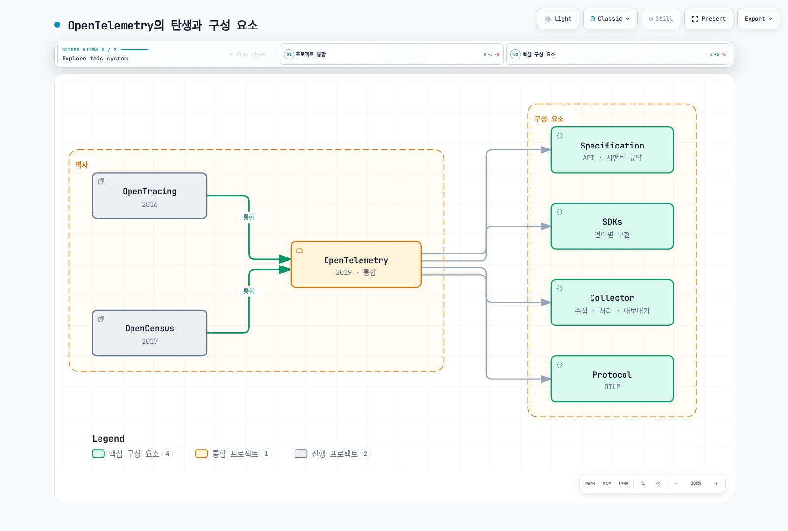
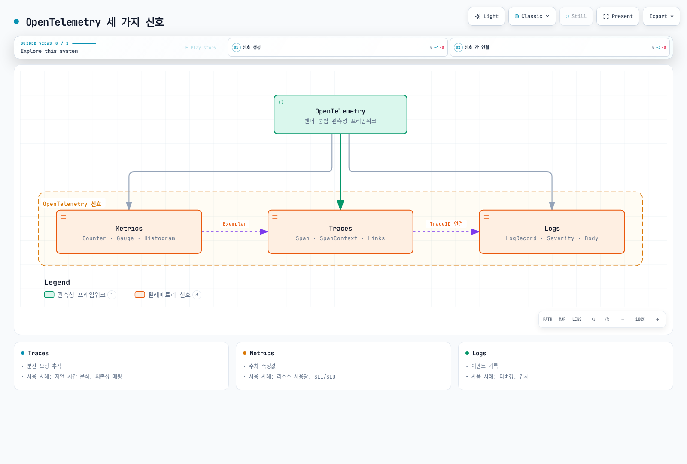
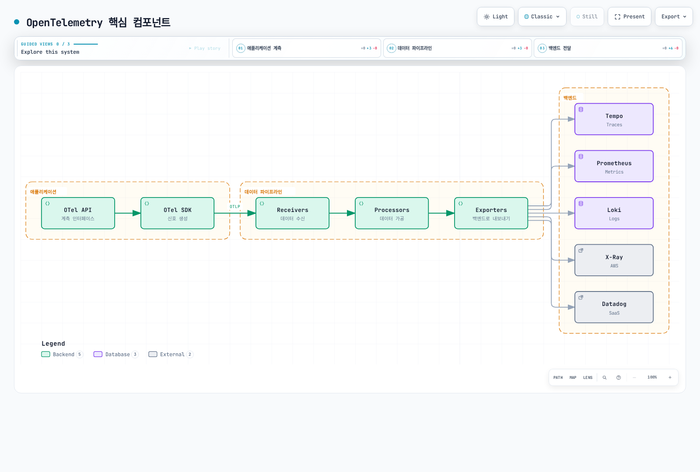
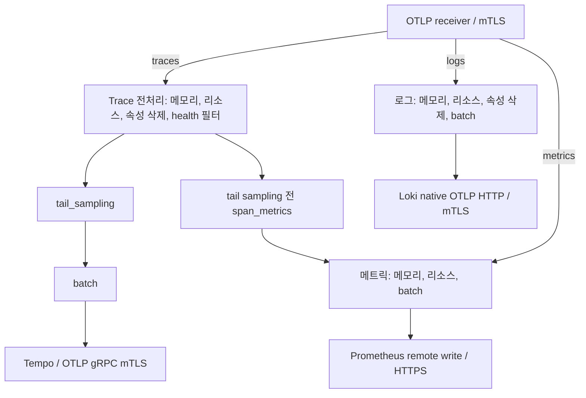

# OpenTelemetry

> **검토 기준**: Collector Contrib 0.160.0, Operator 0.158.0, 언어별 버전은 아래 참조
> **마지막 업데이트**: 2026년 9월 13일

## 소개

OpenTelemetry(OTel)는 클라우드 네이티브 소프트웨어를 위한 관측성 프레임워크입니다. Traces, Metrics, Logs의 세 가지 신호를 생성, 수집, 관리하기 위한 벤더 중립적 표준을 제공합니다. CNCF의 2026년 7월 24일 회고 글은 당시 기여 활동 속도를 Kubernetes 다음으로 소개합니다. 프로젝트 성숙도와 각 SDK·컴포넌트의 안정성은 구분해야 합니다.

### 2026년 7월 업데이트: CNCF 졸업(Graduation)

OpenTelemetry는 **2026년 5월** CNCF의 최고 성숙 단계인 졸업(graduated)에 도달했습니다. 아래 7월 24일 글은 이를 돌아본 회고입니다. Kubernetes, Prometheus 등과 같은 반열에 오른 것으로, 거버넌스·보안 관행·프로덕션 채택이 검증되었음을 의미합니다. 회고는 GenAI semantic convention, browser/mobile 관측성, schema 관리와 배포 도구 등 후속 과제를 소개합니다. 배경과 로드맵은 CNCF 블로그 글 ["OpenTelemetry has graduated… Now what?"](https://www.cncf.io/blog/2026/07/24/opentelemetry-has-graduated-now-what/)을 참고하세요.

## OpenTelemetry란?

OpenTelemetry는 OpenTracing과 OpenCensus 프로젝트가 합쳐져 탄생했습니다:



[🔍 인터랙티브 다이어그램 보기](https://www.atomai.click/kubernetes-docs/archmaps/ko-observability-tracing-03-opentelemetry-0.html)

## 핵심 개념

### 세 가지 신호 (Three Signals)

이 장은 traces·metrics·logs를 중점적으로 다룹니다. Profiling도 발전 중인 신호이며 구현별 지원·안정성이 다릅니다. Trace/log ID 연결과 metric exemplar에는 해당 계측·backend 설정이 필요합니다.

| 신호 | 설명 | 사용 사례 |
|-----|------|---------|
| **Traces** | 분산 요청 추적 | 지연 시간 분석, 의존성 매핑 |
| **Metrics** | 수치 측정값 | 리소스 사용량, SLI/SLO |
| **Logs** | 이벤트 기록 | 디버깅, 감사 |



[🔍 인터랙티브 다이어그램 보기](https://www.atomai.click/kubernetes-docs/archmaps/ko-observability-tracing-03-opentelemetry-1.html)

### 핵심 컴포넌트



[🔍 인터랙티브 다이어그램 보기](https://www.atomai.click/kubernetes-docs/archmaps/ko-observability-tracing-03-opentelemetry-2.html)

그림은 신호별 backend 선택지를 나타냅니다. 구성한 exporter만 동작하며 아래 base 예제가 모든 vendor 연동을 자동 활성화하지 않습니다.


## OpenTelemetry SDK

Collector·Operator·Java agent·언어별 SDK의 버전 번호는 서로 다릅니다. 예제는 Kubernetes 1.35 schema로 확인한 Linux 워크로드 템플릿이며 앱 이미지·namespace·인증서·목적지 서비스는 소유자가 준비해야 합니다. Operator의 더 넓은 범위가 native sidecar 등 예제별 요구사항을 없애지는 않습니다. 로컬 검증은 실제 EKS 앱 배포 성공의 증거가 아닙니다.

| 컴포넌트 | 기준과 범위 |
|---|---|
| 독립 Collector Contrib | 0.160.0; 실제 binary로 컴포넌트·설정 검증 |
| Operator | 0.158.0; 호환성 표는 Kubernetes 1.25–1.36, cert-manager v1 명시 |
| Java agent | 2.31.1, 대상 SDK 1.65.0; Operator의 기본 Java 이미지 버전과 다름 |
| Python | SDK/exporter 1.44.0, instrumentation/distro 0.65b0; Python ≥3.10 |
| Node.js CommonJS 예제 | SDK-node 0.220.0, auto-instrumentations-node 0.78.0, resources 2.9.0, API 1.9.1 |

Operator의 기본 Collector는 0.158.0입니다. 아래 독립 0.160.0 워크로드를 Operator 관리 Collector의 업그레이드 검증으로 해석하지 않습니다. 현재 EKS 지원 버전과의 교집합을 확인하며 최신 Kubernetes가 자동으로 Operator 범위에 포함되는 것은 아닙니다.

### Auto-instrumentation (자동 계측)

2026년 9월 13일 EKS 수명주기 문서는 1.34·1.35·1.36을 standard support로 명시합니다. 1.35 schema 기준은 그 목록과 Operator 범위에 포함되지만 실제 플랫폼·애드온 인수 검증을 대신하지는 않습니다.

자동 계측은 지원되는 라이브러리를 연결하며 임의의 비즈니스 동작을 모두 알아내지는 않습니다. 한 프로세스에는 직접 준비한 agent/launcher 또는 Operator 주입 중 한 경로를 선택합니다. 이미 구성한 provider 위에 두 번째 SDK를 초기화하지 않습니다. 다음 이미지 이름은 시작 명령·의존성까지 포함해 직접 빌드할 앱의 예시입니다.

`ecommerce` namespace와 그 안의 `otel-client-tls` Secret에 `ca.crt`·`tls.crt`·`tls.key`를 준비합니다. Collector가 client 인증서를 신뢰하고 서버 인증서가 `otel-collector.otel.svc.cluster.local`과 일치해야 합니다. Secret은 읽기 전용이며 이미지의 UID/GID에 맞게 접근을 조정합니다. 환경 변수에는 키 본문·bearer token이 아닌 인증서 **경로**만 넣습니다. 템플릿은 TLS 4318의 OTLP HTTP/protobuf를 사용합니다.

#### Java Auto-instrumentation

고정한 agent를 앱 빌드 경로에 내려받고 release asset checksum을 확인합니다. 2.31.1 JAR은 25,107,554바이트로 ConfigMap의 1 MiB 한도를 넘습니다. 이미지에 포함하거나 Operator 주입을 사용하며 ConfigMap으로 배포하지 않습니다.


```bash
curl --fail --location --output opentelemetry-javaagent.jar \
  https://github.com/open-telemetry/opentelemetry-java-instrumentation/releases/download/v2.31.1/opentelemetry-javaagent.jar
printf '%s  %s\n' \
  bbf83c151b6400709e2f225bdd07a04f839d9d13b8b93464241333fd25d3e3ba \
  opentelemetry-javaagent.jar | sha256sum --check -
```

```dockerfile
# Add to the application's existing Dockerfile; not a complete image build.
COPY opentelemetry-javaagent.jar /opt/otel/opentelemetry-javaagent.jar
```
기존 `JAVA_TOOL_OPTIONS`가 있다면 앱 JVM 옵션을 보존하여 agent 옵션과 합칩니다. Deployment selector와 Pod label은 일치해야 합니다.


```yaml
apiVersion: apps/v1
kind: Deployment
metadata:
  name: order-service
  namespace: ecommerce
spec:
  replicas: 1
  selector:
    matchLabels:
      app: order-service
  template:
    metadata:
      labels:
        app: order-service
    spec:
      automountServiceAccountToken: false
      securityContext:
        fsGroup: 10001
      containers:
      - name: app
        image: registry.example.com/order-service:otel-demo
        env:
        - name: OTEL_SERVICE_NAME
          value: order-service
        - name: OTEL_RESOURCE_ATTRIBUTES
          value: service.namespace=ecommerce,deployment.environment.name=demo
        - name: OTEL_EXPORTER_OTLP_ENDPOINT
          value: https://otel-collector.otel.svc.cluster.local:4318
        - name: OTEL_EXPORTER_OTLP_PROTOCOL
          value: http/protobuf
        - name: OTEL_EXPORTER_OTLP_CERTIFICATE
          value: /var/run/otel-client/ca.crt
        - name: OTEL_EXPORTER_OTLP_CLIENT_CERTIFICATE
          value: /var/run/otel-client/tls.crt
        - name: OTEL_EXPORTER_OTLP_CLIENT_KEY
          value: /var/run/otel-client/tls.key
        - name: OTEL_TRACES_EXPORTER
          value: otlp
        - name: OTEL_METRICS_EXPORTER
          value: otlp
        - name: OTEL_LOGS_EXPORTER
          value: none
        - name: OTEL_TRACES_SAMPLER
          value: parentbased_always_on
        - name: OTEL_METRIC_EXPORT_INTERVAL
          value: '60000'
        - name: JAVA_TOOL_OPTIONS
          value: -javaagent:/opt/otel/opentelemetry-javaagent.jar
        volumeMounts:
        - name: otel-client-tls
          mountPath: /var/run/otel-client
          readOnly: true
      volumes:
      - name: otel-client-tls
        secret:
          secretName: otel-client-tls
          defaultMode: 288
```
#### Python Auto-instrumentation

Flask 앱 빌드 환경에 호환 패키지를 설치하고 앱 의존성 전체를 잠금 파일로 관리합니다. 다른 framework에는 해당 instrumentation이 필요합니다. HTTP exporter를 명시하며 Python의 HTTP 기본값을 gRPC 4317로 보내지 않습니다.


```bash
python -m pip install \
  opentelemetry-api==1.44.0 opentelemetry-sdk==1.44.0 \
  opentelemetry-distro==0.65b0 \
  opentelemetry-instrumentation-flask==0.65b0 \
  opentelemetry-exporter-otlp-proto-http==1.44.0
```

```yaml
apiVersion: apps/v1
kind: Deployment
metadata:
  name: payment-service
  namespace: ecommerce
spec:
  replicas: 1
  selector:
    matchLabels:
      app: payment-service
  template:
    metadata:
      labels:
        app: payment-service
    spec:
      automountServiceAccountToken: false
      securityContext:
        fsGroup: 10001
      containers:
      - name: app
        image: registry.example.com/payment-service:otel-demo
        env:
        - name: OTEL_SERVICE_NAME
          value: payment-service
        - name: OTEL_RESOURCE_ATTRIBUTES
          value: service.namespace=ecommerce,deployment.environment.name=demo
        - name: OTEL_EXPORTER_OTLP_ENDPOINT
          value: https://otel-collector.otel.svc.cluster.local:4318
        - name: OTEL_EXPORTER_OTLP_PROTOCOL
          value: http/protobuf
        - name: OTEL_EXPORTER_OTLP_CERTIFICATE
          value: /var/run/otel-client/ca.crt
        - name: OTEL_EXPORTER_OTLP_CLIENT_CERTIFICATE
          value: /var/run/otel-client/tls.crt
        - name: OTEL_EXPORTER_OTLP_CLIENT_KEY
          value: /var/run/otel-client/tls.key
        - name: OTEL_TRACES_EXPORTER
          value: otlp
        - name: OTEL_METRICS_EXPORTER
          value: otlp
        - name: OTEL_LOGS_EXPORTER
          value: none
        - name: OTEL_TRACES_SAMPLER
          value: parentbased_always_on
        - name: OTEL_METRIC_EXPORT_INTERVAL
          value: '60000'
        volumeMounts:
        - name: otel-client-tls
          mountPath: /var/run/otel-client
          readOnly: true
        command:
        - opentelemetry-instrument
        - python
        - app.py
      volumes:
      - name: otel-client-tls
        secret:
          secretName: otel-client-tls
          defaultMode: 288
```
#### Node.js Auto-instrumentation


```bash
npm install --save-exact \
  @opentelemetry/api@1.9.1 @opentelemetry/resources@2.9.0 \
  @opentelemetry/sdk-node@0.220.0 \
  @opentelemetry/auto-instrumentations-node@0.78.0
# Commit package-lock.json and use npm ci for subsequent application builds.
```
`tracing.cjs`로 저장하고 앱/framework 모듈보다 먼저 로드합니다. CommonJS 예제이며 ESM에는 언어별 가이드의 별도 로딩 설정이 필요합니다. SDK는 아래 명시한 OTEL exporter/TLS 환경을 읽습니다. Metric reader를 직접 지정한다면 deprecated 단수형 대신 `metricReaders` 배열을 사용합니다. 앱 요청을 drain한 뒤 `shutdownTelemetry()`를 호출하도록 종료 절차에 연결합니다.


```javascript
// Load before application/framework modules in a CommonJS application.
const { NodeSDK } = require('@opentelemetry/sdk-node');
const { envDetector } = require('@opentelemetry/resources');
const { getNodeAutoInstrumentations } = require('@opentelemetry/auto-instrumentations-node');

const sdk = new NodeSDK({
  resourceDetectors: [envDetector],
  instrumentations: [
    getNodeAutoInstrumentations({
      '@opentelemetry/instrumentation-fs': { enabled: false },
      '@opentelemetry/instrumentation-http': {
        ignoreIncomingRequestHook: (request) =>
          String(request.url || '').split('?')[0] === '/health',
      },
    }),
  ],
});

// OTEL_* variables configure exporters, protocol, TLS and metric interval.
sdk.start();

// Call after the application's own request-draining step on shutdown.
module.exports = { shutdownTelemetry: () => sdk.shutdown() };
```

```yaml
apiVersion: apps/v1
kind: Deployment
metadata:
  name: notification-service
  namespace: ecommerce
spec:
  replicas: 1
  selector:
    matchLabels:
      app: notification-service
  template:
    metadata:
      labels:
        app: notification-service
    spec:
      automountServiceAccountToken: false
      securityContext:
        fsGroup: 10001
      containers:
      - name: app
        image: registry.example.com/notification-service:otel-demo
        env:
        - name: OTEL_SERVICE_NAME
          value: notification-service
        - name: OTEL_RESOURCE_ATTRIBUTES
          value: service.namespace=ecommerce,deployment.environment.name=demo
        - name: OTEL_EXPORTER_OTLP_ENDPOINT
          value: https://otel-collector.otel.svc.cluster.local:4318
        - name: OTEL_EXPORTER_OTLP_PROTOCOL
          value: http/protobuf
        - name: OTEL_EXPORTER_OTLP_CERTIFICATE
          value: /var/run/otel-client/ca.crt
        - name: OTEL_EXPORTER_OTLP_CLIENT_CERTIFICATE
          value: /var/run/otel-client/tls.crt
        - name: OTEL_EXPORTER_OTLP_CLIENT_KEY
          value: /var/run/otel-client/tls.key
        - name: OTEL_TRACES_EXPORTER
          value: otlp
        - name: OTEL_METRICS_EXPORTER
          value: otlp
        - name: OTEL_LOGS_EXPORTER
          value: none
        - name: OTEL_TRACES_SAMPLER
          value: parentbased_always_on
        - name: OTEL_METRIC_EXPORT_INTERVAL
          value: '60000'
        volumeMounts:
        - name: otel-client-tls
          mountPath: /var/run/otel-client
          readOnly: true
        command:
        - node
        - --require
        - ./tracing.cjs
        - app.cjs
      volumes:
      - name: otel-client-tls
        secret:
          secretName: otel-client-tls
          defaultMode: 288
```
여기서는 `OTEL_LOGS_EXPORTER=none`을 명시합니다. Log exporter 활성화만으로 stdout을 tail하지 않으며 해당 logging bridge/handler 또는 로그 수집기와 payload 검토가 필요합니다. `parentbased_always_on`도 샘플링되지 않은 부모를 존중합니다. 대신 head sampling 10%를 선택하면 tail Collector가 이미 버린 span을 복구할 수 없습니다.

### Manual Instrumentation (수동 계측)

Agent나 앱이 초기화한 OpenTelemetry instance/provider를 재사용합니다. SDK provider가 없으면 API 호출은 no-op일 수 있습니다. 아래 비즈니스 작업은 INTERNAL span이며 계측된 HTTP/DB client가 CLIENT span과 컨텍스트 전파를 담당합니다. CLIENT span을 만들기만 해서는 요청을 보내거나 컨텍스트를 주입하지 않습니다.

#### Java Manual Instrumentation

재고·결제 callback은 앱이 제공합니다. 주문/고객 ID·금액·거래 ID·원문 예외 메시지를 기록하지 않습니다. 결제 서비스 구현이나 검증한 Spring 배포 예제가 아니라 앱 작업의 계측 예제입니다.


```java
import io.opentelemetry.api.OpenTelemetry;
import io.opentelemetry.api.trace.Span;
import io.opentelemetry.api.trace.SpanKind;
import io.opentelemetry.api.trace.StatusCode;
import io.opentelemetry.api.trace.Tracer;
import io.opentelemetry.context.Scope;

public final class OrderTelemetry {
    private final Tracer tracer;

    public OrderTelemetry(OpenTelemetry telemetry) {
        this.tracer = telemetry.getTracer("example.order-workflow", "1.0.0");
    }

    public void processOrder(Runnable validateInventory, Runnable processPayment) {
        Span parent = tracer.spanBuilder("processOrder")
                .setSpanKind(SpanKind.INTERNAL).startSpan();
        try (Scope ignored = parent.makeCurrent()) {
            parent.addEvent("validation.started");
            child("checkInventory", validateInventory);
            child("processPayment", processPayment);
            parent.addEvent("processing.completed");
        } catch (RuntimeException error) {
            parent.setStatus(StatusCode.ERROR);
            parent.setAttribute("error.type", error.getClass().getName());
            throw error;
        } finally {
            parent.end();
        }
    }

    private void child(String name, Runnable operation) {
        Span span = tracer.spanBuilder(name).setSpanKind(SpanKind.INTERNAL).startSpan();
        try (Scope ignored = span.makeCurrent()) {
            operation.run();
        } catch (RuntimeException error) {
            span.setStatus(StatusCode.ERROR);
            span.setAttribute("error.type", error.getClass().getName());
            throw error;
        } finally {
            span.end();
        }
    }
}
```
#### Python Manual Instrumentation

동기 decorator는 결과와 예외를 보존하면서 중첩 span을 종료합니다. Error type만 기록하여 원문 예외 이벤트의 중복·노출을 피합니다. Async 함수에는 async 대응 wrapper가 필요합니다. Parameterized DB 조회·검증·저장·이벤트 발행 callback은 앱이 제공하며 로컬 검증은 합성 callback과 in-memory exporter를 사용했습니다.


```python
"""Manual spans for synchronous application callbacks; no database is created."""
from functools import wraps
from contextlib import contextmanager
from opentelemetry import trace
from opentelemetry.trace import SpanKind, Status, StatusCode

# Reuse the SDK provider initialized by auto-instrumentation or the application.
tracer = trace.get_tracer("example.user-workflow", "1.0.0")

@contextmanager
def operation(name):
    with tracer.start_as_current_span(
        name, kind=SpanKind.INTERNAL,
        record_exception=False, set_status_on_exception=False,
    ) as span:
        try:
            yield span
        except Exception as error:
            span.set_status(Status(StatusCode.ERROR))
            span.set_attribute("error.type", type(error).__name__)
            raise

def traced(name):
    def decorate(function):
        @wraps(function)
        def wrapped(*args, **kwargs):
            with operation(name):
                return function(*args, **kwargs)
        return wrapped
    return decorate

@traced("get_user")
def get_user(user_id, lookup):
    # lookup is supplied by the application, with parameterized queries.
    # The ID and SQL text are not added to telemetry.
    with operation("lookup_user"):
        result = lookup(user_id)
    trace.get_current_span().set_attribute("app.user.found", result is not None)
    return result

@traced("create_user")
def create_user(user_data, validate, save, publish):
    # These callbacks are the application's own implementations.
    with operation("validate_user_data"):
        validate(user_data)
    with operation("save_user"):
        result = save(user_data)
    with operation("publish_user_event"):
        publish(result)
    return result
```
실제 DB·메시지 계측에는 구현된 convention 버전에 맞춰 `db.system.name`·`db.operation.name`·`messaging.destination.name` 등을 사용합니다. 사용자 ID를 SQL telemetry 문자열에 넣거나 원문 query를 metric label로 쓰지 않습니다. 위 callback은 PostgreSQL·Kafka 실행 증거가 아닙니다.

## OTEL Collector

### 아키텍처




아래 설정의 신호별 경로입니다. Trace 전처리 상자는 별도 trace pipeline 두 개의 동일 처리를 요약합니다. Span 메트릭은 tail sampling 전에 분기하고 입력 metrics·logs는 각 pipeline을 사용합니다.

### Collector 설정

`otel-collector-config.yaml`로 저장합니다. 실습용 상태 유지 sampling/aggregation 인스턴스 하나이며 HA·용량 보장이 아닙니다. 별도 trace pipeline이 **tail sampling 전** 메트릭을 생성하지만 head sampling이나 filter에서 제외한 span까지 복구하지는 않습니다. 고유 사용자 요청이 아닌 관측 span 수이므로 요청 SLI에는 적절한 span kind와 제한된 dimension을 선택합니다. 0.160.0의 누적 span-metric counter는 첫 export가 0이므로 다음 flush도 관찰한 뒤 트래픽을 해석합니다.

OTLP 지원 Tempo, Prometheus 호환 remote-write receiver, Loki native OTLP 수신과 소유자가 관리하는 TLS/인증 gateway를 준비합니다. 아래 gateway 이름은 이 문서가 생성하는 Service가 아닙니다. Prometheus 자체를 받는 쪽으로 쓰면 `--web.enable-remote-write-receiver`도 필요합니다. Loki exporter base는 `/otlp`이며 HTTP exporter가 `/v1/logs`를 붙입니다. Loki structured metadata와 신뢰할 tenant 매핑을 구성하며 tenant header 자체는 인증이 아닙니다.

환경 변수는 준비된 인증서 경로와 endpoint를 지정합니다. Receiver는 mTLS를 사용하며 wildcard browser CORS나 공개 profiling endpoint를 켜지 않습니다. 지정 attribute 삭제는 제한된 제어이며 log body·span event·resource attribute·임의 payload 전체의 비식별화를 보장하지 않습니다. SDK에서도 수집을 최소화합니다.


```yaml
# otel-collector-config.yaml
receivers:
  otlp:
    protocols:
      grpc:
        endpoint: 0.0.0.0:4317
        max_recv_msg_size_mib: 16
        tls:
          cert_file: ${env:OTEL_SERVER_CERT}
          key_file: ${env:OTEL_SERVER_KEY}
          client_ca_file: ${env:OTEL_CLIENT_CA}
      http:
        endpoint: 0.0.0.0:4318
        tls:
          cert_file: ${env:OTEL_SERVER_CERT}
          key_file: ${env:OTEL_SERVER_KEY}
          client_ca_file: ${env:OTEL_CLIENT_CA}

processors:
  memory_limiter:
    check_interval: 1s
    limit_mib: 384
    spike_limit_mib: 96
  resource/cluster:
    attributes:
      - key: k8s.cluster.name
        value: ${env:K8S_CLUSTER_NAME}
        action: insert
  attributes/redact:
    actions:
      - key: http.request.header.authorization
        action: delete
      - key: user.email
        action: delete
      - key: user.id
        action: delete
      - key: customer.id
        action: delete
      - key: db.statement
        action: delete
      - key: db.query.text
        action: delete
  filter/health:
    error_mode: propagate
    traces:
      span:
        - 'attributes["http.route"] == "/health"'
        - 'attributes["http.route"] == "/ready"'
        - 'attributes["http.route"] == "/metrics"'
  tail_sampling:
    decision_wait: 10s
    num_traces: 10000
    expected_new_traces_per_sec: 100
    policies:
      - name: errors
        type: status_code
        status_code:
          status_codes: [ERROR]
      - name: slow
        type: latency
        latency:
          threshold_ms: 1000
      - name: selected-services
        type: string_attribute
        string_attribute:
          key: service.name
          values: [payment-service, order-service]
      - name: baseline
        type: probabilistic
        probabilistic:
          sampling_percentage: 10
  batch:
    timeout: 5s
    send_batch_size: 512
    send_batch_max_size: 1024

connectors:
  span_metrics:
    histogram:
      unit: s
      explicit:
        buckets: [5ms, 10ms, 25ms, 50ms, 100ms, 250ms, 500ms, 1s, 2s, 5s]
    dimensions:
      - name: http.request.method
      - name: http.response.status_code
    aggregation_cardinality_limit: 1000
    metrics_flush_interval: 15s

exporters:
  otlp_grpc/tempo:
    endpoint: ${env:TEMPO_OTLP_GRPC_ENDPOINT}
    tls:
      ca_file: ${env:BACKEND_CA}
      cert_file: ${env:BACKEND_CLIENT_CERT}
      key_file: ${env:BACKEND_CLIENT_KEY}
  prometheus_remote_write:
    endpoint: ${env:PROMETHEUS_REMOTE_WRITE_ENDPOINT}
    tls:
      ca_file: ${env:BACKEND_CA}
      cert_file: ${env:BACKEND_CLIENT_CERT}
      key_file: ${env:BACKEND_CLIENT_KEY}
  otlp_http/loki:
    endpoint: ${env:LOKI_OTLP_HTTP_ENDPOINT}
    tls:
      ca_file: ${env:BACKEND_CA}
      cert_file: ${env:BACKEND_CLIENT_CERT}
      key_file: ${env:BACKEND_CLIENT_KEY}

extensions:
  health_check:
    endpoint: 0.0.0.0:13133
    path: /health

service:
  extensions: [health_check]
  pipelines:
    traces:
      receivers: [otlp]
      processors: [memory_limiter, resource/cluster, attributes/redact, filter/health, tail_sampling, batch]
      exporters: [otlp_grpc/tempo]
    traces/span-metrics:
      receivers: [otlp]
      processors: [memory_limiter, resource/cluster, attributes/redact, filter/health]
      exporters: [span_metrics]
    metrics:
      receivers: [otlp, span_metrics]
      processors: [memory_limiter, resource/cluster, batch]
      exporters: [prometheus_remote_write]
    logs:
      receivers: [otlp]
      processors: [memory_limiter, resource/cluster, attributes/redact, batch]
      exporters: [otlp_http/loki]
  telemetry:
    logs:
      level: info
      encoding: json
    metrics:
      readers:
        - pull:
            exporter:
              prometheus:
                host: 127.0.0.1
                port: 8888
```
양의 sampling policy는 OR 조건이며 순위별 처리 목록이 아닙니다. 선택 서비스는 기본 확률과 별도로 보존될 수 있고 latency 조건은 엄격한 `>1000 ms`입니다. Timer 결정이 trace 완료를 증명하지 않으며 health filter는 해당 span에 오류가 있어도 제거합니다. Span 단위 필터링은 부분 trace를 남길 수 있습니다.

Hard memory limit은 384 MiB, soft limit은 288 MiB이며 템플릿의 512 MiB 컨테이너 한도 아래에 여유를 둡니다. Refusal·재시도·queue·burst는 별도 측정이 필요합니다. Batch·trace·cardinality 값은 예시 설정이지 benchmark 결과가 아닙니다.

### 단일 인스턴스 워크로드와 설정

`otel` namespace와 `tls.crt`·`tls.key`·`ca.crt`를 포함한 `otel-ingest-tls` / `otel-backend-tls` Secret을 준비합니다. Service/gateway 이름에 맞는 SAN, 적절한 trust bundle, server/client 용도를 사용하고 UID/GID 10001의 파일 접근을 조정합니다. ConfigMap에는 개인 키가 아닌 텍스트 설정만 넣습니다. 단일 sampler의 `Recreate`는 일반 rolling-surge 중첩을 피하지만 중단 시간이 생기며 재시작 시 메모리 trace를 보존하지 않습니다.


```bash
: "${KUBE_CONTEXT:?Set the reviewed cluster context}"
kubectl --context "$KUBE_CONTEXT" -n otel create configmap otel-collector-config \
  --from-file=otel-collector-config.yaml --dry-run=client -o yaml > otel-collector-configmap.yaml
# Inspect the namespace, Secrets, endpoints and workloads before any real apply.
```

```yaml
apiVersion: v1
kind: ServiceAccount
metadata:
  name: otel-collector
  namespace: otel
automountServiceAccountToken: false
---
apiVersion: apps/v1
kind: Deployment
metadata:
  name: otel-collector
  namespace: otel
spec:
  selector:
    matchLabels:
      app: otel-collector
  template:
    metadata:
      labels:
        app: otel-collector
    spec:
      serviceAccountName: otel-collector
      automountServiceAccountToken: false
      nodeSelector:
        kubernetes.io/os: linux
      securityContext:
        runAsNonRoot: true
        runAsUser: 10001
        fsGroup: 10001
        seccompProfile:
          type: RuntimeDefault
      containers:
      - name: collector
        image: otel/opentelemetry-collector-contrib:0.160.0
        args:
        - --config=/conf/otel-collector-config.yaml
        env:
        - name: GOMEMLIMIT
          value: 384MiB
        - name: OTEL_SERVER_CERT
          value: /var/run/otel/ingest/tls.crt
        - name: OTEL_SERVER_KEY
          value: /var/run/otel/ingest/tls.key
        - name: OTEL_CLIENT_CA
          value: /var/run/otel/ingest/ca.crt
        - name: BACKEND_CA
          value: /var/run/otel/backend/ca.crt
        - name: BACKEND_CLIENT_CERT
          value: /var/run/otel/backend/tls.crt
        - name: BACKEND_CLIENT_KEY
          value: /var/run/otel/backend/tls.key
        - name: OTEL_UPSTREAM_ENDPOINT
          value: otel-collector.otel.svc.cluster.local:4317
        - name: K8S_CLUSTER_NAME
          value: REPLACE_WITH_CLUSTER_NAME
        - name: TEMPO_OTLP_GRPC_ENDPOINT
          value: tempo-gateway.tempo.svc.cluster.local:4317
        - name: PROMETHEUS_REMOTE_WRITE_ENDPOINT
          value: https://prometheus-gateway.monitoring.svc.cluster.local/api/v1/write
        - name: LOKI_OTLP_HTTP_ENDPOINT
          value: https://loki-gateway.loki.svc.cluster.local/otlp
        ports:
        - name: otlp-grpc
          containerPort: 4317
        - name: otlp-http
          containerPort: 4318
        resources:
          requests:
            cpu: 100m
            memory: 256Mi
          limits:
            cpu: 500m
            memory: 512Mi
        securityContext:
          allowPrivilegeEscalation: false
          readOnlyRootFilesystem: true
          capabilities:
            drop:
            - ALL
        volumeMounts:
        - name: config
          mountPath: /conf
          readOnly: true
        - name: ingest-tls
          mountPath: /var/run/otel/ingest
          readOnly: true
        - name: backend-tls
          mountPath: /var/run/otel/backend
          readOnly: true
        readinessProbe:
          httpGet:
            path: /health
            port: 13133
        livenessProbe:
          httpGet:
            path: /health
            port: 13133
          initialDelaySeconds: 15
      volumes:
      - name: config
        configMap:
          name: otel-collector-config
      - name: ingest-tls
        secret:
          secretName: otel-ingest-tls
          defaultMode: 288
      - name: backend-tls
        secret:
          secretName: otel-backend-tls
          defaultMode: 288
  replicas: 1
  strategy:
    type: Recreate
---
apiVersion: v1
kind: Service
metadata:
  name: otel-collector
  namespace: otel
spec:
  type: ClusterIP
  selector:
    app: otel-collector
  ports:
  - name: otlp-grpc
    port: 4317
    targetPort: otlp-grpc
  - name: otlp-http
    port: 4318
    targetPort: otlp-http
```
### 선택적 수집과 속성 보강

| 요구사항 | 별도 구성 |
|---|---|
| 레거시 Jaeger/Zipkin client | Receiver는 남아 있으나 필요한 protocol/port만 켜고 pipeline에 연결합니다. Jaeger 전송에는 제거된 exporter 대신 OTLP를 사용합니다. |
| Collector 자체 메트릭 | 현재 Prometheus reader는 `service.telemetry.metrics.readers`로 구성합니다. 기존 `address`는 제거됐습니다. Loopback endpoint의 수집 경로를 별도로 설계합니다. |
| Kubernetes cluster 메트릭 | `k8s_cluster`는 활성 인스턴스 하나 또는 leader-elector 설정을 사용합니다. API 자격 증명·검토한 RBAC·metrics pipeline 연결이 필요하며 위 tokenless 워크로드가 이를 제공하지는 않습니다. |
| 노드/컨테이너 로그·host 메트릭 | 해당 receiver·mount·권한을 추가해야 하며 DaemonSet 실행만으로 수집되지 않습니다. |
| EC2/EKS 리소스 탐지 | Detector와 metadata/API 접근을 명시적으로 구성합니다. 앱 생산자 신원을 Collector host 신원으로 덮어쓰지 않습니다. |
| Span 파생 메트릭 | `span_metrics` connector, 명시적 duration 단위와 제한한 dimension을 사용합니다. 기존 spanmetrics processor는 제거됐습니다. |

[수집기 가이드](../logging/05-collectors.md)와 [Kubernetes cluster receiver](https://github.com/open-telemetry/opentelemetry-collector-contrib/tree/v0.160.0/receiver/k8sclusterreceiver)를 참고합니다. Pipeline에 연결하지 않은 선언만으로 수집이 활성화됐다고 가정하지 않습니다.

## EKS 배포 패턴

서로 다른 배포 패턴이며 전체를 무조건 적용하는 스택이 아닙니다. Stateless relay가 세 신호를 위의 단일 sampling 계층으로 전달합니다. 임의 분산되는 node/sidecar/HPA 계층에 tail sampling·span aggregation을 넣지 않습니다. Sampling 인스턴스가 여러 개라면 trace ID 라우팅·endpoint 변경·진행 중 trace·재시작·저장 전략이 필요하며 Service나 HPA만으로 해결되지 않습니다.

`otel-relay-config.yaml`로 저장하고 같은 client-side 절차로 `otel-relay-config` ConfigMap을 생성합니다. `OTEL_UPSTREAM_ENDPOINT`와 client 인증서는 별도로 준비한 upstream Collector를 가리킵니다. Sampling 결정 상태는 유지하지 않지만 메모리 batch/export queue의 장애·종료 한계는 남습니다.


```yaml
receivers:
  otlp:
    protocols:
      grpc:
        endpoint: 0.0.0.0:4317
        max_recv_msg_size_mib: 16
        tls:
          cert_file: ${env:OTEL_SERVER_CERT}
          key_file: ${env:OTEL_SERVER_KEY}
          client_ca_file: ${env:OTEL_CLIENT_CA}
      http:
        endpoint: 0.0.0.0:4318
        tls:
          cert_file: ${env:OTEL_SERVER_CERT}
          key_file: ${env:OTEL_SERVER_KEY}
          client_ca_file: ${env:OTEL_CLIENT_CA}
processors:
  memory_limiter:
    check_interval: 1s
    limit_mib: 384
    spike_limit_mib: 96
  batch:
    timeout: 5s
    send_batch_size: 512
    send_batch_max_size: 1024
exporters:
  otlp_grpc/upstream:
    endpoint: ${env:OTEL_UPSTREAM_ENDPOINT}
    tls:
      ca_file: ${env:BACKEND_CA}
      cert_file: ${env:BACKEND_CLIENT_CERT}
      key_file: ${env:BACKEND_CLIENT_KEY}
extensions:
  health_check:
    endpoint: 0.0.0.0:13133
    path: /health
service:
  extensions:
  - health_check
  pipelines:
    traces:
      receivers:
      - otlp
      processors:
      - memory_limiter
      - batch
      exporters:
      - otlp_grpc/upstream
    metrics:
      receivers:
      - otlp
      processors:
      - memory_limiter
      - batch
      exporters:
      - otlp_grpc/upstream
    logs:
      receivers:
      - otlp
      processors:
      - memory_limiter
      - batch
      exporters:
      - otlp_grpc/upstream
  telemetry:
    logs:
      level: info
      encoding: json
    metrics:
      readers:
      - pull:
          exporter:
            prometheus:
              host: 127.0.0.1
              port: 8888
```
### DaemonSet 패턴

DaemonSet은 배치 가능한 Linux 노드에서 실행하며 EKS Fargate에는 사용할 수 없습니다. 승인된 노드에 맞게 selector/toleration을 구성하며 무제한 toleration·hostPort 예약은 하지 않습니다. `internalTrafficPolicy: Local`은 호출 노드의 ready endpoint만 사용하므로 없으면 트래픽이 전달되지 않습니다. Fargate client의 fallback 경로가 아닙니다. 앱도 이 endpoint로 명시적으로 전송해야 합니다.


```yaml
apiVersion: apps/v1
kind: DaemonSet
metadata:
  name: otel-agent
  namespace: otel
spec:
  selector:
    matchLabels:
      app: otel-agent
  template:
    metadata:
      labels:
        app: otel-agent
    spec:
      serviceAccountName: otel-collector
      automountServiceAccountToken: false
      nodeSelector:
        kubernetes.io/os: linux
      securityContext:
        runAsNonRoot: true
        runAsUser: 10001
        fsGroup: 10001
        seccompProfile:
          type: RuntimeDefault
      containers:
      - name: collector
        image: otel/opentelemetry-collector-contrib:0.160.0
        args:
        - --config=/conf/otel-relay-config.yaml
        env:
        - name: GOMEMLIMIT
          value: 384MiB
        - name: OTEL_SERVER_CERT
          value: /var/run/otel/ingest/tls.crt
        - name: OTEL_SERVER_KEY
          value: /var/run/otel/ingest/tls.key
        - name: OTEL_CLIENT_CA
          value: /var/run/otel/ingest/ca.crt
        - name: BACKEND_CA
          value: /var/run/otel/backend/ca.crt
        - name: BACKEND_CLIENT_CERT
          value: /var/run/otel/backend/tls.crt
        - name: BACKEND_CLIENT_KEY
          value: /var/run/otel/backend/tls.key
        - name: OTEL_UPSTREAM_ENDPOINT
          value: otel-collector.otel.svc.cluster.local:4317
        ports:
        - name: otlp-grpc
          containerPort: 4317
        - name: otlp-http
          containerPort: 4318
        resources:
          requests:
            cpu: 100m
            memory: 256Mi
          limits:
            cpu: 500m
            memory: 512Mi
        securityContext:
          allowPrivilegeEscalation: false
          readOnlyRootFilesystem: true
          capabilities:
            drop:
            - ALL
        volumeMounts:
        - name: config
          mountPath: /conf
          readOnly: true
        - name: ingest-tls
          mountPath: /var/run/otel/ingest
          readOnly: true
        - name: backend-tls
          mountPath: /var/run/otel/backend
          readOnly: true
        readinessProbe:
          httpGet:
            path: /health
            port: 13133
        livenessProbe:
          httpGet:
            path: /health
            port: 13133
          initialDelaySeconds: 15
      volumes:
      - name: config
        configMap:
          name: otel-relay-config
      - name: ingest-tls
        secret:
          secretName: otel-ingest-tls
          defaultMode: 288
      - name: backend-tls
        secret:
          secretName: otel-backend-tls
          defaultMode: 288
---
apiVersion: v1
kind: Service
metadata:
  name: otel-agent
  namespace: otel
spec:
  type: ClusterIP
  selector:
    app: otel-agent
  ports:
  - name: otlp-grpc
    port: 4317
    targetPort: otlp-grpc
  - name: otlp-http
    port: 4318
    targetPort: otlp-http
  internalTrafficPolicy: Local
```
### Sidecar 패턴

다음 설정으로 별도의 `otel-sidecar-config` ConfigMap을 준비합니다. 같은 Pod만 loopback 평문 OTLP receiver를 사용하고 upstream은 mTLS로 전송합니다. 256 MiB sidecar에 hard 192 MiB / soft 144 MiB를 사용합니다. 앱 이미지에 선택한 SDK/agent가 있어야 하며 endpoint 변수만으로 계측이 추가되지는 않습니다. Kubernetes 1.35 schema 예제는 native sidecar(`initContainers`의 `restartPolicy: Always`, 1.33 GA)를 사용합니다. Startup probe 이후 앱을 시작하고 정상 종료에서는 앱 컨테이너를 먼저 종료하지만 backend 전달·갑작스러운 장애 복구는 별도입니다.


```yaml
receivers:
  otlp:
    protocols:
      grpc:
        endpoint: 127.0.0.1:4317
      http:
        endpoint: 127.0.0.1:4318
processors:
  memory_limiter:
    check_interval: 1s
    limit_mib: 192
    spike_limit_mib: 48
  batch:
    timeout: 5s
    send_batch_size: 512
    send_batch_max_size: 1024
exporters:
  otlp_grpc/upstream:
    endpoint: ${env:OTEL_UPSTREAM_ENDPOINT}
    tls:
      ca_file: ${env:BACKEND_CA}
      cert_file: ${env:BACKEND_CLIENT_CERT}
      key_file: ${env:BACKEND_CLIENT_KEY}
extensions:
  health_check:
    endpoint: 0.0.0.0:13133
    path: /health
service:
  extensions:
  - health_check
  pipelines:
    traces:
      receivers:
      - otlp
      processors:
      - memory_limiter
      - batch
      exporters:
      - otlp_grpc/upstream
    metrics:
      receivers:
      - otlp
      processors:
      - memory_limiter
      - batch
      exporters:
      - otlp_grpc/upstream
    logs:
      receivers:
      - otlp
      processors:
      - memory_limiter
      - batch
      exporters:
      - otlp_grpc/upstream
  telemetry:
    logs:
      level: info
      encoding: json
    metrics:
      readers:
      - pull:
          exporter:
            prometheus:
              host: 127.0.0.1
              port: 8888
```

```yaml
apiVersion: apps/v1
kind: Deployment
metadata:
  name: order-with-sidecar
  namespace: otel
spec:
  selector:
    matchLabels:
      app: order-with-sidecar
  template:
    metadata:
      labels:
        app: order-with-sidecar
    spec:
      serviceAccountName: otel-collector
      automountServiceAccountToken: false
      nodeSelector:
        kubernetes.io/os: linux
      securityContext:
        runAsNonRoot: true
        runAsUser: 10001
        fsGroup: 10001
        seccompProfile:
          type: RuntimeDefault
      containers:
      - name: app
        image: registry.example.com/order-service:otel-demo
        env:
        - name: OTEL_SERVICE_NAME
          value: order-service
        - name: OTEL_EXPORTER_OTLP_ENDPOINT
          value: http://127.0.0.1:4318
        - name: OTEL_EXPORTER_OTLP_PROTOCOL
          value: http/protobuf
      volumes:
      - name: config
        configMap:
          name: otel-sidecar-config
      - name: backend-tls
        secret:
          secretName: otel-backend-tls
          defaultMode: 288
      initContainers:
      - name: collector
        image: otel/opentelemetry-collector-contrib:0.160.0
        args:
        - --config=/conf/otel-sidecar-config.yaml
        env:
        - name: GOMEMLIMIT
          value: 192MiB
        - name: BACKEND_CA
          value: /var/run/otel/backend/ca.crt
        - name: BACKEND_CLIENT_CERT
          value: /var/run/otel/backend/tls.crt
        - name: BACKEND_CLIENT_KEY
          value: /var/run/otel/backend/tls.key
        - name: OTEL_UPSTREAM_ENDPOINT
          value: otel-collector.otel.svc.cluster.local:4317
        ports:
        - name: otlp-grpc
          containerPort: 4317
        - name: otlp-http
          containerPort: 4318
        resources:
          requests:
            cpu: 100m
            memory: 64Mi
          limits:
            cpu: 500m
            memory: 256Mi
        securityContext:
          allowPrivilegeEscalation: false
          readOnlyRootFilesystem: true
          capabilities:
            drop:
            - ALL
        volumeMounts:
        - name: config
          mountPath: /conf
          readOnly: true
        - name: backend-tls
          mountPath: /var/run/otel/backend
          readOnly: true
        readinessProbe:
          httpGet:
            path: /health
            port: 13133
        livenessProbe:
          httpGet:
            path: /health
            port: 13133
          initialDelaySeconds: 15
        restartPolicy: Always
        startupProbe:
          httpGet:
            path: /health
            port: 13133
          periodSeconds: 2
          failureThreshold: 30
  replicas: 1
```
### Gateway 패턴

HPA는 상태 유지 sampler가 아닌 **relay**를 확장합니다. Metrics Server·적절한 requests·capacity가 전제입니다. Replica 3, preferred anti-affinity, 3–10 범위는 예시이지 HA·처리량 증명이 아닙니다. Deployment Collector의 Fargate·Auto Mode 사용도 실행·스토리지·네트워크·receiver 요구를 별도로 확인해야 합니다.


```yaml
apiVersion: apps/v1
kind: Deployment
metadata:
  name: otel-relay
  namespace: otel
spec:
  selector:
    matchLabels:
      app: otel-relay
  template:
    metadata:
      labels:
        app: otel-relay
    spec:
      serviceAccountName: otel-collector
      automountServiceAccountToken: false
      nodeSelector:
        kubernetes.io/os: linux
      securityContext:
        runAsNonRoot: true
        runAsUser: 10001
        fsGroup: 10001
        seccompProfile:
          type: RuntimeDefault
      containers:
      - name: collector
        image: otel/opentelemetry-collector-contrib:0.160.0
        args:
        - --config=/conf/otel-relay-config.yaml
        env:
        - name: GOMEMLIMIT
          value: 384MiB
        - name: OTEL_SERVER_CERT
          value: /var/run/otel/ingest/tls.crt
        - name: OTEL_SERVER_KEY
          value: /var/run/otel/ingest/tls.key
        - name: OTEL_CLIENT_CA
          value: /var/run/otel/ingest/ca.crt
        - name: BACKEND_CA
          value: /var/run/otel/backend/ca.crt
        - name: BACKEND_CLIENT_CERT
          value: /var/run/otel/backend/tls.crt
        - name: BACKEND_CLIENT_KEY
          value: /var/run/otel/backend/tls.key
        - name: OTEL_UPSTREAM_ENDPOINT
          value: otel-collector.otel.svc.cluster.local:4317
        ports:
        - name: otlp-grpc
          containerPort: 4317
        - name: otlp-http
          containerPort: 4318
        resources:
          requests:
            cpu: 100m
            memory: 256Mi
          limits:
            cpu: 500m
            memory: 512Mi
        securityContext:
          allowPrivilegeEscalation: false
          readOnlyRootFilesystem: true
          capabilities:
            drop:
            - ALL
        volumeMounts:
        - name: config
          mountPath: /conf
          readOnly: true
        - name: ingest-tls
          mountPath: /var/run/otel/ingest
          readOnly: true
        - name: backend-tls
          mountPath: /var/run/otel/backend
          readOnly: true
        readinessProbe:
          httpGet:
            path: /health
            port: 13133
        livenessProbe:
          httpGet:
            path: /health
            port: 13133
          initialDelaySeconds: 15
      volumes:
      - name: config
        configMap:
          name: otel-relay-config
      - name: ingest-tls
        secret:
          secretName: otel-ingest-tls
          defaultMode: 288
      - name: backend-tls
        secret:
          secretName: otel-backend-tls
          defaultMode: 288
      affinity:
        podAntiAffinity:
          preferredDuringSchedulingIgnoredDuringExecution:
          - weight: 100
            podAffinityTerm:
              labelSelector:
                matchLabels:
                  app: otel-relay
              topologyKey: kubernetes.io/hostname
  replicas: 3
---
apiVersion: v1
kind: Service
metadata:
  name: otel-relay
  namespace: otel
spec:
  type: ClusterIP
  selector:
    app: otel-relay
  ports:
  - name: otlp-grpc
    port: 4317
    targetPort: otlp-grpc
  - name: otlp-http
    port: 4318
    targetPort: otlp-http
---
apiVersion: autoscaling/v2
kind: HorizontalPodAutoscaler
metadata:
  name: otel-relay
  namespace: otel
spec:
  scaleTargetRef:
    apiVersion: apps/v1
    kind: Deployment
    name: otel-relay
  minReplicas: 3
  maxReplicas: 10
  metrics:
  - type: Resource
    resource:
      name: cpu
      target:
        type: Utilization
        averageUtilization: 70
  - type: Resource
    resource:
      name: memory
      target:
        type: Utilization
        averageUtilization: 80
```

## Kubernetes Operator

Operator 0.158.0의 호환성 표는 별도입니다. Release manifest에는 준비된 cert-manager v1이 필요하므로 오래된 1.13.3 대신 [cert-manager 가이드](../../security/10-cert-manager.md)의 유지보수·호환 release를 사용합니다. 기존 설치를 바꾸기 전에 CRD 변경과 0.158.0의 기본 NetworkPolicy를 소유자와 검토합니다.

### Operator 설치


```bash
curl --fail --location --output opentelemetry-operator.yaml \
  https://github.com/open-telemetry/opentelemetry-operator/releases/download/v0.158.0/opentelemetry-operator.yaml
printf '%s  %s\n' \
  3c258efb3d64834a857ce4ed5256af2883dc9c77a300eee465df833ab2354c8e \
  opentelemetry-operator.yaml | sha256sum --check -
# After prerequisites and ownership/upgrade review; this changes the cluster:
: "${KUBE_CONTEXT:?Set the reviewed cluster context}"
kubectl --context "$KUBE_CONTEXT" apply -f opentelemetry-operator.yaml
```
### Instrumentation CR

리소스와 예제 앱 모두 `ecommerce`에 둡니다. 고정한 Operator가 해당 release의 기본 instrumentation 이미지를 제공하므로 주입 결과를 확인하고 일괄 `latest`로 바꾸지 않습니다. 기본 Java/Python 버전은 위 직접 설치 버전과 다릅니다. 프로세스마다 계측 경로 하나를 선택하며 TLS Secret mount는 앱이 제공해야 합니다.


```yaml
apiVersion: opentelemetry.io/v1alpha1
kind: Instrumentation
metadata:
  name: otel-instrumentation
  namespace: ecommerce
spec:
  exporter:
    endpoint: https://otel-collector.otel.svc.cluster.local:4318
  propagators:
  - tracecontext
  - baggage
  sampler:
    type: parentbased_always_on
  env:
  - name: OTEL_RESOURCE_ATTRIBUTES
    value: service.namespace=ecommerce,deployment.environment.name=demo
  - name: OTEL_EXPORTER_OTLP_PROTOCOL
    value: http/protobuf
  - name: OTEL_EXPORTER_OTLP_CERTIFICATE
    value: /var/run/otel-client/ca.crt
  - name: OTEL_EXPORTER_OTLP_CLIENT_CERTIFICATE
    value: /var/run/otel-client/tls.crt
  - name: OTEL_EXPORTER_OTLP_CLIENT_KEY
    value: /var/run/otel-client/tls.key
  - name: OTEL_TRACES_EXPORTER
    value: otlp
  - name: OTEL_METRICS_EXPORTER
    value: otlp
  - name: OTEL_LOGS_EXPORTER
    value: none
  - name: OTEL_METRIC_EXPORT_INTERVAL
    value: '60000'
```
여기서는 W3C Trace Context와 baggage를 선택합니다. B3는 언어별 propagator 패키지와 peer가 지원할 때 추가하는 선택적 상호 운용 방식입니다. Baggage는 서비스·신뢰 경계를 넘어 전파될 수 있으므로 자격 증명이나 개인정보를 넣지 않습니다.

### 자동 계측 주입

Annotation은 Deployment metadata에만 넣지 말고 Pod template에 둡니다. `otel-instrumentation`은 Pod namespace의 해당 이름을 선택하고 `namespace/name`으로 다른 namespace를 명시할 수도 있습니다. Namespace 단위 annotation도 있지만 모든 Pod에 Java·Python·Node.js를 무조건 동시에 켜지 않습니다. 새 Pod admission에서 주입하며 실행 중인 Pod를 소급 수정하지 않습니다.


```yaml
apiVersion: apps/v1
kind: Deployment
metadata:
  name: order-injected
  namespace: ecommerce
spec:
  replicas: 1
  selector:
    matchLabels:
      app: order-injected
  template:
    metadata:
      labels:
        app: order-injected
      annotations:
        instrumentation.opentelemetry.io/inject-java: otel-instrumentation
    spec:
      automountServiceAccountToken: false
      securityContext:
        fsGroup: 10001
      containers:
      - name: app
        image: registry.example.com/order-injected:otel-demo
        env:
        - name: OTEL_SERVICE_NAME
          value: order-injected
        - name: OTEL_RESOURCE_ATTRIBUTES
          value: service.namespace=ecommerce,deployment.environment.name=demo
        - name: OTEL_EXPORTER_OTLP_ENDPOINT
          value: https://otel-collector.otel.svc.cluster.local:4318
        - name: OTEL_EXPORTER_OTLP_PROTOCOL
          value: http/protobuf
        - name: OTEL_EXPORTER_OTLP_CERTIFICATE
          value: /var/run/otel-client/ca.crt
        - name: OTEL_EXPORTER_OTLP_CLIENT_CERTIFICATE
          value: /var/run/otel-client/tls.crt
        - name: OTEL_EXPORTER_OTLP_CLIENT_KEY
          value: /var/run/otel-client/tls.key
        - name: OTEL_TRACES_EXPORTER
          value: otlp
        - name: OTEL_METRICS_EXPORTER
          value: otlp
        - name: OTEL_LOGS_EXPORTER
          value: none
        - name: OTEL_TRACES_SAMPLER
          value: parentbased_always_on
        - name: OTEL_METRIC_EXPORT_INTERVAL
          value: '60000'
        volumeMounts:
        - name: otel-client-tls
          mountPath: /var/run/otel-client
          readOnly: true
      volumes:
      - name: otel-client-tls
        secret:
          secretName: otel-client-tls
          defaultMode: 288
```
Java·Python·Node.js·.NET·Go·Apache HTTPD·Nginx는 전제 조건이 다릅니다. 이 release의 Go 자동 계측은 대상 실행 파일 경로와 privileged UID-0 컴포넌트가 필요하므로 일반적인 Restricted-PSS/Fargate 예제가 아닙니다. Operator feature 설정과 언어별 지침을 확인합니다. Python/.NET/Go의 HTTP 기본값을 protocol 조정 없이 gRPC endpoint로 보내지 않습니다.

## 다중 백엔드 구성

검토한 base 설정에 합칠 fragment이며 독립 설정이 아닙니다. 각 backend의 endpoint·trust·인가가 필요합니다. AWS X-Ray는 지정 Region과 workload identity를 사용하며 정확한 IAM trust/권한은 [X-Ray 가이드](./02-xray.md)를 따릅니다. Attribute indexing 비활성화는 redaction이 아닙니다. Datadog api 객체는 key(따옴표로 감싼 문자열)와 site를 담은 Secret의 api.yaml에서 읽습니다. Base 워크로드에는 없는 해당 Secret의 읽기 전용 mount를 추가해야 하며 key를 환경 변수에 넣지 않습니다. 이 감사에서 AWS·Datadog·Jaeger 호출은 실행하지 않았습니다.


```yaml
exporters:
  awsxray:
    region: ap-northeast-2
    index_all_attributes: false
    telemetry:
      enabled: false
  datadog:
    api: ${file:/var/run/secrets/datadog/api.yaml}
  otlp_grpc/jaeger:
    endpoint: ${env:JAEGER_OTLP_GRPC_ENDPOINT}
    tls:
      ca_file: ${env:BACKEND_CA}
      cert_file: ${env:BACKEND_CLIENT_CERT}
      key_file: ${env:BACKEND_CLIENT_KEY}
service:
  pipelines:
    traces:
      exporters:
      - otlp_grpc/tempo
      - awsxray
      - datadog
      - otlp_grpc/jaeger
```
Fan-out은 backend 사이의 원자적 전달이나 동일한 보존 결과를 보장하지 않습니다.

### 2026년 7월 업데이트: AI 에이전트 트래픽의 네트워크 경계 관측

[7월 8일 CNCF 글](https://www.cncf.io/blog/2026/07/08/network-boundary-for-ai-agents-using-nginx-and-opentelemetry/)은 NGINX·OTel의 단일 노드 prototype을 소개합니다. 경계는 proxy 변수만이 아니라 다른 egress 경로를 막는 네트워크 규칙에 의존합니다. Span은 구성한 proxy가 볼 수 있는 트래픽을 나타내며 TLS 처리·sampling·보존·proxy 보안도 필요합니다. 네트워크 제어의 한 계층이지 에이전트 판단의 정확성·안전성을 입증하지 않습니다.

### 2026년 8월 업데이트: 느린 SQL 쿼리를 신뢰성 메트릭으로 정제하기

[8월 21일 CNCF 글](https://www.cncf.io/blog/2026/08/21/how-to-turn-slow-queries-into-actionable-reliability-metrics-with-opentelemetry/)과 [lab](https://github.com/causely-oss/slow-query-lab)은 query duration·트래픽 가중 영향·span 파생 메트릭과 anomaly baseline을 비교합니다. 글의 과거 예시는 현재 클러스터 용량 측정치가 아닙니다. 글 자체도 원문 SQL label·민감 parameter·cardinality·baseline 준비 시간을 경고합니다. Lab 설정을 도입하기 전에 데이터를 정제하고 dimension을 제한하며 latency anomaly를 근본 원인의 증명으로 해석하지 않습니다.

## Best Practices

### 1. 리소스 속성 표준화

| 속성 | 예시 / 출처 |
|---|---|
| `service.name`, `service.version`, `service.namespace` | `order-service`, `1.2.3`, `ecommerce`; 앱 설정 |
| `deployment.environment.name` | `demo`; deprecated `deployment.environment` 대체 |
| `cloud.provider`, `cloud.region`, `cloud.availability_zone` | Collector host에서 추측하지 않은 실제 배포 메타데이터 |
| `k8s.cluster.name`, `k8s.namespace.name`, `k8s.pod.name`, `k8s.deployment.name` | 올바르게 구성한 Kubernetes 보강 또는 workload metadata |

Collector processor YAML이 아닌 속성 목록입니다. Resource는 생산자를 식별하며 모든 resource attribute를 metric label로 옮기지 않습니다. Pod 이름·사용자 ID·원문 query는 cardinality를 늘립니다. Profiling은 추가로 발전 중인 신호이며 이 문서는 SDK 안정성이 모두 같다고 주장하지 않고 traces·metrics·logs를 중점적으로 다룹니다.

### 2. 샘플링 전략

심화 예제의 오류·2초 초과 지연·중요 서비스 50% 조건·기본 5%는 first-match 순위나 예약 quota가 아닌 양의 OR 조건으로 해석합니다. 다른 규칙이 trace를 보존할 수도 있습니다. 배타적인 분류나 span-rate 예산이 필요하면 별도로 설계·검증합니다. Head sampling·span 손실·shard 변경·늦은 도착은 별도 한계입니다.


```yaml
# Replace the base policies list; positive rules are OR conditions, not priorities.
processors:
  tail_sampling:
    policies:
    - name: errors
      type: status_code
      status_code:
        status_codes:
        - ERROR
    - name: slow
      type: latency
      latency:
        threshold_ms: 2000
    - name: critical-services
      type: and
      and:
        and_sub_policy:
        - name: service-name
          type: string_attribute
          string_attribute:
            key: service.name
            values:
            - payment-service
            - order-service
        - name: probabilistic
          type: probabilistic
          probabilistic:
            sampling_percentage: 50
    - name: default
      type: probabilistic
      probabilistic:
        sampling_percentage: 5
```
### 3. 보안 고려사항

`client_ca_file` 없는 server TLS와 client 인증서 필수 설정은 다릅니다. 양방향 trust·인증서 이름·수명과 Service/network/backend 접근을 통제합니다. Sidecar의 같은 Pod loopback 평문은 별도 신뢰 경계입니다. Browser telemetry에는 wildcard CORS 대신 origin·인증·rate limit 설계가 필요합니다.

Attributes processor의 `hash`는 SHA-1입니다. 예측 가능한 ID·SQL의 해시는 익명화가 아니며 사전 대입·연결 가능성이 남습니다. 민감 값의 수집을 우선 피하고 식별한 필드를 export 전에 삭제합니다. Log body·span event·resource attribute는 별도로 검토합니다. Detailed debug exporter·profiling endpoint는 데이터를 노출할 수 있으므로 통제된 임시 진단에 한정합니다.

### 검증과 한계

실제 Collector 0.160.0에 합성 OTLP와 mTLS loopback을 사용해 trace/log 처리·tail 전 span 메트릭을 확인했습니다. Remote-write 검증은 테스트 sink에 대한 HTTPS 전달이며 실제 Prometheus 수신 결과는 아닙니다. Python 수동 span은 SDK 1.44.0과 in-memory exporter를 사용했습니다. Kubernetes/Instrumentation schema와 Node.js 문법은 확인했으나 Java/Node 앱 기동·자동 주입·실제 backend 제품·EKS·IAM·autoscaling은 실행하지 않았습니다.

### 공식 참고 자료

- [Collector 0.160.0 components](https://github.com/open-telemetry/opentelemetry-collector-releases/blob/v0.160.0/distributions/otelcol-contrib/manifest.yaml)
- [Operator 0.158.0 compatibility](https://github.com/open-telemetry/opentelemetry-operator/blob/v0.158.0/docs/getting-started/compatibility.md)
- [Operator auto-instrumentation](https://github.com/open-telemetry/opentelemetry-operator/blob/v0.158.0/docs/auto-instrumentation/README.md)
- [Java agent 2.31.1](https://github.com/open-telemetry/opentelemetry-java-instrumentation/releases/tag/v2.31.1)
- [OTLP exporter configuration](https://opentelemetry.io/docs/languages/sdk-configuration/otlp-exporter/)
- [Collector scaling](https://opentelemetry.io/docs/collector/scaling/)
- [Tail sampling](https://github.com/open-telemetry/opentelemetry-collector-contrib/tree/v0.160.0/processor/tailsamplingprocessor)
- [Span metrics connector](https://github.com/open-telemetry/opentelemetry-collector-contrib/tree/v0.160.0/connector/spanmetricsconnector)
- [Memory limiter](https://github.com/open-telemetry/opentelemetry-collector/tree/v0.160.0/processor/memorylimiterprocessor)
- [Loki native OTLP](https://grafana.com/docs/loki/latest/send-data/otel/)
- [W3C Trace Context](https://www.w3.org/TR/trace-context/)
- [Kubernetes native sidecars](https://kubernetes.io/docs/concepts/workloads/pods/sidecar-containers/)
- [EKS Kubernetes lifecycle](https://docs.aws.amazon.com/eks/latest/userguide/kubernetes-versions.html)
- [OpenTracing CNCF milestones](https://www.cncf.io/projects/opentracing/)
- [OpenCensus Go repository](https://github.com/census-instrumentation/opencensus-go)

## 퀴즈

이 장에서 배운 내용을 테스트하려면 [OpenTelemetry 퀴즈](../../quizzes/observability/tracing/03-opentelemetry-quiz.md)를 풀어보세요.
