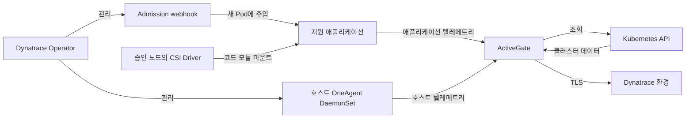

# Dynatrace

> **마지막 업데이트**: 2026년 9월 13일

## 소개

Dynatrace는 애플리케이션·인프라 텔레메트리를 토폴로지 및 문제 분석과 결합합니다. OneAgent 자동 계측은 지원 런타임, 배포 모드, 권한에 따라 달라지므로 Operator 설치만으로 모든 신호가 수집되지는 않습니다. PurePath는 지원하는 요청·코드 문맥을 제공하고 Smartscape는 관측한 의존성을 연결합니다. 모든 요청·메서드·의존성의 수집을 보장하지는 않습니다.

이 가이드의 기준은 **Dynatrace Operator/chart 1.10.2**, **DynaKube v1beta6**, **EKS 1.35 Linux EC2 노드**입니다. Helm 렌더, CRD 스키마, 로컬 예제를 검증했습니다. 실제 EKS 설치, 테넌트 API 호출, OneAgent 계측, 운영 용량 테스트는 수행하지 않았습니다.

## 주요 특징

| 특징 | 제공 범위와 조건 |
|---|---|
| **OneAgent** | 호스트·프로세스 및 지원 애플리케이션 관측. 모드와 호스트 권한을 확인합니다. |
| **자동 계측** | 지원 런타임에 코드 모듈 주입. 기존 Pod는 일반적으로 재생성이 필요합니다. |
| **Davis AI / Dynatrace Intelligence** | 확보한 데이터에 기반한 상관관계·이상·인과 분석. |
| **PurePath** | 분산 요청 분석. 샘플링과 지원 기술에 따라 범위가 달라집니다. |
| **Smartscape** | 수집한 텔레메트리에서 관측한 관계. 완전한 자산 목록은 아닙니다. |
| **Full Stack** | 애플리케이션·인프라 기능. RUM, 합성 모니터링 등은 별도 설정·사용량 조건을 확인합니다. |

## 아키텍처

Cloud Native Full Stack은 **주입 제어**와 **텔레메트리 전송**을 구분합니다. Webhook은 새 애플리케이션 Pod를 수정하고 CSI Driver는 코드 모듈을 제공하며, 호스트 OneAgent는 노드·프로세스 신호를 수집합니다. ActiveGate는 트래픽 라우팅과 Kubernetes API 조회를 수행할 수 있습니다. 선택적인 직접 전송 경로와 추가 수집 컴포넌트는 아래 그림에서 생략했습니다.



## Helm을 통한 EKS 배포

### 1. Dynatrace Operator 설치

설치 전에 [지원 배포판](https://docs.dynatrace.com/docs/ingest-from/setup-on-k8s/deployment/supported-technologies)과 [기술 지원 표](https://docs.dynatrace.com/docs/ingest-from/technology-support/support-model-and-issues)를 함께 확인합니다. Chart의 `kubeVersion >=1.25` 조건만으로 전체 호환성을 판단할 수 없습니다.

| 대상 | 검토 시점의 범위 |
|---|---|
| 지원 Linux EC2 노드의 EKS 1.35 | OneAgent/ActiveGate **1.329+**, Operator **1.6+**가 필요하고 Operator **1.9+**를 권장합니다. 이 가이드는 1.10.2를 고정합니다. |
| Kubernetes 1.36 | OneAgent/ActiveGate 최소 버전은 **1.335**입니다. 플랫폼·버전 조합을 별도로 확인합니다. |
| Kubernetes 1.37 | 확인한 Dynatrace 지원 표에 없습니다. Kubernetes 최신 릴리스가 곧 벤더 지원을 뜻하지 않습니다. |
| EKS Fargate | [Fargate용 EKS 절차](https://docs.dynatrace.com/docs/ingest-from/setup-on-k8s/deployment/marketplaces/eks-dto)의 **CSI 없는 application monitoring**만 적용하며 호스트 OneAgent는 사용하지 않습니다. |
| Bottlerocket | 애플리케이션 모니터링과 ActiveGate Kubernetes 모니터링. 인용한 지원 표에서 OneAgent 호스트 모니터링은 지원하지 않습니다. |
| EKS Auto Mode | 일반 EKS 항목으로 호스트 에이전트 지원을 추론하지 않습니다. 관리형 노드 OS·권한·벤더 지원을 확인해야 하며 이 예제는 Auto Mode에서 검증하지 않았습니다. |

기본 예제는 승인된 지원 EC2 노드 풀을 사용합니다. 관리자가 해당 풀에 사용자 정의 노드 레이블 `monitoring.example.com/dynatrace-host=true`를 적용하고, 계측 애플리케이션도 CSI Driver가 있는 노드에 배치해야 합니다. 이 레이블은 배치 규칙이며 보안 경계는 아닙니다. Taint/toleration은 노드 풀에 맞춰 정하고 모든 taint를 무조건 허용하지 않습니다.

CRD, webhook, 클러스터 RBAC 설치는 권한이 있는 배포 주체가 수행합니다. 호스트 OneAgent/CSI 권한은 일반 restricted 애플리케이션 네임스페이스 조건에 맞지 않습니다. [Operator 보안 권한](https://docs.dynatrace.com/docs/ingest-from/setup-on-k8s/reference/security), admission 예외, `dynatrace` 네임스페이스 접근 제한을 검토합니다. 설치 성공만을 위해 선택적인 클러스터 전체 Secrets/ConfigMaps 읽기 권한을 추가하지 않습니다.

**기존 설치:** [업그레이드와 저장 API 버전 마이그레이션 절차](https://docs.dynatrace.com/docs/ingest-from/setup-on-k8s/guides/deployment-and-configuration/updates-and-maintenance/update-uninstall-operator)를 따릅니다. 클러스터에 `v1beta1`/`v1beta2` DynaKube가 저장되었다면 공식 경로상 **1.8+ 이전에 Operator 1.7.3을 거쳐야 합니다**. YAML의 API를 `v1beta6`으로 바꾸는 것만으로 저장 객체가 변환되지는 않습니다. CRD `status.storedVersions`를 확인하고 임의 삭제하거나 마이그레이션 검사를 끄지 않습니다. 아래 설치 명령은 **새 릴리스용**이며 이전 1.0 예제에서 바로 업그레이드하는 명령이 아닙니다.

```bash
kubectl get nodes -l monitoring.example.com/dynatrace-host=true
kubectl get crd dynakubes.dynatrace.com \
  -o jsonpath='{.status.storedVersions}' --ignore-not-found
kubectl create namespace dynatrace
```

### 2. API 토큰 생성

테넌트의 토큰 종류에 맞춰 최신 [토큰·권한 가이드](https://docs.dynatrace.com/docs/ingest-from/setup-on-k8s/deployment/tokens-permissions)를 사용합니다.

- **Latest Dynatrace 플랫폼 토큰:** 전용 service user와 공식 `Kubernetes Operator`, `Kubernetes Ingest` 정책을 사용하고 환경 범위를 제한합니다. Operator는 필요한 `fleet-management`·`settings` 동작을, 수집은 해당 `openpipeline`·`storage` 권한을 사용합니다. 사용자 권한과 토큰 scope가 모두 적용됩니다.
- **Classic access token:** Operator와 수집 자격 증명을 분리합니다. 최신 가이드의 installer·connection·ActiveGate-token 권한을 적용합니다. Operator 1.7부터 `entities.read`는 필요하지 않고 settings 권한은 선택 사항입니다. 과거의 무제한 권한 목록을 재사용하지 않습니다.
- 활성화한 신호에 필요한 권한만 줍니다. Classic OTLP scope는 `openTelemetryTrace.ingest`, `metrics.ingest`, `logs.ingest`이며 배포 이벤트·설정 쓰기는 별도 권한입니다.

플랫폼 토큰 API 호출은 `Bearer`, Classic access token은 `Api-Token` 헤더를 사용합니다. Scope 이름과 인증 헤더를 혼용하지 않습니다. 범위를 제한한 자격 증명을 회전하고 토큰 파일·Kubernetes Secret 읽기 권한을 제한합니다.

### 3. Secret 생성

생성한 두 토큰 값을 보호된 로컬 파일 `apiToken`, `dataIngestToken`에 **끝 줄바꿈 없이** 저장합니다. Base64는 암호화가 아닌 인코딩입니다. 토큰 YAML을 커밋하거나 토큰 값을 명령 인자에 넣거나 Pod 환경 변수를 출력하지 않습니다. 아래 명령은 새 Secret 생성용이며 기존 Secret 회전은 별도의 통제된 작업입니다.

```bash
token_dir="$PWD/private-dynatrace-tokens"
chmod 700 "$token_dir"
chmod 600 "$token_dir/apiToken" "$token_dir/dataIngestToken"
kubectl create secret generic dynakube --namespace dynatrace \
  --from-file=apiToken="$token_dir/apiToken" \
  --from-file=dataIngestToken="$token_dir/dataIngestToken"
```

### 4. values.yaml 구성

아래는 chart **1.10.2** 값입니다. 호환되는 chart 기본 이미지를 유지합니다. 조정이 필요하면 이 버전의 `operator.requests`/`operator.limits`, `webhook.requests`/`webhook.limits`를 사용하며 중첩 `resources`를 사용하지 않습니다. 과거 예제의 `operator.image.tag`, `operator.resources`는 이 chart에서 무시됩니다. OneAgent/ActiveGate 사용자 설정은 임의의 chart 키가 아니라 해당 DynaKube 필드에 넣습니다.

```yaml
# values-fullstack.yaml
installCRD: true
debugLogs: false
operator:
  nodeSelector:
    kubernetes.io/os: linux
    monitoring.example.com/dynatrace-host: 'true'
webhook:
  nodeSelector:
    kubernetes.io/os: linux
    monitoring.example.com/dynatrace-host: 'true'
csidriver:
  enabled: true
  nodeSelector:
    kubernetes.io/os: linux
    monitoring.example.com/dynatrace-host: 'true'
```

### 5. Operator 설치

공식 OCI chart와 고정 버전을 사용합니다. 명령은 **Helm 3** 기준이며 Helm 4에서는 `--atomic` 대신 `--rollback-on-failure`를 사용합니다. 먼저 렌더된 RBAC, CSI 호스트 마운트, admission 권한을 검토합니다. Helm 롤백이 모든 CRD 변경이나 외부 효과를 되돌리는 것은 아닙니다.

```bash
helm template dynatrace-operator \
  oci://public.ecr.aws/dynatrace/dynatrace-operator \
  --version 1.10.2 --namespace dynatrace --kube-version 1.35.0 \
  --values values-fullstack.yaml > dynatrace-rendered.yaml

helm install dynatrace-operator \
  oci://public.ecr.aws/dynatrace/dynatrace-operator \
  --version 1.10.2 --namespace dynatrace \
  --values values-fullstack.yaml --atomic --timeout 10m
```

### 6. DynaKube CR 구성

이 DynaKube에는 모니터링 모드 예제 중 하나만 선택합니다. `ENVIRONMENTID`를 승인된 환경 ID로 바꿉니다. API URL은 `.live.dynatrace.com/api`이며 웹 앱의 `.apps` origin이 아닙니다. 릴리스의 [v1beta6 full-stack 예제](https://github.com/Dynatrace/dynatrace-operator/blob/v1.10.2/assets/samples/dynakube/v1beta6/cloudNativeFullStack.yaml)에도 `dynatrace-api`가 있으며 실제 ActiveGate capability입니다.

```yaml
# dynakube-fullstack.yaml
apiVersion: dynatrace.com/v1beta6
kind: DynaKube
metadata:
  name: dynakube
  namespace: dynatrace
spec:
  apiUrl: https://ENVIRONMENTID.live.dynatrace.com/api
  tokens: dynakube
  metadataEnrichment:
    enabled: true
    namespaceSelector:
      matchLabels:
        monitoring.example.com/dynatrace: 'true'
  oneAgent:
    hostGroup: eks-production
    cloudNativeFullStack:
      namespaceSelector:
        matchLabels:
          monitoring.example.com/dynatrace: 'true'
      nodeSelector:
        kubernetes.io/os: linux
        monitoring.example.com/dynatrace-host: 'true'
  activeGate:
    capabilities:
    - routing
    - kubernetes-monitoring
    - dynatrace-api
    replicas: 2
    nodeSelector:
      kubernetes.io/os: linux
      monitoring.example.com/dynatrace-host: 'true'
```

예제 애플리케이션용 네임스페이스를 만들거나 기존 네임스페이스의 소유 설정에 레이블을 반영합니다. 주입 selector는 **webhook 변경 대상**을 선택하며 OneAgent 호스트 텔레메트리나 ActiveGate 클러스터 API 조회 전체를 제한하지 않습니다. `replicas: 2`만으로 용량이나 장애 도메인 분산이 보장되지 않으므로 실제 워크로드에 맞춰 ActiveGate 크기와 배치를 설계합니다.

```yaml
# application-namespace.yaml
apiVersion: v1
kind: Namespace
metadata:
  name: observability-demo
  labels:
    monitoring.example.com/dynatrace: 'true'
```

### 7. 배포 및 확인

선행 조건을 확인한 후 선택한 CR과 네임스페이스를 적용합니다. 애플리케이션 배포 전에 상태를 확인합니다. 선택한 애플리케이션 Pod는 정상적인 rollout 절차로 재생성하며 아래 명령이 기존 프로세스를 자동 재시작하지는 않습니다.

```bash
kubectl apply -f application-namespace.yaml
kubectl apply -f dynakube-fullstack.yaml
kubectl get dynakube dynakube -n dynatrace
kubectl get deploy,ds,sts,pods -n dynatrace
kubectl get dynakube dynakube -n dynatrace -o jsonpath='{.status.conditions}'
```

## Cloud Native Full Stack 모드

Cloud Native Full Stack은 호스트 모니터링과 webhook/CSI 기반 애플리케이션 코드 모듈 주입을 결합합니다. Application-only sidecar 모드나 항상 자원을 절약하는 설정이 아닙니다. 호스트 그룹은 `oneAgent.hostGroup`, 해당 호스트 에이전트의 리소스 재정의는 `cloudNativeFullStack.oneAgentResources`에 지정합니다. 임의의 과거 제한값을 복사하지 말고 용량을 검증합니다.

**Classic Full Stack도 1.10.2에 존재합니다.** 아래 완전한 대안은 호스트 기반 주입을 사용합니다. 같은 이름의 cloud-native CR에 추가로 적용하지 말고 지원하는 모드 전환을 계획합니다. 두 full-stack 방식 모두 호스트 접근이 필요합니다.

```yaml
# dynakube-classic.yaml
apiVersion: dynatrace.com/v1beta6
kind: DynaKube
metadata:
  name: dynakube
  namespace: dynatrace
spec:
  apiUrl: https://ENVIRONMENTID.live.dynatrace.com/api
  tokens: dynakube
  metadataEnrichment:
    enabled: true
    namespaceSelector:
      matchLabels:
        monitoring.example.com/dynatrace: 'true'
  oneAgent:
    hostGroup: eks-production
    classicFullStack:
      nodeSelector:
        kubernetes.io/os: linux
        monitoring.example.com/dynatrace-host: 'true'
  activeGate:
    capabilities:
    - routing
    - kubernetes-monitoring
    - dynatrace-api
    replicas: 2
    nodeSelector:
      kubernetes.io/os: linux
      monitoring.example.com/dynatrace-host: 'true'
```

## Application-Only 모니터링

`applicationMonitoring`은 호스트 OneAgent 없이 동작합니다. CSI는 `applicationMonitoring.useCSIDriver`가 아니라 **chart 설정**입니다. CSI 없는 새 application-only 설치에는 full-stack 값 **대신** 아래 `values-app-only.yaml`과 application-only CR을 사용합니다. 기존 full-stack 설치의 CSI를 벤더 마이그레이션 절차 없이 끄지 않습니다.

아래 node selector는 여전히 승인된 EC2 풀을 선택합니다. EKS Fargate에는 인용한 절차의 일치하는 Fargate profile과 배치 설정이 필요하며 CSI만 끈다고 이 EC2 예제가 Fargate 예제로 바뀌지는 않습니다. 같은 클러스터·환경에서 별도 `hostMonitoring`·`applicationMonitoring` DynaKube를 조합하지 말고 둘 다 필요하면 cloud-native full stack을 사용합니다.

```yaml
# values-app-only.yaml
installCRD: true
debugLogs: false
operator:
  nodeSelector:
    kubernetes.io/os: linux
    monitoring.example.com/dynatrace-host: 'true'
webhook:
  nodeSelector:
    kubernetes.io/os: linux
    monitoring.example.com/dynatrace-host: 'true'
csidriver:
  enabled: false
  nodeSelector:
    kubernetes.io/os: linux
    monitoring.example.com/dynatrace-host: 'true'
```

```yaml
# dynakube-app-only.yaml
apiVersion: dynatrace.com/v1beta6
kind: DynaKube
metadata:
  name: dynakube
  namespace: dynatrace
spec:
  apiUrl: https://ENVIRONMENTID.live.dynatrace.com/api
  tokens: dynakube
  metadataEnrichment:
    enabled: true
    namespaceSelector:
      matchLabels:
        monitoring.example.com/dynatrace: 'true'
  oneAgent:
    applicationMonitoring:
      namespaceSelector:
        matchLabels:
          monitoring.example.com/dynatrace: 'true'
  activeGate:
    capabilities:
    - routing
    - kubernetes-monitoring
    - dynatrace-api
    replicas: 2
    nodeSelector:
      kubernetes.io/os: linux
      monitoring.example.com/dynatrace-host: 'true'
```

## Davis AI 기반 근본 원인 분석

### Davis AI 작동 방식

기존 그림은 신호 연관 분석과 문제 출력을 설명하는 **개념도**이며 고정된 처리 알고리즘이나 근본 원인의 확실성을 증명하지 않습니다. Smartscape와 PurePath는 관측한 문맥을 제공하므로 계측 누락 시 의존성이 보이지 않을 수 있습니다. 현재 [Dynatrace Intelligence](https://docs.dynatrace.com/docs/dynatrace-intelligence)는 추가 기능과 승인된 agentic action의 Preview도 제공합니다. 문제 탐지만으로 운영 코드·인프라 변경 권한이 생기지는 않습니다.


[인터랙티브 다이어그램 보기](https://www.atomai.click/kubernetes-docs/archmaps/ko-observability-tracing-04-dynatrace-1.html)

### 문제 알림 구성

과거 `/api/config/v1/alertingProfiles` endpoint는 deprecated입니다. `POST /api/v2/settings/objects`에서 [Settings schema `builtin:alerting.profile`](https://docs.dynatrace.com/docs/dynatrace-api/environment-api/settings/schemas/builtin-alerting-profile)를 사용합니다. 먼저 `?validateOnly=true`로 검증하고 multi-status를 포함하여 응답의 각 항목 코드를 확인합니다. 검증에도 endpoint 쓰기 권한이 필요하며 알림 수신처를 생성하는 작업은 아닙니다.

아래 본문을 `alerting-profile.json`으로 저장합니다. 태그는 **미리 존재해야 하는 Dynatrace entity tag**이며 Kubernetes 레이블의 자동 변환값이 아닙니다. 현재 enum은 복수형 `ERRORS`이며 `PERFORMANCE`도 유효합니다.

```json
[
  {
    "schemaId": "builtin:alerting.profile",
    "scope": "environment",
    "value": {
      "name": "EKS Production Alerts",
      "severityRules": [
        {
          "severityLevel": "AVAILABILITY",
          "delayInMinutes": 0,
          "tagFilterIncludeMode": "INCLUDE_ANY",
          "tagFilter": [
            "cluster:eks-production"
          ]
        },
        {
          "severityLevel": "ERRORS",
          "delayInMinutes": 5,
          "tagFilterIncludeMode": "INCLUDE_ANY",
          "tagFilter": [
            "environment:production"
          ]
        },
        {
          "severityLevel": "PERFORMANCE",
          "delayInMinutes": 15,
          "tagFilterIncludeMode": "INCLUDE_ANY",
          "tagFilter": [
            "tier:critical"
          ]
        }
      ],
      "eventFilters": []
    }
  }
]
```

### 커스텀 이벤트 전송

[Events v2 API](https://docs.dynatrace.com/docs/dynatrace-api/environment-api/events-v2/post-event)는 `CUSTOM_DEPLOYMENT`를 받습니다. 검증하지 않은 서비스 이름이 selector 범위를 넓히지 않도록 확인한 service entity ID를 사용합니다. 아래 helper는 Python 3와 `requests`가 필요합니다. 기본 동작은 미리보기이며 `--send`일 때 한 번 전송하고 redirect를 따르지 않습니다. HTTP 성공만 보지 않고 **201 응답 본문과 개별 report 상태**를 확인합니다. Timeout이면 수락 여부가 불명확하므로 재시도 전에 조사합니다. 이 예제는 멱등성을 보장하지 않습니다.

SaaS origin 허용 목록은 Managed/custom origin을 포함하지 않으므로 해당 환경에는 별도 검토·수정이 필요합니다. Classic 호출은 `events.ingest`, 플랫폼 호출은 `openpipeline:events.davis:ingest` 등 공식 이벤트 수집 scope와 `--scheme Bearer`를 사용합니다. 자격 증명만 담은 보호된 토큰 파일을 사용합니다. Dynatrace SDK가 아닌 HTTP client 코드이며 import 시 호출하지 않습니다.

```python
# deployment_event.py
"""Prepare one deployment annotation; send only when explicitly requested."""
from pathlib import Path
from urllib.parse import urlsplit
import argparse
import json
import re
import requests

def payload_for(entity_id, version):
    if not isinstance(entity_id, str) or not re.fullmatch(r"SERVICE-[0-9A-F]{16}", entity_id):
        raise ValueError("Use one verified SERVICE entity ID")
    if not isinstance(version, str) or not 1 <= len(version) <= 128:
        raise ValueError("Version must contain 1–128 characters")
    if any(ord(char) < 32 or ord(char) == 127 for char in version):
        raise ValueError("Version must not contain control characters")
    return {
        "eventType": "CUSTOM_DEPLOYMENT",
        "title": f"Deployment {version}",
        "entitySelector": f'type(SERVICE),entityId("{entity_id}")',
        "properties": {"release.version": version, "deployment.source": "ci"},
    }

def send_event(environment_url, token_file, entity_id, version, *, scheme="Api-Token", session=None):
    payload = payload_for(entity_id, version)
    parsed = urlsplit(environment_url)
    if (parsed.scheme != "https" or parsed.username or parsed.password
            or parsed.port not in (None, 443)
            or not re.fullmatch(r"[a-z0-9-]+\.live\.dynatrace\.com", parsed.hostname or "")
            or parsed.path not in ("", "/") or parsed.query or parsed.fragment):
        raise ValueError("Use the approved SaaS environment origin, without .apps or a path")
    if scheme not in ("Api-Token", "Bearer"):
        raise ValueError("Choose the authentication scheme required by the token family")
    token = Path(token_file).read_text(encoding="utf-8")
    if not token or token != token.strip() or any(ord(c) < 33 or ord(c) > 126 for c in token):
        raise ValueError("Token file must contain only the token, without whitespace")
    client = session if session is not None else requests.Session()
    try:
        response = client.post(
            f"https://{parsed.hostname}/api/v2/events/ingest",
            headers={"Authorization": f"{scheme} {token}", "Content-Type": "application/json"},
            json=payload, timeout=(5, 30), allow_redirects=False,
        )
        if response.status_code != 201:
            raise RuntimeError(f"Unexpected event API status: {response.status_code}")
        body = response.json()
        if not isinstance(body, dict):
            raise RuntimeError("Invalid event response")
        results = body.get("eventIngestResults")
        if (type(body.get("reportCount")) is not int or body["reportCount"] != 1
                or not isinstance(results, list) or len(results) != 1
                or not isinstance(results[0], dict) or results[0].get("status") != "OK"
                or not isinstance(results[0].get("correlationId"), str)
                or not results[0]["correlationId"]):
            raise RuntimeError("The response did not confirm one successful event report")
        return results[0]["correlationId"]
    finally:
        if session is None:
            client.close()

if __name__ == "__main__":
    parser = argparse.ArgumentParser()
    parser.add_argument("--entity-id", required=True)
    parser.add_argument("--version", required=True)
    parser.add_argument("--send", action="store_true")
    parser.add_argument("--environment-url")
    parser.add_argument("--token-file")
    parser.add_argument("--scheme", choices=["Api-Token", "Bearer"], default="Api-Token")
    args = parser.parse_args()
    if not args.send:
        print(json.dumps(payload_for(args.entity_id, args.version), indent=2))
    else:
        if not args.environment_url or not args.token_file:
            parser.error("--send requires --environment-url and --token-file")
        print("Event report:", send_event(args.environment_url, args.token_file,
              args.entity_id, args.version, scheme=args.scheme))
```

```bash
python3 deployment_event.py --entity-id SERVICE-0123456789ABCDEF --version 2.3.0
```

위 ID는 예시입니다. 전송 전에 환경에서 확인한 entity로 바꿉니다. 전송하려면 `--send --environment-url https://ENVIRONMENTID.live.dynatrace.com --token-file /protected/path/events-token`과 올바른 scheme을 명시적으로 추가합니다. 별도 CI 책임에 Operator 자격 증명을 재사용하지 않습니다.

## 자동 계측

### 지원 기술

OneAgent는 여러 기술 계열을 지원합니다. 아래 예시를 버전과 무관한 보장으로 읽지 말고 [지원 표](https://docs.dynatrace.com/docs/ingest-from/technology-support/support-model-and-issues)에서 정확한 런타임·프레임워크 버전, 아키텍처, 배포 모드를 확인합니다.

| 계열 | 지원 표와 대조할 예시 |
|---|---|
| Java | JVM 및 Spring/Spring Boot, Micronaut, Quarkus, Jakarta EE 버전 |
| Node.js | Node 런타임과 Express 계열 등을 포함한 HTTP·프레임워크 계측 |
| Python | 런타임 및 Django/Flask/FastAPI 계측 경로 |
| .NET | .NET 런타임, ASP.NET Core와 Windows/.NET Framework 배포 구분 |
| Go | Go 버전, 컴파일·빌드 플래그, 지원 HTTP 프레임워크 계측 |
| PHP | PHP 런타임과 Laravel/Symfony 버전 |

### 자동 계측 검증

환경 변수 값이나 자격 증명을 덤프하지 않고 컨테이너 이름·이미지·readiness를 확인합니다. 이후 지원 애플리케이션에 승인된 테스트 요청을 보내 대상 테넌트의 서비스·trace 표시를 확인합니다. Pod readiness만으로 trace 전달을 입증할 수 없습니다. [주입 selector와 opt-out](https://docs.dynatrace.com/docs/ingest-from/setup-on-k8s/guides/deployment-and-configuration/monitoring-and-instrumentation/annotate)을 확인합니다. `dynatrace.com/inject: "false"`는 제외하지만 `"true"`로 설정한다고 모든 선택 규칙이 무시되지는 않습니다.

```bash
kubectl get pods -n observability-demo \
  -o custom-columns='NAME:.metadata.name,INIT:.spec.initContainers[*].name,IMAGES:.spec.containers[*].image,READY:.status.containerStatuses[*].ready'
```

### 커스텀 서비스 정의

[커스텀 Java 서비스 API](https://docs.dynatrace.com/docs/dynatrace-api/configuration-api/service-api/custom-services-api/post-rule)는 `POST /api/config/v1/service/customServices/java`를 계속 지원합니다. 아래 명시적 메서드 signature는 유효한 **설정 형태**이며 예제 앱에 해당 메서드가 존재한다는 증거는 아닙니다. `/api/config/v1/service/customServices/java/validator`에서 본문을 검증한 뒤(성공 시 204), 실제 클래스·반환형·인자·OneAgent 지원을 확인하고 생성합니다. Classic 인증은 `WriteConfig`, 플랫폼 인증은 endpoint의 `settings:objects:write` 조건을 따릅니다.

```json
{
  "name": "Payment Gateway",
  "enabled": true,
  "rules": [
    {
      "enabled": true,
      "className": "com.example.payment.PaymentGateway",
      "methodRules": [
        {
          "methodName": "processPayment",
          "returnType": "com.example.payment.PaymentResult",
          "argumentTypes": []
        }
      ]
    }
  ],
  "queueEntryPoint": false
}
```

## Kubernetes 모니터링 통합

### 클러스터 메트릭

ActiveGate의 `kubernetes-monitoring` capability는 Kubernetes API에서 클러스터·워크로드 상태를 조회합니다. 범위는 애플리케이션 주입과 별개입니다. ActiveGate-only 설치에는 필수 환경 URL을 포함한 아래 완전한 대안을 사용할 수 있습니다. 앞의 같은 이름 DynaKube에 의도 없이 덮어쓰지 않습니다.

```yaml
# dynakube-platform.yaml
apiVersion: dynatrace.com/v1beta6
kind: DynaKube
metadata:
  name: dynakube
  namespace: dynatrace
spec:
  apiUrl: https://ENVIRONMENTID.live.dynatrace.com/api
  tokens: dynakube
  metadataEnrichment:
    enabled: false
  activeGate:
    capabilities:
    - routing
    - kubernetes-monitoring
    - dynatrace-api
    replicas: 2
    nodeSelector:
      kubernetes.io/os: linux
      monitoring.example.com/dynatrace-host: 'true'
```

워크로드·이벤트·Prometheus 수집은 현재 플랫폼 설정과 문서화된 capability 옵션에서 구성합니다. 과거의 임의 `[kubernetes_monitoring] monitor_*`, `kubernetes_namespace_filter` 속성은 검증된 대체 설정이 아닙니다. 권한을 추가하기 전에 실제 RBAC와 활성화할 수집 기능을 검토합니다.

### Prometheus 메트릭 수집

문서화된 [ActiveGate Prometheus 통합](https://docs.dynatrace.com/docs/observe/infrastructure-observability/container-platform-monitoring/kubernetes-monitoring/monitor-prometheus-metrics)을 사용하려면 클러스터 설정에서 workload monitoring과 annotated exporter를 활성화하고 필요한 네트워크 경로를 허용합니다. Annotation은 **Pod template**에 배치합니다. 아래 placeholder 이미지를 실제로 8080 포트의 `/metrics`에서 Prometheus text를 제공하는 소유 애플리케이션으로 바꿉니다. 완전한 Deployment 형태를 제시한 것이며 실행 가능한 앱 이미지를 제공한 것은 아닙니다.

```yaml
# prometheus-application.yaml
apiVersion: apps/v1
kind: Deployment
metadata:
  name: metrics-demo
  namespace: observability-demo
spec:
  replicas: 1
  selector:
    matchLabels:
      app: metrics-demo
  template:
    metadata:
      labels:
        app: metrics-demo
      annotations:
        metrics.dynatrace.com/scrape: 'true'
        metrics.dynatrace.com/port: '8080'
        metrics.dynatrace.com/path: /metrics
    spec:
      automountServiceAccountToken: false
      containers:
      - name: app
        image: registry.example.com/app:metrics-demo
        ports:
        - name: metrics
          containerPort: 8080
      nodeSelector:
        kubernetes.io/os: linux
        monitoring.example.com/dynatrace-host: 'true'
```

이 통합은 DynaKube 주입 selector와 무관하게 여러 네임스페이스의 annotated Pod를 발견합니다. 인용한 ActiveGate 모듈은 exporter Pod 1,000개, Pod당 메트릭 1,000개, Pod당 데이터 포인트 500,000개 한도를 문서화합니다. Counter·gauge·histogram·summary를 지원하지만 모든 OpenMetrics 기능이나 exemplar를 지원하는 것은 아닙니다. 더 큰 배포는 공식 Collector/Target Allocator 대안과 그 별도 권한을 검토합니다.

## 비용 구조

### 라이선스 모델

현재 **Dynatrace Platform Subscription(DPS)** 사용량과 기존 계약의 **Classic 라이선스**를 구분합니다. 계약 rate card와 [현재 capability 단위](https://www.dynatrace.com/pricing/)를 확인하며 이 가이드는 고정 달러 가격이나 절감 효과를 보장하지 않습니다.

| DPS capability | 사용량 단위 예시 |
|---|---|
| Full-Stack Monitoring | 모드별 규칙이 적용되는 memory GiB-hours |
| Infrastructure Monitoring | Host-hours |
| Kubernetes Platform Monitoring | Pod-hours. 문서화된 Full-Stack 포함 조건 확인 |
| Code Monitoring | Container-hours |
| Logs | 선택한 계약의 수집 GiB·보관 GiB-days·쿼리 사용량 |
| Digital experience | RUM session. 합성 모니터링 action/request는 별도 단위 |
| Application security | Capability별 memory GiB-hours 또는 host-hours |

Full-stack은 무제한 로그 수집·보관·쿼리·RUM·합성 테스트를 뜻하지 않습니다. 연간 약정, rate card, 초과 사용량이 실제 청구에 영향을 줍니다.

### 비용 최적화 전략

- 필요한 애플리케이션 주입과 신호 수집을 선택합니다. 네임스페이스 주입 selector는 호스트·클러스터 모니터링 사용량의 상한이 아닙니다.
- 에이전트 리소스는 텔레메트리 양에 맞게 조정합니다. 에이전트 컨테이너 메모리 limit은 관측 대상 호스트 RAM의 과금 한도가 아닙니다.
- 현재 capability 설정과 개인정보 요구에 맞춰 로그량·보존 기간·쿼리 패턴·선택적인 session replay를 관리합니다.
- Application-only는 별도의 메모리 측정·최솟값 규칙을 적용하며 호스트 인프라 모니터링이 포함되지 않는 점을 계산합니다.

### Host Unit 계산

기존 `max(memory/16, vCPU/1.5)` 공식은 잘못되었습니다. [Classic Full-Stack host unit](https://docs.dynatrace.com/docs/license/classic-licensing/application-and-infrastructure-monitoring)은 RAM 구간을 사용합니다. 아래는 현재 DPS 가격 모델이 아닌 **Classic 예시**로 구분합니다.

| 호스트 예시 | Classic Full-Stack 가중치 | 정각 기준 한 시간 전체의 DPS host Full-Stack 사용량 |
|---|---:|---:|
| 4 vCPU, 16 GiB RAM | 1 HU | 16 memory GiB-hours |
| 8 vCPU, 32 GiB RAM | 2 HU | 32 memory GiB-hours |
| 2 vCPU, 8 GiB RAM | 0.5 HU | 8 memory GiB-hours |

DPS 물리·가상 호스트의 [Full-Stack 규칙](https://docs.dynatrace.com/docs/license/capabilities/app-infra-observability/full-stack-monitoring)은 메모리를 0.25 GiB 단위로 올림하고 최소 4 GiB를 적용하며, 사용한 **15분 달력 구간**을 계산합니다. 고정 메모리의 사용량은 `max(4, ceil(memoryGiB × 4) / 4) × coveredIntervals × 0.25`입니다. 전체 실행 시간을 단순 올림하지 말고 실제 달력 구간 수를 셉니다. 경계를 넘으면 두 구간을 사용할 수 있습니다. Application-only/container는 최솟값·측정·버전 규칙이 다르므로 이 호스트 공식을 적용하지 않습니다.

## OpenTelemetry 연동

Dynatrace [native OTLP endpoint](https://docs.dynatrace.com/docs/ingest-from/opentelemetry/otlp-api)는 **HTTP와 binary Protobuf**를 받으며 native gRPC나 JSON을 받지 않습니다. Collector가 로컬 gRPC를 수신한 후 HTTP로 보낼 수 있습니다. 아래 완전한 설정은 Contrib **0.160.0**으로 파싱했습니다. 운영 환경에서는 Dynatrace가 권장하는 자체 Collector 배포판과 지원 컴포넌트·버전 표를 확인합니다.

[현재 설정 가이드](https://docs.dynatrace.com/docs/ingest-from/opentelemetry/collector/configuration)는 메트릭의 delta temporality를 요구합니다. `cumulative_to_delta`는 누적 스트림 상태를 메모리에 저장하므로 같은 스트림을 동일한 변환 인스턴스로 라우팅합니다. 최초 관측은 기준값을 만들며 재시작이나 스트림 퇴거가 변환에 영향을 줍니다. 25시간 staleness는 그보다 짧은 보고 간격을 전제로 하며 cardinality 예산은 아닙니다.

Receiver는 loopback에만 바인딩하므로 로컬 앱이나 같은 Pod의 sidecar에 적합합니다. 여러 Pod용 gateway에는 명시적인 인증·TLS receiver와 네트워크 통제가 필요합니다. 환경 ID를 바꾸고 `Authorization: "Api-Token REPLACE_WITH_INGEST_TOKEN"` 같은 전체 map을 담은 보호된 `headers.yaml`을 마운트합니다. 실제 토큰을 문서·환경 변수·ConfigMap에 넣지 않습니다. 이 예제는 앞서 설명한 Classic 세 신호 수집 scope를 사용합니다.

```yaml
# otel-collector.yaml
receivers:
  otlp:
    protocols:
      grpc:
        endpoint: 127.0.0.1:4317
      http:
        endpoint: 127.0.0.1:4318
processors:
  memory_limiter:
    check_interval: 1s
    limit_mib: 256
    spike_limit_mib: 64
  cumulative_to_delta:
    max_staleness: 25h
  batch:
    timeout: 5s
exporters:
  otlp_http/dynatrace:
    endpoint: https://ENVIRONMENTID.live.dynatrace.com/api/v2/otlp
    headers: ${file:/var/run/secrets/dynatrace/headers.yaml}
service:
  pipelines:
    traces:
      receivers: [otlp]
      processors: [memory_limiter, batch]
      exporters: [otlp_http/dynatrace]
    metrics:
      receivers: [otlp]
      processors: [memory_limiter, cumulative_to_delta, batch]
      exporters: [otlp_http/dynatrace]
    logs:
      receivers: [otlp]
      processors: [memory_limiter, batch]
      exporters: [otlp_http/dynatrace]
```

```bash
otelcol-contrib validate --config=otel-collector.yaml
```

시작 전에 **설치한 배포판의 binary**로 validate합니다. File provider는 headers map 전체를 읽으며 `:key` suffix로 하위 키를 선택하지 않습니다. 기본 TLS 검증을 유지합니다. Exporter가 `/v1/traces`, `/v1/metrics`, `/v1/logs`를 붙이므로 base endpoint에 suffix를 중복하지 않습니다.

ActiveGate 수집 endpoint는 포트·경로와 capability·storage 조건이 다릅니다. `routing`만 켠다고 모든 OTLP 수집 pipeline이 생성되지는 않습니다. Collector validate나 로컬 HTTP 테스트로 테넌트의 수락·quota·종단 전달을 입증할 수 없습니다. 승인된 배포 후 partial-success 응답과 서버 측 표시를 확인합니다.

## 트러블슈팅

### 일반적인 문제

| 증상 | 확인 사항 |
|---|---|
| CR 거절 | 제공 중인 API 버전과 현재 CRD 필드. 루트 `namespaceSelector`·`hostGroup`, `applicationMonitoring.useCSIDriver`는 올바른 대체 필드가 아닙니다. |
| Operator/CSI/ActiveGate Pending | 승인 노드 레이블, taint, 자원, admission 제약, CSI 배치. |
| 주입 모듈 누락 | 네임스페이스 selector, opt-out annotation, 지원 런타임, 애플리케이션 Pod 재생성. |
| 인증 실패 | 토큰 종류, 파일 공백, 만료, scope, 환경 제한. 진단을 위해 토큰 값을 출력하지 않습니다. |
| 호스트 텔레메트리 누락 | 지원 OS·모드, 호스트 권한, OneAgent 상태. Application-only는 호스트 모니터링을 만들지 않습니다. |
| OTLP 메트릭 누락 | HTTP/protobuf endpoint, delta 변환, 스트림 라우팅, 응답 상세. |
| 외부 연결 불가 | DNS, 승인 egress/proxy, 신뢰하는 인증서 체인. Proxy가 있다고 SaaS 완전 망분리 배포가 되는 것은 아닙니다. |

ActiveGate는 텔레메트리를 buffering할 수 있고 일부 수집 구성에는 영구 저장소가 필요하지만 장기 보관 Grail lakehouse는 아닙니다. 컨테이너 내부의 문서화되지 않은 Java CLI 경로를 호출하는 대신 현재 Pod·워크로드 상태를 확인합니다.

### 로그 수집 확인

먼저 Pod와 컨테이너 이름을 조회하고 명시적으로 선택한 컴포넌트의 제한된 로그를 가져옵니다. 진단 로그·지원 archive에는 민감한 앱·설정 정보가 있을 수 있으므로 공유 전에 검토·마스킹합니다. 에이전트 readiness나 로그 출력만으로 테넌트 로그 수집을 입증하지 않습니다.

```bash
kubectl get pods -n dynatrace \
  -o custom-columns='POD:.metadata.name,CONTAINERS:.spec.containers[*].name,READY:.status.containerStatuses[*].ready'
# Replace with names from the preceding output.
dynatrace_pod='REPLACE_WITH_POD_NAME'
dynatrace_container='REPLACE_WITH_CONTAINER_NAME'
kubectl logs -n dynatrace "$dynatrace_pod" -c "$dynatrace_container" \
  --tail=100 --since=10m
```

## 퀴즈

이 장에서 배운 내용을 [Dynatrace 퀴즈](../../quizzes/observability/tracing/04-dynatrace-quiz.md)로 확인하세요.
