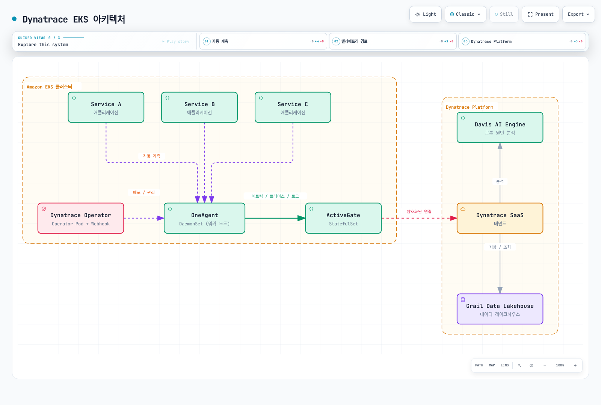
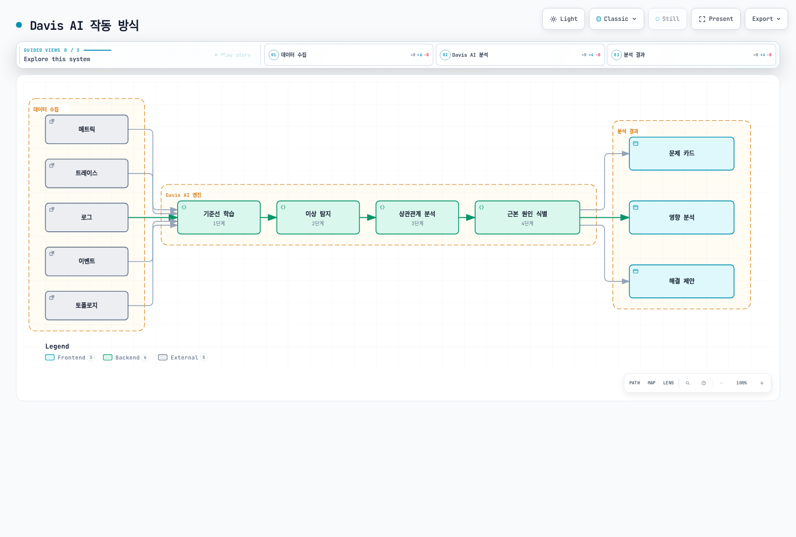

# Dynatrace

> **마지막 업데이트**: 2026년 2월 20일

## 소개

Dynatrace는 AI 기반의 풀스택 관측성 플랫폼입니다. OneAgent 기술을 통해 자동으로 애플리케이션, 인프라, 사용자 경험을 모니터링하며, Davis AI 엔진이 자동으로 문제의 근본 원인을 분석합니다.

## 주요 특징

| 특징 | 설명 |
|-----|------|
| **OneAgent** | 단일 에이전트로 전체 스택 모니터링 |
| **자동 계측** | 코드 변경 없이 자동으로 추적 |
| **Davis AI** | AI 기반 근본 원인 분석 |
| **PurePath** | 분산 추적 기술 |
| **Smartscape** | 실시간 토폴로지 매핑 |
| **Full Stack** | 인프라부터 사용자 경험까지 |

## 아키텍처



[🔍 인터랙티브 다이어그램 보기](https://www.atomai.click/kubernetes-docs/archmaps/ko-observability-tracing-04-dynatrace-0.html)

## Helm을 통한 EKS 배포

### 1. Dynatrace Operator 설치

```bash
# Helm 저장소 추가
helm repo add dynatrace https://raw.githubusercontent.com/Dynatrace/dynatrace-operator/main/config/helm/repos/stable
helm repo update

# 네임스페이스 생성
kubectl create namespace dynatrace
```

### 2. API 토큰 생성

Dynatrace 콘솔에서 다음 권한을 가진 API 토큰을 생성합니다:

- `Access problem and event feed, metrics, and topology`
- `Read configuration`
- `Write configuration`
- `PaaS integration - Installer download`
- `PaaS integration - Support alert`
- `Read entities`
- `Write entities`
- `Read settings`
- `Write settings`
- `Ingest logs`
- `Ingest metrics`
- `Ingest OpenTelemetry traces`

### 3. Secret 생성

```yaml
# dynatrace-secret.yaml
apiVersion: v1
kind: Secret
metadata:
  name: dynakube
  namespace: dynatrace
type: Opaque
data:
  # Base64 인코딩된 값
  apiToken: <BASE64_ENCODED_API_TOKEN>
  dataIngestToken: <BASE64_ENCODED_DATA_INGEST_TOKEN>
```

```bash
# 또는 CLI로 생성
kubectl create secret generic dynakube \
  --namespace dynatrace \
  --from-literal=apiToken=<API_TOKEN> \
  --from-literal=dataIngestToken=<DATA_INGEST_TOKEN>
```

### 4. values.yaml 구성

```yaml
# dynatrace-values.yaml
platform: "kubernetes"

operator:
  image:
    repository: docker.io/dynatrace/dynatrace-operator
    tag: v1.0.0
  resources:
    requests:
      cpu: 50m
      memory: 64Mi
    limits:
      cpu: 100m
      memory: 256Mi

webhook:
  resources:
    requests:
      cpu: 50m
      memory: 64Mi
    limits:
      cpu: 100m
      memory: 256Mi

csidriver:
  enabled: true

# CSI Driver를 통한 코드 모듈 주입
codeModulesImage:
  repository: docker.io/dynatrace/dynatrace-codemodules

# OneAgent 이미지 커스터마이징
oneAgentImage:
  repository: docker.io/dynatrace/oneagent

# ActiveGate 이미지 커스터마이징
activeGateImage:
  repository: docker.io/dynatrace/dynatrace-activegate
```

### 5. Operator 설치

```bash
helm upgrade --install dynatrace-operator dynatrace/dynatrace-operator \
  --namespace dynatrace \
  --values dynatrace-values.yaml \
  --wait
```

### 6. DynaKube CR 구성

```yaml
# dynakube.yaml
apiVersion: dynatrace.com/v1beta2
kind: DynaKube
metadata:
  name: dynakube
  namespace: dynatrace
spec:
  # Dynatrace 환경 URL
  apiUrl: https://<ENVIRONMENT_ID>.live.dynatrace.com/api

  # OneAgent 배포 모드
  oneAgent:
    # Classic Full Stack (DaemonSet)
    classicFullStack:
      tolerations:
        - effect: NoSchedule
          operator: Exists
      args:
        - --set-host-group=eks-production
      env:
        - name: ONEAGENT_ENABLE_VOLUME_STORAGE
          value: "true"
      resources:
        requests:
          cpu: 100m
          memory: 512Mi
        limits:
          cpu: 500m
          memory: 1.5Gi
      # 노드 선택자
      nodeSelector:
        kubernetes.io/os: linux

  # ActiveGate 설정
  activeGate:
    capabilities:
      - routing
      - kubernetes-monitoring
      - dynatrace-api
    resources:
      requests:
        cpu: 500m
        memory: 512Mi
      limits:
        cpu: 1000m
        memory: 1.5Gi
    # 복제본 수
    replicas: 2
    # Kubernetes API 모니터링
    group: eks-production
    # 커스텀 속성
    customProperties:
      value: |
        [kubernetes_monitoring]
        kubernetes_cluster_name=eks-production

  # 메타데이터 보강
  metadataEnrichment:
    enabled: true

  # 네임스페이스 선택자 (모니터링할 네임스페이스)
  namespaceSelector:
    matchLabels:
      dynatrace: enabled
---
# 모니터링할 네임스페이스 레이블 추가
apiVersion: v1
kind: Namespace
metadata:
  name: production
  labels:
    dynatrace: enabled
```

### 7. 배포 및 확인

```bash
# DynaKube 배포
kubectl apply -f dynakube.yaml

# 상태 확인
kubectl get dynakube -n dynatrace
kubectl get pods -n dynatrace

# OneAgent 상태 확인
kubectl logs -n dynatrace -l app.kubernetes.io/name=oneagent --tail=100

# ActiveGate 상태 확인
kubectl logs -n dynatrace -l app.kubernetes.io/name=activegate --tail=100
```

## Cloud Native Full Stack 모드

코드 모듈 주입을 통한 경량화된 모니터링:

```yaml
# dynakube-cloudnative.yaml
apiVersion: dynatrace.com/v1beta2
kind: DynaKube
metadata:
  name: dynakube
  namespace: dynatrace
spec:
  apiUrl: https://<ENVIRONMENT_ID>.live.dynatrace.com/api

  oneAgent:
    # Cloud Native Full Stack (Sidecar 방식)
    cloudNativeFullStack:
      # 코드 모듈 이미지
      codeModulesImage: docker.io/dynatrace/dynatrace-codemodules

      # 네임스페이스 선택자
      namespaceSelector:
        matchLabels:
          dynatrace-injection: enabled

      # 리소스 제한
      initResources:
        requests:
          cpu: 30m
          memory: 30Mi
        limits:
          cpu: 300m
          memory: 300Mi

      # 노드 선택자
      nodeSelector:
        kubernetes.io/os: linux

      # Tolerations
      tolerations:
        - effect: NoSchedule
          operator: Exists

  # 호스트 모니터링 별도 설정
  hostGroup: eks-prod-cloudnative

  activeGate:
    capabilities:
      - routing
      - kubernetes-monitoring
```

## Application-Only 모니터링

인프라 에이전트 없이 애플리케이션만 모니터링:

```yaml
# dynakube-app-only.yaml
apiVersion: dynatrace.com/v1beta2
kind: DynaKube
metadata:
  name: dynakube
  namespace: dynatrace
spec:
  apiUrl: https://<ENVIRONMENT_ID>.live.dynatrace.com/api

  oneAgent:
    # Application-Only 모드
    applicationMonitoring:
      # CSI Driver 사용
      useCSIDriver: true

      # 네임스페이스 선택자
      namespaceSelector:
        matchLabels:
          dynatrace-injection: enabled

      # Init Container 리소스
      initResources:
        requests:
          cpu: 30m
          memory: 30Mi
        limits:
          cpu: 300m
          memory: 300Mi

  # ActiveGate (API 라우팅용)
  activeGate:
    capabilities:
      - routing
```

## Davis AI 기반 근본 원인 분석

### Davis AI 작동 방식



[🔍 인터랙티브 다이어그램 보기](https://www.atomai.click/kubernetes-docs/archmaps/ko-observability-tracing-04-dynatrace-1.html)

### 문제 알림 구성

```yaml
# Dynatrace 알림 프로필 (API를 통한 설정)
# POST /api/config/v1/alertingProfiles
{
  "displayName": "EKS Production Alerts",
  "rules": [
    {
      "severityLevel": "AVAILABILITY",
      "tagFilter": {
        "includeMode": "INCLUDE_ANY",
        "tagFilters": [
          {
            "context": "KUBERNETES_CLUSTER",
            "key": "eks-production"
          }
        ]
      },
      "delayInMinutes": 0
    },
    {
      "severityLevel": "ERROR",
      "tagFilter": {
        "includeMode": "INCLUDE_ANY",
        "tagFilters": [
          {
            "context": "CONTEXTLESS",
            "key": "environment",
            "value": "production"
          }
        ]
      },
      "delayInMinutes": 5
    },
    {
      "severityLevel": "PERFORMANCE",
      "tagFilter": {
        "includeMode": "INCLUDE_ANY",
        "tagFilters": [
          {
            "context": "CONTEXTLESS",
            "key": "tier",
            "value": "critical"
          }
        ]
      },
      "delayInMinutes": 15
    }
  ],
  "eventTypeFilters": []
}
```

### 커스텀 이벤트 전송

```python
# Python SDK를 사용한 커스텀 이벤트
import requests

def send_deployment_event(environment_id, api_token, service_name, version):
    url = f"https://{environment_id}.live.dynatrace.com/api/v2/events/ingest"
    headers = {
        "Authorization": f"Api-Token {api_token}",
        "Content-Type": "application/json"
    }
    payload = {
        "eventType": "CUSTOM_DEPLOYMENT",
        "title": f"Deployment: {service_name} v{version}",
        "entitySelector": f"type(SERVICE),tag(service:{service_name})",
        "properties": {
            "service": service_name,
            "version": version,
            "deployedBy": "ArgoCD",
            "environment": "production"
        }
    }

    response = requests.post(url, headers=headers, json=payload)
    return response.json()

# CI/CD 파이프라인에서 호출
send_deployment_event(
    environment_id="abc12345",
    api_token="dt0c01.xxx",
    service_name="order-service",
    version="2.3.0"
)
```

## 자동 계측

### 지원 기술

| 언어/플랫폼 | 지원 프레임워크 |
|------------|----------------|
| **Java** | Spring, Spring Boot, Micronaut, Quarkus, Jakarta EE |
| **Node.js** | Express, Fastify, NestJS, Koa |
| **Python** | Django, Flask, FastAPI |
| **.NET** | ASP.NET Core, .NET Framework |
| **Go** | net/http, Gin, Echo, Fiber |
| **PHP** | Laravel, Symfony |

### 자동 계측 검증

```bash
# Pod의 환경 변수 확인
kubectl exec -it <pod-name> -- env | grep -i dynatrace

# 예상 출력:
# LD_PRELOAD=/opt/dynatrace/oneagent/agent/lib64/liboneagentproc.so
# DT_TENANT=abc12345
# DT_TENANTTOKEN=xxxxx
# DT_CONNECTION_POINT=https://abc12345.live.dynatrace.com/communication

# OneAgent 로그 확인
kubectl exec -it <pod-name> -- cat /var/log/dynatrace/oneagent/oneagent.log
```

### 커스텀 서비스 정의

```yaml
# Dynatrace에서 서비스 감지 규칙 (API)
# POST /api/config/v1/service/customServices/java
{
  "name": "Payment Gateway",
  "enabled": true,
  "rules": [
    {
      "enabled": true,
      "className": "com.example.payment.PaymentGateway",
      "methodRules": [
        {
          "methodName": "processPayment",
          "returnType": "com.example.payment.PaymentResult",
          "argumentTypes": []
        }
      ]
    }
  ],
  "queueEntryPoint": false
}
```

## Kubernetes 모니터링 통합

### 클러스터 메트릭

```yaml
# ActiveGate Kubernetes 모니터링 설정
apiVersion: dynatrace.com/v1beta2
kind: DynaKube
metadata:
  name: dynakube
  namespace: dynatrace
spec:
  activeGate:
    capabilities:
      - kubernetes-monitoring
    customProperties:
      value: |
        [kubernetes_monitoring]
        kubernetes_cluster_name=eks-production
        kubernetes_cluster_id=arn:aws:eks:ap-northeast-2:123456789012:cluster/eks-production

        # 모니터링 설정
        monitor_kubernetes_workloads=true
        monitor_kubernetes_nodes=true
        monitor_kubernetes_events=true

        # 리소스 수집
        kubernetes_workload_metrics=true
        kubernetes_node_metrics=true
        kubernetes_pod_metrics=true

        # 네임스페이스 필터 (옵션)
        kubernetes_namespace_filter=production,staging
```

### Prometheus 메트릭 수집

```yaml
# annotations를 통한 Prometheus 메트릭 수집
apiVersion: apps/v1
kind: Deployment
metadata:
  name: my-app
  annotations:
    # Dynatrace가 Prometheus 메트릭 수집
    metrics.dynatrace.com/scrape: "true"
    metrics.dynatrace.com/port: "8080"
    metrics.dynatrace.com/path: "/metrics"
spec:
  template:
    metadata:
      annotations:
        metrics.dynatrace.com/scrape: "true"
        metrics.dynatrace.com/port: "8080"
```

## 비용 구조

### 라이선스 모델

| 유형 | 단위 | 포함 사항 |
|-----|-----|---------|
| **Full-Stack** | Host Unit | 인프라 + APM + 로그 |
| **Infrastructure** | Host Unit | 인프라 모니터링만 |
| **Application Security** | Host Unit | RASP + 취약점 분석 |
| **DEM (Digital Experience)** | Session | RUM + Synthetic |
| **Log Monitoring** | GiB | 로그 수집 및 분석 |

### 비용 최적화 전략

```yaml
# 1. 네임스페이스 선택적 모니터링
spec:
  oneAgent:
    cloudNativeFullStack:
      namespaceSelector:
        matchLabels:
          dynatrace-injection: enabled  # 필요한 네임스페이스만

# 2. 리소스 제한 설정
      resources:
        limits:
          cpu: 500m
          memory: 1Gi

# 3. 데이터 보존 기간 조정 (Dynatrace 콘솔)
# Settings > Monitoring > Data privacy > Data retention

# 4. 세션 리플레이 비활성화 (필요 시)
# Applications > [App] > Session Replay > Disable
```

### Host Unit 계산

```
Host Units = max(memory_GB / 16, vCPU / 1.5)

예시:
- 4 vCPU, 16GB RAM = max(1, 2.67) = 2.67 Host Units
- 8 vCPU, 32GB RAM = max(2, 5.33) = 5.33 Host Units
- 2 vCPU, 8GB RAM  = max(0.5, 1.33) = 1.33 Host Units
```

## OpenTelemetry 연동

Dynatrace는 OpenTelemetry 데이터를 네이티브로 수집합니다:

```yaml
# OTEL Collector에서 Dynatrace로 전송
exporters:
  otlphttp/dynatrace:
    endpoint: https://<ENVIRONMENT_ID>.live.dynatrace.com/api/v2/otlp
    headers:
      Authorization: "Api-Token <DYNATRACE_API_TOKEN>"

service:
  pipelines:
    traces:
      exporters: [otlphttp/dynatrace]
    metrics:
      exporters: [otlphttp/dynatrace]
    logs:
      exporters: [otlphttp/dynatrace]
```

## 트러블슈팅

### 일반적인 문제

```bash
# 1. OneAgent 연결 문제
kubectl logs -n dynatrace -l app.kubernetes.io/name=oneagent | grep -i error

# 2. ActiveGate 상태 확인
kubectl exec -n dynatrace -it $(kubectl get pod -n dynatrace -l app.kubernetes.io/name=activegate -o jsonpath='{.items[0].metadata.name}') -- \
  /opt/dynatrace/gateway/jre/bin/java -jar /opt/dynatrace/gateway/lib/cli.jar status

# 3. 코드 모듈 주입 확인
kubectl describe pod <pod-name> | grep -A5 "Init Containers"

# 4. 네트워크 연결 테스트
kubectl exec -n dynatrace -it <oneagent-pod> -- \
  curl -v https://<ENVIRONMENT_ID>.live.dynatrace.com/api/v1/deployment/installer/agent/connectioninfo

# 5. 토큰 권한 확인
curl -X GET "https://<ENVIRONMENT_ID>.live.dynatrace.com/api/v2/apiTokens/<TOKEN_ID>" \
  -H "Authorization: Api-Token <API_TOKEN>"
```

### 로그 수집 확인

```bash
# ActiveGate 로그
kubectl logs -n dynatrace -l app.kubernetes.io/name=activegate --tail=200

# OneAgent 로그
kubectl exec -n dynatrace -it <oneagent-pod> -- \
  tail -100 /var/log/dynatrace/oneagent/oneagent.log

# Operator 로그
kubectl logs -n dynatrace -l app.kubernetes.io/name=dynatrace-operator --tail=100
```

## 퀴즈

이 장에서 배운 내용을 테스트하려면 [Dynatrace 퀴즈](../../quizzes/observability/tracing/04-dynatrace-quiz.md)를 풀어보세요.
