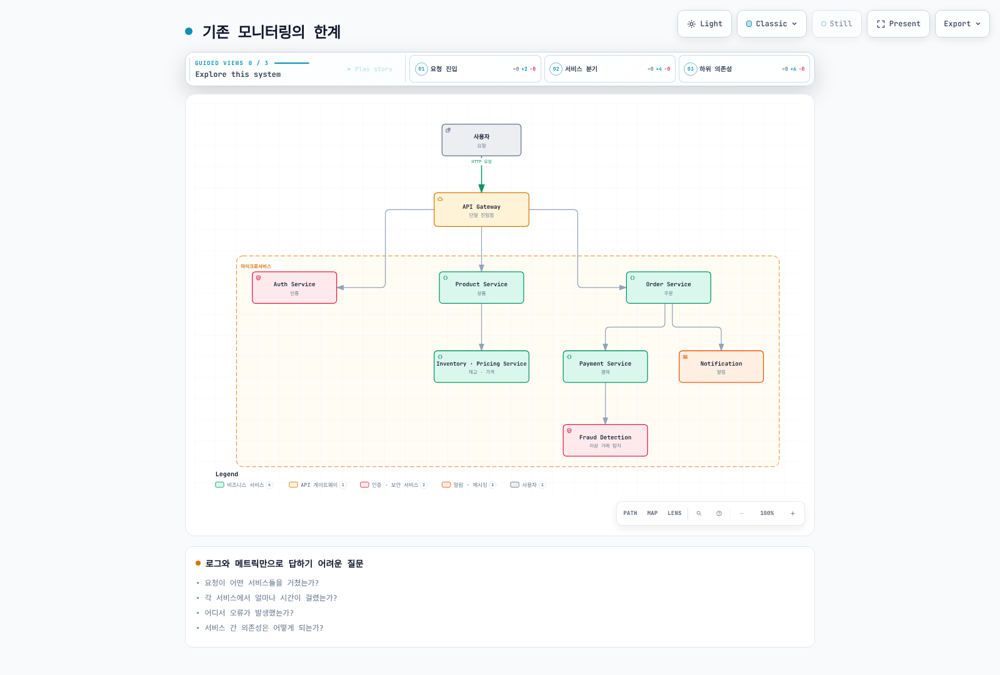
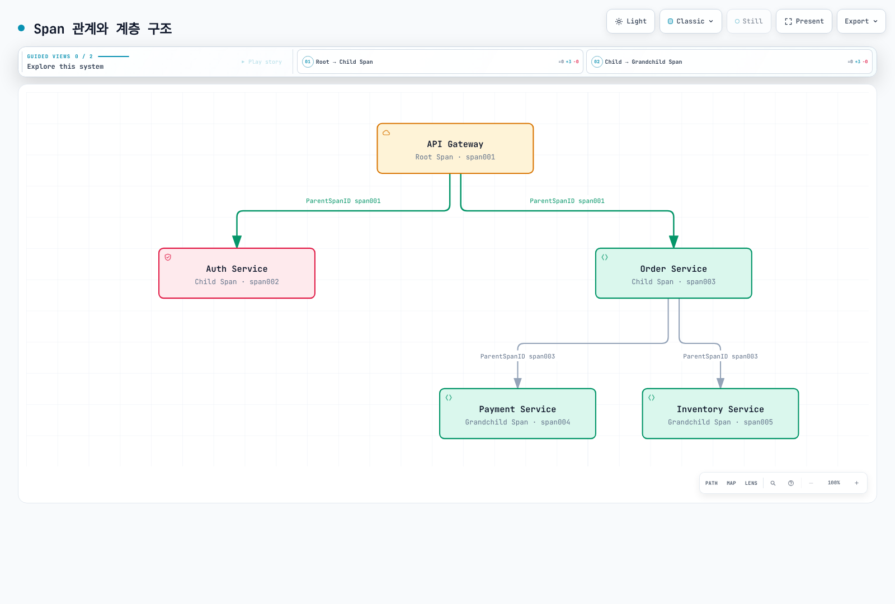
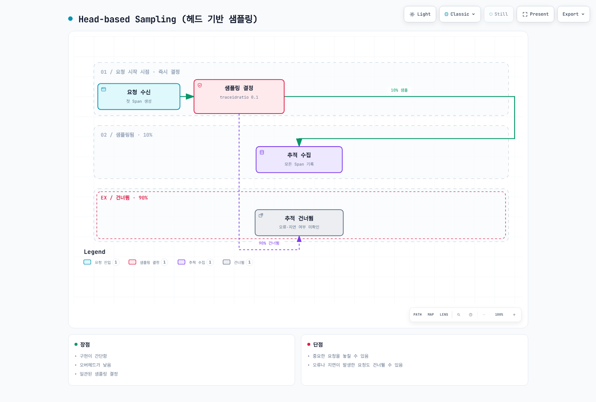
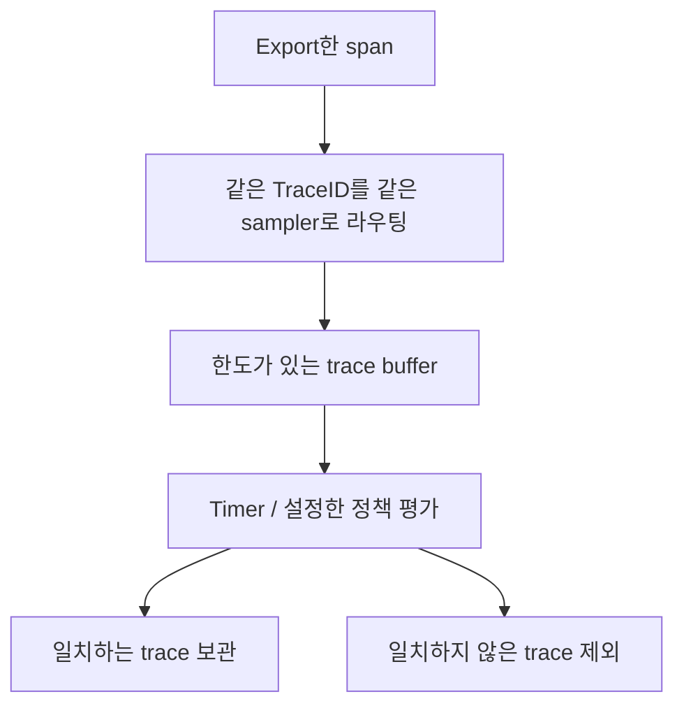
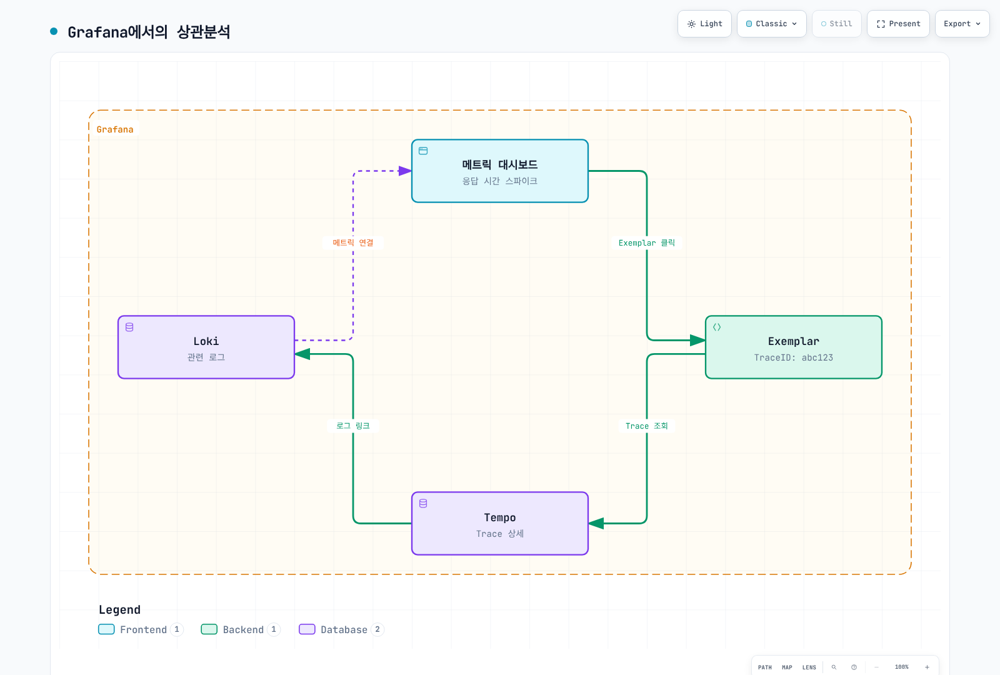

# 분산 추적 개요

> **마지막 업데이트**: 2026년 9월 13일

## 소개

분산 추적은 계측한 작업을 프로세스 경계 너머로 기록하고 전파한 context로 연결합니다. 저장된 trace는 **관측된 span 집합**이지 모든 작업·요청을 수집했다는 증거는 아닙니다. Instrumentation, sampling, export, storage, retention이 실제 가시성을 결정합니다.

## 분산 추적의 필요성

### 기존 모니터링의 한계

공유 context가 없는 로그·메트릭만으로는 요청 경로와 시간을 재구성하기 어렵습니다. Trace는 인과관계를 표현하여 다른 신호를 보완합니다.

- 계측된 서비스 중 무엇이 참여했는가?
- 어떤 작업이 느리거나 실패했는가?
- 어떤 작업이 겹치거나 대기·재시도했는가?
- 진단을 뒷받침하는 로그·자원 지표는 무엇인가?



[인터랙티브 다이어그램 보기](https://www.atomai.click/kubernetes-docs/archmaps/ko-observability-tracing-readme-0.html)

그림은 상관관계가 필요한 이유를 보여줍니다. 올바르게 연결한 로그로는 이런 질문에 절대 답할 수 없다거나 trace만으로 원인이 확정된다는 뜻은 아닙니다.

## 핵심 개념

### 1. Trace (추적)

Trace는 같은 TraceID를 공유하는 span을 묶습니다. Parent-child 관계는 그 trace에 인과적으로 연결된 작업을 표현합니다. 누락된 계측이나 데이터 손실 때문에 빈 구간이 있을 수 있습니다.

다음은 root 시작을 0으로 한 **가상 시간표**입니다. 단위는 ms입니다.

| Span | 시작 | 종료 | Duration |
|---|---:|---:|---:|
| API gateway root | 0 | 650 | 650 |
| User service | 20 | 70 | 50 |
| Order service | 100 | 600 | 500 |
| Payment service, Order의 child | 250 | 550 | 300 |
| Notification service, Order의 child | 500 | 600 | 100 |

관측 구간은 650ms입니다. 모든 duration을 더하면 부모가 자식 작업을 포함하고 일부 자식이 겹치므로 1,600ms가 됩니다. 부모의 inclusive duration을 자식 duration과 더해 “임계 경로”로 계산하지 않습니다. 실제 시작·종료·의존 관계와 비동기 작업·clock skew를 분석합니다.

### 2. Span (스팬)

Span은 계측한 작업 하나를 설명합니다.

| 필드 | 의미 | 예시 |
|---|---|---|
| TraceID | Trace 식별자 | `4bf92f3577b34da6a3ce929d0e0e4736` |
| SpanID | 현재 span 식별자 | `00f067aa0ba902b7` |
| ParentSpanID | 부모 span 식별자; root에는 없음 | `b7ad6b7169203331` |
| Name | 낮은 cardinality의 작업 이름 | `GET /api/users/{id}` |
| Start / end | Timestamp; 차이로 duration 계산 | `2025-02-15T10:30:00Z`는 시간 형식 예시 |
| Attributes | 타입이 있는 metadata | `http.response.status_code=200` |
| Events | Span에 연결된 timestamp 기반 이벤트 | 기록한 exception event |
| Status | `UNSET`, `OK`, `ERROR` | 별도 계측 규칙이 없다면 정상 HTTP 요청의 Span status는 UNSET 유지 |

OpenTelemetry에서는 **attributes**와 **events**를 사용합니다. Span event가 모든 앱 로그의 복사본은 아닙니다. 생성 시 초기 attribute/link가 있을 수 있고 이후 event·attribute·status를 더할 수 있습니다. Span 시작 시 duration은 아직 정해지지 않습니다. Exception 기록과 error status 설정도 별도 API 작업입니다.

### 3. Span 관계와 계층 구조



[인터랙티브 다이어그램 보기](https://www.atomai.click/kubernetes-docs/archmaps/ko-observability-tracing-readme-3.html)

그림의 `span001`~`span005`는 **설명용 기호**이며 유효한 wire-format SpanID가 아닙니다. Span의 parent는 최대 하나입니다. **Link**는 같은 trace 또는 다른 trace의 span을 연결할 수 있어 비동기 메시지·batch·여러 인과적 입력을 표현할 때 유용합니다. 이 단순 트리에는 link가 표시되지 않았습니다.

### 4. SpanContext (스팬 컨텍스트)

SpanContext는 immutable한 추적 식별·전파 정보입니다. 아래 YAML은 개념 표현이며 SDK 설정 파일이 아닙니다.

```yaml
SpanContext:
  trace_id: "4bf92f3577b34da6a3ce929d0e0e4736"
  span_id: "00f067aa0ba902b7"
  trace_flags: "01"
  trace_state: "vendor=value"
  is_remote: false
```

OpenTelemetry TraceID는 16 bytes를 소문자 hex 32자리로, SpanID는 8 bytes를 hex 16자리로 표현합니다. 유효한 SpanContext의 ID는 모두 0이면 안 됩니다. `is_remote`는 추출한 remote parent와 로컬에서 만든 span을 구분합니다. `01`은 sampled bit를 켜지만 backend 저장 완료를 증명하지 않습니다.

Baggage는 SpanContext·`tracestate`와 별도입니다. 전파 context에 credential·개인정보를 넣거나 호출자가 보낸 trace ID를 인증 수단으로 사용하지 않습니다.

## Context Propagation (컨텍스트 전파)

Propagation은 경계 너머로 식별 정보를 전달합니다. 그것만으로 작업을 계측하거나 span을 export하지는 않습니다. Framework/SDK propagator로 header를 inject/extract하고 활성 context를 올바르게 attach/detach합니다.

### W3C Trace Context (권장)

```http
traceparent: 00-4bf92f3577b34da6a3ce929d0e0e4736-00f067aa0ba902b7-01
tracestate: vendor=value
```

Version `00`의 필드 형식은 다음과 같습니다.

```text
version(2 hex)-trace_id(32 hex)-parent_id(16 hex)-trace_flags(2 hex)
```

Wire의 `parent_id`는 **보내는 span의 SpanID**이며 수신자가 child를 만들 때 remote parent로 사용합니다. Sender 자신의 ParentSpanID가 아닙니다. 잘못된 길이·hex가 아닌 값·all-zero ID를 예제로 복사하지 않습니다. 임의의 문자열로 header를 만들기보다 구현의 검증 규칙을 사용합니다.

### B3 Propagation (Zipkin 호환)

B3는 64-bit 또는 128-bit TraceID와 64-bit SpanID를 허용합니다. 다음 두 예는 같은 sampled context를 전달합니다.

```http
b3: 4bf92f3577b34da6a3ce929d0e0e4736-00f067aa0ba902b7-1
```

```http
X-B3-TraceId: 4bf92f3577b34da6a3ce929d0e0e4736
X-B3-SpanId: 00f067aa0ba902b7
X-B3-Sampled: 1
```

선택적인 ParentSpanID에는 별도 규칙이 있으며 여기서는 생략합니다. B3에는 sampling-only와 debug 형식도 있습니다. HTTP header 이름은 대소문자를 구분하지 않지만 다른 transport에서는 정규화가 필요할 수 있습니다. 두 B3 형식이 동시에 있으면 규격상 single header가 우선합니다.

### 전파 방식 비교

| 형식 | 주요 필드 | 선택 기준 |
|---|---|---|
| W3C Trace Context | `traceparent`, `tracestate` | 표준 기반 상호운용 |
| B3 single | `b3` | 기존 Zipkin/B3 통합 |
| B3 multi | `X-B3-*` | 기존 통합과 분리된 필드 확인 |
| Jaeger legacy | `uber-trace-id` | 기존 호환성; 설치한 propagator 확인 |

양쪽 설정을 맞추고 HTTP/gRPC/messaging 경계를 테스트합니다. 동시에 다른 parent를 추출하는 propagator 조합을 피합니다. 표준 header라도 proxy·queue·비동기 task가 자동 보존한다고 가정하지 않습니다.

## 샘플링 전략

Sampling은 보관량과 오버헤드를 줄일 수 있지만 trace로 답할 수 있는 질문도 바꿉니다. 결정 시점·확률/정책·누락 동작을 명시합니다.

### Head-based Sampling (헤드 기반)



[인터랙티브 다이어그램 보기](https://www.atomai.click/kubernetes-docs/archmaps/ko-observability-tracing-readme-4.html)

10%/90%는 설정한 확률이며 적은 요청에서 정확한 개수를 보장하지 않습니다. 그림은 계측·전파·전달 성공을 가정합니다. “수집”이 모든 child span의 조회 가능성을 무조건 보장하지는 않습니다.

표준 환경변수를 지원하는 SDK/autoconfiguration에서는 다음과 같이 설정할 수 있습니다.

```bash
export OTEL_TRACES_SAMPLER=parentbased_traceidratio
export OTEL_TRACES_SAMPLER_ARG=0.1
```

ParentBased는 parent 결정을 따르며 ratio는 설정한 root delegate에 적용됩니다. 따라서 sampled remote parent가 있으면 로컬 root ratio가 0이어도 child에 sampled 결정을 내릴 수 있습니다. 사용하는 언어 SDK의 설정 지원을 확인합니다. 임의의 `sampling: {type, ratio}` YAML을 범용 SDK 설정으로 제시하지 않습니다.

Head sampling은 상대적으로 단순하지만 미래의 오류·지연을 알 수 없습니다. 건너뛴 요청이 나중에 중요해질 수 있으며 tail sampling이 upstream에서 기록·export하지 않은 span을 복원할 수는 없습니다.

### Tail-based Sampling (테일 기반)

Tail sampling은 **수신한** trace data에 정책을 적용합니다. “모든 span이 완성되었다”는 확실한 신호를 받는 방식이 아닙니다.



다음은 Collector Contrib **0.160.0**에서 지원하는 processor fragment이며 완성된 traces pipeline에 통합해야 합니다.

```yaml
processors:
  tail_sampling:
    decision_wait: 10s
    num_traces: 10000
    policies:
    - name: errors
      type: status_code
      status_code:
        status_codes:
        - ERROR
    - name: slow-requests
      type: latency
      latency:
        threshold_ms: 1000
    - name: probabilistic
      type: probabilistic
      probabilistic:
        sampling_percentage: 10
```

기본 `trace-complete` 전략은 timer 경로에서 누적된 span을 평가합니다. `decision_wait`는 수신한 trace data를 기준으로 동작하며 요청 완료를 보장하지 않습니다. 현재 processor에는 별도 `span-ingest` 전략도 있고 지원 정책·시점이 다릅니다.

Status 정책은 관측한 span status `ERROR`를 대상으로 하며 모든 앱 오류 문자열을 뜻하지 않습니다. Latency 정책은 수신한 trace의 가장 이른 시작과 늦은 종료를 사용합니다. Probabilistic 정책이 다른 trace도 보관할 수 있으므로 정상 trace를 모두 버리는 것은 아닙니다.

같은 TraceID의 span을 같은 sampler instance로 보냅니다. Late arrival, decision cache, restart, upstream sampling/export 실패, trace 수·byte 제한, buffer eviction을 고려합니다. `num_traces`는 프로세스 메모리 제한이 아닙니다. Traffic과 span 크기로 계산하고 drop/eviction/late-span 지표를 관찰합니다. **Tail sampling도 중요한 요청을 절대 놓치지 않는다고 보장할 수 없습니다.**

### 샘플링 전략 비교

| 전략 | 판단 정보 | Trade-off |
|---|---|---|
| Head | Span 생성 시 정보와 parent 결정 | Buffer 부담이 작지만 미래 결과를 놓칠 수 있음 |
| Tail | 수신한 span과 설정한 정책·시점 | 상태·라우팅 비용이 크고 불완전한 trace 가능 |
| Adaptive | Traffic·budget에 따라 정책 변경 | 제품/구현별 control loop·한도 검증 필요 |

보편적인 “정확도 중간/높음” 순위는 없습니다. 보관한 모집단이 원하는 진단·통계 질문에 적합한지 평가합니다. Error trace를 모두 선택하는 정책은 오류 비율을 의도적으로 편향시킬 수 있습니다.

## 트레이스-로그-메트릭 상관분석

### TraceID를 통한 로그 연결

Framework에서 지원하는 logging instrumentation을 우선 검토합니다. SLF4J MDC를 수동으로 사용하면 작업이 예외를 던져도 이전 context를 복구합니다.

```java
import java.util.Map;
import org.slf4j.MDC;
import io.opentelemetry.api.trace.Span;
import io.opentelemetry.api.trace.SpanContext;

public final class TraceMdc {
    private TraceMdc() {}

    public static void run(Runnable operation) {
        Map<String, String> previous = MDC.getCopyOfContextMap();
        try {
            SpanContext context = Span.current().getSpanContext();
            if (context.isValid()) {
                MDC.put("traceId", context.getTraceId());
                MDC.put("spanId", context.getSpanId());
            } else {
                MDC.remove("traceId");
                MDC.remove("spanId");
            }
            operation.run();
        } finally {
            if (previous == null) {
                MDC.clear();
            } else {
                MDC.setContextMap(previous);
            }
        }
    }
}
```

필요한 OpenTelemetry/SLF4J dependency와 logging backend를 갖춘 뒤 `TraceMdc.run(() -> logger.info("Processing order"));`처럼 사용합니다. Encoder/pattern에 `traceId`, `spanId`를 포함해야 하며 MDC에 값을 넣는 것만으로 출력되지 않습니다.

Validity 검사로 비활성 context의 all-zero ID가 기록되지 않게 합니다. MDC는 thread-local이며 비동기 작업으로 OpenTelemetry context·MDC를 전달하려면 해당 framework의 기능이 필요합니다. 이 helper는 동기 logging scope를 다루며 모든 thread hand-off를 해결하지 않습니다.

### Exemplar를 통한 메트릭 연결

아래는 YAML이 아닌 **OpenMetrics exposition text**입니다. Exemplar에는 label과 관측값이 있고 그 뒤에 timestamp를 선택적으로 붙일 수 있습니다.

```text
# TYPE http_request_duration_seconds histogram
http_request_duration_seconds_bucket{le="0.5"} 1 # {trace_id="4bf92f3577b34da6a3ce929d0e0e4736"} 0.42
http_request_duration_seconds_bucket{le="+Inf"} 1
http_request_duration_seconds_sum 0.42
http_request_duration_seconds_count 1
# EOF
```

Exemplar는 이 histogram bucket의 대표 관측값 0.42초를 가리킵니다. 해당 요청이 정확한 p99 경계라는 증거는 아닙니다. Exporter/remote-write 보존, backend exemplar 저장, Grafana datasource 연결이 모두 필요합니다. Trace sampling·retention 때문에 exemplar만 있고 trace는 없을 수 있습니다.

### Grafana에서의 상관분석



[인터랙티브 다이어그램 보기](https://www.atomai.click/kubernetes-docs/archmaps/ko-observability-tracing-readme-6.html)

이전 그림의 짧은 `abc123`은 축약 표시이며 유효한 W3C TraceID가 아닙니다. 실제 데이터에는 전체 ID를 사용합니다. `trace_id`/`traceId`/`traceID`, datasource UID, 시간 여유, resource/log label 매핑을 맞춥니다. 실제 요청 하나를 모든 신호에서 확인하며 링크 존재만으로 상관분석 성공을 판단하지 않습니다.

## 솔루션 비교

### 분산 추적 솔루션 비교표

| 솔루션 | 검토할 모델·기능 | 배포·비용 고려 |
|---|---|---|
| [Tempo](https://github.com/grafana/tempo/tree/v3.0.3) | TraceQL·Grafana 통합 | Compute·ingestion·storage·query·request·networking 포함; “storage 비용만” 아님 |
| [AWS X-Ray](https://docs.aws.amazon.com/xray/latest/devguide/aws-xray.html) | AWS 관리형 요청 추적·filter | 지원 계측/OTel 경로·IAM·quota·retention·사용량 과금 |
| [Jaeger](https://www.jaegertracing.io/docs/2.20/architecture/) | Query/UI·구성 가능한 collector/storage 구조 | 지원 storage·ingestion topology·processor 선택; 본질적으로 head-only인 것은 아님 |
| [Datadog APM](https://docs.datadoghq.com/tracing/) | 관리형 APM/search/analytics | Agent/OTel 매핑·retention/indexing/sampling·실제 plan 조건 |
| [Dynatrace](https://docs.dynatrace.com/docs/observe/application-observability/distributed-tracing) | OneAgent/OTel 수집·Grail/DQL 추적 | 배포 모드·권한·retention·processing·실제 consumption/plan 조건 |

Sampling은 SDK·collector·backend별 component에서 수행할 수 있습니다. “Native OTel 지원”이 모든 attribute·span link·sampling 정책·한도의 동일성을 뜻하지 않습니다. AI 보조 기능은 주변 platform·plan에 따라 다르므로 저장 backend의 영구적인 yes/no 속성으로 단순화하지 않습니다.

### 선택 가이드

상호운용, 조사 workflow, 보안·data residency, 운영 소유권, 예상 수집량부터 정합니다. 실제 ingestion/query 경로를 검증하고 같은 retention·신뢰성 조건에서 총 운영비를 비교합니다. 오픈소스이거나 Grafana를 이미 사용한다고 최저 비용이 보장되지는 않습니다.

## Best Practices

### 1. 계측 전략

지원 library로 HTTP/gRPC, DB client, messaging, 외부 API 같은 의미 있는 경계를 계측합니다. Internal/cache/file span은 구체적인 진단 질문에 필요한 곳에 추가합니다. 모든 작은 함수에 span을 만들거나 민감한 request/query body를 노출하지 않습니다.

Export와 함께 context propagation, span kind, error status, 비동기 link를 설계합니다. 계측 범위와 sampling 결정은 별도 제어입니다.

### 2. Span 네이밍 규칙

선택한 semantic convention에 맞는 낮은 cardinality의 이름을 사용합니다.

```text
GET /api/users/{id}
SELECT users
GET
send orders
```

Redis의 `GET` 이름에 `user:123` 같은 실제 key를 포함하지 않습니다. 필요한 비민감 정보는 attribute에 둡니다. Span name에 임의 ID, SQL literal, 전체 URL을 넣지 않습니다.

### 3. 태그 표준화

현재 convention을 사용할 때는 SDK가 실제로 내보내는 schema와 migration mode를 확인합니다.

```yaml
attributes:
  http.request.method: GET
  http.response.status_code: 200
  http.route: /api/users/{id}
  db.system.name: postgresql
  db.operation.name: SELECT
resource:
  service.name: user-service
  service.version: 1.2.3
```

Attribute 예시이며 범용 instrumentation 설정이 아닙니다. 기존 데이터에는 `http.method`, `http.status_code`, `db.system`, `db.operation`, `db.statement`가 남을 수 있습니다. Query의 이름만 바꿔도 데이터가 변환되지는 않습니다. `db.query.text`는 검토한 sanitization 정책 아래서만 수집하고 literal·credential을 노출하지 않는 유용한 summary를 우선합니다.

## 다음 단계

- [Grafana Tempo](./01-tempo.md)
- [AWS X-Ray](./02-xray.md)
- [OpenTelemetry](./03-opentelemetry.md)
- [Dynatrace](./04-dynatrace.md)

## 참고 자료와 검증 범위

- [W3C Trace Context](https://www.w3.org/TR/trace-context/)
- [B3 propagation](https://github.com/openzipkin/b3-propagation)
- [OpenTelemetry Trace API](https://opentelemetry.io/docs/specs/otel/trace/api/)
- [SDK 환경변수](https://opentelemetry.io/docs/specs/otel/configuration/sdk-environment-variables/)
- [Collector 0.160 tail sampling](https://github.com/open-telemetry/opentelemetry-collector-contrib/blob/v0.160.0/processor/tailsamplingprocessor/README.md)
- [OpenMetrics 규격](https://github.com/prometheus/OpenMetrics/blob/main/specification/OpenMetrics.md)
- [SLF4J MDC API](https://www.slf4j.org/apidocs/org/slf4j/MDC.html)
- [HTTP semantic convention](https://opentelemetry.io/docs/specs/semconv/http/http-spans/)
- [DB semantic convention](https://opentelemetry.io/docs/specs/semconv/db/database-spans/)

OpenTelemetry Python API/SDK/B3 1.44.0, prometheus-client OpenMetrics parser, Collector Contrib 0.160.0으로 합성 로컬 데이터를 검증했습니다. Java MDC 코드는 API·언어 의미를 검토했으며 Java runtime 실행은 하지 않았습니다. 실제 분산 앱·vendor backend·trace affinity cluster·성능 benchmark·cloud 배포는 검증하지 않았습니다.

## 퀴즈

- [Tempo 퀴즈](../../quizzes/observability/tracing/01-tempo-quiz.md)
- [X-Ray 퀴즈](../../quizzes/observability/tracing/02-xray-quiz.md)
- [OpenTelemetry 퀴즈](../../quizzes/observability/tracing/03-opentelemetry-quiz.md)
- [Dynatrace 퀴즈](../../quizzes/observability/tracing/04-dynatrace-quiz.md)
