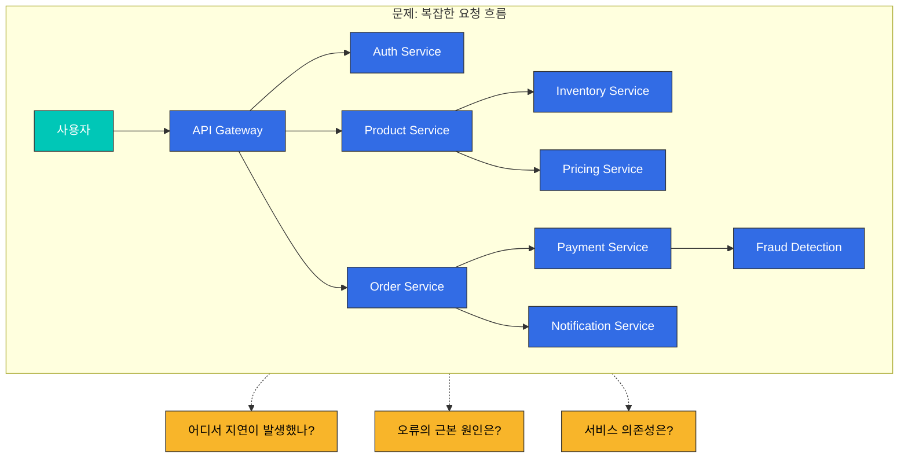
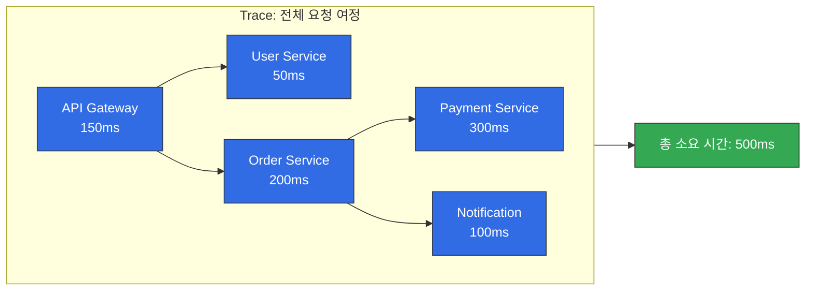
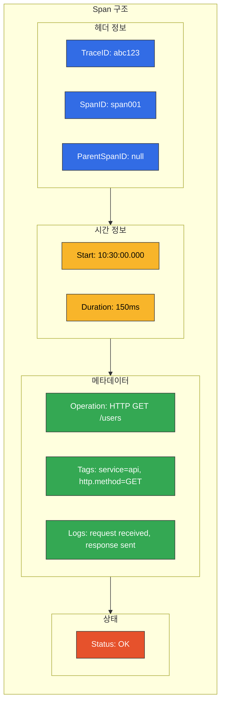
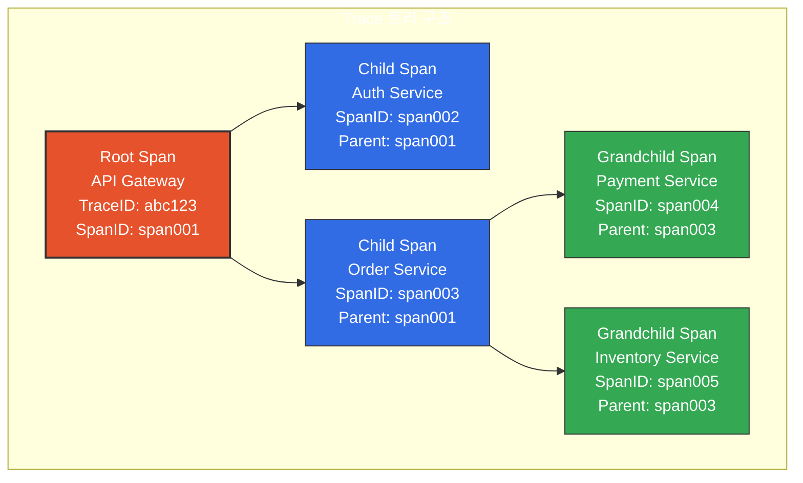
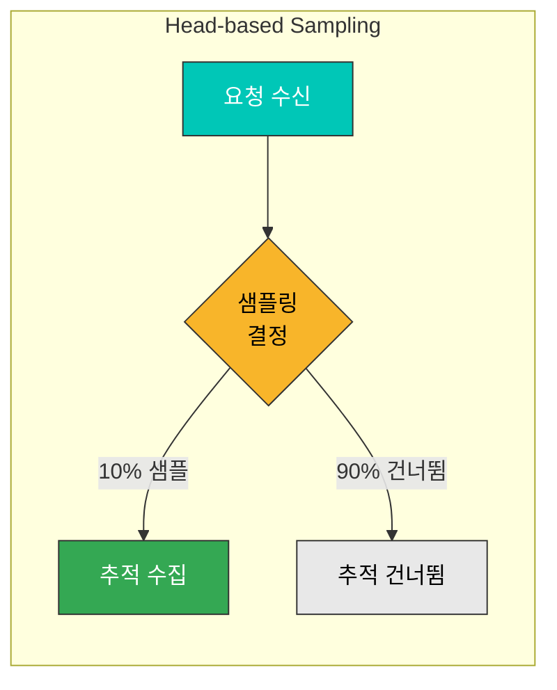
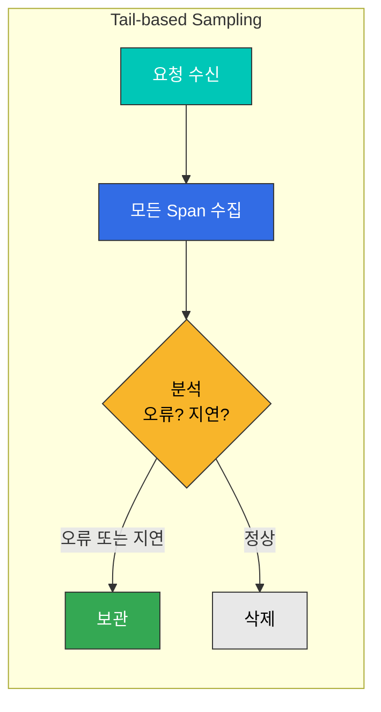
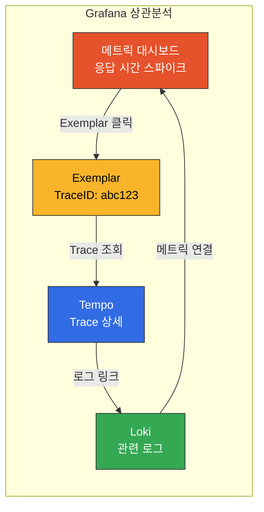
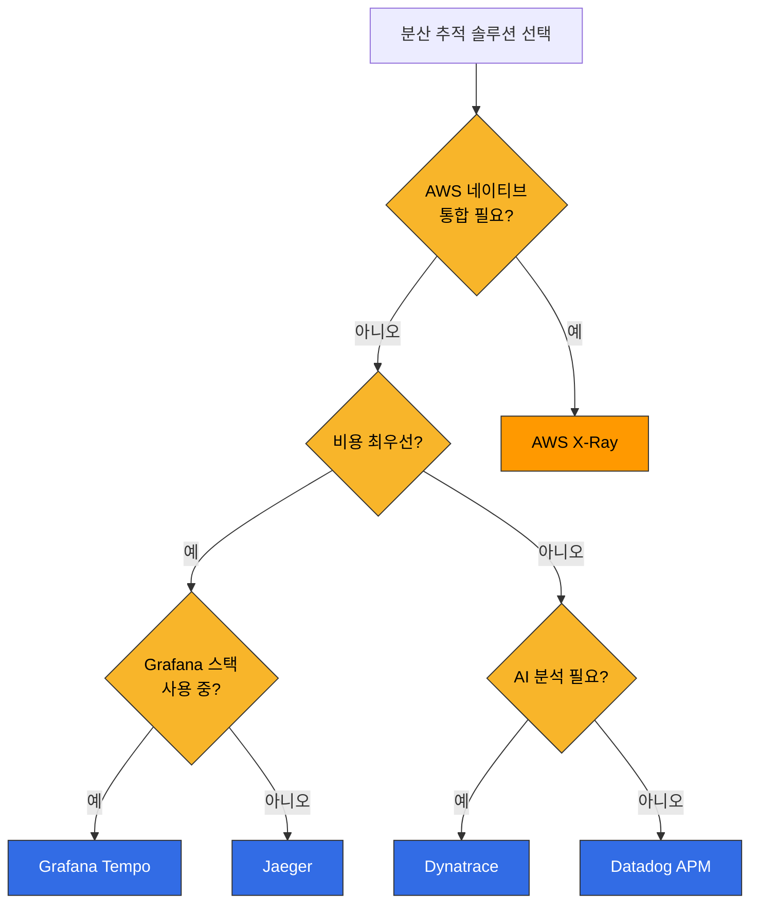

# 분산 추적 개요

> **마지막 업데이트**: 2025년 2월

## 소개

분산 추적(Distributed Tracing)은 마이크로서비스 아키텍처에서 요청이 여러 서비스를 거쳐 처리되는 전체 경로를 추적하는 기술입니다. 단일 요청이 수십 개의 서비스를 통과할 수 있는 현대 시스템에서, 분산 추적은 성능 병목 식별과 문제 해결에 필수적입니다.

## 분산 추적의 필요성

### 기존 모니터링의 한계

마이크로서비스 환경에서 기존 로깅과 메트릭만으로는 다음 질문에 답하기 어렵습니다:

- 요청이 어떤 서비스들을 거쳤는가?
- 각 서비스에서 얼마나 시간이 걸렸는가?
- 어디서 오류가 발생했는가?
- 서비스 간 의존성은 어떻게 되는가?



## 핵심 개념

### 1. Trace (추적)

Trace는 단일 요청의 전체 여정을 나타냅니다. 하나의 요청이 시스템을 통과하면서 생성되는 모든 작업의 집합입니다.



### 2. Span (스팬)

Span은 하나의 작업 단위를 나타냅니다. 각 Span은 다음 정보를 포함합니다:

| 필드 | 설명 | 예시 |
|-----|------|-----|
| **TraceID** | 전체 추적의 고유 식별자 | `abc123def456` |
| **SpanID** | 개별 Span의 고유 식별자 | `span789` |
| **ParentSpanID** | 부모 Span의 식별자 | `span456` |
| **Operation Name** | 작업 이름 | `HTTP GET /api/users` |
| **Start Time** | 시작 시간 | `2025-02-15T10:30:00Z` |
| **Duration** | 소요 시간 | `150ms` |
| **Tags** | 메타데이터 | `http.status_code=200` |
| **Logs** | 이벤트 기록 | `error: connection timeout` |



### 3. Span 관계와 계층 구조

Span들은 부모-자식 관계를 형성하여 트리 구조를 이룹니다:



### 4. SpanContext (스팬 컨텍스트)

SpanContext는 서비스 간에 전파되는 추적 정보입니다:

```yaml
# SpanContext 구성 요소
SpanContext:
  trace_id: "abc123def456789"      # 전체 추적 식별자
  span_id: "span789"               # 현재 Span 식별자
  trace_flags: "01"                # 샘플링 플래그
  trace_state: "vendor=value"      # 벤더별 추가 정보
```

## Context Propagation (컨텍스트 전파)

서비스 간에 추적 컨텍스트를 전달하는 방식입니다.

### W3C Trace Context (권장)

W3C 표준 헤더를 사용한 전파:

```http
# HTTP 요청 헤더
traceparent: 00-abc123def456789012345678901234-span12345678-01
tracestate: rojo=00f067aa0ba902b7,congo=t61rcWkgMzE
```

**traceparent 형식:**
```
version-trace_id-parent_id-trace_flags
00     -abc123...-span1234...-01
```

### B3 Propagation (Zipkin 호환)

Zipkin에서 사용하는 전파 형식:

```http
# 단일 헤더 형식
b3: abc123def456789-span12345678-1-parent12345678

# 다중 헤더 형식
X-B3-TraceId: abc123def456789
X-B3-SpanId: span12345678
X-B3-ParentSpanId: parent12345678
X-B3-Sampled: 1
```

### 전파 방식 비교

| 형식 | 헤더 | 장점 | 단점 |
|-----|------|-----|-----|
| **W3C Trace Context** | `traceparent`, `tracestate` | 표준, 확장 가능 | 상대적으로 새로움 |
| **B3 Single** | `b3` | 간단, 단일 헤더 | Zipkin 특화 |
| **B3 Multi** | `X-B3-*` | 디버깅 용이 | 헤더 수 많음 |
| **Jaeger** | `uber-trace-id` | Jaeger 최적화 | 벤더 종속 |

## 샘플링 전략

모든 요청을 추적하면 비용과 성능 문제가 발생합니다. 샘플링을 통해 이를 관리합니다.

### Head-based Sampling (헤드 기반)

요청 시작 시점에 샘플링 결정:



**장점:**
- 구현이 간단함
- 오버헤드가 낮음
- 일관된 샘플링 결정

**단점:**
- 중요한 요청을 놓칠 수 있음
- 오류나 지연이 발생한 요청도 건너뛸 수 있음

**구성 예시:**
```yaml
# OpenTelemetry SDK 설정
sampling:
  type: parentbased_traceidratio
  ratio: 0.1  # 10% 샘플링
```

### Tail-based Sampling (테일 기반)

요청 완료 후 결과를 보고 샘플링 결정:



**장점:**
- 중요한 요청(오류, 지연)을 놓치지 않음
- 더 지능적인 샘플링
- 비용 효율적

**단점:**
- 구현이 복잡함
- 메모리 사용량이 높음
- 모든 Span을 임시 저장해야 함

**OTEL Collector Tail Sampling 구성:**
```yaml
processors:
  tail_sampling:
    decision_wait: 10s
    num_traces: 100000
    policies:
      # 오류 요청은 모두 수집
      - name: errors
        type: status_code
        status_code:
          status_codes: [ERROR]
      # 느린 요청 수집
      - name: slow-requests
        type: latency
        latency:
          threshold_ms: 1000
      # 나머지는 10% 샘플링
      - name: probabilistic
        type: probabilistic
        probabilistic:
          sampling_percentage: 10
```

### 샘플링 전략 비교

| 전략 | 결정 시점 | 리소스 사용 | 정확도 | 사용 사례 |
|-----|---------|-----------|--------|---------|
| **Head-based** | 요청 시작 | 낮음 | 중간 | 대부분의 경우 |
| **Tail-based** | 요청 완료 | 높음 | 높음 | 오류/지연 중심 |
| **Adaptive** | 동적 | 중간 | 높음 | 트래픽 변동 큰 경우 |

## 트레이스-로그-메트릭 상관분석

### TraceID를 통한 로그 연결

```java
// Java 로깅 예시 (SLF4J + MDC)
import org.slf4j.MDC;
import io.opentelemetry.api.trace.Span;

public void processOrder(Order order) {
    Span span = Span.current();
    MDC.put("traceId", span.getSpanContext().getTraceId());
    MDC.put("spanId", span.getSpanContext().getSpanId());

    logger.info("Processing order: {}", order.getId());
    // 로그 출력: {"traceId": "abc123", "spanId": "span456", "message": "Processing order: 12345"}
}
```

### Exemplar를 통한 메트릭 연결

```yaml
# Prometheus 메트릭에 TraceID 연결
http_request_duration_seconds_bucket{le="0.5"} 1000 # {traceID="abc123"}
http_request_duration_seconds_bucket{le="1.0"} 1500 # {traceID="def456"}
```

### Grafana에서의 상관분석



## 솔루션 비교

### 분산 추적 솔루션 비교표

| 기능 | Tempo | X-Ray | Jaeger | Datadog APM | Dynatrace |
|-----|-------|-------|--------|-------------|-----------|
| **유형** | 오픈소스 | AWS 관리형 | 오픈소스 | 상용 SaaS | 상용 SaaS |
| **저장소** | Object Storage | AWS 내부 | Cassandra/ES | Datadog | Dynatrace |
| **쿼리 언어** | TraceQL | Filter Expressions | - | - | DQL |
| **샘플링** | Head/Tail | 규칙 기반 | Head | 동적 | 동적 |
| **OTEL 지원** | 네이티브 | 네이티브 | 네이티브 | 네이티브 | 네이티브 |
| **서비스 맵** | Grafana 연동 | 내장 | 내장 | 내장 | 내장 |
| **AI 분석** | 없음 | 없음 | 없음 | Watchdog | Davis AI |
| **비용** | 스토리지 비용만 | 사용량 기반 | 인프라 비용 | 호스트/스팬 기반 | 호스트 기반 |
| **EKS 통합** | 수동 구성 | 네이티브 | 수동 구성 | 에이전트 배포 | OneAgent |

### 선택 가이드



## Best Practices

### 1. 계측 전략

```yaml
# 권장 계측 범위
instrumentation:
  # 항상 계측
  always:
    - HTTP 요청/응답
    - gRPC 호출
    - 데이터베이스 쿼리
    - 메시지 큐 작업
    - 외부 API 호출

  # 선택적 계측
  optional:
    - 내부 함수 호출
    - 캐시 작업
    - 파일 I/O
```

### 2. Span 네이밍 규칙

```yaml
# 좋은 예시
- "HTTP GET /api/users/{id}"
- "PostgreSQL SELECT users"
- "Redis GET user:123"
- "Kafka SEND orders"

# 나쁜 예시
- "http call"
- "db query"
- "process"
- "span1"
```

### 3. 태그 표준화

```yaml
# OpenTelemetry Semantic Conventions
tags:
  # HTTP
  http.method: GET
  http.url: https://api.example.com/users
  http.status_code: 200

  # Database
  db.system: postgresql
  db.statement: SELECT * FROM users
  db.operation: SELECT

  # Service
  service.name: user-service
  service.version: 1.2.3
```

## 다음 단계

분산 추적의 개념을 이해했다면, 다음 섹션에서 구체적인 도구 사용법을 학습하세요:

- [Grafana Tempo](./01-tempo.md): Grafana 스택의 분산 추적 백엔드
- [AWS X-Ray](./02-xray.md): AWS 네이티브 분산 추적
- [OpenTelemetry](./03-opentelemetry.md): 표준화된 계측 프레임워크
- [Dynatrace](./04-dynatrace.md): AI 기반 APM 솔루션

## 퀴즈

이 장에서 배운 내용을 테스트하려면 각 도구별 퀴즈를 풀어보세요:
- [Tempo 퀴즈](../../quizzes/observability/tracing/01-tempo-quiz.md)
- [X-Ray 퀴즈](../../quizzes/observability/tracing/02-xray-quiz.md)
- [OpenTelemetry 퀴즈](../../quizzes/observability/tracing/03-opentelemetry-quiz.md)
- [Dynatrace 퀴즈](../../quizzes/observability/tracing/04-dynatrace-quiz.md)
